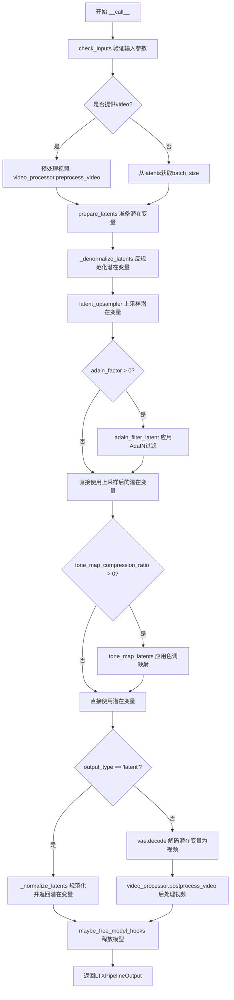
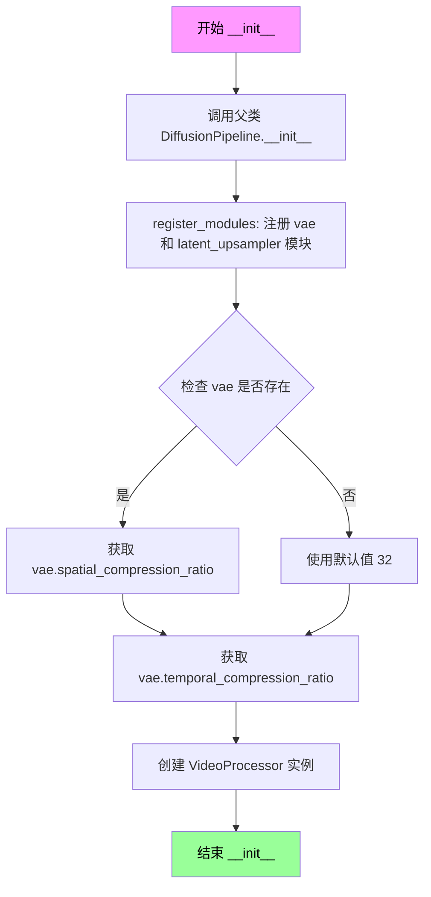
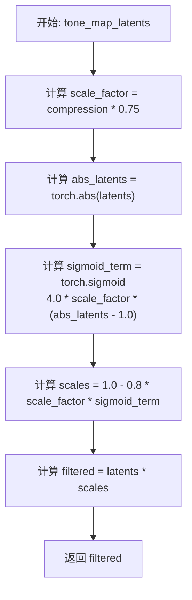
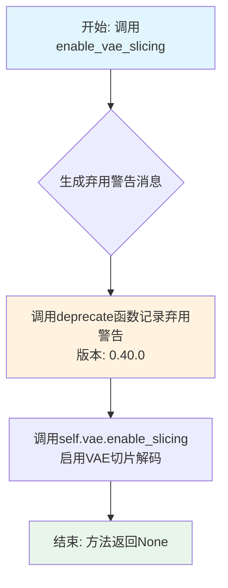
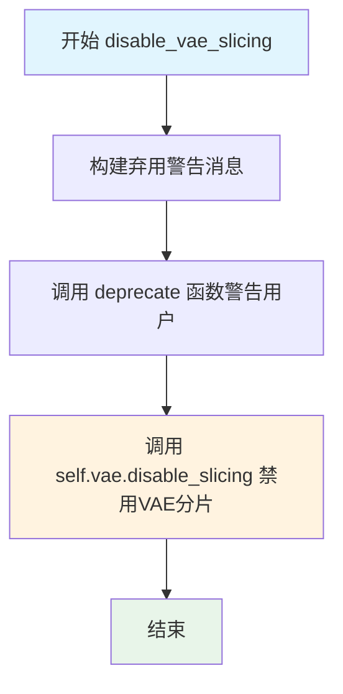
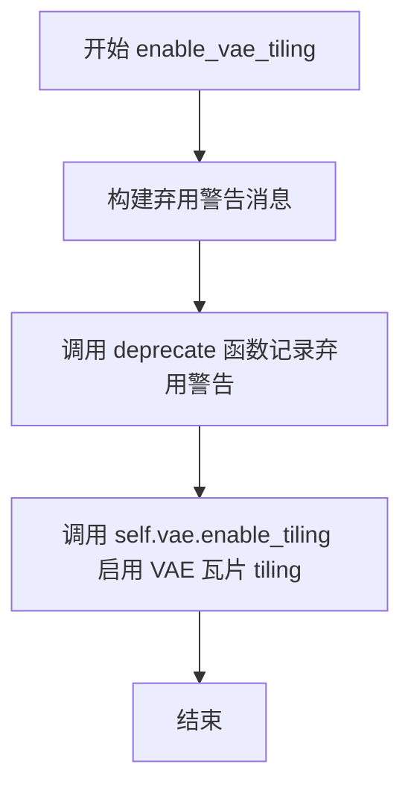
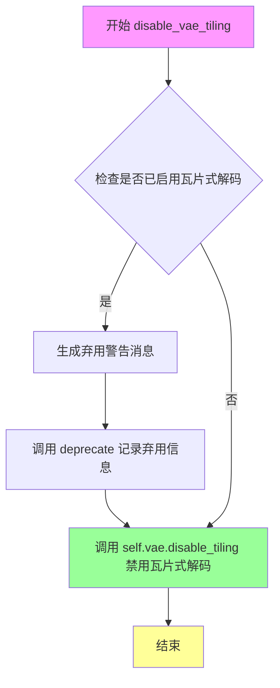
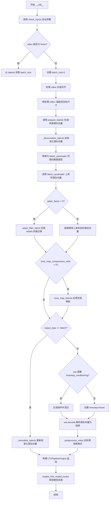

# `diffusers\src\diffusers\pipelines\ltx\pipeline_ltx_latent_upsample.py` 详细设计文档

LTXVideo潜在上采样管道，用于将低分辨率的视频潜在表示上采样到更高分辨率，支持AdaIN风格过滤和色调映射处理。

## 整体流程



## 类结构

```
DiffusionPipeline (基类)
└── LTXLatentUpsamplePipeline (主类)
```

## 全局变量及字段


### `logger`
    
模块级日志记录器，用于记录管道运行过程中的日志信息

类型：`logging.Logger`
    


### `LTXLatentUpsamplePipeline.model_cpu_offload_seq`
    
模型CPU卸载顺序，定义模型在CPU和GPU之间移动的顺序

类型：`str`
    


### `LTXLatentUpsamplePipeline.vae`
    
视频变分自编码器，用于对视频进行编码和解码

类型：`AutoencoderKLLTXVideo`
    


### `LTXLatentUpsamplePipeline.latent_upsampler`
    
潜在上采样模型，用于对潜在表示进行上采样处理

类型：`LTXLatentUpsamplerModel`
    


### `LTXLatentUpsamplePipeline.vae_spatial_compression_ratio`
    
VAE空间压缩比，表示视频帧在空间维度上的压缩比例

类型：`int`
    


### `LTXLatentUpsamplePipeline.vae_temporal_compression_ratio`
    
VAE时间压缩比，表示视频在时间维度上的压缩比例

类型：`int`
    


### `LTXLatentUpsamplePipeline.video_processor`
    
视频处理器，用于视频的预处理和后处理操作

类型：`VideoProcessor`
    
    

## 全局函数及方法


### `retrieve_latents`

从编码器输出中检索潜在分布样本，根据采样模式从潜在分布中采样或返回众数，或直接返回预存的潜在张量。

参数：

- `encoder_output`：`torch.Tensor`，编码器的输出结果，通常包含 `latent_dist` 或 `latents` 属性
- `generator`：`torch.Generator | None`，用于随机采样的生成器，默认为 None
- `sample_mode`：`str`，采样模式，可选值为 `"sample"`（从分布采样）或 `"argmax"`（返回众数），默认为 `"sample"`

返回值：`torch.Tensor`，检索到的潜在张量

#### 流程图

```mermaid
flowchart TD
    A[开始: retrieve_latents] --> B{encoder_output 是否具有 latent_dist 属性?}
    B -->|是| C{sample_mode == 'sample'?}
    B -->|否| D{encoder_output 是否具有 latents 属性?}
    C -->|是| E[返回 encoder_output.latent_dist.sample<br/>(generator)]
    C -->|否| F{sample_mode == 'argmax'?}
    F -->|是| G[返回 encoder_output.latent_dist.mode<br/>()]
    F -->|否| H[抛出 AttributeError]
    D -->|是| I[返回 encoder_output.latents]
    D -->|否| H
    E --> J[结束]
    G --> J
    I --> J
    H --> J
```

#### 带注释源码

```python
# 从 diffusers.pipelines.stable_diffusion.pipeline_stable_diffusion_img2img 复制
def retrieve_latents(
    encoder_output: torch.Tensor, generator: torch.Generator | None = None, sample_mode: str = "sample"
):
    """
    从编码器输出中检索潜在分布样本。

    Args:
        encoder_output: 编码器输出张量，通常来自 VAE 编码器
        generator: 可选的随机生成器，用于采样
        sample_mode: 采样模式，"sample" 从分布采样，"argmax" 返回众数

    Returns:
        torch.Tensor: 潜在张量

    Raises:
        AttributeError: 当 encoder_output 不包含 latent_dist 或 latents 属性时
    """
    # 检查编码器输出是否具有 latent_dist 属性（表示输出为分布）
    if hasattr(encoder_output, "latent_dist") and sample_mode == "sample":
        # 从潜在分布中采样（随机采样）
        return encoder_output.latent_dist.sample(generator)
    # 如果模式为 argmax，返回分布的众数（确定性输出）
    elif hasattr(encoder_output, "latent_dist") and sample_mode == "argmax":
        return encoder_output.latent_dist.mode()
    # 检查编码器输出是否直接具有 latents 属性（预计算的潜在向量）
    elif hasattr(encoder_output, "latents"):
        return encoder_output.latents
    # 如果无法访问所需的潜在表示，抛出错误
    else:
        raise AttributeError("Could not access latents of provided encoder_output")
```


### `LTXLatentUpsamplePipeline.__init__`

这是LTXLatentUpsamplePipeline类的构造函数，用于初始化视频潜在上采样流水线。它接受VAE编码器和潜在上采样器模型作为参数，注册这些模块，并设置视频处理器的压缩比参数。

参数：

- `self`：隐式参数，类实例本身
- `vae`：`AutoencoderKLLTXVideo`，用于编码视频的VAE模型
- `latent_upsampler`：`LTXLatentUpsamplerModel`，用于上采样潜在表示的模型

返回值：`None`，构造函数无返回值

#### 流程图



#### 带注释源码

```python
def __init__(
    self,
    vae: AutoencoderKLLTXVideo,
    latent_upsampler: LTXLatentUpsamplerModel,
) -> None:
    """
    初始化LTXLatentUpsamplePipeline流水线。
    
    参数:
        vae: AutoencoderKLLTXVideo模型，用于视频编码/解码
        latent_upsampler: LTXLatentUpsamplerModel，用于潜在空间上采样
    """
    # 调用父类DiffusionPipeline的初始化方法
    super().__init__()
    
    # 将vae和latent_upsampler注册为Pipeline的可管理模块
    # 这样它们可以被pipeline统一管理（如CPU/GPU迁移、模型hooks等）
    self.register_modules(vae=vae, latent_upsampler=latent_upsampler)
    
    # 设置VAE的空间压缩比（默认32）
    # 如果vae存在则使用其属性，否则使用硬编码的默认值32
    self.vae_spatial_compression_ratio = (
        self.vae.spatial_compression_ratio if getattr(self, "vae", None) is not None else 32
    )
    
    # 设置VAE的时间压缩比（默认8）
    # 用于视频帧的时间维度压缩
    self.vae_temporal_compression_ratio = (
        self.vae.temporal_compression_ratio if getattr(self, "vae", None) is not None else 8
    )
    
    # 创建VideoProcessor实例，用于视频预处理和后处理
    # vae_scale_factor对应空间压缩比，用于正确缩放视频尺寸
    self.video_processor = VideoProcessor(vae_scale_factor=self.vae_spatial_compression_ratio)
```


### `LTXLatentUpsamplePipeline.prepare_latents`

该方法是 LTX 视频潜在上采样管道的核心组件，负责将输入视频或预计算的潜在向量转换为管道所需的标准化潜在表示。当提供原始视频时，该方法使用 VAE 进行编码并归一化；当直接提供潜在向量时，仅进行设备和数据类型转换。

参数：

- `self`：隐式参数，LTXLatentUpsamplePipeline 实例自身
- `video`：`torch.Tensor | None`，原始输入视频张量，形状为 [B, C, F, H, W]，若提供 latents 则可为 None
- `batch_size`：`int = 1`，期望的批处理大小，用于验证生成器列表长度
- `dtype`：`torch.dtype | None`，潜在向量的目标数据类型
- `device`：`torch.device | None`，潜在向量的目标设备
- `generator`：`torch.Generator | None | list[torch.Generator]`，随机数生成器，用于 VAE 编码时的采样，可为单个或列表
- `latents`：`torch.Tensor | None`，预计算的潜在向量，若提供则直接返回转换后的版本

返回值：`torch.Tensor`，标准化后的潜在向量张量，形状为 [B, C, F, H, W]

#### 流程图

```mermaid
flowchart TD
    A[开始 prepare_latents] --> B{latents 是否已提供?}
    B -->|是| C[将 latents 移动到目标设备并转换 dtype]
    C --> Z[返回 latents]
    B -->|否| D[将 video 移动到目标设备]
    D --> E{generator 是否为列表?}
    E -->|是| F[验证 generator 列表长度与 batch_size 是否匹配]
    F --> G[遍历批次: 对每个 video[i] 调用 VAE encode 并使用对应的 generator[i] 提取 latents]
    E -->|否| H[遍历 video: 对每个 vid 调用 VAE encode 并使用 generator 提取 latents]
    G --> I[沿 dim=0 拼接所有 init_latents]
    H --> I
    I --> J[转换到目标 dtype]
    J --> K[调用 _normalize_latents 使用 VAE 的 mean 和 std 进行归一化]
    K --> Z
```

#### 带注释源码

```python
def prepare_latents(
    self,
    video: torch.Tensor | None = None,
    batch_size: int = 1,
    dtype: torch.dtype | None = None,
    device: torch.device | None = None,
    generator: torch.Generator | None = None,
    latents: torch.Tensor | None = None,
) -> torch.Tensor:
    """
    准备用于管道后续处理的潜在向量。
    
    两种工作模式：
    1. 直接模式：如果提供了 latents，则仅进行设备/类型转换
    2. 编码模式：如果提供了 video，则通过 VAE 编码并归一化
    
    Args:
        video: 原始视频张量 [B, C, F, H, W]
        batch_size: 期望的批处理大小
        dtype: 目标数据类型
        device: 目标设备
        generator: 随机生成器，支持单个或列表
        latents: 预计算的潜在向量
    
    Returns:
        标准化后的潜在向量张量 [B, C, F, H, W]
    """
    # 模式1：直接返回预计算的 latents（仅做设备/dtype 转换）
    if latents is not None:
        return latents.to(device=device, dtype=dtype)

    # 模式2：从视频编码生成 latents
    # 将视频移动到目标设备，使用 VAE 的数据类型
    video = video.to(device=device, dtype=self.vae.dtype)
    
    # 处理生成器有两种情况：
    # 情况A：传入生成器列表（每个样本独立的随机种子）
    if isinstance(generator, list):
        # 验证生成器数量与批大小匹配
        if len(generator) != batch_size:
            raise ValueError(
                f"You have passed a list of generators of length {len(generator)}, but requested an effective batch"
                f" size of {batch_size}. Make sure the batch size matches the length of the generators."
            )

        # 对批处理中的每个视频帧分别编码
        # video[i].unsqueeze(0) 将 [C,F,H,W] 扩展为 [1,C,F,H,W] 以满足 VAE 输入格式
        init_latents = [
            retrieve_latents(self.vae.encode(video[i].unsqueeze(0)), generator[i]) 
            for i in range(batch_size)
        ]
    else:
        # 情况B：单个生成器用于所有样本
        # 对每个视频帧分别编码
        init_latents = [
            retrieve_latents(self.vae.encode(vid.unsqueeze(0)), generator) 
            for vid in video
        ]

    # 拼接所有编码后的 latents，形成批处理维度
    # 结果形状: [batch_size, C, F, H, W]
    init_latents = torch.cat(init_latents, dim=0).to(dtype)
    
    # 使用 VAE 的统计信息（均值和标准差）进行归一化
    # 这是扩散模型正常工作的关键步骤
    init_latents = self._normalize_latents(
        init_latents, 
        self.vae.latents_mean, 
        self.vae.latents_std
    )
    return init_latents
```


### `LTXLatentUpsamplePipeline.adain_filter_latent`

该方法实现了自适应实例归一化（AdaIN），通过从参考潜在张量中提取风格统计信息（均值和标准差），对输入潜在张量进行归一化处理，并通过混合因子控制原始与变换后潜在表示的融合程度。

参数：

- `self`：隐式参数，指向 `LTXLatentUpsamplePipeline` 类的实例
- `latents`：`torch.Tensor`，输入的待归一化潜在张量
- `reference_latents`：`torch.Tensor`，提供风格统计信息（均值和标准差）的参考潜在张量
- `factor`：`float`，混合因子，控制原始潜在表示与 AdaIN 变换后潜在表示的融合比例，范围 -10.0 到 10.0，默认值为 1.0

返回值：`torch.Tensor`，经过 AdaIN 变换并融合后的潜在张量

#### 流程图

```mermaid
flowchart TD
    A[开始 adain_filter_latent] --> B[克隆输入 latents 到 result]
    B --> C[遍历批次维度 i: 0 to batch_size-1]
    C --> D[遍历通道维度 c: 0 to channels-1]
    D --> E[计算 reference_latents 的标准差 r_sd 和均值 r_mean]
    D --> F[计算 result 的标准差 i_sd 和均值 i_mean]
    E --> G[应用 AdaIN 变换: result[i,c] = ((result[i,c] - i_mean) / i_sd) * r_sd + r_mean]
    F --> G
    G --> H{遍历是否结束}
    H -->|否| D
    H -->|是| I[使用 lerp 混合原始 latents 和 result, 混合因子为 factor]
    I --> J[返回最终 result]
```

#### 带注释源码

```python
def adain_filter_latent(self, latents: torch.Tensor, reference_latents: torch.Tensor, factor: float = 1.0):
    """
    Applies Adaptive Instance Normalization (AdaIN) to a latent tensor based on statistics from a reference latent
    tensor.

    Args:
        latent (`torch.Tensor`):
            Input latents to normalize
        reference_latents (`torch.Tensor`):
            The reference latents providing style statistics.
        factor (`float`):
            Blending factor between original and transformed latent. Range: -10.0 to 10.0, Default: 1.0

    Returns:
        torch.Tensor: The transformed latent tensor
    """
    # 克隆输入张量，避免修改原始数据
    result = latents.clone()

    # 遍历批次维度 (batch dimension)
    for i in range(latents.size(0)):
        # 遍历通道维度 (channel dimension)
        for c in range(latents.size(1)):
            # 从参考潜在张量中提取风格统计信息: 标准差和均值
            r_sd, r_mean = torch.std_mean(reference_latents[i, c], dim=None)  # index by original dim order
            # 从当前结果中提取统计信息: 标准差和均值
            i_sd, i_mean = torch.std_mean(result[i, c], dim=None)

            # 应用 AdaIN 公式: 用参考风格统计信息替换输入的统计信息
            # 公式: (x - mean_x) / std_x * std_ref + mean_ref
            result[i, c] = ((result[i, c] - i_mean) / i_sd) * r_sd + r_mean

    # 使用线性插值混合原始潜在张量和 AdaIN 变换后的潜在张量
    # factor=0.0: 完全使用原始 latents
    # factor=1.0: 完全使用 AdaIN 变换后的 result
    # factor 在 0-1 之间: 两者按比例混合
    result = torch.lerp(latents, result, factor)
    return result
```


### `LTXLatentUpsamplePipeline.tone_map_latents`

对潜在张量应用非线性色调映射函数，使用基于 sigmoid 的压缩来减少其动态范围，以实现感知平滑的效果。这对于正则化高方差潜在值或在生成过程中调节输出特别有用，特别是当使用 `compression` 参数控制动态行为时。

参数：

- `latents`：`torch.Tensor`，输入的潜在张量，预期形状任意，值范围大约在 [-1, 1] 或 [0, 1]。
- `compression`：`float`，压缩强度，范围 [0, 1]。0.0 表示无色调映射（恒等变换），1.0 表示完全压缩效果。

返回值：`torch.Tensor`，与输入形状相同的色调映射后的潜在张量。

#### 流程图



#### 带注释源码

```python
def tone_map_latents(self, latents: torch.Tensor, compression: float) -> torch.Tensor:
    """
    Applies a non-linear tone-mapping function to latent values to reduce their dynamic range in a perceptually
    smooth way using a sigmoid-based compression.

    This is useful for regularizing high-variance latents or for conditioning outputs during generation, especially
    when controlling dynamic behavior with a `compression` factor.

    Args:
        latents : torch.Tensor
            Input latent tensor with arbitrary shape. Expected to be roughly in [-1, 1] or [0, 1] range.
        compression : float
            Compression strength in the range [0, 1].
            - 0.0: No tone-mapping (identity transform)
            - 1.0: Full compression effect

    Returns:
        torch.Tensor
            The tone-mapped latent tensor of the same shape as input.
    """
    # 将 [0-1] 范围重新映射到 [0-0.75]，并在一个步骤中应用 sigmoid 压缩
    # 缩放因子最大为 0.75，用于控制压缩强度
    scale_factor = compression * 0.75
    
    # 计算输入潜在值的绝对值，用于对称处理正负值
    abs_latents = torch.abs(latents)

    # Sigmoid 压缩：sigmoid 将大值向 0.2 偏移，小值保持在 ~1.0
    # 当 scale_factor=0 时，sigmoid 项消失；
    # 当 scale_factor=0.75 时，产生完全压缩效果
    # 公式：4.0 * (abs_latents - 1.0) 使得拐点位于 abs_latents=1.0 处
    sigmoid_term = torch.sigmoid(4.0 * scale_factor * (abs_latents - 1.0))
    
    # 计算缩放系数：值越大，缩放越小，从而实现对大幅值（高动态范围）的压缩
    # 0.8 是一个经验系数，用于控制最大压缩程度
    scales = 1.0 - 0.8 * scale_factor * sigmoid_term

    # 将原始潜在值乘以缩放系数，得到色调映射后的结果
    filtered = latents * scales
    return filtered
```


### `LTXLatentUpsamplePipeline._normalize_latents`

该静态方法对输入的潜在变量（Latents）进行标准化处理。它使用预计算的均值和标准差，将潜在变量的分布归一化（Z-Score），并通过缩放因子调整数值范围，以便于后续模型处理。

参数：

-  `latents`：`torch.Tensor`，输入的潜在变量张量，形状通常为 [B, C, F, H, W]。
-  `latents_mean`：`torch.Tensor`，潜在变量的预计算均值，形状为 [C]。
-  `latents_std`：`torch.Tensor`，潜在变量的预计算标准差，形状为 [C]。
-  `scaling_factor`：`float`，缩放因子，默认为 1.0，用于调整归一化后的数值幅度。

返回值：`torch.Tensor`，返回归一化处理后的潜在变量张量，形状与输入 `latents` 相同。

#### 流程图

```mermaid
graph LR
    A[输入: latents, mean, std, scaling_factor] --> B{Reshape & Move to Device}
    B --> C[计算: (latents - mean) * scaling_factor / std]
    C --> D[输出: Normalized latents]
```

#### 带注释源码

```python
@staticmethod
# Copied from diffusers.pipelines.ltx.pipeline_ltx.LTXPipeline._normalize_latents
def _normalize_latents(
    latents: torch.Tensor, latents_mean: torch.Tensor, latents_std: torch.Tensor, scaling_factor: float = 1.0
) -> torch.Tensor:
    # Normalize latents across the channel dimension [B, C, F, H, W]
    # 将均值和标准差reshape为 (1, C, 1, 1, 1) 以便与batch、frame、height、width维度进行广播
    latents_mean = latents_mean.view(1, -1, 1, 1, 1).to(latents.device, latents.dtype)
    latents_std = latents_std.view(1, -1, 1, 1, 1).to(latents.device, latents.dtype)
    # 执行标准化：(x - mean) * scaling_factor / std
    latents = (latents - latents_mean) * scaling_factor / latents_std
    return latents
```


### `LTXLatentUpsamplePipeline._denormalize_latents`

该函数是一个静态方法，用于将已标准化的潜在表示（latents）反规范化回原始分布。它通过减去均值并除以标准差（再乘以缩放因子）的逆操作来还原潜在张量的数值范围，使其恢复到 VAE 编码前的原始尺度。

参数：

- `latents`：`torch.Tensor`，已标准化的潜在张量，形状为 [B, C, F, H, W]，其中 B 是批量大小，C 是通道数，F 是帧数，H 和 W 是空间维度
- `latents_mean`：`torch.Tensor`，VAE 潜在空间的均值向量，用于反规范化的平移操作
- `latents_std`：`torch.Tensor`，VAE 潜在空间的标准差向量，用于反规范化的缩放操作
- `scaling_factor`：`float`，可选参数，默认为 1.0，扩散模型配置中的缩放因子，用于控制潜在空间的数值范围

返回值：`torch.Tensor`，反规范化后的潜在张量，形状与输入相同

#### 流程图

```mermaid
flowchart TD
    A[开始 _denormalize_latents] --> B[输入: latents, latents_mean, latents_std, scaling_factor]
    B --> C[将 latents_mean 视图转换为 (1, -1, 1, 1, 1)]
    C --> D[将 latents_std 视图转换为 (1, -1, 1, 1, 1)]
    D --> E[将 latents_mean 移动到 latents 相同设备并转换 dtype]
    E --> F[将 latents_std 移动到 latents 相同设备并转换 dtype]
    F --> G[计算: latents = latents * latents_std / scaling_factor + latents_mean]
    G --> H[返回反规范化后的 latents]
```

#### 带注释源码

```python
@staticmethod
# Copied from diffusers.pipelines.ltx.pipeline_ltx.LTXPipeline._denormalize_latents
def _denormalize_latents(
    latents: torch.Tensor, latents_mean: torch.Tensor, latents_std: torch.Tensor, scaling_factor: float = 1.0
) -> torch.Tensor:
    # Denormalize latents across the channel dimension [B, C, F, H, W]
    # 将均值向量 reshape 为 (1, -1, 1, 1, 1) 以便广播到 batch 和空间维度
    latents_mean = latents_mean.view(1, -1, 1, 1, 1).to(latents.device, latents.dtype)
    
    # 将标准差向量 reshape 为 (1, -1, 1, 1, 1) 以便广播到 batch 和空间维度
    latents_std = latents_std.view(1, -1, 1, 1, 1).to(latents.device, latents.dtype)
    
    # 执行反规范化: 先乘以标准差除以缩放因子，再加上均值
    # 这是 _normalize_latents 的逆操作: (x - mean) * scale / std -> x
    latents = latents * latents_std / scaling_factor + latents_mean
    
    return latents
```


### `LTXLatentUpsamplePipeline.enable_vae_slicing`

启用VAE切片解码功能。当启用此选项时，VAE会将输入张量分割成多个切片分步计算解码，以节省内存并支持更大的批处理大小。该方法已被弃用，内部实际调用`self.vae.enable_slicing()`。

参数：无需额外参数（隐式接收`self`实例）

返回值：`None`，无返回值

#### 流程图



#### 带注释源码

```python
def enable_vae_slicing(self):
    r"""
    Enable sliced VAE decoding. When this option is enabled, the VAE will split the input tensor in slices to
    compute decoding in several steps. This is useful to save some memory and allow larger batch sizes.
    """
    # 构建弃用警告消息，包含类名以帮助用户定位调用位置
    depr_message = f"Calling `enable_vae_slicing()` on a `{self.__class__.__name__}` is deprecated and this method will be removed in a future version. Please use `pipe.vae.enable_slicing()`."
    
    # 调用deprecate工具函数记录弃用警告
    # 参数: 方法名, 弃用版本号, 警告消息
    deprecate(
        "enable_vae_slicing",
        "0.40.0",
        depr_message,
    )
    
    # 实际执行: 委托给VAE模型的enable_slicing方法
    # 这是真正启用VAE切片解码的逻辑
    self.vae.enable_slicing()
```


### `LTXLatentUpsamplePipeline.disable_vae_slicing`

禁用分片VAE解码。如果之前启用了`enable_vae_slicing`，此方法将使解码回到单步计算。

参数：
- 无（仅包含隐式参数`self`）

返回值：`None`，无返回值

#### 流程图



#### 带注释源码

```
def disable_vae_slicing(self):
    r"""
    Disable sliced VAE decoding. If `enable_vae_slicing` was previously enabled, this method will go back to
    computing decoding in one step.
    """
    # 构建弃用警告消息，告知用户该方法将在未来版本中移除
    # 建议用户直接使用 pipe.vae.disable_slicing() 代替
    depr_message = f"Calling `disable_vae_slicing()` on a `{self.__class__.__name__}` is deprecated and this method will be removed in a future version. Please use `pipe.vae.disable_slicing()`."
    
    # 调用 deprecate 函数记录弃用信息，在版本 0.40.0 时完全移除
    deprecate(
        "disable_vae_slicing",      # 被弃用的方法名
        "0.40.0",                    # 计划移除版本
        depr_message,                # 弃用原因说明
    )
    
    # 实际执行禁用VAE分片操作
    # 调用底层 VAE 模型的 disable_slicing 方法
    self.vae.disable_slicing()
```


### `LTXLatentUpsamplePipeline.enable_vae_tiling`

启用瓦片式 VAE 解码。当启用此选项时，VAE 将输入张量分割成瓦片，以多个步骤计算解码和编码。这对于节省大量内存并允许处理更大的图像非常有用。

参数：
- 无

返回值：`None`，无返回值（该方法直接调用 `self.vae.enable_tiling()` 并通过 `deprecate` 函数记录弃用警告）

#### 流程图



#### 带注释源码

```
def enable_vae_tiling(self):
    r"""
    Enable tiled VAE decoding. When this option is enabled, the VAE will split the input tensor into tiles to
    compute decoding and encoding in several steps. This is useful for saving a large amount of memory and to allow
    processing larger images.
    """
    # 构建弃用警告消息，提示用户该方法已弃用，应使用 pipe.vae.enable_tiling()
    depr_message = f"Calling `enable_vae_tiling()` on a `{self.__class__.__name__}` is deprecated and this method will be removed in a future version. Please use `pipe.vae.enable_tiling()`."
    
    # 调用 deprecate 函数记录弃用警告
    # 参数：方法名, 弃用版本号, 弃用消息
    deprecate(
        "enable_vae_tiling",
        "0.40.0",
        depr_message,
    )
    
    # 调用底层 VAE 模型的 enable_tiling 方法启用瓦片式解码
    self.vae.enable_tiling()
```


### `LTXLatentUpsamplePipeline.disable_vae_tiling`

该方法用于禁用瓦片式VAE解码。如果之前启用了瓦片式VAE解码，调用此方法后将恢复为单步解码模式。该方法已被弃用，建议直接使用 `pipe.vae.disable_tiling()`。

参数： 无

返回值：`None`，无返回值（该方法修改对象内部状态）

#### 流程图



#### 带注释源码

```python
def disable_vae_tiling(self):
    r"""
    Disable tiled VAE decoding. If `enable_vae_tiling` was previously enabled, this method will go back to
    computing decoding in one step.
    
    该方法用于禁用瓦片式VAE解码。当之前通过enable_vae_tiling启用瓦片式解码后，
    调用此方法可恢复到单步解码模式。注意：此方法已弃用，将在未来版本中移除。
    """
    # 构建弃用警告消息，包含类名和推荐使用的新方法
    depr_message = f"Calling `disable_vae_tiling()` on a `{self.__class__.__name__}` is deprecated and this method will be removed in a future version. Please use `pipe.vae.disable_tiling()`."
    
    # 调用deprecate工具函数记录弃用信息，标记在0.40.0版本弃用
    deprecate(
        "disable_vae_tiling",      # 被弃用的方法名
        "0.40.0",                   # 弃用版本号
        depr_message,              # 弃用警告消息
    )
    
    # 调用VAE模型的disable_tiling方法实际禁用瓦片式解码
    # 这是真正执行禁用操作的核心逻辑
    self.vae.disable_tiling()
```


### `LTXLatentUpsamplePipeline.check_inputs`

该方法是一个输入验证函数，用于在管道执行前检查用户提供的参数是否合法，确保视频/潜变量的维度、互斥关系和压缩比参数都在有效范围内。

参数：

- `video`：`list[PipelineImageInput] | None`，待处理的输入视频数据
- `height`：`int`，输出视频的高度（像素）
- `width`：`int`，输出视频的宽度（像素）
- `latents`：`torch.Tensor | None`，预计算的潜在表示张量
- `tone_map_compression_ratio`：`float`，色调映射压缩比，范围 [0, 1]

返回值：`None`，该方法不返回值，仅通过抛出 ValueError 来指示验证失败

#### 流程图

```mermaid
flowchart TD
    A[开始 check_inputs] --> B{检查 height 和 width}
    B --> C{height % vae_spatial_compression_ratio == 0<br/>且 width % vae_spatial_compression_ratio == 0?}
    C -->|否| D[抛出 ValueError:<br/>height 和 width 必须被 32 整除]
    C -->|是| E{检查 video 和 latents}
    E --> F{video is not None<br/>且 latents is not None?}
    F -->|是| G[抛出 ValueError:<br/>video 和 latents 只能提供其中一个]
    F -->|否| H{video is None<br/>且 latents is None?}
    H -->|是| I[抛出 ValueError:<br/>video 或 latents 必须提供一个]
    H -->|否| J{检查 tone_map_compression_ratio}
    J --> K{0 <= tone_map_compression_ratio <= 1?}
    K -->|否| L[抛出 ValueError:<br/>tone_map_compression_ratio 必须在 [0, 1] 范围内]
    K -->|是| M[验证通过，方法结束]
    D --> M
    G --> M
    I --> M
    L --> M
```

#### 带注释源码

```python
def check_inputs(self, video, height, width, latents, tone_map_compression_ratio):
    """
    验证管道输入参数的合法性。
    
    检查项：
    1. height 和 width 必须能被 vae_spatial_compression_ratio 整除
    2. video 和 latents 互斥，不能同时提供也不能同时缺失
    3. tone_map_compression_ratio 必须在 [0, 1] 范围内
    """
    # 检查视频尺寸是否满足空间压缩比要求
    # VAE 的空间压缩比决定了潜在空间的网格划分，必须整除以保证完整的上采样
    if height % self.vae_spatial_compression_ratio != 0 or width % self.vae_spatial_compression_ratio != 0:
        raise ValueError(f"`height` and `width` have to be divisible by 32 but are {height} and {width}.")

    # 检查 video 和 latents 的互斥关系：只能提供其中之一
    if video is not None and latents is not None:
        raise ValueError("Only one of `video` or `latents` can be provided.")
    
    # 确保至少提供了其中之一作为输入
    if video is None and latents is None:
        raise ValueError("One of `video` or `latents` has to be provided.")

    # 验证色调映射压缩比在有效范围内
    if not (0 <= tone_map_compression_ratio <= 1):
        raise ValueError("`tone_map_compression_ratio` must be in the range [0, 1]")
```


### `LTXLatentUpsamplePipeline.__call__`

这是 LTX 视频潜在上采样管道的主入口方法，接收原始视频或潜在向量，经过潜在空间上采样、AdaIN 风格迁移、色调映射等处理，最后通过 VAE 解码器重建高质量视频帧。

参数：

- `video`：`list[PipelineImageInput] | None`，输入的原始视频帧列表
- `height`：`int = 512`，输出视频的高度像素值
- `width`：`int = 704`，输出视频的宽度像素值
- `latents`：`torch.Tensor | None`，可选的预计算潜在向量，与 video 二选一
- `decode_timestep`：`float | list[float] = 0.0`，VAE 解码时的时间步条件，用于时间步条件化的 VAE
- `decode_noise_scale`：`float | list[float] | None`，解码时混合噪声的比例因子，控制重建质量
- `adain_factor`：`float = 0.0`，AdaIN 风格迁移因子，0 表示不使用风格迁移
- `tone_map_compression_ratio`：`float = 0.0`，色调映射压缩比，范围 [0,1]，用于调整潜在向量的动态范围
- `generator`：`torch.Generator | list[torch.Generator] | None`，随机数生成器，用于潜在向量采样
- `output_type`：`str | None = "pil"`：输出格式，可选 "pil"、"np"、"latent" 等
- `return_dict`：`bool = True`，是否返回 PipelineOutput 对象而非元组

返回值：`LTXPipelineOutput`，包含处理后的视频帧序列

#### 流程图



#### 带注释源码

```python
@torch.no_grad()
def __call__(
    self,
    video: list[PipelineImageInput] | None = None,
    height: int = 512,
    width: int = 704,
    latents: torch.Tensor | None = None,
    decode_timestep: float | list[float] = 0.0,
    decode_noise_scale: float | list[float] | None = None,
    adain_factor: float = 0.0,
    tone_map_compression_ratio: float = 0.0,
    generator: torch.Generator | list[torch.Generator] | None = None,
    output_type: str | None = "pil",
    return_dict: bool = True,
):
    """
    LTX 视频潜在上采样管道的主调用方法。
    
    处理流程:
    1. 验证输入参数有效性
    2. 将原始视频编码为潜在向量（如果提供 video）
    3. 对潜在向量进行上采样
    4. 可选应用 AdaIN 风格迁移和色调映射
    5. 通过 VAE 解码器重建视频帧
    6. 后处理并返回结果
    """
    
    # 步骤1: 验证输入参数的有效性
    # 检查尺寸对齐、video/latents 二选一、压缩比范围等
    self.check_inputs(
        video=video,
        height=height,
        width=width,
        latents=latents,
        tone_map_compression_ratio=tone_map_compression_ratio,
    )

    # 步骤2: 确定批处理大小
    if video is not None:
        # 批量视频输入尚未测试/支持，暂时设为1
        batch_size = 1
    else:
        # 从预提供的潜在向量获取批大小
        batch_size = latents.shape[0]
    
    # 获取执行设备（CPU 或 GPU）
    device = self._execution_device

    # 步骤3: 预处理视频（如果提供了原始视频）
    if video is not None:
        # 获取视频帧数量
        num_frames = len(video)
        
        # 检查帧数是否符合 VAE 时间压缩比要求 (k * 8 + 1)
        # LTX 视频编码要求帧数为 8 的倍数加 1
        if num_frames % self.vae_temporal_compression_ratio != 1:
            # 调整帧数至符合要求的长度并截断
            num_frames = (
                num_frames // self.vae_temporal_compression_ratio * self.vae_temporal_compression_ratio + 1
            )
            video = video[:num_frames]
            logger.warning(
                f"Video length expected to be of the form `k * {self.vae_temporal_compression_ratio} + 1` but is {len(video)}. Truncating to {num_frames} frames."
            )
        
        # 视频预处理：缩放到目标分辨率，转换为 float32 张量
        video = self.video_processor.preprocess_video(video, height=height, width=width)
        video = video.to(device=device, dtype=torch.float32)

    # 步骤4: 准备潜在向量
    # 如果提供了 video，则编码为潜在向量；如果直接提供 latents，则进行类型/设备转换
    latents = self.prepare_latents(
        video=video,
        batch_size=batch_size,
        dtype=torch.float32,
        device=device,
        generator=generator,
        latents=latents,
    )

    # 步骤5: 反标准化潜在向量
    # 将潜在向量从标准化状态恢复为原始 latent_upsampler 期望的分布
    latents = self._denormalize_latents(
        latents, self.vae.latents_mean, self.vae.latents_std, self.vae.config.scaling_factor
    )
    
    # 转换为潜在上采样器所需的数据类型（如 float16）
    latents = latents.to(self.latent_upsampler.dtype)
    
    # 执行潜在空间上采样（空间分辨率提升）
    latents_upsampled = self.latent_upsampler(latents)

    # 步骤6: 可选的 AdaIN 风格迁移
    # 根据参考潜在向量的统计信息调整上采样后的潜在向量
    if adain_factor > 0.0:
        latents = self.adain_filter_latent(latents_upsampled, latents, adain_factor)
    else:
        latents = latents_upsampled

    # 步骤7: 可选的色调映射压缩
    # 应用 sigmoid 压缩函数减少潜在向量的动态范围
    if tone_map_compression_ratio > 0.0:
        latents = self.tone_map_latents(latents, tone_map_compression_ratio)

    # 步骤8: 输出处理
    if output_type == "latent":
        # 直接返回潜在向量（不进行 VAE 解码）
        latents = self._normalize_latents(
            latents, self.vae.latents_mean, self.vae.latents_std, self.vae.config.scaling_factor
        )
        video = latents
    else:
        # 需要通过 VAE 解码为视频帧
        
        # 检查 VAE 是否需要时间步条件化
        if not self.vae.config.timestep_conditioning:
            # 无条件化解码，不需要时间步
            timestep = None
        else:
            # 需要时间步条件化，准备噪声和混合参数
            
            # 生成与潜在向量形状相同的随机噪声
            noise = randn_tensor(latents.shape, generator=generator, device=device, dtype=latents.dtype)
            
            # 确保 decode_timestep 和 decode_noise_scale 为列表形式
            if not isinstance(decode_timestep, list):
                decode_timestep = [decode_timestep] * batch_size
            if decode_noise_scale is None:
                # 默认使用与时间步相同的噪声比例
                decode_noise_scale = decode_timestep
            elif not isinstance(decode_noise_scale, list):
                decode_noise_scale = [decode_noise_scale] * batch_size

            # 创建时间步张量 [B]
            timestep = torch.tensor(decode_timestep, device=device, dtype=latents.dtype)
            
            # 创建噪声比例张量 [B, 1, 1, 1, 1] 用于广播
            decode_noise_scale = torch.tensor(decode_noise_scale, device=device, dtype=latents.dtype)[
                :, None, None, None, None
            ]
            
            # 线性插值混合原始潜在向量和噪声: output = (1-scale)*latent + scale*noise
            latents = (1 - decode_noise_scale) * latents + decode_noise_scale * noise

        # 调用 VAE 解码器将潜在向量解码为视频帧
        # 返回元组 (video,)，取第一个元素
        video = self.vae.decode(latents, timestep, return_dict=False)[0]
        
        # 后处理视频格式（转换为 PIL/numpy/pt 等格式）
        video = self.video_processor.postprocess_video(video, output_type=output_type)

    # 步骤9: 释放模型资源（CPU offload）
    self.maybe_free_model_hooks()

    # 步骤10: 返回结果
    if not return_dict:
        # 兼容旧版返回元组格式
        return (video,)

    # 返回结构化输出对象
    return LTXPipelineOutput(frames=video)
```

## 关键组件


### 张量索引与潜在表示提取

使用 `retrieve_latents` 函数从 encoder_output 中提取潜在表示，支持多种模式（sample/argmax）以及直接访问 latents 属性，实现灵活的潜在向量获取机制。

### AdaIN 风格化滤波

`adain_filter_latent` 方法实现自适应实例归一化，通过参考潜在表示的统计信息（均值和标准差）对当前潜在表示进行风格迁移，支持融合因子控制风格化强度。

### 色调映射压缩

`tone_map_latents` 方法使用基于 Sigmoid 的非线性压缩函数对潜在表示进行色调映射，可降低动态范围，支持 0-1 范围的压缩强度调节，用于正则化高方差潜在表示。

### VAE 切片与平铺优化

提供 `enable_vae_slicing`、`disable_vae_slicing`、`enable_vae_tiling`、`disable_vae_tiling` 方法，支持 VAE 解码的内存优化策略，通过分片或分块处理大规模潜在表示。

### 潜在表示标准化/反标准化

`_normalize_latents` 和 `_denormalize_` 方法实现潜在表示的标准化和反标准化操作，基于通道维度的均值和标准差进行缩放，支持配置化的缩放因子。

### 视频潜在上采样主流程

`__call__` 方法整合完整的上采样管道，包括输入预处理、潜在表示准备、上采样模型推理、AdaIN 风格化、色调映射和 VAE 解码，支持多种输出类型（latent/pil）和条件解码机制。


## 问题及建议


### 已知问题

- **低效的 AdaIN 实现**：`adain_filter_latent` 方法使用嵌套 Python for 循环遍历张量的批次和通道维度，未利用 PyTorch 的向量化操作，导致性能较差。
- **魔法数字缺乏解释**：`tone_map_latents` 方法中包含多个硬编码的魔法数字（如 0.75、4.0、1.0、0.8），缺乏文档说明，影响代码可读性和可维护性。
- **弃用方法未清理**：`enable_vae_slicing`、`disable_vae_slicing`、`enable_vae_tiling`、`disable_vae_tiling` 方法已标记为弃用（0.40.0 版本），但仍保留在代码中，增加维护负担。
- **prepare_latents 中的低效循环**：处理视频时逐帧调用 `vae.encode` 并使用 `unsqueeze(0)`，未利用批量编码优化性能。
- **配置访问缺乏空值检查**：直接访问 `self.vae.config.scaling_factor` 和 `self.vae.latents_mean`，未考虑配置缺失或属性不存在的情况。
- **冗余的归一化/反归一化代码**：`_normalize_latents` 和 `_denormalize_latents` 方法结构高度相似，存在代码重复。
- **未处理的边界情况**：视频长度为空的场景未处理，可能导致后续运行时错误。
- **类型提示不一致**：`retrieve_latents` 函数中 `sample_mode` 参数缺少类型提示。

### 优化建议

- **向量化 AdaIN 操作**：使用 PyTorch 的 `torch.std_mean` 和张量运算替代嵌套循环，实现真正的批量处理。
- **提取魔法数字为常量**：将 `tone_map_latents` 中的硬编码值定义为类常量或配置参数，并添加详细文档。
- **移除弃用方法**：按照弃用计划（0.40.0 版本）移除已标记的方法，或提供迁移路径。
- **批量编码优化**：重构 `prepare_latents` 以支持批量视频编码，减少循环调用开销。
- **增加配置空值检查**：在访问 VAE 配置属性前添加防御性检查或使用 `getattr` 提供默认值。
- **提取公共逻辑**：将归一化/反归一化中的公共逻辑抽取为辅助函数，减少代码重复。
- **添加输入验证**：在 `__call__` 方法开头增加视频列表为空或其他边界情况的检查。
- **完善类型提示**：为所有函数参数添加完整的类型注解，提高代码质量。

## 其它


### 设计目标与约束

本管道的设计目标是实现视频 latent 空间的 upsampling，将低分辨率的 latent 表示上采样到更高分辨率，同时支持可选的 AdaIN 风格迁移和 tone-mapping 压缩。设计约束包括：输入视频长度需满足 `k * temporal_compression_ratio + 1` 的形式；height 和 width 必须能被 spatial_compression_ratio (32) 整除；tone_map_compression_ratio 必须在 [0, 1] 范围内；video 和 latents 不能同时提供。

### 错误处理与异常设计

管道在多个环节进行错误检测：在 `check_inputs` 中验证视频尺寸 divisibility、video/latents 互斥关系、compression_ratio 范围；在 `prepare_latents` 中检查 generator list 长度与 batch_size 匹配；`retrieve_latents` 会在无法获取 latents 时抛出 AttributeError。弃用的方法（enable_vae_slicing 等）通过 `deprecate` 发出警告并在未来版本移除。

### 数据流与状态机

数据流如下：输入 (video 或 latents) → preprocess_video (可选) → prepare_latents (编码视频获取 latents 或直接使用输入 latents) → _denormalize_latents → latent_upsampler 上采样 → adain_filter_latent (可选) → tone_map_latents (可选) → _normalize_latents (若 output_type="latent") 或 vae.decode → postprocess_video → 输出。状态主要受 output_type、adain_factor、tone_map_compression_ratio 参数控制。

### 外部依赖与接口契约

依赖以下外部模块：`AutoencoderKLLTXVideo` (VAE 模型)、`LTXLatentUpsamplerModel` (上采样模型)、`VideoProcessor` (视频预处理/后处理)、`DiffusionPipeline` (基类)、`PipelineImageInput` (输入类型)、`LTXPipelineOutput` (输出类型)。接口契约：输入 video 为 PipelineImageInput list 或 None，输入 latents 为 torch.Tensor 或 None；输出为 LTXPipelineOutput (包含 frames) 或 tuple。

### 配置参数说明

关键配置参数包括：height/width (输出视频尺寸，必须能被 32 整除)、decode_timestep (解码时间步，用于 timestep conditioning)、decode_noise_scale (解码噪声尺度，用于噪声混合)、adain_factor (AdaIN 融合因子，范围 0-10，默认 0.0 禁用)、tone_map_compression_ratio (tone-mapping 压缩比，范围 0-1)、output_type (输出类型，支持 "pil"/"pt"/"latent" 等)。

### 性能考量

VAE 支持 sliced decoding 和 tiling 以节省内存；video 被截断为 temporal_compression_ratio 的整数倍加一，以优化编码效率；batch_size 默认为 1（视频输入未完全支持批处理）；使用 model_cpu_offload_seq 进行模型卸载管理。潜在优化方向：支持批量视频输入、更多 output_type 选项。

### 安全性与权限

代码遵循 Apache License 2.0；无敏感数据处理；模型 offload 需要正确管理设备避免内存泄漏。

### 版本兼容性

弃用警告针对 0.40.0 版本：enable_vae_slicing、disable_vae_slicing、enable_vae_tiling、disable_vae_tiling 方法将在未来版本移除，建议直接调用 vae 对应的方法。

### 与其他管道的关系

本管道继承自 DiffusionPipeline，是 LTX 视频处理流程的一部分。上游可能是 LTXPipeline（生成初始 latents），下游输出可直接用于视频显示或后续处理。retrieve_latents、_normalize_latents、_denormalize_latents 方法从 LTXPipeline 复制而来，确保一致性。

    