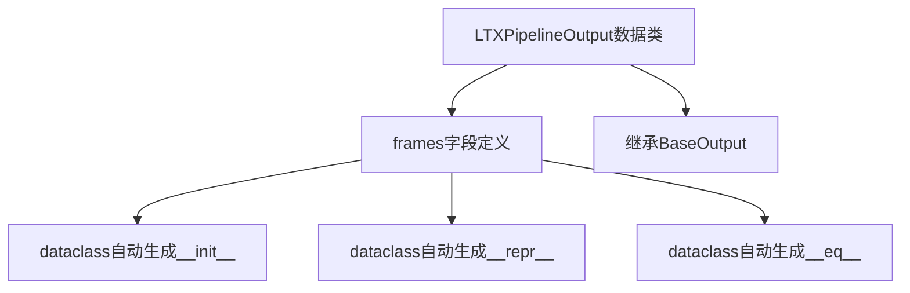

# `diffusers\src\diffusers\pipelines\ltx\pipeline_output.py` 详细设计文档

这是一个用于LTX视频生成管道的输出类（LTXPipelineOutput），继承自diffusers库的BaseOutput数据结构，用于封装和传递生成的视频帧数据（frames），支持torch.Tensor、numpy数组或PIL图像列表格式。

## 整体流程



## 类结构

```
BaseOutput (diffusers基类)
└── LTXPipelineOutput (数据类)
```

## 全局变量及字段


### `LTXPipelineOutput.frames`
    
视频输出帧，可以是嵌套列表（batch_size, num_frames）的PIL图像序列，也可以是NumPy数组或Torch张量，形状为(batch_size, num_frames, channels, height, width)

类型：`torch.Tensor`
    
    

## 全局函数及方法


## 关键组件


### LTXPipelineOutput 类

用于LTX视频生成管道的输出数据容器，封装去噪后的视频帧结果

### BaseOutput 父类

diffusers库中的基础输出类，提供统一的数据结构接口

### frames 字段

存储去噪后的视频帧，支持torch.Tensor、np.ndarray或PIL.Image列表格式

### dataclass 装饰器

Python数据类装饰器，自动生成__init__、__repr__等方法，简化数据结构定义


## 问题及建议


### 已知问题

-   **类型注解不一致**：`frames`字段的类型注解仅为`torch.Tensor`，但文档字符串中声明它可以是`torch.Tensor`、`np.ndarray`或`list[list[PIL.Image.Image]]`，类型定义与文档描述不匹配。
-   **缺乏输入验证**：类中未实现`__post_init__`方法，无法在实例化时验证`frames`的类型、形状或有效性，可能导致下游处理出错。
-   **可变数据类型**：未使用`frozen=True`配置，数据类默认可变，可能导致意外修改和难以追踪的副作用。
-   **文档冗余**：文档字符串中描述的类型信息未能在代码类型注解中体现，造成维护困难和文档与实现脱节。
-   **功能单一**：仅包含输出数据结构，未考虑扩展性，如可能需要同时输出中间结果（latents、hidden states等）。

### 优化建议

-   **统一类型定义**：使用`Union`类型或`TypeVar`来准确表达多类型支持，如`Union[torch.Tensor, np.ndarray, list[list[PIL.Image.Image]]]`，或创建自定义类型别名。
-   **添加数据验证**：实现`__post_init__`方法，验证`frames`的有效性（如非空、维度符合视频格式要求等），并提供清晰的错误信息。
-   **启用不可变性**：将`@dataclass`修改为`@dataclass(frozen=True)`，确保实例不可变，提高线程安全性和代码可靠性。
-   **补充类型提示**：为复杂类型添加`from __future__ import annotations`以支持字符串形式注解，或使用`typing.IO`处理图像序列。
-   **考虑扩展性**：根据LTX模型特性，可选地添加`latents`、`hidden_states`等可选字段，以支持更细粒度的输出控制。
-   **添加序列化方法**：考虑实现`to_dict()`或`to_json()`方法，便于调试和日志记录。


## 其它


### 设计目标与约束

本类旨在为LTX视频生成管道提供标准化的输出数据结构，继承Diffusers框架的BaseOutput基类，确保与框架其他组件的一致性和互操作性。设计约束包括：仅支持PyTorch张量格式的frames输出，不支持直接处理PIL图像或NumPy数组（需在管道其他组件中完成格式转换）。

### 错误处理与异常设计

本类为纯数据容器，不涉及复杂业务逻辑，暂无直接错误处理需求。若frames参数类型不符合torch.Tensor，调用方应在管道上游进行类型校验和转换。继承的BaseOutput基类提供了基础的数据验证机制。

### 数据流与状态机

数据流：LTXPipeline执行去噪过程后，将生成的视频帧序列封装为LTXPipelineOutput对象输出。frames张量形状通常为(batch_size, num_frames, channels, height, width)。本类不维护状态，仅作为不可变数据传输对象。

### 外部依赖与接口契约

主要依赖项：1) torch库，提供Tensor数据结构；2) diffusers.utils.BaseOutput，框架基础输出类。接口契约：frames属性必须为torch.Tensor类型，调用方需保证数据合法性。

### 性能考虑

本类为轻量级数据容器，仅存储引用而非深拷贝，理论上不会引入显著性能开销。若管道中存在大量输出对象批量创建，建议考虑使用__slots__进一步优化内存占用。

### 安全性考虑

本类不涉及敏感数据处理，frames张量内容安全性由上游管道保证。建议调用方在跨进程传输或序列化时注意Tensor设备的匹配性（CPU vs CUDA）。

### 可扩展性设计

当前仅包含frames字段。若需扩展，可考虑：1) 添加辅助字段如latents（潜在表示）；2) 添加元数据字段如generation_parameters；3) 通过继承实现不同输出格式的变体。

### 使用示例

```python
import torch
from ltx_pipeline import LTXPipeline, LTXPipelineOutput

# 管道输出
output: LTXPipelineOutput = pipeline.generate(prompt="a cat running")
frames = output.frames  # torch.Tensor shape: (1, 16, 3, 512, 512)
```

### 版本信息

初始版本，适配LTX视频生成管道的首个实现。


    