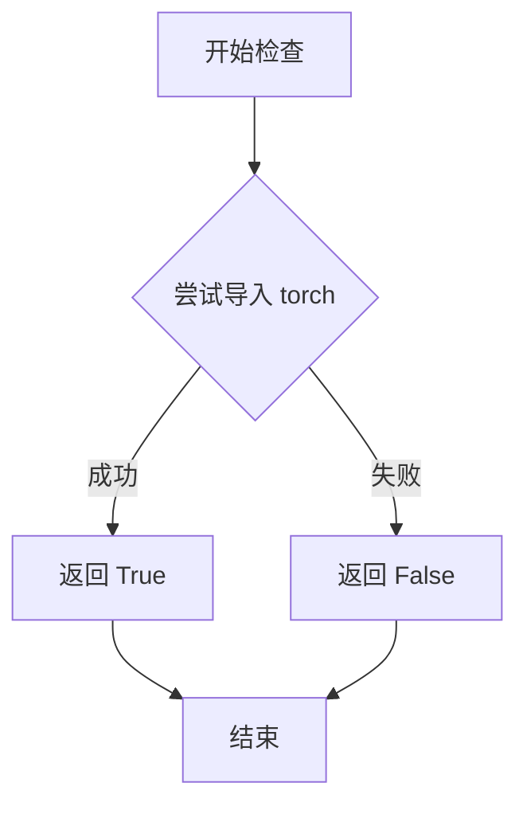
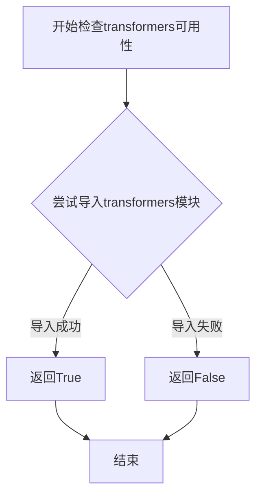
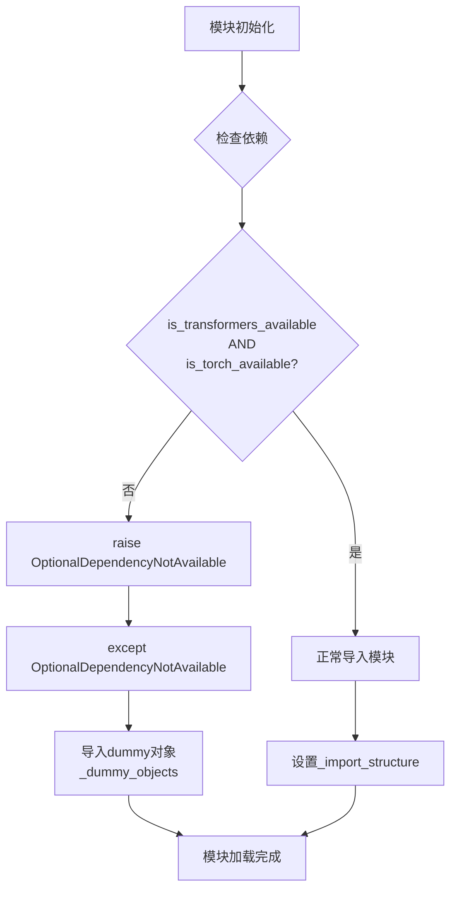

# `diffusers\src\diffusers\pipelines\ltx2\__init__.py` 详细设计文档

这是一个延迟加载模块初始化文件，用于在diffusers库中导入LTX2（视频生成）相关的模型和管道。它通过_LazyModule机制实现可选依赖（torch和transformers）的延迟导入，并在依赖不可用时提供虚拟对象以保持API一致性。

## 整体流程

```mermaid
graph TD
    A[开始] --> B{DIFFUSERS_SLOW_IMPORT 或 TYPE_CHECK?}
    B -- 是 --> C{检查 is_transformers_available() && is_torch_available()}
    C -- 可用 --> D[从子模块导入真实对象: LTX2TextConnectors, LTX2LatentUpsamplerModel, LTX2Pipeline等]
    C -- 不可用 --> E[导入dummy_torch_and_transformers_objects]
    B -- 否 --> F[创建_LazyModule延迟加载模块]
    F --> G[将_dummy_objects添加到sys.modules]
    D --> H[完成导入]
    E --> H
```

## 类结构

```
DiffusersModelsInit
└── _LazyModule (延迟加载机制)
    ├── connectors (LTX2TextConnectors)
    ├── latent_upsampler (LTX2LatentUpsamplerModel)
    ├── pipeline_ltx2 (LTX2Pipeline)
    ├── pipeline_ltx2_image2video (LTX2ImageToVideoPipeline)
    ├── pipeline_ltx2_latent_upsample (LTX2LatentUpsamplePipeline)
    └── vocoder (LTX2Vocoder)
```

## 全局变量及字段


### `_dummy_objects`
    
存储虚拟对象的字典，当torch和transformers可选依赖不可用时使用，用于保持模块接口完整性

类型：`dict`
    


### `_import_structure`
    
定义模块的导入结构，映射子模块名称到对应的类名列表，包含connectors、latent_upsampler、pipeline和vocoder等子模块

类型：`dict`
    


### `DIFFUSERS_SLOW_IMPORT`
    
从utils导入的标志变量，控制是否启用慢速导入模式，影响模块的动态加载行为

类型：`bool`
    


### `TYPE_CHECKING`
    
从typing导入的标志变量，用于类型检查模式，避免在运行时导入类型提示相关的模块

类型：`bool`
    


### `_LazyModule.__name__`
    
懒加载模块的名称属性，存储当前模块的完全限定名称

类型：`str`
    


### `_LazyModule.__file__`
    
懒加载模块的文件路径属性，指向定义该模块的Python源文件位置

类型：`str`
    


### `_LazyModule._import_structure`
    
懒加载模块的导入结构字典，包含模块导出对象的映射关系

类型：`dict`
    


### `_LazyModule.module_spec`
    
懒加载模块的规格对象，包含模块的元数据信息，用于模块导入和懒加载机制

类型：`ModuleSpec`
    
    

## 全局函数及方法


### `get_objects_from_module`

这是一个用于从指定模块中动态提取所有公共对象（如类、函数）的工具函数。在给定的代码中，它主要用于在可选依赖项（如 `torch` 和 `transformers`）不可用时，从 dummy 模块中获取对象列表，以便填充 `_dummy_objects` 字典，从而实现库的延迟加载（Lazy Loading），避免导入时因缺少依赖而直接报错。

参数：

- `module`：`types.ModuleType`（模块对象），需要提取对象的源模块。通常在代码中传入的是 `dummy_torch_and_transformers_objects` 模块。

返回值：`Dict[str, Any]`，返回一个字典，键为对象名称（字符串），值为模块中对应的对象本身。

#### 流程图

```mermaid
graph TD
    A[Start: 输入 Module] --> B[获取模块的所有属性名称: dir(module)]
    C[遍历属性名称] --> D{检查属性名是否以 '_' 开头?}
    D -- 是 --> E[跳过该属性]
    D -- 否 --> F[获取该属性对应的对象: getattr(module, name)]
    F --> G[将名称和对象加入字典]
    G --> C
    C --> H{遍历结束?}
    H -- 否 --> C
    H -- 是 --> I[Return: 返回对象字典]
```

#### 带注释源码

```python
def get_objects_from_module(module):
    """
    从给定模块中提取所有公共对象。
    
    参数:
        module: Python 模块对象 (e.g., import types; types.ModuleType).
        
    返回:
        dict: 一个包含模块中所有非私有属性的字典，键为属性名，值为属性对象。
    """
    objects = {}
    # 遍历模块的所有属性
    for attr_name in dir(module):
        # 过滤掉私有属性（通常以 _ 或 __ 开头）
        if not attr_name.startswith('_'):
            try:
                # 获取属性对象
                attr_obj = getattr(module, attr_name)
                objects[attr_name] = attr_obj
            except AttributeError:
                # 忽略无法获取的属性
                pass
    return objects
```


### `is_torch_available`

检查当前环境是否安装了 PyTorch 库，用于条件导入和可选依赖处理。

参数：

- 无参数

返回值：`bool`，返回 `True` 表示 PyTorch 已安装且可用，返回 `False` 表示未安装或不可用。

#### 流程图



#### 带注释源码

```python
# is_torch_available 函数定义在 ...utils 模块中
# 以下是其在当前文件中的使用方式：

# 导入 is_torch_available 函数
from ...utils import (
    is_torch_available,
    is_transformers_available,
)

# 使用示例 1：条件性检查依赖
if not (is_transformers_available() and is_torch_available()):
    # 如果 transformers 或 torch 不可用，则引发 OptionalDependencyNotAvailable 异常
    raise OptionalDependencyNotAvailable()

# 使用示例 2：在 TYPE_CHECKING 块中条件导入
try:
    if not (is_transformers_available() and is_torch_available()):
        raise OptionalDependencyNotAvailable()
except OptionalDependencyNotAvailable:
    # 导入虚拟对象（dummy objects）作为后备
    from ...utils.dummy_torch_and_transformers_objects import *
else:
    # 当依赖可用时，导入实际的模块和类
    from .connectors import LTX2TextConnectors
    from .latent_upsampler import LTX2LatentUpsamplerModel
    from .pipeline_ltx2 import LTX2Pipeline
    # ... 其他模块导入

# is_torch_available 的典型实现逻辑（位于 ...utils 中）：
"""
def is_torch_available() -> bool:
    # 尝试检查 torch 是否可用
    try:
        import torch
        return True
    except ImportError:
        return False
"""
```


### `is_transformers_available`

该函数是Hugging Face Diffusers库中的一个工具函数，用于检查当前Python环境中是否已安装`transformers`库。它通过尝试导入transformers模块来判断库是否可用，返回布尔值（True表示可用，False表示不可用），从而支持库的可选依赖管理。

参数： 无

返回值：`bool`，返回`True`表示transformers库已安装且可用，返回`False`表示未安装或不可用

#### 流程图



#### 带注释源码

```python
# 该函数定义在 ...utils 模块中
# 以下是基于代码使用方式和常见实现的推断源码

def is_transformers_available() -> bool:
    """
    检查transformers库是否在当前环境中可用
    
    Returns:
        bool: 如果transformers库已安装并可导入返回True，否则返回False
    """
    try:
        # 尝试导入transformers模块
        import transformers
        return True
    except ImportError:
        # 如果导入失败，说明transformers未安装
        return False
```

#### 在代码中的调用示例

```python
# 从 ...utils 导入该函数
from ...utils import is_transformers_available

# 在当前代码中的实际使用方式
if not (is_transformers_available() and is_torch_available()):
    raise OptionalDependencyNotAvailable()
```

#### 设计说明

| 项目 | 说明 |
|------|------|
| **设计目标** | 实现可选依赖的动态检测，支持模块的延迟加载和条件导入 |
| **调用场景** | 用于在导入模块时检查transformers和torch是否同时可用，只有当两者都可用时才导入实际的功能类 |
| **错误处理** | 通过try-except捕获ImportError，返回False而非抛出异常 |
| **依赖关系** | 该函数定义在`...utils`模块中，是Diffusers框架的核心工具函数 |

</content>


### OptionalDependencyNotAvailable

该类是用于表示可选依赖项（torch 和 transformers）不可用的异常类，在模块初始化时通过 try-except 机制捕获此异常，以实现可选依赖的延迟加载和优雅降级。

参数：

- 无（异常类的构造函数参数需查看 utils 模块中的定义，当前代码中未传递参数）

返回值：无（异常类不返回值）

#### 流程图



#### 带注释源码

```python
# 从外部utils模块导入OptionalDependencyNotAvailable异常类
# 该类用于标识可选依赖不可用的状态
from ...utils import (
    DIFFUSERS_SLOW_IMPORT,
    OptionalDependencyNotAvailable,  # <-- 核心：异常类
    _LazyModule,
    get_objects_from_module,
    is_torch_available,
    is_transformers_available,
)

# 初始化空字典用于存储虚拟对象和导入结构
_dummy_objects = {}
_import_structure = {}

# 第一次尝试：运行时依赖检查
try:
    # 如果transformers和torch任一不可用，则抛出异常
    if not (is_transformers_available() and is_torch_available()):
        raise OptionalDependencyNotAvailable()  # <-- 抛出异常
# 捕获异常后，导入dummy对象作为占位符
except OptionalDependencyNotAvailable:
    from ...utils import dummy_torch_and_transformers_objects
    # 更新虚拟对象字典，用于后续模块属性设置
    _dummy_objects.update(get_objects_from_module(dummy_torch_and_transformers_objects))
# 如果依赖可用，则正常设置导入结构
else:
    _import_structure["connectors"] = ["LTX2TextConnectors"]
    _import_structure["latent_upsampler"] = ["LTX2LatentUpsamplerModel"]
    _import_structure["pipeline_ltx2"] = ["LTX2Pipeline"]
    _import_structure["pipeline_ltx2_image2video"] = ["LTX2ImageToVideoPipeline"]
    _import_structure["pipeline_ltx2_latent_upsample"] = ["LTX2LatentUpsamplePipeline"]
    _import_structure["vocoder"] = ["LTX2Vocoder"]

# TYPE_CHECKING块：类型检查时的条件导入（同样的逻辑）
if TYPE_CHECKING or DIFFUSERS_SLOW_IMPORT:
    try:
        if not (is_transformers_available() and is_torch_available()):
            raise OptionalDependencyNotAvailable()
    except OptionalDependencyNotAvailable:
        from ...utils.dummy_torch_and_transformers_objects import *
    else:
        from .connectors import LTX2TextConnectors
        from .latent_upsampler import LTX2LatentUpsamplerModel
        from .pipeline_ltx2 import LTX2Pipeline
        from .pipeline_ltx2_image2video import LTX2ImageToVideoPipeline
        from .pipeline_ltx2_latent_upsample import LTX2LatentUpsamplePipeline
        from .vocoder import LTX2Vocoder

else:
    # 运行时使用LazyModule进行懒加载
    import sys
    sys.modules[__name__] = _LazyModule(
        __name__,
        globals()["__file__"],
        _import_structure,
        module_spec=__spec__,
    )
    # 将dummy对象设置为模块属性，实现优雅降级
    for name, value in _dummy_objects.items():
        setattr(sys.modules[__name__], name, value)
```

#### 补充说明

| 属性 | 说明 |
|------|------|
| 异常类型 | 自定义异常类（继承自Exception） |
| 导入来源 | `...utils.OptionalDependencyNotAvailable` |
| 触发条件 | `is_transformers_available()` 或 `is_torch_available()` 返回 False |
| 处理方式 | 导入dummy对象作为替代，保持API兼容性 |
| 设计目的 | 实现可选依赖的懒加载，核心模块可独立于torch/transformers运行 |

## 关键组件


### 延迟加载模块系统

该代码实现了一个基于`_LazyModule`的惰性加载机制，用于在Diffusers库中按需导入LTX2相关的模型和管道类，同时通过可选依赖检查处理torch和transformers不可用的情况。

### 可选依赖检查与虚拟对象模式

使用`try-except`结构检测`is_transformers_available()`和`is_torch_available()`，当依赖不可用时从`dummy_torch_and_transformers_objects`模块导入虚拟对象，防止导入错误，实现优雅降级。

### 导入结构字典定义

`_import_structure`字典定义了模块的导出结构，包含5个主要组件：connectors(LTX2TextConnectors)、latent_upsampler(LTX2LatentUpsamplerModel)、pipeline_ltx2(LTX2Pipeline)、pipeline_ltx2_image2video(LTX2ImageToVideoPipeline)、pipeline_ltx2_latent_upsample(LTX2LatentUpsamplePipeline)、vocoder(LTX2Vocoder)。

### TYPE_CHECKING分支处理

在类型检查或慢导入模式下，直接导入真实模块供静态分析和类型提示使用，避免触发LazyModule的延迟加载机制。

### 动态模块注册

在非TYPE_CHECKING模式下，通过`sys.modules[__name__] = _LazyModule(...)`将当前模块替换为懒加载模块，并将虚拟对象通过`setattr`动态绑定到模块属性。


## 问题及建议


### 已知问题

-   **重复的条件检查代码**：在try块（运行时导入）和TYPE_CHECKING分支中都重复使用了相同的三行条件检查代码（`if not (is_transformers_available() and is_torch_available()): raise OptionalDependencyNotAvailable()`），违反DRY原则
-   **模块变量初始化顺序问题**：`_import_structure`先初始化为空字典`{}`，然后在else分支中动态添加内容，这种模式在并发或异常情况下可能导致不一致状态
-   **硬编码的条件组合**：多次使用`is_transformers_available() and is_torch_available()`组合条件，未提取为可重用的函数或常量，导致维护成本增加
-   **命名不一致**：导入结构中`connectors`使用复数形式（"LTX2TextConnectors"），但其他模块如`pipeline_ltx2`、`vocoder`等使用单数形式，存在命名规范不统一的问题

### 优化建议

-   **提取公共函数**：将依赖检查逻辑封装为一个函数，如`_check_transformers_and_torch_available()`，在两处调用，减少代码重复
-   **统一命名规范**：建议将`connectors`改为单数形式`connector`，或统一使用复数形式，保持风格一致
-   **简化导入结构**：考虑将`_import_structure`的初始化与赋值合并，使用条件赋值或直接在使用处定义
-   **添加常量定义**：定义一个模块级常量如`_REQUIRED_DEPENDENCIES = ("transformers", "torch")`，提高代码可读性和可维护性

## 其它


### 设计目标与约束

本模块的设计目标是实现LTX2相关模块的延迟加载（Lazy Loading），避免在初始导入时加载所有依赖，从而提升库的导入速度和内存占用。约束条件包括：必须同时满足torch和transformers两个可选依赖才可正常导入，否则使用虚拟对象替代；仅在TYPE_CHECKING或DIFFUSERS_SLOW_IMPORT模式下进行真实导入，其他情况使用_LazyModule进行延迟加载。

### 错误处理与异常设计

采用OptionalDependencyNotAvailable异常处理可选依赖不可用的情况。当torch或transformers任一不可用时，捕获异常并从dummy_torch_and_transformers_objects模块加载虚拟对象（_dummy_objects），确保模块结构完整但功能不可用。TYPE_CHECKING模式下同样进行依赖检查，不可用时导入虚拟对象。

### 数据流与状态机

模块加载流程：首先定义_import_structure字典声明可导出对象 → 检查torch和transformers可用性 → 不可用时填充_dummy_objects，可用时设置_import_structure → 根据导入模式选择真实导入或延迟加载 → 延迟加载模式下将当前模块替换为_LazyModule实例 → 将虚拟对象注入sys.modules。

### 外部依赖与接口契约

外部依赖包括：is_torch_available()、is_transformers_available()、_LazyModule类、get_objects_from_module()函数、OptionalDependencyNotAvailable异常、以及dummy_torch_and_transformers_objects模块。导出接口契约定义在_import_structure字典中，包括connectors、latent_upsampler、pipeline_ltx2、pipeline_ltx2_image2video、pipeline_ltx2_latent_upsample、vocoder六个子模块及其导出类。

### 模块初始化与延迟加载机制

使用_LazyModule实现延迟加载，构造函数参数包括：模块名称(__name__)、文件路径(__file__)、导入结构字典(_import_structure)、模块规格(__spec__)。当代码实际访问模块属性时，_LazyModule会根据_import_structure动态导入对应的子模块，实现按需加载。

### 虚拟对象（Dummy Objects）机制

_dummy_objects字典存储虚拟对象，当可选依赖不可用时，通过get_objects_from_module从dummy_torch_and_transformers_objects模块获取所有虚拟对象。在模块加载完成后，使用setattr将虚拟对象设置为模块属性，确保即使依赖不可用，模块结构仍然完整，访问时返回虚拟对象而非抛出AttributeError。

### 类型检查支持

通过TYPE_CHECKING标志位支持静态类型检查。在类型检查模式下，强制进行真实导入而非延迟加载，确保类型检查器能够正确解析类型信息。DIFFUSERS_SLOW_IMPORT标志提供额外的控制，允许在特定场景下强制使用慢速导入（真实导入）。

### 导入结构设计

_import_structure字典采用分层结构设计，键为子模块名称，值为该模块可导出的对象列表字符串。这种设计支持_LazyModule进行精确的按需导入，同时也便于维护模块的公共接口列表。每个LTX2相关组件对应一个独立的子模块，形成清晰的模块划分。

### 性能考虑

延迟加载机制显著降低了初始导入时间和内存占用，因为只有实际使用的组件才会被加载。虚拟对象机制避免了在依赖不可用时加载实际实现代码。但需要注意，频繁访问未加载的属性可能触发多次导入操作，建议在了解使用意图的情况下提前导入相关模块。

### 版本兼容性考虑

模块依赖版本检查通过is_torch_available()和is_transformers_available()函数实现，这些函数通常由Diffusers库的utils模块提供。不同版本的torch或transformers可能影响LTX2组件的功能兼容性，但模块本身的延迟加载架构对版本变化是透明的。


    