# `diffusers\src\diffusers\pipelines\ltx2\connectors.py` 详细设计文档

LTX 2.0文本连接器模块，实现了1D旋转位置嵌入（RoPE）、1D Transformer块和可学习寄存器机制，用于处理文本编码器的隐藏状态，分别输出视频流和音频流的文本嵌入。

## 整体流程

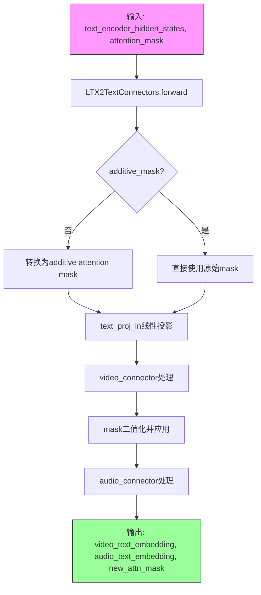

## 类结构

```
LTX2RotaryPosEmbed1d (1D旋转位置嵌入)
LTX2TransformerBlock1d (1D Transformer块)
LTX2ConnectorTransformer1d (1D连接器Transformer)
    └── 使用 LTX2RotaryPosEmbed1d
    └── 使用 LTX2TransformerBlock1d (ModuleList)
LTX2TextConnectors (文本连接器堆栈)
    └── 使用 LTX2ConnectorTransformer1d (video_connector)
    └── 使用 LTX2ConnectorTransformer1d (audio_connector)
```

## 全局变量及字段


### `num_rope_elems`
    
RoPE元素数量 (值为2)

类型：`int`
    


### `freqs_dtype`
    
频率数据类型

类型：`torch.dtype`
    


### `grid_1d`
    
1D位置网格

类型：`torch.Tensor`
    


### `freqs`
    
频率张量

类型：`torch.Tensor`
    


### `cos_freqs`
    
余弦频率

类型：`torch.Tensor`
    


### `sin_freqs`
    
正弦频率

类型：`torch.Tensor`
    


### `num_register_repeats`
    
寄存器重复次数

类型：`int`
    


### `registers`
    
可学习寄存器张量

类型：`torch.Tensor`
    


### `binary_attn_mask`
    
二值化注意力掩码

类型：`torch.Tensor`
    


### `rotary_emb`
    
旋转嵌入

类型：`tuple`
    


### `hidden_states`
    
隐藏状态

类型：`torch.Tensor`
    


### `LTX2RotaryPosEmbed1d.dim`
    
嵌入维度

类型：`int`
    


### `LTX2RotaryPosEmbed1d.base_seq_len`
    
基础序列长度

类型：`int`
    


### `LTX2RotaryPosEmbed1d.theta`
    
RoPE基础频率

类型：`float`
    


### `LTX2RotaryPosEmbed1d.double_precision`
    
是否使用双精度

类型：`bool`
    


### `LTX2RotaryPosEmbed1d.rope_type`
    
RoPE类型 ('interleaved' 或 'split')

类型：`str`
    


### `LTX2RotaryPosEmbed1d.num_attention_heads`
    
注意力头数量

类型：`int`
    


### `LTX2TransformerBlock1d.norm1`
    
第一个归一化层

类型：`torch.nn.RMSNorm`
    


### `LTX2TransformerBlock1d.attn1`
    
注意力层

类型：`LTX2Attention`
    


### `LTX2TransformerBlock1d.norm2`
    
第二个归一化层

类型：`torch.nn.RMSNorm`
    


### `LTX2TransformerBlock1d.ff`
    
前馈网络

类型：`FeedForward`
    


### `LTX2ConnectorTransformer1d.num_attention_heads`
    
注意力头数量

类型：`int`
    


### `LTX2ConnectorTransformer1d.inner_dim`
    
内部维度

类型：`int`
    


### `LTX2ConnectorTransformer1d.causal_temporal_positioning`
    
因果时间定位标志

类型：`bool`
    


### `LTX2ConnectorTransformer1d.num_learnable_registers`
    
可学习寄存器数量

类型：`int | None`
    


### `LTX2ConnectorTransformer1d.learnable_registers`
    
可学习寄存器参数

类型：`torch.nn.Parameter | None`
    


### `LTX2ConnectorTransformer1d.rope`
    
旋转位置嵌入

类型：`LTX2RotaryPosEmbed1d`
    


### `LTX2ConnectorTransformer1d.transformer_blocks`
    
Transformer块列表

类型：`torch.nn.ModuleList`
    


### `LTX2ConnectorTransformer1d.norm_out`
    
输出归一化层

类型：`torch.nn.RMSNorm`
    


### `LTX2ConnectorTransformer1d.gradient_checkpointing`
    
梯度检查点标志

类型：`bool`
    


### `LTX2TextConnectors.text_proj_in`
    
文本投影输入层

类型：`nn.Linear`
    


### `LTX2TextConnectors.video_connector`
    
视频连接器

类型：`LTX2ConnectorTransformer1d`
    


### `LTX2TextConnectors.audio_connector`
    
音频连接器

类型：`LTX2ConnectorTransformer1d`
    
    

## 全局函数及方法


### `torch.arange`

创建从起始值到结束值的连续整数张量，常用于生成位置索引或序列数据。

参数：

- `start`：`int` 或 `float`，起始值（包含），默认为 0
- `end`：`int` 或 `float`，结束值（不包含）
- `step`：`int` 或 `float`，步长，默认为 1
- `dtype`：`torch.dtype`，输出张量的数据类型
- `layout`：`torch.layout`，张量的布局，默认为 `torch.strided`
- `device`：`torch.device`，张量所在的设备（CPU/CUDA）
- `requires_grad`：`bool`，是否需要计算梯度，默认为 `False`

返回值：`torch.Tensor`，从 start 到 end-1（步长为 step）的连续值组成的 1-D 张量

#### 流程图

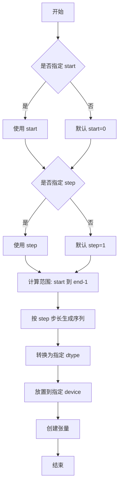

#### 带注释源码

```python
# 代码中 torch.arange 的实际使用示例（来自 LTX2RotaryPosEmbed1d.forward 方法）
grid_1d = torch.arange(pos, dtype=torch.float32, device=device)
```

在 `LTX2RotaryPosEmbed1d` 类中的完整上下文：

```python
def forward(
    self,
    batch_size: int,
    pos: int,
    device: str | torch.device,
) -> tuple[torch.Tensor, torch.Tensor]:
    # 1. 使用 torch.arange 创建从 0 到 pos-1 的连续整数张量
    # 参数说明：
    #   - pos: 结束值（不包含），代表序列长度
    #   - dtype=torch.float32: 输出数据类型为 32 位浮点数
    #   - device: 张量存放的设备（CPU 或 CUDA）
    grid_1d = torch.arange(pos, dtype=torch.float32, device=device)
    
    # 获取相对于 base_seq_len 的分数索引
    grid_1d = grid_1d / self.base_seq_len
    # 扩展为 [batch_size, seq_len] 形状
    grid = grid_1d.unsqueeze(0).repeat(batch_size, 1)  # [batch_size, seq_len]
    
    # ... 后续处理代码
```

#### 使用场景说明

在 LTX2RotaryPosEmbed1d 中，`torch.arange` 用于：
1. 生成 1D 位置索引序列（从 0 到 pos-1）
2. 将位置索引归一化到 [0, 1) 范围（除以 base_seq_len）
3. 作为旋转位置编码（RoPE）的输入基础，用于计算位置相关的频率信息


### `torch.pow`

执行逐元素的幂运算，将输入的基础值（base）按指数（exponent）进行幂运算。

参数：

- `input`：`torch.Tensor` 或 `float`，基础值（底数），可以是标量或张量
- `exponent`：`torch.Tensor` 或 `float`，指数（幂），当 input 为张量时，exponent 可以是相同形状的张量或广播后的形状

返回值：`torch.Tensor`，返回逐元素幂运算的结果，形状由广播规则决定

#### 流程图

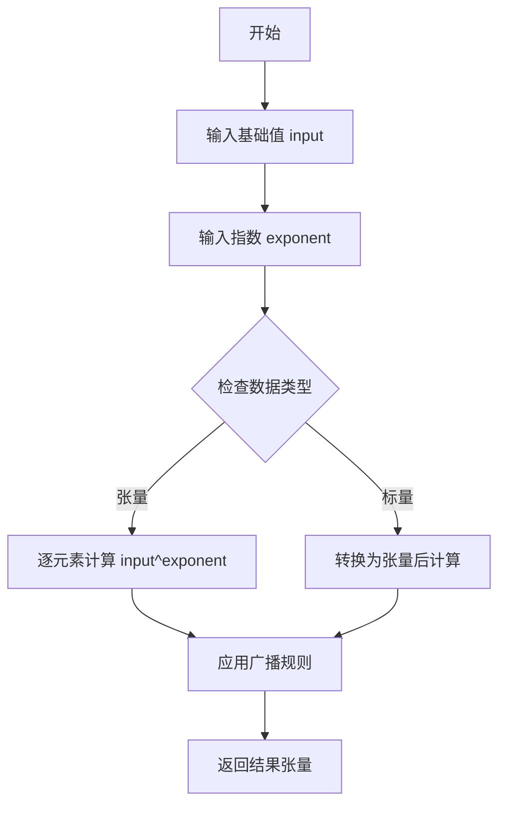

#### 带注释源码

```python
# 在 LTX2RotaryPosEmbed1d.forward 方法中使用 torch.pow 的示例
# 用于计算旋转位置嵌入的频率

# self.theta: float = 10000.0 (旋转嵌入的基础频率)
# torch.linspace(...) 创建从0到1的等差数列张量，元素个数为 dim // 2
pow_indices = torch.pow(
    self.theta,  # 基础值（底数）: float - 旋转嵌入的基准值
    torch.linspace(  # 指数张量: torch.Tensor - 从0到1的等差数列
        start=0.0,   # float - 起始值
        end=1.0,     # float - 结束值
        steps=self.dim // num_rope_elems,  # int - 生成的元素个数
        dtype=freqs_dtype,  # torch.dtype - 数据类型（float64或float32）
        device=device,  # torch.device - 计算设备
    ),
)
# 结果: pow_indices[i] = theta^(i/(dim/2-1)), 用于生成旋转频率

# 后续处理：将频率乘以 pi/2 并转换为 float32
freqs = (pow_indices * torch.pi / 2.0).to(dtype=torch.float32)
```


### `torch.linspace`

在 `LTX2RotaryPosEmbed1d` 类的 `forward` 方法中，`torch.linspace` 用于生成旋转位置编码的频率指数基础值。该函数创建一个从 0.0 到 1.0 的等间距张量，作为 `torch.pow` 函数的输入，用于计算旋转位置编码的频率分量。

参数：

- `start`：`float`，起始值，此处为 `0.0`
- `end`：`float`，结束值，此处为 `1.0`
- `steps`：`int`，生成的样本数量，此处为 `self.dim // num_rope_elems`（即 `self.dim // 2`）
- `dtype`：`torch.dtype`，输出张量的数据类型，此处为 `freqs_dtype`（根据 `double_precision` 参数为 `torch.float64` 或 `torch.float32`）
- `device`：`torch.device`，输出张量所在的设备，此处为 `device`

返回值：`torch.Tensor`，返回一个从 `start` 到 `end` 的等间距一维张量，形状为 `[steps]`

#### 流程图

```mermaid
graph TD
    A[开始调用 torch.linspace] --> B[输入参数: start=0.0, end=1.0, steps=self.dim // 2]
    B --> C{检查 double_precision 参数}
    C -->|True| D[dtype = torch.float64]
    C -->|False| E[dtype = torch.float32]
    D --> F[在指定 device 上创建等间距张量]
    E --> F
    F --> G[返回形状为 [self.dim // 2] 的 1D Tensor]
    G --> H[作为 torch.pow 的输入]
    H --> I[计算旋转位置编码频率]
```

#### 带注释源码

```python
# 在 LTX2RotaryPosEmbed1d.forward 方法中:
# 2. Calculate 1D RoPE frequencies
num_rope_elems = 2  # 1 (because 1D) * 2 (for cos, sin) = 2
freqs_dtype = torch.float64 if self.double_precision else torch.float32
pow_indices = torch.pow(
    self.theta,  # 基础频率，默认 10000.0
    torch.linspace(
        start=0.0,          # 起始值
        end=1.0,            # 结束值
        steps=self.dim // num_rope_elems,  # 样本数量 = self.dim // 2
        dtype=freqs_dtype,  # 数据类型，根据精度设置
        device=device,      # 设备
    ),
)
# torch.linspace 在此处生成从 0 到 1 的等间距指数序列
# 后续通过 torch.pow(self.theta, ...) 计算旋转编码的基础频率
freqs = (pow_indices * torch.pi / 2.0).to(dtype=torch.float32)
```


# LTX2TextConnectors 模块设计文档

## 一段话描述

LTX2TextConnectors 是 LTX 2.0 模型中的文本连接器模块，用于处理视频和音频流的文本编码器隐藏状态，通过 1D 旋转位置嵌入（RoPE）和可学习寄存器机制将文本特征适配到视频生成模型中。

## 文件的整体运行流程

1. **初始化阶段**：创建文本投影层、视频连接器和音频连接器（均为 LTX2ConnectorTransformer1d 实例）
2. **前向传播阶段**：
   - 将输入的文本编码器隐藏状态投影到目标维度
   - 分别通过视频连接器和音频连接器处理
   - 应用注意力掩码并返回处理后的文本嵌入

## 类的详细信息

### LTX2RotaryPosEmbed1d

1D 旋转位置嵌入类，用于生成位置编码。

**类字段：**
- `dim`：`int`，嵌入维度
- `base_seq_len`：`int`，基础序列长度
- `theta`：`float`，旋转基数
- `double_precision`：`bool`，是否使用双精度
- `rope_type`：`str`，RoPE 类型（"interleaved" 或 "split"）
- `num_attention_heads`：`int`，注意力头数量

**类方法：**

#### forward

生成旋转位置嵌入。

- 参数：
  - `batch_size`：`int`，批次大小
  - `pos`：`int`，位置数量/序列长度
  - `device`：`str | torch.device`，设备

- 返回值：`tuple[torch.Tensor, torch.Tensor]`，(cos 频率, sin 频率)

#### 流程图

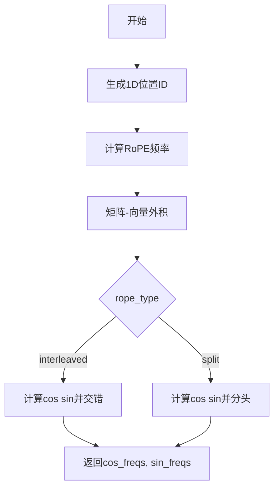

#### 带注释源码

```python
def forward(
    self,
    batch_size: int,
    pos: int,
    device: str | torch.device,
) -> tuple[torch.Tensor, torch.Tensor]:
    # 1. 获取1D位置ID
    grid_1d = torch.arange(pos, dtype=torch.float32, device=device)
    # 相对于base_seq_len的分数索引
    grid_1d = grid_1d / self.base_seq_len
    grid = grid_1d.unsqueeze(0).repeat(batch_size, 1)  # [batch_size, seq_len]

    # 2. 计算1D RoPE频率
    num_rope_elems = 2  # 1 (因为1D) * 2 (cos, sin) = 2
    freqs_dtype = torch.float64 if self.double_precision else torch.float32
    pow_indices = torch.pow(
        self.theta,
        torch.linspace(start=0.0, end=1.0, steps=self.dim // num_rope_elems, dtype=freqs_dtype, device=device),
    )
    freqs = (pow_indices * torch.pi / 2.0).to(dtype=torch.float32)

    # 3. 位置ID (batch_size, seq_len) 和频率向量 (self.dim // 2,) 的矩阵-向量外积
    freqs = (grid.unsqueeze(-1) * 2 - 1) * freqs  # [B, seq_len, self.dim // 2]

    # 4. 获取实数、交错 (cos, sin) 频率，填充到 self.dim
    if self.rope_type == "interleaved":
        cos_freqs = freqs.cos().repeat_interleave(2, dim=-1)
        sin_freqs = freqs.sin().repeat_interleave(2, dim=-1)

        if self.dim % num_rope_elems != 0:
            cos_padding = torch.ones_like(cos_freqs[:, :, : self.dim % num_rope_elems])
            sin_padding = torch.zeros_like(sin_freqs[:, :, : self.dim % num_rope_elems])
            cos_freqs = torch.cat([cos_padding, cos_freqs], dim=-1)
            sin_freqs = torch.cat([sin_padding, sin_freqs], dim=-1)

    elif self.rope_type == "split":
        expected_freqs = self.dim // 2
        current_freqs = freqs.shape[-1]
        pad_size = expected_freqs - current_freqs
        cos_freq = freqs.cos()
        sin_freq = freqs.sin()

        if pad_size != 0:
            cos_padding = torch.ones_like(cos_freq[:, :, :pad_size])
            sin_padding = torch.zeros_like(sin_freq[:, :, :pad_size])

            cos_freq = torch.concatenate([cos_padding, cos_freq], axis=-1)
            sin_freq = torch.concatenate([sin_padding, sin_freq], axis=-1)

        # 重塑频率以兼容多头注意力
        b = cos_freq.shape[0]
        t = cos_freq.shape[1]

        cos_freq = cos_freq.reshape(b, t, self.num_attention_heads, -1)
        sin_freq = sin_freq.reshape(b, t, self.num_attention_heads, -1)

        cos_freqs = torch.swapaxes(cos_freq, 1, 2)  # (B,H,T,D//2)
        sin_freqs = torch.swapaxes(sin_freq, 1, 2)  # (B,H,T,D//2)

    return cos_freqs, sin_freqs
```

### LTX2TransformerBlock1d

1D transformer 块，包含注意力机制和前馈网络。

**类字段：**
- `norm1`：`torch.nn.RMSNorm`，第一层归一化
- `attn1`：`LTX2Attention`，注意力层
- `norm2`：`torch.nn.RMSNorm`，第二层归一化
- `ff`：`FeedForward`，前馈网络

**类方法：**

#### forward

执行 transformer 块前向传播。

- 参数：
  - `hidden_states`：`torch.Tensor`，输入隐藏状态
  - `attention_mask`：`torch.Tensor | None`，注意力掩码
  - `rotary_emb`：`torch.Tensor | None`，旋转嵌入

- 返回值：`torch.Tensor`，输出隐藏状态

#### 流程图

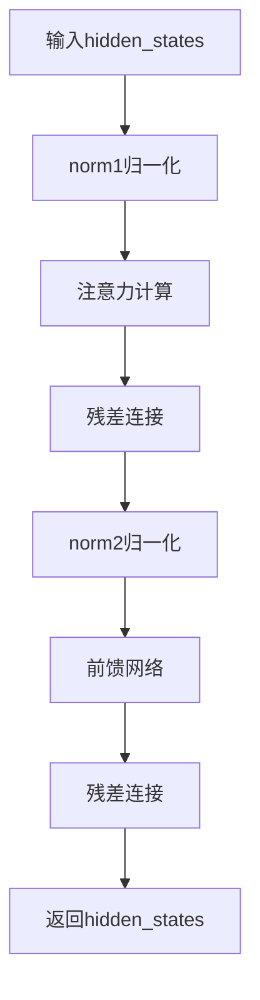

#### 带注释源码

```python
def forward(
    self,
    hidden_states: torch.Tensor,
    attention_mask: torch.Tensor | None = None,
    rotary_emb: torch.Tensor | None = None,
) -> torch.Tensor:
    norm_hidden_states = self.norm1(hidden_states)
    attn_hidden_states = self.attn1(norm_hidden_states, attention_mask=attention_mask, query_rotary_emb=rotary_emb)
    hidden_states = hidden_states + attn_hidden_states

    norm_hidden_states = self.norm2(hidden_states)
    ff_hidden_states = self.ff(norm_hidden_states)
    hidden_states = hidden_states + ff_hidden_states

    return hidden_states
```

### LTX2ConnectorTransformer1d

1D 序列 transformer，用于处理文本等模态。

**类字段：**
- `num_attention_heads`：`int`，注意力头数量
- `inner_dim`：`int`，内部维度
- `causal_temporal_positioning`：`bool`，因果时间定位
- `num_learnable_registers`：`int | None`，可学习寄存器数量
- `learnable_registers`：`torch.nn.Parameter | None`，可学习寄存器参数
- `rope`：`LTX2RotaryPosEmbed1d`，旋转位置嵌入
- `transformer_blocks`：`torch.nn.ModuleList`，transformer 块列表
- `norm_out`：`torch.nn.RMSNorm`，输出归一化
- `gradient_checkpointing`：`bool`，梯度检查点

**类方法：**

#### forward

执行连接器 transformer 前向传播。

- 参数：
  - `hidden_states`：`torch.Tensor`，输入隐藏状态，形状 [batch_size, seq_len, hidden_dim]
  - `attention_mask`：`torch.Tensor | None`，注意力掩码，形状 [batch_size, seq_len] 或 [batch_size, 1, 1, seq_len]
  - `attn_mask_binarize_threshold`：`float`，注意力掩码二值化阈值

- 返回值：`tuple[torch.Tensor, torch.Tensor]`，(输出隐藏状态, 更新后的注意力掩码)

#### 流程图

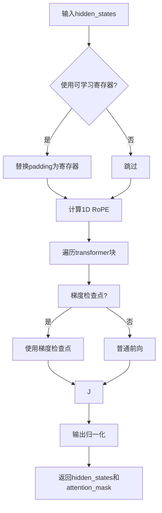

#### 带注释源码

```python
def forward(
    self,
    hidden_states: torch.Tensor,
    attention_mask: torch.Tensor | None = None,
    attn_mask_binarize_threshold: float = -9000.0,
) -> tuple[torch.Tensor, torch.Tensor]:
    # hidden_states shape: [batch_size, seq_len, hidden_dim]
    # attention_mask shape: [batch_size, seq_len] or [batch_size, 1, 1, seq_len]
    batch_size, seq_len, _ = hidden_states.shape

    # 1. 如果使用，用可学习寄存器替换padding
    if self.learnable_registers is not None:
        if seq_len % self.num_learnable_registers != 0:
            raise ValueError(
                f"The `hidden_states` sequence length {hidden_states.shape[1]} should be divisible by the number"
                f" of learnable registers {self.num_learnable_registers}"
            )

        num_register_repeats = seq_len // self.num_learnable_registers
        registers = torch.tile(self.learnable_registers, (num_register_repeats, 1))  # [seq_len, inner_dim]

        binary_attn_mask = (attention_mask >= attn_mask_binarize_threshold).int()
        if binary_attn_mask.ndim == 4:
            binary_attn_mask = binary_attn_mask.squeeze(1).squeeze(1)  # [B, 1, 1, L] --> [B, L]

        hidden_states_non_padded = [hidden_states[i, binary_attn_mask[i].bool(), :] for i in range(batch_size)]
        valid_seq_lens = [x.shape[0] for x in hidden_states_non_padded]
        pad_lengths = [seq_len - valid_seq_len for valid_seq_len in valid_seq_lens]
        padded_hidden_states = [
            F.pad(x, pad=(0, 0, 0, p), value=0) for x, p in zip(hidden_states_non_padded, pad_lengths)
        ]
        padded_hidden_states = torch.cat([x.unsqueeze(0) for x in padded_hidden_states], dim=0)  # [B, L, D]

        flipped_mask = torch.flip(binary_attn_mask, dims=[1]).unsqueeze(-1)  # [B, L, 1]
        hidden_states = flipped_mask * padded_hidden_states + (1 - flipped_mask) * registers

        # 如果使用寄存器，用全零掩码覆盖attention_mask
        attention_mask = torch.zeros_like(attention_mask)

    # 2. 计算1D RoPE位置嵌入
    rotary_emb = self.rope(batch_size, seq_len, device=hidden_states.device)

    # 3. 运行1D transformer块
    for block in self.transformer_blocks:
        if torch.is_grad_enabled() and self.gradient_checkpointing:
            hidden_states = self._gradient_checkpointing_func(block, hidden_states, attention_mask, rotary_emb)
        else:
            hidden_states = block(hidden_states, attention_mask=attention_mask, rotary_emb=rotary_emb)

    hidden_states = self.norm_out(hidden_states)

    return hidden_states, attention_mask
```

### LTX2TextConnectors

文本连接器堆栈，用于处理视频和音频流的文本编码器隐藏状态。

**类字段：**
- `text_proj_in`：`nn.Linear`，文本输入投影层
- `video_connector`：`LTX2ConnectorTransformer1d`，视频连接器
- `audio_connector`：`LTX2ConnectorTransformer1d`，音频连接器

**类方法：**

#### forward

执行文本连接器前向传播。

- 参数：
  - `text_encoder_hidden_states`：`torch.Tensor`，文本编码器隐藏状态
  - `attention_mask`：`torch.Tensor`，注意力掩码
  - `additive_mask`：`bool`，是否使用加性注意力掩码

- 返回值：`tuple[torch.Tensor, torch.Tensor, torch.Tensor]`，(视频文本嵌入, 音频文本嵌入, 更新后的注意力掩码)

#### 流程图

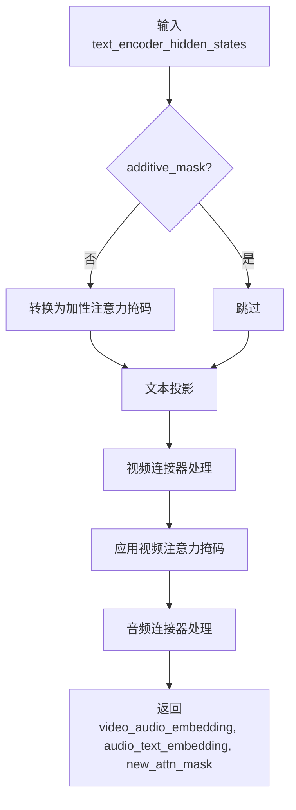

#### 带注释源码

```python
def forward(
    self, text_encoder_hidden_states: torch.Tensor, attention_mask: torch.Tensor, additive_mask: bool = False
):
    # 必要时转换为加性注意力掩码
    if not additive_mask:
        text_dtype = text_encoder_hidden_states.dtype
        attention_mask = (attention_mask - 1).reshape(attention_mask.shape[0], 1, -1, attention_mask.shape[-1])
        attention_mask = attention_mask.to(text_dtype) * torch.finfo(text_dtype).max

    text_encoder_hidden_states = self.text_proj_in(text_encoder_hidden_states)

    video_text_embedding, new_attn_mask = self.video_connector(text_encoder_hidden_states, attention_mask)

    attn_mask = (new_attn_mask < 1e-6).to(torch.int64)
    attn_mask = attn_mask.reshape(video_text_embedding.shape[0], video_text_embedding.shape[1], 1)
    video_text_embedding = video_text_embedding * attn_mask
    new_attn_mask = attn_mask.squeeze(-1)

    audio_text_embedding, _ = self.audio_connector(text_encoder_hidden_states, attention_mask)

    return video_text_embedding, audio_text_embedding, new_attn_mask
```

## 关键组件信息

1. **LTX2RotaryPosEmbed1d**：1D 旋转位置嵌入生成器，支持 interleaved 和 split 两种模式
2. **LTX2TransformerBlock1d**：基础的 1D transformer 块，包含 RMSNorm、注意力机制和前馈网络
3. **LTX2ConnectorTransformer1d**：完整的 1D transformer 编码器，支持可学习寄存器和梯度检查点
4. **LTX2TextConnectors**：顶层模块，整合视频和音频连接器

## 潜在的技术债务或优化空间

1. **重复代码**：在 LTX2ConnectorTransformer1d 的 forward 方法中，对 learnable registers 的处理逻辑较为复杂，可以提取为独立方法
2. **类型提示**：部分地方使用了 `|` 联合类型（如 `torch.Tensor | None`），在旧版 Python 中可能不兼容
3. **梯度检查点**：gradient_checkpointing 标志没有在构造函数中暴露给用户，无法动态控制
4. **错误处理**：部分边界情况检查可以更详细，如对 NaN/Inf 值的检查

## 其它项目

### 设计目标与约束

- 支持视频和音频双流文本处理
- 使用 RMSNorm 替代 LayerNorm，提升训练稳定性
- 支持可学习寄存器用于填充 token 的学习
- 支持梯度检查点以节省显存

### 错误处理与异常设计

- 在 `LTX2RotaryPosEmbed1d.__init__` 中验证 rope_type 的有效性
- 在 `LTX2ConnectorTransformer1d.forward` 中验证序列长度是否可被寄存器数量整除

### 数据流与状态机

输入数据流：
1. 原始文本编码器隐藏状态 → 投影层 → 视频/音频连接器
2. 视频连接器输出 → 注意力掩码应用 → 最终视频文本嵌入
3. 音频连接器输出 → 直接返回

### 外部依赖与接口契约

- 依赖 `configuration_utils.ConfigMixin` 用于配置注册
- 依赖 `loaders.PeftAdapterMixin` 用于 PEFT 适配器支持
- 依赖 `models.modeling_utils.ModelMixin` 作为基础模型 mixin
- 依赖 `models.attention.FeedForward` 作为前馈网络
- 依赖 `LTX2Attention` 和 `LTX2AudioVideoAttnProcessor` 用于注意力计算

### 代码中使用的 PyTorch 张量运算汇总

| 运算函数 | 用途 |
|---------|------|
| `torch.arange` | 生成位置索引 |
| `torch.linspace` | 生成等间距序列 |
| `torch.pow` | 计算幂次 |
| `torch.cos/sin` | 计算三角函数 |
| `torch.unsqueeze` | 扩展维度 |
| `torch.repeat/repeat_interleave` | 重复张量 |
| `torch.cat/concatenate` | 连接张量 |
| `torch.reshape` | 重塑张量 |
| `torch.swapaxes` | 交换轴 |
| `torch.tile` | 平铺张量 |
| `torch.flip` | 翻转张量 |
| `torch.zeros_like` | 创建全零张量 |
| `torch.is_grad_enabled` | 检查梯度状态 |
| `torch.finfo` | 获取浮点类型信息 |
| `F.pad` | 填充张量 |


### `torch.cos` / `torch.sin`

这两个函数是 PyTorch 的三角函数，用于计算输入张量的余弦（cos）和正弦（sin）值。在 LTX2RotaryPosEmbed1d 中用于计算旋转位置嵌入的频率分量。

#### 参数

-  `self`：`LTX2RotaryPosEmbed1d` 实例，调用该方法的类实例本身
-  `freqs`：`torch.Tensor`，要计算余弦/正弦值的张量，形状为 `[batch_size, seq_len, self.dim // 2]`

#### 返回值

-  `cos_freqs` / `sin_freqs`：`torch.Tensor`，与输入张量形状相同的余弦/正弦值张量

#### 流程图

```mermaid
flowchart TD
    A[输入 freqs 张量<br/>形状: [B, T, D//2]] --> B{rope_type 类型}
    B -->|interleaved| C[调用 .cos/.sin 方法]
    B -->|split| D[调用 .cos/.sin 方法]
    C --> E[使用 repeat_interleave 扩展维度]
    E --> F[处理维度填充<br/>如果 dim 不能被 2 整除]
    D --> G[处理维度填充<br/>pad_size = expected - current]
    F --> H[返回 cos_freqs, sin_freqs]
    G --> I[reshape 为 [B, H, T, D//2]]
    I --> H
```

#### 带注释源码

```python
# 在 LTX2RotaryPosEmbed1d.forward 方法中:

# 4. Get real, interleaved (cos, sin) frequencies, padded to self.dim
if self.rope_type == "interleaved":
    # 计算余弦频率: [B, T, D//2] -> [B, T, D]
    # torch.cos 是 PyTorch 张量方法，计算元素级别的余弦值
    cos_freqs = freqs.cos().repeat_interleave(2, dim=-1)
    # 计算正弦频率: [B, T, D//2] -> [B, T, D]
    # torch.sin 是 PyTorch 张量方法，计算元素级别的正弦值
    sin_freqs = freqs.sin().repeat_interleave(2, dim=-1)

    # 处理维度填充情况
    if self.dim % num_rope_elems != 0:
        # 创建余弦填充（使用1填充以保留信息）
        cos_padding = torch.ones_like(cos_freqs[:, :, : self.dim % num_rope_elems])
        # 创建正弦填充（使用0填充）
        sin_padding = torch.zeros_like(sin_freqs[:, :, : self.dim % num_rope_elems])
        # 将填充添加到前面以保持对齐
        cos_freqs = torch.cat([cos_padding, cos_freqs], dim=-1)
        sin_freqs = torch.cat([sin_padding, sin_freqs], dim=-1)

elif self.rope_type == "split":
    expected_freqs = self.dim // 2
    current_freqs = freqs.shape[-1]
    pad_size = expected_freqs - current_freqs
    # 直接计算正弦和余弦（不进行 interleave）
    cos_freq = freqs.cos()
    sin_freq = freqs.sin()

    # 如果需要填充
    if pad_size != 0:
        cos_padding = torch.ones_like(cos_freq[:, :, :pad_size])
        sin_padding = torch.zeros_like(sin_freq[:, :, :pad_size])

        # 填充频率向量
        cos_freq = torch.concatenate([cos_padding, cos_freq], axis=-1)
        sin_freq = torch.concatenate([sin_padding, sin_freq], axis=-1)

    # 重塑为适合多头注意力的格式: [B, T, H, D//2]
    b = cos_freq.shape[0]
    t = cos_freq.shape[1]

    cos_freq = cos_freq.reshape(b, t, self.num_attention_heads, -1)
    sin_freq = sin_freq.reshape(b, t, self.num_attention_heads, -1)

    # 交换轴以匹配注意力期望的格式: [B, H, T, D//2]
    cos_freqs = torch.swapaxes(cos_freq, 1, 2)  # (B,H,T,D//2)
    sin_freqs = torch.swapaxes(sin_freq, 1, 2)  # (B,H,T,D//2)

return cos_freqs, sin_freqs
```


### `torch.repeat_interleave`

该函数是 PyTorch 的张量操作方法，用于沿指定维度重复张量的元素。在 LTX2RotaryPosEmbed1d 中，`.repeat_interleave(2, dim=-1)` 将余弦和正弦频率向量在最后一个维度上每个元素重复2次，以生成交叉（interleaved）的旋转位置编码。

参数：

- `self`：`Tensor`，调用该方法的张量对象，即 `freqs.cos()` 或 `freqs.sin()` 的输出
- `repeats`：`int`，每个元素重复的次数，此处固定为 `2`
- `dim`：`int`，指定重复操作的维度，此处为 `-1`（最后一个维度）

返回值：`Tensor`，返回沿指定维度重复后的新张量，形状为原始形状在指定维度上乘以 `repeats`

#### 流程图

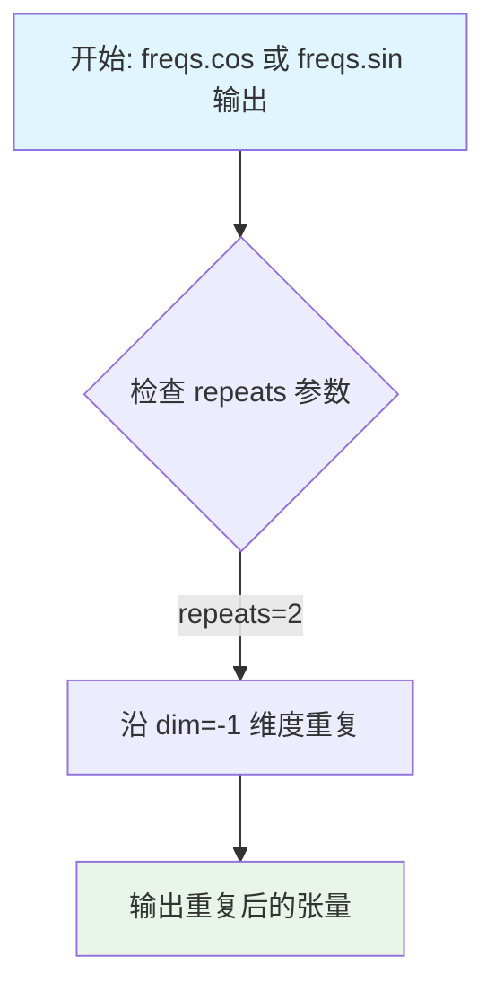

#### 带注释源码

```python
# 在 LTX2RotaryPosEmbed1d.forward 方法中调用
# freqs 形状: [batch_size, seq_len, self.dim // 2]

# 计算余弦和正弦频率
freqs_cos = freqs.cos()  # [B, T, D//2]
freqs_sin = freqs.sin()  # [B, T, D//2]

# 使用 repeat_interleave 将频率向量在最后一个维度交错重复
# 重复因子为 2，维度为 -1（最后一个维度）
# 将 [B, T, D//2] 转换为 [B, T, D]（交错排列）
cos_freqs = freqs_cos.repeat_interleave(2, dim=-1)
sin_freqs = freqs_sin.repeat_interleave(2, dim=-1)

# 重复前示例 (假设 dim//2 = 4):
# 输入: [f0, f1, f2, f3]
# repeat_interleave(2, dim=-1) 后:
# 输出: [f0, f0, f1, f1, f2, f2, f3, f3]

# 这种交错格式用于旋转位置编码 (RoPE) 的实现
# 使得相邻的频率维度成对出现，便于后续计算旋转矩阵
```


### `torch.cat`

`torch.cat` 是 PyTorch 中用于沿现有维度连接一系列张量的函数。它允许用户将多个张量按指定维度拼接成一个大张量，是深度学习模型中常用的张量操作之一。

#### 参数

- **tensors**：`tuple[torch.Tensor] | list[torch.Tensor]`，要连接的张量序列，所有张量必须在除要连接的维度外的其他维度上具有相同的形状。
- **dim**：`int`（可选，默认为 0），沿其连接张量的维度，必须在 `0` 到 `len(tensors[0].shape)` 范围内。

#### 返回值

`torch.Tensor`，连接后的张量，其形状取决于输入张量的形状和 `dim` 参数。

#### 流程图

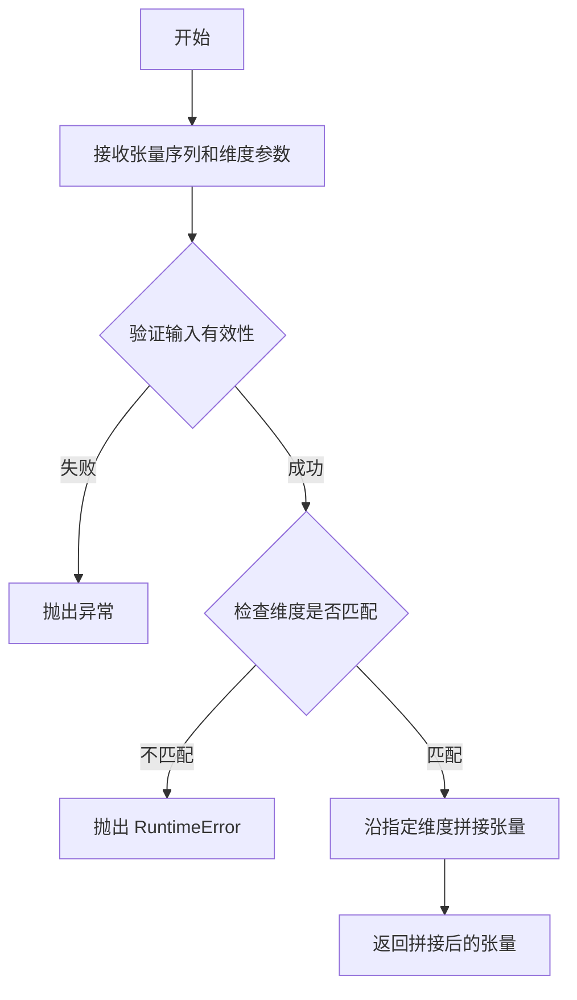

#### 带注释源码

```python
# torch.cat 函数的简化实现逻辑
def cat(tensors, dim=0):
    """
    沿指定维度连接一系列张量。
    
    参数:
        tensors: 要连接的张量序列 (tuple 或 list)
        dim: 要连接的维度 (int)
    
    返回值:
        连接后的张量 (Tensor)
    """
    # 1. 验证输入有效性
    if not tensors:
        raise ValueError("tensors 序列不能为空")
    
    # 2. 验证所有张量维度数相同（除连接维度外）
    first_shape = tensors[0].shape
    for i, tensor in enumerate(tensors[1:], start=1):
        # 检查除 dim 外的其他维度是否匹配
        other_dims = [j for j in range(len(first_shape)) if j != dim]
        for d in other_dims:
            if tensor.shape[d] != first_shape[d]:
                raise RuntimeError(
                    f"所有张量必须在除 dim={dim} 外的维度上形状一致。"
                    f"第 0 个张量形状: {first_shape}, 第 {i} 个张量形状: {tensor.shape}"
                )
    
    # 3. 验证 dim 参数有效
    if dim < 0 or dim >= len(first_shape):
        raise IndexError(f"dim 索引 {dim} 超出范围 [0, {len(first_shape)-1}]")
    
    # 4. 沿指定维度拼接张量（实际实现由 C++/CUDA 完成）
    # 返回连接后的张量
    return torch._cat_impl(tensors, dim=dim)
```

#### 在本项目代码中的实际使用示例

在 `LTX2RotaryPosEmbed1d` 类中（文件中的具体位置）：

```python
# 当 rope_type 为 "interleaved" 且需要填充时
if self.dim % num_rope_elems != 0:
    cos_padding = torch.ones_like(cos_freqs[:, :, : self.dim % num_rope_elems])
    sin_padding = torch.zeros_like(sin_freqs[:, :, : self.dim % num_rope_elems])
    # 在最后一个维度前插入填充，使 cos 和 sin 长度达到 self.dim
    cos_freqs = torch.cat([cos_padding, cos_freqs], dim=-1)
    sin_freqs = torch.cat([sin_padding, sin_freqs], dim=-1)
```


### `torch.tile`

该函数是 PyTorch 的张量运算核心函数，用于对张量进行平铺（Tiling）操作。在本项目代码 `LTX2ConnectorTransformer1d` 中，**`torch.tile`** 被用于将少量的可学习寄存器（Learnable Registers）向量沿行（序列）维度复制，以扩展至与输入序列长度（Sequence Length）一致，从而作为填充（Padding）占位符参与后续计算。

参数：

-  `input`：`torch.Tensor`（在代码中具体为 `self.learnable_registers`，类型为 `torch.nn.Parameter`），要平铺的张量。
-  `dims`：`tuple[int, int]`（在代码中具体为 `(num_register_repeats, 1)`），表示在每个维度上的重复次数。这里表示在行维度重复 `num_register_repeats` 次，列维度重复 1 次。

返回值：`torch.Tensor`，平铺后的张量，形状为 `[seq_len, inner_dim]`。

#### 流程图

```mermaid
graph TD
    A[输入张量<br/>self.learnable_registers<br/>Shape: [N, D]] --> B{torch.tile 函数}
    C[重复维度参数<br/>dims: (num_repeats, 1)] --> B
    B --> D[输出张量<br/>registers<br/>Shape: [N * num_repeats, D]]
    style B fill:#f9f,stroke:#333,stroke-width:2px
```

#### 带注释源码

```python
# 在 LTX2ConnectorTransformer1d.forward 方法中：
# 将可学习寄存器按照序列长度需要的次数进行平铺复制
# 计算需要重复的次数：序列长度 // 每个寄存器的数量
num_register_repeats = seq_len // self.num_learnable_registers

# 使用 torch.tile 将寄存器向量重复扩展至匹配输入序列长度
# 输入: [num_learnable_registers, inner_dim]
# 输出: [seq_len, inner_dim]
registers = torch.tile(self.learnable_registers, (num_register_repeats, 1))  # [seq_len, inner_dim]
```


### `LTX2ConnectorTransformer1d.forward`

该方法是 LTX2ConnectorTransformer1d 类的前向传播方法，用于处理 1D 序列转换器，实现文本编码器隐藏状态的投影、可学习的寄存器替换、旋转位置嵌入（RoPE）计算以及多层变换器块的顺序处理，最终输出处理后的隐藏状态和注意力掩码。

参数：

-  `hidden_states`：`torch.Tensor`，输入的文本编码器隐藏状态，形状为 [batch_size, seq_len, hidden_dim]
-  `attention_mask`：`torch.Tensor | None`，注意力掩码，形状为 [batch_size, seq_len] 或 [batch_size, 1, 1, seq_len]，用于指示有效位置和填充位置
-  `attn_mask_binarize_threshold`：`float`，默认为 -9000.0，用于将注意力掩码二值化的阈值

返回值：`tuple[torch.Tensor, torch.Tensor]`，返回处理后的隐藏状态（形状 [batch_size, seq_len, inner_dim]）和更新后的注意力掩码。

#### 流程图

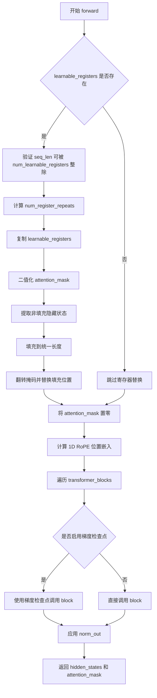

#### 带注释源码

```python
def forward(
    self,
    hidden_states: torch.Tensor,
    attention_mask: torch.Tensor | None = None,
    attn_mask_binarize_threshold: float = -9000.0,
) -> tuple[torch.Tensor, torch.Tensor]:
    # hidden_states shape: [batch_size, seq_len, hidden_dim]
    # attention_mask shape: [batch_size, seq_len] or [batch_size, 1, 1, seq_len]
    batch_size, seq_len, _ = hidden_states.shape

    # 1. Replace padding with learned registers, if using
    # 如果配置了可学习寄存器，则用寄存器替换填充位置
    if self.learnable_registers is not None:
        # 验证序列长度是否可被寄存器数量整除
        if seq_len % self.num_learnable_registers != 0:
            raise ValueError(
                f"The `hidden_states` sequence length {hidden_states.shape[1]} should be divisible by the number"
                f" of learnable registers {self.num_learnable_registers}"
            )

        # 计算需要重复寄存器的次数
        num_register_repeats = seq_len // self.num_learnable_registers
        # 复制可学习寄存器以匹配序列长度: [seq_len, inner_dim]
        registers = torch.tile(self.learnable_registers, (num_register_repeats, 1))

        # 将注意力掩码二值化: 大于等于阈值的为1, 否则为0
        binary_attn_mask = (attention_mask >= attn_mask_binarize_threshold).int()
        # 如果是4维掩码 [B,1,1,L], 压缩为2维 [B,L]
        if binary_attn_mask.ndim == 4:
            binary_attn_mask = binary_attn_mask.squeeze(1).squeeze(1)

        # 提取每个batch中非填充位置的隐藏状态
        hidden_states_non_padded = [hidden_states[i, binary_attn_mask[i].bool(), :] for i in range(batch_size)]
        # 计算每个样本的有效序列长度
        valid_seq_lens = [x.shape[0] for x in hidden_states_non_padded]
        # 计算需要填充的长度
        pad_lengths = [seq_len - valid_seq_len for valid_seq_len in valid_seq_lens]
        # 对非填充的隐藏状态进行填充，使其长度一致
        padded_hidden_states = [
            F.pad(x, pad=(0, 0, 0, p), value=0) for x, p in zip(hidden_states_non_padded, pad_lengths)
        ]
        # 拼接所有batch的填充后隐藏状态: [B, L, D]
        padded_hidden_states = torch.cat([x.unsqueeze(0) for x in padded_hidden_states], dim=0)

        # 翻转二值掩码并扩展维度: [B, L, 1]
        # 翻转后，原来填充位置变为1（用寄存器），有效位置变为0（用隐藏状态）
        flipped_mask = torch.flip(binary_attn_mask, dims=[1]).unsqueeze(-1)
        # 使用翻转后的掩码选择寄存器或原始隐藏状态
        hidden_states = flipped_mask * padded_hidden_states + (1 - flipped_mask) * registers

        # 使用全零掩码替代原始掩码，因为已用寄存器处理了填充
        attention_mask = torch.zeros_like(attention_mask)

    # 2. Calculate 1D RoPE positional embeddings
    # 计算1D旋转位置嵌入
    rotary_emb = self.rope(batch_size, seq_len, device=hidden_states.device)

    # 3. Run 1D transformer blocks
    # 依次通过所有变换器块
    for block in self.transformer_blocks:
        # 如果启用了梯度且开启了梯度检查点，则使用检查点优化内存
        if torch.is_grad_enabled() and self.gradient_checkpointing:
            hidden_states = self._gradient_checkpointing_func(block, hidden_states, attention_mask, rotary_emb)
        else:
            hidden_states = block(hidden_states, attention_mask=attention_mask, rotary_emb=rotary_emb)

    # 应用输出归一化
    hidden_states = self.norm_out(hidden_states)

    return hidden_states, attention_mask
```


### `F.pad`

`F.pad` 是 PyTorch 的 `torch.nn.functional.pad` 函数，用于在指定维度上对张量进行填充（padding）。在代码中，它被用于将可变长度的序列填充到统一长度，以便处理可学习寄存器（learnable registers）。

参数：

- `input`：`torch.Tensor`，需要进行填充的输入张量
- `pad`：`tuple[int]`，指定填充大小的元组，格式为 (left, right, top, bottom, ...) 或 (left, right, front, back, ...)，取决于张量维度
- `mode`：`str`，填充模式，默认为 `"constant"`（可选值: `"constant"`, `"reflect"`, `"replicate"`, `"circular"`）
- `value`：`float`，当 mode 为 `"constant"` 时使用的填充值，默认为 0.0

返回值：`torch.Tensor`，填充后的张量

#### 流程图

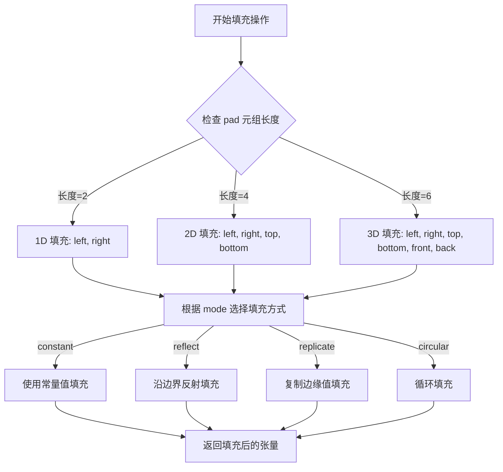

#### 带注释源码

```python
# 在 LTX2ConnectorTransformer1d.forward 方法中处理可学习寄存器
# hidden_states_non_padded: 非填充的隐藏状态列表，每个元素是不等长的序列
# pad_lengths: 每个序列需要填充的长度列表

# 使用 F.pad 将每个序列填充到统一长度 (seq_len)
# pad=(0, 0, 0, p) 表示:
#   - 第一个 0: 维度0左侧不填充
#   - p: 维度0右侧填充 p 个位置（序列末尾填充）
#   - 第二个 0: 维度1左侧不填充
#   - 第三个 0: 维度1右侧不填充
# value=0: 填充值为 0
padded_hidden_states = [
    F.pad(x, pad=(0, 0, 0, p), value=0) for x, p in zip(hidden_states_non_padded, pad_lengths)
]
```


### `torch.nn.RMSNorm`

RMSNorm（Root Mean Square Normalization，均方根归一化）是一种用于深度学习模型的归一化技术，由 PyTorch 提供。它通过计算输入特征的均方根（RMS）来进行归一化，相比 LayerNorm 省略了均值中心化步骤，从而减少了计算开销并提升了训练速度。在 LTX2TransformerBlock1d 中用于对隐藏状态进行归一化处理，帮助稳定模型训练。

参数：

- `normalized_shape`：`int` 或 `torch.Size`，需要归一化的特征维度大小
- `eps`：`float`，添加到分母的较小值，用于防止除零错误，默认为 1e-6
- `elementwise_affine`：`bool`，如果为 True，则学习可训练的权重（gamma）和偏置（beta），默认为 True

返回值：`torch.Tensor`，返回归一化后的张量，形状与输入相同

#### 流程图

```mermaid
graph TD
    A[输入张量 x] --> B[计算均方根 RMS = sqrt(mean(x²))]
    B --> C[RMS + eps 防止除零]
    C --> D[归一化: x / RMS]
    D --> E{elementwise_affine?}
    E -->|True| F[乘以权重 gamma]
    E -->|False| G[直接输出]
    F --> G
    G --> H[输出归一化后的张量]
```

#### 带注释源码

```python
# torch.nn.RMSNorm 的典型使用方式（在 LTX2TransformerBlock1d 中）

# 初始化 RMSNorm 层
self.norm1 = torch.nn.RMSNorm(
    dim,              # normalized_shape: 归一化的维度大小
    eps=eps,          # eps: 防止除零的小值 (1e-6)
    elementwise_affine=False  # 不使用可学习的仿射参数
)

# 在 forward 方法中使用
norm_hidden_states = self.norm1(hidden_states)

# 内部实现原理（简化版）:
# 假设输入 x 形状为 [batch, seq_len, dim]
# 1. 计算均方根: rms = sqrt(mean(x^2, dim=-1, keepdim=True))
# 2. 归一化: x_normalized = x / (rms + eps)
# 3. 如果 elementwise_affine=True: output = x_normalized * weight + bias
#    其中 weight 和 bias 是可学习的参数，形状为 [dim]
```

#### 在 LTX2 代码中的具体使用实例

```python
class LTX2TransformerBlock1d(nn.Module):
    def __init__(
        self,
        dim: int,
        num_attention_heads: int,
        attention_head_dim: int,
        activation_fn: str = "gelu-approximate",
        eps: float = 1e-6,
        rope_type: str = "interleaved",
    ):
        super().__init__()

        # 使用 RMSNorm 对输入进行归一化，不使用可学习参数
        # dim: 隐藏状态的维度
        # eps: 防止除零的较小值
        # elementwise_affine=False: 不使用可学习的 gamma/beta 权重
        self.norm1 = torch.nn.RMSNorm(dim, eps=eps, elementwise_affine=False)
        self.attn1 = LTX2Attention(...)

        self.norm2 = torch.nn.RMSNorm(dim, eps=eps, elementwise_affine=False)
        self.ff = FeedForward(dim, activation_fn=activation_fn)

    def forward(self, hidden_states: torch.Tensor, ...) -> torch.Tensor:
        # 第一次归一化：注意力机制前
        norm_hidden_states = self.norm1(hidden_states)
        attn_hidden_states = self.attn1(norm_hidden_states, ...)
        hidden_states = hidden_states + attn_hidden_states

        # 第二次归一化：前馈网络前
        norm_hidden_states = self.norm2(hidden_states)
        ff_hidden_states = self.ff(norm_hidden_states)
        hidden_states = hidden_states + ff_hidden_states

        return hidden_states
```

#### 关键组件信息

| 组件名称 | 一句话描述 |
|---------|-----------|
| RMSNorm | PyTorch 提供的均方根归一化层，通过计算特征的均方根进行归一化 |

#### 潜在的技术债务或优化空间

1. **elementwise_affine=False 的选择**：在 LTX2TransformerBlock1d 中使用了 `elementwise_affine=False`，这意味着没有可学习的归一化参数。根据具体任务需求，可能需要启用此选项以提升模型表达能力。

2. **eps 值固定**：所有 RMSNorm 层使用相同的 eps 值 (1e-6)，可以考虑对不同层使用不同的 eps 值进行调优。

#### 其它项目

- **设计目标**：使用 RMSNorm 替代 LayerNorm，减少计算开销并提升训练速度
- **错误处理**：当输入维度与 normalized_shape 不匹配时会抛出 RuntimeError
- **外部依赖**：PyTorch 1.11+ 版本支持 torch.nn.RMSNorm
- **数据流**：输入 [batch, seq_len, dim] → 归一化处理 → 输出相同形状的张量


### `LTX2ConnectorTransformer1d.transformer_blocks` (torch.nn.ModuleList)

这是一个基于 `torch.nn.ModuleList` 的模块列表，用于存储 LTX2TransformerBlock1d 变换器块。该模块列表在 `LTX2ConnectorTransformer1d` 类中作为核心组件，用于构建 1D 序列变换器，支持文本模态的处理（如 LTX 2.0 视频和音频流的文本编码器隐藏状态）。

参数：

- 无（ModuleList 本身不直接接收参数，其内容在类初始化时通过列表推导式构造）

返回值：`torch.nn.ModuleList`，返回包含多个 `LTX2TransformerBlock1d` 实例的模块列表

#### 流程图

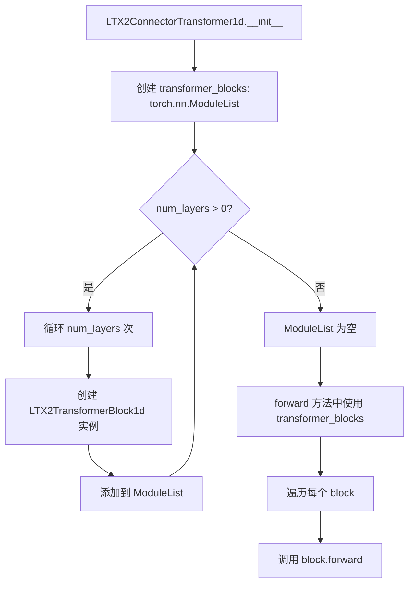

#### 带注释源码

```python
# 在 LTX2ConnectorTransformer1d 类中定义 transformer_blocks
self.transformer_blocks = torch.nn.ModuleList(
    [
        LTX2TransformerBlock1d(
            dim=self.inner_dim,                     # 隐藏维度
            num_attention_heads=num_attention_heads, # 注意力头数
            attention_head_dim=attention_head_dim,   # 注意力头维度
            rope_type=rope_type,                     # RoPE 类型
        )
        for _ in range(num_layers)  # 循环创建 num_layers 个 transformer block
    ]
)
```

---

### 补充信息

#### 关键组件信息

| 名称 | 一句话描述 |
|------|-----------|
| `LTX2RotaryPosEmbed1d` | 1D 旋转位置嵌入（RoPE），用于生成位置编码 |
| `LTX2TransformerBlock1d` | 单个 1D 变换器块，包含注意力和前馈网络 |
| `LTX2ConnectorTransformer1d` | 1D 序列变换器，用于处理文本模态 |
| `LTX2TextConnectors` | 文本连接器堆栈，处理视频和音频流的文本编码器隐藏状态 |

#### 潜在的技术债务或优化空间

1. **重复代码**：在 `LTX2ConnectorTransformer1d` 和 `LTX2TransformerBlock1d` 中，RMSNorm 的初始化重复（`elementwise_affine=False`），可以考虑提取为共享组件。
2. **梯度检查点**：`gradient_checkpointing` 功能仅在 `LTX2ConnectorTransformer1d` 中实现，但可能需要在更多层中支持以节省显存。
3. **硬编码值**：例如 `attn_mask_binarize_threshold = -9000.0`，可以考虑提取为可配置参数。
4. **类型提示**：部分返回值类型可以更精确，例如 `tuple[torch.Tensor, torch.Tensor]` 可以加上形状信息。

#### 其它项目

- **设计目标**：为 LTX 2.0 文本编码器提供高效的位置编码和变换器处理，支持可学习的寄存器（learnable registers）和梯度检查点。
- **约束**：
  - `rope_type` 必须是 `"interleaved"` 或 `"split"`。
  - `hidden_states` 的序列长度必须能被 `num_learnable_registers` 整除（如果使用可学习寄存器）。
- **错误处理**：
  - 在 `LTX2RotaryPosEmbed1d.__init__` 中检查 `rope_type` 的有效性。
  - 在 `LTX2ConnectorTransformer1d.forward` 中检查序列长度 divisibility。
- **外部依赖**：
  - 依赖 `torch.nn.RMSNorm`（PyTorch 2.0+）。
  - 依赖 `LTX2Attention` 和 `FeedForward` 等自定义模块。


### `LTX2RotaryPosEmbed1d.forward`

计算1D旋转位置嵌入（RoPE），生成用于Transformer注意力的余弦和正弦频率张量，支持交织（interleaved）和分离（split）两种模式。

参数：

- `batch_size`：`int`，批次大小，用于生成批次维度的位置嵌入
- `pos`：`int`，位置数量（序列长度），指定需要生成位置嵌入的长度
- `device`：`str | torch.device`，计算设备，指定张量存放的设备

返回值：`tuple[torch.Tensor, torch.Tensor]`，返回余弦和正弦频率张量元组 `(cos_freqs, sin_freqs)`，用于在注意力计算中旋转查询和键向量

#### 流程图

```mermaid
flowchart TD
    A[开始 forward] --> B[1. 生成1D位置ID]
    B --> C[计算相对位置分数: grid_1d / base_seq_len]
    C --> D[广播至批次维度: grid shape [batch_size, seq_len]]
    D --> E[2. 计算1D RoPE频率]
    E --> F[根据double_precision选择float64或float32]
    F --> G[计算theta的幂指数: theta^[0,1] 区间]
    G --> H[乘以 pi/2 得到最终频率]
    H --> I[3. 矩阵-向量外积]
    I --> J[计算 (grid * 2 - 1) * freqs]
    J --> K{rope_type?}
    K -->|interleaved| L[4a. 交织模式]
    K -->|split| M[4b. 分离模式]
    L --> N[计算cos和sin并repeat_interleave 2次]
    N --> O[处理维度填充]
    O --> P[返回 cos_freqs, sin_freqs]
    M --> Q[计算cos和sin]
    Q --> R[填充至目标维度]
    R --> S[reshape为 [B, H, T, D//2] 格式]
    S --> T[交换轴: (B,T,H,D//2) -> (B,H,T,D//2)]
    T --> P
```

#### 带注释源码

```python
def forward(
    self,
    batch_size: int,
    pos: int,
    device: str | torch.device,
) -> tuple[torch.Tensor, torch.Tensor]:
    # ========== 步骤1: 获取1D位置ID ==========
    # 创建从0到pos-1的浮点型位置索引
    grid_1d = torch.arange(pos, dtype=torch.float32, device=device)
    
    # 归一化: 将位置索引转换为相对于base_seq_len的分数坐标
    # 例如: base_seq_len=4096, pos=1000 -> grid_1d = [0/4096, 1/4096, ..., 999/4096]
    grid_1d = grid_1d / self.base_seq_len
    
    # 广播到批次维度: [pos] -> [1, pos] -> [batch_size, pos]
    grid = grid_1d.unsqueeze(0).repeat(batch_size, 1)  # [batch_size, seq_len]

    # ========== 步骤2: 计算1D RoPE频率 ==========
    # 1D情况下需要2个元素: 1 (维度1) * 2 (cos, sin) = 2
    num_rope_elems = 2
    
    # 根据double_precision选择计算精度
    freqs_dtype = torch.float64 if self.double_precision else torch.float32
    
    # 生成指数: theta^[0, 1] 均匀分布的steps个值
    # steps = dim // 2 = self.dim // num_rope_elems
    pow_indices = torch.pow(
        self.theta,  # 默认10000.0
        torch.linspace(start=0.0, end=1.0, steps=self.dim // num_rope_elems, 
                       dtype=freqs_dtype, device=device),
    )
    
    # 乘以 pi/2 得到最终频率
    freqs = (pow_indices * torch.pi / 2.0).to(dtype=torch.float32)

    # ========== 步骤3: 矩阵-向量外积 ==========
    # grid: [B, seq_len, 1]
    # freqs: [dim // 2]
    # 结果: [B, seq_len, dim // 2]
    # (grid * 2 - 1) 将[0,1]区间映射到[-1,1]区间
    freqs = (grid.unsqueeze(-1) * 2 - 1) * freqs  # [B, seq_len, self.dim // 2]

    # ========== 步骤4: 获取实数、交织的(cos, sin)频率 ==========
    if self.rope_type == "interleaved":
        # ---------- 交织模式 ----------
        # 计算cos和sin，然后按维度重复2次实现交织
        # 例如: [a, b] -> [a, a, b, b]
        cos_freqs = freqs.cos().repeat_interleave(2, dim=-1)
        sin_freqs = freqs.sin().repeat_interleave(2, dim=-1)

        # 处理维度不整除的情况: 填充至self.dim
        if self.dim % num_rope_elems != 0:
            # cos需要填充1，sin需要填充0（保持cos在奇数位，sin在偶数位）
            cos_padding = torch.ones_like(cos_freqs[:, :, : self.dim % num_rope_elems])
            sin_padding = torch.zeros_like(sin_freqs[:, :, : self.dim % num_rope_elems])
            # 填充到前面保持对齐
            cos_freqs = torch.cat([cos_padding, cos_freqs], dim=-1)
            sin_freqs = torch.cat([sin_padding, sin_freqs], dim=-1)

    elif self.rope_type == "split":
        # ---------- 分离模式 ----------
        expected_freqs = self.dim // 2
        current_freqs = freqs.shape[-1]
        pad_size = expected_freqs - current_freqs
        
        # 分别计算cos和sin
        cos_freq = freqs.cos()
        sin_freq = freqs.sin()

        # 填充维度差异
        if pad_size != 0:
            cos_padding = torch.ones_like(cos_freq[:, :, :pad_size])
            sin_padding = torch.zeros_like(sin_freq[:, :, :pad_size])

            # 填充到前面（低频位置）
            cos_freq = torch.concatenate([cos_padding, cos_freq], axis=-1)
            sin_freq = torch.concatenate([sin_padding, sin_freq], axis=-1)

        # 重塑为多头注意力格式: [B, T, H, D//2]
        b = cos_freq.shape[0]
        t = cos_freq.shape[1]

        cos_freq = cos_freq.reshape(b, t, self.num_attention_heads, -1)
        sin_freq = sin_freq.reshape(b, t, self.num_attention_heads, -1)

        # 交换轴顺序: (B,T,H,D//2) -> (B,H,T,D//2)
        # 这是为了兼容标准的多头注意力实现
        cos_freqs = torch.swapaxes(cos_freq, 1, 2)  # (B,H,T,D//2)
        sin_freqs = torch.swapaxes(sin_freq, 1, 2)  # (B,H,T,D//2)

    return cos_freqs, sin_freqs
```


### `LTX2TransformerBlock1d.forward`

该方法是LTX2TransformerBlock1d类的前向传播函数，实现了一个完整的Transformer块，包含自注意力机制和前馈网络两个子层，通过残差连接处理输入的隐藏状态并输出增强后的表示。

参数：

- `hidden_states`：`torch.Tensor`，输入的隐藏状态张量，形状为 [batch_size, seq_len, hidden_dim]
- `attention_mask`：`torch.Tensor | None`，注意力掩码，用于控制哪些位置可以 attend 到其他位置
- `rotary_emb`：`torch.Tensor | None`，旋转位置嵌入（RoPE），用于为注意力机制提供位置信息

返回值：`torch.Tensor`，经过Transformer块处理后的隐藏状态张量，形状与输入相同 [batch_size, seq_len, hidden_dim]

#### 流程图

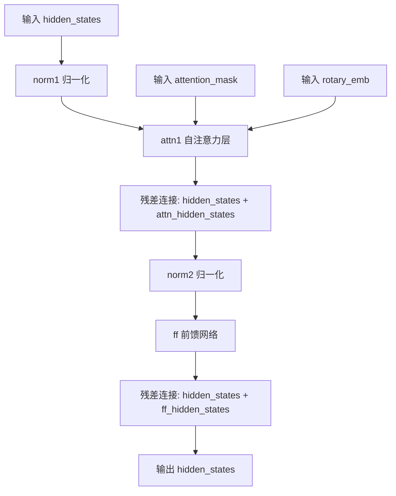

#### 带注释源码

```python
def forward(
    self,
    hidden_states: torch.Tensor,
    attention_mask: torch.Tensor | None = None,
    rotary_emb: torch.Tensor | None = None,
) -> torch.Tensor:
    # 步骤1: 第一个归一化层 (RMSNorm)
    # 对输入hidden_states进行归一化，为注意力计算做准备
    norm_hidden_states = self.norm1(hidden_states)
    
    # 步骤2: 自注意力层计算
    # 使用LTX2Attention处理归一化后的状态，传入注意力掩码和旋转嵌入
    # query_rotary_emb参数传递旋转位置嵌入以提供相对位置信息
    attn_hidden_states = self.attn1(
        norm_hidden_states, 
        attention_mask=attention_mask, 
        query_rotary_emb=rotary_emb
    )
    
    # 步骤3: 残差连接 (Self-Attention Shortcut)
    # 将注意力输出加到原始输入上，帮助梯度流动并稳定训练
    hidden_states = hidden_states + attn_hidden_states
    
    # 步骤4: 第二个归一化层 (RMSNorm)
    # 为前馈网络计算做准备
    norm_hidden_states = self.norm2(hidden_states)
    
    # 步骤5: 前馈网络计算
    # 通过FeedForward网络进行非线性变换和特征提取
    ff_hidden_states = self.ff(norm_hidden_states)
    
    # 步骤6: 残差连接 (FFN Shortcut)
    # 将前馈网络输出加到输入上，完成Transformer块的输出
    hidden_states = hidden_states + ff_hidden_states
    
    # 返回: 经过完整Transformer块处理的隐藏状态
    return hidden_states
```


### `LTX2ConnectorTransformer1d.forward`

该方法是1D连接器Transformer的前向传播函数，负责处理文本编码器的隐藏状态。它首先根据需要用可学习寄存器替换padding，然后计算1D旋转位置嵌入（RoPE），接着通过多个Transformer块处理隐藏状态，最后输出处理后的隐藏状态和注意力掩码。

参数：

- `hidden_states`：`torch.Tensor`，输入的隐藏状态，形状为 [batch_size, seq_len, hidden_dim]
- `attention_mask`：`torch.Tensor | None`，注意力掩码，形状为 [batch_size, seq_len] 或 [batch_size, 1, 1, seq_len]，用于标识padding位置
- `attn_mask_binarize_threshold`：`float`，二值化注意力掩码的阈值，默认为 -9000.0

返回值：`tuple[torch.Tensor, torch.Tensor]`，第一个是经过Transformer块处理后的隐藏状态，第二个是更新后的注意力掩码（当使用可学习寄存器时被重置为全零）

#### 流程图

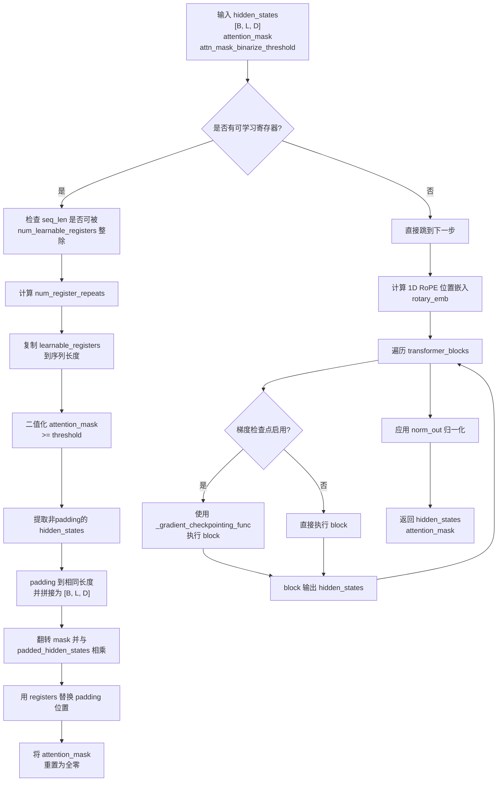

#### 带注释源码

```python
def forward(
    self,
    hidden_states: torch.Tensor,
    attention_mask: torch.Tensor | None = None,
    attn_mask_binarize_threshold: float = -9000.0,
) -> tuple[torch.Tensor, torch.Tensor]:
    # hidden_states shape: [batch_size, seq_len, hidden_dim]
    # attention_mask shape: [batch_size, seq_len] or [batch_size, 1, 1, seq_len]
    batch_size, seq_len, _ = hidden_states.shape

    # 1. Replace padding with learned registers, if using
    # 如果配置了可学习寄存器，则用其替换padding位置
    if self.learnable_registers is not None:
        # 验证序列长度是否可以被可学习寄存器数量整除
        if seq_len % self.num_learnable_registers != 0:
            raise ValueError(
                f"The `hidden_states` sequence length {hidden_states.shape[1]} should be divisible by the number"
                f" of learnable registers {self.num_learnable_registers}"
            )

        # 计算需要重复寄存器的次数
        num_register_repeats = seq_len // self.num_learnable_registers
        # 复制可学习寄存器到序列长度 [seq_len, inner_dim]
        registers = torch.tile(self.learnable_registers, (num_register_repeats, 1))

        # 将 attention_mask 二值化：>= threshold 为 1，否则为 0
        binary_attn_mask = (attention_mask >= attn_mask_binarize_threshold).int()
        # 如果是 4D mask [B, 1, 1, L]，压缩为 2D [B, L]
        if binary_attn_mask.ndim == 4:
            binary_attn_mask = binary_attn_mask.squeeze(1).squeeze(1)

        # 提取每个样本的非padding token
        hidden_states_non_padded = [hidden_states[i, binary_attn_mask[i].bool(), :] for i in range(batch_size)]
        # 获取每个样本的有效序列长度
        valid_seq_lens = [x.shape[0] for x in hidden_states_non_padded]
        # 计算需要padding的长度
        pad_lengths = [seq_len - valid_seq_len for valid_seq_len in valid_seq_lens]
        # 对每个样本的hidden_states进行padding到相同长度
        padded_hidden_states = [
            F.pad(x, pad=(0, 0, 0, p), value=0) for x, p in zip(hidden_states_non_padded, pad_lengths)
        ]
        # 拼接所有样本的padded hidden states [B, L, D]
        padded_hidden_states = torch.cat([x.unsqueeze(0) for x in padded_hidden_states], dim=0)

        # 翻转binary mask并扩展维度用于乘法
        flipped_mask = torch.flip(binary_attn_mask, dims=[1]).unsqueeze(-1)  # [B, L, 1]
        # 用翻转后的mask选择：非padding位置用padded_hidden_states，padding位置用registers
        hidden_states = flipped_mask * padded_hidden_states + (1 - flipped_mask) * registers

        # 使用寄存器后，将attention_mask重置为全零掩码
        attention_mask = torch.zeros_like(attention_mask)

    # 2. Calculate 1D RoPE positional embeddings
    # 计算1D旋转位置嵌入，用于提供位置信息
    rotary_emb = self.rope(batch_size, seq_len, device=hidden_states.device)

    # 3. Run 1D transformer blocks
    # 遍历每个Transformer块进行处理
    for block in self.transformer_blocks:
        # 如果启用了梯度检查点，则使用它来节省显存
        if torch.is_grad_enabled() and self.gradient_checkpointing:
            hidden_states = self._gradient_checkpointing_func(block, hidden_states, attention_mask, rotary_emb)
        else:
            hidden_states = block(hidden_states, attention_mask=attention_mask, rotary_emb=rotary_emb)

    # 4. Output normalization
    # 应用输出层归一化
    hidden_states = self.norm_out(hidden_states)

    return hidden_states, attention_mask
```


### LTX2TextConnectors.forward

文本连接器堆栈的前向传播方法，负责将文本编码器的隐藏状态通过投影层和两个独立的连接器（视频连接器和音频连接器）进行处理，最终输出视频和音频两个模态的文本嵌入以及更新后的注意力掩码。

参数：

- `self`：`LTX2TextConnectors` 实例本身
- `text_encoder_hidden_states`：`torch.Tensor`，文本编码器输出的隐藏状态，形状为 [batch_size, seq_len, hidden_dim]
- `attention_mask`：`torch.Tensor`，注意力掩码，用于指示哪些位置是有效的（1）和需要屏蔽的（0），形状为 [batch_size, seq_len]
- `additive_mask`：`bool`，可选参数，默认为 False，指示输入的 attention_mask 是否已经是加性掩码格式

返回值：`tuple[torch.Tensor, torch.Tensor, torch.Tensor]`，返回一个包含三个元素的元组：
- 第一个元素：视频文本嵌入 `video_text_embedding`，形状为 [batch_size, seq_len, hidden_dim]
- 第二个元素：音频文本嵌入 `audio_text_embedding`，形状为 [batch_size, seq_len, hidden_dim]
- 第三个元素：更新后的注意力掩码 `new_attn_mask`，形状为 [batch_size, seq_len]

#### 流程图

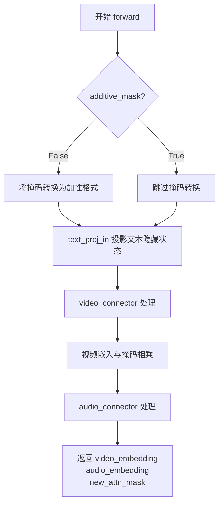

#### 带注释源码

```python
def forward(
    self, text_encoder_hidden_states: torch.Tensor, attention_mask: torch.Tensor, additive_mask: bool = False
):
    # 判断是否需要将注意力掩码转换为加性格式
    # 加性掩码在注意力计算中通过加上大的负值来实现屏蔽效果
    if not additive_mask:
        # 获取文本隐藏状态的数据类型
        text_dtype = text_encoder_hidden_states.dtype
        
        # 将原始的二进制掩码（0/1）转换为加性掩码格式
        # 原始: 1=有效, 0=无效 -> 转换后: 0=有效, -inf=无效
        # 通过 (attention_mask - 1) 将 1 变为 0，0 变为 -1
        # reshape 将其扩展为广播友好的形状 [B, 1, 1, L]
        attention_mask = (attention_mask - 1).reshape(attention_mask.shape[0], 1, -1, attention_mask.shape[-1])
        
        # 转换为文本数据类型并乘以最大浮点数，得到 -inf 或非常大的负值
        attention_mask = attention_mask.to(text_dtype) * torch.finfo(text_dtype).max

    # 使用线性投影层将文本编码器隐藏状态投影到目标维度
    # 输入形状: [batch_size, seq_len, caption_channels * text_proj_in_factor]
    # 输出形状: [batch_size, seq_len, caption_channels]
    text_encoder_hidden_states = self.text_proj_in(text_encoder_hidden_states)

    # 将投影后的文本嵌入送入视频连接器进行处理
    # 视频连接器是一个 1D Transformer，用于处理视频流的文本特征
    # 返回处理后的视频文本嵌入和更新后的注意力掩码
    video_text_embedding, new_attn_mask = self.video_connector(text_encoder_hidden_states, attention_mask)

    # 将更新后的注意力掩码二值化：小于阈值的设为 0，大于等于阈值的设为 1
    # 这里利用之前转换后的加性掩码中无效位置为负值的特性
    attn_mask = (new_attn_mask < 1e-6).to(torch.int64)
    
    # 调整掩码形状以便与视频嵌入进行逐元素相乘 [B, L, 1]
    attn_mask = attn_mask.reshape(video_text_embedding.shape[0], video_text_embedding.shape[1], 1)
    
    # 将无效位置的视频嵌入置零，保留有效位置的嵌入
    video_text_embedding = video_text_embedding * attn_mask
    
    # 压缩最后一个维度，形状变为 [B, L]
    new_attn_mask = attn_mask.squeeze(-1)

    # 将相同的文本嵌入送入音频连接器进行处理
    # 音频连接器也是一个 1D Transformer，用于处理音频流的文本特征
    # 注意：这里不关心返回的 attention_mask（用 _ 表示）
    audio_text_embedding, _ = self.audio_connector(text_encoder_hidden_states, attention_mask)

    # 返回三个结果：视频文本嵌入、音频文本嵌入、以及二值化后的注意力掩码
    return video_text_embedding, audio_text_embedding, new_attn_mask
```

## 关键组件


### LTX2RotaryPosEmbed1d

1D旋转位置嵌入（RoPE）实现，用于LTX 2.0文本编码器连接器，支持interleaved和split两种rope类型，可配置精度和位置编码维度。

### LTX2TransformerBlock1d

基于RMSNorm的1D变换器块，包含自注意力机制和前馈网络，支持旋转位置嵌入，用于处理文本等1D序列模态。

### LTX2ConnectorTransformer1d

1D序列变换器连接器，用于处理视频和音频流的文本编码器隐藏状态，支持可学习registers、梯度检查点和因果时间定位。

### LTX2TextConnectors

文本连接器堆栈，整合视频和音频两个LTX2ConnectorTransformer1d，负责将打包的文本编码器隐藏状态转换为视频和音频流的文本embedding，支持注意力掩码的加性转换。

### 关键特性组件

- **RoPE位置编码**: 支持interleaved和split两种模式的双精度旋转位置嵌入
- **可学习Registers**: 用于填充padding的可学习向量，提升模型对有效token的关注
- **RMSNorm**: 使用RMSNorm替代LayerNorm，提升训练稳定性
- **Gradient Checkpointing**: 支持梯度检查点以节省显存
- **注意力掩码处理**: 支持将二进制掩码转换为加性掩码，支持peft适配器集成


## 问题及建议


### 已知问题

- **LTX2RotaryPosEmbed1d.forward 中类型转换效率低**：每次前向传播都重新计算 `pow_indices` 和 `freqs`，这些值只与 `dim`、`theta` 相关，可以在初始化时预先计算并缓存，减少重复计算开销。
- **LTX2ConnectorTransformer1d 中使用 Python 循环遍历 batch**：使用列表推导式 `for i in range(batch_size)` 和逐个处理样本的方式效率低下，应改用完全向量化的操作替代，以提升 GPU 利用率。
- **learnable_registers 的 tile 操作可能产生大量内存占用**：当序列长度很大时，tile 操作会创建较大的张量，建议使用更高效的索引或条件赋值方式。
- **interleaved 模式下的 padding 逻辑冗余**：先 padding 后再 cat 的方式不如直接在正确位置初始化零张量高效，可以简化逻辑。
- **gradient_checkpointing 功能未完整实现**：`forward` 方法中引用了 `self._gradient_checkpointing_func`，但该方法在当前类中未定义，梯度检查点功能实际无法启用。
- **split 模式中多次 reshape 和 swapaxes 操作**：这些操作引入了额外的内存复制和计算开销，可考虑合并或优化。
- **LTX2TextConnectors 中 attention_mask 多次 reshape**：在 `forward` 方法中对 mask 进行了多次 reshape 和类型转换，逻辑分散且可读性较差，建议提取为独立辅助函数。
- **类型注解使用了 Python 3.10+ 的 union 语法** (`str | torch.device`, `torch.Tensor | None`)，可能导致与更低版本 Python 的兼容性问题。

### 优化建议

- 将 RoPE 频率计算移至 `__init__` 中预计算并缓存为类属性，前向传播时直接使用缓存值。
- 使用向量化索引和布尔掩码替代 `for i in range(batch_size)` 循环，处理 learnable registers 相关的 padding 和掩码操作。
- 定义 `_gradient_checkpointing_func` 方法或确认基类是否提供该实现，以使梯度检查点功能可用。
- 合并 interleaved 模式的 padding 逻辑，直接在正确位置创建填充张量，避免先创建再拼接。
- 提取 attention mask 处理逻辑为独立函数（如 `_prepare_attention_mask`），提高代码可读性和可维护性。
- 考虑使用 `torch.compile` 或其他 JIT 编译优化对性能敏感的操作路径。
- 添加 Python 版本检查或在类型注解处使用 `Union` 以兼容更低版本 Python。

## 其它


### 设计目标与约束

本模块的设计目标是实现LTX 2.0中文本编码器隐藏状态的处理管道，支持视频和音频两个独立流的处理。核心约束包括：(1) 必须支持1D旋转位置嵌入(RoPE)，包括interleaved和split两种模式；(2) 必须支持可学习的寄存器(learnable registers)用于填充；(3) 必须支持梯度检查点(gradient checkpointing)以节省显存；(4) 输入序列长度必须能被可学习寄存器数量整除；(5) 文本投影层使用线性变换且无偏置。

### 错误处理与异常设计

代码中的错误处理主要包括：(1) `LTX2RotaryPosEmbed1d.__init__` 中验证`rope_type`参数仅支持"interleaved"和"split"两种模式，不支持时抛出`ValueError`；(2) `LTX2ConnectorTransformer1d.forward` 中验证`hidden_states`序列长度必须能被`num_learnable_registers`整除，否则抛出`ValueError`；(3) 类型提示使用Python 3.10+的联合类型语法(`|`)，运行时通过`torch.is_grad_enabled()`检查梯度计算状态。潜在的未处理边界情况包括：`attention_mask`维度与`hidden_states`不匹配时可能导致张量形状错误；`rope_type`为"split"模式时假设`num_attention_heads`能整除`dim//2`。

### 数据流与状态机

数据流经过以下阶段：(1) 输入阶段：`text_encoder_hidden_states` [B, L, caption_channels * text_proj_in_factor] 和 `attention_mask` [B, L] 进入`LTX2TextConnectors`；(2) 投影阶段：通过`text_proj_in`线性层投影到`caption_channels`维度；(3) 分流阶段：分别传递给`video_connector`和`audio_connector`；(4) 在每个connector内部：若使用可学习寄存器，则用寄存器替换padding位置；计算RoPE嵌入；通过多个Transformer块；最后RMSNorm归一化；(5) 输出阶段：将`video_text_embedding`和`audio_text_embedding`与二进制attention mask相乘得到最终输出。状态转换主要体现在attention mask的变换：原始mask → 二进制mask → 全零mask(使用寄存器时) → 最终二进制mask。

### 外部依赖与接口契约

本模块依赖以下外部组件：`torch`和`torch.nn`提供基础张量操作和神经网络模块；`torch.nn.functional`提供F.pad等函数；`configuration_utils.ConfigMixin`和`register_to_config`提供配置注册机制；`loaders.PeftAdapterMixin`提供PEFT适配器支持；`models.modeling_utils.ModelMixin`提供模型基类；`models.attention.FeedForward`提供前馈网络；`models.transformers.transformer_ltx2.LTX2Attention`和`LTX2AudioVideoAttnProcessor`提供注意力机制。接口契约要求：`forward`方法接受`text_encoder_hidden_states`(float32张量)和`attention_mask`(long或float张量)，可选`additive_mask`参数；返回三个张量：`video_text_embedding`、`audio_text_embedding`和`new_attn_mask`。

### 配置参数说明

关键配置参数包括：`caption_channels` - 文本编码器输出通道数；`text_proj_in_factor` - 文本投影输入因子，用于扩展维度；`video_connector_num_attention_heads` / `audio_connector_num_attention_heads` - 视频/音频连接器的注意力头数；`video_connector_attention_head_dim` / `audio_connector_attention_head_dim` - 注意力头维度；`video_connector_num_layers` / `audio_connector_num_layers` - 变换器层数；`video_connector_num_learnable_registers` / `audio_connector_num_learnable_registers` - 可学习寄存器数量；`connector_rope_base_seq_len` - RoPE基础序列长度；`rope_theta` - RoPE频率基数，默认10000.0；`rope_double_precision` - 是否使用float64计算频率；`causal_temporal_positioning` - 是否使用因果时间位置；`rope_type` - RoPE类型，"interleaved"或"split"。

### 性能考虑

性能优化策略包括：(1) 梯度检查点：在`LTX2ConnectorTransformer1d`中通过`_gradient_checkpointing_func`实现，用计算时间换取显存；(2) 双精度选项：可通过`double_precision`参数选择float64或float32计算RoPE频率；(3) 寄存器复用：可学习寄存器通过`torch.tile`复用，减少显存占用；(4) 原地操作：使用`torch.flip`、`torch.cat`等高效张量操作。潜在性能瓶颈包括：Python循环遍历batch处理padding的代码可向量化；split模式下多次reshape和swapaxes操作。

### 安全性考虑

当前代码未包含explicit的安全验证机制。潜在安全关注点：(1) 输入验证缺失：`text_encoder_hidden_states`和`attention_mask`的数值范围未验证；(2) 显存安全：大量可学习寄存器可能导致OOM；(3) 模型注入：依赖`PeftAdapterMixin`需确保PEFT权重来源可信。

### 使用示例

```python
import torch
from diffusers.models.transformers.ltx2_text_connectors import LTX2TextConnectors

# 初始化
connector = LTX2TextConnectors(
    caption_channels=1024,
    text_proj_in_factor=2,
    video_connector_num_attention_heads=30,
    video_connector_attention_head_dim=128,
    video_connector_num_layers=2,
    video_connector_num_learnable_registers=128,
    audio_connector_num_attention_heads=30,
    audio_connector_attention_head_dim=128,
    audio_connector_num_layers=2,
    audio_connector_num_learnable_registers=128,
    connector_rope_base_seq_len=4096,
    rope_theta=10000.0,
    rope_double_precision=True,
    causal_temporal_positioning=False,
    rope_type="interleaved",
)

# 前向传播
batch_size = 2
seq_len = 256
hidden_states = torch.randn(batch_size, seq_len, 2048)  # 1024 * 2
attention_mask = torch.ones(batch_size, seq_len)

video_out, audio_out, new_mask = connector(hidden_states, attention_mask)
# video_out: [2, 256, 1024]
# audio_out: [2, 256, 1024]
# new_mask: [2, 256, 1]
```

### 测试策略建议

建议的测试覆盖包括：(1) 单元测试：验证各模块输出维度正确性；(2) 集成测试：端到端验证输入输出形状和数值范围；(3) RoPE模式测试：分别测试interleaved和split模式输出；(4) 梯度测试：验证梯度检查点功能正常工作；(5) 边界测试：测试序列长度不能被寄存器数量整除的情况；(6) 性能测试：对比有无梯度检查点的显存占用和计算时间。

    