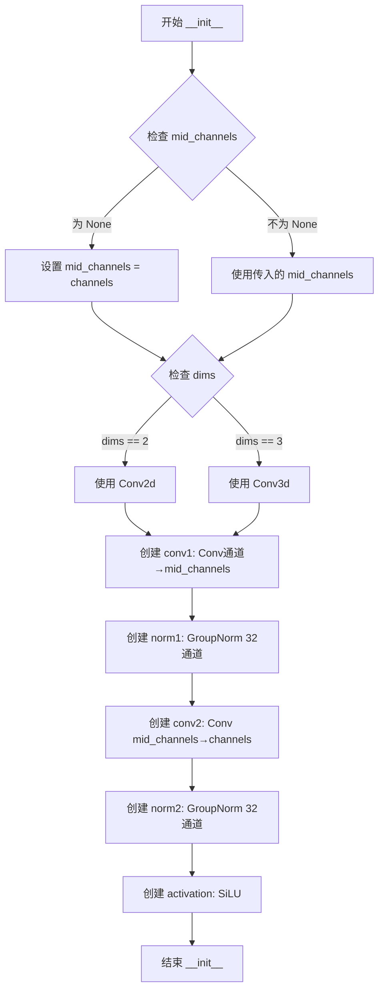
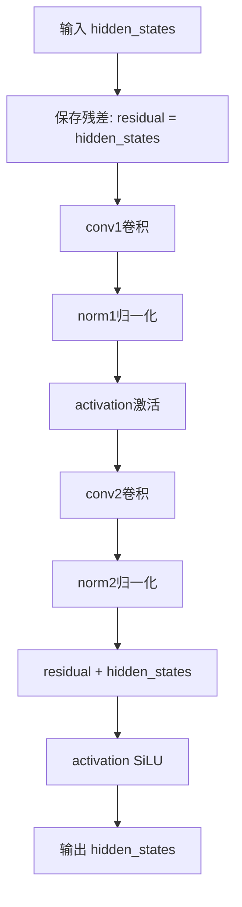
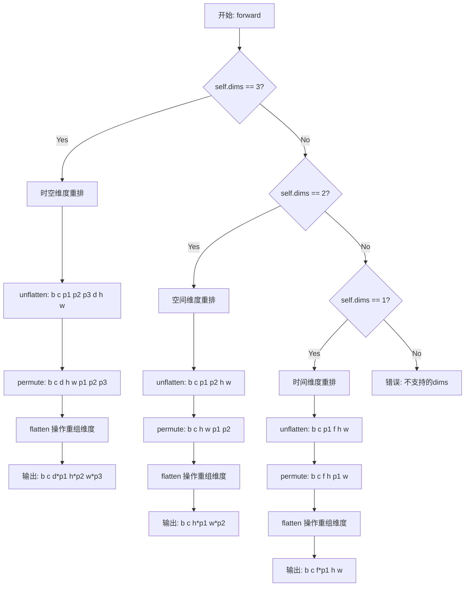
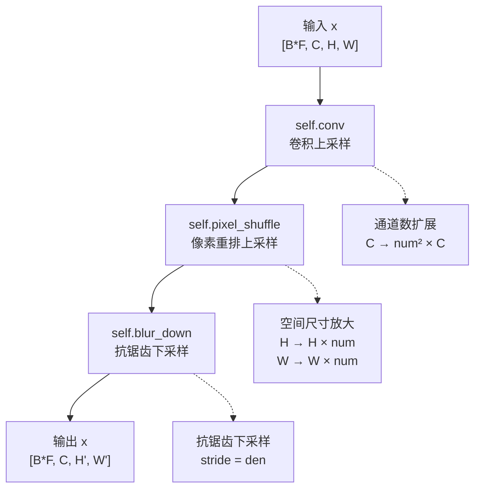
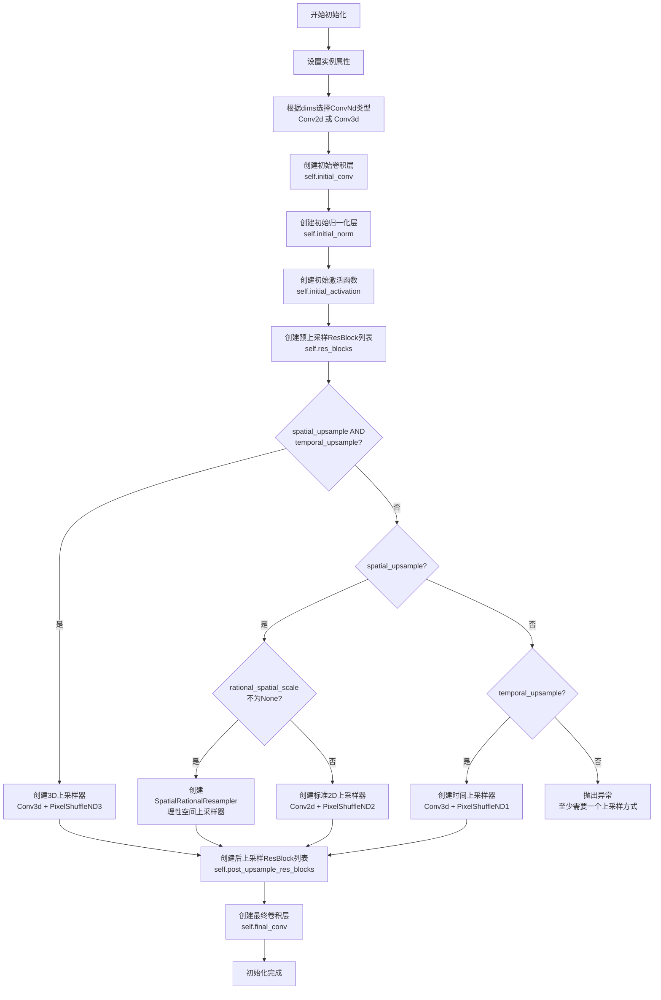
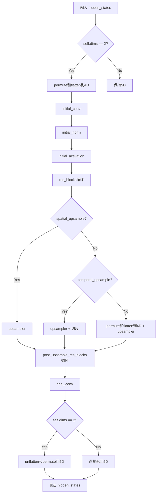

# `diffusers\src\diffusers\pipelines\ltx2\latent_upsampler.py` 详细设计文档

该代码实现了LTX视频生成模型的潜在空间上采样器，包含空间和时间维度的上采样功能，支持有理数比例缩放（spatial rational resampling）和抗锯齿模糊下采样，用于提升VAE潜在表示的空间分辨率。

## 整体流程

```mermaid
graph TD
    A[输入 Hidden States<br/>[B, C, F, H, W] 或 [B*C, C, H, W]] --> B{检查 dims == 2?}
    B -- 是 --> C[维度变换: permute + flatten<br/>[B*F, C, H, W]]
    B -- 否 --> D[保持5D张量]
    C --> E[Initial Conv + Norm + Activation]
    D --> E
    E --> F[ResBlocks 循环处理<br/>num_blocks_per_stage次]
    F --> G{上采样模式?}
    G -- spatial_upsample=True --> H[空间上采样<br/>SpatialRationalResampler 或 PixelShuffle]
    G -- temporal_upsample=True --> I[时间上采样<br/>Conv3d + PixelShuffle3D]
    G -- 两者都有 --> J[3D卷积上采样<br/>Conv3d + PixelShuffle3D]
    H --> K[Post-Upsample ResBlocks]
    I --> K
    J --> K
    K --> L[Final Conv]
    L --> M{ dims == 2? }
    M -- 是 --> N[维度恢复: unflatten + permute<br/>[B, C, F, H', W']]
    M -- 否 --> O[直接输出5D张量]
    N --> P[输出 Upsampled Latents]
    O --> P
```

## 类结构

```
torch.nn.Module (基类)
├── ResBlock (残差块)
├── PixelShuffleND (多维像素重排)
├── BlurDownsample (抗锯齿下采样)
├── SpatialRationalResampler (有理数空间缩放)
└── LTX2LatentUpsamplerModel (主模型类)
    └── (继承 ModelMixin, ConfigMixin)
```

## 全局变量及字段


### `RATIONAL_RESAMPLER_SCALE_MAPPING`
    
有理数缩放映射表，将缩放比例映射到分子和分母元组

类型：`dict[float, tuple[int, int]]`
    


### `ResBlock.conv1`
    
第一个卷积层

类型：`torch.nn.Conv2d | torch.nn.Conv3d`
    


### `ResBlock.norm1`
    
第一个归一化层

类型：`torch.nn.GroupNorm`
    


### `ResBlock.conv2`
    
第二个卷积层

类型：`torch.nn.Conv2d | torch.nn.Conv3d`
    


### `ResBlock.norm2`
    
第二个归一化层

类型：`torch.nn.GroupNorm`
    


### `ResBlock.activation`
    
激活函数

类型：`torch.nn.SiLU`
    


### `PixelShuffleND.dims`
    
卷积维度

类型：`int`
    


### `PixelShuffleND.upscale_factors`
    
上采样因子元组

类型：`tuple[int, ...]`
    


### `BlurDownsample.dims`
    
卷积维度(2或3)

类型：`int`
    


### `BlurDownsample.stride`
    
下采样步长

类型：`int`
    


### `BlurDownsample.kernel_size`
    
卷积核大小

类型：`int`
    


### `BlurDownsample.kernel`
    
二项式平滑核权重

类型：`torch.Tensor`
    


### `SpatialRationalResampler.scale`
    
空间缩放比例

类型：`float`
    


### `SpatialRationalResampler.num`
    
分子

类型：`int`
    


### `SpatialRationalResampler.den`
    
分母

类型：`int`
    


### `SpatialRationalResampler.conv`
    
上采样卷积层

类型：`torch.nn.Conv2d`
    


### `SpatialRationalResampler.pixel_shuffle`
    
像素重排

类型：`PixelShuffleND`
    


### `SpatialRationalResampler.blur_down`
    
抗锯齿下采样

类型：`BlurDownsample`
    


### `LTX2LatentUpsamplerModel.in_channels`
    
输入通道数

类型：`int`
    


### `LTX2LatentUpsamplerModel.mid_channels`
    
中间层通道数

类型：`int`
    


### `LTX2LatentUpsamplerModel.num_blocks_per_stage`
    
每阶段残差块数量

类型：`int`
    


### `LTX2LatentUpsamplerModel.dims`
    
卷积维度

类型：`int`
    


### `LTX2LatentUpsamplerModel.spatial_upsample`
    
是否空间上采样

类型：`bool`
    


### `LTX2LatentUpsamplerModel.temporal_upsample`
    
是否时间上采样

类型：`bool`
    


### `LTX2LatentUpsamplerModel.initial_conv`
    
初始卷积

类型：`torch.nn.Conv2d | torch.nn.Conv3d`
    


### `LTX2LatentUpsamplerModel.initial_norm`
    
初始归一化

类型：`torch.nn.GroupNorm`
    


### `LTX2LatentUpsamplerModel.initial_activation`
    
初始激活

类型：`torch.nn.SiLU`
    


### `LTX2LatentUpsamplerModel.res_blocks`
    
残差块列表

类型：`torch.nn.ModuleList`
    


### `LTX2LatentUpsamplerModel.upsampler`
    
上采样器

类型：`torch.nn.Sequential | SpatialRationalResampler`
    


### `LTX2LatentUpsamplerModel.post_upsample_res_blocks`
    
上采样后残差块

类型：`torch.nn.ModuleList`
    


### `LTX2LatentUpsamplerModel.final_conv`
    
最终卷积

类型：`torch.nn.Conv2d | torch.nn.Conv3d`
    
    

## 全局函数及方法


### `ResBlock.__init__`

初始化残差块（ResBlock）模块，根据指定的通道数和维度配置卷积层、归一化层和激活函数，构建用于残差连接的基础结构。

参数：

- `channels`：`int`，输入和输出特征图的通道数，也是残差连接的维度
- `mid_channels`：`int | None`，中间卷积层的通道数，默认为 `None`（此时等于 `channels`），用于控制隐藏层的宽度
- `dims`：`int`，卷积维度，2 表示二维卷积（Conv2d），3 表示三维卷积（Conv3d），默认为 3

返回值：`None`，`__init__` 方法不返回任何值，仅初始化实例属性

#### 流程图



#### 带注释源码

```
def __init__(self, channels: int, mid_channels: int | None = None, dims: int = 3):
    """
    初始化残差块
    
    参数:
        channels: 输入和输出通道数
        mid_channels: 中间层通道数，默认为None则设为channels
        dims: 卷积维度，2或3
    """
    # 调用父类torch.nn.Module的初始化方法
    super().__init__()
    
    # 如果未指定中间通道数，则使用与输入通道数相同的宽度
    if mid_channels is None:
        mid_channels = channels

    # 根据dims参数选择二维或三维卷积
    Conv = torch.nn.Conv2d if dims == 2 else torch.nn.Conv3d

    # 第一个卷积层：channels -> mid_channels
    # 3x3卷积核，padding=1保持空间尺寸不变
    self.conv1 = Conv(channels, mid_channels, kernel_size=3, padding=1)
    
    # 第一个归一化层：GroupNorm，将mid_channels个通道分成32个组
    self.norm1 = torch.nn.GroupNorm(32, mid_channels)
    
    # 第二个卷积层：mid_channels -> channels
    # 残差连接后将通道数恢复为原始维度
    self.conv2 = Conv(mid_channels, channels, kernel_size=3, padding=1)
    
    # 第二个归一化层：GroupNorm，将channels个通道分成32个组
    self.norm2 = torch.nn.GroupNorm(32, channels)
    
    # SiLU激活函数（Sigmoid Linear Unit），即Swish激活函数
    # 公式: x * sigmoid(x)
    self.activation = torch.nn.SiLU()
```


### `ResBlock.forward`

该方法是ResBlock类的前向传播函数，实现残差块（Residual Block）的核心逻辑，通过两个卷积层、归一化层和SiLU激活函数处理输入，并与原始输入进行残差连接，以实现特征的保持和增强。

参数：

- `hidden_states`：`torch.Tensor`，输入的隐藏状态张量，通常为经过前一层处理后的特征图

返回值：`torch.Tensor`，经过残差块处理后的输出张量，维度与输入相同

#### 流程图



#### 带注释源码

```python
def forward(self, hidden_states: torch.Tensor) -> torch.Tensor:
    # 保存输入作为残差连接的基础，残差连接有助于梯度流动和训练更深网络
    residual = hidden_states
    
    # 第一次卷积：将输入通道转换为中间通道数
    hidden_states = self.conv1(hidden_states)
    
    # 第一次归一化，使用GroupNorm归一化中间通道
    hidden_states = self.norm1(hidden_states)
    
    # SiLU激活函数（Smooth ReLU），提供非线性变换
    hidden_states = self.activation(hidden_states)
    
    # 第二次卷积：将中间通道数转换回原始通道数
    hidden_states = self.conv2(hidden_states)
    
    # 第二次归一化，归一化原始通道数
    hidden_states = self.norm2(hidden_states)
    
    # 残差连接：将卷积输出与原始输入相加，实现特征复用
    hidden_states = self.activation(hidden_states + residual)
    
    # 返回处理后的特征图
    return hidden_states
```


### `PixelShuffleND.__init__`

初始化 PixelShuffleND 模块，用于实现 n 维像素重排（Pixel Shuffle）操作，支持 1D、2D 和 3D 张量的上采样。该模块是 LTX2LatentUpsamplerModel 中的核心组件，用于对 VAE 潜空间进行空间或时间维度的上采样。

参数：

- `dims`：`int`，表示处理的维度数，必须为 1、2 或 3 中的一个（对应时间、空间或时空维度）
- `upscale_factors`：`tuple[int, ...]`，上采样因子元组，默认值为 `(2, 2, 2)`，指定各维度上采样的倍数

返回值：`None`，无返回值（`__init__` 方法）

#### 流程图

```mermaid
flowchart TD
    A[开始 __init__] --> B[调用父类 super().__init__]
    B --> C[设置 self.dims = dims]
    C --> D[设置 self.upscale_factors = upscale_factors]
    D --> E{检查 dims 是否在 [1, 2, 3] 中}
    E -->|是| F[初始化完成]
    E -->|否| G[抛出 ValueError: dims must be 1, 2, or 3]
```

#### 带注释源码

```python
def __init__(self, dims, upscale_factors=(2, 2, 2)):
    """
    初始化 PixelShuffleND 模块。
    
    参数:
        dims: 整数，表示维度（1=时间，2=空间，3=时空）
        upscale_factors: 上采样因子元组，默认为 (2, 2, 2)
    """
    # 调用父类 torch.nn.Module 的初始化方法
    # 这一步是必需的，用于正确初始化 PyTorch 模块的内部状态
    super().__init__()

    # 保存维度参数到模块实例
    # dims 控制 forward 方法中使用的重排逻辑：
    #   - dims=1: 时间维度上采样
    #   - dims=2: 空间维度上采样 (H, W)
    #   - dims=3: 时空维度上采样 (D, H, W) 或 (T, H, W)
    self.dims = dims
    
    # 保存上采样因子到模块实例
    # 这些因子决定了每个维度上采样的倍数
    # 例如 (2, 2) 表示在每个空间维度上放大 2 倍
    self.upscale_factors = upscale_factors

    # 验证维度参数的有效性
    # PixelShuffleND 目前仅支持 1、2、3 维操作
    # 因为更高的维度需要更复杂的 unflatten/permute 逻辑
    if dims not in [1, 2, 3]:
        raise ValueError("dims must be 1, 2, or 3")
```


### `PixelShuffleND.forward`

执行1/2/3维像素重排（Pixel Shuffle），根据 `dims` 参数对输入张量进行不同维度的高效上采样重排操作，将通道维度转换为空间或时空维度。

参数：

- `x`：`torch.Tensor`，输入张量，形状取决于 dims 值：dims=3 时为 `[B, C, D, H, W]`，dims=2 时为 `[B, C, H, W]`，dims=1 时为 `[B, C, F, H, W]`。

返回值：`torch.Tensor`，重排后的张量，形状为：dims=3 时为 `[B, C, D*p1, H*p2, W*p3]`，dims=2 时为 `[B, C, H*p1, W*p2]`，dims=1 时为 `[B, C, F*p1, H, W]`。

#### 流程图



#### 带注释源码

```python
def forward(self, x):
    """
    对输入张量执行像素重排（Pixel Shuffle）操作进行上采样。
    
    参数:
        x: 输入张量，形状根据 dims 值而定
            - dims=3: [B, C, D, H, W] 其中 C 必须是 (p1*p2*p3) 的倍数
            - dims=2: [B, C, H, W] 其中 C 必须是 (p1*p2) 的倍数
            - dims=1: [B, C, F, H, W] 其中 C 必须是 p1 的倍数
    
    返回:
        重排后的张量
            - dims=3: [B, C, D*p1, H*p2, W*p3]
            - dims=2: [B, C, H*p1, W*p2]
            - dims=1: [B, C, F*p1, H, W]
    """
    if self.dims == 3:
        # 时空上采样: b (c p1 p2 p3) d h w -> b c (d p1) (h p2) (w p3)
        # 1. unflatten: 将通道维度 C 展开为 (C', p1, p2, p3)，其中 C' = C/(p1*p2*p3)
        #    形状从 [B, C, D, H, W] 变为 [B, C', p1, p2, p3, D, H, W]
        # 2. permute: 重新排列维度，将 p1,p2,p3 移到空间维度
        #    形状变为 [B, C', D, H, W, p1, p2, p3]
        # 3. flatten: 依次展平最后的维度，合并为连续的空间维度
        #    最终形状: [B, C', D*p1, H*p2, W*p3]
        return (
            x.unflatten(1, (-1, *self.upscale_factors[:3]))  # 展开通道维度
            .permute(0, 1, 5, 2, 6, 3, 7, 4)                  # 维度重排
            .flatten(6, 7)                                    # 合并最后两维
            .flatten(4, 5)                                    # 合并中间两维
            .flatten(2, 3)                                    # 合并前面两维
        )
    elif self.dims == 2:
        # 空间上采样: b (c p1 p2) h w -> b c (h p1) (w p2)
        # 1. unflatten: 将通道维度 C 展开为 (C', p1, p2)
        #    形状从 [B, C, H, W] 变为 [B, C', p1, p2, H, W]
        # 2. permute: 重新排列维度
        #    形状变为 [B, C', H, W, p1, p2]
        # 3. flatten: 展平最后两维合并为空间维度
        #    最终形状: [B, C', H*p1, W*p2]
        return (
            x.unflatten(1, (-1, *self.upscale_factors[:2]))  # 展开通道维度
            .permute(0, 1, 4, 2, 5, 3)                        # 维度重排
            .flatten(4, 5)                                    # 合并最后两维
            .flatten(2, 3)                                    # 合并中间两维
        )
    elif self.dims == 1:
        # 时间上采样: b (c p1) f h w -> b c (f p1) h w
        # 1. unflatten: 将通道维度 C 展开为 (C', p1)
        #    形状从 [B, C, F, H, W] 变为 [B, C', p1, F, H, W]
        # 2. permute: 重新排列维度
        #    形状变为 [B, C', F, H, p1, W]
        # 3. flatten: 展平最后两维合并为时间维度
        #    最终形状: [B, C', F*p1, H, W]
        return x.unflatten(1, (-1, *self.upscale_factors[:1])).permute(0, 1, 3, 2, 4, 5).flatten(2, 3)
```


### `BlurDownsample.__init__`

初始化抗锯齿下采样模块，设置卷积维度、步长和二项式核，并注册卷积核缓冲区。该方法构建了一个基于帕斯卡三角形二项式系数的可分离核，用于平滑下采样过程中的锯齿现象。

参数：

-  `dims`：`int`，卷积维度，支持 2D（空间）或 3D（时空，但仅在 H,W 维度下采样）
-  `stride`：`int`，下采样的步长，即下采样倍率
-  `kernel_size`：`int`（默认值 5），二项式核的尺寸，必须是大于等于 3 的奇数

返回值：`None`，构造函数无返回值

#### 流程图

```mermaid
graph TD
    A([开始初始化]) --> B{验证 dims in (2, 3)?}
    B -- 否 --> C[抛出 ValueError: dims must be 2 or 3]
    B -- 是 --> D{验证 kernel_size >= 3 且为奇数?}
    D -- 否 --> E[抛出 ValueError: kernel_size must be odd >= 3]
    D -- 是 --> F[保存实例属性: dims, stride, kernel_size]
    F --> G[计算二项式系数向量 k]
    G --> H[构造 2D 核 k2d = k[:, None] @ k[None, :]]
    H --> I[归一化核: k2d = k2d / k2d.sum()]
    I --> J[注册缓冲区: self.kernel]
    J --> K([结束初始化])
```

#### 带注释源码

```python
def __init__(self, dims: int, stride: int, kernel_size: int = 5) -> None:
    # 调用父类 nn.Module 的初始化方法
    super().__init__()

    # 参数校验：dims 必须是 2 或 3
    if dims not in (2, 3):
        raise ValueError(f"`dims` must be either 2 or 3 but is {dims}")
    
    # 参数校验：kernel_size 必须是 >= 3 的奇数
    if kernel_size < 3 or kernel_size % 2 != 1:
        raise ValueError(f"`kernel_size` must be an odd number >= 3 but is {kernel_size}")

    # 保存配置参数到实例属性
    self.dims = dims
    self.stride = stride
    self.kernel_size = kernel_size

    # 生成二项式核（Binomial Kernel）
    # 利用帕斯卡三角形第 (kernel_size-1) 行的二项式系数 [C(n-1,0), C(n-1,1), ...]
    # 例如 kernel_size=5 时，使用第4行系数 [1, 4, 6, 4, 1]
    # 该核是 Gaussian 滤波的良好近似，常用于抗锯齿
    k = torch.tensor([math.comb(kernel_size - 1, k) for k in range(kernel_size)])
    
    # 通过外积构造 2D 核：k2d[i,j] = k[i] * k[j]
    # 这是一个可分离核，等价于两个一维核的卷积
    k2d = k[:, None] @ k[None, :]
    
    # 归一化核，使其元素之和为 1，保持能量守恒
    k2d = (k2d / k2d.sum()).float()  # shape: (kernel_size, kernel_size)
    
    # 注册为 buffer（非模型参数，但会随模型保存/加载）
    # 扩展维度以适配 conv2d 的权重格式：(1, 1, kernel_size, kernel_size)
    self.register_buffer("kernel", k2d[None, None, :, :])
```


### BlurDownsample.forward

该方法执行抗锯齿下采样操作，通过固定的可分离二项式卷积核对输入张量进行空间下采样，支持2D（单帧）和3D（按帧处理）模式，利用深度可分离卷积实现高效的抗锯齿处理。

参数：

- `x`：`torch.Tensor`，输入张量。对于dims=2，形状为[B, C, H, W]；对于dims=3，形状为[B, C, F, H, W]

返回值：`torch.Tensor`，下采样后的张量。dims=2时形状为[B, C, H//stride, W//stride]；dims=3时形状为[B, C, F, H//stride, W//stride]

#### 流程图

```mermaid
flowchart TD
    A[开始 forward] --> B{stride == 1?}
    B -->|是| C[直接返回输入 x]
    B -->|否| D{dims == 2?}
    
    D -->|是| E[获取通道数 c]
    E --> F[扩展卷积核为 depthwise 形式]
    F --> G[使用 F.conv2d 卷积<br/>stride=stride<br/>padding=kernel_size//2<br/>groups=c]
    G --> H[返回下采样结果]
    
    D -->|否| I[dims == 3]
    I --> J[获取形状 b, c, f, _, _]
    J --> K[转置 flatten: [B,C,F,H,W] → B*F,C,H,W]
    K --> L[扩展卷积核为 depthwise]
    L --> M[使用 F.conv2d 卷积]
    M --> N[还原形状: B*F,C,H//stride,W//stride → B,C,F,H//stride,W//stride]
    N --> H
    
    C --> O[结束]
    H --> O
```

#### 带注释源码

```python
def forward(self, x: torch.Tensor) -> torch.Tensor:
    """
    执行抗锯齿下采样。
    
    参数:
        x: 输入张量，2D模式为[B,C,H,W]，3D模式为[B,C,F,H,W]
    
    返回:
        下采样后的张量，空间尺寸按stride缩小
    """
    # 如果步长为1，不需要下采样，直接返回原输入
    if self.stride == 1:
        return x

    # 2D空间模式：处理[B,C,H,W]张量
    if self.dims == 2:
        # 获取输入通道数，用于depthwise卷积
        c = x.shape[1]
        # 扩展卷积核为depthwise形式: (1,1,k,k) -> (c,1,k,k)
        # 每个通道独立使用相同的卷积核
        weight = self.kernel.expand(c, 1, self.kernel_size, self.kernel_size)
        # 执行深度可分离卷积:
        # - stride=self.stride: 控制下采样比例
        # - padding=kernel_size//2: 保持空间尺寸(除stride外)
        # - groups=c: 深度可分离卷积，每个通道独立卷积
        x = F.conv2d(x, weight=weight, bias=None, stride=self.stride, padding=self.kernel_size // 2, groups=c)
    else:
        # 3D时空模式：按帧处理H,W维度
        # 获取批次B、通道C、帧数F、高H、宽W
        b, c, f, _, _ = x.shape
        # 转置flatten: [B,C,F,H,W] --> [B*F, C, H, W]
        # 将时间维度合并到批次维度，按帧分别处理
        x = x.transpose(1, 2).flatten(0, 1)
        
        # 同样扩展卷积核为depthwise形式
        weight = self.kernel.expand(c, 1, self.kernel_size, self.kernel_size)
        # 对每一帧执行2D深度可分离卷积
        x = F.conv2d(x, weight=weight, bias=None, stride=self.stride, padding=self.kernel_size // 2, groups=c)
        
        # 获取下采样后的空间尺寸
        h2, w2 = x.shape[-2:]
        # 还原形状: [B*F, C, H', W'] --> [B, C, F, H', W']
        # 先恢复B和F维度，再reshape回[B, C, F, H', W']
        x = x.unflatten(0, (b, f)).reshape(b, -1, f, h2, w2)
    
    return x
```


### `SpatialRationalResampler.__init__`

该方法是有理数空间缩放器的初始化方法，用于配置基于有理数比例的空间上采样/下采样操作。通过预定义的比例映射表，将缩放因子（如0.75、1.5、2.0、4.0）转换为分子和分母，然后依次构建卷积层、像素重排层和抗锯齿下采样层。

参数：

- `mid_channels`：`int`，默认值 1024，输入特征的中间通道数，决定卷积层的输入输出通道维度
- `scale`：`float`，默认值 2.0，目标缩放比例，支持 0.75、1.5、2.0、4.0 等预定义值

返回值：`None`，该方法为初始化函数，不返回任何值

#### 流程图

```mermaid
flowchart TD
    A[开始 __init__] --> B[调用 super().__init__]
    B --> C[self.scale = float(scale)]
    D{RATIONAL_RESAMPLER_SCALE_MAPPING 中是否存在 scale?}
    C --> D
    D -->|是| E[获取 num_denom 元组]
    D -->|否| F[抛出 ValueError 异常]
    E --> G[解包: self.num, self.den = num_denom]
    G --> H[创建 self.conv: Conv2d]
    H --> I[创建 self.pixel_shuffle: PixelShuffleND]
    I --> J[创建 self.blur_down: BlurDownsample]
    J --> K[结束 __init__]
```

#### 带注释源码

```python
def __init__(self, mid_channels: int = 1024, scale: float = 2.0):
    """
    初始化有理数空间缩放器
    
    参数:
        mid_channels: 中间通道数，默认为1024
        scale: 缩放比例，支持0.75、1.5、2.0、4.0
    """
    # 调用父类nn.Module的初始化方法
    super().__init__()
    
    # 将scale转换为float类型并存储
    self.scale = float(scale)
    
    # 从预定义的映射表中获取缩放因子对应的分子和分母
    # 例如: 2.0 -> (2, 1), 0.75 -> (3, 4)
    num_denom = RATIONAL_RESAMPLER_SCALE_MAPPING.get(scale, None)
    
    # 如果scale不在支持列表中，抛出异常
    if num_denom is None:
        raise ValueError(
            f"The supplied `scale` {scale} is not supported; "
            f"supported scales are {list(RATIONAL_RESAMPLER_SCALE_MAPPING.keys())}"
        )
    
    # 解包分子和分母
    self.num, self.den = num_denom

    # 创建卷积层: 输入mid_channels通道，输出(num^2)*mid_channels通道
    # 例如scale=2.0时，num=2，输出4*mid_channels通道，用于像素重排上采样
    self.conv = torch.nn.Conv2d(
        mid_channels, 
        (self.num**2) * mid_channels, 
        kernel_size=3, 
        padding=1
    )
    
    # 创建像素重排层，使用num作为上采样因子
    # 例如num=2时，执行2x2空间上采样
    self.pixel_shuffle = PixelShuffleND(2, upscale_factors=(self.num, self.num))
    
    # 创建抗锯齿下采样层，使用den作为步长
    # 例如den=1时不做下采样，den=4时执行4x下采样
    self.blur_down = BlurDownsample(dims=2, stride=self.den)
```


### `SpatialRationalResampler.forward`

执行有理数空间缩放，通过将输入先上采样整数倍再进行抗锯齿下采样，实现任意有理数比例的空间缩放。

参数：

- `x`：`torch.Tensor`，输入张量，形状为 `[B * F, C, H, W]`，其中 B 为批量大小，F 为帧数，C 为通道数，H 和 W 为空间高度和宽度

返回值：`torch.Tensor`，缩放后的输出张量，形状为 `[B * F, C, H * scale_numer / scale_denom, W * scale_numer / scale_denom]`

#### 流程图



#### 带注释源码

```python
def forward(self, x: torch.Tensor) -> torch.Tensor:
    # 输入 x 形状: [B * F, C, H, W]
    # B = batch size, F = number of frames (temporal dimension collapsed into batch)
    # C = mid_channels, H = height, W = width
    
    # 步骤1: 使用卷积扩展通道数
    # 将通道数从 mid_channels 扩展到 (num^2) * mid_channels
    # 例如当 scale=2.0 (num=2, den=1) 时，通道数变为 4 倍
    x = self.conv(x)
    
    # 步骤2: PixelShuffle 上采样
    # 将 (num^2 * C, H, W) 的张量转换为 (C, H*num, W*num)
    # 实现空间尺寸放大 num 倍
    x = self.pixel_shuffle(x)
    
    # 步骤3: BlurDownsample 抗锯齿下采样
    # 使用可分离的二项式核进行低通滤波，然后按 stride=den 进行下采样
    # 实现空间尺寸缩小 den 倍
    # 综合效果: 空间尺寸缩放比例为 num/den，即 scale
    x = self.blur_down(x)
    
    # 输出 x 形状: [B * F, C, H * scale, W * scale]
    # 例如 scale=2.0 时输出 [B*F, C, H*2, W*2]
    # 例如 scale=0.75 时输出 [B*F, C, H*0.75, W*0.75]
    return x
```


### `LTX2LatentUpsamplerModel.__init__`

该方法是 `LTX2LatentUpsamplerModel` 类的构造函数，用于初始化 VAE 潜在表示的空间上采样模型结构。它根据传入的参数（输入通道数、中间通道数、卷积维度、上采样方式等）构建完整的神经网络架构，包括初始卷积层、残差块、上采样模块和后处理层。

参数：

- `in_channels`：`int`，默认为 `128`，输入潜在表示的通道数
- `mid_channels`：`int`，默认为 `1024`，中间层的通道数
- `num_blocks_per_stage`：`int`，默认为 `4`，每个阶段（预上采样/后上采样）中使用的 ResBlock 数量
- `dims`：`int`，默认为 `3`，卷积操作的维度（2 表示空间 2D，3 表示时空 3D）
- `spatial_upsample`：`bool`，默认为 `True`，是否执行空间上采样
- `temporal_upsample`：`bool`，默认为 `False`，是否执行时间上采样
- `rational_spatial_scale`：`float | None`，默认为 `2.0`，空间缩放的有理数因子（用于 SpatialRationalResampler）

返回值：`None`，构造函数无返回值（Python 中 `__init__` 方法的返回值为 None）

#### 流程图



#### 带注释源码

```python
@register_to_config
def __init__(
    self,
    in_channels: int = 128,
    mid_channels: int = 1024,
    num_blocks_per_stage: int = 4,
    dims: int = 3,
    spatial_upsample: bool = True,
    temporal_upsample: bool = False,
    rational_spatial_scale: float | None = 2.0,
):
    """
    初始化LTX2LatentUpsamplerModel模型结构。
    
    参数:
        in_channels: 输入潜在表示的通道数，默认为128
        mid_channels: 中间层通道数，默认为1024
        num_blocks_per_stage: 每个阶段的ResBlock数量，默认为4
        dims: 卷积维度，2表示2D卷积，3表示3D卷积，默认为3
        spatial_upsample: 是否进行空间上采样，默认为True
        temporal_upsample: 是否进行时间上采样，默认为False
        rational_spatial_scale: 空间缩放的有理数因子，用于SpatialRationalResampler
    """
    super().__init__()  # 调用父类ModelMixin和ConfigMixin的初始化方法

    # ========== 1. 设置实例属性 ==========
    # 保存模型配置参数到实例属性
    self.in_channels = in_channels
    self.mid_channels = mid_channels
    self.num_blocks_per_stage = num_blocks_per_stage
    self.dims = dims
    self.spatial_upsample = spatial_upsample
    self.temporal_upsample = temporal_upsample

    # ========== 2. 选择卷积类型 ==========
    # 根据dims参数选择使用2D卷积还是3D卷积
    ConvNd = torch.nn.Conv2d if dims == 2 else torch.nn.Conv3d

    # ========== 3. 初始卷积层 ========
    # 创建初始卷积层，将输入通道数转换为中间通道数
    self.initial_conv = ConvNd(in_channels, mid_channels, kernel_size=3, padding=1)
    # 创建GroupNorm归一化层，32个组
    self.initial_norm = torch.nn.GroupNorm(32, mid_channels)
    # 创建SiLU激活函数（Swish激活函数）
    self.initial_activation = torch.nn.SiLU()

    # ========== 4. 预上采样残差块 ==========
    # 创建多个ResBlock组成的ModuleList，用于在上采样前处理特征
    self.res_blocks = torch.nn.ModuleList([
        ResBlock(mid_channels, dims=dims) 
        for _ in range(num_blocks_per_stage)
    ])

    # ========== 5. 上采样模块 ==========
    # 根据配置选择不同的上采样策略
    if spatial_upsample and temporal_upsample:
        # 同时进行空间和时间上采样：使用3D卷积 + 3D像素混排
        # 8倍空间上采样（2x2x2）
        self.upsampler = torch.nn.Sequential(
            torch.nn.Conv3d(mid_channels, 8 * mid_channels, kernel_size=3, padding=1),
            PixelShuffleND(3),  # 3D像素混排，用于上采样
        )
    elif spatial_upsample:
        # 仅空间上采样
        if rational_spatial_scale is not None:
            # 使用有理数缩放器进行空间上采样
            # 支持的比例：0.75, 1.5, 2.0, 4.0
            self.upsampler = SpatialRationalResampler(
                mid_channels=mid_channels, 
                scale=rational_spatial_scale
            )
        else:
            # 使用标准2D上采样：卷积 + 2D像素混排（4倍上采样）
            self.upsampler = torch.nn.Sequential(
                torch.nn.Conv2d(mid_channels, 4 * mid_channels, kernel_size=3, padding=1),
                PixelShuffleND(2),
            )
    elif temporal_upsample:
        # 仅时间上采样：使用3D卷积 + 1D像素混排（2倍时间上采样）
        self.upsampler = torch.nn.Sequential(
            torch.nn.Conv3d(mid_channels, 2 * mid_channels, kernel_size=3, padding=1),
            PixelShuffleND(1),
        )
    else:
        # 错误处理：至少需要一种上采样方式
        raise ValueError("Either spatial_upsample or temporal_upsample must be True")

    # ========== 6. 后上采样残差块 ==========
    # 创建多个ResBlock组成的ModuleList，用于在上采样后处理特征
    self.post_upsample_res_blocks = torch.nn.ModuleList([
        ResBlock(mid_channels, dims=dims) 
        for _ in range(num_blocks_per_stage)
    ])

    # ========== 7. 最终卷积层 ==========
    # 创建最终卷积层，将中间通道数转换回输入通道数
    self.final_conv = ConvNd(mid_channels, in_channels, kernel_size=3, padding=1)
```


### LTX2LatentUpsamplerModel.forward

该方法实现了LTX2 VAE潜在表示的空间上采样，通过初始卷积、残差块处理、可配置的上采样模块（支持空间/时间上采样、常规上采样或有理数比例上采样）以及后处理残差块，对输入的隐藏状态张量进行维度扩展和特征提取，最终返回上采样后的潜在表示。

参数：

- `hidden_states`：`torch.Tensor`，输入的隐藏状态张量，形状为 (batch_size, num_channels, num_frames, height, width)，对于2D卷积，num_frames维度会在内部进行展平处理

返回值：`torch.Tensor`，返回上采样后的隐藏状态张量，形状根据上采样类型和dims参数变化，通常在空间维度上扩展

#### 流程图



#### 带注释源码

```python
def forward(self, hidden_states: torch.Tensor) -> torch.Tensor:
    """
    LTX2LatentUpsamplerModel的前向传播方法，对输入的VAE潜在表示进行空间上采样。
    
    处理流程：
    1. 初始卷积归一化和激活
    2. 残差块处理特征
    3. 上采样操作（支持空间/时间/有理数比例）
    4. 后处理残差块
    5. 最终卷积输出
    """
    # 获取输入张量的形状信息
    batch_size, num_channels, num_frames, height, width = hidden_states.shape

    if self.dims == 2:
        # 2D卷积模式：将5D张量转换为4D (batch*frames, channels, height, width)
        # 维度重排：b,c,f,h,w -> b,f,c,h,w 然后flatten前两维 -> (b*f),c,h,w
        hidden_states = hidden_states.permute(0, 2, 1, 3, 4).flatten(0, 1)
        
        # 初始卷积层：特征提取的起点
        hidden_states = self.initial_conv(hidden_states)
        hidden_states = self.initial_norm(hidden_states)
        hidden_states = self.initial_activation(hidden_states)

        # 残差块处理：提取更深层次的特征
        for block in self.res_blocks:
            hidden_states = block(hidden_states)

        # 上采样阶段：空间维度扩展
        hidden_states = self.upsampler(hidden_states)

        # 后处理残差块：进一步特征精炼
        for block in self.post_upsample_res_blocks:
            hidden_states = block(hidden_states)

        # 最终卷积：调整通道数回到原始输入通道数
        hidden_states = self.final_conv(hidden_states)
        
        # 恢复原始维度顺序：(b*f),c,h,w -> b,c,f,h,w
        hidden_states = hidden_states.unflatten(0, (batch_size, -1)).permute(0, 2, 1, 3, 4)
    else:
        # 3D卷积模式：保持5D张量直接处理
        hidden_states = self.initial_conv(hidden_states)
        hidden_states = self.initial_norm(hidden_states)
        hidden_states = self.initial_activation(hidden_states)

        for block in self.res_blocks:
            hidden_states = block(hidden_states)

        if self.temporal_upsample:
            # 时间维度上采样
            hidden_states = self.upsampler(hidden_states)
            # 移除第一帧（避免边界效应）
            hidden_states = hidden_states[:, :, 1:, :, :]
        else:
            # 空间维度上采样：转换为2D处理
            hidden_states = hidden_states.permute(0, 2, 1, 3, 4).flatten(0, 1)
            hidden_states = self.upsampler(hidden_states)
            # 恢复原始维度顺序
            hidden_states = hidden_states.unflatten(0, (batch_size, -1)).permute(0, 2, 1, 3, 4)

        for block in self.post_upsample_res_blocks:
            hidden_states = block(hidden_states)

        hidden_states = self.final_conv(hidden_states)

    return hidden_states
```

---

## 整体设计文档

### 一段话描述

LTX2LatentUpsamplerModel是一个用于对VAE潜在表示进行空间（和时间）上采样的神经网络模型，支持2D和3D卷积，可配置的有理数比例上采样，以及可选的空间/时间维度扩展，广泛应用于LTX视频生成模型的潜在空间处理。

### 文件整体运行流程

该文件定义了一个完整的潜在表示上采样系统，核心流程如下：

1. **配置阶段**：通过`__init__`方法初始化各组件，包括初始卷积、残差块、上采样器和后处理块
2. **数据预处理**：根据dims参数对输入张量进行维度重排和展平
3. **特征提取**：通过初始卷积层和残差块提取特征
4. **上采样操作**：根据配置执行空间或时间上采样
5. **特征精炼**：通过后处理残差块进一步优化特征
6. **输出调整**：通过最终卷积调整通道数并恢复原始维度顺序

### 类详细信息

#### ResBlock

- **类字段**：
  - `conv1`：Conv2d/Conv3d，第一层卷积
  - `norm1`：GroupNorm，第一层归一化
  - `conv2`：Conv2d/Conv3d，第二层卷积
  - `norm2`：GroupNorm，第二层归一化
  - `activation`：SiLU，激活函数

- **类方法**：
  - `forward(hidden_states: torch.Tensor) -> torch.Tensor`：执行残差块前向传播，包含卷积、归一化、激活和残差连接

#### PixelShuffleND

- **类字段**：
  - `dims`：int，维度数（1/2/3）
  - `upscale_factors`：tuple，上采样因子

- **类方法**：
  - `forward(x: torch.Tensor) -> torch.Tensor`：执行N维像素打乱上采样

#### BlurDownsample

- **类字段**：
  - `dims`：int，维度数
  - `stride`：int，下采样步长
  - `kernel_size`：int，卷积核大小
  - `kernel`：Buffer，二项式卷积核

- **类方法**：
  - `forward(x: torch.Tensor) -> torch.Tensor`：执行抗锯齿下采样

#### SpatialRationalResampler

- **类字段**：
  - `scale`：float，缩放比例
  - `num`：int，分子
  - `den`：int，分母
  - `conv`：Conv2d，卷积层
  - `pixel_shuffle`：PixelShuffleND，像素打乱上采样
  - `blur_down`：BlurDownsample，模糊下采样

- **类方法**：
  - `forward(x: torch.Tensor) -> torch.Tensor`：执行有理数比例的空间重采样

#### LTX2LatentUpsamplerModel

- **类字段**：
  - `in_channels`：int，输入通道数（默认128）
  - `mid_channels`：int，中间通道数（默认1024）
  - `num_blocks_per_stage`：int，每阶段残差块数量（默认4）
  - `dims`：int，卷积维度（默认3）
  - `spatial_upsample`：bool，是否空间上采样
  - `temporal_upsample`：bool，是否时间上采样
  - `initial_conv`：Conv2d/Conv3d，初始卷积
  - `initial_norm`：GroupNorm，初始归一化
  - `initial_activation`：SiLU，初始激活
  - `res_blocks`：ModuleList，残差块列表
  - `upsampler`：Sequential/Module，上采样器
  - `post_upsample_res_blocks`：ModuleList，后处理残差块列表
  - `final_conv`：Conv2d/Conv3d，最终卷积

- **类方法**：
  - `__init__(...)`：初始化模型结构
  - `forward(hidden_states: torch.Tensor) -> torch.Tensor`：主前向传播方法

### 全局变量和函数

- `RATIONAL_RESAMPLER_SCALE_MAPPING`：dict，有理数缩放比例映射表，定义支持的缩放因子与分子分母的对应关系

### 关键组件信息

- **ResBlock**：基本的残差卷积块，包含卷积、归一化、激活和残差连接，用于特征提取
- **PixelShuffleND**：N维像素打乱上采样实现，支持1D/2D/3D上采样
- **BlurDownsample**：基于二项式核的抗锯齿下采样，用于有理数重采样中的下采样步骤
- **SpatialRationalResampler**：有理数比例的空间重采样器，支持非整数倍的空间缩放
- **LTX2LatentUpsamplerModel**：主模型类，协调各组件完成潜在表示的上采样

### 潜在技术债务或优化空间

1. **维度处理复杂性**：2D和3D模式下的维度重排逻辑较为复杂，可考虑抽象为独立的维度处理模块
2. **temporal_upsample的切片操作**：`hidden_states[:, :, 1:, :, :]`直接丢弃第一帧，可能导致信息损失
3. **硬编码的GroupNorm参数**：32作为group数量是硬编码的，应考虑是否应作为可配置参数
4. **上采样器条件创建**：使用if-elif-else创建不同类型的上采样器，可考虑使用工厂模式或策略模式
5. **RationalResampler仅支持预定义比例**：当前仅支持特定的缩放比例，不支持任意比例

### 其它项目

#### 设计目标与约束

- **目标**：实现高效的VAE潜在表示空间上采样，支持视频（3D）和图像（2D）处理
- **约束**：必须与diffusers库的ModelMixin和ConfigMixin兼容，支持配置注册机制

#### 错误处理与异常设计

- `PixelShuffleND`：dims不在[1,2,3]时抛出ValueError
- `BlurDownsample`：dims不在[2,3]或kernel_size不符合要求时抛出ValueError
- `SpatialRationalResampler`：scale不在预定义映射中时抛出ValueError
- `LTX2LatentUpsamplerModel.__init__`：spatial_upsample和temporal_upsample都为False时抛出ValueError

#### 数据流与状态机

- 输入：5D张量 (B, C, F, H, W)
- 2D模式处理：转换为4D (B*F, C, H, W) -> 处理 -> 恢复5D
- 3D模式处理：保持5D或对空间维度单独处理
- 输出：5D张量，空间维度经过上采样缩放

#### 外部依赖与接口契约

- 依赖`diffusers`库的`ConfigMixin`、`register_to_config`和`ModelMixin`
- 输入输出均为torch.Tensor，遵循标准的PyTorch模型接口
- 与LTXVideoPipeline集成时，作为VAE的upsampler组件使用

## 关键组件


### ResBlock

残差块模块，用于在模型中提取特征并进行残差连接。包含两个卷积层、GroupNorm归一化和SiLU激活函数，支持2D和3D卷积。

### PixelShuffleND

像素重排上采样模块，支持1D、2D和3D的上采样操作。通过unflatten和permute操作实现空间或时间维度的上采样。

### BlurDownsample

抗锯齿模糊下采样模块，使用二项式核（Pascal三角）进行平滑下采样，支持2D和3D输入，可有效减少下采样产生的锯齿效应。

### SpatialRationalResampler

空间有理数重采样器，通过有理数比例（如0.75、1.5、2.0、4.0）对输入进行空间尺寸缩放。先上采样再进行模糊下采样实现有理数比例缩放。

### LTX2LatentUpsamplerModel

LTX2潜在上采样器主模型类，继承自ModelMixin和ConfigMixin。负责对VAE潜在表示进行空间或时间上采样，包含初始卷积、残差块、上采样器和后处理残差块。支持2D和3D卷积，以及空间/时间上采样的不同组合模式。

### RATIONAL_RESAMPLER_SCALE_MAPPING

有理数缩放映射字典，定义了支持的空间缩放比例及其对应的分子分母。如0.75对应(3,4)表示下采样3/4，1.5对应(3,2)表示上采样3/2。


## 问题及建议


### 已知问题

- **ResBlock**: 硬编码 `GroupNorm` 的 `num_groups=32`，当 `mid_channels` 小于32时会导致运行时错误
- **SpatialRationalResampler**: `RATIONAL_RESAMPLER_SCALE_MAPPING` 是硬编码的，不允许自定义缩放因子，扩展性差
- **LTX2LatentUpsamplerModel.forward**: 2D和3D分支存在大量代码重复，未提取公共逻辑
- **LTX2LatentUpsamplerModel.forward**: temporal_upsample分支中 `hidden_states[:, :, 1:, :, :]` 的切片操作缺乏说明，可能是未完成的功能或有bug
- **PixelShuffleND**: 1D情况的实现与2D/3D模式不一致，缺少统一的处理逻辑
- **BlurDownsample**: 3D情况下使用循环重建batch和frame的逻辑实现不够高效，可考虑使用PyTorch内置的3D卷积
- **缺少输入验证**: 构造函数中未验证 `num_blocks_per_stage`、`mid_channels` 等参数的有效性
- **魔法数字**: 代码中存在多个硬编码数值（如32、3、4、8），缺乏常量定义，意图不明确
- **未使用的变量**: forward方法中的 `height`、`width` 变量声明后未被使用

### 优化建议

- 将 `GroupNorm` 的 `num_groups` 参数化为可配置项，或使用 `min(32, channels // 2)` 的自适应逻辑
- 提取2D/3D共用的前向传播逻辑到私有方法中，减少代码重复
- 为 `SpatialRationalResampler` 添加自定义缩放因子的支持，或至少提供更清晰的错误信息
- 将硬编码的缩放映射、常量提取为模块级常量或配置类
- 添加完整的类型注解和文档字符串，特别是对于非标准的参数如 `rational_spatial_scale`
- 验证输入张量的shape是否符合预期维度，提供更友好的错误提示

## 其它


### 设计目标与约束

本代码的设计目标是实现LTXVideo模型的VAE潜在空间上采样器，支持空间和时间维度的上采样操作。核心约束包括：1) 仅支持dims=2或dims=3的卷积操作；2) spatial_upsample和temporal_upsample至少需要一个为True；3) rational_spatial_scale仅支持预定义的缩放比例(0.75, 1.5, 2.0, 4.0)；4) 输入张量形状需为[B, C, F, H, W]（3D）或[B, C, H, W]（2D）。

### 错误处理与异常设计

主要异常场景包括：1) PixelShuffleND初始化时dims不在[1,2,3]范围内，抛出ValueError；2) BlurDownsample初始化时dims不在(2,3)或kernel_size不符合要求，抛出ValueError；3) SpatialRationalResampler初始化时scale不在RATIONAL_RESAMPLER_SCALE_MAPPING中，抛出ValueError；4) LTX2LatentUpsamplerModel初始化时spatial_upsample和temporal_upsample都为False，抛出ValueError。

### 数据流与状态机

数据流主要分为两条路径：当dims=2时，输入[B,C,F,H,W]经permute和flatten变为[B*F,C,H,W]，经上采样后再reshape回原始格式；当dims=3时，输入直接经过3D卷积处理。SpatialRationalResampler的数据流为：conv -> pixel_shuffle -> blur_down。整体forward流程：initial_conv -> initial_norm -> initial_activation -> res_blocks -> upsampler -> post_upsample_res_blocks -> final_conv。

### 外部依赖与接口契约

主要依赖包括：1) torch和torch.nn.functional（PyTorch基础库）；2) configuration_utils.ConfigMixin和register_to_config装饰器（Diffusers配置管理）；3) models.modeling_utils.ModelMixin（Diffusers模型基类）。接口契约：forward方法接受hidden_states: torch.Tensor，返回torch.Tensor；输入输出形状需满足特定维度关系（如spatial_upsample=True时，空间尺寸放大指定倍数）。

### 版本兼容性与平台适配

代码依赖PyTorch的torch.nn.Module机制，需确保PyTorch版本兼容。Conv2d/Conv3d的选择完全由dims参数控制，确保在不同维度输入下正确路由。register_to_config装饰器依赖diffusers库的ConfigMixin实现，需使用兼容版本的diffusers。

### 性能考量与优化空间

当前实现存在以下性能优化空间：1) ResBlock中每次forward都创建新的中间张量，可考虑in-place操作；2) BlurDownsample中kernel在每次forward时expand，可考虑预先缓存；3) 2D模式下重复的permute/flatten/unflatten操作带来额外开销，可考虑统一数据布局；4) 3D卷积和2D卷积路径分离导致代码重复，可考虑抽象统一处理逻辑。

### 配置参数与超参数

关键超参数包括：in_channels(默认128)、mid_channels(默认1024)、num_blocks_per_stage(默认4)、dims(默认3)、spatial_upsample(默认True)、temporal_upsample(默认False)、rational_spatial_scale(默认2.0)。这些参数通过@register_to_config装饰器实现配置化管理，支持从配置文件实例化模型。

    