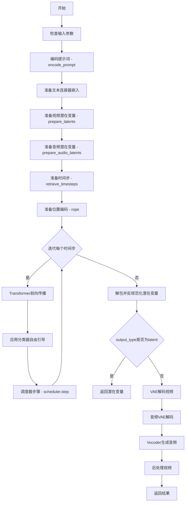
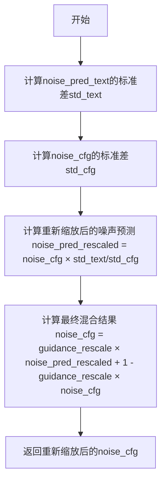
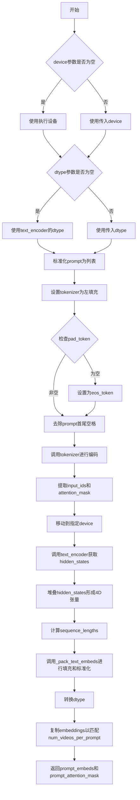
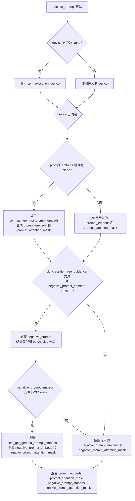
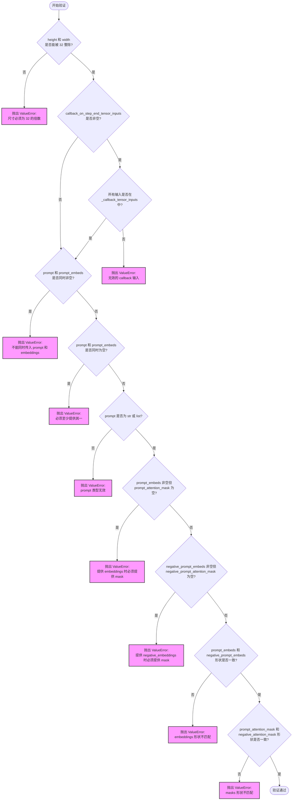
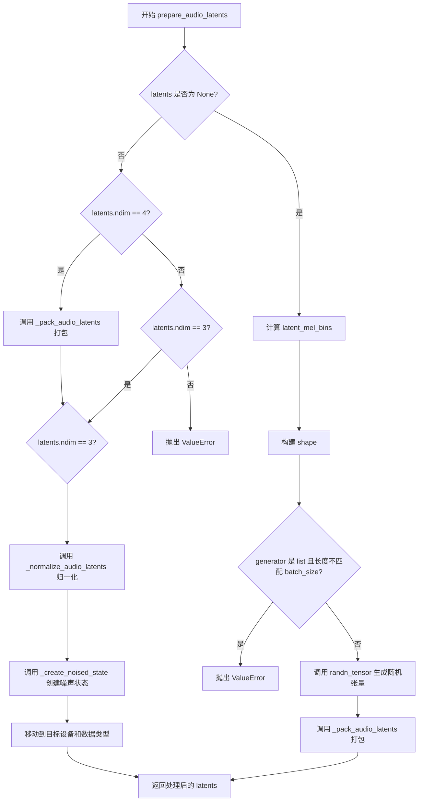

# `diffusers\src\diffusers\pipelines\ltx2\pipeline_ltx2.py` 详细设计文档

LTX2Pipeline是一个用于文本到视频生成的扩散管道，结合了视频和音频生成能力。该管道使用Transformer架构对编码后的视频潜在表示进行去噪，同时通过音频VAE和Vocoder生成与视频同步的音频。

## 整体流程



## 类结构

```
DiffusionPipeline (基类)
├── FromSingleFileMixin (单文件加载)
├── LTX2LoraLoaderMixin (LoRA加载)
└── LTX2Pipeline (主类)
```

## 全局变量及字段


### `XLA_AVAILABLE`
    
Flag indicating whether PyTorch XLA is available for TPU acceleration

类型：`bool`
    


### `logger`
    
Module-level logger for tracking pipeline execution and debugging

类型：`logging.Logger`
    


### `EXAMPLE_DOC_STRING`
    
Documentation string containing usage examples for the LTX2Pipeline

类型：`str`
    


### `LTX2Pipeline.scheduler`
    
Scheduler for controlling the diffusion denoising process with flow matching

类型：`FlowMatchEulerDiscreteScheduler`
    


### `LTX2Pipeline.vae`
    
Video variational autoencoder for encoding and decoding visual latents

类型：`AutoencoderKLLTX2Video`
    


### `LTX2Pipeline.audio_vae`
    
Audio variational autoencoder for encoding and decoding audio spectrogram latents

类型：`AutoencoderKLLTX2Audio`
    


### `LTX2Pipeline.text_encoder`
    
Gemma3 text encoder for generating text embeddings from prompt inputs

类型：`Gemma3ForConditionalGeneration`
    


### `LTX2Pipeline.tokenizer`
    
Tokenizer for converting text prompts to token IDs for the text encoder

类型：`GemmaTokenizer | GemmaTokenizerFast`
    


### `LTX2Pipeline.connectors`
    
Text connector stack for adapting text embeddings to video and audio branches

类型：`LTX2TextConnectors`
    


### `LTX2Pipeline.transformer`
    
3D transformer model for denoising video and audio latents conditioned on text

类型：`LTX2VideoTransformer3DModel`
    


### `LTX2Pipeline.vocoder`
    
Neural vocoder for converting mel spectrograms to raw audio waveforms

类型：`LTX2Vocoder`
    


### `LTX2Pipeline.vae_spatial_compression_ratio`
    
Compression ratio for spatial dimensions used by the video VAE

类型：`int`
    


### `LTX2Pipeline.vae_temporal_compression_ratio`
    
Compression ratio for temporal dimension used by the video VAE

类型：`int`
    


### `LTX2Pipeline.audio_vae_mel_compression_ratio`
    
Compression ratio for mel spectrogram bins used by the audio VAE

类型：`int`
    


### `LTX2Pipeline.audio_vae_temporal_compression_ratio`
    
Compression ratio for temporal dimension used by the audio VAE

类型：`int`
    


### `LTX2Pipeline.transformer_spatial_patch_size`
    
Spatial patch size for dividing video latents into transformer tokens

类型：`int`
    


### `LTX2Pipeline.transformer_temporal_patch_size`
    
Temporal patch size for dividing video frames into transformer tokens

类型：`int`
    


### `LTX2Pipeline.audio_sampling_rate`
    
Target audio sampling rate for generated audio output

类型：`int`
    


### `LTX2Pipeline.audio_hop_length`
    
Hop length parameter for STFT computation in audio processing

类型：`int`
    


### `LTX2Pipeline.video_processor`
    
Processor for converting decoded video latents to output format

类型：`VideoProcessor`
    


### `LTX2Pipeline.tokenizer_max_length`
    
Maximum sequence length supported by the tokenizer for text inputs

类型：`int`
    
    

## 全局函数及方法


### `calculate_shift`

该函数通过线性插值计算基于图像序列长度的噪声调度偏移量（shift），用于在扩散模型推理过程中根据序列长度动态调整噪声调度参数。

参数：

- `image_seq_len`：`int`，目标图像序列长度，用于计算对应的偏移量
- `base_seq_len`：`int`，基准序列长度，默认为 256
- `max_seq_len`：`int`，最大序列长度，默认为 4096
- `base_shift`：`float`，基准偏移量，默认为 0.5
- `max_shift`：`float`，最大偏移量，默认为 1.15

返回值：`float`，根据输入序列长度计算得到的偏移量 mu

#### 流程图

```mermaid
flowchart TD
    A[开始: calculate_shift] --> B[输入参数<br/>image_seq_len, base_seq_len, max_seq_len<br/>base_shift, max_shift]
    B --> C[计算斜率 m = (max_shift - base_shift) / (max_seq_len - base_seq_len)]
    C --> D[计算截距 b = base_shift - m * base_seq_len]
    D --> E[计算偏移量 mu = image_seq_len * m + b]
    E --> F[返回 mu]
```

#### 带注释源码

```python
def calculate_shift(
    image_seq_len,           # 目标图像序列长度，用于计算对应的偏移量
    base_seq_len: int = 256,  # 基准序列长度，默认 256
    max_seq_len: int = 4096,  # 最大序列长度，默认 4096
    base_shift: float = 0.5,  # 基准偏移量，默认 0.5
    max_shift: float = 1.15,  # 最大偏移量，默认 1.15
):
    """
    通过线性插值计算基于图像序列长度的噪声调度偏移量。
    
    该函数实现了一个线性映射，根据输入的序列长度在基准偏移量和最大偏移量之间
    进行插值。这在扩散模型（如 LTX-Video）中用于动态调整噪声调度参数，以适应
    不同长度的视频/图像序列。
    
    Args:
        image_seq_len: 目标图像序列长度
        base_seq_len: 基准序列长度
        max_seq_len: 最大序列长度
        base_shift: 基准偏移量
        max_shift: 最大偏移量
    
    Returns:
        float: 计算得到的偏移量 mu
    """
    # 计算线性插值的斜率 m
    m = (max_shift - base_shift) / (max_seq_len - base_seq_len)
    
    # 计算线性插值的截距 b
    b = base_shift - m * base_seq_len
    
    # 根据目标序列长度计算偏移量 mu
    mu = image_seq_len * m + b
    
    return mu
```


### `retrieve_timesteps`

该函数是 LTX2 视频生成管道的核心辅助函数，用于调用调度器的 `set_timesteps` 方法并从中获取时间步序列。它支持自定义时间步和 sigma 值，并提供了完整的错误处理机制来确保调度器兼容性和参数正确性。

参数：

- `scheduler`：`SchedulerMixin`，需要获取时间步的调度器对象
- `num_inference_steps`：`int | None`，生成样本时使用的扩散步数，若使用此参数则 `timesteps` 必须为 `None`
- `device`：`str | torch.device | None`，时间步要移动到的设备，传入 `None` 则不移动
- `timesteps`：`list[int] | None`，用于覆盖调度器时间步间隔策略的自定义时间步，若传入此参数则 `num_inference_steps` 和 `sigmas` 必须为 `None`
- `sigmas`：`list[float] | None`，用于覆盖调度器时间步间隔策略的自定义 sigma，若传入此参数则 `num_inference_steps` 和 `timesteps` 必须为 `None`
- `**kwargs`：任意关键字参数，将传递给 `scheduler.set_timesteps` 方法

返回值：`tuple[torch.Tensor, int]`，元组包含调度器的时间步调度序列和推理步数

#### 流程图

```mermaid
flowchart TD
    A[开始 retrieve_timesteps] --> B{检查 timesteps 和 sigmas 是否同时传入}
    B -->|是| C[抛出 ValueError: 只能选择 timesteps 或 sigmas 之一]
    B -->|否| D{检查 timesteps 是否传入}
    
    D -->|是| E[检查 scheduler.set_timesteps 是否支持 timesteps 参数]
    E -->|不支持| F[抛出 ValueError: 当前调度器不支持自定义时间步]
    E -->|支持| G[调用 scheduler.set_timesteps timesteps=timesteps, device=device]
    G --> H[获取 scheduler.timesteps]
    H --> I[计算 num_inference_steps = len(timesteps)]
    I --> J[返回 timesteps, num_inference_steps]
    
    D -->|否| K{检查 sigmas 是否传入}
    K -->|是| L[检查 scheduler.set_timesteps 是否支持 sigmas 参数]
    L -->|不支持| M[抛出 ValueError: 当前调度器不支持自定义 sigmas]
    L -->|支持| N[调用 scheduler.set_timesteps sigmas=sigmas, device=device]
    N --> O[获取 scheduler.timesteps]
    O --> P[计算 num_inference_steps = len(timesteps)]
    P --> J
    
    K -->|否| Q[调用 scheduler.set_timesteps num_inference_steps, device=device]
    Q --> R[获取 scheduler.timesteps]
    R --> S[num_inference_steps 保持原值]
    S --> J
    
    style C fill:#ffcccc
    style F fill:#ffcccc
    style M fill:#ffcccc
    style J fill:#ccffcc
```

#### 带注释源码

```python
def retrieve_timesteps(
    scheduler,
    num_inference_steps: int | None = None,
    device: str | torch.device | None = None,
    timesteps: list[int] | None = None,
    sigmas: list[float] | None = None,
    **kwargs,
):
    r"""
    Calls the scheduler's `set_timesteps` method and retrieves timesteps from the scheduler after the call. Handles
    custom timesteps. Any kwargs will be supplied to `scheduler.set_timesteps`.

    Args:
        scheduler (`SchedulerMixin`):
            The scheduler to get timesteps from.
        num_inference_steps (`int`):
            The number of diffusion steps used when generating samples with a pre-trained model. If used, `timesteps`
            must be `None`.
        device (`str` or `torch.device`, *optional*):
            The device to which the timesteps should be moved to. If `None`, the timesteps are not moved.
        timesteps (`list[int]`, *optional*):
            Custom timesteps used to override the timestep spacing strategy of the scheduler. If `timesteps` is passed,
            `num_inference_steps` and `sigmas` must be `None`.
        sigmas (`list[float]`, *optional*):
            Custom sigmas used to override the timestep spacing strategy of the scheduler. If `sigmas` is passed,
            `num_inference_steps` and `timesteps` must be `None`.

    Returns:
        `tuple[torch.Tensor, int]`: A tuple where the first element is the timestep schedule from the scheduler and the
        second element is the number of inference steps.
    """
    # 检查是否同时传入了 timesteps 和 sigmas，这是不允许的
    if timesteps is not None and sigmas is not None:
        raise ValueError("Only one of `timesteps` or `sigmas` can be passed. Please choose one to set custom values")
    
    # 处理自定义时间步的情况
    if timesteps is not None:
        # 检查调度器是否支持自定义时间步
        accepts_timesteps = "timesteps" in set(inspect.signature(scheduler.set_timesteps).parameters.keys())
        if not accepts_timesteps:
            raise ValueError(
                f"The current scheduler class {scheduler.__class__}'s `set_timesteps` does not support custom"
                f" timestep schedules. Please check whether you are using the correct scheduler."
            )
        # 调用调度器的 set_timesteps 方法
        scheduler.set_timesteps(timesteps=timesteps, device=device, **kwargs)
        # 从调度器获取设置后的时间步
        timesteps = scheduler.timesteps
        # 计算推理步数
        num_inference_steps = len(timesteps)
    # 处理自定义 sigmas 的情况
    elif sigmas is not None:
        # 检查调度器是否支持自定义 sigmas
        accept_sigmas = "sigmas" in set(inspect.signature(scheduler.set_timesteps).parameters.keys())
        if not accept_sigmas:
            raise ValueError(
                f"The current scheduler class {scheduler.__class__}'s `set_timesteps` does not support custom"
                f" sigmas schedules. Please check whether you are using the correct scheduler."
            )
        # 调用调度器的 set_timesteps 方法
        scheduler.set_timesteps(sigmas=sigmas, device=device, **kwargs)
        # 从调度器获取设置后的时间步
        timesteps = scheduler.timesteps
        # 计算推理步数
        num_inference_steps = len(timesteps)
    # 使用默认方式设置时间步
    else:
        scheduler.set_timesteps(num_inference_steps, device=device, **kwargs)
        timesteps = scheduler.timesteps
    
    # 返回时间步序列和推理步数
    return timesteps, num_inference_steps
```


### `rescale_noise_cfg`

该函数用于根据 guidance_rescale 参数重新缩放噪声预测张量（noise_cfg），以改善图像质量并修复过度曝光问题。函数基于论文 "Common Diffusion Noise Schedules and Sample Steps are Flawed" (https://huggingface.co/papers/2305.08891) 的 Section 3.4 实现，通过计算文本预测噪声和_cfg预测噪声的标准差进行重新缩放，并与原始结果按 guidance_rescale 因子混合，以避免生成"平淡"的图像。

参数：

- `noise_cfg`：`torch.Tensor`，引导扩散过程中预测的噪声张量
- `noise_pred_text`：`torch.Tensor`，文本引导扩散过程中预测的噪声张量
- `guidance_rescale`：`float`，可选参数，默认值为 0.0，应用于噪声预测的重新缩放因子

返回值：`torch.Tensor`，重新缩放后的噪声预测张量

#### 流程图



#### 带注释源码

```python
def rescale_noise_cfg(noise_cfg, noise_pred_text, guidance_rescale=0.0):
    r"""
    Rescales `noise_cfg` tensor based on `guidance_rescale` to improve image quality and fix overexposure. Based on
    Section 3.4 from [Common Diffusion Noise Schedules and Sample Steps are
    Flawed](https://huggingface.co/papers/2305.08891).

    Args:
        noise_cfg (`torch.Tensor`):
            The predicted noise tensor for the guided diffusion process.
        noise_pred_text (`torch.Tensor`):
            The predicted noise tensor for the text-guided diffusion process.
        guidance_rescale (`float`, *optional*, defaults to 0.0):
            A rescale factor applied to the noise predictions.

    Returns:
        noise_cfg (`torch.Tensor`): The rescaled noise prediction tensor.
    """
    # 计算文本预测噪声在所有非批次维度上的标准差，保持维度以便广播
    std_text = noise_pred_text.std(dim=list(range(1, noise_pred_text.ndim)), keepdim=True)
    # 计算噪声配置在所有非批次维度上的标准差，保持维度以便广播
    std_cfg = noise_cfg.std(dim=list(range(1, noise_cfg.ndim)), keepdim=True)
    
    # 根据 guidance 重新缩放结果（修复过度曝光问题）
    # 通过将噪声配置的标准差与文本预测的标准差对齐来进行缩放
    noise_pred_rescaled = noise_cfg * (std_text / std_cfg)
    
    # 通过 guidance_rescale 因子将重新缩放后的结果与原始 guidance 结果混合，以避免"平淡"的图像
    # 当 guidance_rescale = 0 时，返回原始 noise_cfg（不做修改）
    # 当 guidance_rescale = 1 时，完全使用重新缩放后的结果
    noise_cfg = guidance_rescale * noise_pred_rescaled + (1 - guidance_rescale) * noise_cfg
    return noise_cfg
```


### `LTX2Pipeline.__init__`

该方法是 `LTX2Pipeline` 类的构造函数，负责初始化文本到视频（Text-to-Video）生成管道。它接收所有必要的子模型（如 VAE、Transformer、音频 VAE、 Vocoder 等）作为参数，注册这些模块，并预计算后续推理过程中所需的关键配置参数，例如空间/时间压缩比、音频采样率以及视频处理器。

参数：

- `scheduler`：`FlowMatchEulerDiscreteScheduler`，用于去噪的调度器。
- `vae`：`AutoencoderKLLTX2Video`，视频变分自编码器，用于编码/解码视频潜在表示。
- `audio_vae`：`AutoencoderKLLTX2Audio`，音频变分自编码器，用于编码/解码音频潜在表示。
- `text_encoder`：`Gemma3ForConditionalGeneration`，文本编码器（基于 Gemma3），用于将文本 prompt 转换为嵌入向量。
- `tokenizer`：`GemmaTokenizer | GemmaTokenizerFast`，文本分词器。
- `connectors`：`LTX2TextConnectors`，文本连接器堆栈，用于适配视频和音频分支的文本编码器隐藏状态。
- `transformer`：`LTX2VideoTransformer3DModel`，条件 Transformer 架构，用于对编码后的视频潜在表示进行去噪。
- `vocoder`：`LTX2Vocoder`，声码器，用于将生成的梅尔频谱图转换为音频波形。

返回值：`None`，构造函数无返回值。

#### 流程图

```mermaid
graph TD
    A([Start __init__]) --> B[调用 super().__init__]
    B --> C[调用 self.register_modules 注册所有子模块]
    C --> D[计算并设置 VAE 压缩比<br/>vae_spatial_compression_ratio<br/>vae_temporal_compression_ratio]
    D --> E[计算并设置 Audio VAE 压缩比<br/>audio_vae_mel_compression_ratio<br/>audio_vae_temporal_compression_ratio]
    E --> F[计算并设置 Transformer Patch Size<br/>transformer_spatial_patch_size<br/>transformer_temporal_patch_size]
    F --> G[设置音频采样参数<br/>audio_sampling_rate<br/>audio_hop_length]
    G --> H[初始化 VideoProcessor]
    H --> I[设置 Tokenizer 最大长度]
    I --> J([End __init__])
```

#### 带注释源码

```python
def __init__(
    self,
    scheduler: FlowMatchEulerDiscreteScheduler,
    vae: AutoencoderKLLTX2Video,
    audio_vae: AutoencoderKLLTX2Audio,
    text_encoder: Gemma3ForConditionalGeneration,
    tokenizer: GemmaTokenizer | GemmaTokenizerFast,
    connectors: LTX2TextConnectors,
    transformer: LTX2VideoTransformer3DModel,
    vocoder: LTX2Vocoder,
):
    """
    初始化 LTX2 管道。

    参数:
        scheduler: 用于去噪的调度器。
        vae: 视频 VAE 模型。
        audio_vae: 音频 VAE 模型。
        text_encoder: 文本编码器模型。
        tokenizer: 文本分词器。
        connectors: 文本连接器。
        transformer: 视频 Transformer 模型。
        vocoder: 音频声码器模型。
    """
    # 1. 调用父类 DiffusionPipeline 的初始化方法
    super().__init__()

    # 2. 注册所有子模块，使管道能够访问和管理这些模型组件
    self.register_modules(
        vae=vae,
        audio_vae=audio_vae,
        text_encoder=text_encoder,
        tokenizer=tokenizer,
        connectors=connectors,
        transformer=transformer,
        vocoder=vocoder,
        scheduler=scheduler,
    )

    # 3. 计算视频 VAE 的空间和时间压缩比，用于将像素空间映射到潜在空间
    self.vae_spatial_compression_ratio = (
        self.vae.spatial_compression_ratio if getattr(self, "vae", None) is not None else 32
    )
    self.vae_temporal_compression_ratio = (
        self.vae.temporal_compression_ratio if getattr(self, "audio_vae", None) is not None else 8
    )
    
    # 4. 计算音频 VAE 的 MEL 压缩比和时间压缩比
    # TODO: check whether the MEL compression ratio logic here is corrct
    self.audio_vae_mel_compression_ratio = (
        self.audio_vae.mel_compression_ratio if getattr(self, "audio_vae", None) is not None else 4
    )
    self.audio_vae_temporal_compression_ratio = (
        self.audio_vae.temporal_compression_ratio if getattr(self, "audio_vae", None) is not None else 4
    )
    
    # 5. 计算 Transformer 的空间和时间 patch 大小，用于处理潜在表示的分块
    self.transformer_spatial_patch_size = (
        self.transformer.config.patch_size if getattr(self, "transformer", None) is not None else 1
    )
    self.transformer_temporal_patch_size = (
        self.transformer.config.patch_size_t if getattr(self, "transformer") is not None else 1
    )

    # 6. 设置音频采样率和支持的 hop length，这些对于音频生成至关重要
    self.audio_sampling_rate = (
        self.audio_vae.config.sample_rate if getattr(self, "audio_vae", None) is not None else 16000
    )
    self.audio_hop_length = (
        self.audio_vae.config.mel_hop_length if getattr(self, "audio_vae", None) is not None else 160
    )

    # 7. 初始化视频后处理器，用于将 VAE 输出的潜在向量转换回可视视频
    self.video_processor = VideoProcessor(vae_scale_factor=self.vae_spatial_compression_ratio)
    
    # 8. 设置分词器的最大长度，用于处理输入文本
    self.tokenizer_max_length = (
        self.tokenizer.model_max_length if getattr(self, "tokenizer", None) is not None else 1024
    )
```


### `LTX2Pipeline._pack_text_embeds`

该方法用于对文本编码器的隐藏状态进行打包和归一化处理，同时尊重填充（padding）规则。归一化是在每个批次和每层上以掩码方式执行的（仅针对非填充位置）。

参数：

- `text_hidden_states`：`torch.Tensor`，形状为 `(batch_size, seq_len, hidden_dim, num_layers)`，来自文本编码器（例如 `Gemma3ForConditionalGeneration`）的每层隐藏状态
- `sequence_lengths`：`torch.Tensor`，形状为 `(batch_size,)`，每个批次实例的有效（非填充）令牌数量
- `device`：`str` 或 `torch.device`，用于放置结果嵌入的张量设备
- `padding_side`：`str`，可选，默认为 `"left"`，文本标记器是在 `"left"` 还是 `"right"` 侧进行填充
- `scale_factor`：`int`，可选，默认为 `8`，用于乘以归一化隐藏状态的缩放因子
- `eps`：`float`，可选，默认为 `1e-6`，执行归一化时用于数值稳定性的一个小正值

返回值：`torch.Tensor`，形状为 `(batch_size, seq_len, hidden_dim * num_layers)`，归一化并扁平化的文本编码器隐藏状态

#### 流程图

```mermaid
flowchart TD
    A[开始] --> B[获取输入张量形状: batch_size, seq_len, hidden_dim, num_layers]
    B --> C[保存原始数据类型 original_dtype]
    D[创建填充掩码] --> E{判断 padding_side}
    E -->|right| F[有效令牌从 0 到 sequence_length-1]
    E -->|left| G[有效令牌从 seq_len-sequence_length 到 seq_len-1]
    F --> H[生成掩码 mask]
    G --> H
    H --> I[扩展掩码维度: [B, S] → [B, S, 1, 1]]
    I --> J[计算掩码均值 - masked_mean]
    J --> K[计算掩码最小值 - x_min]
    K --> L[计算掩码最大值 - x_max]
    L --> M[归一化: (text_hidden_states - masked_mean) / (x_max - x_min + eps)]
    M --> N[乘以 scale_factor]
    N --> O[扁平化隐藏状态: 4D → 3D]
    O --> P[扩展并应用填充掩码]
    P --> Q[转换为原始数据类型]
    Q --> R[返回归一化且打包好的张量]
```

#### 带注释源码

```python
@staticmethod
def _pack_text_embeds(
    text_hidden_states: torch.Tensor,
    sequence_lengths: torch.Tensor,
    device: str | torch.device,
    padding_side: str = "left",
    scale_factor: int = 8,
    eps: float = 1e-6,
) -> torch.Tensor:
    """
    Packs and normalizes text encoder hidden states, respecting padding. Normalization is performed per-batch and
    per-layer in a masked fashion (only over non-padded positions).

    Args:
        text_hidden_states (`torch.Tensor` of shape `(batch_size, seq_len, hidden_dim, num_layers)`):
            Per-layer hidden_states from a text encoder (e.g. `Gemma3ForConditionalGeneration`).
        sequence_lengths (`torch.Tensor of shape `(batch_size,)`):
            The number of valid (non-padded) tokens for each batch instance.
        device: (`str` or `torch.device`, *optional*):
            torch device to place the resulting embeddings on
        padding_side: (`str`, *optional*, defaults to `"left"`):
            Whether the text tokenizer performs padding on the `"left"` or `"right"`.
        scale_factor (`int`, *optional*, defaults to `8`):
            Scaling factor to multiply the normalized hidden states by.
        eps (`float`, *optional*, defaults to `1e-6`):
            A small positive value for numerical stability when performing normalization.

    Returns:
        `torch.Tensor` of shape `(batch_size, seq_len, hidden_dim * num_layers)`:
            Normed and flattened text encoder hidden states.
    """
    # 1. 获取输入张量的形状维度信息
    batch_size, seq_len, hidden_dim, num_layers = text_hidden_states.shape
    # 保存原始数据类型，后续需转换回原类型
    original_dtype = text_hidden_states.dtype

    # 2. 创建填充掩码 (padding mask)
    # 生成序列位置索引 [0, 1, 2, ..., seq_len-1]，形状为 [1, seq_len]
    token_indices = torch.arange(seq_len, device=device).unsqueeze(0)
    
    if padding_side == "right":
        # 右侧填充时，有效令牌从 0 到 sequence_length-1
        # mask 形状: [batch_size, seq_len]
        mask = token_indices < sequence_lengths[:, None]
    elif padding_side == "left":
        # 左侧填充时，有效令牌从 (seq_len - sequence_length) 到 seq_len-1
        start_indices = seq_len - sequence_lengths[:, None]  # [batch_size, 1]
        mask = token_indices >= start_indices  # [B, T]
    else:
        raise ValueError(f"padding_side must be 'left' or 'right', got {padding_side}")
    
    # 扩展掩码维度以匹配隐藏状态的形状 [B, S] → [B, S, 1, 1]
    mask = mask[:, :, None, None]

    # 3. 计算掩码均值 (masked mean) - 仅在非填充位置计算
    # 将填充位置设为 0 后求和
    masked_text_hidden_states = text_hidden_states.masked_fill(~mask, 0.0)
    # 计算有效位置数量: sequence_lengths * hidden_dim
    num_valid_positions = (sequence_lengths * hidden_dim).view(batch_size, 1, 1, 1)
    # 计算掩码均值
    masked_mean = masked_text_hidden_states.sum(dim=(1, 2), keepdim=True) / (num_valid_positions + eps)

    # 4. 计算掩码最小值和最大值 - 仅在非填充位置计算
    # 将填充位置设为 inf/-inf 以排除它们
    x_min = text_hidden_states.masked_fill(~mask, float("inf")).amin(dim=(1, 2), keepdim=True)
    x_max = text_hidden_states.masked_fill(~mask, float("-inf")).amax(dim=(1, 2), keepdim=True)

    # 5. 归一化处理
    # 使用 min-max 归一化: (x - mean) / (max - min)
    normalized_hidden_states = (text_hidden_states - masked_mean) / (x_max - x_min + eps)
    # 乘以缩放因子
    normalized_hidden_states = normalized_hidden_states * scale_factor

    # 6. 打包隐藏状态为 3D 张量 (batch_size, seq_len, hidden_dim * num_layers)
    # 将 4D 张量扁平化为 3D: [B, S, H, L] → [B, S, H*L]
    normalized_hidden_states = normalized_hidden_states.flatten(2)
    
    # 扩展掩码以匹配扁平化后的维度
    mask_flat = mask.squeeze(-1).expand(-1, -1, hidden_dim * num_layers)
    # 将填充位置的数值设为 0
    normalized_hidden_states = normalized_hidden_states.masked_fill(~mask_flat, 0.0)
    
    # 转换回原始数据类型
    normalized_hidden_states = normalized_hidden_states.to(dtype=original_dtype)
    return normalized_hidden_states
```


### `LTX2Pipeline._get_gemma_prompt_embeds`

该方法负责将文本提示词（prompt）编码为文本编码器的隐藏状态（hidden states），并进行填充和标准化处理，最终返回处理后的提示词嵌入和注意力掩码，供后续的视频生成管线使用。

参数：

- `prompt`：`str | list[str]`，要编码的文本提示词，可以是单个字符串或字符串列表。
- `num_videos_per_prompt`：`int`，默认值 1，每个提示词需要生成的视频数量，用于复制文本嵌入。
- `max_sequence_length`：`int`，默认值 1024，提示词的最大序列长度，超过该长度会被截断。
- `scale_factor`：`int`，默认值 8，标准化文本嵌入时的缩放因子。
- `device`：`torch.device | None`，可选参数，用于放置结果张量的设备，默认为执行设备。
- `dtype`：`torch.dtype | None`，可选参数，用于转换提示词嵌入的数据类型，默认为文本编码器的数据类型。

返回值：`tuple[torch.Tensor, torch.Tensor]`，返回一个元组，包含处理后的提示词嵌入（prompt_embeds）和对应的注意力掩码（prompt_attention_mask）。`prompt_embeds` 形状为 `(batch_size * num_videos_per_prompt, seq_len, hidden_dim * num_layers)`，`prompt_attention_mask` 形状为 `(batch_size * num_videos_per_prompt, seq_len)`。

#### 流程图



#### 带注释源码

```python
def _get_gemma_prompt_embeds(
    self,
    prompt: str | list[str],
    num_videos_per_prompt: int = 1,
    max_sequence_length: int = 1024,
    scale_factor: int = 8,
    device: torch.device | None = None,
    dtype: torch.dtype | None = None,
):
    r"""
    Encodes the prompt into text encoder hidden states.

    Args:
        prompt (`str` or `list[str]`, *optional*):
            prompt to be encoded
        device: (`str` or `torch.device`):
            torch device to place the resulting embeddings on
        dtype: (`torch.dtype`):
            torch dtype to cast the prompt embeds to
        max_sequence_length (`int`, defaults to 1024): Maximum sequence length to use for the prompt.
    """
    # 确定设备：如果未指定，则使用执行设备
    device = device or self._execution_device
    # 确定数据类型：如果未指定，则使用文本编码器的数据类型
    dtype = dtype or self.text_encoder.dtype

    # 如果prompt是单个字符串，转换为列表，便于批量处理
    prompt = [prompt] if isinstance(prompt, str) else prompt
    # 获取批次大小
    batch_size = len(prompt)

    # 检查是否存在tokenizer，并进行配置
    if getattr(self, "tokenizer", None) is not None:
        # Gemma期望聊天样式的提示词使用左填充
        self.tokenizer.padding_side = "left"
        # 如果pad_token未设置，使用eos_token代替
        if self.tokenizer.pad_token is None:
            self.tokenizer.pad_token = self.tokenizer.eos_token

    # 去除每个prompt的前后空格
    prompt = [p.strip() for p in prompt]
    # 使用tokenizer对prompt进行编码，填充到最大长度，进行截断，添加特殊token，返回pytorch张量
    text_inputs = self.tokenizer(
        prompt,
        padding="max_length",
        max_length=max_sequence_length,
        truncation=True,
        add_special_tokens=True,
        return_tensors="pt",
    )
    # 提取输入ID和注意力掩码
    text_input_ids = text_inputs.input_ids
    prompt_attention_mask = text_inputs.attention_mask
    # 将张量移动到指定设备
    text_input_ids = text_input_ids.to(device)
    prompt_attention_mask = prompt_attention_mask.to(device)

    # 调用文本编码器，获取隐藏状态，输出所有层的隐藏状态
    text_encoder_outputs = self.text_encoder(
        input_ids=text_input_ids, attention_mask=prompt_attention_mask, output_hidden_states=True
    )
    # 获取隐藏状态列表
    text_encoder_hidden_states = text_encoder_outputs.hidden_states
    # 在最后一个维度堆叠所有层的隐藏状态，形成 (batch, seq_len, hidden_dim, num_layers)
    text_encoder_hidden_states = torch.stack(text_encoder_hidden_states, dim=-1)
    # 计算每个序列的有效长度（非填充token的数量）
    sequence_lengths = prompt_attention_mask.sum(dim=-1)

    # 调用内部方法对文本嵌入进行填充和标准化处理
    prompt_embeds = self._pack_text_embeds(
        text_encoder_hidden_states,
        sequence_lengths,
        device=device,
        padding_side=self.tokenizer.padding_side,
        scale_factor=scale_factor,
    )
    # 将嵌入转换为目标数据类型
    prompt_embeds = prompt_embeds.to(dtype=dtype)

    # 为每个提示词的每个生成复制文本嵌入（使用MPS友好的方法）
    _, seq_len, _ = prompt_embeds.shape
    # 重复嵌入以匹配num_videos_per_prompt
    prompt_embeds = prompt_embeds.repeat(1, num_videos_per_prompt, 1)
    # 调整形状为 (batch_size * num_videos_per_prompt, seq_len, hidden_dim)
    prompt_embeds = prompt_embeds.view(batch_size * num_videos_per_prompt, seq_len, -1)

    # 同样复制和调整注意力掩码的形状
    prompt_attention_mask = prompt_attention_mask.view(batch_size, -1)
    prompt_attention_mask = prompt_attention_mask.repeat(num_videos_per_prompt, 1)

    # 返回处理后的嵌入和注意力掩码
    return prompt_embeds, prompt_attention_mask
```


### `LTX2Pipeline.encode_prompt`

该函数负责将文本提示（prompt）和负向提示（negative_prompt）编码为文本编码器的隐藏状态（hidden states）和注意力掩码（attention masks），支持分类器无关引导（Classifier-Free Guidance），并返回正向和负向的嵌入向量及对应的注意力掩码，供后续扩散模型生成视频使用。

参数：

- `self`：`LTX2Pipeline` 实例，管道对象本身
- `prompt`：`str | list[str]`，要编码的提示文本，可以是单个字符串或字符串列表
- `negative_prompt`：`str | list[str] | None`，不参与图像生成引导的提示词，当不使用引导时（即 guidance_scale < 1）将被忽略；若未定义，则需传递 `negative_prompt_embeds`
- `do_classifier_free_guidance`：`bool`，是否使用分类器无关引导，默认为 `True`
- `num_videos_per_prompt`：`int`，每个提示应生成的视频数量，默认为 1
- `prompt_embeds`：`torch.Tensor | None`，预生成的文本嵌入，可用于轻松调整文本输入（如提示权重）；若未提供，则根据 `prompt` 输入参数生成
- `negative_prompt_embeds`：`torch.Tensor | None`，预生成的负向文本嵌入；若未提供，则根据 `negative_prompt` 生成
- `prompt_attention_mask`：`torch.Tensor | None`，文本嵌入的预生成注意力掩码
- `negative_prompt_attention_mask`：`torch.Tensor | None`，负向文本嵌入的预生成注意力掩码
- `max_sequence_length`：`int`，提示使用的最大序列长度，默认为 1024
- `scale_factor`：`int`，用于缩放归一化隐藏状态的因子，默认为 8
- `device`：`torch.device | None`，张量放置的设备
- `dtype`：`torch.dtype | None`，张量的数据类型

返回值：`tuple[torch.Tensor, torch.Tensor, torch.Tensor, torch.Tensor]`，返回四个元素的元组——正向提示嵌入、正向提示注意力掩码、负向提示嵌入、负向提示注意力掩码

#### 流程图



#### 带注释源码

```python
def encode_prompt(
    self,
    prompt: str | list[str],
    negative_prompt: str | list[str] | None = None,
    do_classifier_free_guidance: bool = True,
    num_videos_per_prompt: int = 1,
    prompt_embeds: torch.Tensor | None = None,
    negative_prompt_embeds: torch.Tensor | None = None,
    prompt_attention_mask: torch.Tensor | None = None,
    negative_prompt_attention_mask: torch.Tensor | None = None,
    max_sequence_length: int = 1024,
    scale_factor: int = 8,
    device: torch.device | None = None,
    dtype: torch.dtype | None = None,
):
    r"""
    Encodes the prompt into text encoder hidden states.

    Args:
        prompt (`str` or `list[str]`, *optional*):
            prompt to be encoded
        negative_prompt (`str` or `list[str]`, *optional*):
            The prompt or prompts not to guide the image generation. If not defined, one has to pass
            `negative_prompt_embeds` instead. Ignored when not using guidance (i.e., ignored if `guidance_scale` is
            less than `1`).
        do_classifier_free_guidance (`bool`, *optional*, defaults to `True`):
            Whether to use classifier free guidance or not.
        num_videos_per_prompt (`int`, *optional*, defaults to 1):
            Number of videos that should be generated per prompt. torch device to place the resulting embeddings on
        prompt_embeds (`torch.Tensor`, *optional*):
            Pre-generated text embeddings. Can be used to easily tweak text inputs, *e.g.* prompt weighting. If not
            provided, text embeddings will be generated from `prompt` input argument.
        negative_prompt_embeds (`torch.Tensor`, *optional*):
            Pre-generated negative text embeddings. Can be used to easily tweak text inputs, *e.g.* prompt
            weighting. If not provided, negative_prompt_embeds will be generated from `negative_prompt` input
            argument.
        device: (`torch.device`, *optional*):
            torch device
        dtype: (`torch.dtype`, *optional*):
            torch dtype
    """
    # 确定执行设备，如果未提供则使用管道默认执行设备
    device = device or self._execution_device

    # 将 prompt 规范化为列表形式，便于批量处理
    prompt = [prompt] if isinstance(prompt, str) else prompt
    # 如果提供了 prompt，则根据其长度确定 batch_size；否则使用 prompt_embeds 的 batch size
    if prompt is not None:
        batch_size = len(prompt)
    else:
        batch_size = prompt_embeds.shape[0]

    # 如果未提供 prompt_embeds，则调用内部方法从 prompt 生成文本嵌入
    if prompt_embeds is None:
        prompt_embeds, prompt_attention_mask = self._get_gemma_prompt_embeds(
            prompt=prompt,
            num_videos_per_prompt=num_videos_per_prompt,
            max_sequence_length=max_sequence_length,
            scale_factor=scale_factor,
            device=device,
            dtype=dtype,
        )

    # 如果使用分类器无关引导（CFG）且未提供负向嵌入，则生成负向提示嵌入
    if do_classifier_free_guidance and negative_prompt_embeds is None:
        # 默认负向提示为空字符串
        negative_prompt = negative_prompt or ""
        # 将负向提示扩展为与 batch_size 匹配的长度
        negative_prompt = batch_size * [negative_prompt] if isinstance(negative_prompt, str) else negative_prompt

        # 类型检查：确保 negative_prompt 与 prompt 类型一致
        if prompt is not None and type(prompt) is not type(negative_prompt):
            raise TypeError(
                f"`negative_prompt` should be the same type to `prompt`, but got {type(negative_prompt)} !="
                f" {type(prompt)}."
            )
        # 批次大小检查：确保 negative_prompt 的批次大小与 prompt 一致
        elif batch_size != len(negative_prompt):
            raise ValueError(
                f"`negative_prompt`: {negative_prompt} has batch size {len(negative_prompt)}, but `prompt`:"
                f" {prompt} has batch size {batch_size}. Please make sure that passed `negative_prompt` matches"
                " the batch size of `prompt`."
            )

        # 生成负向提示的嵌入和注意力掩码
        negative_prompt_embeds, negative_prompt_attention_mask = self._get_gemma_prompt_embeds(
            prompt=negative_prompt,
            num_videos_per_prompt=num_videos_per_prompt,
            max_sequence_length=max_sequence_length,
            scale_factor=scale_factor,
            device=device,
            dtype=dtype,
        )

    # 返回四个张量：正向嵌入、正向掩码、负向嵌入、负向掩码
    return prompt_embeds, prompt_attention_mask, negative_prompt_embeds, negative_prompt_attention_mask
```


### `LTX2Pipeline.check_inputs`

该方法用于验证传入 pipeline 生成函数（`__call__`）的各项输入参数是否合法。它检查图像尺寸是否能被 32 整除，prompt 和 prompt_embeds 的互斥性，tensor 的形状是否匹配，以及 callback 相关参数的有效性，从而确保模型推理的输入正确无误。

参数：

-  `self`：`LTX2Pipeline` 实例本身
-  `prompt`：`str | list[str] | None`，用于引导视频生成的文本提示
-  `height`：`int`，生成视频的高度（像素）
-  `width`：`int`，生成视频的宽度（像素）
-  `callback_on_step_end_tensor_inputs`：`list[str] | None`，在推理步骤结束时回调函数所需的 tensor 输入列表
-  `prompt_embeds`：`torch.Tensor | None`，预先编码的文本嵌入向量
-  `negative_prompt_embeds`：`torch.Tensor | None`，预先编码的负面文本嵌入向量（用于 Classifier-Free Guidance）
-  `prompt_attention_mask`：`torch.Tensor | None`，文本嵌入的注意力掩码
-  `negative_prompt_attention_mask`：`torch.Tensor | None`，负面文本嵌入的注意力掩码

返回值：`None`，该方法通过抛出 `ValueError` 来指示参数错误，如果不抛出异常则表示验证通过。

#### 流程图



#### 带注释源码

```python
def check_inputs(
    self,
    prompt,
    height,
    width,
    callback_on_step_end_tensor_inputs=None,
    prompt_embeds=None,
    negative_prompt_embeds=None,
    prompt_attention_mask=None,
    negative_prompt_attention_mask=None,
):
    # 1. 检查图像尺寸是否符合 VAE 的压缩倍数要求（必须能被 32 整除）
    if height % 32 != 0 or width % 32 != 0:
        raise ValueError(f"`height` and `width` have to be divisible by 32 but are {height} and {width}.")

    # 2. 检查 callback 使用的 tensor 是否在允许的列表中
    if callback_on_step_end_tensor_inputs is not None and not all(
        k in self._callback_tensor_inputs for k in callback_on_step_end_tensor_inputs
    ):
        raise ValueError(
            f"`callback_on_step_end_tensor_inputs` has to be in {self._callback_tensor_inputs}, but found {[k for k in callback_on_step_end_tensor_inputs if k not in self._callback_tensor_inputs]}"
        )

    # 3. 检查 prompt 和 prompt_embeds 的互斥关系：不能同时提供
    if prompt is not None and prompt_embeds is not None:
        raise ValueError(
            f"Cannot forward both `prompt`: {prompt} and `prompt_embeds`: {prompt_embeds}. Please make sure to"
            " only forward one of the two."
        )
    # 4. 检查 prompt 和 prompt_embeds 的存在关系：必须至少提供一个
    elif prompt is None and prompt_embeds is None:
        raise ValueError(
            "Provide either `prompt` or `prompt_embeds`. Cannot leave both `prompt` and `prompt_embeds` undefined."
        )
    # 5. 检查 prompt 的类型是否合法
    elif prompt is not None and (not isinstance(prompt, str) and not isinstance(prompt, list)):
        raise ValueError(f"`prompt` has to be of type `str` or `list` but is {type(prompt)}")

    # 6. 如果提供了 prompt_embeds，必须同时提供对应的 attention_mask
    if prompt_embeds is not None and prompt_attention_mask is None:
        raise ValueError("Must provide `prompt_attention_mask` when specifying `prompt_embeds`.")

    # 7. 如果提供了 negative_prompt_embeds，必须同时提供对应的 attention_mask
    if negative_prompt_embeds is not None and negative_prompt_attention_mask is None:
        raise ValueError("Must provide `negative_prompt_attention_mask` when specifying `negative_prompt_embeds`.")

    # 8. 如果同时提供了正向和负向 embeddings，检查它们的形状是否一致
    if prompt_embeds is not None and negative_prompt_embeds is not None:
        if prompt_embeds.shape != negative_prompt_embeds.shape:
            raise ValueError(
                "`prompt_embeds` and `negative_prompt_embeds` must have the same shape when passed directly, but"
                f" got: `prompt_embeds` {prompt_embeds.shape} != `negative_prompt_embeds`"
                f" {negative_prompt_embeds.shape}."
            )
        # 9. 检查 attention masks 的形状是否一致
        if prompt_attention_mask.shape != negative_prompt_attention_mask.shape:
            raise ValueError(
                "`prompt_attention_mask` and `negative_prompt_attention_mask` must have the same shape when passed directly, but"
                f" got: `prompt_attention_mask` {prompt_attention_mask.shape} != `negative_prompt_attention_mask`"
                f" {negative_prompt_attention_mask.shape}."
            )
```


### LTX2Pipeline._pack_latents

该方法将形状为 [B, C, F, H, W] 的未打包潜在向量转换为形状为 [B, F // p_t * H // p * W // p, C * p_t * p * p] 的3D张量，实现视频潜在表示的时空补丁化，以便于Transformer模型处理。

参数：

- `latents`：`torch.Tensor`，形状为 [B, C, F, H, W] 的输入潜在向量，其中 B 为批次大小，C 为通道数，F 为帧数，H 为高度，W 为宽度
- `patch_size`：`int`，空间方向补丁大小，默认为 1
- `patch_size_t`：`int`，时间方向补丁大小，默认为 1

返回值：`torch.Tensor`，形状为 [B, F // p_t * H // p * W // p, C * p_t * p * p] 的打包后潜在向量（3D张量），其中 dim=0 是批次大小，dim=1 是有效视频序列长度，dim=2 是有效输入特征维度

#### 流程图

```mermaid
flowchart TD
    A[输入 latents<br/>shape: [B, C, F, H, W]] --> B[解包张量形状<br/>获取 batch_size, num_channels<br/>num_frames, height, width]
    B --> C[计算补丁化后尺寸<br/>post_patch_num_frames = F // patch_size_t<br/>post_patch_height = H // patch_size<br/>post_patch_width = W // patch_size]
    C --> D[reshape 操作<br/>[B, C, F, H, W] →<br/>[B, -, F/p_t, p_t, H/p, p, W/p, p]]
    D --> E[permute 维度重排<br/>[0, 2, 4, 6, 1, 3, 5, 7]]
    E --> F[flatten 展平操作<br/>flatten 4-7 和 1-3]
    F --> G[输出打包后的 latents<br/>shape: [B, S, D]<br/>S = F/p_t × H/p × W/p<br/>D = C × p_t × p × p]
```

#### 带注释源码

```python
@staticmethod
def _pack_latents(latents: torch.Tensor, patch_size: int = 1, patch_size_t: int = 1) -> torch.Tensor:
    """
    将形状为 [B, C, F, H, W] 的未打包潜在向量打包为形状 [B, F // p_t * H // p * W // p, C * p_t * p * p] 的3D张量。
    补丁维度被置换并折叠到通道维度中：dim=0 是批次大小，dim=1 是有效视频序列长度，dim=2 是有效输入特征维度。

    Args:
        latents: 输入潜在向量，形状为 [B, C, F, H, W]
        patch_size: 空间补丁大小，默认为 1
        patch_size_t: 时间补丁大小，默认为 1

    Returns:
        打包后的潜在向量，形状为 [B, S, D]，其中 S 是有效视频序列长度，D 是有效特征维度
    """
    # 解包输入张量的形状维度
    # B: batch size, C: channels, F: frames, H: height, W: width
    batch_size, num_channels, num_frames, height, width = latents.shape
    
    # 计算补丁化后的空间和时间维度大小
    # 将原始帧数、高度和宽度按对应的补丁大小进行分割
    post_patch_num_frames = num_frames // patch_size_t
    post_patch_height = height // patch_size
    post_patch_width = width // patch_size
    
    # 重塑张量以引入补丁维度
    # 从 [B, C, F, H, W] 转换为 [B, C, F//p_t, p_t, H//p, p, W//p, p]
    # 其中 -1 自动推断通道维度 C 的大小
    latents = latents.reshape(
        batch_size,
        -1,  # num_channels (通道数保持不变)
        post_patch_num_frames,  # 分割后的帧数
        patch_size_t,  # 时间补丁维度
        post_patch_height,  # 分割后的高度
        patch_size,  # 空间补丁维度（高度）
        post_patch_width,  # 分割后的宽度
        patch_size,  # 空间补丁维度（宽度）
    )
    
    # 置换维度以重新排列补丁顺序
    # 从 [B, C, F', p_t, H', p, W', p] 
    # 转换为 [B, F', H', W', C, p_t, p, p]
    latents = latents.permute(0, 2, 4, 6, 1, 3, 5, 7).flatten(4, 7).flatten(1, 3)
    
    # 第一次 flatten: 将最后4个维度 [C, p_t, p, p] 展平为 [D = C * p_t * p * p]
    # 第二次 flatten: 将中间3个维度 [F', H', W'] 展平为 [S = F' * H' * W']
    # 最终输出形状: [B, S, D]，即 [B, F//p_t * H//p * W//p, C * p_t * p * p]
    
    return latents
```


### `LTX2Pipeline._unpack_latents`

该方法是将打包后的latent张量（形状为[B, S, D]）解包并重塑为原始视频张量（形状为[B, C, F, H, W]）的逆操作，与`_pack_latents`方法互为逆过程。

参数：

- `latents`：`torch.Tensor`，打包后的latent张量，形状为`[B, S, D]`，其中B是批次大小，S是有效视频序列长度，D是有效特征维度
- `num_frames`：`int`，视频的帧数
- `height`：`int`，视频的高度（潜在空间维度）
- `width`：`int`，视频的宽度（潜在空间维度）
- `patch_size`：`int`，空间patch大小，默认为1
- `patch_size_t`：`int`，时间patch大小，默认为1

返回值：`torch.Tensor`，解包后的视频张量，形状为`[B, C, F, H, W]`，其中C是通道数，F是帧数，H和W是高度和宽度

#### 流程图

```mermaid
flowchart TD
    A[开始: 接收打包latent [B, S, D]] --> B[获取batch_size]
    B --> C[reshape: [B, num_frames, height, width, -1, patch_size_t, patch_size, patch_size]]
    C --> D[permute: [B, C, F, patch_size_t, H, patch_size, W, patch_size]维度重排]
    D --> E[flatten: 依次压缩维度]
    E --> F[输出解包latent [B, C, F, H, W]]
```

#### 带注释源码

```python
@staticmethod
def _unpack_latents(
    latents: torch.Tensor, num_frames: int, height: int, width: int, patch_size: int = 1, patch_size_t: int = 1
) -> torch.Tensor:
    # 打包的latents形状为[B, S, D]（S是有效视频序列长度，D是有效特征维度）
    # 被解包并重塑为形状为[B, C, F, H, W]的视频张量。这是`_pack_latents`方法的逆操作。
    
    # 获取批次大小
    batch_size = latents.size(0)
    
    # 第一步reshape：将[B, S, D] -> [B, num_frames, height, width, -1, patch_size_t, patch_size, patch_size]
    # 其中-1自动计算出通道数C
    latents = latents.reshape(batch_size, num_frames, height, width, -1, patch_size_t, patch_size, patch_size)
    
    # 第二步permute：维度重排[0, 4, 1, 5, 2, 6, 3, 7]
    # 将[批次, 帧, 高, 宽, 通道, 时间patch, 空间patch_h, 空间patch_w]
    # 重新排列为[批次, 通道, 帧, 时间patch, 高, 空间patch_h, 宽, 空间patch_w]
    latents = latents.permute(0, 4, 1, 5, 2, 6, 3, 7).flatten(6, 7).flatten(4, 5).flatten(2, 3)
    
    # 第三步flatten：依次压缩维度
    # flatten(6, 7): 合并两个空间patch维度
    # flatten(4, 5): 合并时间patch与空间维度
    # flatten(2, 3): 合并帧维度
    
    # 返回解包后的视频张量[B, C, F, H, W]
    return latents
```


### `LTX2Pipeline._normalize_latents`

该方法用于对视频潜在表示（latents）进行标准化处理，通过减去均值并除以标准差，同时应用缩放因子，从而将latents归一化到特定范围内，以便于模型的扩散过程处理。

参数：

- `latents`：`torch.Tensor`，待归一化的潜在表示张量，形状为 [B, C, F, H, W]，其中 B 为批量大小，C 为通道数，F 为帧数，H 和 W 分别为高度和宽度
- `latents_mean`：`torch.Tensor`，用于归一化的均值向量
- `latents_std`：`torch.Tensor`，用于归一化的标准差向量
- `scaling_factor`：`float`，可选参数，默认为 1.0，归一化后应用的缩放因子

返回值：`torch.Tensor`，返回归一化后的潜在表示张量，形状与输入 `latents` 相同

#### 流程图

```mermaid
flowchart TD
    A[开始] --> B[将 latents_mean reshape 为 [1, -1, 1, 1, 1]]
    B --> C[将 latents_std reshape 为 [1, -1, 1, 1, 1]]
    C --> D[将 mean 和 std 移动到 latents 相同的设备和数据类型]
    D --> E[计算归一化: latents = (latents - mean) * scaling_factor / std]
    E --> F[返回归一化后的 latents]
```

#### 带注释源码

```python
@staticmethod
# Copied from diffusers.pipelines.ltx2.pipeline_ltx2_image2video.LTX2ImageToVideoPipeline._normalize_latents
def _normalize_latents(
    latents: torch.Tensor, latents_mean: torch.Tensor, latents_std: torch.Tensor, scaling_factor: float = 1.0
) -> torch.Tensor:
    # Normalize latents across the channel dimension [B, C, F, H, W]
    # 对latents在通道维度上进行归一化处理，假设输入形状为 [B, C, F, H, W]
    
    # 将均值向量reshape为 [1, C, 1, 1, 1]，以便与latents进行广播运算
    latents_mean = latents_mean.view(1, -1, 1, 1, 1).to(latents.device, latents.dtype)
    
    # 将标准差向量reshape为 [1, C, 1, 1, 1]，以便与latents进行广播运算
    latents_std = latents_std.view(1, -1, 1, 1, 1).to(latents.device, latents.dtype)
    
    # 执行归一化：(latents - mean) * scaling_factor / std
    # 先减去均值，然后乘以缩放因子，最后除以标准差
    latents = (latents - latents_mean) * scaling_factor / latents_std
    return latents
```


### `LTX2Pipeline._denormalize_latents`

对潜在表示进行反归一化操作，将归一化后的潜在表示转换回原始尺度。该函数是 `_normalize_latents` 的逆操作，主要用于扩散模型推理过程中，在去噪完成后将潜在表示从模型标准空间转换回 VAE 的原始表示空间，以便进行后续的解码处理。

参数：

- `latents`：`torch.Tensor`，经过归一化的潜在表示张量，形状为 `[B, C, F, H, W]`（批次大小、通道数、帧数、高度、宽度）
- `latents_mean`：`torch.Tensor`，VAE 编码阶段计算的潜在表示均值向量，用于反归一化
- `latents_std`：`torch.Tensor`，VAE 编码阶段计算的潜在表示标准差向量，用于反归一化
- `scaling_factor`：`float`，缩放因子，默认为 1.0，用于与归一化过程保持一致的缩放操作

返回值：`torch.Tensor`，反归一化后的潜在表示张量，形状与输入 `latents` 相同

#### 流程图

```mermaid
flowchart TD
    A[开始] --> B[接收归一化后的latents和统计参数]
    B --> C{检查latents维度}
    C -->|5D Tensor| D[继续反归一化]
    C -->|否则| E[可能抛出异常]
    D --> F[将latents_meanreshape为[1, C, 1, 1, 1]]
    F --> G[将latents_stdreshape为[1, C, 1, 1, 1]]
    G --> H[将统计参数移动到与latents相同的设备和dtype]
    H --> I[执行反归一化: latents = latents * latents_std / scaling_factor + latents_mean]
    I --> J[返回反归一化后的latents]
    J --> K[结束]
    
    style D fill:#e1f5fe
    style I fill:#fff3e0
    style J fill:#e8f5e9
```

#### 带注释源码

```python
@staticmethod
def _denormalize_latents(
    latents: torch.Tensor, latents_mean: torch.Tensor, latents_std: torch.Tensor, scaling_factor: float = 1.0
) -> torch.Tensor:
    # Denormalize latents across the channel dimension [B, C, F, H, W]
    # 该函数执行归一化的逆操作，将标准化后的潜在表示转换回原始尺度
    
    # Step 1: 将均值向量reshape为广播友好的形状 [1, C, 1, 1, 1]
    # 这样可以与 [B, C, F, H, W] 形状的latents进行逐通道的广播运算
    latents_mean = latents_mean.view(1, -1, 1, 1, 1).to(latents.device, latents.dtype)
    
    # Step 2: 将标准差向量reshape为广播友好的形状 [1, C, 1, 1, 1]
    latents_std = latents_std.view(1, -1, 1, 1, 1).to(latents.device, latents.dtype)
    
    # Step 3: 执行反归一化运算
    # 公式: latents = latents * latents_std / scaling_factor + latents_mean
    # 这是归一化公式: latents = (latents - latents_mean) * scaling_factor / latents_std 的逆运算
    latents = latents * latents_std / scaling_factor + latents_mean
    
    return latents
```


### `LTX2Pipeline._normalize_audio_latents`

该方法用于对音频潜在表示（audio latents）进行归一化处理，通过减去均值并除以标准差来标准化数据分布。

参数：

- `latents`：`torch.Tensor`，输入的音频潜在表示张量
- `latents_mean`：`torch.Tensor`，用于归一化的均值向量
- `latents_std`：`torch.Tensor`，用于归一化的标准差向量

返回值：`torch.Tensor`，归一化后的音频潜在表示

#### 流程图

```mermaid
flowchart TD
    A[开始] --> B[输入: latents, latents_mean, latents_std]
    B --> C{检查设备与类型}
    C -->|需要转换| D[latents_mean.to latents.device, latents.dtype]
    C -->|需要转换| E[latents_std.to latents.device, latents.dtype]
    D --> F[执行归一化: (latents - latents_mean) / latents_std]
    E --> F
    F --> G[返回归一化后的张量]
```

#### 带注释源码

```python
@staticmethod
def _normalize_audio_latents(latents: torch.Tensor, latents_mean: torch.Tensor, latents_std: torch.Tensor):
    """
    对音频潜在表示进行归一化处理。

    参数:
        latents: 输入的音频潜在表示张量，形状为 [B, C, L, M] 或 packed 后的 [B, S, D]
        latents_mean: 用于归一化的均值
        latents_std: 用于归一化的标准差

    返回:
        归一化后的音频潜在表示
    """
    # 将均值和标准差移动到与latents相同的设备和数据类型，确保计算一致性
    latents_mean = latents_mean.to(latents.device, latents.dtype)
    latents_std = latents_std.to(latents.device, latents.dtype)
    
    # Z-score 标准化：(x - mean) / std
    return (latents - latents_mean) / latents_std
```


### `LTX2Pipeline._denormalize_audio_latents`

将音频潜在向量从标准化状态恢复到原始尺度。该方法通过乘以标准差并加上均值来反标准化音频潜在向量。

参数：

-  `latents`：`torch.Tensor`，需要反标准化的音频潜在向量张量
-  `latents_mean`：`torch.Tensor`，用于反标准化的均值向量
-  `latents_std`：`torch.Tensor`，用于反标准化的标准差向量

返回值：`torch.Tensor`，反标准化后的音频潜在向量

#### 流程图

```mermaid
flowchart TD
    A[开始反标准化音频潜在向量] --> B[将latents_mean移动到latents所在设备并转换数据类型]
    C[将latents_std移动到latents所在设备并转换数据类型] --> D[计算: latents * latents_std]
    B --> D
    D --> E[计算: (latents * latents_std) + latents_mean]
    E --> F[返回反标准化后的张量]
```

#### 带注释源码

```python
@staticmethod
def _denormalize_audio_latents(
    latents: torch.Tensor, 
    latents_mean: torch.Tensor, 
    latents_std: torch.Tensor
) -> torch.Tensor:
    """
    反标准化音频潜在向量。
    
    将标准化后的音频潜在向量恢复到原始尺度，公式为:
    denormalized_latents = latents * latents_std + latents_mean
    
    Args:
        latents: 需要反标准化的音频潜在向量，形状为 [B, C, L, M] 或 packed 后的 [B, S, D]
        latents_mean: 音频VAE的均值，用于反标准化计算
        latents_std: 音频VAE的标准差，用于反标准化计算
    
    Returns:
        反标准化后的音频潜在向量，与输入 latents 形状相同
    """
    # 将均值张量移动到与输入潜在向量相同的设备和数据类型
    latents_mean = latents_mean.to(latents.device, latents.dtype)
    
    # 将标准差张量移动到与输入潜在向量相同的设备和数据类型
    latents_std = latents_std.to(latents.device, latents.dtype)
    
    # 反标准化公式: (latents * std) + mean
    return (latents * latents_std) + latents_mean
```


### `LTX2Pipeline._create_noised_state`

该方法是一个静态工具函数，用于根据指定的噪声比例（noise_scale）将高斯噪声混合到输入的潜在表示（latents）中。这是扩散模型管线中的核心步骤之一，用于实现从纯噪声到数据（视频/音频）的去噪过程，或者在特定步骤注入噪声。

参数：

- `latents`：`torch.Tensor`，输入的潜在张量，通常是视频或音频的潜在表示。
- `noise_scale`：`float | torch.Tensor`，噪声混合系数。当值为 0.0 时，输出保持原始输入（不加噪）；当值为 1.0 时，输出为纯噪声；中间值执行线性插值。支持张量以实现批量处理。
- `generator`：`torch.Generator | None`，可选的 PyTorch 随机数生成器，用于确保噪声的可重复性。

返回值：`torch.Tensor`，混合噪声后的潜在张量，其形状和数据类型与输入 `latents` 一致。

#### 流程图

```mermaid
graph TD
    A[开始: _create_noised_state] --> B[输入: latents, noise_scale, generator]
    B --> C{调用 randn_tensor}
    C --> D[生成噪声: noise tensor]
    D --> E[计算混合: noised_latents = noise_scale * noise + (1 - noise_scale) * latents]
    E --> F[结束: 返回 noised_latents]
```

#### 带注释源码

```python
@staticmethod
def _create_noised_state(
    latents: torch.Tensor, noise_scale: float | torch.Tensor, generator: torch.Generator | None = None
):
    # 使用 randn_tensor 生成与输入 latents 形状、设备和数据类型一致的高斯随机噪声
    # generator 参数用于确保在需要时生成可复现的随机数
    noise = randn_tensor(latents.shape, generator=generator, device=latents.device, dtype=latents.dtype)
    
    # 执行噪声混合：noise_scale * noise + (1 - noise_scale) * latents
    # 这是一种线性插值 (Linear Interpolation)：
    # 如果 noise_scale 为 0，返回原始 latents
    # 如果 noise_scale 为 1，返回纯噪声
    noised_latents = noise_scale * noise + (1 - noise_scale) * latents
    
    return noised_latents
```


### `LTX2Pipeline._pack_audio_latents`

该方法用于将音频latent张量打包成适用于Transformer模型处理的序列格式。根据是否提供patch_size和patch_size_t参数，方法有两种不同的打包策略：当提供patch参数时，执行多维张量 reshape 和 permute 操作，将 [B, C, L, M] 的4D张量转换为 [B, L // p_t * M // p, C * p_t * p] 的3D patch序列；当未提供patch参数时，则执行简化的转置和平坦化操作，将张量转换为 [B, L, C * M] 的3D序列形式。

参数：

- `latents`：`torch.Tensor`，输入的音频latent张量，形状为 [B, C, L, M]，其中 B 是批量大小，C 是通道数，L 是潜在音频长度，M 是梅尔 bins 数量
- `patch_size`：`int | None`，空间维度的patch大小，用于将梅尔 bins 分割成多个patch，默认为 None
- `patch_size_t`：`int | None`，时间维度的patch大小，用于将潜在音频长度分割成多个patch，默认为 None

返回值：`torch.Tensor`，打包后的音频latent张量。当提供 patch_size 和 patch_size_t 时，形状为 [B, L // p_t * M // p, C * p_t * p]；当未提供时，形状为 [B, L, C * M]

#### 流程图

```mermaid
flowchart TD
    A[开始: 输入latents [B, C, L, M]] --> B{检查patch_size和patch_size_t是否都不为None}
    B -->|是| C[执行带patch的打包逻辑]
    B -->|否| D[执行简化打包逻辑]
    
    C --> C1[获取batch_size, num_channels, latent_length, latent_mel_bins]
    C --> C2[计算 post_patch_latent_length = latent_length / patch_size_t]
    C --> C3[计算 post_patch_mel_bins = latent_mel_bins / patch_size]
    C --> C4[reshape: [B, C, L, M] → [B, C, post_patch_latent_length, patch_size_t, post_patch_mel_bins, patch_size]]
    C --> C5[permute: [B, C, post_patch_latent_length, patch_size_t, post_patch_mel_bins, patch_size] → [B, post_patch_latent_length, post_patch_mel_bins, C, patch_size_t, patch_size]]
    C --> C6[flatten: 合并最后两个维度 → [B, L // p_t * M // p, C * p_t * p]]
    C --> E[返回打包后的张量]
    
    D --> D1[transpose: [B, C, L, M] → [B, L, C, M]]
    D --> D2[flatten: [B, L, C, M] → [B, L, C * M]]
    D --> E
    
    E[结束: 输出打包后的张量]
```

#### 带注释源码

```python
@staticmethod
def _pack_audio_latents(
    latents: torch.Tensor, patch_size: int | None = None, patch_size_t: int | None = None
) -> torch.Tensor:
    """
    将音频latent张量打包成Transformer可处理的序列格式。
    
    输入张量形状: [B, C, L, M]
    - B: batch size (批量大小)
    - C: number of channels (通道数)
    - L: latent audio length (潜在音频长度)
    - M: number of mel bins (梅尔 bins 数量)
    """
    # 检查是否提供了patch参数
    if patch_size is not None and patch_size_t is not None:
        # ===== 带patch的打包模式 =====
        # 输出形状: [B, L // p_t * M // p, C * p_t * p] (3D tensor)
        # dim=1 是有效的音频序列长度
        # dim=2 是有效的音频输入特征维度
        
        # 1. 解包获取各维度大小
        batch_size, num_channels, latent_length, latent_mel_bins = latents.shape
        
        # 2. 计算patch后的维度大小
        post_patch_latent_length = latent_length / patch_size_t  # 时间维度patch后的长度
        post_patch_mel_bins = latent_mel_bins / patch_size       # 频率维度patch后的长度
        
        # 3. 执行reshape重排
        # 从 [B, C, L, M] 重塑为 [B, C, L//p_t, p_t, M//p, p]
        latents = latents.reshape(
            batch_size,
            -1,  # num_channels
            post_patch_latent_length,
            patch_size_t,
            post_patch_mel_bins,
            patch_size
        )
        
        # 4. 执行permute调整维度顺序
        # 从 [B, C, L//p_t, p_t, M//p, p] 转换为 [B, L//p_t, M//p, C, p_t, p]
        latents = latents.permute(0, 2, 4, 1, 3, 5)
        
        # 5. 执行flatten合并维度
        # 先合并最后两个维度 [B, L//p_t, M//p, C, p_t*p]
        latents = latents.flatten(3, 5)
        # 再合并中间两个维度 [B, L//p_t*M//p, C*p_t*p]
        latents = latents.flatten(1, 2)
    else:
        # ===== 简化打包模式 (无patch) =====
        # 输出形状: [B, L, C * M] (3D tensor)
        # 这种模式隐式假设 patch_size = M (所有梅尔bins构成一个patch)
        # 且 patch_size_t = 1 (时间维度不进行patch)
        
        # 1. 转置: [B, C, L, M] --> [B, L, C, M]
        latents = latents.transpose(1, 2)
        
        # 2. 扁平化: [B, L, C, M] --> [B, L, C * M]
        latents = latents.flatten(2, 3)
    
    return latents
```


### `LTX2Pipeline._unpack_audio_latents`

将打包的音频patch序列张量解包为潜在频谱图张量的静态方法，执行与 `_pack_audio_latents` 相反的操作。

参数：

- `latents`：`torch.Tensor`，打包后的音频latent张量，形状为 `[B, S, D]`，其中 S 是有效音频序列长度，D 是有效特征维度
- `latent_length`：`int`，潜在音频长度 L
- `num_mel_bins`：`int`，梅尔频谱箱数量 M
- `patch_size`：`int | None`，空间方向（梅尔维度）的patch大小，默认为 None
- `patch_size_t`：`int | None`，时间方向的patch大小，默认为 None

返回值：`torch.Tensor`，解包后的潜在频谱图张量，形状为 `[B, C, L, M]`，其中 B 是批次大小，C 是通道数，L 是潜在音频长度，M 是梅尔频谱箱数

#### 流程图

```mermaid
flowchart TD
    A[输入: latents tensor shape [B, S, D]] --> B{patch_size 和 patch_size_t 是否都非空?}
    B -->|是| C[使用patch解包逻辑]
    B -->|否| D[使用简化解包逻辑]
    
    C --> C1[获取batch_size]
    C --> C2[reshape: [B, L, M, -1, p_t, p]]
    C --> C3[permute: [B, C, L, p_t, M, p]]
    C --> C4[flatten 维度4-5]
    C --> C5[flatten 维度2-3]
    C --> C6[输出: [B, C, L, M]]
    
    D --> D1[假设输入为 [B, L, C*M] 格式]
    D --> D2[unflatten: [B, L, C, M]]
    D --> D3[transpose: [B, C, L, M]]
    D --> D4[输出: [B, C, L, M]]
```

#### 带注释源码

```python
@staticmethod
def _unpack_audio_latents(
    latents: torch.Tensor,
    latent_length: int,
    num_mel_bins: int,
    patch_size: int | None = None,
    patch_size_t: int | None = None,
) -> torch.Tensor:
    """
    Unpacks an audio patch sequence of shape [B, S, D] into a latent spectrogram tensor of shape [B, C, L, M],
    where L is the latent audio length and M is the number of mel bins.
    
    Args:
        latents: Packed audio latents tensor of shape [B, S, D]
        latent_length: The latent audio length L
        num_mel_bins: The number of mel bins M
        patch_size: Spatial patch size (mel dimension), optional
        patch_size_t: Temporal patch size, optional
    
    Returns:
        Unpacked latent spectrogram tensor of shape [B, C, L, M]
    """
    # 分支1: 当指定了 patch_size 和 patch_size_t 时
    if patch_size is not None and patch_size_t is not None:
        batch_size = latents.size(0)  # 获取批次大小
        
        # 重塑张量: [B, S, D] -> [B, L, M, C, p_t, p]
        # 将打包的序列长度 L 和梅尔箱数 M 恢复，并分离出通道维度和patch维度
        latents = latents.reshape(batch_size, latent_length, num_mel_bins, -1, patch_size_t, patch_size)
        
        # 置换维度: [B, L, M, C, p_t, p] -> [B, C, L, p_t, M, p]
        # 将通道维度 C 移到正确位置
        latents = latents.permute(0, 3, 1, 4, 2, 5)
        
        # 扁平化操作:
        # 首先flatten维度4-5: [B, C, L, p_t, M, p] -> [B, C, L, p_t, M*p]
        # 然后flatten维度2-3: [B, C, L, p_t, M*p] -> [B, C, L*p_t, M*p]
        # 最后flatten维度2-3: [B, C, L*p_t, M*p] -> [B, C, L, M]
        latents = latents.flatten(4, 5).flatten(2, 3)
    else:
        # 分支2: 简化模式，假设输入为 [B, S, D] = [B, L, C*M]
        # 这意味着 patch_size = M（所有梅尔箱构成单个patch），patch_size_t = 1
        
        # 解包: [B, L, C*M] -> [B, L, C, M]
        # 将特征维度 D 分解为 C 和 M
        latents = latents.unflatten(2, (-1, num_mel_bins))
        
        # 转置: [B, L, C, M] -> [B, C, L, M]
        # 将序列维度和通道维度交换到正确位置
        latents = latents.transpose(1, 2)
    
    return latents
```


### LTX2Pipeline.prepare_latents

该方法用于为视频生成准备latent变量。它接受可选的预生成latent张量或根据指定的形状参数生成新的随机latent，并对其进行归一化处理和打包操作，以适配Transformer模型的输入格式。

参数：

- `batch_size`：`int`，生成的批次大小，默认为1
- `num_channels_latents`：`int`，latent通道数，默认为128
- `height`：`int`，输入图像的高度（像素），默认为512
- `width`：`int`，输入图像的宽度（像素），默认为768
- `num_frames`：`int`，生成的视频帧数，默认为121
- `noise_scale`：`float`，噪声缩放因子，用于插值随机噪声和去噪latent，默认为0.0
- `dtype`：`torch.dtype | None`，返回张量的数据类型，默认为None
- `device`：`torch.device | None`，返回张量的设备，默认为None
- `generator`：`torch.Generator | None`，随机数生成器，用于确保生成的可重复性，默认为None
- `latents`：`torch.Tensor | None`，预生成的latent张量，形状应为[B, C, F, H, W]，默认为None

返回值：`torch.Tensor`，打包后的latent张量，形状为[batch_size, num_seq, num_features]

#### 流程图

```mermaid
flowchart TD
    A[开始 prepare_latents] --> B{latents 是否为 None?}
    B -->|否| C[验证 latents 维度为 5]
    C --> D[调用 _normalize_latents 归一化 latents]
    D --> E[调用 _pack_latents 打包 latents]
    E --> F{latents 维度是否为 3?}
    F -->|否| G[抛出 ValueError]
    F -->|是| H[调用 _create_noised_state 添加噪声]
    H --> I[将 latents 移动到指定设备和数据类型]
    I --> J[返回处理后的 latents]
    
    B -->|是| K[计算压缩后的 height/width/num_frames]
    K --> L[构建 latents 形状: (batch_size, num_channels_latents, num_frames, height, width)]
    L --> M{generator 是否为列表且长度不匹配?}
    M -->|是| N[抛出 ValueError]
    M -->|否| O[调用 randn_tensor 生成随机 latents]
    O --> P[调用 _pack_latents 打包 latents]
    P --> J
    
    G --> Q[结束]
    J --> Q
```

#### 带注释源码

```python
def prepare_latents(
    self,
    batch_size: int = 1,
    num_channels_latents: int = 128,
    height: int = 512,
    width: int = 768,
    num_frames: int = 121,
    noise_scale: float = 0.0,
    dtype: torch.dtype | None = None,
    device: torch.device | None = None,
    generator: torch.Generator | None = None,
    latents: torch.Tensor | None = None,
) -> torch.Tensor:
    """
    准备用于视频生成的 latent 变量。
    
    Args:
        batch_size: 批次大小
        num_channels_latents: latent 通道数
        height: 输入图像高度（像素）
        width: 输入图像宽度（像素）
        num_frames: 视频帧数
        noise_scale: 噪声缩放因子，0.0 表示不添加噪声
        dtype: 返回张量的数据类型
        device: 返回张量的设备
        generator: 随机数生成器
        latents: 预生成的 latent 张量，形状为 [B, C, F, H, W]
    
    Returns:
        打包后的 latent 张量，形状为 [batch_size, num_seq, num_features]
    """
    # 如果提供了 latents，则对其进行后处理
    if latents is not None:
        # 检查 latents 是否为 5 维张量 [B, C, F, H, W]
        if latents.ndim == 5:
            # 使用 VAE 的均值和标准差对 latents 进行归一化
            latents = self._normalize_latents(
                latents, self.vae.latents_mean, self.vae.latents_std, self.vae.config.scaling_factor
            )
            # latents 形状为 [B, C, F, H, W]，需要被打包成 Transformer 需要的格式
            latents = self._pack_latents(
                latents, self.transformer_spatial_patch_size, self.transformer_temporal_patch_size
            )
        
        # 验证 latents 维度是否为 3（即已打包的格式）
        if latents.ndim != 3:
            raise ValueError(
                f"Provided `latents` tensor has shape {latents.shape}, but the expected shape is [batch_size, num_seq, num_features]."
            )
        
        # 根据 noise_scale 添加噪声，noise_scale=0.0 时返回原始 latents
        latents = self._create_noised_state(latents, noise_scale, generator)
        
        # 将 latents 移动到指定设备和数据类型后返回
        return latents.to(device=device, dtype=dtype)
    
    # ========== 以下为未提供 latents 时的处理逻辑 ==========
    
    # 根据 VAE 的压缩比调整尺寸
    # 例如：如果 spatial_compression_ratio=32，则 512->16
    height = height // self.vae_spatial_compression_ratio
    width = width // self.vae_spatial_compression_ratio
    # temporal 压缩：(num_frames - 1) // compression_ratio + 1
    # 例如：121 - 1 = 120, 120 // 8 + 1 = 16
    num_frames = (num_frames - 1) // self.vae_temporal_compression_ratio + 1
    
    # 构建 latent 的目标形状 [B, C, F, H, W]
    shape = (batch_size, num_channels_latents, num_frames, height, width)
    
    # 验证 generator 列表长度是否与 batch_size 匹配
    if isinstance(generator, list) and len(generator) != batch_size:
        raise ValueError(
            f"You have passed a list of generators of length {len(generator)}, but requested an effective batch"
            f" size of {batch_size}. Make sure the batch size matches the length of the generators."
        )
    
    # 使用 randn_tensor 生成随机 latent（符合正态分布）
    latents = randn_tensor(shape, generator=generator, device=device, dtype=dtype)
    
    # 打包 latents 以适配 Transformer 的输入格式
    latents = self._pack_latents(
        latents, self.transformer_spatial_patch_size, self.transformer_temporal_patch_size
    )
    
    return latents
```


### `LTX2Pipeline.prepare_audio_latents`

该方法用于准备音频latents（潜在表示），包括归一化、打包和处理预提供的latents。如果传入了预生成的latents，则对其进行归一化和打包处理；如果未传入，则根据指定的参数生成随机latents并进行打包，最终返回可供Transformer模型使用的音频潜在表示。

参数：

- `self`：`LTX2Pipeline`实例本身，隐式传递
- `batch_size`：`int`，默认值1，生成音频latents的批次大小
- `num_channels_latents`：`int`，默认值8，音频latents的通道数
- `audio_latent_length`：`int`，默认值1，音频latents的长度（时间维度）
- `num_mel_bins`：`int`，默认值64，Mel滤波器的数量
- `noise_scale`：`float`，默认值0.0，在去噪过程中控制噪声与去噪latents之间的插值因子
- `dtype`：`torch.dtype | None`，返回tensor的数据类型
- `device`：`torch.device | None`，返回tensor的目标设备
- `generator`：`torch.Generator | None`，用于生成确定性随机数的torch生成器
- `latents`：`torch.Tensor | None`，预生成的音频latents，形状为[B, C, L, M]或已打包的[B, S, D]

返回值：`torch.Tensor`，处理后的音频latents，形状为[batch_size, num_seq, num_features]（打包后的3D张量）

#### 流程图



#### 带注释源码

```python
def prepare_audio_latents(
    self,
    batch_size: int = 1,
    num_channels_latents: int = 8,
    audio_latent_length: int = 1,  # 1 is just a dummy value
    num_mel_bins: int = 64,
    noise_scale: float = 0.0,
    dtype: torch.dtype | None = None,
    device: torch.device | None = None,
    generator: torch.Generator | None = None,
    latents: torch.Tensor | None = None,
) -> torch.Tensor:
    """
    准备音频latents，用于视频生成管道中的音频潜在表示。
    
    该方法处理两种情况：
    1. 当提供了预生成的latents时，对其进行归一化、打包和添加噪声
    2. 当未提供latents时，生成随机latents并进行打包
    
    参数:
        batch_size: 批次大小
        num_channels_latents: 音频latents通道数
        audio_latent_length: 音频latents时间长度
        num_mel_bins: Mel滤波器数量
        noise_scale: 噪声缩放因子，控制噪声与原始latents的混合比例
        dtype: 目标数据类型
        device: 目标设备
        generator: 随机数生成器，用于确定性生成
        latents: 可选的预生成音频latents
        
    返回:
        打包后的音频latents张量
    """
    # 检查是否提供了预生成的latents
    if latents is not None:
        # 如果latents是4维的原始形式 [B, C, L, M]，需要先打包成3维
        if latents.ndim == 4:
            # latents are of shape [B, C, L, M], need to be packed
            latents = self._pack_audio_latents(latents)
        
        # 验证latents维度是否为打包后的3维形式
        if latents.ndim != 3:
            raise ValueError(
                f"Provided `latents` tensor has shape {latents.shape}, but the expected shape is [batch_size, num_seq, num_features]."
            )
        
        # 使用音频VAE的均值和标准差对latents进行归一化
        latents = self._normalize_audio_latents(latents, self.audio_vae.latents_mean, self.audio_vae.latents_std)
        
        # 根据noise_scale创建带噪声的状态
        latents = self._create_noised_state(latents, noise_scale, generator)
        
        # 将latents移动到指定设备并转换数据类型后返回
        return latents.to(device=device, dtype=dtype)

    # 计算压缩后的mel bins数量（用于生成随机latents）
    # TODO: confirm whether this logic is correct
    latent_mel_bins = num_mel_bins // self.audio_vae_mel_compression_ratio

    # 构建期望的latents形状 [batch_size, channels, length, mel_bins]
    shape = (batch_size, num_channels_latents, audio_latent_length, latent_mel_bins)

    # 验证generator列表长度与batch_size是否匹配
    if isinstance(generator, list) and len(generator) != batch_size:
        raise ValueError(
            f"You have passed a list of generators of length {len(generator)}, but requested an effective batch"
            f" size of {batch_size}. Make sure the batch size matches the length of the generators."
        )

    # 使用随机张量初始化latents
    latents = randn_tensor(shape, generator=generator, device=device, dtype=dtype)
    
    # 打包latents并返回
    latents = self._pack_audio_latents(latents)
    return latents
```


### `LTX2Pipeline.__call__`

该方法是LTX2Pipeline的主入口方法，用于根据文本提示生成视频和音频。它通过多步去噪过程调用Transformer模型进行视频和音频的潜在表征生成，最后使用VAE解码器将潜在表征解码为最终的视频帧和音频波形。

参数：

- `prompt`：`str | list[str]`，用于指导视频生成的文本提示，若未定义则需传入`prompt_embeds`
- `negative_prompt`：`str | list[str] | None`，不希望出现在生成视频中的负面提示
- `height`：`int`，生成图像的高度（像素），默认512
- `width`：`int`，生成图像的宽度（像素），默认768
- `num_frames`：`int`，要生成的视频帧数，默认121
- `frame_rate`：`float`，生成视频的帧率，默认24.0
- `num_inference_steps`：`int`，去噪步数，默认40
- `sigmas`：`list[float] | None`，自定义去噪过程的sigmas值
- `timesteps`：`list[int]`，自定义去噪过程的时间步
- `guidance_scale`：`float`，分类器自由引导（CFG）比例，默认4.0
- `guidance_rescale`：`float`，噪声预测重缩放因子，默认0.0
- `noise_scale`：`float`，噪声与去噪潜在表征的插值因子，默认0.0
- `num_videos_per_prompt`：`int`，每个提示生成的视频数量，默认1
- `generator`：`torch.Generator | list[torch.Generator] | None`，用于生成确定性结果的随机数生成器
- `latents`：`torch.Tensor | None`，预生成的有噪声潜在表征，用于视频生成
- `audio_latents`：`torch.Tensor | None`，预生成的有噪声潜在表征，用于音频生成
- `prompt_embeds`：`torch.Tensor | None`，预生成的文本嵌入
- `prompt_attention_mask`：`torch.Tensor | None`，文本嵌入的注意力掩码
- `negative_prompt_embeds`：`torch.FloatTensor | None`，负面文本嵌入
- `negative_prompt_attention_mask`：`torch.FloatTensor | None`，负面文本嵌入的注意力掩码
- `decode_timestep`：`float | list[float]`，解码视频的时间步，默认0.0
- `decode_noise_scale`：`float | list[float] | None`，解码时间步处的噪声插值因子
- `output_type`：`str`，输出格式，默认"pil"，可选"np"或"latent"
- `return_dict`：`bool`，是否返回`LTX2PipelineOutput`对象，默认True
- `attention_kwargs`：`dict[str, Any] | None`，传递给注意力处理器的额外参数
- `callback_on_step_end`：`Callable[[int, int], None] | None`，每步去噪结束后调用的回调函数
- `callback_on_step_end_tensor_inputs`：`list[str]`，回调函数需要的张量输入列表，默认["latents"]
- `max_sequence_length`：`int`，提示的最大序列长度，默认1024

返回值：`LTX2PipelineOutput | tuple`，返回包含生成视频帧和音频的输出对象，或包含视频和音频的元组

#### 流程图

```mermaid
flowchart TD
    A[开始 __call__] --> B[检查输入参数]
    B --> C[定义批次大小和设备]
    C --> D[编码提示文本生成embeddings]
    D --> E[准备潜在变量 video latents]
    E --> F[准备音频潜在变量 audio latents]
    F --> G[计算时间步和调度器参数]
    G --> H[准备微条件: RoPE插值坐标]
    H --> I[去噪循环开始]
    I --> J{是否中断?}
    J -->|是| K[继续下一轮]
    J -->|否| L[准备模型输入]
    L --> M[调用Transformer进行预测]
    M --> N[应用分类器自由引导 CFG]
    N --> O[调度器步骤更新latents]
    O --> P[执行回调函数]
    P --> Q{是否需要更新进度条?}
    Q -->|是| R[更新进度条]
    Q -->|否| I
    R --> I
    I --> S{循环结束?}
    S -->|否| J
    S -->|T| T[解码latents为视频和音频]
    T --> U[后处理视频]
    U --> V[ Vocoder生成音频波形]
    V --> W[释放模型资源]
    W --> X[返回结果]
```

#### 带注释源码

```python
@torch.no_grad()
@replace_example_docstring(EXAMPLE_DOC_STRING)
def __call__(
    self,
    prompt: str | list[str] = None,
    negative_prompt: str | list[str] | None = None,
    height: int = 512,
    width: int = 768,
    num_frames: int = 121,
    frame_rate: float = 24.0,
    num_inference_steps: int = 40,
    sigmas: list[float] | None = None,
    timesteps: list[int] = None,
    guidance_scale: float = 4.0,
    guidance_rescale: float = 0.0,
    noise_scale: float = 0.0,
    num_videos_per_prompt: int = 1,
    generator: torch.Generator | list[torch.Generator] | None = None,
    latents: torch.Tensor | None = None,
    audio_latents: torch.Tensor | None = None,
    prompt_embeds: torch.Tensor | None = None,
    prompt_attention_mask: torch.Tensor | None = None,
    negative_prompt_embeds: torch.Tensor | None = None,
    negative_prompt_attention_mask: torch.Tensor | None = None,
    decode_timestep: float | list[float] = 0.0,
    decode_noise_scale: float | list[float] | None = None,
    output_type: str = "pil",
    return_dict: bool = True,
    attention_kwargs: dict[str, Any] | None = None,
    callback_on_step_end: Callable[[int, int], None] | None = None,
    callback_on_step_end_tensor_inputs: list[str] = ["latents"],
    max_sequence_length: int = 1024,
):
    # 1. 检查回调类型并设置张量输入列表
    if isinstance(callback_on_step_end, (PipelineCallback, MultiPipelineCallbacks)):
        callback_on_step_end_tensor_inputs = callback_on_step_end.tensor_inputs

    # 2. 检查输入参数是否正确
    self.check_inputs(
        prompt=prompt,
        height=height,
        width=width,
        callback_on_step_end_tensor_inputs=callback_on_step_end_tensor_inputs,
        prompt_embeds=prompt_embeds,
        negative_prompt_embeds=negative_prompt_embeds,
        prompt_attention_mask=prompt_attention_mask,
        negative_prompt_attention_mask=negative_prompt_attention_mask,
    )

    # 设置内部状态变量
    self._guidance_scale = guidance_scale
    self._guidance_rescale = guidance_rescale
    self._attention_kwargs = attention_kwargs
    self._interrupt = False
    self._current_timestep = None

    # 3. 根据输入确定批次大小
    if prompt is not None and isinstance(prompt, str):
        batch_size = 1
    elif prompt is not None and isinstance(prompt, list):
        batch_size = len(prompt)
    else:
        batch_size = prompt_embeds.shape[0]

    device = self._execution_device

    # 4. 编码文本提示为embeddings
    (
        prompt_embeds,
        prompt_attention_mask,
        negative_prompt_embeds,
        negative_prompt_attention_mask,
    ) = self.encode_prompt(
        prompt=prompt,
        negative_prompt=negative_prompt,
        do_classifier_free_guidance=self.do_classifier_free_guidance,
        num_videos_per_prompt=num_videos_per_prompt,
        prompt_embeds=prompt_embeds,
        negative_prompt_embeds=negative_prompt_embeds,
        prompt_attention_mask=prompt_attention_mask,
        negative_prompt_attention_mask=negative_prompt_attention_mask,
        max_sequence_length=max_sequence_length,
        device=device,
    )
    
    # 如果使用CFG，将负面和正面embeddings连接
    if self.do_classifier_free_guidance:
        prompt_embeds = torch.cat([negative_prompt_embeds, prompt_embeds], dim=0)
        prompt_attention_mask = torch.cat([negative_prompt_attention_mask, prompt_attention_mask], dim=0)

    # 创建附加注意力掩码并通过连接器处理embeddings
    additive_attention_mask = (1 - prompt_attention_mask.to(prompt_embeds.dtype)) * -1000000.0
    connector_prompt_embeds, connector_audio_prompt_embeds, connector_attention_mask = self.connectors(
        prompt_embeds, additive_attention_mask, additive_mask=True
    )

    # 5. 准备潜在变量
    # 计算潜在空间中的帧数、宽度、高度
    latent_num_frames = (num_frames - 1) // self.vae_temporal_compression_ratio + 1
    latent_height = height // self.vae_spatial_compression_ratio
    latent_width = width // self.vae_spatial_compression_ratio
    
    # 检查并处理输入的latents
    if latents is not None:
        if latents.ndim == 5:
            logger.info(
                "Got latents of shape [batch_size, latent_dim, latent_frames, latent_height, latent_width], `latent_num_frames`, `latent_height`, `latent_width` will be inferred."
            )
            _, _, latent_num_frames, latent_height, latent_width = latents.shape
        elif latents.ndim == 3:
            logger.warning(
                f"You have supplied packed `latents` of shape {latents.shape}, so the latent dims cannot be"
                f" inferred. Make sure the supplied `height`, `width`, and `num_frames` are correct."
            )
        else:
            raise ValueError(
                f"Provided `latents` tensor has shape {latents.shape}, but the expected shape is either [batch_size, seq_len, num_features] or [batch_size, latent_dim, latent_frames, latent_height, latent_width]."
            )
    
    # 计算视频序列长度
    video_sequence_length = latent_num_frames * latent_height * latent_width

    # 准备视频latents
    num_channels_latents = self.transformer.config.in_channels
    latents = self.prepare_latents(
        batch_size * num_videos_per_prompt,
        num_channels_latents,
        height,
        width,
        num_frames,
        noise_scale,
        torch.float32,
        device,
        generator,
        latents,
    )

    # 计算音频相关参数
    duration_s = num_frames / frame_rate
    audio_latents_per_second = (
        self.audio_sampling_rate / self.audio_hop_length / float(self.audio_vae_temporal_compression_ratio)
    )
    audio_num_frames = round(duration_s * audio_latents_per_second)
    
    # 检查并处理输入的audio_latents
    if audio_latents is not None:
        if audio_latents.ndim == 4:
            logger.info(
                "Got audio_latents of shape [batch_size, num_channels, audio_length, mel_bins], `audio_num_frames` will be inferred."
            )
            _, _, audio_num_frames, _ = audio_latents.shape
        elif audio_latents.ndim == 3:
            logger.warning(
                f"You have supplied packed `audio_latents` of shape {audio_latents.shape}, so the latent dims"
                f" cannot be inferred. Make sure the supplied `num_frames` and `frame_rate` are correct."
            )
        else:
            raise ValueError(
                f"Provided `audio_latents` tensor has shape {audio_latents.shape}, but the expected shape is either [batch_size, seq_len, num_features] or [batch_size, num_channels, audio_length, mel_bins]."
            )

    # 准备音频latents
    num_mel_bins = self.audio_vae.config.mel_bins if getattr(self, "audio_vae", None) is not None else 64
    latent_mel_bins = num_mel_bins // self.audio_vae_mel_compression_ratio
    num_channels_latents_audio = (
        self.audio_vae.config.latent_channels if getattr(self, "audio_vae", None) is not None else 8
    )
    audio_latents = self.prepare_audio_latents(
        batch_size * num_videos_per_prompt,
        num_channels_latents=num_channels_latents_audio,
        audio_latent_length=audio_num_frames,
        num_mel_bins=num_mel_bins,
        noise_scale=noise_scale,
        dtype=torch.float32,
        device=device,
        generator=generator,
        latents=audio_latents,
    )

    # 6. 准备时间步
    # 如果没有提供sigmas，则生成默认的sigmas序列
    sigmas = np.linspace(1.0, 1 / num_inference_steps, num_inference_steps) if sigmas is None else sigmas
    
    # 计算时间步偏移
    mu = calculate_shift(
        video_sequence_length,
        self.scheduler.config.get("base_image_seq_len", 1024),
        self.scheduler.config.get("max_image_seq_len", 4096),
        self.scheduler.config.get("base_shift", 0.95),
        self.scheduler.config.get("max_shift", 2.05),
    )
    
    # 为音频latents复制调度器
    audio_scheduler = copy.deepcopy(self.scheduler)
    _, _ = retrieve_timesteps(
        audio_scheduler,
        num_inference_steps,
        device,
        timesteps,
        sigmas=sigmas,
        mu=mu,
    )
    
    # 获取主调度器的时间步
    timesteps, num_inference_steps = retrieve_timesteps(
        self.scheduler,
        num_inference_steps,
        device,
        timesteps,
        sigmas=sigmas,
        mu=mu,
    )
    
    num_warmup_steps = max(len(timesteps) - num_inference_steps * self.scheduler.order, 0)
    self._num_timesteps = len(timesteps)

    # 7. 准备微条件 - RoPE插值坐标
    rope_interpolation_scale = (
        self.vae_temporal_compression_ratio / frame_rate,
        self.vae_spatial_compression_ratio,
        self.vae_spatial_compression_ratio,
    )
    
    # 预计算视频和音频的位置坐标
    video_coords = self.transformer.rope.prepare_video_coords(
        latents.shape[0], latent_num_frames, latent_height, latent_width, latents.device, fps=frame_rate
    )
    audio_coords = self.transformer.audio_rope.prepare_audio_coords(
        audio_latents.shape[0], audio_num_frames, audio_latents.device
    )
    
    # 如果使用CFG，复制位置坐标
    if self.do_classifier_free_guidance:
        video_coords = video_coords.repeat((2,) + (1,) * (video_coords.ndim - 1))
        audio_coords = audio_coords.repeat((2,) + (1,) * (audio_coords.ndim - 1))

    # 8. 去噪循环
    with self.progress_bar(total=num_inference_steps) as progress_bar:
        for i, t in enumerate(timesteps):
            # 检查是否中断
            if self.interrupt:
                continue

            self._current_timestep = t

            # 准备模型输入
            latent_model_input = torch.cat([latents] * 2) if self.do_classifier_free_guidance else latents
            latent_model_input = latent_model_input.to(prompt_embeds.dtype)
            audio_latent_model_input = (
                torch.cat([audio_latents] * 2) if self.do_classifier_free_guidance else audio_latents
            )
            audio_latent_model_input = audio_latent_model_input.to(prompt_embeds.dtype)

            # 扩展时间步以匹配批次维度
            timestep = t.expand(latent_model_input.shape[0])

            # 使用缓存上下文调用Transformer
            with self.transformer.cache_context("cond_uncond"):
                noise_pred_video, noise_pred_audio = self.transformer(
                    hidden_states=latent_model_input,
                    audio_hidden_states=audio_latent_model_input,
                    encoder_hidden_states=connector_prompt_embeds,
                    audio_encoder_hidden_states=connector_audio_prompt_embeds,
                    timestep=timestep,
                    encoder_attention_mask=connector_attention_mask,
                    audio_encoder_attention_mask=connector_attention_mask,
                    num_frames=latent_num_frames,
                    height=latent_height,
                    width=latent_width,
                    fps=frame_rate,
                    audio_num_frames=audio_num_frames,
                    video_coords=video_coords,
                    audio_coords=audio_coords,
                    attention_kwargs=attention_kwargs,
                    return_dict=False,
                )
            
            # 转换为float类型进行计算
            noise_pred_video = noise_pred_video.float()
            noise_pred_audio = noise_pred_audio.float()

            # 应用分类器自由引导
            if self.do_classifier_free_guidance:
                noise_pred_video_uncond, noise_pred_video_text = noise_pred_video.chunk(2)
                noise_pred_video = noise_pred_video_uncond + self.guidance_scale * (
                    noise_pred_video_text - noise_pred_video_uncond
                )

                noise_pred_audio_uncond, noise_pred_audio_text = noise_pred_audio.chunk(2)
                noise_pred_audio = noise_pred_audio_uncond + self.guidance_scale * (
                    noise_pred_audio_text - noise_pred_audio_uncond
                )

                # 如果设置了guidance_rescale，进行重缩放
                if self.guidance_rescale > 0.0:
                    noise_pred_video = rescale_noise_cfg(
                        noise_pred_video, noise_pred_video_text, guidance_rescale=self.guidance_rescale
                    )
                    noise_pred_audio = rescale_noise_cfg(
                        noise_pred_audio, noise_pred_audio_text, guidance_rescale=self.guidance_rescale
                    )

            # 使用调度器计算上一步的latents
            latents = self.scheduler.step(noise_pred_video, t, latents, return_dict=False)[0]
            audio_latents = audio_scheduler.step(noise_pred_audio, t, audio_latents, return_dict=False)[0]

            # 执行每步结束时的回调
            if callback_on_step_end is not None:
                callback_kwargs = {}
                for k in callback_on_step_end_tensor_inputs:
                    callback_kwargs[k] = locals()[k]
                callback_outputs = callback_on_step_end(self, i, t, callback_kwargs)

                latents = callback_outputs.pop("latents", latents)
                prompt_embeds = callback_outputs.pop("prompt_embeds", prompt_embeds)

            # 更新进度条
            if i == len(timesteps) - 1 or ((i + 1) > num_warmup_steps and (i + 1) % self.scheduler.order == 0):
                progress_bar.update()

            # XLA优化
            if XLA_AVAILABLE:
                xm.mark_step()

    # 9. 解码latents
    # 解包视频latents
    latents = self._unpack_latents(
        latents,
        latent_num_frames,
        latent_height,
        latent_width,
        self.transformer_spatial_patch_size,
        self.transformer_temporal_patch_size,
    )
    latents = self._denormalize_latents(
        latents, self.vae.latents_mean, self.vae.latents_std, self.vae.config.scaling_factor
    )

    # 解包并反标准化音频latents
    audio_latents = self._denormalize_audio_latents(
        audio_latents, self.audio_vae.latents_mean, self.audio_vae.latents_std
    )
    audio_latents = self._unpack_audio_latents(audio_latents, audio_num_frames, num_mel_bins=latent_mel_bins)

    # 根据输出类型处理
    if output_type == "latent":
        video = latents
        audio = audio_latents
    else:
        # 准备解码
        latents = latents.to(prompt_embeds.dtype)

        if not self.vae.config.timestep_conditioning:
            timestep = None
        else:
            # 添加噪声到latents用于解码
            noise = randn_tensor(latents.shape, generator=generator, device=device, dtype=latents.dtype)
            if not isinstance(decode_timestep, list):
                decode_timestep = [decode_timestep] * batch_size
            if decode_noise_scale is None:
                decode_noise_scale = decode_timestep
            elif not isinstance(decode_noise_scale, list):
                decode_noise_scale = [decode_noise_scale] * batch_size

            timestep = torch.tensor(decode_timestep, device=device, dtype=latents.dtype)
            decode_noise_scale = torch.tensor(decode_noise_scale, device=device, dtype=latents.dtype)[
                :, None, None, None, None
            ]
            latents = (1 - decode_noise_scale) * latents + decode_noise_scale * noise

        # 解码视频
        latents = latents.to(self.vae.dtype)
        video = self.vae.decode(latents, timestep, return_dict=False)[0]
        video = self.video_processor.postprocess_video(video, output_type=output_type)

        # 解码音频
        audio_latents = audio_latents.to(self.audio_vae.dtype)
        generated_mel_spectrograms = self.audio_vae.decode(audio_latents, return_dict=False)[0]
        audio = self.vocoder(generated_mel_spectrograms)

    # 释放模型资源
    self.maybe_free_model_hooks()

    # 返回结果
    if not return_dict:
        return (video, audio)

    return LTX2PipelineOutput(frames=video, audio=audio)
```

## 关键组件


### 张量索引与打包/解包机制

负责将视频和音频的潜在变量在打包（patched）格式和原始张量格式之间进行转换，以适配Transformer的输入输出需求。

### 潜在变量归一化与反归一化

提供视频和音频潜在变量的标准化和逆标准化处理，确保latents在扩散过程和VAE解码阶段的数值稳定性。

### 文本嵌入掩码归一化与打包

对文本编码器的多层隐藏状态进行掩码感知的归一化处理，仅在有效（非填充）token位置上计算均值和min/max统计量。

### 噪声注入与潜在状态创建

在给定噪声比例下，通过线性插值在原始latents和随机噪声之间生成带噪声的潜在状态，用于扩散迭代。

### 音频潜在变量打包与解包

将音频频谱图潜在变量在patched序列格式和原始[B, C, L, M]形状之间进行转换，支持可配置的patch_size参数。

### 潜在变量与音频潜在变量准备

初始化或处理输入的latents和audio_latents，包括形状验证、归一化、pack操作以及噪声注入。

### 主扩散推理流程

协调文本编码、潜在变量初始化、时间步准备、RoPE位置编码计算、去噪循环执行以及最终的VAE解码和音频生成。


## 问题及建议


### 已知问题

-   **代码重复（技术债务）**：多个函数直接复制自其他Pipeline（如 `calculate_shift`、`retrieve_timesteps`、`rescale_noise_cfg`），导致维护困难，违反DRY原则
-   **TODO 标记表明逻辑未验证**：存在两处 TODO 注释（`TODO: check whether the MEL compression ratio logic here is corrct` 和 `TODO: confirm whether this logic is correct`），表明关键逻辑未经充分测试
-   **硬编码的通道数**：`prepare_latents` 中 `num_channels_latents: int = 128` 和 `prepare_audio_latents` 中 `num_channels_latents: int = 8` 硬编码，应从 transformer 和 audio_vae 配置中动态读取
-   **Scheduler 深拷贝**：使用 `copy.deepcopy(self.scheduler)` 创建 audio_scheduler，表明 scheduler 内部可能有可变状态，这既消耗内存又暗示设计问题
-   **缺失输入验证**：`check_inputs` 方法验证了 height/width 可被 32 整除，但未验证 `num_frames` 参数的有效性（如是否为正整数）
-   **拼写错误**：`corrct` 应为 `correct`
-   **属性未初始化**：`_guidance_scale`、`_guidance_rescale`、`_attention_kwargs`、`_interrupt`、`_num_timesteps`、`_current_timestep` 等属性在 `__call__` 中设置但未在 `__init__` 中初始化，依赖隐式约定

### 优化建议

-   **提取通用模块**：将复制的函数移至共享工具模块或基类中，通过继承或组合复用
-   **移除 TODO 并验证逻辑**：完成 TODO 标记的逻辑验证，或添加单元测试确保正确性
-   **从配置读取参数**：将硬编码的通道数改为从 `transformer.config.in_channels` 和 `audio_vae.config.latent_channels` 读取
-   **改进 Scheduler 管理**：考虑让 scheduler 支持无状态模式，或使用工厂方法创建独立的 scheduler 实例，避免深拷贝
-   **完善输入验证**：在 `check_inputs` 中添加 `num_frames` 的验证（如必须为正整数）
-   **初始化所有属性**：在 `__init__` 方法中初始化所有后续使用的属性，提高代码可读性和防止潜在错误
-   **统一错误处理风格**：将警告信息统一为错误抛出，或建立一致的日志级别规范

## 其它


### 设计目标与约束

该管道旨在实现从文本提示生成视频和音频的功能，基于LTX2模型架构。设计目标包括：支持文本到视频（text-to-video）和文本到音频（text-to-audio）的联合生成；支持分类器自由引导（CFG）以提高生成质量；支持批量生成多个视频；支持自定义噪声调度和推理步数；支持VAE解码阶段的噪声注入以增强多样性。约束条件包括：高度和宽度必须能被32整除；视频帧数必须满足VAE时间压缩比要求；音频采样率必须与配置匹配。

### 错误处理与异常设计

管道在多个关键点进行了输入验证和错误处理。在`check_inputs`方法中检查高度和宽度的可整除性、回调张量输入的有效性、prompt和prompt_embeds的互斥性、attention_mask与embeds的一致性、以及正负prompt_embeds的形状匹配。在`retrieve_timesteps`函数中检查timesteps和sigmas的互斥性，以及调度器是否支持自定义参数。在`prepare_latents`方法中验证latents的维度是否符合预期。异常主要通过`ValueError`抛出，并附带详细的错误信息和预期值。调度器不支持自定义参数时抛出`ValueError`并建议检查调度器类型。

### 数据流与状态机

管道的数据流主要分为以下几个阶段：1）输入预处理阶段：对prompt进行tokenize和编码，生成prompt_embeds和attention_mask；2）潜在变量准备阶段：初始化视频和音频的噪声latents，根据配置进行packing；3）时间步准备阶段：根据推理步数计算sigmas和timesteps，计算位置编码；4）去噪循环阶段：主循环中对latents进行迭代降噪，每次迭代执行transformer前向传播、噪声预测计算、调度器步进；5）后处理阶段：对latents进行unpack和反规范化，通过VAE解码生成最终视频，通过audio_vae和vocoder生成音频。状态机主要管理：guidance_scale、guidance_rescale、attention_kwargs、interrupt标志、当前时间步等。

### 外部依赖与接口契约

主要依赖包括：`transformers`库提供的Gemma3ForConditionalGeneration和tokenizer；`diffusers`自身的调度器（FlowMatchEulerDiscreteScheduler）、模型（AutoencoderKLLTX2Video、AutoencoderKLLTX2Audio、LTX2VideoTransformer3DModel）和工具类；`numpy`和`torch`用于数值计算；`torch_xla`用于TPU加速（可选）。接口契约方面：`__call__`方法接受大量可选参数并返回`LTX2PipelineOutput`；`encode_prompt`方法返回四元组（prompt_embeds, prompt_attention_mask, negative_prompt_embeds, negative_prompt_attention_mask）；`prepare_latents`和`prepare_audio_latents`返回pack后的latents张量；所有方法都支持device和dtype参数以实现灵活的硬件和精度配置。

### 性能考虑与优化空间

性能优化措施包括：使用`torch.no_grad()`装饰器禁用梯度计算；支持模型CPU offload（通过`model_cpu_offload_seq`定义顺序）；支持XLA加速（当torch_xla可用时）；使用`cache_context`优化transformer的注意力计算；支持批处理生成多个视频（`num_videos_per_prompt`）；支持packed latents以减少内存占用。优化空间包括：当前为音频创建了调度器的深拷贝（`audio_scheduler = copy.deepcopy(self.scheduler)`），可以考虑共享状态或优化内存；去噪循环中每次迭代都进行transformer调用，可以考虑使用缓存机制；VAE解码阶段的噪声注入可以进一步优化以支持更多解码策略。

### 配置与参数说明

关键配置参数包括：`vae_spatial_compression_ratio`（默认32）和`vae_temporal_compression_ratio`（默认8）用于计算潜在空间尺寸；`audio_vae_mel_compression_ratio`（默认4）和`audio_vae_temporal_compression_ratio`（默认4）用于音频处理；`transformer_spatial_patch_size`和`transformer_temporal_patch_size`用于latents的pack/unpack；`audio_sampling_rate`和`audio_hop_length`用于音频生成；`tokenizer_max_length`（默认1024）限制文本长度。这些配置主要来自各模块的config属性，在`__init__`中进行初始化和缓存。

### 安全性考虑

代码遵循Apache License 2.0开源协议。安全性考虑包括：支持classifier-free guidance但默认启用；支持自定义噪声和潜在变量以实现可重复生成；通过`generator`参数支持随机数种子控制；敏感信息处理方面，prompt内容不包含敏感数据处理逻辑。代码本身没有涉及用户数据存储或传输，所有计算均在本地设备上完成。

### 版本兼容性与依赖

代码依赖以下主要版本：Python 3.8+；PyTorch 2.0+；transformers库；numpy。代码中使用了Python 3.10+的类型注解语法（`|`联合类型）。对于可选依赖，当`torch_xla`可用时启用TPU加速。代码复用了diffusers其他管道的函数（如`calculate_shift`、`retrieve_timesteps`、`rescale_noise_cfg`），确保与这些管道的行为一致性。模型加载支持从单个文件（`FromSingleFileMixin`）和LoRA权重（`LTX2LoraLoaderMixin`）加载。

    