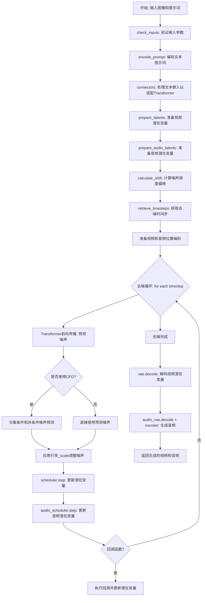
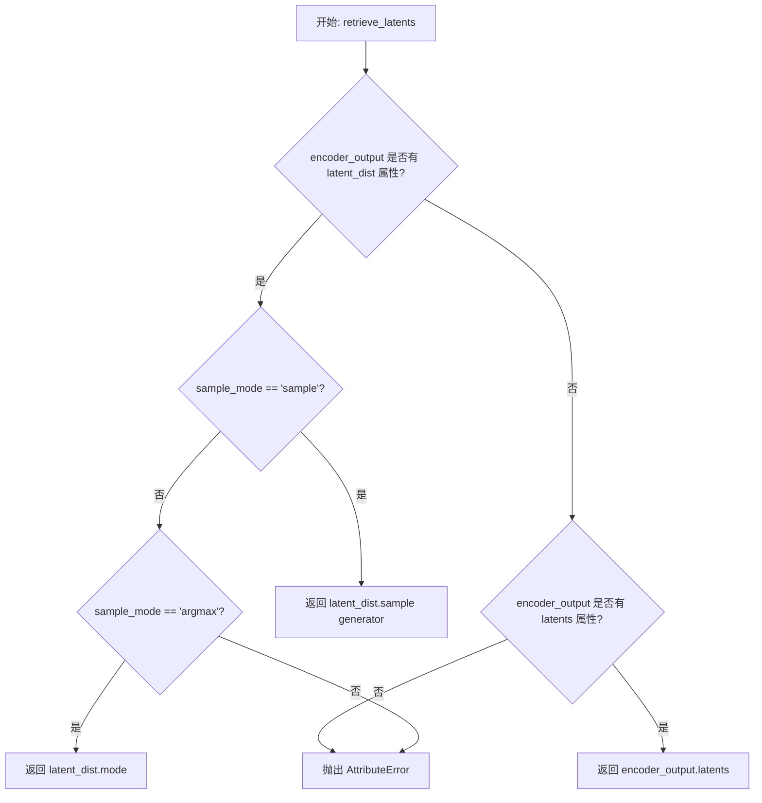
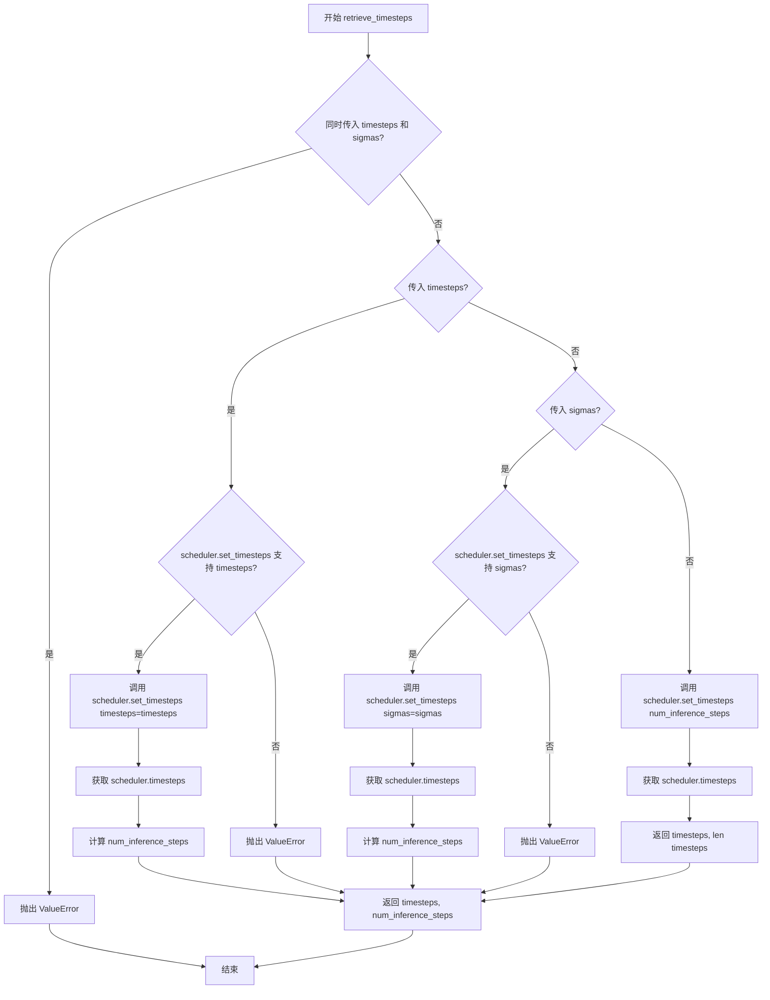
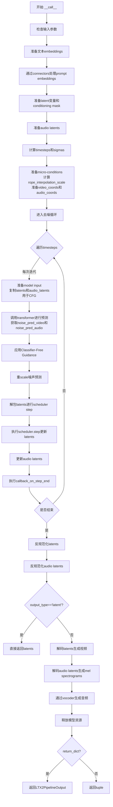
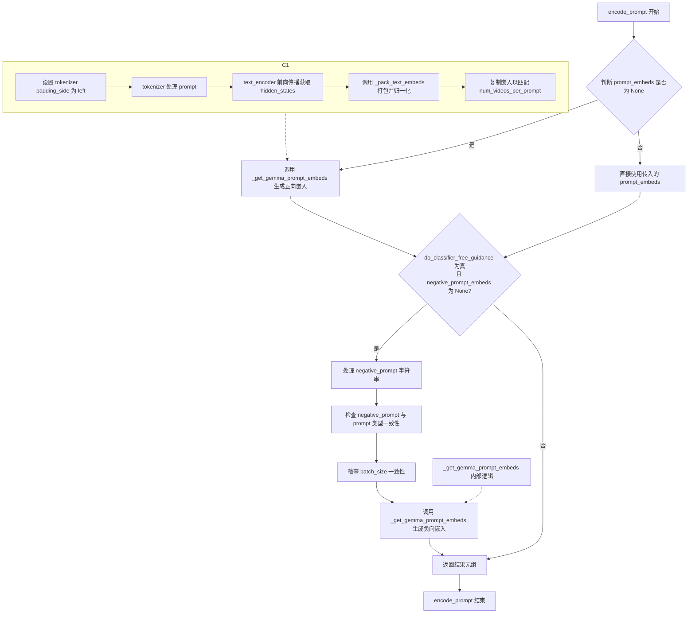
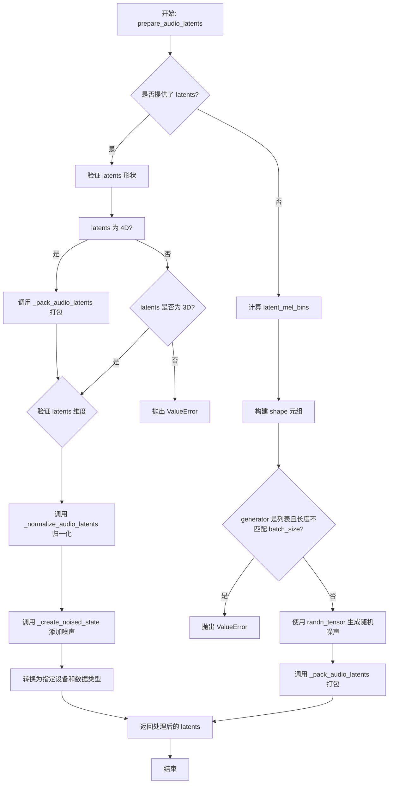
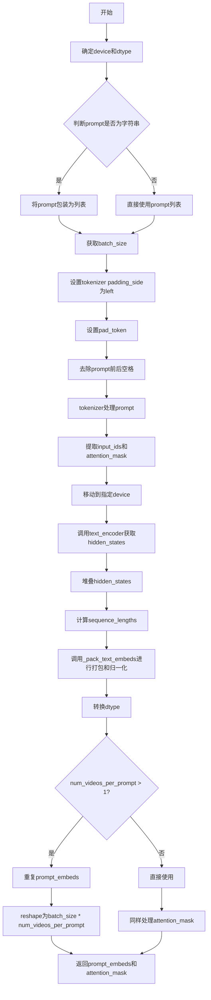

# `diffusers\src\diffusers\pipelines\ltx2\pipeline_ltx2_image2video.py` 详细设计文档

LTX2ImageToVideoPipeline是一个基于扩散模型的图像到视频生成管道，利用LTX-2 Transformer模型将静态图像转换为动态视频，同时通过音频VAE和声码器生成同步音频。该管道支持分类器自由引导、潜在变量打包/解包、文本嵌入处理和噪声调度等核心功能。

## 整体流程



## 类结构

```
DiffusionPipeline (基类)
├── FromSingleFileMixin (单文件加载混入)
└── LTX2LoraLoaderMixin (LoRA加载混入)
    └── LTX2ImageToVideoPipeline (主类)
```

## 全局变量及字段


### `XLA_AVAILABLE`
    
是否支持XLA加速

类型：`bool`
    


### `logger`
    
模块日志记录器

类型：`logging.Logger`
    


### `EXAMPLE_DOC_STRING`
    
示例文档字符串

类型：`str`
    


### `LTX2ImageToVideoPipeline.scheduler`
    
噪声调度器

类型：`FlowMatchEulerDiscreteScheduler`
    


### `LTX2ImageToVideoPipeline.vae`
    
视频VAE编码器/解码器

类型：`AutoencoderKLLTX2Video`
    


### `LTX2ImageToVideoPipeline.audio_vae`
    
音频VAE编码器/解码器

类型：`AutoencoderKLLTX2Audio`
    


### `LTX2ImageToVideoPipeline.text_encoder`
    
文本编码器

类型：`Gemma3ForConditionalGeneration`
    


### `LTX2ImageToVideoPipeline.tokenizer`
    
分词器

类型：`GemmaTokenizer | GemmaTokenizerFast`
    


### `LTX2ImageToVideoPipeline.connectors`
    
文本连接器

类型：`LTX2TextConnectors`
    


### `LTX2ImageToVideoPipeline.transformer`
    
视频Transformer模型

类型：`LTX2VideoTransformer3DModel`
    


### `LTX2ImageToVideoPipeline.vocoder`
    
音频声码器

类型：`LTX2Vocoder`
    


### `LTX2ImageToVideoPipeline.vae_spatial_compression_ratio`
    
VAE空间压缩比

类型：`int`
    


### `LTX2ImageToVideoPipeline.vae_temporal_compression_ratio`
    
VAE时间压缩比

类型：`int`
    


### `LTX2ImageToVideoPipeline.audio_vae_mel_compression_ratio`
    
音频VAE MEL压缩比

类型：`int`
    


### `LTX2ImageToVideoPipeline.audio_vae_temporal_compression_ratio`
    
音频VAE时间压缩比

类型：`int`
    


### `LTX2ImageToVideoPipeline.transformer_spatial_patch_size`
    
Transformer空间patch大小

类型：`int`
    


### `LTX2ImageToVideoPipeline.transformer_temporal_patch_size`
    
Transformer时间patch大小

类型：`int`
    


### `LTX2ImageToVideoPipeline.audio_sampling_rate`
    
音频采样率

类型：`int`
    


### `LTX2ImageToVideoPipeline.audio_hop_length`
    
音频hop长度

类型：`int`
    


### `LTX2ImageToVideoPipeline.video_processor`
    
视频处理器

类型：`VideoProcessor`
    


### `LTX2ImageToVideoPipeline.tokenizer_max_length`
    
分词器最大长度

类型：`int`
    


### `LTX2ImageToVideoPipeline.model_cpu_offload_seq`
    
模型CPU卸载顺序

类型：`str`
    


### `LTX2ImageToVideoPipeline._optional_components`
    
可选组件列表

类型：`list`
    


### `LTX2ImageToVideoPipeline._callback_tensor_inputs`
    
回调张量输入列表

类型：`list`
    


### `LTX2ImageToVideoPipeline._guidance_scale`
    
引导规模

类型：`float`
    


### `LTX2ImageToVideoPipeline._guidance_rescale`
    
引导重缩放因子

类型：`float`
    


### `LTX2ImageToVideoPipeline._attention_kwargs`
    
注意力参数字典

类型：`dict`
    


### `LTX2ImageToVideoPipeline._interrupt`
    
中断标志

类型：`bool`
    


### `LTX2ImageToVideoPipeline._num_timesteps`
    
时间步数

类型：`int`
    


### `LTX2ImageToVideoPipeline._current_timestep`
    
当前时间步

类型：`int`
    
    

## 全局函数及方法


### `retrieve_latents`

从编码器输出中提取潜在变量，支持多种采样模式（随机采样或_argmax_），同时处理不同的编码器输出结构。

参数：

- `encoder_output`：`torch.Tensor`，编码器输出对象，可能包含 `latent_dist` 属性（潜在分布）或 `latents` 属性（直接潜在变量）
- `generator`：`torch.Generator | None`，可选的随机数生成器，用于随机采样时的确定性生成
- `sample_mode`：`str`，采样模式，默认为 `"sample"`（随机采样），也可设为 `"argmax"`（取分布的众数）

返回值：`torch.Tensor`，提取的潜在变量张量

#### 流程图



#### 带注释源码

```python
# 从 diffusers.pipelines.stable_diffusion.pipeline_stable_diffusion_img2img 复制
def retrieve_latents(
    encoder_output: torch.Tensor, 
    generator: torch.Generator | None = None, 
    sample_mode: str = "sample"
):
    """
    从编码器输出中提取潜在变量。
    
    Args:
        encoder_output: 编码器输出，包含潜在分布或直接潜在变量
        generator: 可选的随机数生成器，用于随机采样
        sample_mode: 采样模式，'sample' 随机采样，'argmax' 取众数
    
    Returns:
        提取的潜在变量张量
    
    Raises:
        AttributeError: 当无法从 encoder_output 中获取潜在变量时
    """
    # 检查是否有 latent_dist 属性且模式为 sample
    if hasattr(encoder_output, "latent_dist") and sample_mode == "sample":
        # 从潜在分布中随机采样
        return encoder_output.latent_dist.sample(generator)
    # 检查是否有 latent_dist 属性且模式为 argmax
    elif hasattr(encoder_output, "latent_dist") and sample_mode == "argmax":
        # 返回潜在分布的众数（最大概率值对应的潜在变量）
        return encoder_output.latent_dist.mode()
    # 检查是否有直接的 latents 属性
    elif hasattr(encoder_output, "latents"):
        return encoder_output.latents
    else:
        # 无法识别潜在变量格式，抛出异常
        raise AttributeError("Could not access latents of provided encoder_output")
```


### `calculate_shift`

计算图像序列长度偏移用于噪声调度，通过线性插值在基础序列长度和最大序列长度之间计算偏移量，用于调整扩散模型的噪声调度计划。

参数：

- `image_seq_len`：`int`，输入图像的序列长度，用于计算偏移量
- `base_seq_len`：`int`，默认值 256，基础序列长度，用于线性插值的起始点
- `max_seq_len`：`int`，默认值 4096，最大序列长度，用于线性插值的终点
- `base_shift`：`float`，默认值 0.5，基础偏移值，对应基础序列长度的偏移
- `max_shift`：`float`，默认值 1.15，最大偏移值，对应最大序列长度的偏移

返回值：`float`，计算得到的偏移量 mu，用于噪声调度器的时间步调整

#### 流程图

```mermaid
flowchart TD
    A[开始 calculate_shift] --> B[计算斜率 m<br/>m = (max_shift - base_shift) / (max_seq_len - base_seq_len)]
    B --> C[计算截距 b<br/>b = base_shift - m * base_seq_len]
    C --> D[计算偏移量 mu<br/>mu = image_seq_len * m + b]
    D --> E[返回 mu]
    
    style A fill:#f9f,stroke:#333
    style E fill:#9f9,stroke:#333
```

#### 带注释源码

```python
# Copied from diffusers.pipelines.flux.pipeline_flux.calculate_shift
def calculate_shift(
    image_seq_len,          # 输入：图像序列长度
    base_seq_len: int = 256,        # 默认值256：基础序列长度
    max_seq_len: int = 4096,        # 默认值4096：最大序列长度
    base_shift: float = 0.5,        # 默认值0.5：基础偏移值
    max_shift: float = 1.15,        # 默认值1.15：最大偏移值
):
    """
    计算图像序列长度偏移用于噪声调度。
    
    该函数通过线性插值计算偏移量，用于调整噪声调度器的时间步。
    基于论文 Common Diffusion Noise Schedules and Sample Steps are Flawed 的发现，
    不同的序列长度需要不同的偏移值以获得更好的生成质量。
    
    数学公式:
    m = (max_shift - base_shift) / (max_seq_len - base_seq_len)  # 斜率
    b = base_shift - m * base_seq_len  # 截距
    mu = image_seq_len * m + b  # 最终偏移量
    """
    # 计算线性插值的斜率 m
    m = (max_shift - base_shift) / (max_seq_len - base_seq_len)
    
    # 计算线性插值的截距 b
    b = base_shift - m * base_seq_len
    
    # 根据输入序列长度计算偏移量 mu
    mu = image_seq_len * m + b
    
    # 返回计算得到的偏移量
    return mu
```


### `retrieve_timesteps`

从调度器获取时间步，处理自定义时间步或sigmas，并返回调度器的时间步计划和推理步数。

参数：

- `scheduler`：`SchedulerMixin`，用于获取时间步的调度器对象
- `num_inference_steps`：`int | None`，生成样本时使用的扩散步数，若使用此参数则`timesteps`必须为`None`
- `device`：`str | torch.device | None`，时间步要移动到的设备，若为`None`则不移动
- `timesteps`：`list[int] | None`，用于覆盖调度器时间步间隔策略的自定义时间步，若传递此参数则`num_inference_steps`和`sigmas`必须为`None`
- `sigmas`：`list[float] | None`，用于覆盖调度器时间步间隔策略的自定义sigmas，若传递此参数则`num_inference_steps`和`timesteps`必须为`None`
- `**kwargs`：任意关键字参数，将传递给`scheduler.set_timesteps`

返回值：`tuple[torch.Tensor, int]`，元组第一个元素是调度器的时间步计划，第二个元素是推理步数。

#### 流程图



#### 带注释源码

```python
def retrieve_timesteps(
    scheduler,
    num_inference_steps: int | None = None,
    device: str | torch.device | None = None,
    timesteps: list[int] | None = None,
    sigmas: list[float] | None = None,
    **kwargs,
):
    r"""
    Calls the scheduler's `set_timesteps` method and retrieves timesteps from the scheduler after the call. Handles
    custom timesteps. Any kwargs will be supplied to `scheduler.set_timesteps`.

    Args:
        scheduler (`SchedulerMixin`):
            The scheduler to get timesteps from.
        num_inference_steps (`int`):
            The number of diffusion steps used when generating samples with a pre-trained model. If used, `timesteps`
            must be `None`.
        device (`str` or `torch.device`, *optional*):
            The device to which the timesteps should be moved to. If `None`, the timesteps are not moved.
        timesteps (`list[int]`, *optional*):
            Custom timesteps used to override the timestep spacing strategy of the scheduler. If `timesteps` is passed,
            `num_inference_steps` and `sigmas` must be `None`.
        sigmas (`list[float]`, *optional*):
            Custom sigmas used to override the timestep spacing strategy of the scheduler. If `sigmas` is passed,
            `num_inference_steps` and `timesteps` must be `None`.

    Returns:
        `tuple[torch.Tensor, int]`: A tuple where the first element is the timestep schedule from the scheduler and the
        second element is the number of inference steps.
    """
    # 检查是否同时传入了 timesteps 和 sigmas，只能选择其中一种
    if timesteps is not None and sigmas is not None:
        raise ValueError("Only one of `timesteps` or `sigmas` can be passed. Please choose one to set custom values")
    
    # 处理自定义 timesteps 的情况
    if timesteps is not None:
        # 检查调度器的 set_timesteps 方法是否支持 timesteps 参数
        accepts_timesteps = "timesteps" in set(inspect.signature(scheduler.set_timesteps).parameters.keys())
        if not accepts_timesteps:
            raise ValueError(
                f"The current scheduler class {scheduler.__class__}'s `set_timesteps` does not support custom"
                f" timestep schedules. Please check whether you are using the correct scheduler."
            )
        # 调用调度器的 set_timesteps 方法设置自定义时间步
        scheduler.set_timesteps(timesteps=timesteps, device=device, **kwargs)
        # 从调度器获取时间步
        timesteps = scheduler.timesteps
        # 计算推理步数
        num_inference_steps = len(timesteps)
    # 处理自定义 sigmas 的情况
    elif sigmas is not None:
        # 检查调度器的 set_timesteps 方法是否支持 sigmas 参数
        accept_sigmas = "sigmas" in set(inspect.signature(scheduler.set_timesteps).parameters.keys())
        if not accept_sigmas:
            raise ValueError(
                f"The current scheduler class {scheduler.__class__}'s `set_timesteps` does not support custom"
                f" sigmas schedules. Please check whether you are using the correct scheduler."
            )
        # 调用调度器的 set_timesteps 方法设置自定义 sigmas
        scheduler.set_timesteps(sigmas=sigmas, device=device, **kwargs)
        # 从调度器获取时间步
        timesteps = scheduler.timesteps
        # 计算推理步数
        num_inference_steps = len(timesteps)
    # 默认情况：使用 num_inference_steps 设置时间步
    else:
        scheduler.set_timesteps(num_inference_steps, device=device, **kwargs)
        timesteps = scheduler.timesteps
    
    # 返回时间步和推理步数
    return timesteps, num_inference_steps
```


### `rescale_noise_cfg`

该函数是一个全局函数，用于根据 guidance_rescale 参数重缩放噪声预测张量，以改善图像质量并修复过度曝光问题。该函数基于论文 Common Diffusion Noise Schedules and Sample Steps are Flawed (Section 3.4) 的理论实现。

参数：

- `noise_cfg`：`torch.Tensor`，引导扩散过程中预测的噪声张量
- `noise_pred_text`：`torch.Tensor`，文本引导扩散过程中预测的噪声张量
- `guidance_rescale`：`float`，可选，默认值为 0.0，应用于噪声预测的重缩放因子

返回值：`torch.Tensor`，重缩放后的噪声预测张量

#### 流程图

```mermaid
flowchart TD
    A[开始] --> B[计算 noise_pred_text 的标准差 std_text]
    B --> C[计算 noise_cfg 的标准差 std_cfg]
    C --> D[计算重缩放后的噪声预测: noise_pred_rescaled = noise_cfg × std_text / std_cfg]
    D --> E[混合原始结果: noise_cfg = guidance_rescale × noise_pred_rescaled + (1 - guidance_rescale) × noise_cfg]
    E --> F[返回重缩放后的 noise_cfg]
```

#### 带注释源码

```python
def rescale_noise_cfg(noise_cfg, noise_pred_text, guidance_rescale=0.0):
    r"""
    Rescales `noise_cfg` tensor based on `guidance_rescale` to improve image quality and fix overexposure. Based on
    Section 3.4 from [Common Diffusion Noise Schedules and Sample Steps are
    Flawed](https://huggingface.co/papers/2305.08891).

    Args:
        noise_cfg (`torch.Tensor`):
            The predicted noise tensor for the guided diffusion process.
        noise_pred_text (`torch.Tensor`):
            The predicted noise tensor for the text-guided diffusion process.
        guidance_rescale (`float`, *optional*, defaults to 0.0):
            A rescale factor applied to the noise predictions.

    Returns:
        noise_cfg (`torch.Tensor`): The rescaled noise prediction tensor.
    """
    # 计算文本预测噪声的标准差（沿所有非批次维度）
    std_text = noise_pred_text.std(dim=list(range(1, noise_pred_text.ndim)), keepdim=True)
    # 计算配置噪声的标准差（沿所有非批次维度）
    std_cfg = noise_cfg.std(dim=list(range(1, noise_cfg.ndim)), keepdim=True)
    
    # 重缩放引导结果（修复过度曝光）
    # 通过将 noise_cfg 的标准差调整到与 noise_pred_text 相同的水平
    noise_pred_rescaled = noise_cfg * (std_text / std_cfg)
    
    # 通过 guidance_rescale 因子混合原始引导结果，避免图像看起来"平淡"
    # 当 guidance_rescale=0 时，返回原始 noise_cfg
    # 当 guidance_rescale=1 时，完全使用重缩放后的 noise_pred_rescaled
    noise_cfg = guidance_rescale * noise_pred_rescaled + (1 - guidance_rescale) * noise_cfg
    
    return noise_cfg
```


### `LTX2ImageToVideoPipeline.__init__`

该方法是 `LTX2ImageToVideoPipeline` 类的构造函数，负责初始化图像到视频生成管道所需的所有组件，包括调度器、VAE模型、文本编码器、分词器、连接器、变压器模型和声码器，并配置各种压缩比和处理参数。

参数：

- `scheduler`：`FlowMatchEulerDiscreteScheduler`，用于扩散过程的时间步调度
- `vae`：`AutoencoderKLLTX2Video`，视频自动编码器，用于将视频编码/解码为潜在表示
- `audio_vae`：`AutoencoderKLLTX2Audio`，音频自动编码器，用于音频潜在表示的处理
- `text_encoder`：`Gemma3ForConditionalGeneration`，文本编码器，将文本提示转换为嵌入向量
- `tokenizer`：`GemmaTokenizer | GemmaTokenizerFast`，文本分词器，用于将文本转换为token
- `connectors`：`LTX2TextConnectors`，文本连接器，用于连接文本编码器和变压器模型
- `transformer`：`LTX2VideoTransformer3DModel`，3D视频变压器模型，执行主要的去噪推理
- `vocoder`：`LTX2Vocoder`，声码器，将梅尔频谱图转换为音频波形

返回值：`None`，构造函数不返回值

#### 流程图

```mermaid
flowchart TD
    A[开始 __init__] --> B[调用父类构造函数 super().__init__]
    B --> C[register_modules 注册所有模块]
    C --> D[配置VAE压缩比]
    D --> E[配置音频VAE压缩比]
    E --> F[配置Transformer patch大小]
    F --> G[配置音频采样率和跳步长度]
    G --> H[初始化VideoProcessor]
    I[初始化tokenizer_max_length]
    I --> J[结束]
```

#### 带注释源码

```python
def __init__(
    self,
    scheduler: FlowMatchEulerDiscreteScheduler,
    vae: AutoencoderKLLTX2Video,
    audio_vae: AutoencoderKLLTX2Audio,
    text_encoder: Gemma3ForConditionalGeneration,
    tokenizer: GemmaTokenizer | GemmaTokenizerFast,
    connectors: LTX2TextConnectors,
    transformer: LTX2VideoTransformer3DModel,
    vocoder: LTX2Vocoder,
):
    """
    初始化LTX2图像到视频管道。
    
    参数:
        scheduler: 流匹配欧拉离散调度器
        vae: 视频VAE模型
        audio_vae: 音频VAE模型
        text_encoder: Gemma3文本编码器
        tokenizer: Gemma分词器
        connectors: 文本连接器
        transformer: LTX2视频变压器模型
        vocoder: 音频声码器
    """
    # 调用父类DiffusionPipeline的初始化方法
    super().__init__()

    # 注册所有模块，使它们可以通过pipeline.xxx访问
    self.register_modules(
        vae=vae,
        audio_vae=audio_vae,
        text_encoder=text_encoder,
        tokenizer=tokenizer,
        connectors=connectors,
        transformer=transformer,
        vocoder=vocoder,
        scheduler=scheduler,
    )

    # 配置VAE空间压缩比（默认32）
    self.vae_spatial_compression_ratio = (
        self.vae.spatial_compression_ratio if getattr(self, "vae", None) is not None else 32
    )
    # 配置VAE时间压缩比（默认8）
    self.vae_temporal_compression_ratio = (
        self.vae.temporal_compression_ratio if getattr(self, "vae", None) is not None else 8
    )
    # TODO: 检查MEL压缩比逻辑是否正确
    self.audio_vae_mel_compression_ratio = (
        self.audio_vae.mel_compression_ratio if getattr(self, "audio_vae", None) is not None else 4
    )
    self.audio_vae_temporal_compression_ratio = (
        self.audio_vae.temporal_compression_ratio if getattr(self, "audio_vae", None) is not None else 4
    )
    # 配置Transformer空间patch大小
    self.transformer_spatial_patch_size = (
        self.transformer.config.patch_size if getattr(self, "transformer", None) is not None else 1
    )
    # 配置Transformer时间patch大小
    self.transformer_temporal_patch_size = (
        self.transformer.config.patch_size_t if getattr(self, "transformer") is not None else 1
    )

    # 配置音频采样率（默认16000）
    self.audio_sampling_rate = (
        self.audio_vae.config.sample_rate if getattr(self, "audio_vae", None) is not None else 16000
    )
    # 配置音频跳步长度（默认160）
    self.audio_hop_length = (
        self.audio_vae.config.mel_hop_length if getattr(self, "audio_vae", None) is not None else 160
    )

    # 初始化视频处理器，使用VAE空间压缩比作为缩放因子
    self.video_processor = VideoProcessor(vae_scale_factor=self.vae_spatial_compression_ratio, resample="bilinear")
    # 配置分词器最大长度（默认1024）
    self.tokenizer_max_length = (
        self.tokenizer.model_max_length if getattr(self, "tokenizer", None) is not None else 1024
    )
```


### `LTX2ImageToVideoPipeline.__call__`

该方法是LTX2图像到视频生成Pipeline的主入口函数，接收图像和文本提示，通过扩散模型的去噪过程生成对应的视频和音频。

参数：

- `image`：`PipelineImageInput`，用于条件化视频生成的输入图像
- `prompt`：`str | list[str]`，引导视频生成的文本提示
- `negative_prompt`：`str | list[str] | None`，用于Classifier-Free Guidance的负向提示
- `height`：`int`，生成图像的高度（像素），默认512
- `width`：`int`，生成图像的宽度（像素），默认768
- `num_frames`：`int`，生成视频的帧数，默认121
- `frame_rate`：`float`，生成视频的帧率，默认24.0
- `num_inference_steps`：`int`，去噪步数，默认40
- `sigmas`：`list[float] | None`，自定义sigmas值
- `timesteps`：`list[int] | None`，自定义时间步
- `guidance_scale`：`float`，Classifier-Free Guidance的引导 scale，默认4.0
- `guidance_rescale`：`float`，噪声预测重scale因子，默认0.0
- `noise_scale`：`float`，噪声插值因子，默认0.0
- `num_videos_per_prompt`：`int`，每个提示生成的视频数量，默认1
- `generator`：`torch.Generator | list[torch.Generator] | None`，随机数生成器
- `latents`：`torch.Tensor | None`，预生成的噪声latents
- `audio_latents`：`torch.Tensor | None`，预生成的音频latents
- `prompt_embeds`：`torch.Tensor | None`，预生成的文本embeddings
- `prompt_attention_mask`：`torch.Tensor | None`，文本embeddings的attention mask
- `negative_prompt_embeds`：`torch.Tensor | None`，负向文本embeddings
- `negative_prompt_attention_mask`：`torch.Tensor | None`，负向文本attention mask
- `decode_timestep`：`float | list[float]`，解码时的时间步，默认0.0
- `decode_noise_scale`：`float | list[float] | None`，解码时的噪声scale
- `output_type`：`str`，输出格式，默认"pil"
- `return_dict`：`bool`，是否返回dict格式，默认True
- `attention_kwargs`：`dict[str, Any] | None`，传给AttentionProcessor的额外参数
- `callback_on_step_end`：`Callable[[int, int], None] | None`，每步结束时的回调函数
- `callback_on_step_end_tensor_inputs`：`list[str]`，回调函数需要的tensor输入，默认["latents"]
- `max_sequence_length`：`int`，最大序列长度，默认1024

返回值：`LTX2PipelineOutput | tuple`，当`return_dict=True`时返回`LTX2PipelineOutput`(包含frames和audio)，否则返回(video, audio)元组

#### 流程图



#### 带注释源码

```python
@torch.no_grad()
@replace_example_docstring(EXAMPLE_DOC_STRING)
def __call__(
    self,
    image: PipelineImageInput = None,
    prompt: str | list[str] = None,
    negative_prompt: str | list[str] | None = None,
    height: int = 512,
    width: int = 768,
    num_frames: int = 121,
    frame_rate: float = 24.0,
    num_inference_steps: int = 40,
    sigmas: list[float] | None = None,
    timesteps: list[int] | None = None,
    guidance_scale: float = 4.0,
    guidance_rescale: float = 0.0,
    noise_scale: float = 0.0,
    num_videos_per_prompt: int = 1,
    generator: torch.Generator | list[torch.Generator] | None = None,
    latents: torch.Tensor | None = None,
    audio_latents: torch.Tensor | None = None,
    prompt_embeds: torch.Tensor | None = None,
    prompt_attention_mask: torch.Tensor | None = None,
    negative_prompt_embeds: torch.Tensor | None = None,
    negative_prompt_attention_mask: torch.Tensor | None = None,
    decode_timestep: float | list[float] = 0.0,
    decode_noise_scale: float | list[float] | None = None,
    output_type: str = "pil",
    return_dict: bool = True,
    attention_kwargs: dict[str, Any] | None = None,
    callback_on_step_end: Callable[[int, int], None] | None = None,
    callback_on_step_end_tensor_inputs: list[str] = ["latents"],
    max_sequence_length: int = 1024,
):
    # 1. 检查callback参数，设置callback tensor inputs
    if isinstance(callback_on_step_end, (PipelineCallback, MultiPipelineCallbacks)):
        callback_on_step_end_tensor_inputs = callback_on_step_end.tensor_inputs

    # 1. Check inputs. Raise error if not correct
    self.check_inputs(
        prompt=prompt,
        height=height,
        width=width,
        callback_on_step_end_tensor_inputs=callback_on_step_end_tensor_inputs,
        prompt_embeds=prompt_embeds,
        negative_prompt_embeds=negative_prompt_embeds,
        prompt_attention_mask=prompt_attention_mask,
        negative_prompt_attention_mask=negative_prompt_attention_mask,
    )

    # 设置内部状态
    self._guidance_scale = guidance_scale
    self._guidance_rescale = guidance_rescale
    self._attention_kwargs = attention_kwargs
    self._interrupt = False
    self._current_timestep = None

    # 2. Define call parameters - 确定batch_size
    if prompt is not None and isinstance(prompt, str):
        batch_size = 1
    elif prompt is not None and isinstance(prompt, list):
        batch_size = len(prompt)
    else:
        batch_size = prompt_embeds.shape[0]

    device = self._execution_device

    # 3. Prepare text embeddings - 编码prompt
    (
        prompt_embeds,
        prompt_attention_mask,
        negative_prompt_embeds,
        negative_prompt_attention_mask,
    ) = self.encode_prompt(
        prompt=prompt,
        negative_prompt=negative_prompt,
        do_classifier_free_guidance=self.do_classifier_free_guidance,
        num_videos_per_prompt=num_videos_per_prompt,
        prompt_embeds=prompt_embeds,
        negative_prompt_embeds=negative_prompt_embeds,
        prompt_attention_mask=prompt_attention_mask,
        negative_prompt_attention_mask=negative_prompt_attention_mask,
        max_sequence_length=max_sequence_length,
        device=device,
    )
    # 连接条件和无条件embeddings用于CFG
    if self.do_classifier_free_guidance:
        prompt_embeds = torch.cat([negative_prompt_embeds, prompt_embeds], dim=0)
        prompt_attention_mask = torch.cat([negative_prompt_attention_mask, prompt_attention_mask], dim=0)

    # 创建additive attention mask用于connectors
    additive_attention_mask = (1 - prompt_attention_mask.to(prompt_embeds.dtype)) * -1000000.0
    connector_prompt_embeds, connector_audio_prompt_embeds, connector_attention_mask = self.connectors(
        prompt_embeds, additive_attention_mask, additive_mask=True
    )

    # 4. Prepare latent variables - 计算latent维度
    latent_num_frames = (num_frames - 1) // self.vae_temporal_compression_ratio + 1
    latent_height = height // self.vae_spatial_compression_ratio
    latent_width = width // self.vae_spatial_compression_ratio
    # 处理预提供的latents
    if latents is not None:
        if latents.ndim == 5:
            logger.info(
                "Got latents of shape [batch_size, latent_dim, latent_frames, latent_height, latent_width], `latent_num_frames`, `latent_height`, `latent_width` will be inferred."
            )
            _, _, latent_num_frames, latent_height, latent_width = latents.shape
        elif latents.ndim == 3:
            logger.warning(
                f"You have supplied packed `latents` of shape {latents.shape}, so the latent dims cannot be"
                f" inferred. Make sure the supplied `height`, `width`, and `num_frames` are correct."
            )
        else:
            raise ValueError(...)
    video_sequence_length = latent_num_frames * latent_height * latent_width

    # 预处理输入图像
    if latents is None:
        image = self.video_processor.preprocess(image, height=height, width=width)
        image = image.to(device=device, dtype=prompt_embeds.dtype)

    # 准备video latents和conditioning mask
    num_channels_latents = self.transformer.config.in_channels
    latents, conditioning_mask = self.prepare_latents(
        image,
        batch_size * num_videos_per_prompt,
        num_channels_latents,
        height,
        width,
        num_frames,
        noise_scale,
        torch.float32,
        device,
        generator,
        latents,
    )
    # 为CFG复制conditioning mask
    if self.do_classifier_free_guidance:
        conditioning_mask = torch.cat([conditioning_mask, conditioning_mask])

    # 计算音频参数
    duration_s = num_frames / frame_rate
    audio_latents_per_second = (
        self.audio_sampling_rate / self.audio_hop_length / float(self.audio_vae_temporal_compression_ratio)
    )
    audio_num_frames = round(duration_s * audio_latents_per_second)
    # 处理预提供的audio latents
    if audio_latents is not None:
        if audio_latents.ndim == 4:
            logger.info(...)
            _, _, audio_num_frames, _ = audio_latents.shape
        elif audio_latents.ndim == 3:
            logger.warning(...)
        else:
            raise ValueError(...)

    # 准备audio latents
    num_mel_bins = self.audio_vae.config.mel_bins if getattr(self, "audio_vae", None) is not None else 64
    latent_mel_bins = num_mel_bins // self.audio_vae_mel_compression_ratio
    num_channels_latents_audio = (
        self.audio_vae.config.latent_channels if getattr(self, "audio_vae", None) is not None else 8
    )
    audio_latents = self.prepare_audio_latents(
        batch_size * num_videos_per_prompt,
        num_channels_latents=num_channels_latents_audio,
        audio_latent_length=audio_num_frames,
        num_mel_bins=num_mel_bins,
        noise_scale=noise_scale,
        dtype=torch.float32,
        device=device,
        generator=generator,
        latents=audio_latents,
    )

    # 5. Prepare timesteps - 计算shift和sigmas
    sigmas = np.linspace(1.0, 1 / num_inference_steps, num_inference_steps) if sigmas is None else sigmas
    mu = calculate_shift(
        video_sequence_length,
        self.scheduler.config.get("base_image_seq_len", 1024),
        self.scheduler.config.get("max_image_seq_len", 4096),
        self.scheduler.config.get("base_shift", 0.95),
        self.scheduler.config.get("max_shift", 2.05),
    )

    # 为audio创建独立的scheduler副本
    audio_scheduler = copy.deepcopy(self.scheduler)
    _, _ = retrieve_timesteps(
        audio_scheduler,
        num_inference_steps,
        device,
        timesteps,
        sigmas=sigmas,
        mu=mu,
    )
    timesteps, num_inference_steps = retrieve_timesteps(
        self.scheduler,
        num_inference_steps,
        device,
        timesteps,
        sigmas=sigmas,
        mu=mu,
    )
    num_warmup_steps = max(len(timesteps) - num_inference_steps * self.scheduler.order, 0)
    self._num_timesteps = len(timesteps)

    # 6. Prepare micro-conditions - 准备RoPE位置编码
    rope_interpolation_scale = (
        self.vae_temporal_compression_ratio / frame_rate,
        self.vae_spatial_compression_ratio,
        self.vae_spatial_compression_ratio,
    )
    # 预计算视频和音频的位置坐标（每步相同）
    video_coords = self.transformer.rope.prepare_video_coords(
        latents.shape[0], latent_num_frames, latent_height, latent_width, latents.device, fps=frame_rate
    )
    audio_coords = self.transformer.audio_rope.prepare_audio_coords(
        audio_latents.shape[0], audio_num_frames, audio_latents.device
    )
    # 为CFG复制位置坐标
    if self.do_classifier_free_guidance:
        video_coords = video_coords.repeat((2,) + (1,) * (video_coords.ndim - 1))
        audio_coords = audio_coords.repeat((2,) + (1,) * (audio_coords.ndim - 1))

    # 7. Denoising loop - 主去噪循环
    with self.progress_bar(total=num_inference_steps) as progress_bar:
        for i, t in enumerate(timesteps):
            # 检查中断标志
            if self.interrupt:
                continue

            self._current_timestep = t

            # 准备模型输入（复制用于CFG）
            latent_model_input = torch.cat([latents] * 2) if self.do_classifier_free_guidance else latents
            latent_model_input = latent_model_input.to(prompt_embeds.dtype)
            audio_latent_model_input = (
                torch.cat([audio_latents] * 2) if self.do_classifier_free_guidance else audio_latents
            )
            audio_latent_model_input = audio_latent_model_input.to(prompt_embeds.dtype)

            # 扩展timestep并计算video timestep
            timestep = t.expand(latent_model_input.shape[0])
            video_timestep = timestep.unsqueeze(-1) * (1 - conditioning_mask)

            # 调用transformer进行预测
            with self.transformer.cache_context("cond_uncond"):
                noise_pred_video, noise_pred_audio = self.transformer(
                    hidden_states=latent_model_input,
                    audio_hidden_states=audio_latent_model_input,
                    encoder_hidden_states=connector_prompt_embeds,
                    audio_encoder_hidden_states=connector_audio_prompt_embeds,
                    timestep=video_timestep,
                    audio_timestep=timestep,
                    encoder_attention_mask=connector_attention_mask,
                    audio_encoder_attention_mask=connector_attention_mask,
                    num_frames=latent_num_frames,
                    height=latent_height,
                    width=latent_width,
                    fps=frame_rate,
                    audio_num_frames=audio_num_frames,
                    video_coords=video_coords,
                    audio_coords=audio_coords,
                    attention_kwargs=attention_kwargs,
                    return_dict=False,
                )
            noise_pred_video = noise_pred_video.float()
            noise_pred_audio = noise_pred_audio.float()

            # 应用Classifier-Free Guidance
            if self.do_classifier_free_guidance:
                noise_pred_video_uncond, noise_pred_video_text = noise_pred_video.chunk(2)
                noise_pred_video = noise_pred_video_uncond + self.guidance_scale * (
                    noise_pred_video_text - noise_pred_video_uncond
                )

                noise_pred_audio_uncond, noise_pred_audio_text = noise_pred_audio.chunk(2)
                noise_pred_audio = noise_pred_audio_uncond + self.guidance_scale * (
                    noise_pred_audio_text - noise_pred_audio_uncond
                )

                # 重scale噪声预测
                if self.guidance_rescale > 0.0:
                    noise_pred_video = rescale_noise_cfg(
                        noise_pred_video, noise_pred_video_text, guidance_rescale=self.guidance_rescale
                    )
                    noise_pred_audio = rescale_noise_cfg(
                        noise_pred_audio, noise_pred_audio_text, guidance_rescale=self.guidance_rescale
                    )

            # 解包latents进行scheduler step
            noise_pred_video = self._unpack_latents(
                noise_pred_video,
                latent_num_frames,
                latent_height,
                latent_width,
                self.transformer_spatial_patch_size,
                self.transformer_temporal_patch_size,
            )
            latents = self._unpack_latents(
                latents,
                latent_num_frames,
                latent_height,
                latent_width,
                self.transformer_spatial_patch_size,
                self.transformer_temporal_patch_size,
            )

            # 计算上一步的预测latents
            noise_pred_video = noise_pred_video[:, :, 1:]
            noise_latents = latents[:, :, 1:]
            pred_latents = self.scheduler.step(noise_pred_video, t, noise_latents, return_dict=False)[0]

            # 拼接第一帧（保持conditioning）和预测帧
            latents = torch.cat([latents[:, :, :1], pred_latents], dim=2)
            # 重新打包latents
            latents = self._pack_latents(
                latents, self.transformer_spatial_patch_size, self.transformer_temporal_patch_size
            )

            # Audio latents使用独立scheduler更新
            audio_latents = audio_scheduler.step(noise_pred_audio, t, audio_latents, return_dict=False)[0]

            # 执行callback
            if callback_on_step_end is not None:
                callback_kwargs = {}
                for k in callback_on_step_end_tensor_inputs:
                    callback_kwargs[k] = locals()[k]
                callback_outputs = callback_on_step_end(self, i, t, callback_kwargs)

                latents = callback_outputs.pop("latents", latents)
                prompt_embeds = callback_outputs.pop("prompt_embeds", prompt_embeds)

            # 更新进度条
            if i == len(timesteps) - 1 or ((i + 1) > num_warmup_steps and (i + 1) % self.scheduler.order == 0):
                progress_bar.update()

            # XLA支持
            if XLA_AVAILABLE:
                xm.mark_step()

    # 8. 解包并反规范化最终latents
    latents = self._unpack_latents(
        latents,
        latent_num_frames,
        latent_height,
        latent_width,
        self.transformer_spatial_patch_size,
        self.transformer_temporal_patch_size,
    )
    latents = self._denormalize_latents(
        latents, self.vae.latents_mean, self.vae.latents_std, self.vae.config.scaling_factor
    )

    # 反规范化audio latents
    audio_latents = self._denormalize_audio_latents(
        audio_latents, self.audio_vae.latents_mean, self.audio_vae.latents_std
    )
    audio_latents = self._unpack_audio_latents(audio_latents, audio_num_frames, num_mel_bins=latent_mel_bins)

    # 9. 解码或直接返回latents
    if output_type == "latent":
        video = latents
        audio = audio_latents
    else:
        # 准备解码参数
        latents = latents.to(prompt_embeds.dtype)

        if not self.vae.config.timestep_conditioning:
            timestep = None
        else:
            # 添加噪声到latents用于解码
            noise = randn_tensor(latents.shape, generator=generator, device=device, dtype=latents.dtype)
            if not isinstance(decode_timestep, list):
                decode_timestep = [decode_timestep] * batch_size
            if decode_noise_scale is None:
                decode_noise_scale = decode_timestep
            elif not isinstance(decode_noise_scale, list):
                decode_noise_scale = [decode_noise_scale] * batch_size

            timestep = torch.tensor(decode_timestep, device=device, dtype=latents.dtype)
            decode_noise_scale = torch.tensor(decode_noise_scale, device=device, dtype=latents.dtype)[
                :, None, None, None, None
            ]
            latents = (1 - decode_noise_scale) * latents + decode_noise_scale * noise

        # 解码video latents
        latents = latents.to(self.vae.dtype)
        video = self.vae.decode(latents, timestep, return_dict=False)[0]
        video = self.video_processor.postprocess_video(video, output_type=output_type)

        # 解码audio latents并通过vocoder生成音频
        audio_latents = audio_latents.to(self.audio_vae.dtype)
        generated_mel_spectrograms = self.audio_vae.decode(audio_latents, return_dict=False)[0]
        audio = self.vocoder(generated_mel_spectrograms)

    # 释放模型资源
    self.maybe_free_model_hooks()

    # 返回结果
    if not return_dict:
        return (video, audio)

    return LTX2PipelineOutput(frames=video, audio=audio)
```


### `LTX2ImageToVideoPipeline.encode_prompt`

该方法负责将文本提示（prompt）编码为文本编码器的隐藏状态（hidden states），支持分类器自由引导（Classifier-Free Guidance，CFG），可同时处理正向提示和负向提示，生成对应的嵌入向量和注意力掩码，供后续视频生成流程使用。

参数：

- `self`：`LTX2ImageToVideoPipeline` 实例，Pipeline 对象本身
- `prompt`：`str | list[str]`，要编码的正向提示文本，可以是单个字符串或字符串列表
- `negative_prompt`：`str | list[str] | None`，不参与引导的负向提示文本，用于 CFG 引导，默认为 None
- `do_classifier_free_guidance`：`bool`，是否启用分类器自由引导，默认为 True
- `num_videos_per_prompt`：`int`，每个提示生成的视频数量，用于批量生成，默认为 1
- `prompt_embeds`：`torch.Tensor | None`，预生成的正向提示嵌入向量，如果提供则直接使用而不从 prompt 生成
- `negative_prompt_embeds`：`torch.Tensor | None`，预生成的负向提示嵌入向量
- `prompt_attention_mask`：`torch.Tensor | None`，正向提示的注意力掩码，用于标识有效 token
- `negative_prompt_attention_mask`：`torch.Tensor | None`，负向提示的注意力掩码
- `max_sequence_length`：`int`，最大序列长度，默认为 1024
- `scale_factor`：`int`，归一化缩放因子，用于文本嵌入的规范化处理，默认为 8
- `device`：`torch.device | None`，计算设备，默认为执行设备
- `dtype`：`torch.dtype | None`，数据类型，默认为 text_encoder 的数据类型

返回值：`tuple[torch.Tensor, torch.Tensor, torch.Tensor, torch.Tensor]`，返回四个张量组成的元组：
- `prompt_embeds`：正向提示的文本嵌入，形状为 `(batch_size * num_videos_per_prompt, seq_len, hidden_dim * num_layers)`
- `prompt_attention_mask`：正向提示的注意力掩码，形状为 `(batch_size * num_videos_per_prompt, seq_len)`
- `negative_prompt_embeds`：负向提示的文本嵌入，形状同上
- `negative_prompt_attention_mask`：负向提示的注意力掩码，形状同上

#### 流程图



#### 带注释源码

```python
def encode_prompt(
    self,
    prompt: str | list[str],
    negative_prompt: str | list[str] | None = None,
    do_classifier_free_guidance: bool = True,
    num_videos_per_prompt: int = 1,
    prompt_embeds: torch.Tensor | None = None,
    negative_prompt_embeds: torch.Tensor | None = None,
    prompt_attention_mask: torch.Tensor | None = None,
    negative_prompt_attention_mask: torch.Tensor | None = None,
    max_sequence_length: int = 1024,
    scale_factor: int = 8,
    device: torch.device | None = None,
    dtype: torch.dtype | None = None,
):
    r"""
    Encodes the prompt into text encoder hidden states.

    Args:
        prompt (`str` or `list[str]`, *optional*):
            prompt to be encoded
        negative_prompt (`str` or `list[str]`, *optional*):
            The prompt or prompts not to guide the image generation. If not defined, one has to pass
            `negative_prompt_embeds` instead. Ignored when not using guidance (i.e., ignored if `guidance_scale` is
            less than `1`).
        do_classifier_free_guidance (`bool`, *optional*, defaults to `True`):
            Whether to use classifier free guidance or not.
        num_videos_per_prompt (`int`, *optional*, defaults to 1):
            Number of videos that should be generated per prompt. torch device to place the resulting embeddings on
        prompt_embeds (`torch.Tensor`, *optional*):
            Pre-generated text embeddings. Can be used to easily tweak text inputs, *e.g.* prompt weighting. If not
            provided, text embeddings will be generated from `prompt` input argument.
        negative_prompt_embeds (`torch.Tensor`, *optional*):
            Pre-generated negative text embeddings. Can be used to easily tweak text inputs, *e.g.* prompt
            weighting. If not provided, negative_prompt_embeds will be generated from `negative_prompt` input
            argument.
        device: (`torch.device`, *optional*):
            torch device
        dtype: (`torch.dtype`, *optional*):
            torch dtype
    """
    # 确定计算设备，优先使用传入的 device，否则使用 Pipeline 的执行设备
    device = device or self._execution_device

    # 标准化 prompt 输入：如果是单个字符串，转换为列表，方便批量处理
    prompt = [prompt] if isinstance(prompt, str) else prompt
    
    # 确定 batch_size：如果传入了 prompt，则使用 prompt 列表长度；否则使用 prompt_embeds 的 batch 维度
    if prompt is not None:
        batch_size = len(prompt)
    else:
        batch_size = prompt_embeds.shape[0]

    # 如果没有传入预计算的 prompt_embeds，则调用内部方法从原始文本生成
    if prompt_embeds is None:
        prompt_embeds, prompt_attention_mask = self._get_gemma_prompt_embeds(
            prompt=prompt,
            num_videos_per_prompt=num_videos_per_prompt,
            max_sequence_length=max_sequence_length,
            scale_factor=scale_factor,
            device=device,
            dtype=dtype,
        )

    # 如果启用 CFG 且没有传入负向嵌入，则需要生成负向嵌入
    if do_classifier_free_guidance and negative_prompt_embeds is None:
        # 如果没有提供负向提示，默认使用空字符串
        negative_prompt = negative_prompt or ""
        # 将负向提示扩展为与 batch_size 相同的长度
        negative_prompt = batch_size * [negative_prompt] if isinstance(negative_prompt, str) else negative_prompt

        # 类型检查：负向提示类型必须与正向提示一致
        if prompt is not None and type(prompt) is not type(negative_prompt):
            raise TypeError(
                f"`negative_prompt` should be the same type to `prompt`, but got {type(negative_prompt)} !="
                f" {type(prompt)}."
            )
        # batch_size 一致性检查
        elif batch_size != len(negative_prompt):
            raise ValueError(
                f"`negative_prompt`: {negative_prompt} has batch size {len(negative_prompt)}, but `prompt`:"
                f" {prompt} has batch size {batch_size}. Please make sure that passed `negative_prompt` matches"
                " the batch size of `prompt`."
            )

        # 调用相同的嵌入生成方法生成负向提示的嵌入向量
        negative_prompt_embeds, negative_prompt_attention_mask = self._get_gemma_prompt_embeds(
            prompt=negative_prompt,
            num_videos_per_prompt=num_videos_per_prompt,
            max_sequence_length=max_sequence_length,
            scale_factor=scale_factor,
            device=device,
            dtype=dtype,
        )

    # 返回四个张量：正向嵌入+掩码，负向嵌入+掩码
    return prompt_embeds, prompt_attention_mask, negative_prompt_embeds, negative_prompt_attention_mask
```


### `LTX2ImageToVideoPipeline.check_inputs`

该方法用于验证图像转视频管道的输入参数是否合法，包括检查高度和宽度是否能被32整除、prompt和prompt_embeds的互斥性、attention mask的完整性等核心约束。

参数：

- `prompt`：`str | list[str] | None`，用户输入的文本提示，用于指导视频生成
- `height`：`int`，生成视频的高度（像素），必须能被32整除
- `width`：`int`，生成视频的宽度（像素），必须能被32整除
- `callback_on_step_end_tensor_inputs`：`list[str] | None`，每步结束后回调函数可访问的张量输入列表
- `prompt_embeds`：`torch.Tensor | None`，预生成的文本嵌入向量
- `negative_prompt_embeds`：`torch.Tensor | None`，预生成的负面文本嵌入向量
- `prompt_attention_mask`：`torch.Tensor | None`，文本嵌入的注意力掩码
- `negative_prompt_attention_mask`：`torch.Tensor | None`，负面文本嵌入的注意力掩码

返回值：`None`，该方法仅进行参数验证，不返回任何值

#### 流程图

```mermaid
flowchart TD
    A[开始 check_inputs 验证] --> B{height % 32 == 0 && width % 32 == 0?}
    B -->|否| C[抛出 ValueError: 高度和宽度必须能被32整除]
    B -->|是| D{callback_on_step_end_tensor_inputs 是否为None?}
    D -->|否| E{callback_on_step_end_tensor_inputs 中的所有元素是否都在 self._callback_tensor_inputs 中?}
    E -->|否| F[抛出 ValueError: 回调张量输入不合法]
    E -->|是| G{prompt 和 prompt_embeds 是否同时非空?}
    D -->|是| G
    G -->|是| H[抛出 ValueError: prompt 和 prompt_embeds 不能同时提供]
    G -->|否| I{prompt 和 prompt_embeds 是否都为空?]
    I -->|是| J[抛出 ValueError: 必须提供 prompt 或 prompt_embeds 之一]
    I -->|否| K{prompt 是否为 str 或 list 类型?}
    K -->|否| L[抛出 ValueError: prompt 必须是 str 或 list 类型]
    K -->|是| M{prompt_embeds 非空时 prompt_attention_mask 是否为空?}
    M -->|是| N[抛出 ValueError: 提供 prompt_embeds 时必须提供 prompt_attention_mask]
    M -->|否| O{negative_prompt_embeds 非空时 negative_prompt_attention_mask 是否为空?}
    O -->|是| P[抛出 ValueError: 提供 negative_prompt_embeds 时必须提供 negative_prompt_attention_mask]
    O -->|否| Q{prompt_embeds 和 negative_prompt_embeds 是否都非空?}
    Q -->|是| R{prompt_embeds 和 negative_prompt_embeds 形状是否相同?}
    R -->|否| S[抛出 ValueError: prompt_embeds 和 negative_prompt_embeds 形状必须相同]
    R -->|是| T{prompt_attention_mask 和 negative_prompt_attention_mask 形状是否相同?}
    T -->|否| U[抛出 ValueError: attention_mask 形状必须匹配]
    T -->|是| V[验证通过，方法结束]
    Q -->|否| V
    C --> V
    F --> V
    H --> V
    J --> V
    L --> V
    N --> V
    P --> V
    S --> V
    U --> V
```

#### 带注释源码

```python
def check_inputs(
    self,
    prompt,
    height,
    width,
    callback_on_step_end_tensor_inputs=None,
    prompt_embeds=None,
    negative_prompt_embeds=None,
    prompt_attention_mask=None,
    negative_prompt_attention_mask=None,
):
    # 检查输出图像尺寸是否符合模型的压缩比要求（VAE的spatial_compression_ratio默认为32）
    if height % 32 != 0 or width % 32 != 0:
        raise ValueError(f"`height` and `width` have to be divisible by 32 but are {height} and {width}.")

    # 验证回调函数张量输入是否在允许的列表中，防止访问不允许的张量
    if callback_on_step_end_tensor_inputs is not None and not all(
        k in self._callback_tensor_inputs for k in callback_on_step_end_tensor_inputs
    ):
        raise ValueError(
            f"`callback_on_step_end_tensor_inputs` has to be in {self._callback_tensor_inputs}, but found {[k for k in callback_on_step_end_tensor_inputs if k not in self._callback_tensor_inputs]}"
        )

    # prompt和prompt_embeds是互斥的，不能同时提供
    if prompt is not None and prompt_embeds is not None:
        raise ValueError(
            f"Cannot forward both `prompt`: {prompt} and `prompt_embeds`: {prompt_embeds}. Please make sure to"
            " only forward one of the two."
        )
    # 至少需要提供其中之一
    elif prompt is None and prompt_embeds is None:
        raise ValueError(
            "Provide either `prompt` or `prompt_embeds`. Cannot leave both `prompt` and `prompt_embeds` undefined."
        )
    # prompt必须是字符串或列表类型
    elif prompt is not None and (not isinstance(prompt, str) and not isinstance(prompt, list)):
        raise ValueError(f"`prompt` has to be of type `str` or `list` but is {type(prompt)}")

    # 如果提供了prompt_embeds，必须同时提供对应的attention mask
    if prompt_embeds is not None and prompt_attention_mask is None:
        raise ValueError("Must provide `prompt_attention_mask` when specifying `prompt_embeds`.")

    # 如果提供了negative_prompt_embeds，必须同时提供对应的attention mask
    if negative_prompt_embeds is not None and negative_prompt_attention_mask is None:
        raise ValueError("Must provide `negative_prompt_attention_mask` when specifying `negative_prompt_embeds`.")

    # 如果同时提供了两组prompt embeds，验证它们的形状是否一致
    if prompt_embeds is not None and negative_prompt_embeds is not None:
        if prompt_embeds.shape != negative_prompt_embeds.shape:
            raise ValueError(
                "`prompt_embeds` and `negative_prompt_embeds` must have the same shape when passed directly, but"
                f" got: `prompt_embeds` {prompt_embeds.shape} != `negative_prompt_embeds`"
                f" {negative_prompt_embeds.shape}."
            )
        if prompt_attention_mask.shape != negative_prompt_attention_mask.shape:
            raise ValueError(
                "`prompt_attention_mask` and `negative_prompt_attention_mask` must have the same shape when passed directly, but"
                f" got: `prompt_attention_mask` {prompt_attention_mask.shape} != `negative_prompt_attention_mask`"
                f" {negative_prompt_attention_mask.shape}."
            )
```


### `LTX2ImageToVideoPipeline.prepare_latents`

该方法负责为 LTX2 图像到视频生成管道准备初始潜在变量（latents）和条件掩码（conditioning mask）。它首先根据 VAE 的压缩比调整输入尺寸，然后如果提供了图像则将其编码为潜在变量，否则使用提供的潜在变量或生成随机噪声，最后对潜在变量进行归一化、加噪处理，并打包成适合 Transformer 处理的格式。

参数：

- `self`：类的实例，包含 VAE、Transformer 等模型组件以及压缩比配置
- `image`：`torch.Tensor | None`，输入图像，用于编码为初始潜在变量
- `batch_size`：`int = 1`，批处理大小
- `num_channels_latents`：`int = 128`，潜在变量的通道数，由 Transformer 的输入通道数决定
- `height`：`int = 512`，输入图像的高度（像素）
- `width`：`int = 704`，输入图像的宽度（像素）
- `num_frames`：`int = 161`，要生成的视频帧数
- `noise_scale`：`float = 0.0`，噪声插值因子，控制纯噪声与去噪潜在变量之间的混合比例
- `dtype`：`torch.dtype | None`，潜在变量的目标数据类型
- `device`：`torch.device | None`，潜在变量要放置的目标设备
- `generator`：`torch.Generator | None`，随机数生成器，用于确保可重复性
- `latents`：`torch.Tensor | None`，预提供的潜在变量，如果为 None 则从图像编码生成

返回值：`torch.Tensor`，返回两个张量的元组——打包后的潜在变量和条件掩码

#### 流程图

```mermaid
flowchart TD
    A[开始 prepare_latents] --> B{提供 latents?}
    B -->|是| C[调整尺寸: height/width/num_frames 除以压缩比]
    B -->|否| D[计算目标形状: batch_size, num_channels_latents, num_frames, height, width]
    
    C --> E[创建零条件掩码 mask_shape]
    E --> F[设置第一帧为条件帧: mask[:, :, 0] = 1.0]
    F --> G{latents 是 5D?}
    G -->|是| H[归一化 latents]
    H --> I[创建带噪状态: _create_noised_state with noise_scale * (1 - mask)]
    I --> J[打包 latents: _pack_latents]
    J --> K[打包条件掩码: _pack_latents 并 squeeze]
    K --> L{形状检查: latents[:2] == mask[:2]?}
    L -->|是| M[返回 latents 和 mask]
    L -->|否| N[抛出 ValueError]
    
    G -->|否| O[直接使用提供的 latents]
    O --> K
    
    D --> P{提供 image?}
    P -->|是| Q{generator 是列表?}
    P -->|否| R[生成随机噪声 randn_tensor]
    
    Q -->|是| S[遍历图像列表，使用对应 generator 编码]
    Q -->|否| T[使用统一 generator 编码图像]
    S --> U[拼接所有 init_latents]
    T --> U
    
    U --> V[归一化: _normalize_latents]
    V --> W[沿时间维度重复: repeat 1, 1, num_frames, 1, 1]
    W --> X[创建条件掩码: 全零 + 第一帧为1]
    X --> Y[生成噪声: randn_tensor shape]
    Y --> Z[插值: init_latents * mask + noise * (1 - mask)]
    Z --> AA[打包 mask: _pack_latents]
    AA --> AB[打包 latents: _pack_latents]
    AB --> M
    
    R --> AC[随机噪声直接打包]
    AC --> AD[返回噪声和空/零 mask]
    
    N --> AE[错误: 形状不匹配]
```

#### 带注释源码

```python
def prepare_latents(
    self,
    image: torch.Tensor | None = None,
    batch_size: int = 1,
    num_channels_latents: int = 128,
    height: int = 512,
    width: int = 704,
    num_frames: int = 161,
    noise_scale: float = 0.0,
    dtype: torch.dtype | None = None,
    device: torch.device | None = None,
    generator: torch.Generator | None = None,
    latents: torch.Tensor | None = None,
) -> torch.Tensor:
    # 第一步：根据 VAE 的空间和时间压缩比调整输入尺寸
    # 这些压缩比定义了从像素空间到潜在空间的降采样比例
    height = height // self.vae_spatial_compression_ratio
    width = width // self.vae_spatial_compression_ratio
    # 时间维度压缩：(num_frames - 1) // compression + 1 确保正确处理边界
    num_frames = (num_frames - 1) // self.vae_temporal_compression_ratio + 1

    # 计算潜在变量的目标形状 [B, C, F, H, W]
    shape = (batch_size, num_channels_latents, num_frames, height, width)
    # 条件掩码的形状，用于标记哪些帧是条件帧（第一帧）
    mask_shape = (batch_size, 1, num_frames, height, width)

    # 情况一：用户提供了预计算的潜在变量
    if latents is not None:
        # 创建零条件掩码，然后只将第一帧设为条件帧（用于图像到视频的条件生成）
        conditioning_mask = latents.new_zeros(mask_shape)
        conditioning_mask[:, :, 0] = 1.0
        
        # 如果提供的是 5D 张量 [B, C, F, H, W]，需要归一化并添加噪声
        if latents.ndim == 5:
            # 使用 VAE 的统计量（均值和标准差）进行归一化
            latents = self._normalize_latents(
                latents, self.vae.latents_mean, self.vae.latents_std, self.vae.config.scaling_factor
            )
            # 对于非条件帧（非第一帧），根据 noise_scale 添加噪声
            # 条件帧保持干净，不添加噪声
            latents = self._create_noised_state(latents, noise_scale * (1 - conditioning_mask), generator)
            # 打包潜在变量：从 [B, C, F, H, W] 转换为 [B, S, D] 格式
            # 其中 S 是有效序列长度，D 是特征维度
            latents = self._pack_latents(
                latents, self.transformer_spatial_patch_size, self.transformer_temporal_patch_size
            )
        
        # 同样打包条件掩码
        conditioning_mask = self._pack_latents(
            conditioning_mask, self.transformer_spatial_patch_size, self.transformer_temporal_patch_size
        ).squeeze(-1)
        
        # 验证提供的潜在变量形状是否与预期匹配
        if latents.ndim != 3 or latents.shape[:2] != conditioning_mask.shape:
            raise ValueError(
                f"Provided `latents` tensor has shape {latents.shape}, but the expected shape is {conditioning_mask.shape + (num_channels_latents,)}."
            )
        
        # 返回处理后的潜在变量和条件掩码
        return latents.to(device=device, dtype=dtype), conditioning_mask

    # 情况二：没有提供潜在变量，需要从图像编码生成
    # 检查 generator 列表长度是否与 batch_size 匹配
    if isinstance(generator, list):
        if len(generator) != batch_size:
            raise ValueError(
                f"You have passed a list of generators of length {len(generator)}, but requested an effective batch"
                f" size of {batch_size}. Make sure the batch size matches the length of the generators."
            )

        # 使用列表中的每个 generator 分别编码对应的图像
        init_latents = [
            retrieve_latents(self.vae.encode(image[i].unsqueeze(0).unsqueeze(2)), generator[i], "argmax")
            for i in range(batch_size)
        ]
    else:
        # 使用同一个 generator 编码所有图像
        init_latents = [
            retrieve_latents(self.vae.encode(img.unsqueeze(0).unsqueeze(2)), generator, "argmax") for img in image
        ]

    # 拼接所有图像编码得到的潜在变量并转换数据类型
    init_latents = torch.cat(init_latents, dim=0).to(dtype)
    # 归一化潜在变量
    init_latents = self._normalize_latents(init_latents, self.vae.latents_mean, self.vae.latents_std)
    # 沿时间维度重复第一帧的潜在变量，以填充所有帧
    # 这是因为图像到视频生成中，第一帧是条件帧，后续帧需要生成
    init_latents = init_latents.repeat(1, 1, num_frames, 1, 1)

    # 创建条件掩码：只有第一帧是条件帧（值为1.0），其余帧为0
    conditioning_mask = torch.zeros(mask_shape, device=device, dtype=dtype)
    conditioning_mask[:, :, 0] = 1.0

    # 生成随机噪声用于去噪过程
    noise = randn_tensor(shape, generator=generator, device=device, dtype=dtype)
    # 插值：条件帧使用图像潜在变量，非条件帧使用随机噪声
    latents = init_latents * conditioning_mask + noise * (1 - conditioning_mask)

    # 打包条件掩码和潜在变量为 Transformer 所需的格式
    conditioning_mask = self._pack_latents(
        conditioning_mask, self.transformer_spatial_patch_size, self.transformer_temporal_patch_size
    ).squeeze(-1)
    latents = self._pack_latents(
        latents, self.transformer_spatial_patch_size, self.transformer_temporal_patch_size
    )

    return latents, conditioning_mask
```


### `LTX2ImageToVideoPipeline.prepare_audio_latents`

该方法用于为图像到视频生成管道准备音频潜在表示（audio latents）。它处理用户提供的潜在表示（如有），并在未提供时生成新的潜在表示，包括音频潜在表示的打包（packing）、归一化（normalization）和加噪（noising）操作。

参数：

- `self`：`LTX2ImageToVideoPipeline` 实例本身
- `batch_size`：`int`，默认为 1，批次大小
- `num_channels_latents`：`int`，默认为 8，音频潜在表示的通道数
- `audio_latent_length`：`int`，默认为 1，音频潜在表示的长度（1 仅为虚拟值）
- `num_mel_bins`：`int`，默认为 64，梅尔 bins 的数量
- `noise_scale`：`float`，默认为 0.0，噪声插值因子
- `dtype`：`torch.dtype | None`，张量的数据类型
- `device`：`torch.device | None`，张量存放的设备
- `generator`：`torch.Generator | None`，用于生成确定性随机数的生成器
- `latents`：`torch.Tensor | None`，可选的预生成音频潜在表示

返回值：`torch.Tensor`，处理后的音频潜在表示

#### 流程图



#### 带注释源码

```python
def prepare_audio_latents(
    self,
    batch_size: int = 1,
    num_channels_latents: int = 8,
    audio_latent_length: int = 1,  # 1 is just a dummy value
    num_mel_bins: int = 64,
    noise_scale: float = 0.0,
    dtype: torch.dtype | None = None,
    device: torch.device | None = None,
    generator: torch.Generator | None = None,
    latents: torch.Tensor | None = None,
) -> torch.Tensor:
    """
    准备音频潜在表示。
    
    Args:
        batch_size: 批次大小，默认为 1
        num_channels_latents: 音频潜在表示的通道数，默认为 8
        audio_latent_length: 音频潜在表示的长度，默认为 1
        num_mel_bins: 梅尔 bins 的数量，默认为 64
        noise_scale: 噪声插值因子，默认为 0.0
        dtype: 张量的数据类型
        device: 张量存放的设备
        generator: 用于生成确定性随机数的生成器
        latents: 可选的预生成音频潜在表示
    
    Returns:
        处理后的音频潜在表示张量
    """
    # 如果用户提供了 latents，则进行处理
    if latents is not None:
        # 验证并处理 latents 形状
        if latents.ndim == 4:
            # latents 形状为 [B, C, L, M]，需要打包
            # 其中 B=batch, C=channels, L=latent audio length, M=mel bins
            latents = self._pack_audio_latents(latents)
        
        # 验证维度是否为 3D
        if latents.ndim != 3:
            raise ValueError(
                f"Provided `latents` tensor has shape {latents.shape}, "
                "but the expected shape is [batch_size, num_seq, num_features]."
            )
        
        # 归一化音频潜在表示
        latents = self._normalize_audio_latents(
            latents, self.audio_vae.latents_mean, self.audio_vae.latents_std
        )
        
        # 创建带噪声的状态
        latents = self._create_noised_state(latents, noise_scale, generator)
        
        # 转换到指定设备和数据类型
        return latents.to(device=device, dtype=dtype)

    # TODO: 确认此逻辑是否正确
    # 计算压缩后的梅尔 bins 数量
    # num_mel_bins 除以音频 VAE 的梅尔压缩比
    latent_mel_bins = num_mel_bins // self.audio_vae_mel_compression_ratio

    # 构建期望的潜在表示形状
    # [batch_size, num_channels_latents, audio_latent_length, latent_mel_bins]
    shape = (batch_size, num_channels_latents, audio_latent_length, latent_mel_bins)

    # 验证生成器列表长度与批次大小是否匹配
    if isinstance(generator, list) and len(generator) != batch_size:
        raise ValueError(
            f"You have passed a list of generators of length {len(generator)}, "
            f"but requested an effective batch size of {batch_size}. "
            "Make sure the batch size matches the length of the generators."
        )

    # 使用随机噪声生成 latents
    # 形状: [batch_size, num_channels_latents, audio_latent_length, latent_mel_bins]
    latents = randn_tensor(shape, generator=generator, device=device, dtype=dtype)
    
    # 打包 latents 到序列形式
    # 转换为 [batch_size, seq_len, num_features] 形式
    latents = self._pack_audio_latents(latents)
    
    return latents
```


### `LTX2ImageToVideoPipeline._pack_text_embeds`

该函数负责将文本编码器（ Gemma3ForConditionalGeneration ）输出的多层隐藏状态进行打包和规范化处理。它通过创建填充掩码来识别有效令牌位置，然后对非填充区域的隐藏状态进行 min-max 规范化，最后将四维张量（batch, seq, hidden, layers）扁平化为三维张量（batch, seq, hidden*layers），以便后续 transformer 模型使用。

参数：

- `text_hidden_states`：`torch.Tensor`，形状为 `(batch_size, seq_len, hidden_dim, num_layers)`，来自文本编码器的每层隐藏状态
- `sequence_lengths`：`torch.Tensor`，形状为 `(batch_size,)`，每个批次实例的有效（非填充）令牌数量
- `device`：`str | torch.device`，用于放置结果嵌入的张量设备
- `padding_side`：`str`，可选，默认为 `"left"`，文本分词器的填充方向
- `scale_factor`：`int`，可选，默认为 `8`，用于乘以规范化隐藏状态的缩放因子
- `eps`：`float`，可选，默认为 `1e-6`，用于数值稳定性的微小正值

返回值：`torch.Tensor`，形状为 `(batch_size, seq_len, hidden_dim * num_layers)`，规范化并扁平化的文本编码器隐藏状态

#### 流程图

```mermaid
flowchart TD
    A[开始: _pack_text_embeds] --> B[获取输入张量形状: batch_size, seq_len, hidden_dim, num_layers]
    B --> C[保存原始数据类型 original_dtype]
    C --> D{确定 padding_side}
    D -->|right| E[创建右填充掩码: token_indices < sequence_lengths]
    D -->|left| F[创建左填充掩码: token_indices >= seq_len - sequence_lengths]
    D -->|其他| G[抛出 ValueError 异常]
    E --> H[扩展掩码维度: [B, S] -> [B, S, 1, 1]]
    F --> H
    H --> I[计算蒙版均值: 仅在有效位置上求平均]
    I --> J[计算最小/最大值: 仅在有效位置上计算]
    J --> K[Min-Max 规范化: (x - mean) / (max - min + eps)]
    K --> L[应用缩放因子: normalized * scale_factor]
    L --> M[扁平化维度: [B, S, H, L] -> [B, S, H*L]]
    M --> N[应用扁平化掩码: 将填充位置置零]
    N --> O[转换回原始数据类型]
    O --> P[返回结果张量]
```

#### 带注释源码

```python
@staticmethod
# Copied from diffusers.pipelines.ltx2.pipeline_ltx2.LTX2Pipeline._pack_text_embeds
def _pack_text_embeds(
    text_hidden_states: torch.Tensor,
    sequence_lengths: torch.Tensor,
    device: str | torch.device,
    padding_side: str = "left",
    scale_factor: int = 8,
    eps: float = 1e-6,
) -> torch.Tensor:
    """
    Packs and normalizes text encoder hidden states, respecting padding. Normalization is performed per-batch and
    per-layer in a masked fashion (only over non-padded positions).

    Args:
        text_hidden_states (`torch.Tensor` of shape `(batch_size, seq_len, hidden_dim, num_layers)`):
            Per-layer hidden_states from a text encoder (e.g. `Gemma3ForConditionalGeneration`).
        sequence_lengths (`torch.Tensor of shape `(batch_size,)`):
            The number of valid (non-padded) tokens for each batch instance.
        device: (`str` or `torch.device`, *optional*):
            torch device to place the resulting embeddings on
        padding_side: (`str`, *optional*, defaults to `"left"`):
            Whether the text tokenizer performs padding on the `"left"` or `"right"`.
        scale_factor (`int`, *optional*, defaults to `8`):
            Scaling factor to multiply the normalized hidden states by.
        eps (`float`, *optional*, defaults to `1e-6`):
            A small positive value for numerical stability when performing normalization.

    Returns:
        `torch.Tensor` of shape `(batch_size, seq_len, hidden_dim * num_layers)`:
            Normed and flattened text encoder hidden states.
    """
    # 获取输入张量的形状信息
    batch_size, seq_len, hidden_dim, num_layers = text_hidden_states.shape
    # 保存原始数据类型，后续转换回该类型以保持精度
    original_dtype = text_hidden_states.dtype

    # 创建填充掩码，用于标识有效（未填充）令牌位置
    token_indices = torch.arange(seq_len, device=device).unsqueeze(0)  # [1, seq_len]
    if padding_side == "right":
        # 右填充：有效令牌从 0 到 sequence_length-1
        mask = token_indices < sequence_lengths[:, None]  # [batch_size, seq_len]
    elif padding_side == "left":
        # 左填充：有效令牌从 (T - sequence_length) 到 T-1
        start_indices = seq_len - sequence_lengths[:, None]  # [batch_size, 1]
        mask = token_indices >= start_indices  # [B, T]
    else:
        raise ValueError(f"padding_side must be 'left' or 'right', got {padding_side}")
    # 扩展掩码维度以匹配 hidden_states 的维度 [B, S] -> [B, S, 1, 1]
    mask = mask[:, :, None, None]

    # 计算蒙版均值（仅在非填充位置上）
    masked_text_hidden_states = text_hidden_states.masked_fill(~mask, 0.0)
    num_valid_positions = (sequence_lengths * hidden_dim).view(batch_size, 1, 1, 1)
    masked_mean = masked_text_hidden_states.sum(dim=(1, 2), keepdim=True) / (num_valid_positions + eps)

    # 计算最小/最大值（仅在非填充位置上）
    x_min = text_hidden_states.masked_fill(~mask, float("inf")).amin(dim=(1, 2), keepdim=True)
    x_max = text_hidden_states.masked_fill(~mask, float("-inf")).amax(dim=(1, 2), keepdim=True)

    # 规范化：Min-Max 归一化
    normalized_hidden_states = (text_hidden_states - masked_mean) / (x_max - x_min + eps)
    # 应用缩放因子
    normalized_hidden_states = normalized_hidden_states * scale_factor

    # 打包隐藏状态到 3D 张量 [B, S, H*L]
    # 扁平化第3和第4维（hidden_dim 和 num_layers）
    normalized_hidden_states = normalized_hidden_states.flatten(2)
    # 扩展掩码以匹配扁平化后的维度
    mask_flat = mask.squeeze(-1).expand(-1, -1, hidden_dim * num_layers)
    # 应用扁平化掩码，将填充位置置零
    normalized_hidden_states = normalized_hidden_states.masked_fill(~mask_flat, 0.0)
    # 转换回原始数据类型
    normalized_hidden_states = normalized_hidden_states.to(dtype=original_dtype)
    return normalized_hidden_states
```


### `LTX2ImageToVideoPipeline._get_gemma_prompt_embeds`

该方法负责将文本提示词编码为文本编码器的隐藏状态。它使用Gemma3文本编码器处理提示词，应用填充和规范化，并返回可供后续管道阶段使用的提示词嵌入和注意力掩码。

参数：

- `self`：隐式参数，LTX2ImageToVideoPipeline实例本身
- `prompt`：`str | list[str]`，要编码的提示词，可以是单个字符串或字符串列表
- `num_videos_per_prompt`：`int`，每个提示词生成的视频数量，默认为1
- `max_sequence_length`：`int`，提示词的最大序列长度，默认为1024
- `scale_factor`：`int`，用于归一化的缩放因子，默认为8
- `device`：`torch.device | None`，用于放置结果嵌入的torch设备，默认为None（使用执行设备）
- `dtype`：`torch.dtype | None`，用于转换提示词嵌入的torch数据类型，默认为None（使用文本编码器的dtype）

返回值：`tuple[torch.Tensor, torch.Tensor]`，返回包含两个张量的元组：
  - 第一个元素是提示词嵌入，形状为`(batch_size * num_videos_per_prompt, seq_len, hidden_dim)`
  - 第二个元素是提示词注意力掩码，形状为`(batch_size * num_videos_per_prompt, seq_len)`

#### 流程图



#### 带注释源码

```python
def _get_gemma_prompt_embeds(
    self,
    prompt: str | list[str],
    num_videos_per_prompt: int = 1,
    max_sequence_length: int = 1024,
    scale_factor: int = 8,
    device: torch.device | None = None,
    dtype: torch.dtype | None = None,
):
    r"""
    Encodes the prompt into text encoder hidden states.

    Args:
        prompt (`str` or `list[str]`, *optional`):
            prompt to be encoded
        device: (`str` or `torch.device`):
            torch device to place the resulting embeddings on
        dtype: (`torch.dtype`):
            torch dtype to cast the prompt embeds to
        max_sequence_length (`int`, defaults to 1024): Maximum sequence length to use for the prompt.
    """
    # 如果未指定device，则使用管道的执行设备
    device = device or self._execution_device
    # 如果未指定dtype，则使用文本编码器的dtype
    dtype = dtype or self.text_encoder.dtype

    # 如果prompt是单个字符串，转换为列表
    prompt = [prompt] if isinstance(prompt, str) else prompt
    # 获取批处理大小
    batch_size = len(prompt)

    # 检查tokenizer是否存在
    if getattr(self, "tokenizer", None) is not None:
        # Gemma期望chat-style提示词使用左填充
        self.tokenizer.padding_side = "left"
        # 如果pad_token未设置，使用eos_token作为pad_token
        if self.tokenizer.pad_token is None:
            self.tokenizer.pad_token = self.tokenizer.eos_token

    # 去除每个prompt的前后空格
    prompt = [p.strip() for p in prompt]
    # 使用tokenizer将prompt转换为tensor
    text_inputs = self.tokenizer(
        prompt,
        padding="max_length",          # 填充到最大长度
        max_length=max_sequence_length, # 最大序列长度
        truncation=True,               # 截断超长序列
        add_special_tokens=True,       # 添加特殊token（如bos/eos）
        return_tensors="pt",           # 返回PyTorch tensor
    )
    # 提取input_ids和attention_mask
    text_input_ids = text_inputs.input_ids
    prompt_attention_mask = text_inputs.attention_mask
    # 将tensor移动到指定设备
    text_input_ids = text_input_ids.to(device)
    prompt_attention_mask = prompt_attention_mask.to(device)

    # 调用文本编码器获取隐藏状态
    text_encoder_outputs = self.text_encoder(
        input_ids=text_input_ids, 
        attention_mask=prompt_attention_mask, 
        output_hidden_states=True  # 输出所有层的隐藏状态
    )
    # 获取隐藏状态（每层的输出）
    text_encoder_hidden_states = text_encoder_outputs.hidden_states
    # 将各层的隐藏状态堆叠，形状变为 (batch, seq_len, hidden_dim, num_layers)
    text_encoder_hidden_states = torch.stack(text_encoder_hidden_states, dim=-1)
    # 计算每个序列的有效长度（非padding部分）
    sequence_lengths = prompt_attention_mask.sum(dim=-1)

    # 调用_pack_text_embeds方法进行打包和归一化
    prompt_embeds = self._pack_text_embeds(
        text_encoder_hidden_states,
        sequence_lengths,
        device=device,
        padding_side=self.tokenizer.padding_side,
        scale_factor=scale_factor,
    )
    # 转换dtype
    prompt_embeds = prompt_embeds.to(dtype=dtype)

    # 如果需要为每个prompt生成多个视频，则复制文本嵌入
    # 使用MPS友好的方法进行复制
    _, seq_len, _ = prompt_embeds.shape
    # 重复操作：先在num_videos_per_prompt维度重复，然后reshape
    prompt_embeds = prompt_embeds.repeat(1, num_videos_per_prompt, 1)
    prompt_embeds = prompt_embeds.view(batch_size * num_videos_per_prompt, seq_len, -1)

    # 同样处理attention_mask
    prompt_attention_mask = prompt_attention_mask.view(batch_size, -1)
    prompt_attention_mask = prompt_attention_mask.repeat(num_videos_per_prompt, 1)

    # 返回提示词嵌入和注意力掩码
    return prompt_embeds, prompt_attention_mask
```


### LTX2ImageToVideoPipeline._pack_latents

该方法是一个静态方法，用于将视频潜在表示（latents）从解压缩的5D张量形式（[B, C, F, H, W]）重新整形和打包为压缩的3D张量形式（[B, S, D]），以便后续Transformer模型能够高效处理。这是LTX2图像到视频生成管道的关键数据预处理步骤。

参数：

- `latents`：`torch.Tensor`，输入的5D潜在表示张量，形状为 [batch_size, channels, num_frames, height, width]
- `patch_size`：`int`，空间维度的补丁大小，默认为1
- `patch_size_t`：`int`，时间维度的补丁大小，默认为1

返回值：`torch.Tensor`，打包后的3D潜在表示张量，形状为 [batch_size, sequence_length, features]，其中 sequence_length = (num_frames // patch_size_t) * (height // patch_size) * (width // patch_size)，features = channels * patch_size_t * patch_size * patch_size

#### 流程图

```mermaid
flowchart TD
    A[输入 latents: [B, C, F, H, W]] --> B[解包张量维度]
    B --> C[计算分块后维度]
    C --> D[post_patch_num_frames = F // patch_size_t]
    C --> E[post_patch_height = H // patch_size]
    C --> F[post_patch_width = W // patch_size]
    D --> G[reshape: [B, C, F//p_t, p_t, H//p, p, W//p, p]]
    G --> H[permute: [0, 2, 4, 6, 1, 3, 5, 7]]
    H --> I[flatten: [B, S, D]]
    I --> J[输出 latents: [B, S, D]]
    
    style A fill:#e1f5fe
    style J fill:#e8f5e8
```

#### 带注释源码

```python
@staticmethod
# Copied from diffusers.pipelines.ltx2.pipeline_ltx2.LTX2Pipeline._pack_latents
def _pack_latents(latents: torch.Tensor, patch_size: int = 1, patch_size_t: int = 1) -> torch.Tensor:
    """
    将5D latent张量打包为3D token序列。
    
    输入形状: [B, C, F, H, W]
    - B: batch_size (批量大小)
    - C: num_channels (通道数)
    - F: num_frames (帧数)
    - H: height (高度)
    - W: width (宽度)
    
    输出形状: [B, F//p_t * H//p * W//p, C * p_t * p * p]
    - B: batch_size (批量大小)
    - S: effective video sequence length (有效视频序列长度)
    - D: effective number of input features (有效输入特征数)
    
    Args:
        latents: 输入的5D潜在表示张量 [B, C, F, H, W]
        patch_size: 空间维度的补丁大小
        patch_size_t: 时间维度的补丁大小
    
    Returns:
        打包后的3D潜在表示张量 [B, S, D]
    """
    # 提取输入张量的各个维度
    batch_size, num_channels, num_frames, height, width = latents.shape
    
    # 计算分块（patch）后的空间和时间维度
    # 将原始帧数、宽度、高度按照对应的patch_size进行划分
    post_patch_num_frames = num_frames // patch_size_t   # 时间分块后的帧数
    post_patch_height = height // patch_size             # 高度分块后的值
    post_patch_width = width // patch_size               # 宽度分块后的值
    
    # 第一步reshape: 将latents从 [B, C, F, H, W] 
    # 重塑为 [B, C, F//p_t, p_t, H//p, p, W//p, p]
    # 这一步将时间、空间维度分割为"分块数"和"分块内索引"两部分
    latents = latents.reshape(
        batch_size,
        -1,  # num_channels 保持不变
        post_patch_num_frames,   # 时间方向的分块数
        patch_size_t,            # 每个时间分块的大小
        post_patch_height,       # 高度方向的分块数
        patch_size,              # 每个高度分块的大小
        post_patch_width,        # 宽度方向的分块数
        patch_size,              # 每个宽度分块的大小
    )
    
    # 第二步permute: 重新排列维度从 [B, C, F//p_t, p_t, H//p, p, W//p, p]
    # 到 [B, F//p_t, H//p, W//p, C, p_t, p, p]
    # 这样可以将分块维度（patch）移到通道维度，为后续展平做准备
    latents = latents.permute(0, 2, 4, 6, 1, 3, 5, 7)
    
    # 第三步flatten: 两次展平操作
    # 第一次: 从8D展平为5D，将空间分块维度合并 [B, F//p_t, H//p, W//p, C * p_t * p * p]
    latents = latents.flatten(4, 7)
    # 第二次: 从5D展平为3D，将时间分块维度合并，得到最终的 [B, S, D] 形式
    # 其中 S = F//p_t * H//p * W//p (有效视频序列长度)
    # 其中 D = C * p_t * p * p (有效输入特征数)
    latents = latents.flatten(1, 3)
    
    return latents
```


### `LTX2ImageToVideoPipeline._unpack_latents`

该方法执行 `latents` 张量的解包操作，将打包后的视频潜在表示（形状为 `[B, S, D]`）恢复为标准视频张量格式（形状为 `[B, C, F, H, W]`），是 `_pack_latents` 方法的逆操作。

参数：

- `latents`：`torch.Tensor`，输入的打包后潜在表示，形状为 `[B, S, D]`，其中 S 是有效视频序列长度，D 是有效特征维度
- `num_frames`：`int`，视频帧数
- `height`：`int`，潜在表示的高度维度
- `width`：`int`，潜在表示的宽度维度
- `patch_size`：`int = 1`，空间patch大小，默认为1
- `patch_size_t`：`int = 1`，时间patch大小，默认为1

返回值：`torch.Tensor`，解包后的视频张量，形状为 `[B, C, F, H, W]`

#### 流程图

```mermaid
flowchart TD
    A[输入 latents: tensor[B, S, D]] --> B[获取 batch_size]
    B --> C[reshape: tensor[B, num_frames, height, width, -1, patch_size_t, patch_size, patch_size]]
    C --> D[permute: 调整维度顺序为 [0, 4, 1, 5, 2, 6, 3, 7]]
    D --> E[flatten: 压缩维度]
    E --> F[输出 latents: tensor[B, C, F, H, W]]
    
    style A fill:#e1f5fe
    style F fill:#e8f5e8
```

#### 带注释源码

```python
@staticmethod
# Copied from diffusers.pipelines.ltx2.pipeline_ltx2.LTX2Pipeline._unpack_latents
def _unpack_latents(
    latents: torch.Tensor, 
    num_frames: int, 
    height: int, 
    width: int, 
    patch_size: int = 1, 
    patch_size_t: int = 1
) -> torch.Tensor:
    """
    将打包的latents解包并重塑为视频张量。
    
    打包的latents形状为 [B, S, D]（S是有效视频序列长度，D是有效特征维度）
    被解包并重塑为形状为 [B, C, F, H, W] 的视频张量。
    这是 `_pack_latents` 方法的逆操作。
    
    Args:
        latents: 打包后的latents张量，形状 [B, S, D]
        num_frames: 视频帧数
        height: 潜在表示的高度
        width: 潜在表示的宽度
        patch_size: 空间patch大小，默认为1
        patch_size_t: 时间patch大小，默认为1
    
    Returns:
        解包后的视频张量，形状 [B, C, F, H, W]
    """
    # 获取批次大小
    batch_size = latents.size(0)
    
    # 第一步reshape：将 [B, S, D] 转换为 [B, num_frames, height, width, C, patch_size_t, patch_size, patch_size]
    # 其中 -1 自动计算出通道数 C
    latents = latents.reshape(batch_size, num_frames, height, width, -1, patch_size_t, patch_size, patch_size)
    
    # 第二步permute：调整维度顺序从 [B, num_frames, height, width, C, patch_size_t, patch_size, patch_size]
    # 调整为 [B, C, num_frames, patch_size_t, height, patch_size, width, patch_size]
    # 即: permute(0, 4, 1, 5, 2, 6, 3, 7)
    latents = latents.permute(0, 4, 1, 5, 2, 6, 3, 7).flatten(6, 7).flatten(4, 5).flatten(2, 3)
    
    # 第三步flatten：逐步压缩维度
    # flatten(6, 7): 合并最后两个patch维度 -> [B, C, num_frames, patch_size_t, height, patch_size, width*p]
    # flatten(4, 5): 合并patch_size_t和height维度 -> [B, C, num_frames, height*p_t, width*p]
    # flatten(2, 3): 合并num_frames和height维度 -> [B, C, F, H, W]
    
    return latents
```


### `LTX2ImageToVideoPipeline._normalize_latents`

该方法是一个静态函数，用于对潜在变量（Latents）进行标准化处理。它通过减去预设的通道均值（latents_mean）并除以通道标准差（latents_std），同时乘以一个缩放因子（scaling_factor），将数据转换为期望的分布范围。该操作主要在视频帧的批次（Batch）、通道（Channel）、帧数（Frames）、高度（Height）和宽度（Width）维度上展开。

参数：

-  `latents`：`torch.Tensor`，输入的潜在变量张量，形状通常为 `[B, C, F, H, W]`（批次、通道、帧、高、宽）。
-  `latents_mean`：`torch.Tensor`，预计算的潜在变量均值，形状通常为 `[C]`（对应每个通道）。
-  `latents_std`：`torch.Tensor`，预计算的潜在变量标准差，形状通常为 `[C]`（对应每个通道）。
-  `scaling_factor`：`float`，标准化时的缩放因子，默认为 `1.0`，用于调整归一化后的数值范围。

返回值：`torch.Tensor`，返回经过标准化处理后的潜在变量张量，形状与输入 `latents` 相同。

#### 流程图

```mermaid
flowchart TD
    A[Start _normalize_latents] --> B[Input: latents, latents_mean, latents_std, scaling_factor]
    B --> C[Reshape latents_mean to (1, C, 1, 1, 1)]
    B --> D[Reshape latents_std to (1, C, 1, 1, 1)]
    C --> E[Device & Dtype Conversion: Move mean/std to latents' device and dtype]
    D --> E
    E --> F[Compute: (latents - mean) * scaling_factor / std]
    F --> G[Output: Normalized latents]
    G --> H[End]
```

#### 带注释源码

```python
@staticmethod
def _normalize_latents(
    latents: torch.Tensor, latents_mean: torch.Tensor, latents_std: torch.Tensor, scaling_factor: float = 1.0
) -> torch.Tensor:
    # 对 latents 在通道维度 [B, C, F, H, W] 上进行标准化
    # 将均值和标准差张量reshape为 (1, C, 1, 1, 1)以便能够广播到批次、帧、高、宽维度
    latents_mean = latents_mean.view(1, -1, 1, 1, 1).to(latents.device, latents.dtype)
    latents_std = latents_std.view(1, -1, 1, 1, 1).to(latents.device, latents.dtype)
    
    # 执行标准化公式：(x - mean) * scaling_factor / std
    latents = (latents - latents_mean) * scaling_factor / latents_std
    return latents
```


### `LTX2ImageToVideoPipeline._denormalize_latents`

该方法执行潜在向量去标准化操作，通过逆标准化过程将标准化后的潜在向量恢复到原始分布空间。这是图像到视频生成流程中的关键步骤，在去噪循环结束后使用，确保潜在向量能够正确地被VAE解码器用于视频重建。

参数：

- `latents`：`torch.Tensor`，需要进行去标准化的潜在向量张量，形状为 [B, C, F, H, W]，其中B是批次大小，C是通道数，F是帧数，H是高度，W是宽度
- `latents_mean`：`torch.Tensor`，用于去标准化的均值向量，代表潜在空间的原始均值分布
- `latents_std`：`torch.Tensor`，用于去标准化的标准差向量，代表潜在空间的原始标准差分布
- `scaling_factor`：`float`，可选参数，默认为1.0，缩放因子，用于调整去标准化过程中的尺度变换

返回值：`torch.Tensor`，返回去标准化后的潜在向量张量，形状与输入的 `latents` 相同

#### 流程图

```mermaid
flowchart TD
    A[开始 _denormalize_latents] --> B[将 latents_mean reshape 为 [1, -1, 1, 1, 1]]
    B --> C[将 latents_std reshape 为 [1, -1, 1, 1, 1]]
    C --> D[将 latents_mean 移动到 latents 的设备和数据类型]
    D --> E[将 latents_std 移动到 latents 的设备和数据类型]
    E --> F[计算: latents = latents \* latents_std / scaling_factor + latents_mean]
    F --> G[返回去标准化后的 latents]
```

#### 带注释源码

```python
@staticmethod
# Copied from diffusers.pipelines.ltx2.pipeline_ltx2.LTX2Pipeline._denormalize_latents
def _denormalize_latents(
    latents: torch.Tensor, latents_mean: torch.Tensor, latents_std: torch.Tensor, scaling_factor: float = 1.0
) -> torch.Tensor:
    # Denormalize latents across the channel dimension [B, C, F, H, W]
    # 将均值向量reshape为广播友好的形状 [1, C, 1, 1, 1]
    # 这样可以沿着批次维度和空间维度广播
    latents_mean = latents_mean.view(1, -1, 1, 1, 1).to(latents.device, latents.dtype)
    
    # 将标准差向量reshape为广播友好的形状 [1, C, 1, 1, 1]
    # 确保与latents的设备和数据类型一致
    latents_std = latents_std.view(1, -1, 1, 1, 1).to(latents.device, latents.dtype)
    
    # 执行去标准化操作: 反向应用标准化公式
    # 原始标准化: latents_normalized = (latents - mean) * scaling_factor / std
    # 逆操作: latents = latents_normalized * std / scaling_factor + mean
    latents = latents * latents_std / scaling_factor + latents_mean
    
    return latents
```


### `LTX2ImageToVideoPipeline._create_noised_state`

该函数用于在扩散模型的推理或训练过程中，根据给定的噪声比例将随机噪声与原始潜在变量进行线性插值，生成带噪声的潜在状态。它是 LTX2 图像到视频生成管道的核心辅助方法，支持通过 `noise_scale` 参数灵活控制噪声的混合程度。

参数：

- `latents`：`torch.Tensor`，原始的潜在变量张量，形状为 `[B, C, F, H, W]` 或其他维度
- `noise_scale`：`float | torch.Tensor`，噪声混合比例，值为 0.0 时返回原始潜变量，值为 1.0 时返回纯噪声
- `generator`：`torch.Generator | None`，可选的随机数生成器，用于确保可重复性

返回值：`torch.Tensor`，混合后的带噪声潜在变量，形状与输入 `latents` 相同

#### 流程图

```mermaid
flowchart TD
    A[开始] --> B[生成随机噪声]
    B --> C{noise_scale 类型}
    C -->|float| D[使用标量乘法]
    C -->|Tensor| E[使用张量逐元素乘法]
    D --> F[计算 noised_latents = noise_scale × noise + (1 - noise_scale) × latents]
    E --> F
    F --> G[返回带噪声的潜在变量]
```

#### 带注释源码

```python
@staticmethod
# Copied from diffusers.pipelines.ltx2.pipeline_ltx2.LTX2Pipeline._create_noised_state
def _create_noised_state(
    latents: torch.Tensor, noise_scale: float | torch.Tensor, generator: torch.Generator | None = None
):
    """
    创建带噪声的潜在状态。

    Args:
        latents: 原始潜在变量张量
        noise_scale: 噪声混合比例，范围 [0, 1]
        generator: 可选的随机数生成器

    Returns:
        混合后的带噪声潜在变量
    """
    # 使用 randn_tensor 生成与输入 latents 形状相同的随机噪声
    # randn_tensor 是 diffusers 封装的工具函数，确保跨设备一致性
    noise = randn_tensor(latents.shape, generator=generator, device=latents.device, dtype=latents.dtype)
    
    # 线性插值：noise_scale * noise + (1 - noise_scale) * latents
    # 当 noise_scale = 0 时，返回原始 latents（无噪声）
    # 当 noise_scale = 1 时，返回纯噪声
    noised_latents = noise_scale * noise + (1 - noise_scale) * latents
    
    return noised_latents
```


### `LTX2ImageToVideoPipeline._pack_audio_latents`

该方法是一个静态方法，用于将音频latent张量打包成适合Transformer处理的序列形式。根据是否提供patch_size参数，它支持两种打包策略：当提供patch_size时，执行复杂的维度重塑和置换操作将[B, C, L, M]转换为[B, L // p_t * M // p, C * p_t * p]；当未提供时，则将[B, C, L, M]简化为[B, L, C * M]的形式。

参数：

- `latents`：`torch.Tensor`，输入的音频latent张量，形状为[B, C, L, M]，其中B是批量大小，C是通道数，L是潜在音频长度，M是mel bins数量
- `patch_size`：`int | None`，空间维度（mel bins方向）的patch大小，如果为None则使用简化打包逻辑
- `patch_size_t`：`int | None`，时间维度的patch大小，如果为None则使用简化打包逻辑

返回值：`torch.Tensor`，打包后的latent张量，形状根据参数不同而变化

#### 流程图

```mermaid
flowchart TD
    A[输入 latents: torch.Tensor] --> B{patch_size 和 patch_size_t 都非空?}
    B -->|是| C[提取形状: B, C, L, M]
    C --> D[计算 post_patch_latent_length = L / patch_size_t]
    D --> E[计算 post_patch_mel_bins = M / patch_size]
    E --> F[reshape: [B, -1, post_patch_latent_length, patch_size_t, post_patch_mel_bins, patch_size]]
    F --> G[permute: [0, 2, 4, 1, 3, 5]]
    G --> H[flatten: [B, L // p_t * M // p, C * p_t * p]]
    B -->|否| I[transpose: [B, L, C, M]]
    I --> J[flatten: [B, L, C * M]]
    H --> K[返回打包后的latents]
    J --> K
```

#### 带注释源码

```python
@staticmethod
# Copied from diffusers.pipelines.ltx2.pipeline_ltx2.LTX2Pipeline._pack_audio_latents
def _pack_audio_latents(
    latents: torch.Tensor, patch_size: int | None = None, patch_size_t: int | None = None
) -> torch.Tensor:
    """
    将音频latent张量打包成适合Transformer处理的序列形式。

    Args:
        latents: 输入张量，形状为 [B, C, L, M]，其中 B=批量大小, C=通道数, L=潜在音频长度, M=mel bins数量
        patch_size: 空间维度（mel bins方向）的patch大小
        patch_size_t: 时间维度的patch大小

    Returns:
        打包后的latent张量
    """
    # Audio latents shape: [B, C, L, M], where L is the latent audio length and M is the number of mel bins
    if patch_size is not None and patch_size_t is not None:
        # Packs the latents into a patch sequence of shape [B, L // p_t * M // p, C * p_t * p] (a ndim=3 tnesor).
        # dim=1 is the effective audio sequence length and dim=2 is the effective audio input feature size.
        
        # 1. 提取原始形状信息
        batch_size, num_channels, latent_length, latent_mel_bins = latents.shape
        
        # 2. 计算patch后的维度
        post_patch_latent_length = latent_length / patch_size_t  # 时间方向patch后的长度
        post_patch_mel_bins = latent_mel_bins / patch_size       # 空间方向patch后的mel bins数
        
        # 3. 重塑张量以进行patching: [B, C, L, M] -> [B, C, L//p_t, p_t, M//p, p]
        latents = latents.reshape(
            batch_size, -1, post_patch_latent_length, patch_size_t, post_patch_mel_bins, patch_size
        )
        
        # 4. 置换维度: [B, C, L//p_t, p_t, M//p, p] -> [B, L//p_t, M//p, C, p_t, p]
        latents = latents.permute(0, 2, 4, 1, 3, 5).flatten(4, 7).flatten(1, 3)
        
        # 5. 最终形状: [B, L // p_t * M // p, C * p_t * p]
    else:
        # Packs the latents into a patch sequence of shape [B, L, C * M]. This implicitly assumes a (mel)
        # patch_size of M (all mel bins constitutes a single patch) and a patch_size_t of 1.
        
        # 简化打包：假设mel patch_size等于M（所有mel bins构成一个patch），patch_size_t等于1
        # 转换: [B, C, L, M] -> [B, L, C * M]
        latents = latents.transpose(1, 2).flatten(2, 3)  # [B, C, L, M] --> [B, L, C * M]
    
    return latents
```


### `LTX2ImageToVideoPipeline._unpack_audio_latents`

该方法是一个静态方法，用于将打包后的音频patch序列解包为潜在频谱图张量。它是 `_pack_audio_latents` 的逆操作，将形状为 [B, S, D] 的打包音频latents转换回形状为 [B, C, L, M] 的潜在频谱图，其中 L 是潜在音频长度，M 是梅尔 bin 的数量。

参数：

-  `latents`：`torch.Tensor`，输入的打包音频latents，形状为 [B, S, D]，其中 B 是批次大小，S 是有效音频序列长度，D 是有效特征维度
-  `latent_length`：`int`，潜在音频长度 L
-  `num_mel_bins`：`int`，梅尔bin的数量 M
-  `patch_size`：`int | None`，空间patch大小，如果为 None 则使用简化路径
-  `patch_size_t`：`int | None`，时间patch大小，如果为 None 则使用简化路径

返回值：`torch.Tensor`，解包后的潜在频谱图张量，形状为 [B, C, L, M]

#### 流程图

```mermaid
flowchart TD
    A[开始: 输入打包的 audio latents [B, S, D]] --> B{patch_size 和 patch_size_t 是否都非空?}
    B -->|是| C[使用完整解包路径]
    B -->|否| D[使用简化解包路径]
    
    C --> C1[获取批次大小 batch_size]
    C --> C2[reshape: [B, L, M, C, p_t, p]]
    C --> C3[permute: [B, C, L, p_t, M, p]]
    C --> C4[flatten: [B, C, L, p_t * M * p]]
    C --> C5[flatten: [B, C, L, M]]
    
    D --> D1[假设 [B, S, D] = [B, L, C * M]]
    D --> D2[unflatten: [B, L, C, M]]
    D --> D3[transpose: [B, C, L, M]]
    
    C5 --> E[返回解包后的 latents [B, C, L, M]]
    D3 --> E
```

#### 带注释源码

```python
@staticmethod
# Copied from diffusers.pipelines.ltx2.pipeline_ltx2.LTX2Pipeline._unpack_audio_latents
def _unpack_audio_latents(
    latents: torch.Tensor,
    latent_length: int,
    num_mel_bins: int,
    patch_size: int | None = None,
    patch_size_t: int | None = None,
) -> torch.Tensor:
    """
    Unpacks an audio patch sequence of shape [B, S, D] into a latent spectrogram tensor of shape [B, C, L, M],
    where L is the latent audio length and M is the number of mel bins.
    
    This is the inverse operation of _pack_audio_latents.
    
    Args:
        latents: Packed audio latents of shape [B, S, D]
        latent_length: The latent audio length L
        num_mel_bins: The number of mel bins M
        patch_size: Spatial patch size for unpacking
        patch_size_t: Temporal patch size for unpacking
    
    Returns:
        Unpacked latent spectrogram tensor of shape [B, C, L, M]
    """
    # 检查是否提供了patch尺寸，如果提供则使用完整解包逻辑
    if patch_size is not None and patch_size_t is not None:
        # 完整路径：处理被打包成 [B, S, D] = [B, L/p_t * M/p, C*p_t*p] 的情况
        # 需要还原回 [B, C, L, M] 的原始形状
        
        # 获取批次大小
        batch_size = latents.size(0)
        
        # 第一步reshape：将 [B, S, D] 转换为 [B, L, M, C, p_t, p]
        # S = latent_length/patch_size_t * num_mel_bins/patch_size
        latents = latents.reshape(batch_size, latent_length, num_mel_bins, -1, patch_size_t, patch_size)
        
        # 第二步permute：调整维度顺序从 [B, L, M, C, p_t, p] 到 [B, C, L, p_t, M, p]
        latents = latents.permute(0, 3, 1, 4, 2, 5)
        
        # 第三步flatten：将 patch 维度合并到通道维度
        # 先flatten最后两个patch维度: [B, C, L, p_t, M, p] -> [B, C, L, p_t, M*p]
        latents = latents.flatten(4, 5)
        # 再flatten: [B, C, L, p_t, M*p] -> [B, C, L, M]
        latents = latents.flatten(2, 3)
    else:
        # 简化路径：假设输入是 [B, S, D] = [B, L, C*M]
        # 这隐含假设 patch_size = M（所有梅尔bin构成一个patch）且 patch_size_t = 1
        
        # 使用 unflatten 将 D 维度展开为 [C, M]
        # 从 [B, L, C*M] 变为 [B, L, C, M]
        latents = latents.unflatten(2, (-1, num_mel_bins))
        
        # 转置得到 [B, C, L, M]
        latents = latents.transpose(1, 2)
    
    return latents
```


### `LTX2ImageToVideoPipeline._normalize_audio_latents`

This static method performs Z-score normalization on audio latent tensors. It shifts and scales the input `latents` using the provided `latents_mean` and `latents_std` to ensure the latent distribution is standardized (typically zero mean and unit variance), which is a critical preprocessing step for the stability and performance of the diffusion transformer model processing audio features.

参数：

- `latents`：`torch.Tensor`，需要被归一化的音频潜在表示张量，通常形状为 `[B, C, L, M]`（批次、通道、潜在长度、梅尔 bins）或其他等效形式。
- `latents_mean`：`torch.Tensor`，用于归一化的均值张量，定义了分布的中心偏移量。
- `latents_std`：`torch.Tensor`，用于归一化的标准差张量，定义了分布的缩放因子。

返回值：`torch.Tensor`，返回经过归一化处理后的音频潜在表示张量，其数值分布已根据均值和标准差进行调整。

#### 流程图

```mermaid
flowchart TD
    A[Start _normalize_audio_latents] --> B[Ensure Compatibility: Move latents_mean to latents device & dtype]
    B --> C[Ensure Compatibility: Move latents_std to latents device & dtype]
    C --> D[Compute: (latents - latents_mean) / latents_std]
    D --> E[Return Normalized Latents]
```

#### 带注释源码

```python
@staticmethod
# Copied from diffusers.pipelines.ltx2.pipeline_ltx2.LTX2Pipeline._normalize_audio_latents
def _normalize_audio_latents(latents: torch.Tensor, latents_mean: torch.Tensor, latents_std: torch.Tensor):
    # 将均值张量移动到与输入latents相同的设备和数据类型，以确保计算兼容性
    latents_mean = latents_mean.to(latents.device, latents.dtype)
    
    # 将标准差张量移动到与输入latents相同的设备和数据类型
    latents_std = latents_std.to(latents.device, latents.dtype)
    
    # 执行Z-score标准化：减去均值，除以标准差
    # 公式: z = (x - mean) / std
    return (latents - latents_mean) / latents_std
```


### `LTX2ImageToVideoPipeline._denormalize_audio_latents`

该方法是一个静态工具函数，用于将经过标准化（Normalization）的音频潜在表示（Latents）恢复为原始尺度。它接收归一化后的潜在张量以及统计出的均值（Mean）和标准差（Std），通过逆向运算 `latents * std + mean` 将数据反归一化，以便后续送入音频 VAE 解码器进行重建。

参数：

- `latents`：`torch.Tensor`，需要进行反归一化处理的音频潜在张量。
- `latents_mean`：`torch.Tensor`，归一化时使用的均值，用于恢复数据的中心趋势。
- `latents_std`：`torch.Tensor`，归一化时使用的标准差，用于恢复数据的离散程度。

返回值：`torch.Tensor`，反归一化后的音频潜在张量。

#### 流程图

```mermaid
graph TD
    A([开始]) --> B[输入: latents, latents_mean, latents_std]
    B --> C{检查设备与类型}
    C -->|不匹配| D[将 latents_mean 移动到 latents 所在设备并转换类型]
    C -->|不匹配| E[将 latents_std 移动到 latents 所在设备并转换类型]
    C -->|已匹配| F[计算: latents * latents_std]
    D --> F
    E --> F
    F --> G[计算: (latents * latents_std) + latents_mean]
    G --> H([返回反归一化后的张量])
```

#### 带注释源码

```python
@staticmethod
# 复制自 diffusers.pipelines.ltx2.pipeline_ltx2.LTX2Pipeline._denormalize_audio_latents
def _denormalize_audio_latents(latents: torch.Tensor, latents_mean: torch.Tensor, latents_std: torch.Tensor):
    # 将均值和标准差张量移动到与输入潜在张量相同的设备和数据类型，以确保运算兼容
    latents_mean = latents_mean.to(latents.device, latents.dtype)
    latents_std = latents_std.to(latents.device, latents.dtype)
    
    # 执行反归一化公式：output = (input * std) + mean
    # 这恢复了潜在表示的原始分布
    return (latents * latents_std) + latents_mean
```

## 关键组件


### 张量索引与惰性加载

代码中通过`retrieve_latents`函数实现惰性加载，该函数从编码器输出中提取潜在变量，支持多种模式（sample或argmax），并处理不同的输出属性（如`latent_dist`或`latents`）。`_pack_latents`和`_unpack_latents`静态方法实现了视频张量的打包与解包操作，将[B,C,F,H,W]形状的潜在变量转换为[B,S,D]形状的补丁序列，以便于Transformer处理。

### 反量化支持

`_normalize_latents`和`_denormalize_latents`函数负责潜在变量的归一化和反归一化，通过减去均值并除以标准差，再乘以缩放因子来标准化潜在变量。类似地，`_normalize_audio_latents`和`_denormalize_audio_latents`函数处理音频潜在变量的归一化。在`prepare_latents`方法中，输入图像首先通过VAE编码为潜在变量，然后进行归一化处理，最后在解码阶段通过`_denormalize_latents`恢复原始尺度。

### 量化策略

代码实现了多层次的噪声控制策略。`noise_scale`参数在推理过程中控制随机噪声与去噪潜在变量之间的插值。`decode_timestep`和`decode_noise_scale`参数用于解码阶段，允许在最终输出前注入额外噪声以增加多样性。`guidance_scale`实现分类器自由引导（CFG），通过在无条件预测和有条件预测之间进行插值来提高生成质量。`guidance_rescale`参数根据论文2305.08891的建议，对噪声预测进行重新缩放以解决过度曝光问题。

### 压缩比与坐标计算

代码维护了多个压缩比参数，包括`vae_spatial_compression_ratio`、`vae_temporal_compression_ratio`、`audio_vae_mel_compression_ratio`和`audio_vae_temporal_compression_ratio`，用于在不同分辨率空间之间进行转换。RoPE（旋转位置嵌入）的插值缩放因子`rope_interpolation_scale`根据时间压缩比、空间压缩比和帧率计算，用于位置编码。


## 问题及建议


### 已知问题

- **TODO 未完成**: 类文档字符串中存在 `TODO` 标记，表示有遗留任务未完成
- **代码复用不足**: 大量方法直接从其他 pipeline 复制（如 `retrieve_latents`、`calculate_shift`、`retrieve_timesteps`、`rescale_noise_cfg` 等），导致代码重复，建议抽取到基类或工具模块
- **注释中存在拼写错误**: `# TODO: check whether the MEL compression ratio logic here is corrct` 中 "corrct" 应为 "correct"
- **深拷贝开销**: `audio_scheduler = copy.deepcopy(self.scheduler)` 在每次推理时执行，内存开销较大
- **硬编码值泛滥**: 多处使用魔法数字和硬编码配置（如默认值 1024、4096、32 等），缺乏统一的配置管理
- **属性访问冗余**: 大量使用 `getattr(self, "xxx", None) is not None` 模式检查属性是否存在，可考虑在初始化时统一处理
- **缺失参数验证**: `prepare_latents` 方法中 `image` 参数为 `None` 时未做有效检查，可能导致后续编码失败
- **类型转换潜在风险**: `decode_timestep` 和 `decode_noise_scale` 从标量转换为张量时的逻辑复杂，容易出错

### 优化建议

- 清理类文档字符串中的 `TODO` 标记，明确待完成事项
- 将跨 pipeline 共享的静态方法抽取到 `PipelineMixin` 或独立工具模块中
- 修正拼写错误并完善 MEL 压缩比逻辑的注释说明
- 考虑使用 `copy.copy()` 或重新实例化 scheduler 替代深拷贝
- 抽取配置常量到类级别或配置对象中，减少魔法数字
- 在 `__init__` 中缓存所有配置属性，避免运行时频繁使用 `getattr` 检查
- 为 `prepare_latents` 添加 `image` 参数的显式验证逻辑
- 简化 `decode_timestep` 和 `decode_noise_scale` 的类型转换逻辑，增强可读性

## 其它


### 设计目标与约束

本Pipeline的设计目标是将静态图像转换为视频，并同时生成对应的音频。核心约束包括：输入图像尺寸必须能被32整除；支持最大序列长度为1024；仅支持PyTorch后端；音频采样率需与模型配置匹配；视频帧数受VAE时序压缩比约束。

### 错误处理与异常设计

Pipeline在以下场景抛出异常：输入图像尺寸不合规时抛出ValueError；prompt和prompt_embeds同时传入时抛出ValueError；latents维度不符合预期时抛出ValueError；timesteps和sigmas同时传入时抛出ValueError；scheduler不支持自定义timesteps时抛出ValueError。代码中使用getattr进行防御性检查，避免属性不存在导致的错误。

### 数据流与状态机

Pipeline的调用流程为：1)检查输入参数；2)编码prompt生成文本embedding；3)通过connectors处理text embedding；4)准备视频和音频latents；5)计算timesteps和调度器参数；6)准备位置编码；7)进入去噪循环，对每一步执行transformer推理、CFG处理、scheduler step；8)解码latents生成最终视频和音频；9)释放模型资源。

### 外部依赖与接口契约

核心依赖包括：transformers库提供的Gemma3ForConditionalGeneration文本编码器；diffusers库的DiffusionPipeline基类、FlowMatchEulerDiscreteScheduler调度器、各类VAE模型；torch和numpy提供数值计算能力。输入接口接受PIL Image、numpy数组或torch.Tensor格式的图像；输出接口返回LTX2PipelineOutput对象或(video, audio)元组。

### 配置与参数说明

关键配置参数包括：vae_spatial_compression_ratio（默认32）控制空间压缩；vae_temporal_compression_ratio（默认8）控制时序压缩；transformer_spatial_patch_size和transformer_temporal_patch_size控制patch划分；audio_vae_mel_compression_ratio控制MEL频谱压缩；guidance_scale（默认4.0）控制CFG引导强度；num_inference_steps（默认40）控制去噪步数。

### 性能考虑与优化建议

代码支持模型CPU卸载（model_cpu_offload_seq定义了卸载顺序）；支持XLA加速（is_torch_xla_available）；提供了latents缓存机制避免重复计算；支持batch生成多个视频。优化建议：可考虑启用xformers注意力优化；可加入FlashAttention支持；对于长视频可实现分块处理避免OOM。

### 安全性考虑

代码遵循Apache 2.0许可证；未发现敏感数据处理逻辑；未包含用户隐私相关功能；文本编码使用Gemma模型需遵守其许可协议。

### 版本兼容性

代码依赖Python typing特性（如联合类型|）；依赖torch 2.0+的Generator API；依赖diffusers库的Pipeline组件标准接口；transformers库版本需支持Gemma3模型。

### 测试策略

建议测试用例包括：输入图像尺寸边界测试（32倍数）；空prompt和无效prompt测试；多帧视频生成测试；音频同步测试；CFG开关测试；自定义scheduler测试；latents预填充测试；batch生成测试。

### 使用示例与用例

典型使用场景：给定一张图片和文本描述，生成配套的视频和音频；可通过调整guidance_scale控制生成结果与prompt的匹配度；可通过设置decode_timestep和decode_noise_scale控制解码阶段的噪声混合；可通过latents参数实现图像到视频的风格迁移。

### 关键算法说明

文本embedding处理使用_pack_text_embeds进行分组归一化；latents packing使用空间和时间维度的patch划分；位置编码使用RoPE（Rotary Position Embedding）；去噪过程使用Flow Match结合Euler离散调度器；视频和音频分别通过不同的VAE解码。


    