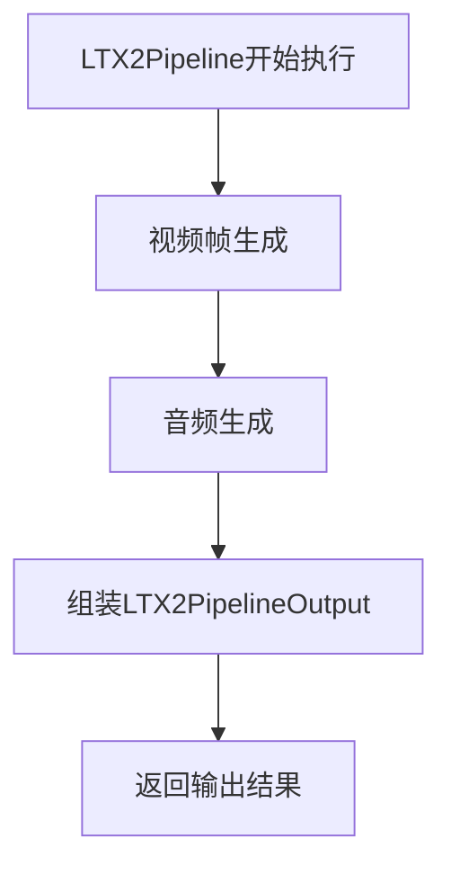
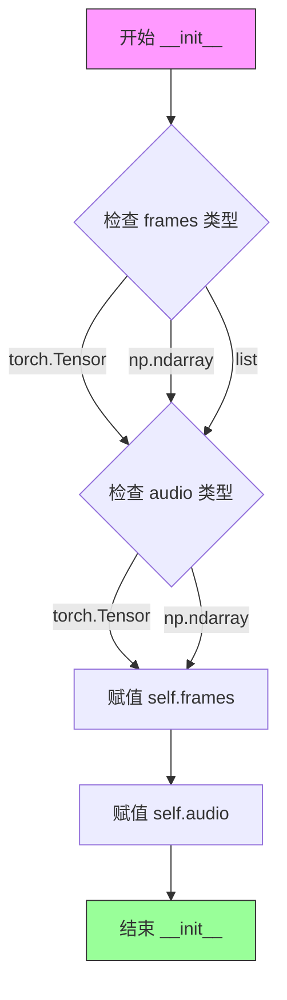
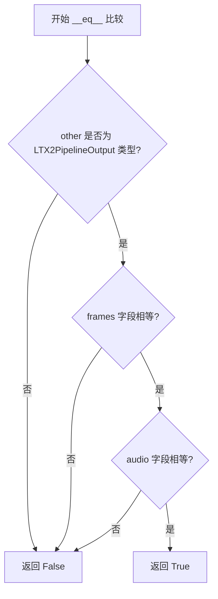

# `diffusers\src\diffusers\pipelines\ltx2\pipeline_output.py` 详细设计文档

LTX2PipelineOutput是一个数据类，继承自diffusers库的BaseOutput，用于封装LTX视频生成流水线的输出结果，包含视频帧序列（frames）和音频数据（audio）两个核心输出属性。

## 整体流程



## 类结构

```
BaseOutput (diffusers.utils)
└── LTX2PipelineOutput (dataclass)
```

## 全局变量及字段


### `LTX2PipelineOutput.frames`
    
List of video outputs - It can be a nested list of length `batch_size,` with each sub-list containing denoised PIL image sequences of length `num_frames.` It can also be a NumPy array or Torch tensor of shape `(batch_size, num_frames, channels, height, width)`.

类型：`torch.Tensor`
    


### `LTX2PipelineOutput.audio`
    
TODO

类型：`torch.Tensor`
    
    

## 全局函数及方法


### `LTX2PipelineOutput.__init__`

这是 LTX 视频生成管道的输出类初始化方法，由 Python 的 `dataclass` 装饰器自动生成，用于封装管道输出的视频帧和音频数据。

参数：

- `self`：隐式参数，LTX2PipelineOutput 实例本身
- `frames`：`torch.Tensor`，视频输出帧，可以是嵌套列表（batch_size，每个子列表包含 num_frames 个去噪后的 PIL 图像序列）、NumPy 数组或形状为 (batch_size, num_frames, channels, height, width) 的 Torch 张量
- `audio`：`torch.Tensor`，音频数据（TODO: 当前文档标注为待完成）

返回值：`None`，该方法为初始化方法，不返回任何值

#### 流程图



#### 带注释源码

```python
@dataclass  # Python dataclass 装饰器，自动生成 __init__, __repr__, __eq__ 等方法
class LTX2PipelineOutput(BaseOutput):
    r"""
    Output class for LTX pipelines.

    Args:
        frames (`torch.Tensor`, `np.ndarray`, or list[list[PIL.Image.Image]]):
            List of video outputs - It can be a nested list of length `batch_size,` with each sub-list containing
            denoised PIL image sequences of length `num_frames.` It can also be a NumPy array or Torch tensor of shape
            `(batch_size, num_frames, channels, height, width)`.
        audio (`torch.Tensor`, `np.ndarray`):
            TODO
    """

    # 使用 dataclass 字段类型提示，__init__ 方法会自动将这些字段作为参数
    frames: torch.Tensor  # 视频帧数据张量
    audio: torch.Tensor   # 音频数据张量
```

> **注意**：由于 `LTX2PipelineOutput` 使用 `@dataclass` 装饰器，其 `__init__` 方法由 Python 自动生成。dataclass 会根据字段类型注解自动创建构造函数，将 `frames` 和 `audio` 作为必需参数，并进行基本的类型检查和默认值处理。


### LTX2PipelineOutput.__repr__

该方法是 Python `dataclass` 自动生成的 magic method，用于返回对象的字符串表示形式，便于调试和日志输出。

参数：

- `self`：`LTX2PipelineOutput`，隐式参数，表示当前实例对象

返回值：`str`，对象的字符串表示，包含类名和所有字段的名称与值

#### 流程图

```mermaid
flowchart TD
    A[调用 __repr__] --> B{dataclass 自动生成}
    B --> C[返回格式: ClassName(field1=value1, field2=value2)]
    C --> D[示例: LTX2PipelineOutput(frames tensor, audio tensor)]
```

#### 带注释源码

```
# 由于 LTX2PipelineOutput 使用了 @dataclass 装饰器
# Python 会自动为其生成 __repr__ 方法
# 无需手动定义，dataclass 会根据类字段自动生成

# dataclass 自动生成的 __repr__ 源码逻辑如下（等效实现）:

def __repr__(self):
    """
    返回对象的字符串表示。
    
    自动生成的格式为:
    LTX2PipelineOutput(frames=tensor(...), audio=tensor(...))
    """
    # 获取类的所有字段
    fields = {
        'frames': self.frames,
        'audio': self.audio
    }
    
    # 构建字段字符串表示
    field_strs = []
    for field_name, field_value in fields.items():
        field_strs.append(f"{field_name}={field_value!r}")
    
    # 组合最终字符串
    return f"LTX2PipelineOutput({', '.join(field_strs)})"

# 注意: 该类的实际 __repr__ 是由 @dataclass 装饰器在类定义时自动生成的
# 位于 dataclasses 模块中实现，不需要在代码中显式编写
```

> **说明**：由于 `LTX2PipelineOutput` 类使用了 `@dataclass` 装饰器，Python 的 dataclasses 模块会自动为其生成 `__repr__` 方法。该方法会按照 `类名(字段1=值1, 字段2=值2, ...)` 的格式返回对象的字符串表示，其中字段值会使用其自身的 `__repr__` 方法进行格式化。`torch.Tensor` 的 `__repr__` 会显示其形状、数据类型等关键信息。


### `LTX2PipelineOutput.__eq__`

该方法是 `LTX2PipelineOutput` 类的相等性比较方法，由 Python 的 `@dataclass` 装饰器自动生成，用于比较两个 `LTX2PipelineOutput` 对象的所有字段（`frames` 和 `audio`）是否相等。

参数：

- `self`：`LTX2PipelineOutput`，当前对象实例
- `other`：`Any`，要比较的另一个对象

返回值：`bool`，如果两个对象的 `frames` 和 `audio` 字段都相等则返回 `True`，否则返回 `False`

#### 流程图



#### 带注释源码

```python
def __eq__(self, other: object) -> bool:
    """
    比较两个 LTX2PipelineOutput 对象是否相等。
    由 @dataclass 自动生成，比较所有字段（frames 和 audio）。
    
    参数:
        other: 要比较的其他对象
        
    返回:
        bool: 如果所有字段都相等返回 True，否则返回 False
    """
    # dataclass 自动生成的 __eq__ 方法
    # 它会比较所有字段：frames 和 audio
    if not isinstance(other, LTX2PipelineOutput):
        return NotImplemented
    return (self.frames == other.frames) and (self.audio == other.audio)
```

## 关键组件


### LTX2PipelineOutput 类

继承自 `BaseOutput` 的数据类，用于封装 LTX 视频生成管道的输出结果，包含视频帧和音频数据。

### frames 字段

类型：`torch.Tensor`，用于存储生成的视频帧数据，支持批处理和多种格式（Tensor、NumPy 数组或 PIL 图像列表）。

### audio 字段

类型：`torch.Tensor`，用于存储生成的音频数据。

### BaseOutput 基类

来自 `diffusers.utils` 的基础输出类，为管道输出提供标准化的数据结构和接口约定。

### 张量索引与惰性加载

虽然当前代码未直接实现，但设计支持通过 `torch.Tensor` 格式直接进行张量索引访问，支持后续的惰性加载优化。

### 反量化支持

`frames` 和 `audio` 字段类型声明为 `torch.Tensor`，为后续反量化操作（从量化格式恢复原始精度）提供了数据结构的兼容性。


## 问题及建议


### 已知问题

-   **文档不完整**: `audio` 字段的描述为"TODO"，开发尚未完成，缺少实际的功能说明
-   **类型声明与文档不一致**: docstring 中说明 `frames` 可以是 `torch.Tensor`、`np.ndarray` 或 `list[list[PIL.Image.Image]]`，但实际字段类型仅声明为 `torch.Tensor`；同样 `audio` 也支持 `np.ndarray` 但类型声明仅有 `torch.Tensor`
-   **字段文档缺失**: `frames` 和 `audio` 字段在 Args 块中有描述，但缺少独立的一句话说说明
-   **类名与注释不一致**: 类名为 `LTX2PipelineOutput`，但文档注释中写的是 "LTX pipelines"，可能存在命名不一致的问题

### 优化建议

-   完成 `audio` 字段的文档描述，移除 "TODO" 标记
-   考虑使用 `Union` 类型声明以匹配文档中支持的多种类型，例如 `frames: Union[torch.Tensor, np.ndarray, list[list[PIL.Image.Image]]]`
-   为 `frames` 和 `audio` 字段添加独立的单行描述字段文档
-   统一类名与注释中的命名，保持 "LTX2" 或 "LTX" 的一致性
-   考虑添加默认值 `None` 或提供可选字段，以支持仅输出视频或音频的场景
-   添加类级别的文档说明该输出类的用途和版本信息


## 其它


### 设计目标与约束

本代码的设计目标是定义LTX视频生成管道的输出数据结构，封装生成的视频帧和音频数据。约束包括：必须继承自diffusers库的BaseOutput类以保持接口一致性，frames和audio字段类型需与上游pipeline的输出格式匹配。

### 错误处理与异常设计

由于该类为数据容器（dataclass），本身不包含业务逻辑，错误处理主要依赖调用方保证数据合法性。frames字段应保证为torch.Tensor类型，audio字段同理。若类型不匹配，调用方在使用时会产生AttributeError或TypeError。设计建议：在pipeline中使用@property或验证方法在实例化前检查类型。

### 数据流与状态机

该类作为数据传递载体，不涉及状态机逻辑。数据流方向为：Diffusion Model → LTXPipeline → LTX2PipelineOutput（包装）→ 用户代码。frames和audio在pipeline执行完成后被打包为此对象，生命周期始于pipeline完成，终止于用户消费或对象销毁。

### 外部依赖与接口契约

主要依赖：1) torch库 - 用于Tensor类型定义；2) diffusers.utils.BaseOutput - 基础输出类。接口契约要求：frames字段必须为torch.Tensor、np.ndarray或list类型；audio字段必须为torch.Tensor或np.ndarray类型。调用方需自行保证数据形状符合预期（如frames应为5D张量batch×frames×channels×height×width）。

### 版本兼容性

该代码基于Python 3.7+的dataclass特性，需配合torch和diffusers库使用。diffusers版本需支持BaseOutput类（0.19.0+推荐）。dataclass装饰器的参数（如frozen、eq）在不同Python版本中表现一致，兼容性良好。

### 性能考虑

作为纯数据容器，该类的性能开销极低，主要开销来自于torch.Tensor对象本身的内存占用。dataclass自动生成的__init__、__repr__、__eq__方法效率与手动实现相当。建议：若后续扩展大量字段，考虑使用__slots__减少内存。

### 扩展性考虑

当前仅包含frames和audio两个字段。扩展方向：1) 添加metadata字段存储元信息（如生成参数、seed值）；2) 添加latents字段用于潜在表示；3) 支持多模态输出（如下一帧预测的condition）。通过继承或组合模式可进一步扩展。

### 使用示例

```python
# 典型使用场景
frames = torch.randn(1, 16, 3, 512, 512)
audio = torch.randn(1, 16000)
output = LTX2PipelineOutput(frames=frames, audio=audio)
# 访问输出
print(f"Frames shape: {output.frames.shape}")
print(f"Audio shape: {output.audio.shape}")
```


    