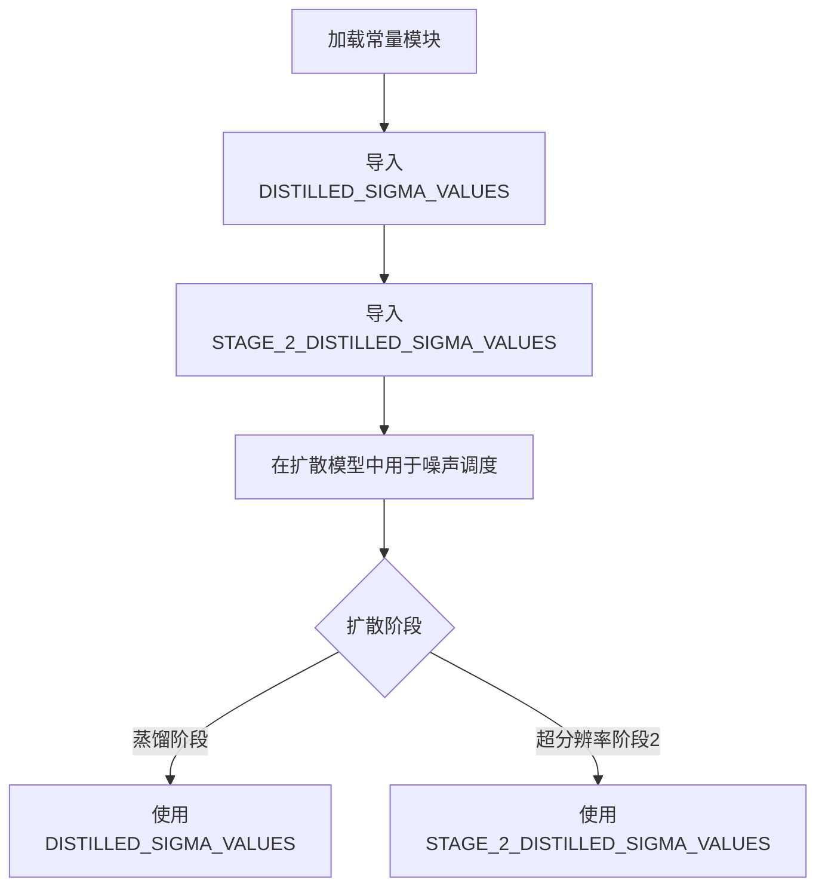

# `diffusers\src\diffusers\pipelines\ltx2\utils.py` 详细设计文档

该文件定义了LTX-Video蒸馏模型的预训练sigma值常量数组，用于控制扩散过程中的噪声调度策略，其中DISTILLED_SIGMA_VALUES包含8个sigma值用于完整的蒸馏模型，STAGE_2_DISTILLED_SIGMA_VALUES包含3个sigma值作为子集用于超分辨率阶段2。

## 整体流程



## 类结构

```
无类定义（纯数据定义模块）
```

## 全局变量及字段


### `DISTILLED_SIGMA_VALUES`
    
预训练的蒸馏模型sigma值列表，包含8个从1.0到0.421875递减的浮点数，用于LTX-Pipelines蒸馏模型的噪声调度。

类型：`List[float]`
    


### `STAGE_2_DISTILLED_SIGMA_VALUES`
    
超分辨率阶段2的蒸馏sigma值子集，包含3个值[0.909375, 0.725, 0.421875]，用于超分辨率管道的第二阶段处理。

类型：`List[float]`
    


    

## 全局函数及方法


## 关键组件


### 关键组件信息

### DISTILLED_SIGMA_VALUES (全局常量)

预训练的sigma值列表，用于蒸馏模型，定义了8个离散的时间步噪声水平，从1.0逐步降低到0.421875

### STAGE_2_DISTILLED_SIGMA_VALUES (全局常量)

超分辨率阶段2的简化sigma调度，是DISTILLED_SIGMA_VALUES的子集，仅包含3个值[0.909375, 0.725, 0.421875]

### 设计目标与约束

- **数据来源**: 代码注释表明这些值来源于LTX-2蒸馏模型的预训练权重
- **用途**: 用于扩散模型的去噪调度，sigma值代表不同时间步的噪声水平
- **调度策略**: 采用离散调度而非连续调度，值从高到低排列表示从噪声到清晰图像的过渡

### 外部依赖与接口契约

- 该常量列表作为扩散管线中的调度参数使用
- 数值范围在0到1之间，符合sigma作为噪声水平比例的定义
- Stage 2的值是Stage 1值的子集，表明超分辨率阶段使用更粗粒度的调度

### 潜在的技术债务或优化空间

- 硬编码的数值缺乏灵活性，可考虑从配置文件或模型元数据中动态加载
- 缺少对这些sigma值调度策略的文档说明（如线性调度、余弦调度等）
- 没有提供值的使用顺序说明（虽然从大到小排列可推断为从噪声到清晰）


## 问题及建议


### 已知问题

-   **数据重复**：STAGE_2_DISTILLED_SIGMA_VALUES 是 DISTILLED_SIGMA_VALUES 的子集，造成数据冗余维护风险
-   **缺少类型注解**：列表无类型声明，可读性和IDE支持不足
-   **硬编码外部引用**：代码注释引用 GitHub 外部 URL，无版本控制或本地副本
-   **魔法数值**：sigma 值缺乏上下文说明，无文档注释解释其含义或来源依据
-   **无验证机制**：若修改主列表值，子集关系无自动校验可能导致不一致

### 优化建议

-   使用类型注解明确数据类型：`DISTILLED_SIGMA_VALUES: list[float] = [...]`
-   通过派生方式生成子集：`STAGE_2_DISTILLED_SIGMA_VALUES = DISTILLED_SIGMA_VALUES[5:]`
-   添加文档字符串说明各数值的物理意义和用途
-   考虑提取为配置类或配置模块，统一管理相关参数
-   外部引用添加版本标签或归档至本地常量定义文件


## 其它


### 设计目标与约束

本模块定义了扩散模型中用于蒸馏模型的预训练sigma值配置。设计目标是为LTX-2管道提供标准化的噪声调度参数，支持超分辨率管道的不同阶段。主要约束包括：sigma值必须为浮点数且在0到1之间，STAGE_2_DISTILLED_SIGMA_VALUES必须是DISTILLED_SIGMA_VALUES的子集以保证阶段间的兼容性。

### 错误处理与异常设计

本模块为纯配置定义，不涉及运行时错误处理。潜在的配置错误（如类型错误、值越界）应在导入时通过静态检查或单元测试捕获。建议在数据加载处添加验证逻辑，确保sigma值单调递减且在有效范围内。

### 数据流与状态机

该配置作为只读数据源被管道其他模块引用。数据流为：配置文件 → 管道初始化 → 各阶段调度器。状态机不适用于此配置模块，它仅为静态数据提供者。

### 外部依赖与接口契约

外部依赖为LTX-2管道项目（见注释中的GitHub链接）。接口契约：任何消费此配置的模块应接受浮点数列表作为sigma调度参数。消费方不应修改此列表，以确保配置的一致性和可预测性。

### 配置管理

DISTILLED_SIGMA_VALUES包含8个sigma值，用于完整蒸馏模型管线。STAGE_2_DISTILLED_SIGMA_VALUES为3个值的子集，专用于超分辨率阶段2的缩减调度。配置值来源于官方LTX-2项目，遵循该项目的版本管理。

### 版本历史与变更记录

初始版本定义了两个sigma值列表。DISTILLED_SIGMA_VALUES基于Lightricks官方LTX-2实现。STAGE_2_DISTILLED_SIGMA_VALUES作为超分辨率优化子集被引入。

### 使用示例与典型场景

典型用法示例：
```python
from your_module import DISTILLED_SIGMA_VALUES, STAGE_2_DISTILLED_SIGMA_VALUES

# 完整蒸馏流程
for sigma in DISTILLED_SIGMA_VALUES:
    apply_denoising_step(sigma)

# 超分辨率阶段2
for sigma in STAGE_2_DISTILLED_SIGMA_VALUES:
    apply_super_resolution(sigma)
```

### 性能考量

作为常量定义，无运行时性能开销。列表在模块导入时一次性加载到内存。建议在多处引用时避免重复定义相同值，以减少内存占用。

### 兼容性说明

本配置与LTX-2官方实现保持一致。不同版本的扩散模型可能需要不同的sigma调度，升级LTX-2管道时应同步更新此配置。向后兼容性：新增sigma值应追加到列表末尾，避免破坏现有索引引用。

### 安全性考虑

当前配置为纯数值列表，无安全风险。但需确保数据来源可信，建议定期核对与官方仓库的一致性，防止配置篡改。

### 扩展性建议

未来可考虑将sigma值配置外部化为YAML或JSON文件，以支持运行时调整。可添加类型注解以提升IDE支持和类型检查能力。可增加验证函数确保配置有效性。

### 测试策略

建议添加以下测试用例：验证STAGE_2_DISTILLED_SIGMA_VALUES确实是DISTILLED_SIGMA_VALUES的子集；验证所有sigma值在有效范围内（0 < sigma <= 1）；验证sigma值序列单调递减。


    