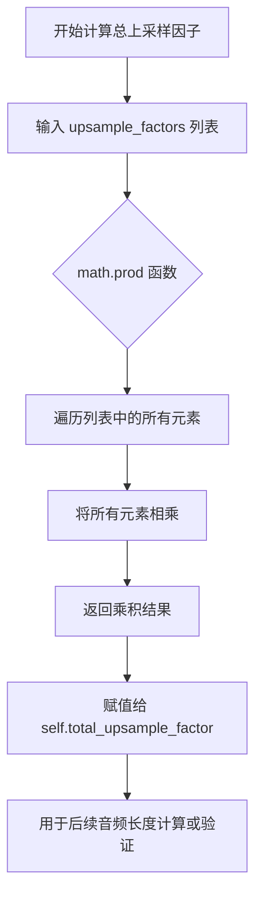

# `diffusers\src\diffusers\pipelines\ltx2\vocoder.py` 详细设计文档

LTX 2.0声码器模型，实现将梅尔频谱图(Mel Spectrogram)转换为音频波形的深度神经网络架构，采用转置卷积上采样结合残差块的设计，支持多层次的时间分辨率扩展。

## 整体流程

```mermaid
graph TD
    A[输入: hidden_states<br/>Mel Spectrogram] --> B{time_last参数?}
    B -- True --> C[维度保持不变]
    B -- False --> D[转置维度<br/>transpose(2,3)]
    C --> E
    D --> E[flatten(1,2)<br/>合并通道和频率维度]
    E --> F[conv_in<br/>初始卷积投影]
    F --> G[循环: i=0到num_upsample_layers-1]
    G --> H[leaky_relu激活]
    H --> I[upsamplers[i]<br/>转置卷积上采样]
    I --> J[resnets块处理<br/>stack + mean]
    J --> K{是否还有上采样层?}
    K -- 是 --> G
    K -- 否 --> L[leaky_relu(0.01)<br/>最终激活]
    L --> M[conv_out卷积输出]
    M --> N[tanh激活]
    N --> O[输出: 音频波形<br/>batch_size, out_channels, audio_length]
```

## 类结构

```
nn.Module (PyTorch基类)
├── ResBlock (残差卷积块)
└── LTX2Vocoder (主声码器类)
    ├── ModelMixin (HuggingFace Diffusers)
    └── ConfigMixin (HuggingFace Diffusers)
```

## 全局变量及字段


### `ResBlock.dilations`
    
膨胀卷积的膨胀率元组

类型：`tuple[int, ...]`
    


### `ResBlock.negative_slope`
    
LeakyReLU激活的负斜率

类型：`float`
    


### `ResBlock.convs1`
    
第一组膨胀卷积层列表

类型：`nn.ModuleList`
    


### `ResBlock.convs2`
    
第二组标准卷积层列表

类型：`nn.ModuleList`
    


### `LTX2Vocoder.num_upsample_layers`
    
上采样层的数量

类型：`int`
    


### `LTX2Vocoder.resnets_per_upsample`
    
每个上采样层的残差块数量

类型：`int`
    


### `LTX2Vocoder.out_channels`
    
输出通道数

类型：`int`
    


### `LTX2Vocoder.total_upsample_factor`
    
总上采样因子

类型：`int`
    


### `LTX2Vocoder.negative_slope`
    
LeakyReLU负斜率

类型：`float`
    


### `LTX2Vocoder.conv_in`
    
输入卷积层

类型：`nn.Conv1d`
    


### `LTX2Vocoder.upsamplers`
    
转置卷积上采样器列表

类型：`nn.ModuleList`
    


### `LTX2Vocoder.resnets`
    
残差块列表

类型：`nn.ModuleList`
    


### `LTX2Vocoder.conv_out`
    
输出卷积层

类型：`nn.Conv1d`
    
    

## 全局函数及方法


### `math.prod` (在 `LTX2Vocoder.__init__` 中的使用)

该函数调用用于计算 LTX2Vocoder  vocoder 的总上采样因子，通过将 `upsample_factors` 列表中的所有上采样因子相乘得到最终的信号时间扩展倍数。

参数：

-  `sequence`：`list[int]`，即代码中的 `upsample_factors`，是一个包含多个上采样因子整数的列表，例如 `[6, 5, 2, 2, 2]`

返回值：`int`，返回所有上采样因子的乘积，即总上采样因子（代码中赋值给 `self.total_upsample_factor`）

#### 流程图



#### 带注释源码

```python
# 在 LTX2Vocoder 类的 __init__ 方法中：

# 定义上采样因子列表
upsample_factors: list[int] = [6, 5, 2, 2, 2]

# 使用 math.prod 计算总上采样因子
# math.prod 是 Python 3.8+ 引入的函数，计算可迭代对象中所有元素的乘积
# 在本例中: 6 * 5 * 2 * 2 * 2 = 240
self.total_upsample_factor = math.prod(upsample_factors)

# 该值用于：
# 1. 记录总的信号时间扩展倍数
# 2. 可用于验证输入输出的时间维度关系
# 3. 在模型的 forward 方法中，虽然没有直接使用，但可用于调试或外部调用者了解模型的扩展能力

# 例如：如果输入 mel spectrogram 的时间帧数为 T，
# 输出的 audio_length 理论上是 T * total_upsample_factor
```

#### 补充说明

`math.prod` 是 Python 标准库函数，等同于 `functools.reduce(operator.mul, sequence, 1)`。在此处的作用是将多个分离的上采样层的因子合并计算，得到整体的时间扩展比例。这种设计允许模型通过多个逐步的上采样层来重建信号，同时保留了关于整体扩展能力的信息。


### `ResBlock.forward`

该方法实现了残差块的前向传播，通过多个并行分支的空洞卷积提取特征，并将每个分支的输出通过残差连接累加到输入上，最终返回累积后的特征张量。

参数：

- `x`：`torch.Tensor`，输入的特征张量，形状为 `(batch_size, channels, time_steps)`

返回值：`torch.Tensor`，经过残差块处理后的输出张量，形状与输入相同 `(batch_size, channels, time_steps)`

#### 流程图

```mermaid
flowchart TD
    A[开始 forward] --> B[遍历 conv1, conv2 分支]
    B --> C{遍历是否结束}
    C -->|否| D[xt = leaky_relu(x, negative_slope)]
    D --> E[xt = conv1(xt)]
    E --> F[xt = leaky_relu(xt, negative_slope)]
    F --> G[xt = conv2(xt)]
    G --> H[x = x + xt 残差连接]
    H --> B
    C -->|是| I[返回 x]
```

#### 带注释源码

```python
def forward(self, x: torch.Tensor) -> torch.Tensor:
    """
    残差块的前向传播方法
    
    该方法对输入张量进行多次残差卷积操作：
    1. 遍历多个并行卷积分支（每个分支包含空洞卷积）
    2. 每个分支内部进行：激活 -> 卷积 -> 激活 -> 卷积
    3. 将每个分支的输出通过残差连接累加到输入上
    
    参数:
        x: torch.Tensor - 输入特征张量，形状为 (batch_size, channels, time_steps)
        
    返回:
        torch.Tensor - 处理后的特征张量，形状与输入相同
    """
    # 遍历每个并行的卷积分支（对应不同的空洞率）
    for conv1, conv2 in zip(self.convs1, self.convs2):
        # 第一次激活：使用 Leaky ReLU 激活输入特征
        xt = F.leaky_relu(x, negative_slope=self.negative_slope)
        
        # 第一次卷积：使用空洞卷积提取多尺度特征
        xt = conv1(xt)
        
        # 第二次激活：再次使用 Leaky ReLU 激活特征
        xt = F.leaky_relu(xt, negative_slope=self.negative_slope)
        
        # 第二次卷积：使用标准卷积进一步处理特征
        xt = conv2(xt)
        
        # 残差连接：将当前分支的输出累加到原始输入上
        x = x + xt
    
    # 返回经过所有残差分支处理后的最终输出
    return x
```


### `LTX2Vocoder.__init__`

初始化LTX 2.0声码器架构，用于将生成的梅尔频谱图转换回音频波形。该方法构建了一个基于转置卷积的上采样网络，每个上采样层后接多个带膨胀卷积的残差块（ResBlock），最终通过卷积层和Tanh激活输出音频波形。

参数：

- `in_channels`：`int`，输入的梅尔频谱图通道数，默认值为128
- `hidden_channels`：`int`，隐藏层通道数，默认值为1024
- `out_channels`：`int`，输出音频的通道数（通常为2表示立体声），默认值为2
- `upsample_kernel_sizes`：`list[int]`，上采样转置卷积的核大小列表，默认值为[16, 15, 8, 4, 4]
- `upsample_factors`：`list[int]`，上采样因子列表，用于指定每个转置卷积的上采样倍数，默认值为[6, 5, 2, 2, 2]
- `resnet_kernel_sizes`：`list[int]`，残差块中卷积层的核大小列表，默认值为[3, 7, 11]
- `resnet_dilations`：`list[list[int]]`，残差块中各卷积层的膨胀率列表，默认值为[[1, 3, 5], [1, 3, 5], [1, 3, 5]]
- `leaky_relu_negative_slope`：`float`，LeakyReLU激活函数的负斜率参数，默认值为0.1
- `output_sampling_rate`：`int`，输出音频的采样率（Hz），默认值为24000

返回值：`None`，该方法为构造函数，不返回任何值

#### 流程图

```mermaid
flowchart TD
    A[开始 __init__] --> B[调用 super().__init__]
    B --> C[计算上采样层数: num_upsample_layers]
    C --> D[计算每个上采样层的残差块数: resnets_per_upsample]
    D --> E[验证 upsample_kernel_sizes 和 upsample_factors 长度一致]
    E --> F{验证通过?}
    F -->|否| G[抛出 ValueError]
    F -->|是| H[验证 resnet_kernel_sizes 和 resnet_dilations 长度一致]
    H --> I{验证通过?}
    I -->|否| J[抛出 ValueError]
    I -->|是| K[创建输入卷积层 conv_in]
    K --> L[初始化上采样器模块列表 upsamplers]
    L --> M[初始化残差网络模块列表 resnets]
    M --> N[遍历上采样因子和核大小]
    N --> O[创建转置卷积上采样层]
    O --> P[为每个残差核大小和膨胀率组合创建 ResBlock]
    P --> Q[更新输入通道数为输出通道数的一半]
    Q --> R{还有更多上采样层?}
    R -->|是| N
    R -->|否| S[创建输出卷积层 conv_out]
    S --> T[计算总上采样因子 total_upsample_factor]
    T --> U[存储配置参数到对象]
    U --> V[结束 __init__]
```

#### 带注释源码

```python
@register_to_config
def __init__(
    self,
    in_channels: int = 128,                      # 输入梅尔频谱图通道数
    hidden_channels: int = 1024,                 # 隐藏层通道数，控制模型容量
    out_channels: int = 2,                        # 输出音频通道数（立体声=2）
    upsample_kernel_sizes: list[int] = [16, 15, 8, 4, 4],  # 每层上采样核大小
    upsample_factors: list[int] = [6, 5, 2, 2, 2],        # 每层上采样倍率
    resnet_kernel_sizes: list[int] = [3, 7, 11], # 残差块卷积核大小
    resnet_dilations: list[list[int]] = [[1, 3, 5], [1, 3, 5], [1, 3, 5]],  # 膨胀卷积参数
    leaky_relu_negative_slope: float = 0.1,     # LeakyReLU负斜率
    output_sampling_rate: int = 24000,          # 输出采样率（Hz）
):
    # 调用父类初始化方法
    super().__init__()
    
    # 保存上采样层数量和每个上采样层的残差块数量
    self.num_upsample_layers = len(upsample_kernel_sizes)
    self.resnets_per_upsample = len(resnet_kernel_sizes)
    self.out_channels = out_channels
    
    # 计算总上采样因子（用于后续音频长度计算）
    self.total_upsample_factor = math.prod(upsample_factors)
    self.negative_slope = leaky_relu_negative_slope

    # ====== 参数校验 ======
    # 验证上采样核大小和因子列表长度一致
    if self.num_upsample_layers != len(upsample_factors):
        raise ValueError(
            f"`upsample_kernel_sizes` and `upsample_factors` should be lists of the same length but are length"
            f" {self.num_upsample_layers} and {len(upsample_factors)}, respectively."
        )

    # 验证残差块核大小和膨胀率列表长度一致
    if self.resnets_per_upsample != len(resnet_dilations):
        raise ValueError(
            f"`resnet_kernel_sizes` and `resnet_dilations` should be lists of the same length but are length"
            f" {len(self.resnets_per_upsample)} and {len(resnet_dilations)}, respectively."
        )

    # ====== 构建网络结构 ======
    
    # 输入卷积层：将梅尔频谱图特征映射到隐藏空间
    self.conv_in = nn.Conv1d(in_channels, hidden_channels, kernel_size=7, stride=1, padding=3)

    # 初始化上采样器和残差网络模块列表
    self.upsamplers = nn.ModuleList()
    self.resnets = nn.ModuleList()
    
    input_channels = hidden_channels  # 初始输入通道数
    
    # 遍历每层上采样配置
    for i, (stride, kernel_size) in enumerate(zip(upsample_factors, upsample_kernel_sizes)):
        # 计算输出通道数（每层减半）
        output_channels = input_channels // 2
        
        # 创建转置卷积上采样层
        self.upsamplers.append(
            nn.ConvTranspose1d(
                input_channels,                     # 隐藏通道数 // (2 ** i)
                output_channels,                    # 隐藏通道数 // (2 ** (i + 1))
                kernel_size,
                stride=stride,
                padding=(kernel_size - stride) // 2,
            )
        )

        # 为每个残差核大小和膨胀率组合创建残差块
        for kernel_size, dilations in zip(resnet_kernel_sizes, resnet_dilations):
            self.resnets.append(
                ResBlock(
                    output_channels,
                    kernel_size,
                    dilations=dilations,
                    leaky_relu_negative_slope=leaky_relu_negative_slope,
                )
            )
        
        # 更新下一层的输入通道数
        input_channels = output_channels

    # 输出卷积层：将最终特征映射到音频波形
    self.conv_out = nn.Conv1d(output_channels, out_channels, 7, stride=1, padding=3)
```


### `LTX2Vocoder.forward`

该函数是LTX2Vocoder声码器的前向传播方法，将Mel频谱图转换为音频波形。通过转置维度、卷积操作、上采样和残差网络处理，最终输出时域音频信号。

参数：

- `hidden_states`：`torch.Tensor`，输入的Mel频谱图张量，形状为`(batch_size, num_channels, time, num_mel_bins)`（当`time_last=False`）或`(batch_size, num_channels, num_mel_bins, time)`（当`time_last=True`）
- `time_last`：`bool`，可选，默认为`False`，指定输入张量的最后一个维度是否为时间/帧维度

返回值：`torch.Tensor`，音频波形张量，形状为`(batch_size, out_channels, audio_length)`

#### 流程图

```mermaid
graph TD
    A[开始 forward] --> B{time_last?}
    B -->|False| C[hidden_states.transpose2, 3]
    B -->|True| D[保持原状]
    C --> E[hidden_states.flatten1, 2<br/>合并通道和频率维度]
    E --> F[conv_in 卷积]
    F --> G[循环 i in range num_upsample_layers]
    G --> H[F.leaky_relu<br/>激活函数]
    H --> I[upsamplers[i] 上采样]
    I --> J[计算resnet范围<br/>start, end]
    J --> K[堆叠 ResNet 输出]
    K --> L[torch.mean 聚合残差结果]
    L --> M{所有上采样层完成?}
    M -->|否| G
    M -->|是| N[F.leaky_relu 激活<br/>negative_slope=0.01]
    N --> O[conv_out 卷积]
    O --> P[torch.tanh 激活]
    P --> Q[返回 hidden_states]
```

#### 带注释源码

```python
def forward(self, hidden_states: torch.Tensor, time_last: bool = False) -> torch.Tensor:
    r"""
    Forward pass of the vocoder.

    Args:
        hidden_states (`torch.Tensor`):
            Input Mel spectrogram tensor of shape `(batch_size, num_channels, time, num_mel_bins)` if `time_last`
            is `False` (the default) or shape `(batch_size, num_channels, num_mel_bins, time)` if `time_last` is
            `True`.
        time_last (`bool`, *optional*, defaults to `False`):
            Whether the last dimension of the input is the time/frame dimension or the Mel bins dimension.

    Returns:
        `torch.Tensor`:
            Audio waveform tensor of shape (batch_size, out_channels, audio_length)
    """

    # 如果time_last为False，则转置维度使时间维度位于最后
    # 原始形状: (batch, channels, time, mel_bins) -> 转为 (batch, channels, mel_bins, time)
    if not time_last:
        hidden_states = hidden_states.transpose(2, 3)
    
    # 合并通道和频率(梅尔频段)维度
    # 将 (batch, channels, mel_bins, time) 展平为 (batch, channels*mel_bins, time)
    hidden_states = hidden_states.flatten(1, 2)

    # 输入卷积：将梅尔频谱图特征映射到隐藏通道
    hidden_states = self.conv_in(hidden_states)

    # 遍历每个上采样层
    for i in range(self.num_upsample_layers):
        # Leaky ReLU 激活，负斜率在初始化时设定(默认为0.1)
        hidden_states = F.leaky_relu(hidden_states, negative_slope=self.negative_slope)
        
        # 转置卷积上采样，将时间维度扩展
        hidden_states = self.upsamplers[i](hidden_states)

        # 计算当前上采样层对应的ResNet模块索引范围
        # 每个上采样层后面跟着resnets_per_upsample个ResNet
        start = i * self.resnets_per_upsample
        end = (i + 1) * self.resnets_per_upsample
        
        # 并行运行所有ResNet，然后取平均
        # 这是一种残差连接策略，用于细化上采样后的特征
        resnet_outputs = torch.stack([self.resnets[j](hidden_states) for j in range(start, end)], dim=0)
        hidden_states = torch.mean(resnet_outputs, dim=0)

    # 最后一层使用不同的负斜率(0.01)，这与前面的0.1不同
    # 注释表明这可能是有意为之，但可能是一个设计不一致之处
    hidden_states = F.leaky_relu(hidden_states, negative_slope=0.01)
    
    # 输出卷积，将通道数转换为目标输出通道数(通常为2，代表立体声)
    hidden_states = self.conv_out(hidden_states)
    
    # 使用tanh激活函数将输出限制在[-1, 1]范围内
    # 这是典型的音频波形输出激活函数
    hidden_states = torch.tanh(hidden_states)

    return hidden_states
```

---

#### 关键组件信息

| 组件名称 | 一句话描述 |
|---------|-----------|
| `conv_in` | 输入卷积层，将Mel频谱图特征映射到隐藏通道空间 |
| `upsamplers` | 转置卷积上采样器列表，逐步增加时间维度 |
| `resnets` | 残差网络模块列表，用于细化上采样后的特征 |
| `conv_out` | 输出卷积层，将特征映射到音频波形通道 |
| `ResBlock` | 包含膨胀卷积的残差块，用于提取多尺度特征 |

#### 潜在的技术债务或优化空间

1. **激活函数负斜率不一致**：最后一层使用`0.01`而非类中其他地方的`0.1`，注释表明这可能是无意的设计，需要确认是否为有意为之。

2. **ResNet输出聚合方式**：使用`torch.mean`简单平均所有ResNet的输出，可能不是最优的特征融合策略，可考虑注意力机制或门控机制。

3. **动态计算图开销**：列表推导式`[self.resnets[j](hidden_states) for j in range(start, end)]`在每次前向传播时都会构建新的计算图，可考虑使用`nn.ModuleList`的完整前向或自定义融合层。

4. **硬编码的上采样参数**：部分参数如输出采样率`output_sampling_rate`未被实际使用，可能导致配置与实现不一致。

#### 其它项目

**设计目标与约束**：
- 将128维Mel频谱图转换为音频波形
- 支持立体声输出(out_channels=2)
- 总上采样因子由`upsample_factors`决定（默认6×5×2×2×2=240倍）

**错误处理与异常设计**：
- 构造函数中已验证`upsample_kernel_sizes`和`upsample_factors`长度一致性
- 构造函数中已验证`resnet_kernel_sizes`和`resnet_dilations`长度一致性

**数据流与状态机**：
- 数据流：Mel频谱 → 维度调整 → 输入卷积 → 循环上采样+ResNet处理 → 输出卷积 → tanh激活 → 音频波形
- 无显式状态机，状态通过模型参数隐式保存

**外部依赖与接口契约**：
- 依赖`ModelMixin`和`ConfigMixin`（来自diffusers库）
- 输入必须是4D张量（batch, channels, time, mel_bins）或（batch, channels, mel_bins, time）
- 输出为3D张量（batch, out_channels, audio_length）

## 关键组件


### 膨胀卷积 (Dilated Convolutions)

ResBlock中的多尺度特征提取机制，通过不同膨胀率(dilation=(1,3,5))的并行卷积核实现 receptive field 的指数级扩展，在不损失分辨率的情况下捕获长距离依赖关系。

### 转置卷积上采样 (Transposed Convolution Upsampling)

LTX2Vocoder使用nn.ConvTranspose1d实现层级式上采样，通过upsample_factors=[6,5,2,2,2]将mel频谱图的时间分辨率逐步扩展至原始音频采样率，总上采样因子为120倍。

### 残差连接与特征融合 (Residual Connections & Feature Fusion)

ResBlock中采用密集残差架构(x = x + xt)，每层卷积输出叠加至输入；上采样阶段通过torch.stack将多个ResBlock输出堆叠后取均值，实现多路径特征融合与梯度流增强。

### 时间维度自适应处理 (Time Dimension Handling)

forward方法支持time_last参数控制输入张量维度排布，通过hidden_states.transpose(2,3)动态调整时间维位置，兼容不同预处理管道的输出格式。

### 通道-频率维度展平 (Channel-Frequency Flattening)

hidden_states.flatten(1,2)将batch维度外的通道数与mel bins合并为单一特征维度，使卷积操作能在保持时序连贯性的同时处理全部频率信息。

### 非线性激活策略 (Activation Strategy)

混合激活配置：主体使用leaky_relu_negative_slope=0.1保证稀疏性，最终输出层采用F.leaky_relu(negative_slope=0.01)配合torch.tanh将波形约束在[-1,1]区间。

### 动态参数校验 (Dynamic Parameter Validation)

构造函数中显式校验upsample_kernel_sizes与upsample_factors长度一致性，以及resnet_kernel_sizes与resnet_dilations维度匹配，提供清晰的错误诊断信息。


## 问题及建议


### 已知问题

-   **ResBlock padding_mode错误**: 使用 `padding_mode="same"` 传入 `nn.Conv1d`，但PyTorch的Conv1d只支持 `'zeros'`, `'reflect'`, `'replicate'`, `'circular'`，不支持 `'same'`，会导致运行时错误。
-   **配置验证逻辑错误**: 在 `LTX2Vocoder.__init__` 中，验证 `resnet_kernel_sizes` 和 `resnet_dilations` 长度时使用了错误的表达式 `len(self.resnets_per_upsample)`，由于 `self.resnets_per_upsample` 是整数，`len()` 会抛出 `TypeError`。
-   **upsample padding可能为负数**: 当 `kernel_size < stride` 时，计算 `padding=(kernel_size - stride) // 2` 会产生负数，导致运行时错误。
-   **ResNet块重复创建**: 在循环中每个upsample层都会重新创建所有 `resnet_kernel_sizes` 对应的ResBlock，而不是在层间共享，这导致了 `num_upsample_layers * resnets_per_upsample` 个冗余的ResBlock实例，消耗额外内存。
-   **ResNet输出聚合方式不当**: 使用 `torch.stack` 然后 `torch.mean` 来聚合多个ResNet输出，这种均值方式可能丢失重要特征信息，且与标准WaveNet风格网络的残差连接模式不一致。
-   **Python版本兼容性问题**: ResBlock中使用 `tuple[int, ...]` 类型注解，这是Python 3.9+的语法，对于需要兼容Python 3.8的项目会导致语法错误。
-   **硬编码的 leaky_relu 参数**: forward方法中最后一层leaky_relu使用了硬编码的 `0.01`，而类中有 `self.negative_slope` 属性可以使用，增加了代码维护成本。

### 优化建议

-   **修复padding_mode**: 将 `padding_mode` 改为支持的值，或实现自定义的 "same" padding逻辑（例如使用 `padding=(kernel_size-1)//2` 当 stride=1 时）。
-   **修正验证逻辑**: 将 `len(self.resnets_per_upsample)` 改为 `self.resnets_per_upsample`。
-   **添加padding范围检查**: 在计算padding前添加验证，确保 `kernel_size >= stride`，或使用 `max(0, (kernel_size - stride) // 2)`。
-   **重构ResNet块创建逻辑**: 将ResNet块的创建移至循环外部，每个ResBlock类型只需创建一次，然后在upsample层中重复使用；或者按照WaveNet的典型架构，每个upsample层有独立的ResBlock栈。
-   **改进ResNet输出聚合**: 考虑使用更标准的残差连接方式，如直接相加或使用卷积融合，而不是简单的均值。
-   **使用类型注解兼容性写法**: 将 `tuple[int, ...]` 改为 `Tuple[int, ...]` 并从 `typing` 导入，或添加 `from __future__ import annotations`。
-   **消除硬编码值**: 使用类属性 `self.negative_slope` 替代 forward 方法中的 `0.01`，或在配置中添加单独的参数来控制最后一层的激活斜率。


## 其它


### 设计目标与约束

该代码实现了一个基于深度学习的音频声码器（Vocoder），核心目标是将生成的梅尔频谱图（Mel Spectrogram）高质量地转换回音频波形。设计约束包括：输入梅尔频谱图通道数固定为128，输出音频采样率固定为24000Hz，上采样层数与残差网络层数需严格匹配，模型继承自ModelMixin和ConfigMixin以支持配置管理和模型加载。

### 错误处理与异常设计

代码中包含两处关键的参数校验异常处理：
1. 当`upsample_kernel_sizes`和`upsample_factors`长度不一致时，抛出`ValueError`并提示具体长度差异
2. 当`resnet_kernel_sizes`和`resnet_dilations`长度不一致时，抛出`ValueError`进行错误提示
此外，`forward`方法中通过`time_last`参数控制输入维度转换，当输入维度不符合预期时可能产生形状不匹配错误，但未进行显式的运行时形状校验。

### 数据流与状态机

数据流遵循以下路径：
- **输入状态**：hidden_states为四维张量，shape为(batch_size, num_channels, time, num_mel_bins)或(batch_size, num_channels, num_mel_bins, time)，取决于time_last参数
- **维度变换状态**：若time_last为False，则转置为(batch_size, num_channels, num_mel_bins, time)，然后flatten为(batch_size, num_channels*num_mel_bins, time)
- **特征提取状态**：经过输入卷积conv_in变为(batch_size, hidden_channels, time')
- **上采样循环状态**：对每层上采样执行：leaky_relu激活 -> 转置卷积上采样 -> 堆叠执行多个ResBlock -> 取平均值，重复num_upsample_layers次
- **输出状态**：经过leaky_relu、输出卷积conv_out、tanh激活，最终输出(batch_size, out_channels, audio_length)的音频波形

### 外部依赖与接口契约

**外部依赖**：
- `torch`：张量计算和神经网络基础库
- `torch.nn`：神经网络模块
- `torch.nn.functional`：函数式API，包含leaky_relu、卷积等操作
- `...configuration_utils.ConfigMixin`：配置混入类，支持register_to_config装饰器
- `...configuration_utils.register_to_config`：配置注册装饰器
- `...models.modeling_utils.ModelMixin`：模型混入基类

**接口契约**：
- `LTX2Vocoder`类需通过ConfigMixin机制加载配置
- `forward(hidden_states, time_last)`方法接受张量输入，返回波形张量
- 模型输出为原始波形，范围在[-1, 1]之间（tanh激活）

### 配置参数详解

| 参数名 | 类型 | 默认值 | 描述 |
|--------|------|--------|------|
| in_channels | int | 128 | 输入梅尔频谱图的通道数 |
| hidden_channels | int | 1024 | 隐藏层通道数，决定模型容量 |
| out_channels | int | 2 | 输出音频通道数（立体声为2） |
| upsample_kernel_sizes | list[int] | [16,15,8,4,4] | 每层上采样转置卷积的核大小 |
| upsample_factors | list[int] | [6,5,2,2,2] | 每层上采样的时间维度放大倍数 |
| resnet_kernel_sizes | list[int] | [3,7,11] | 每个上采样层内ResBlock的卷积核大小 |
| resnet_dilations | list[list[int]] | [[1,3,5],[1,3,5],[1,3,5]] | ResBlock中膨胀卷积的膨胀率配置 |
| leaky_relu_negative_slope | float | 0.1 | LeakyReLU激活函数的负斜率 |
| output_sampling_rate | int | 24000 | 输出音频的采样率（Hz） |

### 数学公式与算法原理

**上采样机制**：采用转置卷积（ConvTranspose1d）进行时间维度的上采样，每层上采样因子相乘得到总上采样因子math.prod(upsample_factors)=240。

**多尺度残差块**：ResBlock使用多个并行分支进行不同膨胀率(dilation)的卷积操作，提取多尺度音频特征。各分支结果通过加法残差连接融合，实现特征复用和梯度流优化。

**激活函数**：使用LeakyReLU替代ReLU，避免负值区间梯度完全消失问题。最终输出层使用tanh将数值范围限制在[-1,1]，符合音频波形归一化习惯。

### 性能考虑与优化空间

1. **计算优化**：ResBlock中的for循环可考虑使用torch.jit.script加速，或将多个分支合并为分组卷积以提高并行度
2. **内存优化**：resnet_outputs的stack操作会产生中间张量，可考虑in-place操作或融合计算图
3. **参数效率**：hidden_channels从1024逐层减半，可能存在特征冗余，可根据实际效果调整
4. **推理速度**：可使用torch.compile或ONNX导出优化推理性能

### 使用示例与调用方式

```python
import torch
from ltx_audio import LTX2Vocoder

# 初始化模型（参数通过配置加载）
vocoder = LTX2Vocoder()

# 准备输入：batch_size=1, channels=1, time=100, mel_bins=128
mel_spec = torch.randn(1, 1, 100, 128)

# 前向传播（time_last=False）
audio = vocoder(mel_spec, time_last=False)
# 输出shape: (1, 2, 24000)

# 前向传播（time_last=True）
mel_spec_t = torch.randn(1, 1, 128, 100)
audio_t = vocoder(mel_spec_t, time_last=True)
# 输出shape: (1, 2, 24000)
```

### 潜在技术债务与优化建议

1. **不一致的LeakyReLU斜率**：代码注释指出最后一层leaky_relu使用默认斜率0.01而其他层使用0.1，这种不一致性可能是设计疏忽，建议统一或明确文档说明
2. **硬编码magic number**：输出层激活前的leaky_relu使用硬编码的0.01，应使用self.negative_slope保持一致性
3. **维度校验缺失**：forward方法未对输入hidden_states的维度进行严格校验，可能导致运行时错误难以定位
4. **padding_mode统一性**：所有卷积使用"same"padding，但未考虑当kernel_size为偶数时的边界行为
5. **文档注释不足**：ResBlock的具体工作原理和多分支设计意图缺少详细说明
6. **类型提示不完整**：部分内部变量缺少类型注解，影响代码可读性和IDE支持

    