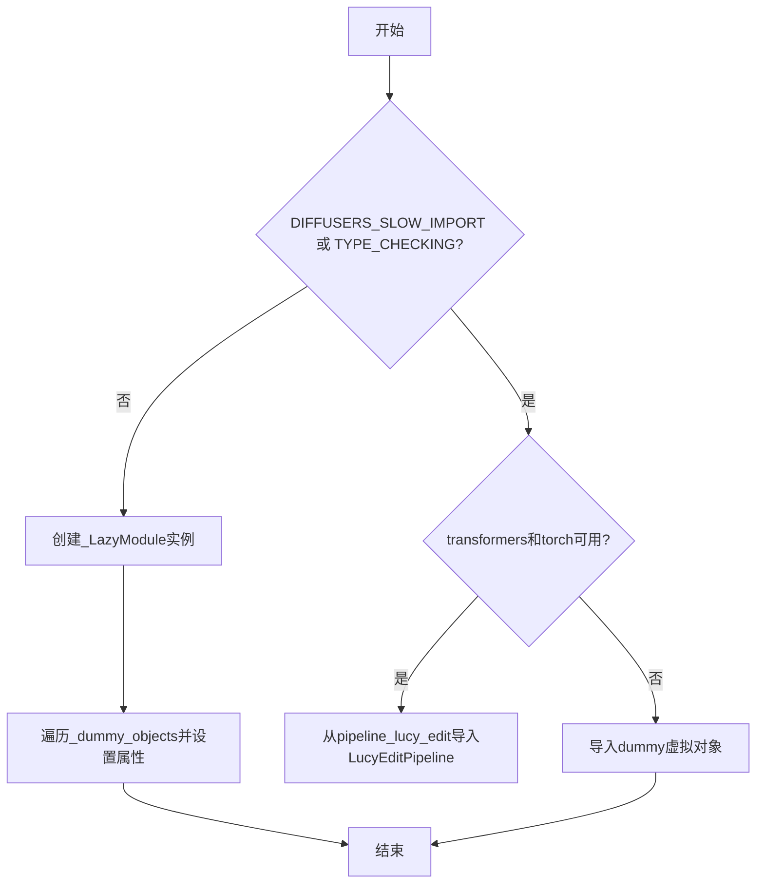
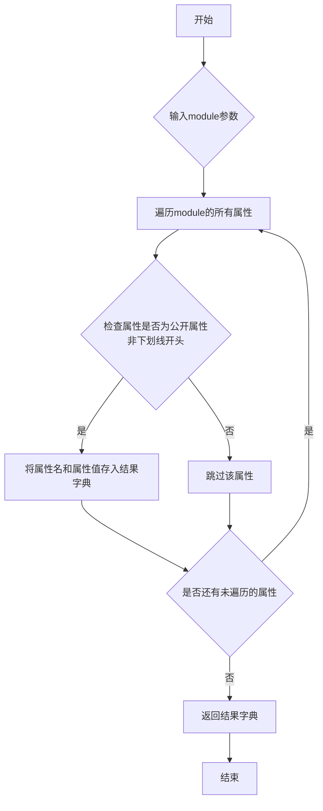
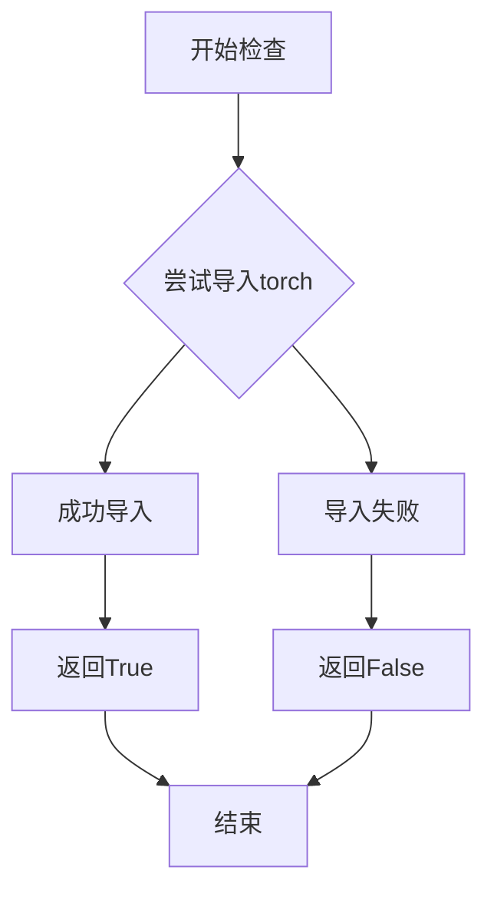
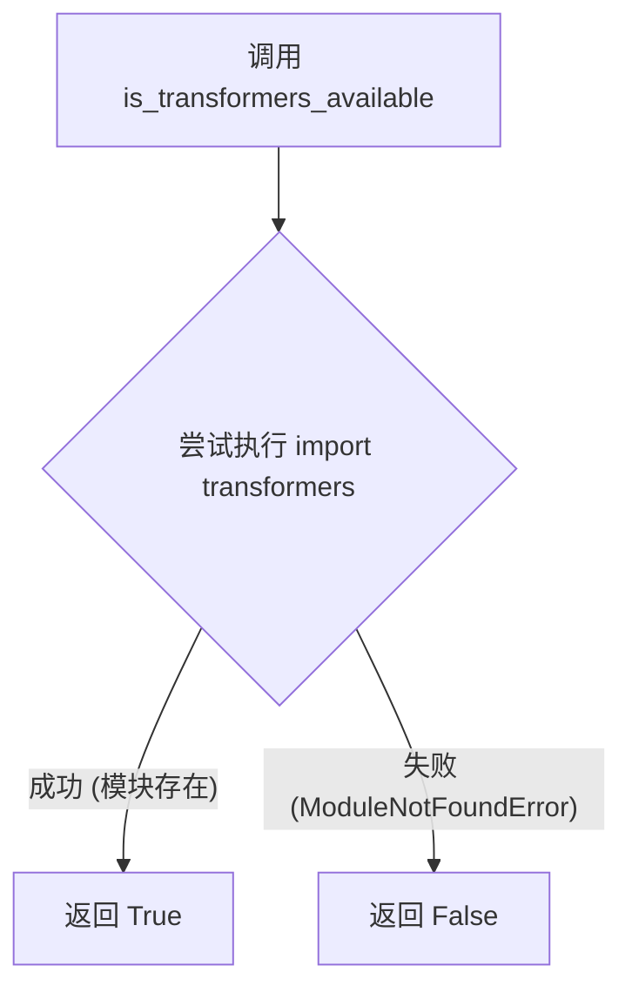

# `diffusers\src\diffusers\pipelines\lucy\__init__.py` 详细设计文档

这是一个延迟加载模块初始化文件，用于在Diffusers库中有条件地导入LucyEditPipeline。它通过检查torch和transformers依赖是否可用来决定导入真正的管道还是使用虚拟对象作为占位符，并利用LazyModule实现模块的延迟加载。

## 整体流程



## 类结构

```
__init__.py (模块初始化文件)
├── 导入工具层
│   ├── _LazyModule (延迟加载模块类)
│   ├── get_objects_from_module (对象获取函数)
│   ├── is_torch_available (torch可用性检查)
│   └── is_transformers_available (transformers可用性检查)
├── 数据结构层
│   ├── _import_structure (导入结构字典)
│   └── _dummy_objects (虚拟对象字典)
└── 条件导入层
    ├── LucyEditPipeline (真正的管道类)
    └── dummy_torch_and_transformers_objects (虚拟占位符)
```

## 全局变量及字段


### `_dummy_objects`
    
用于存储虚拟对象的字典，当可选依赖（torch和transformers）不可用时，这些虚拟对象将被添加到模块中以保持导入结构完整

类型：`dict`
    


### `_import_structure`
    
用于定义模块导入结构的字典，存储可导出的类和函数映射关系

类型：`dict`
    


    

## 全局函数及方法


### `get_objects_from_module`

该函数是一个工具函数，用于从指定模块中提取所有可导出对象（通常为类或变量），返回一个包含对象名称和对象本身的字典。在本代码中用于获取虚拟（dummy）对象，以便在可选依赖不可用时保持模块接口完整性。

参数：

-  `module`：模块对象（module），要从中提取对象的源模块，通常是dummy对象模块

返回值：`dict`，键为对象名称（字符串），值为实际的对象（类、函数或变量）

#### 流程图



#### 带注释源码

```
# 以下为get_objects_from_module函数在被调用时的上下文使用示例
# 该函数定义在 ...utils 模块中，此处展示其在当前文件中的调用方式

# 1. 当可选依赖不可用时，从dummy模块获取虚拟对象
try:
    # 检查transformers和torch是否同时可用
    if not (is_transformers_available() and is_torch_available()):
        raise OptionalDependencyNotAvailable()
except OptionalDependencyNotAvailable:
    # 导入dummy模块（包含空实现的占位类）
    from ...utils import dummy_torch_and_transformers_objects
    
    # 调用get_objects_from_module获取该模块下所有对象
    # 返回格式: {'ClassName': <class>, 'variable': <value>, ...}
    _dummy_objects.update(get_objects_from_module(dummy_torch_and_transformers_objects))

# 2. 在模块加载阶段，将虚拟对象注入到当前模块
else:
    import sys
    # 使用LazyModule进行延迟加载
    sys.modules[__name__] = _LazyModule(
        __name__,
        globals()["__file__"],
        _import_structure,
        module_spec=__spec__,
    )

    # 遍历虚拟对象字典，逐个设置到sys.modules[__name__]命名空间
    for name, value in _dummy_objects.items():
        setattr(sys.modules[__name__], name, value)
```

> **注**：由于 `get_objects_from_module` 函数本身定义在 `...utils` 模块中，其完整源代码未在此文件中展示。上述源码展示了该函数在本项目中的典型调用模式和返回值的使用方式。


### `is_torch_available`

该函数用于检查当前环境中 PyTorch 是否可用（已安装且可导入），返回布尔值以决定是否加载依赖 PyTorch 的模块。

参数：

- 无参数

返回值：`bool`，返回 `True` 表示 PyTorch 可用，返回 `False` 表示不可用。

#### 流程图



#### 带注释源码

```
# 该函数定义在 ...utils 模块中，此处为导入使用
# 以下为在当前文件中的调用方式：

from ...utils import is_torch_available  # 从上层工具模块导入该函数

# 使用示例：
if not (is_transformers_available() and is_torch_available()):
    # 如果 torch 或 transformers 不可用，则抛出可选依赖不可用异常
    raise OptionalDependencyNotAvailable()

# 函数签名（基于常见实现模式推断）：
# def is_torch_available() -> bool:
#     """
#     检查 PyTorch 是否可用于导入。
#     
#     Returns:
#         bool: 如果 torch 可导入返回 True，否则返回 False
#     """
#     try:
#         import torch
#         return True
#     except ImportError:
#         return False
```


### `is_transformers_available`

**描述**：这是一个工具函数，用于在运行时动态检查当前 Python 环境中是否已安装并能够成功导入 `transformers` 库。在 Diffusers 库中，它被用于实现可选依赖的延迟加载（Lazy Loading）。通过此函数，库可以在 `transformers` 未安装时不抛出 `ImportError`，而是通过条件分支导入替代模块（Dummy Objects）或提示用户安装。

参数：
- (无参数)

返回值：`bool`，如果 `transformers` 库可用则返回 `True`，否则返回 `False`。

#### 流程图



#### 带注释源码

（**注**：该函数的源码位于 `diffusers.utils` 包中，并未直接定义在当前文件中。以下展示其在当前上下文中的典型实现逻辑及调用方式。）

**典型的函数实现逻辑**：

```python
def is_transformers_available() -> bool:
    """
    检查 transformers 库是否可用。
    这是一个标准的安全检查函数，防止在没有安装依赖库时程序崩溃。
    """
    try:
        import transformers
        # 可选：在此处添加更严格的版本检查，如 import transformers.version
        return True
    except ImportError:
        return False
```

**在当前 `__init__.py` 文件中的调用实例**：

```python
# 1. 从外部工具模块导入该函数
from ...utils import (
    is_transformers_available,
    is_torch_available,
    OptionalDependencyNotAvailable,
)

# 2. 在模块初始化逻辑中的使用
try:
    # 组合检查：如果 transformers 和 torch 任一不可用，则抛出异常
    if not (is_transformers_available() and is_torch_available()):
        # 手动抛出自定义异常，进入 except 分支
        raise OptionalDependencyNotAvailable()

except OptionalDependencyNotAvailable:
    # 异常处理：导入虚拟对象，确保模块属性存在但功能受限
    from ...utils import dummy_torch_and_transformers_objects 
    _dummy_objects.update(get_objects_from_module(dummy_torch_and_transformers_objects))

else:
    # 正常路径：如果依赖满足，导入真实的功能类
    _import_structure["pipeline_lucy_edit"] = ["LucyEditPipeline"]
```


### `setattr`

将属性值绑定到模块对象上的指定属性名，用于动态设置模块的属性。

参数：

- `obj`：`object`，目标对象，此处为 `sys.modules[__name__]`（当前模块对象）
- `name`：`str`，属性名称，从 `_dummy_objects` 字典中遍历得到的键（属性名）
- `value`：`Any`，属性值，从 `_dummy_objects` 字典中遍历得到的值（通常是 dummy 对象）

返回值：`None`，无返回值（Python 内置函数 setattr 始终返回 None）

#### 流程图

```mermaid
flowchart TD
    A[开始遍历 _dummy_objects.items] --> B{还有未处理的键值对?}
    B -->|是| C[获取 name 和 value]
    C --> D[调用 setattr sys.modules[__name__ name value]
    D --> E{设置成功?}
    E -->|是| F[返回 None 继续循环]
    F --> B
    B -->|否| G[结束]
```

#### 带注释源码

```python
# 遍历 _dummy_objects 字典中的所有键值对
# _dummy_objects 包含当可选依赖（torch 和 transformers）不可用时的虚拟对象
for name, value in _dummy_objects.items():
    # 使用 setattr 将每个虚拟对象动态绑定到当前模块上
    # obj: sys.modules[__name__] - 当前模块对象
    # name: 属性名 - 虚拟对象的名称
    # value: 属性值 - 虚拟对象本身
    setattr(sys.modules[__name__], name, value)
```

## 关键组件


### 惰性加载模块

_LazyModule 提供了模块的惰性加载机制，允许在真正需要时才导入模块，延迟初始化时间并优化内存使用。

### 可选依赖检查

is_torch_available() 和 is_transformers_available() 用于检查 PyTorch 和 Transformers 库是否可用，是实现可选依赖的核心机制。

### 虚拟对象模式

_dummy_objects 和 get_objects_from_module 提供了虚拟对象模式，当依赖不可用时填充空对象，防止导入错误。

### 管道注册机制

_import_structure 字典注册了 LucyEditPipeline 管道，实现了 Diffusers 库中管道的动态发现和导入机制。

### 模块动态重绑定

sys.modules[__name__] = _LazyModule(...) 将当前模块动态替换为惰性模块，实现运行时模块行为定制。


## 问题及建议


### 已知问题

-   **重复的依赖检查逻辑**：代码在两处重复检查 `is_transformers_available() and is_torch_available()`，一处用于 `_dummy_objects`，另一处用于 `TYPE_CHECK` 分支，违反 DRY 原则
-   **魔法字符串**：`"pipeline_lucy_edit"` 直接硬编码在代码中，缺乏统一管理
-   **模块初始化顺序问题**：先创建 `_LazyModule`，然后使用 `setattr` 设置 `_dummy_objects`，这种操作顺序可能导致模块状态不一致
-   **缺乏导入错误处理**：如果 `pipeline_lucy_edit.py` 因除 `OptionalDependencyNotAvailable` 之外的其他原因导入失败（如语法错误、运行时错误），程序将直接崩溃
-   **空的导入结构字典**：在依赖不可用时，`_import_structure` 保持为空字典，可能导致后续模块查找行为不确定
-   **导入结构不一致**：只有在依赖可用时才会添加 `pipeline_lucy_edit` 到 `_import_structure`，但 dummy objects 却无条件被添加

### 优化建议

-   将依赖检查逻辑提取为单独的辅助函数，避免代码重复
-   将模块名称 `"pipeline_lucy_edit"` 定义为常量或从配置文件读取
-   使用 `types.ModuleType` 或更优雅的方式处理 dummy objects 的设置，而非直接操作 `sys.modules`
-   在导入 `LucyEditPipeline` 时添加 try-except 块以捕获更广泛的异常，提供更友好的错误信息
-   统一 `_import_structure` 的初始化和填充逻辑，确保无论依赖是否可用都有一致的行为
-   考虑使用装饰器或上下文管理器来简化可选依赖的处理模式


## 其它


### 设计目标与约束

本模块采用延迟加载机制，在保证LucyEditPipeline类可用性的同时，避免在未安装可选依赖（torch和transformers）时引发导入错误。设计约束包括：仅支持Python 3.7+、需要Diffusers框架基础模块支持、必须在torch和transformers同时可用时才能正常使用核心功能。

### 错误处理与异常设计

当torch或transformers任一依赖不可用时，抛出OptionalDependencyNotAvailable异常，并自动填充_dummy_objects以保持模块接口完整性。异常处理采用静默捕获模式，仅在运行时需要访问实际类时才触发真实导入失败。_LazyModule的延迟加载机制允许模块在导入时不会立即检查依赖，真正使用时才进行完整初始化。

### 数据流与状态机

模块初始化流程：首先检查TYPE_CHECKING或DIFFUSERS_SLOW_IMPORT标志，若为True则立即执行真实导入；若为False则注册LazyModule并填充Dummy对象。状态转换：导入阶段（LazyModule注册）-> 首次访问阶段（属性查找触发加载）-> 完全加载阶段（真实模块替换）。数据流向：_import_structure定义导出结构 -> _dummy_objects提供占位符 -> sys.modules[name]指向LazyModule -> 访问时触发实际模块加载。

### 外部依赖与接口契约

必需的外部依赖包括：typing.TYPE_CHECKING、diffusers.utils._LazyModule、diffusers.utils.get_objects_from_module、diffusers.utils.OptionalDependencyNotAvailable。可选依赖包括：torch和transformers库。导出接口契约：LucyEditPipeline类必须在pipeline_lucy_edit模块中定义，模块路径为...pipeline_lucy_edit，导入键为"pipeline_lucy_edit"。

### 性能考虑

延迟加载机制显著减少了模块初始化时间，特别是在依赖不可用的场景下。Dummy对象的创建使用get_objects_from_module批量生成，避免重复的反射操作。_LazyModule的module_spec属性确保了与Python导入系统的完全兼容性。

### 安全性考虑

模块未直接处理用户输入或敏感数据，安全性主要体现在依赖验证机制上。通过OptionalDependencyNotAvailable异常确保只有在满足运行时条件时才暴露真实功能，防止意外访问不可用的组件。

### 版本兼容性

代码使用TYPE_CHECKING标志兼容类型检查场景，DIFFUSERS_SLOW_IMPORT支持慢速导入模式。_LazyModule配合sys.modules动态修改实现运行时兼容性，setattr操作确保Dummy对象正确注册到模块命名空间。

### 测试策略

测试应覆盖三种场景：完全可用场景（torch和transformers可用）、部分可用场景（仅一个可用）、完全不可用场景（均不可用）。验证LazyModule的延迟加载行为，确认Dummy对象正确填充，验证TYPE_CHECKING模式下的真实导入行为。

### 部署相关

本模块为库内部组件，部署时需要确保diffusers包完整安装。LazyModule机制允许拆分依赖，在最小化安装场景下保持基础模块可用。

### 配置管理

无运行时配置需求。模块行为由导入时的环境状态决定（依赖可用性、DIFFUSERS_SLOW_IMPORT标志）。_import_structure字典定义了模块的公共API表面。

### 日志与监控

当前实现无显式日志记录。OptionalDependencyNotAvailable异常的捕获采用静默模式，不产生警告或日志输出。如需监控，可添加DIFFUSERS_SLOW_IMPORT相关的调试日志。

### 代码规范

遵循PEP 8和项目特定的代码规范。使用类型提示（TYPE_CHECKING）、显式异常处理、清晰的导入结构组织。# noqa F403注释表明已知dummy模块的导入警告。

### 文档维护

模块文档应包含：依赖要求说明、LazyModule机制解释、Dummy对象模式说明、版本变更历史。pipeline_lucy_edit模块的实际文档应在该模块内部维护。

### 许可证和合规性

代码遵循Diffusers项目自身的许可证。导入的第三方库（torch、transformers）需分别遵循各自的开源许可证。

    