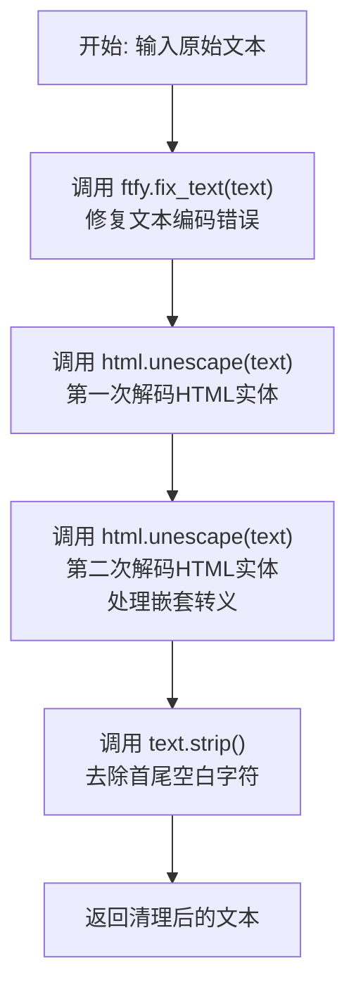
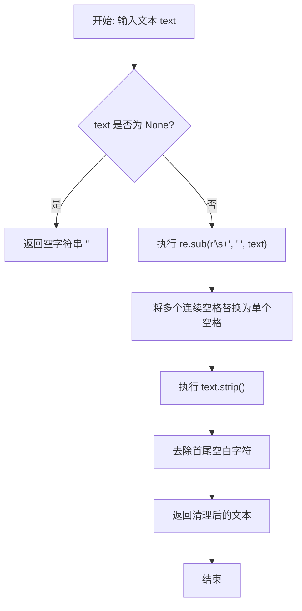
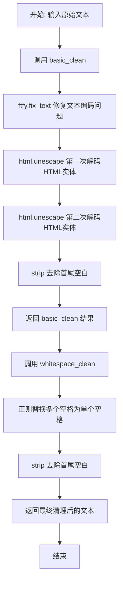
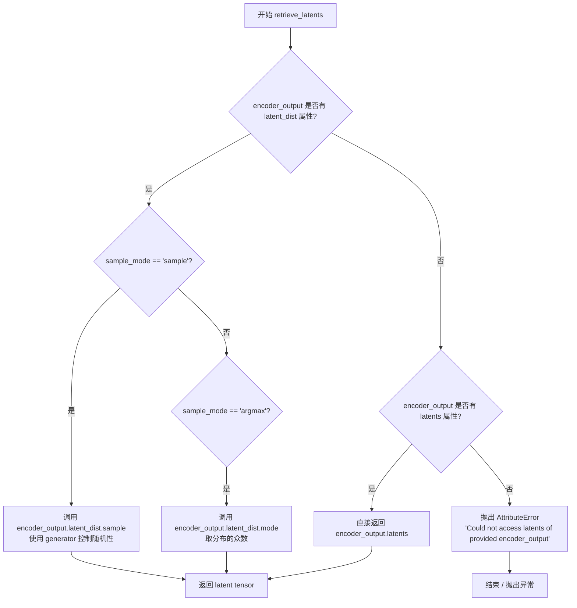
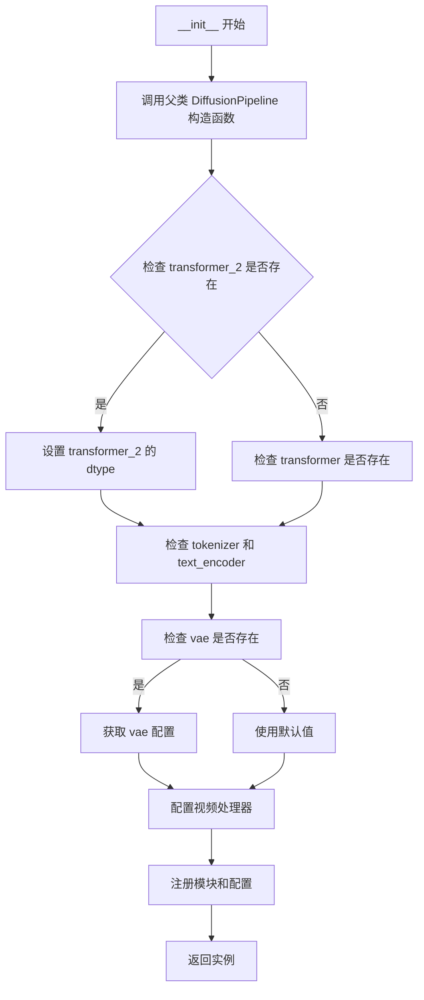
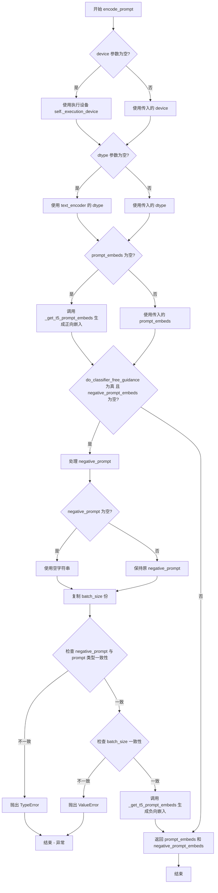
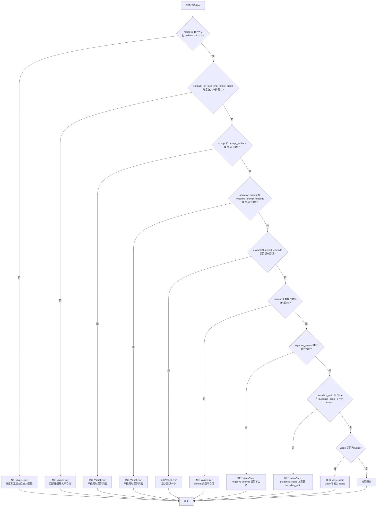
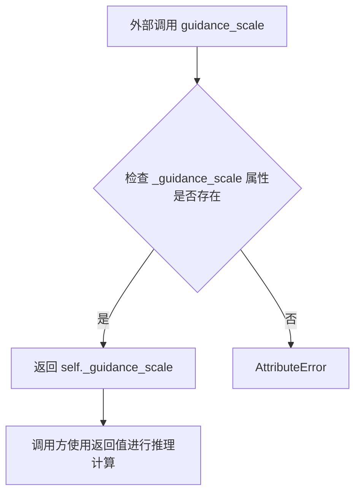
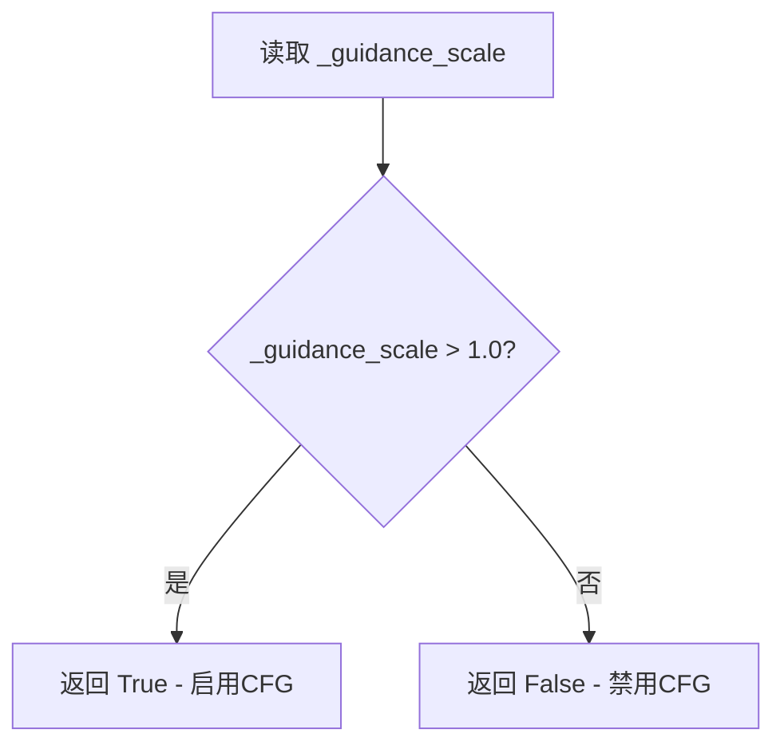
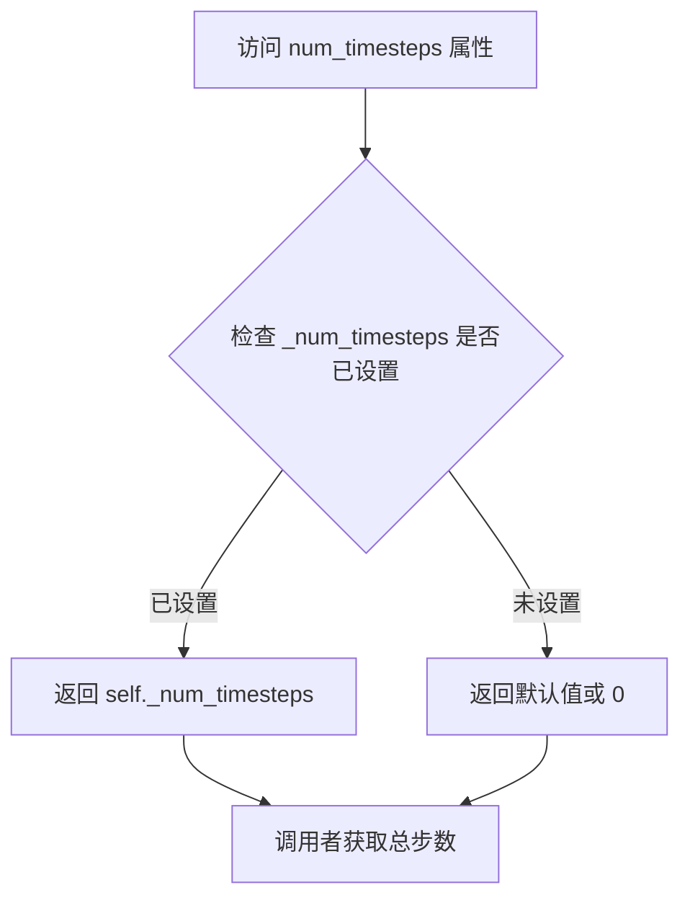

# `diffusers\src\diffusers\pipelines\lucy\pipeline_lucy_edit.py` 详细设计文档

LucyEditPipeline 是一个用于视频编辑（Video-to-Video）的扩散管道。该模型继承自 DiffusionPipeline，通过接收一段原始视频和文本提示（prompt），利用 T5 文本编码器提取文本特征，并结合 Wan Transformer 3D 模型（或双阶段模型）进行去噪，最终通过 VAE 解码生成编辑后的视频。支持分类器自由引导（CFG）、双阶段去噪（Transformer 2）以及潜在空间操作。

## 整体流程

```mermaid
graph TD
    A[Start: pipe(video, prompt)] --> B[check_inputs: 验证参数合法性]
B --> C[encode_prompt: 编码 prompt 和 negative_prompt 为 embeddings]
C --> D[video_processor.preprocess_video: 预处理视频为 tensor]
D --> E[prepare_latents: 生成噪声 latent 和从视频提取条件 latent (condition_latents)]
E --> F[scheduler.set_timesteps: 设置去噪步数]
F --> G{Loop: for t in timesteps}
G --> H{Switch Model: boundary_ratio?}
H -- High Noise --> I[transformer]
H -- Low Noise --> J[transformer_2]
I --> K[latent_model_input = concat(latents, condition_latents)]
J --> K
K --> L[Forward: current_model(hidden_states, timestep, encoder_hidden_states)]
L --> M[Classifier Free Guidance: noise_pred = noise_uncond + scale * (noise_pred - noise_uncond)]
M --> N[scheduler.step: 更新 latents]
N --> O{callback_on_step_end?}
O -- Yes --> P[Execute Callback]
P --> Q[progress_bar.update]
O -- No --> Q
Q --> G
G -- End Loop --> R[vae.decode: 将 latents 解码为 video]
R --> S[video_processor.postprocess_video: 后处理视频格式]
S --> T[Return LucyPipelineOutput]
```

## 类结构

```
DiffusionPipeline (基类)
├── LucyEditPipeline (主类)
└── WanLoraLoaderMixin (LoRA 加载混入)
```

## 全局变量及字段


### `EXAMPLE_DOC_STRING`
    
示例代码文档字符串

类型：`str`
    


### `logger`
    
diffusers 日志记录器

类型：`Logger`
    


### `XLA_AVAILABLE`
    
是否支持 XLA 加速

类型：`bool`
    


### `is_ftfy_available`
    
检查 ftfy 库可用性的函数

类型：`Callable`
    


### `basic_clean`
    
清理文本的基本函数

类型：`function`
    


### `whitespace_clean`
    
清理文本中的空白字符

类型：`function`
    


### `prompt_clean`
    
清理 prompt 的函数

类型：`function`
    


### `retrieve_latents`
    
从 encoder output 中获取 latents

类型：`function`
    


### `LucyEditPipeline.tokenizer`
    
T5 分词器

类型：`AutoTokenizer`
    


### `LucyEditPipeline.text_encoder`
    
T5 文本编码器

类型：`UMT5EncoderModel`
    


### `LucyEditPipeline.vae`
    
视频 VAE 编解码器

类型：`AutoencoderKLWan`
    


### `LucyEditPipeline.scheduler`
    
扩散调度器

类型：`FlowMatchEulerDiscreteScheduler`
    


### `LucyEditPipeline.transformer`
    
主去噪 Transformer

类型：`WanTransformer3DModel`
    


### `LucyEditPipeline.transformer_2`
    
低噪声阶段去噪 Transformer (可选)

类型：`WanTransformer3DModel`
    


### `LucyEditPipeline.video_processor`
    
视频预处理/后处理器

类型：`VideoProcessor`
    


### `LucyEditPipeline.vae_scale_factor_temporal`
    
VAE 时间维度缩放因子

类型：`int`
    


### `LucyEditPipeline.vae_scale_factor_spatial`
    
VAE 空间维度缩放因子

类型：`int`
    


### `LucyEditPipeline._guidance_scale`
    
当前引导系数

类型：`float`
    


### `LucyEditPipeline._guidance_scale_2`
    
第二阶段引导系数

类型：`float`
    


### `LucyEditPipeline._current_timestep`
    
当前去噪时间步

类型：`int`
    


### `LucyEditPipeline._interrupt`
    
中断标志

类型：`bool`
    


### `LucyEditPipeline._attention_kwargs`
    
注意力机制参数

类型：`dict`
    
    

## 全局函数及方法


### `basic_clean`

清理文本中的 HTML 转义和修复 ftfy 错误。

参数：

-  `text`：`str`，需要清理的原始文本

返回值：`str`，清理后的文本

#### 流程图



#### 带注释源码

```python
def basic_clean(text):
    """
    清理文本中的 HTML 转义和修复 ftfy 错误。
    
    该函数执行以下清理操作：
    1. 使用 ftfy 库修复文本编码问题（如乱码、错误的字符编码等）
    2. 使用 html.unescape 两次解码 HTML 实体（处理嵌套转义情况）
    3. 去除文本首尾的空白字符
    
    Args:
        text (str): 需要清理的原始文本
        
    Returns:
        str: 清理后的文本
    """
    # Step 1: 使用 ftfy.fix_text 修复文本编码问题
    # ftfy 可以自动检测和修复常见的文本编码错误，如 mojibake（乱码）
    text = ftfy.fix_text(text)
    
    # Step 2: 第一次解码 HTML 实体
    # 将如 &lt; &gt; &amp; 等 HTML 实体转换为对应的字符
    text = html.unescape(text)
    
    # Step 3: 第二次解码 HTML 实体
    # 处理嵌套转义情况，例如 &amp;lt; 会先变成 &lt;，再变成 <
    # 这样可以确保所有层级的 HTML 实体都被正确解码
    text = html.unescape(text)
    
    # Step 4: 去除首尾空白字符
    # 使用 strip() 移除字符串开头和结尾的空白字符（包括空格、换行、制表符等）
    return text.strip()
```


### `whitespace_clean`

该函数用于将文本中的多个连续空格合并为单个空格，并去除字符串首尾的空白字符，是文本预处理管道中的基础清理步骤。

参数：

- `text`：`str`，需要进行空白清理的原始文本字符串

返回值：`str`，返回已清理空白后的文本字符串

#### 流程图



#### 带注释源码

```python
def whitespace_clean(text):
    """
    将多个空格合并为一个并去除首尾空白
    
    Args:
        text: 需要清理的输入文本
        
    Returns:
        清理后的文本字符串
    """
    # 使用正则表达式将一个或多个空白字符(\s+)替换为单个空格
    text = re.sub(r"\s+", " ", text)
    # 去除字符串首尾的空白字符
    text = text.strip()
    # 返回清理后的文本
    return text
```


### `prompt_clean`

组合基本清理（修复文本编码和处理HTML实体）和空格清理（规范化多余空格），输出清洗后的文本。

参数：

-  `text`：`str`，需要进行清理的原始文本

返回值：`str`，清理后的文本

#### 流程图



#### 带注释源码

```
def prompt_clean(text):
    """
    组合基本清理和空格清理的文本预处理函数。
    
    该函数是一个组合函数，依次调用 basic_clean 和 whitespace_clean：
    1. basic_clean: 修复文本编码问题（使用ftfy），处理HTML实体（双重unescape）
    2. whitespace_clean: 将多个连续空格规范化为单个空格，并去除首尾空白
    
    Args:
        text: 需要清理的原始文本字符串
        
    Returns:
        清理后的文本字符串
    """
    # 第一步：基本清理
    # - ftfy.fix_text: 修复常见的文本编码问题，如mojibake（乱码）
    # - html.unescape: 两次解码HTML实体，确保所有HTML实体都被正确转换
    # - strip: 去除清理后文本的首尾空白
    text = basic_clean(text)
    
    # 第二步：空格清理
    # - re.sub(r"\s+", " ", text): 将任意多个连续空白字符（空格、制表符、换行等）
    #   替换为单个空格，实现空格规范化
    # - strip: 再次去除首尾空白，确保输出干净
    text = whitespace_clean(text)
    
    # 返回最终清理后的文本
    return text
```


### `retrieve_latents`

从 VAE encoder output 中提取 latent tensor，根据 sample_mode 参数选择从 latent_dist 中采样或取最大值，或直接返回预存的 latents 属性。

参数：

- `encoder_output`：`torch.Tensor`，VAE 编码器的输出，通常包含 `latent_dist` 或 `latents` 属性
- `generator`：`torch.Generator | None`，可选的随机数生成器，用于采样时的随机性控制
- `sample_mode`：`str`，采样模式，"sample" 表示从分布中采样，"argmax" 表示取分布的众数

返回值：`torch.Tensor`，从 encoder_output 中提取的 latent tensor

#### 流程图



#### 带注释源码

```python
# 从 diffusers 库复制而来的函数，用于从 VAE 编码器输出中提取潜在向量
def retrieve_latents(
    encoder_output: torch.Tensor,  # VAE 编码器的输出张量
    generator: torch.Generator | None = None,  # 可选的随机数生成器，用于控制采样随机性
    sample_mode: str = "sample"  # 采样模式：'sample' 从分布采样，'argmax' 取众数
):
    """
    从 VAE encoder output 中提取 latent tensor。
    
    支持三种提取方式：
    1. 从 latent_dist 中采样（sample_mode='sample'）
    2. 从 latent_dist 中取众数/最大值（sample_mode='argmax'）
    3. 直接返回预存的 latents 属性
    
    Args:
        encoder_output: VAE 编码器的输出，包含 latent_dist 或 latents 属性
        generator: 可选的随机数生成器，用于采样模式下的随机性控制
        sample_mode: 采样模式，'sample' 或 'argmax'
    
    Returns:
        提取的 latent tensor
    
    Raises:
        AttributeError: 当 encoder_output 既没有 latent_dist 也没有 latents 属性时
    """
    
    # 检查 encoder_output 是否有 latent_dist 属性且模式为 sample
    if hasattr(encoder_output, "latent_dist") and sample_mode == "sample":
        # 从潜在分布中采样，使用 generator 控制随机性（用于可重复的生成）
        return encoder_output.latent_dist.sample(generator)
    
    # 检查 encoder_output 是否有 latent_dist 属性且模式为 argmax
    elif hasattr(encoder_output, "latent_dist") and sample_mode == "argmax":
        # 取潜在分布的众数（最可能的值），用于确定性的生成
        return encoder_output.latent_dist.mode()
    
    # 检查 encoder_output 是否有预存的 latents 属性
    elif hasattr(encoder_output, "latents"):
        # 直接返回预编码的 latents
        return encoder_output.latents
    
    # 如果无法访问所需的潜在向量属性，抛出异常
    else:
        raise AttributeError("Could not access latents of provided encoder_output")
```


### `LucyEditPipeline.__init__`

初始化 LucyEditPipeline 管道组件和配置，包括注册令牌器、文本编码器、VAE、调度器、可选的双阶段去噪变换器（transformer 和 transformer_2），并配置时间步展开和视频处理相关的参数。

参数：

- `tokenizer`：`AutoTokenizer`，T5 分词器，用于将文本提示编码为令牌序列
- `text_encoder`：`UMT5EncoderModel`，T5 文本编码器模型，用于生成文本嵌入
- `vae`：`AutoencoderKLWan`，变分自编码器模型，用于视频的编码和解码
- `scheduler`：`FlowMatchEulerDiscreteScheduler`，离散欧拉调度器，用于去噪过程的时间步调度
- `transformer`：`WanTransformer3DModel | None`，条件变换器，用于高噪声阶段去噪（可选）
- `transformer_2`：`WanTransformer3DModel | None`，条件变换器，用于低噪声阶段去噪（可选）
- `boundary_ratio`：`float | None`，双阶段去噪的时间步边界比例（可选）
- `expand_timesteps`：`bool`，是否展开时间步用于 Wan2.2 ti2v（默认为 False）

返回值：`None`，该方法为构造函数，不返回任何值

#### 流程图



#### 带注释源码

```python
def __init__(
    self,
    tokenizer: AutoTokenizer,
    text_encoder: UMT5EncoderModel,
    vae: AutoencoderKLWan,
    scheduler: FlowMatchEulerDiscreteScheduler,
    transformer: WanTransformer3DModel | None = None,
    transformer_2: WanTransformer3DModel | None = None,
    boundary_ratio: float | None = None,
    expand_timesteps: bool = False,  # Wan2.2 ti2v
):
    """
    初始化 LucyEditPipeline 管道组件和配置
    
    参数:
        tokenizer: T5 分词器，用于文本预处理
        text_encoder: T5 文本编码器，用于生成文本嵌入
        vae: 视频 VAE 模型，用于编码和解码
        scheduler: 去噪调度器
        transformer: 主变换器（高噪声阶段）
        transformer_2: 辅助变换器（低噪声阶段，可选）
        boundary_ratio: 两阶段去噪的时间步边界比例
        expand_timesteps: 是否启用时间步展开
    """
    # 调用父类 DiffusionPipeline 的初始化方法
    # 设置基础的管道配置和设备管理
    super().__init__()

    # 注册所有模块到管道中，便于后续的保存、加载和设备管理
    self.register_modules(
        vae=vae,
        text_encoder=text_encoder,
        tokenizer=tokenizer,
        transformer=transformer,
        scheduler=scheduler,
        transformer_2=transformer_2,
    )
    
    # 将边界比例和時間步展开配置注册到管道的 config 中
    # 用于后续判断是否启用双阶段去噪
    self.register_to_config(boundary_ratio=boundary_ratio)
    self.register_to_config(expand_timesteps=expand_timesteps)
    
    # 获取 VAE 的时序缩放因子，用于计算潜在帧数和空间尺寸
    # 如果 VAE 不存在则使用默认值 4（时序）和 8（空间）
    self.vae_scale_factor_temporal = self.vae.config.scale_factor_temporal if getattr(self, "vae", None) else 4
    self.vae_scale_factor_spatial = self.vae.config.scale_factor_spatial if getattr(self, "vae", None) else 8
    
    # 创建视频处理器，用于视频的预处理和后处理
    # 使用空间缩放因子初始化处理器
    self.video_processor = VideoProcessor(vae_scale_factor=self.vae_scale_factor_spatial)
```


### `LucyEditPipeline._get_t5_prompt_embeds`

使用 T5 文本编码器将文本 prompt 编码为高维向量表示，供后续扩散模型生成视频使用。

参数：

- `prompt`：`str | list[str]`，待编码的文本提示词，可以是单个字符串或字符串列表
- `num_videos_per_prompt`：`int`，每个提示词需要生成的视频数量，用于复制嵌入向量
- `max_sequence_length`：`int`，文本序列的最大长度，超过该长度将被截断
- `device`：`torch.device | None`，计算设备，默认为执行设备
- `dtype`：`torch.dtype | None`，张量数据类型，默认为文本编码器的数据类型

返回值：`torch.Tensor`，编码后的文本嵌入向量，形状为 `(batch_size * num_videos_per_prompt, seq_len, hidden_dim)`

#### 流程图

```mermaid
flowchart TD
    A[开始] --> B[获取设备 device]
    B --> C[获取数据类型 dtype]
    C --> D{prompt 是字符串?}
    D -->|是| E[转换为列表: [prompt]]
    D -->|否| F[保持列表形式]
    E --> G[对每个 prompt 调用 prompt_clean 清理]
    F --> G
    G --> H[获取 batch_size]
    H --> I[调用 tokenizer 进行分词]
    I --> J[提取 input_ids 和 attention_mask]
    J --> K[计算实际序列长度 seq_lens]
    K --> L[调用 text_encoder 编码]
    L --> M[转换为指定 dtype 和 device]
    M --> N[截断填充后的嵌入]
    N --> O[为每个 prompt 复制 num_videos_per_prompt 次]
    O --> P[调整形状]
    P --> Q[返回 prompt_embeds]
```

#### 带注释源码

```python
def _get_t5_prompt_embeds(
    self,
    prompt: str | list[str] = None,
    num_videos_per_prompt: int = 1,
    max_sequence_length: int = 226,
    device: torch.device | None = None,
    dtype: torch.dtype | None = None,
):
    # 1. 确定设备：如果未指定，则使用执行设备
    device = device or self._execution_device
    # 2. 确定数据类型：如果未指定，则使用文本编码器的数据类型
    dtype = dtype or self.text_encoder.dtype

    # 3. 预处理 prompt：统一转为列表，并清理文本
    prompt = [prompt] if isinstance(prompt, str) else prompt
    prompt = [prompt_clean(u) for u in prompt]
    batch_size = len(prompt)

    # 4. Tokenize：使用 T5 tokenizer 将文本转为 token ID
    text_inputs = self.tokenizer(
        prompt,
        padding="max_length",           # 填充到最大长度
        max_length=max_sequence_length, # 最大序列长度
        truncation=True,                # 超过最大长度则截断
        add_special_tokens=True,        # 添加特殊 token (如 EOS)
        return_attention_mask=True,      # 返回注意力掩码
        return_tensors="pt",             # 返回 PyTorch 张量
    )
    # 5. 提取 token IDs 和注意力掩码
    text_input_ids, mask = text_inputs.input_ids, text_inputs.attention_mask
    # 6. 计算每个序列的实际长度（去除 padding）
    seq_lens = mask.gt(0).sum(dim=1).long()

    # 7. 调用 T5 编码器得到隐藏状态
    prompt_embeds = self.text_encoder(text_input_ids.to(device), mask.to(device)).last_hidden_state
    # 8. 转换数据类型和设备
    prompt_embeds = prompt_embeds.to(dtype=dtype, device=device)
    # 9. 截断嵌入：只保留实际有内容的部分，去除 padding
    prompt_embeds = [u[:v] for u, v in zip(prompt_embeds, seq_lens)]
    # 10. 重新填充到固定长度：用零填充使所有嵌入长度一致
    prompt_embeds = torch.stack(
        [torch.cat([u, u.new_zeros(max_sequence_length - u.size(0), u.size(1))]) for u in prompt_embeds], dim=0
    )

    # 11. 为每个 prompt 复制 num_videos_per_prompt 次（MPS 友好的方法）
    _, seq_len, _ = prompt_embeds.shape
    prompt_embeds = prompt_embeds.repeat(1, num_videos_per_prompt, 1)  # 在序列维度复制
    # 12. 调整形状为 (batch_size * num_videos_per_prompt, seq_len, hidden_dim)
    prompt_embeds = prompt_embeds.view(batch_size * num_videos_per_prompt, seq_len, -1)

    # 13. 返回编码后的嵌入
    return prompt_embeds
```


### `LucyEditPipeline.encode_prompt`

该方法封装了文本提示词的编码逻辑，通过 T5 文本编码器将提示词和负向提示词转换为高维向量表示，并支持分类器自由引导（CFG）策略。当启用 CFG 时，方法会同时生成正向和负向提示词的嵌入向量，以便在后续的去噪过程中实现无分类器的文本引导生成。

参数：

- `prompt`：`str | list[str]`，要编码的文本提示词，支持单个字符串或字符串列表
- `negative_prompt`：`str | list[str] | None`，不参与引导的负向提示词，用于在 CFG 模式下引导模型远离特定内容，默认为 None
- `do_classifier_free_guidance`：`bool`，是否启用分类器自由引导，默认为 True
- `num_videos_per_prompt`：`int`，每个提示词需要生成的视频数量，用于批量生成时复制嵌入向量，默认为 1
- `prompt_embeds`：`torch.Tensor | None`，预先生成的提示词嵌入向量，可用于微调输入，若提供则跳过从 prompt 生成，默认为 None
- `negative_prompt_embeds`：`torch.Tensor | None`，预先生成的负向提示词嵌入向量，若提供则跳过从 negative_prompt 生成，默认为 None
- `max_sequence_length`：`int`，文本编码器的最大序列长度，超过该长度的文本会被截断，默认为 226
- `device`：`torch.device | None`，用于放置生成嵌入向量的目标设备，默认为执行设备
- `dtype`：`torch.dtype | None`，生成嵌入向量的目标数据类型，默认为文本编码器的数据类型

返回值：`tuple[torch.Tensor, torch.Tensor]`，返回两个张量组成的元组，第一个为提示词嵌入向量，第二个为负向提示词嵌入向量；若不启用 CFG 或已提供预计算嵌入，负向提示词嵌入可能为 None

#### 流程图



#### 带注释源码

```python
def encode_prompt(
    self,
    prompt: str | list[str],
    negative_prompt: str | list[str] | None = None,
    do_classifier_free_guidance: bool = True,
    num_videos_per_prompt: int = 1,
    prompt_embeds: torch.Tensor | None = None,
    negative_prompt_embeds: torch.Tensor | None = None,
    max_sequence_length: int = 226,
    device: torch.device | None = None,
    dtype: torch.dtype | None = None,
):
    r"""
    Encodes the prompt into text encoder hidden states.

    Args:
        prompt (`str` or `list[str]`, *optional*):
            prompt to be encoded
        negative_prompt (`str` or `list[str]`, *optional*):
            The prompt or prompts not to guide the image generation. If not defined, one has to pass
            `negative_prompt_embeds` instead. Ignored when not using guidance (i.e., ignored if `guidance_scale` is
            less than `1`).
        do_classifier_free_guidance (`bool`, *optional*, defaults to `True`):
            Whether to use classifier free guidance or not.
        num_videos_per_prompt (`int`, *optional*, defaults to 1):
            Number of videos that should be generated per prompt. torch device to place the resulting embeddings on
        prompt_embeds (`torch.Tensor`, *optional*):
            Pre-generated text embeddings. Can be used to easily tweak text inputs, *e.g.* prompt weighting. If not
            provided, text embeddings will be generated from `prompt` input argument.
        negative_prompt_embeds (`torch.Tensor`, *optional*):
            Pre-generated negative text embeddings. Can be used to easily tweak text inputs, *e.g.* prompt
            weighting. If not provided, negative_prompt_embeds will be generated from `negative_prompt` input
            argument.
        device: (`torch.device`, *optional*):
            torch device
        dtype: (`torch.dtype`, *optional*):
            torch dtype
    """
    # 确定设备：如果未指定，则使用管道的执行设备
    device = device or self._execution_device

    # 将单个字符串转换为列表，确保统一处理
    prompt = [prompt] if isinstance(prompt, str) else prompt
    
    # 确定批量大小：优先使用 prompt_embeds 的批量大小，否则从 prompt 列表长度获取
    if prompt is not None:
        batch_size = len(prompt)
    else:
        batch_size = prompt_embeds.shape[0]

    # 如果未提供预计算的提示词嵌入，则从原始 prompt 生成
    if prompt_embeds is None:
        prompt_embeds = self._get_t5_prompt_embeds(
            prompt=prompt,
            num_videos_per_prompt=num_videos_per_prompt,
            max_sequence_length=max_sequence_length,
            device=device,
            dtype=dtype,
        )

    # 如果启用 CFG 且未提供负向提示词嵌入，则生成负向嵌入
    if do_classifier_free_guidance and negative_prompt_embeds is None:
        # 默认使用空字符串作为负向提示词
        negative_prompt = negative_prompt or ""
        # 确保负向提示词与正向提示词数量一致（复制以匹配批量大小）
        negative_prompt = batch_size * [negative_prompt] if isinstance(negative_prompt, str) else negative_prompt

        # 类型检查：负向提示词类型必须与正向提示词类型一致
        if prompt is not None and type(prompt) is not type(negative_prompt):
            raise TypeError(
                f"`negative_prompt` should be the same type to `prompt`, but got {type(negative_prompt)} !="
                f" {type(prompt)}."
            )
        # 批量大小检查：负向提示词数量必须与正向提示词数量一致
        elif batch_size != len(negative_prompt):
            raise ValueError(
                f"`negative_prompt`: {negative_prompt} has batch size {len(negative_prompt)}, but `prompt`:"
                f" {prompt} has batch size {batch_size}. Please make sure that passed `negative_prompt` matches"
                " the batch size of `prompt`."
            )

        # 生成负向提示词嵌入
        negative_prompt_embeds = self._get_t5_prompt_embeds(
            prompt=negative_prompt,
            num_videos_per_prompt=num_videos_per_prompt,
            max_sequence_length=max_sequence_length,
            device=device,
            dtype=dtype,
        )

    # 返回正向和负向提示词嵌入元组
    return prompt_embeds, negative_prompt_embeds
```


### `LucyEditPipeline.check_inputs`

校验输入参数（高度、宽度、prompt、video 等）的合法性，确保传入管道的所有参数符合模型推理要求。如果参数不合法，该方法会抛出相应的 `ValueError` 异常。

参数：

- `video`：`Any`，输入视频数据，用于视频生成的条件输入
- `prompt`：`str | list[str] | None`，引导视频生成的文本提示词
- `negative_prompt`：`str | list[str] | None`，视频生成时需要避免的内容
- `height`：`int`，生成视频的高度（像素）
- `width`：`int`，生成视频的宽度（像素）
- `prompt_embeds`：`torch.Tensor | None`，预生成的文本嵌入向量
- `negative_prompt_embeds`：`torch.Tensor | None`，预生成的负面文本嵌入向量
- `callback_on_step_end_tensor_inputs`：`list[str] | None`，每步结束时回调的张量输入列表
- `guidance_scale_2`：`float | None`，第二阶段低噪声_transformer的引导比例

返回值：`None`，该方法不返回值，通过抛出异常来处理校验失败的情况

#### 流程图



#### 带注释源码

```python
def check_inputs(
    self,
    video,
    prompt,
    negative_prompt,
    height,
    width,
    prompt_embeds=None,
    negative_prompt_embeds=None,
    callback_on_step_end_tensor_inputs=None,
    guidance_scale_2=None,
):
    """
    校验输入参数的合法性
    
    该方法在管道执行前被调用，确保所有传入的参数符合模型要求。
    如果任何参数不合法，将抛出详细的 ValueError 异常。
    
    校验规则：
    1. height 和 width 必须能被 16 整除（VAE 编码要求）
    2. callback_on_step_end_tensor_inputs 必须在允许的列表中
    3. prompt 和 prompt_embeds 不能同时提供
    4. negative_prompt 和 negative_prompt_embeds 不能同时提供
    5. prompt 和 prompt_embeds 至少提供一个
    6. prompt 和 negative_prompt 必须是 str 或 list 类型
    7. guidance_scale_2 仅在 boundary_ratio 不为 None 时才能使用
    8. video 不能为 None
    """
    
    # 校验 1: 检查高度和宽度是否被 16 整除
    # Wan 模型的 VAE 使用 8 倍空间下采样和 4 倍时间下采样
    # 因此输入尺寸必须是 16 的倍数以确保中间表示维度为整数
    if height % 16 != 0 or width % 16 != 0:
        raise ValueError(f"`height` and `width` have to be divisible by 16 but are {height} and {width}.")

    # 校验 2: 检查回调张量输入是否在允许的列表中
    # 回调函数只能访问管道明确允许的张量，防止内存泄漏或安全问题
    if callback_on_step_end_tensor_inputs is not None and not all(
        k in self._callback_tensor_inputs for k in callback_on_step_end_tensor_inputs
    ):
        raise ValueError(
            f"`callback_on_step_end_tensor_inputs` has to be in {self._callback_tensor_inputs}, but found {[k for k in callback_on_step_end_tensor_inputs if k not in self._callback_tensor_inputs]}"
        )

    # 校验 3: 检查 prompt 和 prompt_embeds 是否冲突
    # 两者都提供会导致歧义，不清楚应该使用哪个进行生成
    if prompt is not None and prompt_embeds is not None:
        raise ValueError(
            f"Cannot forward both `prompt`: {prompt} and `prompt_embeds`: {prompt_embeds}. Please make sure to"
            " only forward one of the two."
        )
        
    # 校验 4: 检查 negative_prompt 和 negative_prompt_embeds 是否冲突
    elif negative_prompt is not None and negative_prompt_embeds is not None:
        raise ValueError(
            f"Cannot forward both `negative_prompt`: {negative_prompt} and `negative_prompt_embeds`: {negative_prompt_embeds}. Please make sure to"
            " only forward one of the two."
        )
        
    # 校验 5: 检查是否提供了必要的提示信息
    # 用户必须至少提供一个提示来源，否则无法进行有意义的生成
    elif prompt is None and prompt_embeds is None:
        raise ValueError(
            "Provide either `prompt` or `prompt_embeds`. Cannot leave both `prompt` and `prompt_embeds` undefined."
        )
        
    # 校验 6: 检查 prompt 的类型是否合法
    # 支持字符串或字符串列表两种形式，用于批量生成
    elif prompt is not None and (not isinstance(prompt, str) and not isinstance(prompt, list)):
        raise ValueError(f"`prompt` has to be of type `str` or `list` but is {type(prompt)}")
        
    # 校验 7: 检查 negative_prompt 的类型是否合法
    elif negative_prompt is not None and (
        not isinstance(negative_prompt, str) and not isinstance(negative_prompt, list)
    ):
        raise ValueError(f"`negative_prompt` has to be of type `str` or `list` but is {type(negative_prompt)}")

    # 校验 8: 检查 guidance_scale_2 的使用条件
    # guidance_scale_2 仅在双transformer模式下有效，需要先配置 boundary_ratio
    if self.config.boundary_ratio is None and guidance_scale_2 is not None:
        raise ValueError("`guidance_scale_2` is only supported when the pipeline's `boundary_ratio` is not None.")

    # 校验 9: 检查视频输入是否存在
    # 视频是视频编辑任务的必要条件，不能为空
    if video is None:
        raise ValueError("`video` is required, received None.")
```


### `LucyEditPipeline.prepare_latents`

该方法负责准备视频编辑Pipeline所需的初始噪声 latent 和从输入视频提取的条件 latent。它首先根据视频帧数计算 latent 的形状，然后生成或处理随机噪声 latent，接着通过 VAE 编码器从输入视频中提取条件 latent 并进行标准化处理，最后验证两者的形状一致性。

参数：

- `video`：`torch.Tensor | None`，输入视频 tensor，用于提取条件 latent 和计算帧数
- `batch_size`：`int`，批处理大小，默认为 1
- `num_channels_latents`：`int`， latent 的通道数，默认为 16
- `height`：`int`，视频高度（像素），默认为 480
- `width`：`int`，视频宽度（像素），默认为 832
- `dtype`：`torch.dtype | None`，生成 tensor 的数据类型，默认为 None
- `device`：`torch.device | None`，生成 tensor 的设备，默认为 None
- `generator`：`torch.Generator | None`，随机数生成器，用于生成确定性噪声，默认为 None
- `latents`：`torch.Tensor | None`，预生成的噪声 latent，如果为 None 则自动生成，默认为 None

返回值：`tuple[torch.Tensor, torch.Tensor]`，返回两个张量——第一个是初始噪声 latents，第二个是从视频提取的条件 latents

#### 流程图

```mermaid
flowchart TD
    A[开始 prepare_latents] --> B{generator 是列表且长度<br/>不等于 batch_size?}
    B -->|是| C[抛出 ValueError]
    B -->|否| D{latents 参数为 None?}
    D -->|是| E[计算 latent 帧数:<br/>video.size(2) - 1<br/>/ vae_scale_factor_temporal + 1]
    D -->|否| F[使用提供的 latents 帧数]
    E --> G[计算 shape:<br/>batch_size, num_channels_latents,<br/>num_latent_frames,<br/>height/vae_scale_factor_spatial,<br/>width/vae_scale_factor_spatial]
    F --> G
    G --> H{latents 为 None?}
    H -->|是| I[使用 randn_tensor<br/>生成随机噪声 latent]
    H -->|否| J[将 latents 移动到 device]
    I --> K[从视频提取条件 latent:<br/>遍历 video 帧<br/>使用 vae.encode + retrieve_latents]
    J --> K
    K --> L[torch.cat 合并条件 latent<br/>并转换为 dtype]
    M[计算 latents_mean:<br/>vae.config.latents_mean<br/>reshape 为 (1, z_dim, 1, 1, 1)]
    N[计算 latents_std:<br/>1.0 / vae.config.latents_std<br/>reshape 为 (1, z_dim, 1, 1, 1)]
    L --> O[标准化条件 latent:<br/>condition_latents =<br/>(condition_latents - mean) * std]
    M --> O
    N --> O
    O --> P{latents.shape ==<br/>condition_latents.shape?}
    P -->|否| Q[抛出 AssertionError]
    P -->|是| R[返回 (latents, condition_latents)]
```

#### 带注释源码

```python
def prepare_latents(
    self,
    video: torch.Tensor | None = None,
    batch_size: int = 1,
    num_channels_latents: int = 16,
    height: int = 480,
    width: int = 832,
    dtype: torch.dtype | None = None,
    device: torch.device | None = None,
    generator: torch.Generator | None = None,
    latents: torch.Tensor | None = None,
) -> tuple[torch.Tensor, torch.Tensor]:
    # 检查 generator 列表长度是否与 batch_size 匹配
    if isinstance(generator, list) and len(generator) != batch_size:
        raise ValueError(
            f"You have passed a list of generators of length {len(generator)}, but requested an effective batch"
            f" size of {batch_size}. Make sure the batch size matches the length of the generators."
        )

    # 计算 latent 帧数：如果未提供 latents，则根据视频帧数和 VAE 时间缩放因子计算
    # 否则使用提供的 latents 的帧数
    num_latent_frames = (
        (video.size(2) - 1) // self.vae_scale_factor_temporal + 1 if latents is None else latents.size(1)
    )
    
    # 构建 latent 的形状：(batch_size, channels, frames, height/8, width/8)
    # 这里 8 是 VAE 的空间缩放因子
    shape = (
        batch_size,
        num_channels_latents,
        num_latent_frames,
        height // self.vae_scale_factor_spatial,
        width // self.vae_scale_factor_spatial,
    )
    
    # 准备噪声 latent
    if latents is None:
        # 使用 randn_tensor 生成随机高斯噪声作为初始 latent
        latents = randn_tensor(shape, generator=generator, device=device, dtype=dtype)
    else:
        # 如果提供了 latents，确保其移动到正确的设备
        latents = latents.to(device)

    # 准备条件 latent：从输入视频中提取
    # 遍历视频的每一帧，使用 VAE 编码器提取 latent
    # sample_mode="argmax" 表示使用分布的模式而非采样
    condition_latents = [
        retrieve_latents(self.vae.encode(vid.unsqueeze(0)), sample_mode="argmax") for vid in video
    ]

    # 将所有帧的条件 latent 沿 batch 维度拼接，并转换为指定 dtype
    condition_latents = torch.cat(condition_latents, dim=0).to(dtype)

    # 从 VAE 配置中获取 latent 的均值和标准差，用于标准化
    # 将均值和标准差 reshape 为 (1, z_dim, 1, 1, 1) 以便广播操作
    latents_mean = (
        torch.tensor(self.vae.config.latents_mean).view(1, self.vae.config.z_dim, 1, 1, 1).to(device, dtype)
    )
    latents_std = 1.0 / torch.tensor(self.vae.config.latents_std).view(1, self.vae.config.z_dim, 1, 1, 1).to(
        device, dtype
    )

    # 对条件 latent 进行标准化：(x - mean) * std
    # 这是为了将 VAE 编码后的 latent 转换到与噪声 latent 相同的分布空间
    condition_latents = (condition_latents - latents_mean) * latents_std

    # 验证 latents 和 condition_latents 的形状是否匹配
    # 这是必须的，因为后续会将它们在 channel 维度上拼接
    assert latents.shape == condition_latents.shape, (
        f"Latents shape {latents.shape} does not match expected shape {condition_latents.shape}. Please check the input."
    )

    # 返回噪声 latent 和条件 latent，供去噪循环使用
    return latents, condition_latents
```


### `LucyEditPipeline.__call__`

该方法是LucyEditPipeline的核心推理方法，执行视频生成的全流程。它接收条件视频和文本提示，通过VAE编码条件视频获取条件潜在表示，结合文本嵌入和去噪潜在变量，在Transformer中进行多步去噪（支持双阶段去噪），最后通过VAE解码生成目标视频。

参数：

- `video`：`list[Image.Image]`，用作视频生成条件的输入视频
- `prompt`：`str | list[str]`，引导视频生成的文本提示，如不定义则需传入`prompt_embeds`
- `negative_prompt`：`str | list[str]`，视频生成过程中避免的内容提示，如不定义则需传入`negative_prompt_embeds`
- `height`：`int`，生成视频的高度（像素），默认480
- `width`：`int`，生成视频的宽度（像素），默认832
- `num_frames`：`int`，生成视频的帧数，默认81
- `num_inference_steps`：`int`，去噪步数，默认50
- `guidance_scale`：`float`，无分类器自由引导（CFG）比例，默认5.0
- `guidance_scale_2`：`float | None`，低噪声阶段Transformer的引导比例，默认None
- `num_videos_per_prompt`：`int | None`，每个提示生成的视频数量，默认1
- `generator`：`torch.Generator | list[torch.Generator] | None`，用于生成确定性结果的随机数生成器
- `latents`：`torch.Tensor | None`，预生成的噪声潜在变量，用于图像生成
- `prompt_embeds`：`torch.Tensor | None`，预生成的文本嵌入，用于提示加权
- `negative_prompt_embeds`：`torch.Tensor | None`，预生成的负向文本嵌入
- `output_type`：`str | None`，输出格式，默认"np"（numpy数组）
- `return_dict`：`bool`，是否返回`LucyPipelineOutput`对象，默认True
- `attention_kwargs`：`dict[str, Any] | None`，传递给AttentionProcessor的额外参数
- `callback_on_step_end`：`Callable | PipelineCallback | MultiPipelineCallbacks | None`，每步去噪结束时的回调函数
- `callback_on_step_end_tensor_inputs`：`list[str]`，回调函数接收的张量输入列表，默认["latents"]
- `max_sequence_length`：`int`，文本编码器的最大序列长度，默认512

返回值：`LucyPipelineOutput` 或 `tuple`，当`return_dict`为True时返回`LucyPipelineOutput(frames=video)`，否则返回元组`(video,)`，其中video为生成的视频帧列表

#### 流程图

```mermaid
flowchart TD
    A[开始 __call__] --> B{检查 callback_on_step_end 类型}
    B -->|是 PipelineCallback 或 MultiPipelineCallbacks| C[设置 callback_on_step_end_tensor_inputs]
    B -->|否| D[跳过]
    C --> D
    
    D --> E[调用 check_inputs 验证输入]
    E --> F{验证 num_frames}
    F -->|需要调整| G[调整 num_frames 为 vae_scale_factor_temporal 的倍数]
    F -->|无需调整| H[继续]
    G --> H
    
    H --> I[设置 guidance_scale_2]
    I --> J[获取执行设备 device]
    
    J --> K[确定 batch_size]
    K --> L[调用 encode_prompt 编码提示]
    L --> M[转换 prompt_embeds 为 transformer_dtype]
    
    M --> N[调用 scheduler.set_timesteps 设置时间步]
    N --> O[获取 timesteps]
    
    O --> P[计算 num_channels_latents]
    P --> Q[预处理视频 video_processor.preprocess_video]
    Q --> R[调用 prepare_latents 准备潜在变量]
    R --> S[创建 mask 全1张量]
    
    S --> T[计算 boundary_timestep]
    T --> U[创建进度条]
    
    U --> V{遍历 timesteps}
    V -->|中断| W[设置 interrupt 标志]
    V -->|未中断| X{判断使用哪个 transformer}
    X -->|t >= boundary_timestep| Y[使用 transformer, guidance_scale]
    X -->|t < boundary_timestep| Z[使用 transformer_2, guidance_scale_2]
    
    Y --> AA[拼接 latents 和 condition_latents]
    Z --> AA
    
    AA --> AB{expand_timesteps 设置}
    AB -->|True| AC[扩展 timestep 为序列长度]
    AB -->|False| AD[timestep 扩展为 batch_size]
    
    AC --> AE[调用 current_model 进行条件预测]
    AD --> AE
    
    AE --> AF{do_classifier_free_guidance}
    AF -->|True| AG[调用 current_model 进行无条件预测]
    AF -->|False| AH[跳过无条件预测]
    
    AG --> AI[计算 noise_pred = noise_uncond + guidance_scale * (noise_pred - noise_uncond)]
    AH --> AI
    
    AI --> AJ[调用 scheduler.step 计算上一步噪声]
    AJ --> AK[更新 latents]
    
    AK --> AL{callback_on_step_end}
    AL -->|有回调| AM[执行回调并更新 latents/prompt_embeds]
    AL -->|无回调| AN[跳过]
    
    AM --> AO[更新进度条]
    AN --> AO
    
    AO --> AP{XLA_AVAILABLE}
    AP -->|True| AQ[xm.mark_step]
    AP -->|False| AR[继续]
    
    AQ --> AS[检查是否完成去噪]
    AR --> AS
    
    AS --> V
    
    V -->|完成| AT{output_type == 'latent'}
    AT -->|否| AU[转换 latents 到 vae.dtype]
    AT -->|是| AV[直接使用 latents 作为视频]
    
    AU --> AW[反标准化 latents]
    AW --> AX[调用 vae.decode 解码]
    AX --> AY[调用 video_processor.postprocess_video 后处理]
    AY --> AV
    
    AV --> AZ[释放模型钩子 maybe_free_model_hooks]
    
    AZ --> BA{return_dict}
    BA -->|True| BB[返回 LucyPipelineOutput]
    BA -->|False| BC[返回元组 video]
    
    BB --> BD[结束]
    BC --> BD
```

#### 带注释源码

```python
@torch.no_grad()
@replace_example_docstring(EXAMPLE_DOC_STRING)
def __call__(
    self,
    video: list[Image.Image],
    prompt: str | list[str] = None,
    negative_prompt: str | list[str] = None,
    height: int = 480,
    width: int = 832,
    num_frames: int = 81,
    num_inference_steps: int = 50,
    guidance_scale: float = 5.0,
    guidance_scale_2: float | None = None,
    num_videos_per_prompt: int | None = 1,
    generator: torch.Generator | list[torch.Generator] | None = None,
    latents: torch.Tensor | None = None,
    prompt_embeds: torch.Tensor | None = None,
    negative_prompt_embeds: torch.Tensor | None = None,
    output_type: str | None = "np",
    return_dict: bool = True,
    attention_kwargs: dict[str, Any] | None = None,
    callback_on_step_end: Callable[[int, int], None] | PipelineCallback | MultiPipelineCallbacks | None = None,
    callback_on_step_end_tensor_inputs: list[str] = ["latents"],
    max_sequence_length: int = 512,
):
    r"""
    The call function to the pipeline for generation.

    Args:
        video (`list[Image.Image]`):
            The video to use as the condition for the video generation.
        prompt (`str` or `list[str]`, *optional*):
            The prompt or prompts to guide the image generation. If not defined, pass `prompt_embeds` instead.
        negative_prompt (`str` or `list[str]`, *optional*):
            The prompt or prompts to avoid during image generation. If not defined, pass `negative_prompt_embeds`
            instead. Ignored when not using guidance (`guidance_scale` < `1`).
        height (`int`, defaults to `480`):
            The height in pixels of the generated image.
        width (`int`, defaults to `832`):
            The width in pixels of the generated image.
        num_frames (`int`, defaults to `81`):
            The number of frames in the generated video.
        num_inference_steps (`int`, defaults to `50`):
            The number of denoising steps. More denoising steps usually lead to a higher quality image at the
            expense of slower inference.
        guidance_scale (`float`, defaults to `5.0`):
            Guidance scale as defined in [Classifier-Free Diffusion
            Guidance](https://huggingface.co/papers/2207.12598). `guidance_scale` is defined as `w` of equation 2.
            of [Imagen Paper](https://huggingface.co/papers/2205.11487). Guidance scale is enabled by setting
            `guidance_scale > 1`. Higher guidance scale encourages to generate images that are closely linked to
            the text `prompt`, usually at the expense of lower image quality.
        guidance_scale_2 (`float`, *optional*, defaults to `None`):
            Guidance scale for the low-noise stage transformer (`transformer_2`). If `None` and the pipeline's
            `boundary_ratio` is not None, uses the same value as `guidance_scale`. Only used when `transformer_2`
            and the pipeline's `boundary_ratio` are not None.
        num_videos_per_prompt (`int`, *optional*, defaults to 1):
            The number of images to generate per prompt.
        generator (`torch.Generator` or `list[torch.Generator]`, *optional*):
            A [`torch.Generator`](https://pytorch.org/docs/stable/generated/torch.Generator.html) to make
            generation deterministic.
        latents (`torch.Tensor`, *optional*):
            Pre-generated noisy latents sampled from a Gaussian distribution, to be used as inputs for image
            generation. Can be used to tweak the same generation with different prompts. If not provided, a latents
            tensor is generated by sampling using the supplied random `generator`.
        prompt_embeds (`torch.Tensor`, *optional*):
            Pre-generated text embeddings. Can be used to easily tweak text inputs (prompt weighting). If not
            provided, text embeddings are generated from the `prompt` input argument.
        output_type (`str`, *optional*, defaults to `"np"`):
            The output format of the generated image. Choose between `PIL.Image` or `np.array`.
        return_dict (`bool`, *optional*, defaults to `True`):
            Whether or not to return a [`LucyPipelineOutput`] instead of a plain tuple.
        attention_kwargs (`dict`, *optional*):
            A kwargs dictionary that if specified is passed along to the `AttentionProcessor` as defined under
            `self.processor` in
            [diffusers.models.attention_processor](https://github.com/huggingface/diffusers/blob/main/src/diffusers/models/attention_processor.py).
        callback_on_step_end (`Callable`, `PipelineCallback`, `MultiPipelineCallbacks`, *optional*):
            A function or a subclass of `PipelineCallback` or `MultiPipelineCallbacks` that is called at the end of
            each denoising step during the inference. with the following arguments: `callback_on_step_end(self:
            DiffusionPipeline, step: int, timestep: int, callback_kwargs: Dict)`. `callback_kwargs` will include a
            list of all tensors as specified by `callback_on_step_end_tensor_inputs`.
        callback_on_step_end_tensor_inputs (`list`, *optional*):
            The list of tensor inputs for the `callback_on_step_end` function. The tensors specified in the list
            will be passed as `callback_kwargs` argument. You will only be able to include variables listed in the
            `._callback_tensor_inputs` attribute of your pipeline class.
        max_sequence_length (`int`, defaults to `512`):
            The maximum sequence length of the text encoder. If the prompt is longer than this, it will be
            truncated. If the prompt is shorter, it will be padded to this length.

    Examples:

    Returns:
        [`~LucyPipelineOutput`] or `tuple`:
            If `return_dict` is `True`, [`LucyPipelineOutput`] is returned, otherwise a `tuple` is returned where
            the first element is a list with the generated images and the second element is a list of `bool`s
            indicating whether the corresponding generated image contains "not-safe-for-work" (nsfw) content.
    """

    # 1. 处理回调函数：如果 callback_on_step_end 是 PipelineCallback 或 MultiPipelineCallbacks 的实例，
    #    则从中提取 tensor_inputs 用于后续回调
    if isinstance(callback_on_step_end, (PipelineCallback, MultiPipelineCallbacks)):
        callback_on_step_end_tensor_inputs = callback_on_step_end.tensor_inputs

    # 2. 检查输入参数的有效性，验证所有必要参数是否符合要求
    self.check_inputs(
        video,
        prompt,
        negative_prompt,
        height,
        width,
        prompt_embeds,
        negative_prompt_embeds,
        callback_on_step_end_tensor_inputs,
        guidance_scale_2,
    )

    # 3. 验证并调整 num_frames：确保 (num_frames - 1) 能被 vae_scale_factor_temporal 整除
    if num_frames % self.vae_scale_factor_temporal != 1:
        logger.warning(
            f"`num_frames - 1` has to be divisible by {self.vae_scale_factor_temporal}. Rounding to the nearest number."
        )
        # 调整 num_frames 为满足条件的最近值
        num_frames = num_frames // self.vae_scale_factor_temporal * self.vae_scale_factor_temporal + 1
    # 确保至少有一帧
    num_frames = max(num_frames, 1)

    # 4. 设置双阶段去噪的引导比例：如果配置了 boundary_ratio 但未提供 guidance_scale_2，则使用 guidance_scale
    if self.config.boundary_ratio is not None and guidance_scale_2 is None:
        guidance_scale_2 = guidance_scale

    # 5. 初始化内部状态变量
    self._guidance_scale = guidance_scale
    self._guidance_scale_2 = guidance_scale_2
    self._attention_kwargs = attention_kwargs
    self._current_timestep = None
    self._interrupt = False

    # 获取执行设备
    device = self._execution_device

    # 6. 确定批处理大小：根据 prompt 类型（字符串或列表）或 prompt_embeds 的形状
    if prompt is not None and isinstance(prompt, str):
        batch_size = 1
    elif prompt is not None and isinstance(prompt, list):
        batch_size = len(prompt)
    else:
        batch_size = prompt_embeds.shape[0]

    # 7. 编码输入的文本 prompt 生成文本嵌入
    prompt_embeds, negative_prompt_embeds = self.encode_prompt(
        prompt=prompt,
        negative_prompt=negative_prompt,
        do_classifier_free_guidance=self.do_classifier_free_guidance,
        num_videos_per_prompt=num_videos_per_prompt,
        prompt_embeds=prompt_embeds,
        negative_prompt_embeds=negative_prompt_embeds,
        max_sequence_length=max_sequence_length,
        device=device,
    )

    # 8. 确定 transformer 的数据类型并转换 prompt_embeds
    transformer_dtype = self.transformer.dtype if self.transformer is not None else self.transformer_2.dtype
    prompt_embeds = prompt_embeds.to(transformer_dtype)
    if negative_prompt_embeds is not None:
        negative_prompt_embeds = negative_prompt_embeds.to(transformer_dtype)

    # 9. 准备去噪调度器的时间步
    self.scheduler.set_timesteps(num_inference_steps, device=device)
    timesteps = self.scheduler.timesteps

    # 10. 确定潜在变量的通道数
    num_channels_latents = (
        self.transformer.config.out_channels
        if self.transformer is not None
        else self.transformer_2.config.out_channels
    )

    # 11. 预处理输入视频：将 PIL Image 列表转换为张量
    video = self.video_processor.preprocess_video(video, height=height, width=width).to(
        device, dtype=torch.float32
    )

    # 12. 准备潜在变量：初始化噪声潜在变量和条件潜在变量
    latents, condition_latents = self.prepare_latents(
        video,
        batch_size * num_videos_per_prompt,
        num_channels_latents,
        height,
        width,
        torch.float32,
        device,
        generator,
        latents,
    )

    # 13. 创建 mask 全1张量，用于 expand_timesteps 功能
    mask = torch.ones(latents.shape, dtype=torch.float32, device=device)

    # 14. 开始去噪循环
    num_warmup_steps = len(timesteps) - num_inference_steps * self.scheduler.order
    self._num_timesteps = len(timesteps)

    # 15. 计算双阶段去噪的边界时间步
    if self.config.boundary_ratio is not None:
        boundary_timestep = self.config.boundary_ratio * self.scheduler.config.num_train_timesteps
    else:
        boundary_timestep = None

    # 创建进度条
    with self.progress_bar(total=num_inference_steps) as progress_bar:
        # 遍历每个时间步进行去噪
        for i, t in enumerate(timesteps):
            # 检查是否中断
            if self.interrupt:
                continue

            self._current_timestep = t

            # 根据时间步选择使用哪个 transformer（双阶段去噪）
            if boundary_timestep is None or t >= boundary_timestep:
                # wan2.1 或 wan2.2 的高噪声阶段
                current_model = self.transformer
                current_guidance_scale = guidance_scale
            else:
                # wan2.2 的低噪声阶段
                current_model = self.transformer_2
                current_guidance_scale = guidance_scale_2

            # 16. 拼接噪声潜在变量和条件潜在变量作为模型输入
            latent_model_input = torch.cat([latents, condition_latents], dim=1).to(transformer_dtype)

            # 17. 处理时间步展开（用于 Wan2.2）
            if self.config.expand_timesteps:
                # seq_len: num_latent_frames * latent_height//2 * latent_width//2
                temp_ts = (mask[0][0][:, ::2, ::2] * t).flatten()
                # batch_size, seq_len
                timestep = temp_ts.unsqueeze(0).expand(latents.shape[0], -1)
            else:
                timestep = t.expand(latents.shape[0])

            # 18. 执行条件噪声预测
            with current_model.cache_context("cond"):
                noise_pred = current_model(
                    hidden_states=latent_model_input,
                    timestep=timestep,
                    encoder_hidden_states=prompt_embeds,
                    attention_kwargs=attention_kwargs,
                    return_dict=False,
                )[0]

            # 19. 执行无分类器自由引导（CFG）
            if self.do_classifier_free_guidance:
                with current_model.cache_context("uncond"):
                    noise_uncond = current_model(
                        hidden_states=latent_model_input,
                        timestep=timestep,
                        encoder_hidden_states=negative_prompt_embeds,
                        attention_kwargs=attention_kwargs,
                        return_dict=False,
                    )[0]
                # CFG 公式: noise_pred = noise_uncond + scale * (noise_pred - noise_uncond)
                noise_pred = noise_uncond + current_guidance_scale * (noise_pred - noise_uncond)

            # 20. 通过调度器计算前一个时间步的噪声样本 x_t -> x_t-1
            latents = self.scheduler.step(noise_pred, t, latents, return_dict=False)[0]

            # 21. 执行每步结束时的回调函数
            if callback_on_step_end is not None:
                callback_kwargs = {}
                for k in callback_on_step_end_tensor_inputs:
                    callback_kwargs[k] = locals()[k]
                callback_outputs = callback_on_step_end(self, i, t, callback_kwargs)

                # 更新回调返回的张量
                latents = callback_outputs.pop("latents", latents)
                prompt_embeds = callback_outputs.pop("prompt_embeds", prompt_embeds)
                negative_prompt_embeds = callback_outputs.pop("negative_prompt_embeds", negative_prompt_embeds)

            # 22. 更新进度条并处理 XLA 设备
            if i == len(timesteps) - 1 or ((i + 1) > num_warmup_steps and (i + 1) % self.scheduler.order == 0):
                progress_bar.update()

            if XLA_AVAILABLE:
                xm.mark_step()

    # 清理当前时间步
    self._current_timestep = None

    # 23. 后处理：将潜在变量解码为视频
    if not output_type == "latent":
        # 反标准化潜在变量
        latents = latents.to(self.vae.dtype)
        latents_mean = (
            torch.tensor(self.vae.config.latents_mean)
            .view(1, self.vae.config.z_dim, 1, 1, 1)
            .to(latents.device, latents.dtype)
        )
        latents_std = 1.0 / torch.tensor(self.vae.config.latents_std).view(1, self.vae.config.z_dim, 1, 1, 1).to(
            latents.device, latents.dtype
        )
        latents = latents / latents_std + latents_mean

        # 通过 VAE 解码生成视频
        video = self.vae.decode(latents, return_dict=False)[0]
        # 后处理视频
        video = self.video_processor.postprocess_video(video, output_type=output_type)
    else:
        # 直接返回潜在变量
        video = latents

    # 24. 释放所有模型的钩子
    self.maybe_free_model_hooks()

    # 25. 返回结果
    if not return_dict:
        return (video,)

    return LucyPipelineOutput(frames=video)
```


### `LucyEditPipeline.guidance_scale` (property)

获取当前配置的引导系数（guidance scale），该系数用于控制分类器自由引导（Classifier-Free Guidance）的强度，决定无条件生成与条件生成之间的权重。

参数：无

返回值：`float`，返回当前引导系数的值，用于在去噪过程中调整文本prompt对生成结果的影响程度。

#### 流程图



#### 带注释源码

```python
@property
def guidance_scale(self):
    """
    获取引导系数属性。
    
    引导系数（guidance_scale）控制分类器自由引导的强度，
    在扩散模型的推理过程中决定无条件预测与条件预测之间的权重。
    较高的值会使生成结果更贴近文本提示，但可能导致质量下降。
    
    Returns:
        float: 当前配置的引导系数值
    """
    return self._guidance_scale
```


### `LucyEditPipeline.do_classifier_free_guidance`

该属性用于判断当前是否启用 Classifier-Free Guidance (CFG)。通过检查 `guidance_scale` 是否大于 1.0 来决定是否启用 CFG 模式，这是扩散模型中用于提升生成质量的标准技术。

参数：无

返回值：`bool`，返回 `True` 表示启用 CFG（guidance_scale > 1.0），返回 `False` 表示禁用 CFG（guidance_scale <= 1.0）

#### 流程图



#### 带注释源码

```python
@property
def do_classifier_free_guidance(self):
    """
    判断是否启用 Classifier-Free Guidance (CFG)。
    
    CFG 是一种在扩散模型中广泛使用的技术，通过在有条件和无条件
    两种生成方式之间进行插值来提升生成质量。当 guidance_scale > 1.0
    时启用 CFG，值越大则生成的图像与文本提示的相关性越高，
    但可能牺牲一些图像质量。
    
    Returns:
        bool: 如果 guidance_scale > 1.0 则返回 True，表示启用 CFG；
              否则返回 False，表示禁用 CFG。
    """
    return self._guidance_scale > 1.0
```

---

**设计说明**：该属性是只读的计算属性，通过简单的比较运算判断是否启用 CFG。在 `__call__` 方法中，该属性被传递给 `encode_prompt` 方法，用于决定是否编码 negative prompt embeds。当 CFG 启用时，模型会同时进行有条件和无条件的噪声预测，并通过 `noise_pred = noise_uncond + guidance_scale * (noise_pred - noise_uncond)` 公式进行组合，从而实现分类器自由引导。


### `LucyEditPipeline.num_timesteps`

获取总步数，即推理过程中去噪步骤的数量。该属性返回在去噪循环开始时设置的总步数值，用于追踪和控制扩散模型的推理过程。

参数：无

返回值：`int`，返回总步数，即推理过程中执行的去噪步骤数量（通常等于 `num_inference_steps`）。

#### 流程图



#### 带注释源码

```python
@property
def num_timesteps(self):
    """
    属性：获取总步数
    
    该属性返回扩散模型推理过程中的总步数。
    _num_timesteps 在 __call__ 方法的去噪循环开始时被设置为 len(timesteps)，
    用于追踪扩散过程的去噪步骤数量。
    
    Returns:
        int: 总步数，即推理过程中执行的去噪步骤数量
    """
    return self._num_timesteps
```

## 关键组件


### 张量索引与惰性加载

在`prepare_latents`方法中，通过条件索引和切片操作处理latents，实现惰性加载以优化内存使用。

### 反量化支持

使用`latents_mean`和`latents_std`对latents进行标准化和反标准化处理，支持VAE解码前的反量化操作。

### 量化策略

支持多种精度（torch.float32, torch.bfloat16等）的模型权重和数据类型转换，通过`transformer_dtype`控制计算精度。

### 两阶段去噪机制

通过`boundary_ratio`区分高噪声和低噪声阶段，分别使用`transformer`和`transformer_2`进行不同阶段的去噪处理。

### 条件视频编码

使用VAE的`encode`方法配合`retrieve_latents`函数，从输入视频中提取条件latents，作为video-to-video生成的条件输入。

### T5文本编码

集成`UMT5EncoderModel`和`AutoTokenizer`，将文本prompt编码为高维文本嵌入，用于条件生成。

### 视频预处理与后处理

使用`VideoProcessor`对输入视频进行resize和格式转换，以及生成后的视频后处理。

### 流匹配调度器

使用`FlowMatchEulerDiscreteScheduler`实现基于流匹配的去噪调度，支持自定义推理步数。


## 问题及建议


### 已知问题

- **硬编码值**：第269行 `num_channels_latents: int = 16` 是硬编码值，未从transformer配置中动态获取，可能导致与模型不匹配。
- **重复计算**：第288-293行和第553-559行重复计算了 `latents_mean` 和 `latents_std`，违反DRY原则。
- **类型注解不完整**：第272行 `video: torch.Tensor | None = None` 使用了 `torch.Tensor` 但实际传入的是 `list[Image.Image]`，类型不一致。
- **不恰当的断言**：第298行使用 `assert` 进行运行时检查，而不是抛出有意义的 `ValueError`，不适合生产环境。
- **配置参数冗余**：第164-165行 `transformer` 和 `transformer_2` 被注册为可选组件，但在 `__call__` 中使用时未做空值检查（第479行直接访问 `self.transformer.config.out_channels`）。
- **默认值不一致**：`max_sequence_length` 在 `_get_t5_prompt_embeds` 中默认为226（第189行），但在 `__call__` 中默认为512（第405行），容易造成混淆。
- **循环创建tensor**：第281-283行使用列表推导式循环调用 `self.vae.encode()`，未利用批处理能力，效率低下。
- **变量遮蔽**：第398行 `batch_size` 变量在不同分支中通过不同方式赋值，逻辑复杂且易产生bug。

### 优化建议

- 将 `num_channels_latents` 改为从 transformer 配置中读取：`self.transformer.config.out_channels if self.transformer else self.transformer_2.config.out_channels`。
- 提取 `latents_mean` 和 `latents_std` 的计算为单独的方法或类属性，避免重复代码。
- 修正 `video` 参数的类型注解为 `list[Image.Image]`，并添加运行时类型检查。
- 将第298行的 `assert` 语句改为 `raise ValueError(...)`，提供更友好的错误信息。
- 在 `__call__` 方法开头添加 transformer 空值检查，确保 `self.transformer` 或 `self.transformer_2` 至少有一个可用。
- 统一 `max_sequence_length` 的默认值，建议统一为512（T5模型的标准最大长度）。
- 重构 `prepare_latents` 中的VAE编码逻辑，使用批处理方式一次性编码所有视频帧。
- 简化 `batch_size` 的确定逻辑，提取为单独的方法 `_get_batch_size`。

## 其它


### 一段话描述

LucyEditPipeline 是一个基于扩散模型的视频到视频（video-to-video）编辑生成管道，继承自 DiffusionPipeline，通过接收条件视频和文本提示词，利用 T5 文本编码器、VAE 编码器/解码器和 Wan Transformer 3D 模型进行去噪生成，实现视频内容的编辑与风格转换。

### 文件的整体运行流程

1. **初始化阶段**：加载 tokenizer、text_encoder、vae、scheduler、transformer（可选 transformer_2）等模块
2. **输入处理阶段**：接收视频帧列表和文本提示词，进行输入验证和预处理
3. **提示词编码**：使用 T5 编码器将文本提示词转换为文本嵌入向量，同时生成负向提示词嵌入
4. **潜在变量准备**：将输入视频编码为潜在表示，生成噪声潜在变量，并计算条件潜在变量
5. **去噪循环**：根据调度器设置的时间步，通过 transformer（或双阶段 transformer）进行迭代去噪
6. **解码输出**：将去噪后的潜在变量通过 VAE 解码为视频帧，返回最终生成的视频

### 类详细信息

#### LucyEditPipeline 类

**类字段：**

- `tokenizer: AutoTokenizer` - T5 分词器，用于文本分词
- `text_encoder: UMT5EncoderModel` - T5 文本编码器模型
- `vae: AutoencoderKLWan` - VAE 编解码模型，用于视频与潜在表示之间的转换
- `scheduler: FlowMatchEulerDiscreteScheduler` - 扩散调度器，控制去噪过程的时间步
- `transformer: WanTransformer3DModel | None` - 主去噪 Transformer 模型
- `transformer_2: WanTransformer3DModel | None` - 低噪声阶段可选的第二个 Transformer 模型
- `video_processor: VideoProcessor` - 视频预处理和后处理器
- `vae_scale_factor_temporal: int` - VAE 时间维度缩放因子
- `vae_scale_factor_spatial: int` - VAE 空间维度缩放因子

**类方法：**

**__init__**

- 参数：`tokenizer` (AutoTokenizer), `text_encoder` (UMT5EncoderModel), `vae` (AutoencoderKLWan), `scheduler` (FlowMatchEulerDiscreteScheduler), `transformer` (WanTransformer3DModel | None), `transformer_2` (WanTransformer3DModel | None), `boundary_ratio` (float | None), `expand_timesteps` (bool)
- 返回值：无
- 描述：初始化管道，注册所有子模块和配置参数

**encode_prompt**

- 参数：`prompt` (str | list[str]), `negative_prompt` (str | list[str] | None), `do_classifier_free_guidance` (bool), `num_videos_per_prompt` (int), `prompt_embeds` (torch.Tensor | None), `negative_prompt_embeds` (torch.Tensor | None), `max_sequence_length` (int), `device` (torch.device | None), `dtype` (torch.dtype | None)
- 返回值：`tuple[torch.Tensor, torch.Tensor]` - 提示词嵌入和负向提示词嵌入
- 描述：将文本提示词编码为文本嵌入向量，支持分类器自由引导

**check_inputs**

- 参数：`video`, `prompt`, `negative_prompt`, `height`, `width`, `prompt_embeds`, `negative_prompt_embeds`, `callback_on_step_end_tensor_inputs`, `guidance_scale_2`
- 返回值：无，验证失败抛出 ValueError
- 描述：验证输入参数的有效性

**prepare_latents**

- 参数：`video` (torch.Tensor | None), `batch_size` (int), `num_channels_latents` (int), `height` (int), `width` (int), `dtype` (torch.dtype | None), `device` (torch.device | None), `generator` (torch.Generator | None), `latents` (torch.Tensor | None)
- 返回值：`tuple[torch.Tensor, torch.Tensor]` - 噪声潜在变量和条件潜在变量
- 描述：准备去噪所需的潜在变量，包括编码输入视频为条件潜在变量和生成随机噪声潜在变量

**__call__**

- 参数：`video` (list[Image.Image]), `prompt` (str | list[str] | None), `negative_prompt` (str | list[str] | None), `height` (int), `width` (int), `num_frames` (int), `num_inference_steps` (int), `guidance_scale` (float), `guidance_scale_2` (float | None), `num_videos_per_prompt` (int | None), `generator` (torch.Generator | list[torch.Generator] | None), `latents` (torch.Tensor | None), `prompt_embeds` (torch.Tensor | None), `negative_prompt_embeds` (torch.Tensor | None), `output_type` (str | None), `return_dict` (bool), `attention_kwargs` (dict[str, Any] | None), `callback_on_step_end` (Callable | PipelineCallback | MultiPipelineCallbacks | None), `callback_on_step_end_tensor_inputs` (list[str]), `max_sequence_length` (int)
- 返回值：`LucyPipelineOutput` 或 `tuple` - 生成的视频帧
- 描述：管道的主调用方法，执行完整的视频生成流程

#### 全局函数

**basic_clean**

- 参数：`text` (str)
- 返回值：`str` - 清理后的文本
- 描述：使用 ftfy 修复文本编码问题并进行 HTML 解码

**whitespace_clean**

- 参数：`text` (str)
- 返回值：`str` - 清理后的文本
- 描述：合并多个空白字符为单个空格并去除首尾空白

**prompt_clean**

- 参数：`text` (str)
- 返回值：`str` - 清理后的提示词
- 描述：组合 basic_clean 和 whitespace_clean 清理提示词

**retrieve_latents**

- 参数：`encoder_output` (torch.Tensor), `generator` (torch.Generator | None), `sample_mode` (str)
- 返回值：`torch.Tensor` - 潜在变量
- 描述：从编码器输出中提取潜在变量，支持 sample 和 argmax 模式

#### 全局变量

- `EXAMPLE_DOC_STRING` - 示例文档字符串，包含使用示例代码
- `logger` - 日志记录器，用于输出调试信息
- `XLA_AVAILABLE` - 布尔值，表示 PyTorch XLA 是否可用

### 关键组件信息

- **DiffusionPipeline** - 扩散管道基类，提供通用的加载、保存、设备管理功能
- **WanLoraLoaderMixin** - LoRA 权重加载混入类，支持动态加载 LoRA 权重
- **FlowMatchEulerDiscreteScheduler** - 基于欧拉离散化的 Flow Match 调度器
- **AutoencoderKLWan** - Wan 变分自编码器，用于视频编解码
- **WanTransformer3DModel** - 3D Transformer 模型，用于潜在变量的去噪
- **VideoProcessor** - 视频处理器，负责视频帧的预处理和后处理

### 潜在的技术债务或优化空间

1. **内存优化**：去噪循环中潜在的中间张量未及时释放，大批量生成时可能导致 OOM
2. **性能优化**：条件潜在变量在每一步去噪时重复计算，可考虑缓存机制
3. **代码复用**：`encode_prompt` 和 `_get_t5_prompt_embeds` 方法与 WanPipeline 高度重复，可抽象到基类
4. **类型注解**：部分参数使用了 Python 3.10+ 的联合类型注解，可能影响兼容性
5. **硬编码值**：VAE 缩放因子、序列长度等存在硬编码值，应从配置中读取

### 设计目标与约束

- **设计目标**：实现基于扩散模型的视频到视频编辑生成，支持文本提示词引导和条件视频输入
- **模型约束**：必须使用 T5 系列文本编码器（UMT5）、Wan Transformer 3D 模型、FlowMatchEulerDiscreteScheduler
- **功能约束**：支持双阶段去噪（transformer + transformer_2），支持 LoRA 权重加载
- **分辨率约束**：高度和宽度必须能被 16 整除
- **帧数约束**：num_frames-1 必须能被 vae_scale_factor_temporal 整除

### 错误处理与异常设计

- **输入验证**：check_inputs 方法全面检查参数有效性，包括类型检查、维度检查、互斥参数检查
- **调度器检查**：验证 guidance_scale_2 与 boundary_ratio 的兼容性
- **VAE 配置检查**：使用 getattr 安全获取 VAE 配置属性，避免属性缺失错误
- **嵌入长度检查**：验证 negative_prompt 与 prompt 的批次大小一致性
- **日志警告**：对非致命性问题（如帧数调整）使用 logger.warning 记录而非抛出异常

### 数据流与状态机

**主状态流程：**
```
初始化 -> 输入验证 -> 提示词编码 -> 潜在变量准备 -> 去噪循环 -> VAE 解码 -> 输出后处理
```

**去噪循环内部状态：**
```
初始化时间步 -> 循环遍历时间步 -> 选择当前模型(transformer/transformer_2) -> 条件预测 -> 无条件预测 -> CFG 组合 -> 调度器步进 -> 回调处理 -> 进度更新
```

**状态变量：**
- `_guidance_scale` - 当前引导尺度
- `_guidance_scale_2` - 第二阶段引导尺度
- `_attention_kwargs` - 注意力机制参数字典
- `_current_timestep` - 当前时间步
- `_num_timesteps` - 总时间步数
- `_interrupt` - 中断标志

### 外部依赖与接口契约

**依赖项：**
- `transformers` - T5 tokenizer 和编码器模型
- `torch` - 深度学习框架
- `PIL` - 图像处理
- `regex` - 正则表达式
- `ftfy` - 文本编码修复（可选）
- `torch_xla` - PyTorch XLA（可选）

**接口契约：**
- `video` 输入必须是 PIL Image 列表
- `prompt` 支持字符串或字符串列表
- `output_type` 支持 "np"、"latent"、PIL 格式
- 返回值默认为 LucyPipelineOutput 对象，包含 frames 属性
- 所有模型设备自动管理，支持 CPU offload

### 配置参数

- `boundary_ratio` - 双阶段去噪的边界比例
- `expand_timesteps` - 是否展开时间步（ Wan2.2 ti2v 特性）
- `model_cpu_offload_seq` - CPU offload 顺序："text_encoder->transformer->transformer_2->vae"
- `_callback_tensor_inputs` - 支持回调的tensor输入列表
- `_optional_components` - 可选组件列表

### 版本与兼容性信息

- 代码基于 Apache License 2.0
- 由 Decart AI Team 修改，源自 pipeline_wan.py
- 支持条件视频追加到通道维度的功能
- 兼容 PyTorch XLA 加速（如可用）
    