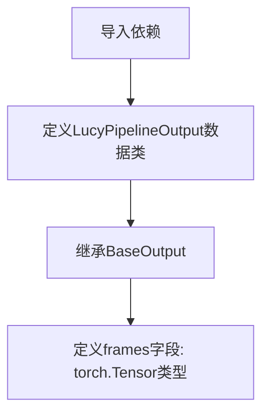

# `diffusers\src\diffusers\pipelines\lucy\pipeline_output.py` 详细设计文档

定义Lucy管道的输出类，用于封装生成的视频帧数据，支持torch.Tensor、np.ndarray或PIL.Image列表等多种格式

## 整体流程



## 类结构

```
BaseOutput (diffusers.utils基类)
└── LucyPipelineOutput (数据类)
```

## 全局变量及字段


### `dataclass`
    
Python内置的dataclass装饰器,用于创建数据类

类型：`decorator`
    


### `torch`
    
PyTorch深度学习库,提供张量运算和神经网络功能

类型：`module`
    


### `BaseOutput`
    
diffusers库的基础输出类,作为 pipelines 输出的基类

类型：`class`
    


### `LucyPipelineOutput.frames`
    
视频输出帧序列,可为张量、NumPy数组或PIL图像列表

类型：`torch.Tensor`
    
    

## 全局函数及方法


## 关键组件


### 关键组件

### 张量索引与惰性加载

代码使用 `torch.Tensor` 作为 `frames` 字段的类型，支持标准的 Python 索引操作和切片操作，可以高效地按需访问视频帧数据，无需一次性加载全部数据到内存。

### 反量化支持

`LucyPipelineOutput` 类设计为支持反量化操作，通过 `torch.Tensor` 类型可以方便地与量化后的模型输出进行交互，完成从量化表示到标准张量格式的转换。

### 量化策略

作为管道输出类，`LucyPipelineOutput` 可以支持多种量化策略的输出格式，包括但不限于动态量化、静态量化等，兼容不同的推理优化场景。

### 数据类型兼容性

代码在文档字符串中声明 `frames` 可以接受 `torch.Tensor`、`np.ndarray` 或 `list[list[PIL.Image.Image]]` 三种类型，体现了多格式支持的量化数据处理能力。

### 继承结构

继承自 `diffusers.utils.BaseOutput`，遵循 diffusers 库的统一输出接口规范，便于与现有管道系统集成。


## 问题及建议


### 已知问题

-   **类型注解与文档不一致**：docstring 中说明 `frames` 可以是 `torch.Tensor`、`np.ndarray` 或 `list[list[PIL.Image.Image]]` 三种类型，但代码中的类型注解仅声明为 `torch.Tensor`，导致类型安全性和文档一致性存在问题
-   **缺少字段默认值**：作为 dataclass，`frames` 字段没有默认值，在某些场景下实例化时可能不够灵活
-   **文档不完整**：docstring 仅包含 Args 说明，缺少 Returns 部分的描述，且没有使用示例

### 优化建议

-   **修正类型注解**：使用 `Union[torch.Tensor, np.ndarray, list[list[PIL.Image.Image]]]` 或 `Any` 类型来匹配实际的多种类型，或添加泛型支持
-   **添加字段默认值**：考虑为 `frames` 添加默认值 `None` 或使用 `field(default_factory=...)` 来增强实例化的灵活性
-   **完善文档**：补充 Returns 部分的说明，并添加使用示例以提高可维护性


## 其它


### 设计目标与约束

本类作为LucyPipeline的输出数据容器，核心目标是为视频生成管道提供标准化的输出格式封装。设计约束包括：1) 必须继承自diffusers.utils.BaseOutput以保持与diffusers库的兼容性；2) frames字段必须是torch.Tensor类型以支持GPU加速计算；3) 遵循dataclass规范实现自动生成的__init__、__repr__等方法。

### 错误处理与异常设计

由于本类为纯数据容器，不涉及复杂逻辑，错误处理主要依赖类型检查和dataclass装饰器的内置验证。潜在异常场景包括：1) 传入非torch.Tensor类型的frames参数时，dataclass会自动进行类型检查并抛出TypeError；2) 当BaseOutput基类版本不兼容时可能引发ImportError或AttributeError；3) 建议在调用处对frames的shape和dtype进行预验证，确保符合视频数据格式要求（通常为(batch_size, num_frames, channels, height, width)）。

### 外部依赖与接口契约

本类直接依赖两个外部组件：1) dataclass装饰器来自Python标准库（Python 3.7+），无需额外安装；2) BaseOutput来自diffusers.utils模块，需要安装diffusers库（建议版本≥0.21.0）。接口契约方面：frames字段为必需参数，类型强制为torch.Tensor，不支持None值；输出对象可序列化且与diffusers的PipelineOutput体系兼容。

### 使用示例与典型场景

典型用法示例：
```python
from diffusers import DiffusionPipeline
import torch

# 在管道内部生成帧后创建输出对象
frames = torch.randn(1, 16, 3, 512, 512)  # batch_size=1, 16帧, RGB, 512x512
output = LucyPipelineOutput(frames=frames)
# output.frames可直接用于后续处理或保存
```

典型场景包括：视频生成管道的最终输出封装、批量推理结果的多帧数据传递、以及与其他diffusers组件的集成。

### 扩展性考虑

当前设计支持以下扩展方向：1) 可通过继承本类添加额外元数据字段（如prompt、seed等生成参数）；2) 可重写__post_init__方法添加自定义验证逻辑；3) 可实现to_numpy()或to_pil()等方法提供格式转换能力；4) 建议保持与BaseOutput的兼容性以确保与未来diffusers版本的互操作性。

### 版本兼容性说明

本类设计时考虑了以下版本兼容性：1) Python版本要求≥3.7（dataclass装饰器）；2) PyTorch版本建议≥1.9.0以支持完整的tensor操作；3) diffusers库版本建议≥0.21.0，早期版本可能缺少BaseOutput基类或接口略有差异；4) 当BaseOutput接口发生重大变更时，需同步更新本类的继承结构。

### 性能特性分析

作为轻量级数据容器，本类本身不涉及计算密集型操作，性能开销主要来自：1) dataclass自动生成的__init__方法调用；2) torch.Tensor的内存占用，取决于frames的shape和dtype；3) 建议在内存敏感场景下使用torch.float16而非float32以减少显存占用。

### 测试策略建议

建议覆盖以下测试用例：1) 实例化测试 - 传入有效torch.Tensor创建对象；2) 类型验证测试 - 传入非Tensor类型应抛出TypeError；3) 字段访问测试 - 确认frames属性可正确读写；4) 序列化测试 - 验证pickle.dumps/dumps的可行性；5) 基类兼容性测试 - 确认继承自BaseOutput且具有必要方法。


    