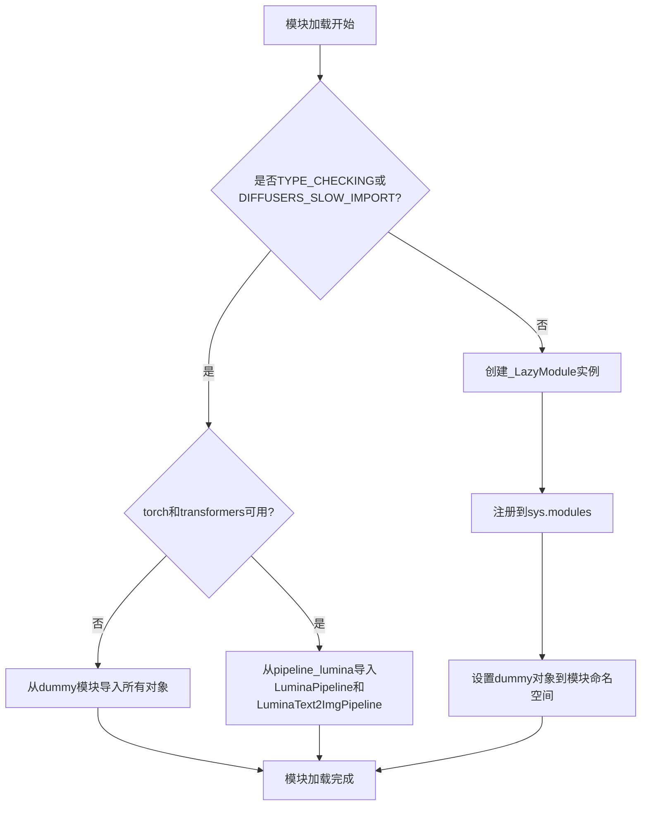
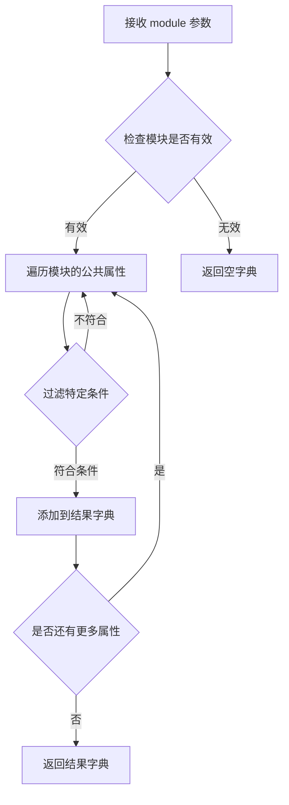
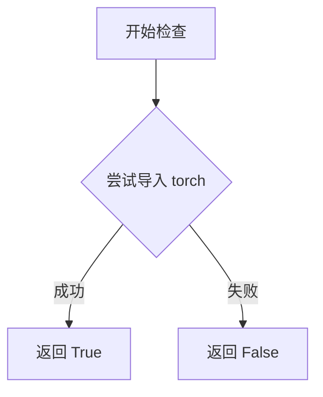
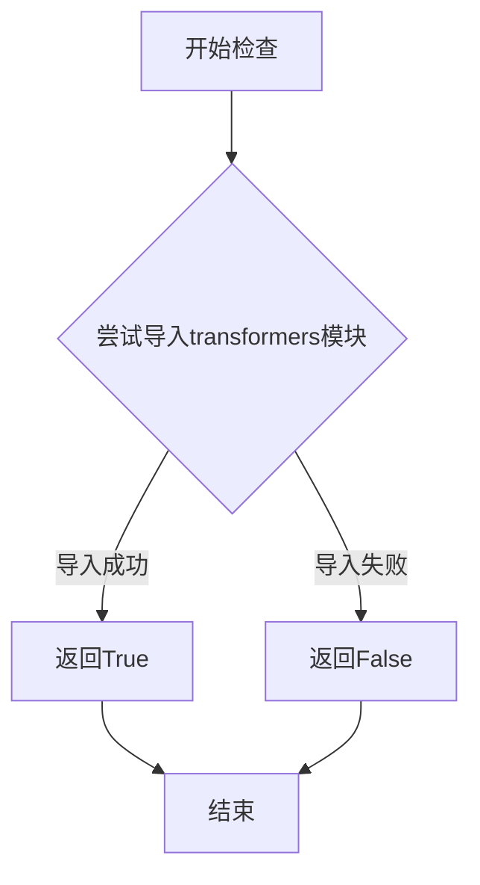

# `diffusers\src\diffusers\pipelines\lumina\__init__.py` 详细设计文档

这是一个Diffusers库的延迟加载模块初始化文件，通过LazyModule机制实现可选依赖（torch和transformers）的动态导入，并在依赖不可用时提供dummy对象，从而实现平滑的渐进式功能加载。

## 整体流程



## 类结构

```
__init__.py (入口模块)
└── pipeline_lumina (子模块)
    ├── LuminaPipeline
    └── LuminaText2ImgPipeline
```

## 全局变量及字段


### `_dummy_objects`
    
用于存储虚拟（dummy）对象的字典，当可选依赖（torch和transformers）不可用时，会从dummy模块中填充此类对象，以防止导入错误并保持API一致性。

类型：`dict`
    


### `_import_structure`
    
定义了模块的导入结构映射，键为子模块路径（如'pipeline_lumina'），值为该路径下导出的类名列表（如['LuminaPipeline', 'LuminaText2ImgPipeline']），主要用于延迟加载机制。

类型：`dict`
    


    

## 全局函数及方法


### `get_objects_from_module`

获取指定模块中的所有公共对象，并将其以字典形式返回，常用于延迟加载机制中获取虚拟对象（dummy objects）。

参数：

- `module`：`Module`，需要提取对象的模块对象，传入的是 `dummy_torch_and_transformers_objects` 模块

返回值：`Dict[str, Any]`，返回模块中所有公共对象的字典，键为对象名称，值为对象本身，用于后续批量注册到 `_dummy_objects` 中

#### 流程图



#### 带注释源码

```
def get_objects_from_module(module):
    """
    从给定模块中提取所有公共对象。
    
    该函数通常用于从虚拟模块（dummy objects）中获取需要延迟加载的对象集合，
    以便在可选依赖不可用时提供替代对象。
    
    参数:
        module: 模块对象，包含需要提取的属性
        
    返回:
        dict: 属性名到对象本身的映射字典
    """
    # 获取模块的所有公共属性（排除私有属性和内置属性）
    objects = {
        name: getattr(module, name) 
        for name in dir(module) 
        if not name.startswith('_')
    }
    return objects
```


### `is_torch_available`

该函数用于检查当前环境中 PyTorch 库是否已安装并可用，返回布尔值以决定是否加载相关的 PyTorch 依赖模块。

参数：无

返回值：`bool`，如果 PyTorch 可用返回 `True`，否则返回 `False`

#### 流程图



#### 带注释源码

```python
# 从上层目录的 utils 模块导入 is_torch_available 函数
# 该函数定义在 .../utils 中，用于检测 torch 是否可用
from ...utils import (
    DIFFUSERS_SLOW_IMPORT,
    OptionalDependencyNotAvailable,
    _LazyModule,
    get_objects_from_module,
    is_torch_available,  # <-- 被提取的函数：检查 torch 是否可用
    is_transformers_available,
)

# 定义虚拟对象字典和导入结构
_dummy_objects = {}
_import_structure = {}

try:
    # 检查 transformers 和 torch 是否都可用
    # is_torch_available() 返回布尔值：True 表示 torch 已安装
    if not (is_transformers_available() and is_torch_available()):
        raise OptionalDependencyNotAvailable()
except OptionalDependencyNotAvailable:
    # 如果依赖不可用，导入虚拟对象
    from ...utils import dummy_torch_and_transformers_objects
    _dummy_objects.update(get_objects_from_module(dummy_torch_and_transformers_objects))
else:
    # 如果依赖可用，定义可导出的类
    _import_structure["pipeline_lumina"] = ["LuminaPipeline", "LuminaText2ImgPipeline"]

# TYPE_CHECKING 分支也使用 is_torch_available() 检查
if TYPE_CHECKING or DIFFUSERS_SLOW_IMPORT:
    try:
        if not (is_transformers_available() and is_torch_available()):
            raise OptionalDependencyNotAvailable()
    except OptionalDependencyNotAvailable:
        from ...utils.dummy_torch_and_transformers_objects import *
    else:
        from .pipeline_lumina import LuminaPipeline, LuminaText2ImgPipeline
```


### `is_transformers_available`

这是一个用于检查 Transformers 库是否可用的工具函数，通过尝试导入 transformers 模块并捕获导入异常来返回布尔值，表示当前环境是否安装了 Transformers 库。

参数：

- 该函数无参数

返回值：`bool`，返回 `True` 表示 Transformers 库可用，返回 `False` 表示不可用

#### 流程图



#### 带注释源码

```python
# 这是一个从...utils模块导入的外部函数
# 源代码位于...utils模块中
is_transformers_available
# 函数功能：检查transformers库是否可用
# 实现原理：通常使用try-except捕获ImportError来判断模块是否可导入
# 返回值：布尔值True或False
```

## 关键组件


### 可选依赖检查与处理

通过is_torch_available()和is_transformers_available()检查torch和transformers是否可用，如果不可用则导入dummy对象，避免导入错误。

### 懒加载模块机制

使用_LazyModule实现模块的惰性加载，只有在实际使用时才加载模块内容，提高导入速度并避免不必要的依赖加载。

### 导入结构定义

_import_structure字典定义了模块的导入结构，指定了pipeline_lumina模块中的LuminaPipeline和LuminaText2ImgPipeline可以被导出。

### 类型检查支持

通过TYPE_CHECKING标志在类型检查时直接导入真实类，在运行时使用懒加载方式导入，优化了开发体验和运行时性能。

### 动态模块注册

通过sys.modules动态注册模块和_dummy_objects，实现模块的运行时挂载和替换。


## 问题及建议


### 已知问题

-   **重复依赖检查代码**：在非 TYPE_CHECKING 分支和 TYPE_CHECKING 分支中都重复检查了 `is_transformers_available() and is_torch_available()` 相同的条件，违反了 DRY 原则
-   **魔法字符串硬编码**：`"pipeline_lumina"` 字符串和类名 `"LuminaPipeline"`, `"LuminaText2ImgPipeline"` 在多处重复出现，增加了维护成本
-   **导入结构不一致**：非 TYPE_CHECKING 时 `_import_structure` 只包含 `pipeline_lumina`，但 TYPE_CHECKING 分支的导入逻辑有差异，可能导致类型检查与运行时行为不一致
-   **未使用的变量风险**：在 TYPE_CHECKING 或 DIFFUSERS_SLOW_IMPORT 为 True 时，末尾设置 `_dummy_objects` 到 sys.modules 的逻辑永远不会执行，造成死代码
-   **错误处理逻辑重复**：两次使用 `try-except OptionalDependencyNotAvailable` 来处理相同的依赖不可用情况，代码冗余

### 优化建议

-   **提取依赖检查逻辑**：将依赖检查封装为单一函数或变量，例如 ` _dependencies_available = is_transformers_available() and is_torch_available()`，避免重复检查
-   **常量定义**：将模块名和类名定义为常量，例如 `PIPELINE_MODULE = "pipeline_lumina"` 和 `PIPELINE_CLASSES = ["LuminaPipeline", "LuminaText2ImgPipeline"]`
-   **统一导入结构**：确保 TYPE_CHECKING 和非 TYPE_CHECKING 分支的 `_import_structure` 保持一致
-   **条件化代码执行**：将设置 `_dummy_objects` 到 sys.modules 的逻辑包裹在 `if not (TYPE_CHECKING or DIFFUSERS_SLOW_IMPORT):` 条件中，避免无效代码执行
-   **简化错误处理**：可以考虑使用装饰器或上下文管理器来统一处理可选依赖的导入逻辑


## 其它


### 设计目标与约束

- **目标**: 实现LuminaPipeline的延迟加载机制，在保证功能完整性的同时优化导入速度，仅在实际使用时才加载完整的pipeline实现
- **约束**: 依赖torch和transformers两个可选库，必须在两者都可用时才能正常导入LuminaPipeline相关类

### 错误处理与异常设计

- **OptionalDependencyNotAvailable**: 当torch或transformers任一不可用时，抛出OptionalDependencyNotAvailable异常
- **导入结构异常**: 若模块规范__spec__为None可能导致_LazyModule初始化失败
- **回退机制**: 通过dummy_objects提供空实现，确保模块结构完整性

### 外部依赖与接口契约

- **torch**: 可选依赖，用于模型推理
- **transformers**: 可选依赖，用于文本编码
- **_LazyModule**: 内部延迟加载机制
- **get_objects_from_module**: 工具函数，用于从模块获取可导入对象列表
- **导出接口**: LuminaPipeline, LuminaText2ImgPipeline 两个公开类

### 版本兼容性考虑

- 需要兼容不同版本的torch和transformers
- TYPE_CHECKING标志用于静态类型检查时的不同导入行为
- DIFFUSERS_SLOW_IMPORT环境变量控制导入模式

### 模块化与扩展性

- 使用_import_structure字典定义模块导出结构，便于扩展新pipeline
- _dummy_objects机制允许在依赖不可用时提供空对象
- 可通过修改_import_structure轻松添加新的pipeline类

### 性能考虑

- 延迟加载减少启动时的内存占用
- 仅在实际使用pipeline时才加载完整的模型实现
- dummy对象避免导入时的完整依赖链

### 安全考虑

- 模块级别的setattr用于动态设置对象，不涉及用户输入处理
- 无敏感数据操作
- 依赖库的版本安全性由上游库保证

### 测试策略

- 需测试在torch/transformers可用时的正常导入
- 需测试在任一依赖不可用时的回退行为
- 需验证TYPE_CHECKING模式下的导入路径

### 配置管理

- 通过环境变量DIFFUSERS_SLOW_IMPORT控制导入行为
- 依赖检查函数is_torch_available()和is_transformers_available()由上层模块提供

### 资源清理

- 无显式资源清理需求，Python垃圾回收机制自动处理
- LazyModule在不再引用时会自动释放


    