# `diffusers\src\diffusers\pipelines\lumina\pipeline_lumina.py` 详细设计文档

LuminaPipeline是一个用于文本到图像生成的高质量扩散模型管道,基于Lumina-T2I架构。该管道集成了Gemma文本编码器、VAE变分自编码器、Transformer去噪模型和FlowMatch调度器,支持分类器自由引导(CFG)、自定义时间步、负向提示词等高级功能,可生成高分辨率图像。

## 整体流程

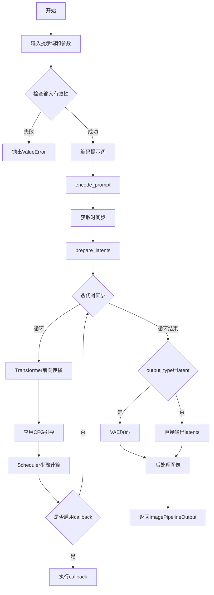

## 类结构

```
DiffusionPipeline (基类)
└── LuminaPipeline
    └── LuminaText2ImgPipeline (已弃用别名)
```

## 全局变量及字段


### `XLA_AVAILABLE`
    
Flag indicating whether PyTorch XLA is available for accelerated computation

类型：`bool`
    


### `logger`
    
Module-level logger for debugging and informational output

类型：`logging.Logger`
    


### `EXAMPLE_DOC_STRING`
    
Example usage documentation string demonstrating the pipeline's basic usage

类型：`str`
    


### `bad_punct_regex`
    
Compiled regular expression pattern for filtering unwanted punctuation characters

类型：`re.Pattern`
    


### `LuminaPipeline.vae`
    
Variational Auto-Encoder for encoding and decoding image latents

类型：`AutoencoderKL`
    


### `LuminaPipeline.text_encoder`
    
Frozen Gemma text encoder for converting prompts to embeddings

类型：`GemmaPreTrainedModel`
    


### `LuminaPipeline.tokenizer`
    
Tokenizer for converting text prompts to token IDs

类型：`GemmaTokenizer | GemmaTokenizerFast`
    


### `LuminaPipeline.transformer`
    
Main DiT transformer model for denoising latents conditioned on text

类型：`LuminaNextDiT2DModel`
    


### `LuminaPipeline.scheduler`
    
Flow matching Euler discrete scheduler for diffusion sampling

类型：`FlowMatchEulerDiscreteScheduler`
    


### `LuminaPipeline.vae_scale_factor`
    
Scaling factor for VAE latent space (typically 8)

类型：`int`
    


### `LuminaPipeline.image_processor`
    
Processor for VAE image encoding and post-processing

类型：`VaeImageProcessor`
    


### `LuminaPipeline.max_sequence_length`
    
Maximum sequence length for text tokenization (default 256)

类型：`int`
    


### `LuminaPipeline.default_sample_size`
    
Default sample size for generated images in latent space

类型：`int`
    


### `LuminaPipeline.default_image_size`
    
Default output image size in pixels

类型：`int`
    


### `LuminaPipeline.bad_punct_regex`
    
Regex pattern for cleaning bad punctuation from captions

类型：`re.Pattern`
    


### `LuminaPipeline._optional_components`
    
List of optional pipeline components that can be omitted

类型：`list`
    


### `LuminaPipeline.model_cpu_offload_seq`
    
Sequence string for model CPU offloading order

类型：`str`
    


### `LuminaPipeline._callback_tensor_inputs`
    
List of tensor input names allowed in callback functions

类型：`list`
    


### `LuminaPipeline._guidance_scale`
    
Classifier-free guidance scale for text conditioning strength

类型：`float`
    


### `LuminaPipeline._num_timesteps`
    
Number of inference timesteps for the denoising process

类型：`int`
    
    

## 全局函数及方法


### `retrieve_timesteps`

该函数是一个全局辅助函数，用于配置扩散模型的时间步调度器。它根据传入的参数（推理步数、自定义时间步或 SIGMAS）调用调度器的 `set_timesteps` 方法，并返回生成的时间步序列和实际的推理步数。函数内部包含对调度器接口的动态检查，以确保兼容性。

参数：

-  `scheduler`：`SchedulerMixin`，调度器对象（例如 DDIM, Euler 等），用于生成时间步。
-  `num_inference_steps`：`int | None`，期望的推理步数。如果传入，则必须确保 `timesteps` 和 `sigmas` 为 `None`。
-  `device`：`str | torch.device | None`，指定时间步张量存放的设备。如果为 `None`，则不进行设备迁移。
-  `timesteps`：`list[int] | None`，自定义的时间步列表。如果传入此参数，将覆盖 `num_inference_steps` 和 `sigmas`。
-  `sigmas`：`list[float] | None`，自定义的 sigma 值列表。通常用于 SDE 调度器。如果传入此参数，将覆盖 `num_inference_steps` 和 `timesteps`。
-  `**kwargs`：关键字参数，将直接传递给 `scheduler.set_timesteps` 方法。

返回值：`tuple[torch.Tensor, int]`，返回一个元组。第一个元素是 `torch.Tensor` 类型的时间步调度序列；第二个元素是 `int` 类型的实际推理步数（可能与请求的步数不同，尤其是在使用自定义时间步时）。

#### 流程图

```mermaid
flowchart TD
    A([开始: retrieve_timesteps]) --> B{校验输入: <br>timesteps 和 sigmas 是否冲突?}
    B -- 是 --> C[抛出 ValueError]
    B -- 否 --> D{是否传入自定义 timesteps?}
    D -- 是 --> E[检查 scheduler.set_timesteps 是否支持 timesteps 参数]
    E --> F{支持?}
    F -- 否 --> G[抛出 ValueError: 当前调度器不支持自定义 timesteps]
    F -- 是 --> H[调用 scheduler.set_timesteps(timesteps=..., device=...)]
    H --> I[获取 scheduler.timesteps]
    I --> J[计算 num_inference_steps = len(timesteps)]
    
    D -- 否 --> K{是否传入自定义 sigmas?}
    K -- 是 --> L[检查 scheduler.set_timesteps 是否支持 sigmas 参数]
    L --> M{支持?}
    M -- 否 --> N[抛出 ValueError: 当前调度器不支持自定义 sigmas]
    M -- 是 --> O[调用 scheduler.set_timesteps(sigmas=..., device=...)]
    O --> P[获取 scheduler.timesteps]
    P --> J
    
    K -- 否 --> Q[调用 scheduler.set_timesteps(num_inference_steps=..., device=...)]
    Q --> R[获取 scheduler.timesteps]
    
    J --> S([返回: timesteps, num_inference_steps])
    R --> S
```

#### 带注释源码

```python
def retrieve_timesteps(
    scheduler,
    num_inference_steps: int | None = None,
    device: str | torch.device | None = None,
    timesteps: list[int] | None = None,
    sigmas: list[float] | None = None,
    **kwargs,
):
    r"""
    调用调度器的 `set_timesteps` 方法并在调用后从中检索时间步。处理自定义时间步。
    任何 kwargs 都将提供给 `scheduler.set_timesteps`。

    Args:
        scheduler (`SchedulerMixin`): 
            用于获取时间步的调度器。
        num_inference_steps (`int`): 
            使用预训练模型生成样本时使用的扩散步数。如果使用此参数，`timesteps` 必须为 `None`。
        device (`str` or `torch.device`, *optional*): 
            时间步应移动到的设备。如果为 `None`，则不移动时间步。
        timesteps (`list[int]`, *optional*): 
            用于覆盖调度器时间步间隔策略的自定义时间步。如果传入 `timesteps`，则 `num_inference_steps` 和 `sigmas` 必须为 `None`。
        sigmas (`list[float]`, *optional*): 
            用于覆盖调度器时间步间隔策略的自定义 sigmas。如果传入 `sigmas`，则 `num_inference_steps` 和 `timesteps` 必须为 `None`。

    Returns:
        `tuple[torch.Tensor, int]`: 元组，其中第一个元素是调度器的时间步调度，第二个元素是推理步数。
    """
    # 1. 校验输入：timesteps 和 sigmas 不能同时指定
    if timesteps is not None and sigmas is not None:
        raise ValueError("Only one of `timesteps` or `sigmas` can be passed. Please choose one to set custom values")
    
    # 2. 处理自定义 timesteps 的情况
    if timesteps is not None:
        # 动态检查调度器是否支持 timesteps 参数
        accepts_timesteps = "timesteps" in set(inspect.signature(scheduler.set_timesteps).parameters.keys())
        if not accepts_timesteps:
            raise ValueError(
                f"The current scheduler class {scheduler.__class__}'s `set_timesteps` does not support custom"
                f" timestep schedules. Please check whether you are using the correct scheduler."
            )
        # 调用调度器设置时间步
        scheduler.set_timesteps(timesteps=timesteps, device=device, **kwargs)
        # 从调度器获取结果
        timesteps = scheduler.timesteps
        num_inference_steps = len(timesteps)
        
    # 3. 处理自定义 sigmas 的情况
    elif sigmas is not None:
        # 动态检查调度器是否支持 sigmas 参数
        accept_sigmas = "sigmas" in set(inspect.signature(scheduler.set_timesteps).parameters.keys())
        if not accept_sigmas:
            raise ValueError(
                f"The current scheduler class {scheduler.__class__}'s `set_timesteps` does not support custom"
                f" sigmas schedules. Please check whether you are using the correct scheduler."
            )
        # 调用调度器设置 sigmas
        scheduler.set_timesteps(sigmas=sigmas, device=device, **kwargs)
        # 从调度器获取结果（注意：即使输入是 sigmas，返回的通常是 timesteps）
        timesteps = scheduler.timesteps
        num_inference_steps = len(timesteps)
        
    # 4. 处理默认情况：使用 num_inference_steps
    else:
        scheduler.set_timesteps(num_inference_steps, device=device, **kwargs)
        timesteps = scheduler.timesteps
        
    # 5. 返回时间步张量和实际的推理步数
    return timesteps, num_inference_steps
```


### `LuminaPipeline.__init__`

LuminaPipeline 类的初始化方法，负责将模型组件（Transformer、VAE、文本编码器、分词器、调度器）注册到管道中，并初始化图像处理和采样相关的配置参数。

参数：

- `transformer`：`LuminaNextDiT2DModel`，用于去噪图像潜在表示的文本条件 Transformer 模型
- `scheduler`：`FlowMatchEulerDiscreteScheduler`，与 Transformer 配合使用以去噪编码图像潜在表示的调度器
- `vae`：`AutoencoderKL`，变分自编码器（VAE）模型，用于图像与潜在表示之间的编码和解码
- `text_encoder`：`GemmaPreTrainedModel`，冻结的 Gemma 文本编码器
- `tokenizer`：`GemmaTokenizer | GemmaTokenizerFast`，Gemma 分词器（标准版或快速版）

返回值：`None`，无返回值（`__init__` 方法）

#### 流程图

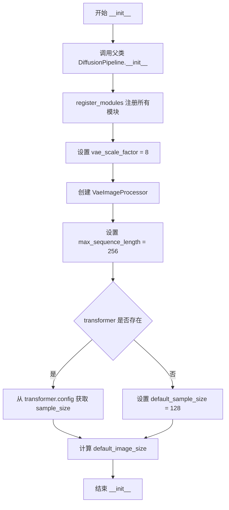

#### 带注释源码

```python
def __init__(
    self,
    transformer: LuminaNextDiT2DModel,                              # 文本条件的 DiT Transformer 模型
    scheduler: FlowMatchEulerDiscreteScheduler,                    # 流匹配欧拉离散调度器
    vae: AutoencoderKL,                                             # VAE 变分自编码器
    text_encoder: GemmaPreTrainedModel,                            # Gemma 文本编码器
    tokenizer: GemmaTokenizer | GemmaTokenizerFast,                # Gemma 分词器
):
    # 调用父类 DiffusionPipeline 的初始化方法
    super().__init__()

    # 将所有模型组件注册到管道中，便于后续管理和调用
    self.register_modules(
        vae=vae,
        text_encoder=text_encoder,
        tokenizer=tokenizer,
        transformer=transformer,
        scheduler=scheduler,
    )
    
    # VAE 的缩放因子，用于潜在空间与像素空间之间的转换
    self.vae_scale_factor = 8
    
    # 创建图像后处理器，用于 VAE 输出到最终图像的转换
    self.image_processor = VaeImageProcessor(vae_scale_factor=self.vae_scale_factor)
    
    # 文本序列的最大长度（令牌数）
    self.max_sequence_length = 256
    
    # 获取默认采样大小，若 transformer 存在则从配置读取，否则使用默认值 128
    self.default_sample_size = (
        self.transformer.config.sample_size
        if hasattr(self, "transformer") and self.transformer is not None
        else 128
    )
    
    # 计算默认图像尺寸 = 采样大小 × VAE 缩放因子
    self.default_image_size = self.default_sample_size * self.vae_scale_factor
```


### `LuminaPipeline._get_gemma_prompt_embeds`

该方法负责将文本提示（prompt）转换为 Gemma 文本编码器的嵌入向量（embeddings），包括文本预处理、分词、编码、类型转换以及针对多图生成的嵌入复制，最后返回提示嵌入和对应的注意力掩码。

参数：

- `prompt`：`str | list[str]`，输入的文本提示，可以是单个字符串或字符串列表
- `num_images_per_prompt`：`int = 1`，每个提示要生成的图像数量，用于复制嵌入
- `device`：`torch.device | None = None`，指定计算设备，默认为执行设备
- `clean_caption`：`bool | None = False`，是否在编码前清理标题文本
- `max_length`：`int | None = None`，最大序列长度限制

返回值：`tuple[torch.Tensor, torch.Tensor]`，第一个是提示嵌入（shape: `[batch_size * num_images_per_prompt, seq_len, hidden_dim]`），第二个是注意力掩码（shape: `[batch_size * num_images_per_prompt, seq_len]`）

#### 流程图

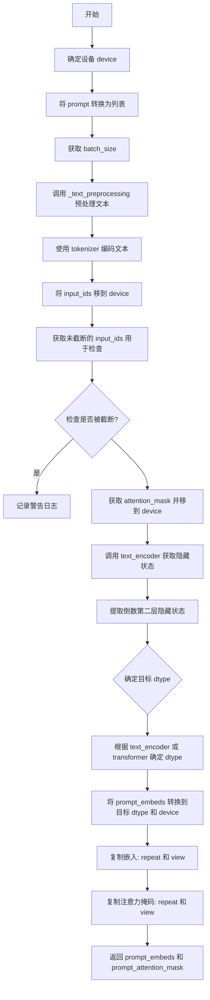

#### 带注释源码

```python
def _get_gemma_prompt_embeds(
    self,
    prompt: str | list[str],            # 输入文本提示
    num_images_per_prompt: int = 1,     # 每个提示生成的图像数量
    device: torch.device | None = None,  # 计算设备
    clean_caption: bool | None = False,  # 是否清理标题
    max_length: int | None = None,       # 最大序列长度
):
    # 确定设备：如果未指定，则使用当前执行设备
    device = device or self._execution_device
    
    # 统一转换为列表格式：单个字符串转为单元素列表
    prompt = [prompt] if isinstance(prompt, str) else prompt
    
    # 计算批处理大小
    batch_size = len(prompt)

    # 文本预处理：清理和规范化文本（可选）
    prompt = self._text_preprocessing(prompt, clean_caption=clean_caption)
    
    # 使用 tokenizer 将文本转换为 token IDs
    # 参数设置：填充到8的倍数、截断、返回 PyTorch 张量
    text_inputs = self.tokenizer(
        prompt,
        pad_to_multiple_of=8,
        max_length=self.max_sequence_length,  # 默认为256
        truncation=True,
        padding=True,
        return_tensors="pt",
    )
    
    # 将 input_ids 移到指定设备
    text_input_ids = text_inputs.input_ids.to(device)
    
    # 获取未截断的 token IDs 用于检测截断情况
    untruncated_ids = self.tokenizer(prompt, padding="longest", return_tensors="pt").input_ids.to(device)

    # 检查是否发生截断：比较长度并检查内容是否不同
    if untruncated_ids.shape[-1] >= text_input_ids.shape[-1] and not torch.equal(text_input_ids, untruncated_ids):
        # 解码被截断的部分用于警告信息
        removed_text = self.tokenizer.batch_decode(untruncated_ids[:, self.max_sequence_length - 1 : -1])
        logger.warning(
            "The following part of your input was truncated because Gemma can only handle sequences up to"
            f" {self.max_sequence_length} tokens: {removed_text}"
        )

    # 获取注意力掩码并移到设备
    prompt_attention_mask = text_inputs.attention_mask.to(device)
    
    # 调用文本编码器获取隐藏状态
    prompt_embeds = self.text_encoder(
        text_input_ids, 
        attention_mask=prompt_attention_mask, 
        output_hidden_states=True  # 输出所有隐藏状态
    )
    
    # 提取倒数第二层的隐藏状态（通常用于更好的表示）
    prompt_embeds = prompt_embeds.hidden_states[-2]

    # 确定数据类型：优先使用 text_encoder 的 dtype，其次使用 transformer 的 dtype
    if self.text_encoder is not None:
        dtype = self.text_encoder.dtype
    elif self.transformer is not None:
        dtype = self.transformer.dtype
    else:
        dtype = None

    # 将提示嵌入转换到目标设备和数据类型
    prompt_embeds = prompt_embeds.to(dtype=dtype, device=device)

    # 获取序列长度
    _, seq_len, _ = prompt_embeds.shape
    
    # 复制文本嵌入以匹配每个提示生成的图像数量
    # 使用 MPS 友好的方法：先在序列维度重复，再 reshape
    prompt_embeds = prompt_embeds.repeat(1, num_images_per_prompt, 1)  # [1, batch*num, seq, hidden]
    prompt_embeds = prompt_embeds.view(batch_size * num_images_per_prompt, seq_len, -1)
    
    # 同样复制注意力掩码
    prompt_attention_mask = prompt_attention_mask.repeat(num_images_per_prompt, 1)
    prompt_attention_mask = prompt_attention_mask.view(batch_size * num_images_per_prompt, -1)

    # 返回处理后的嵌入和注意力掩码
    return prompt_embeds, prompt_attention_mask
```


### `LuminaPipeline.encode_prompt`

该方法负责将文本提示（prompt）和负面提示（negative_prompt）编码为文本编码器隐藏状态（text encoder hidden states），生成用于后续图像生成过程的嵌入向量（embeddings）和注意力掩码（attention masks）。支持分类器自由引导（Classifier-Free Guidance），并处理批量生成和多图生成的嵌入复制。

参数：

- `prompt`：`str | list[str]`，要编码的文本提示，支持单字符串或字符串列表
- `do_classifier_free_guidance`：`bool`，是否启用分类器自由引导，默认为 True
- `negative_prompt`：`str | list[str]`，负面提示词，用于引导图像不生成的内容，默认为 None
- `num_images_per_prompt`：`int`，每个提示词生成的图像数量，默认为 1
- `device`：`torch.device | None`，指定张量放置的设备，默认为执行设备
- `prompt_embeds`：`torch.Tensor | None`，预生成的提示词嵌入，可用于微调文本输入
- `negative_prompt_embeds`：`torch.Tensor | None`，预生成的负面提示词嵌入，对于 Lumina-T2I 应为空字符串的嵌入
- `prompt_attention_mask`：`torch.Tensor | None`，提示词的注意力掩码
- `negative_prompt_attention_mask`：`torch.Tensor | None`，负面提示词的注意力掩码
- `clean_caption`：`bool`，是否在编码前清理预处理提示词，默认为 False
- `**kwargs`：其他可选参数，用于未来扩展

返回值：`tuple[torch.Tensor, torch.Tensor, torch.Tensor, torch.Tensor]`，返回四个元素的元组——提示词嵌入、提示词注意力掩码、负面提示词嵌入、负面提示词注意力掩码。这些返回值将直接用于后续的图像生成去噪循环。

#### 流程图

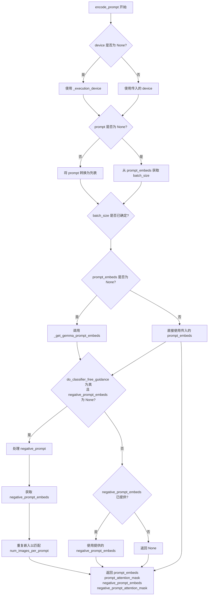

#### 带注释源码

```python
def encode_prompt(
    self,
    prompt: str | list[str],
    do_classifier_free_guidance: bool = True,
    negative_prompt: str | list[str] = None,
    num_images_per_prompt: int = 1,
    device: torch.device | None = None,
    prompt_embeds: torch.Tensor | None = None,
    negative_prompt_embeds: torch.Tensor | None = None,
    prompt_attention_mask: torch.Tensor | None = None,
    negative_prompt_attention_mask: torch.Tensor | None = None,
    clean_caption: bool = False,
    **kwargs,
):
    r"""
    Encodes the prompt into text encoder hidden states.

    Args:
        prompt (`str` or `list[str]`, *optional*):
            prompt to be encoded
        negative_prompt (`str` or `list[str]`, *optional*):
            The prompt not to guide the image generation. If not defined, one has to pass `negative_prompt_embeds`
            instead. Ignored when not using guidance (i.e., ignored if `guidance_scale` is less than `1`). For
            Lumina-T2I, this should be "".
        do_classifier_free_guidance (`bool`, *optional*, defaults to `True`):
            whether to use classifier free guidance or not
        num_images_per_prompt (`int`, *optional*, defaults to 1):
            number of images that should be generated per prompt
        device: (`torch.device`, *optional*):
            torch device to place the resulting embeddings on
        prompt_embeds (`torch.Tensor`, *optional*):
            Pre-generated text embeddings. Can be used to easily tweak text inputs, *e.g.* prompt weighting. If not
            provided, text embeddings will be generated from `prompt` input argument.
        negative_prompt_embeds (`torch.Tensor`, *optional*):
            Pre-generated negative text embeddings. For Lumina-T2I, it's should be the embeddings of the "" string.
        clean_caption (`bool`, defaults to `False`):
            If `True`, the function will preprocess and clean the provided caption before encoding.
        max_sequence_length (`int`, defaults to 256): Maximum sequence length to use for the prompt.
    """
    # 确定执行设备，如果未指定则使用当前执行设备
    if device is None:
        device = self._execution_device

    # 将 prompt 统一转换为列表格式，便于批量处理
    prompt = [prompt] if isinstance(prompt, str) else prompt
    if prompt is not None:
        # 获取批量大小
        batch_size = len(prompt)
    else:
        # 如果 prompt 为 None，则从预计算的 prompt_embeds 获取批量大小
        batch_size = prompt_embeds.shape[0]

    # 如果未提供 prompt_embeds，则调用内部方法生成嵌入
    if prompt_embeds is None:
        prompt_embeds, prompt_attention_mask = self._get_gemma_prompt_embeds(
            prompt=prompt,
            num_images_per_prompt=num_images_per_prompt,
            device=device,
            clean_caption=clean_caption,
        )

    # 获取用于分类器自由引导的负面嵌入
    if do_classifier_free_guidance and negative_prompt_embeds is None:
        # 如果未提供负面提示，则使用空字符串
        negative_prompt = negative_prompt if negative_prompt is not None else ""

        # 标准化为列表类型
        negative_prompt = batch_size * [negative_prompt] if isinstance(negative_prompt, str) else negative_prompt

        # 类型检查：negative_prompt 与 prompt 类型必须一致
        if prompt is not None and type(prompt) is not type(negative_prompt):
            raise TypeError(
                f"`negative_prompt` should be the same type to `prompt`, but got {type(negative_prompt)} !="
                f" {type(prompt)}."
            )
        # 如果是字符串，转换为列表以便批量处理
        elif isinstance(negative_prompt, str):
            negative_prompt = [negative_prompt]
        # 批量大小一致性检查
        elif batch_size != len(negative_prompt):
            raise ValueError(
                f"`negative_prompt`: {negative_prompt} has batch size {len(negative_prompt)}, but `prompt`:"
                f" {prompt} has batch size {batch_size}. Please make sure that passed `negative_prompt` matches"
                " the batch size of `prompt`."
            )
        
        # 获取正面嵌入的长度，用于填充负面提示
        prompt_max_length = prompt_embeds.shape[1]
        # 使用 tokenizer 对负面提示进行编码，填充至与正面提示相同长度
        negative_text_inputs = self.tokenizer(
            negative_prompt,
            padding="max_length",
            max_length=prompt_max_length,
            truncation=True,
            return_tensors="pt",
        )
        negative_text_input_ids = negative_text_inputs.input_ids.to(device)
        negative_prompt_attention_mask = negative_text_inputs.attention_mask.to(device)
        
        # 通过文本编码器获取负面提示的嵌入表示
        negative_prompt_embeds = self.text_encoder(
            negative_text_input_ids,
            attention_mask=negative_prompt_attention_mask,
            output_hidden_states=True,
        )

        # 获取文本编码器的数据类型，用于嵌入转换
        negative_dtype = self.text_encoder.dtype
        # 提取倒数第二层的隐藏状态作为嵌入
        negative_prompt_embeds = negative_prompt_embeds.hidden_states[-2]
        _, seq_len, _ = negative_prompt_embeds.shape

        # 转换嵌入的数据类型和设备
        negative_prompt_embeds = negative_prompt_embeds.to(dtype=negative_dtype, device=device)
        
        # 为每个提示的每个生成复制嵌入，使用 MPS 友好的方法
        negative_prompt_embeds = negative_prompt_embeds.repeat(1, num_images_per_prompt, 1)
        negative_prompt_embeds = negative_prompt_embeds.view(batch_size * num_images_per_prompt, seq_len, -1)
        negative_prompt_attention_mask = negative_prompt_attention_mask.repeat(num_images_per_prompt, 1)
        negative_prompt_attention_mask = negative_prompt_attention_mask.view(
            batch_size * num_images_per_prompt, -1
        )

    # 返回四个元素：正面嵌入、正面掩码、负面嵌入、负面掩码
    return prompt_embeds, prompt_attention_mask, negative_prompt_embeds, negative_prompt_attention_mask
```


### `LuminaPipeline.prepare_extra_step_kwargs`

该方法用于准备调度器（scheduler）的额外参数。由于不同调度器的 `step` 方法签名不同，此方法通过检查调度器是否接受特定参数（如 `eta` 和 `generator`），动态构建需要传递给调度器的额外关键字参数字典。

参数：

-  `generator`：`torch.Generator | list[torch.Generator] | None`，用于确保生成过程确定性的随机数生成器
-  `eta`：`float`，DDIM 调度器专用的 η 参数，对应 DDIM 论文中的 η，取值范围 [0, 1]

返回值：`dict`，包含需要传递给调度器 `step` 方法的额外关键字参数（如 `eta` 和/或 `generator`）

#### 流程图

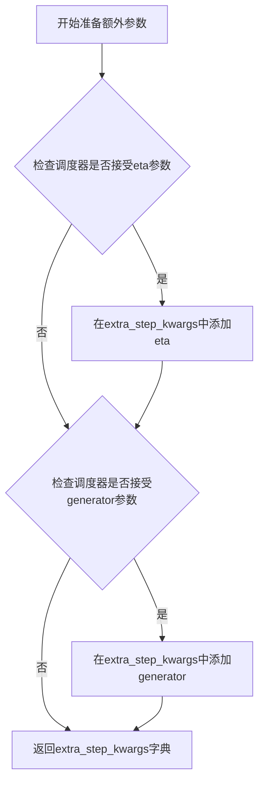

#### 带注释源码

```python
def prepare_extra_step_kwargs(self, generator, eta):
    # 由于并非所有调度器都具有相同的签名，因此需要准备额外的kwargs传递给调度器step方法
    # eta (η) 仅在DDIMScheduler中使用，其他调度器会忽略此参数
    # eta对应DDIM论文中的η参数：https://huggingface.co/papers/2010.02502
    # 取值范围应为[0, 1]

    # 检查调度器的step方法是否接受eta参数
    accepts_eta = "eta" in set(inspect.signature(self.scheduler.step).parameters.keys())
    # 初始化额外的关键字参数字典
    extra_step_kwargs = {}
    # 如果调度器接受eta，则将其添加到参数字典中
    if accepts_eta:
        extra_step_kwargs["eta"] = eta

    # 检查调度器是否接受generator参数
    accepts_generator = "generator" in set(inspect.signature(self.scheduler.step).parameters.keys())
    # 如果调度器接受generator，则将其添加到参数字典中
    if accepts_generator:
        extra_step_kwargs["generator"] = generator
    
    # 返回构建好的额外参数字典
    return extra_step_kwargs
```


### `LuminaPipeline.check_inputs`

该方法用于验证文本到图像生成管道的输入参数合法性，包括图像尺寸、提示词与嵌入向量的互斥性、以及注意力掩码的完整性等，确保用户在调用 pipeline 前提供的参数符合模型要求。

参数：

- `self`：`LuminaPipeline` 实例，pipeline 对象本身
- `prompt`：`str | list[str] | None`，用户提供的文本提示词，可以是单个字符串或字符串列表
- `height`：`int`，生成图像的高度（像素）
- `width`：`int`，生成图像的宽度（像素）
- `negative_prompt`：`str | list[str] | None`，负向提示词，用于引导模型避免生成相关内容
- `prompt_embeds`：`torch.Tensor | None`，预计算的文本嵌入向量，若提供则忽略 prompt 参数
- `negative_prompt_embeds`：`torch.Tensor | None`，预计算的负向文本嵌入向量
- `prompt_attention_mask`：`torch.Tensor | None`，文本嵌入的注意力掩码
- `negative_prompt_attention_mask`：`torch.Tensor | None`，负向文本嵌入的注意力掩码
- `callback_on_step_end_tensor_inputs`：`list[str] | None`，每步结束回调时需要传递的 tensor 输入名称列表

返回值：`None`，该方法不返回任何值，仅通过抛出 `ValueError` 来表示参数验证失败

#### 流程图

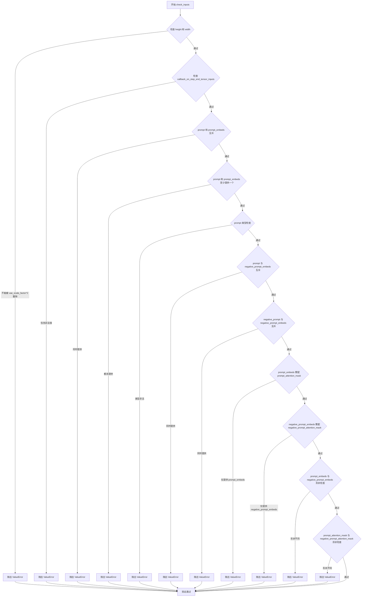

#### 带注释源码

```python
def check_inputs(
    self,
    prompt,
    height,
    width,
    negative_prompt,
    prompt_embeds=None,
    negative_prompt_embeds=None,
    prompt_attention_mask=None,
    negative_prompt_attention_mask=None,
    callback_on_step_end_tensor_inputs=None,
):
    # 检查图像高度和宽度是否可以被 VAE 缩放因子的两倍整除
    # 这是因为图像需要经过 VAE 编码器下采样，尺寸必须是合法的
    if height % (self.vae_scale_factor * 2) != 0 or width % (self.vae_scale_factor * 2) != 0:
        raise ValueError(
            f"`height` and `width` have to be divisible by {self.vae_scale_factor * 2} but are {height} and {width}."
        )

    # 检查回调函数指定的 tensor 输入是否在允许列表中
    # 防止用户传递非法参数导致后续处理出错
    if callback_on_step_end_tensor_inputs is not None and not all(
        k in self._callback_tensor_inputs for k in callback_on_step_end_tensor_inputs
    ):
        raise ValueError(
            f"`callback_on_step_end_tensor_inputs` has to be in {self._callback_tensor_inputs}, but found {[k for k in callback_on_step_end_tensor_inputs if k not in self._callback_tensor_inputs]}"
        )

    # prompt 和 prompt_embeds 是互斥的，用户只能选择其中一种方式提供文本信息
    if prompt is not None and prompt_embeds is not None:
        raise ValueError(
            f"Cannot forward both `prompt`: {prompt} and `prompt_embeds`: {prompt_embeds}. Please make sure to"
            " only forward one of the two."
        )
    # 至少需要提供 prompt 或 prompt_embeds 之一
    elif prompt is None and prompt_embeds is None:
        raise ValueError(
            "Provide either `prompt` or `prompt_embeds`. Cannot leave both `prompt` and `prompt_embeds` undefined."
        )
    # prompt 必须是字符串或字符串列表类型
    elif prompt is not None and (not isinstance(prompt, str) and not isinstance(prompt, list)):
        raise ValueError(f"`prompt` has to be of type `str` or `list` but is {type(prompt)}")

    # prompt 和 negative_prompt_embeds 互斥，避免语义混淆
    if prompt is not None and negative_prompt_embeds is not None:
        raise ValueError(
            f"Cannot forward both `prompt`: {prompt} and `negative_prompt_embeds`:"
            f" {negative_prompt_embeds}. Please make sure to only forward one of the two."
        )

    # negative_prompt 和 negative_prompt_embeds 互斥
    if negative_prompt is not None and negative_prompt_embeds is not None:
        raise ValueError(
            f"Cannot forward both `negative_prompt`: {negative_prompt} and `negative_prompt_embeds`:"
            f" {negative_prompt_embeds}. Please make sure to only forward one of the two."
        )

    # 如果提供了预计算的 prompt 嵌入向量，必须同时提供对应的注意力掩码
    if prompt_embeds is not None and prompt_attention_mask is None:
        raise ValueError("Must provide `prompt_attention_mask` when specifying `prompt_embeds`.")

    # 如果提供了预计算的负向 prompt 嵌入向量，必须同时提供对应的注意力掩码
    if negative_prompt_embeds is not None and negative_prompt_attention_mask is None:
        raise ValueError("Must provide `negative_prompt_attention_mask` when specifying `negative_prompt_embeds`.")

    # 如果同时提供了正负向嵌入向量，它们的形状必须一致
    if prompt_embeds is not None and negative_prompt_embeds is not None:
        if prompt_embeds.shape != negative_prompt_embeds.shape:
            raise ValueError(
                "`prompt_embeds` and `negative_prompt_embeds` must have the same shape when passed directly, but"
                f" got: `prompt_embeds` {prompt_embeds.shape} != `negative_prompt_embeds`"
                f" {negative_prompt_embeds.shape}."
            )
        # 对应的注意力掩码形状也必须一致
        if prompt_attention_mask.shape != negative_prompt_attention_mask.shape:
            raise ValueError(
                "`prompt_attention_mask` and `negative_prompt_attention_mask` must have the same shape when passed directly, but"
                f" got: `prompt_attention_mask` {prompt_attention_mask.shape} != `negative_prompt_attention_mask`"
                f" {negative_prompt_attention_mask.shape}."
            )
```


### `LuminaPipeline._text_preprocessing`

对输入的文本进行预处理，支持文本清理和标准化操作。

参数：

- `text`：`str | tuple | list`，需要预处理的原始文本，支持单个字符串、元组或列表
- `clean_caption`：`bool`，是否对标题进行深度清理（需要bs4和ftfy库支持），默认为`False`

返回值：`list[str]`，处理后的文本列表

#### 流程图

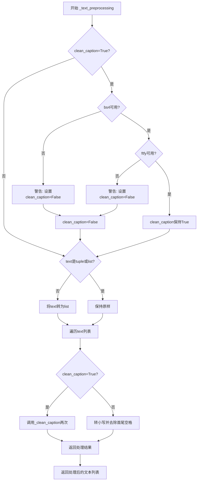

#### 带注释源码

```
def _text_preprocessing(self, text, clean_caption=False):
    """
    文本预处理方法，对输入文本进行清洗和标准化
    
    Args:
        text: 输入的文本，可以是单个字符串、元组或列表
        clean_caption: 是否进行深度清理（需要beautifulsoup4和ftfy库）
    
    Returns:
        处理后的文本列表
    """
    
    # 检查bs4库是否可用，如果不可用则禁用clean_caption
    if clean_caption and not is_bs4_available():
        logger.warning(BACKENDS_MAPPING["bs4"][-1].format("Setting `clean_caption=True`"))
        logger.warning("Setting `clean_caption` to False...")
        clean_caption = False

    # 检查ftfy库是否可用，如果不可用则禁用clean_caption
    if clean_caption and not is_ftfy_available():
        logger.warning(BACKENDS_MAPPING["ftfy"][-1].format("Setting `clean_caption=True`"))
        logger.warning("Setting `clean_caption` to False...")
        clean_caption = False

    # 确保text是列表格式，便于统一处理
    if not isinstance(text, (tuple, list)):
        text = [text]

    # 定义内部处理函数
    def process(text: str):
        if clean_caption:
            # 如果需要清理标题，调用_clean_caption方法两次
            text = self._clean_caption(text)
            text = self._clean_caption(text)
        else:
            # 否则仅进行基本的转小写和去空格处理
            text = text.lower().strip()
        return text

    # 对列表中的每个文本进行处理并返回结果列表
    return [process(t) for t in text]
```


### `LuminaPipeline._clean_caption`

该方法用于清洗和预处理文本提示词（caption），通过URL过滤、HTML标签移除、CJK字符过滤、特殊字符清理、HTML实体解码等一系列正则处理，生成适合模型输入的干净文本。

参数：

- `caption`：`str`，需要清洗的文本提示词

返回值：`str`，清洗处理后的文本

#### 流程图

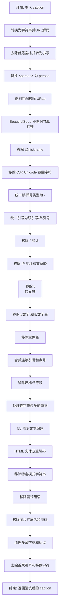

#### 带注释源码

```python
def _clean_caption(self, caption):
    """
    清洗并预处理文本提示词，用于生成更干净的模型输入。
    
    处理流程包括：
    - URL 解码与过滤
    - HTML 标签移除
    - CJK 字符过滤
    - 特殊字符清理
    - HTML 实体解码
    - 营销用语和噪声文本移除
    """
    # 1. 基础类型转换
    caption = str(caption)
    
    # 2. URL 解码：将 URL 编码的字符串还原（如 %20 转为空格）
    caption = ul.unquote_plus(caption)
    
    # 3. 去除首尾空格并转为小写
    caption = caption.strip().lower()
    
    # 4. 特殊标记替换：将 <person> 替换为 person
    caption = re.sub("<person>", "person", caption)
    
    # 5. URL 移除：使用正则匹配 http/https 协议 URLs
    caption = re.sub(
        r"\b((?:https?:(?:\/{1,3}|[a-zA-Z0-9%])|[a-zA-Z0-9.\-]+[.](?:com|co|ru|net|org|edu|gov|it)[\w/-]*\b\/?(?!@)))",  # noqa
        "",
        caption,
    )  # regex for urls
    
    # 6. URL 移除：匹配 www 开头的 URLs
    caption = re.sub(
        r"\b((?:www:(?:\/{1,3}|[a-zA-Z0-9%])|[a-zA-Z0-9.\-]+[.](?:com|co|ru|net|org|edu|gov|it)[\w/-]*\b\/?(?!@)))",  # noqa
        "",
        caption,
    )  # regex for urls
    
    # 7. HTML 解析：使用 BeautifulSoup 提取纯文本，移除 HTML 标签
    caption = BeautifulSoup(caption, features="html.parser").text
    
    # 8. 社交媒体用户名移除：匹配 @nickname 格式
    caption = re.sub(r"@[\w\d]+\b", "", caption)
    
    # 9-15. CJK 字符移除：过滤各类 CJK Unicode 范围的字符
    # 31C0—31EF CJK Strokes (CJK 笔画)
    caption = re.sub(r"[\u31c0-\u31ef]+", "", caption)
    # 31F0—31FF Katakana Phonetic Extensions (片假名音标扩展)
    caption = re.sub(r"[\u31f0-\u31ff]+", "", caption)
    # 3200—32FF Enclosed CJK Letters and Months (带圈 CJK 字母和月份)
    caption = re.sub(r"[\u3200-\u32ff]+", "", caption)
    # 3300—33FF CJK Compatibility (CJK 兼容字符)
    caption = re.sub(r"[\u3300-\u33ff]+", "", caption)
    # 3400—4DBF CJK Unified Ideographs Extension A (CJK 统一表意文字扩展 A)
    caption = re.sub(r"[\u3400-\u4dbf]+", "", caption)
    # 4DC0—4DFF Yijing Hexagram Symbols (易经六十四卦符号)
    caption = re.sub(r"[\u4dc0-\u4dff]+", "", caption)
    # 4E00—9FFF CJK Unified Ideographs (CJK 统一表意文字)
    caption = re.sub(r"[\u4e00-\u9fff]+", "", caption)
    
    # 16. 破折号统一：将各类破折号统一转换为 -
    caption = re.sub(
        r"[\u002D\u058A\u05BE\u1400\u1806\u2010-\u2015\u2E17\u2E1A\u2E3A\u2E3B\u2E40\u301C\u3030\u30A0\uFE31\uFE32\uFE58\uFE63\uFF0D]+",  # noqa
        "-",
        caption,
    )
    
    # 17. 引号统一：将各类引号统一为双引号或单引号
    caption = re.sub(r"[`´«»""¨]", '"', caption)
    caption = re.sub(r"['']", "'", caption)
    
    # 18. HTML 实体移除：移除 &quot; 和 &amp
    caption = re.sub(r"&quot;?", "", caption)
    caption = re.sub(r"&amp", "", caption)
    
    # 19. IP 地址移除：匹配 x.x.x.x 格式
    caption = re.sub(r"\d{1,3}\.\d{1,3}\.\d{1,3}\.\d{1,3}", " ", caption)
    
    # 20. 文章ID移除：匹配 数字:数字 结尾格式
    caption = re.sub(r"\d:\d\d\s+$", "", caption)
    
    # 21. 转义符清理：将 \n 转为空格
    caption = re.sub(r"\\n", " ", caption)
    
    # 22-24. 数字标签移除：#123, #12345 等
    caption = re.sub(r"#\d{1,3}\b", "", caption)
    caption = re.sub(r"#\d{5,}\b", "", caption)
    caption = re.sub(r"\b\d{6,}\b", "", caption)
    
    # 25. 文件名移除：匹配常见图片/文件扩展名
    caption = re.sub(r"[\S]+\.(?:png|jpg|jpeg|bmp|webp|eps|pdf|apk|mp4)", "", caption)
    
    # 26-27. 重复字符清理：连续引号或点号合并
    caption = re.sub(r"[\"']{2,}", r'"', caption)  # """AUSVERKAUFT"""
    caption = re.sub(r"[\.]{2,}", r" ", caption)  # """AUSVERKAUFT"""
    
    # 28. 坏标点符号移除：使用预定义的正则清理特殊符号
    caption = re.sub(self.bad_punct_regex, r" ", caption)  # ***AUSVERKAUFT***, #AUSVERKAUFT
    caption = re.sub(r"\s+\.\s+", r" ", caption)  # " . "
    
    # 29. 连字符过多处理：如果 caption 中连字符或下划线超过3个，将它们转为空格
    regex2 = re.compile(r"(?:\-|\_)")
    if len(re.findall(regex2, caption)) > 3:
        caption = re.sub(regex2, " ", caption)
    
    # 30. ftfy 修复文本：自动检测并修复常见的文本编码问题
    caption = ftfy.fix_text(caption)
    
    # 31. HTML 实体双重解码：处理双重编码的情况
    caption = html.unescape(html.unescape(caption))
    
    # 32-34. 特定模式字符串移除：
    # 字母+数字组合（如 jc6640）
    caption = re.sub(r"\b[a-zA-Z]{1,3}\d{3,15}\b", "", caption)  # jc6640
    caption = re.sub(r"\b[a-zA-Z]+\d+[a-zA-Z]+\b", "", caption)  # jc6640vc
    caption = re.sub(r"\b\d+[a-zA-Z]+\d+\b", "", caption)  # 6640vc231
    
    # 35-38. 营销用语移除
    caption = re.sub(r"(worldwide\s+)?(free\s+)?shipping", "", caption)
    caption = re.sub(r"(free\s)?download(\sfree)?", "", caption)
    caption = re.sub(r"\bclick\b\s(?:for|on)\s\w+", "", caption)
    caption = re.sub(r"\b(?:png|jpg|jpeg|bmp|webp|eps|pdf|apk|mp4)(\simage[s]?)?", "", caption)
    caption = re.sub(r"\bpage\s+\d+\b", "", caption)
    
    # 39. 复杂字母数字串移除：j2d1a2a 等
    caption = re.sub(r"\b\d*[a-zA-Z]+\d+[a-zA-Z]+\d+[a-zA-Z\d]*\b", r" ", caption)
    
    # 40. 尺寸格式移除：10x10, 10×10 等
    caption = re.sub(r"\b\d+\.?\d*[xх×]\d+\.?\d*\b", "", caption)
    
    # 41-43. 空格和标点清理
    caption = re.sub(r"\b\s+\:\s+", r": ", caption)
    caption = re.sub(r"(\D[,\./])\b", r"\1 ", caption)
    caption = re.sub(r"\s+", " ", caption)
    
    # 44. 首尾清理
    caption.strip()
    
    # 45. 首尾引号移除
    caption = re.sub(r"^[\"\']([\w\W]+)[\"\']$", r"\1", caption)
    # 46. 首字符清理：移除开头的引号、下划线、逗号、破折号、分号
    caption = re.sub(r"^[\'\_,\-\:;]", r"", caption)
    # 47. 尾字符清理：移除结尾的引号、下划线、逗号、破折号、加号
    caption = re.sub(r"[\'\_,\-\:\-\+]$", r" "", caption)
    # 48. 特殊单字符模式移除：如 .keyword
    caption = re.sub(r"^\.\S+$", "", caption)
    
    return caption.strip()
```


### `LuminaPipeline.prepare_latents`

该方法用于在文本到图像生成过程中准备初始潜在变量（latents）。它根据批处理大小、图像尺寸和VAE缩放因子计算潜在变量的形状，如果未提供潜在变量，则使用随机张量生成噪声；如果提供了潜在变量，则将其移动到指定设备上。

参数：

- `batch_size`：`int`，批处理大小，指定要生成的图像数量
- `num_channels_latents`：`int`，潜在变量的通道数，通常对应于Transformer模型的输入通道数
- `height`：`int`，目标图像的高度（像素）
- `width`：`int`，目标图像的宽度（像素）
- `dtype`：`torch.dtype`，生成潜在变量的数据类型
- `device`：`torch.device`，生成潜在变量所在的设备
- `generator`：`torch.Generator | list[torch.Generator] | None`，用于生成随机噪声的生成器，可指定单个或多个生成器
- `latents`：`torch.Tensor | None`，可选的预生成潜在变量，如果为None则随机生成

返回值：`torch.Tensor`，处理后的潜在变量张量，形状为 (batch_size, num_channels_latents, height // vae_scale_factor, width // vae_scale_factor)

#### 流程图

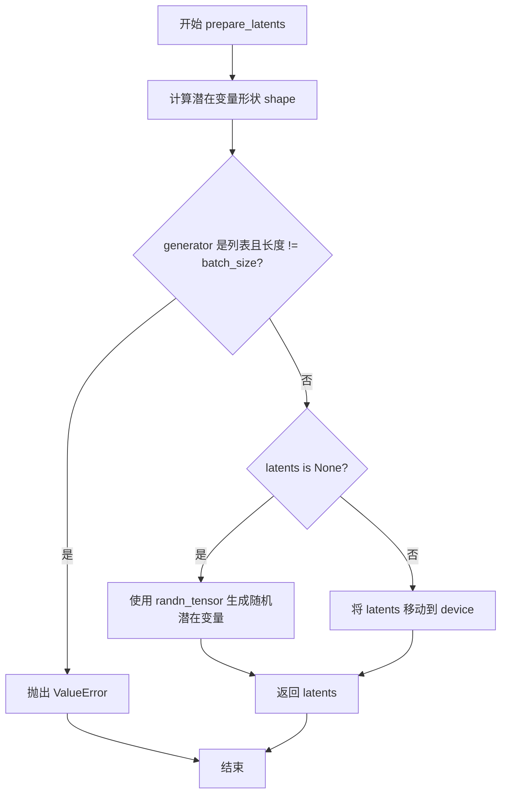

#### 带注释源码

```python
def prepare_latents(
    self,
    batch_size: int,
    num_channels_latents: int,
    height: int,
    width: int,
    dtype: torch.dtype,
    device: torch.device,
    generator: torch.Generator | list[torch.Generator] | None,
    latents: torch.Tensor | None = None
):
    """
    准备用于去噪过程的初始潜在变量。

    Args:
        batch_size: 批处理大小
        num_channels_latents: 潜在变量的通道数
        height: 图像高度
        width: 图像宽度
        dtype: 张量数据类型
        device: 计算设备
        generator: 随机生成器
        latents: 可选的预生成潜在变量

    Returns:
        处理后的潜在变量张量
    """
    # 计算潜在变量的形状，根据VAE缩放因子调整空间维度
    shape = (
        batch_size,
        num_channels_latents,
        int(height) // self.vae_scale_factor,
        int(width) // self.vae_scale_factor,
    )
    
    # 验证生成器列表长度与批处理大小是否匹配
    if isinstance(generator, list) and len(generator) != batch_size:
        raise ValueError(
            f"You have passed a list of generators of length {len(generator)}, but requested an effective batch"
            f" size of {batch_size}. Make sure the batch size matches the length of the generators."
        )

    # 如果未提供潜在变量，则随机生成
    if latents is None:
        latents = randn_tensor(shape, generator=generator, device=device, dtype=dtype)
    else:
        # 否则将现有潜在变量移动到指定设备
        latents = latents.to(device)

    return latents
```


### `LuminaPipeline.guidance_scale`

这是 `LuminaPipeline` 类的一个属性（property）方法，用于获取分类器自由引导（Classifier-Free Guidance）的缩放因子。该属性返回内部变量 `_guidance_scale` 的值，该值在调用管道生成图像时由用户通过 `__call__` 方法的 `guidance_scale` 参数设置。

参数：无需参数

返回值：`float`，返回当前的 guidance_scale 值，用于控制分类器自由引导的强度。当返回值大于 1 时，表示启用了分类器自由引导。

#### 流程图

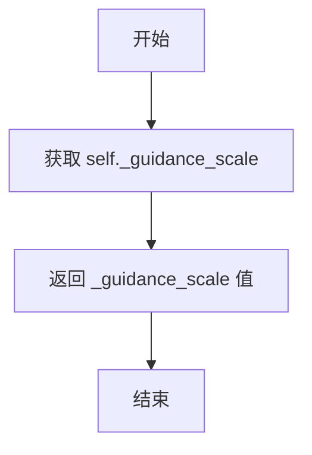

#### 带注释源码

```python
@property
def guidance_scale(self):
    """
    属性 getter：获取分类器自由引导的缩放因子。

    该属性返回在调用管道时设置的 guidance_scale 值。
    guidance_scale 用于控制无分类器引导（Classifier-Free Guidance）的强度，
    类似于 Imagen 论文中公式 (2) 的权重参数 w。
    当 guidance_scale > 1 时，生成的图像与文本提示的相关性更高，
    但可能会牺牲一定的图像质量。

    返回:
        float: 当前的 guidance_scale 值。
    """
    return self._guidance_scale
```


### `LuminaPipeline.do_classifier_free_guidance`

该属性用于判断当前是否启用了分类器自由引导（Classifier-Free Guidance）。它基于 `guidance_scale` 参数的值来判断：如果 `guidance_scale > 1`，则返回 `True`（表示启用 CFG）；否则返回 `False`。CFG 是一种在扩散模型中平衡文本条件和无条件生成的技术，通过同时预测有条件和无条件的噪声来引导生成过程。

参数：无（该方法为属性，仅隐式接收 `self` 参数）

返回值：`bool`，表示是否启用分类器自由引导

#### 流程图

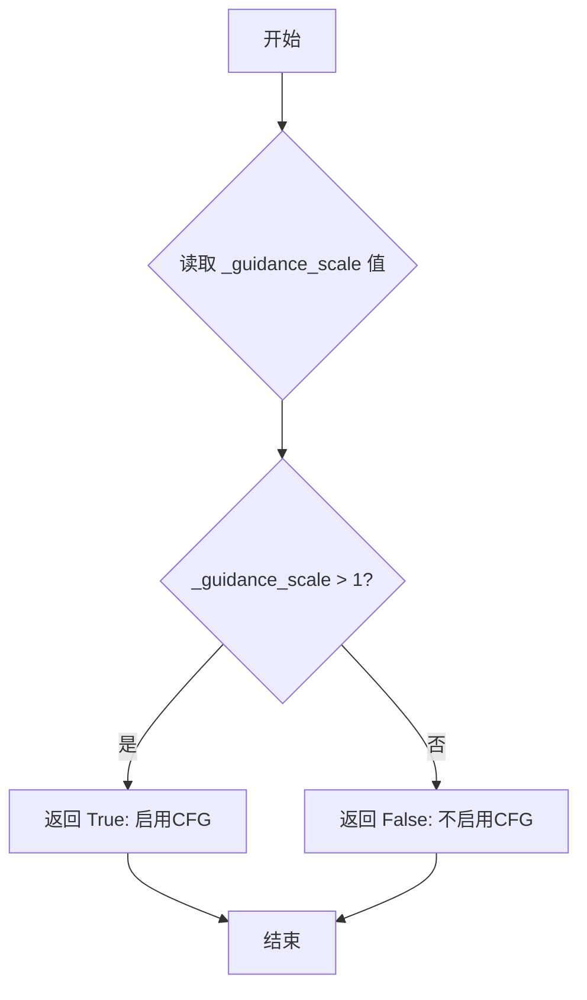

#### 带注释源码

```python
@property
def do_classifier_free_guidance(self):
    """
    属性：判断是否启用分类器自由引导（Classifier-Free Guidance）
    
    该属性基于 guidance_scale 参数判断是否启用 CFG 技术。
    在扩散模型中，CFG 通过同时预测有条件（conditional）和无条件（unconditional）
    的噪声来实现对生成过程的引导，guidance_scale 控制引导的强度。
    
    根据 Imagen 论文的定义：
    - guidance_scale = 1: 不进行分类器自由引导
    - guidance_scale > 1: 启用分类器自由引导，值越大对文本提示的遵循度越高
                          但可能导致图像质量下降
    
    Returns:
        bool: 如果 guidance_scale > 1 返回 True，表示启用 CFG；
              否则返回 False，表示不启用 CFG
    """
    return self._guidance_scale > 1
```


### `LuminaPipeline.num_timesteps`

该属性是 `LuminaPipeline` 类的一个只读属性，用于返回当前推理过程中设置的时间步总数。该值在调用 `__call__` 方法生成图像时由调度器（scheduler）设置，并存储在实例变量 `_num_timesteps` 中供后续访问。

参数： 无

返回值：`int`，返回推理过程中使用的时间步总数。

#### 流程图

```mermaid
flowchart TD
    A[访问 num_timesteps 属性] --> B{检查 _num_timesteps 是否存在}
    B -->|是| C[返回 _num_timesteps 值]
    B -->|否| D[返回 None 或报错]
    
    subgraph 设置流程
    E[调用 __call__ 方法] --> F[retrieve_timesteps 获取 timesteps]
    F --> G[设置 self._num_timesteps = len(timesteps)]
    end
    
    C --> H[流程结束]
```

#### 带注释源码

```python
@property
def num_timesteps(self):
    """
    返回推理过程中使用的时间步总数。
    
    该属性是一个只读属性，用于获取在图像生成过程中设置的时间步数量。
    值在 __call__ 方法中被设置：self._num_timesteps = len(timesteps)
    
    Returns:
        int: 推理过程中使用的时间步总数
    """
    return self._num_timesteps
```


### `LuminaPipeline.__call__`

这是 LuminaPipeline 的核心调用方法，用于根据文本提示生成图像。该方法整合了文本编码、潜在向量准备、去噪循环和图像解码的完整流程，支持条件引导、自定义调度器和多种输出格式。

参数：

- `prompt`：`str | list[str]`，要引导图像生成的提示词。如果未定义，则必须传递 `prompt_embeds`
- `width`：`int | None`，生成图像的宽度（像素），默认为 `self.default_sample_size * self.vae_scale_factor`
- `height`：`int | None`，生成图像的高度（像素），默认为 `self.default_sample_size * self.vae_scale_factor`
- `num_inference_steps`：`int`，去噪步骤数，默认值为 30，更多步骤通常能获得更高质量的图像，但推理速度更慢
- `guidance_scale`：`float`，引导尺度，定义见 Classifier-Free Diffusion Guidance，默认值为 4.0，值为 1 时表示不使用引导
- `negative_prompt`：`str | list[str]`，不引导图像生成的提示词，如果未定义则必须传递 `negative_prompt_embeds`
- `sigmas`：`list[float]`，自定义 sigmas 值，用于支持 sigmas 参数的调度器的去噪过程
- `num_images_per_prompt`：`int | None`，每个提示词生成的图像数量，默认值为 1
- `generator`：`torch.Generator | list[torch.Generator] | None`，用于确保生成确定性的随机生成器
- `latents`：`torch.Tensor | None`，预生成的噪声潜在向量，用于图像生成，可用于使用不同提示词微调相同生成
- `prompt_embeds`：`torch.Tensor | None`，预生成的文本嵌入，可用于轻松调整文本输入
- `negative_prompt_embeds`：`torch.Tensor | None`，预生成的负面文本嵌入，对于 Lumina-T2I 应为空字符串 ""
- `prompt_attention_mask`：`torch.Tensor | None`，文本嵌入的预生成注意力掩码
- `negative_prompt_attention_mask`：`torch.Tensor | None`，负面文本嵌入的预生成注意力掩码
- `output_type`：`str | None`，生成图像的输出格式，可选 "pil" 或 "latent"，默认值为 "pil"
- `return_dict`：`bool`，是否返回 `ImagePipelineOutput`，默认值为 True
- `clean_caption`：`bool`，是否在创建嵌入前清理提示词，需要 beautifulsoup4 和 ftfy 库，默认值为 True
- `max_sequence_length`：`int`，与提示词一起使用的最大序列长度，默认值为 256
- `scaling_watershed`：`float | None`，时间感知去噪机制的时间阈值，默认值为 1.0
- `proportional_attn`：`bool | None`，是否启用比例注意力，默认值为 True
- `callback_on_step_end`：`Callable | PipelineCallback | MultiPipelineCallbacks | None`，每个去噪步骤结束时调用的回调函数
- `callback_on_step_end_tensor_inputs`：`list[str]`，回调函数张量输入列表，默认值为 ["latents"]

返回值：`ImagePipelineOutput | tuple`，如果 `return_dict` 为 True，返回 `ImagePipelineOutput`，否则返回包含生成图像列表的元组

#### 流程图

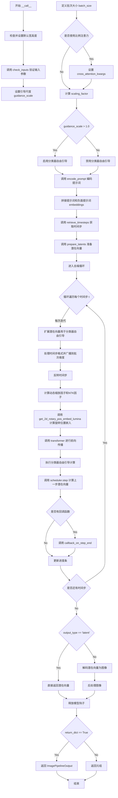

#### 带注释源码

```python
@torch.no_grad()
@replace_example_docstring(EXAMPLE_DOC_STRING)
def __call__(
    self,
    prompt: str | list[str] = None,
    width: int | None = None,
    height: int | None = None,
    num_inference_steps: int = 30,
    guidance_scale: float = 4.0,
    negative_prompt: str | list[str] = None,
    sigmas: list[float] = None,
    num_images_per_prompt: int | None = 1,
    generator: torch.Generator | list[torch.Generator] | None = None,
    latents: torch.Tensor | None = None,
    prompt_embeds: torch.Tensor | None = None,
    negative_prompt_embeds: torch.Tensor | None = None,
    prompt_attention_mask: torch.Tensor | None = None,
    negative_prompt_attention_mask: torch.Tensor | None = None,
    output_type: str | None = "pil",
    return_dict: bool = True,
    clean_caption: bool = True,
    max_sequence_length: int = 256,
    scaling_watershed: float | None = 1.0,
    proportional_attn: bool | None = True,
    callback_on_step_end: Callable[[int, int], None] | PipelineCallback | MultiPipelineCallbacks | None = None,
    callback_on_step_end_tensor_inputs: list[str] = ["latents"],
) -> ImagePipelineOutput | tuple:
    """
    Function invoked when calling the pipeline for generation.

    Args:
        prompt (`str` or `list[str]`, *optional*):
            The prompt or prompts to guide the image generation. If not defined, one has to pass `prompt_embeds`.
            instead.
        negative_prompt (`str` or `list[str]`, *optional*):
            The prompt or prompts not to guide the image generation. If not defined, one has to pass
            `negative_prompt_embeds` instead. Ignored when not using guidance (i.e., ignored if `guidance_scale` is
            less than `1`).
        num_inference_steps (`int`, *optional*, defaults to 30):
            The number of denoising steps. More denoising steps usually lead to a higher quality image at the
            expense of slower inference.
        sigmas (`list[float]`, *optional*):
            Custom sigmas to use for the denoising process with schedulers which support a `sigmas` argument in
            their `set_timesteps` method. If not defined, the default behavior when `num_inference_steps` is passed
            will be used.
        guidance_scale (`float`, *optional*, defaults to 4.0):
            Guidance scale as defined in [Classifier-Free Diffusion
            Guidance](https://huggingface.co/papers/2207.12598). `guidance_scale` is defined as `w` of equation 2.
            of [Imagen Paper](https://huggingface.co/papers/2205.11487). Guidance scale is enabled by setting
            `guidance_scale > 1`. Higher guidance scale encourages to generate images that are closely linked to
            the text `prompt`, usually at the expense of lower image quality.
        num_images_per_prompt (`int`, *optional*, defaults to 1):
            The number of images to generate per prompt.
        height (`int`, *optional*, defaults to self.unet.config.sample_size):
            The height in pixels of the generated image.
        width (`int`, *optional*, defaults to self.unet.config.sample_size):
            The width in pixels of the generated image.
        eta (`float`, *optional*, defaults to 0.0):
            Corresponds to parameter eta (η) in the DDIM paper: https://huggingface.co/papers/2010.02502. Only
            applies to [`schedulers.DDIMScheduler`], will be ignored for others.
        generator (`torch.Generator` or `list[torch.Generator]`, *optional*):
            One or a list of [torch generator(s)](https://pytorch.org/docs/stable/generated/torch.Generator.html)
            to make generation deterministic.
        latents (`torch.Tensor`, *optional*):
            Pre-generated noisy latents, sampled from a Gaussian distribution, to be used as inputs for image
            generation. Can be used to tweak the same generation with different prompts. If not provided, a latents
            tensor will be generated by sampling using the supplied random `generator`.
        prompt_embeds (`torch.Tensor`, *optional*):
            Pre-generated text embeddings. Can be used to easily tweak text inputs, *e.g.* prompt weighting. If not
            provided, text embeddings will be generated from `prompt` input argument.
        prompt_attention_mask (`torch.Tensor`, *optional*): Pre-generated attention mask for text embeddings.
        negative_prompt_embeds (`torch.Tensor`, *optional*):
            Pre-generated negative text embeddings. For Lumina-T2I this negative prompt should be "". If not
            provided, negative_prompt_embeds will be generated from `negative_prompt` input argument.
        negative_prompt_attention_mask (`torch.Tensor`, *optional*):
            Pre-generated attention mask for negative text embeddings.
        output_type (`str`, *optional*, defaults to `"pil"`):
            The output format of the generate image. Choose between
            [PIL](https://pillow.readthedocs.io/en/stable/): `PIL.Image.Image` or `np.array`.
        return_dict (`bool`, *optional*, defaults to `True`):
            Whether or not to return a [`~pipelines.stable_diffusion.IFPipelineOutput`] instead of a plain tuple.
        clean_caption (`bool`, *optional*, defaults to `True`):
            Whether or not to clean the caption before creating embeddings. Requires `beautifulsoup4` and `ftfy` to
            be installed. If the dependencies are not installed, the embeddings will be created from the raw
            prompt.
        max_sequence_length (`int` defaults to 120):
            Maximum sequence length to use with the `prompt`.
        callback_on_step_end (`Callable`, *optional*):
            A function that calls at the end of each denoising steps during the inference. The function is called
            with the following arguments: `callback_on_step_end(self: DiffusionPipeline, step: int, timestep: int,
            callback_kwargs: Dict)`. `callback_kwargs` will include a list of all tensors as specified by
            `callback_on_step_end_tensor_inputs`.
        callback_on_step_end_tensor_inputs (`list`, *optional*):
            The list of tensor inputs for the `callback_on_step_end` function. The tensors specified in the list
            will be passed as `callback_kwargs` argument. You will only be able to include variables listed in the
            .`_callback_tensor_inputs` attribute of your pipeline class.

    Examples:

    Returns:
        [`~pipelines.ImagePipelineOutput`] or `tuple`:
            If `return_dict` is `True`, [`~pipelines.ImagePipelineOutput`] is returned, otherwise a `tuple` is
            returned where the first element is a list with the generated images
    """
    # 1. 设置默认的图像宽高度（如果未提供）
    # 使用 VAE 缩放因子将样本大小转换为像素维度
    height = height or self.default_sample_size * self.vae_scale_factor
    width = width or self.default_sample_size * self.vae_scale_factor

    # 2. 检查输入参数的有效性
    # 验证所有参数是否符合管道要求，不符合则抛出异常
    self.check_inputs(
        prompt,
        height,
        width,
        negative_prompt,
        prompt_embeds=prompt_embeds,
        negative_prompt_embeds=negative_prompt_embeds,
        prompt_attention_mask=prompt_attention_mask,
        negative_prompt_attention_mask=negative_prompt_attention_mask,
        callback_on_step_end_tensor_inputs=callback_on_step_end_tensor_inputs,
    )

    # 保存引导尺度供属性方法使用
    self._guidance_scale = guidance_scale

    # 初始化交叉注意力参数
    cross_attention_kwargs = {}

    # 3. 定义调用参数
    # 根据提示词类型确定批次大小
    if prompt is not None and isinstance(prompt, str):
        batch_size = 1
    elif prompt is not None and isinstance(prompt, list):
        batch_size = len(prompt)
    else:
        batch_size = prompt_embeds.shape[0]

    # 如果启用比例注意力，设置基础序列长度
    # 用于调整不同分辨率下的注意力计算
    if proportional_attn:
        cross_attention_kwargs["base_sequence_length"] = (self.default_image_size // 16) ** 2

    # 计算动态缩放因子，用于调整不同分辨率下的旋转位置嵌入
    scaling_factor = math.sqrt(width * height / self.default_image_size**2)

    # 获取执行设备
    device = self._execution_device

    # 4. 确定是否使用分类器自由引导
    # 根据 Imagen 论文，引导尺度 > 1 时启用 CFG
    do_classifier_free_guidance = guidance_scale > 1.0

    # 5. 编码输入提示词
    # 调用 encode_prompt 方法生成文本嵌入
    (
        prompt_embeds,
        prompt_attention_mask,
        negative_prompt_embeds,
        negative_prompt_attention_mask,
    ) = self.encode_prompt(
        prompt,
        do_classifier_free_guidance,
        negative_prompt=negative_prompt,
        num_images_per_prompt=num_images_per_prompt,
        device=device,
        prompt_embeds=prompt_embeds,
        negative_prompt_embeds=negative_prompt_embeds,
        prompt_attention_mask=prompt_attention_mask,
        negative_prompt_attention_mask=negative_prompt_attention_mask,
        clean_caption=clean_caption,
        max_sequence_length=max_sequence_length,
    )

    # 如果使用 CFG，将提示词嵌入和负面提示词嵌入拼接
    if do_classifier_free_guidance:
        prompt_embeds = torch.cat([prompt_embeds, negative_prompt_embeds], dim=0)
        prompt_attention_mask = torch.cat([prompt_attention_mask, negative_prompt_attention_mask], dim=0)

    # 6. 准备时间步
    # 根据设备类型设置时间步设备
    if XLA_AVAILABLE:
        timestep_device = "cpu"
    else:
        timestep_device = device
    
    # 调用 retrieve_timesteps 获取调度器的时间步
    timesteps, num_inference_steps = retrieve_timesteps(
        self.scheduler, num_inference_steps, timestep_device, sigmas=sigmas
    )

    # 7. 准备潜在向量
    # 获取变换器的输入通道数
    latent_channels = self.transformer.config.in_channels
    
    # 准备去噪的初始潜在向量
    latents = self.prepare_latents(
        batch_size * num_images_per_prompt,
        latent_channels,
        height,
        width,
        prompt_embeds.dtype,
        device,
        generator,
        latents,
    )

    # 记录时间步数量
    self._num_timesteps = len(timesteps)

    # 8. 去噪循环
    # 遍历每个时间步进行迭代去噪
    with self.progress_bar(total=num_inference_steps) as progress_bar:
        for i, t in enumerate(timesteps):
            # 如果使用 CFG，扩展潜在向量以包含条件和非条件部分
            latent_model_input = torch.cat([latents] * 2) if do_classifier_free_guidance else latents

            current_timestep = t
            
            # 处理时间步格式，确保是张量形式
            if not torch.is_tensor(current_timestep):
                # 检测设备类型，处理不同平台的兼容性
                is_mps = latent_model_input.device.type == "mps"
                is_npu = latent_model_input.device.type == "npu"
                if isinstance(current_timestep, float):
                    # 根据设备选择合适的数据类型
                    dtype = torch.float32 if (is_mps or is_npu) else torch.float64
                else:
                    dtype = torch.int32 if (is_mps or is_npu) else torch.int64
                # 将时间步转换为张量
                current_timestep = torch.tensor(
                    [current_timestep],
                    dtype=dtype,
                    device=latent_model_input.device,
                )
            elif len(current_timestep.shape) == 0:
                # 确保时间步是 1 维张量
                current_timestep = current_timestep[None].to(latent_model_input.device)
            
            # 广播时间步到批次维度，兼容 ONNX/Core ML
            current_timestep = current_timestep.expand(latent_model_input.shape[0])

            # 反转时间步，因为 Lumina 使用 t=0 表示噪声，t=1 表示图像
            current_timestep = 1 - current_timestep / self.scheduler.config.num_train_timesteps

            # 准备图像旋转嵌入用于位置编码
            # 根据 Lumina-Next 论文的时间感知去噪机制
            # https://huggingface.co/papers/2406.18583, Sec 2.3
            # 需要根据不同时间步计算不同的旋转嵌入
            if current_timestep[0] < scaling_watershed:
                linear_factor = scaling_factor
                ntk_factor = 1.0
            else:
                linear_factor = 1.0
                ntk_factor = scaling_factor
            
            # 计算 2D 旋转位置嵌入
            image_rotary_emb = get_2d_rotary_pos_embed_lumina(
                self.transformer.head_dim,
                384,
                384,
                linear_factor=linear_factor,
                ntk_factor=ntk_factor,
            )

            # 调用变换器进行去噪预测
            noise_pred = self.transformer(
                hidden_states=latent_model_input,
                timestep=current_timestep,
                encoder_hidden_states=prompt_embeds,
                encoder_mask=prompt_attention_mask,
                image_rotary_emb=image_rotary_emb,
                cross_attention_kwargs=cross_attention_kwargs,
                return_dict=False,
            )[0]
            
            # 只保留第一部分（条件部分），用于 CFG 计算
            noise_pred = noise_pred.chunk(2, dim=1)[0]

            # 执行引导尺度计算
            # 为确保可重现性，默认只对三个通道应用分类器自由引导
            # 标准方法是对所有通道应用 CFG
            # 可以通过取消注释下一行并注释掉后面的行来更改
            # eps, rest = model_out[:, :self.in_channels], model_out[:, self.in_channels:]
            if do_classifier_free_guidance:
                # 分离条件和非条件预测
                noise_pred_eps, noise_pred_rest = noise_pred[:, :3], noise_pred[:, 3:]
                noise_pred_cond_eps, noise_pred_uncond_eps = torch.split(
                    noise_pred_eps, len(noise_pred_eps) // 2, dim=0
                )
                # 应用 CFG 公式: uncond + scale * (cond - uncond)
                noise_pred_half = noise_pred_uncond_eps + guidance_scale * (
                    noise_pred_cond_eps - noise_pred_uncond_eps
                )
                noise_pred_eps = torch.cat([noise_pred_half, noise_pred_half], dim=0)

                # 重新组合预测
                noise_pred = torch.cat([noise_pred_eps, noise_pred_rest], dim=1)
                noise_pred, _ = noise_pred.chunk(2, dim=0)

            # 计算上一步的潜在向量 x_t -> x_t-1
            latents_dtype = latents.dtype
            # 取反噪声预测（因为调度器期望的是相反的符号）
            noise_pred = -noise_pred
            # 调用调度器步骤计算去噪
            latents = self.scheduler.step(noise_pred, t, latents, return_dict=False)[0]

            # 处理潜在向量数据类型转换
            if latents.dtype != latents_dtype:
                if torch.backends.mps.is_available():
                    # 某些平台（如 Apple MPS）由于 PyTorch bug 而出现异常行为
                    # https://github.com/pytorch/pytorch/pull/99272
                    latents = latents.to(latents_dtype)

            # 更新进度条
            progress_bar.update()

            # 如果有回调函数，在每步结束时调用
            if callback_on_step_end is not None:
                callback_kwargs = {}
                for k in callback_on_step_end_tensor_inputs:
                    callback_kwargs[k] = locals()[k]
                callback_outputs = callback_on_step_end(self, i, t, callback_kwargs)

                # 更新潜在向量和提示词嵌入（如果回调修改了它们）
                latents = callback_outputs.pop("latents", latents)
                prompt_embeds = callback_outputs.pop("prompt_embeds", prompt_embeds)

            # 如果使用 XLA，标记计算步骤
            if XLA_AVAILABLE:
                xm.mark_step()

    # 9. 解码潜在向量（如果不需要 latent 输出）
    if not output_type == "latent":
        # 反缩放潜在向量
        latents = latents / self.vae.config.scaling_factor
        # 使用 VAE 解码潜在向量到图像
        image = self.vae.decode(latents, return_dict=False)[0]
        # 后处理图像
        image = self.image_processor.postprocess(image, output_type=output_type)
    else:
        # 直接返回潜在向量
        image = latents

    # 10. 释放所有模型
    self.maybe_free_model_hooks()

    # 11. 返回结果
    if not return_dict:
        return (image,)

    return ImagePipelineOutput(images=image)
```


### `LuminaText2ImgPipeline.__init__`

这是 `LuminaText2ImgPipeline` 类的构造函数，用于初始化文本到图像生成管道。它是一个已被弃用的类，实际上是对 `LuminaPipeline` 的包装，主要用于向后兼容。该方法接受 transformer、scheduler、vae、text_encoder 和 tokenizer 五个关键组件，并将它们传递给父类 `LuminaPipeline` 进行初始化，同时发出弃用警告，提示用户使用 `LuminaPipeline` 代替。

参数：

- `transformer`：`LuminaNextDiT2DModel`，用于去噪图像 latent 的 Transformer 模型
- `scheduler`：`FlowMatchEulerDiscreteScheduler`，用于控制扩散过程的时间步调度器
- `vae`：`AutoencoderKL`，变分自编码器，用于编码和解码图像 latent
- `text_encoder`：`GemmaPreTrainedModel`，冻结的 Gemma 文本编码器
- `tokenizer`：`GemmaTokenizer | GemmaTokenizerFast`，Gemma 分词器

返回值：`None`，无返回值，该方法仅初始化对象状态

#### 流程图

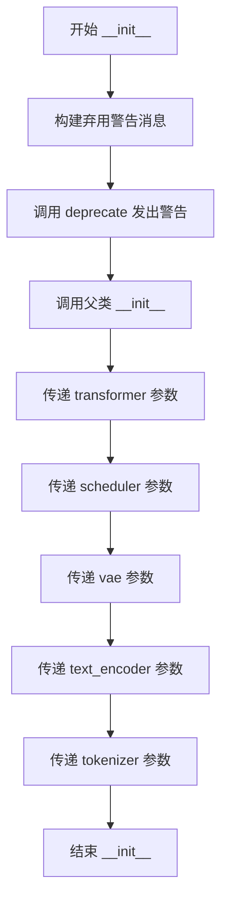

#### 带注释源码

```python
class LuminaText2ImgPipeline(LuminaPipeline):
    def __init__(
        self,
        transformer: LuminaNextDiT2DModel,
        scheduler: FlowMatchEulerDiscreteScheduler,
        vae: AutoencoderKL,
        text_encoder: GemmaPreTrainedModel,
        tokenizer: GemmaTokenizer | GemmaTokenizerFast,
    ):
        # 构建弃用警告消息，提示用户该类已被重命名
        deprecation_message = "`LuminaText2ImgPipeline` has been renamed to `LuminaPipeline` and will be removed in a future version. Please use `LuminaPipeline` instead."
        
        # 调用 deprecate 函数发出警告，警告级别为 0.34
        deprecate("diffusers.pipelines.lumina.pipeline_lumina.LuminaText2ImgPipeline", "0.34", deprecation_message)
        
        # 调用父类 LuminaPipeline 的 __init__ 方法进行初始化
        super().__init__(
            transformer=transformer,
            scheduler=scheduler,
            vae=vae,
            text_encoder=text_encoder,
            tokenizer=tokenizer,
        )
```

## 关键组件


### LuminaPipeline

核心文本到图像生成管道，继承自DiffusionPipeline，利用Gemma文本编码器和LuminaNextDiT2DTransformer模型进行条件图像生成，支持分类器自由引导和Flow Match调度器。

### retrieve_timesteps

全局时间步检索函数，负责调用调度器的set_timesteps方法并返回时间步序列，支持自定义时间步和sigmas参数，用于控制扩散过程的采样策略。

### encode_prompt

管道提示编码方法，将文本提示转换为文本编码器的隐藏状态，支持分类器自由引导的负向提示嵌入生成，处理批量提示和每个提示生成多张图像的场景。

### _get_gemma_prompt_embeds

私有Gemma提示嵌入获取方法，使用GemmaTokenizer对提示进行分词，通过GemmaPreTrainedModel生成文本嵌入向量，支持截断警告和嵌入复制以适应多图像生成。

### _text_preprocessing

文本预处理方法，对输入提示进行清洗和规范化，支持可选的clean_caption功能，调用_clean_caption进行深度清洗。

### _clean_caption

标题清洗方法，使用BeautifulSoup和ftfy库清洗HTML实体、URL、CJK字符、特殊标点等，提供全面的文本清理流程以提高生成质量。

### prepare_latents

潜在变量准备方法，根据批次大小和图像尺寸生成或复用噪声潜在向量，支持随机生成或外部传入的latents。

### check_inputs

输入验证方法，检查图像尺寸是否可被vae_scale_factor整除，验证prompt和prompt_embeds的互斥关系，确保参数一致性和合法性。

### __call__

管道主调用方法，执行完整的文本到图像生成流程，包括：输入验证、提示编码、时间步准备、潜在变量初始化、去噪循环（含时间感知的位置编码和分类器自由引导）、VAE解码和图像后处理。

### LuminaText2ImgPipeline

已弃用的管道别名类，继承自LuminaPipeline，用于向后兼容，现已重命名为LuminaPipeline。

### image_rotary_emb (时间感知机制)

动态旋转位置嵌入计算，根据当前时间步和图像分辨率计算线性因子和NTK因子，实现Lumina-Next论文中提出的时间感知去噪机制，支持不同分辨率的动态缩放。

### 分类器自由引导 (CFG)

在去噪循环中实现的条件引导机制，通过分离有条件和无条件噪声预测并应用guidance_scale权重，使生成的图像更紧密地匹配文本提示。

### VAE解码与图像后处理

在去噪完成后，将潜在空间表示解码为实际图像，通过vae_scale_factor进行缩放调整，并使用VaeImageProcessor进行后处理以输出最终图像。


## 问题及建议


### 已知问题

-   **类型检查不规范**：使用 `type(prompt) is not type(negative_prompt)` 进行类型比较，而不是使用 `isinstance()`，这种检查方式不够健壮且无法处理继承情况
-   **硬编码值缺乏说明**：`get_2d_rotary_pos_embed_lumina` 调用中的 `384` 宽度和高度值被硬编码，未从配置或参数中获取
-   **变量遮蔽问题**：函数参数 `num_inference_steps` 在被 `retrieve_timesteps` 返回值覆盖后继续使用，易造成混淆
-   **缺失参数校验**：未对 `scaling_watershed` 参数进行边界检查（如负值或极端大值），可能在计算中产生异常结果
-   **设备处理不一致**：timestep 设备在某些路径可能为 CPU 而非原始 device，可能引入潜在性能问题
-   **调度器假设未验证**：代码假设 `scheduler.config.num_train_timesteps` 存在但未做显式检查
-   **重复代码逻辑**：`_get_gemma_prompt_embeds` 与 `encode_prompt` 中处理 embedding 重复的逻辑存在冗余
-   **潜在空值风险**：`self.transformer` 在 `__init__` 中未被检查是否为 None（尽管构造函数签名要求非空）

### 优化建议

-   将 `384` 替换为从 `self.transformer.config` 或图像尺寸参数动态获取
-   使用 `isinstance()` 替代 `type() is` 进行类型检查
-   为关键配置参数（如 `scaling_watershed`、`proportional_attn`）添加显式校验和默认值说明文档
-   提取 embedding 生成逻辑到独立方法以消除代码重复
-   添加调度器配置属性的空值检查和默认值回退机制
-   统一设备管理逻辑，避免 CPU/GPU 设备切换带来的潜在问题

## 其它


### 设计目标与约束

本管道旨在实现高效的文本到图像生成，采用Lumina-T2I架构，支持生成高分辨率图像。设计约束包括：1) 支持批量生成多张图像；2) 支持自定义采样步数和引导系数；3) 兼容不同分辨率的图像生成（需能被vae_scale_factor*2整除）；4) 最大序列长度为256个token；5) 默认生成图像尺寸为1024x1024像素。

### 错误处理与异常设计

代码中实现了多层次错误检查：1) 在check_inputs方法中验证图像尺寸、提示词类型、嵌入维度一致性；2) 在retrieve_timesteps中检查调度器是否支持自定义timesteps或sigmas；3) 在_get_gemma_prompt_embeds中处理序列截断警告；4) 在prepare_latents中验证生成器列表长度与批大小匹配。异常处理采用ValueError抛出明确错误信息，指导用户修正输入参数。

### 数据流与状态机

管道核心数据流：用户输入(prompt) → 文本编码(encode_prompt) → 生成提示嵌入 → 初始化潜在向量(prepare_latents) → 去噪循环(迭代transformer预测噪声) → VAE解码(latents→image) → 后处理输出。状态管理通过内部属性_guidance_scale、_num_timesteps追踪生成状态，progress_bar显示进度。

### 外部依赖与接口契约

主要依赖：1) transformers库的GemmaPreTrainedModel和GemmaTokenizer；2) diffusers内部的LuminaNextDiT2DModel、AutoencoderKL、FlowMatchEulerDiscreteScheduler；3) 可选的bs4和ftfy库用于caption清洗；4) torch和torch_xla（若可用）用于加速。接口契约：from_pretrained方法加载预训练模型，__call__方法执行推理并返回ImagePipelineOutput或tuple。

### 性能优化策略

代码包含多项性能优化：1) enable_model_cpu_offload()支持模型CPU卸载；2) XLA加速支持（通过torch_xla）；3) torch.no_grad()装饰器禁用梯度计算；4) 可能的情况下使用mps或npu特定_dtype；5) chunk操作分离CFG计算；6) 回调机制允许在每步结束后释放中间结果。

### 安全性考量

1) 仅支持已过滤的危险符号；2) Caption清洗移除URL、IP地址、个人信息；3) 默认negative_prompt为空字符串，避免生成不当内容；4) 遵循Apache 2.0许可证开源。

### 版本兼容性

管道继承DiffusionPipeline基类，兼容diffusers 0.34+版本。LuminaText2ImgPipeline作为别名已标记为废弃，将在后续版本移除。建议使用LuminaPipeline主类以确保长期兼容。

### 测试策略建议

应覆盖：1) 正常文本到图像生成；2) 批量生成；3) 不同分辨率输入验证；4) 自定义timesteps/sigmas；5) 错误输入（尺寸不匹配、类型错误）抛出对应异常；6) CPU/GPU/XLA设备兼容性；7) offload功能正常释放内存。

### 配置与可扩展性

通过_register_modules注册可替换组件，支持自定义scheduler、vae、text_encoder和tokenizer。cross_attention_kwargs允许传入额外的注意力控制参数。callback机制支持自定义每步后处理逻辑。


    