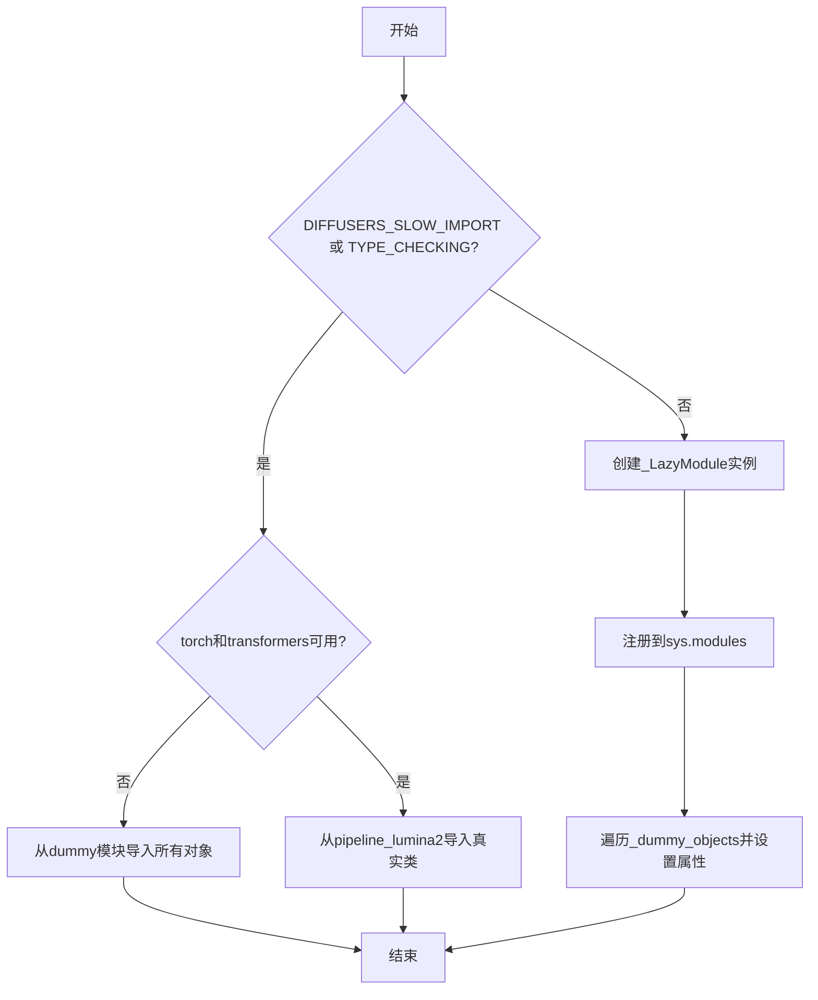

# `diffusers\src\diffusers\pipelines\lumina2\__init__.py` 详细设计文档

Diffusers库的Lumina2模型管道初始化模块，通过LazyModule实现可选依赖（torch和transformers）的延迟导入和动态加载，当依赖不可用时自动使用dummy对象替代，保持模块接口一致性

## 整体流程



## 类结构

```
延迟加载模块系统
├── _LazyModule (动态模块加载器)
├── _import_structure (导入结构字典)
├── _dummy_objects (替代对象集合)
└── Lumina2Pipeline, Lumina2Text2ImgPipeline (导出类)
```

## 全局变量及字段


### `_dummy_objects`
    
用于存储虚拟对象的字典，当可选依赖（torch和transformers）不可用时，这些虚拟对象会被添加到模块中以支持延迟导入

类型：`dict`
    


### `_import_structure`
    
定义模块导入结构的字典，键为模块名，值为可导出对象列表，用于LazyModule的动态导入机制

类型：`dict`
    


    

## 全局函数及方法


## 关键组件


### 延迟加载模块 (_LazyModule)

使用 `_LazyModule` 实现模块的延迟加载机制，允许在运行时按需加载模块，提高导入速度并避免不必要的依赖加载。

### 可选依赖处理

通过 `OptionalDependencyNotAvailable` 异常和 `is_torch_available()`、`is_transformers_available()` 函数检查来处理 torch 和 transformers 的可选依赖，当依赖不可用时使用虚拟对象进行占位。

### 虚拟对象模式 (_dummy_objects)

当 torch 和 transformers 依赖不可用时，从 `dummy_torch_and_transformers_objects` 模块获取虚拟对象并存储在 `_dummy_objects` 字典中，用于保持模块接口完整性。

### 导入结构定义 (_import_structure)

通过字典定义模块的导入结构，包括管道名称和对应的类名（如 `Lumina2Pipeline` 和 `Lumina2Text2ImgPipeline`）。

### 类型检查支持 (TYPE_CHECKING)

使用 `TYPE_CHECKING` 条件导入来支持静态类型检查工具，避免在运行时导入时产生循环依赖。


## 问题及建议


### 已知问题

-   **重复的条件检查逻辑**：在 `try-except` 块（第12-20行）和 `TYPE_CHECKING` 块（第22-31行）中重复了相同的依赖可用性检查逻辑（`is_transformers_available() and is_torch_available()`），违反了 DRY 原则。
-   **魔法字符串硬编码**：使用字符串 `"pipeline_lumina2"` 作为 `_import_structure` 的键，容易出现拼写错误且难以维护。
-   **变量初始化顺序依赖**：`_dummy_objects` 和 `_import_structure` 在模块级别定义，但如果 `get_objects_from_module` 或后续逻辑失败，可能导致不一致的状态。
-   **缺少类型注解**：`_import_structure` 字典没有显式的类型注解，影响代码可读性和 IDE 支持。
-   **延迟导入的潜在问题**：`sys.modules[__name__] = _LazyModule(...)` 在 `else` 分支中，如果前面的逻辑抛出异常导致流程提前退出，可能导致模块状态不完整。

### 优化建议

-   **提取公共函数**：将依赖检查逻辑封装为辅助函数（如 `_check_dependencies()`），在两处调用以消除重复代码。
-   **使用常量或枚举**：定义 `PIPELINE_LUMINA2 = "pipeline_lumina2"` 常量，替代硬编码的字符串。
-   **添加类型注解**：为 `_import_structure` 和 `_dummy_objects` 添加类型注解，如 `_import_structure: Dict[str, List[str]]`。
-   **重构条件分支**：将 `if TYPE_CHECKING or DIFFUSERS_SLOW_IMPORT` 的分支逻辑提取为独立函数，提高代码可读性。
-   **增强错误处理**：在 `get_objects_from_module` 调用周围添加 try-except 块，捕获可能的异常并提供有意义的错误信息。


## 其它


### 设计目标与约束

本模块采用延迟导入（Lazy Import）模式，主要目标是解决Diffusers库的循环依赖问题和减少包导入时的初始化时间。通过在运行时动态导入Lumina2Pipeline和Lumina2Text2ImgPipeline，只有在实际使用这些Pipeline时才加载相关模块，从而优化内存占用和启动性能。

### 错误处理与异常设计

本模块依赖`OptionalDependencyNotAvailable`异常来处理可选依赖不可用的情况。当torch或transformers任一库不可用时，代码会捕获该异常并使用虚拟对象（dummy objects）填充命名空间，确保模块可以正常导入但无法实例化实际的Pipeline对象。这种设计允许库在缺少可选依赖时仍能部分加载，提供有意义的错误信息而非完全失败。

### 数据流与状态机

模块加载存在三种状态：初始状态、依赖可用状态和依赖不可用状态。在初始状态下，模块尝试检查torch和transformers的可用性；若两者都可用，导入结构被设置为包含Lumina2Pipeline；若任一不可用，则使用dummy对象替代。TYPE_CHECKING标志用于支持类型检查工具在静态分析时能够正确识别导出类型。

### 外部依赖与接口契约

本模块明确依赖两个外部包：PyTorch（通过is_torch_available()检测）和Transformers（通过is_transformers_available()检测）。这两个包均为可选依赖，但Lumina2Pipeline的实际功能需要两者同时存在。模块导出的公共接口包括Lumina2Pipeline和Lumina2Text2ImgPipeline两个类，它们应遵循Diffusers库的标准Pipeline接口规范。

### 模块初始化流程

模块初始化遵循以下流程：首先定义空的_import_structure字典和_dummy_objects集合；然后尝试导入torch和transformers，若成功则将pipeline_lumina2模块加入导入结构，否则获取dummy对象；最后通过_LazyModule将当前模块注册为懒加载模块，并将所有dummy对象设置为模块属性。

### 性能考虑与优化空间

当前实现存在优化空间：每次import该模块时都会执行依赖检查逻辑，即使这些检查的结果在多次导入时保持一致。可以考虑添加缓存机制来存储依赖检查结果，避免重复检测。此外，_dummy_objects的迭代赋值操作可以在模块初始化时一次性完成，而非在每次导入时执行。

### 安全考虑

代码使用sys.modules进行动态模块注册，需要确保传入的参数（__name__、__file__、_import_structure）都是可信的。module_spec参数来自__spec__，这是Python解释器自动提供的，通常是安全的。代码没有执行任意代码加载或动态执行用户输入，因此不存在明显的安全风险。

### 版本兼容性

该模块使用了TYPE_CHECKING标志，这是Python 3.5+的标准特性。_LazyModule的使用方式符合Diffusers库的设计规范，需要与指定版本的Diffusers框架配合使用。get_objects_from_module函数来自...utils模块，需要确认该工具函数的可用性。

### 测试策略建议

建议添加以下测试用例：验证在缺少torch或transformers时模块可以正常导入；验证在依赖满足时Lumina2Pipeline可以被正确实例化；验证LazyModule的懒加载行为确实延迟了子模块的加载；验证dummy对象在访问时会抛出适当的错误信息。

### 配置与环境要求

运行该代码需要Python 3.7+环境，以及可选的PyTorch和Transformers库。若要使用完整的Lumina2Pipeline功能，需要同时安装这两个依赖包。DIFFUSERS_SLOW_IMPORT环境变量可影响模块的初始化行为。


    