# `diffusers\src\diffusers\pipelines\lumina2\pipeline_lumina2.py` 详细设计文档

Lumina2Pipeline是一个用于文本到图像生成的DiffusionPipeline实现，基于Lumina-T2I模型，结合了VAE variational autoencoder、Gemma2文本编码器、Transformer2DModel去噪网络和FlowMatchEulerDiscreteScheduler调度器，实现高质量的文本引导图像合成。

## 整体流程

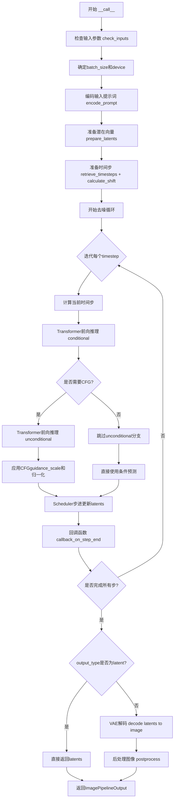

## 类结构

```
DiffusionPipeline (基类)
├── Lumina2LoraLoaderMixin (Mixin)
│   └── Lumina2Pipeline (主类)
│       └── Lumina2Text2ImgPipeline (已弃用别名)
```

## 全局变量及字段


### `logger`
    
模块级日志记录器，用于输出警告和信息

类型：`logging.Logger`
    


### `EXAMPLE_DOC_STRING`
    
包含pipeline使用示例的文档字符串

类型：`str`
    


### `XLA_AVAILABLE`
    
指示PyTorch XLA是否可用的布尔标志

类型：`bool`
    


### `calculate_shift`
    
全局函数，根据图像序列长度计算shift参数，用于调整噪声调度

类型：`Callable`
    


### `retrieve_timesteps`
    
全局函数，从调度器获取或设置timesteps序列

类型：`Callable`
    


### `Lumina2Pipeline.vae`
    
变分自编码器模型，用于编码和解码图像与潜在表示

类型：`AutoencoderKL`
    


### `Lumina2Pipeline.text_encoder`
    
冻结的Gemma2文本编码器，用于将文本转换为嵌入

类型：`Gemma2PreTrainedModel`
    


### `Lumina2Pipeline.tokenizer`
    
Gemma分词器，用于将文本转换为token

类型：`GemmaTokenizer | GemmaTokenizerFast`
    


### `Lumina2Pipeline.transformer`
    
文本条件的Transformer模型，用于去噪潜在图像表示

类型：`Lumina2Transformer2DModel`
    


### `Lumina2Pipeline.scheduler`
    
流匹配欧拉离散调度器，用于控制去噪过程

类型：`FlowMatchEulerDiscreteScheduler`
    


### `Lumina2Pipeline.vae_scale_factor`
    
VAE的缩放因子，用于调整潜在空间的维度

类型：`int`
    


### `Lumina2Pipeline.default_sample_size`
    
默认采样大小，决定生成图像的基础分辨率

类型：`int`
    


### `Lumina2Pipeline.default_image_size`
    
默认图像像素大小，由default_sample_size乘以vae_scale_factor计算得出

类型：`int`
    


### `Lumina2Pipeline.system_prompt`
    
系统级提示词，用于引导图像生成的基础指令

类型：`str`
    


### `Lumina2Pipeline.image_processor`
    
VAE图像处理器，用于图像的后处理和格式转换

类型：`VaeImageProcessor`
    


### `Lumina2Pipeline._optional_components`
    
类变量，列出可选的pipeline组件

类型：`list`
    


### `Lumina2Pipeline._callback_tensor_inputs`
    
类变量，定义回调函数可访问的张量输入名称列表

类型：`list`
    


### `Lumina2Pipeline.model_cpu_offload_seq`
    
类变量，定义模型CPU卸载的顺序序列

类型：`str`
    
    

## 全局函数及方法


### `calculate_shift`

该函数通过线性插值计算图像序列长度对应的偏移量（mu），用于调整扩散模型在推理过程中的时间步长规划。它基于给定的序列长度范围（base_seq_len 到 max_seq_len）和对应的偏移范围（base_shift 到 max_shift），根据当前图像序列长度动态计算最优的偏移值。

参数：

- `image_seq_len`：`int`，输入的图像序列长度，用于计算对应的偏移量
- `base_seq_len`：`int`，默认值 256，序列长度的基准值
- `max_seq_len`：`int`，默认值 4096，序列长度的最大值
- `base_shift`：`float`，默认值 0.5，基准偏移量
- `max_shift`：`float`，默认值 1.15，最大偏移量

返回值：`float`，计算得到的偏移量 mu

#### 流程图

```mermaid
flowchart TD
    A[开始] --> B[计算斜率 m]
    B --> C[计算截距 b]
    C --> D[计算偏移量 mu]
    D --> E[返回 mu]
    
    B1[((max_shift - base_shift) / (max_seq_len - base_seq_len))]
    C1[base_shift - m * base_seq_len]
    D1[image_seq_len * m + b]
```

#### 带注释源码

```python
# Copied from diffusers.pipelines.flux.pipeline_flux.calculate_shift
def calculate_shift(
    image_seq_len,          # 输入参数：图像序列长度
    base_seq_len: int = 256,        # 默认基准序列长度 256
    max_seq_len: int = 4096,        # 默认最大序列长度 4096
    base_shift: float = 0.5,        # 默认基准偏移量 0.5
    max_shift: float = 1.15,        # 默认最大偏移量 1.15
):
    # 计算线性方程的斜率 m：偏移量随序列长度的变化率
    m = (max_shift - base_shift) / (max_seq_len - base_seq_len)
    
    # 计算线性方程的截距 b：确保当序列长度为 base_seq_len 时，偏移量为 base_shift
    b = base_shift - m * base_seq_len
    
    # 根据输入的图像序列长度计算最终的偏移量 mu
    # 使用线性方程 mu = m * image_seq_len + b
    mu = image_seq_len * m + b
    
    # 返回计算得到的偏移量，用于调整扩散调度器的时间步长
    return mu
```


### `retrieve_timesteps`

该函数是一个通用的时间步检索工具函数，用于调用调度器的`set_timesteps`方法并从中获取时间步序列，支持自定义时间步或sigma值的调度策略。

参数：

-  `scheduler`：`SchedulerMixin`，调度器对象，用于获取时间步
-  `num_inference_steps`：`int | None`，推理步数，当使用预训练模型生成样本时使用的扩散步数，若传入则`timesteps`必须为`None`
-  `device`：`str | torch.device | None`，时间步要移动到的设备，若为`None`则不移动时间步
-  `timesteps`：`list[int] | None`，自定义时间步，用于覆盖调度器的时间步间隔策略，若传入则`num_inference_steps`和`sigmas`必须为`None`
-  `sigmas`：`list[float] | None`，自定义sigma值，用于覆盖调度器的sigma间隔策略，若传入则`num_inference_steps`和`timesteps`必须为`None`
-  `**kwargs`：任意关键字参数，将传递给调度器的`set_timesteps`方法

返回值：`tuple[torch.Tensor, int]`，返回元组，第一个元素是调度器的时间步序列，第二个元素是推理步数

#### 流程图

```mermaid
flowchart TD
    A[开始 retrieve_timesteps] --> B{检查 timesteps 和 sigmas 是否同时传入}
    B -->|是| C[抛出 ValueError: 只能选择一种自定义方式]
    B -->|否| D{检查是否传入了 timesteps}
    D -->|是| E{调度器是否支持 timesteps 参数}
    D -->|否| F{检查是否传入了 sigmas}
    E -->|是| G[调用 scheduler.set_timesteps<br/>参数: timesteps=timesteps, device=device]
    E -->|否| H[抛出 ValueError: 调度器不支持自定义时间步]
    G --> I[获取 scheduler.timesteps]
    I --> J[计算 num_inference_steps = len(timesteps)]
    J --> K[返回 (timesteps, num_inference_steps)]
    F -->|是| L{调度器是否支持 sigmas 参数}
    L -->|是| M[调用 scheduler.set_timesteps<br/>参数: sigmas=sigmas, device=device]
    L -->|否| N[抛出 ValueError: 调度器不支持自定义 sigmas]
    M --> O[获取 scheduler.timesteps]
    O --> P[计算 num_inference_steps = len(timesteps)]
    P --> K
    F -->|否| Q[调用 scheduler.set_timesteps<br/>参数: num_inference_steps, device=device]
    Q --> R[获取 scheduler.timesteps]
    R --> S[计算 num_inference_steps]
    S --> K
```

#### 带注释源码

```python
# Copied from diffusers.pipelines.stable_diffusion.pipeline_stable_diffusion.retrieve_timesteps
def retrieve_timesteps(
    scheduler,
    num_inference_steps: int | None = None,
    device: str | torch.device | None = None,
    timesteps: list[int] | None = None,
    sigmas: list[float] | None = None,
    **kwargs,
):
    r"""
    Calls the scheduler's `set_timesteps` method and retrieves timesteps from the scheduler after the call. Handles
    custom timesteps. Any kwargs will be supplied to `scheduler.set_timesteps`.

    Args:
        scheduler (`SchedulerMixin`):
            The scheduler to get timesteps from.
        num_inference_steps (`int`):
            The number of diffusion steps used when generating samples with a pre-trained model. If used, `timesteps`
            must be `None`.
        device (`str` or `torch.device`, *optional*):
            The device to which the timesteps should be moved to. If `None`, the timesteps are not moved.
        timesteps (`list[int]`, *optional*):
            Custom timesteps used to override the timestep spacing strategy of the scheduler. If `timesteps` is passed,
            `num_inference_steps` and `sigmas` must be `None`.
        sigmas (`list[float]`, *optional*):
            Custom sigmas used to override the timestep spacing strategy of the scheduler. If `sigmas` is passed,
            `num_inference_steps` and `timesteps` must be `None`.

    Returns:
        `tuple[torch.Tensor, int]`: A tuple where the first element is the timestep schedule from the scheduler and the
        second element is the number of inference steps.
    """
    # 检查是否同时传入了 timesteps 和 sigmas，这是不允许的，只能选择其中一种自定义方式
    if timesteps is not None and sigmas is not None:
        raise ValueError("Only one of `timesteps` or `sigmas` can be passed. Please choose one to set custom values")
    
    # 处理自定义 timesteps 的情况
    if timesteps is not None:
        # 检查调度器的 set_timesteps 方法是否支持 timesteps 参数
        accepts_timesteps = "timesteps" in set(inspect.signature(scheduler.set_timesteps).parameters.keys())
        if not accepts_timesteps:
            raise ValueError(
                f"The current scheduler class {scheduler.__class__}'s `set_timesteps` does not support custom"
                f" timestep schedules. Please check whether you are using the correct scheduler."
            )
        # 调用调度器的 set_timesteps 方法设置自定义时间步
        scheduler.set_timesteps(timesteps=timesteps, device=device, **kwargs)
        # 从调度器获取生成的时间步
        timesteps = scheduler.timesteps
        # 计算推理步数
        num_inference_steps = len(timesteps)
    # 处理自定义 sigmas 的情况
    elif sigmas is not None:
        # 检查调度器的 set_timesteps 方法是否支持 sigmas 参数
        accept_sigmas = "sigmas" in set(inspect.signature(scheduler.set_timesteps).parameters.keys())
        if not accept_sigmas:
            raise ValueError(
                f"The current scheduler class {scheduler.__class__}'s `set_timesteps` does not support custom"
                f" sigmas schedules. Please check whether you are using the correct scheduler."
            )
        # 调用调度器的 set_timesteps 方法设置自定义 sigma 值
        scheduler.set_timesteps(sigmas=sigmas, device=device, **kwargs)
        # 从调度器获取生成的时间步
        timesteps = scheduler.timesteps
        # 计算推理步数
        num_inference_steps = len(timesteps)
    # 默认情况：使用 num_inference_steps 设置时间步
    else:
        scheduler.set_timesteps(num_inference_steps, device=device, **kwargs)
        timesteps = scheduler.timesteps
    
    # 返回时间步序列和推理步数
    return timesteps, num_inference_steps
```


### `Lumina2Pipeline.__init__`

该方法是 `Lumina2Pipeline` 类的构造函数，用于初始化文本到图像生成管道的所有核心组件，包括变换器、调度器、VAE、文本编码器和分词器，并配置图像处理相关的参数。

参数：

- `transformer`：`Lumina2Transformer2DModel`，用于去噪图像潜在表示的文本条件变换器模型
- `scheduler`：`FlowMatchEulerDiscreteScheduler`，与变换器结合使用以去噪图像潜在表示的调度器
- `vae`：`AutoencoderKL`，变分自编码器模型，用于编码和解码图像与潜在表示之间的转换
- `text_encoder`：`Gemma2PreTrainedModel`，冻结的 Gemma2 文本编码器
- `tokenizer`：`GemmaTokenizer | GemmaTokenizerFast`，Gemma 分词器

返回值：无（`__init__` 方法不返回任何值）

#### 流程图

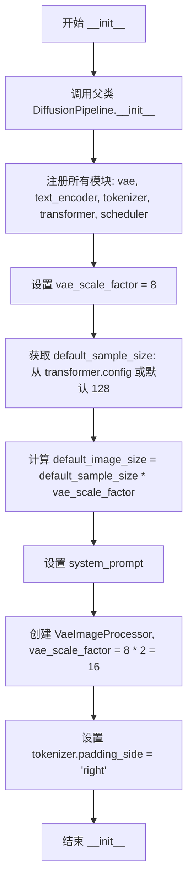

#### 带注释源码

```python
def __init__(
    self,
    transformer: Lumina2Transformer2DModel,
    scheduler: FlowMatchEulerDiscreteScheduler,
    vae: AutoencoderKL,
    text_encoder: Gemma2PreTrainedModel,
    tokenizer: GemmaTokenizer | GemmaTokenizerFast,
):
    """
    初始化 Lumina2Pipeline 管道
    
    Args:
        transformer: Lumina2Transformer2DModel 实例，用于去噪图像潜在表示
        scheduler: FlowMatchEulerDiscreteScheduler 实例，用于调度去噪步骤
        vae: AutoencoderKL 实例，用于图像与潜在表示之间的编解码
        text_encoder: Gemma2PreTrainedModel 实例，冻结的文本编码器
        tokenizer: GemmaTokenizer 或 GemmaTokenizerFast 实例
    """
    # 调用父类 DiffusionPipeline 的初始化方法
    # 继承基础管道的通用功能
    super().__init__()

    # 通过 register_modules 注册所有子模块
    # 这些模块可以通过 self.xxx 访问
    self.register_modules(
        vae=vae,
        text_encoder=text_encoder,
        tokenizer=tokenizer,
        transformer=transformer,
        scheduler=scheduler,
    )
    
    # VAE 的缩放因子，用于计算潜在空间的维度
    # Lumina2 使用 8x 的压缩率
    self.vae_scale_factor = 8
    
    # 获取默认采样大小
    # 如果 transformer 存在且有 config.sample_size 属性则使用，否则默认为 128
    self.default_sample_size = (
        self.transformer.config.sample_size
        if hasattr(self, "transformer") and self.transformer is not None
        else 128
    )
    
    # 计算默认图像尺寸
    # 潜在空间大小乘以 VAE 缩放因子得到像素空间大小
    self.default_image_size = self.default_sample_size * self.vae_scale_factor
    
    # 设置系统提示词
    # 用于引导模型生成与文本提示高度对齐的优质图像
    self.system_prompt = "You are an assistant designed to generate superior images with the superior degree of image-text alignment based on textual prompts or user prompts."

    # 创建 VAE 图像处理器
    # 缩放因子乘以 2 是因为 VAE 会在解码时进行上采样操作
    self.image_processor = VaeImageProcessor(vae_scale_factor=self.vae_scale_factor * 2)

    # 配置分词器的填充方向
    # 设置为右侧填充是文本生成任务的标准做法
    if getattr(self, "tokenizer", None) is not None:
        self.tokenizer.padding_side = "right"
```


### `Lumina2Pipeline._get_gemma_prompt_embeds`

该方法用于将文本提示（prompt）转换为Gemma文本编码器的嵌入向量（embeddings）和注意力掩码（attention mask）。它首先对提示进行tokenize处理，然后通过Gemma文本编码器生成隐藏状态，最后返回文本嵌入和注意力掩码供后续的图像生成流程使用。

参数：

- `self`：`Lumina2Pipeline` 实例本身
- `prompt`：`str | list[str]`，输入的文本提示，可以是单个字符串或字符串列表
- `device`：`torch.device | None`，用于指定计算设备，默认为 `None`（会自动使用执行设备）
- `max_sequence_length`：`int`，最大序列长度，默认为 256

返回值：`tuple[torch.Tensor, torch.Tensor]`，返回一个元组，包含：
- `prompt_embeds`：`torch.Tensor`，Gemma文本编码器生成的文本嵌入向量，形状为 `(batch_size, seq_len, hidden_dim)`
- `prompt_attention_mask`：`torch.Tensor`，用于指示有效token的注意力掩码，形状为 `(batch_size, seq_len)`

#### 流程图

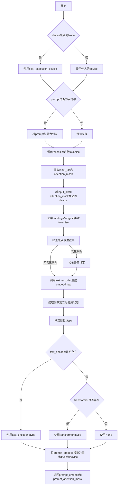

#### 带注释源码

```python
def _get_gemma_prompt_embeds(
    self,
    prompt: str | list[str],
    device: torch.device | None = None,
    max_sequence_length: int = 256,
) -> tuple[torch.Tensor, torch.Tensor]:
    # 如果device为None，则使用当前执行设备
    device = device or self._execution_device
    
    # 如果prompt是单个字符串，则转换为列表以支持批量处理
    prompt = [prompt] if isinstance(prompt, str) else prompt
    
    # 使用tokenizer对prompt进行tokenize，padding到max_sequence_length
    # truncation=True表示如果超过最大长度则截断
    text_inputs = self.tokenizer(
        prompt,
        padding="max_length",
        max_length=max_sequence_length,
        truncation=True,
        return_tensors="pt",
    )

    # 将input_ids移动到指定设备
    text_input_ids = text_inputs.input_ids.to(device)
    
    # 使用padding='longest'进行额外的tokenize，用于检测是否有内容被截断
    untruncated_ids = self.tokenizer(prompt, padding="longest", return_tensors="pt").input_ids.to(device)

    # 检查是否发生了截断（untruncated_ids更长但text_input_ids与之不相等）
    if untruncated_ids.shape[-1] >= text_input_ids.shape[-1] and not torch.equal(text_input_ids, untruncated_ids):
        # 解码被截断的部分并记录警告
        removed_text = self.tokenizer.batch_decode(untruncated_ids[:, max_sequence_length - 1 : -1])
        logger.warning(
            "The following part of your input was truncated because Gemma can only handle sequences up to"
            f" {max_sequence_length} tokens: {removed_text}"
        )

    # 将attention_mask移动到指定设备
    prompt_attention_mask = text_inputs.attention_mask.to(device)
    
    # 调用Gemma文本编码器生成embeddings，output_hidden_states=True返回所有隐藏状态
    prompt_embeds = self.text_encoder(
        text_input_ids, attention_mask=prompt_attention_mask, output_hidden_states=True
    )
    
    # 获取倒数第二层的隐藏状态作为prompt embeddings
    # 通常使用倒数第二层是因为最后一层可能过于接近输出层
    prompt_embeds = prompt_embeds.hidden_states[-2]

    # 确定目标dtype：优先使用text_encoder的dtype，其次使用transformer的dtype
    if self.text_encoder is not None:
        dtype = self.text_encoder.dtype
    elif self.transformer is not None:
        dtype = self.transformer.dtype
    else:
        dtype = None

    # 将prompt_embeds转换为目标dtype和device
    prompt_embeds = prompt_embeds.to(dtype=dtype, device=device)

    # 获取序列长度（用于后续处理）
    _, seq_len, _ = prompt_embeds.shape

    # 返回prompt embeddings和attention mask
    return prompt_embeds, prompt_attention_mask
```


### Lumina2Pipeline.encode_prompt

该方法用于将文本提示词编码为文本编码器的隐藏状态，处理正向提示词和负向提示词（用于无分类器自由引导），并支持批量生成和提示词嵌入的复用。

参数：

- `prompt`：`str | list[str]`，要编码的提示词，可以是单个字符串或字符串列表
- `do_classifier_free_guidance`：`bool`，是否使用无分类器自由引导，默认为 True
- `negative_prompt`：`str | list[str]`，不希望出现的提示词，用于引导图像生成方向，若不指定且启用引导时需传入 `negative_prompt_embeds`
- `num_images_per_prompt`：`int`，每个提示词生成的图像数量，默认为 1
- `device`：`torch.device | None`，用于放置生成嵌入的 torch 设备，默认为执行设备
- `prompt_embeds`：`torch.Tensor | None`，预生成的文本嵌入，可用于方便地调整文本输入，如提示词加权，若未提供则从 `prompt` 输入生成
- `negative_prompt_embeds`：`torch.Tensor | None`，预生成的负向文本嵌入，对于 Lumina-T2I 应为空字符串 "" 的嵌入
- `prompt_attention_mask`：`torch.Tensor | None`，文本嵌入的注意力掩码
- `negative_prompt_attention_mask`：`torch.Tensor | None`，负向文本嵌入的注意力掩码
- `system_prompt`：`str | None`，系统提示词，默认为 pipeline 的系统提示词
- `max_sequence_length`：`int`，提示词使用的最大序列长度，默认为 256

返回值：`tuple[torch.Tensor, torch.Tensor, torch.Tensor, torch.Tensor]`，返回四个张量：正向提示词嵌入、正向提示词注意力掩码、负向提示词嵌入、负向提示词注意力掩码

#### 流程图

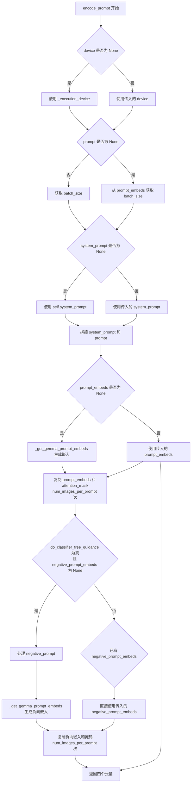

#### 带注释源码

```python
# Adapted from diffusers.pipelines.deepfloyd_if.pipeline_if.encode_prompt
def encode_prompt(
    self,
    prompt: str | list[str],
    do_classifier_free_guidance: bool = True,
    negative_prompt: str | list[str] = None,
    num_images_per_prompt: int = 1,
    device: torch.device | None = None,
    prompt_embeds: torch.Tensor | None = None,
    negative_prompt_embeds: torch.Tensor | None = None,
    prompt_attention_mask: torch.Tensor | None = None,
    negative_prompt_attention_mask: torch.Tensor | None = None,
    system_prompt: str | None = None,
    max_sequence_length: int = 256,
) -> tuple[torch.Tensor, torch.Tensor, torch.Tensor, torch.Tensor]:
    r"""
    Encodes the prompt into text encoder hidden states.

    Args:
        prompt (`str` or `list[str]`, *optional*):
            prompt to be encoded
        negative_prompt (`str` or `list[str]`, *optional*):
            The prompt not to guide the image generation. If not defined, one has to pass `negative_prompt_embeds`
            instead. Ignored when not using guidance (i.e., ignored if `guidance_scale` is less than `1`). For
            Lumina-T2I, this should be "".
        do_classifier_free_guidance (`bool`, *optional*, defaults to `True`):
            whether to use classifier free guidance or not
        num_images_per_prompt (`int`, *optional*, defaults to 1):
            number of images that should be generated per prompt
        device: (`torch.device`, *optional*):
            torch device to place the resulting embeddings on
        prompt_embeds (`torch.Tensor`, *optional*):
            Pre-generated text embeddings. Can be used to easily tweak text inputs, *e.g.* prompt weighting. If not
            provided, text embeddings will be generated from `prompt` input argument.
        negative_prompt_embeds (`torch.Tensor`, *optional*):
            Pre-generated negative text embeddings. For Lumina-T2I, it's should be the embeddings of the "" string.
        prompt_attention_mask (`torch.Tensor`, *optional*): 
            Pre-generated attention mask for text embeddings.
        negative_prompt_attention_mask (`torch.Tensor`, *optional*): 
            Pre-generated attention mask for negative text embeddings.
        system_prompt (`str`, *optional*):
            The system prompt to use for the image generation.
        max_sequence_length (`int`, defaults to `256`):
            Maximum sequence length to use for the prompt.
    """
    # 如果未指定 device，则使用执行设备
    if device is None:
        device = self._execution_device

    # 将单个字符串 prompt 转换为列表
    prompt = [prompt] if isinstance(prompt, str) else prompt
    
    # 确定批处理大小
    if prompt is not None:
        batch_size = len(prompt)
    else:
        # 如果 prompt 为 None，则从 prompt_embeds 获取批处理大小
        batch_size = prompt_embeds.shape[0]

    # 处理系统提示词：若未提供则使用默认的系统提示词
    if system_prompt is None:
        system_prompt = self.system_prompt
    
    # 将系统提示词与用户提示词拼接，添加标记
    if prompt is not None:
        prompt = [system_prompt + " <Prompt Start> " + p for p in prompt]

    # 如果未提供 prompt_embeds，则调用内部方法生成
    if prompt_embeds is None:
        prompt_embeds, prompt_attention_mask = self._get_gemma_prompt_embeds(
            prompt=prompt,
            device=device,
            max_sequence_length=max_sequence_length,
        )

    # 获取提示词嵌入的形状信息
    batch_size, seq_len, _ = prompt_embeds.shape
    
    # 复制文本嵌入和注意力掩码，以支持每个提示词生成多张图像
    # 使用对 MPS 友好的方法进行复制
    prompt_embeds = prompt_embeds.repeat(1, num_images_per_prompt, 1)
    prompt_embeds = prompt_embeds.view(batch_size * num_images_per_prompt, seq_len, -1)
    prompt_attention_mask = prompt_attention_mask.repeat(num_images_per_prompt, 1)
    prompt_attention_mask = prompt_attention_mask.view(batch_size * num_images_per_prompt, -1)

    # 获取无分类器自由引导的负向嵌入
    if do_classifier_free_guidance and negative_prompt_embeds is None:
        # 如果未提供负向提示词，则使用空字符串
        negative_prompt = negative_prompt if negative_prompt is not None else ""

        # 将字符串负向提示词规范化为列表
        negative_prompt = batch_size * [negative_prompt] if isinstance(negative_prompt, str) else negative_prompt

        # 检查类型一致性
        if prompt is not None and type(prompt) is not type(negative_prompt):
            raise TypeError(
                f"`negative_prompt` should be the same type to `prompt`, but got {type(negative_prompt)} !="
                f" {type(prompt)}."
            )
        # 如果是单个字符串，转换为列表
        elif isinstance(negative_prompt, str):
            negative_prompt = [negative_prompt]
        # 检查批处理大小一致性
        elif batch_size != len(negative_prompt):
            raise ValueError(
                f"`negative_prompt`: {negative_prompt} has batch size {len(negative_prompt)}, but `prompt`:"
                f" {prompt} has batch size {batch_size}. Please make sure that passed `negative_prompt` matches"
                " the batch size of `prompt`."
            )
        
        # 生成负向提示词嵌入
        negative_prompt_embeds, negative_prompt_attention_mask = self._get_gemma_prompt_embeds(
            prompt=negative_prompt,
            device=device,
            max_sequence_length=max_sequence_length,
        )

        # 获取负向嵌入的形状
        batch_size, seq_len, _ = negative_prompt_embeds.shape
        
        # 复制负向文本嵌入和注意力掩码，与正向嵌入处理方式相同
        negative_prompt_embeds = negative_prompt_embeds.repeat(1, num_images_per_prompt, 1)
        negative_prompt_embeds = negative_prompt_embeds.view(batch_size * num_images_per_prompt, seq_len, -1)
        negative_prompt_attention_mask = negative_prompt_attention_mask.repeat(num_images_per_prompt, 1)
        negative_prompt_attention_mask = negative_prompt_attention_mask.view(
            batch_size * num_images_per_prompt, -1
        )

    # 返回四个张量：正向嵌入、正向掩码、负向嵌入、负向掩码
    return prompt_embeds, prompt_attention_mask, negative_prompt_embeds, negative_prompt_attention_mask
```


### `Lumina2Pipeline.prepare_extra_step_kwargs`

该方法用于为调度器（scheduler）的 `step` 方法准备额外的关键字参数。由于不同调度器具有不同的签名，该方法通过检查调度器是否接受 `eta` 和 `generator` 参数来动态构建需要传递的额外参数字典。

参数：

- `generator`：`torch.Generator | list[torch.Generator] | None`，用于生成确定性随机数的 PyTorch 生成器
- `eta`：`float`，DDIM 调度器专用的 eta 参数（η），对应 DDIM 论文中的参数，取值范围为 [0, 1]，其他调度器会忽略此参数

返回值：`dict`，包含调度器 `step` 方法所需额外参数（eta 和/或 generator）的字典

#### 流程图

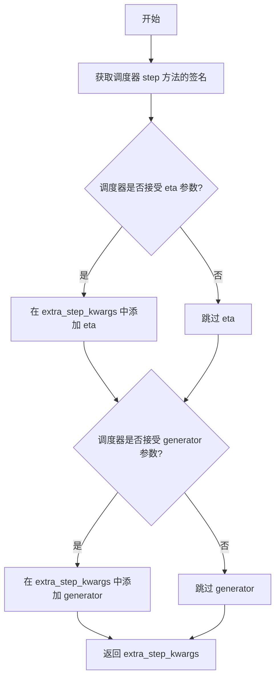

#### 带注释源码

```python
def prepare_extra_step_kwargs(self, generator, eta):
    """
    准备调度器步骤所需的额外参数。

    由于并非所有调度器都具有相同的签名，此方法用于检查调度器是否支持
    eta 参数（仅 DDIMScheduler 使用）以及 generator 参数，并返回
    相应的参数字典。

    参数:
        generator: torch.Generator | list[torch.Generator] | None
            PyTorch 生成器，用于确保生成的可重复性。如果为 None，则使用随机生成。
        eta: float
            DDIM 论文中的 eta (η) 参数，仅被 DDIMScheduler 使用，
            其他调度器会忽略此参数。取值范围应为 [0, 1]。

    返回:
        dict: 包含调度器 step 方法所需额外参数（eta 和/或 generator）的字典。
    """
    # 使用 inspect 模块检查调度器 step 方法是否接受 eta 参数
    accepts_eta = "eta" in set(inspect.signature(self.scheduler.step).parameters.keys())
    # 初始化额外的参数字典
    extra_step_kwargs = {}
    # 如果调度器接受 eta 参数，则将其添加到 extra_step_kwargs
    if accepts_eta:
        extra_step_kwargs["eta"] = eta

    # 检查调度器是否接受 generator 参数
    accepts_generator = "generator" in set(inspect.signature(self.scheduler.step).parameters.keys())
    # 如果调度器接受 generator 参数，则将其添加到 extra_step_kwargs
    if accepts_generator:
        extra_step_kwargs["generator"] = generator
    
    # 返回构建好的额外参数字典
    return extra_step_kwargs
```


### `Lumina2Pipeline.check_inputs`

该方法用于验证文本到图像生成管道的输入参数是否合法，确保高度、宽度、提示词、嵌入向量等参数符合模型要求，若不符合则抛出相应的 ValueError 异常。

参数：

- `self`：`Lumina2Pipeline` 实例本身，隐式传递
- `prompt`：`str | list[str] | None`，用户输入的文本提示，可以是单个字符串或字符串列表
- `height`：`int`，生成图像的高度（像素），必须能被 `vae_scale_factor * 2` 整除
- `width`：`int`，生成图像的宽度（像素），必须能被 `vae_scale_factor * 2` 整除
- `negative_prompt`：`str | list[str] | None`，用于反向引导的文本提示，生成图像时指导模型避免出现的内容
- `prompt_embeds`：`torch.Tensor | None`，预生成的文本嵌入向量，若提供则跳过从 prompt 生成
- `negative_prompt_embeds`：`torch.Tensor | None`，预生成的反向引导文本嵌入向量
- `prompt_attention_mask`：`torch.Tensor | None`，文本嵌入的注意力掩码，当提供 prompt_embeds 时必须同时提供
- `negative_prompt_attention_mask`：`torch.Tensor | None`，反向引导文本嵌入的注意力掩码，当提供 negative_prompt_embeds 时必须同时提供
- `callback_on_step_end_tensor_inputs`：`list[str] | None`，在每个去噪步骤结束时回调的tensor输入列表，必须是 `_callback_tensor_inputs` 的子集
- `max_sequence_length`：`int | None`，文本序列的最大长度，不能超过 512

返回值：`None`，该方法不返回值，仅通过抛出 ValueError 来表示验证失败

#### 流程图

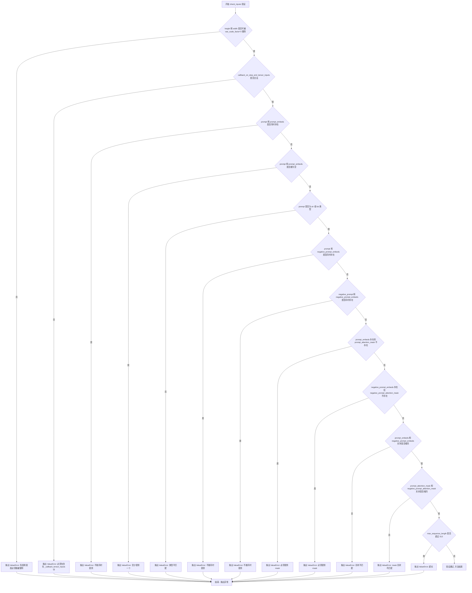

#### 带注释源码

```python
def check_inputs(
    self,
    prompt,  # str | list[str] | None: 用户输入的文本提示
    height,  # int: 生成图像的高度
    width,   # int: 生成图像的宽度
    negative_prompt,  # str | list[str] | None: 反向引导提示
    prompt_embeds=None,         # torch.Tensor | None: 预生成的文本嵌入
    negative_prompt_embeds=None,  # torch.Tensor | None: 预生成的反向嵌入
    prompt_attention_mask=None,   # torch.Tensor | None: 文本注意力掩码
    negative_prompt_attention_mask=None,  # torch.Tensor | None: 反向嵌入的注意力掩码
    callback_on_step_end_tensor_inputs=None,  # list[str] | None: 回调的tensor输入
    max_sequence_length=None,     # int | None: 最大序列长度
):
    # 验证 1: 检查高度和宽度是否能被 vae_scale_factor * 2 整除
    # VAE 进行 8x 压缩，需确保图像尺寸符合要求以避免解码错误
    if height % (self.vae_scale_factor * 2) != 0 or width % (self.vae_scale_factor * 2) != 0:
        raise ValueError(
            f"`height` and `width` have to be divisible by {self.vae_scale_factor * 2} but are {height} and {width}."
        )

    # 验证 2: 检查回调函数输入是否在允许的列表中
    # 仅允许特定tensor类型的输入传递给回调函数，确保安全性和一致性
    if callback_on_step_end_tensor_inputs is not None and not all(
        k in self._callback_tensor_inputs for k in callback_on_step_end_tensor_inputs
    ):
        raise ValueError(
            f"`callback_on_step_end_tensor_inputs` has to be in {self._callback_tensor_inputs}, but found {[k for k in callback_on_step_end_tensor_inputs if k not in self._callback_tensor_inputs]}"
        )

    # 验证 3: prompt 和 prompt_embeds 互斥，不能同时提供
    # 两种方式都可以传递文本信息，但只能选择其中一种
    if prompt is not None and prompt_embeds is not None:
        raise ValueError(
            f"Cannot forward both `prompt`: {prompt} and `prompt_embeds`: {prompt_embeds}. Please make sure to"
            " only forward one of the two."
        )
    # 验证 4: 至少需要提供 prompt 或 prompt_embeds 之一
    elif prompt is None and prompt_embeds is None:
        raise ValueError(
            "Provide either `prompt` or `prompt_embeds`. Cannot leave both `prompt` and `prompt_embeds` undefined."
        )
    # 验证 5: prompt 类型检查，必须是字符串或列表
    elif prompt is not None and (not isinstance(prompt, str) and not isinstance(prompt, list)):
        raise ValueError(f"`prompt` has to be of type `str` or `list` but is {type(prompt)}")

    # 验证 6: prompt 和 negative_prompt_embeds 不能同时提供
    # 避免语义冲突：一个是原始提示，一个是预生成的嵌入
    if prompt is not None and negative_prompt_embeds is not None:
        raise ValueError(
            f"Cannot forward both `prompt`: {prompt} and `negative_prompt_embeds`:"
            f" {negative_prompt_embeds}. Please make sure to only forward one of the two."
        )

    # 验证 7: negative_prompt 和 negative_prompt_embeds 不能同时提供
    if negative_prompt is not None and negative_prompt_embeds is not None:
        raise ValueError(
            f"Cannot forward both `negative_prompt`: {negative_prompt} and `negative_prompt_embeds`:"
            f" {negative_prompt_embeds}. Please make sure to only forward one of the two."
        )

    # 验证 8: 当提供 prompt_embeds 时必须同时提供注意力掩码
    # 确保模型能正确理解文本嵌入的哪些部分是有效的
    if prompt_embeds is not None and prompt_attention_mask is None:
        raise ValueError("Must provide `prompt_attention_mask` when specifying `prompt_embeds`.")

    # 验证 9: 当提供 negative_prompt_embeds 时必须同时提供注意力掩码
    if negative_prompt_embeds is not None and negative_prompt_attention_mask is None:
        raise ValueError("Must provide `negative_prompt_attention_mask` when specifying `negative_prompt_embeds`.")

    # 验证 10: 当同时提供两种嵌入时，形状必须一致
    # 确保正向和反向引导的维度匹配以便进行 classifier-free guidance
    if prompt_embeds is not None and negative_prompt_embeds is not None:
        if prompt_embeds.shape != negative_prompt_embeds.shape:
            raise ValueError(
                "`prompt_embeds` and `negative_prompt_embeds` must have the same shape when passed directly, but"
                f" got: `prompt_embeds` {prompt_embeds.shape} != `negative_prompt_embeds`"
                f" {negative_prompt_embeds.shape}."
            )
        # 验证 11: 注意力掩码形状也必须一致
        if prompt_attention_mask.shape != negative_prompt_attention_mask.shape:
            raise ValueError(
                "`prompt_attention_mask` and `negative_prompt_attention_mask` must have the same shape when passed directly, but"
                f" got: `prompt_attention_mask` {prompt_attention_mask.shape} != `negative_prompt_attention_mask`"
                f" {negative_prompt_attention_mask.shape}."
            )

    # 验证 12: 限制最大序列长度不超过 512
    # Gemma 模型对序列长度有限制，超出可能导致内存问题或性能下降
    if max_sequence_length is not None and max_sequence_length > 512:
        raise ValueError(f"`max_sequence_length` cannot be greater than 512 but is {max_sequence_length}")
```


### `Lumina2Pipeline.enable_vae_slicing`

启用VAE切片解码功能。当启用此选项时，VAE会将输入张量分割成多个切片，分步计算解码。这有助于节省内存并允许更大的批处理大小。该方法已弃用，推荐直接使用 `pipe.vae.enable_slicing()`。

参数： 无

返回值：`None`，无返回值

#### 流程图

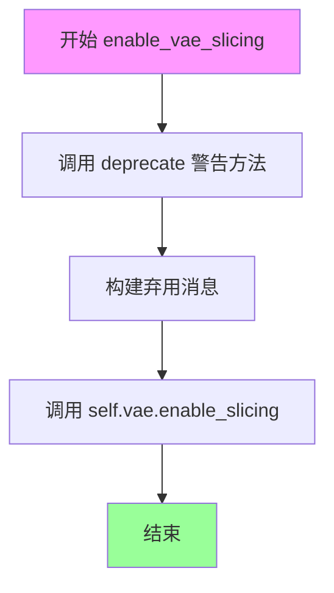

#### 带注释源码

```python
def enable_vae_slicing(self):
    r"""
    Enable sliced VAE decoding. When this option is enabled, the VAE will split the input tensor in slices to
    compute decoding in several steps. This is useful to save some memory and allow larger batch sizes.
    """
    # 构建弃用警告消息，提示用户该方法已弃用，应使用 pipe.vae.enable_slicing() 代替
    depr_message = f"Calling `enable_vae_slicing()` on a `{self.__class__.__name__}` is deprecated and this method will be removed in a future version. Please use `pipe.vae.enable_slicing()`."
    
    # 调用 deprecate 函数记录弃用警告
    deprecate(
        "enable_vae_slicing",      # 被弃用的方法名
        "0.40.0",                  # 弃用版本号
        depr_message,              # 弃用消息
    )
    
    # 实际调用 VAE 模型的 enable_slicing 方法来启用切片解码
    self.vae.enable_slicing()
```


### `Lumina2Pipeline.disable_vae_slicing`

该方法用于禁用 VAE 切片解码功能。如果之前启用了 `enable_vae_slicing`，调用此方法后将恢复为单步解码。该方法已被弃用，建议直接使用 `pipe.vae.disable_slicing()`。

参数： 无

返回值：`None`，无返回值

#### 流程图

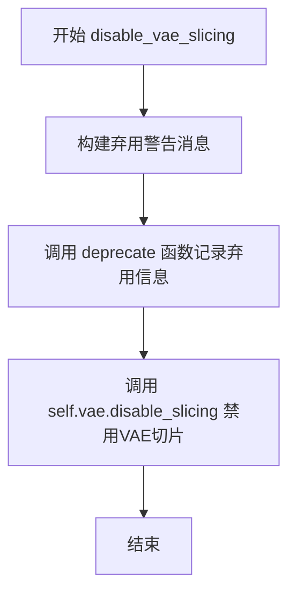

#### 带注释源码

```
def disable_vae_slicing(self):
    r"""
    Disable sliced VAE decoding. If `enable_vae_slicing` was previously enabled, this method will go back to
    computing decoding in one step.
    """
    # 构建弃用警告消息，提示用户该方法已弃用，应使用 pipe.vae.disable_slicing()
    depr_message = f"Calling `disable_vae_slicing()` on a `{self.__class__.__name__}` is deprecated and this method will be removed in a future version. Please use `pipe.vae.disable_slicing()`."
    
    # 调用 deprecate 函数记录弃用信息，版本号为 0.40.0
    deprecate(
        "disable_vae_slicing",
        "0.40.0",
        depr_message,
    )
    
    # 调用 VAE 模型的 disable_slicing 方法实际禁用切片功能
    self.vae.disable_slicing()
```


### `Lumina2Pipeline.enable_vae_tiling`

启用瓦片 VAE 解码。当启用此选项时，VAE 会将输入张量分割成瓦片，以多个步骤计算解码和编码。这对于节省大量内存和处理更大的图像非常有用。

参数：

- 该方法没有参数

返回值：`None`，无返回值

#### 流程图

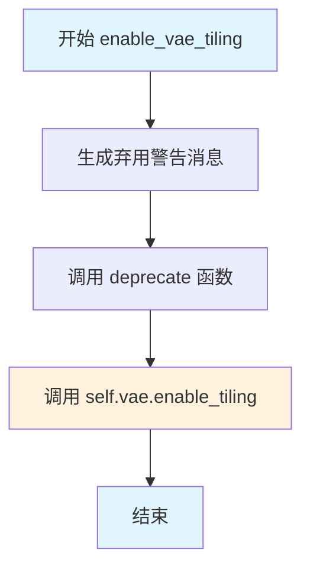

#### 带注释源码

```python
def enable_vae_tiling(self):
    r"""
    Enable tiled VAE decoding. When this option is enabled, the VAE will split the input tensor into tiles to
    compute decoding and encoding in several steps. This is useful for saving a large amount of memory and to allow
    processing larger images.
    """
    # 构建弃用警告消息，提示用户该方法将在未来版本中移除
    # 并建议使用 pipe.vae.enable_tiling() 代替
    depr_message = f"Calling `enable_vae_tiling()` on a `{self.__class__.__name__}` is deprecated and this method will be removed in a future version. Please use `pipe.vae.enable_tiling()`."
    
    # 调用 deprecate 函数记录弃用信息
    # 参数：方法名 "enable_vae_tiling"，弃用版本 "0.40.0"，警告消息
    deprecate(
        "enable_vae_tiling",
        "0.40.0",
        depr_message,
    )
    
    # 委托给底层 VAE 对象的 enable_tiling 方法
    # 这是实际启用瓦片解码功能的调用
    self.vae.enable_tiling()
```


### `Lumina2Pipeline.disable_vae_tiling`

该方法用于禁用VAE的分块解码功能（tiled VAE decoding）。如果之前启用了`enable_vae_tiling`，调用此方法后将回到单步解码模式。此方法已被弃用，建议直接使用`pipe.vae.disable_tiling()`。

参数： 无

返回值：`None`，无返回值，仅执行副作用操作

#### 流程图

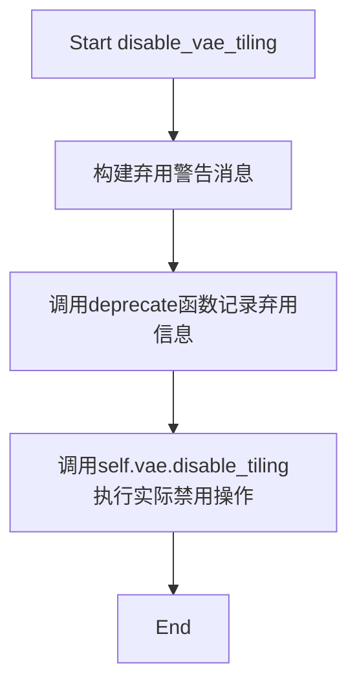

#### 带注释源码

```
def disable_vae_tiling(self):
    r"""
    Disable tiled VAE decoding. If `enable_vae_tiling` was previously enabled, this method will go back to
    computing decoding in one step.
    """
    # 构建弃用警告消息，提示用户使用新的API
    depr_message = f"Calling `disable_vae_tiling()` on a `{self.__class__.__name__}` is deprecated and this method will be removed in a future version. Please use `pipe.vae.disable_tiling()`."
    
    # 调用deprecate函数记录弃用信息，用于追踪迁移
    deprecate(
        "disable_vae_tiling",      # 被弃用的方法名
        "0.40.0",                  # 弃用版本号
        depr_message,              # 弃用警告消息
    )
    
    # 实际执行禁用VAE分块解码的操作
    # 委托给VAE模型本身的disable_tiling方法
    self.vae.disable_tiling()
```


### `Lumina2Pipeline.prepare_latents`

该方法用于准备图像生成的潜在向量（latents），根据批量大小、图像尺寸和VAE压缩比例计算潜在空间的形状，并使用随机张量或已有的潜在张量进行初始化。

参数：

- `batch_size`：`int`，批量大小，指定一次生成多少个样本
- `num_channels_latents`：`int`，潜在通道数，对应Transformer模型的输入通道数
- `height`：`int`，原始图像高度（像素），方法内部会将其转换为潜在空间高度
- `width`：`int`，原始图像宽度（像素），方法内部会将其转换为潜在空间宽度
- `dtype`：`torch.dtype`，生成张量的数据类型
- `device`：`torch.device`，生成张量的设备（CPU/CUDA）
- `generator`：`torch.Generator | list[torch.Generator] | None`，随机数生成器，用于确保可重复性
- `latents`：`torch.Tensor | None`，可选的预生成潜在张量，如果为None则随机生成

返回值：`torch.Tensor`，准备好的潜在张量，形状为 (batch_size, num_channels_latents, latent_height, latent_width)

#### 流程图

```mermaid
flowchart TD
    A[开始准备latents] --> B[计算潜在空间高度和宽度]
    B --> C{height = 2 * (int(height // (vae_scale_factor * 2)))}
    C --> D[计算shape = (batch_size, num_channels_latents, height, width)]
    D --> E{检查generator列表长度是否匹配batch_size}
    E -->|是| F{latents是否为None}
    E -->|否| G[抛出ValueError异常]
    F -->|是| H[使用randn_tensor生成随机latents]
    F -->|否| I[将latents移动到指定device]
    H --> J[返回latents张量]
    I --> J
```

#### 带注释源码

```python
def prepare_latents(
    self,
    batch_size: int,
    num_channels_latents: int,
    height: int,
    width: int,
    dtype: torch.dtype,
    device: torch.device,
    generator: torch.Generator | list[torch.Generator] | None,
    latents: torch.Tensor | None = None
) -> torch.Tensor:
    """
    准备用于去噪过程的潜在向量。
    
    VAE对图像应用8倍压缩，但还需要考虑packing操作，
    因此潜在空间的高度和宽度必须能被2整除。
    
    参数:
        batch_size: 批量大小
        num_channels_latents: 潜在通道数
        height: 原始图像高度
        width: 原始图像宽度
        dtype: 张量数据类型
        device: 计算设备
        generator: 随机数生成器
        latents: 可选的预生成潜在张量
    
    返回:
        准备好的潜在张量
    """
    # 计算潜在空间的尺寸
    # VAE应用8x压缩，但还需要考虑packing要求潜在高度和宽度能被2整除
    # vae_scale_factor = 8，所以实际除以 8*2 = 16
    height = 2 * (int(height) // (self.vae_scale_factor * 2))
    width = 2 * (int(width) // (self.vae_scale_factor * 2))

    # 确定潜在张量的形状
    shape = (batch_size, num_channels_latents, height, width)

    # 验证generator列表长度与batch_size是否匹配
    if isinstance(generator, list) and len(generator) != batch_size:
        raise ValueError(
            f"You have passed a list of generators of length {len(generator)}, but requested an effective batch"
            f" size of {batch_size}. Make sure the batch size matches the length of the generators."
        )

    # 如果未提供latents，则随机生成；否则使用提供的latents并移动到指定设备
    if latents is None:
        latents = randn_tensor(shape, generator=generator, device=device, dtype=dtype)
    else:
        latents = latents.to(device)

    return latents
```


### `Lumina2Pipeline.guidance_scale`

该属性是 `Lumina2Pipeline` 类中的一个只读属性（property），用于获取在图像生成过程中使用的引导比例（guidance scale）。引导比例控制无分类器自由引导（Classifier-Free Guidance, CFG）的强度，决定生成图像与文本提示的匹配程度。

参数：无（仅包含隐式参数 `self`）

返回值：`float`，返回当前设置的引导比例值

#### 流程图

```mermaid
flowchart TD
    A[获取 guidance_scale] --> B{检查 _guidance_scale 是否已设置}
    B -->|是| C[返回 self._guidance_scale]
    B -->|否| D[返回默认值或 None]
    
    C --> E[在去噪循环中用于计算 noise_pred]
    D --> E
    
    E --> F[noise_pred = noise_pred_uncond + guidance_scale × (noise_pred_cond - noise_pred_uncond)]
```

#### 带注释源码

```python
@property
def guidance_scale(self):
    """
    获取引导比例（guidance scale）属性。
    
    引导比例是用于无分类器自由引导（Classifier-Free Guidance）的权重参数，
    在扩散模型的推理过程中控制文本提示对生成图像的影响程度。
    
    该值在 __call__ 方法中被设置为参数 guidance_scale 的值（默认为 4.0）。
    当 guidance_scale > 1 时，启用分类器自由引导；
    当 guidance_scale <= 1 时，不启用引导。
    
    Returns:
        float: 当前使用的引导比例值
    """
    return self._guidance_scale
```

#### 关联信息

**设置来源**（在 `__call__` 方法中）：

```python
# 在 Lumina2Pipeline.__call__ 方法中
self._guidance_scale = guidance_scale  # guidance_scale 参数类型为 float，默认值为 4.0
```

**使用方式**（在去噪循环中）：

```python
# 当 do_classifier_free_guidance 为 True 时
noise_pred = noise_pred_uncond + guidance_scale * (noise_pred_cond - noise_pred_uncond)
```

**相关属性**：

- `do_classifier_free_guidance`：基于 `guidance_scale > 1` 的计算结果决定是否启用引导
- `_attention_kwargs`：另一个在 `__call__` 中通过 property 管理的配置参数


### `Lumina2Pipeline.attention_kwargs`

该属性是一个只读属性，用于获取在调用 `__call__` 方法时传入的注意力处理器（AttentionProcessor）关键字参数。这些参数会被传递给 Transformer 模型，以控制注意力机制的行为。

参数：无（属性方法不接收显式参数，`self` 除外）

返回值：`dict[str, Any] | None`，返回存储在实例中的注意力关键字参数字典，如果未设置则返回 `None`。

#### 流程图

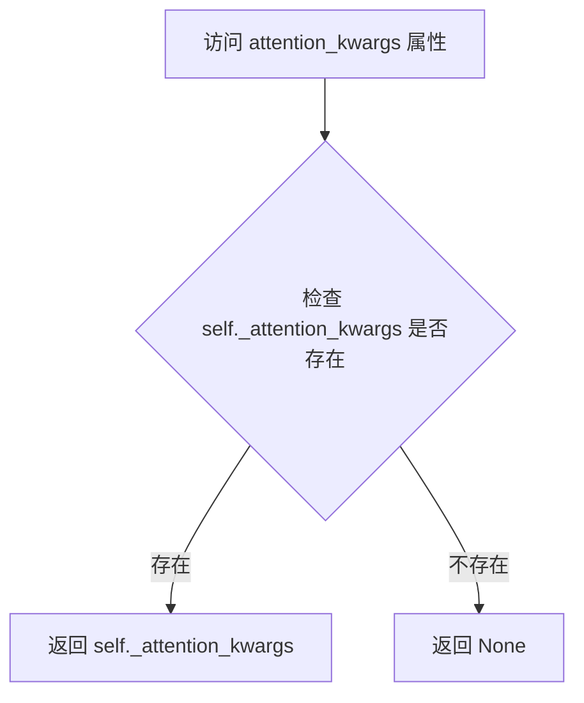

#### 带注释源码

```python
@property
def attention_kwargs(self):
    """
    属性方法：获取注意力关键字参数
    
    该属性返回在 pipeline 调用时设置的注意力处理器参数。
    这些参数会被传递给 Transformer 模型的注意力计算过程，
    允许用户自定义注意力机制的行为，例如注意力掩码、dropout 等。
    
    Returns:
        dict[str, Any] | None: 注意力关键字参数字典，如果未设置则返回 None
    """
    return self._attention_kwargs
```


### `Lumina2Pipeline.do_classifier_free_guidance`

该属性是一个只读属性，用于判断当前是否启用了Classifier-Free Guidance（CFG）引导技术。它通过比较内部的 `_guidance_scale` 参数值是否大于1来返回布尔值，决定是否在推理过程中同时执行条件和非条件噪声预测。

参数：

- （无参数，该属性不接受任何输入）

返回值：`bool`，返回 `True` 表示启用了Classifier-Free Guidance（`guidance_scale > 1`），返回 `False` 表示未启用（`guidance_scale <= 1`）

#### 流程图

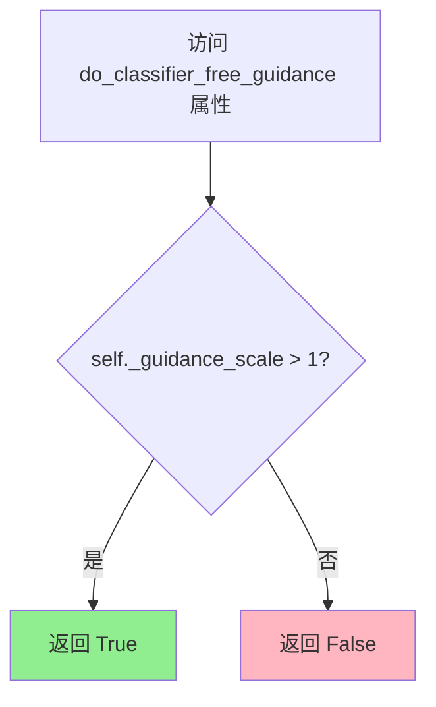

#### 带注释源码

```python
@property
def do_classifier_free_guidance(self):
    """
    属性：判断是否启用Classifier-Free Guidance
    
    该属性基于Imagen论文中的Classifier-Free Diffusion Guidance技术。
    当guidance_scale > 1时，模型会在推理时同时预测条件噪声（conditioned）
    和非条件噪声（unconditioned），然后通过加权组合来引导生成更符合文本描述的图像。
    
    guidance_scale = 1 等同于不使用引导，通常会导致生成质量下降。
    
    返回:
        bool: 如果 guidance_scale > 1 返回 True，否则返回 False
    """
    return self._guidance_scale > 1
```


### `Lumina2Pipeline.num_timesteps`

该属性是一个只读的属性 getter，用于返回在图像生成过程中实际使用的时间步数量。该值在 `__call__` 方法中被设置，取决于调度器返回的时间步长度。

参数： 无

返回值：`int`，返回推理过程中使用的时间步数量，通常等于 `len(timesteps)`。

#### 流程图

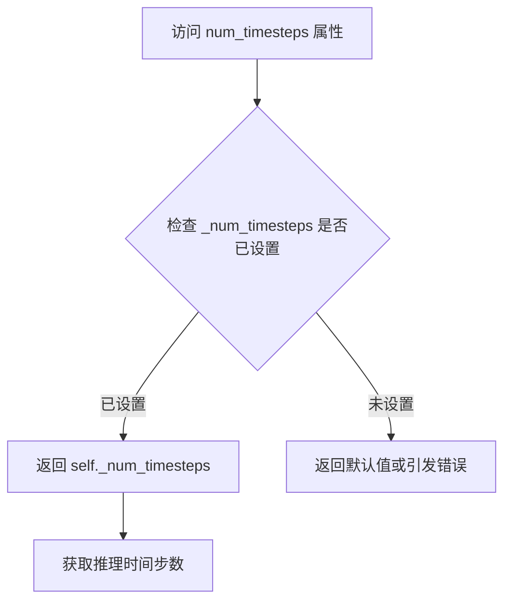

#### 带注释源码

```python
@property
def num_timesteps(self):
    """
    返回推理过程中使用的时间步数量。
    
    该属性是一个只读属性，用于获取在图像生成 pipeline 执行期间
    实际使用的时间步数量。该值在 __call__ 方法中通过以下代码设置：
    
        self._num_timesteps = len(timesteps)
    
    其中 timesteps 是从调度器（scheduler）获取的时间步序列。
    
    Returns:
        int: 推理过程中使用的时间步数量
    """
    return self._num_timesteps
```


### `Lumina2Pipeline.__call__`

该方法是Lumina2Pipeline的核心推理方法，负责根据文本提示生成图像。它通过编码提示、准备潜在变量、执行去噪循环（包含分类器自由引导和可选的CFG截断归一化），最后解码潜在变量得到最终图像。

参数：

- `prompt`：`str | list[str] | None`，用于引导图像生成的提示词，若未定义则必须提供prompt_embeds
- `negative_prompt`：`str | list[str] | None`，不用于引导图像生成的提示词，若未使用引导则忽略
- `num_inference_steps`：`int`，默认值30，去噪步骤数，更多步骤通常能获得更高质量的图像但推理速度更慢
- `sigmas`：`list[float] | None`，用于支持sigmas参数调度器的自定义sigma值
- `guidance_scale`：`float`，默认值4.0，分类器自由扩散引导比例，类似于Imagen论文中的w参数
- `num_images_per_prompt`：`int`，默认值1，每个提示词生成的图像数量
- `height`：`int | None`，生成图像的高度（像素），默认为self.default_sample_size * self.vae_scale_factor
- `width`：`int | None`，生成图像的宽度（像素），默认为self.default_sample_size * self.vae_scale_factor
- `generator`：`torch.Generator | list[torch.Generator] | None`，用于生成确定性结果的随机数生成器
- `latents`：`torch.Tensor | None`，预生成的噪声潜在变量，若未提供则使用随机generator生成
- `prompt_embeds`：`torch.Tensor | None`，预生成的文本嵌入，可用于轻松调整文本输入
- `prompt_attention_mask`：`torch.Tensor | None`，文本嵌入的预生成注意力掩码
- `negative_prompt_embeds`：`torch.Tensor | None`，预生成的负面文本嵌入
- `negative_prompt_attention_mask`：`torch.Tensor | None`，负面文本嵌入的预生成注意力掩码
- `output_type`：`str | None`，默认值"pil"，生成图像的输出格式，可选PIL.Image.Image或np.array
- `return_dict`：`bool`，默认值True，是否返回ImagePipelineOutput而不是元组
- `attention_kwargs`：`dict[str, Any] | None`，传递给AttentionProcessor的参数字典
- `callback_on_step_end`：`Callable[[int, int], None] | None`，每个去噪步骤结束时调用的函数
- `callback_on_step_end_tensor_inputs`：`list[str]`，默认值["latents"]，callback_on_step_end函数的张量输入列表
- `system_prompt`：`str | None`，用于图像生成的系统提示词
- `cfg_trunc_ratio`：`float`，默认值1.0，应用归一化引导比例的时间步长间隔比例
- `cfg_normalization`：`bool`，默认值True，是否应用基于归一化的引导比例
- `max_sequence_length`：`int`，默认值256，与prompt一起使用的最大序列长度

返回值：`ImagePipelineOutput | tuple`，若return_dict为True返回ImagePipelineOutput，否则返回包含生成图像列表的元组

#### 流程图

```mermaid
flowchart TD
    A[开始 __call__] --> B[设置默认宽高<br/>height/width]
    B --> C[设置引导比例和注意力参数<br/>_guidance_scale/_attention_kwargs]
    C --> D[检查输入参数<br/>check_inputs]
    D --> E[确定批次大小<br/>batch_size]
    E --> F[编码输入提示<br/>encode_prompt]
    F --> G[准备潜在变量<br/>prepare_latents]
    G --> H[计算时间步长偏移mu<br/>calculate_shift]
    H --> I[获取调度器时间步长<br/>retrieve_timesteps]
    I --> J[初始化进度条和去噪循环]
    J --> K{遍历每个时间步}
    K -->|计算| L[计算当前时间步<br/>current_timestep]
    L --> M[Transformer前向传播<br/>条件预测 noise_pred_cond]
    M --> N{执行分类器自由引导<br/>且非截断时间步?}
    N -->|Yes| O[Transformer前向传播<br/>无条件预测 noise_pred_uncond]
    O --> P[CFG组合预测<br/>noise_pred = noise_pred_uncond + guidance_scale * (noise_pred_cond - noise_pred_uncond)]
    P --> Q{启用CFG归一化?}
    Q -->|Yes| R[归一化噪声预测<br/>noise_pred = noise_pred * (cond_norm / noise_norm)]
    Q -->|No| S[跳过归一化]
    N -->|No| T[直接使用条件预测]
    R --> U[调度器步骤更新潜在变量<br/>scheduler.step]
    T --> U
    S --> U
    U --> V{执行回调函数<br/>callback_on_step_end?]
    V -->|Yes| W[调用回调并更新潜在变量]
    V -->|No| X[更新进度条]
    W --> X
    X --> Y{是否最后一步或需要更新?}
    Y -->|Yes| Z[进度条更新]
    Y -->|No| AA[继续下一时间步]
    Z --> K
    AA --> K
    K -->|循环结束| AB{output_type != 'latent'?}
    AB -->|Yes| AC[VAE解码<br/>latents → image]
    AB -->|No| AD[直接返回latents]
    AC --> AE[后处理图像<br/>postprocess]
    AE --> AF[释放模型钩子<br/>maybe_free_model_hooks]
    AD --> AF
    AF --> AG{return_dict?}
    AG -->|Yes| AH[返回ImagePipelineOutput]
    AG -->|No| AI[返回元组 (image,)]
```

#### 带注释源码

```python
@torch.no_grad()
@replace_example_docstring(EXAMPLE_DOC_STRING)
def __call__(
    self,
    prompt: str | list[str] = None,
    width: int | None = None,
    height: int | None = None,
    num_inference_steps: int = 30,
    guidance_scale: float = 4.0,
    negative_prompt: str | list[str] = None,
    sigmas: list[float] = None,
    num_images_per_prompt: int | None = 1,
    generator: torch.Generator | list[torch.Generator] | None = None,
    latents: torch.Tensor | None = None,
    prompt_embeds: torch.Tensor | None = None,
    negative_prompt_embeds: torch.Tensor | None = None,
    prompt_attention_mask: torch.Tensor | None = None,
    negative_prompt_attention_mask: torch.Tensor | None = None,
    output_type: str | None = "pil",
    return_dict: bool = True,
    attention_kwargs: dict[str, Any] | None = None,
    callback_on_step_end: Callable[[int, int], None] | None = None,
    callback_on_step_end_tensor_inputs: list[str] = ["latents"],
    system_prompt: str | None = None,
    cfg_trunc_ratio: float = 1.0,
    cfg_normalization: bool = True,
    max_sequence_length: int = 256,
) -> ImagePipelineOutput | tuple:
    """
    Function invoked when calling the pipeline for generation.

    Args:
        prompt: The prompt or prompts to guide the image generation.
        negative_prompt: The prompt or prompts not to guide the image generation.
        num_inference_steps: The number of denoising steps.
        sigmas: Custom sigmas to use for the denoising process.
        guidance_scale: Guidance scale as defined in Classifier-Free Diffusion Guidance.
        num_images_per_prompt: The number of images to generate per prompt.
        height: The height in pixels of the generated image.
        width: The width in pixels of the generated image.
        generator: One or a list of torch generator(s) to make generation deterministic.
        latents: Pre-generated noisy latents.
        prompt_embeds: Pre-generated text embeddings.
        prompt_attention_mask: Pre-generated attention mask for text embeddings.
        negative_prompt_embeds: Pre-generated negative text embeddings.
        negative_prompt_attention_mask: Pre-generated attention mask for negative text embeddings.
        output_type: The output format of the generate image.
        return_dict: Whether or not to return a ImagePipelineOutput instead of a plain tuple.
        attention_kwargs: A kwargs dictionary passed along to the AttentionProcessor.
        callback_on_step_end: A function that calls at the end of each denoising steps.
        callback_on_step_end_tensor_inputs: The list of tensor inputs for the callback function.
        system_prompt: The system prompt to use for the image generation.
        cfg_trunc_ratio: The ratio of the timestep interval to apply normalization-based guidance scale.
        cfg_normalization: Whether to apply normalization-based guidance scale.
        max_sequence_length: Maximum sequence length to use with the prompt.

    Returns:
        ImagePipelineOutput or tuple: If return_dict is True, ImagePipelineOutput is returned, 
        otherwise a tuple is returned where the first element is a list with the generated images.
    """
    # 1. 设置默认高度和宽度（如果未提供）
    # VAE的缩放因子为8，所以默认图像大小为 default_sample_size * vae_scale_factor
    height = height or self.default_sample_size * self.vae_scale_factor
    width = width or self.default_sample_size * self.vae_scale_factor
    
    # 保存引导比例和注意力参数到实例变量，供后续使用
    self._guidance_scale = guidance_scale
    self._attention_kwargs = attention_kwargs

    # 2. 检查输入参数，验证参数合法性和一致性
    self.check_inputs(
        prompt,
        height,
        width,
        negative_prompt,
        prompt_embeds=prompt_embeds,
        negative_prompt_embeds=negative_prompt_embeds,
        prompt_attention_mask=prompt_attention_mask,
        negative_prompt_attention_mask=negative_prompt_attention_mask,
        max_sequence_length=max_sequence_length,
        callback_on_step_end_tensor_inputs=callback_on_step_end_tensor_inputs,
    )

    # 3. 确定批次大小
    # 根据prompt类型或已提供的prompt_embeds形状确定批次大小
    if prompt is not None and isinstance(prompt, str):
        batch_size = 1
    elif prompt is not None and isinstance(prompt, list):
        batch_size = len(prompt)
    else:
        batch_size = prompt_embeds.shape[0]

    # 获取执行设备（CPU/CUDA/XLA等）
    device = self._execution_device

    # 4. 编码输入提示词
    # 将文本prompt转换为文本嵌入向量，供transformer使用
    (
        prompt_embeds,
        prompt_attention_mask,
        negative_prompt_embeds,
        negative_prompt_attention_mask,
    ) = self.encode_prompt(
        prompt,
        self.do_classifier_free_guidance,
        negative_prompt=negative_prompt,
        num_images_per_prompt=num_images_per_prompt,
        device=device,
        prompt_embeds=prompt_embeds,
        negative_prompt_embeds=negative_prompt_embeds,
        prompt_attention_mask=prompt_attention_mask,
        negative_prompt_attention_mask=negative_prompt_attention_mask,
        max_sequence_length=max_sequence_length,
        system_prompt=system_prompt,
    )

    # 5. 准备潜在变量
    # 初始化噪声潜在变量，作为去噪过程的起点
    latent_channels = self.transformer.config.in_channels
    latents = self.prepare_latents(
        batch_size * num_images_per_prompt,
        latent_channels,
        height,
        width,
        prompt_embeds.dtype,
        device,
        generator,
        latents,
    )

    # 6. 准备时间步长
    # 如果未提供sigmas，则生成线性间隔的sigma序列
    sigmas = np.linspace(1.0, 1 / num_inference_steps, num_inference_steps) if sigmas is None else sigmas
    
    # 计算图像序列长度，用于调整噪声调度
    image_seq_len = latents.shape[1]
    mu = calculate_shift(
        image_seq_len,
        self.scheduler.config.get("base_image_seq_len", 256),
        self.scheduler.config.get("max_image_seq_len", 4096),
        self.scheduler.config.get("base_shift", 0.5),
        self.scheduler.config.get("max_shift", 1.15),
    )
    
    # 确定时间步设备（XLA可用时使用CPU）
    if XLA_AVAILABLE:
        timestep_device = "cpu"
    else:
        timestep_device = device
    
    # 从调度器获取时间步序列
    timesteps, num_inference_steps = retrieve_timesteps(
        self.scheduler,
        num_inference_steps,
        timestep_device,
        sigmas=sigmas,
        mu=mu,
    )
    
    # 计算预热步数（跳过前几个不更新进度的步骤）
    num_warmup_steps = max(len(timesteps) - num_inference_steps * self.scheduler.order, 0)
    self._num_timesteps = len(timesteps)

    # 7. 去噪循环
    # 逐步从噪声图像去噪到清晰图像
    with self.progress_bar(total=num_inference_steps) as progress_bar:
        for i, t in enumerate(timesteps):
            # 计算当前时间步是否执行分类器自由截断
            # 根据cfg_trunc_ratio确定是否在引导后期应用截断
            do_classifier_free_truncation = (i + 1) / num_inference_steps > cfg_trunc_ratio
            
            # 反转时间步：Lumina使用t=0表示噪声，t=1表示图像
            current_timestep = 1 - t / self.scheduler.config.num_train_timesteps
            
            # 广播到批次维度，兼容ONNX/Core ML
            current_timestep = current_timestep.expand(latents.shape[0])

            # Transformer前向传播：条件预测
            # 使用提示词嵌入预测噪声
            noise_pred_cond = self.transformer(
                hidden_states=latents,
                timestep=current_timestep,
                encoder_hidden_states=prompt_embeds,
                encoder_attention_mask=prompt_attention_mask,
                return_dict=False,
                attention_kwargs=self.attention_kwargs,
            )[0]

            # 执行分类器自由引导（CFG）
            # 在非截断时间步执行完整CFG
            if self.do_classifier_free_guidance and not do_classifier_free_truncation:
                # 无条件预测：使用空提示词嵌入
                noise_pred_uncond = self.transformer(
                    hidden_states=latents,
                    timestep=current_timestep,
                    encoder_hidden_states=negative_prompt_embeds,
                    encoder_attention_mask=negative_prompt_attention_mask,
                    return_dict=False,
                    attention_kwargs=self.attention_kwargs,
                )[0]
                
                # CFG组合：uncond + scale * (cond - uncond)
                noise_pred = noise_pred_uncond + guidance_scale * (noise_pred_cond - noise_pred_uncond)
                
                # 可选的CFG后归一化
                if cfg_normalization:
                    cond_norm = torch.norm(noise_pred_cond, dim=-1, keepdim=True)
                    noise_norm = torch.norm(noise_pred, dim=-1, keepdim=True)
                    noise_pred = noise_pred * (cond_norm / noise_norm)
            else:
                # 截断时间步或未启用CFG时，直接使用条件预测
                noise_pred = noise_pred_cond

            # 计算前一个噪声样本：x_t -> x_t-1
            # 调度器根据预测的噪声更新潜在变量
            latents_dtype = latents.dtype
            noise_pred = -noise_pred  # 取反因为Lumina使用相反的噪声预测约定
            latents = self.scheduler.step(noise_pred, t, latents, return_dict=False)[0]

            # 类型检查和转换（处理MPS平台的bug）
            if latents.dtype != latents_dtype:
                if torch.backends.mps.is_available():
                    latents = latents.to(latents_dtype)

            # 步骤结束回调
            if callback_on_step_end is not None:
                callback_kwargs = {}
                for k in callback_on_step_end_tensor_inputs:
                    callback_kwargs[k] = locals()[k]
                callback_outputs = callback_on_step_end(self, i, t, callback_kwargs)

                # 允许回调修改潜在变量和提示词嵌入
                latents = callback_outputs.pop("latents", latents)
                prompt_embeds = callback_outputs.pop("prompt_embeds", prompt_embeds)

            # 进度条更新：最后一步或预热后每order步更新
            if i == len(timesteps) - 1 or ((i + 1) > num_warmup_steps and (i + 1) % self.scheduler.order == 0):
                progress_bar.update()

            # XLA设备标记步骤结束
            if XLA_AVAILABLE:
                xm.mark_step()

    # 8. 后处理
    # 如果不需要潜在向量输出，则解码潜在变量到图像
    if not output_type == "latent":
        # 反缩放潜在变量
        latents = (latents / self.vae.config.scaling_factor) + self.vae.config.shift_factor
        # VAE解码：潜在向量 -> 图像
        image = self.vae.decode(latents, return_dict=False)[0]
        # 后处理：转换为指定输出格式（PIL/numpy/torch）
        image = self.image_processor.postprocess(image, output_type=output_type)
    else:
        # 直接返回潜在向量
        image = latents

    # 9. 释放模型钩子
    # 卸载所有模型以释放GPU内存
    self.maybe_free_model_hooks()

    # 10. 返回结果
    if not return_dict:
        return (image,)

    return ImagePipelineOutput(images=image)
```


### `Lumina2Text2ImgPipeline.__init__`

该方法是 `Lumina2Text2ImgPipeline` 类的构造函数，用于初始化文本到图像生成管道。它主要用于向后兼容，已被重命名为 `Lumina2Pipeline`。构造函数接收预训练模型组件（transformer、scheduler、vae、text_encoder、tokenizer），并调用父类构造函数完成初始化，同时发出弃用警告。

参数：

- `transformer`：`Lumina2Transformer2DModel`，用于去噪图像潜在表示的文本条件 Transformer 模型
- `scheduler`：`FlowMatchEulerDiscreteScheduler`，与 transformer 结合使用以去噪图像潜在表示的调度器
- `vae`：`AutoencoderKL`，变分自编码器模型，用于将图像编码和解码为潜在表示
- `text_encoder`：`Gemma2PreTrainedModel`，冻结的 Gemma2 文本编码器
- `tokenizer`：`GemmaTokenizer | GemmaTokenizerFast`，Gemma 分词器

返回值：`None`，无返回值（构造函数）

#### 流程图

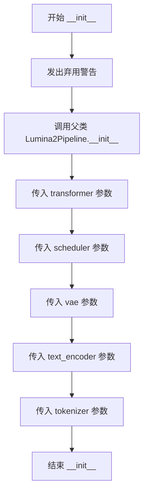

#### 带注释源码

```python
def __init__(
    self,
    transformer: Lumina2Transformer2DModel,
    scheduler: FlowMatchEulerDiscreteScheduler,
    vae: AutoencoderKL,
    text_encoder: Gemma2PreTrainedModel,
    tokenizer: GemmaTokenizer | GemmaTokenizerFast,
):
    """
    初始化 Lumina2Text2ImgPipeline 管道。
    
    注意：此类已被弃用，建议使用 Lumina2Pipeline 替代。
    由于继承自 Lumina2Pipeline，其功能完全相同。
    
    参数:
        transformer: Lumina2Transformer2DModel 实例，用于图像去噪
        scheduler: FlowMatchEulerDiscreteScheduler 实例，用于调度去噪步骤
        vae: AutoencoderKL 实例，用于图像编码/解码
        text_encoder: Gemma2PreTrainedModel 实例，用于文本编码
        tokenizer: GemmaTokenizer 或 GemmaTokenizerFast 实例，用于分词
    """
    # 构建弃用警告消息，提示用户使用新类名
    deprecation_message = "`Lumina2Text2ImgPipeline` has been renamed to `Lumina2Pipeline` and will be removed in a future version. Please use `Lumina2Pipeline` instead."
    
    # 调用 diffusers 库的弃用函数，显示警告信息
    deprecate("diffusers.pipelines.lumina2.pipeline_lumina2.Lumina2Text2ImgPipeline", "0.34", deprecation_message)
    
    # 调用父类 Lumina2Pipeline 的构造函数，传递所有模型组件
    # 父类会通过 register_modules 方法注册这些组件
    super().__init__(
        transformer=transformer,
        scheduler=scheduler,
        vae=vae,
        text_encoder=text_encoder,
        tokenizer=tokenizer,
    )
```

## 关键组件


### Lumina2Pipeline

核心扩散管道类，负责将文本提示转换为图像。集成了Transformer模型、VAE解码器、文本编码器和调度器，实现了完整的文本到图像生成流程。

### Transformer (Lumina2Transformer2DModel)

用于去噪的Transformer模型，接收潜在向量、时间步和文本嵌入作为输入，预测噪声。

### VAE (AutoencoderKL)

变分自编码器，用于将潜在向量解码为图像。支持切片和平铺优化以处理高分辨率图像。

### 文本编码器 (Gemma2PreTrainedModel)

Gemma2预训练文本编码器，将文本提示转换为文本嵌入向量，供Transformer使用。

### FlowMatchEulerDiscreteScheduler

调度器，使用Flow Match Euler离散方法进行去噪。支持自定义时间步和sigmas参数。

### calculate_shift

计算图像序列长度的偏移量，用于调整调度器的base_shift和max_shift参数，以适应不同的图像分辨率。

### retrieve_timesteps

检索并设置调度器的时间步。支持自定义时间步和sigmas，验证调度器是否支持相应参数。

### _get_gemma_prompt_embeds

使用Gemma tokenizer和text_encoder获取提示的嵌入向量和注意力掩码，处理序列截断警告。

### encode_prompt

编码输入提示为文本嵌入，支持分类器自由引导（CFG）。处理正向提示和负向提示的嵌入，以及相应的注意力掩码。

### prepare_latents

准备初始潜在向量，根据VAE的缩放因子调整高度和宽度，使用randn_tensor生成随机潜在向量。

### __call__

管道的主方法，执行完整的去噪循环。包含输入检查、提示编码、潜在向量准备、时间步计算、去噪迭代、VAE解码等步骤。

### check_inputs

验证输入参数的有效性，包括高度/宽度 divisibility、回调张量输入、提示和嵌入的一致性检查。

### 分类器自由引导 (CFG) 实现

在去噪循环中根据guidance_scale和cfg_trunc_ratio执行正向和负向预测，支持CFG截断和归一化。

### VAE优化方法

enable_vae_slicing、disable_vae_slicing、enable_vae_tiling、disable_vae_tiling用于启用/禁用VAE的切片和平铺解码优化。

### 回调机制

callback_on_step_end和callback_on_step_end_tensor_inputs支持在每个去噪步骤后执行自定义回调函数。

### Lumina2Text2ImgPipeline

已弃用的管道别名，继承自Lumina2Pipeline，用于向后兼容。


## 问题及建议


### 已知问题

- **硬编码的系统提示**：类中硬编码了 `self.system_prompt`，缺乏灵活性，无法在不修改代码的情况下自定义系统提示
- **重复代码逻辑**：`encode_prompt` 方法中处理 `negative_prompt_embeds` 的逻辑与正向提示高度重复，可提取为通用方法
- **未使用的参数**：`__call__` 方法中定义了 `eta` 参数但从未使用，导致接口冗余
- **运算符优先级风险**：`current_timestep = 1 - t / self.scheduler.config.num_train_timesteps` 存在潜在优先级问题，应加括号明确意图
- **设备处理不一致**：部分使用 `device` 参数，部分使用 `self._execution_device`，增加了维护成本
- **重复的 tensor 复制操作**：`prompt_embeds.repeat().view()` 执行了多次不必要的 tensor 重塑，可能影响性能
- **缺失类型注解**：部分方法如 `_get_gemma_prompt_embeds` 缺少完整的类型注解

### 优化建议

- 将 `system_prompt` 改为可选参数，允许用户在调用时传入自定义系统提示
- 提取 `encode_prompt` 中处理 negative prompt 的逻辑为独立方法或使用循环优化
- 移除 `eta` 参数或将其添加到 `prepare_extra_step_kwargs` 中实现实际功能
- 明确使用括号 `(1 - t) / self.scheduler.config.num_train_timesteps` 确保计算正确性
- 统一设备管理逻辑，建立明确的设备参数传递规范
- 使用 `torch.repeat_interleave` 替代 `repeat().view()` 方式，提高代码可读性和性能
- 完善类型注解，增强代码可维护性和 IDE 支持

## 其它


### 设计目标与约束

**设计目标：**
- 实现高质量的文本到图像生成功能，基于Lumina-T2I模型架构
- 支持分类器自由引导（Classifier-Free Guidance）以提升图像与文本的对齐度
- 提供灵活的超参数配置，支持自定义推理步骤、引导尺度、采样器等
- 优化内存使用，支持模型CPU卸载、VAE切片和瓦片解码等优化技术

**约束：**
- 高度和宽度必须能被`vae_scale_factor * 2`（即16）整除
- `max_sequence_length`不能超过512个token
- 必须使用支持`set_timesteps`方法的调度器
- 当使用`sigmas`时，不能同时使用`timesteps`和`num_inference_steps`

---

### 错误处理与异常设计

**输入验证：**
- `check_inputs`方法全面验证所有输入参数，包括高度/宽度 divisibility、prompt类型、embeddings维度匹配、callback tensor inputs合法性
- 明确区分不同类型的错误：ValueError用于参数不合法的情况，TypeError用于类型不匹配的情况

**异常处理策略：**
- 调度器参数检查：通过`inspect.signature`动态检查调度器是否支持特定参数（如eta、generator、sigmas）
- Tokenizer截断警告：当Gemma tokenizer超出最大序列长度时，记录warning并截断
- 设备兼容性：针对MPS设备的特殊处理，避免类型转换导致的错误
- XLA支持：条件导入torch_xla，优雅处理TPU设备

**弃用管理：**
- 使用`deprecate`函数标记弃用的方法（如`enable_vae_slicing`等），明确废弃版本号

---

### 数据流与状态机

**主生成流程：**
1. **输入阶段**：接收prompt、negative_prompt、各种超参数
2. **编码阶段**：通过text_encoder将文本编码为embeddings和attention mask
3. **潜在向量准备**：初始化随机潜在向量或使用提供的latents
4. **时间步准备**：根据调度器配置计算时间步序列
5. **去噪循环**：迭代执行以下步骤：
   - 计算当前条件噪声预测
   - （可选）计算无分类器自由引导
   - 应用CFG截断和归一化
   - 调度器步进更新latents
6. **解码阶段**：VAE解码latents到图像
7. **后处理**：图像格式转换和归一化

**状态管理：**
- `_guidance_scale`、`_attention_kwargs`、`_num_timesteps`作为内部状态
- 调度器内部维护timesteps、sigma等状态
- 通过property封装状态访问

---

### 外部依赖与接口契约

**核心依赖：**
- `transformers`: Gemma2PreTrainedModel、GemmaTokenizer、GemmaTokenizerFast
- `diffusers`: DiffusionPipeline、VaeImageProcessor、AutoencoderKL、FlowMatchEulerDiscreteScheduler
- `torch`: 核心计算框架
- `numpy`: 数值计算
- `torch_xla`（可选）：TPU支持

**模块间接口：**
- `Lumina2LoraLoaderMixin`：LoRA加载混入类
- `VaeImageProcessor`：VAE图像处理
- `DiffusionPipeline`：基础管道类
- `ImagePipelineOutput`：输出格式定义
- `randn_tensor`：随机张量生成工具

**模型组件契约：**
- `transformer`：必须实现`__call__`方法，接受hidden_states、timestep、encoder_hidden_states等参数
- `vae`：必须实现`decode`方法，支持scaling_factor和shift_factor配置
- `scheduler`：必须实现`set_timesteps`和`step`方法

---

### 性能考虑

**内存优化：**
- 模型CPU卸载支持（`enable_model_cpu_offload`）
- VAE切片解码（`enable_vae_slicing`）
- VAE瓦片编码/解码（`enable_vae_tiling`）
- 梯度禁用（`@torch.no_grad()`）

**计算优化：**
- 支持批量生成多个图像（`num_images_per_prompt`）
- XLA JIT编译支持（`xm.mark_step`）
- 潜在向量dtype一致性检查和转换
- 条件张量广播优化

**推理速度：**
- 默认30步推理，可通过`num_inference_steps`调整
- 支持自定义sigmas跳过调度器默认计算
- 提前warmup步数最小化

---

### 安全性考虑

**输入安全：**
- prompt_embeds和negative_prompt_embeds必须成对提供attention_mask
- 系统提示词默认预设为安全内容
- 支持空negative_prompt（等效于无条件生成）

**模型安全：**
- 支持classifier-free guidance防止模型直接复制训练数据
- CFG截断（`cfg_trunc_ratio`）和归一化（`cfg_normalization`）提供额外控制

---

### 配置管理

**管道配置：**
- `vae_scale_factor`: 8（VAE压缩比）
- `default_sample_size`: 从transformer配置读取，默认为128
- `default_image_size`: 1024（128 * 8）
- `system_prompt`: 默认系统提示词
- `model_cpu_offload_seq`: "text_encoder->transformer->vae"

**调度器配置：**
- 通过`scheduler.config`获取base_image_seq_len、max_image_seq_len、base_shift、max_shift、num_train_timesteps

**运行时配置：**
- 通过`attention_kwargs`传递注意力处理器参数
- 通过`prepare_extra_step_kwargs`动态准备调度器额外参数

---

### 版本兼容性

**依赖版本要求：**
- diffusers库版本需支持0.34+的API
- transformers库需支持Gemma2模型
- PyTorch版本需支持所需的所有操作

**API演进：**
- `Lumina2Text2ImgPipeline`已标记为弃用，建议使用`Lumina2Pipeline`
- VAE slicing/tilting方法标记为0.40.0弃用，建议直接调用vae的对应方法

---

### 资源管理

**模型资源：**
- 生命周期由DiffusionPipeline基类管理
- 通过`maybe_free_model_hooks()`在生成完成后卸载模型

**显存管理：**
- 中间张量及时释放
- dtype转换最小化
- MPS设备特殊处理

**计算资源：**
- 支持传入torch.Generator实现确定性生成
- 支持批量生成多个图像

---

### 可扩展性与未来改进

**扩展方向：**
- 图像到图像（Img2Img）支持：通过添加`image`参数和相应处理逻辑
- 图像修复（Inpainting）支持：添加mask处理
- ControlNet支持：添加额外条件输入
- 多模态提示：支持更复杂的提示结构

**优化空间：**
- 量化推理支持（INT8/INT4）
- 编译优化（torch.compile）
- 分布式推理支持
- 更高效的调度器实现

---

### 测试与验证

**单元测试要点：**
- `check_inputs`的各种错误场景
- `encode_prompt`的embeds形状
- `prepare_latents`的形状计算
- 调度器集成

**集成测试：**
- 端到端图像生成
- 模型加载和保存
- CPU/GPU设备兼容性


    