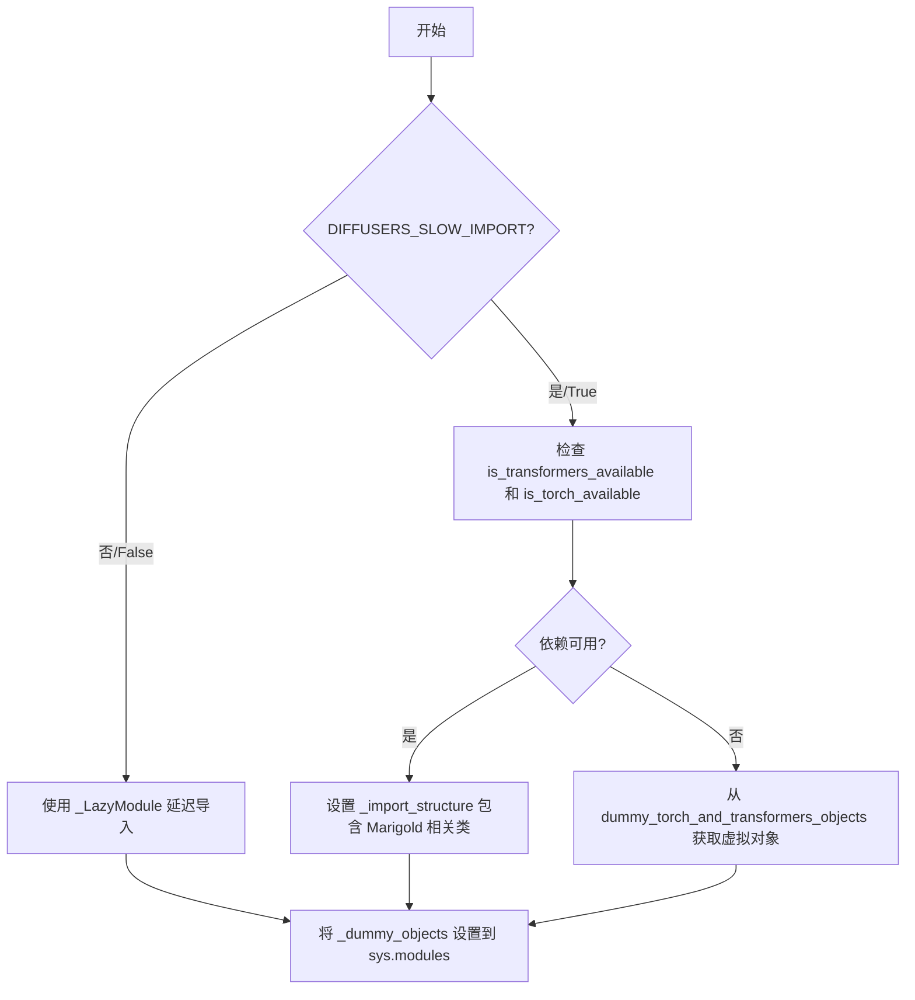
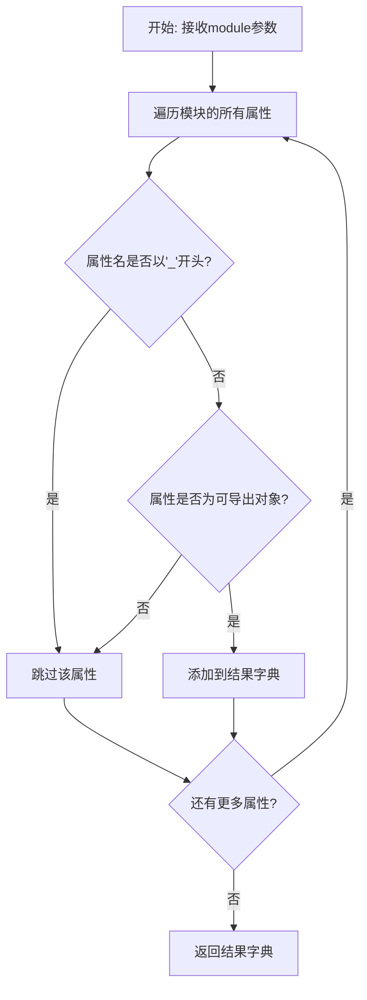
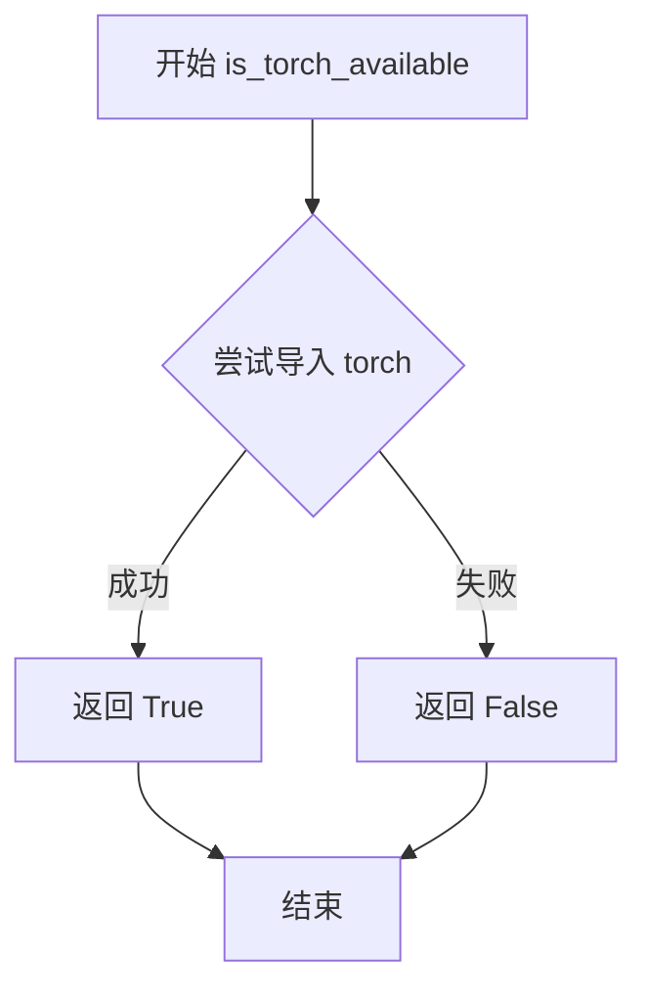
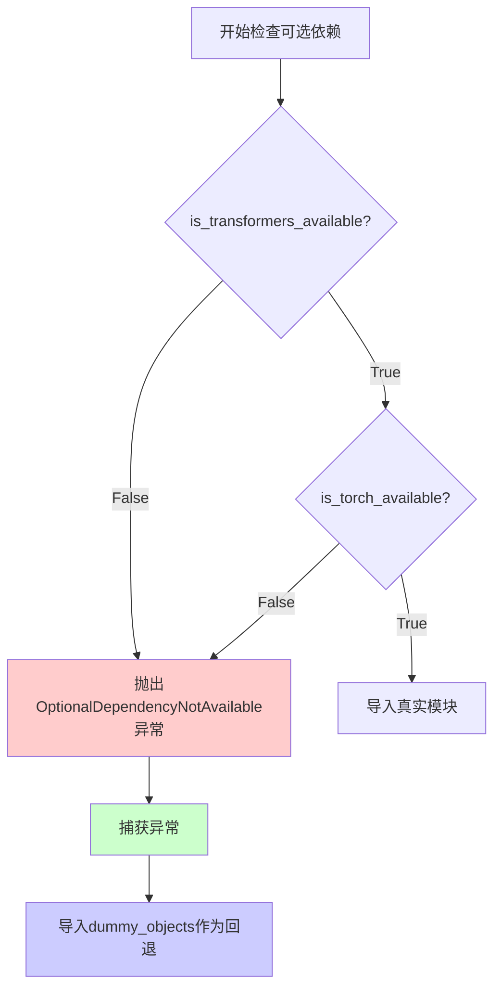

# `diffusers\src\diffusers\pipelines\marigold\__init__.py` 详细设计文档

这是 Diffusers 库中 Marigold 模型的管道初始化模块，通过延迟导入机制处理可选依赖（torch 和 transformers），在依赖不可用时提供虚拟对象，确保模块导入的兼容性。

## 整体流程



## 类结构

```
Marigold Pipeline Package
├── marigold_image_processing (MarigoldImageProcessor)
├── pipeline_marigold_depth (MarigoldDepthOutput, MarigoldDepthPipeline)
├── pipeline_marigold_intrinsics (MarigoldIntrinsicsOutput, MarigoldIntrinsicsPipeline)
└── pipeline_marigold_normals (MarigoldNormalsOutput, MarigoldNormalsPipeline)
```

## 全局变量及字段


### `_dummy_objects`
    
用于存储虚拟对象的字典，当可选依赖（torch和transformers）不可用时，提供替代对象以保持模块导入一致性

类型：`Dict[str, Any]`
    


### `_import_structure`
    
定义模块的导入结构，映射子模块名到可导出的类名列表，用于LazyModule的动态导入机制

类型：`Dict[str, List[str]]`
    


    

## 全局函数及方法


### `get_objects_from_module`

从模块中提取所有可导入对象（类、函数等），生成一个字典，键为对象名称，值为对象本身。主要用于延迟加载（lazy loading）机制，在依赖不可用时创建虚拟对象占位。

参数：

-  `module`：`module`，输入的模块对象，从中提取所有非下划线开头的成员

返回值：`Dict[str, Any]`，返回字典，键为对象名称（字符串），值为对应的对象（类、函数等）

#### 流程图



#### 带注释源码

```python
def get_objects_from_module(module):
    """
    从给定模块中提取所有可导出对象。
    
    参数:
        module: Python模块对象
        
    返回:
        包含模块中所有公开对象的字典，键为对象名称
    """
    # 初始化结果字典
    result = {}
    
    # 遍历模块的所有属性
    for attr_name in dir(module):
        # 跳过私有属性（下划线开头的属性）
        if attr_name.startswith('_'):
            continue
        
        # 获取属性值
        attr_value = getattr(module, attr_name)
        
        # 添加到结果字典
        result[attr_name] = attr_value
    
    return result
```

> **注**：上述源码为根据函数使用方式推断的实现。实际定义位于 `diffusers/src/diffusers/utils` 中。该函数在给定代码中用于在可选依赖不可用时，从 `dummy_torch_and_transformers_objects` 模块中获取虚拟对象占位符，确保模块导入不失败。


### `is_torch_available`

该函数是 diffusers 库中的工具函数，用于检查当前环境中 PyTorch 是否可用。它通过尝试导入 torch 模块来判断，返回布尔值。

参数：无

返回值：`bool`，如果 PyTorch 可用返回 `True`，否则返回 `False`

#### 流程图



#### 带注释源码

```
# is_torch_available 函数的典型实现（在 diffusers.utils 模块中）
# 此函数用于检查 PyTorch 是否已安装且可用

def is_torch_available() -> bool:
    """
    检查当前环境中 PyTorch 是否可用。
    
    Returns:
        bool: 如果 PyTorch 可用返回 True，否则返回 False
    """
    try:
        # 尝试导入 torch 模块
        import torch
        # 如果导入成功，返回 True
        return True
    except ImportError:
        # 如果导入失败（未安装或不可用），返回 False
        return False

# 在给定代码中的使用方式：
if not (is_transformers_available() and is_torch_available()):
    raise OptionalDependencyNotAvailable()
```

> **注意**：由于 `is_torch_available` 函数定义在 `diffusers` 库的 `...utils` 模块中，上述源码是基于该库常见实现的推断。实际定义可能在 `src/diffusers/utils/__init__.py` 或类似位置。该函数是懒加载机制的一部分，用于条件性地导入需要 PyTorch 的类。


### `is_transformers_available`

这是一个从外部模块导入的 utility 函数，用于检查 transformers 库是否在当前环境中可用。该函数被用于条件导入和动态模块加载的判断逻辑中，以确保在 transformers 和 torch 都可用时才导入相关的 Marigold 图像处理和 pipeline 类。

参数： 无

返回值： `bool`，返回 `True` 如果 transformers 库可用，否则返回 `False`

#### 流程图

```mermaid
flowchart TD
    A[调用 is_transformers_available] --> B{transformers 是否可用?}
    B -->|是| C[返回 True]
    B -->|否| D[返回 False]
    
    E[在当前文件中使用] --> F{is_transformers_available() AND is_torch_available()}
    F -->|True| G[导入 Marigold 相关的类]
    F -->|False| H[使用 dummy 对象]
```

#### 带注释源码

```python
# 从上级目录的 utils 模块导入 is_transformers_available 函数
# 这是一个外部依赖检查函数，不是本文件定义的
from ...utils import (
    DIFFUSERS_SLOW_IMPORT,
    OptionalDependencyNotAvailable,
    _LazyModule,
    get_objects_from_module,
    is_torch_available,
    is_transformers_available,  # <-- 从 utils 导入的外部函数
)

# 使用 is_transformers_available 进行条件检查
try:
    if not (is_transformers_available() and is_torch_available()):
        raise OptionalDependencyNotAvailable()
except OptionalDependencyNotAvailable:
    # 如果任一依赖不可用，导入 dummy 对象
    from ...utils import dummy_torch_and_transformers_objects
    _dummy_objects.update(get_objects_from_module(dummy_torch_and_transformers_objects))
else:
    # 如果两个依赖都可用，定义真实的导入结构
    _import_structure["marigold_image_processing"] = ["MarigoldImageProcessor"]
    _import_structure["pipeline_marigold_depth"] = ["MarigoldDepthOutput", "MarigoldDepthPipeline"]
    # ... 其他模块
```

#### 补充说明

| 项目 | 说明 |
|------|------|
| **函数来源** | `...utils` 模块（上级目录的 utils 包） |
| **设计目的** | 依赖检查 - 用于条件导入和可选依赖处理 |
| **调用场景** | 在 `try-except` 块中与 `is_torch_available()` 组合使用 |
| **关联函数** | `is_torch_available()` - 检查 PyTorch 是否可用 |
| **异常处理** | 当返回 `False` 时抛出 `OptionalDependencyNotAvailable` 异常 |


### `OptionalDependencyNotAvailable`

这是从 `...utils` 模块导入的异常类，用于表示可选依赖不可用的情况。当某个可选依赖（如 torch 和 transformers）不满足可用条件时，代码会抛出此异常，然后捕获该异常并回退到导入 dummy 对象。

参数：

- 无

返回值：`Exception`，一个可选依赖不可用的异常类

#### 流程图



#### 带注释源码

```python
# 从 utils 模块导入 OptionalDependencyNotAvailable 异常类
# 这是一个自定义异常，用于处理可选依赖不可用的情况
from ...utils import (
    DIFFUSERS_SLOW_IMPORT,
    OptionalDependencyNotAvailable,  # <-- 异常类，当可选依赖不可用时抛出
    _LazyModule,
    get_objects_from_module,
    is_torch_available,
    is_transformers_available,
)

# 初始化空的 dummy 对象字典和导入结构
_dummy_objects = {}
_import_structure = {}

# 第一次检查：运行时导入
try:
    # 检查两个可选依赖是否都可用
    if not (is_transformers_available() and is_torch_available()):
        # 如果任一依赖不可用，抛出异常
        raise OptionalDependencyNotAvailable()
except OptionalDependencyNotAvailable:
    # 捕获异常，导入 dummy 对象作为回退
    from ...utils import dummy_torch_and_transformers_objects  # noqa F403
    # 用 dummy 对象更新 _dummy_objects
    _dummy_objects.update(get_objects_from_module(dummy_torch_and_transformers_objects))
else:
    # 两个依赖都可用时，定义真实的导入结构
    _import_structure["marigold_image_processing"] = ["MarigoldImageProcessor"]
    _import_structure["pipeline_marigold_depth"] = ["MarigoldDepthOutput", "MarigoldDepthPipeline"]
    _import_structure["pipeline_marigold_intrinsics"] = ["MarigoldIntrinsicsOutput", "MarigoldIntrinsicsPipeline"]
    _import_structure["pipeline_marigold_normals"] = ["MarigoldNormalsOutput", "MarigoldNormalsPipeline"]

# TYPE_CHECKING 块：类型检查时的导入逻辑（同样的模式）
if TYPE_CHECKING or DIFFUSERS_SLOW_IMPORT:
    try:
        if not (is_transformers_available() and is_torch_available()):
            raise OptionalDependencyNotAvailable()
    except OptionalDependencyNotAvailable:
        from ...utils.dummy_torch_and_transformers_objects import *
    else:
        # 导入真实模块用于类型检查
        from .marigold_image_processing import MarigoldImageProcessor
        from .pipeline_marigold_depth import MarigoldDepthOutput, MarigoldDepthPipeline
        from .pipeline_marigold_intrinsics import MarigoldIntrinsicsOutput, MarigoldIntrinsicsPipeline
        from .pipeline_marigold_normals import MarigoldNormalsOutput, MarigoldNormalsPipeline
else:
    # 运行时：使用 LazyModule 延迟加载
    import sys
    sys.modules[__name__] = _LazyModule(
        __name__,
        globals()["__file__"],
        _import_structure,
        module_spec=__spec__,
    )
    # 将 dummy 对象设置到模块中
    for name, value in _dummy_objects.items():
        setattr(sys.modules[__name__], name, value)
```

## 关键组件


### 可选依赖检查与动态导入机制

该模块实现了Diffusers库中典型的可选依赖处理机制，通过try-except捕获OptionalDependencyNotAvailable异常，在torch和transformers均可用时导入Marigold相关类，否则使用虚拟对象填充，确保模块在任何环境下都能被导入而不报ImportError。

### LazyModule延迟加载架构

该组件是Diffusers框架的核心基础设施，通过_LazyModule类实现模块的惰性加载，仅在实际使用时才导入具体的类定义，有效减少了包初始化时的导入开销，提升了大型项目的启动性能。

### MarigoldImageProcessor图像处理器

负责Marigold模型的图像预处理和后处理工作，包括图像格式转换、尺寸标准化、归一化等操作，为深度学习管道提供标准化的输入数据。

### MarigoldDepthPipeline深度估计管道

实现基于Marigold模型的深度估计功能，将输入图像转换为深度图输出，包含完整的推理流程封装。

### MarigoldIntrinsicsPipeline内参估计管道

提供相机内参估计能力，从单目图像中推断相机 intrinsics 参数，支持3D重建等下游任务。

### MarigoldNormalsPipeline法线估计管道

实现表面法线估计功能，从输入图像中生成对应的法线图，用于增强几何感知能力。

### 导入结构字典_import_structure

定义了模块的公共API接口，通过字典形式组织各个子模块及其导出类，建立清晰的模块命名空间映射关系。

### 虚拟对象占位机制_dummy_objects

当可选依赖不可用时，使用虚拟对象填充模块命名空间，防止下游代码因导入失败而中断，实现优雅的降级策略。


## 问题及建议


### 已知问题

-   **重复的依赖检查逻辑**：`is_transformers_available() and is_torch_available()` 的检查在代码中出现了多次（第11行、第26行、第37行），造成冗余和维护成本
-   **魔法字符串缺乏统一管理**：模块名称如 `"marigold_image_processing"`、`"pipeline_marigold_depth"` 等以硬编码字符串形式重复出现，若模块名变更需要同步修改多处
-   **可用性检查未缓存**：`is_transformers_available()` 和 `is_torch_available()` 被反复调用，每次调用都会执行检查，可以缓存结果以提升性能
-   **TYPE_CHECKING 分支缺少 else 分支处理**：当 `DIFFUSERS_SLOW_IMPORT` 为 False 但非 TYPE_CHECKING 时，没有显式处理逻辑，虽然最终会走到最后的 else 块，但逻辑不够清晰
-   **导入错误处理不完整**：在 else 分支中的直接导入（如 `from .marigold_image_processing import ...`）没有捕获可能的导入异常，仅捕获了 `OptionalDependencyNotAvailable`
-   **变量覆盖风险**：在最后的 for 循环中使用 `setattr` 直接设置模块属性，如果 `_dummy_objects` 和实际导入的对象存在命名冲突，可能导致意外覆盖

### 优化建议

-   将依赖可用性检查结果缓存到局部变量中，避免重复调用：`if not (_transformers_ok := is_transformers_available()) or not (_torch_ok := is_torch_available()): raise OptionalDependencyNotAvailable()`
-   提取模块名到常量或列表中统一管理，减少硬编码字符串的重复
-   将 `_import_structure` 的构建逻辑抽取为独立函数，提高可读性和可测试性
-   在 TYPE_CHECKING 分支中添加明确的 else 块注释说明逻辑走向
-   考虑为直接导入添加 try-except 包装，提供更友好的错误信息
-   在设置 dummy 对象前检查是否存在同名属性，避免静默覆盖：`if name not in dir(sys.modules[__name__]): setattr(...)`


## 其它


### 设计目标与约束

本模块的设计目标是实现Marigold系列模型(MarigoldDepth、MarigoldIntrinsics、MarigoldNormals)在diffusers库中的延迟加载机制，同时优雅地处理可选依赖(torch和transformers)。核心约束包括：(1)仅在torch和transformers都可用时加载完整功能，否则提供dummy对象保持API兼容性；(2)使用_LazyModule实现按需导入，减少启动时间；(3)保持与diffusers框架其他模块一致的导入模式。

### 错误处理与异常设计

代码采用OptionalDependencyNotAvailable异常来处理可选依赖缺失情况。当torch或transformers任一不可用时，抛出该异常并从dummy模块导入空对象，确保模块导入不失败。这种设计允许用户在仅有CPU环境下探索代码结构，但实际调用时会因缺少真实对象而失败。异常传播路径为：依赖检查→抛出→上层捕获→回退到dummy对象。

### 数据流与状态机

模块存在两种运行状态：完整加载态和延迟加载态。完整加载态发生在DIFFUSERS_SLOW_IMPORT为True或TYPE_CHECKING模式下，此时立即导入所有真实类；延迟加载态发生在生产环境下，使用_LazyModule代理，真实导入延迟到首次访问属性时。状态转换由全局变量DIFFUSERS_SLOW_IMPORT和TYPE_CHECKING共同控制。

### 外部依赖与接口契约

外部依赖包括：(1)torch和transformers库，需同时可用才能使用完整功能；(2)diffusers框架的_LazyModule、get_objects_from_module等工具类；(3)本地子模块marigold_image_processing和pipeline_*系列模块。接口契约方面，本模块通过_import_structure字典向外暴露MarigoldImageProcessor、MarigoldDepthPipeline等类，使用者应通过from diffusers.models.marigold import MarigoldDepthPipeline方式导入。

### 全局变量

| 名称 | 类型 | 描述 |
|------|------|------|
| _dummy_objects | dict | 存储可选依赖不可用时的空对象集合，用于保持API兼容性 |
| _import_structure | dict | 定义模块的导出结构，键为子模块名，值为导出的类/函数名列表 |
| DIFFUSERS_SLOW_IMPORT | bool | 全局标志，控制是否禁用延迟加载(来自utils) |
| TYPE_CHECKING | bool | 类型检查模式标志，值为True时执行完整导入 |

### 关键组件信息

_LazyModule：diffusers框架的延迟加载实现，接收模块名、文件路径、导入结构等参数，代理属性访问以实现按需导入。get_objects_from_module：从指定模块获取所有对象的辅助函数，用于从dummy模块批量获取空对象。OptionalDependencyNotAvailable：自定义异常类，用于标识可选依赖不可用。MarigoldImageProcessor：图像预处理类，负责Marigold模型的输入图像处理。MarigoldDepthPipeline：深度估计管道类，整合模型推理流程。MarigoldIntrinsicsPipeline：内参估计管道类。MarigoldNormalsPipeline：法线估计管道类。

### 潜在的技术债务与优化空间

(1)重复的依赖检查逻辑在try-except块和TYPE_CHECKING分支中重复出现，可提取为独立函数；(2)_dummy_objects的更新采用dict.update()批量操作，缺乏细粒度控制；(3)缺少对导入失败的详细日志记录，调试时难以追踪问题；(4)所有Marigold变体打包在同一模块，若用户仅使用单一功能会造成不必要的依赖检查开销，考虑拆分粒度。

### 整体运行流程

模块加载时首先导入类型检查和工具函数；随后尝试检查torch和transformers可用性，若任一不可用则导入dummy对象并填充_import_structure；若两者均可用，则定义完整的_import_structure映射；最后根据DIFFUSERS_SLOW_IMPORT或TYPE_CHECKING标志决定立即导入真实类或注册_LazyModule代理。首次访问模块属性时，_LazyModule触发实际导入并缓存结果。


    