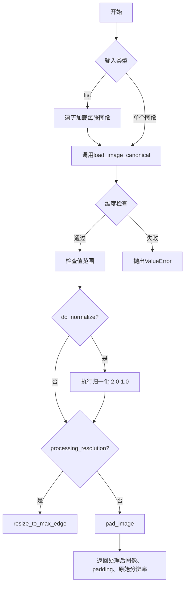
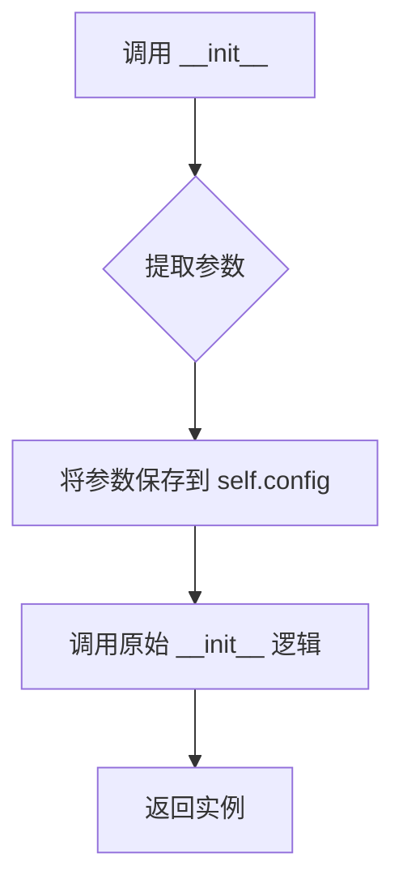
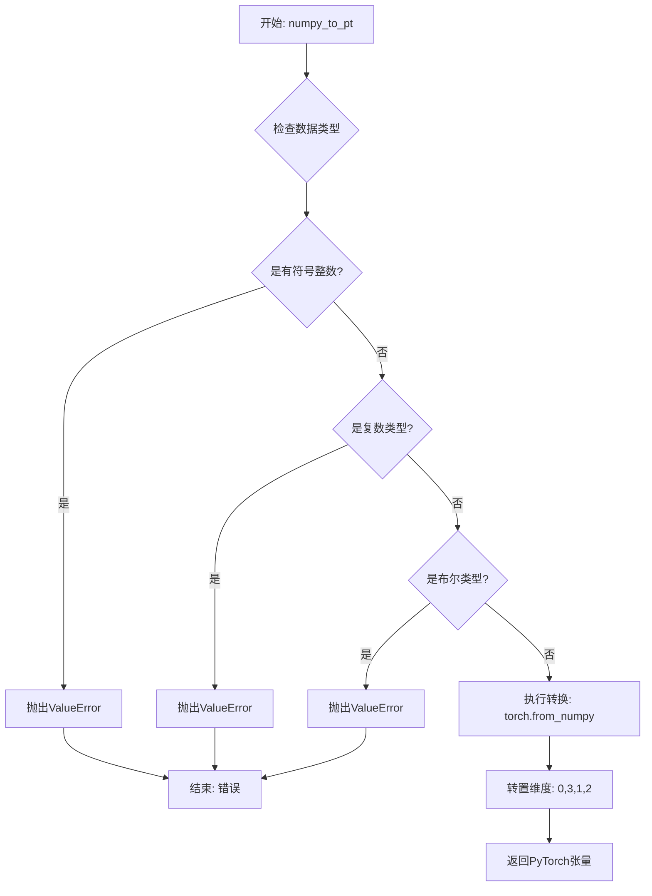
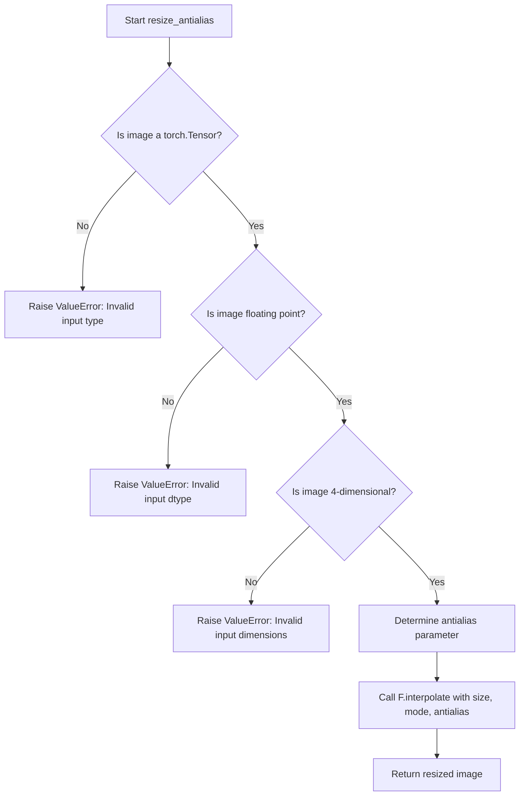
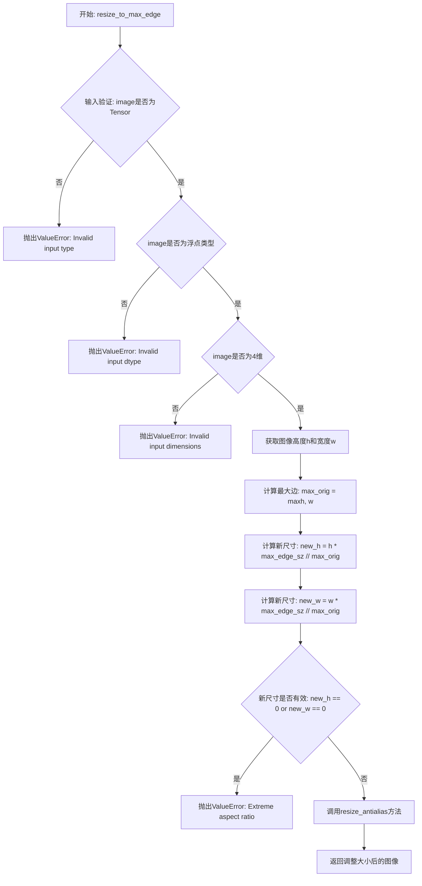
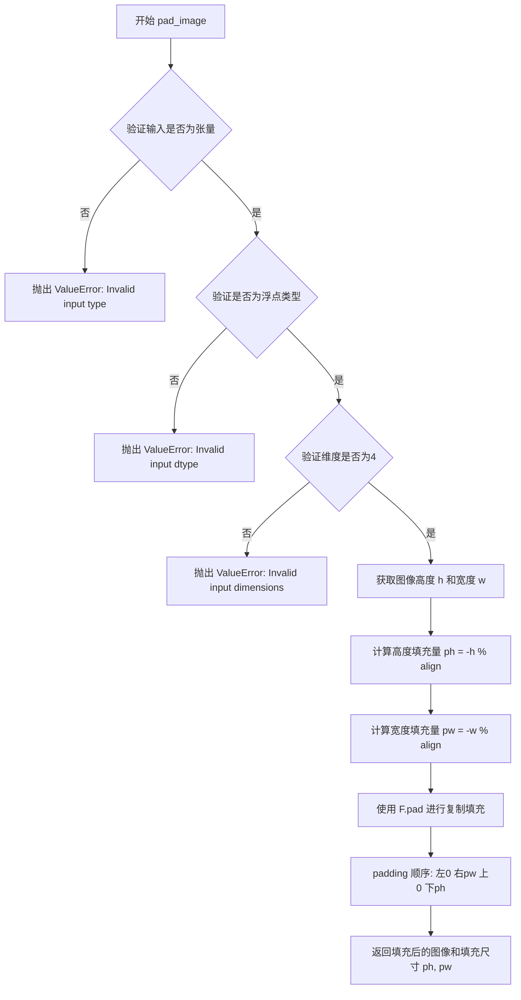
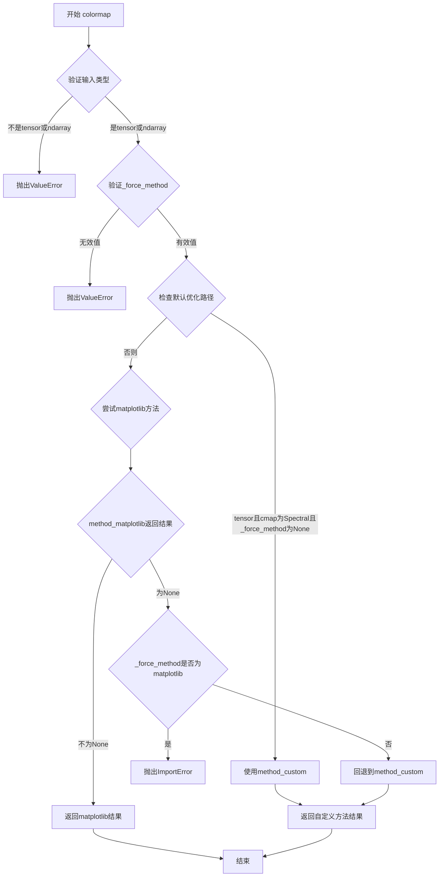

# `diffusers\src\diffusers\pipelines\marigold\marigold_image_processing.py` 详细设计文档

MarigoldImageProcessor是Marigold视觉模型的图像处理器类，负责图像的预处理（包括resize、padding、归一化）、格式转换（numpy/torch/PIL互转）、深度图/法线图/内在图像/不确定性的可视化以及颜色映射等功能。

## 整体流程



## 类结构

```
ConfigMixin (基类)
└── MarigoldImageProcessor
```

## 全局变量及字段


### `logger`
    
用于记录日志的日志对象

类型：`logging.Logger`
    


### `CONFIG_NAME`
    
配置文件的名称常量

类型：`str`
    


### `is_matplotlib_available`
    
检查matplotlib库是否可用的函数

类型：`Callable[[], bool]`
    


### `MarigoldImageProcessor.config_name`
    
类属性，指定配置文件的名称

类型：`str`
    


### `MarigoldImageProcessor.vae_scale_factor`
    
VAE缩放因子配置参数，用于控制图像处理的缩放比例，默认值为8

类型：`int`
    


### `MarigoldImageProcessor.do_normalize`
    
是否执行归一化的配置参数，控制图像是否进行[-1,1]范围归一化，默认值为True

类型：`bool`
    


### `MarigoldImageProcessor.do_range_check`
    
是否执行范围检查的配置参数，验证图像数据是否在[0,1]范围内，默认值为True

类型：`bool`
    
    

## 全局函数及方法


由于 `register_to_config` 是在代码中通过 `from ...configuration_utils import register_to_config` 导入的装饰器，其具体实现并未包含在当前提供的代码片段中。以下信息是基于 `diffusers` 库中该装饰器的标准行为以及其在 `MarigoldImageProcessor` 类中的使用方式推断得出的。

### `register_to_config`

这是一个装饰器，用于自动将 `__init__` 方法的参数注册为类的配置属性。通常与 `ConfigMixin` 类一起使用，使得这些参数可以通过 `self.config` 访问。

参数：

- `func`：`Callable`，被装饰的函数（这里是 `MarigoldImageProcessor.__init__`）。

返回值：`Callable`，返回装饰后的函数，该函数在调用时会将参数保存到配置中。

#### 流程图



#### 带注释源码

以下是一个典型的 `register_to_config` 装饰器实现示例，来源于 `diffusers` 库：

```python
import functools
import inspect

def register_to_config(init):
    """
    Decorator to register the __init__ parameters into the config.
    """
    @functools.wraps(init)
    def new_init(self, *args, **kwargs):
        # 1. 提取被装饰函数签名的参数名
        init_signature = inspect.signature(init)
        init_params = list(init_signature.parameters.keys())
        
        # 2. 绑定传入的参数
        bound_args = {}
        for param_name in init_params:
            if param_name == 'self':
                continue
            if param_name in kwargs:
                bound_args[param_name] = kwargs[param_name]
            elif param_name in args:
                # 这里需要更复杂的逻辑来映射 args 到参数
                # 为简化示例，假设参数通过关键字传递
                pass
        
        # 3. 实际上，在 diffusers 中，通常直接保存所有参数
        # 假设所有参数都应被保存
        # 这里我们假设 new_init 会被调用，并且 self 已经准备好
        # 我们需要在调用 init 之前捕获参数，或者使用包装器
        
        # 下面是简化的逻辑：
        # 获取关键字参数，排除 self
        config_dict = {k: v for k, v in kwargs.items() if k != 'self'}
        
        # 对于 args，需要根据参数位置推断
        # ... (省略复杂的位置参数处理逻辑)
        
        # 调用原始 init
        init(self, *args, **kwargs)
        
        # 将参数写入 self.config
        # 注意：在 diffusers 中，通常在 init 内部或之后处理，
        # 或者通过设置 _init_kwargs 属性
        
        # 这里我们假设 self 是 ConfigMixin 的子类，
        # 它有一个 config 属性或字典
        # config_dict 包含了参数
        if not hasattr(self, "config"):
            self.config = {}
            
        # 合并参数到配置中
        # 注意：实际实现中，这部分逻辑可能由 ConfigMixin 处理
        # 或者装饰器返回一个修改过的类
        for key, value in config_dict.items():
            # 避免覆盖内部属性
            if not key.startswith('_'):
                # 这里简化处理，实际可能直接赋值给 self.config 的属性
                # 假设 self.config 是一个类
                if hasattr(self.config, key):
                    setattr(self.config, key, value)
                    
    return new_init
```


### `MarigoldImageProcessor.expand_tensor_or_array`

该静态方法的核心功能是将输入的图像数据（无论是 PyTorch 张量还是 NumPy 数组）标准化为四维张量（即增加一个批次维度）。它主要处理单张图像（2D 或 3D）的输入，通过在维度前插入大小为 1 的批次维度（Batch dimension），确保数据格式一致，以便后续的流水线处理（例如深度学习模型的推理）。

参数：

-  `images`：`torch.Tensor | np.ndarray`，输入的图像数据。可以是二维灰度图 `[H, W]`、三维彩色图 `[H, W, C]` (NumPy) 或 `[C, H, W]` (Torch) 等形式。

返回值：`torch.Tensor | np.ndarray`，返回展开（扩展）后的图像数据，其维度被统一为四维（通常为 `[1, ..., ..., ...]`），即包含批次维度的形式。

#### 流程图

```mermaid
flowchart TD
    A[输入 images] --> B{判断类型};
    
    B -->|NumPy Array| C{numpy ndim == 2?};
    B -->|Torch Tensor| D{torch ndim == 2?};
    B -->|Other| E[抛出 ValueError];
    
    C -->|Yes| F[images[None, ..., None]]<br/>形状: [H,W] -> [1,H,W,1];
    C -->|No| G{numpy ndim == 3?};
    G -->|Yes| H[images[None]]<br/>形状: [H,W,C] -> [1,H,W,C];
    
    D -->|Yes| I[images[None, None]]<br/>形状: [H,W] -> [1,1,H,W];
    D -->|No| J{torch ndim == 3?};
    J -->|Yes| K[images[None]]<br/>形状: [C,H,W] or [1,H,W] -> [1,?,H,W];
    
    F --> L[返回 images];
    H --> L;
    I --> L;
    K --> L;
```

#### 带注释源码

```python
@staticmethod
def expand_tensor_or_array(images: torch.Tensor | np.ndarray) -> torch.Tensor | np.ndarray:
    """
    Expand a tensor or array to a specified number of images.
    """
    # 处理 NumPy 数组输入
    if isinstance(images, np.ndarray):
        # 如果是二维数组 [H, W] (例如灰度图)
        # 添加批次维度和通道维度 -> [1, H, W, 1]
        if images.ndim == 2:  # [H,W] -> [1,H,W,1]
            images = images[None, ..., None]
        # 如果是三维数组 [H, W, C] (例如彩色图，通道在后)
        # 添加批次维度 -> [1, H, W, C]
        if images.ndim == 3:  # [H,W,C] -> [1,H,W,C]
            images = images[None]
            
    # 处理 PyTorch 张量输入
    elif isinstance(images, torch.Tensor):
        # 如果是二维张量 [H, W] (例如灰度图)
        # 添加批次维度和通道维度 -> [1, 1, H, W]
        if images.ndim == 2:  # [H,W] -> [1,1,H,W]
            images = images[None, None]
        # 如果是三维张量 [C, H, W] 或 [1, H, W]
        # 添加批次维度 -> [1, C, H, W] 或 [1, 1, H, W]
        elif images.ndim == 3:  # [1,H,W] -> [1,1,H,W]
            images = images[None]
            
    # 如果既不是 numpy 也不是 torch，抛出异常
    else:
        raise ValueError(f"Unexpected input type: {type(images)}")
        
    return images
```


### `MarigoldImageProcessor.pt_to_numpy`

将 PyTorch 张量（Tensor）转换为 NumPy 数组（ndarray），通常用于将图像数据从 PyTorch 格式转换为 OpenCV/PIL 等库所需的格式。

参数：

- `images`：`torch.Tensor`，输入的 PyTorch 张量，形状应为 `(N, C, H, W)`，其中 N 为批量大小，C 为通道数，H 为高度，W 为宽度

返回值：`np.ndarray`，转换后的 NumPy 数组，形状为 `(N, H, W, C)`

#### 流程图

```mermaid
flowchart TD
    A[输入: torch.Tensor<br/>形状: N,C,H,W] --> B[.cpu<br/>将张量从GPU移到CPU]
    B --> C[.permute(0, 2, 3, 1)<br/>重新排列维度: N,H,W,C]
    C --> D[.float()<br/>转换为float32类型]
    D --> E[.numpy()<br/>转换为NumPy数组]
    E --> F[输出: np.ndarray<br/>形状: N,H,W,C]
```

#### 带注释源码

```python
@staticmethod
def pt_to_numpy(images: torch.Tensor) -> np.ndarray:
    """
    Convert a PyTorch tensor to a NumPy image.
    
    此静态方法将 PyTorch 张量转换为 NumPy 数组。主要用于图像处理流程中，
    将模型输出的张量转换为可视化或后处理所需的 NumPy 格式。
    
    参数:
        images: PyTorch 张量，形状为 (N, C, H, W)，通常 N=1
        
    返回:
        NumPy 数组，形状为 (N, H, W, C)， dtype 为 float32
    """
    # Step 1: .cpu() - 将张量从 GPU 设备转移到 CPU 设备
    #         这是在 GPU 上进行推理后，将数据移回 CPU 进行后续处理
    images = images.cpu()
    
    # Step 2: .permute(0, 2, 3, 1) - 调整维度顺序
    #         从 (N, C, H, W) 转换为 (N, H, W, C)
    #         这是因为 PyTorch 常用 CHW 格式，而 NumPy/OpenCV 常用 HWC 格式
    images = images.permute(0, 2, 3, 1)
    
    # Step 3: .float() - 确保数据类型为 float32
    #         即使输入已经是 float32，此操作也会确保一致性
    images = images.float()
    
    # Step 4: .numpy() - 将 PyTorch Tensor 转换为 NumPy ndarray
    #         此时张量已在 CPU 上，可以安全转换为 NumPy 数组
    images = images.numpy()
    
    return images
```


### `MarigoldImageProcessor.numpy_to_pt`

将NumPy数组格式的图像转换为PyTorch张量格式，并调整维度顺序以适应PyTorch的通道优先（channel-first）格式要求。

参数：

- `images`：`np.ndarray`，输入的NumPy图像数组

返回值：`torch.Tensor`，转换后的PyTorch张量，维度顺序从[N,H,W,C]转换为[N,C,H,W]

#### 流程图



#### 带注释源码

```python
@staticmethod
def numpy_to_pt(images: np.ndarray) -> torch.Tensor:
    """
    Convert a NumPy image to a PyTorch tensor.
    """
    # 检查输入是否为有符号整数类型（如int32, int64等）
    # 不允许有符号整数，因为PyTorch不支持
    if np.issubdtype(images.dtype, np.integer) and not np.issubdtype(images.dtype, np.unsignedinteger):
        raise ValueError(f"Input image dtype={images.dtype} cannot be a signed integer.")
    
    # 检查输入是否为复数类型（如complex64, complex128）
    # 图像不支持复数数据类型
    if np.issubdtype(images.dtype, np.complexfloating):
        raise ValueError(f"Input image dtype={images.dtype} cannot be complex.")
    
    # 检查输入是否为布尔类型
    # 图像数据不应为布尔类型
    if np.issubdtype(images.dtype, bool):
        raise ValueError(f"Input image dtype={images.dtype} cannot be boolean.")

    # 使用torch.from_numpy创建PyTorch张量
    # transpose(0, 3, 1, 2): 将维度从[N,H,W,C]转换为[N,C,H,W]
    # 这是因为NumPy使用通道后置(channel-last)格式
    # 而PyTorch使用通道优先(channel-first)格式
    images = torch.from_numpy(images.transpose(0, 3, 1, 2))
    
    return images
```


### `MarigoldImageProcessor.resize_antialias`

该静态方法用于对图像张量进行尺寸调整（Resize）操作。它首先对输入的图像张量进行严格的数据类型和维度验证，确保输入符合 4D 浮点张量的要求。随后，根据指定的插值模式（mode）和是否启用抗锯齿（is_aa）参数，利用 PyTorch 的 `F.interpolate` 函数执行高性能的图像重采样操作。

参数：

- `image`：`torch.Tensor`，输入的图像张量，维度必须为 4D，形状为 [N, C, H, W]。
- `size`：`tuple[int, int]`，目标尺寸，格式为 (height, width)。
- `mode`：`str`，插值模式，支持 'bilinear', 'bicubic', 'nearest' 等模式。
- `is_aa`：`bool | None`，是否启用抗锯齿。当为 `True` 且模式为 "bilinear" 或 "bicubic" 时生效，用于在降采样时减少锯齿效应，默认为 `None`。

返回值：`torch.Tensor`，返回调整大小后的图像张量，维度保持为 4D。

#### 流程图



#### 带注释源码

```python
@staticmethod
def resize_antialias(
    image: torch.Tensor, size: tuple[int, int], mode: str, is_aa: bool | None = None
) -> torch.Tensor:
    # 1. 验证输入是否为 PyTorch 张量
    if not torch.is_tensor(image):
        raise ValueError(f"Invalid input type={type(image)}.")
    
    # 2. 验证输入是否为浮点类型（支持 float16, float32, float64 等）
    if not torch.is_floating_point(image):
        raise ValueError(f"Invalid input dtype={image.dtype}.")
    
    # 3. 验证输入维度是否为 4D (N, C, H, W)
    if image.dim() != 4:
        raise ValueError(f"Invalid input dimensions; shape={image.shape}.")

    # 4. 确定抗锯齿参数：只有当 is_aa 为 True 且模式为 bilinear 或 bicubic 时才启用
    antialias = is_aa and mode in ("bilinear", "bicubic")
    
    # 5. 执行插值缩放
    image = F.interpolate(image, size, mode=mode, antialias=antialias)

    return image
```


### `MarigoldImageProcessor.resize_to_max_edge`

该静态方法用于将输入的图像张量调整到指定的最大边尺寸，同时保持原始宽高比。它通过计算缩放因子并将图像resize到最接近的像素尺寸来实现。

参数：

- `image`：`torch.Tensor`，输入的图像张量，必须是4维浮点张量，形状为 [N, C, H, W]
- `max_edge_sz`：`int`，目标最大边尺寸（即输出图像的最长边）
- `mode`：`str`，插值模式，用于调整图像尺寸（例如 "bilinear"、"bicubic" 等）

返回值：`torch.Tensor`，调整大小后的图像张量，形状为 [N, C, new_H, new_W]

#### 流程图



#### 带注释源码

```python
@staticmethod
def resize_to_max_edge(image: torch.Tensor, max_edge_sz: int, mode: str) -> torch.Tensor:
    """
    将输入图像调整到指定的最大边尺寸，同时保持原始宽高比。
    
    参数:
        image: 输入的4维浮点张量，形状为 [N, C, H, W]
        max_edge_sz: 目标最大边尺寸
        mode: 插值模式 ("bilinear", "bicubic" 等)
    
    返回:
        调整大小后的图像张量
    """
    # 验证输入是否为PyTorch Tensor
    if not torch.is_tensor(image):
        raise ValueError(f"Invalid input type={type(image)}.")
    
    # 验证输入是否为浮点类型张量
    if not torch.is_floating_point(image):
        raise ValueError(f"Invalid input dtype={image.dtype}.")
    
    # 验证输入是否为4维张量 [N, C, H, W]
    if image.dim() != 4:
        raise ValueError(f"Invalid input dimensions; shape={image.shape}.")

    # 获取图像的高度和宽度
    h, w = image.shape[-2:]
    
    # 计算原始图像的最大边长
    max_orig = max(h, w)
    
    # 根据最大边尺寸计算新的高度和宽度（保持宽高比）
    new_h = h * max_edge_sz // max_orig
    new_w = w * max_edge_sz // max_orig

    # 检查计算后的尺寸是否有效（防止极端宽高比导致尺寸为0）
    if new_h == 0 or new_w == 0:
        raise ValueError(f"Extreme aspect ratio of the input image: [{w} x {h}]")

    # 调用内部方法进行抗锯齿调整大小
    image = MarigoldImageProcessor.resize_antialias(image, (new_h, new_w), mode, is_aa=True)

    return image
```


### `MarigoldImageProcessor.pad_image`

该静态方法用于将输入的4D图像张量填充（padding）到指定的对齐尺寸，确保图像的高度和宽度都能被`align`参数整除，常用于VAE处理前的预处理步骤。

参数：

- `image`：`torch.Tensor`，输入的图像张量，必须是4D浮点张量（形状为 `[N, C, H, W]`）
- `align`：`int`，对齐参数，用于计算需要填充的像素数，确保输出尺寸能被该值整除

返回值：`tuple[torch.Tensor, tuple[int, int]]`，返回填充后的图像张量以及填充尺寸元组 `(ph, pw)`，其中 `ph` 为高度方向的填充像素数，`pw` 为宽度方向的填充像素数

#### 流程图



#### 带注释源码

```python
@staticmethod
def pad_image(image: torch.Tensor, align: int) -> tuple[torch.Tensor, tuple[int, int]]:
    """
    将输入图像张量填充到指定对齐尺寸。
    
    参数:
        image: 4D 浮点张量 [N, C, H, W]
        align: 对齐参数，确保输出尺寸能被此值整除
    
    返回:
        填充后的图像张量 and 填充尺寸元组 (ph, pw)
    """
    # 参数校验：检查输入是否为 PyTorch 张量
    if not torch.is_tensor(image):
        raise ValueError(f"Invalid input type={type(image)}.")
    
    # 参数校验：检查输入是否为浮点类型（支持 FP16, FP32, FP64 等）
    if not torch.is_floating_point(image):
        raise ValueError(f"Invalid input dtype={image.dtype}.")
    
    # 参数校验：检查是否为 4D 张量 [N, C, H, W]
    if image.dim() != 4:
        raise ValueError(f"Invalid input dimensions; shape={image.shape}.")

    # 获取图像的原始高度和宽度
    h, w = image.shape[-2:]
    
    # 计算需要填充的像素数
    # 使用取模运算确保填充后尺寸能被 align 整除
    # -h % align 等价于 (align - h % align) % align
    ph, pw = -h % align, -w % align

    # 使用 PyTorch 的 F.pad 进行填充
    # 填充模式为 "replicate"（复制边缘像素）
    # padding 格式为 (left, right, top, bottom)
    # 这里: left=0, right=pw, top=0, bottom=ph
    image = F.pad(image, (0, pw, 0, ph), mode="replicate")

    # 返回填充后的图像以及填充尺寸信息
    # ph: 高度方向填充像素数
    # pw: 宽度方向填充像素数
    return image, (ph, pw)
```


### `MarigoldImageProcessor.unpad_image`

该方法用于移除图像的填充边界，与 `pad_image` 方法配合使用，将经过填充处理的图像恢复为原始尺寸。

参数：

- `image`：`torch.Tensor`，经过填充处理的图像张量，形状为 [N, C, H, W]
- `padding`：`tuple[int, int]`，填充参数，包含两个整数 (ph, pw)，分别表示在高度和宽度方向上的填充量

返回值：`torch.Tensor`，移除填充后的图像张量

#### 流程图

```mermaid
flowchart TD
    A[开始 unpad_image] --> B{验证输入是否为张量}
    B -->|否| C[抛出 ValueError: Invalid input type]
    B -->|是| D{验证是否为浮点数类型}
    D -->|否| E[抛出 ValueError: Invalid input dtype]
    D -->|是| F{验证维度是否为4}
    F -->|否| G[抛出 ValueError: Invalid input dimensions]
    F -->|是| H[提取填充参数 ph, pw]
    H --> I[计算高度方向取消填充索引 uh]
    I --> J{ph == 0?}
    J -->|是| K[uh = None]
    J -->|否| L[uh = -ph]
    K --> M[计算宽度方向取消填充索引 uw]
    L --> M
    M --> N{pw == 0?}
    N -->|是| O[uw = None]
    N -->|否| P[uw = -pw]
    O --> Q[执行切片: image[:, :, :uh, :uw]]
    P --> Q
    Q --> R[返回取消填充后的图像]
```

#### 带注释源码

```python
@staticmethod
def unpad_image(image: torch.Tensor, padding: tuple[int, int]) -> torch.Tensor:
    """
    移除图像的填充边界，恢复原始尺寸。
    
    参数:
        image: 经过填充处理的图像张量，形状为 [N, C, H, W]
        padding: 填充参数 (ph, pw)，表示之前在高度和宽度方向添加的填充量
    
    返回:
        移除填充后的图像张量
    """
    # 验证输入是否为 PyTorch 张量
    if not torch.is_tensor(image):
        raise ValueError(f"Invalid input type={type(image)}.")
    
    # 验证输入是否为浮点数类型
    if not torch.is_floating_point(image):
        raise ValueError(f"Invalid input dtype={image.dtype}.")
    
    # 验证输入是否为4维张量 [N, C, H, W]
    if image.dim() != 4:
        raise ValueError(f"Invalid input dimensions; shape={image.shape}.")

    # 解包填充参数：ph 为高度填充量，pw 为宽度填充量
    ph, pw = padding
    
    # 计算高度方向的取消填充索引
    # 如果没有高度填充（ph == 0），使用 None 表示保留所有行
    # 否则使用负索引从末尾移除填充的行数
    uh = None if ph == 0 else -ph
    
    # 计算宽度方向的取消填充索引
    # 如果没有宽度填充（pw == 0），使用 None 表示保留所有列
    # 否则使用负索引从末尾移除填充的列数
    uw = None if pw == 0 else -pw

    # 使用切片操作移除填充边界
    # :uh 在高度方向选择保留的区域
    # :uw 在宽度方向选择保留的区域
    image = image[:, :, :uh, :uw]

    return image
```


### `MarigoldImageProcessor.load_image_canonical`

该静态方法负责将多种格式的输入图像（PIL Image、NumPy 数组或 PyTorch 张量）统一转换为标准化的 4D PyTorch 张量（[N, C, H, W]），并根据指定的设备和数据类型进行转换，同时处理整数图像的归一化。

参数：

- `image`：`torch.Tensor | np.ndarray | Image.Image`，输入图像，支持 PIL Image、NumPy 数组或 PyTorch 张量格式
- `device`：`torch.device`，目标设备，默认为 CPU
- `dtype`：`torch.dtype`，目标数据类型，默认为 float32

返回值：`torch.Tensor`，返回标准化的 4D 图像张量，形状为 [N, 3, H, W]，像素值范围为 [0, 1]

#### 流程图

```mermaid
flowchart TD
    A[开始] --> B{image 是否为 PIL Image}
    B -->|是| C[转换为 NumPy 数组]
    B -->|否| D
    C --> D{image 是否为 np.ndarray 或 torch.Tensor}
    D -->|是| E[调用 expand_tensor_or_array 扩展为 4D]
    D -->|否| F[抛出类型错误]
    E --> G{ndim 是否为 4}
    G -->|否| H[抛出维度错误]
    G -->|是| I{image 是否为 np.ndarray}
    I -->|是| J{检查 dtype: 无符号整数/浮点/复数/布尔}
    I -->|否| K{image 是否为 torch.Tensor}
    J -->|不合法| L[抛出 dtype 错误]
    J -->|合法| M{是否为无符号整数}
    M -->|是| N[获取 dtype max<br/>转换为 float32]
    M -->|否| O
    N --> P[调用 numpy_to_pt 转为张量]
    M -->|否| P
    K -->|是| Q{是否为非浮点且非 uint8}
    Q -->|是| R[抛出 dtype 错误]
    Q -->|否| S{是否为 uint8}
    S -->|是| T[设置 dtype_max = 255]
    S -->|否| U
    T --> V{确保是 torch.Tensor}
    P --> V
    S -->|否| V
    U --> V
    V --> W{shape[1] 是否为 1}
    W -->|是| X[repeat 扩展为 3 通道]
    W -->|否| Y
    X --> Y
    Y --> Z{shape[1] 是否为 3}
    Z -->|否| AA[抛出通道数错误]
    Z -->|是| AB[移动到指定设备和数据类型]
    AB --> AC{dtype_max 不为空}
    AC -->|是| AD[归一化到 [0, 1] 范围]
    AC -->|否| AE
    AD --> AE[返回处理后的图像张量]
    AE --> AE
```

#### 带注释源码

```python
@staticmethod
def load_image_canonical(
    image: torch.Tensor | np.ndarray | Image.Image,
    device: torch.device = torch.device("cpu"),
    dtype: torch.dtype = torch.float32,
) -> tuple[torch.Tensor, int]:
    """
    将不同格式的图像统一转换为标准化的 4D PyTorch 张量 [N, C, H, W]。
    
    参数:
        image: 输入图像，支持 PIL Image、NumPy 数组或 PyTorch 张量
        device: 目标设备
        dtype: 目标数据类型
    
    返回:
        规范化的图像张量，像素值范围 [0, 1]
    """
    # 如果是 PIL Image，先转换为 NumPy 数组
    if isinstance(image, Image.Image):
        image = np.array(image)

    # 用于记录原始整数类型的最大值，用于后续归一化
    image_dtype_max = None
    
    # 对于 NumPy 数组或 PyTorch 张量，扩展为 4D 张量 [N, C, H, W]
    if isinstance(image, (np.ndarray, torch.Tensor)):
        image = MarigoldImageProcessor.expand_tensor_or_array(image)
        # 验证维度：输入必须是 2D、3D 或 4D
        if image.ndim != 4:
            raise ValueError("Input image is not 2-, 3-, or 4-dimensional.")
    
    # 处理 NumPy 数组格式
    if isinstance(image, np.ndarray):
        # 检查不支持的数据类型：带符号整数、复数、布尔值
        if np.issubdtype(image.dtype, np.integer) and not np.issubdtype(image.dtype, np.unsignedinteger):
            raise ValueError(f"Input image dtype={image.dtype} cannot be a signed integer.")
        if np.issubdtype(image.dtype, np.complexfloating):
            raise ValueError(f"Input image dtype={image.dtype} cannot be complex.")
        if np.issubdtype(image.dtype, bool):
            raise ValueError(f"Input image dtype={image.dtype} cannot be boolean.")
        
        # 处理无符号整数类型：获取最大值并转换为 float32
        # 原因：PyTorch 不支持超过 uint8 的无符号整数类型
        if np.issubdtype(image.dtype, np.unsignedinteger):
            image_dtype_max = np.iinfo(image.dtype).max
            image = image.astype(np.float32)
        
        # 转换为 PyTorch 张量，维度顺序从 [N, H, W, C] 转为 [N, C, H, W]
        image = MarigoldImageProcessor.numpy_to_pt(image)

    # 处理 PyTorch 张量格式
    if torch.is_tensor(image) and not torch.is_floating_point(image) and image_dtype_max is None:
        # 仅支持 uint8 类型的整数张量
        if image.dtype != torch.uint8:
            raise ValueError(f"Image dtype={image.dtype} is not supported.")
        image_dtype_max = 255

    # 确保最终结果是 PyTorch 张量
    if not torch.is_tensor(image):
        raise ValueError(f"Input type unsupported: {type(image)}.")

    # 处理单通道图像：复制扩展为三通道 [N, 1, H, W] -> [N, 3, H, W]
    if image.shape[1] == 1:
        image = image.repeat(1, 3, 1, 1)
    
    # 验证通道数：必须是 1 或 3 通道
    if image.shape[1] != 3:
        raise ValueError(f"Input image is not 1- or 3-channel: {image.shape}.")

    # 将图像移动到指定设备并转换数据类型
    image = image.to(device=device, dtype=dtype)

    # 如果原始是整数类型，归一化到 [0, 1] 范围
    if image_dtype_max is not None:
        image = image / image_dtype_max

    return image
```


### `MarigoldImageProcessor.check_image_values_range`

验证输入图像张量的数据类型和数值范围是否符合要求，确保图像数据为浮点型张量且数值在 [0, 1] 范围内。

参数：

- `image`：`torch.Tensor`，待验证的输入图像张量

返回值：`None`，该方法不返回值，仅在验证失败时抛出异常

#### 流程图

```mermaid
flowchart TD
    A[开始检查图像值范围] --> B{输入是否为 torch.Tensor?}
    B -- 否 --> C[抛出 ValueError: 无效的输入类型]
    B -- 是 --> D{是否为浮点类型?}
    D -- 否 --> E[抛出 ValueError: 无效的输入数据类型]
    D -- 是 --> F{最小值 >= 0.0 且最大值 <= 1.0?}
    F -- 否 --> G[抛出 ValueError: 输入图像数据超出 [0,1] 范围]
    F -- 是 --> H[检查通过，方法结束]
```

#### 带注释源码

```python
@staticmethod
def check_image_values_range(image: torch.Tensor) -> None:
    """
    检查输入图像张量的值是否在有效范围内。
    
    该方法执行三项验证：
    1. 验证输入是 PyTorch 张量
    2. 验证张量是浮点类型
    3. 验证所有像素值都在 [0, 1] 范围内
    
    参数:
        image: 待验证的图像张量
        
    异常:
        ValueError: 当输入类型不是张量、数据类型不是浮点型或值超出范围时抛出
    """
    # 检查输入是否为 PyTorch 张量
    if not torch.is_tensor(image):
        raise ValueError(f"Invalid input type={type(image)}.")
    
    # 检查张量是否为浮点类型（float32, float64 等）
    if not torch.is_floating_point(image):
        raise ValueError(f"Invalid input dtype={image.dtype}.")
    
    # 检查像素值是否在 [0, 1] 范围内
    # 使用 .item() 将张量值提取为 Python 标量进行比较
    if image.min().item() < 0.0 or image.max().item() > 1.0:
        raise ValueError("Input image data is partially outside of the [0,1] range.")
```


### `MarigoldImageProcessor.preprocess`

该方法负责将输入图像标准化为模型所需的格式，包括图像加载、尺寸检查、值范围验证、归一化、分辨率调整和边缘填充等预处理步骤。

参数：

- `self`：`MarigoldImageProcessor` 实例本身
- `image`：`PipelineImageInput`，输入图像，支持单张图像（PIL.Image、numpy.ndarray、torch.Tensor）或图像列表
- `processing_resolution`：`int | None`，目标处理分辨率，如果为 None 或小于等于 0 则跳过调整大小步骤
- `resample_method_input`：`str`，调整图像大小时使用的插值方法，默认为 "bilinear"
- `device`：`torch.device`，图像加载到的目标设备，默认为 CPU
- `dtype`：`torch.dtype`，图像加载后的目标数据类型，默认为 torch.float32

返回值：`tuple[torch.Tensor, tuple[int, int], tuple[int, int]]`，返回一个元组，包含处理后的图像张量、填充尺寸 (ph, pw) 和原始图像分辨率 (H, W)

#### 流程图

```mermaid
flowchart TD
    A[开始 preprocess] --> B{image 是列表?}
    B -- 是 --> C[初始化 images = None]
    C --> D[遍历列表中的每个 img]
    D --> E[调用 load_image_canonical 加载图像]
    E --> F{images 为 None?}
    F -- 是 --> G[images = img]
    F -- 否 --> H{当前图像尺寸与之前图像尺寸兼容?}
    H -- 否 --> I[抛出 ValueError]
    H -- 是 --> J[在维度 0 上拼接图像]
    J --> K[image = images]
    K --> L[删除 images 变量]
    B -- 否 --> M[直接调用 load_image_canonical 加载图像]
    M --> N[保存原始分辨率 original_resolution = image.shape[2:]]
    N --> O{do_range_check 为 True?]
    O -- 是 --> P[调用 check_image_values_range 验证图像值范围]
    O -- 否 --> Q{do_normalize 为 True?]
    P --> Q
    Q -- 是 --> R[图像归一化: image = image * 2.0 - 1.0]
    Q -- 否 --> S{processing_resolution > 0?]
    R --> S
    S -- 是 --> T[调用 resize_to_max_edge 调整图像大小]
    S -- 否 --> U[调用 pad_image 填充图像]
    T --> U
    U --> V[返回 image, padding, original_resolution]
```

#### 带注释源码

```python
def preprocess(
    self,
    image: PipelineImageInput,
    processing_resolution: int | None = None,
    resample_method_input: str = "bilinear",
    device: torch.device = torch.device("cpu"),
    dtype: torch.dtype = torch.float32,
):
    """
    预处理输入图像，将其转换为模型所需的格式。
    
    处理流程：
    1. 如果输入是图像列表，则加载并验证每张图像的尺寸，然后沿批次维度拼接
    2. 保存原始图像分辨率
    3. （可选）检查图像像素值是否在 [0, 1] 范围内
    4. （可选）将图像从 [0, 1] 范围归一化到 [-1, 1] 范围
    5. （可选）将图像调整到指定的处理分辨率
    6. 对图像进行边缘填充以满足 VAE 的对齐要求
    
    参数:
        image: 输入图像，支持 PIL.Image、numpy.ndarray、torch.Tensor 或它们的列表
        processing_resolution: 目标处理分辨率，None 或 <= 0 表示跳过调整大小
        resample_method_input: 调整大小时使用的插值方法
        device: 目标设备
        dtype: 目标数据类型
        
    返回:
        tuple: (处理后的图像, 填充尺寸 (ph, pw), 原始分辨率 (H, W))
    """
    # 处理图像列表：逐个加载并验证尺寸兼容性
    if isinstance(image, list):
        images = None
        for i, img in enumerate(image):
            # 将图像加载为标准格式 [N, 3, H, W]
            img = self.load_image_canonical(img, device, dtype)
            if images is None:
                images = img
            else:
                # 验证所有图像尺寸一致
                if images.shape[2:] != img.shape[2:]:
                    raise ValueError(
                        f"Input image[{i}] has incompatible dimensions {img.shape[2:]} with the previous images "
                        f"{images.shape[2:]}"
                    )
                # 沿批次维度拼接
                images = torch.cat((images, img), dim=0)
        image = images
        del images
    else:
        # 处理单张图像：直接加载为标准格式 [N, 3, H, W]
        image = self.load_image_canonical(image, device, dtype)

    # 保存原始分辨率用于后续恢复
    original_resolution = image.shape[2:]

    # 可选：检查图像像素值是否在 [0, 1] 范围内
    if self.config.do_range_check:
        self.check_image_values_range(image)

    # 可选：将图像从 [0, 1] 归一化到 [-1, 1]
    if self.config.do_normalize:
        image = image * 2.0 - 1.0

    # 可选：根据指定分辨率调整图像大小
    if processing_resolution is not None and processing_resolution > 0:
        # 调整图像使其最大边等于 processing_resolution
        image = self.resize_to_max_edge(image, processing_resolution, resample_method_input)

    # 对图像进行边缘填充以满足 VAE 的 stride 要求
    # 返回填充后的图像和填充尺寸 (ph, pw)
    image, padding = self.pad_image(image, self.config.vae_scale_factor)

    return image, padding, original_resolution
```


### `MarigoldImageProcessor.colormap`

该静态方法将单通道灰度图像转换为RGB彩色图像，通过应用指定的颜色映射表（如"Spectral"或"binary"）。它提供了两种实现：一种使用matplotlib的原生colormap，另一种使用自定义的高效实现（仅支持"Spectral"和"binary"）。该方法会在需要时自动在两种实现之间切换，同时允许用户强制指定使用哪种方法。

参数：

- `image`：`np.ndarray | torch.Tensor`，输入的2D张量，值介于0和1之间
- `cmap`：`str`，颜色映射表名称，默认为"Spectral"
- `bytes`：`bool`，是否将输出转换为uint8类型，默认为False
- `_force_method`：`str | None`，强制使用的方法，可选"matplotlib"、"custom"或None，默认为None（自动选择）

返回值：`np.ndarray | torch.Tensor`，应用颜色映射后的RGB彩色化张量

#### 流程图



#### 带注释源码

```python
@staticmethod
def colormap(
    image: np.ndarray | torch.Tensor,
    cmap: str = "Spectral",
    bytes: bool = False,
    _force_method: str | None = None,
) -> np.ndarray | torch.Tensor:
    """
    Converts a monochrome image into an RGB image by applying the specified colormap. This function mimics the
    behavior of matplotlib.colormaps, but allows the user to use the most discriminative color maps ("Spectral",
    "binary") without having to install or import matplotlib. For all other cases, the function will attempt to use
    the native implementation.

    Args:
        image: 2D tensor of values between 0 and 1, either as np.ndarray or torch.Tensor.
        cmap: Colormap name.
        bytes: Whether to return the output as uint8 or floating point image.
        _force_method:
            Can be used to specify whether to use the native implementation (`"matplotlib"`), the efficient custom
            implementation of the select color maps (`"custom"`), or rely on autodetection (`None`, default).

    Returns:
        An RGB-colorized tensor corresponding to the input image.
    """
    # 输入类型验证：仅接受numpy数组或torch张量
    if not (torch.is_tensor(image) or isinstance(image, np.ndarray)):
        raise ValueError("Argument must be a numpy array or torch tensor.")
    # _force_method参数验证：必须是None、"matplotlib"或"custom"之一
    if _force_method not in (None, "matplotlib", "custom"):
        raise ValueError("_force_method must be either `None`, `'matplotlib'` or `'custom'`.")

    # 定义内置支持的颜色映射表
    # binary: 简单的黑白渐变
    # Spectral: 彩虹色谱，从红色到紫色（来自matplotlib）
    supported_cmaps = {
        "binary": [
            (1.0, 1.0, 1.0),
            (0.0, 0.0, 0.0),
        ],
        "Spectral": [  # Taken from matplotlib/_cm.py
            (0.61960784313725492, 0.003921568627450980, 0.25882352941176473),  # 0.0 -> [0]
            (0.83529411764705885, 0.24313725490196078, 0.30980392156862746),
            (0.95686274509803926, 0.42745098039215684, 0.2627450980392157),
            (0.99215686274509807, 0.68235294117647061, 0.38039215686274508),
            (0.99607843137254903, 0.8784313725490196, 0.54509803921568623),
            (1.0, 1.0, 0.74901960784313726),
            (0.90196078431372551, 0.96078431372549022, 0.59607843137254901),
            (0.6705882352941176, 0.8666666666666667, 0.64313725490196083),
            (0.4, 0.76078431372549016, 0.6470588235294118),
            (0.19607843137254902, 0.53333333333333333, 0.74117647058823533),
            (0.36862745098039218, 0.30980392156862746, 0.63529411764705879),  # 1.0 -> [K-1]
        ],
    }

    # 内部方法：使用matplotlib库进行颜色映射
    def method_matplotlib(image, cmap, bytes=False):
        # 检查matplotlib是否可用
        if is_matplotlib_available():
            import matplotlib
        else:
            return None

        # 记录输入是否为torch张量，以便后续恢复设备
        arg_is_pt, device = torch.is_tensor(image), None
        if arg_is_pt:
            image, device = image.cpu().numpy(), image.device

        # 验证颜色映射名称是否有效
        if cmap not in matplotlib.colormaps:
            raise ValueError(
                f"Unexpected color map {cmap}; available options are: {', '.join(list(matplotlib.colormaps.keys()))}"
            )

        cmap = matplotlib.colormaps[cmap]
        out = cmap(image, bytes=bytes)  # [?,4] 返回RGBA
        out = out[..., :3]  # [?,3] 去除alpha通道

        # 如果原输入是torch张量，结果转回torch并保持原设备
        if arg_is_pt:
            out = torch.tensor(out, device=device)

        return out

    # 内部方法：使用自定义实现进行颜色映射（仅支持Spectral和binary）
    def method_custom(image, cmap, bytes=False):
        arg_is_np = isinstance(image, np.ndarray)
        # 统一转换为torch张量进行处理
        if arg_is_np:
            image = torch.tensor(image)
        # 归一化到[0,1]范围
        if image.dtype == torch.uint8:
            image = image.float() / 255
        else:
            image = image.float()

        # 检查是否反转颜色映射（以_r结尾）
        is_cmap_reversed = cmap.endswith("_r")
        if is_cmap_reversed:
            cmap = cmap[:-2]

        # 验证颜色映射是否受支持
        if cmap not in supported_cmaps:
            raise ValueError(
                f"Only {list(supported_cmaps.keys())} color maps are available without installing matplotlib."
            )

        cmap = supported_cmaps[cmap]
        # 反转颜色映射（如果需要）
        if is_cmap_reversed:
            cmap = cmap[::-1]
        # 转换为torch张量
        cmap = torch.tensor(cmap, dtype=torch.float, device=image.device)  # [K,3]
        K = cmap.shape[0]

        # 线性插值计算：位置 = 值 * (K-1)
        pos = image.clamp(min=0, max=1) * (K - 1)
        left = pos.long()  # 左侧索引
        right = (left + 1).clamp(max=K - 1)  # 右侧索引（防止越界）

        # 计算线性插值权重
        d = (pos - left.float()).unsqueeze(-1)
        # 获取左右两侧的颜色值
        left_colors = cmap[left]
        right_colors = cmap[right]

        # 执行线性插值：(1-d)*左颜色 + d*右颜色
        out = (1 - d) * left_colors + d * right_colors

        # 如果需要字节输出，转换为uint8
        if bytes:
            out = (out * 255).to(torch.uint8)

        # 如果原输入是numpy数组，结果转回numpy
        if arg_is_np:
            out = out.numpy()

        return out

    # 优化路径：当输入是torch张量且使用Spectral映射时，直接使用自定义实现（更快）
    if _force_method is None and torch.is_tensor(image) and cmap == "Spectral":
        return method_custom(image, cmap, bytes)

    out = None
    # 尝试使用matplotlib方法（除非强制使用custom）
    if _force_method != "custom":
        out = method_matplotlib(image, cmap, bytes)

    # 如果强制使用matplotlib但失败，抛出错误
    if _force_method == "matplotlib" and out is None:
        raise ImportError("Make sure to install matplotlib if you want to use a color map other than 'Spectral'.")

    # 如果matplotlib不可用或未返回结果，回退到自定义实现
    if out is None:
        out = method_custom(image, cmap, bytes)

    return out
```


### `MarigoldImageProcessor.visualize_depth`

该静态方法用于将深度图（depth maps）转换为可视化的彩色图像，支持多种输入格式（PIL图像、NumPy数组、PyTorch张量或它们的列表），并通过指定的颜色映射将单通道深度数据转换为RGB彩色表示。

参数：

- `depth`：`PIL.Image.Image | np.ndarray | torch.Tensor | list[PIL.Image.Image] | list[np.ndarray] | list[torch.Tensor]`，输入的深度图，可以是单个图像、数组、张量或它们的列表
- `val_min`：`float`，可选，默认为 `0.0`，可视化深度范围的最小值
- `val_max`：`float`，可选，默认为 `1.0`，可视化深度范围的最大值
- `color_map`：`str`，可选，默认为 `"Spectral"`，用于将单通道深度预测转换为彩色表示的配色方案

返回值：`list[PIL.Image.Image]`，深度图的可视化结果列表

#### 流程图

```mermaid
flowchart TD
    A[开始 visualize_depth] --> B{检查 val_max <= val_min?}
    B -->|是| C[抛出 ValueError]
    B -->|否| D[定义内部函数 visualize_depth_one]
    D --> E{检查 depth 为 None?}
    E -->|是| F[抛出 ValueError]
    E --> G{depth 类型判断}
    G --> H[depth 为 list 且包含 None?]
    H -->|是| F
    H -->|否| I{depth 是 np.ndarray 或 torch.Tensor?}
    I -->|是| J[调用 expand_tensor_or_array 扩展维度]
    J --> K[如果是 np.ndarray 转为 torch.Tensor]
    K --> L{检查 shape 是否为 [N,1,H,W]?}
    L -->|否| M[抛出 ValueError]
    L -->|是| N[遍历每个深度图调用 visualize_depth_one]
    I -->|否| O{depth 是 list?}
    O -->|是| N
    O -->|否| P[抛出 ValueError]
    N --> Q[返回 PIL.Image.Image 列表]
    
    subgraph visualize_depth_one
    R[处理单个深度图] --> S{输入类型是 PIL.Image?}
    S -->|是| T[检查 mode='I;16' 并转换为 float32]
    S -->|否| U{输入是 np.ndarray 或 tensor?}
    U -->|是| V[检查 ndim=2]
    U -->|否| W[抛出 ValueError]
    V --> X[转为 torch.Tensor]
    X --> Y{是否需要归一化 val_min!=0 or val_max!=1?}
    Y -->|是| Z[执行归一化: img = (img - val_min) / (val_max - val_min)]
    Y -->|否| AA[调用 colormap 转换为彩色]
    Z --> AA
    AA --> AB[转换为 PIL.Image 并返回]
    end
```

#### 带注释源码

```python
@staticmethod
def visualize_depth(
    depth: PIL.Image.Image
    | np.ndarray
    | torch.Tensor
    | list[PIL.Image.Image]
    | list[np.ndarray]
    | list[torch.Tensor],
    val_min: float = 0.0,
    val_max: float = 1.0,
    color_map: str = "Spectral",
) -> list[PIL.Image.Image]:
    """
    Visualizes depth maps, such as predictions of the `MarigoldDepthPipeline`.

    Args:
        depth (`PIL.Image.Image | np.ndarray | torch.Tensor | list[PIL.Image.Image, list[np.ndarray],
            list[torch.Tensor]]`): Depth maps.
        val_min (`float`, *optional*, defaults to `0.0`): Minimum value of the visualized depth range.
        val_max (`float`, *optional*, defaults to `1.0`): Maximum value of the visualized depth range.
        color_map (`str`, *optional*, defaults to `"Spectral"`): Color map used to convert a single-channel
                  depth prediction into colored representation.

    Returns: `list[PIL.Image.Image]` with depth maps visualization.
    """
    # 参数验证：确保 val_max 大于 val_min，否则抛出异常
    if val_max <= val_min:
        raise ValueError(f"Invalid values range: [{val_min}, {val_max}].")

    def visualize_depth_one(img, idx=None):
        """处理单个深度图的可视化内部函数"""
        prefix = "Depth" + (f"[{idx}]" if idx else "")
        
        # 处理 PIL Image 类型输入
        if isinstance(img, PIL.Image.Image):
            # 检查图像模式，必须为 16 位整型
            if img.mode != "I;16":
                raise ValueError(f"{prefix}: invalid PIL mode={img.mode}.")
            # 转换为 float32 并归一化到 [0,1]
            img = np.array(img).astype(np.float32) / (2**16 - 1)
        
        # 处理 NumPy 数组或 PyTorch 张量
        if isinstance(img, np.ndarray) or torch.is_tensor(img):
            # 必须是 2D 数组/张量
            if img.ndim != 2:
                raise ValueError(f"{prefix}: unexpected shape={img.shape}.")
            # NumPy 数组转换为 PyTorch 张量
            if isinstance(img, np.ndarray):
                img = torch.from_numpy(img)
            # 检查是否为浮点类型
            if not torch.is_floating_point(img):
                raise ValueError(f"{prefix}: unexpected dtype={img.dtype}.")
        else:
            raise ValueError(f"{prefix}: unexpected type={type(img)}.")
        
        # 根据指定的范围进行归一化
        if val_min != 0.0 or val_max != 1.0:
            img = (img - val_min) / (val_max - val_min)
        
        # 使用 colormap 将深度图转换为彩色图像
        img = MarigoldImageProcessor.colormap(img, cmap=color_map, bytes=True)  # [H,W,3]
        # 转换为 PIL Image 并返回
        img = PIL.Image.fromarray(img.cpu().numpy())
        return img

    # 检查输入是否为 None
    if depth is None or isinstance(depth, list) and any(o is None for o in depth):
        raise ValueError("Input depth is `None`")
    
    # 处理 NumPy 数组或 PyTorch 张量输入
    if isinstance(depth, (np.ndarray, torch.Tensor)):
        # 扩展为 4D [N,H,W] -> [N,1,H,W] 或 [H,W] -> [1,1,H,W]
        depth = MarigoldImageProcessor.expand_tensor_or_array(depth)
        # NumPy 数组转换为 PyTorch 张量
        if isinstance(depth, np.ndarray):
            depth = MarigoldImageProcessor.numpy_to_pt(depth)  # [N,H,W,1] -> [N,1,H,W]
        # 验证输入形状
        if not (depth.ndim == 4 and depth.shape[1] == 1):  # [N,1,H,W]
            raise ValueError(f"Unexpected input shape={depth.shape}, expecting [N,1,H,W].")
        # 对每个深度图进行可视化处理
        return [visualize_depth_one(img[0], idx) for idx, img in enumerate(depth)]
    # 处理列表输入
    elif isinstance(depth, list):
        return [visualize_depth_one(img, idx) for idx, img in enumerate(depth)]
    else:
        raise ValueError(f"Unexpected input type: {type(depth)}")
```


### `MarigoldImageProcessor.export_depth_to_16bit_png`

将深度图数组（支持 NumPy 数组或 PyTorch 张量）转换为 16 位灰度 PNG 图像列表。该方法首先对输入进行类型和形状验证，然后将深度值归一化到 [0, 1] 范围（可选地根据 val_min 和 val_max 进行映射），最后将浮点值转换为 16 位无符号整数并封装为 PIL Image 对象返回。

参数：

- `depth`：`np.ndarray | torch.Tensor | list[np.ndarray] | list[torch.Tensor]`，输入的深度图，可以是单个或多个深度图，支持 NumPy 数组或 PyTorch 张量
- `val_min`：`float`，可选，默认为 `0.0`，深度值的最小归一化边界
- `val_max`：`float`，可选，默认为 `1.0`，深度值的最大归一化边界

返回值：`list[PIL.Image.Image]`，返回 16 位灰度 PNG 图像列表

#### 流程图

```mermaid
flowchart TD
    A[开始 export_depth_to_16bit_png] --> B{depth 为 None?}
    B -->|是| C[抛出 ValueError]
    B -->|否| D{depth 类型为数组或张量?}
    D -->|是| E[调用 expand_tensor_or_array 扩展维度]
    D -->|否| F{depth 为列表?}
    F -->|是| L[直接遍历列表]
    E --> G{是否为 NumPy 数组?}
    G -->|是| H[转换为 PyTorch 张量]
    G -->|否| I{检查形状为 [N,1,H,W]?}
    I -->|否| J[抛出 ValueError]
    I -->|是| K[对每个元素调用 export_depth_to_16bit_png_one]
    F -->|是| K
    K --> M[结束，返回 PIL.Image 列表]
    
    subgraph export_depth_to_16bit_png_one
    N[接收单个深度图] --> O{类型检查: NumPy 或 Tensor?}
    O -->|否| P[抛出 ValueError]
    O -->|是| Q{维度检查: 2D?}
    Q -->|否| R[抛出 ValueError]
    Q -->|是| S{Tensor 转为 NumPy]
    S --> T{数据类型检查: 浮点数?}
    T -->|否| U[抛出 ValueError]
    T -->|是| V{归一化: val_min/val_max 非默认?}
    V -->|是| W[执行 (img - val_min) / (val_max - val_min)]
    V -->|否| X[跳过归一化]
    W --> Y[转换为 uint16: img * 65535]
    X --> Y
    Y --> Z[PIL.Image.fromarray mode='I;16']
    Z --> AA[返回 PIL Image]
    end
```

#### 带注释源码

```python
@staticmethod
def export_depth_to_16bit_png(
    depth: np.ndarray | torch.Tensor | list[np.ndarray] | list[torch.Tensor],
    val_min: float = 0.0,
    val_max: float = 1.0,
) -> list[PIL.Image.Image]:
    """
    将深度图导出为 16 位 PNG 图像。
    
    参数:
        depth: 输入深度图，支持 NumPy 数组、PyTorch 张量或它们的列表
        val_min: 深度值最小边界，用于归一化
        val_max: 深度值最大边界，用于归一化
    
    返回:
        16 位灰度 PIL.Image 列表
    """
    def export_depth_to_16bit_png_one(img, idx=None):
        """处理单个深度图转换为 16 位 PNG"""
        prefix = "Depth" + (f"[{idx}]" if idx else "")
        
        # 验证输入类型：必须是 NumPy 数组或 PyTorch 张量
        if not isinstance(img, np.ndarray) and not torch.is_tensor(img):
            raise ValueError(f"{prefix}: unexpected type={type(img)}.")
        
        # 验证输入维度：必须是 2D 图像
        if img.ndim != 2:
            raise ValueError(f"{prefix}: unexpected shape={img.shape}.")
        
        # 如果是 PyTorch 张量，转移到 CPU 并转为 NumPy 数组
        if torch.is_tensor(img):
            img = img.cpu().numpy()
        
        # 验证数据类型：必须是浮点数
        if not np.issubdtype(img.dtype, np.floating):
            raise ValueError(f"{prefix}: unexpected dtype={img.dtype}.")
        
        # 可选归一化：将深度值映射到 [0, 1] 范围
        if val_min != 0.0 or val_max != 1.0:
            img = (img - val_min) / (val_max - val_min)
        
        # 转换为 16 位无符号整数 [0, 65535]
        img = (img * (2**16 - 1)).astype(np.uint16)
        
        # 创建 16 位灰度 PIL Image
        img = PIL.Image.fromarray(img, mode="I;16")
        return img

    # 验证输入不为 None
    if depth is None or isinstance(depth, list) and any(o is None for o in depth):
        raise ValueError("Input depth is `None`")
    
    # 处理单个数组或张量输入
    if isinstance(depth, (np.ndarray, torch.Tensor)):
        depth = MarigoldImageProcessor.expand_tensor_or_array(depth)
        if isinstance(depth, np.ndarray):
            # [N,H,W,1] -> [N,1,H,W]
            depth = MarigoldImageProcessor.numpy_to_pt(depth)
        # 验证形状：[N,1,H,W]
        if not (depth.ndim == 4 and depth.shape[1] == 1):
            raise ValueError(f"Unexpected input shape={depth.shape}, expecting [N,1,H,W].")
        return [export_depth_to_16bit_png_one(img[0], idx) for idx, img in enumerate(depth)]
    # 处理列表输入
    elif isinstance(depth, list):
        return [export_depth_to_16bit_png_one(img, idx) for idx, img in enumerate(depth)]
    else:
        raise ValueError(f"Unexpected input type: {type(depth)}")
```


### `MarigoldImageProcessor.visualize_normals`

该静态方法用于将表面法线数据（如 `MarigoldNormalsPipeline` 的预测结果）可视化为RGB图像。它支持通过 flip_x/y/z 参数对法线坐标轴进行翻转，将归一化的法线向量（-1 到 1）映射到 0-255 的 RGB 像素值，并返回 PIL 图像列表。

参数：

- `normals`：`np.ndarray | torch.Tensor | list[np.ndarray] | list[torch.Tensor]`，输入的表面法线数据，可以是单个或多个法线图
- `flip_x`：`bool`，是否翻转 X 轴方向（默认右向为正）
- `flip_y`：`bool`，是否翻转 Y 轴方向（默认顶部为正）
- `flip_z`：`bool`，是否翻转 Z 轴方向（默认朝向观察者为正）

返回值：`list[PIL.Image.Image]`，可视化后的表面法线图像列表

#### 流程图

```mermaid
flowchart TD
    A[开始 visualize_normals] --> B{检查 normals 是否为 None}
    B -->|是| C[抛出 ValueError: Input normals is None]
    B -->|否| D{normals 类型判断}
    
    D -->|np.ndarray 或 torch.Tensor| E[调用 expand_tensor_or_array 扩展维度]
    E --> F{是否为 np.ndarray}
    F -->|是| G[调用 numpy_to_pt 转为张量]
    F -->|否| H[保持为张量]
    G --> I{检查形状是否为 [N, 3, H, W]}
    H --> I
    
    D -->|list| J[直接处理列表元素]
    I -->|不符合| K[抛出 ValueError: 形状错误]
    I -->|符合| L[构建 flip_vec 翻转向量]
    
    J --> L
    
    L --> M{flip_x/y/z 任一为 True?}
    M -->|否| N[flip_vec 为 None]
    M -->|是| O[创建翻转向量 tensor]
    O --> P[flip_vec = [-1^flip_x, -1^flip_y, -1^flip_z]]
    N --> Q[对每个法线图调用 visualize_normals_one]
    P --> Q
    
    Q --> R[visualize_normals_one: 维度转换 CHW -> HWC]
    R --> S{flip_vec 存在?}
    S -->|是| T[将 flip_vec 乘到法线数据上]
    S -->|否| U[跳过翻转]
    T --> V[数据归一化: (img + 1.0) * 0.5]
    U --> V
    V --> W[映射到 0-255 像素值并转为 uint8]
    W --> X[转换为 numpy 数组]
    X --> Y[创建 PIL.Image 对象]
    Y --> Z[返回 PIL.Image 列表]
    
    Z --> AA[结束]
```

#### 带注释源码

```python
@staticmethod
def visualize_normals(
    normals: np.ndarray | torch.Tensor | list[np.ndarray] | list[torch.Tensor],
    flip_x: bool = False,
    flip_y: bool = False,
    flip_z: bool = False,
) -> list[PIL.Image.Image]:
    """
    Visualizes surface normals, such as predictions of the `MarigoldNormalsPipeline`.

    Args:
        normals (`np.ndarray | torch.Tensor | list[np.ndarray, list[torch.Tensor]]`):
            Surface normals.
        flip_x (`bool`, *optional*, defaults to `False`): Flips the X axis of the normals frame of reference.
                  Default direction is right.
        flip_y (`bool`, *optional*, defaults to `False`):  Flips the Y axis of the normals frame of reference.
                  Default direction is top.
        flip_z (`bool`, *optional*, defaults to `False`): Flips the Z axis of the normals frame of reference.
                  Default direction is facing the observer.

    Returns: `list[PIL.Image.Image]` with surface normals visualization.
    """
    # 如果任意翻转标志为 True，则创建翻转向量
    # 翻转逻辑：(-1) ** True = -1, (-1) ** False = 1
    flip_vec = None
    if any((flip_x, flip_y, flip_z)):
        flip_vec = torch.tensor(
            [
                (-1) ** flip_x,
                (-1) ** flip_y,
                (-1) ** flip_z,
            ],
            dtype=torch.float32,
        )

    def visualize_normals_one(img, idx=None):
        """处理单个法线图的可视化"""
        # 将张量从 [C, H, W] 转换为 [H, W, C] 格式
        img = img.permute(1, 2, 0)
        # 如果存在翻转向量，则应用到法线数据上
        if flip_vec is not None:
            img *= flip_vec.to(img.device)
        # 将法线值从 [-1, 1] 范围映射到 [0, 1] 范围
        img = (img + 1.0) * 0.5
        # 将数据转换为 0-255 的 uint8 类型，并在 CPU 上转为 numpy 数组
        img = (img * 255).to(dtype=torch.uint8, device="cpu").numpy()
        # 使用 PIL 从 numpy 数组创建图像
        img = PIL.Image.fromarray(img)
        return img

    # 检查输入是否为空
    if normals is None or isinstance(normals, list) and any(o is None for o in normals):
        raise ValueError("Input normals is `None`")
    
    # 处理 numpy 数组或 torch.Tensor 类型的输入
    if isinstance(normals, (np.ndarray, torch.Tensor)):
        # 扩展维度：确保输入至少是 4D [N, C, H, W]
        normals = MarigoldImageProcessor.expand_tensor_or_array(normals)
        # 如果是 numpy 数组，转换为 PyTorch 张量
        if isinstance(normals, np.ndarray):
            normals = MarigoldImageProcessor.numpy_to_pt(normals)  # [N,3,H,W]
        # 验证输入形状：必须是 4D 且通道数为 3
        if not (normals.ndim == 4 and normals.shape[1] == 3):
            raise ValueError(f"Unexpected input shape={normals.shape}, expecting [N,3,H,W].")
        # 对每个法线图调用可视化函数
        return [visualize_normals_one(img, idx) for idx, img in enumerate(normals)]
    # 处理列表类型的输入
    elif isinstance(normals, list):
        return [visualize_normals_one(img, idx) for idx, img in enumerate(normals)]
    else:
        raise ValueError(f"Unexpected input type: {type(normals)}")
```


### `MarigoldImageProcessor.visualize_intrinsics`

该静态方法用于将 MarigoldIntrinsicsPipeline 的内在图像分解预测结果可视化为彩色图像，支持多目标分解、不同的预测空间（sRGB、linear、stack）处理，并根据指定颜色映射将单通道预测转换为彩色表示。

参数：

- `prediction`：`np.ndarray | torch.Tensor | list[np.ndarray] | list[torch.Tensor]`，内在图像分解的预测结果
- `target_properties`：`dict[str, Any]`，分解属性字典，必须包含 `target_names: list[str]` 键，以及每个目标的 `prediction_space`、`sub_target_names`、`up_to_scale` 等属性
- `color_map`：`str | dict[str, str]`，颜色映射名称或字典，默认为 `"binary"`，用于将单通道预测转换为彩色表示

返回值：`list[dict[str, PIL.Image.Image]]`，包含内在图像分解可视化结果的字典列表，每个字典键为目标名称，值为对应的 PIL 图像

#### 流程图

```mermaid
flowchart TD
    A[开始 visualize_intrinsics] --> B{验证 target_properties}
    B -->|缺少 target_names| C[抛出 ValueError]
    B -->|通过| D{验证 color_map}
    D -->|无效类型| E[抛出 ValueError]
    D -->|通过| F[获取目标数量 n_targets]
    
    F --> G{输入类型判断}
    G -->|None 或包含 None| H[抛出 ValueError]
    G -->|np.ndarray 或 torch.Tensor| I[expand_tensor_or_array 扩展维度]
    I --> J{是否为 numpy 数组]
    J -->|是| K[numpy_to_pt 转换为 tensor]
    J -->|否| L{验证形状}
    K --> L
    L -->|形状不符合| M[抛出 ValueError]
    L -->|通过| N[reshape 为 N x n_targets x 3 x H x W]
    N --> O[遍历每个样本调用 visualize_targets_one]
    G -->|list| P[遍历每个元素调用 visualize_targets_one]
    O --> Q[返回可视化结果列表]
    P --> Q
    
    subgraph visualize_targets_one
    R[处理单个样本] --> S{遍历目标名称}
    S --> T[permute 转换维度 HxWx3]
    T --> U{prediction_space 判断}
    U -->|stack| V[处理子目标]
    U -->|linear| W[应用 gamma 校正]
    U -->|srgb| X[直接处理]
    V --> Y[获取子目标名称]
    Y --> Z{每个子目标}
    Z -->|非空| AA[应用颜色映射]
    AA --> AB[转换为 PIL Image]
    Z -->|空| AC[跳过]
    AC --> Z
    AA --> AD[添加到输出字典]
    V --> AE[应用颜色映射并转换]
    W --> AE
    X --> AE
    AD --> S
    S --> AF[返回目标可视化字典]
    end
```

#### 带注释源码

```python
@staticmethod
def visualize_intrinsics(
    prediction: np.ndarray | torch.Tensor | list[np.ndarray] | list[torch.Tensor],
    target_properties: dict[str, Any],
    color_map: str | dict[str, str] = "binary",
) -> list[dict[str, PIL.Image.Image]]:
    """
    Visualizes intrinsic image decomposition, such as predictions of the `MarigoldIntrinsicsPipeline`.

    Args:
        prediction (`np.ndarray | torch.Tensor | list[np.ndarray, list[torch.Tensor]]`):
            Intrinsic image decomposition.
        target_properties (`dict[str, Any]`):
            Decomposition properties. Expected entries: `target_names: list[str]` and a dictionary with keys
            `prediction_space: str`, `sub_target_names: list[str | Null]` (must have 3 entries, null for missing
            modalities), `up_to_scale: bool`, one for each target and sub-target.
        color_map (`str | dict[str, str]`, *optional*, defaults to `"Spectral"`):
            Color map used to convert a single-channel predictions into colored representations. When a dictionary
            is passed, each modality can be colored with its own color map.

    Returns: `list[dict[str, PIL.Image.Image]]` with intrinsic image decomposition visualization.
    """
    # 验证 target_properties 中是否包含必需的 target_names
    if "target_names" not in target_properties:
        raise ValueError("Missing `target_names` in target_properties")
    
    # 验证 color_map 的类型有效性（字符串或字符串字典）
    if not isinstance(color_map, str) and not (
        isinstance(color_map, dict)
        and all(isinstance(k, str) and isinstance(v, str) for k, v in color_map.items())
    ):
        raise ValueError("`color_map` must be a string or a dictionary of strings")
    
    # 获取目标数量
    n_targets = len(target_properties["target_names"])

    def visualize_targets_one(images, idx=None):
        """
        处理单个样本的内在图像分解可视化
        
        Args:
            images: [T, 3, H, W] 张量，T为目标数量
            idx: 可选的索引用于错误消息前缀
        """
        # img: [T, 3, H, W]
        out = {}
        
        # 遍历每个目标
        for target_name, img in zip(target_properties["target_names"], images):
            # 转换维度从 [3, H, W] 到 [H, W, 3]
            img = img.permute(1, 2, 0)  # [H, W, 3]
            
            # 获取该目标的预测空间类型
            prediction_space = target_properties[target_name].get("prediction_space", "srgb")
            
            # 处理 stack 类型的预测空间（包含多个子目标）
            if prediction_space == "stack":
                sub_target_names = target_properties[target_name]["sub_target_names"]
                
                # 验证子目标名称的有效性
                if len(sub_target_names) != 3 or any(
                    not (isinstance(s, str) or s is None) for s in sub_target_names
                ):
                    raise ValueError(f"Unexpected target sub-names {sub_target_names} in {target_name}")
                
                # 遍历每个子目标
                for i, sub_target_name in enumerate(sub_target_names):
                    if sub_target_name is None:
                        continue
                    
                    # 提取子目标图像
                    sub_img = img[:, :, i]
                    
                    # 处理子目标的预测空间
                    sub_prediction_space = target_properties[sub_target_name].get("prediction_space", "srgb")
                    if sub_prediction_space == "linear":
                        sub_up_to_scale = target_properties[sub_target_name].get("up_to_scale", False)
                        # 缩放归一化处理
                        if sub_up_to_scale:
                            sub_img = sub_img / max(sub_img.max().item(), 1e-6)
                        # 应用 gamma 校正 (线性空间转 sRGB)
                        sub_img = sub_img ** (1 / 2.2)
                    
                    # 获取颜色映射名称
                    cmap_name = (
                        color_map if isinstance(color_map, str) else color_map.get(sub_target_name, "binary")
                    )
                    
                    # 应用颜色映射并转换为字节格式
                    sub_img = MarigoldImageProcessor.colormap(sub_img, cmap=cmap_name, bytes=True)
                    
                    # 转换为 PIL 图像
                    sub_img = PIL.Image.fromarray(sub_img.cpu().numpy())
                    out[sub_target_name] = sub_img
                    
            # 处理 linear 预测空间
            elif prediction_space == "linear":
                up_to_scale = target_properties[target_name].get("up_to_scale", False)
                if up_to_scale:
                    img = img / max(img.max().item(), 1e-6)
                # 应用 gamma 校正
                img = img ** (1 / 2.2)
                
            # 处理 srgb 预测空间（直接通过）
            elif prediction_space == "srgb":
                pass
            
            # 转换为 uint8 字节格式 [0, 1] -> [0, 255]
            img = (img * 255).to(dtype=torch.uint8, device="cpu").numpy()
            
            # 转换为 PIL 图像
            img = PIL.Image.fromarray(img)
            out[target_name] = img
            
        return out

    # 验证输入预测不为 None
    if prediction is None or isinstance(prediction, list) and any(o is None for o in prediction):
        raise ValueError("Input prediction is `None`")
    
    # 处理数组或张量类型的输入
    if isinstance(prediction, (np.ndarray, torch.Tensor)):
        # 扩展为 4 维张量
        prediction = MarigoldImageProcessor.expand_tensor_or_array(prediction)
        
        # 如果是 numpy 数组，转换为 PyTorch 张量
        if isinstance(prediction, np.ndarray):
            prediction = MarigoldImageProcessor.numpy_to_pt(prediction)  # [N*T,3,H,W]
        
        # 验证输入形状：4维且通道为3
        if not (prediction.ndim == 4 and prediction.shape[1] == 3 and prediction.shape[0] % n_targets == 0):
            raise ValueError(f"Unexpected input shape={prediction.shape}, expecting [N*T,3,H,W].")
        
        # 获取批量大小并重塑张量
        N_T, _, H, W = prediction.shape
        N = N_T // n_targets
        prediction = prediction.reshape(N, n_targets, 3, H, W)
        
        # 对每个样本应用可视化函数
        return [visualize_targets_one(img, idx) for idx, img in enumerate(prediction)]
    
    # 处理列表类型的输入
    elif isinstance(prediction, list):
        return [visualize_targets_one(img, idx) for idx, img in enumerate(prediction)]
    
    # 不支持的输入类型
    else:
        raise ValueError(f"Unexpected input type: {type(prediction)}")
```


### `MarigoldImageProcessor.visualize_uncertainty`

该静态方法用于将密集不确定性图（如 MarigoldDepthPipeline、MarigoldNormalsPipeline 或 MarigoldIntrinsicsPipeline 产生的不确定性）可视化为 PIL 图像列表。它接受原始不确定性数据，根据指定的饱和度百分位数值进行归一化，并将其转换为灰度图像格式。

参数：

- `uncertainty`：`np.ndarray | torch.Tensor | list[np.ndarray] | list[torch.Tensor]`，待可视化的不确定性图，可以是单个数组/张量或列表
- `saturation_percentile`：`int`，默认为 95，指定最大强度可视化的百分位数值

返回值：`list[PIL.Image.Image]`，不确定性可视化后的 PIL 图像列表

#### 流程图

```mermaid
flowchart TD
    A[开始 visualize_uncertainty] --> B{uncertainty 是否为空?}
    B -->|是| C[抛出 ValueError: Input uncertainty is None]
    B -->|否| D{uncertainty 类型判断}
    
    D --> E[单个 np.ndarray 或 torch.Tensor]
    D --> F[list 类型]
    D -->|其他| G[抛出 ValueError: 意外类型]
    
    E --> H[调用 expand_tensor_or_array 扩展维度]
    H --> I{是否为 np.ndarray?}
    I -->|是| J[调用 numpy_to_pt 转换为 torch.Tensor]
    I -->|否| K[继续处理]
    
    J --> K
    K --> L{形状验证: ndim==4 且 channel in (1,3)?}
    L -->|否| M[抛出 ValueError: 形状不匹配]
    L -->|是| N[遍历每个 uncertainty 图]
    
    F --> N
    
    N --> O[调用 visualize_uncertainty_one 处理单图]
    O --> P{数据范围检查: min >= 0?}
    P -->|否| Q[抛出 ValueError: 数据范围错误]
    P -->|是| R[维度转换: permute 和 squeeze]
    R --> S[计算饱和度百分位值]
    S --> T[归一化到 [0, 255] 范围]
    T --> U[转换为 uint8 类型]
    U --> V[转换为 PIL.Image]
    V --> W[添加到结果列表]
    
    N -->|处理完成| X[返回结果列表]
    
    subgraph visualize_uncertainty_one
        O1[开始单图处理] --> O2[检查 min >= 0]
        O2 --> O3[permute 维度: H,W,C]
        O3 --> O4[squeeze 降维: H,W]
        O4 --> O5[计算 percentile]
        O5 --> O6[clip 和归一化]
        O6 --> O7[转换为 PIL Image]
        O7 --> O8[返回图像]
    end
```

#### 带注释源码

```python
@staticmethod
def visualize_uncertainty(
    uncertainty: np.ndarray | torch.Tensor | list[np.ndarray] | list[torch.Tensor],
    saturation_percentile=95,
) -> list[PIL.Image.Image]:
    """
    Visualizes dense uncertainties, such as produced by `MarigoldDepthPipeline`, `MarigoldNormalsPipeline`, or
    `MarigoldIntrinsicsPipeline`.

    Args:
        uncertainty (`np.ndarray | torch.Tensor | list[np.ndarray, list[torch.Tensor]]`):
            Uncertainty maps.
        saturation_percentile (`int`, *optional*, defaults to `95`):
            Specifies the percentile uncertainty value visualized with maximum intensity.

    Returns: `list[PIL.Image.Image]` with uncertainty visualization.
    """

    # 定义内部函数：处理单个不确定性图
    def visualize_uncertainty_one(img, idx=None):
        prefix = "Uncertainty" + (f"[{idx}]" if idx else "")
        
        # 检查数据范围是否合法（必须非负）
        if img.min() < 0:
            raise ValueError(f"{prefix}: unexpected data range, min={img.min()}.")
        
        # 调整维度顺序：从 [C,H,W] 转换为 [H,W,C]
        img = img.permute(1, 2, 0)  # [H,W,C]
        
        # 压缩单通道维度，转换为 numpy 数组
        img = img.squeeze(2).cpu().numpy()  # [H,W] or [H,W,3]
        
        # 计算给定百分位数的值作为饱和度阈值
        saturation_value = np.percentile(img, saturation_percentile)
        
        # 归一化到 [0, 255] 范围并裁剪
        img = np.clip(img * 255 / saturation_value, 0, 255)
        
        # 转换为无符号 8 位整数类型
        img = img.astype(np.uint8)
        
        # 转换为 PIL 图像对象
        img = PIL.Image.fromarray(img)
        return img

    # 检查输入是否为空
    if uncertainty is None or isinstance(uncertainty, list) and any(o is None for o in uncertainty):
        raise ValueError("Input uncertainty is `None`")
    
    # 处理单个数组或张量输入
    if isinstance(uncertainty, (np.ndarray, torch.Tensor)):
        # 扩展为 4D 张量 [N,C,H,W]
        uncertainty = MarigoldImageProcessor.expand_tensor_or_array(uncertainty)
        
        # 如果是 numpy 数组，转换为 torch 张量
        if isinstance(uncertainty, np.ndarray):
            uncertainty = MarigoldImageProcessor.numpy_to_pt(uncertainty)  # [N,C,H,W]
        
        # 验证输入形状：必须是 4D 且通道数为 1 或 3
        if not (uncertainty.ndim == 4 and uncertainty.shape[1] in (1, 3)):
            raise ValueError(f"Unexpected input shape={uncertainty.shape}, expecting [N,C,H,W] with C in (1,3).")
        
        # 遍历每个不确定性图并可视化
        return [visualize_uncertainty_one(img, idx) for idx, img in enumerate(uncertainty)]
    
    # 处理列表输入
    elif isinstance(uncertainty, list):
        return [visualize_uncertainty_one(img, idx) for idx, img in enumerate(uncertainty)]
    
    # 不支持的输入类型
    else:
        raise ValueError(f"Unexpected input type: {type(uncertainty)}")
```


### `MarigoldImageProcessor.__init__`

该方法是 `MarigoldImageProcessor` 类的构造函数，用于初始化图像处理器的配置参数。它调用父类的初始化方法，并设置 VAE 缩放因子、归一化开关和范围检查开关等核心配置项。

参数：

- `vae_scale_factor`：`int`，默认值 `8`，VAE 模型的缩放因子，用于图像预处理中的尺寸对齐和填充计算
- `do_normalize`：`bool`，默认值 `True`，是否对输入图像进行归一化处理（将像素值从 [0,1] 映射到 [-1,1]）
- `do_range_check`：`bool`，默认值 `True`，是否在预处理阶段检查图像像素值是否在 [0,1] 合法范围内

返回值：`None`，无返回值（构造函数）

#### 流程图

```mermaid
flowchart TD
    A[开始 __init__] --> B[调用 super().__init__ 初始化基类]
    B --> C[调用 @register_to_config 装饰器]
    C --> D[配置 vae_scale_factor = 8]
    D --> E[配置 do_normalize = True]
    E --> F[配置 do_range_check = True]
    F --> G[结束初始化]
```

#### 带注释源码

```python
@register_to_config
def __init__(
    self,
    vae_scale_factor: int = 8,
    do_normalize: bool = True,
    do_range_check: bool = True,
):
    """
    初始化 MarigoldImageProcessor 实例。
    
    该方法继承自 ConfigMixin，通过 @register_to_config 装饰器将初始化参数
    注册到配置中，使得配置可以被序列化保存和加载。
    
    Args:
        vae_scale_factor: VAE 缩放因子，用于计算图像填充对齐，默认为 8
        do_normalize: 是否对图像进行归一化，默认为 True
        do_range_check: 是否检查图像值范围，默认为 True
    """
    super().__init__()  # 调用父类 ConfigMixin 的初始化方法
```


### `MarigoldImageProcessor.expand_tensor_or_array`

将 2D 或 3D 的张量或数组扩展为 4D（带批次维度的张量），以便于后续的图像处理流程统一处理不同维度的输入。

参数：

- `images`：`torch.Tensor | np.ndarray`，输入的图像数据，可以是 2D（单通道图像）、3D（多通道图像）或已经是 4D 的张量/数组

返回值：`torch.Tensor | np.ndarray`，扩展后的图像数据，始终返回 4D 张量/数组（批次维度为 1）

#### 流程图

```mermaid
flowchart TD
    A[开始: images] --> B{images 是 np.ndarray?}
    B -->|是| C{ndim == 2?}
    B -->|否| D{images 是 torch.Tensor?}
    D -->|否| E[抛出 ValueError]
    D -->|是| F{ndim == 2?}
    
    C -->|是| G[images = images[None, ..., None]<br/>[H,W] -> [1,H,W,1]]
    C -->|否| H{ndim == 3?}
    H -->|是| I[images = images[None]<br/>[H,W,C] -> [1,H,W,C]]
    H -->|否| J[已经是4D, 保持不变]
    
    F -->|是| K[images = images[None, None]<br/>[H,W] -> [1,1,H,W]]
    F -->|否| L{ndim == 3?}
    L -->|是| M[images = images[None]<br/>[1,H,W] -> [1,1,H,W]]
    L -->|否| N[已经是4D, 保持不变]
    
    G --> O[返回 images]
    I --> O
    J --> O
    K --> O
    M --> O
    N --> O
    E --> O
```

#### 带注释源码

```python
@staticmethod
def expand_tensor_or_array(images: torch.Tensor | np.ndarray) -> torch.Tensor | np.ndarray:
    """
    Expand a tensor or array to a specified number of images.
    
    将输入的 2D 或 3D 图像数据扩展为 4D 张量，以便于后续的批量处理。
    对于 NumPy 数组:
      - 2D [H,W] -> [1,H,W,1]
      - 3D [H,W,C] -> [1,H,W,C]
    对于 PyTorch 张量:
      - 2D [H,W] -> [1,1,H,W]
      - 3D [1,H,W] -> [1,1,H,W]
    """
    # 处理 NumPy 数组输入
    if isinstance(images, np.ndarray):
        # 2D 数组 [H,W] -> 添加批次维度和通道维度 [1,H,W,1]
        if images.ndim == 2:  # [H,W] -> [1,H,W,1]
            images = images[None, ..., None]
        # 3D 数组 [H,W,C] -> 添加批次维度 [1,H,W,C]
        if images.ndim == 3:  # [H,W,C] -> [1,H,W,C]
            images = images[None]
    # 处理 PyTorch 张量输入
    elif isinstance(images, torch.Tensor):
        # 2D 张量 [H,W] -> 添加批次和通道维度 [1,1,H,W]
        if images.ndim == 2:  # [H,W] -> [1,1,H,W]
            images = images[None, None]
        # 3D 张量 [1,H,W] -> 添加通道维度 [1,1,H,W]
        elif images.ndim == 3:  # [1,H,W] -> [1,1,H,W]
            images = images[None]
    else:
        # 不支持的输入类型，抛出异常
        raise ValueError(f"Unexpected input type: {type(images)}")
    
    return images
```


### `MarigoldImageProcessor.pt_to_numpy`

将 PyTorch 张量转换为 NumPy 数组，用于图像处理流程中的数据类型转换。

参数：

- `images`：`torch.Tensor`，输入的 PyTorch 图像张量，形状为 [N, C, H, W]

返回值：`np.ndarray`，转换后的 NumPy 数组，形状为 [N, H, W, C]

#### 流程图

```mermaid
flowchart TD
    A[输入: torch.Tensor images] --> B[调用 .cpu 方法]
    B --> C[调用 .permute 0,2,3,1 重新排列维度]
    C --> D[调用 .float 转换为浮点类型]
    D --> E[调用 .numpy 转换为 NumPy 数组]
    E --> F[输出: np.ndarray]
```

#### 带注释源码

```python
@staticmethod
def pt_to_numpy(images: torch.Tensor) -> np.ndarray:
    """
    Convert a PyTorch tensor to a NumPy image.
    """
    # 将张量从 GPU 移到 CPU
    images = images.cpu()
    # 重新排列维度: 从 [N, C, H, W] 转换为 [N, H, W, C]
    # 这是因为 PyTorch 使用 CHW 格式, 而 NumPy 使用 HWC 格式
    images = images.permute(0, 2, 3, 1)
    # 确保数据类型为 float32
    images = images.float()
    # 转换为 NumPy 数组
    images = images.numpy()
    return images
```


### `MarigoldImageProcessor.numpy_to_pt`

将 NumPy 数组表示的图像数据转换为 PyTorch 张量格式。

参数：

- `images`：`np.ndarray`，输入的图像数据（NumPy 数组）

返回值：`torch.Tensor`，转换后的 PyTorch 图像张量

#### 流程图

```mermaid
flowchart TD
    A[开始: 输入 NumPy 数组] --> B{检查数据类型是否为有符号整数}
    B -->|是| C[抛出 ValueError: 不支持有符号整数]
    B -->|否| D{检查数据类型是否为复数}
    D -->|是| E[抛出 ValueError: 不支持复数类型]
    D -->|否| F{检查数据类型是否为布尔值}
    F -->|是| G[抛出 ValueError: 不支持布尔类型]
    F -->|否| H[执行转置和转换]
    H --> I[使用 torch.from_numpy 转换]
    I --> J[返回 PyTorch 张量]
```

#### 带注释源码

```python
@staticmethod
def numpy_to_pt(images: np.ndarray) -> torch.Tensor:
    """
    Convert a NumPy image to a PyTorch tensor.
    """
    # 检查输入是否为有符号整数类型（如 int32, int64 等）
    # NumPy 中有符号整数不支持，需要转换为无符号整数或浮点数
    if np.issubdtype(images.dtype, np.integer) and not np.issubdtype(images.dtype, np.unsignedinteger):
        raise ValueError(f"Input image dtype={images.dtype} cannot be a signed integer.")
    
    # 检查输入是否为复数类型（如 complex64, complex128）
    # 图像数据不能是复数
    if np.issubdtype(images.dtype, np.complexfloating):
        raise ValueError(f"Input image dtype={images.dtype} cannot be complex.")
    
    # 检查输入是否为布尔类型
    # 布尔类型不能直接用于图像表示
    if np.issubdtype(images.dtype, bool):
        raise ValueError(f"Input image dtype={images.dtype} cannot be boolean.")

    # 执行核心转换：
    # 1. 使用 transpose(0, 3, 1, 2) 将数组维度从 [N, H, W, C] 转换为 [N, C, H, W]
    #    这是因为 NumPy 图像通常是 HWC 格式，而 PyTorch 期望 CHW 格式
    # 2. torch.from_numpy 会保留原始的数据类型（除了上述不支持的类型外）
    images = torch.from_numpy(images.transpose(0, 3, 1, 2))
    
    return images
```


### `MarigoldImageProcessor.resize_antialias`

该静态方法用于对输入的 4D 图像张量进行抗锯齿调整大小操作，支持 bilinear 和 bicubic 插值模式，并通过 `torch.nn.functional.interpolate` 实现高质量的图像缩放。

参数：

- `image`：`torch.Tensor`，输入的 4D 图像张量，形状为 [N, C, H, W]，必须为浮点类型
- `size`：`tuple[int, int]`，目标输出尺寸，格式为 (height, width)
- `mode`：`str`，插值模式，支持 "bilinear"、"bicubic" 等模式
- `is_aa`：`bool | None`，可选参数，指定是否启用抗锯齿；若为 None 则根据 mode 自动判断

返回值：`torch.Tensor`，调整大小后的图像张量，形状为 [N, C, new_H, new_W]

#### 流程图

```mermaid
flowchart TD
    A[开始] --> B{检查 image 是否为 torch.Tensor}
    B -->|否| C[抛出 ValueError: 非张量输入]
    B -->|是| D{检查 image 是否为浮点类型}
    D -->|否| E[抛出 ValueError: 非浮点类型]
    D -->|是| F{检查 image 维度是否为 4}
    F -->|否| G[抛出 ValueError: 维度错误]
    F -->|是| H[计算 antialias 参数]
    H --> I{is_aa 为 True 且 mode 为 bilinear 或 bicubic}
    I -->|是| J[antialias = True]
    I -->|否| K[antialias = False]
    J --> L[调用 F.interpolate 插值]
    K --> L
    L --> M[返回调整大小后的图像张量]
```

#### 带注释源码

```python
@staticmethod
def resize_antialias(
    image: torch.Tensor, size: tuple[int, int], mode: str, is_aa: bool | None = None
) -> torch.Tensor:
    """
    使用 PyTorch 的 F.interpolate 对图像进行抗锯齿调整大小。
    
    参数:
        image: 输入的4D图像张量 [N, C, H, W]，必须为浮点类型
        size: 目标尺寸 (height, width)
        mode: 插值模式 ("bilinear", "bicubic" 等)
        is_aa: 是否启用抗锯齿，None时根据mode自动判断
    
    返回:
        调整大小后的图像张量 [N, C, new_H, new_W]
    """
    # 检查输入是否为 torch.Tensor 类型
    if not torch.is_tensor(image):
        raise ValueError(f"Invalid input type={type(image)}.")
    
    # 检查输入是否为浮点类型（支持 fp16, fp32, fp64）
    if not torch.is_floating_point(image):
        raise ValueError(f"Invalid input dtype={image.dtype}.")
    
    # 检查输入维度，必须为 4D 张量 [N, C, H, W]
    if image.dim() != 4:
        raise ValueError(f"Invalid input dimensions; shape={image.shape}.")

    # 确定是否启用抗锯齿：仅当 is_aa=True 且模式为 bilinear 或 bicubic 时启用
    antialias = is_aa and mode in ("bilinear", "bicubic")
    
    # 调用 PyTorch 的插值函数进行图像缩放
    # antialias 参数可减少缩放时的锯齿伪影
    image = F.interpolate(image, size, mode=mode, antialias=antialias)

    return image
```


### `MarigoldImageProcessor.resize_to_max_edge`

该函数是一个静态方法，用于将输入的图像张量沿其最长边调整到指定的目标尺寸，同时保持原始宽高比。它通过计算缩放因子并调用抗锯齿插值函数来确保调整大小过程中的图像质量。

参数：

- `image`：`torch.Tensor`，输入的4D图像张量，形状为 [N, C, H, W]，必须是浮点类型
- `max_edge_sz`：`int`，目标图像的最大边尺寸（高度或宽度的最大值）
- `mode`：`str`，用于调整大小的插值模式（如 "bilinear"、"bicubic" 等）

返回值：`torch.Tensor`，调整大小后的图像张量，形状为 [N, C, new_h, new_w]，其中较长边等于 max_edge_sz

#### 流程图

```mermaid
flowchart TD
    A[开始: resize_to_max_edge] --> B{验证输入是否为torch.Tensor}
    B -->|否| C[抛出ValueError: 无效输入类型]
    B -->|是| D{验证是否为浮点类型}
    D -->|否| E[抛出ValueError: 无效输入dtype]
    D -->|是| F{验证是否为4D张量}
    F -->|否| G[抛出ValueError: 无效输入维度]
    F -->|是| H[获取图像高度h和宽度w]
    H --> I[计算最大边max_orig = max(h, w)]
    I --> J[计算新尺寸: new_h = h * max_edge_sz // max_orig]
    J --> K[计算新尺寸: new_w = w * max_edge_sz // max_orig]
    K --> L{检查新尺寸是否为零}
    L -->|是| M[抛出ValueError: 极端宽高比]
    L -->|否| N[调用resize_antialias函数进行抗锯齿调整]
    N --> O[返回调整大小后的图像]
```

#### 带注释源码

```python
@staticmethod
def resize_to_max_edge(image: torch.Tensor, max_edge_sz: int, mode: str) -> torch.Tensor:
    """
    将图像调整到指定的最大边尺寸，保持宽高比。
    
    参数:
        image: 输入的4D图像张量 [N, C, H, W]，必须为浮点类型
        max_edge_sz: 目标最大边尺寸
        mode: 插值模式（如 "bilinear", "bicubic"）
    
    返回:
        调整大小后的图像张量 [N, C, new_h, new_w]
    """
    # 验证输入是否为torch.Tensor类型
    if not torch.is_tensor(image):
        raise ValueError(f"Invalid input type={type(image)}.")
    
    # 验证输入是否为浮点类型（torch.float32, torch.float64等）
    if not torch.is_floating_point(image):
        raise ValueError(f"Invalid input dtype={image.dtype}.")
    
    # 验证输入是否为4D张量 [N, C, H, W]
    if image.dim() != 4:
        raise ValueError(f"Invalid input dimensions; shape={image.shape}.")

    # 获取图像的高度和宽度
    h, w = image.shape[-2:]
    
    # 计算原始图像的最大边
    max_orig = max(h, w)
    
    # 根据最大边目标尺寸计算新的高度和宽度，保持宽高比
    # 使用整数除法确保得到整数尺寸
    new_h = h * max_edge_sz // max_orig
    new_w = w * max_edge_sz // max_orig

    # 检查是否出现零尺寸（极端宽高比情况）
    if new_h == 0 or new_w == 0:
        raise ValueError(f"Extreme aspect ratio of the input image: [{w} x {h}]")

    # 调用抗锯齿调整函数进行实际的图像缩放
    # is_aa=True 启用抗锯齿功能（仅对bilinear和bicubic模式有效）
    image = MarigoldImageProcessor.resize_antialias(image, (new_h, new_w), mode, is_aa=True)

    return image
```


### `MarigoldImageProcessor.pad_image`

该方法用于将输入图像张量按照指定的 `align` 参数进行边缘填充，使得图像的宽高能够被 `align` 整除。填充采用复制（replicate）模式，并在返回值中返回填充的像素数量，以便后续可以正确地去填充。

参数：

- `image`：`torch.Tensor`，输入的 4 维图像张量，形状为 `[N, C, H, W]`，要求为浮点类型
- `align`：`int`，对齐尺寸，用于计算需要在图像边缘填充的像素数量

返回值：`tuple[torch.Tensor, tuple[int, int]]`，返回一个元组，包含填充后的图像张量和填充尺寸元组 `(ph, pw)`，其中 `ph` 为高度方向的填充像素数，`pw` 为宽度方向的填充像素数

#### 流程图

```mermaid
flowchart TD
    A[开始] --> B{输入是否为 torch.Tensor}
    B -- 否 --> C[抛出 ValueError: Invalid input type]
    B -- 是 --> D{输入是否为浮点类型}
    D -- 否 --> E[抛出 ValueError: Invalid input dtype]
    D -- 是 --> F{输入维度是否为 4}
    F -- 否 --> G[抛出 ValueError: Invalid input dimensions]
    F -- 是 --> H[提取图像高度 h 和宽度 w]
    H --> I[计算高度填充量 ph = -h % align]
    I --> J[计算宽度填充量 pw = -w % align]
    J --> K[使用 F.pad 进行复制填充]
    K --> L[返回填充后的图像和填充尺寸 ph, pw]
    L --> M[结束]
```

#### 带注释源码

```python
@staticmethod
def pad_image(image: torch.Tensor, align: int) -> tuple[torch.Tensor, tuple[int, int]]:
    """
    将输入图像按照指定对齐尺寸进行边缘填充，使其宽高能够被 align 整除。
    
    参数:
        image: 输入的 4 维图像张量，形状为 [N, C, H, W]，必须为浮点类型
        align: 对齐尺寸，用于计算需要填充的像素数
    
    返回:
        包含填充后的图像和填充尺寸元组 (ph, pw) 的元组
    """
    # 验证输入是否为 PyTorch 张量
    if not torch.is_tensor(image):
        raise ValueError(f"Invalid input type={type(image)}.")
    
    # 验证输入是否为浮点类型（float32/float64 等）
    if not torch.is_floating_point(image):
        raise ValueError(f"Invalid input dtype={image.dtype}.")
    
    # 验证输入维度是否为 4 维 [N, C, H, W]
    if image.dim() != 4:
        raise ValueError(f"Invalid input dimensions; shape={image.shape}.")

    # 提取图像的高度和宽度
    h, w = image.shape[-2:]
    
    # 计算需要填充的像素数量
    # -h % align 等价于 (align - h % align) % align，确保结果在 [0, align-1] 范围内
    # 当 h 已经被 align 整除时，结果为 0
    ph, pw = -h % align, -w % align

    # 使用 F.pad 进行边缘填充，mode="replicate" 表示复制边缘像素进行填充
    # padding 格式为 (left, right, top, bottom)，这里 (0, pw, 0, ph) 表示
    # 右侧填充 pw 像素，底部填充 ph 像素
    image = F.pad(image, (0, pw, 0, ph), mode="replicate")

    # 返回填充后的图像和填充尺寸，供后续 unpad_image 使用
    return image, (ph, pw)
```


### `MarigoldImageProcessor.unpad_image`

该方法用于移除图像四周的填充（padding），将经过 `pad_image` 处理后的图像恢复为原始尺寸。通过传入填充的大小 `(ph, pw)`，使用切片操作裁剪掉填充的区域并返回处理后的图像张量。

参数：

- `image`：`torch.Tensor`，输入的图像张量，要求为 4 维浮点型张量，形状为 `[N, C, H, W]`
- `padding`：`tuple[int, int]`，图像在高度和宽度方向的填充大小 `(ph, pw)`

返回值：`torch.Tensor`，移除填充后的图像张量，形状为 `[N, C, H-ph, W-pw]`

#### 流程图

```mermaid
flowchart TD
    A[开始] --> B{输入是否为torch.Tensor}
    B -->|否| C[抛出ValueError: Invalid input type]
    B -->|是| D{输入是否为浮点类型}
    D -->|否| E[抛出ValueError: Invalid input dtype]
    D -->|是| F{输入维度是否为4}
    F -->|否| G[抛出ValueError: Invalid input dimensions]
    F -->|是| H[解包padding为 ph, pw]
    H --> I{ph == 0}
    I -->|是| J[uh = None]
    I -->|否| K[uh = -ph]
    K --> L{pw == 0}
    L -->|是| M[uw = None]
    L -->|否| N[uw = -pw]
    N --> O[执行切片: image[:, :, :uh, :uw]]
    J --> O
    M --> O
    O --> P[返回处理后的图像]
```

#### 带注释源码

```python
@staticmethod
def unpad_image(image: torch.Tensor, padding: tuple[int, int]) -> torch.Tensor:
    """
    移除图像的填充区域，恢复原始尺寸。
    
    Args:
        image: 输入的图像张量，要求为4维浮点型张量 [N, C, H, W]
        padding: 填充大小元组 (ph, pw)，ph为高度方向填充，pw为宽度方向填充
    
    Returns:
        移除填充后的图像张量 [N, C, H-ph, W-pw]
    
    Raises:
        ValueError: 输入类型不是torch.Tensor
        ValueError: 输入dtype不是浮点类型
        ValueError: 输入不是4维张量
    """
    # 检查输入是否为torch.Tensor类型
    if not torch.is_tensor(image):
        raise ValueError(f"Invalid input type={type(image)}.")
    # 检查输入是否为浮点类型（float32/float64等）
    if not torch.is_floating_point(image):
        raise ValueError(f"Invalid input dtype={image.dtype}.")
    # 检查输入是否为4维张量 [N, C, H, W]
    if image.dim() != 4:
        raise ValueError(f"Invalid input dimensions; shape={image.shape}.")

    # 解包填充值：ph为高度填充，pw为宽度填充
    ph, pw = padding
    
    # 计算高度方向的裁剪索引
    # 如果ph为0，则uh为None（表示不裁剪）
    # 否则uh为-ph，即从末尾向前裁剪ph行
    uh = None if ph == 0 else -ph
    
    # 计算宽度方向的裁剪索引
    # 如果pw为0，则uw为None（表示不裁剪）
    # 否则uw为-pw，即从末尾向前裁剪pw列
    uw = None if pw == 0 else -pw

    # 使用切片操作裁剪掉填充区域
    # 保持batch维度N和通道维度C不变
    # 只在高度H和宽度W维度进行裁剪
    image = image[:, :, :uh, :uw]

    return image
```


### `MarigoldImageProcessor.load_image_canonical`

该函数是 Marigold 图像处理器的核心方法，负责将多种格式的输入图像（PIL Image、NumPy 数组、PyTorch 张量）统一转换为标准化的 4D PyTorch 张量格式，并进行必要的类型检查、通道扩展和值域归一化。

参数：

- `image`：`torch.Tensor | np.ndarray | Image.Image`，输入图像，可以是 PIL 图像、NumPy 数组或 PyTorch 张量
- `device`：`torch.device = torch.device("cpu")`，目标计算设备
- `dtype`：`torch.dtype = torch.float32`，目标数据类型

返回值：`torch.Tensor`，标准化后的图像张量，形状为 [N, 3, H, W]，像素值范围为 [0, 1]

#### 流程图

```mermaid
flowchart TD
    A[开始: load_image_canonical] --> B{image 是 PIL Image?}
    B -->|Yes| C[转换为 NumPy 数组]
    B -->|No| D{image 是 ndarray/Tensor?}
    C --> D
    D -->|Yes| E[调用 expand_tensor_or_array 扩展维度]
    D -->|No| F[抛出类型错误]
    E --> G{维度是否为 4?}
    G -->|No| H[抛出维度错误]
    G -->|Yes| I{image 是 NumPy 数组?}
    I -->|Yes| J[类型检查: 整数/复数/布尔]
    I -->|No| K{image 是 Tensor?}
    J --> L[无符号整数? 记录最大值并转float32]
    L --> M[调用 numpy_to_pt 转为 Tensor]
    K --> N{非浮点类型且未记录最大值?}
    N -->|Yes| O{类型是 uint8?}
    N -->|No| P[跳过类型检查]
    O -->|Yes| P
    O -->|No| Q[抛出类型不支持错误]
    M --> P
    P --> R{验证是 Tensor?}
    R -->|No| S[抛出类型错误]
    R -->|Yes| T{通道数=1?}
    T -->|Yes| U[复制为3通道: repeat]
    T -->|No| V{通道数=3?}
    U --> W[移动到指定设备与数据类型]
    V -->|No| X[抛出通道数错误]
    V -->|Yes| W
    W --> Y{存在记录的dtype最大值?}
    Y -->|Yes| Z[归一化: 除以最大值]
    Y -->|No| AA[返回处理后的图像]
    Z --> AA
```

#### 带注释源码

```python
@staticmethod
def load_image_canonical(
    image: torch.Tensor | np.ndarray | Image.Image,
    device: torch.device = torch.device("cpu"),
    dtype: torch.dtype = torch.float32,
) -> tuple[torch.Tensor, int]:
    """
    将多种格式的图像统一转换为标准化的 PyTorch 张量格式。
    
    参数:
        image: 输入图像，支持 PIL Image、NumPy 数组或 PyTorch 张量
        device: 目标计算设备，默认为 CPU
        dtype: 目标数据类型，默认为 float32
    
    返回:
        标准化后的图像张量，形状为 [N, 3, H, W]，值域为 [0, 1]
    """
    # 如果是 PIL Image，先转换为 NumPy 数组
    if isinstance(image, Image.Image):
        image = np.array(image)

    image_dtype_max = None  # 用于记录原始整数类型的最大值
    
    # 如果是 NumPy 数组或 Tensor，先扩展维度
    if isinstance(image, (np.ndarray, torch.Tensor)):
        image = MarigoldImageProcessor.expand_tensor_or_array(image)
        if image.ndim != 4:
            raise ValueError("Input image is not 2-, 3-, or 4-dimensional.")
    
    # 处理 NumPy 数组：类型检查与转换
    if isinstance(image, np.ndarray):
        # 检查不支持的数据类型
        if np.issubdtype(image.dtype, np.integer) and not np.issubdtype(image.dtype, np.unsignedinteger):
            raise ValueError(f"Input image dtype={image.dtype} cannot be a signed integer.")
        if np.issubdtype(image.dtype, np.complexfloating):
            raise ValueError(f"Input image dtype={image.dtype} cannot be complex.")
        if np.issubdtype(image.dtype, bool):
            raise ValueError(f"Input image dtype={image.dtype} cannot be boolean.")
        
        # 处理无符号整数：记录最大值用于后续归一化
        if np.issubdtype(image.dtype, np.unsignedinteger):
            image_dtype_max = np.iinfo(image.dtype).max
            image = image.astype(np.float32)  # 转换为 float32（torch 不支持无符号整数类型）
        
        # 转换为 PyTorch 张量
        image = MarigoldImageProcessor.numpy_to_pt(image)

    # 处理 PyTorch 张量：检查非浮点类型
    if torch.is_tensor(image) and not torch.is_floating_point(image) and image_dtype_max is None:
        if image.dtype != torch.uint8:
            raise ValueError(f"Image dtype={image.dtype} is not supported.")
        image_dtype_max = 255

    # 最终类型检查：确保是 PyTorch 张量
    if not torch.is_tensor(image):
        raise ValueError(f"Input type unsupported: {type(image)}.")

    # 处理单通道图像：复制为三通道
    if image.shape[1] == 1:
        image = image.repeat(1, 3, 1, 1)  # [N,1,H,W] -> [N,3,H,W]
    
    # 验证通道数必须为 1 或 3
    if image.shape[1] != 3:
        raise ValueError(f"Input image is not 1- or 3-channel: {image.shape}.")

    # 移动到指定设备和数据类型
    image = image.to(device=device, dtype=dtype)

    # 如果原始输入是整数类型，进行归一化到 [0,1]
    if image_dtype_max is not None:
        image = image / image_dtype_max

    return image
```


### `MarigoldImageProcessor.check_image_values_range`

该方法是一个静态验证函数，用于检查输入图像的像素值是否在 [0, 1] 范围内。如果图像数据类型不是浮点张量，或像素值超出允许范围，将抛出 ValueError 异常。

参数：

- `image`：`torch.Tensor`，需要进行范围检查的图像张量

返回值：`None`，该方法不返回任何值，仅执行验证逻辑，若验证失败则抛出异常

#### 流程图

```mermaid
flowchart TD
    A[开始检查图像值范围] --> B{image是否为torch.Tensor?}
    B -- 否 --> C[抛出ValueError: 输入类型不是torch.Tensor]
    B -- 是 --> D{image是否为浮点数类型?}
    D -- 否 --> E[抛出ValueError: 输入dtype不是浮点数]
    D -- 是 --> F[获取image的最小值和最大值]
    F --> G{最小值 < 0.0 或 最大值 > 1.0?}
    G -- 是 --> H[抛出ValueError: 输入图像数据超出[0,1]范围]
    G -- 否 --> I[验证通过, 方法结束]
```

#### 带注释源码

```python
@staticmethod
def check_image_values_range(image: torch.Tensor) -> None:
    """
    检查输入图像的像素值是否在 [0, 1] 范围内。
    
    这是一个静态验证方法，用于确保图像数据在进行后续处理（如归一化）
    之前处于正确的数值范围。如果图像数据类型不是浮点型，或者像素值
    超出 [0, 1] 范围，该方法将抛出 ValueError。
    
    Args:
        image: 需要检查的图像张量，应为 4D 张量 [N, C, H, W]，
               且数据类型为浮点数（torch.float32 或其他浮点类型）。
    
    Raises:
        ValueError: 如果输入不是 torch.Tensor，不是浮点数类型，
                   或像素值超出 [0, 1] 范围。
    """
    # 检查输入是否为 torch.Tensor 类型
    if not torch.is_tensor(image):
        raise ValueError(f"Invalid input type={type(image)}.")
    
    # 检查输入是否为浮点数数据类型（float32, float16, float64 等）
    if not torch.is_floating_point(image):
        raise ValueError(f"Invalid input dtype={image.dtype}.")
    
    # 检查像素值是否在 [0, 1] 范围内
    # 使用 .item() 将张量值提取为 Python 标量进行比较
    if image.min().item() < 0.0 or image.max().item() > 1.0:
        raise ValueError("Input image data is partially outside of the [0,1] range.")
```


### `MarigoldImageProcessor.preprocess`

该方法是 Marigold 图像处理器的核心预处理方法，负责将输入图像转换为标准格式并进行必要的预处理操作，包括图像格式转换、值范围检查、归一化、分辨率调整和填充，以适配后续的 Marigold 深度学习管道。

参数：

- `self`：`MarigoldImageProcessor`，MarigoldImageProcessor 实例本身
- `image`：`PipelineImageInput`，输入图像，支持单个图像或图像列表，格式可以是 PIL Image、NumPy 数组或 PyTorch 张量
- `processing_resolution`：`int | None`，目标处理分辨率，如果为 None 或 <= 0 则跳过调整大小步骤
- `resample_method_input`：`str`，调整图像大小时使用的重采样方法，默认为 "bilinear"
- `device`：`torch.device`，目标设备，默认为 CPU
- `dtype`：`torch.dtype`，目标数据类型，默认为 torch.float32

返回值：`tuple[torch.Tensor, tuple[int, int], tuple[int, int]]`，返回一个元组，包含处理后的图像张量（形状为 [N,3,PPH,PPW]）、填充值 (ph, pw) 以及原始分辨率 (H, W)

#### 流程图

```mermaid
flowchart TD
    A[开始 preprocess] --> B{image是否为list?}
    B -->|是| C[遍历列表中的每个图像]
    C --> D[调用 load_image_canonical 加载图像]
    D --> E{是否为第一个图像?}
    E -->|是| F[初始化 images 张量]
    E -->|否| G{检查尺寸兼容性}
    G -->|不兼容| H[抛出 ValueError]
    G -->|兼容| I[沿 batch 维度拼接图像]
    F --> J[继续处理下一个图像]
    I --> J
    J --> K{列表中还有更多图像?}
    K -->|是| C
    K -->|否| L[完成列表处理]
    B -->|否| M[直接调用 load_image_canonical]
    L --> N[获取原始分辨率 shape[2:]]
    M --> N
    N --> O{config.do_range_check 是否启用?}
    O -->|是| P[调用 check_image_values_range]
    P --> Q{图像值是否在 [0,1] 范围内?}
    Q -->|否| R[抛出 ValueError]
    Q -->|是| S[继续]
    O -->|否| S
    S --> T{config.do_normalize 是否启用?}
    T -->|是| U[图像乘以 2.0 减 1.0 归一化到 [-1,1]]
    T -->|否| V
    U --> V
    V --> W{processing_resolution 不为 None 且大于 0?}
    W -->|是| X[调用 resize_to_max_edge 调整大小]
    W -->|否| Y
    X --> Y
    Y --> Z[调用 pad_image 填充图像]
    Z --> AA[返回处理后的图像, 填充, 原始分辨率]
```

#### 带注释源码

```python
def preprocess(
    self,
    image: PipelineImageInput,
    processing_resolution: int | None = None,
    resample_method_input: str = "bilinear",
    device: torch.device = torch.device("cpu"),
    dtype: torch.dtype = torch.float32,
):
    # 处理图像列表输入
    if isinstance(image, list):
        images = None
        # 遍历列表中的每个图像
        for i, img in enumerate(image):
            # 将图像转换为标准格式：PyTorch 张量 [N,3,H,W]
            img = self.load_image_canonical(img, device, dtype)
            if images is None:
                # 第一个图像，初始化 images 张量
                images = img
            else:
                # 检查后续图像尺寸是否与之前的图像兼容
                if images.shape[2:] != img.shape[2:]:
                    raise ValueError(
                        f"Input image[{i}] has incompatible dimensions {img.shape[2:]} with the previous images "
                        f"{images.shape[2:]}"
                    )
                # 沿 batch 维度拼接图像
                images = torch.cat((images, img), dim=0)
        # 将处理后的图像列表赋值给 image 变量
        image = images
        del images
    else:
        # 单个图像直接转换
        image = self.load_image_canonical(image, device, dtype)  # [N,3,H,W]

    # 记录原始分辨率，用于后续返回
    original_resolution = image.shape[2:]

    # 可选：检查图像像素值是否在 [0, 1] 范围内
    if self.config.do_range_check:
        self.check_image_values_range(image)

    # 可选：将图像从 [0,1] 范围归一化到 [-1,1] 范围
    if self.config.do_normalize:
        image = image * 2.0 - 1.0

    # 可选：根据指定分辨率调整图像大小
    if processing_resolution is not None and processing_resolution > 0:
        # 调整图像使其最大边等于 processing_resolution
        image = self.resize_to_max_edge(image, processing_resolution, resample_method_input)  # [N,3,PH,PW]

    # 对图像进行填充，使其尺寸成为 vae_scale_factor 的倍数
    # 这确保了 VAE 编码器和解码器的兼容性
    image, padding = self.pad_image(image, self.config.vae_scale_factor)  # [N,3,PPH,PPW]

    # 返回处理后的图像、填充值和原始分辨率
    return image, padding, original_resolution
```


### `MarigoldImageProcessor.colormap`

将单通道灰度图像通过指定色彩映射（colormap）转换为RGB彩色图像。该方法支持自定义高效实现（"Spectral"和"binary"）和matplotlib原生实现，无需安装matplotlib即可使用最常用的色彩映射。

参数：

- `image`：`np.ndarray | torch.Tensor`，2D张量，值在0到1之间
- `cmap`：`str`，色彩映射名称，默认为"Spectral"
- `bytes`：`bool`，是否返回uint8类型的图像，默认为False
- `_force_method`：`str | None`，强制使用特定实现方法，可选"matplotlib"、"custom"或None

返回值：`np.ndarray | torch.Tensor`，RGB彩色化的图像

#### 流程图

```mermaid
flowchart TD
    A[开始: colormap] --> B{验证输入类型}
    B -->|失败| E[抛出ValueError]
    B -->|成功| C{检查_force_method}
    
    C -->|None且tensor且cmap=='Spectral'| D[使用method_custom直接返回]
    C -->|其他情况| F{尝试method_matplotlib}
    
    F -->|返回None| G{_force_method=='matplotlib'}
    G -->|是| H[抛出ImportError]
    G -->|否| I[回退到method_custom]
    
    F -->|返回有效值| J[返回matplotlib结果]
    D --> K[结束]
    I --> K
    J --> K
    H --> K
    
    style A fill:#f9f,color:#000
    style K fill:#9f9,color:#000
    style E fill:#f99,color:#000
    style H fill:#f99,color:#000
```

#### 带注释源码

```python
@staticmethod
def colormap(
    image: np.ndarray | torch.Tensor,
    cmap: str = "Spectral",
    bytes: bool = False,
    _force_method: str | None = None,
) -> np.ndarray | torch.Tensor:
    """
    将单通道图像通过指定色彩映射转换为RGB图像。
    此函数模仿matplotlib.colormaps的行为，但允许用户使用最常用的色彩映射
    （"Spectral"、"binary"）而无需安装或导入matplotlib。
    对于其他情况，函数将尝试使用原生实现。

    参数:
        image: 2D张量，值在0到1之间，可以是np.ndarray或torch.Tensor
        cmap: 色彩映射名称
        bytes: 是否返回uint8或浮点图像
        _force_method: 
            可用于指定使用原生实现("matplotlib")、自定义高效实现("custom")，
            或依赖自动检测(None，默认值)

    返回:
        与输入图像对应的RGB彩色化张量
    """
    # 验证输入类型：必须是torch.Tensor或np.ndarray
    if not (torch.is_tensor(image) or isinstance(image, np.ndarray)):
        raise ValueError("Argument must be a numpy array or torch tensor.")
    
    # 验证_force_method参数的有效性
    if _force_method not in (None, "matplotlib", "custom"):
        raise ValueError("_force_method must be either `None`, `'matplotlib'` or `'custom'`.")

    # 定义支持的色彩映射：Spectral和binary（包含预设的颜色点）
    supported_cmaps = {
        "binary": [
            (1.0, 1.0, 1.0),  # 白色
            (0.0, 0.0, 0.0),  # 黑色
        ],
        "Spectral": [  # 来自matplotlib/_cm.py
            (0.61960784313725492, 0.003921568627450980, 0.25882352941176473),  # 0.0 -> [0]
            (0.83529411764705885, 0.24313725490196078, 0.30980392156862746),
            (0.95686274509803926, 0.42745098039215684, 0.2627450980392157),
            (0.99215686274509807, 0.68235294117647061, 0.38039215686274508),
            (0.99607843137254903, 0.8784313725490196, 0.54509803921568623),
            (1.0, 1.0, 0.74901960784313726),
            (0.90196078431372551, 0.96078431372549022, 0.59607843137254901),
            (0.6705882352941176, 0.8666666666666667, 0.64313725490196083),
            (0.4, 0.76078431372549016, 0.6470588235294118),
            (0.19607843137254902, 0.53333333333333333, 0.74117647058823533),
            (0.36862745098039218, 0.30980392156862746, 0.63529411764705879),  # 1.0 -> [K-1]
        ],
    }

    def method_matplotlib(image, cmap, bytes=False):
        """使用matplotlib原生实现进行色彩映射"""
        # 检查matplotlib是否可用
        if is_matplotlib_available():
            import matplotlib
        else:
            return None

        # 记录输入是否为torch.Tensor及其设备
        arg_is_pt, device = torch.is_tensor(image), None
        if arg_is_pt:
            image, device = image.cpu().numpy(), image.device

        # 验证色彩映射名称是否有效
        if cmap not in matplotlib.colormaps:
            raise ValueError(
                f"Unexpected color map {cmap}; available options are: {', '.join(list(matplotlib.colormaps.keys()))}"
            )

        cmap = matplotlib.colormaps[cmap]
        out = cmap(image, bytes=bytes)  # [?,4] RGBA格式
        out = out[..., :3]  # [?,3] 只保留RGB通道

        # 如果原始输入是torch.Tensor，转换回tensor
        if arg_is_pt:
            out = torch.tensor(out, device=device)

        return out

    def method_custom(image, cmap, bytes=False):
        """使用自定义高效实现进行色彩映射"""
        # 记录输入是否为numpy数组
        arg_is_np = isinstance(image, np.ndarray)
        
        # 转换为torch.Tensor以便处理
        if arg_is_np:
            image = torch.tensor(image)
        
        # 确保数据为浮点类型
        if image.dtype == torch.uint8:
            image = image.float() / 255
        else:
            image = image.float()

        # 检查是否需要反转色彩映射（后缀_r表示反转）
        is_cmap_reversed = cmap.endswith("_r")
        if is_cmap_reversed:
            cmap = cmap[:-2]

        # 验证色彩映射是否支持
        if cmap not in supported_cmaps:
            raise ValueError(
                f"Only {list(supported_cmaps.keys())} color maps are available without installing matplotlib."
            )

        cmap = supported_cmaps[cmap]
        # 如果需要反转，反转颜色列表
        if is_cmap_reversed:
            cmap = cmap[::-1]
        
        # 转换为tensor并移动到与输入相同的设备
        cmap = torch.tensor(cmap, dtype=torch.float, device=image.device)  # [K,3]
        K = cmap.shape[0]

        # 计算插值位置：将[0,1]映射到[0, K-1]
        pos = image.clamp(min=0, max=1) * (K - 1)
        left = pos.long()  # 左侧索引
        right = (left + 1).clamp(max=K - 1)  # 右侧索引

        # 计算插值权重
        d = (pos - left.float()).unsqueeze(-1)  # [H,W,1]
        
        # 获取左右两侧的颜色
        left_colors = cmap[left]    # [H,W,3]
        right_colors = cmap[right]  # [H,W,3]

        # 线性插值计算最终颜色
        out = (1 - d) * left_colors + d * right_colors

        # 如果需要bytes格式，转换为uint8
        if bytes:
            out = (out * 255).to(torch.uint8)

        # 如果原始输入是numpy数组，转换回numpy
        if arg_is_np:
            out = out.numpy()

        return out

    # 快速路径：如果输入是tensor且使用Spectral色彩映射，使用自定义实现
    if _force_method is None and torch.is_tensor(image) and cmap == "Spectral":
        return method_custom(image, cmap, bytes)

    out = None
    
    # 尝试使用matplotlib实现（除非强制使用custom）
    if _force_method != "custom":
        out = method_matplotlib(image, cmap, bytes)

    # 如果强制使用matplotlib但失败，抛出错误
    if _force_method == "matplotlib" and out is None:
        raise ImportError("Make sure to install matplotlib if you want to use a color map other than 'Spectral'.")

    # 如果matplotlib不可用或未返回结果，回退到自定义实现
    if out is None:
        out = method_custom(image, cmap, bytes)

    return out
```


### `MarigoldImageProcessor.visualize_depth`

该方法是一个静态方法，用于将深度图（可以是 PyTorch 张量、NumPy 数组、PIL Image 或者是它们的列表）转换为可视化的彩色 RGB PIL Image 列表。它首先对深度值进行归一化处理，然后应用指定的颜色映射（Colormap）以生成易于观察的彩色深度图。

参数：

- `depth`：`PIL.Image.Image | np.ndarray | torch.Tensor | list[PIL.Image.Image] | list[np.ndarray] | list[torch.Tensor]`，输入的深度图数据。
- `val_min`：`float`，可视化的深度范围最小值（默认为 0.0）。
- `val_max`：`float`，可视化的深度范围最大值（默认为 1.0）。
- `color_map`：`str`，用于将单通道深度转换为彩色图像的颜色映射名称（默认为 "Spectral"）。

返回值：`list[PIL.Image.Image]`，包含可视化后的彩色深度图列表。

#### 流程图

```mermaid
flowchart TD
    A([开始 visualize_depth]) --> B{校验 val_max <= val_min?}
    B -- 是 --> C[抛出 ValueError]
    B -- 否 --> D{depth 是否为 None?}
    D -- 是 --> C
    D -- 否 --> E{depth 类型判断}
    
    E -- np.ndarray / torch.Tensor --> F[调用 expand_tensor_or_array 扩张维度]
    F --> G[如果输入是 np.ndarray, 调用 numpy_to_pt 转为 tensor]
    G --> H{校验形状是否为 [N, 1, H, W]?}
    H -- 否 --> I[抛出 ValueError]
    H -- 是 --> J[遍历每个深度图]
    
    E -- list --> J
    
    J --> K[调用内部函数 visualize_depth_one]
    K --> L{处理 PIL Image?}
    L -- 是 --> M[检查模式 'I;16', 转换为 float32]
    L -- 否 --> N{处理 Array/Tensor?}
    N --> O[检查维度为 2D, 转为 float tensor]
    O --> P{是否需要归一化 val_min/max?}
    P -- 是 --> Q[(img - val_min) / (val_max - val_min)]
    P -- 否 --> R[调用 colormap 转换为彩色]
    Q --> R
    R --> S[PIL.Image.fromarray 转为 PIL]
    S --> T[添加到结果列表]
    
    J --> U([返回 list[PIL.Image.Image]])
```

#### 带注释源码

```python
@staticmethod
def visualize_depth(
    depth: PIL.Image.Image
    | np.ndarray
    | torch.Tensor
    | list[PIL.Image.Image]
    | list[np.ndarray]
    | list[torch.Tensor],
    val_min: float = 0.0,
    val_max: float = 1.0,
    color_map: str = "Spectral",
) -> list[PIL.Image.Image]:
    """
    可视化深度图，例如 `MarigoldDepthPipeline` 的预测结果。

    参数:
        depth: 深度图。
        val_min: 可视化深度范围的最小值。
        val_max: 可视化深度范围的最大值。
        color_map: 用于将单通道深度预测转换为彩色表示的颜色映射。

    返回: 包含深度图可视化的 `list[PIL.Image.Image]`。
    """
    # 1. 参数校验：确保最小值小于最大值
    if val_max <= val_min:
        raise ValueError(f"无效的值范围: [{val_min}, {val_max}].")

    # 定义内部处理函数：处理单个深度图转换为彩色图像
    def visualize_depth_one(img, idx=None):
        prefix = "Depth" + (f"[{idx}]" if idx else "")
        
        # 2. 处理 PIL Image 输入
        if isinstance(img, PIL.Image.Image):
            # 深度图通常保存为 16 位整数模式
            if img.mode != "I;16":
                raise ValueError(f"{prefix}: 无效的 PIL 模式={img.mode}.")
            # 转换为 float32 并归一化到 [0, 1]
            img = np.array(img).astype(np.float32) / (2**16 - 1)
            
        # 3. 处理 Numpy Array 或 Torch Tensor 输入
        if isinstance(img, np.ndarray) or torch.is_tensor(img):
            # 必须是 2D 矩阵
            if img.ndim != 2:
                raise ValueError(f"{prefix}: 意外形状={img.shape}.")
            # 统一转为 Torch Tensor 以便处理
            if isinstance(img, np.ndarray):
                img = torch.from_numpy(img)
            # 必须是浮点数类型
            if not torch.is_floating_point(img):
                raise ValueError(f"{prefix}: 意外 dtype={img.dtype}.")
        else:
            raise ValueError(f"{prefix}: 意外类型={type(img)}.")
            
        # 4. 归一化处理：根据用户指定的 min/max 进行缩放
        if val_min != 0.0 or val_max != 1.0:
            img = (img - val_min) / (val_max - val_min)
            
        # 5. 颜色映射：应用颜色表生成彩色图
        # bytes=True 表示输出为 uint8 [0-255]
        img = MarigoldImageProcessor.colormap(img, cmap=color_map, bytes=True)  # [H,W,3]
        
        # 6. 转换为 PIL Image
        img = PIL.Image.fromarray(img.cpu().numpy())
        return img

    # 7. 主逻辑分发：处理各种输入类型
    if depth is None or isinstance(depth, list) and any(o is None for o in depth):
        raise ValueError("输入深度图为 `None`")
        
    # 如果是单个数组或张量（非列表）
    if isinstance(depth, (np.ndarray, torch.Tensor)):
        # 扩展维度以支持批量处理 [H,W] -> [1,H,W] 或 [N,H,W,C] -> [N,H,W,C,1]
        depth = MarigoldImageProcessor.expand_tensor_or_array(depth)
        # 如果是 numpy，转为 torch tensor [N,H,W,1] -> [N,1,H,W]
        if isinstance(depth, np.ndarray):
            depth = MarigoldImageProcessor.numpy_to_pt(depth)
        # 校验形状：必须是 4D 且通道数为 1
        if not (depth.ndim == 4 and depth.shape[1] == 1):  # [N,1,H,W]
            raise ValueError(f"意外输入形状={depth.shape}, 期望 [N,1,H,W].")
        # 遍历处理每一张深度图
        return [visualize_depth_one(img[0], idx) for idx, img in enumerate(depth)]
        
    # 如果是列表（可能混合类型）
    elif isinstance(depth, list):
        return [visualize_depth_one(img, idx) for idx, img in enumerate(depth)]
    else:
        raise ValueError(f"意外输入类型: {type(depth)}")
```

#### 关键组件信息

1.  **`MarigoldImageProcessor.colormap`**: 核心依赖方法，负责将归一化后的 2D 灰度图转换为 3D 彩色图。支持自定义实现的高效查表法（针对 "Spectral"）和 Matplotlib 实现。
2.  **`MarigoldImageProcessor.expand_tensor_or_array`**: 用于处理不同维度的输入（2D, 3D, 4D），将其统一扩展为批次维度，方便后续循环处理。
3.  **PIL Image Mode "I;16"**: 代码特别处理了 16 位无符号整数的深度图格式，这是存储高精度深度图的常用方式。

#### 潜在技术债务与优化空间

1.  **内部函数定义 (`visualize_depth_one`)**: 该函数被定义在 `visualize_depth` 内部。虽然这方便了闭包变量（`val_min`, `val_max`, `color_map`）的传递，但这种写法会导致该核心逻辑无法被单独单元测试，且在类外部不可见。如果将来需要在其他地方复用单图可视化逻辑，需要提取出来。
2.  **重复的类型转换逻辑**: 在 `visualize_depth_one` 内部包含了大量的类型判断（PIL vs Tensor vs Array）和转换逻辑。这与类中其他方法（如 `load_image_canonical`）的功能存在部分重叠。可以通过重构一个更通用的 `ensure_2d_float_tensor` 工具函数来减少重复代码。
3.  **假设输入形状为 [N,1,H,W]**: 代码强制要求输入张量的第二维为 1（单通道）。虽然符合深度图的定义，但如果输入数据格式略有不同（例如已经是 [N,H,W]），可能会导致报错，缺乏一定的容错性。

#### 其它项目

*   **错误处理与异常设计**: 该方法具有严格的输入验证机制。对于 `val_min/val_max` 的范围检查防止了除零错误；对于不同输入类型（PIL, np, torch）的分支处理确保了数据一致性；对于形状（Shape）和数据类型（dtype）的检查保证了后续 `colormap` 操作不会崩溃。
*   **数据流**: 输入数据流较为复杂，需要处理“批量的张量”和“列表”两种主要模式。流程为：`解包/标准化输入` -> `统一转换为内部标准格式 (Float Tensor)` -> `应用归一化` -> `应用颜色表` -> `转换为输出格式 (PIL)`。


### `MarigoldImageProcessor.export_depth_to_16bit_png`

将深度图数组（支持 NumPy 数组、PyTorch 张量或它们的列表）转换为 16 位 PNG 格式的 PIL 图像列表，支持自定义深度值范围归一化。

参数：

- `depth`：`np.ndarray | torch.Tensor | list[np.ndarray] | list[torch.Tensor]`，输入的深度图数据，可以是单个或批量深度图
- `val_min`：`float`，可选，深度值范围的最小值，默认为 0.0
- `val_max`：`float`，可选，深度值范围的最大值，默认为 1.0

返回值：`list[PIL.Image.Image]`，返回转换后的 16 位 PNG 格式 PIL 图像列表

#### 流程图

```mermaid
flowchart TD
    A[开始 export_depth_to_16bit_png] --> B{depth is None?}
    B -->|Yes| C[抛出 ValueError: Input depth is None]
    B -->|No| D{depth 是 list 且包含 None?}
    D -->|Yes| E[抛出 ValueError: Input depth is None]
    D -->|No| F{depth 是 np.ndarray 或 torch.Tensor?}
    F -->|Yes| G[调用 expand_tensor_or_array 扩展维度]
    G --> H{depth 是 np.ndarray?}
    H -->|Yes| I[调用 numpy_to_pt 转换为张量]
    H -->|No| J{depth 维度检查: ndim==4 且 shape[1]==1?}
    I --> J
    J -->|No| K[抛出 ValueError: 意外 shape]
    J -->|Yes| L[遍历批量深度图，调用 export_depth_to_16bit_png_one]
    F -->|No| M{depth 是 list?}
    M -->|Yes| N[遍历列表，调用 export_depth_to_16bit_png_one]
    M -->|No| O[抛出 ValueError: 意外输入类型]
    L --> P[返回 PIL.Image 列表]
    N --> P
    P --> Q[结束]

    subgraph export_depth_to_16bit_png_one
        R[接收单个深度图 img 和索引 idx] --> S{类型检查: np.ndarray 或 torch.Tensor?}
        S -->|No| T[抛出 ValueError]
        S -->|Yes| U{维度检查: ndim == 2?}
        U -->|No| V[抛出 ValueError]
        U -->|Yes| W{是 torch.Tensor?]
        W -->|Yes| X[调用 .cpu().numpy() 转为 NumPy]
        W -->|No| Y{数据类型检查: floating?}
        X --> Y
        Y -->|No| Z[抛出 ValueError]
        Y -->|Yes| AA{val_min != 0.0 或 val_max != 1.0?]
        AA -->|Yes| AB[归一化: img = (img - val_min) / (val_max - val_min)]
        AA -->|No| AC[转换为 uint16: img = (img * 65535).astype(np.uint16)]
        AB --> AC
        AC --> AD[创建 PIL.Image: mode='I;16']
        AD --> AE[返回 PIL.Image]
    end
```

#### 带注释源码

```python
@staticmethod
def export_depth_to_16bit_png(
    depth: np.ndarray | torch.Tensor | list[np.ndarray] | list[torch.Tensor],
    val_min: float = 0.0,
    val_max: float = 1.0,
) -> list[PIL.Image.Image]:
    """
    将深度图导出为 16 位 PNG 格式。

    Args:
        depth: 输入的深度图，支持 NumPy 数组、PyTorch 张量或它们的列表。
        val_min: 深度值范围的最小值，用于归一化。
        val_max: 深度值范围的最大值，用于归一化。

    Returns:
        16 位 PNG 格式的 PIL.Image 图像列表。
    """
    def export_depth_to_16bit_png_one(img, idx=None):
        """处理单个深度图转换为 16 位 PNG"""
        prefix = "Depth" + (f"[{idx}]" if idx else "")

        # 类型检查：确保输入是 NumPy 数组或 PyTorch 张量
        if not isinstance(img, np.ndarray) and not torch.is_tensor(img):
            raise ValueError(f"{prefix}: unexpected type={type(img)}.")

        # 维度检查：深度图必须是 2D
        if img.ndim != 2:
            raise ValueError(f"{prefix}: unexpected shape={img.shape}.")

        # 如果是 PyTorch 张量，转换为 NumPy 数组
        if torch.is_tensor(img):
            img = img.cpu().numpy()

        # 数据类型检查：必须是浮点数类型
        if not np.issubdtype(img.dtype, np.floating):
            raise ValueError(f"{prefix}: unexpected dtype={img.dtype}.")

        # 如果指定了自定义范围，进行归一化
        if val_min != 0.0 or val_max != 1.0:
            img = (img - val_min) / (val_max - val_min)

        # 转换为 16 位无符号整数 (0-65535)
        img = (img * (2**16 - 1)).astype(np.uint16)

        # 创建 16 位灰度 PIL 图像
        img = PIL.Image.fromarray(img, mode="I;16")
        return img

    # 检查输入是否为 None
    if depth is None or isinstance(depth, list) and any(o is None for o in depth):
        raise ValueError("Input depth is `None`")

    # 处理数组或张量输入
    if isinstance(depth, (np.ndarray, torch.Tensor)):
        # 扩展为批量维度 [N,H,W] -> [N,H,W,1] 或 [N,H,W] -> [1,N,H,W]
        depth = MarigoldImageProcessor.expand_tensor_or_array(depth)

        # 如果是 NumPy 数组，转换为 PyTorch 张量以统一处理
        if isinstance(depth, np.ndarray):
            depth = MarigoldImageProcessor.numpy_to_pt(depth)  # [N,H,W,1] -> [N,1,H,W]

        # 验证批量深度图的形状：必须是 [N,1,H,W]
        if not (depth.ndim == 4 and depth.shape[1] == 1):
            raise ValueError(f"Unexpected input shape={depth.shape}, expecting [N,1,H,W].")

        # 遍历批量数据，调用单图处理函数
        return [export_depth_to_16bit_png_one(img[0], idx) for idx, img in enumerate(depth)]

    # 处理列表输入
    elif isinstance(depth, list):
        return [export_depth_to_16bit_png_one(img, idx) for idx, img in enumerate(depth)]

    # 不支持的输入类型
    else:
        raise ValueError(f"Unexpected input type: {type(depth)}")
```


### `MarigoldImageProcessor.visualize_normals`

该方法用于将表面法线（surface normals）数据（如 `MarigoldNormalsPipeline` 的预测结果）可视化为 PIL 图像列表，支持通过 flip_x、flip_y、flip_z 参数翻转法线坐标轴。

参数：

- `normals`：`np.ndarray | torch.Tensor | list[np.ndarray] | list[torch.Tensor]`，输入的表面法线数据
- `flip_x`：`bool`，可选，默认 `False`，翻转 X 轴方向（默认向右）
- `flip_y`：`bool`，可选，默认 `False`，翻转 Y 轴方向（默认向上）
- `flip_z`：`bool`，可选，默认 `False`，翻转 Z 轴方向（默认朝向观察者）

返回值：`list[PIL.Image.Image]`，表面法线的可视化图像列表

#### 流程图

```mermaid
flowchart TD
    A[开始 visualize_normals] --> B{检查 normals 是否为 None}
    B -->|是| C[抛出 ValueError]
    B -->|否| D{ normals 类型是数组/张量还是列表?}
    
    D -->|数组/张量| E[使用 expand_tensor_or_array 扩展维度]
    E --> F{是否为 NumPy 数组?}
    F -->|是| G[转换为 PyTorch 张量]
    F -->|否| H[检查形状是否为 N,3,H,W]
    G --> H
    H -->|不符合| I[抛出 ValueError]
    H -->|符合| J[遍历每个法线图像调用 visualize_normals_one]
    
    D -->|列表| J
    
    J --> K{any flip 参数为 True?}
    K -->|是| L[创建 flip_vec 张量]
    K -->|否| M[flip_vec 为 None]
    
    L --> N[在 visualize_normals_one 中]
    M --> N
    
    N --> O[img.permute 1,2,0 变换维度]
    O --> P{flip_vec 不为 None?}
    P -->|是| Q[img *= flip_vec 翻转坐标轴]
    P -->|否| R[跳过翻转]
    Q --> S[(img + 1.0) * 0.5 归一化到 0-1]
    R --> S
    S --> T[转换为 uint8 并移到 CPU]
    T --> U[转为 PIL Image]
    U --> V[返回可视化图像]
    
    C --> W[结束]
    I --> W
    J --> W
    V --> W
```

#### 带注释源码

```python
@staticmethod
def visualize_normals(
    normals: np.ndarray | torch.Tensor | list[np.ndarray] | list[torch.Tensor],
    flip_x: bool = False,
    flip_y: bool = False,
    flip_z: bool = False,
) -> list[PIL.Image.Image]:
    """
    Visualizes surface normals, such as predictions of the `MarigoldNormalsPipeline`.

    Args:
        normals (`np.ndarray | torch.Tensor | list[np.ndarray, list[torch.Tensor]]`):
            Surface normals.
        flip_x (`bool`, *optional*, defaults to `False`): Flips the X axis of the normals frame of reference.
                  Default direction is right.
        flip_y (`bool`, *optional*, defaults to `False`):  Flips the Y axis of the normals frame of reference.
                  Default direction is top.
        flip_z (`bool`, *optional*, defaults to `False`): Flips the Z axis of the normals frame of reference.
                  Default direction is facing the observer.

    Returns: `list[PIL.Image.Image]` with surface normals visualization.
    """
    # 如果需要翻转任何一个轴，创建对应的翻转向量
    # (-1) ** True = -1, (-1) ** False = 1
    flip_vec = None
    if any((flip_x, flip_y, flip_z)):
        flip_vec = torch.tensor(
            [
                (-1) ** flip_x,
                (-1) ** flip_y,
                (-1) ** flip_z,
            ],
            dtype=torch.float32,
        )

    def visualize_normals_one(img, idx=None):
        """可视化单个法线图像的内部函数"""
        # 将张量从 [C, H, W] 转换为 [H, W, C] 格式
        img = img.permute(1, 2, 0)
        # 如果指定了翻转，则将对应轴取反
        if flip_vec is not None:
            img *= flip_vec.to(img.device)
        # 将法线值从 [-1, 1] 范围映射到 [0, 1] 范围
        img = (img + 1.0) * 0.5
        # 转换为 uint8 格式 [0, 255]，并移到 CPU 转为 NumPy
        img = (img * 255).to(dtype=torch.uint8, device="cpu").numpy()
        # 创建 PIL 图像并返回
        img = PIL.Image.fromarray(img)
        return img

    # 检查输入是否为 None
    if normals is None or isinstance(normals, list) and any(o is None for o in normals):
        raise ValueError("Input normals is `None`")
    
    # 处理数组或张量类型的输入
    if isinstance(normals, (np.ndarray, torch.Tensor)):
        normals = MarigoldImageProcessor.expand_tensor_or_array(normals)
        # 如果是 NumPy 数组，转换为 PyTorch 张量
        if isinstance(normals, np.ndarray):
            normals = MarigoldImageProcessor.numpy_to_pt(normals)  # [N,3,H,W]
        # 验证输入形状是否符合预期 [N, 3, H, W]
        if not (normals.ndim == 4 and normals.shape[1] == 3):
            raise ValueError(f"Unexpected input shape={normals.shape}, expecting [N,3,H,W].")
        # 对每个法线图像进行可视化处理
        return [visualize_normals_one(img, idx) for idx, img in enumerate(normals)]
    # 处理列表类型的输入
    elif isinstance(normals, list):
        return [visualize_normals_one(img, idx) for idx, img in enumerate(normals)]
    else:
        raise ValueError(f"Unexpected input type: {type(normals)}")
```


### `MarigoldImageProcessor.visualize_intrinsics`

该函数用于将 MarigoldIntrinsicsPipeline 的内在图像分解预测结果可视化为 PIL 图像列表，支持多种预测空间（srgb/linear/stack）和自定义颜色映射。

参数：

- `prediction`：`np.ndarray | torch.Tensor | list[np.ndarray] | list[torch.Tensor]`，内在图像分解的预测结果，可以是单个或多个图像的 NumPy 数组、PyTorch 张量或列表
- `target_properties`：`dict[str, Any]`，分解属性字典，必须包含 `target_names: list[str]`，每个目标还需包含 `prediction_space`、`sub_target_names`、`up_to_scale` 等键
- `color_map`：`str | dict[str, str]`，默认为 `"binary"`，用于将单通道预测转换为彩色表示的颜色映射，支持字符串或每个子目标单独指定颜色的字典

返回值：`list[dict[str, PIL.Image.Image]]`，返回内在图像分解的可视化结果列表，每个元素是一个字典，键为目标名称，值为对应的 PIL 图像

#### 流程图

```mermaid
flowchart TD
    A[开始 visualize_intrinsics] --> B{验证 target_names 存在}
    B -->|否| C[抛出 ValueError]
    B -->|是| D{验证 color_map 格式}
    D -->|无效| E[抛出 ValueError]
    D -->|有效| F{预测类型判断}
    
    F -->|np.ndarray / torch.Tensor| G[展开并转换张量]
    F -->|list| H[逐个处理列表元素]
    G --> I{验证形状 [N*T,3,H,W]}
    I -->|无效| J[抛出 ValueError]
    I -->|有效| K[重塑为 [N, n_targets, 3, H, W]]
    K --> L[遍历每个样本]
    H --> L
    
    L --> M[处理单个样本的目标]
    M --> N[遍历每个目标]
    N --> O{获取 prediction_space}
    
    O -->|stack| P[处理子目标堆栈]
    O -->|linear| Q[线性空间处理]
    O -->|srgb| R[直接转换]
    
    P --> S{遍历子目标}
    S --> T{子目标非空}
    T -->|是| U[应用颜色映射]
    T -->|否| V[跳过]
    U --> W[转换为 PIL.Image]
    V --> X[继续下一子目标]
    W --> Y[添加到输出字典]
    
    Q --> Z[伽马校正]
    Z --> AA[转换为 uint8]
    AA --> AB[转换为 PIL.Image]
    AB --> Y
    
    R --> Y
    
    Y --> AC[返回结果列表]
```

#### 带注释源码

```python
@staticmethod
def visualize_intrinsics(
    prediction: np.ndarray | torch.Tensor | list[np.ndarray] | list[torch.Tensor],
    target_properties: dict[str, Any],
    color_map: str | dict[str, str] = "binary",
) -> list[dict[str, PIL.Image.Image]]:
    """
    Visualizes intrinsic image decomposition, such as predictions of the `MarigoldIntrinsicsPipeline`.

    Args:
        prediction (`np.ndarray | torch.Tensor | list[np.ndarray, list[torch.Tensor]]`):
            Intrinsic image decomposition.
        target_properties (`dict[str, Any]`):
            Decomposition properties. Expected entries: `target_names: list[str]` and a dictionary with keys
            `prediction_space: str`, `sub_target_names: list[str | Null]` (must have 3 entries, null for missing
            modalities), `up_to_scale: bool`, one for each target and sub-target.
        color_map (`str | dict[str, str]`, *optional*, defaults to `"Spectral"`):
            Color map used to convert a single-channel predictions into colored representations. When a dictionary
            is passed, each modality can be colored with its own color map.

    Returns: `list[dict[str, PIL.Image.Image]]` with intrinsic image decomposition visualization.
    """
    # 验证 target_properties 中必须包含 target_names
    if "target_names" not in target_properties:
        raise ValueError("Missing `target_names` in target_properties")
    
    # 验证 color_map 必须是字符串或字符串字典
    if not isinstance(color_map, str) and not (
        isinstance(color_map, dict)
        and all(isinstance(k, str) and isinstance(v, str) for k, v in color_map.items())
    ):
        raise ValueError("`color_map` must be a string or a dictionary of strings")
    
    # 获取目标数量
    n_targets = len(target_properties["target_names"])

    def visualize_targets_one(images, idx=None):
        """
        处理单个样本的内在图像分解可视化
        
        Args:
            images: [T, 3, H, W] 形状的张量，T 为目标数量
            idx: 可选的样本索引，用于错误消息前缀
        """
        # img: [T, 3, H, W]
        out = {}
        
        # 遍历每个目标
        for target_name, img in zip(target_properties["target_names"], images):
            # 调整维度: [3, H, W] -> [H, W, 3]
            img = img.permute(1, 2, 0)
            
            # 获取该目标的预测空间类型
            prediction_space = target_properties[target_name].get("prediction_space", "srgb")
            
            # 处理 stack 类型（多个子目标堆叠在一起）
            if prediction_space == "stack":
                sub_target_names = target_properties[target_name]["sub_target_names"]
                
                # 验证子目标名称格式
                if len(sub_target_names) != 3 or any(
                    not (isinstance(s, str) or s is None) for s in sub_target_names
                ):
                    raise ValueError(f"Unexpected target sub-names {sub_target_names} in {target_name}")
                
                # 遍历每个子目标
                for i, sub_target_name in enumerate(sub_target_names):
                    if sub_target_name is None:
                        continue
                    
                    # 提取单个通道 [H, W]
                    sub_img = img[:, :, i]
                    
                    # 获取子目标的预测空间
                    sub_prediction_space = target_properties[sub_target_name].get("prediction_space", "srgb")
                    
                    # 线性空间需要进行伽马校正
                    if sub_prediction_space == "linear":
                        sub_up_to_scale = target_properties[sub_target_name].get("up_to_scale", False)
                        if sub_up_to_scale:
                            sub_img = sub_img / max(sub_img.max().item(), 1e-6)
                        sub_img = sub_img ** (1 / 2.2)
                    
                    # 确定颜色映射名称
                    cmap_name = (
                        color_map if isinstance(color_map, str) else color_map.get(sub_target_name, "binary")
                    )
                    
                    # 应用颜色映射
                    sub_img = MarigoldImageProcessor.colormap(sub_img, cmap=cmap_name, bytes=True)
                    
                    # 转换为 PIL 图像
                    sub_img = PIL.Image.fromarray(sub_img.cpu().numpy())
                    out[sub_target_name] = sub_img
            
            # 处理 linear 空间类型
            elif prediction_space == "linear":
                up_to_scale = target_properties[target_name].get("up_to_scale", False)
                if up_to_scale:
                    img = img / max(img.max().item(), 1e-6)
                # 伽马校正: 线性空间转 sRGB
                img = img ** (1 / 2.2)
            
            # 处理 srgb 空间类型（直接使用）
            elif prediction_space == "srgb":
                pass
            
            # 转换为 uint8 并创建 PIL 图像
            img = (img * 255).to(dtype=torch.uint8, device="cpu").numpy()
            img = PIL.Image.fromarray(img)
            out[target_name] = img
        
        return out

    # 检查输入是否为 None
    if prediction is None or isinstance(prediction, list) and any(o is None for o in prediction):
        raise ValueError("Input prediction is `None`")
    
    # 处理数组或张量输入
    if isinstance(prediction, (np.ndarray, torch.Tensor)):
        # 展开为 4 维 [N, C, H, W] 或 [C, H, W]
        prediction = MarigoldImageProcessor.expand_tensor_or_array(prediction)
        
        # 如果是 numpy 数组，转换为 PyTorch 张量
        if isinstance(prediction, np.ndarray):
            prediction = MarigoldImageProcessor.numpy_to_pt(prediction)  # [N*T,3,H,W]
        
        # 验证形状: 必须是 4 维，第 1 维必须是 3，第 0 维必须能被目标数整除
        if not (prediction.ndim == 4 and prediction.shape[1] == 3 and prediction.shape[0] % n_targets == 0):
            raise ValueError(f"Unexpected input shape={prediction.shape}, expecting [N*T,3,H,W].")
        
        # 获取形状信息
        N_T, _, H, W = prediction.shape
        N = N_T // n_targets
        
        # 重塑为 [N, n_targets, 3, H, W]
        prediction = prediction.reshape(N, n_targets, 3, H, W)
        
        # 对每个样本调用可视化函数
        return [visualize_targets_one(img, idx) for idx, img in enumerate(prediction)]
    
    # 处理列表输入
    elif isinstance(prediction, list):
        return [visualize_targets_one(img, idx) for idx, img in enumerate(prediction)]
    
    # 不支持的输入类型
    else:
        raise ValueError(f"Unexpected input type: {type(prediction)}")
```


### `MarigoldImageProcessor.visualize_uncertainty`

该方法用于将密集不确定性图（如 MarigoldDepthPipeline、MarigoldNormalsPipeline 或 MarigoldIntrinsicsPipeline 生成的预测不确定性）可视化为 PIL 图像列表。通过使用指定的饱和度百分位数来确定最大强度值，并将不确定性值归一化到 [0, 255] 范围后转换为灰度图像。

参数：

- `uncertainty`：`np.ndarray | torch.Tensor | list[np.ndarray] | list[torch.Tensor]`，不确定性图，可以是 NumPy 数组、PyTorch 张量或它们的列表
- `saturation_percentile`：`int`，可选，默认值为 95，指定以最大强度可视化的不确定性百分位数

返回值：`list[PIL.Image.Image]`，返回可视化后的图像列表

#### 流程图

```mermaid
flowchart TD
    A[开始 visualize_uncertainty] --> B{uncertainty is None?}
    B -->|Yes| C[抛出 ValueError: Input uncertainty is None]
    B -->|No| D{uncertainty 是 list 且包含 None?}
    D -->|Yes| C
    D -->|No| E{uncertainty 是 np.ndarray 或 torch.Tensor?}
    E -->|Yes| F[调用 expand_tensor_or_array 扩展维度]
    E -->|No| G{uncertainty 是 list?}
    G -->|No| H[抛出 ValueError: 意外的类型]
    G -->|Yes| I[跳到步骤 M]
    F --> I2{uncertainty 是 np.ndarray?}
    I2 -->|Yes| J[转换为 PyTorch Tensor]
    I2 -->|No| K{检查维度是否为4且通道数为1或3}
    J --> K
    K -->|No| L[抛出 ValueError: 意外的形状]
    K -->|Yes| M[遍历每个 uncertainty 图]
    M --> N[调用 visualize_uncertainty_one 处理单张图像]
    N --> O[验证数据范围 min >= 0]
    O -->|No| P[抛出 ValueError: 数据范围错误]
    O -->|Yes| Q[permute 维度从 CHW 到 HWC]
    Q --> R[squeeze 第三个维度并转为 numpy]
    R --> S[计算百分位数 saturation_value]
    S --> T[归一化到 0-255 并转为 uint8]
    T --> U[转换为 PIL Image]
    U --> V[返回 PIL Image]
    M --> W{是否还有更多图像?}
    W -->|Yes| N
    W -->|No| X[返回 PIL Image 列表]
```

#### 带注释源码

```python
@staticmethod
def visualize_uncertainty(
    uncertainty: np.ndarray | torch.Tensor | list[np.ndarray] | list[torch.Tensor],
    saturation_percentile=95,
) -> list[PIL.Image.Image]:
    """
    Visualizes dense uncertainties, such as produced by `MarigoldDepthPipeline`, `MarigoldNormalsPipeline`, or
    `MarigoldIntrinsicsPipeline`.

    Args:
        uncertainty (`np.ndarray | torch.Tensor | list[np.ndarray, list[torch.Tensor]]`):
            Uncertainty maps.
        saturation_percentile (`int`, *optional*, defaults to `95`):
            Specifies the percentile uncertainty value visualized with maximum intensity.

    Returns: `list[PIL.Image.Image]` with uncertainty visualization.
    """

    # 定义内部函数，用于可视化单个不确定性图
    def visualize_uncertainty_one(img, idx=None):
        prefix = "Uncertainty" + (f"[{idx}]" if idx else "")
        # 检查数据范围是否合法（不能有负值）
        if img.min() < 0:
            raise ValueError(f"{prefix}: unexpected data range, min={img.min()}.")
        # 将张量从 [C,H,W] 转换为 [H,W,C] 格式
        img = img.permute(1, 2, 0)  # [H,W,C]
        # 移除单通道维度并转换为 numpy 数组
        img = img.squeeze(2).cpu().numpy()  # [H,W] or [H,W,3]
        # 根据百分位数计算饱和值
        saturation_value = np.percentile(img, saturation_percentile)
        # 归一化到 [0, 255] 范围并转换为无符号整型
        img = np.clip(img * 255 / saturation_value, 0, 255)
        img = img.astype(np.uint8)
        # 转换为 PIL 图像并返回
        img = PIL.Image.fromarray(img)
        return img

    # 检查输入是否为空
    if uncertainty is None or isinstance(uncertainty, list) and any(o is None for o in uncertainty):
        raise ValueError("Input uncertainty is `None`")
    
    # 处理 NumPy 数组或 PyTorch 张量输入
    if isinstance(uncertainty, (np.ndarray, torch.Tensor)):
        # 扩展为 4D 张量 [N,C,H,W]
        uncertainty = MarigoldImageProcessor.expand_tensor_or_array(uncertainty)
        # 如果是 NumPy 数组，转换为 PyTorch 张量
        if isinstance(uncertainty, np.ndarray):
            uncertainty = MarigoldImageProcessor.numpy_to_pt(uncertainty)  # [N,C,H,W]
        # 验证输入形状：必须是 4D 且通道数为 1 或 3
        if not (uncertainty.ndim == 4 and uncertainty.shape[1] in (1, 3)):
            raise ValueError(f"Unexpected input shape={uncertainty.shape}, expecting [N,C,H,W] with C in (1,3).")
        # 遍历每个不确定性图并可视化
        return [visualize_uncertainty_one(img, idx) for idx, img in enumerate(uncertainty)]
    # 处理列表输入
    elif isinstance(uncertainty, list):
        return [visualize_uncertainty_one(img, idx) for idx, img in enumerate(uncertainty)]
    # 不支持的输入类型
    else:
        raise ValueError(f"Unexpected input type: {type(uncertainty)}")
```

## 关键组件


### 张量索引与惰性加载

负责将不同格式的输入（NumPy数组、PIL图像、PyTorch张量）统一转换为标准化的PyTorch张量格式，并支持批量处理。

### 反量化支持

提供图像数据类型转换功能，将uint8、uint16等整数类型图像转换为float32并进行归一化处理，同时支持将浮点图像导出为16位PNG格式。

### 图像预处理管道

提供完整的图像预处理流程，包括图像加载、值域检查、归一化、尺寸调整和边缘填充，确保输入满足VAE模型的尺寸要求。

### 颜色映射系统

实现自定义的颜色映射功能，支持Spectral和binary两种色彩方案，可将单通道深度图或法线图转换为彩色可视化图像，无需依赖matplotlib库。

### 深度图可视化

将深度预测结果转换为彩色图像或16位PNG格式，支持自定义值域范围和颜色映射方案。

### 法线可视化

将表面法线预测转换为RGB图像，支持坐标轴翻转操作以适配不同的坐标系约定。

### 本征图像分解可视化

支持对反照率、阴影等本征图像分量进行可视化处理，处理不同的色彩空间（sRGB、Linear）和尺度信息。

### 不确定性可视化

将密集不确定性预测映射为可视化图像，支持通过饱和度百分位数控制可视化动态范围。

### 配置管理

通过ConfigMixin和register_to_config装饰器实现配置的注册和序列化，支持VAE缩放因子、归一化开关和值域检查等参数配置。

## 问题及建议


### 已知问题

-   **重复的验证逻辑**：多个静态方法（`resize_antialias`、`resize_to_max_edge`、`pad_image`、`unpad_image`、`check_image_values_range`、`load_image_canonical`）包含相同的输入验证代码（检查是否为tensor、是否为浮点类型、维度是否为4），违反DRY原则，增加维护成本
-   **硬编码值分散**：多处使用硬编码值（如`255`、`2**16-1`、`1e-6`、`2.2`用于gamma校正），缺乏统一的常量定义
-   **整数除法精度丢失**：`resize_to_max_edge`方法中使用整数除法计算新尺寸`new_h = h * max_edge_sz // max_orig`，可能导致尺寸计算不准确
-   **内存效率问题**：`preprocess`方法处理图像列表时使用`torch.cat`进行拼接，对于大批量图像可能导致内存峰值过高
-   **参数命名不一致**：`colormap`和`visualize_uncertainty`方法的参数`saturation_percentile`缺少类型注解，且`bytes`作为参数名与Python内置类型冲突
-   **类型提示不完整**：部分参数缺少类型注解，如`visualize_uncertainty`中的`saturation_percentile`参数
-   **潜在的除零错误**：`resize_to_max_edge`中`max_orig = max(h, w)`如果输入图像尺寸为0将导致除零
-   **Magic Number**：`check_image_values_range`中固定检查`[0,1]`范围，但未考虑不同数据格式（如归一化到`[-1,1]`的情况）的需求

### 优化建议

-   **提取验证装饰器**：创建`@validate_tensor_input`装饰器，将重复的tensor类型、dtype和维度验证逻辑统一处理
-   **定义常量类**：创建`ImageProcessorConstants`类集中管理所有硬编码值（如VAE缩放因子默认值、最大值、gamma值等）
-   **改进整数除法**：使用浮点除法后取整的方式计算新尺寸，或提供更精确的缩放逻辑
-   **优化批处理内存**：对于大批量图像，预分配tensor而非使用`torch.cat`，或使用`torch.stack`并指定设备以减少中间变量
-   **统一参数命名**：将`bytes`参数重命名为`as_bytes`或`return_uint8`，避免与Python内置类型冲突
-   **完善类型注解**：为所有参数添加完整的类型注解，包括可选参数和默认值
-   **添加除零保护**：在`resize_to_max_edge`和方法起始处添加`max_orig > 0`的检查
-   **支持配置化范围**：将`check_image_values_range`的范围值参数化，允许配置不同的归一化范围（如`[-1, 1]`或`[0, 1]`）
-   **提取colormap数据**：将`supported_cmaps`字典移至模块级别常量，避免在方法内部定义
-   **性能优化**：在`colormap`的`method_custom`中，避免在循环外部进行tensor转换和设备同步


## 其它


### 设计目标与约束

该类作为Marigold视觉管道的图像预处理器，负责将各种格式的输入图像（PIL.Image、numpy数组、PyTorch张量）统一转换为标准化、尺寸对齐的PyTorch张量格式，供下游深度学习模型使用。设计目标包括：1）支持多种输入格式的自动检测与转换；2）确保输出尺寸满足VAE缩放因子的对齐要求；3）提供深度图、法线、不确定性等预测结果的可视化功能；4）保持与HuggingFace Diffusers框架的ConfigMixin设计模式兼容。约束条件包括：输入图像必须为1通道或3通道，不支持带符号整数、复数和布尔类型，图像值域需在[0,1]范围内（预处理后转换为[-1,1]）。

### 错误处理与异常设计

类中采用分层错误处理策略：1）类型检查错误：在所有静态方法入口处验证输入是否为torch.Tensor或np.ndarray，不符合时抛出ValueError；2）维度检查错误：验证输入张量维度是否为2/3/4维，不符合时抛出ValueError并附带实际shape信息；3）数据类型错误：拒绝带符号整数、复数、布尔类型输入，提供明确的错误信息说明支持的dtype；4）值域检查：do_range_check配置启用时验证图像是否在[0,1]范围内；5）尺寸检查：处理极端宽高比图像时检测到new_h或new_w为0时抛出异常。错误消息格式统一为"Invalid input {property}: {actual}"，便于快速定位问题。

### 数据流与状态机

预处理数据流分为五个阶段：第一阶段为输入加载（load_image_canonical），将PIL.Image或numpy数组转换为[N,3,H,W]格式的float32张量；第二阶段为值域检查（check_image_values_range），可选验证数据范围；第三阶段为标准化（do_normalize配置），将[0,1]映射到[-1,1]；第四阶段为尺寸调整（resize_to_max_edge），将图像长边调整到processing_resolution；第五阶段为填充对齐（pad_image），使尺寸能被vae_scale_factor整除。最终返回预处理后的图像、填充参数padding和原始分辨率original_resolution。反向流程通过unpad_image和可选的反标准化操作恢复原始状态。

### 外部依赖与接口契约

该类依赖以下外部组件：1）PyTorch（torch、torch.nn.functional）：张量操作和插值计算；2）NumPy（numpy）：数组操作和类型检查；3）PIL（PIL.Image）：图像加载和保存；4）可选依赖matplotlib：支持Spectral和binary以外的 colormap；5）HuggingFace Diffusers框架：ConfigMixin基类、register_to_config装饰器、PipelineImageInput类型、logging工具函数。公开接口包括：preprocess（实例方法，主预处理入口）、load_image_canonical（静态方法，单图加载）、colormap（静态方法，灰度到RGB映射）、visualize_depth/visualize_normals/visualize_uncertainty/visualize_intrinsics（静态方法，可视化输出）。所有可视化方法均返回list[PIL.Image.Image]格式。

### 性能考虑与优化空间

当前实现存在以下性能优化机会：1）colormap方法的Spectral映射使用自定义实现而非matplotlib，牺牲了色彩准确性但提高了无需matplotlib依赖时的性能；2）load_image_canonical中多次进行类型检查和转换，存在冗余；3）可视化方法中频繁进行CPU-GPU数据传输（.cpu().numpy()），可考虑批量处理；4）resize_to_max_edge使用整除计算可能引入较大缩放误差，对于极端宽高比图像建议使用更平滑的缩放策略；5）pad_image使用replicate模式填充，内存开销较大，可考虑添加配置选项支持constant填充。GPU内存管理方面，类本身不管理显存，建议调用方在使用完成后显式释放大型张量。

### 安全性考虑

图像处理管线需考虑以下安全因素：1）畸形图像攻击：check_image_values_range可检测异常的像素值范围，但未检测NaN/Inf值，建议添加相关检查；2）大尺寸图像DoS：preprocess方法未限制输入图像最大尺寸，可能导致内存溢出，建议添加max_resolution配置；3）整数溢出风险：resize_to_max_edge中的整除运算当max_edge_sz * h超过int32范围时可能溢出，当前场景下不太可能出现但建议添加边界检查；4）matplotlib依赖安全：colormap方法动态导入matplotlib，若不可用则降级到自定义实现，避免了强制依赖带来的安全隐患。

### 并发与线程安全

该类设计为无状态（除config对象），所有静态方法均为线程安全的。实例方法preprocess中创建的局部张量不存在竞态条件，但需注意：1）torch.device和torch.dtype的跨线程传递可能引发CUDA上下文错误；2）可视化方法的输出（PIL.Image对象）是线程安全的，但建议不要在多线程环境中共享同一个MarigoldImageProcessor实例的config属性。建议使用线程本地存储（threading.local）管理设备上下文。

### 配置管理与版本兼容性

该类使用register_to_config装饰器实现配置管理，支持save_pretrained和from_pretrained的序列化/反序列化。config_name = CONFIG_NAME（"config.json"）确保与Diffusers框架兼容。版本兼容性方面：1）类型注解使用Python 3.10+的联合类型语法（torch.Tensor | np.ndarray），需Python 3.10+环境；2）torch.is_floating_point要求PyTorch 1.0+；3）F.interpolate的antialias参数在PyTorch 1.9+版本可用。当前代码未显式检查PyTorch版本，建议添加版本断言或条件分支以支持更早版本的PyTorch。

### 监控与日志

类中使用logger = logging.get_logger(__name__)记录日志，当前代码中logger未实际调用，建议在以下位置添加日志：1）preprocess方法入口记录输入图像数量和尺寸；2）check_image_values_range检测到异常值域时记录警告；3）colormap方法降级到自定义实现时记录信息。日志级别建议使用DEBUG用于详细流程信息，WARNING用于可恢复的异常情况。

### 测试策略建议

建议补充以下测试用例：1）单元测试覆盖所有静态方法的边界条件：空张量、单像素图像、极端宽高比图像；2）类型错误测试：验证所有方法对非法输入类型的错误处理；3）数值精度测试：验证resize和pad操作的数值稳定性；4）集成测试：验证preprocess输出的图像尺寸正确性，padding参数与原始分辨率的对应关系；5）可视化方法测试：验证输出PIL.Image的尺寸、模式（RGB/Luminance）正确性；6）性能基准测试：对比自定义colormap与matplotlib实现的性能差异。

### 扩展性设计

类设计遵循开闭原则，扩展性体现在：1）colormap方法支持自定义_force_method参数，允许外部指定实现策略；2）visualize_intrinsics方法支持通过color_map字典为不同模态指定不同色彩映射；3）可视化方法均支持list输入，可批量处理。扩展建议：1）新增图像增强方法（如随机裁剪、颜色抖动）作为可选预处理步骤；2）支持更多深度格式（如16位浮点）的导入；3）添加异步处理接口以支持流式pipeline。

### 资源管理与最佳实践

建议调用方遵循以下资源管理最佳实践：1）使用torch.no_grad()上下文包裹preprocess调用以避免梯度计算；2）处理大量图像时采用批处理而非逐个调用；3）GPU内存紧张时可在preprocess前将device设置为cpu；4）可视化方法产生的PIL.Image对象使用完毕后及时释放。代码中存在的资源管理实践：load_image_canonical在处理完numpy数组后转换为torch.Tensor避免重复内存占用；visualize方法中使用.permute()而非transpose()避免创建新张量。


    