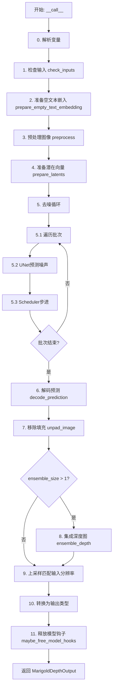
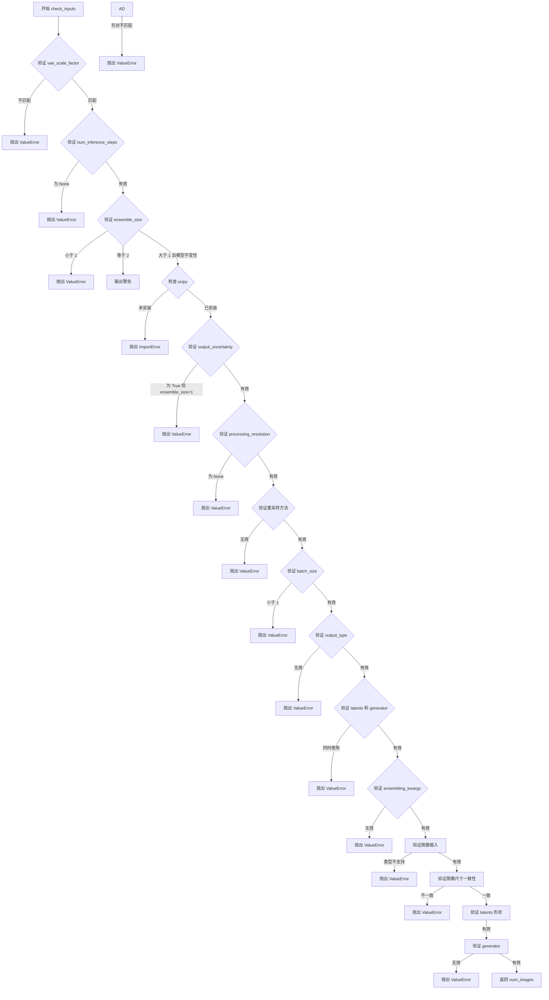
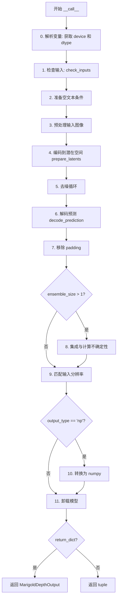
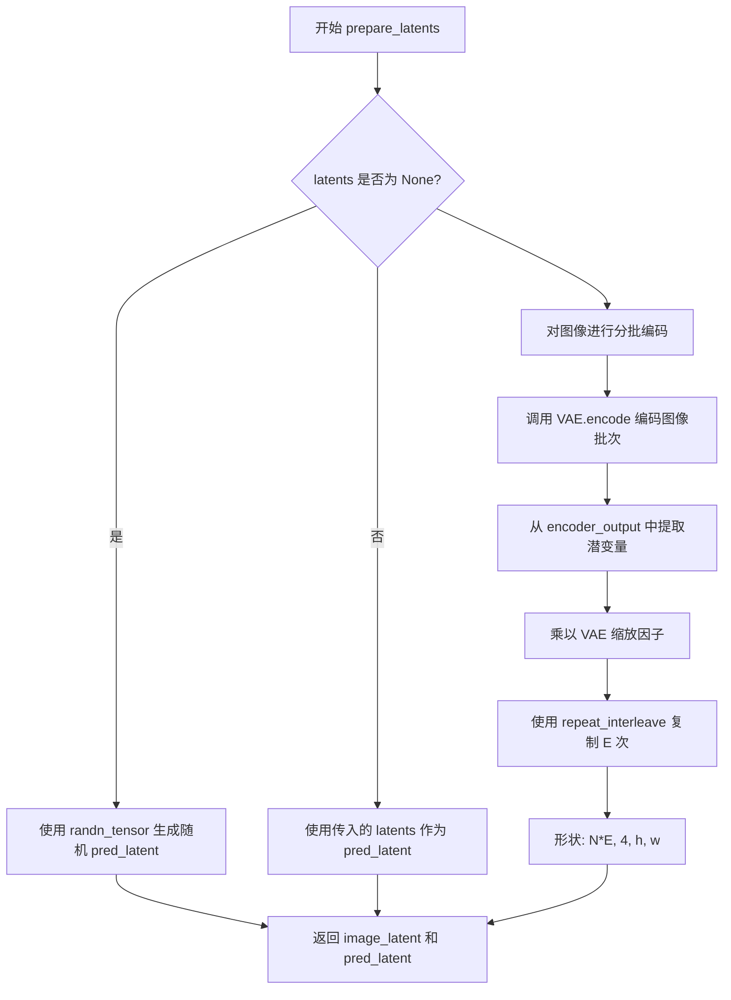

# `diffusers\src\diffusers\pipelines\marigold\pipeline_marigold_depth.py` 详细设计文档

Marigold单目深度估计管道是一个基于扩散模型的深度预测框架，通过条件U-Net对图像进行去噪处理，结合VAE编码器和解码器实现从图像到深度图的端到端推理，支持集成预测、不确定性估计和多种后处理选项。

## 整体流程



## 类结构

```
BaseOutput (基类)
└── MarigoldDepthOutput (数据类)
DiffusionPipeline (基类)
└── MarigoldDepthPipeline (主管道类)
```

## 全局变量及字段


### `XLA_AVAILABLE`
    
XLA加速是否可用

类型：`bool`
    


### `logger`
    
日志记录器

类型：`logging.Logger`
    


### `EXAMPLE_DOC_STRING`
    
示例文档字符串

类型：`str`
    


### `MarigoldDepthOutput.prediction`
    
预测的深度图，值域[0,1]

类型：`np.ndarray | torch.Tensor`
    


### `MarigoldDepthOutput.uncertainty`
    
不确定性图

类型：`None | np.ndarray | torch.Tensor`
    


### `MarigoldDepthOutput.latent`
    
对应的潜在特征

类型：`None | torch.Tensor`
    


### `MarigoldDepthPipeline.model_cpu_offload_seq`
    
CPU卸载顺序

类型：`str`
    


### `MarigoldDepthPipeline.supported_prediction_types`
    
支持的预测类型

类型：`tuple`
    


### `MarigoldDepthPipeline.vae_scale_factor`
    
VAE缩放因子

类型：`int`
    


### `MarigoldDepthPipeline.scale_invariant`
    
是否尺度不变

类型：`bool`
    


### `MarigoldDepthPipeline.shift_invariant`
    
是否平移不变

类型：`bool`
    


### `MarigoldDepthPipeline.default_denoising_steps`
    
默认去噪步数

类型：`int`
    


### `MarigoldDepthPipeline.default_processing_resolution`
    
默认处理分辨率

类型：`int`
    


### `MarigoldDepthPipeline.empty_text_embedding`
    
空文本嵌入

类型：`None`
    


### `MarigoldDepthPipeline.image_processor`
    
图像处理器

类型：`MarigoldImageProcessor`
    
    

## 全局函数及方法


### MarigoldDepthPipeline.__init__

该方法是 MarigoldDepthPipeline 类的构造函数，负责初始化单目深度估计管道的所有核心组件和配置参数，包括 UNet、VAE、调度器、文本编码器等模型组件，以及预测类型、尺度不变性、平移不变性等关键属性。

参数：

- `unet`：`UNet2DConditionModel`，条件 UNet 模型，用于对深度潜在表示进行去噪，以图像潜在表示为条件
- `vae`：`AutoencoderKL`，变分自编码器模型，用于将图像和预测编码和解码到潜在表示
- `scheduler`：`DDIMScheduler | LCMScheduler`，调度器，与 UNet 结合使用以对编码的图像潜在表示进行去噪
- `text_encoder`：`CLIPTextModel`，文本编码器，用于空文本嵌入
- `tokenizer`：`CLIPTokenizer`，CLIP 分词器
- `prediction_type`：`str | None`，模型预测的类型，可选值包括 "depth" 和 "disparity"
- `scale_invariant`：`bool | None`，模型属性，指定预测的深度图是否尺度不变，默认值为 True
- `shift_invariant`：`bool | None`，模型属性，指定预测的深度图是否平移不变，默认值为 True
- `default_denoising_steps`：`int | None`，产生合理质量预测所需的最少去噪扩散步数
- `default_processing_resolution`：`int | None`，processing_resolution 参数的建议值

返回值：无（构造函数）

#### 流程图

```mermaid
flowchart TD
    A[开始 __init__] --> B[调用 super().__init__]
    B --> C{检查 prediction_type 是否支持}
    C -->|不支持| D[记录警告日志]
    C -->|支持| E[继续执行]
    D --> E
    E --> F[register_modules: 注册 unet, vae, scheduler, text_encoder, tokenizer]
    F --> G[register_to_config: 注册配置参数]
    G --> H[计算 vae_scale_factor]
    H --> I[设置实例属性: scale_invariant, shift_invariant, default_denoising_steps, default_processing_resolution]
    I --> J[初始化 empty_text_embedding 为 None]
    J --> K[创建 MarigoldImageProcessor 实例]
    K --> L[结束 __init__]
```

#### 带注释源码

```python
def __init__(
    self,
    unet: UNet2DConditionModel,
    vae: AutoencoderKL,
    scheduler: DDIMScheduler | LCMScheduler,
    text_encoder: CLIPTextModel,
    tokenizer: CLIPTokenizer,
    prediction_type: str | None = None,
    scale_invariant: bool | None = True,
    shift_invariant: bool | None = True,
    default_denoising_steps: int | None = None,
    default_processing_resolution: int | None = None,
):
    # 调用父类 DiffusionPipeline 的构造函数，初始化基础管道功能
    super().__init__()

    # 检查预测类型是否在支持的类型列表中，如果不在则记录警告
    if prediction_type not in self.supported_prediction_types:
        logger.warning(
            f"Potentially unsupported `prediction_type='{prediction_type}'`; values supported by the pipeline: "
            f"{self.supported_prediction_types}."
        )

    # 注册所有模型组件到管道模块字典中，便于后续访问和管理
    self.register_modules(
        unet=unet,
        vae=vae,
        scheduler=scheduler,
        text_encoder=text_encoder,
        tokenizer=tokenizer,
    )

    # 将配置参数注册到 config 属性中，用于保存和加载管道配置
    self.register_to_config(
        prediction_type=prediction_type,
        scale_invariant=scale_invariant,
        shift_invariant=shift_invariant,
        default_denoising_steps=default_denoising_steps,
        default_processing_resolution=default_processing_resolution,
    )

    # 计算 VAE 的缩放因子，基于 VAE 块输出通道数的深度
    # 典型值为 8（2^(3-1) = 4，需要核实）
    self.vae_scale_factor = 2 ** (len(self.vae.config.block_out_channels) - 1) if getattr(self, "vae", None) else 8

    # 保存模型的尺度不变性和平移不变性属性，用于后续对齐和集成处理
    self.scale_invariant = scale_invariant
    self.shift_invariant = shift_invariant

    # 保存默认的去噪步数和处理分辨率，用于自动参数选择
    self.default_denoising_steps = default_denoising_steps
    self.default_processing_resolution = default_processing_resolution

    # 初始化空文本嵌入为 None，将在首次调用时计算并缓存
    self.empty_text_embedding = None

    # 创建图像处理器实例，用于预处理图像和后处理预测结果
    # 传入 VAE 缩放因子以确保正确的空间维度对齐
    self.image_processor = MarigoldImageProcessor(vae_scale_factor=self.vae_scale_factor)
```


### `MarigoldDepthPipeline.check_inputs`

该方法用于验证深度估计管道的所有输入参数是否符合要求，包括图像格式、分辨率、模型配置参数、推理步数、集成参数等。如果任何检查失败，会抛出相应的异常；若所有检查通过，则返回输入图像的数量。

参数：

- `image`：`PipelineImageInput`，输入图像，支持 PIL.Image、numpy 数组、torch.Tensor 或它们的列表
- `num_inference_steps`：`int`，去噪扩散推理步数
- `ensemble_size`：`int`，集成预测的数量
- `processing_resolution`：`int`，有效的处理分辨率
- `resample_method_input`：`str`，用于将输入图像调整到处理分辨率的重采样方法
- `resample_method_output`：`str`，用于将输出预测调整到输入分辨率的重采样方法
- `batch_size`：`int`，批处理大小
- `ensembling_kwargs`：`dict[str, Any] | None`，用于精确控制集成的额外参数字典
- `latents`：`torch.Tensor | None`，用于替换随机初始化的潜在噪声张量
- `generator`：`torch.Generator | list[torch.Generator] | None`，随机数生成器对象以确保可重复性
- `output_type`：`str`，输出预测和可选不确定性字段的首选格式
- `output_uncertainty`：`bool`，是否输出预测不确定性图

返回值：`int`，返回输入图像的数量

#### 流程图



#### 带注释源码

```python
def check_inputs(
    self,
    image: PipelineImageInput,
    num_inference_steps: int,
    ensemble_size: int,
    processing_resolution: int,
    resample_method_input: str,
    resample_method_output: str,
    batch_size: int,
    ensembling_kwargs: dict[str, Any] | None,
    latents: torch.Tensor | None,
    generator: torch.Generator | list[torch.Generator] | None,
    output_type: str,
    output_uncertainty: bool,
) -> int:
    """
    验证深度估计管道的所有输入参数是否符合要求。
    
    参数检查包括：
    - VAE 缩放因子一致性
    - 推理步数有效性
    - 集成大小有效性及 scipy 依赖检查
    - 处理分辨率有效性
    - 重采样方法有效性
    - 批处理大小有效性
    - 输出类型有效性
    - 潜在变量和生成器的互斥性
    - 集成参数的有效性
    - 输入图像的类型和尺寸一致性
    - 潜在变量形状与处理分辨率的匹配性
    - 生成器类型和数量的一致性
    
    返回:
        int: 输入图像的数量
    """
    # 验证 VAE 缩放因子是否与初始化时计算的一致
    actual_vae_scale_factor = 2 ** (len(self.vae.config.block_out_channels) - 1)
    if actual_vae_scale_factor != self.vae_scale_factor:
        raise ValueError(
            f"`vae_scale_factor` computed at initialization ({self.vae_scale_factor}) differs from the actual one ({actual_vae_scale_factor})."
        )
    
    # 验证推理步数必须指定且为正数
    if num_inference_steps is None:
        raise ValueError("`num_inference_steps` is not specified and could not be resolved from the model config.")
    if num_inference_steps < 1:
        raise ValueError("`num_inference_steps` must be positive.")
    
    # 验证集成大小必须为正数
    if ensemble_size < 1:
        raise ValueError("`ensemble_size` must be positive.")
    if ensemble_size == 2:
        logger.warning(
            "`ensemble_size` == 2 results are similar to no ensembling (1); "
            "consider increasing the value to at least 3."
        )
    
    # 验证当使用集成且模型具有不变性时，scipy 必须可用
    if ensemble_size > 1 and (self.scale_invariant or self.shift_invariant) and not is_scipy_available():
        raise ImportError("Make sure to install scipy if you want to use ensembling.")
    
    # 验证输出不确定性时必须设置集成大小大于1
    if ensemble_size == 1 and output_uncertainty:
        raise ValueError(
            "Computing uncertainty by setting `output_uncertainty=True` also requires setting `ensemble_size` "
            "greater than 1."
        )
    
    # 验证处理分辨率必须指定且为非负数
    if processing_resolution is None:
        raise ValueError(
            "`processing_resolution` is not specified and could not be resolved from the model config."
        )
    if processing_resolution < 0:
        raise ValueError(
            "`processing_resolution` must be non-negative: 0 for native resolution, or any positive value for "
            "downsampled processing."
        )
    if processing_resolution % self.vae_scale_factor != 0:
        raise ValueError(f"`processing_resolution` must be a multiple of {self.vae_scale_factor}.")
    
    # 验证重采样方法必须为 PIL 支持的字符串
    if resample_method_input not in ("nearest", "nearest-exact", "bilinear", "bicubic", "area"):
        raise ValueError(
            "`resample_method_input` takes string values compatible with PIL library: "
            "nearest, nearest-exact, bilinear, bicubic, area."
        )
    if resample_method_output not in ("nearest", "nearest-exact", "bilinear", "bicubic", "area"):
        raise ValueError(
            "`resample_method_output` takes string values compatible with PIL library: "
            "nearest, nearest-exact, bilinear, bicubic, area."
        )
    
    # 验证批处理大小必须为正数
    if batch_size < 1:
        raise ValueError("`batch_size` must be positive.")
    
    # 验证输出类型必须为 'pt' 或 'np'
    if output_type not in ["pt", "np"]:
        raise ValueError("`output_type` must be one of `pt` or `np`.")
    
    # 验证 latents 和 generator 不能同时使用
    if latents is not None and generator is not None:
        raise ValueError("`latents` and `generator` cannot be used together.")
    
    # 验证集成参数字典的有效性
    if ensembling_kwargs is not None:
        if not isinstance(ensembling_kwargs, dict):
            raise ValueError("`ensembling_kwargs` must be a dictionary.")
        if "reduction" in ensembling_kwargs and ensembling_kwargs["reduction"] not in ("mean", "median"):
            raise ValueError("`ensembling_kwargs['reduction']` can be either `'mean'` or `'median'`.")

    # 图像检查：验证类型、维度，并收集尺寸信息
    num_images = 0
    W, H = None, None
    if not isinstance(image, list):
        image = [image]
    for i, img in enumerate(image):
        if isinstance(img, np.ndarray) or torch.is_tensor(img):
            if img.ndim not in (2, 3, 4):
                raise ValueError(f"`image[{i}]` has unsupported dimensions or shape: {img.shape}.")
            H_i, W_i = img.shape[-2:]
            N_i = 1
            if img.ndim == 4:
                N_i = img.shape[0]
        elif isinstance(img, Image.Image):
            W_i, H_i = img.size
            N_i = 1
        else:
            raise ValueError(f"Unsupported `image[{i}]` type: {type(img)}.")
        
        # 验证所有图像尺寸必须一致
        if W is None:
            W, H = W_i, H_i
        elif (W, H) != (W_i, H_i):
            raise ValueError(
                f"Input `image[{i}]` has incompatible dimensions {(W_i, H_i)} with the previous images {(W, H)}"
            )
        num_images += N_i

    # 潜在变量检查：验证形状与处理分辨率的匹配性
    if latents is not None:
        if not torch.is_tensor(latents):
            raise ValueError("`latents` must be a torch.Tensor.")
        if latents.dim() != 4:
            raise ValueError(f"`latents` has unsupported dimensions or shape: {latents.shape}.")

        if processing_resolution > 0:
            max_orig = max(H, W)
            new_H = H * processing_resolution // max_orig
            new_W = W * processing_resolution // max_orig
            if new_H == 0 or new_W == 0:
                raise ValueError(f"Extreme aspect ratio of the input image: [{W} x {H}]")
            W, H = new_W, new_H
        
        # 计算期望的潜在变量形状
        w = (W + self.vae_scale_factor - 1) // self.vae_scale_factor
        h = (H + self.vae_scale_factor - 1) // self.vae_scale_factor
        shape_expected = (num_images * ensemble_size, self.vae.config.latent_channels, h, w)

        if latents.shape != shape_expected:
            raise ValueError(f"`latents` has unexpected shape={latents.shape} expected={shape_expected}.")

    # 生成器检查：验证类型和数量一致性
    if generator is not None:
        if isinstance(generator, list):
            if len(generator) != num_images * ensemble_size:
                raise ValueError(
                    "The number of generators must match the total number of ensemble members for all input images."
                )
            if not all(g.device.type == generator[0].device.type for g in generator):
                raise ValueError("`generator` device placement is not consistent in the list.")
        elif not isinstance(generator, torch.Generator):
            raise ValueError(f"Unsupported generator type: {type(generator)}.")

    # 返回输入图像数量
    return num_images
```


### `MarigoldDepthPipeline.progress_bar`

该方法是一个进度条封装函数，用于在推理过程中显示批量处理的进度。它基于 `tqdm` 库实现，支持从已有的可迭代对象创建进度条，或根据指定的总数创建进度条，并从管道配置中继承默认的进度条设置。

参数：

- `iterable`：可选，任意可迭代对象，要迭代的对象，用于直接从迭代器创建进度条
- `total`：可选，`int`，迭代的总次数，当没有可迭代对象时用于指定总迭代数
- `desc`：可选，`str`，进度条的描述文本，显示在进度条前方
- `leave`：可选，`bool`，是否在迭代完成后保留进度条（默认为 `True`）

返回值：`tqdm`，返回 `tqdm` 进度条实例，用于包装迭代过程以显示进度

#### 流程图

```mermaid
flowchart TD
    A[开始 progress_bar] --> B{检查 _progress_bar_config 属性是否存在}
    B -->|不存在| C[初始化为空字典]
    B -->|存在| D{类型是否为 dict}
    D -->|否| E[抛出 ValueError 异常]
    D -->|是| F[继续执行]
    C --> F
    
    F --> G[复制 _progress_bar_config 到新字典]
    G --> H[更新 desc: 优先使用参数 desc, 否则使用配置中的 desc]
    G --> I[更新 leave: 优先使用参数 leave, 否则使用配置中的 leave]
    
    H --> J{iterable 参数是否不为 None}
    J -->|是| K[调用 tqdm(iterable, **progress_bar_config) 返回进度条]
    J -->|否| L{total 参数是否不为 None}
    L -->|是| M[调用 tqdm(total=total, **progress_bar_config) 返回进度条]
    L -->|否| N[抛出 ValueError: 必须定义 total 或 iterable]
    
    K --> O[返回 tqdm 对象]
    M --> O
    E --> O
```

#### 带注释源码

```python
@torch.compiler.disable
def progress_bar(self, iterable=None, total=None, desc=None, leave=True):
    """
    创建并返回一个 tqdm 进度条实例。
    该方法封装了 tqdm 库，用于在推理过程中显示批量处理的进度。
    
    参数:
        iterable: 可选的迭代器对象。如果提供，将基于该迭代器创建进度条。
        total: 可选的整数，指定迭代的总次数。当 iterable 为 None 时使用。
        desc: 可选的字符串，用于设置进度条的描述文本。
        leave: 布尔值，控制进度条在迭代完成后是否保留在终端中。
    
    返回:
        tqdm: 配置好的 tqdm 进度条实例。
    """
    # 检查是否存在 _progress_bar_config 属性，若不存在则初始化为空字典
    if not hasattr(self, "_progress_bar_config"):
        self._progress_bar_config = {}
    # 如果存在但类型不是字典，抛出类型错误异常
    elif not isinstance(self._progress_bar_config, dict):
        raise ValueError(
            f"`self._progress_bar_config` should be of type `dict`, but is {type(self._progress_bar_config)}."
        )

    # 复制配置字典，避免直接修改原始配置
    progress_bar_config = dict(**self._progress_bar_config)
    # 使用参数 desc 覆盖配置中的 desc（如果参数提供了值）
    progress_bar_config["desc"] = progress_bar_config.get("desc", desc)
    # 使用参数 leave 覆盖配置中的 leave（如果参数提供了值）
    progress_bar_config["leave"] = progress_bar_config.get("leave", leave)
    
    # 根据提供的参数决定创建进度条的方式
    if iterable is not None:
        # 直接使用可迭代对象创建 tqdm 进度条
        return tqdm(iterable, **progress_bar_config)
    elif total is not None:
        # 使用总数创建 tqdm 进度条（适用于手动控制迭代的场景）
        return tqdm(total=total, **progress_bar_config)
    else:
        # 既没有 iterable 也没有 total，抛出错误
        raise ValueError("Either `total` or `iterable` has to be defined.")
```


### `MarigoldDepthPipeline.__call__`

这是 Marigold 深度估计管道的主调用方法，负责接收输入图像并通过扩散模型预测深度图。该方法实现了完整的单目深度估计流程，包括图像预处理、潜在空间编码、去噪扩散、解码预测、集成多帧预测以及后处理等步骤，支持批次处理、模型卸载和多种输出格式。

**参数：**

- `image`：`PipelineImageInput`，输入图像，支持 PIL.Image、numpy 数组、torch.Tensor 或其列表，用于深度估计任务
- `num_inference_steps`：`int | None`，推理时的去噪扩散步数，默认为 None 自动选择
- `ensemble_size`：`int`，集成预测数量，默认为 1
- `processing_resolution`：`int | None`，有效处理分辨率，默认为 None 从模型配置中获取
- `match_input_resolution`：`bool`，是否将输出调整为匹配输入分辨率，默认为 True
- `resample_method_input`：`str`，调整输入图像大小的重采样方法，默认为 "bilinear"
- `resample_method_output`：`str`，调整输出预测的重采样方法，默认为 "bilinear"
- `batch_size`：`int`，批次大小，默认为 1
- `ensembling_kwargs`：`dict | None`，集成控制的额外参数
- `latents`：`torch.Tensor | list | None`，潜在噪声张量
- `generator`：`torch.Generator | list | None`，随机数生成器
- `output_type`：`str`，输出格式，"np" 或 "pt"，默认为 "np"
- `output_uncertainty`：`bool`，是否输出不确定性图，默认为 False
- `output_latent`：`bool`，是否输出潜在码，默认为 False
- `return_dict`：`bool`，是否返回字典格式，默认为 True

**返回值：** `MarigoldDepthOutput | tuple`，返回预测深度图、可选的不确定性图和可选的潜在码

#### 流程图



#### 带注释源码

```python
@torch.no_grad()
@replace_example_docstring(EXAMPLE_DOC_STRING)
def __call__(
    self,
    image: PipelineImageInput,
    num_inference_steps: int | None = None,
    ensemble_size: int = 1,
    processing_resolution: int | None = None,
    match_input_resolution: bool = True,
    resample_method_input: str = "bilinear",
    resample_method_output: str = "bilinear",
    batch_size: int = 1,
    ensembling_kwargs: dict[str, Any] | None = None,
    latents: torch.Tensor | list[torch.Tensor] | None = None,
    generator: torch.Generator | list[torch.Generator] | None = None,
    output_type: str = "np",
    output_uncertainty: bool = False,
    output_latent: bool = False,
    return_dict: bool = True,
):
    """
    管道调用主方法，执行单目深度估计
    """
    # 0. 解析变量 - 获取执行设备和数据类型
    device = self._execution_device
    dtype = self.dtype

    # 从模型配置中获取默认的推理步数和处理分辨率
    if num_inference_steps is None:
        num_inference_steps = self.default_denoising_steps
    if processing_resolution is None:
        processing_resolution = self.default_processing_resolution

    # 1. 检查输入参数的有效性
    num_images = self.check_inputs(
        image,
        num_inference_steps,
        ensemble_size,
        processing_resolution,
        resample_method_input,
        resample_method_output,
        batch_size,
        ensembling_kwargs,
        latents,
        generator,
        output_type,
        output_uncertainty,
    )

    # 2. 准备空文本条件 - 用于条件扩散
    # 使用空的文本提示获取文本嵌入，作为无条件 Guidance
    if self.empty_text_embedding is None:
        prompt = ""
        text_inputs = self.tokenizer(
            prompt,
            padding="do_not_pad",
            max_length=self.tokenizer.model_max_length,
            truncation=True,
            return_tensors="pt",
        )
        text_input_ids = text_inputs.input_ids.to(device)
        self.empty_text_embedding = self.text_encoder(text_input_ids)[0]

    # 3. 预处理输入图像 - 调整大小、填充到 VAE 兼容尺寸
    image, padding, original_resolution = self.image_processor.preprocess(
        image, processing_resolution, resample_method_input, device, dtype
    )

    # 4. 编码输入图像到潜在空间，并为集成成员初始化预测潜在码
    # image_latent: 输入图像的潜在表示，复制 E 份用于集成
    # pred_latent: 初始随机噪声潜在码
    image_latent, pred_latent = self.prepare_latents(
        image, latents, generator, ensemble_size, batch_size
    )

    del image  # 释放原始图像内存

    # 准备批处理的文本嵌入
    batch_empty_text_embedding = self.empty_text_embedding.to(device=device, dtype=dtype).repeat(
        batch_size, 1, 1
    )

    # 5. 去噪循环 - 核心扩散过程
    # 对所有 N*E 个潜在码进行批次处理
    pred_latents = []

    for i in self.progress_bar(
        range(0, num_images * ensemble_size, batch_size), leave=True, desc="Marigold predictions..."
    ):
        # 获取当前批次的图像潜在码和预测潜在码
        batch_image_latent = image_latent[i : i + batch_size]
        batch_pred_latent = pred_latent[i : i + batch_size]
        effective_batch_size = batch_image_latent.shape[0]
        text = batch_empty_text_embedding[:effective_batch_size]

        # 设置扩散调度器的时间步
        self.scheduler.set_timesteps(num_inference_steps, device=device)
        
        # 迭代去噪
        for t in self.progress_bar(self.scheduler.timesteps, leave=False, desc="Diffusion steps..."):
            # 拼接图像潜在码和预测潜在码作为 UNet 输入
            batch_latent = torch.cat([batch_image_latent, batch_pred_latent], dim=1)
            # UNet 预测噪声
            noise = self.unet(batch_latent, t, encoder_hidden_states=text, return_dict=False)[0]
            # 调度器执行去噪步骤
            batch_pred_latent = self.scheduler.step(
                noise, t, batch_pred_latent, generator=generator
            ).prev_sample

            # XLA 设备支持
            if XLA_AVAILABLE:
                xm.mark_step()

        pred_latents.append(batch_pred_latent)

    # 拼接所有批次的预测潜在码
    pred_latent = torch.cat(pred_latents, dim=0)

    # 清理中间变量
    del (
        pred_latents,
        image_latent,
        batch_empty_text_embedding,
        batch_image_latent,
        batch_pred_latent,
        text,
        batch_latent,
        noise,
    )

    # 6. 从潜在空间解码预测到像素空间
    prediction = torch.cat(
        [
            self.decode_prediction(pred_latent[i : i + batch_size])
            for i in range(0, pred_latent.shape[0], batch_size)
        ],
        dim=0,
    )

    # 可选：保留潜在码用于后续调用
    if not output_latent:
        pred_latent = None

    # 7. 移除填充 - 还原到处理分辨率尺寸
    prediction = self.image_processor.unpad_image(prediction, padding)

    # 8. 集成多个预测并计算不确定性
    uncertainty = None
    if ensemble_size > 1:
        # 重塑为 [N, E, 1, PH, PW]
        prediction = prediction.reshape(num_images, ensemble_size, *prediction.shape[1:])
        # 对每个图像独立进行集成
        prediction = [
            self.ensemble_depth(
                prediction[i],
                self.scale_invariant,
                self.shift_invariant,
                output_uncertainty,
                **(ensembling_kwargs or {}),
            )
            for i in range(num_images)
        ]
        prediction, uncertainty = zip(*prediction)
        prediction = torch.cat(prediction, dim=0)
        if output_uncertainty:
            uncertainty = torch.cat(uncertainty, dim=0)
        else:
            uncertainty = None

    # 9. 上采样到原始输入分辨率
    if match_input_resolution:
        prediction = self.image_processor.resize_antialias(
            prediction, original_resolution, resample_method_output, is_aa=False
        )
        if uncertainty is not None and output_uncertainty:
            uncertainty = self.image_processor.resize_antialias(
                uncertainty, original_resolution, resample_method_output, is_aa=False
            )

    # 10. 转换为目标输出格式
    if output_type == "np":
        prediction = self.image_processor.pt_to_numpy(prediction)
        if uncertainty is not None and output_uncertainty:
            uncertainty = self.image_processor.pt_to_numpy(uncertainty)

    # 11. 卸载所有模型以释放显存
    self.maybe_free_model_hooks()

    # 返回结果
    if not return_dict:
        return (prediction, uncertainty, pred_latent)

    return MarigoldDepthOutput(
        prediction=prediction,
        uncertainty=uncertainty,
        latent=pred_latent,
    )
```


### `MarigoldDepthPipeline.prepare_latents`

该方法负责将输入图像编码到潜空间（latent space），并初始化预测潜变量（pred_latent），为后续的去噪扩散过程准备必要的输入数据。

参数：

-  `self`：`MarigoldDepthPipeline` 实例本身
-  `image`：`torch.Tensor`，输入图像张量，形状为 `[N, 3, H, W]`，其中 N 为图像数量
-  `latents`：`torch.Tensor | None`，可选的预定义预测潜变量，如果为 `None` 则随机生成
-  `generator`：`torch.Generator | None`，随机数生成器，用于确保潜变量生成的可重复性
-  `ensemble_size`：`int`，集成预测的数量，用于创建多个独立预测
-  `batch_size`：`int`，批处理大小，用于分批处理图像编码

返回值：`tuple[torch.Tensor, torch.Tensor]`，返回两个张量组成的元组：
- 第一个元素 `image_latent`：编码后的图像潜变量，形状为 `[N*E, 4, h, w]`，其中 E 为集成大小
- 第二个元素 `pred_latent`：预测潜变量，形状为 `[N*E, 4, h, w]`

#### 流程图



#### 带注释源码

```python
def prepare_latents(
    self,
    image: torch.Tensor,
    latents: torch.Tensor | None,
    generator: torch.Generator | None,
    ensemble_size: int,
    batch_size: int,
) -> tuple[torch.Tensor, torch.Tensor]:
    """
    准备用于去噪过程的潜变量。

    该方法执行两个主要任务：
    1. 将输入图像编码到 VAE 潜空间，并按 ensemble_size 复制
    2. 初始化预测潜变量（随机生成或使用提供的值）

    Args:
        image: 输入图像张量 [N, 3, H, W]
        latents: 可选的预定义预测潜变量，为 None 时随机生成
        generator: 随机数生成器，用于确保可重复性
        ensemble_size: 集成预测的数量
        batch_size: 批处理大小

    Returns:
        (image_latent, pred_latent) 元组，形状均为 [N*E, 4, h, w]
    """
    
    def retrieve_latents(encoder_output):
        """从 VAE 编码器输出中提取潜变量"""
        if hasattr(encoder_output, "latent_dist"):
            # 从潜在分布中获取模式（均值）
            return encoder_output.latent_dist.mode()
        elif hasattr(encoder_output, "latents"):
            # 直接获取潜在变量
            return encoder_output.latents
        else:
            raise AttributeError("Could not access latents of provided encoder_output")

    # ========== 步骤 1: 编码输入图像到潜空间 ==========
    # 分批编码图像，避免内存溢出
    image_latent = torch.cat(
        [
            # 对每个批次调用 VAE 编码器
            retrieve_latents(self.vae.encode(image[i : i + batch_size]))
            for i in range(0, image.shape[0], batch_size)
        ],
        dim=0,
    )  # [N, 4, h, w] - N 个图像的潜变量表示

    # 应用 VAE 缩放因子，将潜变量调整到正确的数值范围
    image_latent = image_latent * self.vae.config.scaling_factor

    # 按 ensemble_size 复制每个图像的潜变量
    # 这样每个输入图像都有 E 个独立的预测副本
    image_latent = image_latent.repeat_interleave(ensemble_size, dim=0)  # [N*E, 4, h, w]

    # ========== 步骤 2: 准备预测潜变量 ==========
    pred_latent = latents
    if pred_latent is None:
        # 随机生成与 image_latent 形状相同的噪声潜变量
        # 这些潜变量将在去噪循环中逐步被预测为深度图
        pred_latent = randn_tensor(
            image_latent.shape,
            generator=generator,
            device=image_latent.device,
            dtype=image_latent.dtype,
        )  # [N*E, 4, h, w]

    # 返回图像潜变量和预测潜变量
    return image_latent, pred_latent
```


### `MarigoldDepthPipeline.decode_prediction`

该方法将模型预测的潜在表示（latent）解码为最终的深度图，通过VAE解码器将潜在空间转换为像素空间，并进行必要的归一化处理将值域从[-1,1]映射到[0,1]。

参数：

- `pred_latent`：`torch.Tensor`，输入的预测潜在变量，形状为 `[B, latent_channels, H, W]`，其中 `latent_channels` 由 VAE 配置决定

返回值：`torch.Tensor`，解码并归一化后的深度预测，形状为 `[B, 1, H, W]`，值域在 [0, 1] 范围内

#### 流程图

```mermaid
flowchart TD
    A[输入 pred_latent] --> B{验证输入维度}
    B -->|维度!=4| E[抛出 ValueError]
    B -->|通道数不匹配| E
    B -->|验证通过| C[VAE解码]
    
    C --> D[按通道取平均]
    D --> F[裁剪到[-1, 1]]
    F --> G[归一化到[0, 1]]
    G --> H[输出 prediction]
    
    E --> I[结束]
    H --> I
    
    style A fill:#e1f5fe
    style H fill:#e8f5e8
    style E fill:#ffebee
```

#### 带注释源码

```python
def decode_prediction(self, pred_latent: torch.Tensor) -> torch.Tensor:
    """
    将预测的潜在表示解码为深度图。

    Args:
        pred_latent: 预测的潜在变量，形状为 [B, latent_channels, H, W]

    Returns:
        解码后的深度预测，形状为 [B, 1, H, W]，值域 [0, 1]
    """
    # 验证输入维度：必须是4D张量且通道数匹配VAE配置
    if pred_latent.dim() != 4 or pred_latent.shape[1] != self.vae.config.latent_channels:
        raise ValueError(
            f"Expecting 4D tensor of shape [B,{self.vae.config.latent_channels},H,W]; got {pred_latent.shape}."
        )

    # 使用VAE解码器将潜在空间解码到像素空间
    # 需要除以scaling_factor以恢复原始潜在表示
    prediction = self.vae.decode(pred_latent / self.vae.config.scaling_factor, return_dict=False)[0]  # [B,3,H,W]

    # 由于VAE输出3通道图像，而深度图只需要单通道
    # 对通道维度取平均得到单通道深度图
    prediction = prediction.mean(dim=1, keepdim=True)  # [B,1,H,W]

    # 裁剪预测值到[-1, 1]范围（VAE的标准输出范围）
    prediction = torch.clip(prediction, -1.0, 1.0)  # [B,1,H,W]

    # 将值域从[-1, 1]线性映射到[0, 1]
    prediction = (prediction + 1.0) / 2.0

    return prediction  # [B,1,H,W]
```


### `MarigoldDepthPipeline.ensemble_depth`

该方法是一个静态方法，用于对输入的多个深度图预测结果进行集成（ensemble）处理。它通过仿射对齐（Affine Alignment）将多个深度图预测对齐到统一尺度，然后使用中值或均值方法融合为一个最终深度图，并可选地计算预测不确定性图。该方法支持尺度不变（scale-invariant）和平移不变（shift-invariant）的深度估计，适用于单目深度估计模型的集成预测场景。

参数：

- `depth`：`torch.Tensor`，输入的深度图集合，形状为 `(B, 1, H, W)`，其中 B 是集合成员数量（即 ensemble_size）
- `scale_invariant`：`bool`，可选，默认为 `True`，是否将预测视为尺度不变（scale-invariant）的
- `shift_invariant`：`bool`，可选，默认为 `True`，是否将预测视为平移不变（shift-invariant）的
- `output_uncertainty`：`bool`，可选，默认为 `False`，是否输出不确定性图
- `reduction`：`str`，可选，默认为 `"median"`，集成对齐后预测的归约方法，可选值包括 `"mean"` 和 `"median"`
- `regularizer_strength`：`float`，可选，默认为 `0.02`，正则化强度，用于将对齐后的预测拉回到 [0, 1] 范围
- `max_iter`：`int`，可选，默认为 `2`，对齐优化器（scipy.optimize.minimize）的最大迭代次数
- `tol`：`float`，可选，默认为 `1e-3`，对齐优化器的收敛容差
- `max_res`：`int`，可选，默认为 `1024`，执行对齐操作的分辨率上限，若深度图尺寸超过该值则下采样后再对齐

返回值：`tuple[torch.Tensor, torch.Tensor | None]`，返回两个元素，第一个是对齐并集成后的深度图，形状为 `(1, 1, H, W)`，第二个是不确定性图（若 `output_uncertainty=True`），形状为 `(1, 1, H, W)`，否则为 `None`

#### 流程图

```mermaid
flowchart TD
    A[输入 depth: (B,1,H,W)] --> B{检查输入有效性}
    B -->|通过| C{需要对齐?}
    B -->|失败| Z[抛出 ValueError]
    C -->|是| D[初始化参数 init_param]
    C -->|否| G[直接进行集成]
    D --> E[下采样到 max_res]
    E --> F[使用 BFGS 优化器求解最优仿射参数]
    F --> G[对齐深度图 align]
    G --> H[集成预测 ensemble]
    H --> I{计算不确定性?}
    I -->|是| J[计算 uncertainty]
    I -->|否| K[uncertainty = None]
    J --> L[归一化到 [0,1] 范围]
    K --> L
    L --> M[返回 depth, uncertainty]
```

#### 带注释源码

```python
@staticmethod
def ensemble_depth(
    depth: torch.Tensor,
    scale_invariant: bool = True,
    shift_invariant: bool = True,
    output_uncertainty: bool = False,
    reduction: str = "median",
    regularizer_strength: float = 0.02,
    max_iter: int = 2,
    tol: float = 1e-3,
    max_res: int = 1024,
) -> tuple[torch.Tensor, torch.Tensor | None]:
    """
    Ensembles the depth maps represented by the `depth` tensor with expected shape `(B, 1, H, W)`, where B is the
    number of ensemble members for a given prediction of size `(H x W)`. Even though the function is designed for
    depth maps, it can also be used with disparity maps as long as the input tensor values are non-negative. The
    alignment happens when the predictions have one or more degrees of freedom, that is when they are either
    affine-invariant (`scale_invariant=True` and `shift_invariant=True`), or just scale-invariant (only
    `scale_invariant=True`). For absolute predictions (`scale_invariant=False` and `shift_invariant=False`)
    alignment is skipped and only ensembling is performed.

    Args:
        depth (`torch.Tensor`):
            Input ensemble depth maps.
        scale_invariant (`bool`, *optional*, defaults to `True`):
            Whether to treat predictions as scale-invariant.
        shift_invariant (`bool`, *optional*, defaults to `True`):
            Whether to treat predictions as shift-invariant.
        output_uncertainty (`bool`, *optional*, defaults to `False`):
            Whether to output uncertainty map.
        reduction (`str`, *optional*, defaults to `"median"`):
            Reduction method used to ensemble aligned predictions. The accepted values are: `"mean"` and
            `"median"`.
        regularizer_strength (`float`, *optional*, defaults to `0.02`):
            Strength of the regularizer that pulls the aligned predictions to the unit range from 0 to 1.
        max_iter (`int`, *optional*, defaults to `2`):
            Maximum number of the alignment solver steps. Refer to `scipy.optimize.minimize` function, `options`
            argument.
        tol (`float`, *optional*, defaults to `1e-3`):
            Alignment solver tolerance. The solver stops when the tolerance is reached.
        max_res (`int`, *optional*, defaults to `1024`):
            Resolution at which the alignment is performed; `None` matches the `processing_resolution`.
    Returns:
        A tensor of aligned and ensembled depth maps and optionally a tensor of uncertainties of the same shape:
        `(1, 1, H, W)`.
    """
    # 1. 输入验证：检查深度图维度是否为 4D 且第二维为 1
    if depth.dim() != 4 or depth.shape[1] != 1:
        raise ValueError(f"Expecting 4D tensor of shape [B,1,H,W]; got {depth.shape}.")
    # 2. 验证归约方法是否有效
    if reduction not in ("mean", "median"):
        raise ValueError(f"Unrecognized reduction method: {reduction}.")
    # 3. 纯平移不变（shift-invariant only）的集成不被支持
    if not scale_invariant and shift_invariant:
        raise ValueError("Pure shift-invariant ensembling is not supported.")

    def init_param(depth: torch.Tensor):
        """
        初始化仿射对齐参数。
        对于尺度+平移不变：初始化 s=1/(max-min), t=-s*min
        对于仅尺度不变：初始化 s=1/max
        """
        # 获取每个ensemble成员在所有像素上的最小值和最大值
        init_min = depth.reshape(ensemble_size, -1).min(dim=1).values
        init_max = depth.reshape(ensemble_size, -1).max(dim=1).values

        if scale_invariant and shift_invariant:
            # 仿射变换：depth * s + t
            init_s = 1.0 / (init_max - init_min).clamp(min=1e-6)
            init_t = -init_s * init_min
            param = torch.cat((init_s, init_t)).cpu().numpy()
        elif scale_invariant:
            # 仅尺度变换：depth * s
            init_s = 1.0 / init_max.clamp(min=1e-6)
            param = init_s.cpu().numpy()
        else:
            raise ValueError("Unrecognized alignment.")
        param = param.astype(np.float64)

        return param

    def align(depth: torch.Tensor, param: np.ndarray) -> torch.Tensor:
        """
        使用优化得到的仿射参数对深度图进行对齐。
        - 仿射不变：depth * s + t
        - 仅尺度不变：depth * s
        """
        if scale_invariant and shift_invariant:
            s, t = np.split(param, 2)
            s = torch.from_numpy(s).to(depth).view(ensemble_size, 1, 1, 1)
            t = torch.from_numpy(t).to(depth).view(ensemble_size, 1, 1, 1)
            out = depth * s + t
        elif scale_invariant:
            s = torch.from_numpy(param).to(depth).view(ensemble_size, 1, 1, 1)
            out = depth * s
        else:
            raise ValueError("Unrecognized alignment.")
        return out

    def ensemble(
        depth_aligned: torch.Tensor, return_uncertainty: bool = False
    ) -> tuple[torch.Tensor, torch.Tensor | None]:
        """
        对对齐后的深度图进行集成（归约）。
        - mean: 计算均值，uncertainty 为标准差
        - median: 计算中值，uncertainty 为绝对偏差的中值
        """
        uncertainty = None
        if reduction == "mean":
            prediction = torch.mean(depth_aligned, dim=0, keepdim=True)
            if return_uncertainty:
                uncertainty = torch.std(depth_aligned, dim=0, keepdim=True)
        elif reduction == "median":
            prediction = torch.median(depth_aligned, dim=0, keepdim=True).values
            if return_uncertainty:
                uncertainty = torch.median(torch.abs(depth_aligned - prediction), dim=0, keepdim=True).values
        else:
            raise ValueError(f"Unrecognized reduction method: {reduction}.")
        return prediction, uncertainty

    def cost_fn(param: np.ndarray, depth: torch.Tensor) -> float:
        """
        优化目标函数：最小化所有ensemble成员之间的差异 + 正则化项。
        - 两两之间的L2距离均值
        - 正则化项：拉向 [0,1] 范围
        """
        cost = 0.0
        depth_aligned = align(depth, param)

        # 计算所有ensemble成员两两之间的差异
        for i, j in torch.combinations(torch.arange(ensemble_size)):
            diff = depth_aligned[i] - depth_aligned[j]
            cost += (diff**2).mean().sqrt().item()

        # 正则化项：鼓励预测值在 [0,1] 范围内
        if regularizer_strength > 0:
            prediction, _ = ensemble(depth_aligned, return_uncertainty=False)
            err_near = prediction.min().abs().item()
            err_far = (1.0 - prediction.max()).abs().item()
            cost += (err_near + err_far) * regularizer_strength

        return cost

    def compute_param(depth: torch.Tensor):
        """
        使用 scipy.optimize.minimize 的 BFGS 方法求解最优仿射参数。
        若深度图分辨率超过 max_res，则先下采样以加速优化。
        """
        import scipy

        depth_to_align = depth.to(torch.float32)
        # 超过最大分辨率时进行下采样
        if max_res is not None and max(depth_to_align.shape[2:]) > max_res:
            depth_to_align = MarigoldImageProcessor.resize_to_max_edge(depth_to_align, max_res, "nearest-exact")

        param = init_param(depth_to_align)

        # BFGS 优化器求解仿射参数
        res = scipy.optimize.minimize(
            partial(cost_fn, depth=depth_to_align),
            param,
            method="BFGS",
            tol=tol,
            options={"maxiter": max_iter, "disp": False},
        )

        return res.x

    # 判断是否需要进行对齐（scale_invariant 或 shift_invariant）
    requires_aligning = scale_invariant or shift_invariant
    ensemble_size = depth.shape[0]

    # 如果需要对齐，则计算并应用对齐参数
    if requires_aligning:
        param = compute_param(depth)
        depth = align(depth, param)

    # 执行集成（归约）操作
    depth, uncertainty = ensemble(depth, return_uncertainty=output_uncertainty)

    # 归一化：将深度图归一化到 [0,1] 范围
    depth_max = depth.max()
    if scale_invariant and shift_invariant:
        depth_min = depth.min()
    elif scale_invariant:
        depth_min = 0
    else:
        raise ValueError("Unrecognized alignment.")
    depth_range = (depth_max - depth_min).clamp(min=1e-6)
    depth = (depth - depth_min) / depth_range
    # 不确定性也需要按同样的尺度归一化
    if output_uncertainty:
        uncertainty /= depth_range

    return depth, uncertainty  # [1,1,H,W], [1,1,H,W]
```

## 关键组件


### 张量索引与惰性加载

代码中通过多种方式实现张量索引与惰性加载：`prepare_latents` 方法使用 `randn_tensor` 惰性生成随机潜在向量，避免预分配大内存；在 `__call__` 方法中使用切片索引 `image_latent[i : i + batch_size]` 进行批量处理；通过 `@torch.no_grad()` 装饰器禁用梯度计算以提升推理效率；`progress_bar` 方法支持迭代器形式的惰性进度展示；XLA 后端下使用 `xm.mark_step()` 实现惰性执行。

### 反量化支持

VAE 编解码过程中通过 `scaling_factor` 进行尺度缩放实现反量化：编码时 `image_latent = image_latent * self.vae.config.scaling_factor`，解码时 `self.vae.decode(pred_latent / self.vae.config.scaling_factor)`；输出预测通过 `(prediction + 1.0) / 2.0` 将范围从 [-1,1] 反量化到 [0,1]；深度图通过 `ensemble_depth` 中的归一化操作实现尺度对齐和范围约束。

### 量化策略

模型支持多种量化 dtype策略：`dtype = self.dtype` 获取管道默认精度；支持 fp16 变体加载（如 `variant="fp16", torch_dtype=torch.float16`）；通过 `model_cpu_offload_seq` 实现模型各组件的顺序 offload 以节省显存；`check_inputs` 验证 VAE scale_factor 与实际配置一致性，确保量化/反量化流程正确。

### MarigoldDepthPipeline

主深度估计管道类，继承自 `DiffusionPipeline`，封装了 UNet、VAE、Scheduler、TextEncoder 等组件，负责从输入图像到深度图预测的完整推理流程。

### MarigoldDepthOutput

输出数据结构类，包含 prediction（深度预测）、uncertainty（不确定性图，可选）、latent（潜在编码，可选）三个字段，支持 numpy 和 torch.Tensor 两种输出格式。

### MarigoldImageProcessor

图像预处理与后处理器，负责图像的预处理（resize、padding）、预测的后处理（unpad、resize 到原始分辨率）、深度图可视化及 16bit PNG 导出等功能。

### prepare_latents

潜在向量准备方法，从输入图像编码得到 image_latent，并初始化或使用提供的 pred_latent；通过 `retrieve_latents` 兼容不同 VAE 输出格式；使用 `repeat_interleave` 将每个图像的潜在向量复制 ensemble_size 份。

### decode_prediction

预测解码方法，将潜在空间的预测解码到像素空间，执行通道平均、值域裁剪和归一化，最终输出 [0,1] 范围的深度图。

### ensemble_depth

深度图集成方法，支持 scale-invariant 和 shift-invariant 的仿射对齐；通过 scipy.optimize.minimize 求解对齐参数；支持 mean 和 median 两种集成策略；可选输出不确定性图基于预测的标准差或中位绝对偏差。

## 问题及建议


### 已知问题

-   **XLA 支持不完整**: `XLA_AVAILABLE` 被检查和导入，但在实际推理循环中仅调用 `xm.mark_step()`，没有完整的 XLA 设备管理和同步机制，可能导致在 TPU 上的行为不一致或性能问题。
-   **空文本嵌入缓存机制潜在风险**: `self.empty_text_embedding` 在第一次调用时被缓存，但如果 `tokenizer` 或 `text_encoder` 在 pipeline 初始化后被替换，缓存的嵌入将过期，导致潜在错误。
-   **依赖导入位置不规范**: `scipy` 模块在 `ensemble_depth` 方法内部按需导入，这种模式在模块顶部导入的标准做法不同，可能导致隐藏的导入错误且难以调试。
-   **ensemble_size=2 的警告而非错误**: 代码对 `ensemble_size=2` 仅发出警告，但实际指出该值与无集成 (1) 结果相似，这种配置应该被明确拒绝或提供更有意义的指导。
-   **解码器输出处理假设**: `decode_prediction` 方法假设 VAE 解码输出为 3 通道并取平均值，这种硬编码假设可能在 VAE 配置变化时导致错误或信息丢失。
-   **张量清理粒度不足**: 使用多个 `del` 语句手动释放变量，但没有使用上下文管理器 (`torch.no_grad()` 已在使用但可更广泛地应用)，且某些中间变量可能未被及时释放。
-   **进度条配置重复创建**: `_progress_bar_config` 每次调用都会重新合并配置，而没有缓存优化，可能导致不必要的字典操作。

### 优化建议

-   **重构空文本嵌入处理**: 将 `empty_text_embedding` 的计算移至 `__init__` 或添加验证机制，确保在 tokenizer/text_encoder 更换时能自动重新计算。
-   **统一依赖导入方式**: 将 `import scipy` 移至文件顶部，或创建一个专门的依赖检查函数在模块加载时验证。
-   **强化 ensemble_size 验证**: 将 `ensemble_size=2` 的警告改为明确的错误或自动修正为 1，并在文档中说明最佳实践。
-   **增强 decode_prediction 灵活性**: 添加对 VAE 输出通道数的动态检测，而不是假设必须为 3 通道，提高 pipeline 的通用性。
-   **优化内存管理**: 考虑使用 Python 的上下文管理器或 `torch.cuda.empty_cache()` 在关键步骤后显式清理 GPU 缓存，特别是在处理大批量图像时。
-   **提取并模块化 ensemble_depth**: 将 `ensemble_depth` 中的嵌套函数 (init_param, align, ensemble, cost_fn, compute_param) 提取为独立的私有方法或工具函数，提高可测试性和可维护性。
-   **消除魔法数字**: 将硬编码的阈值和默认值 (如 `0.02`, `1e-3`, `1024`) 提取为类常量或配置参数，提高代码可读性和可配置性。
-   **添加完整的 XLA 支持**: 若要正式支持 XLA，应添加完整的设备迁移逻辑和同步机制，而不是仅标记步骤。
-   **改进类型注解**: 为部分缺少返回类型注解的方法添加完整的类型提示，提高静态分析能力。

## 其它


### 设计目标与约束

该管道的设计目标是实现基于Marigold方法的单目深度估计，主要约束包括：1）支持scale-invariant和shift-invariant的深度预测，实现仿射不变性；2）支持多预测集成以提高精度和输出不确定性估计；3）处理分辨率可配置，平衡细节和全局上下文；4）支持DDIMScheduler和LCMScheduler两种调度器；5）输出格式支持numpy和torch tensor。

### 错误处理与异常设计

代码采用分层错误处理策略：1）check_inputs方法进行输入参数全面校验，涵盖图像维度、latents形状、generator类型、采样方法、批大小等；2）ValueError用于参数值不合法的场景，如负数分辨率、不支持的采样方法；3）ImportError在缺少scipy依赖时抛出（集成功能需要）；4）属性错误在无法访问latents时抛出；5）logger.warning用于非致命性警告，如ensemble_size=2的效率提示。

### 数据流与状态机

管道执行流程分为11个主要阶段：0）变量解析与设备分配；1）输入验证；2）空文本条件准备；3）图像预处理（resize、padding）；4）潜在空间编码（prepare_latents）；5）去噪循环（UNet推理）；6）潜在解码到像素空间；7）去除padding；8）集成与不确定性计算；9）输出分辨率匹配；10）格式转换与模型卸载。状态转换顺序性强，前一步输出作为下一步输入。

### 外部依赖与接口契约

核心依赖包括：1）torch深度学习框架；2）transformers的CLIPTextModel和CLIPTokenizer用于文本编码；3）diffusers库的DiffusionPipeline基类、UNet2DConditionModel、AutoencoderKL、DDIMScheduler/LCMScheduler；4）PIL图像处理；5）numpy数值计算；6）scipy优化（集成功能必需）；7）tqdm进度条；8）可选torch_xla用于TPU加速。输入图像支持PIL.Image、numpy array、torch tensor及其列表形式。

### 性能考虑与优化空间

性能关键点：1）批处理机制降低推理开销；2）model_cpu_offload_seq指定模型卸载顺序；3）XLA加速支持（xm.mark_step）；4）torch.no_grad装饰器禁用梯度计算；5）torch.compiler.disable防止JIT编译干扰进度条。优化空间：1）当前串行处理多个ensemble成员，可考虑并行；2）decode_prediction逐batch解码，可优化内存；3）ensemble_depth中scipy优化可考虑GPU加速版本；4）缺少ONNX导出支持。

### 安全性与隐私

代码本身不收集或传输用户数据，管道在本地执行深度估计。空文本embedding（空字符串）用于条件化，确保无文本隐私泄露风险。模型加载需注意许可协议（Apache 2.0），预训练模型来源需验证。

### 测试策略建议

建议测试覆盖：1）单元测试验证check_inputs各种输入组合；2）集成测试验证完整pipeline输出形状和数值范围；3）不同调度器兼容性测试；4）ensemble_size>1的不确定性输出验证；5）边界情况（极宽高比、极大分辨率）测试；6）设备迁移测试（CPU/GPU/TPU）；7）输出格式一致性测试（np vs pt）。

### 版本兼容性

代码依赖diffusers库版本需支持：1）BaseOutput数据类；2）PipelineImageInput类型；3）randn_tensor工具函数；4）replace_example_docstring装饰器；5）is_torch_xla_available和is_scipy_available检测函数。Python版本需支持dataclass的field类型注解。PyTorch版本需支持torch Generator和Tensor操作。

### 并发与线程安全

非线程安全因素：1）self.empty_text_embedding缓存属性可能被多线程并发初始化（但Python GIL保护下影响有限）；2）progress_bar状态共享；3）torch random state在多generator场景需显式管理。建议单pipeline实例单线程使用，多图像处理使用batch机制。

### 资源管理与内存使用

内存管理策略：1）中间变量显式del释放（pred_latents、image_latent等）；2）maybe_free_model_hooks在推理结束后卸载模型；3）vae_scale_factor计算考虑实际block_out_channels；4）latents可外部传入实现显存复用；5）处理分辨率控制显存占用。峰值显存约为单图像encode + decode + UNet推理的3-4倍。

### 配置与参数设计

关键配置参数：1）prediction_type（depth/disparity）；2）scale_invariant和shift_invariant控制预测不变性；3）default_denoising_steps和default_processing_resolution提供合理默认值；4）ensemble_size控制集成数量；5）resample_method_input/output控制重采样方法；6）ensembling_kwargs提供集成细粒度控制（reduction、regularizer_strength等）。配置通过register_to_config持久化，支持save_pretrained/from_pretrained。


    