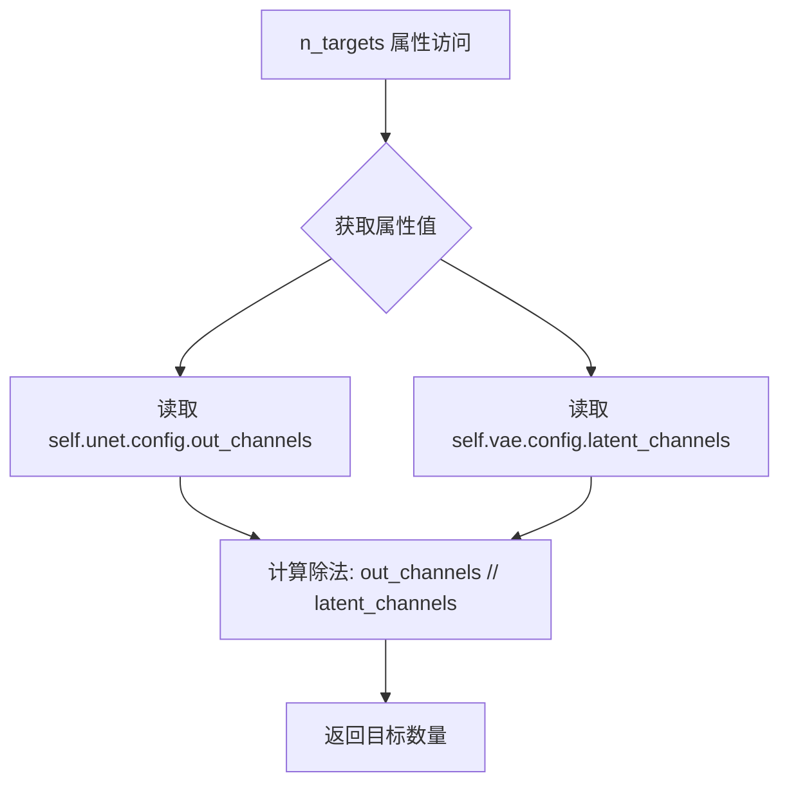
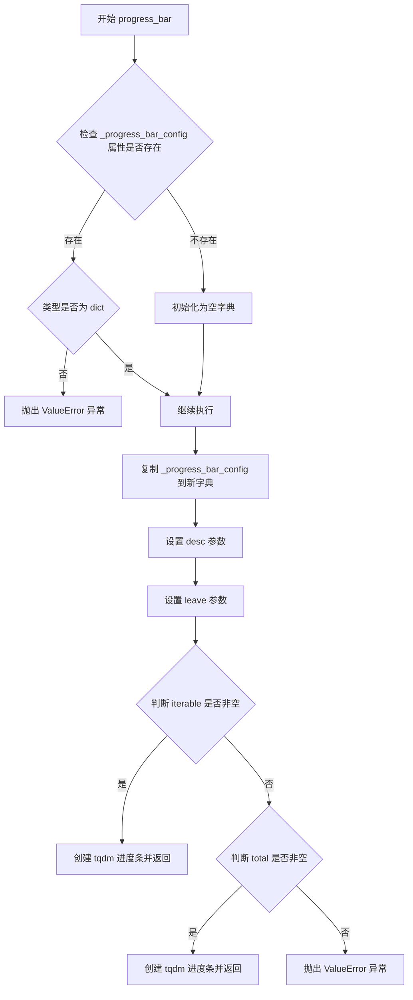
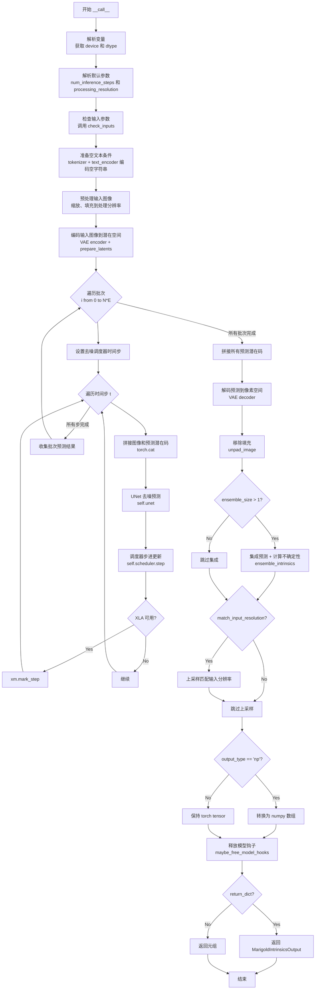
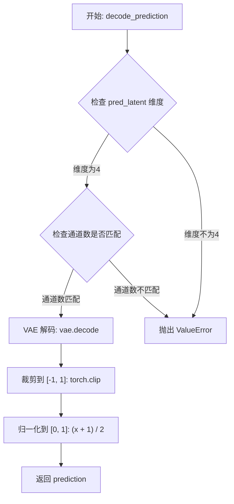
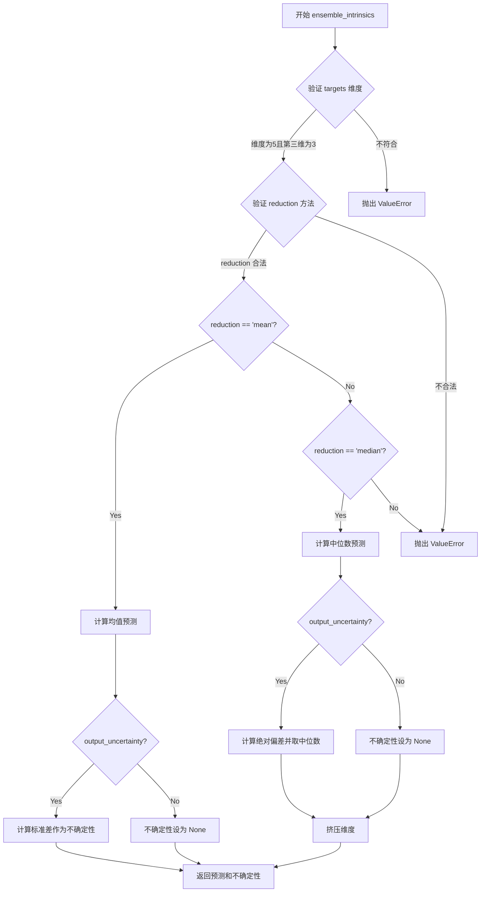

# `diffusers\src\diffusers\pipelines\marigold\pipeline_marigold_intrinsics.py` 详细设计文档

This file implements the MarigoldIntrinsicsPipeline, a diffusion model pipeline for Intrinsic Image Decomposition (IID) that takes an RGB image and predicts intrinsic properties (like albedo, roughness, shading) using a latent diffusion process with ensemble support for uncertainty estimation.

## 整体流程

```mermaid
graph TD
    A[Input Image] --> B[Resolve Config & Device]
    B --> C[Check Inputs Validation]
    C --> D[Prepare Empty Text Embedding (CLIP)]
    D --> E[Preprocess Image: Resize & Pad]
    E --> F[Prepare Latents: VAE Encode Image + Random Noise]
    F --> G{For each timestep in Denoising Loop}
    G --> H[UNet Denoising (Image Latent + Pred Latent)]
    H --> I[Scheduler Step]
    I --> G
    G --> J[Decode Predictions: VAE Decode Latents]
    J --> K[Remove Padding]
    K --> L{Ensemble Size > 1?}
    L -- Yes --> M[Ensemble Predictions & Calc Uncertainty]
    L -- No --> N[Resize to Match Input Resolution]
    M --> N
    N --> O[Convert Output Type (PT/NP)]
    O --> P[Offload Models]
    P --> Q[Return MarigoldIntrinsicsOutput]
```

## 类结构

```
DiffusionPipeline (Base Class)
└── MarigoldIntrinsicsPipeline
    ├── MarigoldIntrinsicsOutput (Data Class)
```

## 全局变量及字段


### `logger`
    
用于记录管道运行时的警告和信息日志的日志对象

类型：`logging.Logger`
    


### `EXAMPLE_DOC_STRING`
    
包含管道使用示例的文档字符串，展示如何调用MarigoldIntrinsicsPipeline进行内在图像分解

类型：`str`
    


### `XLA_AVAILABLE`
    
标志位，指示当前环境是否支持PyTorch XLA（可加速TPU等设备上的计算）

类型：`bool`
    


### `MarigoldIntrinsicsOutput.prediction`
    
预测的图像内在属性（如反照率、粗糙度、金属度等），值域为[0,1]

类型：`np.ndarray | torch.Tensor`
    


### `MarigoldIntrinsicsOutput.uncertainty`
    
由集成预测计算得到的不确定性图，值域为[0,1]

类型：`None | np.ndarray | torch.Tensor`
    


### `MarigoldIntrinsicsOutput.latent`
    
对应预测的潜在特征，可用于后续管道调用的latents参数

类型：`None | torch.Tensor`
    


### `MarigoldIntrinsicsPipeline.unet`
    
条件U-Net模型，用于对图像潜在表示进行去噪以预测内在图像分解结果

类型：`UNet2DConditionModel`
    


### `MarigoldIntrinsicsPipeline.vae`
    
变分自编码器模型，用于在像素空间和潜在空间之间进行图像编码和解码

类型：`AutoencoderKL`
    


### `MarigoldIntrinsicsPipeline.scheduler`
    
扩散调度器，用于控制去噪过程中的噪声调度策略（DDIM或LCM）

类型：`DDIMScheduler | LCMScheduler`
    


### `MarigoldIntrinsicsPipeline.text_encoder`
    
CLIP文本编码器模型，用于生成空文本嵌入以实现无条件扩散生成

类型：`CLIPTextModel`
    


### `MarigoldIntrinsicsPipeline.tokenizer`
    
CLIP分词器，用于将文本字符串转换为模型可处理的token ID序列

类型：`CLIPTokenizer`
    


### `MarigoldIntrinsicsPipeline.vae_scale_factor`
    
VAE的缩放因子，用于计算潜在空间的尺寸（通常为2^(block_out_channels-1)）

类型：`int`
    


### `MarigoldIntrinsicsPipeline.target_properties`
    
预测模态的目标属性字典，包含目标名称列表和其他解释预测所需的元数据

类型：`dict[str, Any] | None`
    


### `MarigoldIntrinsicsPipeline.default_denoising_steps`
    
默认的去噪扩散步数，用于在未指定num_inference_steps时产生合理质量的预测

类型：`int | None`
    


### `MarigoldIntrinsicsPipeline.default_processing_resolution`
    
推荐的图像处理分辨率参数，用于在未指定processing_resolution时产生最佳结果

类型：`int | None`
    


### `MarigoldIntrinsicsPipeline.empty_text_embedding`
    
预计算的空文本嵌入，用于在去噪过程中提供无条件的文本条件

类型：`None | torch.Tensor`
    


### `MarigoldIntrinsicsPipeline.image_processor`
    
图像处理器，负责图像的预处理、潜在空间转换和输出后处理

类型：`MarigoldImageProcessor`
    
    

## 全局函数及方法


### `MarigoldIntrinsicsPipeline.__init__`

该方法是 MarigoldIntrinsicsPipeline 类的构造函数，负责初始化 intrinsics 图像分解管道。它接收多个神经网络组件（UNet、VAE、调度器、文本编码器等）以及配置参数，完成模块注册、VAE 缩放因子计算、图像处理器初始化等关键setup工作。

参数：

- `unet`：`UNet2DConditionModel`，条件去噪 U-Net 模型，用于在图像 latent 条件下对目标 latent 进行去噪
- `vae`：`AutoencoderKL`，变分自编码器模型，用于在图像和预测之间进行 latent 空间的编码和解码
- `scheduler`：`DDIMScheduler | LCMScheduler`，去噪调度器，用于与 unet 结合对编码后的图像 latents 进行去噪
- `text_encoder`：`CLIPTextModel`，CLIP 文本编码器，用于生成空文本嵌入（empty text embedding）
- `tokenizer`：`CLIPTokenizer`，CLIP 分词器，用于将文本输入 token 化
- `prediction_type`：`str | None`，预测类型，默认为 None，应为 "intrinsics"
- `target_properties`：`dict[str, Any] | None`，预测模态的属性，如目标名称列表和其他元数据
- `default_denoising_steps`：`int | None`，默认去噪扩散步数，用于确保在未指定步数时的合理结果
- `default_processing_resolution`：`int | None`，默认处理分辨率，建议的 processing_resolution 参数值

返回值：`None`，构造函数无返回值

#### 流程图

```mermaid
flowchart TD
    A[开始 __init__] --> B[调用 super().__init__]
    B --> C{prediction_type 是否在<br/>supported_prediction_types 中?}
    C -->|否| D[记录警告日志]
    C -->|是| E[继续]
    D --> E
    E --> F[register_modules 注册各模块]
    F --> G[register_to_config 注册配置]
    G --> H[计算 vae_scale_factor]
    H --> I{self.vae 是否存在?}
    I -->|是| J[vae_scale_factor = 2^(len(vae.config.block_out_channels) - 1)]
    I -->|否| K[vae_scale_factor = 8]
    J --> L
    K --> L
    L[设置 target_properties] --> M[设置 default_denoising_steps]
    M --> N[设置 default_processing_resolution]
    N --> O[初始化 empty_text_embedding = None]
    O --> P[创建 MarigoldImageProcessor]
    P --> Q[结束 __init__]
```

#### 带注释源码

```python
def __init__(
    self,
    unet: UNet2DConditionModel,
    vae: AutoencoderKL,
    scheduler: DDIMScheduler | LCMScheduler,
    text_encoder: CLIPTextModel,
    tokenizer: CLIPTokenizer,
    prediction_type: str | None = None,
    target_properties: dict[str, Any] | None = None,
    default_denoising_steps: int | None = None,
    default_processing_resolution: int | None = None,
):
    # 调用父类 DiffusionPipeline 的初始化方法
    super().__init__()

    # 检查 prediction_type 是否在支持的类型列表中，若不支持则记录警告
    if prediction_type not in self.supported_prediction_types:
        logger.warning(
            f"Potentially unsupported `prediction_type='{prediction_type}'`; values supported by the pipeline: "
            f"{self.supported_prediction_types}."
        )

    # 将传入的模型组件注册到 pipeline 的模块字典中
    # 这些模块可通过 self.unet, self.vae, self.scheduler 等访问
    self.register_modules(
        unet=unet,
        vae=vae,
        scheduler=scheduler,
        text_encoder=text_encoder,
        tokenizer=tokenizer,
    )

    # 将配置参数注册到 pipeline 的 config 中
    self.register_to_config(
        prediction_type=prediction_type,
        target_properties=target_properties,
        default_denoising_steps=default_denoising_steps,
        default_processing_resolution=default_processing_resolution,
    )

    # 计算 VAE 的缩放因子，用于后续图像处理
    # 基于 VAE 块输出通道数的深度（通常为 3 层: [128, 256, 512]）
    # 公式: 2^(len(block_out_channels) - 1)，典型值为 2^2 = 4 或 2^3 = 8
    self.vae_scale_factor = 2 ** (len(self.vae.config.block_out_channels) - 1) if getattr(self, "vae", None) else 8

    # 存储目标属性，包含预测模态的名称和元数据
    self.target_properties = target_properties
    # 存储默认去噪步数，确保模型推理的合理质量
    self.default_denoising_steps = default_denoising_steps
    # 存储默认处理分辨率，确保不同模型变体的合理结果
    self.default_processing_resolution = default_processing_resolution

    # 初始化空文本嵌入为 None，后续在 __call__ 中按需计算
    # 使用空文本可以避免文本条件对纯图像处理任务的干扰
    self.empty_text_embedding = None

    # 创建 Marigold 专用图像处理器
    # 负责图像的预处理（resize、padding）和后处理（unpad、格式转换）
    self.image_processor = MarigoldImageProcessor(vae_scale_factor=self.vae_scale_factor)
```


### `MarigoldIntrinsicsPipeline.n_targets`

该属性用于计算管道预测的目标数量。通过将 UNet 模型的输出通道数除以 VAE 模型的潜在通道数来确定预测目标的数量，这是一个只读属性，无需输入参数。

参数：无（该属性不接受任何参数，因为它是只读属性）

返回值：`int`，返回预测目标的数量，通过 `self.unet.config.out_channels // self.vae.config.latent_channels` 计算得出。

#### 流程图



#### 带注释源码

```
@property
def n_targets(self):
    """
    属性：返回预测目标的数量
    
    该属性计算管道可以预测的目标（intrinsics）数量。
    计算方式为 UNet 输出通道数除以 VAE 潜在通道数。
    
    例如：
        - 如果 out_channels = 16, latent_channels = 4
        - 则 n_targets = 16 // 4 = 4
        - 表示可以预测 4 个不同的 intrinsic 属性（如 albedo, roughness, shading, residual 等）
    
    Returns:
        int: 预测目标的数量
    """
    return self.unet.config.out_channels // self.vae.config.latent_channels
```


### MarigoldIntrinsicsPipeline.check_inputs

该方法负责验证管道输入参数的有效性，确保所有配置参数符合模型要求，并对输入图像和潜在变量进行详细的格式和维度检查。如果所有检查通过，该方法返回输入图像的数量。

参数：

- `self`：隐式参数，指向管道实例本身
- `image`：`PipelineImageInput`，输入图像，支持PIL.Image、numpy数组、torch.Tensor或它们的列表
- `num_inference_steps`：`int`，去噪扩散推理步数，必须为正整数
- `ensemble_size`：`int`，集成预测的数量，用于不确定性估计
- `processing_resolution`：`int`，处理分辨率，必须为非负数且能被VAE尺度因子整除
- `resample_method_input`：`str`，输入图像重采样方法
- `resample_method_output`：`str`，输出预测重采样方法
- `batch_size`：`int`，批处理大小，必须为正数
- `ensembling_kwargs`：`dict[str, Any] | None`，集成参数字典
- `latents`：`torch.Tensor | None`，潜在变量张量
- `generator`：`torch.Generator | list[torch.Generator] | None`，随机数生成器
- `output_type`：`str`，输出类型，必须为"pt"或"np"
- `output_uncertainty`：`bool`，是否输出不确定性图

返回值：`int`，返回输入图像的数量

#### 流程图

```mermaid
flowchart TD
    A[开始 check_inputs] --> B{验证 vae_scale_factor}
    B -->|不匹配| C[抛出 ValueError]
    B -->|匹配| D{num_inference_steps}
    D -->|None| E[抛出 ValueError]
    D -->|有效| F{ensemble_size}
    F -->|< 1| G[抛出 ValueError]
    F -->|= 2| H[警告: 建议 >= 3]
    F -->|>= 1| I{output_uncertainty}
    I -->|True 且 ensemble_size=1| J[抛出 ValueError]
    I -->|其他| K{processing_resolution}
    K -->|None| L[抛出 ValueError]
    K -->|负数| M[抛出 ValueError]
    K -->|有效| N{processing_resolution % vae_scale_factor}
    N -->|!= 0| O[抛出 ValueError]
    N -->|= 0| P{resample_method_input}
    P -->|不合法| Q[抛出 ValueError]
    P -->|合法| R{resample_method_output}
    R -->|不合法| S[抛出 ValueError]
    R -->|合法| T{batch_size}
    T -->|< 1| U[抛出 ValueError]
    T -->|>= 1| V{output_type}
    V -->|不合法| W[抛出 ValueError]
    V -->|合法| X{latents 和 generator}
    X -->|同时存在| Y[抛出 ValueError]
    X -->|其他| Z{ensembling_kwargs}
    Z -->|非None非dict| AA[抛出 ValueError]
    Z -->|有效| AB{验证reduction参数}
    AB -->|不合法| AC[抛出 ValueError]
    AB -->|合法| AD[开始验证 image 列表]
    AD --> AE[遍历每个图像]
    AE --> AF{图像类型}
    AF -->|numpy/tensor| AG[检查 ndim]
    AF -->|PIL.Image| AH[获取尺寸]
    AF -->|其他| AI[抛出 ValueError]
    AG -->|非法维度| AJ[抛出 ValueError]
    AG -->|合法| AK[获取 H, W]
    AK --> AL{验证所有图像尺寸一致性}
    AL -->|不一致| AM[抛出 ValueError]
    AL -->|一致| AN[累加图像数量]
    AN --> AO{latents 检查}
    AO -->|不为None| AP{验证 latents 是 Tensor}
    AP -->|否| AQ[抛出 ValueError]
    AP -->|是| AR{验证 dim=4}
    AR -->|否| AS[抛出 ValueError]
    AR -->|是| AT{计算期望形状}
    AT --> AU{latents.shape == 期望形状}
    AU -->|否| AV[抛出 ValueError]
    AU -->|是| AX{generator 检查}
    AX -->|不为None| AW{验证 generator 类型]
    AW -->|列表| AY[验证长度和设备一致性]
    AW -->|非列表| AZ[抛出 ValueError]
    AW -->|有效| AX
    AY -->|无效| BA[抛出 ValueError]
    AX -->|通过| BB[返回 num_images]
    AO -->|None| BB
    Z -->|None| AD
```

#### 带注释源码

```python
def check_inputs(
    self,
    image: PipelineImageInput,
    num_inference_steps: int,
    ensemble_size: int,
    processing_resolution: int,
    resample_method_input: str,
    resample_method_output: str,
    batch_size: int,
    ensembling_kwargs: dict[str, Any] | None,
    latents: torch.Tensor | None,
    generator: torch.Generator | list[torch.Generator] | None,
    output_type: str,
    output_uncertainty: bool,
) -> int:
    """
    验证管道输入参数的有效性，确保所有配置符合模型要求。
    
    参数:
        image: 输入图像，支持多种格式
        num_inference_steps: 去噪步数
        ensemble_size: 集成大小
        processing_resolution: 处理分辨率
        resample_method_input: 输入重采样方法
        resample_method_output: 输出重采样方法
        batch_size: 批处理大小
        ensembling_kwargs: 集成参数
        latents: 潜在变量
        generator: 随机生成器
        output_type: 输出类型
        output_uncertainty: 是否输出不确定性
    
    返回:
        输入图像的数量
    """
    # 验证VAE尺度因子是否与初始化时计算的一致
    actual_vae_scale_factor = 2 ** (len(self.vae.config.block_out_channels) - 1)
    if actual_vae_scale_factor != self.vae_scale_factor:
        raise ValueError(
            f"`vae_scale_factor` computed at initialization ({self.vae_scale_factor}) differs from the actual one ({actual_vae_scale_factor})."
        )
    
    # 验证推理步数必须指定且为正数
    if num_inference_steps is None:
        raise ValueError("`num_inference_steps` is not specified and could not be resolved from the model config.")
    if num_inference_steps < 1:
        raise ValueError("`num_inference_steps` must be positive.")
    
    # 验证集成大小必须为正数
    if ensemble_size < 1:
        raise ValueError("`ensemble_size` must be positive.")
    # 警告: ensemble_size=2 效果接近无集成
    if ensemble_size == 2:
        logger.warning(
            "`ensemble_size` == 2 results are similar to no ensembling (1); "
            "consider increasing the value to at least 3."
        )
    # 验证不确定性输出需要 ensemble_size > 1
    if ensemble_size == 1 and output_uncertainty:
        raise ValueError(
            "Computing uncertainty by setting `output_uncertainty=True` also requires setting `ensemble_size` "
            "greater than 1."
        )
    
    # 验证处理分辨率
    if processing_resolution is None:
        raise ValueError(
            "`processing_resolution` is not specified and could not be resolved from the model config."
        )
    if processing_resolution < 0:
        raise ValueError(
            "`processing_resolution` must be non-negative: 0 for native resolution, or any positive value for "
            "downsampled processing."
        )
    # 必须能被VAE尺度因子整除
    if processing_resolution % self.vae_scale_factor != 0:
        raise ValueError(f"`processing_resolution` must be a multiple of {self.vae_scale_factor}.")
    
    # 验证重采样方法必须为PIL支持的合法值
    if resample_method_input not in ("nearest", "nearest-exact", "bilinear", "bicubic", "area"):
        raise ValueError(
            "`resample_method_input` takes string values compatible with PIL library: "
            "nearest, nearest-exact, bilinear, bicubic, area."
        )
    if resample_method_output not in ("nearest", "nearest-exact", "bilinear", "bicubic", "area"):
        raise ValueError(
            "`resample_method_output` takes string values compatible with PIL library: "
            "nearest, nearest-exact, bilinear, bicubic, area."
        )
    
    # 验证批处理大小必须为正数
    if batch_size < 1:
        raise ValueError("`batch_size` must be positive.")
    
    # 验证输出类型
    if output_type not in ["pt", "np"]:
        raise ValueError("`output_type` must be one of `pt` or `np`.")
    
    # latents 和 generator 不能同时使用
    if latents is not None and generator is not None:
        raise ValueError("`latents` and `generator` cannot be used together.")
    
    # 验证集成参数字典
    if ensembling_kwargs is not None:
        if not isinstance(ensembling_kwargs, dict):
            raise ValueError("`ensembling_kwargs` must be a dictionary.")
        if "reduction" in ensembling_kwargs and ensembling_kwargs["reduction"] not in ("median", "mean"):
            raise ValueError("`ensembling_kwargs['reduction']` can be either `'median'` or `'mean'`.")

    # ========== 图像验证部分 ==========
    num_images = 0  # 累计图像数量
    W, H = None, None  # 记录第一张图像的尺寸
    
    # 统一转换为列表处理
    if not isinstance(image, list):
        image = [image]
    
    # 遍历每张图像进行验证
    for i, img in enumerate(image):
        if isinstance(img, np.ndarray) or torch.is_tensor(img):
            # 数组/张量维度检查: 2D, 3D 或 4D
            if img.ndim not in (2, 3, 4):
                raise ValueError(f"`image[{i}]` has unsupported dimensions or shape: {img.shape}.")
            H_i, W_i = img.shape[-2:]  # 获取高宽
            N_i = 1
            if img.ndim == 4:
                N_i = img.shape[0]  # 批次维度
        elif isinstance(img, Image.Image):
            W_i, H_i = img.size  # PIL图像获取尺寸
            N_i = 1
        else:
            raise ValueError(f"Unsupported `image[{i}]` type: {type(img)}.")
        
        # 验证所有图像尺寸一致性
        if W is None:
            W, H = W_i, H_i
        elif (W, H) != (W_i, H_i):
            raise ValueError(
                f"Input `image[{i}]` has incompatible dimensions {(W_i, H_i)} with the previous images {(W, H)}"
            )
        num_images += N_i

    # ========== 潜在变量验证部分 ==========
    if latents is not None:
        # 必须是torch.Tensor
        if not torch.is_tensor(latents):
            raise ValueError("`latents` must be a torch.Tensor.")
        # 必须是4D张量
        if latents.dim() != 4:
            raise ValueError(f"`latents` has unsupported dimensions or shape: {latents.shape}.")

        # 如果有自定义处理分辨率，需要重新计算潜在空间尺寸
        if processing_resolution > 0:
            max_orig = max(H, W)
            new_H = H * processing_resolution // max_orig
            new_W = W * processing_resolution // max_orig
            if new_H == 0 or new_W == 0:
                raise ValueError(f"Extreme aspect ratio of the input image: [{W} x {H}]")
            W, H = new_W, new_H
        
        # 计算期望的潜在变量形状
        w = (W + self.vae_scale_factor - 1) // self.vae_scale_factor
        h = (H + self.vae_scale_factor - 1) // self.vae_scale_factor
        shape_expected = (num_images * ensemble_size, self.unet.config.out_channels, h, w)

        # 验证潜在变量形状是否匹配
        if latents.shape != shape_expected:
            raise ValueError(f"`latents` has unexpected shape={latents.shape} expected={shape_expected}.")

    # ========== 生成器验证部分 ==========
    if generator is not None:
        if isinstance(generator, list):
            # 列表形式: 长度必须匹配所有集成成员
            if len(generator) != num_images * ensemble_size:
                raise ValueError(
                    "The number of generators must match the total number of ensemble members for all input images."
                )
            # 设备一致性检查
            if not all(g.device.type == generator[0].device.type for g in generator):
                raise ValueError("`generator` device placement is not consistent in the list.")
        elif not isinstance(generator, torch.Generator):
            raise ValueError(f"Unsupported generator type: {type(generator)}.")

    # 返回输入图像总数
    return num_images
```


### `MarigoldIntrinsicsPipeline.progress_bar`

该方法是一个用于创建和管理进度条的辅助函数，它封装了 `tqdm` 库的功能，支持通过类的配置属性自定义进度条行为，并确保在迭代或计数场景下都能正确初始化进度条。

参数：

- `iterable`：`Any`，可选，要迭代的可迭代对象
- `total`：`int | None`，可选，迭代的总步数
- `desc`：`str | None`，可选，进度条的描述文本
- `leave`：`bool`，可选，是否在迭代完成后保留进度条（默认为 `True`）

返回值：`tqdm`，返回 `tqdm` 进度条对象

#### 流程图



#### 带注释源码

```python
@torch.compiler.disable
def progress_bar(self, iterable=None, total=None, desc=None, leave=True):
    """
    创建并返回一个 tqdm 进度条实例。
    
    该方法封装了 tqdm 库，提供了统一的进度条创建接口，
    同时支持通过类属性 _progress_bar_config 进行全局配置。
    
    Args:
        iterable: 要迭代的可迭代对象。如果提供此参数，total 参数将被忽略。
        total: 迭代的总步数。当不提供 iterable 时必须指定。
        desc: 进度条的描述文本，会显示在进度条前方。
        leave: 布尔值，表示迭代完成后是否保留进度条（默认 True 保留）。
    
    Returns:
        tqdm: 配置好的 tqdm 进度条对象
    
    Raises:
        ValueError: 当 _progress_bar_config 类型不正确或未提供 iterable/total 时
    """
    # 检查实例是否已有 _progress_bar_config 属性
    if not hasattr(self, "_progress_bar_config"):
        # 如果没有，则初始化为空字典
        self._progress_bar_config = {}
    # 如果已存在但类型不是字典，则抛出异常
    elif not isinstance(self._progress_bar_config, dict):
        raise ValueError(
            f"`self._progress_bar_config` should be of type `dict`, but is {type(self._progress_bar_config)}."
        )

    # 复制当前配置以避免修改原始配置
    progress_bar_config = dict(**self._progress_bar_config)
    # 如果调用时未指定 desc，则使用配置中的 desc
    progress_bar_config["desc"] = progress_bar_config.get("desc", desc)
    # 如果调用时未指定 leave，则使用配置中的 leave
    progress_bar_config["leave"] = progress_bar_config.get("leave", leave)
    
    # 根据提供的参数创建进度条
    if iterable is not None:
        # 如果提供了 iterable，直接迭代
        return tqdm(iterable, **progress_bar_config)
    elif total is not None:
        # 如果提供了 total，创建已知总长度的进度条
        return tqdm(total=total, **progress_bar_config)
    else:
        # 既没有 iterable 也没有 total，无法创建进度条
        raise ValueError("Either `total` or `iterable` has to be defined.")
```


### `MarigoldIntrinsicsPipeline.__call__`

该方法是 Marigold 内禀图像分解流水线的核心调用函数，负责执行完整的推理流程：接收输入图像，进行去噪扩散推理，通过 VAE 编码器将图像编码到潜在空间，然后使用 UNet 进行条件去噪，最后通过 VAE 解码器将预测结果从潜在空间解码到像素空间，并可选地进行集成预测和不确定性估计。

参数：

- `image`：`PipelineImageInput`，输入的原始图像或图像列表，用于内禀分解任务，支持 PIL Image、numpy array、torch tensor 或它们的列表，值为 [0, 1] 范围的浮点数
- `num_inference_steps`：`int | None`，推理时的去噪扩散步数，None 时自动从模型配置中选取最优默认值
- `ensemble_size`：`int`，集成预测的数量，值为 1 时表示不使用集成，较高的值可提升预测质量但增加计算成本
- `processing_resolution`：`int | None`，有效处理分辨率，设为 0 时匹配输入图像的较大边，None 时使用模型配置中的默认值
- `match_input_resolution`：`bool`，是否将输出预测调整为匹配输入分辨率，True 时输出尺寸与输入一致，False 时输出边长等于 processing_resolution
- `resample_method_input`：`str`，输入图像缩放到 processing_resolution 时使用的重采样方法，可选 "nearest", "nearest-exact", "bilinear", "bicubic", "area"
- `resample_method_output`：`str`，输出预测缩放匹配输入分辨率时使用的重采样方法，可选值同上
- `batch_size`：`int`，批处理大小，仅在设置 ensemble_size 或传入图像张量时起作用
- `ensembling_kwargs`：`dict[str, Any] | None`，集成控制的额外参数，包含 reduction 字段，可选 "median" 或 "mean"
- `latents`：`torch.Tensor | list[torch.Tensor] | None`，用于替换随机初始化的潜在噪声张量，可从上次函数输出的 latent 字段获取
- `generator`：`torch.Generator | list[torch.Generator] | None`，随机数生成器对象，用于确保可重复性
- `output_type`：`str`，输出格式偏好，可选 "np" (numpy array) 或 "pt" (torch tensor)
- `output_uncertainty`：`bool`，是否输出预测不确定性图，需要 ensemble_size > 1
- `output_latent`：`bool`，是否在输出的 latent 字段包含与预测对应的潜在码，可用于后续调用
- `return_dict`：`bool`，是否返回 MarigoldIntrinsicsOutput 对象而非元组

返回值：`MarigoldIntrinsicsOutput` 或 `tuple`，返回内禀分解预测结果及相关信息。若 return_dict 为 True，返回包含 prediction、uncertainty 和 latent 字段的输出对象；否则返回元组 (prediction, uncertainty, latent)，其中 uncertainty 和 latent 在未启用对应选项时为 None

#### 流程图



#### 带注释源码

```python
@torch.no_grad()
@replace_example_docstring(EXAMPLE_DOC_STRING)
def __call__(
    self,
    image: PipelineImageInput,
    num_inference_steps: int | None = None,
    ensemble_size: int = 1,
    processing_resolution: int | None = None,
    match_input_resolution: bool = True,
    resample_method_input: str = "bilinear",
    resample_method_output: str = "bilinear",
    batch_size: int = 1,
    ensembling_kwargs: dict[str, Any] | None = None,
    latents: torch.Tensor | list[torch.Tensor] | None = None,
    generator: torch.Generator | list[torch.Generator] | None = None,
    output_type: str = "np",
    output_uncertainty: bool = False,
    output_latent: bool = False,
    return_dict: bool = True,
):
    """
    Pipeline 推理主入口函数，执行完整的内禀图像分解流程。

    Args:
        image: 输入图像或图像列表，支持多种格式
        num_inference_steps: 去噪步数，None 时使用模型默认值
        ensemble_size: 集成预测数量
        processing_resolution: 处理分辨率
        match_input_resolution: 是否匹配输入分辨率
        resample_method_input: 输入重采样方法
        resample_method_output: 输出重采样方法
        batch_size: 批处理大小
        ensembling_kwargs: 集成参数
        latents: 预定义的潜在码
        generator: 随机数生成器
        output_type: 输出格式 'np' 或 'pt'
        output_uncertainty: 是否输出不确定性
        output_latent: 是否输出潜在码
        return_dict: 是否返回字典格式

    Returns:
        MarigoldIntrinsicsOutput 或元组，包含预测、不确定性和潜在码
    """

    # 0. 解析执行设备和数据类型
    device = self._execution_device
    dtype = self.dtype

    # 从模型配置中获取最优默认参数，确保快速且合理的结果
    if num_inference_steps is None:
        num_inference_steps = self.default_denoising_steps
    if processing_resolution is None:
        processing_resolution = self.default_processing_resolution

    # 1. 验证输入参数合法性
    # 检查图像尺寸、批次大小、潜在码形状、采样方法等
    num_images = self.check_inputs(
        image,
        num_inference_steps,
        ensemble_size,
        processing_resolution,
        resample_method_input,
        resample_method_output,
        batch_size,
        ensembling_kwargs,
        latents,
        generator,
        output_type,
        output_uncertainty,
    )

    # 2. 准备空文本条件嵌入
    # 使用空字符串 "" 作为提示词，获取文本编码器输出的条件嵌入
    # 用于引导模型进行无条件的图像生成/预测
    if self.empty_text_embedding is None:
        prompt = ""
        text_inputs = self.tokenizer(
            prompt,
            padding="do_not_pad",
            max_length=self.tokenizer.model_max_length,
            truncation=True,
            return_tensors="pt",
        )
        text_input_ids = text_inputs.input_ids.to(device)
        self.empty_text_embedding = self.text_encoder(text_input_ids)[0]  # [1,2,1024]

    # 3. 预处理输入图像
    # 加载输入图像，可选降采样到处理分辨率，并填充使其可被 VAE 潜在空间下采样因子(通常为8)整除
    image, padding, original_resolution = self.image_processor.preprocess(
        image, processing_resolution, resample_method_input, device, dtype
    )  # [N,3,PPH,PPW]

    # 4. 将输入图像编码到潜在空间
    # 每个输入图像用 E 个集成成员表示，每个成员是独立初始化的扩散预测
    # image_latent: 输入图像的潜在表示，复制 E 次
    # pred_latent: 预测目标的潜在空间初始化，复制 T 次(T为目标数量)
    image_latent, pred_latent = self.prepare_latents(
        image, latents, generator, ensemble_size, batch_size
    )  # [N*E,4,h,w], [N*E,T*4,h,w]

    del image  # 释放原始图像内存

    # 准备批量文本嵌入，扩展到批次大小
    batch_empty_text_embedding = self.empty_text_embedding.to(device=device, dtype=dtype).repeat(
        batch_size, 1, 1
    )  # [B,1024,2]

    # 5. 执行去噪循环
    # UNet 接受拼接的输入图像潜在码和预测目标潜在码，输出预测目标的噪声
    pred_latents = []

    # 遍历所有图像和集成成员的组合，分批处理
    for i in self.progress_bar(
        range(0, num_images * ensemble_size, batch_size), leave=True, desc="Marigold predictions..."
    ):
        batch_image_latent = image_latent[i : i + batch_size]  # [B,4,h,w]
        batch_pred_latent = pred_latent[i : i + batch_size]  # [B,T*4,h,w]
        effective_batch_size = batch_image_latent.shape[0]
        text = batch_empty_text_embedding[:effective_batch_size]  # [B,2,1024]

        # 设置调度器的时间步
        self.scheduler.set_timesteps(num_inference_steps, device=device)
        
        # 扩散迭代去噪过程
        for t in self.progress_bar(self.scheduler.timesteps, leave=False, desc="Diffusion steps..."):
            # 拼接图像条件和预测潜在码作为 UNet 输入
            batch_latent = torch.cat([batch_image_latent, batch_pred_latent], dim=1)  # [B,(1+T)*4,h,w]
            
            # UNet 预测噪声
            noise = self.unet(batch_latent, t, encoder_hidden_states=text, return_dict=False)[0]  # [B,T*4,h,w]
            
            # 调度器执行一步去噪
            batch_pred_latent = self.scheduler.step(
                noise, t, batch_pred_latent, generator=generator
            ).prev_sample  # [B,T*4,h,w]

            # XLA 加速标记
            if XLA_AVAILABLE:
                xm.mark_step()

        pred_latents.append(batch_pred_latent)

    # 拼接所有批次的预测结果
    pred_latent = torch.cat(pred_latents, dim=0)  # [N*E,T*4,h,w]

    # 清理中间变量释放内存
    del (
        pred_latents,
        image_latent,
        batch_empty_text_embedding,
        batch_image_latent,
        batch_pred_latent,
        text,
        batch_latent,
        noise,
    )

    # 6. 从潜在空间解码预测到像素空间
    # 重塑潜在码以匹配 VAE 解码器期望的格式
    pred_latent_for_decoding = pred_latent.reshape(
        num_images * ensemble_size * self.n_targets, self.vae.config.latent_channels, *pred_latent.shape[2:]
    )  # [N*E*T,4,PPH,PPW]
    
    # 批量解码
    prediction = torch.cat(
        [
            self.decode_prediction(pred_latent_for_decoding[i : i + batch_size])
            for i in range(0, pred_latent_for_decoding.shape[0], batch_size)
        ],
        dim=0,
    )  # [N*E*T,3,PPH,PPW]

    del pred_latent_for_decoding
    
    # 如果不需要输出潜在码则置为 None
    if not output_latent:
        pred_latent = None

    # 7. 移除填充，还原到处理后的尺寸 (PH, PW)
    prediction = self.image_processor.unpad_image(prediction, padding)  # [N*E*T,3,PH,PW]

    # 8. 集成预测和不确定性计算
    uncertainty = None
    if ensemble_size > 1:
        # 重塑为 [N, E, T, 3, PH, PW] 用于集成
        prediction = prediction.reshape(
            num_images, ensemble_size, self.n_targets, *prediction.shape[1:]
        )  # [N,E,T,3,PH,PW]
        
        # 对每个图像独立进行集成
        prediction = [
            self.ensemble_intrinsics(prediction[i], output_uncertainty, **(ensembling_kwargs or {}))
            for i in range(num_images)
        ]  # [ [[T,3,PH,PW], [T,3,PH,PW]], ... ]
        
        # 分离预测和不确定性
        prediction, uncertainty = zip(*prediction)  # [[T,3,PH,PW], ... ], [[T,3,PH,PW], ... ]
        prediction = torch.cat(prediction, dim=0)  # [N*T,3,PH,PW]
        
        if output_uncertainty:
            uncertainty = torch.cat(uncertainty, dim=0)  # [N*T,3,PH,PW]
        else:
            uncertainty = None

    # 9. 上采样匹配输入分辨率（如果启用）
    if match_input_resolution:
        prediction = self.image_processor.resize_antialias(
            prediction, original_resolution, resample_method_output, is_aa=False
        )  # [N*T,3,H,W]
        if uncertainty is not None and output_uncertainty:
            uncertainty = self.image_processor.resize_antialias(
                uncertainty, original_resolution, resample_method_output, is_aa=False
            )  # [N*T,1,H,W]

    # 10. 转换输出格式
    if output_type == "np":
        prediction = self.image_processor.pt_to_numpy(prediction)  # [N*T,H,W,3]
        if uncertainty is not None and output_uncertainty:
            uncertainty = self.image_processor.pt_to_numpy(uncertainty)  # [N*T,H,W,3]

    # 11. 释放所有模型
    self.maybe_free_model_hooks()

    # 返回结果
    if not return_dict:
        return (prediction, uncertainty, pred_latent)

    return MarigoldIntrinsicsOutput(
        prediction=prediction,
        uncertainty=uncertainty,
        latent=pred_latent,
    )
```


### `MarigoldsIntrinsicsPipeline.prepare_latents`

该方法负责为扩散过程准备所需的潜在表示（Latent Representations）。它主要完成两件事：一是使用 VAE 将输入图像编码到潜在空间作为条件输入（`image_latent`），二是根据指定的集成数量（ensemble_size）初始化待预测目标的潜在向量（`pred_latent`），如果未提供外部噪声，则随机生成。

参数：

- `image`：`torch.Tensor`，经过预处理（归一化、调整大小、填充）后的输入图像张量，形状通常为 `[N, 3, H, W]`。
- `latents`：`torch.Tensor | None`，可选的预先生成的噪声张量，用于初始化预测目标的潜在表示。如果为 `None`，则随机生成。
- `generator`：`torch.Generator | None`，随机数生成器，用于确保噪声的可重现性。
- `ensemble_size`：`int`，集成预测的数量，决定了潜在向量的复制次数。
- `batch_size`：`int`，处理图像编码时的批次大小。

返回值：`tuple[torch.Tensor, torch.Tensor]`，返回一个元组。元组包含两个张量：
1.  `image_latent`：编码后的图像潜在表示，形状为 `[N * ensemble_size, 4, h, w]`，用于条件控制。
2.  `pred_latent`：待去噪的预测目标潜在表示，形状为 `[N * ensemble_size, n_targets * 4, h, w]`。

#### 流程图

```mermaid
graph TD
    A([开始 prepare_latents]) --> B[定义辅助函数 retrieve_latents]
    B --> C[遍历 image 张量 (按 batch_size)]
    C --> D[调用 self.vae.encode 编码图像批次]
    D --> E{提取 Latent}
    E -->|Has latent_dist| F[encoder_output.latent_dist.mode()]
    E -->|Has latents| G[encoder_output.latents]
    F --> H[将当前批次的 Latent 拼接到 image_latent]
    G --> H
    H --> I{是否遍历完所有图像?}
    I -->|否| C
    I -->|是| J[对 image_latent 进行缩放]
    J --> K[使用 repeat_interleave 复制 image_latent 对应 ensemble_size]
    K --> L[获取形状 N_E, C, H, W]
    L --> M{检查输入 latents 参数}
    M -->|为 None| N[使用 randn_tensor 生成随机噪声]
    M -->|不为 None| O[使用传入的 latents]
    N --> P[构造 pred_latent 形状: (N_E, n_targets * C, H, W)]
    O --> P
    P --> Q([返回 image_latent, pred_latent])
```

#### 带注释源码

```python
def prepare_latents(
    self,
    image: torch.Tensor,
    latents: torch.Tensor | None,
    generator: torch.Generator | None,
    ensemble_size: int,
    batch_size: int,
) -> tuple[torch.Tensor, torch.Tensor]:
    """
    准备用于去噪过程的潜在向量。

    参数:
        image: 预处理后的输入图像张量。
        latents: 可选的外部潜在噪声。
        generator: 随机数生成器。
        ensemble_size: 集成学习的数量。
        batch_size: 批处理大小。

    返回:
        (image_latent, pred_latent) 元组。
    """
    
    def retrieve_latents(encoder_output):
        """从 VAE 编码器输出中提取潜在向量的辅助方法，处理不同的模型输出格式。"""
        if hasattr(encoder_output, "latent_dist"):
            # Diffusers VAE 通常使用 latent_dist
            return encoder_output.latent_dist.mode()
        elif hasattr(encoder_output, "latents"):
            # 某些旧版或特定模型可能直接输出 latents 属性
            return encoder_output.latents
        else:
            raise AttributeError("Could not access latents of provided encoder_output")

    # 1. 编码图像到潜在空间
    # 遍历图像张量，按 batch_size 分批编码，以避免内存溢出
    image_latent = torch.cat(
        [
            # 对每一批图像调用 VAE 编码器
            retrieve_latents(self.vae.encode(image[i : i + batch_size]))
            for i in range(0, image.shape[0], batch_size)
        ],
        dim=0,
    )  # [N, 4, h, w]
    
    # 2. 缩放潜在向量
    # 通常 VAE 编码后的 latent 需要乘以缩放因子才能与扩散模型潜在空间分布对齐
    image_latent = image_latent * self.vae.config.scaling_factor
    
    # 3. 集成复制
    # 为了进行集成预测，我们需要为每个输入图像创建多个副本（ensemble_size个）
    # repeat_interleave 在维度 0 上重复张量，这里将 N 个图像复制了 ensemble_size 份
    image_latent = image_latent.repeat_interleave(ensemble_size, dim=0)  # [N*E, 4, h, w]
    
    # 获取当前 latent 的形状信息，用于生成预测目标的 latent
    N_E, C, H, W = image_latent.shape

    # 4. 准备预测目标的 Latent (Pred Latent)
    pred_latent = latents
    if pred_latent is None:
        # 如果没有传入 latent，则随机生成噪声
        # 形状取决于目标数量 (n_targets)，通常是 (num_images * ensemble_size, n_targets * channels, height, width)
        pred_latent = randn_tensor(
            (N_E, self.n_targets * C, H, W), # self.n_targets = unet_out_channels // vae_latent_channels
            generator=generator,
            device=image_latent.device,
            dtype=image_latent.dtype,
        )  # [N*E, T*4, h, w]

    return image_latent, pred_latent
```


### `MarigoldIntrinsicsPipeline.decode_prediction`

该方法负责将模型预测的潜在表示（latent）解码为最终的图像预测结果。它首先验证输入张量的维度，然后使用 VAE 解码器将潜在空间表示转换为像素空间，最后对输出进行裁剪和归一化处理，将数值范围从 [-1, 1] 映射到 [0, 1]。

参数：

- `self`：`MarigoldIntrinsicsPipeline`，Pipeline 实例本身，包含 VAE 模型配置
- `pred_latent`：`torch.Tensor`，待解码的预测潜在表示，形状为 `[B, latent_channels, H, W]`，其中 `latent_channels` 由 VAE 配置决定（通常为 4）

返回值：`torch.Tensor`，解码后的图像预测，形状为 `[B, 3, H, W]`，数值范围在 [0, 1] 之间

#### 流程图



#### 带注释源码

```python
def decode_prediction(self, pred_latent: torch.Tensor) -> torch.Tensor:
    """
    将预测的潜在表示解码为图像空间。

    Args:
        pred_latent: 来自 UNet 输出的潜在表示，形状为 [B, latent_channels, H, W]

    Returns:
        解码后的图像张量，形状为 [B, 3, H, W]，值域 [0, 1]
    """
    # 验证输入张量维度：必须是 4D 且通道数与 VAE latent_channels 匹配
    if pred_latent.dim() != 4 or pred_latent.shape[1] != self.vae.config.latent_channels:
        raise ValueError(
            f"Expecting 4D tensor of shape [B,{self.vae.config.latent_channels},H,W]; got {pred_latent.shape}."
        )

    # 使用 VAE 解码器将潜在表示转换为图像
    # 需要除以 scaling_factor 以恢复到合适的数值范围
    prediction = self.vae.decode(pred_latent / self.vae.config.scaling_factor, return_dict=False)[0]  # [B,3,H,W]

    # 将预测值裁剪到 [-1, 1] 范围，这是 VAE 输出的标准范围
    prediction = torch.clip(prediction, -1.0, 1.0)  # [B,3,H,W]

    # 将范围从 [-1, 1] 归一化到 [0, 1]
    prediction = (prediction + 1.0) / 2.0

    return prediction  # [B,3,H,W]
```


### `MarigoldIntrinsicsPipeline.ensemble_intrinsics`

该方法是一个静态方法，用于对内在图像分解（Intrinsic Image Decomposition）的预测结果进行集成（ensembling）。它接受一个形状为 `(B, T, 3, H, W)` 的张量，其中 B 是集合成员数量，T 是预测目标数量，H 和 W 是空间维度。方法支持两种约简方式（均值或中位数），并可选择输出不确定性图。

参数：

- `targets`：`torch.Tensor`，输入的内在图像分解图集合，形状为 `(B, T, 3, H, W)`，其中 B 是集合成员数，T 是预测目标数
- `output_uncertainty`：`bool`，可选，默认值为 `False`，是否输出不确定性图
- `reduction`：`str`，可选，默认值为 `"median"`，用于集成对齐预测的约简方法，可选值为 `"median"` 或 `"mean"`

返回值：`tuple[torch.Tensor, torch.Tensor | None]`，返回对齐并集成后的内在分解图张量，形状为 `(T, 3, H, W)`，以及可选的不确定性张量，形状为 `(T, 3, H, W)`

#### 流程图



#### 带注释源码

```python
@staticmethod
def ensemble_intrinsics(
    targets: torch.Tensor,
    output_uncertainty: bool = False,
    reduction: str = "median",
) -> tuple[torch.Tensor, torch.Tensor | None]:
    """
    Ensembles the intrinsic decomposition represented by the `targets` tensor with expected shape `(B, T, 3, H,
    W)`, where B is the number of ensemble members for a given prediction of size `(H x W)`, and T is the number of
    predicted targets.

    Args:
        targets (`torch.Tensor`):
            Input ensemble of intrinsic image decomposition maps.
        output_uncertainty (`bool`, *optional*, defaults to `False`):
            Whether to output uncertainty map.
        reduction (`str`, *optional*, defaults to `"mean"`):
            Reduction method used to ensemble aligned predictions. The accepted values are: `"median"` and
            `"mean"`.

    Returns:
        A tensor of aligned and ensembled intrinsic decomposition maps with shape `(T, 3, H, W)` and optionally a
        tensor of uncertainties of shape `(T, 3, H, W)`.
    """
    # 验证输入 targets 的维度：必须是 5 维且第三维（通道维）必须为 3
    if targets.dim() != 5 or targets.shape[2] != 3:
        raise ValueError(f"Expecting 4D tensor of shape [B,T,3,H,W]; got {targets.shape}.")
    # 验证 reduction 参数必须是 'median' 或 'mean' 之一
    if reduction not in ("median", "mean"):
        raise ValueError(f"Unrecognized reduction method: {reduction}.")

    # 解包张量形状：B=集合大小, T=目标数, H=高度, W=宽度
    B, T, _, H, W = targets.shape
    uncertainty = None  # 初始化不确定性为 None
    
    # 分支处理：根据 reduction 参数选择集成方法
    if reduction == "mean":
        # 使用均值进行集成：沿集合维度（dim=0）计算平均值
        prediction = torch.mean(targets, dim=0)  # [T,3,H,W]
        # 如果需要输出不确定性，计算沿集合维度的标准差
        if output_uncertainty:
            uncertainty = torch.std(targets, dim=0)  # [T,3,H,W]
    elif reduction == "median":
        # 使用中位数进行集成：沿集合维度（dim=0）计算中位数
        # keepdim=True 保持维度以便后续计算
        prediction = torch.median(targets, dim=0, keepdim=True).values  # [1,T,3,H,W]
        # 如果需要输出不确定性，计算每个样本与预测的绝对偏差
        if output_uncertainty:
            uncertainty = torch.abs(targets - prediction)  # [B,T,3,H,W]
            # 沿集合维度取偏差的中位数作为不确定性
            uncertainty = torch.median(uncertainty, dim=0).values  # [T,3,H,W]
        # 挤压掉第一维（因为之前 keepdim=True）
        prediction = prediction.squeeze(0)  # [T,3,H,W]
    else:
        # 理论上不会到达这里，因为前面已经验证过 reduction 的合法性
        raise ValueError(f"Unrecognized reduction method: {reduction}.")
    
    # 返回集成后的预测和不确定性（如果有的话）
    return prediction, uncertainty
```

## 关键组件


### MarigoldIntrinsicsPipeline

主pipeline类，继承自DiffusionPipeline，用于内在图像分解（IID）任务。通过扩散模型将输入图像分解为多个内在属性（如albedo、roughness、metallicity或shading等）。

### MarigoldIntrinsicsOutput

输出数据类，继承自BaseOutput。包含prediction（预测的内在图像）、uncertainty（不确定性图，可选）和latent（潜在特征，可选）三个字段。

### 张量索引与惰性加载

在prepare_latents方法中实现。latents参数支持外部传入预计算的噪声张量，实现方式为：如果未提供latents，则使用randn_tensor延迟生成随机潜在变量；通过repeat_interleave将图像潜在变量按ensemble_size复制，实现批量处理。

### 反量化支持

在decode_prediction方法中实现。VAE编码时将潜在变量乘以vae.config.scaling_factor进行缩放，解码时除以相同的缩放因子进行反量化。最后将预测值从[-1,1]范围裁剪并映射到[0,1]范围。

### 量化策略

通过ensemble_size参数和ensemble_intrinsics静态方法实现。ensemble_size控制集成预测的数量，ensemble_intrinsics方法支持mean和median两种聚合策略，可选输出不确定性图（基于标准差或中位绝对偏差）。

### MarigoldImageProcessor

图像预处理器，负责输入图像的预处理（resize、padding）和后处理（unpad、resize、格式转换）。通过vae_scale_factor计算潜在空间的下采样比例。

### UNet2DConditionModel

条件U-Net网络，用于去噪预测的潜在变量。接受拼接后的图像潜在变量和预测潜在变量作为输入，输出噪声预测。

### AutoencoderKL

变分自编码器，负责图像编码到潜在空间和从潜在空间解码回像素空间。配置包含block_out_channels和latent_channels等参数。

### DDIMScheduler / LCMScheduler

调度器，用于在去噪过程中确定时间步。DDIMScheduler提供完整的扩散调度，LCMScheduler提供快速推理的少步数调度。

### 文本编码器

CLIPTextModel和CLIPTokenizer组合，用于生成空的文本嵌入（empty_text_embedding），作为条件输入的一部分。

### check_inputs

输入验证方法，检查所有参数的有效性，包括图像尺寸兼容性、潜在变量形状匹配、批量大小等。

### progress_bar

进度条显示方法，使用tqdm库提供可视化的推理进度，支持Torch XLA的mark_step()用于设备同步。


## 问题及建议


### 已知问题

- **方法职责过于集中**：`check_inputs` 方法过长（约 200 行），承担了过多的输入验证职责，包括参数校验、图像维度检查、latents 校验和 generator 校验等，导致代码可读性和可维护性较差。
- **`__call__` 方法臃肿**：`__call__` 方法包含 11 个处理步骤的完整逻辑，变量声明分散在不同位置，难以追踪数据流和理解整体流程。
- **变量清理方式不高效**：使用 `del` 语句手动删除大量中间变量（如 `pred_latents`、`batch_image_latent` 等）来释放内存，这种方式不够优雅，且 torch 本身有自动垃圾回收机制。
- **硬编码的设备管理**：多处直接使用 `device = self._execution_device`，但缺少对 `device` 可用性的显式检查，可能在某些边缘设备上出现问题。
- **进度条配置缺乏灵活性**：`progress_bar` 方法的配置通过实例变量存储，但未提供公开接口进行配置，使用不够灵活。
- **重复计算 `vae_scale_factor`**：在 `__init__` 和 `check_inputs` 中都计算了 `vae_scale_factor`，虽然后者用于验证，但逻辑可以更统一。
- **文本编码器使用不充分**：初始化时计算了 `empty_text_embedding`，但仅在 `__call__` 中使用一次，且未考虑文本条件为空时的默认值缓存机制是否可以优化。
- **类型提示不够精确**：部分参数如 `ensembling_kwargs` 使用了 `dict[str, Any]`，但实际上只有 `reduction` 键被使用，可以用 `TypedDict` 或具体类型替代。
- **异常处理粒度不足**：在 `prepare_latents` 中捕获 `AttributeError`，但可能的异常类型较为宽泛，错误信息可以更具体。
- **调度器类型校验宽松**：仅在文档中说明支持 `DDIMScheduler` 或 `LCMScheduler`，但构造函数未做运行时校验，可能导致不兼容的调度器传入后难以调试。

### 优化建议

- **拆分 `check_inputs`**：将验证逻辑按功能拆分为多个私有方法，如 `_validate_parameters`、`_validate_images`、`_validate_latents`、`_validate_generator`，每个方法负责单一职责。
- **重构 `__call__` 方法**：将 11 个步骤抽取为私有方法，如 `_resolve_defaults`、`_prepare_text_embedding`、`_encode_images`、`_denoise`、`_decode_predictions`、`_ensemble_and_uncertainty`、`_postprocess_output` 等，提高可读性和可测试性。
- **移除手动 `del` 语句**：依赖 Python 和 torch 的自动垃圾回收，仅在必要时（如需要立即释放大显存）使用 `del`，并考虑使用 `torch.cuda.empty_cache()` 清理 GPU 缓存。
- **添加设备可用性检查**：在 `__call__` 开始时检查 `device` 是否可用，或提供明确错误信息。
- **使用 `TypedDict` 定义配置类型**：为 `ensembling_kwargs`、`target_properties` 等字典参数定义明确的类型，提高类型安全和代码可读性。
- **缓存调度器配置验证**：在 `__init__` 中验证调度器类型并缓存，避免在推理循环中重复检查。
- **优化 `empty_text_embedding` 的生成**：考虑在首次使用时延迟初始化，并添加缓存失效机制（如模型权重变化时）。
- **统一进度条管理**：提供公开的 `set_progress_bar_config` 方法，允许用户在 pipeline 级别配置进度条行为。

## 其它


### 设计目标与约束

该pipeline的核心设计目标是实现高质量的intrinsic image decomposition（内在图像分解），将输入图像分解为多个内在属性（如albedo反照率、roughness粗糙度、metallicity金属性、shading着色等）。设计约束包括：1）支持DDIMScheduler和LCMScheduler两种调度器，以适应不同的推理速度和质量需求；2）处理分辨率必须为vae_scale_factor的倍数；3）ensemble_size大于1时才能输出不确定性估计；4）输出类型仅支持numpy数组或PyTorch张量；5）latents和generator不能同时使用；6）该pipeline继承自DiffusionPipeline，需遵循diffusers库的模型加载和设备管理规范。

### 错误处理与异常设计

代码中的错误处理采用分层设计：1）check_inputs方法进行全面的输入验证，包括图像维度检查、分辨率兼容性验证、参数合法性检查等，抛出具体的ValueError并附带清晰的错误信息；2）prepare_latents方法中的retrieve_latents函数处理VAE编码器输出的不同格式（latent_dist或latents），若都无法访问则抛出AttributeError；3）decode_prediction方法验证输入张量维度；4）ensemble_intrinsics静态方法验证输入张量形状和reduction参数合法性；5）scheduler.step调用可能产生的异常由扩散模型框架处理；6）XLA可用性检查确保torch_xla的正确使用。此外，logger.warning用于非致命性问题的提示，如ensemble_size=2时的警告和prediction_type不匹配时的警告。

### 数据流与状态机

Pipeline的数据流遵循以下状态转换：1）初始化状态（__init__）：加载UNet、VAE、scheduler、text_encoder、tokenizer等组件，注册配置参数，初始化image_processor；2）输入解析状态（check_inputs）：验证所有输入参数的有效性，返回输入图像数量；3）文本条件准备状态：生成空文本嵌入用于条件控制；4）图像预处理状态（image_processor.preprocess）：调整分辨率、填充对齐；5）潜在空间编码状态（prepare_latents）：VAE编码输入图像，初始化预测噪声；6）去噪循环状态：UNet执行条件去噪，scheduler逐步更新潜在变量；7）潜在解码状态（decode_prediction）：VAE解码预测结果到像素空间；8）后处理状态：去除填充、集成预测、计算不确定性、调整输出分辨率、格式转换；9）资源释放状态（maybe_free_model_hooks）：卸载模型以释放显存。整个流程是单向顺序执行，支持在任意步骤后可选择输出latent以实现后续的连续推理。

### 外部依赖与接口契约

该pipeline依赖以下外部组件：1）transformers库：CLIPTextModel和CLIPTokenizer用于文本编码；2）diffusers库：DiffusionPipeline基类、BaseOutput、DDIMScheduler、LCMScheduler、AutoencoderKL、UNet2DConditionModel；3）PIL库：Image用于图像输入；4）numpy：数组处理；5）torch：核心计算；6）tqdm：进度条显示；7）torch_xla（可选）：TPU支持。接口契约包括：输入image支持PIL.Image、numpy数组、torch.Tensor或列表形式；输出为MarigoldIntrinsicsOutput对象，包含prediction（必需）、uncertainty（可选）、latent（可选）三个字段；所有模型组件需通过register_modules注册；pipeline配置通过register_to_config保存。

### 配置参数说明

Pipeline的初始化参数包括：unet（UNet2DConditionModel）- 条件U-Net模型用于去噪；vae（AutoencoderKL）- 变分自编码器用于图像编解码；scheduler（DDIMScheduler|LCMScheduler）- 扩散调度器；text_encoder（CLIPTextModel）- 文本编码器；tokenizer（CLIPTokenizer）- 分词器；prediction_type（str|None）- 预测类型，默认为intrinsics；target_properties（dict|None）- 目标属性字典，包含target_names等；default_denoising_steps（int|None）- 默认去噪步数；default_processing_resolution（int|None）- 默认处理分辨率。调用时的关键参数包括：num_inference_steps控制推理步数；ensemble_size控制集成预测数量；processing_resolution控制处理分辨率；output_uncertainty和output_latent控制额外输出。

### 性能考虑与优化建议

性能关键点包括：1）批处理：batch_size参数影响显存使用和吞吐量，建议根据GPU显存调整；2）处理分辨率：较高的processing_resolution可获得更清晰的细节但增加计算量；3）集成预测：ensemble_size增加会线性增加推理时间；4）VAE编解码：pipeline在多个步骤中使用VAE，是潜在的瓶颈；5）设备管理：支持CPU offload和model card offload，model_cpu_offload_seq定义了text_encoder->unet->vae的卸载顺序；6）XLA支持：可选的torch_xla集成用于TPU加速。优化建议包括：对于大图像使用适当的processing_resolution以平衡质量和速度；使用LCMScheduler替代DDIMScheduler可大幅减少推理步数；合理设置ensemble_size避免不必要的计算。

### 安全性考虑

安全方面包括：1）模型来源验证：建议从可信来源（如HuggingFace Hub）加载预训练模型；2）输入验证：check_inputs对所有输入进行严格验证，防止恶意输入；3）设备安全：使用self._execution_device确保在正确的设备上执行；4）内存安全：maybe_free_model_hooks在推理完成后释放模型权重；5）数值安全：decode_prediction中对输出进行clipping和归一化防止数值溢出；6）随机性控制：提供generator参数确保可重现性。需要注意的是，该pipeline处理图像输入，不涉及文本生成，因此不存在prompt injection等语言模型相关的安全问题。

### 版本兼容性与依赖要求

版本兼容性要求：1）Python版本：建议Python 3.8+；2）PyTorch版本：2.0+推荐；3）diffusers库：需要与pipeline实现兼容的版本；4）transformers库：需要支持CLIPTextModel和CLIPTokenizer的版本；5）torch_xla：仅在使用TPU时需要。Pipeline的supported_prediction_types仅支持intrinsics类型，不兼容其他预测类型的模型。VAE的latent_channels和out_channels配置必须与模型权重一致，否则会导致运行时错误。scheduler必须为DDIMScheduler或LCMScheduler实例，不支持其他调度器类型。

### 使用示例与最佳实践

基本使用流程：1）通过from_pretrained加载预训练模型；2）准备输入图像（支持多种格式）；3）调用pipeline获取结果；4）使用image_processor进行可视化。最佳实践包括：1）首次调用后缓存empty_text_embedding以加快后续调用；2）对于大批量处理适当调整batch_size；3）使用generator确保结果可重现；4）根据需求选择output_type（np适合后处理，pt适合继续推理）；5）使用LCMScheduler时确保num_inference_steps与模型训练配置匹配；6）处理极端宽高比图像时注意processing_resolution的限制。

### 局限性与已知问题

局限性包括：1）仅支持图像到intrinsics的分解，不支持其他任务；2）输出分辨率受processing_resolution和VAE架构限制；3）ensemble_size=2时集成效果接近无集成，建议使用3或更大值；4）uncertainty仅在ensemble_size>1时可用；5）match_input_resolution=True的上采样可能引入伪影；6）不支持视频或3D输入；7）text_encoder仅用于生成空条件嵌入，不支持文本控制。已知问题：1）当prediction_type不在supported_prediction_types中时仅发出警告而非错误；2）处理极高分辨率图像时可能面临显存限制；3）某些边缘情况的输入验证可能不够全面。

### 单元测试与验证要点

关键测试场景应包括：1）不同输入格式的兼容性测试（PIL/numpy/torch.Tensor/list）；2）参数边界条件测试（如ensemble_size=1/2/3、processing_resolution=0等）；3）输出格式验证（pt vs np）；4）ensemble和uncertainty计算的正确性验证；5）padding和unpad的正确性；6）分辨率匹配和调整的准确性；7）设备迁移测试（cpu/cuda）；8）内存泄漏检测；9）scheduler兼容性测试（DDIM vs LCM）；10）端到端输出质量评估。验证时应关注输出数值的合理性和一致性。


    