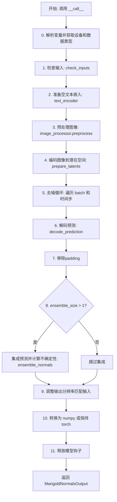
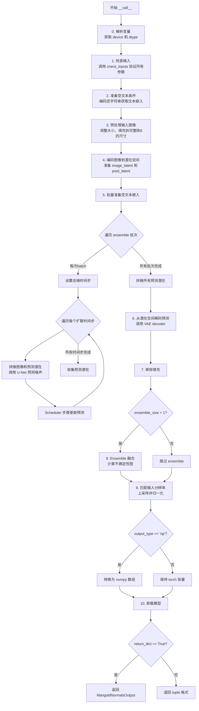
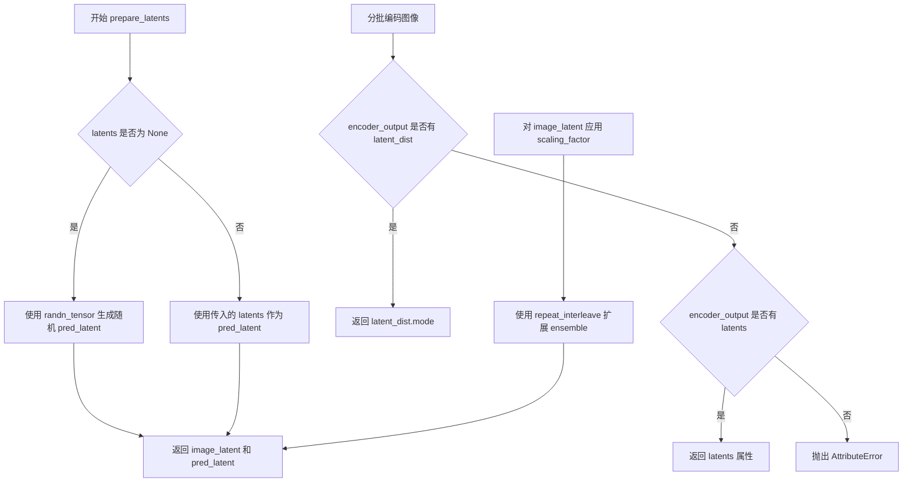
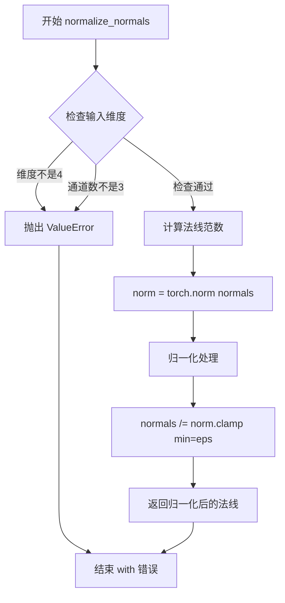
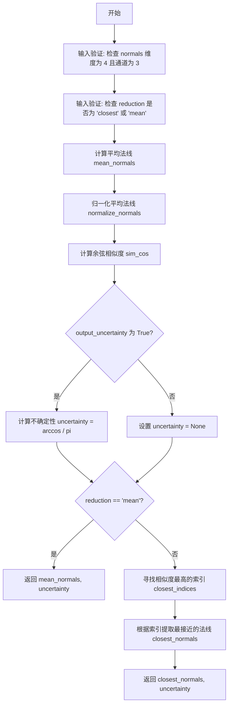

# `diffusers\src\diffusers\pipelines\marigold\pipeline_marigold_normals.py` 详细设计文档

MarigoldNormalsPipeline 是一个用于单目法线估计的扩散模型管道，通过接收图像输入，使用预训练的 VAE、UNet 和调度器进行去噪处理，最终预测图像中每个像素的法线方向（表面法向量），支持多预测集成以提高准确性和不确定性估计。

## 整体流程



## 类结构

```
DiffusionPipeline (基类)
└── MarigoldNormalsPipeline
    ├── MarigoldNormalsOutput (数据类)
```

## 全局变量及字段


### `logger`
    
用于记录警告和错误信息的日志记录器

类型：`logging.Logger`
    


### `EXAMPLE_DOC_STRING`
    
包含Marigold法线预测管线使用示例的文档字符串

类型：`str`
    


### `XLA_AVAILABLE`
    
标志位，指示Torch XLA是否可用以加速计算

类型：`bool`
    


### `MarigoldNormalsOutput.prediction`
    
预测的法线，范围[-1, 1]

类型：`np.ndarray | torch.Tensor`
    


### `MarigoldNormalsOutput.uncertainty`
    
不确定性图，范围[0, 1]

类型：`None | np.ndarray | torch.Tensor`
    


### `MarigoldNormalsOutput.latent`
    
对应预测的潜在特征

类型：`None | torch.Tensor`
    


### `MarigoldNormalsPipeline.vae_scale_factor`
    
VAE缩放因子，用于计算潜在空间维度

类型：`int`
    


### `MarigoldNormalsPipeline.use_full_z_range`
    
是否使用完整Z范围，决定法线Z分量的映射方式

类型：`bool`
    


### `MarigoldNormalsPipeline.default_denoising_steps`
    
默认去噪步数，用于确定合理的推理步数

类型：`int`
    


### `MarigoldNormalsPipeline.default_processing_resolution`
    
默认处理分辨率，建议的图像处理尺寸

类型：`int`
    


### `MarigoldNormalsPipeline.empty_text_embedding`
    
空文本嵌入，用于无条件生成时的文本条件

类型：`torch.Tensor`
    


### `MarigoldNormalsPipeline.image_processor`
    
图像处理器，负责图像的预处理和后处理

类型：`MarigoldImageProcessor`
    
    

## 全局函数及方法


### `retrieve_latents`

从 VAE encoder 输出中提取潜在表示的内部辅助函数。

参数：

- `encoder_output`：任意类型，VAE encoder 的输出对象，可能包含 `latent_dist` 或 `latents` 属性

返回值：`torch.Tensor`，从 encoder 输出中提取的潜在表示张量

#### 流程图

```mermaid
flowchart TD
    A[开始: retrieve_latents] --> B{encoder_output 是否有 latent_dist 属性?}
    B -- 是 --> C[返回 encoder_output.latent_dist.mode()]
    B -- 否 --> D{encoder_output 是否有 latents 属性?}
    D -- 是 --> E[返回 encoder_output.latents]
    D -- 否 --> F[抛出 AttributeError: Could not access latents of provided encoder_output]
    C --> G[结束]
    E --> G
    F --> G
```

#### 带注释源码

```python
def retrieve_latents(encoder_output):
    """
    从 VAE encoder 输出中提取潜在表示。
    
    VAE 的 encoder 可能以不同格式输出潜在表示：
    1. 通过 latent_dist 属性（用于 VAE 变体如 AutoencoderKL）
    2. 通过 latents 属性（用于标准 VAE）
    
    参数:
        encoder_output: VAE encoder 的输出对象
        
    返回:
        torch.Tensor: 提取的潜在表示
        
    异常:
        AttributeError: 当无法从 encoder_output 中获取潜在表示时抛出
    """
    # 情况1: 检查是否存在 latent_dist 属性（AutoencoderKL 等变体使用）
    if hasattr(encoder_output, "latent_dist"):
        # latent_dist.mode() 返回潜在分布的众数（最可能的潜在向量）
        return encoder_output.latent_dist.mode()
    # 情况2: 检查是否存在 latents 属性（标准 VAE 使用）
    elif hasattr(encoder_output, "latents"):
        return encoder_output.latents
    # 情况3: 都无法获取，抛出异常
    else:
        raise AttributeError("Could not access latents of provided encoder_output")
```


### `MarigoldNormalsPipeline.__init__`

该方法是 Marigold 法线预测管道的构造函数，负责初始化管道的所有核心组件，包括 UNet、VAE、调度器、文本编码器等，并配置管道的各项参数。

参数：

- `unet`：`UNet2DConditionModel`，用于对法线潜在表示进行去噪的条件 UNet 模型
- `vae`：`AutoencoderKL`，变分自编码器模型，用于在潜在表示和像素空间之间进行图像编码和解码
- `scheduler`：`DDIMScheduler | LCMScheduler`，与 UNet 结合使用的调度器，用于对编码后的图像潜在表示进行去噪
- `text_encoder`：`CLIPTextModel`，文本编码器，用于生成空文本嵌入
- `tokenizer`：`CLIPTokenizer`，CLIP 分词器
- `prediction_type`：`str | None`，模型预测的类型，默认为 None
- `use_full_z_range`：`bool | None`，表示模型预测的法线是否利用 Z 维度的完整范围，默认为 True
- `default_denoising_steps`：`int | None`，产生合理质量预测所需的最小去噪扩散步数，默认为 None
- `default_processing_resolution`：`int | None`，推荐的 processing_resolution 参数值，默认为 None

返回值：`None`，构造函数无返回值

#### 流程图

```mermaid
flowchart TD
    A[开始 __init__] --> B[调用 super().__init__]
    B --> C{检查 prediction_type 是否支持}
    C -->|不支持| D[记录警告日志]
    C -->|支持| E[继续执行]
    D --> E
    E --> F[register_modules: 注册 unet, vae, scheduler, text_encoder, tokenizer]
    F --> G[register_to_config: 注册配置参数]
    G --> H[计算 vae_scale_factor]
    H --> I[设置实例属性: use_full_z_range, default_denoising_steps, default_processing_resolution]
    I --> J[初始化 empty_text_embedding 为 None]
    J --> K[创建 MarigoldImageProcessor 实例]
    K --> L[结束 __init__]
```

#### 带注释源码

```python
def __init__(
    self,
    unet: UNet2DConditionModel,
    vae: AutoencoderKL,
    scheduler: DDIMScheduler | LCMScheduler,
    text_encoder: CLIPTextModel,
    tokenizer: CLIPTokenizer,
    prediction_type: str | None = None,
    use_full_z_range: bool | None = True,
    default_denoising_steps: int | None = None,
    default_processing_resolution: int | None = None,
):
    """
    初始化 Marigold 法线预测管道。
    
    参数:
        unet: 条件 UNet，用于对法线潜在表示进行去噪
        vae: 变分自编码器，用于图像编码和潜在表示解码
        scheduler: 去噪调度器
        text_encoder: CLIP 文本编码器
        tokenizer: CLIP 分词器
        prediction_type: 预测类型
        use_full_z_range: 是否使用完整的 Z 范围
        default_denoising_steps: 默认去噪步数
        default_processing_resolution: 默认处理分辨率
    """
    # 调用父类 DiffusionPipeline 的初始化方法
    super().__init__()

    # 检查 prediction_type 是否在支持的类型列表中
    if prediction_type not in self.supported_prediction_types:
        logger.warning(
            f"Potentially unsupported `prediction_type='{prediction_type}'`; values supported by the pipeline: "
            f"{self.supported_prediction_types}."
        )

    # 注册所有模型组件到管道中，便于管理和内存卸载
    self.register_modules(
        unet=unet,
        vae=vae,
        scheduler=scheduler,
        text_encoder=text_encoder,
        tokenizer=tokenizer,
    )
    
    # 将配置参数注册到 config 中，便于序列化和保存
    self.register_to_config(
        prediction_type=prediction_type,
        use_full_z_range=use_full_z_range,
        default_denoising_steps=default_denoising_steps,
        default_processing_resolution=default_processing_resolution,
    )

    # 计算 VAE 的缩放因子，基于 VAE 模型的输出通道数
    # VAE 的下采样因子为 2^(num_layers-1)，通常为 8
    self.vae_scale_factor = 2 ** (len(self.vae.config.block_out_channels) - 1) if getattr(self, "vae", None) else 8

    # 存储配置参数到实例属性
    self.use_full_z_range = use_full_z_range
    self.default_denoising_steps = default_denoising_steps
    self.default_processing_resolution = default_processing_resolution

    # 初始化空文本嵌入为 None，在首次调用时延迟生成
    self.empty_text_embedding = None

    # 创建图像处理器，用于预处理和后处理图像
    self.image_processor = MarigoldImageProcessor(vae_scale_factor=self.vae_scale_factor)
```


### `MarigoldNormalsPipeline.check_inputs`

该方法用于验证 Marigold 法线预测管道的所有输入参数是否符合要求，包括模型配置参数、图像输入、潜在变量、生成器等，并在验证过程中收集输入图像的数量信息。

参数：

- `image`：`PipelineImageInput`，输入的图像，可以是 PIL.Image、numpy 数组、torch.Tensor 或它们的列表
- `num_inference_steps`：`int`，去噪扩散推理步数
- `ensemble_size`：`int`，集成预测的数量
- `processing_resolution`：`int`，处理图像的有效分辨率
- `resample_method_input`：`str`，用于将输入图像调整到处理分辨率的重采样方法
- `resample_method_output`：`str`，用于将输出预测调整到输入分辨率的重采样方法
- `batch_size`：`int`，批处理大小
- `ensembling_kwargs`：`dict[str, Any] | None`，用于精确集成控制的额外字典参数
- `latents`：`torch.Tensor | None`，用于替换随机初始化的潜在噪声张量
- `generator`：`torch.Generator | list[torch.Generator] | None`，随机数生成器对象以确保可重复性
- `output_type`：`str`，输出的首选格式（"np" 或 "pt"）
- `output_uncertainty`：`bool`，是否输出不确定性图

返回值：`int`，返回输入图像的数量（`num_images`）

#### 流程图

```mermaid
flowchart TD
    A[开始 check_inputs] --> B{验证 vae_scale_factor}
    B -->|不匹配| C[抛出 ValueError]
    B -->|匹配| D{检查 num_inference_steps}
    D -->|None| E[抛出 ValueError]
    D -->|有效| F{检查 num_inference_steps >= 1}
    F -->|否| G[抛出 ValueError]
    F -->|是| H{检查 ensemble_size >= 1}
    H -->|否| I[抛出 ValueError]
    H -->|是| J{ensemble_size == 2?}
    J -->|是| K[输出警告日志]
    J -->|否| L{ensemble_size == 1 且 output_uncertainty?}
    L -->|是| M[抛出 ValueError]
    L -->|否| N{检查 processing_resolution}
    K --> N
    N -->|None| O[抛出 ValueError]
    N -->|有效| P{processing_resolution >= 0?}
    P -->|否| Q[抛出 ValueError]
    P -->|是| R{processing_resolution 是 vae_scale_factor 的倍数?}
    R -->|否| S[抛出 ValueError]
    R -->|是| T{检查 resample_method_input}
    T -->|无效| U[抛出 ValueError]
    T -->|有效| V{检查 resample_method_output]
    V -->|无效| W[抛出 ValueError]
    V -->|有效| X{batch_size >= 1?}
    X -->|否| Y[抛出 ValueError]
    X -->|是| Z{output_type in ['pt', 'np']?}
    Z -->|否| AA[抛出 ValueError]
    Z -->|是| AB{latents 和 generator 同时存在?}
    AB -->|是| AC[抛出 ValueError]
    AB -->|否| AD{检查 ensembling_kwargs]
    AD -->|非dict| AE[抛出 ValueError]
    AD -->|有效| AF{reduction 有效?}
    AF -->|否| AG[抛出 ValueError]
    AF -->|是| AH[开始图像检查]
    
    AH --> AI{image 是 list?}
    AI -->|否| AJ[转换为 list]
    AJ --> AK[遍历图像列表]
    AI -->|是| AK
    
    AK --> AL{检查图像类型}
    AL -->|numpy/tensor| AM[检查 ndim in [2,3,4]]
    AL -->|PIL.Image| AN[获取尺寸]
    AL -->|其他| AO[抛出 ValueError]
    
    AM --> AP[获取 H, W, N_i]
    AN --> AQ[检查尺寸一致性]
    AQ --> AR{(W, H) == (W_i, H_i)?}
    AR -->|否| AS[抛出 ValueError]
    AR -->|是| AT[累加 num_images]
    
    AT --> AU{还有更多图像?}
    AU -->|是| AK
    AU -->|否| AV{latents 不为空?}
    AV -->|是| AW[验证 latents 类型和维度]
    AW --> AX{latents.dim() == 4?}
    AX -->|否| AY[抛出 ValueError]
    AX -->|是| AZ[计算期望的 latents 形状]
    AZ --> BA{processing_resolution > 0?}
    BA -->|是| BB[计算新的 H, W]
    BB --> BC[计算 latent 形状]
    BA -->|否| BC
    BC --> BD{latents.shape == shape_expected?}
    BD -->|否| BE[抛出 ValueError]
    BD -->|是| BF{generator 不为空?}
    
    AV -->|否| BF
    
    BF -->|是| BG{generator 是 list?]
    BG -->|是| BH{len(generator) == num_images * ensemble_size?}
    BH -->|否| BI[抛出 ValueError]
    BH -->|是| BJ{所有 generator 设备一致?]
    BJ -->|否| BK[抛出 ValueError]
    BJ -->|是| BL[返回 num_images]
    
    BG -->|否| BM{generator 是 torch.Generator?}
    BM -->|否| BN[抛出 ValueError]
    BM -->|是| BL
    
    BF -->|否| BL
    
    AE --> AG
    AG --> AH
```

#### 带注释源码

```python
def check_inputs(
    self,
    image: PipelineImageInput,
    num_inference_steps: int,
    ensemble_size: int,
    processing_resolution: int,
    resample_method_input: str,
    resample_method_output: str,
    batch_size: int,
    ensembling_kwargs: dict[str, Any] | None,
    latents: torch.Tensor | None,
    generator: torch.Generator | list[torch.Generator] | None,
    output_type: str,
    output_uncertainty: bool,
) -> int:
    """
    检查并验证所有输入参数的有效性。
    
    参数:
        image: 输入图像，可以是 PIL.Image、numpy 数组、torch.Tensor 或它们的列表
        num_inference_steps: 去噪扩散推理步数
        ensemble_size: 集成预测的数量
        processing_resolution: 处理图像的有效分辨率
        resample_method_input: 输入图像重采样方法
        resample_method_output: 输出图像重采样方法
        batch_size: 批处理大小
        ensembling_kwargs: 集成控制的额外参数
        latents: 潜在噪声张量
        generator: 随机数生成器
        output_type: 输出格式 ('pt' 或 'np')
        output_uncertainty: 是否输出不确定性图
        
    返回:
        输入图像的数量
    """
    # 验证 VAE 缩放因子是否与初始化时计算的一致
    actual_vae_scale_factor = 2 ** (len(self.vae.config.block_out_channels) - 1)
    if actual_vae_scale_factor != self.vae_scale_factor:
        raise ValueError(
            f"`vae_scale_factor` computed at initialization ({self.vae_scale_factor}) differs from the actual one ({actual_vae_scale_factor})."
        )
    
    # 验证 num_inference_steps 已指定且为正数
    if num_inference_steps is None:
        raise ValueError("`num_inference_steps` is not specified and could not be resolved from the model config.")
    if num_inference_steps < 1:
        raise ValueError("`num_inference_steps` must be positive.")
    
    # 验证 ensemble_size 为正数，并警告值为 2 的情况
    if ensemble_size < 1:
        raise ValueError("`ensemble_size` must be positive.")
    if ensemble_size == 2:
        logger.warning(
            "`ensemble_size` == 2 results are similar to no ensembling (1); "
            "consider increasing the value to at least 3."
        )
    # 验证 ensemble_size 为 1 时不能输出不确定性
    if ensemble_size == 1 and output_uncertainty:
        raise ValueError(
            "Computing uncertainty by setting `output_uncertainty=True` also requires setting `ensemble_size` "
            "greater than 1."
        )
    
    # 验证 processing_resolution 已指定且有效
    if processing_resolution is None:
        raise ValueError(
            "`processing_resolution` is not specified and could not be resolved from the model config."
        )
    if processing_resolution < 0:
        raise ValueError(
            "`processing_resolution` must be non-negative: 0 for native resolution, or any positive value for "
            "downsampled processing."
        )
    if processing_resolution % self.vae_scale_factor != 0:
        raise ValueError(f"`processing_resolution` must be a multiple of {self.vae_scale_factor}.")
    
    # 验证重采样方法的有效性
    if resample_method_input not in ("nearest", "nearest-exact", "bilinear", "bicubic", "area"):
        raise ValueError(
            "`resample_method_input` takes string values compatible with PIL library: "
            "nearest, nearest-exact, bilinear, bicubic, area."
        )
    if resample_method_output not in ("nearest", "nearest-exact", "bilinear", "bicubic", "area"):
        raise ValueError(
            "`resample_method_output` takes string values compatible with PIL library: "
            "nearest, nearest-exact, bilinear, bicubic, area."
        )
    
    # 验证 batch_size 为正数
    if batch_size < 1:
        raise ValueError("`batch_size` must be positive.")
    
    # 验证 output_type 的有效性
    if output_type not in ["pt", "np"]:
        raise ValueError("`output_type` must be one of `pt` or `np`.")
    
    # 验证 latents 和 generator 不能同时使用
    if latents is not None and generator is not None:
        raise ValueError("`latents` and `generator` cannot be used together.")
    
    # 验证 ensembling_kwargs 的有效性
    if ensembling_kwargs is not None:
        if not isinstance(ensembling_kwargs, dict):
            raise ValueError("`ensembling_kwargs` must be a dictionary.")
        if "reduction" in ensembling_kwargs and ensembling_kwargs["reduction"] not in ("closest", "mean"):
            raise ValueError("`ensembling_kwargs['reduction']` can be either `'closest'` or `'mean'`.")

    # 图像输入检查
    num_images = 0  # 初始化图像计数
    W, H = None, None  # 初始化宽和高
    if not isinstance(image, list):
        image = [image]  # 将单个图像转换为列表
    for i, img in enumerate(image):
        if isinstance(img, np.ndarray) or torch.is_tensor(img):
            # 检查 numpy 数组或 tensor 的维度有效性
            if img.ndim not in (2, 3, 4):
                raise ValueError(f"`image[{i}]` has unsupported dimensions or shape: {img.shape}.")
            H_i, W_i = img.shape[-2:]
            N_i = 1
            if img.ndim == 4:
                N_i = img.shape[0]  # 获取批次大小
        elif isinstance(img, Image.Image):
            W_i, H_i = img.size
            N_i = 1
        else:
            raise ValueError(f"Unsupported `image[{i}]` type: {type(img)}.")
        
        # 检查所有图像尺寸是否一致
        if W is None:
            W, H = W_i, H_i
        elif (W, H) != (W_i, H_i):
            raise ValueError(
                f"Input `image[{i}]` has incompatible dimensions {(W_i, H_i)} with the previous images {(W, H)}"
            )
        num_images += N_i  # 累加图像数量

    # latents 检查
    if latents is not None:
        # 验证 latents 是 torch.Tensor
        if not torch.is_tensor(latents):
            raise ValueError("`latents` must be a torch.Tensor.")
        # 验证 latents 维度为 4
        if latents.dim() != 4:
            raise ValueError(f"`latents` has unsupported dimensions or shape: {latents.shape}.")

        if processing_resolution > 0:
            # 根据处理分辨率重新计算宽高
            max_orig = max(H, W)
            new_H = H * processing_resolution // max_orig
            new_W = W * processing_resolution // max_orig
            if new_H == 0 or new_W == 0:
                raise ValueError(f"Extreme aspect ratio of the input image: [{W} x {H}]")
            W, H = new_W, new_H
        
        # 计算期望的 latents 形状
        w = (W + self.vae_scale_factor - 1) // self.vae_scale_factor
        h = (H + self.vae_scale_factor - 1) // self.vae_scale_factor
        shape_expected = (num_images * ensemble_size, self.vae.config.latent_channels, h, w)

        # 验证 latents 形状是否符合预期
        if latents.shape != shape_expected:
            raise ValueError(f"`latents` has unexpected shape={latents.shape} expected={shape_expected}.")

    # generator 检查
    if generator is not None:
        if isinstance(generator, list):
            # 验证生成器列表长度与总集成成员数匹配
            if len(generator) != num_images * ensemble_size:
                raise ValueError(
                    "The number of generators must match the total number of ensemble members for all input images."
                )
            # 验证所有生成器设备一致性
            if not all(g.device.type == generator[0].device.type for g in generator):
                raise ValueError("`generator` device placement is not consistent in the list.")
        elif not isinstance(generator, torch.Generator):
            raise ValueError(f"Unsupported generator type: {type(generator)}.")

    return num_images  # 返回输入图像数量
```


### `MarigoldNormalsPipeline.progress_bar`

该方法是 `MarigoldNormalsPipeline` 管道类的进度条管理器，用于创建和管理基于 `tqdm` 的进度条显示。它首先检查并初始化管道内部的进度条配置 `_progress_bar_config`，然后根据传入的参数（迭代器或总数）创建相应的 `tqdm` 进度条实例。该方法允许在去噪循环等长时间操作中显示进度信息。

参数：

- `iterable`：可迭代对象（Iterable[Any] | None），用于包装成进度条进行迭代，默认为 None
- `total`：总迭代次数（int | None），当没有可迭代对象时指定进度条总数，默认为 None  
- `desc`：进度条描述字符串（str | None），显示在进度条前方的描述文本，默认为 None
- `leave`：布尔值（bool），控制进度条完成后是否保留显示，默认为 True

返回值：`tqdm[Any]`，返回一个配置好的 `tqdm` 进度条对象，用于在迭代过程中显示进度

#### 流程图

```mermaid
flowchart TD
    A[开始 progress_bar] --> B{self._progress_bar_config 存在?}
    B -->|否| C[初始化为空字典]
    B -->|是| D{是 dict 类型?}
    D -->|否| E[抛出 ValueError]
    D -->|是| F[获取已有配置]
    C --> F
    E --> Z[结束]
    F --> G[复制配置到 progress_bar_config]
    G --> H[设置 desc: 优先使用配置值,其次参数值]
    H --> I[设置 leave: 优先使用配置值,其次参数值]
    I --> J{iterable 不为 None?]
    J -->|是| K[创建 tqdm 进度条 iterable]
    J -->|否| L{total 不为 None?}
    L -->|是| M[创建 tqdm 进度条 total]
    L -->|否| N[抛出 ValueError: 缺少必要参数]
    K --> O[返回 tqdm 对象]
    M --> O
    N --> Z
```

#### 带注释源码

```python
@torch.compiler.disable
def progress_bar(self, iterable=None, total=None, desc=None, leave=True):
    """
    创建并返回一个配置好的 tqdm 进度条实例。
    
    该方法首先检查管道实例是否有 _progress_bar_config 属性，
    如果没有则初始化为空字典。然后根据传入的参数创建 tqdm 进度条。
    """
    # 检查 _progress_bar_config 是否存在，不存在则初始化为空字典
    if not hasattr(self, "_progress_bar_config"):
        self._progress_bar_config = {}
    # 如果存在但不是字典类型，抛出错误
    elif not isinstance(self._progress_bar_config, dict):
        raise ValueError(
            f"`self._progress_bar_config` should be of type `dict`, but is {type(self._progress_bar_config)}."
        )

    # 复制已有配置以避免修改原始配置
    progress_bar_config = dict(**self._progress_bar_config)
    # 设置描述文本，优先使用已有配置中的值，其次使用传入的 desc 参数
    progress_bar_config["desc"] = progress_bar_config.get("desc", desc)
    # 设置 leave 参数，优先使用已有配置中的值，其次使用传入的 leave 参数
    progress_bar_config["leave"] = progress_bar_config.get("leave", leave)
    
    # 根据参数情况创建对应的 tqdm 进度条
    if iterable is not None:
        # 如果提供了可迭代对象，直接包装它
        return tqdm(iterable, **progress_bar_config)
    elif total is not None:
        # 如果提供了总数，创建固定长度的进度条
        return tqdm(total=total, **progress_bar_config)
    else:
        # 既没有 iterable 也没有 total，抛出错误
        raise ValueError("Either `total` or `iterable` has to be defined.")
```


### `MarigoldNormalsPipeline.__call__`

该方法是 Marigold 法线估计管道的核心调用函数，负责接收输入图像并通过扩散模型预测法线图。方法首先验证输入参数和图像合法性，然后利用 VAE 将图像编码到潜在空间，接着在 U-Net 中执行去噪扩散过程（可选择多次ensemble以提高质量），最后将预测结果从潜在空间解码回像素空间，进行必要的图像后处理（包括去填充、ensemble融合和分辨率匹配），最终返回法线预测、不确定性图（可选）和潜在编码（可选）。

参数：

- `image`：`PipelineImageInput`，输入图像或图像列表，支持 PIL.Image、numpy 数组或 torch 张量，值域为 [0, 1]
- `num_inference_steps`：`int | None`，去噪扩散推理步数，默认为 None 会自动从模型配置中解析
- `ensemble_size`：`int`，集成预测数量，默认为 1，数值越大结果越稳定但耗时增加
- `processing_resolution`：`int | None`，处理分辨率，默认为 None 从模型配置中获取最佳值
- `match_input_resolution`：`bool`，是否将输出调整回输入分辨率，默认为 True
- `resample_method_input`：`str`，输入图像重采样方法，默认 "bilinear"
- `resample_method_output`：`str`，输出图像重采样方法，默认 "bilinear"
- `batch_size`：`int`，批处理大小，默认为 1
- `ensembling_kwargs`：`dict[str, Any] | None`，ensemble 融合的额外参数，支持 reduction 参数
- `latents`：`torch.Tensor | list[torch.Tensor] | None`，潜在的噪声张量，可用于复现或迁移
- `generator`：`torch.Generator | list[torch.Generator] | None`，随机数生成器确保可复现性
- `output_type`：`str`，输出格式，默认 "np"（numpy 数组），可选 "pt"（torch 张量）
- `output_uncertainty`：`bool`，是否输出不确定性图，默认为 False
- `output_latent`：`bool`，是否输出潜在编码，默认为 False
- `return_dict`：`bool`，是否返回字典格式输出，默认为 True

返回值：`MarigoldNormalsOutput | tuple`，返回法线预测结果、可选的不确定性图和潜在编码

#### 流程图



#### 带注释源码

```python
@torch.no_grad()
@replace_example_docstring(EXAMPLE_DOC_STRING)
def __call__(
    self,
    image: PipelineImageInput,
    num_inference_steps: int | None = None,
    ensemble_size: int = 1,
    processing_resolution: int | None = None,
    match_input_resolution: bool = True,
    resample_method_input: str = "bilinear",
    resample_method_output: str = "bilinear",
    batch_size: int = 1,
    ensembling_kwargs: dict[str, Any] | None = None,
    latents: torch.Tensor | list[torch.Tensor] | None = None,
    generator: torch.Generator | list[torch.Generator] | None = None,
    output_type: str = "np",
    output_uncertainty: bool = False,
    output_latent: bool = False,
    return_dict: bool = True,
):
    """
    调用管道时执行的函数。

    参数说明：
    - image: 输入图像，支持 PIL.Image、numpy 数组、torch 张量或它们的列表
    - num_inference_steps: 去噪扩散步数，None 时自动从模型配置获取
    - ensemble_size: 集成预测数量，用于提高预测稳定性
    - processing_resolution: 处理分辨率，控制计算时图像尺寸
    - match_input_resolution: 是否将输出调整回输入分辨率
    - resample_method_input/input: 输入图像重采样方法
    - resample_method_output: 输出图像重采样方法
    - batch_size: 批处理大小
    - ensembling_kwargs: ensemble 额外参数
    - latents: 预定义潜在噪声
    - generator: 随机数生成器
    - output_type: 输出类型 ('np' 或 'pt')
    - output_uncertainty: 是否输出不确定性图
    - output_latent: 是否输出潜在编码
    - return_dict: 是否返回字典格式结果
    """

    # 0. 解析变量 - 获取执行设备和数据类型
    device = self._execution_device
    dtype = self.dtype

    # 模型特定的默认最优值，用于快速获得合理结果
    if num_inference_steps is None:
        num_inference_steps = self.default_denoising_steps
    if processing_resolution is None:
        processing_resolution = self.default_processing_resolution

    # 1. 检查输入 - 验证所有参数合法性
    num_images = self.check_inputs(
        image,
        num_inference_steps,
        ensemble_size,
        processing_resolution,
        resample_method_input,
        resample_method_output,
        batch_size,
        ensembling_kwargs,
        latents,
        generator,
        output_type,
        output_uncertainty,
    )

    # 2. 准备空文本条件 - 使用空字符串获取文本嵌入用于无条件生成
    if self.empty_text_embedding is None:
        prompt = ""
        text_inputs = self.tokenizer(
            prompt,
            padding="do_not_pad",
            max_length=self.tokenizer.model_max_length,
            truncation=True,
            return_tensors="pt",
        )
        text_input_ids = text_inputs.input_ids.to(device)
        self.empty_text_embedding = self.text_encoder(text_input_ids)[0]

    # 3. 预处理输入图像 - 调整大小、填充使其可被 VAE 下采样因子整除
    image, padding, original_resolution = self.image_processor.preprocess(
        image, processing_resolution, resample_method_input, device, dtype
    )

    # 4. 编码输入图像到潜在空间 - 为每个输入图像生成 E 个 ensemble 成员
    image_latent, pred_latent = self.prepare_latents(
        image, latents, generator, ensemble_size, batch_size
    )

    del image

    # 5. 准备批量空文本嵌入
    batch_empty_text_embedding = self.empty_text_embedding.to(device=device, dtype=dtype).repeat(
        batch_size, 1, 1
    )

    # 6. 处理去噪循环 - 对所有 N*E 个潜在进行批量去噪
    pred_latents = []

    for i in self.progress_bar(
        range(0, num_images * ensemble_size, batch_size), leave=True, desc="Marigold predictions..."
    ):
        batch_image_latent = image_latent[i : i + batch_size]
        batch_pred_latent = pred_latent[i : i + batch_size]
        effective_batch_size = batch_image_latent.shape[0]
        text = batch_empty_text_embedding[:effective_batch_size]

        self.scheduler.set_timesteps(num_inference_steps, device=device)
        for t in self.progress_bar(self.scheduler.timesteps, leave=False, desc="Diffusion steps..."):
            # 拼接图像和预测潜在作为 U-Net 输入
            batch_latent = torch.cat([batch_image_latent, batch_pred_latent], dim=1)
            # U-Net 预测噪声
            noise = self.unet(batch_latent, t, encoder_hidden_states=text, return_dict=False)[0]
            # Scheduler 更新预测
            batch_pred_latent = self.scheduler.step(
                noise, t, batch_pred_latent, generator=generator
            ).prev_sample

            if XLA_AVAILABLE:
                xm.mark_step()

        pred_latents.append(batch_pred_latent)

    pred_latent = torch.cat(pred_latents, dim=0)

    # 7. 清理中间变量释放内存
    del (
        pred_latents,
        image_latent,
        batch_empty_text_embedding,
        batch_image_latent,
        batch_pred_latent,
        text,
        batch_latent,
        noise,
    )

    # 8. 从潜在空间解码预测 - 调用 VAE decoder
    prediction = torch.cat(
        [
            self.decode_prediction(pred_latent[i : i + batch_size])
            for i in range(0, pred_latent.shape[0], batch_size)
        ],
        dim=0,
    )

    if not output_latent:
        pred_latent = None

    # 9. 移除填充 - 恢复原始处理分辨率尺寸
    prediction = self.image_processor.unpad_image(prediction, padding)

    # 10. Ensemble 融合 - 当 ensemble_size > 1 时计算融合预测和不确定性
    uncertainty = None
    if ensemble_size > 1:
        prediction = prediction.reshape(num_images, ensemble_size, *prediction.shape[1:])
        prediction = [
            self.ensemble_normals(prediction[i], output_uncertainty, **(ensembling_kwargs or {}))
            for i in range(num_images)
        ]
        prediction, uncertainty = zip(*prediction)
        prediction = torch.cat(prediction, dim=0)
        if output_uncertainty:
            uncertainty = torch.cat(uncertainty, dim=0)
        else:
            uncertainty = None

    # 11. 匹配输入分辨率 - 上采样并归一化
    if match_input_resolution:
        prediction = self.image_processor.resize_antialias(
            prediction, original_resolution, resample_method_output, is_aa=False
        )
        prediction = self.normalize_normals(prediction)
        if uncertainty is not None and output_uncertainty:
            uncertainty = self.image_processor.resize_antialias(
                uncertainty, original_resolution, resample_method_output, is_aa=False
            )

    # 12. 准备最终输出格式
    if output_type == "np":
        prediction = self.image_processor.pt_to_numpy(prediction)
        if uncertainty is not None and output_uncertainty:
            uncertainty = self.image_processor.pt_to_numpy(uncertainty)

    # 13. 卸载所有模型
    self.maybe_free_model_hooks()

    if not return_dict:
        return (prediction, uncertainty, pred_latent)

    return MarigoldNormalsOutput(
        prediction=prediction,
        uncertainty=uncertainty,
        latent=pred_latent,
    )
```


### `MarigoldNormalsPipeline.prepare_latents`

该方法负责准备扩散模型的潜在向量（latents），包括将输入图像编码到VAE潜在空间，以及根据给定的ensemble_size生成或使用预定义的预测潜在向量。这是Marigold法线估计流程中的关键步骤，用于初始化去噪过程的输入。

参数：

- `self`：隐式参数，MarigoldNormalsPipeline实例本身
- `image`：`torch.Tensor`，预处理后的输入图像张量，形状为 `[N, 3, PPH, PPW]`，其中N为图像数量
- `latents`：`torch.Tensor | None`，可选的预定义预测潜在向量，如果为None则随机生成
- `generator`：`torch.Generator | None`，可选的随机数生成器，用于确保可重现性
- `ensemble_size`：`int`，集成预测的数量，决定了对每个输入图像进行多少次独立预测
- `batch_size`：`int`，批处理大小，用于分批处理图像编码

返回值：`tuple[torch.Tensor, torch.Tensor]`，返回两个张量组成的元组：
  - 第一个元素 `image_latent`：`torch.Tensor`，编码后的图像潜在向量，形状为 `[N*E, 4, h, w]`，其中E为ensemble_size
  - 第二个元素 `pred_latent`：`torch.Tensor`，预测潜在向量（噪声），形状为 `[N*E, 4, h, w]`

#### 流程图



#### 带注释源码

```python
def prepare_latents(
    self,
    image: torch.Tensor,
    latents: torch.Tensor | None,
    generator: torch.Generator | None,
    ensemble_size: int,
    batch_size: int,
) -> tuple[torch.Tensor, torch.Tensor]:
    """
    准备扩散模型所需的潜在向量。
    
    此方法执行两个主要任务：
    1. 将输入图像编码到VAE潜在空间
    2. 根据ensemble_size生成或使用预定义的预测潜在向量
    
    参数:
        image: 预处理后的图像张量 [N, 3, H, W]
        latents: 可选的预定义潜在向量，为None时随机生成
        generator: 随机数生成器，用于可重现性
        ensemble_size: 集成预测的数量
        batch_size: 批处理大小
    
    返回:
        (image_latent, pred_latent) 元组
    """
    
    def retrieve_latents(encoder_output):
        """
        从VAE编码器输出中提取潜在向量的内部辅助函数。
        
        支持两种常见的VAE输出格式：
        - latent_dist: 潜在分布（用于变分自编码器）
        - latents: 直接的潜在张量
        """
        if hasattr(encoder_output, "latent_dist"):
            # 从分布中获取最可能的潜在向量（均值模式）
            return encoder_output.latent_dist.mode()
        elif hasattr(encoder_output, "latents"):
            # 直接获取潜在张量
            return encoder_output.latents
        else:
            raise AttributeError("Could not access latents of provided encoder_output")

    # 步骤1: 将图像编码到潜在空间
    # 分批处理以避免内存溢出，使用 VAE 编码器
    image_latent = torch.cat(
        [
            retrieve_latents(self.vae.encode(image[i : i + batch_size]))
            for i in range(0, image.shape[0], batch_size)
        ],
        dim=0,
    )  # [N, 4, h, w] - N个图像，每个编码为4通道潜在向量
    
    # 应用VAE缩放因子，将潜在向量调整到正确的数值范围
    image_latent = image_latent * self.vae.config.scaling_factor
    
    # 根据ensemble_size复制潜在向量，每个输入图像对应E个集成成员
    # 这使得可以对每个输入进行多次独立预测
    image_latent = image_latent.repeat_interleave(ensemble_size, dim=0)  # [N*E, 4, h, w]

    # 步骤2: 准备预测潜在向量（用于去噪过程）
    pred_latent = latents
    if pred_latent is None:
        # 如果未提供潜在向量，则随机生成噪声作为起点
        # 这允许模型从随机噪声开始去噪
        pred_latent = randn_tensor(
            image_latent.shape,
            generator=generator,
            device=image_latent.device,
            dtype=image_latent.dtype,
        )  # [N*E, 4, h, w]

    return image_latent, pred_latent
```


### `MarigoldNormalsPipeline.decode_prediction`

该方法负责将模型预测的潜在表示（latent）解码为法线图（normals），并进行必要的后处理，包括裁剪值范围、调整Z轴范围以及归一化法线向量。

参数：

- `self`：`MarigoldNormalsPipeline` 实例本身
- `pred_latent`：`torch.Tensor`，形状为 `[B, latent_channels, H, W]` 的潜在表示张量，其中 `latent_channels` 由 VAE 配置决定，通常为 4

返回值：`torch.Tensor`，形状为 `[B, 3, H, W]` 的归一化法线图，通道顺序为 RGB，对应 XYZ 法线分量

#### 流程图

```mermaid
flowchart TD
    A[开始 decode_prediction] --> B{验证输入维度}
    B -->|维度!=4| C[抛出 ValueError]
    B -->|通道数不匹配| D[抛出 ValueError]
    B -->|验证通过| E[VAE 解码: pred_latent / scaling_factor]
    E --> F[裁剪预测值: clip to [-1, 1]]
    G{use_full_z_range?}
    G -->|True| H[跳过Z轴调整]
    G -->|False| I[调整Z轴: z = z * 0.5 + 0.5]
    H --> J[归一化法线: normalize_normals]
    I --> J
    J --> K[返回法线图]
```

#### 带注释源码

```python
def decode_prediction(self, pred_latent: torch.Tensor) -> torch.Tensor:
    """
    将潜在空间的预测解码为法线图并进行后处理。

    参数:
        pred_latent: 来自 UNet 预测的潜在表示，形状为 [B, latent_channels, H, W]

    返回:
        归一化后的法线图，形状为 [B, 3, H, W]
    """
    # 输入验证：确保潜在张量是 4D 且通道数正确
    if pred_latent.dim() != 4 or pred_latent.shape[1] != self.vae.config.latent_channels:
        raise ValueError(
            f"Expecting 4D tensor of shape [B,{self.vae.config.latent_channels},H,W]; got {pred_latent.shape}."
        )

    # 使用 VAE 解码器将潜在表示转换为像素空间
    # 需要除以 scaling_factor 以恢复原始潜在空间分布
    prediction = self.vae.decode(pred_latent / self.vae.config.scaling_factor, return_dict=False)[0]  # [B,3,H,W]

    # 将预测值裁剪到 [-1, 1] 范围，确保法线值有效
    prediction = torch.clip(prediction, -1.0, 1.0)

    # 根据模型配置调整 Z 轴范围
    # use_full_z_range=True: 使用完整的 Z 范围 [-1, 1]
    # use_full_z_range=False: 将 Z 范围从 [-1, 1] 映射到 [0, 1]
    if not self.use_full_z_range:
        prediction[:, 2, :, :] *= 0.5
        prediction[:, 2, :, :] += 0.5

    # 对法线向量进行归一化，确保每个像素的法线为单位向量
    prediction = self.normalize_normals(prediction)  # [B,3,H,W]

    return prediction  # [B,3,H,W]
```


### `MarigoldNormalsPipeline.normalize_normals`

该方法是一个静态工具函数，用于将输入的法线向量进行L2归一化，确保每个像素的法线向量长度为1。这是法线后处理中的关键步骤，用于消除由于上采样等操作引入的长度失真问题。

参数：

- `normals`：`torch.Tensor`，输入的法线张量，期望形状为 `[B, 3, H, W]`，其中 B 是批量大小，3 表示 RGB（XYZ）通道，H 和 W 是空间维度。
- `eps`：`float`，防止除零的小常量，默认为 `1e-6`，用于在归一化时避免范数为零导致的无穷大值。

返回值：`torch.Tensor`，归一化后的法线张量，形状为 `[B, 3, H, W]`，每个像素的法线向量长度被归一化为1。

#### 流程图



#### 带注释源码

```python
@staticmethod
def normalize_normals(normals: torch.Tensor, eps: float = 1e-6) -> torch.Tensor:
    """
    归一化法线向量，使其长度为1。
    
    参数:
        normals: 输入的法线张量，形状为 [B, 3, H, W]
        eps: 防止除零的最小值，默认为 1e-6
    
    返回:
        归一化后的法线张量，形状为 [B, 3, H, W]
    """
    # 检查输入张量维度是否为4维，且第二维度是否为3（RGB/XYZ通道）
    if normals.dim() != 4 or normals.shape[1] != 3:
        raise ValueError(f"Expecting 4D tensor of shape [B,3,H,W]; got {normals.shape}.")

    # 计算法线向量在通道维度（dim=1）上的L2范数
    # keepdim=True 保持维度以便后续广播除法
    norm = torch.norm(normals, dim=1, keepdim=True)
    
    # 将法线除以范数进行归一化，使用 clamp(min=eps) 防止范数为0导致除零
    normals /= norm.clamp(min=eps)

    return normals
```


### `MarigoldNormalsPipeline.ensemble_normals`

该方法是一个静态函数，用于对多个法线图预测结果进行集成（Ensembling）。它通过计算每个像素位置在所有预测方向中的平均值或最接近的方向，生成单一的法线图，并可选地计算预测的不确定性。

参数：
- `normals`：`torch.Tensor`，输入的法线图集合，期望形状为 `(B, 3, H, W)`，其中 B 是该预测组成员的数量。
- `output_uncertainty`：`bool`，是否输出不确定性图，默认为 `False`。
- `reduction`：`str`，用于集成对齐预测的归约方法，可选值为 `"closest"` 或 `"mean"`，默认为 `"closest"`。

返回值：`tuple[torch.Tensor, torch.Tensor | None]`，返回一个形状为 `(1, 3, H, W)` 的对齐和集成的法线图张量，以及一个可选的形状为 `(1, 1, H, W)` 的不确定性张量。

#### 流程图



#### 带注释源码

```python
@staticmethod
def ensemble_normals(
    normals: torch.Tensor, output_uncertainty: bool, reduction: str = "closest"
) -> tuple[torch.Tensor, torch.Tensor | None]:
    """
    Ensembles the normals maps represented by the `normals` tensor with expected shape `(B, 3, H, W)`, where B is
    the number of ensemble members for a given prediction of size `(H x W)`.

    Args:
        normals (`torch.Tensor`):
            Input ensemble normals maps.
        output_uncertainty (`bool`, *optional*, defaults to `False`):
            Whether to output uncertainty map.
        reduction (`str`, *optional*, defaults to `"closest"`):
            Reduction method used to ensemble aligned predictions. The accepted values are: `"closest"` and
            `"mean"`.

    Returns:
        A tensor of aligned and ensembled normals maps with shape `(1, 3, H, W)` and optionally a tensor of
        uncertainties of shape `(1, 1, H, W)`.
    """
    # 1. 参数校验：确保输入是 4D 张量且通道数为 3
    if normals.dim() != 4 or normals.shape[1] != 3:
        raise ValueError(f"Expecting 4D tensor of shape [B,3,H,W]; got {normals.shape}.")
    # 2. 参数校验：确保 reduction 方法合法
    if reduction not in ("closest", "mean"):
        raise ValueError(f"Unrecognized reduction method: {reduction}.")

    # 3. 计算法线的均值 [B,3,H,W] -> [1,3,H,W]
    mean_normals = normals.mean(dim=0, keepdim=True)  # [1,3,H,W]
    # 4. 归一化均值法线，确保方向正确
    mean_normals = MarigoldNormalsPipeline.normalize_normals(mean_normals)  # [1,3,H,W]

    # 5. 计算每个成员与均值的余弦相似度 [1,3,H,W] * [B,3,H,W] -> [B,1,H,W]
    # 这里利用点积计算方向相似性
    sim_cos = (mean_normals * normals).sum(dim=1, keepdim=True)  # [E,1,H,W]
    # 6. 限制范围防止 fp16 计算时出现 NaN
    sim_cos = sim_cos.clamp(-1, 1)  # required to avoid NaN in uncertainty with fp16

    uncertainty = None
    # 7. 如果需要输出不确定性，则计算不确定性
    # 不确定性定义为角度差的均值（弧度并归一化到 [0, 1]）
    if output_uncertainty:
        uncertainty = sim_cos.arccos()  # [E,1,H,W]
        uncertainty = uncertainty.mean(dim=0, keepdim=True) / np.pi  # [1,1,H,W]

    # 8. 根据 reduction 方法返回结果
    if reduction == "mean":
        return mean_normals, uncertainty  # [1,3,H,W], [1,1,H,W]

    # 如果 reduction 是 'closest'，则选择与均值方向最接近的预测
    # 9. 找到相似度最高的索引 [1,1,H,W]
    closest_indices = sim_cos.argmax(dim=0, keepdim=True)  # [1,1,H,W]
    # 10. 扩展索引以便gather操作 [1,3,H,W]
    closest_indices = closest_indices.repeat(1, 3, 1, 1)  # [1,3,H,W]
    # 11. 使用 gather 提取最接近的法线
    closest_normals = torch.gather(normals, 0, closest_indices)  # [1,3,H,W]

    return closest_normals, uncertainty  # [1,3,H,W], [1,1,H,W]
```

## 关键组件


### 张量索引与惰性加载

该管道使用惰性加载模式初始化`empty_text_embedding`，仅在第一次推理调用时才通过文本编码器计算空文本嵌入，避免了模块加载时的额外计算开销。

### 反量化支持

`decode_prediction`方法执行从潜在空间到像素空间的反量化解码，通过`vae.decode`将潜在表示转换回图像，并应用`vae.config.scaling_factor`进行尺度还原，最后对输出进行裁剪(-1到1范围)和法线归一化。

### 量化策略

管道包含两种Z轴范围量化策略：完整范围模式(`use_full_z_range=True`)和半范围模式。通过`normalize_normals`静态方法将预测的法线向量归一化到单位长度，确保输出的一致性和物理有效性。

### MarigoldNormalsOutput

输出数据结构类，包含`prediction`(法线预测)、`uncertainty`(不确定性图)和`latent`(潜在编码)三个字段，支持numpy数组和torch张量两种格式。

### 图像预处理与后处理

`MarigoldImageProcessor`负责输入图像的预处理(Resize、Padding)和输出预测的后处理(Unpad、Resize、格式转换)，支持可配置的抗锯齿重采样方法。

### 集成预测机制

`ensemble_normals`静态方法实现多成员集成预测，支持"closest"和"mean"两种聚合策略，并可计算预测不确定性(通过余弦相似度的反余弦值)。

### 潜在变量管理

`prepare_latents`方法管理VAE编码和潜在变量的生成，支持通过generator确保可复现性，并自动复制输入图像潜在表示以匹配ensemble_size。

### 输入验证系统

`check_inputs`方法对所有输入参数进行全面验证，包括图像维度、分辨率约束、批量大小、潜在变量形状等，确保管道执行的合法性。


## 问题及建议


### 已知问题

-   **XLA支持不完整**：虽然检查了`XLA_AVAILABLE`，但在循环中只是调用`xm.mark_step()`，没有充分利用XLA的设备迁移和编译优化能力，且XLA相关的错误处理缺失
-   **硬编码的VAE缩放因子默认值**：当VAE为None时，`vae_scale_factor`使用硬编码值8，这可能导致与实际模型配置不一致
-   **进度条配置重复初始化**：`progress_bar`方法每次调用都重新创建进度条配置，而不是复用已存在的配置
-   **批量编码效率**：在`prepare_latents`中，图像编码使用for循环逐批次处理，可以考虑更高效的批量编码方式
-   **解码批量处理**：`decode_prediction`在主循环外被逐个批次调用，可以合并到主循环中减少迭代开销
-   **类型注解不完整**：部分参数和返回值缺少详细的类型注解，如`check_inputs`方法的返回值只有`int`，缺少详细的Union类型
-   **空文本嵌入缓存时机**：空文本嵌入在首次调用时生成并缓存，但如果tokenizer或text_encoder在pipeline初始化后被替换，缓存的嵌入将失效
-   **内存释放不完全**：在循环结束后虽然删除了一些变量，但`pred_latent`和`image_latent`的引用可能仍在内存中，特别是当启用`output_latent`时

### 优化建议

-   **增强XLA支持**：添加XLA设备上的梯度禁用和更激进的内存优化选项，如使用`xm.optimizer_step`进行梯度累积
-   **移除硬编码值**：在VAE为None时抛出更明确的错误，而不是使用可能不匹配的默认值
-   **改进批量处理**：将`decode_prediction`调用集成到主去噪循环中，减少中间张量的创建和内存占用
-   **完善类型注解**：为所有公共方法添加完整的类型注解，特别是使用`TypedDict`或详细的`Union`类型
-   **优化空文本嵌入处理**：添加tokenizer/text_encoder替换时的缓存失效机制，或使用lazy初始化模式
-   **添加上下文管理器支持**：实现`__enter__`和`__exit__`方法以支持更好的资源管理
-   **改进错误消息**：将`check_inputs`中的错误消息统一格式化，提供更多调试上下文信息
-   **性能监控**：添加内建的性能指标收集功能，如推理时间、内存使用等，便于profiling和优化


## 其它


### 设计目标与约束

本管道的设计目标是利用扩散模型实现单目法线估计（Monocular Normals Estimation），通过Marigold方法从单张图像预测场景的法线信息。核心约束包括：1）支持多种预测类型但仅限"normals"；2）处理分辨率必须为VAE尺度因子的整数倍；3）集成大小大于1时才能输出不确定性图；4）输出法线需进行归一化处理确保单位长度；5）支持FP16推理以提升性能。

### 错误处理与异常设计

代码实现了多层次错误检查机制。在`check_inputs`方法中进行了全面的输入验证：VAE尺度因子一致性检查、`num_inference_steps`必须为正数、`ensemble_size`必须大于等于1（且为2时给出警告）、`processing_resolution`必须为非负值且是VAE尺度因子的倍数、图像尺寸一致性检查、潜在变量形状验证、生成器类型和设备一致性检查。异常处理采用`ValueError`抛出明确错误信息，`logger.warning`用于非致命性警告（如`ensemble_size==2`），`logger.info`用于一般信息提示。

### 数据流与状态机

管道的数据流遵循以下状态转换：1）初始化状态：加载模型组件（UNet、VAE、Scheduler、TextEncoder、Tokenizer）；2）输入验证状态：检查所有输入参数合法性；3）文本条件准备状态：生成空文本嵌入用于条件；4）图像预处理状态：调整大小、填充到潜在空间对齐尺寸；5）潜在空间编码状态：将图像编码到潜在空间并复制E次用于集成；6）去噪循环状态：迭代执行UNet预测和Scheduler步骤；7）潜在解码状态：将预测从潜在空间解码到像素空间；8）去填充状态：移除padding恢复原始尺寸；9）集成与不确定性计算状态（可选）；10）输出后处理状态：调整大小到输入分辨率、格式转换、模型卸载。

### 外部依赖与接口契约

核心依赖包括：`torch`（深度学习框架）、`numpy`（数值计算）、`PIL`（图像处理）、`transformers`（CLIP文本编码器）、`diffusers`（扩散模型基础设施）。接口契约方面：`image`参数接受PIL.Image、numpy数组、torch.Tensor或它们的列表，尺寸需一致；`num_inference_steps`若为None则自动从模型配置解析；`processing_resolution`若为None则使用模型默认值；`output_type`仅支持"np"或"pt"；`latents`和`generator`不能同时使用；返回值类型为`MarigoldNormalsOutput`（包含prediction、uncertainty、latent三个字段）或元组。

### 配置与参数设计

管道配置通过`register_to_config`保存以下参数：`prediction_type`（预测类型）、`use_full_z_range`（是否使用完整Z范围）、`default_denoising_steps`（默认去噪步数）、`default_processing_resolution`（默认处理分辨率）。运行时参数包括：`ensemble_size`（集成预测数量）、`processing_resolution`（处理分辨率）、`match_input_resolution`（是否匹配输入分辨率）、`resample_method_input/output`（重采样方法）、`batch_size`（批处理大小）、`ensembling_kwargs`（集成选项，支持reduction参数）。

### 性能考虑与优化

代码包含多项性能优化：1）使用`@torch.no_grad()`装饰器禁用梯度计算；2）`@torch.compiler.disable`装饰器用于进度条避免编译开销；3）支持XLA设备加速（`torch_xla`）；4）支持模型CPU卸载（`model_cpu_offload_seq`）；5）使用`maybe_free_model_hooks`及时释放模型内存；6）批处理机制减少迭代次数；7）潜在空间操作减少显存占用；8）支持FP16推理（通过`torch_dtype=torch.float16`）。潜在优化空间包括：更积极的显存管理、梯度检查点技术、混合精度进一步优化。

### 设备兼容性与分布式支持

代码通过`self._execution_device`自动检测执行设备，通过`device`参数将张量放置到正确设备。XLA支持通过`is_torch_xla_available()`条件导入实现，XLA环境下使用`xm.mark_step()`进行异步执行标记。生成器（Generator）支持跨设备一致性检查，确保所有生成器在同一设备上。当前未原生支持分布式数据并行（DDP），但通过批处理和潜在变量传递可实现多GPU推理。

### 安全性考虑

代码实现了基本的安全检查：输入类型验证防止不支持的类型导致运行时错误；输入维度检查防止无效形状；设备一致性检查防止跨设备操作；潜在变量形状验证确保与模型期望匹配。敏感信息处理：模型权重通过HuggingFace Hub安全加载；日志输出经过脱敏处理（不输出敏感图像内容）。

### 可扩展性设计

管道设计支持多方面的扩展：1）通过`register_modules`支持模块热插拔；2）Scheduler支持DDIMScheduler和LCMScheduler两种选择；3）集成方法支持"closest"和"mean"两种reduction策略；4）图像处理器通过`MarigoldImageProcessor`类隔离，便于替换；5）输出格式支持numpy和torch tensor切换；6）支持潜在变量输出和重用实现pipeline组合。扩展点包括：添加新的预测类型、集成更多scheduler变体、实现自定义集成方法。

    