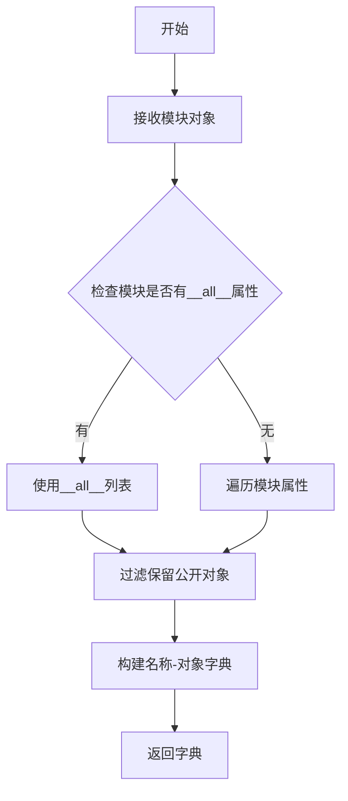
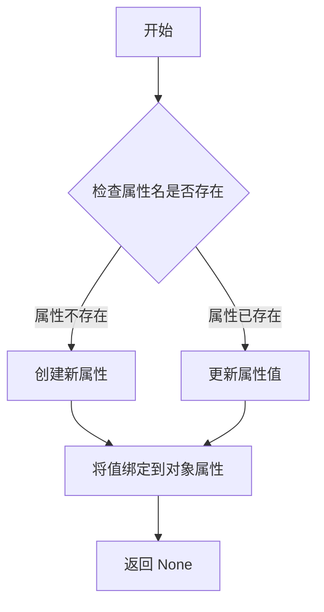
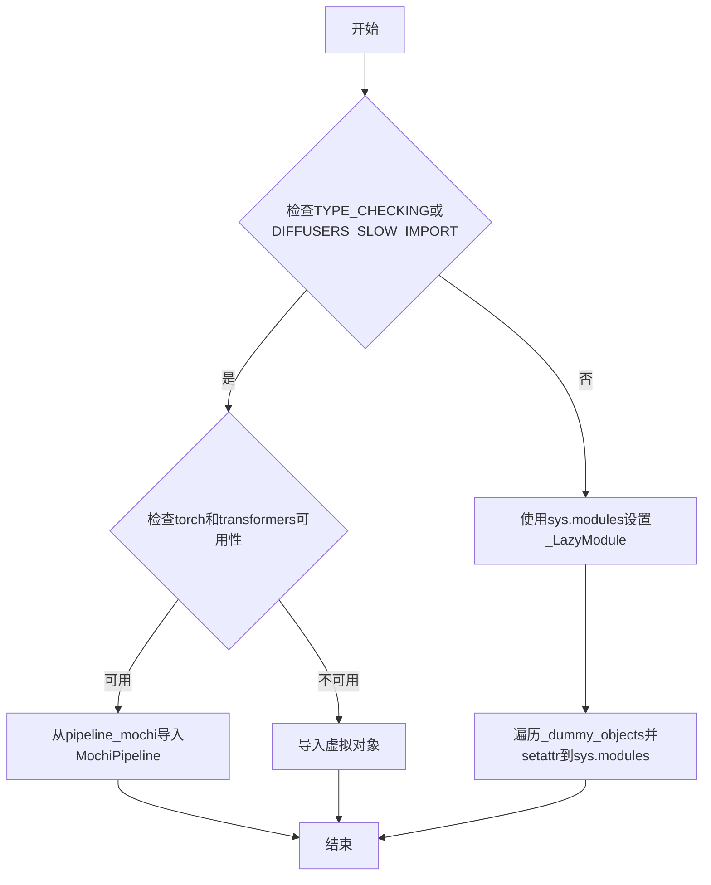
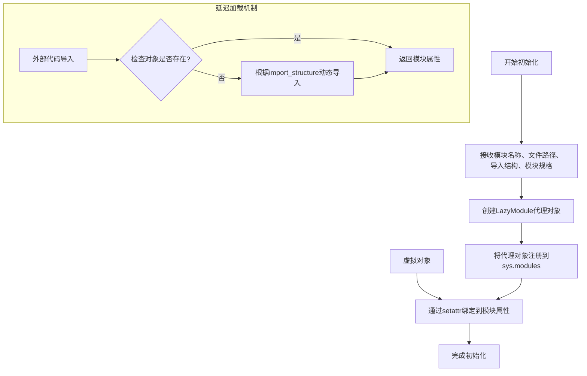

# `diffusers\src\diffusers\pipelines\mochi\__init__.py` 详细设计文档

这是 Diffusers 库中 Mochi Pipeline 的初始化文件，核心功能是利用延迟导入 (_LazyModule) 和虚拟对象 (Dummy Objects) 技术，实现可选依赖 (torch, transformers) 的动态管理，确保库在缺少相关依赖时仍能安全加载，避免导入错误。

## 整体流程

```mermaid
graph TD
    A[模块导入] --> B{TYPE_CHECKING 或 DIFFUSERS_SLOW_IMPORT?}
    B -- 是 --> C{依赖可用检查}
    B -- 否 --> D[运行时初始化]
    C -- 不可用 --> E[导入 dummy_torch_and_transformers_objects]
    C -- 可用 --> F[从 .pipeline_mochi 导入 MochiPipeline]
    E --> G[结束 (类型提示加载)]
    F --> G
    D --> H{依赖可用检查}
    H -- 不可用 --> I[从 utils 导入 dummy 模块并获取对象]
    H -- 可用 --> J[更新 _import_structure 注册 pipeline_mochi]
    I --> K[实例化 _LazyModule]
    J --> K
    K --> L[替换 sys.modules[__name__]]
    L --> M[遍历 _dummy_objects 并 setattr 到当前模块]
```

## 类结构

```
diffusers (根命名空间)
└── pipelines (管道集合)
    └── mochi (Mochi 模型管道)
        ├── __init__.py (当前文件: 负责懒加载与导出)
        └── pipeline_mochi.py (具体管道实现: 包含 MochiPipeline 类)
```

## 全局变量及字段


### `_dummy_objects`
    
存储虚拟对象的字典，用于延迟加载时替代不可用的模块

类型：`dict`
    


### `_import_structure`
    
定义模块导入结构的字典，映射导入名称到实际对象

类型：`dict`
    


### `DIFFUSERS_SLOW_IMPORT`
    
标志位，指示是否启用慢速导入模式，用于类型检查时的导入控制

类型：`bool`
    


### `is_torch_available`
    
检查torch库是否可用的函数，返回布尔值

类型：`function`
    


### `is_transformers_available`
    
检查transformers库是否可用的函数，返回布尔值

类型：`function`
    


### `_LazyModule.__name__`
    
延迟加载模块的名称

类型：`str`
    


### `_LazyModule.__file__`
    
延迟加载模块的文件路径

类型：`str`
    


### `_LazyModule._import_structure`
    
延迟加载模块的导入结构定义

类型：`dict`
    


### `_LazyModule.module_spec`
    
模块规格对象，定义模块的元数据

类型：`ModuleSpec`
    
    

## 全局函数及方法


### `get_objects_from_module`

获取指定模块中的所有公共对象，并将其转换为字典格式返回。主要用于延迟加载（lazy loading）机制，将虚拟对象（dummy objects）添加到当前模块的命名空间中。

参数：

- `module`：模块对象，要从中获取对象的目标模块（如 `dummy_torch_and_transformers_objects`）

返回值：`dict`，键为对象名称（字符串），值为模块中的实际对象

#### 流程图



#### 带注释源码

```python
# 该函数定义在 ...utils 中，这里展示典型实现逻辑
def get_objects_from_module(module):
    """
    从给定模块中提取所有公共对象
    
    参数:
        module: 要提取对象的模块对象
        
    返回:
        dict: 包含模块中所有公共对象的字典，键为对象名称
    """
    # 初始化结果字典
    objects = {}
    
    # 检查模块是否有 __all__ 显式导出列表
    if hasattr(module, '__all__'):
        # 如果有，则只导出 __all__ 中列出的对象
        for name in module.__all__:
            if hasattr(module, name):
                objects[name] = getattr(module, name)
    else:
        # 否则遍历模块的所有属性，过滤掉私有属性和特殊属性
        for name in dir(module):
            # 跳过私有属性（以_开头）和特殊属性
            if not name.startswith('_'):
                # 跳过非对象属性（如模块级别的函数和类）
                obj = getattr(module, name)
                # 可以根据需要进一步过滤
                objects[name] = obj
    
    return objects
```

#### 使用示例

```python
# 在当前文件中的实际调用方式
from ...utils import get_objects_from_module

# 调用示例
_dummy_objects = {}
_dummy_objects.update(get_objects_from_module(dummy_torch_and_transformers_objects))

# 结果：_dummy_objects 变成 {'ObjectName1': <object1>, 'ObjectName2': <object2>, ...}
```


### `setattr`

设置指定对象属性值的功能，将给定的属性名绑定到指定对象上。

参数：

- `obj`：`object`，目标对象，要在其上设置属性
- `name`：`str`，属性名称，字符串类型，表示要设置的属性名
- `value`：任意类型，属性值，要赋给指定属性的值

返回值：`None`，该函数无返回值（Python 内置函数通常返回 None）

#### 流程图



#### 带注释源码

```python
# 遍历所有虚拟对象（_dummy_objects）
# 这些虚拟对象是在导入依赖不可用时创建的替代品
for name, value in _dummy_objects.items():
    # 使用 setattr 将每个虚拟对象动态绑定到当前模块
    # 参数说明：
    # - sys.modules[__name__]：当前模块对象
    # - name：属性名称（虚拟对象的名称）
    # - value：属性值（虚拟对象本身）
    setattr(sys.modules[__name__], name, value)
```

#### 说明

此代码段位于 Diffusers 库的懒加载模块初始化逻辑中。`setattr` 在这里的作用是：

1. **动态模块属性绑定**：将虚拟对象（_dummy_objects）动态添加到当前模块，使它们可以作为模块属性被访问
2. **懒加载机制**：当可选依赖（torch 和 transformers）不可用时，库使用虚拟对象替代真实的类和函数，避免导入错误
3. **保持 API 一致性**：无论依赖是否可用，模块都导出相同的接口，只是不可用时使用虚拟对象

这是 Python 中实现可选依赖库的常见模式，既保证了库的正常安装，又提供了清晰的错误提示。


### `sys.modules` 动态模块设置

此代码段是diffusers库中的一个模块初始化文件，通过动态方式处理可选依赖（torch和transformers），并在运行时将当前模块替换为_LazyModule以实现延迟加载，同时将虚拟对象注入到sys.modules中以保持API一致性。

参数：无

返回值：无

#### 流程图



#### 带注释源码

```python
from typing import TYPE_CHECKING

# 从utils导入必要的工具和检查函数
from ...utils import (
    DIFFUSERS_SLOW_IMPORT,
    OptionalDependencyNotAvailable,
    _LazyModule,
    get_objects_from_module,
    is_torch_available,
    is_transformers_available,
)

# 初始化虚拟对象字典和导入结构
_dummy_objects = {}
_import_structure = {}

# 尝试检查torch和transformers是否同时可用
try:
    if not (is_transformers_available() and is_torch_available()):
        raise OptionalDependencyNotAvailable()
except OptionalDependencyNotAvailable:
    # 如果不可用，从dummy模块获取虚拟对象用于API兼容
    from ...utils import dummy_torch_and_transformers_objects  # noqa F403
    _dummy_objects.update(get_objects_from_module(dummy_torch_and_transformers_objects))
else:
    # 如果可用，添加MochiPipeline到导入结构
    _import_structure["pipeline_mochi"] = ["MochiPipeline"]

# TYPE_CHECKING模式或慢导入模式下的处理
if TYPE_CHECKING or DIFFUSERS_SLOW_IMPORT:
    try:
        if not (is_transformers_available() and is_torch_available()):
            raise OptionalDependencyNotAvailable()
    except OptionalDependencyNotAvailable:
        # 导入类型检查用的虚拟对象
        from ...utils.dummy_torch_and_transformers_objects import *
    else:
        # 实际导入MochiPipeline类
        from .pipeline_mochi import MochiPipeline
else:
    # 运行时：将当前模块替换为LazyModule实现延迟加载
    import sys
    sys.modules[__name__] = _LazyModule(
        __name__,                      # 模块名
        globals()["__file__"],         # 模块文件路径
        _import_structure,            # 导入结构字典
        module_spec=__spec__,          # 模块规格
    )
    
    # 将虚拟对象设置到sys.modules中，保持API一致性
    for name, value in _dummy_objects.items():
        setattr(sys.modules[__name__], name, value)
```


# 详细设计文档

### `_LazyModule.__init__`

延迟加载模块的初始化方法，用于配置Python模块的惰性导入机制，允许按需加载子模块和类，从而优化导入速度和减少内存占用。

参数：

- `name`：`str`，当前模块的完全限定名称（通常为 `__name__`）
- `module_file`：`str`，模块对应的文件路径（来自 `globals()["__file__"]`）
- `import_structure`：`dict`，定义了可导入对象结构的目标字典，键为子模块名，值为可导出的类/函数名称列表
- `module_spec`：`ModuleSpec | None`，模块的规格说明对象（来自 `__spec__`），包含模块的元数据信息

返回值：`_LazyModule`，返回配置好的延迟加载模块代理对象

#### 流程图



#### 带注释源码

```python
# 从系统模块中获取当前模块的规格说明，用于后续的延迟加载配置
import sys

# 将当前模块替换为_LazyModule代理对象，实现惰性导入
# 参数说明：
#   __name__: 模块名称（如 'diffusers.models.mochi'）
#   globals()["__file__"]: 模块对应的文件路径
#   _import_structure: 定义可导入内容的字典结构
#   module_spec: 模块规格对象，保留原始模块的所有元信息
sys.modules[__name__] = _LazyModule(
    __name__,                              # 模块名
    globals()["__file__"],                 # 模块文件路径
    _import_structure,                    # 导入结构字典
    module_spec=__spec__,                 # 模块规格（可选，保留原始spec信息）
)

# 将虚拟对象（可选依赖的替代品）绑定到模块属性
# 这样当尝试访问这些对象时，可以返回有意义的错误信息或虚拟对象
# 示例：如果transformers或torch不可用，则使用dummy对象作为占位符
for name, value in _dummy_objects.items():
    setattr(sys.modules[__name__], name, value)
```

#### 补充说明

**关键组件信息**

| 组件名称 | 描述 |
|---------|------|
| `_LazyModule` | 惰性模块代理类，拦截模块属性访问实现按需导入 |
| `_import_structure` | 字典结构，定义模块的公开接口（哪些类/函数可被导入） |
| `_dummy_objects` | 虚拟对象集合，当可选依赖不可用时的替代品 |
| `OptionalDependencyNotAvailable` | 可选依赖不可用时的异常类型 |

**技术债务与优化空间**

1. **错误处理缺失**：当前代码未对 `__spec__` 为 `None` 的情况进行处理
2. **硬编码依赖**：依赖检查逻辑分散，建议统一管理
3. **类型提示不完整**：未使用 `from __future__ import annotations` 预编译注解

**设计目标与约束**

- 目标：实现模块的延迟加载，最小化启动时的依赖检查开销
- 约束：必须同时满足 `is_transformers_available()` 和 `is_torch_available()` 条件才暴露真实类

## 关键组件


### 模块初始化与延迟加载机制

该代码是Diffusers库中MochiPipeline的模块初始化文件，通过LazyModule机制实现可选依赖（torch、transformers）的延迟导入，当依赖不可用时使用虚拟对象进行占位，确保模块结构的完整性同时避免严格的依赖要求。

### 整体运行流程

1. 导入类型检查标志和工具函数（_LazyModule、get_objects_from_module、依赖可用性检查函数）
2. 初始化空字典`_dummy_objects`和`_import_structure`
3. 尝试检查torch和transformers是否同时可用
4. 若依赖不可用，加载dummy对象模块；若可用，在_import_structure中注册MochiPipeline
5. 根据TYPE_CHECKING或DIFFUSERS_SLOW_IMPORT标志决定是直接导入还是延迟加载
6. 最后将模块注册到sys.modules中，并设置dummy对象属性

### 全局变量

#### _dummy_objects

- **类型**: dict
- **描述**: 存储虚拟对象，当依赖不可用时用于替代真实对象

#### _import_structure

- **类型**: dict
- **描述**: 定义模块的导入结构，键为类别名，值为该类别下的对象列表

### 关键组件

#### 可选依赖检查与虚拟对象机制

- **名称**: OptionalDependencyNotAvailable与dummy_torch_and_transformers_objects
- **描述**: 当torch或transformers任一不可用时，捕获异常并加载虚拟对象模块，保证代码不因依赖缺失而崩溃

#### 延迟加载模块

- **名称**: _LazyModule
- **描述**: 来自diffusers.utils的延迟加载实现，仅在首次访问时才真正导入模块内容，优化启动性能

#### 条件导入策略

- **名称**: TYPE_CHECKING与DIFFUSERS_SLOW_IMPORT
- **描述**: TYPE_CHECKING用于类型检查时的完整导入，DIFFUSERS_SLOW_IMPORT控制是否启用延迟加载模式

#### 对象批量获取

- **名称**: get_objects_from_module
- **描述**: 从指定模块获取所有对象并转换为字典，用于批量加载dummy对象

### 潜在技术债务与优化空间

1. **重复的依赖检查逻辑**: 在if和else分支中都进行了相同is_transformers_available()和is_torch_available()检查，造成代码冗余
2. **魔法字符串依赖**: "pipeline_mochi"和"MochiPipeline"以硬编码字符串形式存在，缺乏灵活性
3. **异常捕获粒度**: 统一的OptionalDependencyNotAvailable异常可能掩盖具体是哪个依赖缺失的问题
4. **sys.modules直接操作**: 直接操作sys.modules不符合最佳实践，应通过模块规范（module_spec）更优雅地处理
5. **缺少日志提示**: 依赖缺失时无任何警告信息，用户可能不知道使用了虚拟对象而非真实实现

### 其它项目

#### 设计目标与约束

- **目标**: 实现可选依赖的优雅降级，保持模块结构一致性
- **约束**: 必须同时满足torch和transformers都可用才加载真实pipeline

#### 错误处理与异常设计

- 使用try-except捕获OptionalDependencyNotAvailable异常，在except分支加载dummy对象
- 异常信息流：依赖检查 → OptionalDependencyNotAvailable → dummy模块加载

#### 数据流与状态机

- 依赖可用性检查 → 决定导入路径 → 注册到_import_structure → LazyModule包装 → sys.modules注册

#### 外部依赖与接口契约

- 依赖: is_torch_available, is_transformers_available, get_objects_from_module, _LazyModule, OptionalDependencyNotAvailable
- 接口契约: _import_structure字典结构必须符合LazyModule的预期格式


## 问题及建议


### 已知问题

-   **重复的依赖检查逻辑**：`is_transformers_available() and is_torch_available()` 的检查在代码中重复了三次（MochiPipeline导入时的两个位置和try块中），违反DRY原则，增加维护成本
-   **缺乏日志记录**：当`OptionalDependencyNotAvailable`异常被捕获时，没有记录任何日志信息，难以追踪依赖问题
-   **模块初始化分散**：`_import_structure`和`_dummy_objects`的初始化逻辑分散在代码各处，降低了代码的可读性和可维护性
-   **硬编码的依赖条件**：依赖检查条件直接嵌入在条件语句中，缺乏可配置的依赖管理机制
-   **冗余的导入结构定义**：在`else`分支中直接使用字符串键`"pipeline_mochi"`定义导入结构，没有使用常量或枚举，增加出错风险

### 优化建议

-   **提取依赖检查逻辑**：创建一个辅助函数或变量来缓存依赖检查结果，避免重复计算，例如：`_deps_available = is_transformers_available() and is_torch_available()`
-   **添加日志记录**：在捕获`OptionalDependencyNotAvailable`异常时，添加适当的日志记录，便于调试和问题追踪
-   **重构模块初始化**：将`_import_structure`的定义集中在代码顶部，使用更清晰的注释区分不同部分
-   **使用配置常量**：定义模块级别的常量来表示管道名称和依赖条件，提高代码的可维护性
-   **考虑抽象公共逻辑**：如果项目中多个类似的模块，可以考虑创建一个基类或混入类来处理通用的lazy loading逻辑，减少代码重复
-   **增强错误信息**：在异常处理中提供更详细的错误上下文信息，包括缺少的具体依赖名称


## 其它


### 设计目标与约束

该模块的设计目标是实现Diffusers库中MochiPipeline的懒加载（Lazy Loading），在保证模块导入速度的同时优雅地处理可选依赖（torch和transformers）。约束条件包括：仅在torch和transformers都可用时才能导入完整的MochiPipeline，否则使用虚拟对象（dummy objects）作为占位符，避免导入错误。

### 错误处理与异常设计

代码使用try-except块捕获OptionalDependencyNotAvailable异常。当torch或transformers任一不可用时，抛出该异常并导入dummy_torch_and_transformers_objects模块中的虚拟对象。这些虚拟对象用于保持API一致性，使依赖该模块的代码不会因为可选依赖缺失而崩溃。设计采用"fail-safe"原则，确保模块在各种环境下的可导入性。

### 数据流与状态机

模块存在两种运行状态：快速导入状态（默认）和类型检查/慢速导入状态（TYPE_CHECKING或DIFFUSERS_SLOW_IMPORT为真）。在快速导入状态下，模块被替换为_LazyModule实例，所有导入操作延迟到实际使用时才执行，_dummy_objects通过setattr动态添加到sys.modules中。在类型检查状态下，模块直接导入实际的MochiPipeline类或dummy对象，不使用懒加载机制。

### 外部依赖与接口契约

外部依赖包括：1) torch库（is_torch_available()检测）；2) transformers库（is_transformers_available()检测）；3) Diffusers内部utils模块（包含_LazyModule、OptionalDependencyNotAvailable、get_objects_from_module等工具）。接口契约规定：_import_structure字典定义了可导出的公共API（当前仅MochiPipeline），_dummy_objects提供了可选依赖不可用时的替代对象。

### 模块初始化流程

1. 初始化空字典_dummy_objects和_import_structure
2. 检查torch和transformers可用性，若不可用则加载dummy objects到_dummy_objects
3. 若可用，在_import_structure中注册pipeline_mochi模块的MochiPipeline导出
4. 根据运行模式决定直接导入或创建LazyModule代理
5. 在LazyModule模式下，将_dummy_objects中的所有对象设置到sys.modules[__name__]属性中

### 潜在技术债务与优化空间

1. **硬编码依赖检查**：is_transformers_available() and is_torch_available()的检查逻辑分散，建议封装为统一函数
2. **魔法字符串**：模块名"pipeline_mochi"和"MochiPipeline"硬编码，建议使用常量或配置
3. **异常处理冗余**：在TYPE_CHECKING块和else块中重复了相同的依赖检查逻辑
4. **无版本兼容性检查**：未验证torch和transformers的最低版本要求
5. **缺乏日志记录**：缺少模块加载状态的日志输出，不利于调试

### 关键组件职责

| 组件名称 | 职责描述 |
|---------|---------|
| _LazyModule | 延迟导入实现，将模块加载推迟到属性访问时 |
| MochiPipeline | 主 pipeline 类，提供文生视频功能 |
| _import_structure | 定义模块的公共API导出结构 |
| _dummy_objects | 存储可选依赖不可用时的替代对象 |
| get_objects_from_module | 从指定模块获取所有可导出对象 |
| OptionalDependencyNotAvailable | 可选依赖不可用时的异常类 |

    