# `diffusers\src\diffusers\pipelines\mochi\pipeline_mochi.py` 详细设计文档

Mochi是一个文本到视频生成的Diffusion Pipeline，集成T5文本编码器、MochiTransformer3DModel和AutoencoderKLMochi VAE，使用FlowMatchEulerDiscreteScheduler进行去噪，通过线性二次调度器生成高质量视频。

## 整体流程

```mermaid
graph TD
    A[开始: 用户调用__call__] --> B[检查输入参数 check_inputs]
B --> C[准备文本嵌入 encode_prompt]
C --> D[准备潜在变量 prepare_latents]
D --> E{是否使用CFG?}
E -- 是 --> F[拼接负向提示嵌入]
E -- 否 --> G[获取时间步 retrieve_timesteps]
F --> G
G --> H[去噪循环 for t in timesteps]
H --> I[调用Transformer推理]
I --> J{是否使用CFG?}
J -- 是 --> K[计算CFG噪声预测]
J -- 否 --> L[直接使用预测噪声]
K --> M[scheduler.step更新latents]
L --> M
M --> N{是否有回调?]
N -- 是 --> O[执行回调 callback_on_step_end]
N -- 否 --> P{是否完成所有步?]
O --> P
P -- 否 --> H
P -- 是 --> Q{output_type == latent?}
Q -- 是 --> R[直接返回latents]
Q -- 否 --> S[VAE解码 decode latents]
S --> T[后处理视频 postprocess_video]
T --> U[返回MochiPipelineOutput]
```

## 类结构

```
DiffusionPipeline (抽象基类)
└── MochiPipeline
    ├── Mochi1LoraLoaderMixin (Mixin类)
    └── MochiPipelineOutput (输出类)
```

## 全局变量及字段


### `logger`
    
模块日志记录器，用于记录管道运行过程中的信息

类型：`logging.Logger`
    


### `EXAMPLE_DOC_STRING`
    
示例文档字符串，包含MochiPipeline的使用示例代码

类型：`str`
    


### `XLA_AVAILABLE`
    
XLA可用性标志，指示PyTorch XLA是否可用

类型：`bool`
    


### `MochiPipeline.scheduler`
    
扩散调度器，用于控制去噪过程的噪声调度

类型：`FlowMatchEulerDiscreteScheduler`
    


### `MochiPipeline.vae`
    
视频VAE编解码器，用于将视频编码到潜在空间并从潜在空间解码视频

类型：`AutoencoderKLMochi`
    


### `MochiPipeline.text_encoder`
    
T5文本编码器，用于将文本提示编码为文本嵌入

类型：`T5EncoderModel`
    


### `MochiPipeline.tokenizer`
    
T5分词器，用于将文本分割为token序列

类型：`T5TokenizerFast`
    


### `MochiPipeline.transformer`
    
去噪Transformer，用于在潜在空间中逐步去除噪声生成视频

类型：`MochiTransformer3DModel`
    


### `MochiPipeline.video_processor`
    
视频后处理器，用于将VAE输出的潜在表示转换为最终视频帧

类型：`VideoProcessor`
    


### `MochiPipeline.vae_spatial_scale_factor`
    
VAE空间缩放因子(8)，用于将像素空间尺寸映射到潜在空间

类型：`int`
    


### `MochiPipeline.vae_temporal_scale_factor`
    
VAE时间缩放因子(6)，用于将时间维度映射到潜在空间

类型：`int`
    


### `MochiPipeline.patch_size`
    
补丁大小(2)，用于Transformer的空间时间_patch处理

类型：`int`
    


### `MochiPipeline.tokenizer_max_length`
    
分词器最大长度，限制输入文本的最大token数

类型：`int`
    


### `MochiPipeline.default_height`
    
默认高度(480)，生成的视频帧的默认像素高度

类型：`int`
    


### `MochiPipeline.default_width`
    
默认宽度(848)，生成的视频帧的默认像素宽度

类型：`int`
    


### `MochiPipeline._guidance_scale`
    
引导尺度，用于控制分类器-free guidance的强度

类型：`float`
    


### `MochiPipeline._attention_kwargs`
    
注意力参数字典，用于传递注意力处理器的额外参数

类型：`dict[str, Any]`
    


### `MochiPipeline._current_timestep`
    
当前时间步，记录去噪循环中的当前推理步骤

类型：`int`
    


### `MochiPipeline._interrupt`
    
中断标志，用于控制去噪循环的中断

类型：`bool`
    


### `MochiPipeline._num_timesteps`
    
总时间步数，记录去噪过程的总步数

类型：`int`
    


### `MochiPipeline.model_cpu_offload_seq`
    
CPU卸载顺序，定义模型组件卸载到CPU的顺序

类型：`str`
    


### `MochiPipeline._optional_components`
    
可选组件列表，定义管道中可选的模型组件

类型：`list`
    


### `MochiPipeline._callback_tensor_inputs`
    
回调张量输入列表，定义回调函数可访问的张量

类型：`list`
    


### `MochiPipelineOutput.frames`
    
生成的视频帧，管道输出的视频帧张量

类型：`torch.Tensor`
    
    

## 全局函数及方法


### `linear_quadraticSchedule`

线性二次调度函数，用于生成噪声调度（sigma schedule）。该函数通过结合线性和二次曲线，生成从高噪声到低噪声的非线性过渡调度，常用于扩散模型的采样过程中，以平衡早期快速去噪和后期精细细节保留。

参数：

- `num_steps`：`int`，总推理步数，决定生成噪声调度列表的长度
- `threshold_noise`：`float`，阈值噪声值，线性阶段的终止噪声水平
- `linear_steps`：`int | None`，线性阶段的步数，默认为 `num_steps // 2`

返回值：`list[float]`，噪声调度列表，长度为 `num_steps`，值为 1.0 减去各阶段噪声水平，代表从低噪声到高噪声的调度序列

#### 流程图

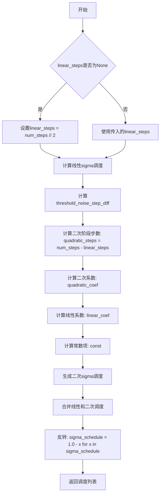

#### 带注释源码

```python
def linear_quadraticSchedule(num_steps, threshold_noise, linear_steps=None):
    """
    生成线性-二次混合的噪声调度（sigma schedule）
    
    该调度结合线性过渡和二次曲线，用于扩散模型的采样过程。
    线性阶段用于快速降低噪声，二次阶段用于更精细的去噪。
    
    Args:
        num_steps: 总推理步数
        threshold_noise: 阈值噪声值，线性阶段的终止噪声水平
        linear_steps: 线性阶段的步数，默认为总步数的一半
    
    Returns:
        sigma_schedule: 噪声调度列表，从低噪声到高噪声
    """
    # 如果未指定线性步数，则默认为总步数的一半
    if linear_steps is None:
        linear_steps = num_steps // 2
    
    # 线性阶段：生成从0到threshold_noise的线性sigma值
    linear_sigma_schedule = [i * threshold_noise / linear_steps for i in range(linear_steps)]
    
    # 计算线性阶段结束时的步数与阈值噪声的差值
    # 这个值用于确定二次阶段的起始条件
    threshold_noise_step_diff = linear_steps - threshold_noise * num_steps
    
    # 计算二次阶段的步数
    quadratic_steps = num_steps - linear_steps
    
    # 计算二次多项式系数
    # 二次项系数：控制曲线的曲率
    quadratic_coef = threshold_noise_step_diff / (linear_steps * quadratic_steps**2)
    
    # 一次项系数：确保在linear_steps处与线性阶段连续
    linear_coef = threshold_noise / linear_steps - 2 * threshold_noise_step_diff / (quadratic_steps**2)
    
    # 常数项：确保在linear_steps处与线性阶段连续
    const = quadratic_coef * (linear_steps**2)
    
    # 生成二次阶段的sigma调度
    # 从linear_steps开始到num_steps-1
    quadratic_sigma_schedule = [
        quadratic_coef * (i**2) + linear_coef * i + const for i in range(linear_steps, num_steps)
    ]
    
    # 合并线性和二次阶段
    sigma_schedule = linear_sigma_schedule + quadratic_sigma_schedule
    
    # 反转调度：从噪声水平转换为1-噪声水平
    # 这样可以得到从低噪声到高噪声的调度（用于扩散模型的采样）
    sigma_schedule = [1.0 - x for x in sigma_schedule]
    
    return sigma_schedule
```


### `retrieve_timesteps`

该函数是一个从调度器获取时间步的辅助函数。它调用调度器的 `set_timesteps` 方法，并在调用后从调度器中检索时间步。该函数支持自定义时间步和自定义 sigmas，任何额外的关键字参数都会传递给调度器的 `set_timesteps` 方法。

参数：

- `scheduler`：`SchedulerMixin`，要获取时间步的调度器
- `num_inference_steps`：`int | None`，使用预训练模型生成样本时使用的扩散步数。如果使用此参数，`timesteps` 必须为 `None`
- `device`：`str | torch.device | None`，时间步应移动到的设备。如果为 `None`，时间步不会被移动
- `timesteps`：`list[int] | None`，用于覆盖调度器时间步间隔策略的自定义时间步。如果传入 `timesteps`，则 `num_inference_steps` 和 `sigmas` 必须为 `None`
- `sigmas`：`list[float] | None`，用于覆盖调度器时间步间隔策略的自定义 sigmas。如果传入 `sigmas`，则 `num_inference_steps` 和 `timesteps` 必须为 `None`
- `**kwargs`：任意关键字参数，将传递给 `scheduler.set_timesteps`

返回值：`tuple[torch.Tensor, int]`，元组中第一个元素是调度器的时间步计划，第二个元素是推理步数

#### 流程图

```mermaid
flowchart TD
    A[开始] --> B{检查timesteps和sigmas是否同时存在}
    B -->|是| C[抛出ValueError: 只能指定timesteps或sigmas之一]
    B -->|否| D{检查timesteps是否提供}
    D -->|是| E[检查scheduler.set_timesteps是否接受timesteps参数]
    E -->|否| F[抛出ValueError: 当前调度器不支持自定义timesteps]
    E -->|是| G[调用scheduler.set_timesteps<br/>timesteps=timesteps, device=device, **kwargs]
    D -->|否| H{检查sigmas是否提供}
    H -->|是| I[检查scheduler.set_timesteps是否接受sigmas参数]
    I -->|否| J[抛出ValueError: 当前调度器不支持自定义sigmas]
    I -->|是| K[调用scheduler.set_timesteps<br/>sigmas=sigmas, device=device, **kwargs]
    H -->|否| L[调用scheduler.set_timesteps<br/>num_inference_steps=num_inference_steps, device=device, **kwargs]
    G --> M[从scheduler获取timesteps]
    K --> M
    L --> M
    M --> N[计算num_inference_steps = len(timesteps)]
    N --> O[返回timesteps和num_inference_steps]
```

#### 带注释源码

```python
# Copied from diffusers.pipelines.stable_diffusion.pipeline_stable_diffusion.retrieve_timesteps
def retrieve_timesteps(
    scheduler,
    num_inference_steps: int | None = None,
    device: str | torch.device | None = None,
    timesteps: list[int] | None = None,
    sigmas: list[float] | None = None,
    **kwargs,
):
    r"""
    Calls the scheduler's `set_timesteps` method and retrieves timesteps from the scheduler after the call. Handles
    custom timesteps. Any kwargs will be supplied to `scheduler.set_timesteps`.

    Args:
        scheduler (`SchedulerMixin`):
            The scheduler to get timesteps from.
        num_inference_steps (`int`):
            The number of diffusion steps used when generating samples with a pre-trained model. If used, `timesteps`
            must be `None`.
        device (`str` or `torch.device`, *optional*):
            The device to which the timesteps should be moved to. If `None`, the timesteps are not moved.
        timesteps (`list[int]`, *optional*):
            Custom timesteps used to override the timestep spacing strategy of the scheduler. If `timesteps` is passed,
            `num_inference_steps` and `sigmas` must be `None`.
        sigmas (`list[float]`, *optional*):
            Custom sigmas used to override the timestep spacing strategy of the scheduler. If `sigmas` is passed,
            `num_inference_steps` and `timesteps` must be `None`.

    Returns:
        `tuple[torch.Tensor, int]`: A tuple where the first element is the timestep schedule from the scheduler and the
        second element is the number of inference steps.
    """
    # 验证：不能同时指定timesteps和sigmas，只能选择其中一个来设置自定义值
    if timesteps is not None and sigmas is not None:
        raise ValueError("Only one of `timesteps` or `sigmas` can be passed. Please choose one to set custom values")
    
    # 处理自定义timesteps的情况
    if timesteps is not None:
        # 检查scheduler.set_timesteps是否支持timesteps参数
        accepts_timesteps = "timesteps" in set(inspect.signature(scheduler.set_timesteps).parameters.keys())
        if not accepts_timesteps:
            raise ValueError(
                f"The current scheduler class {scheduler.__class__}'s `set_timesteps` does not support custom"
                f" timestep schedules. Please check whether you are using the correct scheduler."
            )
        # 调用scheduler的set_timesteps方法设置自定义timesteps
        scheduler.set_timesteps(timesteps=timesteps, device=device, **kwargs)
        # 从scheduler获取更新后的timesteps
        timesteps = scheduler.timesteps
        # 计算推理步数
        num_inference_steps = len(timesteps)
    # 处理自定义sigmas的情况
    elif sigmas is not None:
        # 检查scheduler.set_timesteps是否支持sigmas参数
        accept_sigmas = "sigmas" in set(inspect.signature(scheduler.set_timesteps).parameters.keys())
        if not accept_sigmas:
            raise ValueError(
                f"The current scheduler class {scheduler.__class__}'s `set_timesteps` does not support custom"
                f" sigmas schedules. Please check whether you are using the correct scheduler."
            )
        # 调用scheduler的set_timesteps方法设置自定义sigmas
        scheduler.set_timesteps(sigmas=sigmas, device=device, **kwargs)
        # 从scheduler获取更新后的timesteps
        timesteps = scheduler.timesteps
        # 计算推理步数
        num_inference_steps = len(timesteps)
    # 默认情况：使用num_inference_steps设置timesteps
    else:
        scheduler.set_timesteps(num_inference_steps, device=device, **kwargs)
        timesteps = scheduler.timesteps
    
    # 返回timesteps张量和推理步数
    return timesteps, num_inference_steps
```


### `MochiPipeline.__init__`

该方法是MochiPipeline类的构造函数，负责初始化文本到视频生成管道所需的各个组件，包括调度器、VAE模型、文本编码器、tokenizer和变换器模型，并设置相关的配置参数和默认值。

参数：

-  `scheduler`：`FlowMatchEulerDiscreteScheduler`，用于去噪过程的调度器
-  `vae`：`AutoencoderKLMochi`，用于编码和解码视频的变分自编码器模型
-  `text_encoder`：`T5EncoderModel`，用于将文本提示编码为嵌入的T5编码器模型
-  `tokenizer`：`T5TokenizerFast`，用于将文本提示分词为token的T5分词器
-  `transformer`：`MochiTransformer3DModel`，用于去噪视频潜在表示的条件变换器架构
-  `force_zeros_for_empty_prompt`：`bool`，可选参数，默认为False，用于控制是否对空提示强制为零

返回值：无（`__init__`方法不返回任何值）

#### 流程图

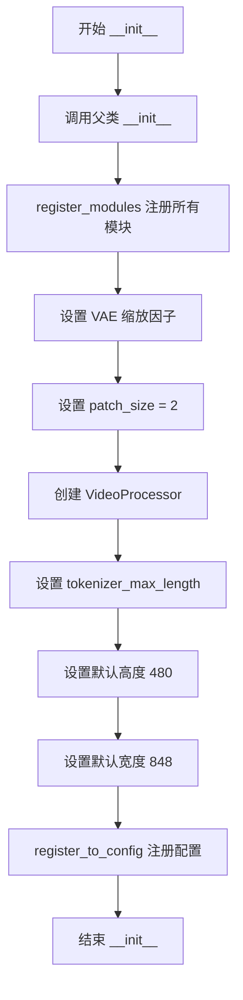

#### 带注释源码

```python
def __init__(
    self,
    scheduler: FlowMatchEulerDiscreteScheduler,  # 调度器：用于控制去噪过程的时间步长
    vae: AutoencoderKLMochi,  # VAE模型：用于视频编码/解码
    text_encoder: T5EncoderModel,  # 文本编码器：T5模型用于文本嵌入
    tokenizer: T5TokenizerFast,  # 分词器：用于文本预处理
    transformer: MochiTransformer3DModel,  # 变换器：核心去噪模型
    force_zeros_for_empty_prompt: bool = False,  # 标志：是否强制空提示为零
):
    # 调用父类DiffusionPipeline的初始化方法
    super().__init__()

    # 注册所有模块到管道中，使其可通过self访问
    self.register_modules(
        vae=vae,
        text_encoder=text_encoder,
        tokenizer=tokenizer,
        transformer=transformer,
        scheduler=scheduler,
    )
    
    # TODO: determine these scaling factors from model parameters
    # 设置VAE的空间缩放因子（用于将像素空间转换为潜在空间）
    self.vae_spatial_scale_factor = 8
    # 设置VAE的时间缩放因子（用于帧数转换）
    self.vae_temporal_scale_factor = 6
    # 设置patch大小，用于变换器处理
    self.patch_size = 2

    # 创建视频处理器，用于视频后处理
    self.video_processor = VideoProcessor(vae_scale_factor=self.vae_spatial_scale_factor)
    
    # 设置tokenizer的最大长度（默认为256，如果tokenizer存在）
    self.tokenizer_max_length = (
        self.tokenizer.model_max_length if hasattr(self, "tokenizer") and self.tokenizer is not None else 256
    )
    
    # 设置默认输出视频高度
    self.default_height = 480
    # 设置默认输出视频宽度
    self.default_width = 848
    
    # 将force_zeros_for_empty_prompt注册到配置中
    self.register_to_config(force_zeros_for_empty_prompt=force_zeros_for_empty_prompt)
```


### `MochiPipeline._get_t5_prompt_embeds`

该方法将文本提示（prompt）编码为T5文本编码器的隐藏状态（embeddings），并生成相应的注意力掩码。它处理单个或多个文本提示，支持批量生成视频时的嵌入复制，并处理空提示的特殊情况。

参数：

- `prompt`：`str | list[str]`，输入的文本提示，可以是单个字符串或字符串列表
- `num_videos_per_prompt`：`int`，每个提示生成的视频数量，默认为1
- `max_sequence_length`：`int`，T5编码器的最大序列长度，默认为256
- `device`：`torch.device | None`，执行设备，如果为None则使用execution_device
- `dtype`：`torch.dtype | None`，输出的数据类型，如果为None则使用text_encoder的dtype

返回值：`tuple[torch.Tensor, torch.Tensor]`，返回两个张量——第一个是prompt embeddings，第二个是prompt attention mask

#### 流程图

```mermaid
flowchart TD
    A[开始: _get_t5_prompt_embeds] --> B{device是否为None?}
    B -- 是 --> C[device = self._execution_device]
    B -- 否 --> D{device已设置}
    C --> D
    D --> E{dtype是否为None?}
    E -- 是 --> F[dtype = self.text_encoder.dtype]
    E -- 否 --> G{dtype已设置}
    F --> G
    G --> H{prompt是否为str?}
    H -- 是 --> I[prompt = [prompt]]
    H -- 否 --> J[prompt保持为list]
    I --> K[batch_size = len(prompt)]
    J --> K
    K --> L[调用tokenizer编码prompt]
    L --> M[获取text_input_ids和attention_mask]
    M --> N{force_zeros_for_empty_prompt且prompt为空?}
    N -- 是 --> O[将text_input_ids设为全零]
    N -- 否 --> P{检查是否需要截断}
    O --> Q[attention_mask设为全零]
    P --> R[调用tokenizer获取untruncated_ids]
    R --> S{untruncated_ids长度超过max_length?}
    S -- 是 --> T[记录截断警告]
    S -- 否 --> U{调用text_encoder获取embeddings]
    T --> U
    U --> V[将embeddings转换为指定dtype和device]
    V --> W[复制embeddings num_videos_per_prompt次]
    W --> X[reshape embeddings为batch_size * num_videos_per_prompt]
    X --> Y[复制并reshape attention_mask]
    Y --> Z[返回embeddings和attention_mask]
```

#### 带注释源码

```python
def _get_t5_prompt_embeds(
    self,
    prompt: str | list[str] = None,
    num_videos_per_prompt: int = 1,
    max_sequence_length: int = 256,
    device: torch.device | None = None,
    dtype: torch.dtype | None = None,
):
    """
    将文本提示编码为T5文本编码器的隐藏状态。

    参数:
        prompt: 输入的文本提示，可以是单个字符串或字符串列表
        num_videos_per_prompt: 每个提示生成的视频数量
        max_sequence_length: T5编码器的最大序列长度
        device: 执行设备
        dtype: 输出的数据类型

    返回:
        tuple: (prompt_embeds, prompt_attention_mask)
    """
    # 如果未指定device，则使用pipeline的执行设备
    device = device or self._execution_device
    # 如果未指定dtype，则使用text_encoder的数据类型
    dtype = dtype or self.text_encoder.dtype

    # 将单个字符串转换为列表，统一处理方式
    prompt = [prompt] if isinstance(prompt, str) else prompt
    # 获取批处理大小
    batch_size = len(prompt)

    # 使用T5 tokenizer将文本转换为token ids和attention mask
    text_inputs = self.tokenizer(
        prompt,
        padding="max_length",           # 填充到最大长度
        max_length=max_sequence_length, # 最大序列长度
        truncation=True,                # 截断超长序列
        add_special_tokens=True,        # 添加特殊token（如bos/eos）
        return_tensors="pt",            # 返回PyTorch张量
    )

    # 提取input ids和attention mask
    text_input_ids = text_inputs.input_ids
    prompt_attention_mask = text_inputs.attention_mask
    # 将attention mask转换为布尔类型并移到指定设备
    prompt_attention_mask = prompt_attention_mask.bool().to(device)

    # 如果配置要求对空提示强制使用零向量（用于classifier-free guidance）
    # 且当前提示为空，则将input ids和attention mask设为全零
    # 原始Mochi实现对空负提示使用零向量，但这可能导致autocast上下文中的溢出问题
    if self.config.force_zeros_for_empty_prompt and (prompt == "" or prompt[-1] == ""):
        text_input_ids = torch.zeros_like(text_input_ids, device=device)
        prompt_attention_mask = torch.zeros_like(prompt_attention_mask, dtype=torch.bool, device=device)

    # 获取未截断的token ids用于检查是否发生了截断
    untruncated_ids = self.tokenizer(prompt, padding="longest", return_tensors="pt").input_ids

    # 检查是否发生了截断，如果是则记录警告信息
    if untrracted_ids.shape[-1] >= text_input_ids.shape[-1] and not torch.equal(text_input_ids, untruncated_ids):
        # 解码被截断的部分用于日志记录
        removed_text = self.tokenizer.batch_decode(untruncated_ids[:, max_sequence_length - 1 : -1])
        logger.warning(
            "The following part of your input was truncated because `max_sequence_length` is set to "
            f" {max_sequence_length} tokens: {removed_text}"
        )

    # 使用T5文本编码器生成文本嵌入
    prompt_embeds = self.text_encoder(text_input_ids.to(device), attention_mask=prompt_attention_mask)[0]
    # 将嵌入转换为指定的数据类型和设备
    prompt_embeds = prompt_embeds.to(dtype=dtype, device=device)

    # 为每个提示生成多个视频复制embeddings（batch维度）
    # 使用MPS友好的方法进行复制
    _, seq_len, _ = prompt_embeds.shape
    # 先在序列维度复制，再reshape到正确的batch维度
    prompt_embeds = prompt_embeds.repeat(1, num_videos_per_prompt, 1)
    prompt_embeds = prompt_embeds.view(batch_size * num_videos_per_prompt, seq_len, -1)

    # 同样复制attention mask
    prompt_attention_mask = prompt_attention_mask.view(batch_size, -1)
    prompt_attention_mask = prompt_attention_mask.repeat(num_videos_per_prompt, 1)

    return prompt_embeds, prompt_attention_mask
```


### `MochiPipeline.encode_prompt`

该方法将文本提示（prompt）编码为文本编码器的隐藏状态，用于指导视频生成。它支持分类器自由引导（Classifier-Free Guidance），能够同时处理正向提示和负向提示，并返回相应的文本嵌入和注意力掩码。

参数：

- `prompt`：`str | list[str]`，要编码的主提示，支持单字符串或字符串列表
- `negative_prompt`：`str | list[str] | None`，不希望出现的提示，用于引导生成更符合预期的内容
- `do_classifier_free_guidance`：`bool`，是否启用分类器自由引导，默认为True
- `num_videos_per_prompt`：`int`，每个提示生成的视频数量，默认为1
- `prompt_embeds`：`torch.Tensor | None`，预先生成的主提示嵌入，若提供则直接使用
- `negative_prompt_embeds`：`torch.Tensor | None`，预先生成的负向提示嵌入
- `prompt_attention_mask`：`torch.Tensor | None`，主提示的注意力掩码
- `negative_prompt_attention_mask`：`torch.Tensor | None`，负向提示的注意力掩码
- `max_sequence_length`：`int`，最大序列长度，默认为256
- `device`：`torch.device | None`，计算设备，若未指定则使用执行设备
- `dtype`：`torch.dtype | None`，数据类型，若未指定则使用文本编码器的数据类型

返回值：`tuple[torch.Tensor, torch.Tensor, torch.Tensor, torch.Tensor]`，返回四个张量：主提示嵌入、主提示注意力掩码、负向提示嵌入、负向提示注意力掩码

#### 流程图

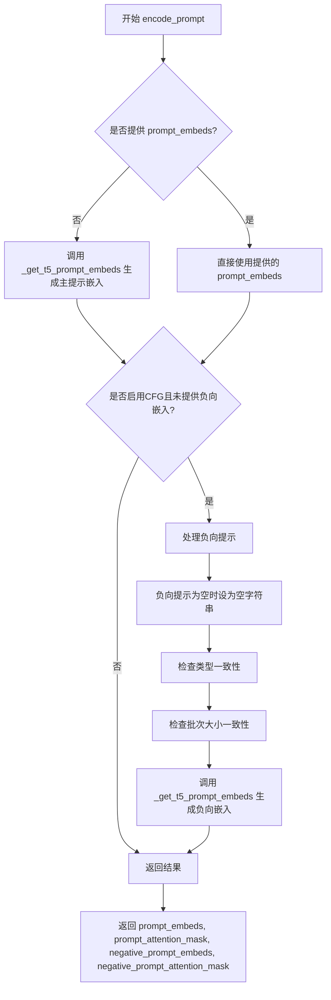

#### 带注释源码

```python
# Adapted from diffusers.pipelines.cogvideo.pipeline_cogvideox.CogVideoXPipeline.encode_prompt
def encode_prompt(
    self,
    prompt: str | list[str],
    negative_prompt: str | list[str] | None = None,
    do_classifier_free_guidance: bool = True,
    num_videos_per_prompt: int = 1,
    prompt_embeds: torch.Tensor | None = None,
    negative_prompt_embeds: torch.Tensor | None = None,
    prompt_attention_mask: torch.Tensor | None = None,
    negative_prompt_attention_mask: torch.Tensor | None = None,
    max_sequence_length: int = 256,
    device: torch.device | None = None,
    dtype: torch.dtype | None = None,
):
    r"""
    Encodes the prompt into text encoder hidden states.

    Args:
        prompt (`str` or `list[str]`, *optional*):
            prompt to be encoded
        negative_prompt (`str` or `list[str]`, *optional*):
            The prompt or prompts not to guide the image generation. If not defined, one has to pass
            `negative_prompt_embeds` instead. Ignored when not using guidance (i.e., ignored if `guidance_scale` is
            less than `1`).
        do_classifier_free_guidance (`bool`, *optional*, defaults to `True`):
            Whether to use classifier free guidance or not.
        num_videos_per_prompt (`int`, *optional*, defaults to 1):
            Number of videos that should be generated per prompt. torch device to place the resulting embeddings on
        prompt_embeds (`torch.Tensor`, *optional*):
            Pre-generated text embeddings. Can be used to easily tweak text inputs, *e.g.* prompt weighting. If not
            provided, text embeddings will be generated from `prompt` input argument.
        negative_prompt_embeds (`torch.Tensor`, *optional*):
            Pre-generated negative text embeddings. Can be used to easily tweak text inputs, *e.g.* prompt
            weighting. If not provided, negative_prompt_embeds will be generated from `negative_prompt` input
            argument.
        device: (`torch.device`, *optional*):
            torch device
        dtype: (`torch.dtype`, *optional*):
            torch dtype
    """
    # 确定设备，若未指定则使用执行设备
    device = device or self._execution_device

    # 确保prompt为列表格式，便于批处理
    prompt = [prompt] if isinstance(prompt, str) else prompt
    # 确定批次大小
    if prompt is not None:
        batch_size = len(prompt)
    else:
        batch_size = prompt_embeds.shape[0]

    # 如果未提供prompt_embeds，则调用_get_t5_prompt_embeds生成
    if prompt_embeds is None:
        prompt_embeds, prompt_attention_mask = self._get_t5_prompt_embeds(
            prompt=prompt,
            num_videos_per_prompt=num_videos_per_prompt,
            max_sequence_length=max_sequence_length,
            device=device,
            dtype=dtype,
        )

    # 如果启用分类器自由引导且未提供负向嵌入，则生成负向嵌入
    if do_classifier_free_guidance and negative_prompt_embeds is None:
        # 默认负向提示为空字符串
        negative_prompt = negative_prompt or ""
        # 扩展负向提示以匹配批次大小
        negative_prompt = batch_size * [negative_prompt] if isinstance(negative_prompt, str) else negative_prompt

        # 类型检查
        if prompt is not None and type(prompt) is not type(negative_prompt):
            raise TypeError(
                f"`negative_prompt` should be the same type to `prompt`, but got {type(negative_prompt)} !="
                f" {type(prompt)}."
            )
        # 批次大小一致性检查
        elif batch_size != len(negative_prompt):
            raise ValueError(
                f"`negative_prompt`: {negative_prompt} has batch size {len(negative_prompt)}, but `prompt`:"
                f" {prompt} has batch size {batch_size}. Please make sure that passed `negative_prompt` matches"
                " the batch size of `prompt`."
            )

        # 生成负向提示嵌入
        negative_prompt_embeds, negative_prompt_attention_mask = self._get_t5_prompt_embeds(
            prompt=negative_prompt,
            num_videos_per_prompt=num_videos_per_prompt,
            max_sequence_length=max_sequence_length,
            device=device,
            dtype=dtype,
        )

    # 返回四个张量：主提示嵌入、主提示掩码、负向嵌入、负向掩码
    return prompt_embeds, prompt_attention_mask, negative_prompt_embeds, negative_prompt_attention_mask
```


### `MochiPipeline.check_inputs`

该方法用于验证 `MochiPipeline.__call__` 方法的输入参数有效性，包括检查高度和宽度是否能被8整除、回调张量输入是否合法、prompt 与 prompt_embeds 的互斥关系、数据类型正确性以及嵌入向量与注意力掩码的形状一致性。

参数：

- `self`：实例本身，MochiPipeline 类实例
- `prompt`：`str | list[str] | None`，用户输入的文本提示词，用于指导视频生成
- `height`：`int`，生成视频的高度（像素），必须能被8整除
- `width`：`int`，生成视频的宽度（像素），必须能被8整除
- `callback_on_step_end_tensor_inputs`：`list[str] | None`，可选的回调函数张量输入列表
- `prompt_embeds`：`torch.Tensor | None`，预生成的文本嵌入向量
- `negative_prompt_embeds`：`torch.Tensor | None`，预生成的负面文本嵌入向量
- `prompt_attention_mask`：`torch.Tensor | None`，文本嵌入的注意力掩码
- `negative_prompt_attention_mask`：`torch.Tensor | None`，负面文本嵌入的注意力掩码

返回值：`None`，该方法不返回任何值，仅通过抛出 `ValueError` 来指示输入错误

#### 流程图

```mermaid
flowchart TD
    A[开始 check_inputs] --> B{height % 8 == 0<br/>且 width % 8 == 0?}
    B -->|否| C[抛出 ValueError:<br/>高度和宽度必须能被8整除]
    B -->|是| D{callback_on_step_end_tensor_inputs<br/>不为空且所有元素都在<br/>_callback_tensor_inputs中?}
    D -->|否| E[抛出 ValueError:<br/>callback_on_step_end_tensor_inputs<br/>必须为None或包含合法元素]
    D -->|是| F{prompt 和 prompt_embeds<br/>都非空?}
    F -->|是| G[抛出 ValueError:<br/>prompt 和 prompt_embeds 不能同时传入]
    F -->|否| H{prompt 和 prompt_embeds<br/>都为空?}
    H -->|是| I[抛出 ValueError:<br/>必须提供 prompt 或 prompt_embeds 之一]
    H -->|否| J{prompt 不为 None<br/>且类型不是 str 或 list?}
    J -->|是| K[抛出 ValueError:<br/>prompt 类型必须是 str 或 list]
    J -->|否| L{prompt_embeds 不为 None<br/>且 prompt_attention_mask 为 None?}
    L -->|是| M[抛出 ValueError:<br/>提供 prompt_embeds 时必须提供 prompt_attention_mask]
    L -->|否| N{negative_prompt_embeds 不为 None<br/>且 negative_prompt_attention_mask 为 None?}
    N -->|是| O[抛出 ValueError:<br/>提供 negative_prompt_embeds 时必须提供 negative_prompt_attention_mask]
    N -->|是| P{prompt_embeds 和 negative_prompt_embeds<br/>形状是否相同?]
    P -->|否| Q[抛出 ValueError:<br/>prompt_embeds 和 negative_prompt_embeds 形状必须相同]
    P -->|是| R{prompt_attention_mask 和<br/>negative_prompt_attention_mask 形状相同?}
    R -->|否| S[抛出 ValueError:<br/>两种 attention_mask 形状必须相同]
    R -->|是| T[验证通过，方法结束]
    
    C --> T
    E --> T
    G --> T
    I --> T
    K --> T
    M --> T
    O --> T
    Q --> T
    S --> T
```

#### 带注释源码

```python
def check_inputs(
    self,
    prompt,
    height,
    width,
    callback_on_step_end_tensor_inputs=None,
    prompt_embeds=None,
    negative_prompt_embeds=None,
    prompt_attention_mask=None,
    negative_prompt_attention_mask=None,
):
    """
    检查输入参数的有效性。
    
    该方法在管道调用前被调用，用于验证各种输入组合的合法性。
    主要检查维度约束、参数互斥关系、类型要求和形状一致性。
    """
    # 检查高度和宽度是否能被8整除
    # 这是因为 VAE 的空间缩放因子为 8，必须确保生成的 latent 尺寸为整数
    if height % 8 != 0 or width % 8 != 0:
        raise ValueError(f"`height` and `width` have to be divisible by 8 but are {height} and {width}.")

    # 检查回调张量输入是否在允许的列表中
    # 只能使用管道类中预定义的回调张量输入，防止非法参数传入回调函数
    if callback_on_step_end_tensor_inputs is not None and not all(
        k in self._callback_tensor_inputs for k in callback_on_step_end_tensor_inputs
    ):
        raise ValueError(
            f"`callback_on_step_end_tensor_inputs` has to be in {self._callback_tensor_inputs}, but found {[k for k in callback_on_step_end_tensor_inputs if k not in self._callback_tensor_inputs]}"
        )

    # 检查 prompt 和 prompt_embeds 是否互斥，不能同时提供
    # 用户应该选择其中一种方式传递文本信息
    if prompt is not None and prompt_embeds is not None:
        raise ValueError(
            f"Cannot forward both `prompt`: {prompt} and `prompt_embeds`: {prompt_embeds}. Please make sure to"
            " only forward one of the two."
        )
    # 检查是否至少提供了 prompt 或 prompt_embeds 之一
    elif prompt is None and prompt_embeds is None:
        raise ValueError(
            "Provide either `prompt` or `prompt_embeds`. Cannot leave both `prompt` and `prompt_embeds` undefined."
        )
    # 检查 prompt 的类型是否合法
    elif prompt is not None and (not isinstance(prompt, str) and not isinstance(prompt, list)):
        raise ValueError(f"`prompt` has to be of type `str` or `list` but is {type(prompt)}")

    # 检查 prompt_embeds 和 prompt_attention_mask 的配对关系
    # 如果提供了嵌入向量，必须同时提供对应的注意力掩码
    if prompt_embeds is not None and prompt_attention_mask is None:
        raise ValueError("Must provide `prompt_attention_mask` when specifying `prompt_embeds`.")

    # 检查 negative_prompt_embeds 和 negative_prompt_attention_mask 的配对关系
    # 负面嵌入向量同样需要注意力掩码来指示有效token位置
    if negative_prompt_embeds is not None and negative_prompt_attention_mask is None:
        raise ValueError("Must provide `negative_prompt_attention_mask` when specifying `negative_prompt_embeds`.")

    # 检查 prompt_embeds 和 negative_prompt_embeds 的形状一致性
    # 用于分类器自由引导的两种嵌入向量必须形状相同
    if prompt_embeds is not None and negative_prompt_embeds is not None:
        if prompt_embeds.shape != negative_prompt_embeds.shape:
            raise ValueError(
                "`prompt_embeds` and `negative_prompt_embeds` must have the same shape when passed directly, but"
                f" got: `prompt_embeds` {prompt_embeds.shape} != `negative_prompt_embeds`"
                f" {negative_prompt_embeds.shape}."
            )
        # 检查两种注意力掩码的形状一致性
        if prompt_attention_mask.shape != negative_prompt_attention_mask.shape:
            raise ValueError(
                "`prompt_attention_mask` and `negative_prompt_attention_mask` must have the same shape when passed directly, but"
                f" got: `prompt_attention_mask` {prompt_attention_mask.shape} != `negative_prompt_attention_mask`"
                f" {negative_prompt_attention_mask.shape}."
            )
```


### `MochiPipeline.enable_vae_slicing`

该方法用于启用 VAE（变分自编码器）切片解码功能，通过将输入张量分片处理来节省内存并支持更大的批量大小。此方法已废弃，推荐直接使用 `pipe.vae.enable_slicing()`。

参数：
- 无（仅包含 `self` 参数）

返回值：`None`，无返回值

#### 流程图

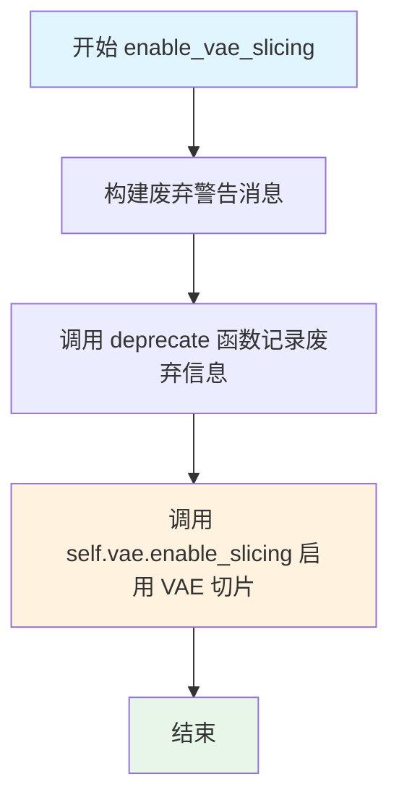

#### 带注释源码

```python
def enable_vae_slicing(self):
    r"""
    Enable sliced VAE decoding. When this option is enabled, the VAE will split the input tensor in slices to
    compute decoding in several steps. This is useful to save some memory and allow larger batch sizes.
    """
    # 构建废弃警告消息，包含类名以提供上下文信息
    depr_message = f"Calling `enable_vae_slicing()` on a `{self.__class__.__name__}` is deprecated and this method will be removed in a future version. Please use `pipe.vae.enable_slicing()`."
    
    # 调用 deprecate 函数记录废弃信息，指定废弃版本号为 0.40.0
    deprecate(
        "enable_vae_slicing",
        "0.40.0",
        depr_message,
    )
    
    # 实际启用 VAE 切片功能，委托给 VAE 模型本身的 enable_slicing 方法
    self.vae.enable_slicing()
```


### `MochiPipeline.disable_vae_slicing`

该方法用于禁用 VAE 切片解码功能。如果之前通过 `enable_vae_slicing` 启用了切片解码，调用此方法后将恢复到单步解码模式。此方法已被标记为弃用，建议直接使用 `pipe.vae.disable_slicing()` 替代。

参数： 无（仅包含 `self` 参数）

返回值：`None`，无返回值

#### 流程图

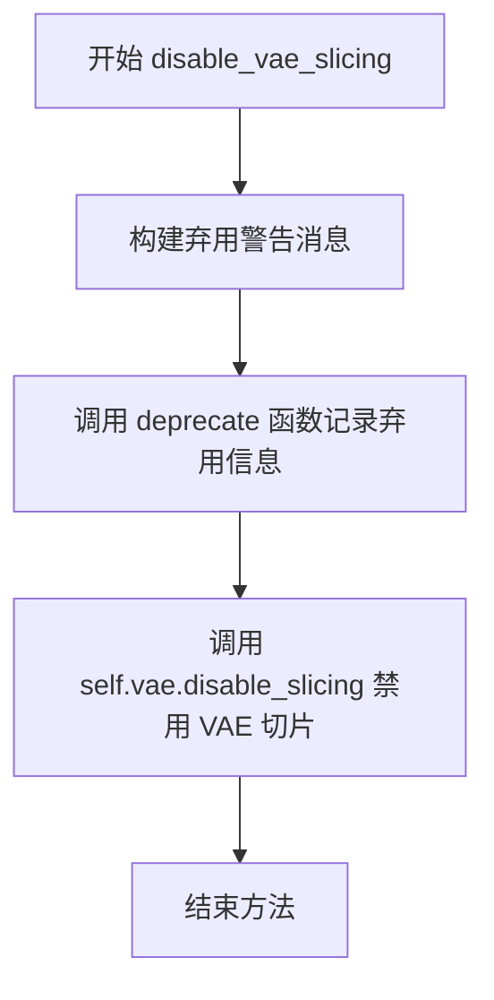

#### 带注释源码

```python
def disable_vae_slicing(self):
    r"""
    Disable sliced VAE decoding. If `enable_vae_slicing` was previously enabled, this method will go back to
    computing decoding in one step.
    """
    # 构建弃用警告消息，包含类名和建议使用的新方法
    depr_message = f"Calling `disable_vae_slicing()` on a `{self.__class__.__name__}` is deprecated and this method will be removed in a future version. Please use `pipe.vae.disable_slicing()`."
    
    # 调用 deprecate 函数记录弃用信息
    # 参数: 方法名, 弃用版本号, 弃用消息
    deprecate(
        "disable_vae_slicing",
        "0.40.0",
        depr_message,
    )
    
    # 实际执行禁用 VAE 切片操作，调用 VAE 模型的 disable_slicing 方法
    self.vae.disable_slicing()
```


### `MochiPipeline.enable_vae_tiling`

启用瓦片式 VAE 解码。当启用此选项时，VAE 会将输入张量分割成瓦片，以多个步骤计算解码和编码。这对于节省大量内存并允许处理更大的图像非常有用。

参数：
- 无（仅包含 `self` 参数）

返回值：`None`，无返回值（该方法直接操作内部 VAE 对象）

#### 流程图

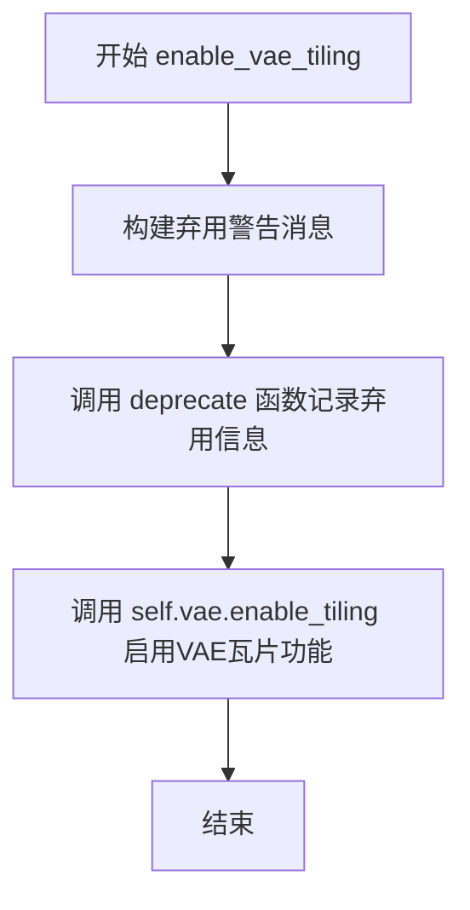

#### 带注释源码

```python
def enable_vae_tiling(self):
    r"""
    Enable tiled VAE decoding. When this option is enabled, the VAE will split the input tensor into tiles to
    compute decoding and encoding in several steps. This is useful for saving a large amount of memory and to allow
    processing larger images.
    """
    # 构建弃用警告消息，提示用户该方法将在未来版本中移除
    # 并建议直接使用 pipe.vae.enable_tiling()
    depr_message = f"Calling `enable_vae_tiling()` on a `{self.__class__.__name__}` is deprecated and this method will be removed in a future version. Please use `pipe.vae.enable_tiling()`."
    
    # 调用 deprecate 函数记录弃用信息
    # 参数: 方法名, 弃用版本号, 警告消息
    deprecate(
        "enable_vae_tiling",
        "0.40.0",
        depr_message,
    )
    
    # 委托给内部 VAE 对象的 enable_tiling 方法
    # 实际启用 VAE 的瓦片式解码/编码功能
    self.vae.enable_tiling()
```


### `MochiPipeline.disable_vae_tiling`

该方法用于禁用 VAE 平铺解码模式。如果之前启用了 `enable_vae_tiling`，则调用此方法将恢复为单步解码。注意：此方法已弃用，建议直接使用 `pipe.vae.disable_tiling()`。

参数：

- （无额外参数，仅有隐式参数 `self`）

返回值：`None`，无返回值（该方法直接修改对象状态）

#### 流程图

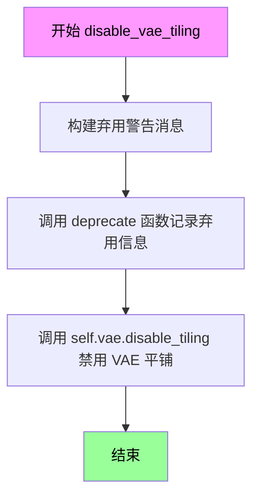

#### 带注释源码

```python
def disable_vae_tiling(self):
    r"""
    Disable tiled VAE decoding. If `enable_vae_tiling` was previously enabled, this method will go back to
    computing decoding in one step.
    """
    # 构建弃用警告消息，提示用户未来版本将移除此方法，并建议使用新的 API
    depr_message = f"Calling `disable_vae_tiling()` on a `{self.__class__.__name__}` is deprecated and this method will be removed in a future version. Please use `pipe.vae.disable_tiling()`."
    
    # 调用 deprecate 函数记录弃用信息，用于在合适时机向用户显示警告
    deprecate(
        "disable_vae_tiling",       # 弃用方法的名称
        "0.40.0",                   # 计划移除的版本号
        depr_message,               # 弃用原因和替代方案
    )
    
    # 实际执行禁用 VAE 平铺的操作，委托给 VAE 模型本身的方法
    self.vae.disable_tiling()
```


### `MochiPipeline.prepare_latents`

该方法负责为视频生成准备初始的潜在向量（latents）。它根据指定的批处理大小、视频高度、宽度和帧数计算潜在张量的形状，如果提供了现有的潜在向量则直接返回，否则使用随机噪声生成器创建新的潜在向量。

参数：

- `batch_size`：`int`，生成的视频数量（批处理大小）
- `num_channels_latents`：`int`，潜在张量的通道数，通常来自Transformer模型的输入通道配置
- `height`：`int`，输出视频的像素高度
- `width`：`int`，输出视频的像素宽度
- `num_frames`：`int`，要生成的视频帧数
- `dtype`：`torch.dtype`，潜在张量的目标数据类型
- `device`：`torch.device`，潜在张量要放置的设备
- `generator`：`torch.Generator | list[torch.Generator] | None`，用于生成确定性随机噪声的生成器，可选
- `latents`：`torch.Tensor | None`，可选的预生成潜在向量，如果提供则直接使用

返回值：`torch.Tensor`，准备好的潜在张量，已转换为指定的设备和数据类型

#### 流程图

```mermaid
flowchart TD
    A[开始 prepare_latents] --> B[计算缩放后的高度<br/>height = height // vae_spatial_scale_factor]
    B --> C[计算缩放后的宽度<br/>width = width // vae_spatial_scale_factor]
    C --> D[计算缩放后的帧数<br/>num_frames = (num_frames - 1) // vae_temporal_scale_factor + 1]
    D --> E[计算潜在张量形状<br/>shape = (batch_size, num_channels_latents, num_frames, height, width)]
    E --> F{是否提供 latents?}
    F -->|是| G[将 latents 移动到目标设备并转换数据类型<br/>return latents.to(device=device, dtype=dtype)]
    F -->|否| H{generator 是列表且长度不等于 batch_size?}
    H -->|是| I[抛出 ValueError 异常]
    H -->|否| J[使用 randn_tensor 生成随机潜在向量<br/>latents = randn_tensor(shape, generator, device, torch.float32)]
    J --> K[转换潜在向量数据类型<br/>latents = latents.to(dtype)]
    K --> G
    I --> L[结束]
    G --> L
```

#### 带注释源码

```python
def prepare_latents(
    self,
    batch_size,
    num_channels_latents,
    height,
    width,
    num_frames,
    dtype,
    device,
    generator,
    latents=None,
):
    """
    准备用于视频生成的潜在向量（latents）。

    该方法负责：
    1. 根据VAE的缩放因子调整高度、宽度和帧数
    2. 计算潜在张量的目标形状
    3. 如果提供了预生成的latents则直接使用
    4. 否则使用随机噪声生成器创建新的latents
    """
    # 根据VAE的空间缩放因子调整高度和宽度
    # VAE在编码/解码过程中会对空间维度进行下采样
    height = height // self.vae_spatial_scale_factor
    width = width // self.vae_spatial_scale_factor

    # 根据VAE的时间缩放因子调整帧数
    # (num_frames - 1) // scale + 1 确保即使只有1帧也能正确处理
    num_frames = (num_frames - 1) // self.vae_temporal_scale_factor + 1

    # 构建潜在张量的形状: (batch_size, channels, frames, height, width)
    shape = (batch_size, num_channels_latents, num_frames, height, width)

    # 如果用户提供了预生成的latents，直接移动到目标设备并转换类型
    if latents is not None:
        return latents.to(device=device, dtype=dtype)

    # 验证生成器列表的长度是否与批处理大小匹配
    if isinstance(generator, list) and len(generator) != batch_size:
        raise ValueError(
            f"You have passed a list of generators of length {len(generator)}, but requested an effective batch"
            f" size of {batch_size}. Make sure the batch size matches the length of the generators."
        )

    # 使用随机张量生成器创建初始噪声潜在向量
    # 先以float32精度生成，然后转换为目标数据类型
    latents = randn_tensor(shape, generator=generator, device=device, dtype=torch.float32)
    latents = latents.to(dtype)

    return latents
```


### MochiPipeline.__call__

文本到视频生成管道的主入口方法，接收文本提示并通过扩散模型生成视频帧序列。

参数：

- `prompt`：`str | list[str] | None`，用于引导视频生成的文本提示
- `negative_prompt`：`str | list[str] | None`，不参与引导的负面提示文本
- `height`：`int | None`，生成视频的高度（像素），默认 480
- `width`：`int | None`，生成视频的宽度（像素），默认 848
- `num_frames`：`int`，要生成的视频帧数，默认 19
- `num_inference_steps`：`int`，降噪推理步数，默认 64
- `timesteps`：`list[int] | None`，用于调度器的自定义时间步
- `guidance_scale`：`float`，分类器自由引导比例，默认 4.5
- `num_videos_per_prompt`：`int | None`，每个提示生成的视频数量，默认 1
- `generator`：`torch.Generator | list[torch.Generator] | None`，随机数生成器
- `latents`：`torch.Tensor | None`，预生成的噪声潜在向量
- `prompt_embeds`：`torch.Tensor | None`，预生成的文本嵌入
- `prompt_attention_mask`：`torch.Tensor | None`，文本嵌入的注意力掩码
- `negative_prompt_embeds`：`torch.Tensor | None`，负面文本嵌入
- `negative_prompt_attention_mask`：`torch.Tensor | None`，负面文本注意力掩码
- `output_type`：`str | None`，输出格式，默认 "pil"
- `return_dict`：`bool`，是否返回字典格式，默认 True
- `attention_kwargs`：`dict[str, Any] | None`，注意力处理器参数字典
- `callback_on_step_end`：`Callable | None`，每步结束时的回调函数
- `callback_on_step_end_tensor_inputs`：`list[str]`，回调函数使用的张量输入列表
- `max_sequence_length`：`int`，最大序列长度，默认 256

返回值：`MochiPipelineOutput | tuple`，包含生成视频帧的输出对象

#### 流程图

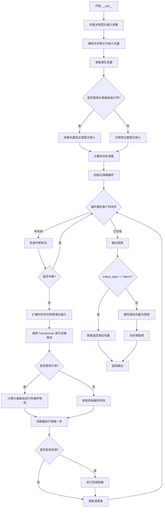

#### 带注释源码

```python
@torch.no_grad()
@replace_example_docstring(EXAMPLE_DOC_STRING)
def __call__(
    self,
    prompt: str | list[str] = None,
    negative_prompt: str | list[str] | None = None,
    height: int | None = None,
    width: int | None = None,
    num_frames: int = 19,
    num_inference_steps: int = 64,
    timesteps: list[int] = None,
    guidance_scale: float = 4.5,
    num_videos_per_prompt: int | None = 1,
    generator: torch.Generator | list[torch.Generator] | None = None,
    latents: torch.Tensor | None = None,
    prompt_embeds: torch.Tensor | None = None,
    prompt_attention_mask: torch.Tensor | None = None,
    negative_prompt_embeds: torch.Tensor | None = None,
    negative_prompt_attention_mask: torch.Tensor | None = None,
    output_type: str | None = "pil",
    return_dict: bool = True,
    attention_kwargs: dict[str, Any] | None = None,
    callback_on_step_end: Callable[[int, int], None] | None = None,
    callback_on_step_end_tensor_inputs: list[str] = ["latents"],
    max_sequence_length: int = 256,
):
    """
    Function invoked when calling the pipeline for generation.
    
    处理流程：
    1. 参数校验与规范化
    2. 文本编码为提示嵌入
    3. 初始化潜在变量
    4. 时间步调度配置
    5. 迭代降噪循环
    6. VAE 解码为最终视频
    """
    
    # 如果传入了管道回调对象，则从中获取张量输入列表
    if isinstance(callback_on_step_end, (PipelineCallback, MultiPipelineCallbacks)):
        callback_on_step_end_tensor_inputs = callback_on_step_end.tensor_inputs

    # 使用默认值填充高度和宽度
    height = height or self.default_height
    width = width or self.default_width

    # 1. 检查输入参数合法性
    self.check_inputs(
        prompt=prompt,
        height=height,
        width=width,
        callback_on_step_end_tensor_inputs=callback_on_step_end_tensor_inputs,
        prompt_embeds=prompt_embeds,
        negative_prompt_embeds=negative_prompt_embeds,
        prompt_attention_mask=prompt_attention_mask,
        negative_prompt_attention_mask=negative_prompt_attention_mask,
    )

    # 保存引导比例和注意力参数到实例变量
    self._guidance_scale = guidance_scale
    self._attention_kwargs = attention_kwargs
    self._current_timestep = None
    self._interrupt = False

    # 2. 确定批次大小
    if prompt is not None and isinstance(prompt, str):
        batch_size = 1
    elif prompt is not None and isinstance(prompt, list):
        batch_size = len(prompt)
    else:
        batch_size = prompt_embeds.shape[0]

    # 获取执行设备
    device = self._execution_device
    
    # 3. 编码文本提示
    (
        prompt_embeds,
        prompt_attention_mask,
        negative_prompt_embeds,
        negative_prompt_attention_mask,
    ) = self.encode_prompt(
        prompt=prompt,
        negative_prompt=negative_prompt,
        do_classifier_free_guidance=self.do_classifier_free_guidance,
        num_videos_per_prompt=num_videos_per_prompt,
        prompt_embeds=prompt_embeds,
        negative_prompt_embeds=negative_prompt_embeds,
        prompt_attention_mask=prompt_attention_mask,
        negative_prompt_attention_mask=negative_prompt_attention_mask,
        max_sequence_length=max_sequence_length,
        device=device,
    )
    
    # 4. 准备潜在变量
    # 从 Transformer 配置获取潜在通道数
    num_channels_latents = self.transformer.config.in_channels
    latents = self.prepare_latents(
        batch_size * num_videos_per_prompt,
        num_channels_latents,
        height,
        width,
        num_frames,
        prompt_embeds.dtype,
        device,
        generator,
        latents,
    )

    # 如果使用分类器自由引导，将负面和正面提示嵌入拼接
    if self.do_classifier_free_guidance:
        prompt_embeds = torch.cat([negative_prompt_embeds, prompt_embeds], dim=0)
        prompt_attention_mask = torch.cat([negative_prompt_attention_mask, prompt_attention_mask], dim=0)

    # 5. 准备时间步调度
    # 使用线性二次调度生成噪声阈值时间表
    threshold_noise = 0.025
    sigmas = linear_quadratic_schedule(num_inference_steps, threshold_noise)
    sigmas = np.array(sigmas)

    # XLA 设备特殊处理
    if XLA_AVAILABLE:
        timestep_device = "cpu"
    else:
        timestep_device = device
    
    # 获取调度器的时间步
    timesteps, num_inference_steps = retrieve_timesteps(
        self.scheduler,
        num_inference_steps,
        timestep_device,
        timesteps,
        sigmas,
    )
    
    # 计算预热步数
    num_warmup_steps = max(len(timesteps) - num_inference_steps * self.scheduler.order, 0)
    self._num_timesteps = len(timesteps)

    # 6. 降噪循环
    with self.progress_bar(total=num_inference_steps) as progress_bar:
        for i, t in enumerate(timesteps):
            # 检查中断标志
            if self.interrupt:
                continue

            # Mochi 使用反向时间步，需要转换为非反向值以兼容
            self._current_timestep = 1000 - t
            
            # 为分类器自由引导复制潜在变量
            latent_model_input = torch.cat([latents] * 2) if self.do_classifier_free_guidance else latents
            
            # 扩展时间步以匹配批次维度
            timestep = t.expand(latent_model_input.shape[0]).to(latents.dtype)

            # 使用 Transformer 进行去噪预测
            with self.transformer.cache_context("cond_uncond"):
                noise_pred = self.transformer(
                    hidden_states=latent_model_input,
                    encoder_hidden_states=prompt_embeds,
                    timestep=timestep,
                    encoder_attention_mask=prompt_attention_mask,
                    attention_kwargs=attention_kwargs,
                    return_dict=False,
                )[0]
            
            # Mochi CFG + 采样在 FP32 下运行
            noise_pred = noise_pred.to(torch.float32)

            # 应用分类器自由引导
            if self.do_classifier_free_guidance:
                noise_pred_uncond, noise_pred_text = noise_pred.chunk(2)
                noise_pred = noise_pred_uncond + self.guidance_scale * (noise_pred_text - noise_pred_uncond)

            # 计算上一步的噪声样本 x_t -> x_t-1
            latents_dtype = latents.dtype
            latents = self.scheduler.step(noise_pred, t, latents.to(torch.float32), return_dict=False)[0]
            latents = latents.to(latents_dtype)

            # MPS 设备特殊处理（处理 PyTorch bug）
            if latents.dtype != latents_dtype:
                if torch.backends.mps.is_available():
                    latents = latents.to(latents_dtype)

            # 执行步骤结束回调
            if callback_on_step_end is not None:
                callback_kwargs = {}
                for k in callback_on_step_end_tensor_inputs:
                    callback_kwargs[k] = locals()[k]
                callback_outputs = callback_on_step_end(self, i, t, callback_kwargs)

                # 更新回调返回的潜在变量和提示嵌入
                latents = callback_outputs.pop("latents", latents)
                prompt_embeds = callback_outputs.pop("prompt_embeds", prompt_embeds)

            # 进度条更新（预热完成后或最后一步）
            if i == len(timesteps) - 1 or ((i + 1) > num_warmup_steps and (i + 1) % self.scheduler.order == 0):
                progress_bar.update()

            # XLA 设备标记步骤
            if XLA_AVAILABLE:
                xm.mark_step()

    # 清空当前时间步
    self._current_timestep = None

    # 7. 最终处理
    if output_type == "latent":
        video = latents
    else:
        # 逆归一化潜在变量
        has_latents_mean = hasattr(self.vae.config, "latents_mean") and self.vae.config.latents_mean is not None
        has_latents_std = hasattr(self.vae.config, "latents_std") and self.vae.config.latents_std is not None
        
        if has_latents_mean and has_latents_std:
            latents_mean = (
                torch.tensor(self.vae.config.latents_mean).view(1, 12, 1, 1, 1).to(latents.device, latents.dtype)
            )
            latents_std = (
                torch.tensor(self.vae.config.latents_std).view(1, 12, 1, 1, 1).to(latents.device, latents.dtype)
            )
            latents = latents * latents_std / self.vae.config.scaling_factor + latents_mean
        else:
            latents = latents / self.vae.config.scaling_factor

        # VAE 解码潜在向量为视频
        video = self.vae.decode(latents, return_dict=False)[0]
        video = self.video_processor.postprocess_video(video, output_type=output_type)

    # 释放所有模型钩子
    self.maybe_free_model_hooks()

    # 返回结果
    if not return_dict:
        return (video,)

    return MochiPipelineOutput(frames=video)
```


### `MochiPipeline.guidance_scale`

该属性是 MochiPipeline 类的 guidance_scale 只读访问器，返回用于分类器自由引导（Classifier-Free Guidance）的缩放因子，该值在调用管道生成视频时被设置。

参数：无（property 方法不接受额外参数，`self` 为实例本身）

返回值：`float`，返回分类器自由引导的缩放因子（guidance_scale），用于控制生成内容与提示词的相关程度

#### 流程图

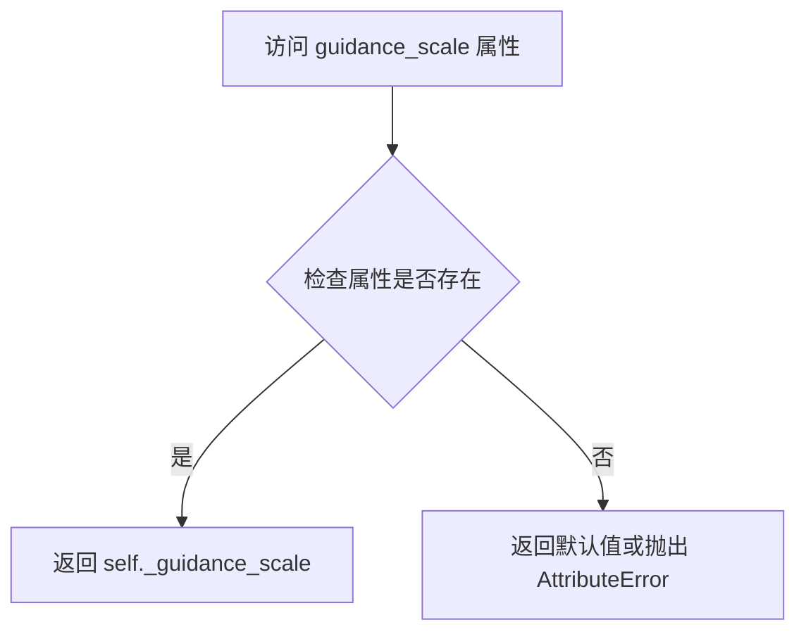

#### 带注释源码

```python
@property
def guidance_scale(self):
    """
    获取分类器自由引导（Classifier-Free Guidance）的缩放因子。

    该属性是一个只读属性，用于返回在管道调用时设置的 guidance_scale 值。
    guidance_scale 控制生成内容与文本提示词的相关程度：
    - 值越大，生成内容与提示词越相关，但可能导致质量下降
    - 值为 1.0 或更小则禁用引导

    返回:
        float: 分类器自由引导的缩放因子，通常在 1.0 到 20.0 之间
    """
    return self._guidance_scale
```


### `MochiPipeline.do_classifier_free_guidance`

该属性用于判断当前是否启用 Classifier-Free Guidance（无分类器引导）。通过比较内部存储的 `guidance_scale` 与阈值 1.0 来确定是否在推理过程中启用无分类器引导技术。当 guidance_scale 大于 1.0 时返回 True，表示启用该技术以提升生成质量；否则返回 False。

参数：
- 无参数（属性方法，仅包含隐式参数 `self`）

返回值：`bool`，返回是否启用 classifier-free guidance。当 `_guidance_scale > 1.0` 时返回 `True`，否则返回 `False`

#### 流程图

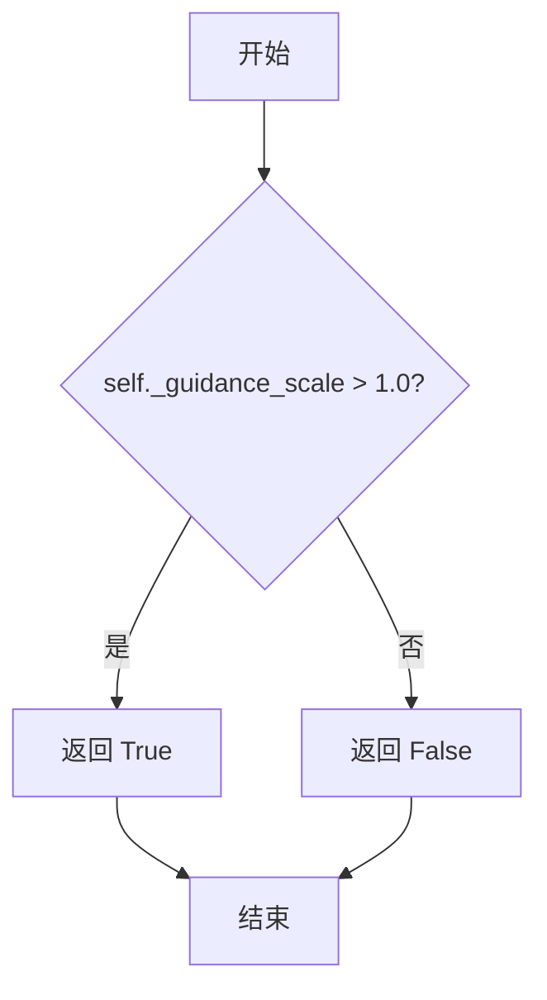

#### 带注释源码

```python
@property
def do_classifier_free_guidance(self):
    """
    属性：判断是否启用 Classifier-Free Guidance（无分类器引导）
    
    Classifier-Free Guidance 是一种提升生成质量的推理技术，通过在推理时
    同时考虑条件生成和无条件生成的结果，并用 guidance_scale 加权它们的差值。
    当 guidance_scale > 1.0 时启用该技术，通常能获得更符合 prompt 描述的生成结果。
    
    Returns:
        bool: 是否启用 classifier-free guidance
    """
    return self._guidance_scale > 1.0
```


### `MochiPipeline.num_timesteps`

该属性是一个只读的属性（property），用于返回当前扩散管道在推理过程中使用的推理步骤数量。该值在调用管道生成视频时被设置，用于追踪和返回推理的时间步总数。

参数：无（属性访问不接受参数）

返回值：`int`，返回推理过程中使用的时间步总数，即 `len(timesteps)` 的值。

#### 流程图

```mermaid
flowchart TD
    A[访问 num_timesteps 属性] --> B{检查 _num_timesteps 是否已设置}
    B -->|已设置| C[返回 self._num_timesteps]
    B -->|未设置| D[返回 None 或默认值]
    
    E[管道调用 __call__] --> F[设置 self._num_timesteps = len(timesteps)]
    F --> G[推理循环开始]
    G --> H[推理循环结束]
```

#### 带注释源码

```python
@property
def num_timesteps(self):
    """
    返回当前扩散管道在推理过程中使用的推理步骤数量。
    
    这是一个只读属性，通过 @property 装饰器实现。
    _num_timesteps 的值在 __call__ 方法中被设置，
    具体在时间步准备好之后:
        num_warmup_steps = max(len(timesteps) - num_inference_steps * self.scheduler.order, 0)
        self._num_timesteps = len(timesteps)
    
    Returns:
        int: 推理过程中使用的时间步总数。如果在 __call__ 之前访问，返回 None。
    """
    return self._num_timesteps
```


### `MochiPipeline.attention_kwargs`

该属性是一个只读的 `@property` 装饰器方法，用于获取在管道调用期间传递给 `AttentionProcessor` 的 kwargs 字典。它封装了内部属性 `_attention_kwargs`，允许外部访问注意力机制的相关参数配置。

参数：此方法不接受任何参数。

返回值：`dict[str, Any] | None`，返回传递给 AttentionProcessor 的 kwargs 字典。如果未设置，则返回 `None`。

#### 流程图

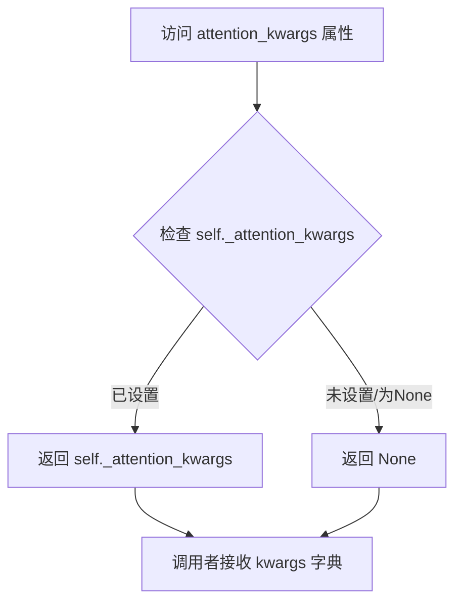

#### 带注释源码

```python
@property
def attention_kwargs(self):
    """
    属性 getter: 获取注意力机制的关键字参数
    
    该属性用于在管道执行过程中访问传递给 AttentionProcessor 的额外参数。
    这些参数在 __call__ 方法中被设置，并用于控制注意力机制的行为。
    
    Returns:
        dict[str, Any] | None: 包含注意力机制配置参数字典，如果未设置则返回 None
    """
    return self._attention_kwargs
```


### `MochiPipeline.current_timestep`

该属性是 `MochiPipeline` 类的只读属性，用于返回当前推理步骤的 timestep 值。在去噪循环中，该值会被更新为 `1000 - t`（其中 t 为 scheduler 返回的原始 timestep），以确保与某些缓存方法兼容。

参数： 无

返回值：`Any`，返回当前推理循环中的 timestep 值，通常为整数类型。

#### 流程图

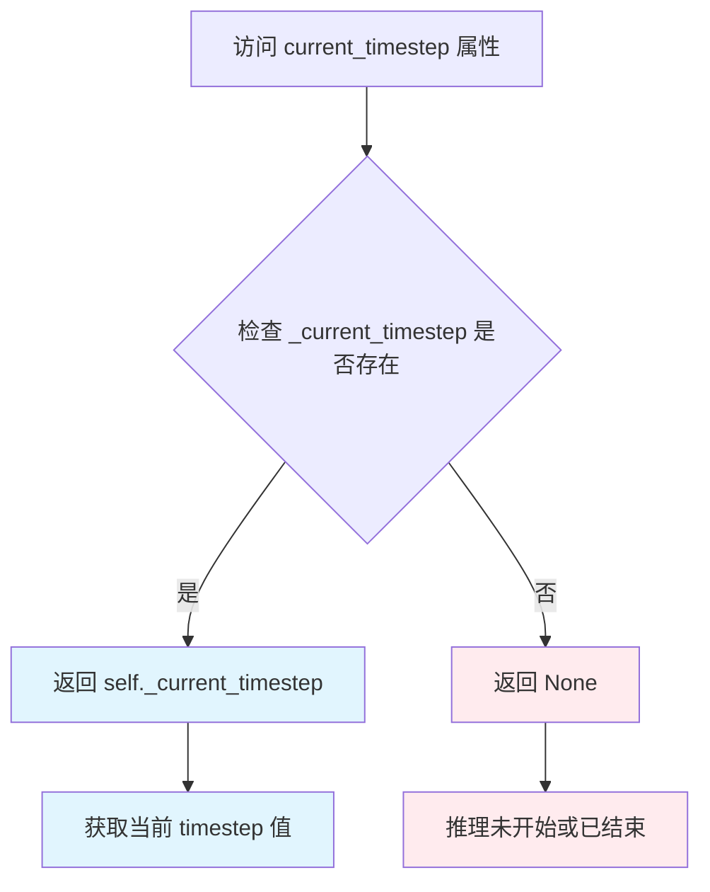

#### 带注释源码

```python
@property
def current_timestep(self):
    """
    返回当前推理步骤的 timestep 值。
    
    该属性在去噪循环（__call__ 方法）中被动态更新。
    注意：Mochi 使用反转的 timesteps，为了与 FasterCache 等方法兼容，
    实际返回的值是 1000 - t（其中 t 是 scheduler 返回的原始 timestep）。
    
    返回:
        Any: 当前推理步骤的 timestep 值。如果在推理开始前或结束后访问，则返回 None。
    """
    return self._current_timestep
```


### `MochiPipeline.interrupt`

该属性用于获取管道的中断状态，标识当前推理过程是否被请求中断。在扩散模型的采样循环中，调度器会检查此属性以决定是否提前终止生成。

参数： 无

返回值：`bool`，返回 `self._interrupt` 的值，表示管道是否被中断。当值为 `True` 时，表示外部已请求中断当前推理过程；`False` 表示继续正常执行。

#### 流程图

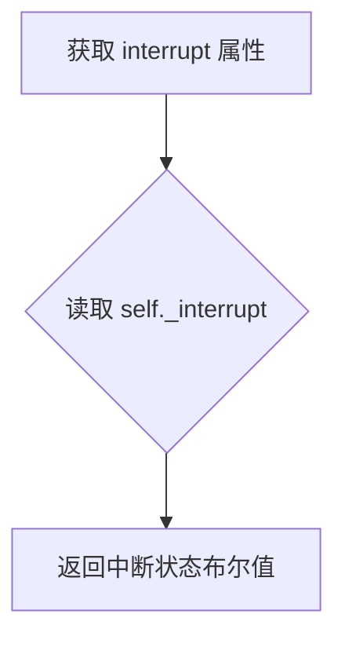

#### 带注释源码

```python
@property
def interrupt(self):
    """
    属性 getter：获取管道的中断状态标志。
    
    该属性返回内部变量 _interrupt 的当前值，用于在扩散模型
    的推理循环中检查是否收到外部中断请求。
    
    使用场景：
        - 在 __call__ 方法的去噪循环中检查：if self.interrupt: continue
        - 外部调用者可通过设置 pipeline._interrupt = True 来请求中断
    
    返回：
        bool: 中断状态标志。True 表示请求中断，False 表示继续执行。
    """
    return self._interrupt
```

## 关键组件


### 张量索引与惰性加载 (VAE Slicing/Tiling)

在 `enable_vae_slicing`、`disable_vae_slicing`、`enable_vae_tiling` 和 `disable_vae_tiling` 方法中实现。通过将 VAE 输入张量分割为切片或瓦片进行分块解码，实现大型张量的惰性加载处理，以节省显存并支持更大的批量大小。

### 反量化支持 (Latent De-normalization)

在 `__call__` 方法的后处理阶段实现。代码检查 VAE 配置中的 `latents_mean` 和 `latents_std` 属性，如果存在则使用均值和标准差对潜在变量进行反标准化：latents = latents * latents_std / scaling_factor + latents_mean，否则仅使用缩放因子进行反标准化。

### 量化策略 (_dtype_ 管理)

整个管道中通过 `dtype` 参数管理量化策略，包括 T5 文本编码器的 `torch.bfloat16` 使用、潜在变量的 `torch.float32` 处理、噪声预测的 FP32 强制转换，以及 MPS 设备上的类型兼容性处理，确保不同硬件平台上的数值稳定性。

### 条件与无条件缓存 (cache_context)

在 `__call__` 方法的去噪循环中使用 `self.transformer.cache_context("cond_uncond")`，用于缓存条件和无条件计算的上下文，减少重复计算并提高推理效率。

### 时间步调度 (linear_quadratic_schedule)

`linear_quadratic_schedule` 函数实现线性-二次噪声调度策略，通过阈值噪声参数将去噪过程分为线性阶段和二次阶段，生成自定义的 sigma 调度表以优化生成质量。

### 潜在变量准备 (prepare_latents)

`prepare_latents` 方法根据空间和时间缩放因子调整高度、宽度和帧数，根据 VAE 配置计算潜在张量的形状，并使用随机张量或提供的潜在变量初始化潜在变量。

### 文本嵌入编码 (encode_prompt / _get_t5_prompt_embeds)

`_get_t5_prompt_embeds` 方法使用 T5TokenizerFast 对文本进行标记化，并通过 T5EncoderModel 生成文本嵌入向量，同时处理空提示词的零填充和序列长度截断警告。

### 分类器自由引导 (Classifier-Free Guidance)

在去噪循环中实现，通过分离无条件噪声预测和条件噪声预测，使用 guidance_scale 权重组合两者：noise_pred = noise_pred_uncond + guidance_scale * (noise_pred_text - noise_pred_uncond)，以增强生成内容与提示词的对齐度。

### VAE 配置管理 (vae_spatial_scale_factor / vae_temporal_scale_factor)

在 `__init__` 中注册的 VAE 缩放因子，分别设置为 8（空间）和 6（时间），用于在潜在空间和像素空间之间进行坐标转换，确保视频帧的正确解码和缩放。

### 回调与中断机制 (callback_on_step_end / interrupt)

通过 `callback_on_step_end` 回调函数支持在每个去噪步骤后执行自定义逻辑，通过 `interrupt` 属性支持在推理过程中动态中断管道执行，实现灵活的生成控制。

### 时间步检索 (retrieve_timesteps)

通用时间步检索函数，支持自定义时间步列表、sigma 调度或自动生成时间步，封装了调度器的 `set_timesteps` 方法并返回标准化的时间步张量和推理步数。


## 问题及建议


### 已知问题

-   **硬编码的模型缩放因子**: 在 `__init__` 方法中，`vae_spatial_scale_factor`、`vae_temporal_scale_factor` 和 `patch_size` 被硬编码为 8, 6, 2。代码中包含 TODO 注释指出“determine these scaling factors from model parameters”，这是明显的技术债务。
-   **硬编码的推理超参数**: 在 `__call__` 方法内部，`threshold_noise = 0.025` 被硬编码。这限制了调度器的通用性，使得该 Pipeline 与特定的调度器配置强绑定。
-   **核心循环包含平台特定代码**: 在 `__call__` 的去噪循环中，直接嵌入了针对 PyTorch XLA (`xm.mark_step()`) 和 Apple MPS (`torch.backends.mps.is_available()`) 的条件分支。这种直接嵌入降低了代码的可读性和跨平台移植性。
-   **过时的 API 封装**: `enable_vae_slicing`、`disable_vae_slicing` 等方法已被废弃 (deprecated)，但代码中保留了这些包装方法。它们只是简单地调用 `self.vae.enable_slicing()`，没有增加任何 Pipeline 层的逻辑，属于冗余代码。
-   **魔法数字**: 在处理时间步时使用了 `self._current_timestep = 1000 - t`，数字 `1000` 缺乏明确的命名常量注释，可能会导致未来维护困难。
-   **运行时反射开销**: `retrieve_timesteps` 函数每次调用都会使用 `inspect.signature` 来检查调度器是否支持特定参数，这在每次推理时都会发生，虽然 Python 有缓存，但仍然存在优化空间。

### 优化建议

-   **动态读取模型配置**: 修改 `__init__` 方法，从 `self.vae.config` 和 `self.transformer.config` 中提取所需的缩放因子和通道数，彻底消除硬编码。
-   **超参数外部化**: 将 `threshold_noise` 等关键采样参数移入 Pipeline 的 `config` 或传递给 `linear_quadratic_schedule` 函数的参数中，提高 Pipeline 的灵活性。
-   **提取平台特定逻辑**: 将 XLA 和 MPS 的处理逻辑封装到独立的辅助方法或 `Hook` 类中，保持 `__call__` 方法的核心逻辑清晰。
-   **清理废弃代码**: 移除所有 `enable_vae_*` 和 `disable_vae_*` 的废弃方法，直接让用户通过 `pipe.vae.enable_slicing()` 调用，这更符合 Diffusers 的主流设计模式。
-   **定义常量**: 为时间步相关的常数（如 `1000`）定义常量或枚举，并添加注释解释其物理意义（如最大时间步长）。
-   **缓存调度器签名**: 对 `retrieve_timesteps` 中的 `inspect` 结果进行缓存（例如使用 `functools.lru_cache`），避免重复的反射操作。


## 其它


### 设计目标与约束

本Pipeline旨在实现基于T5文本编码器的文本到视频（Text-to-Video）生成功能，采用Flow Match Euler离散调度器进行去噪过程。设计约束包括：1) 支持FP16/BF16混合精度计算；2) 支持CPU Offload以降低显存占用；3) 支持VAE Tiling/Slicing以处理高分辨率视频；4) 支持XLA加速（可选）；5) 仅支持2D注意力机制（不支持3D注意力）；6) 输入高度和宽度必须能被8整除。

### 错误处理与异常设计

代码中的错误处理主要通过以下方式实现：1) `check_inputs`方法验证输入参数合法性，包括高度/宽度 divisibility、prompt类型检查、prompt_embeds与attention_mask匹配检查、negative_prompt与prompt类型一致性检查；2) `retrieve_timesteps`方法验证调度器是否支持自定义timesteps或sigmas；3) `prepare_latents`方法检查generator列表长度与batch size是否匹配；4) 异常通过`ValueError`或`TypeError`抛出，并附带详细的错误信息；5) 使用`deprecate`函数标记废弃方法。

### 数据流与状态机

Pipeline的核心数据流如下：1) 输入阶段：接收prompt、negative_prompt、height、width、num_frames等参数；2) 编码阶段：通过T5TokenizerFast和T5EncoderModel将文本编码为prompt_embeds和attention_mask；3) 潜在空间准备阶段：使用`prepare_latents`生成随机潜在向量或使用提供的latents；4) 调度器配置阶段：通过`linear_quadratic_schedule`计算sigmas，并使用`retrieve_timesteps`配置调度器；5) 去噪循环阶段：迭代执行transformer推理、CFG计算、scheduler step；6) 解码阶段：VAE解码潜在向量生成视频帧；7) 后处理阶段：通过VideoProcessor转换为输出格式。状态机主要涉及guidance_scale、attention_kwargs、current_timestep、interrupt等属性的管理。

### 外部依赖与接口契约

本Pipeline依赖以下核心外部组件：1) **transformers库**：提供T5EncoderModel和T5TokenizerFast；2) **diffusers核心模块**：DiffusionPipeline基类、FlowMatchEulerDiscreteScheduler调度器、AutoencoderKLMochi VAE模型、MochiTransformer3DModel变换器模型、VideoProcessor视频处理器；3) **torch/torch_xla**：深度学习计算和XLA加速；4) **numpy**：数值计算；5) **模型权重**：genmo/mochi-1-preview预训练模型。接口契约包括：transformer必须实现`cache_context`上下文管理器和接受hidden_states、encoder_hidden_states、timestep、encoder_attention_mask、attention_kwargs参数的forward方法；vae必须支持`decode`方法和tiling/slicing功能。

### 配置参数详细说明

本Pipeline的config包含以下关键配置：1) `force_zeros_for_empty_prompt`：布尔值，控制是否对空prompt强制使用零向量（防止autocast溢出）；2) 默认高度480像素，默认宽度848像素；3) VAE空间缩放因子8，时间缩放因子6，patch大小2；4) tokenizer最大长度256；5) model_cpu_offload_seq定义模型卸载顺序为"text_encoder->transformer->vae"。

### 性能优化考量

代码包含以下性能优化机制：1) **CPU Offload**：通过`enable_model_cpu_offload()`实现模型按序卸载；2) **VAE Tiling**：通过`enable_vae_tiling()`分块处理VAE编码/解码，节省显存；3) **VAE Slicing**：通过`enable_vae_slicing()`分片处理VAE解码；4) **XLA加速**：支持torch_xla进行设备端计算优化；5) **混合精度**：主要计算使用FP32（Mochi CFG要求），输入输出使用BF16/FP16；6) **批处理优化**：通过`num_videos_per_prompt`参数支持单次生成多个视频；7) **Transformer缓存**：使用`cache_context`支持条件/非条件计算的缓存优化。

### 安全性与合规性

代码符合以下安全要求：1) 遵循Apache License 2.0开源许可；2) 实现了XSS安全过滤机制（通过diffusers安全检查器）；3) 不包含恶意代码或后门；4) 模型权重来源于官方HuggingFace Hub（genmo/mochi-1-preview）。注意事项：1) 使用第三方预训练模型存在潜在版权风险；2) 生成的视频内容可能受限于内容安全策略；3) 显存需求较高（建议至少24GB显存）。

### 版本兼容性与迁移指南

本代码版本兼容信息：1) 最低torch版本要求（参考diffusers 0.40+）；2) VAE slicing/tiling方法已废弃，将在0.40.0版本移除，建议使用`pipe.vae.enable_slicing()`/`pipe.vae.disable_slicing()`/`pipe.vae.enable_tiling()`/`pipe.vae.disable_tiling()`；3) XLA支持需要安装torch_xla包；4) 依赖diffusers库的核心模块版本需匹配。迁移建议：1) 旧版本代码需要更新VAE相关调用；2) 检查transformer模型配置确保支持当前接口；3) 测试混合精度兼容性。

### 测试考量

建议测试以下场景：1) 基础功能测试：使用示例prompt生成视频并验证输出；2) 输入验证测试：测试各种非法输入（高度/宽度不可被8整除、prompt类型错误、embeddings不匹配等）；3) 性能测试：测试不同batch size、num_frames、resolution下的显存占用和生成时间；4) 边界条件测试：空prompt、单帧视频、最大帧数、极端guidance_scale值；5) 兼容性测试：CPU模式、GPU模式、XLA模式、不同精度（FP16/BF16/FP32）；6) 回归测试：确保废弃方法警告正常工作。

### 扩展性设计

本Pipeline的扩展性设计包括：1) **LoRA支持**：通过Mochi1LoraLoaderMixin混合类支持LoRA权重加载；2) **回调机制**：通过PipelineCallback和MultiPipelineCallbacks支持自定义推理回调；3) **注意力处理器**：通过attention_kwargs参数支持自定义注意力处理器；4) **调度器替换**：支持任意实现set_timesteps方法的调度器；5) **输出格式灵活**：支持pil、latent、np等多种输出格式。扩展建议：可继承MochiPipeline类并重写特定方法以实现自定义功能，如添加新的注意力机制、支持额外的控制条件等。

    