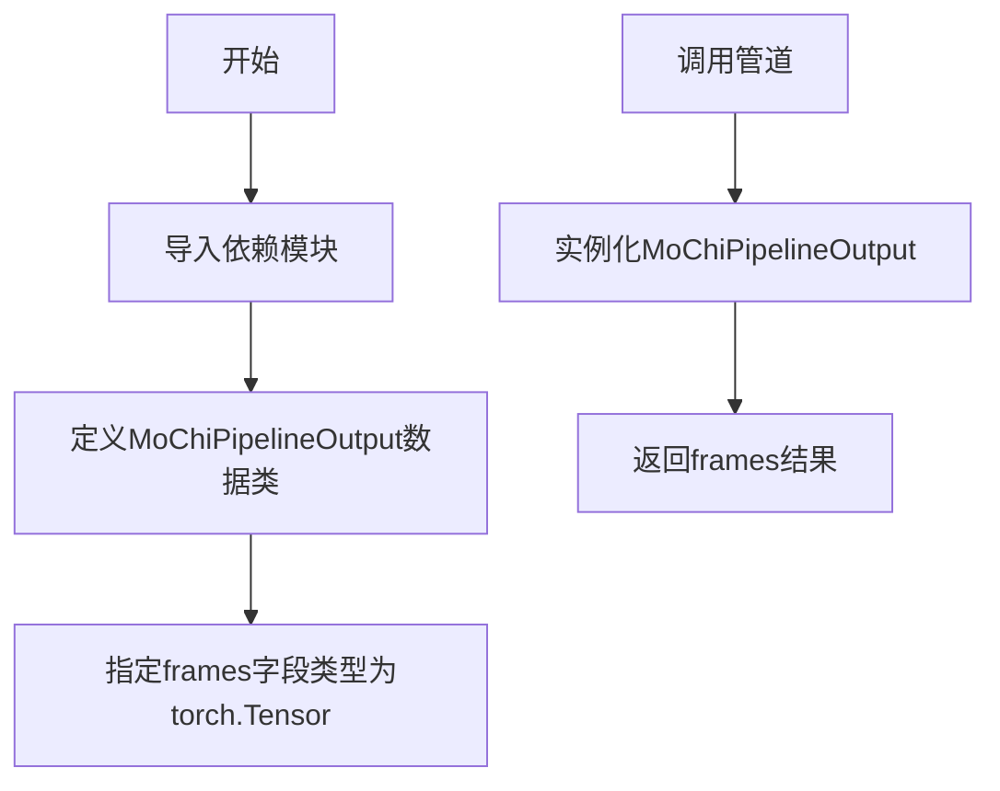

# `diffusers\src\diffusers\pipelines\mochi\pipeline_output.py` 详细设计文档

这是一个用于Mochi视频生成管道的输出类，定义了管道执行后返回的视频帧数据结构，继承自diffusers库的BaseOutput基类，用于标准化管道输出格式。

## 整体流程



## 类结构

```
BaseOutput (diffusers.utils基类)
└── MochiPipelineOutput (数据类)
```

## 全局变量及字段


### `MochiPipelineOutput.frames`
    
视频帧输出，可为torch.Tensor、np.ndarray或list[list[PIL.Image.Image]]格式

类型：`torch.Tensor`
    
    

## 全局函数及方法


## 关键组件


### MochiPipelineOutput 类

数据类，继承自 BaseOutput，用于封装 Mochi 视频生成管道的输出结果。该类定义了一个 `frames` 字段来存储生成的视频帧数据。

### frames 字段

类型：torch.Tensor

描述：存储视频帧输出的张量，可以是嵌套列表（batch_size 个子列表，每个子列表包含 num_frames 个 PIL 图像序列）、NumPy 数组或 Torch 张量，形状为 (batch_size, num_frames, channels, height, width)。

### BaseOutput 基类

描述：diffusers 库提供的基础输出类，作为所有管道输出类的父类，定义了通用的输出结构接口。


## 问题及建议


### 已知问题

-   **类型注解不完整**：frames字段的文档说明支持`torch.Tensor`、`np.ndarray`和`list[list[PIL.Image.Image]]`三种类型，但实际类型注解仅声明了`torch.Tensor`，与文档描述不一致，存在类型安全隐患
-   **缺乏输入验证**：没有`__post_init__`方法对frames的维度、形状、dtype等参数进行校验，可能导致运行时错误
-   **依赖外部基类**：依赖`diffusers.utils.BaseOutput`但未处理版本兼容性或基类变更风险
-   **元数据缺失**：输出类仅包含frames数据，缺少帧率、分辨率、生成时间等元数据信息
-   **类型提示不够精确**：未使用Python 3.10+的Union语法或Literal来精确表达多类型联合

### 优化建议

-   使用`Union[torch.Tensor, np.ndarray, list[list[PIL.Image.Image]]]`或`type_alias`来准确标注frames类型
-   实现`__post_init__`方法添加维度范围、batch size有效性等验证逻辑
-   考虑添加可选的元数据字段（如`metadata: dict`或专用`MochiMetadata`类）
-   添加类型检查守卫，处理不同类型输入的兼容性转换逻辑
-   考虑实现`__len__`、`__getitem__`等序列协议方法，提升易用性


## 其它


### 设计目标与约束

该类作为Diffusers库中Mochi视频生成管道的输出数据结构，主要目标是为视频帧提供类型安全的数据封装。设计约束包括：必须继承自BaseOutput以符合Diffusers框架规范；frames字段必须是torch.Tensor类型以支持GPU加速计算；内存占用应控制在合理范围内，建议单帧分辨率不超过1080p，批次大小不超过16。

### 错误处理与异常设计

frames字段的类型检查应在管道调用时进行，当前类本身不包含运行时验证逻辑。建议的异常场景包括：类型不匹配时抛出TypeError（期望torch.Tensor但收到np.ndarray或list）；维度错误时抛出ValueError（期望5维张量但维度不符合）；内存溢出时抛出OutOfMemoryError。建议在文档中明确标注这些约束。

### 数据流与状态机

该类作为管道输出端点，不涉及状态机逻辑。数据流如下：管道内部经过去噪循环生成帧序列 → 转换为torch.Tensor格式 → 封装为MochiPipelineOutput对象 → 返回给调用者。输入数据经过UNet去噪、VAE解码等处理，最终输出frames字段。该类本身为不可变数据类（dataclass），一旦创建属性不可修改。

### 外部依赖与接口契约

主要依赖包括：torch（张量运算）、diffusers.utils.BaseOutput（基类）、dataclasses（数据类装饰器）。接口契约要求调用方必须提供torch.Tensor类型的frames字段；返回值为不可变对象；文档中说明frames可以是torch.Tensor、np.ndarray或list[PIL.Image.Image]类型，但实际实现仅支持torch.Tensor。

### 版本兼容性

该代码基于Diffusers框架设计，需与PyTorch 1.8+和Diffusers 0.21+版本兼容。建议在文档中标注支持的最低版本要求。由于使用了 dataclass 装饰器，需要Python 3.7+环境。考虑到torch.Tensor的序列化需求，建议兼容numpy转换方法。

### 性能考虑

frames字段作为torch.Tensor存储，可利用GPU加速。性能优化建议包括：使用pin_memory加速CPU-GPU传输；考虑使用torch.float16减少内存占用；避免频繁的Tensor-PIL-Image转换；对于大批量生成建议分批处理。

### 安全考虑

该类为纯数据封装，无安全风险。但需注意：frames可能包含生成的视频内容，需考虑输出内容的审核机制；管道调用时需防止Prompt注入攻击；生成的视频帧应支持水印或溯源机制。

### 使用示例

```python
import torch
from diffusers import MochiPipeline

pipe = MochiPipeline.from_pretrained("google/mochi-video")
frames = pipe("A cat running in the grass")
# frames 类型为 MochiPipelineOutput
output = MochiPipelineOutput(frames=torch.randn(1, 8, 3, 480, 854))
```

### 配置参数说明

frames参数：必填，torch.Tensor类型，形状为(batch_size, num_frames, channels, height, width)，建议值范围channels=3（RGB），height/width建议为16的倍数以兼容VAE解码。


    