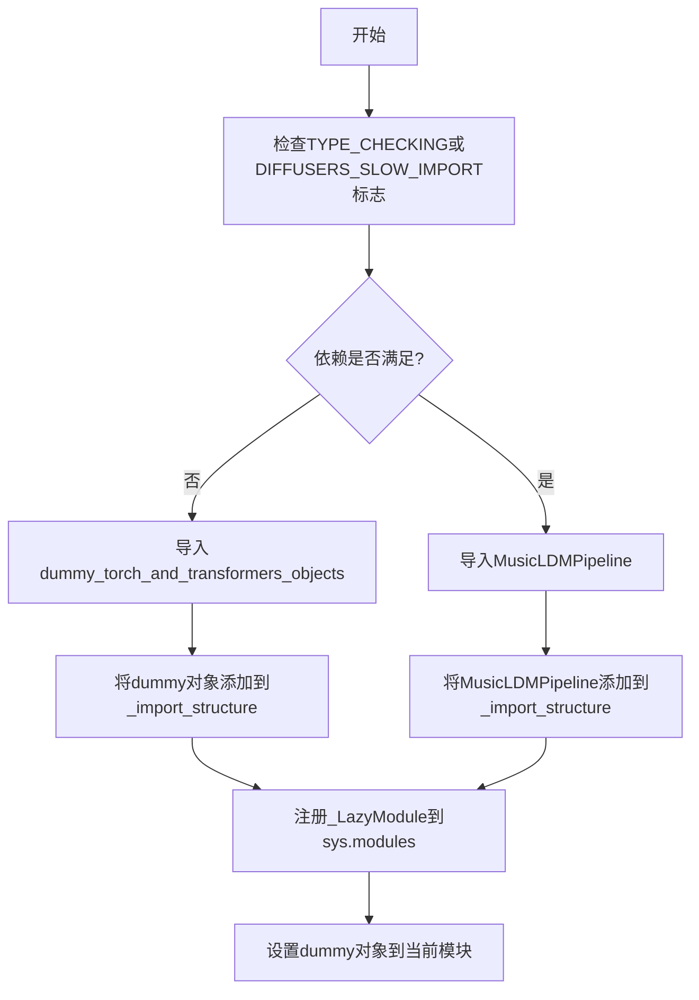
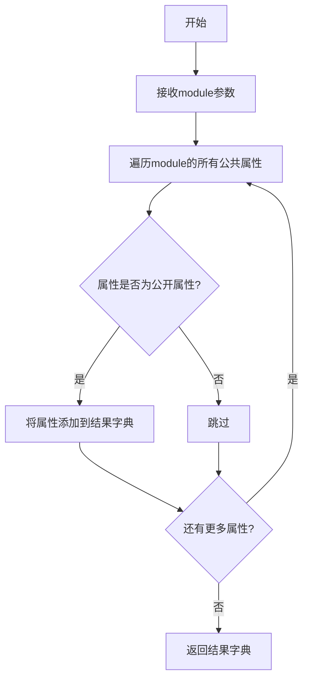
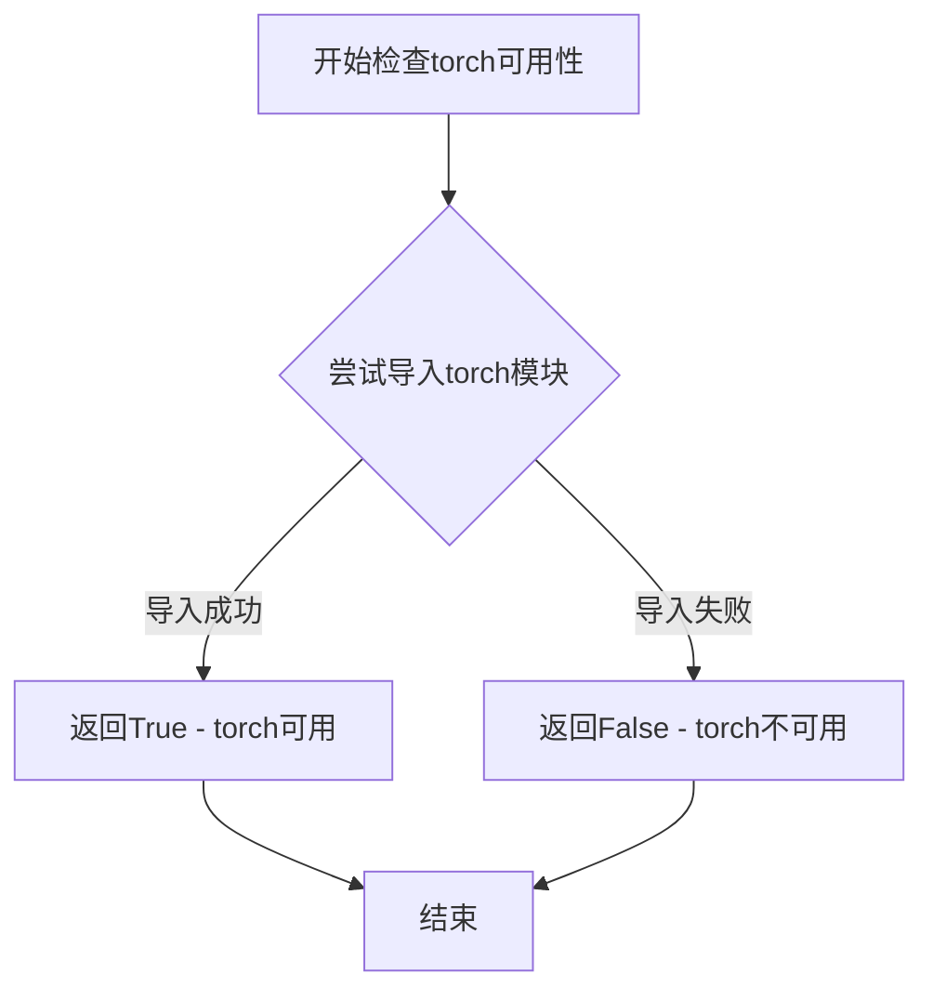
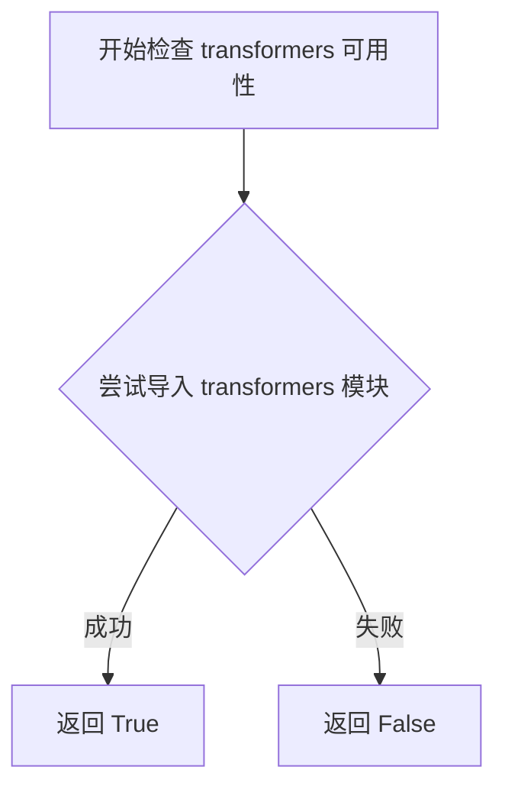
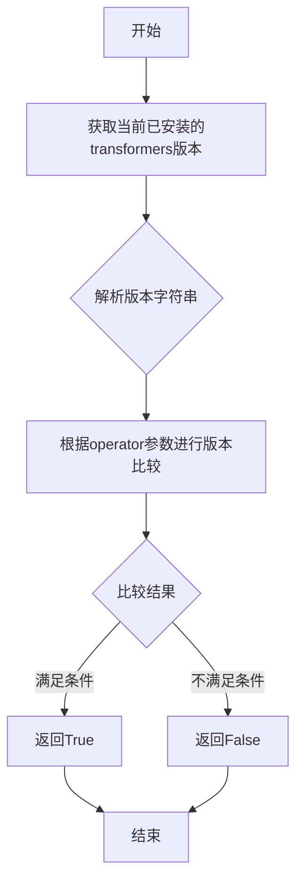

# `diffusers\src\diffusers\pipelines\musicldm\__init__.py` 详细设计文档

这是一个Diffusers库的延迟导入模块初始化文件，通过检查torch和transformers依赖的可用性，动态决定导入MusicLDMPipeline或虚拟对象，实现可选依赖的惰性加载。

## 整体流程



## 类结构

```
Package Initialization (延迟加载模块)
├── _LazyModule (延迟模块类)
├── _dummy_objects (虚拟对象字典)
├── _import_structure (导入结构字典)
└── MusicLDMPipeline (条件导入的管道类)
```

## 全局变量及字段


### `_dummy_objects`
    
存储虚拟对象的字典，用于依赖不可用时的替代

类型：`dict`
    


### `_import_structure`
    
定义模块导入结构的字典，包含可导出的名称映射

类型：`dict`
    


    

## 全局函数及方法


### `get_objects_from_module`

获取模块中的所有公共对象，并将其以字典形式返回，常用于延迟加载和可选依赖处理场景。

参数：

- `module`：模块对象（module），要从中获取对象的Python模块

返回值：`Dict[str, Any]`，返回模块中所有公共对象的字典，键为对象名称，值为对象本身

#### 流程图



#### 带注释源码

```
def get_objects_from_module(module):
    """
    从给定模块中获取所有对象并返回字典
    
    参数:
        module: Python模块对象
        
    返回值:
        包含模块中所有公开对象的字典
    """
    # 初始化结果字典
    objects = {}
    
    # 遍历模块的所有属性
    for name in dir(module):
        # 跳过私有属性（以_开头的属性）
        if not name.startswith('_'):
            # 获取属性值并添加到字典
            objects[name] = getattr(module, name)
    
    return objects
```

#### 在项目中的使用示例

```
# 从dummy模块获取虚拟对象
_dummy_objects.update(get_objects_from_module(dummy_torch_and_transformers_objects))
```

这个函数在项目中用于：
1. **可选依赖处理**：当torch和transformers不可用时，从dummy模块获取虚拟对象
2. **延迟加载**：将这些虚拟对象注册到当前模块的命名空间
3. **动态导入**：支持在运行时根据环境可用性动态切换真实对象和虚拟对象


### `is_torch_available`

该函数用于检查当前Python环境中是否安装了PyTorch库（torch），返回布尔值以指示torch是否可用。在diffusers库的导入机制中，该函数作为可选依赖检查的一部分，用于条件性地导入需要torch的模块。

参数：无需参数

返回值：`bool`，返回True表示torch库可用，返回False表示torch库不可用

#### 流程图



#### 带注释源码

```
# 该函数定义在 ...utils 模块中
# 以下是基于使用方式的推断实现

def is_torch_available():
    """
    检查torch库是否可用
    
    Returns:
        bool: 如果torch库已安装则返回True，否则返回False
    """
    try:
        # 尝试导入torch模块
        import torch
        return True
    except ImportError:
        # 如果导入失败，说明torch未安装
        return False

# 在当前代码中的使用方式：
# if not (is_transformers_available() and is_torch_available() and is_transformers_version(">=", "4.27.0")):
#     raise OptionalDependencyNotAvailable()

# 该函数被用于条件判断：
# 1. is_transformers_available() - 检查transformers是否可用
# 2. is_torch_available() - 检查torch是否可用  
# 3. is_transformers_version(">=", "4.27.0") - 检查transformers版本
# 只有当这三个条件全部满足时，才会导入MusicLDMPipeline
```


### `is_transformers_available`

该函数用于检查当前环境中是否安装了 `transformers` 库，并返回一个布尔值来表示其可用性。

参数： 无

返回值： `bool`，返回 `True` 表示 `transformers` 库可用，返回 `False` 表示不可用。

#### 流程图



#### 带注释源码

```python
# 该函数定义在 ...utils 模块中，此处为调用方
# 用于检查 transformers 库是否已安装且可用

# 在代码中的实际使用方式：
if not (is_transformers_available() and is_torch_available() and is_transformers_version(">=", "4.27.0")):
    raise OptionalDependencyNotAvailable()

# 说明：
# - is_transformers_available() 无参数调用
# - 返回布尔值，用于条件判断
# - 结合 is_torch_available() 和 is_transformers_version() 共同判断依赖是否满足
```

#### 补充说明

由于 `is_transformers_available` 的定义不在当前代码文件中（而是从 `...utils` 导入），以下是根据其调用方式的推断：

| 属性 | 值 |
|------|-----|
| 函数名 | `is_transformers_available` |
| 参数 | 无 |
| 返回类型 | `bool` |
| 功能 | 检查 `transformers` 库是否可用 |
| 定义位置 | `...utils` 模块（推测） |


### `is_transformers_version`

检查已安装的 transformers 库版本是否满足指定的版本要求，通过比较运算符和版本号返回布尔值结果。

参数：

- `operator`：`str`，比较运算符，支持 ">=", ">", "<", "<=", "==" 等
- `version`：`str`，目标版本号字符串（如 "4.27.0"）

返回值：`bool`，如果当前 transformers 版本满足条件返回 True，否则返回 False

#### 流程图



#### 带注释源码

```python
# 该函数定义在 ...utils 模块中
# 以下是其在代码中的使用方式和推断的实现逻辑

# 使用示例：
# is_transformers_version(">=", "4.27.0")
# 返回 True 如果当前 transformers 版本 >= 4.27.0

# 实际代码中的调用上下文：
if not (is_transformers_available() and is_torch_available() and is_transformers_version(">=", "4.27.0")):
    raise OptionalDependencyNotAvailable()

# 推断的函数实现逻辑（基于使用方式）：
def is_transformers_version(operator: str, version: str) -> bool:
    """
    检查 transformers 版本是否满足要求
    
    Args:
        operator: 比较运算符，如 '>=', '>', '<', '<=', '=='
        version: 目标版本号，如 '4.27.0'
    
    Returns:
        bool: 版本是否满足条件
    """
    try:
        from transformers import __version__ as transformers_version
        
        # 解析版本号
        current_version = parse_version(transformers_version)
        target_version = parse_version(version)
        
        # 根据运算符进行比较
        if operator == ">=":
            return current_version >= target_version
        elif operator == ">":
            return current_version > target_version
        elif operator == "<":
            return current_version < target_version
        elif operator == "<=":
            return current_version <= target_version
        elif operator == "==":
            return current_version == target_version
        else:
            return False
    except ImportError:
        # 如果 transformers 未安装，返回 False
        return False
```

---

### 补充信息

#### 关键组件信息

| 组件名称 | 描述 |
|---------|------|
| `is_transformers_available` | 检查 transformers 库是否可用 |
| `is_torch_available` | 检查 PyTorch 是否可用 |
| `OptionalDependencyNotAvailable` | 可选依赖不可用时的异常类 |
| `_LazyModule` | 延迟加载模块的辅助类 |

#### 技术债务与优化空间

1. **版本比较逻辑重复**：项目中可能存在多个类似的版本检查函数（如 `is_diffusers_version`），可以考虑抽象为统一的版本比较工具类
2. **错误处理不够详细**：当前版本检查失败时直接抛出异常，缺少详细的错误日志信息
3. **硬编码版本号**：版本号 "4.27.0" 硬编码在多处，建议提取为配置常量

#### 设计目标与约束

- **目标**：确保 transformers 和 torch 可用，且 transformers 版本满足最低要求 (>=4.27.0)
- **约束**：采用延迟导入策略，在 TYPE_CHECKING 或 DIFFUSERS_SLOW_IMPORT 时才真正导入模块内容

## 关键组件


### 可选依赖检查与处理

该模块在导入时检查torch和transformers是否可用，以及transformers版本是否满足>=4.27.0的要求，如果不可用则使用虚拟对象替代，避免导入错误。

### 延迟加载模块（Lazy Loading）

使用_LazyModule实现模块的延迟加载，只有在实际需要时才加载pipeline类，提高导入速度和内存效率。

### 虚拟对象模式（Dummy Objects）

当可选依赖不可用时，通过get_objects_from_module从dummy模块获取虚拟对象并注册到当前模块，确保代码在缺少依赖时仍能导入而不报错。

### MusicLDMPipeline 类导入

在依赖满足时从pipeline_musicldm模块导入MusicLDMPipeline类，提供音乐生成扩散管道的核心功能。

### 模块初始化配置

通过_import_structure字典定义模块的导入结构，并在运行时通过setattr将虚拟对象设置到sys.modules中，实现条件性导出。


## 问题及建议


### 已知问题

-   **重复的条件检查逻辑**：在第17-19行的`try`块和第25-31行的`TYPE_CHECKING`分支中，重复使用了完全相同的依赖检查条件 `if not (is_transformers_available() and is_torch_available() and is_transformers_version(">=", "4.27.0"))`，违反DRY（Don't Repeat Yourself）原则，增加维护成本。
-   **硬编码的版本号**：版本号"4.27.0"直接写在条件判断中，如果需要在多处进行版本检查或版本要求变化时，需要修改多处代码，缺乏统一管理。
-   **异常控制流模式**：使用`try-except`结构来控制正常的条件分支（检测依赖可用性），这种模式虽然常见但语义上不够直观，增加了代码理解难度。
-   **全局状态操作**：直接修改`sys.modules[__name__]`和`_dummy_objects`，这种模块级别的副作用可能在多线程或复杂导入场景下产生潜在问题。
-   **缺乏错误上下文**：当`OptionalDependencyNotAvailable`被抛出时，没有携带具体是哪个依赖缺失的详细信息，不利于问题诊断。
-   **魔法变量依赖**：`DIFFUSERS_SLOW_IMPORT`变量的具体行为和影响没有注释说明，后续开发者可能不清楚其作用。

### 优化建议

-   **提取依赖检查逻辑**：创建一个专门的函数或配置常量来统一管理依赖检查和版本要求，例如在文件顶部定义 `REQUIRED_TRANSFORMERS_VERSION = "4.27.0"`，并封装检查逻辑为 `check_dependencies()` 函数。
-   **重构异常处理**：考虑使用明确的条件判断替代`try-except`控制流，或者在自定义异常类中添加更详细的错误信息（如缺少的依赖名称和版本要求）。
-   **添加类型注解和文档**：为全局变量和导入结构添加类型注解，并增加模块级文档字符串说明该模块的用途和依赖要求。
-   **封装模块赋值逻辑**：将`sys.modules`的修改操作封装到独立的函数中，提高代码可读性和可测试性。
-   **日志或警告机制**：在依赖不可用时考虑添加日志记录，便于在运行时追踪导入问题。


## 其它


### 设计目标与约束

本模块的设计目标是实现可选依赖的延迟导入机制，在保证核心功能可用的同时，提供友好的降级处理。当torch或transformers依赖不可用时，通过虚拟对象（dummy objects）避免导入错误，同时支持类型检查时的完整导入。约束条件包括：必须同时满足is_transformers_available()、is_torch_available()和is_transformers_version(">=", "4.27.0")三个条件才能导入真实的MusicLDMPipeline类。

### 错误处理与异常设计

本模块采用OptionalDependencyNotAvailable异常进行依赖缺失处理。当检测到任何必需依赖不可用时，抛出该异常并捕获，随后从dummy模块导入虚拟对象以保持模块接口完整性。TYPE_CHECKING模式下同样执行依赖检查，但会直接导入真实类而非虚拟对象，用于IDE和类型检查工具。

### 外部依赖与接口契约

外部依赖包括：torch库（is_torch_available）、transformers库（is_transformers_available和is_transformers_version）以及diffusers库的utils模块（_LazyModule、get_objects_from_module等）。提供的公共接口为MusicLDMPipeline类，当依赖满足时导出该类，否则导出虚拟对象保证模块可导入性。

### 性能考虑与优化空间

模块采用LazyModule机制实现延迟加载，仅在首次访问时才进行实际导入。_dummy_objects通过setattr动态添加到sys.modules中，避免了重复导入开销。优化空间：可增加依赖缓存机制避免重复检查；可考虑将版本比较逻辑抽象为独立函数提高可测试性；可添加日志记录依赖缺失情况便于调试。

### 版本兼容性要求

最低transformers版本要求为4.27.0，该版本满足了MusicLDMPipeline的API需求。未对torch版本做显式检查，仅验证其可用性。兼容Python 3.8+（依赖typing.TYPE_CHECKING和sys.modules机制）。

### 模块初始化流程状态机

模块存在三种初始化状态：完全可用状态（所有依赖满足，导入真实Pipeline类）、完全不可用状态（任一依赖缺失，导入dummy对象）、类型检查状态（TYPE_CHECKING或DIFFUSERS_SLOW_IMPORT为真，导入真实类）。状态转换由环境变量和运行时依赖可用性共同决定。

### 安全与沙箱考量

本模块通过动态模块替换实现依赖降级，不涉及用户数据处理或外部网络请求。_LazyModule的使用确保了模块只暴露定义的公共接口（_import_structure），防止意外导入私有实现。虚拟对象的设计确保了模块在依赖缺失时的安全可导入性。


    