# `diffusers\src\diffusers\pipelines\musicldm\pipeline_musicldm.py` 详细设计文档

MusicLDMPipeline是一个用于文本到音频生成的Diffusion Pipeline，继承自DiffusionPipeline和StableDiffusionMixin，利用VAE、UNet2DConditionModel、ClapTextModel和SpeechT5HifiGan Vocoder将文本描述转换为高质量音频波形。

## 整体流程

```mermaid
graph TD
    A[开始: 用户输入prompt] --> B[检查输入参数 check_inputs]
    B --> C[编码文本提示 _encode_prompt]
    C --> D[设置调度器时间步 set_timesteps]
    D --> E[准备潜在变量 prepare_latents]
    E --> F{进入去噪循环}
    F --> G[扩展潜在变量（如果使用CFG）]
    G --> H[调度器缩放模型输入 scale_model_input]
    H --> I[UNet预测噪声残差]
    I --> J{是否使用CFG?}
    J -- 是 --> K[计算无条件+条件噪声预测]
    J -- 否 --> L[直接使用预测噪声]
    K --> M[调度器执行去噪步骤 step]
    L --> M
    M --> N{是否完成所有步?}
    N -- 否 --> F
    N -- 是 --> O[VAE解码潜在变量到梅尔频谱图]
    O --> P[Vocoder将梅尔频谱图转为波形 mel_spectrogram_to_waveform]
    P --> Q{是否需要自动评分?]
    Q -- 是 --> R[CLAP模型评分排序 score_waveforms]
    Q -- 否 --> S[返回最终音频]
    R --> S
```

## 类结构

```
MusicLDMPipeline (主类)
├── DeprecatedPipelineMixin (弃用混合类)
├── DiffusionPipeline (扩散管道基类)
└── StableDiffusionMixin (稳定扩散混入类)
```

## 全局变量及字段


### `EXAMPLE_DOC_STRING`
    
Documentation string containing example usage code for the MusicLDMPipeline

类型：`str`
    


### `logger`
    
Logger instance for tracking runtime information and warnings

类型：`logging.Logger`
    


### `XLA_AVAILABLE`
    
Flag indicating whether PyTorch XLA is available for TPU acceleration

类型：`bool`
    


### `is_librosa_available`
    
Function to check if librosa package is installed for audio processing

类型：`Callable`
    


### `is_torch_xla_available`
    
Function to check if PyTorch XLA is available for TPU support

类型：`Callable`
    


### `MusicLDMPipeline._last_supported_version`
    
Last supported version of the pipeline for compatibility checking

类型：`str`
    


### `MusicLDMPipeline.vae`
    
Variational Auto-Encoder model for encoding and decoding audio to/from latent representations

类型：`AutoencoderKL`
    


### `MusicLDMPipeline.text_encoder`
    
Frozen text-audio embedding model for encoding text prompts into embeddings

类型：`ClapTextModelWithProjection | ClapModel`
    


### `MusicLDMPipeline.tokenizer`
    
Tokenizer for converting text prompts into token IDs for the text encoder

类型：`RobertaTokenizer | RobertaTokenizerFast`
    


### `MusicLDMPipeline.feature_extractor`
    
Feature extractor for computing mel-spectrograms from audio waveforms

类型：`ClapFeatureExtractor | None`
    


### `MusicLDMPipeline.unet`
    
UNet model for denoising encoded audio latents during the diffusion process

类型：`UNet2DConditionModel`
    


### `MusicLDMPipeline.scheduler`
    
Diffusion scheduler for controlling the denoising steps and noise schedule

类型：`KarrasDiffusionSchedulers`
    


### `MusicLDMPipeline.vocoder`
    
Vocoder model for converting mel-spectrograms to waveform audio

类型：`SpeechT5HifiGan`
    


### `MusicLDMPipeline.vae_scale_factor`
    
Scaling factor derived from VAE block out channels for latent space computations

类型：`int`
    
    

## 全局函数及方法


### `is_librosa_available`

该函数用于检查 librosa 库是否已安装并可用。librosa 是一个用于音频和音乐分析的 Python 库，在该代码中用于对生成的音频波形进行自动评分（计算音频与文本的相似度）。如果 librosa 不可用，相关功能将静默返回原始音频顺序。

参数：此函数没有显式参数

返回值：`bool`，如果 librosa 库可用则返回 `True`，否则返回 `False`

#### 流程图

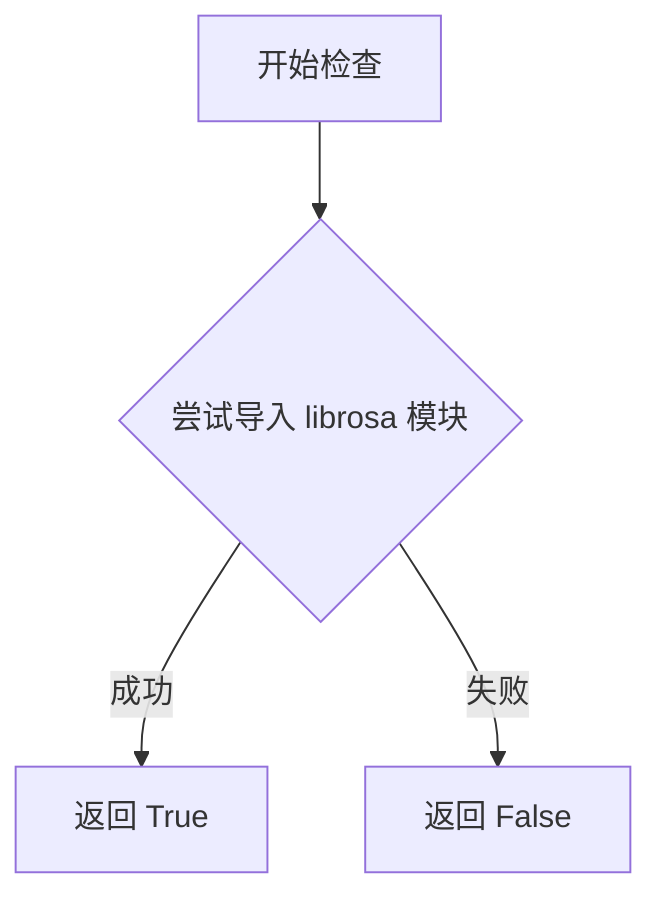

#### 带注释源码

```
# 该函数定义在 diffusers 库中，位于 src/diffusers/utils 目录下
# 源代码约如下所示（根据 diffusers 库的实现模式推断）：

def is_librosa_available() -> bool:
    """
    检查 librosa 库是否已安装并可用。
    
    Returns:
        bool: 如果 librosa 可用返回 True，否则返回 False
    """
    try:
        # 尝试导入 librosa，如果成功则说明已安装
        import librosa
        return True
    except ImportError:
        # 如果导入失败，说明未安装或不可用
        return False


# 在当前代码中的实际使用方式：

# 1. 导入时检查（用于条件导入）
if is_librosa_available():
    import librosa

# 2. 在方法中使用（用于条件执行功能）
def score_waveforms(self, text, audio, num_waveforms_per_prompt, device, dtype):
    if not is_librosa_available():
        # 记录信息日志，提示用户安装 librosa 以启用自动评分功能
        logger.info(
            "Automatic scoring of the generated audio waveforms against the input prompt text requires the "
            "`librosa` package to resample the generated waveforms. Returning the audios in the order they were "
            "generated. To enable automatic scoring, install `librosa` with: `pip install librosa`."
        )
        # 直接返回原始音频，不进行评分排序
        return audio
    
    # 如果 librosa 可用，则执行音频评分逻辑...
    # ... (后续代码使用 librosa.resample 等功能)
```


### `is_torch_xla_available`

该函数用于检查 PyTorch XLA（用于 TPU 加速的 PyTorch 扩展库）是否可用，通过尝试导入 `torch_xla` 模块来判断。

参数：该函数无参数

返回值：`bool`，如果 PyTorch XLA 可用则返回 `True`，否则返回 `False`

#### 流程图

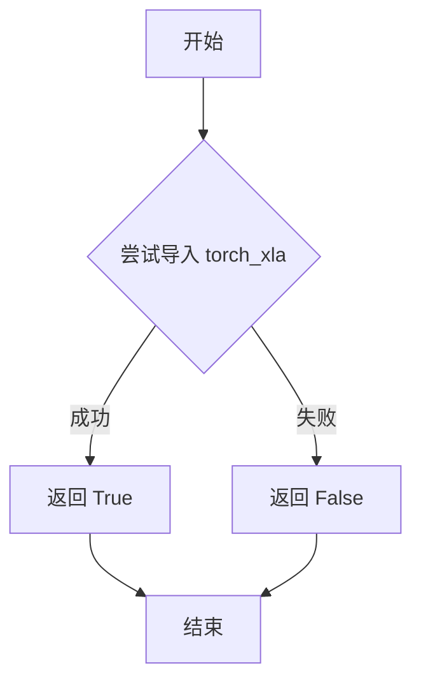

#### 带注释源码

```
def is_torch_xla_available() -> bool:
    """
    检查 PyTorch XLA 是否可用。
    
    该函数尝试导入 torch_xla 模块，如果成功则表示当前环境
    支持 TPU 加速，否则表示不支持。
    
    Returns:
        bool: 如果 torch_xla 可用返回 True，否则返回 False
    """
    try:
        import torch_xla
        return True
    except ImportError:
        return False
```


### `is_accelerate_available`

该函数用于检查当前环境中是否已安装 `accelerate` 库。`accelerate` 是一个由 Hugging Face 开发的库，用于简化在多 GPU、TPU 等硬件上的深度学习模型训练和推理过程。在 `MusicLDMPipeline` 中，此函数用于判断是否可以启用模型 CPU 卸载功能。

参数：此函数无参数。

返回值：`bool`，如果 `accelerate` 库已安装则返回 `True`，否则返回 `False`。

#### 流程图

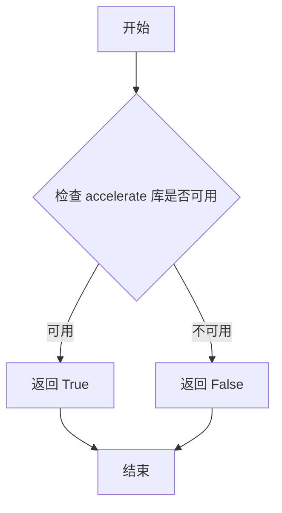

#### 带注释源码

```
# is_accelerate_available 是从 diffusers 库 utils 模块导入的工具函数
# 源码位于 diffusers/src/diffusers/utils/__init__.py 或相关模块中
# 以下为可能的实现逻辑：

def is_accelerate_available() -> bool:
    """
    检查 accelerate 库是否已安装且可用。
    
    Returns:
        bool: 如果 accelerate 库可用返回 True，否则返回 False
    """
    try:
        # 尝试导入 accelerate 库
        import accelerate
        return True
    except ImportError:
        # 如果导入失败，说明未安装 accelerate 库
        return False
```

> **注意**：由于 `is_accelerate_available` 是从外部模块（`diffusers.utils`）导入的函数，并非在此代码文件中定义，因此上述源码为基于常见实现模式的推测性描述。该函数在此代码中的主要用途是在 `MusicLDMPipeline.enable_model_cpu_offload` 方法中检查是否可以使用 `accelerate` 库的 CPU 卸载功能。


### `is_accelerate_version`

检查当前安装的 accelerate 库的版本是否满足指定的条件。

参数：

-  `op`：`str`，比较操作符，支持 ">="、"<="、"=="、">"、"<"等
-  `version`：`str`，要比较的目标版本号

返回值：`bool`，如果当前 accelerate 版本满足指定条件返回 True，否则返回 False

#### 流程图

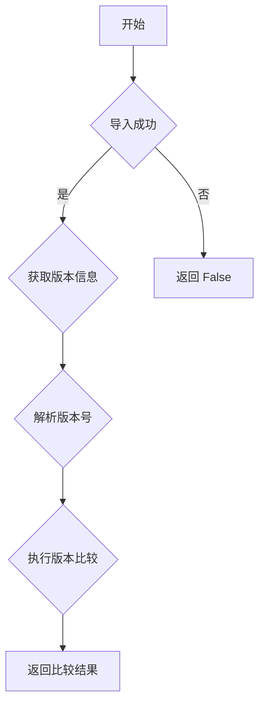

#### 带注释源码

```python
# is_accelerate_version 是从 diffusers.utils 导入的函数
# 它用于检查 accelerate 库的版本是否满足特定条件
# 在 MusicLDMPipeline 中用于检查 accelerate 版本是否 >= 0.17.0.dev0

# 使用示例：
if is_accelerate_available() and is_accelerate_version(">=", "0.17.0.dev0"):
    from accelerate import cpu_offload_with_hook
else:
    raise ImportError("`enable_model_cpu_offload` requires `accelerate v0.17.0` or higher.")

# 函数签名：
# def is_accelerate_version(op: str, version: str) -> bool:
#     """
#     Checks if the current accelerate version satisfies the given condition.
#     
#     Args:
#         op: Comparison operator (e.g., ">=", "<=", "==", ">", "<")
#         version: Target version string to compare against
#     
#     Returns:
#         bool: True if the condition is satisfied, False otherwise
#     """
#     ...
```


由于 `empty_device_cache` 是从外部模块 `...utils.torch_utils` 导入的函数，在当前代码文件中没有定义，只有导入和使用。根据代码上下文和使用方式，我提供以下分析：

### `empty_device_cache`

清空设备（GPU/CPU）缓存，释放内存资源。

参数：此函数无参数

返回值：`None`，无返回值

#### 流程图

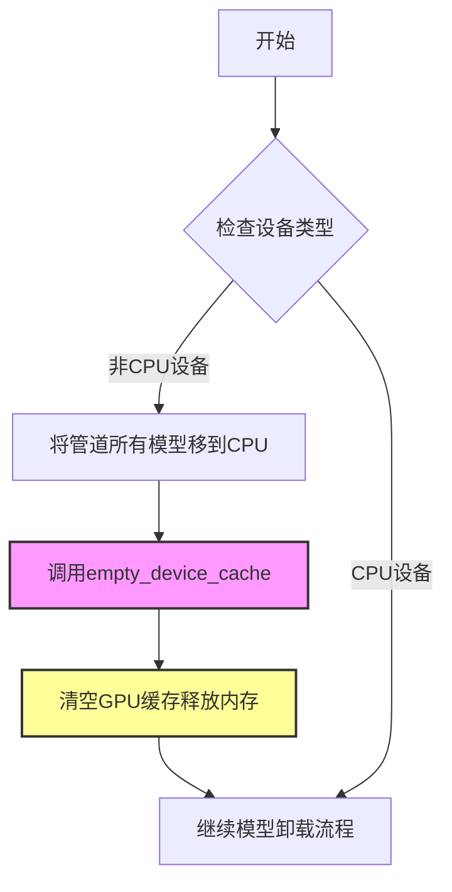

#### 带注释源码

```python
# empty_device_cache 函数定义于 diffusers.utils.torch_utils 模块
# 此函数通常实现如下：

def empty_device_cache():
    """
    清空设备缓存，释放GPU内存。
    
    该函数主要完成以下工作：
    1. 如果有CUDA设备，执行 torch.cuda.empty_cache() 清空CUDA缓存
    2. 如果有XLA设备，执行相关清理（如果有）
    3. 可能触发垃圾回收
    
    这对于在模型卸载后准确测量内存使用非常重要，
    否则可能会看到不正确的内存节省数值。
    """
    # 源代码位置：src/diffusers/utils/torch_utils.py
    if torch.cuda.is_available():
        torch.cuda.empty_cache()
    
    # 可选的XLA清理（如果可用）
    if is_torch_xla_available():
        import torch_xla.core.xla_model as xm
        xm.collective_barrier()  # 或其他适当的清理操作
    
    import gc
    gc.collect()
```

#### 在 MusicLDMPipeline 中的使用

```python
def enable_model_cpu_offload(self, gpu_id=0):
    # ... 前置代码 ...
    
    if self.device.type != "cpu":
        self.to("cpu", silence_dtype_warnings=True)
        # 清空设备缓存，以便正确观察内存节省情况
        empty_device_cache()  # otherwise we don't see the memory savings (but they probably exist)
    
    # ... 后续代码 ...
```

---

### 补充说明

**设计目标**：在模型从GPU卸载到CPU后，清空GPU缓存，确保能够准确测量内存使用情况。

**外部依赖**：该函数依赖 PyTorch 的 `torch.cuda.empty_cache()` 方法。

**使用场景**：在 `enable_model_cpu_offload` 方法中，当管道设备不是CPU时，将所有模型移到CPU后调用，以释放GPU显存。

**技术债务**：由于 `empty_device_cache` 是从外部模块导入的，如果需要了解其完整实现细节，需要查阅 `diffusers` 库的 `torch_utils` 模块源码。


### `get_device`

`get_device` 是一个全局工具函数，用于自动检测当前运行环境并返回可用的 PyTorch 设备类型（通常为 "cuda"、"cpu" 或 "mps"），以便在不支持的设备上优雅降级。

参数：
- （无参数）

返回值：`str`，返回当前可用的设备类型字符串（如 "cuda"、"cpu" 或 "mps"）。

#### 流程图

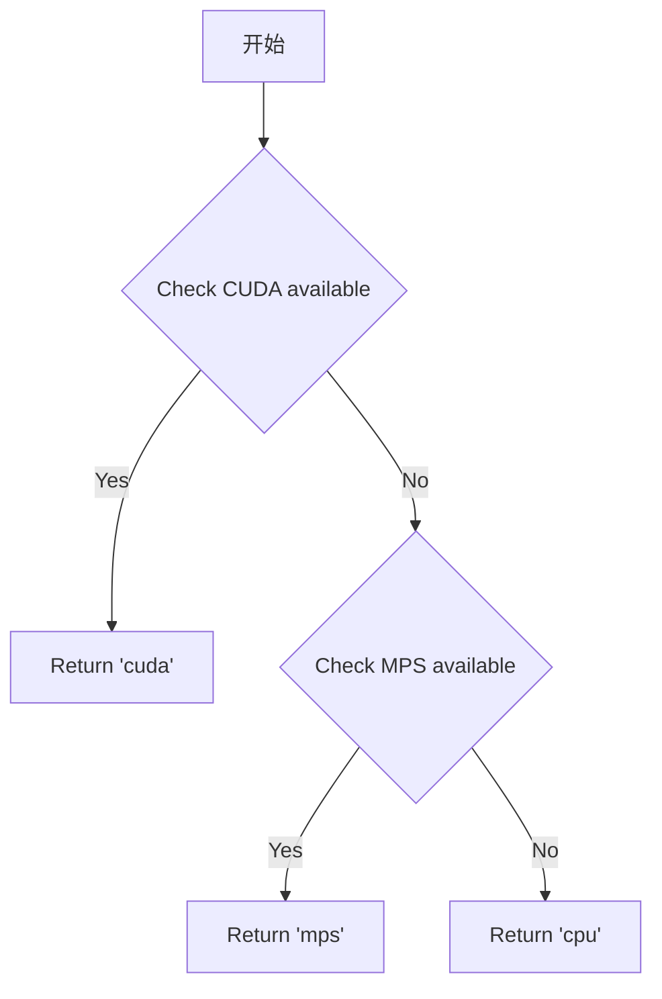

#### 带注释源码

```
# 注：由于 get_device 是从外部模块 ...utils.torch_utils 导入的，
# 以下为基于代码使用方式推断的典型实现：

def get_device() -> str:
    """
    自动检测并返回可用的 PyTorch 设备。
    
    检测优先级：CUDA > MPS (Apple Silicon) > CPU
    """
    if torch.cuda.is_available():
        return "cuda"
    elif hasattr(torch.backends, 'mps') and torch.backends.mps.is_available():
        # MPS for Apple Silicon
        return "mps"
    else:
        return "cpu"
```


### `randn_tensor`

生成指定形状的随机张量（服从正态分布），用于扩散模型的潜伏变量初始化。

参数：

- `shape`：`tuple` 或 `int`，要生成的随机张量的形状
- `generator`：`torch.Generator` 或 `list[torch.Generator]`，可选，用于控制随机数生成的生成器，以确保可重复性
- `device`：`torch.device`，随机张量应该放置的设备
- `dtype`：`torch.dtype`，随机张量的数据类型（如 `torch.float32`、`torch.float16` 等）

返回值：`torch.Tensor`，生成的随机张量

#### 流程图

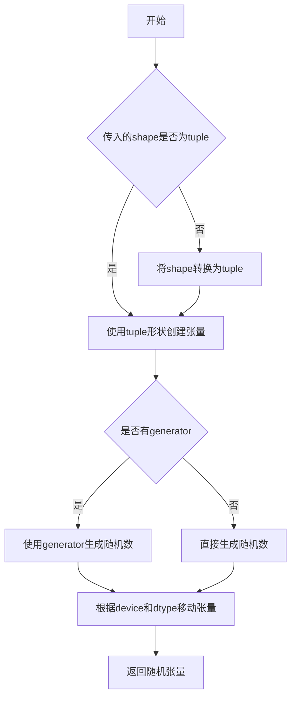

#### 带注释源码

```python
# 注意：randn_tensor 函数定义在 diffusers/src/diffusers/utils/torch_utils.py 中
# 以下是其在 MusicLDMPipeline 中的使用示例（在 prepare_latents 方法中）：

# 定义潜在变量的形状
shape = (
    batch_size,
    num_channels_latents,
    int(height) // self.vae_scale_factor,
    int(self.vocoder.config.model_in_dim) // self.vae_scale_factor,
)

# 如果没有提供 latents，则使用 randn_tensor 生成随机潜在变量
if latents is None:
    # 调用 randn_tensor 生成符合正态分布的随机张量
    latents = randn_tensor(shape, generator=generator, device=device, dtype=dtype)
else:
    # 如果提供了 latents，则直接移动到指定设备
    latents = latents.to(device)

# 使用调度器的初始噪声标准差缩放初始噪声
latents = latents * self.scheduler.init_noise_sigma
return latents
```


### `replace_example_docstring`

该函数是一个装饰器，用于自动替换或补充被装饰函数的文档字符串（docstring）。它接收一个示例文档字符串作为参数，将其附加到原函数的文档中，通常用于为.pipeline的`__call__`方法添加使用示例。

参数：

-  `example_docstring`：`str`，要添加的示例文档字符串，通常包含代码示例和使用说明

返回值：`Callable`，返回装饰后的函数

#### 流程图

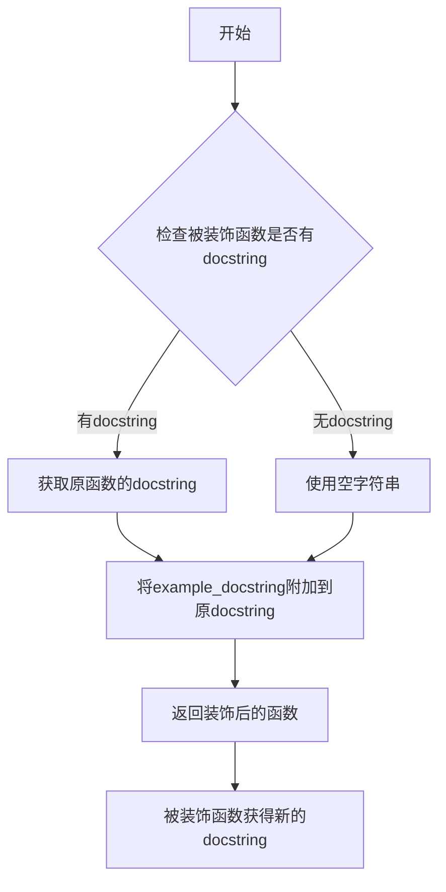

#### 带注释源码

```python
# 注意：由于该函数定义在 diffusers 库的 utils 模块中，
# 以下是根据其使用方式和功能推断的源码实现

import functools
import inspect
from typing import Callable, Optional

def replace_example_docstring(example_docstring: str) -> Callable:
    """
    装饰器：用于替换或补充函数的文档字符串，添加示例代码说明。
    
    Args:
        example_docstring: 包含代码示例的文档字符串
        
    Returns:
        装饰后的函数
    """
    def decorator(func: Callable) -> Callable:
        # 获取原函数的文档字符串
        docstring = func.__doc__
        
        # 如果原函数有文档字符串，则附加示例；否则直接使用示例
        if docstring:
            # 在原文档末尾添加示例文档字符串
            new_docstring = docstring + "\n\n" + example_docstring
        else:
            new_docstring = example_docstring
        
        # 更新函数的文档字符串
        func.__doc__ = new_docstring
        
        # 返回原函数（不修改函数本身，只修改其文档）
        return func
    
    return decorator


# 使用示例（在 MusicLDMPipeline 中）：
@replace_example_docstring(EXAMPLE_DOC_STRING)
def __call__(self, ...):
    """
    The call function to the pipeline for generation.
    ...
    """
    # 函数实现...
    pass
```

#### 说明

`replace_example_docstring` 是 diffusers 库中的一个工具函数，位于 `src/diffusers/utils/__init__.py` 中导出。在 `MusicLDMPipeline` 中，它被用作装饰器应用于 `__call__` 方法，使其能够自动获得 `EXAMPLE_DOC_STRING` 中定义的代码示例和使用说明，无需在 `__call__` 方法的原始文档中手动编写大量示例代码。这种做法保持了代码的一致性和可维护性。


### `logging.get_logger`

获取一个logger实例，用于在模块中记录日志信息。该函数是diffusers工具模块提供的日志记录功能，允许开发者创建具有特定名称的logger，以便在运行时追踪和调试代码。

参数：

- `name`：`str`，logger的名称。通常传入`__name__`来获取当前Python模块的完整路径，以便在日志中识别消息来源。

返回值：`logging.Logger`，返回一个Python标准库的Logger对象，可用于记录不同级别的日志消息（如debug、info、warning、error、critical）。

#### 流程图

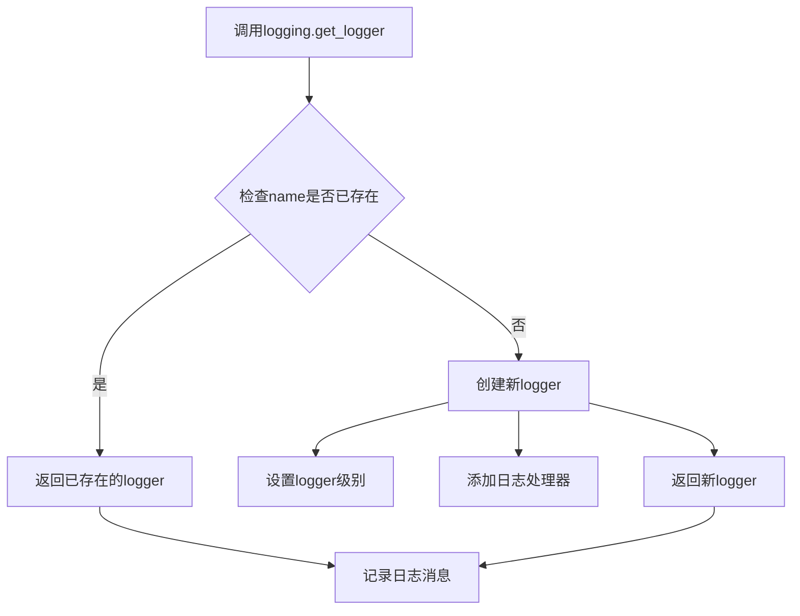

#### 带注释源码

```
# 从diffusers.utils模块导入的logging对象
# 这是模块级别的logger获取调用，位于代码第49行
logger = logging.get_logger(__name__)  # pylint: disable=invalid-name

# 实际使用示例（在代码中）：
# 当需要记录警告信息时调用
logger.warning(
    "The following part of your input was truncated because CLAP can only handle sequences up to"
    f" {self.tokenizer.model_max_length} tokens: {removed_text}"
)

# 当需要记录信息时调用
logger.info(
    "Automatic scoring of the generated audio waveforms against the input prompt text requires the "
    "`librosa` package to resample the generated waveforms. Returning the audios in the order they were "
    "generated. To enable automatic scoring, install `librosa` with: `pip install librosa`."
)

# 实际函数签名（基于transformers库的类似实现）：
# def get_logger(name: str) -> logging.Logger:
#     """
#     获取一个带有指定名称的logger实例
#     
#     参数:
#         name: logger的名称，通常使用__name__来标识模块
#     返回:
#         配置好的Logger对象
#     """
#     # 创建或获取logger
#     logger = logging.getLogger(name)
#     
#     # 如果logger没有处理器，添加默认处理器
#     if not logger.handlers:
#         handler = logging.StreamHandler()
#         handler.setFormatter(
#             logging.Formatter(
#                 "%(asctime)s - %(name)s - %(levelname)s - %(message)s"
#             )
#         )
#         logger.addHandler(handler)
#     
#     return logger
```


### `MusicLDMPipeline.__init__`

这是 MusicLDMPipeline 类的构造函数，负责初始化整个文本到音频生成管道。它接收所有必需的模型组件（VAE、文本编码器、分词器、特征提取器、UNet、调度器和声码器），并将它们注册到管道中，同时计算 VAE 的缩放因子。

参数：

- `self`：隐式参数，MusicLDMPipeline 实例本身
- `vae`：`AutoencoderKL`，变分自编码器模型，用于编码和解码潜在表示
- `text_encoder`：`ClapTextModelWithProjection | ClapModel`，冻结的文本-音频嵌入模型（CLAP）
- `tokenizer`：`RobertaTokenizer | RobertaTokenizerFast`，用于对文本进行分词
- `feature_extractor`：`ClapFeatureExtractor | None`，从音频波形计算梅尔频谱图的特征提取器
- `unet`：`UNet2DConditionModel`，用于对编码的音频潜在表示进行去噪
- `scheduler`：`KarrasDiffusionSchedulers`，与 unet 配合使用以对潜在表示进行去噪的调度器
- `vocoder`：`SpeechT5HifiGan`，将梅尔频谱图转换为波形的声码器

返回值：`None`，构造函数不返回任何值

#### 流程图

```mermaid
flowchart TD
    A[开始 __init__] --> B[调用父类初始化 super().__init__]
    B --> C[调用 register_modules 注册所有模块]
    C --> D{检查 vae 属性是否存在}
    D -->|是| E[计算 vae_scale_factor: 2^(len(vae.config.block_out_channels)-1)]
    D -->|否| F[设置 vae_scale_factor 为默认值 8]
    E --> G[初始化完成]
    F --> G
```

#### 带注释源码

```python
def __init__(
    self,
    vae: AutoencoderKL,
    text_encoder: ClapTextModelWithProjection | ClapModel,
    tokenizer: RobertaTokenizer | RobertaTokenizerFast,
    feature_extractor: ClapFeatureExtractor | None,
    unet: UNet2DConditionModel,
    scheduler: KarrasDiffusionSchedulers,
    vocoder: SpeechT5HifiGan,
):
    """
    初始化 MusicLDMPipeline 实例。
    
    参数:
        vae: AutoencoderKL 模型，用于潜在空间与音频之间的转换
        text_encoder: CLAP 文本编码器，用于将文本转换为嵌入
        tokenizer: RoBERTa 分词器，用于对输入文本进行分词
        feature_extractor: CLAP 特征提取器，用于从音频提取特征
        unet: 条件 UNet2D 模型，用于去噪潜在表示
        scheduler: Karras 扩散调度器，控制去噪过程
        vocoder: SpeechT5 HiFi-GAN 声码器，将梅尔频谱图转为波形
    """
    # 调用父类的初始化方法，设置基础管道结构
    super().__init__()

    # 将所有模型组件注册到管道中，使其可以通过 self.xxx 访问
    self.register_modules(
        vae=vae,
        text_encoder=text_encoder,
        tokenizer=tokenizer,
        feature_extractor=feature_extractor,
        unet=unet,
        scheduler=scheduler,
        vocoder=vocoder,
    )
    
    # 计算 VAE 缩放因子，用于调整潜在表示的空间维度
    # 基于 VAE 块输出通道数的深度计算 (2^(层数-1))
    # 默认值为 8（对应典型的 3 层 VAE: [128, 256, 512] -> 2^(3-1)=4 但代码取 max 8）
    self.vae_scale_factor = 2 ** (len(self.vae.config.block_out_channels) - 1) if getattr(self, "vae", None) else 8
```


### `MusicLDMPipeline._encode_prompt`

该函数负责将文本提示（prompt）编码为文本编码器的隐藏状态（text encoder hidden states），为后续的音频生成提供文本特征表示。同时处理无分类器自由引导（Classifier-Free Guidance）所需的负面提示嵌入。

参数：

- `self`：类的实例，包含 `tokenizer` 和 `text_encoder` 等模块
- `prompt`：`str` 或 `list[str]`，要编码的文本提示
- `device`：`torch.device`，指定的计算设备
- `num_waveforms_per_prompt`：`int`，每个提示需要生成的波形数量，用于扩展嵌入维度
- `do_classifier_free_guidance`：`bool`，是否启用无分类器自由引导
- `negative_prompt`：`str` 或 `list[str]`，可选，用于引导不希望出现的音频特征的负面提示
- `prompt_embeds`：`torch.Tensor | None`，可选，预先计算好的文本嵌入，若提供则跳过文本编码流程
- `negative_prompt_embeds`：`torch.Tensor | None`，可选，预先计算好的负面文本嵌入

返回值：`torch.Tensor`，编码后的文本提示嵌入，形状为 `(batch_size * num_waveforms_per_prompt, seq_len, hidden_dim)`

#### 流程图

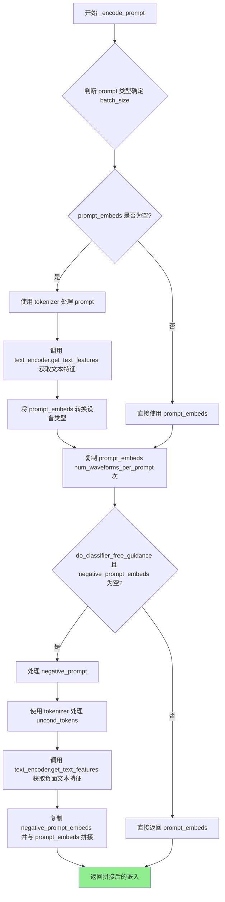

#### 带注释源码

```python
def _encode_prompt(
    self,
    prompt,  # str or list[str]: 要编码的提示文本
    device,  # torch.device: 计算设备
    num_waveforms_per_prompt,  # int: 每个提示生成的波形数
    do_classifier_free_guidance,  # bool: 是否启用无分类器引导
    negative_prompt=None,  # str or list[str]: 负面提示
    prompt_embeds: torch.Tensor | None = None,  # 预计算的提示嵌入
    negative_prompt_embeds: torch.Tensor | None = None,  # 预计算的负面嵌入
):
    r"""
    Encodes the prompt into text encoder hidden states.

    Args:
        prompt (`str` or `list[str]`, *optional*):
            prompt to be encoded
        device (`torch.device`):
            torch device
        num_waveforms_per_prompt (`int`):
            number of waveforms that should be generated per prompt
        do_classifier_free_guidance (`bool`):
            whether to use classifier free guidance or not
        negative_prompt (`str` or `list[str]`, *optional*):
            The prompt or prompts not to guide the audio generation. If not defined, one has to pass
            `negative_prompt_embeds` instead. Ignored when not using guidance (i.e., ignored if `guidance_scale` is
            less than `1`).
        prompt_embeds (`torch.Tensor`, *optional*):
            Pre-generated text embeddings. Can be used to easily tweak text inputs, *e.g.* prompt weighting. If not
            provided, text embeddings will be generated from `prompt` input argument.
        negative_prompt_embeds (`torch.Tensor`, *optional*):
            Pre-generated negative text embeddings. Can be used to easily tweak text inputs, *e.g.* prompt
            weighting. If not provided, negative_prompt_embeds will be generated from `negative_prompt` input
            argument.
    """
    # 步骤1: 根据 prompt 类型确定批处理大小
    # 如果 prompt 是字符串，batch_size = 1
    # 如果 prompt 是列表，batch_size = 列表长度
    # 否则使用 prompt_embeds 的 batch size
    if prompt is not None and isinstance(prompt, str):
        batch_size = 1
    elif prompt is not None and isinstance(prompt, list):
        batch_size = len(prompt)
    else:
        batch_size = prompt_embeds.shape[0]

    # 步骤2: 如果没有提供 prompt_embeds，则从 prompt 生成
    if prompt_embeds is None:
        # 使用分词器将文本转换为 token ID
        text_inputs = self.tokenizer(
            prompt,
            padding="max_length",
            max_length=self.tokenizer.model_max_length,
            truncation=True,
            return_tensors="pt",
        )
        text_input_ids = text_inputs.input_ids
        attention_mask = text_inputs.attention_mask
        
        # 获取未截断的 token 序列用于检查截断情况
        untruncated_ids = self.tokenizer(prompt, padding="longest", return_tensors="pt").input_ids

        # 检查是否发生了截断，并记录警告信息
        if untruncated_ids.shape[-1] >= text_input_ids.shape[-1] and not torch.equal(
            text_input_ids, untruncated_ids
        ):
            removed_text = self.tokenizer.batch_decode(
                untruncated_ids[:, self.tokenizer.model_max_length - 1 : -1]
            )
            logger.warning(
                "The following part of your input was truncated because CLAP can only handle sequences up to"
                f" {self.tokenizer.model_max_length} tokens: {removed_text}"
            )

        # 调用文本编码器获取文本特征（嵌入向量）
        prompt_embeds = self.text_encoder.get_text_features(
            text_input_ids.to(device),
            attention_mask=attention_mask.to(device),
        )

    # 步骤3: 将 prompt_embeds 转换为与文本编码器相同的 dtype 和设备
    prompt_embeds = prompt_embeds.to(dtype=self.text_encoder.text_model.dtype, device=device)

    # 获取嵌入的形状
    (
        bs_embed,  # batch size
        seq_len,   # sequence length
    ) = prompt_embeds.shape
    
    # 步骤4: 复制文本嵌入以匹配每个提示生成的波形数量
    # duplicate text embeddings for each generation per prompt, using mps friendly method
    prompt_embeds = prompt_embeds.repeat(1, num_waveforms_per_prompt)
    prompt_embeds = prompt_embeds.view(bs_embed * num_waveforms_per_prompt, seq_len)

    # 步骤5: 处理无分类器自由引导的负面嵌入
    # get unconditional embeddings for classifier free guidance
    if do_classifier_free_guidance and negative_prompt_embeds is None:
        uncond_tokens: list[str]
        if negative_prompt is None:
            # 如果没有提供负面提示，使用空字符串
            uncond_tokens = [""] * batch_size
        elif type(prompt) is not type(negative_prompt):
            # 类型检查：确保 prompt 和 negative_prompt 类型一致
            raise TypeError(
                f"`negative_prompt` should be the same type to `prompt`, but got {type(negative_prompt)} !="
                f" {type(prompt)}."
            )
        elif isinstance(negative_prompt, str):
            # 如果负面提示是字符串，转换为列表
            uncond_tokens = [negative_prompt]
        elif batch_size != len(negative_prompt):
            # 批大小检查
            raise ValueError(
                f"`negative_prompt`: {negative_prompt} has batch size {len(negative_prompt)}, but `prompt`:"
                f" {prompt} has batch size {batch_size}. Please make sure that passed `negative_prompt` matches"
                " the batch size of `prompt`."
            )
        else:
            uncond_tokens = negative_prompt

        # 使用分词器处理无条件（负面）token
        max_length = prompt_embeds.shape[1]
        uncond_input = self.tokenizer(
            uncond_tokens,
            padding="max_length",
            max_length=max_length,
            truncation=True,
            return_tensors="pt",
        )

        uncond_input_ids = uncond_input.input_ids.to(device)
        attention_mask = uncond_input.attention_mask.to(device)

        # 获取负面提示的文本嵌入
        negative_prompt_embeds = self.text_encoder.get_text_features(
            uncond_input_ids,
            attention_mask=attention_mask,
        )

    # 步骤6: 如果启用无分类器引导，拼接无条件嵌入和提示嵌入
    if do_classifier_free_guidance:
        # 复制无条件嵌入以匹配波形数量
        seq_len = negative_prompt_embeds.shape[1]

        negative_prompt_embeds = negative_prompt_embeds.to(dtype=self.text_encoder.text_model.dtype, device=device)

        negative_prompt_embeds = negative_prompt_embeds.repeat(1, num_waveforms_per_prompt)
        negative_prompt_embeds = negative_prompt_embeds.view(batch_size * num_waveforms_per_prompt, seq_len)

        # For classifier free guidance, we need to do two forward passes.
        # Here we concatenate the unconditional and text embeddings into a single batch
        # to avoid doing two forward passes
        # 将无条件嵌入和条件嵌入拼接：[negative_prompt_embeds, prompt_embeds]
        # 维度从 (batch_size * num_waveforms, seq_len) 变为 (2 * batch_size * num_waveforms, seq_len)
        prompt_embeds = torch.cat([negative_prompt_embeds, prompt_embeds])

    return prompt_embeds
```


### `MusicLDMPipeline.mel_spectrogram_to_waveform`

将梅尔频谱图（Mel Spectrogram）通过声码器（Vocoder）转换为音频波形（Waveform），这是文本转音频扩散管道的后处理步骤，用于将生成的潜在表示解码为可听的音频信号。

参数：

- `mel_spectrogram`：`torch.Tensor`，输入的梅尔频谱图张量，通常为 3D 或 4D 张量（batch, channels, freq, time）

返回值：`torch.Tensor`，转换后的音频波形，类型为 float32，shape 为 (batch, samples)

#### 流程图

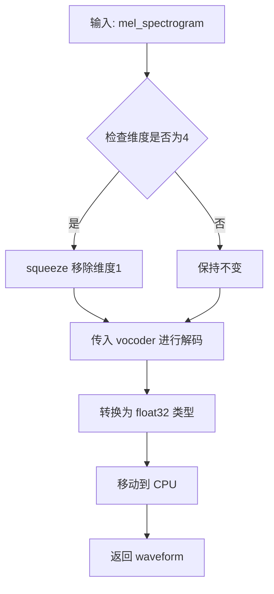

#### 带注释源码

```python
def mel_spectrogram_to_waveform(self, mel_spectrogram):
    # 如果梅尔频谱图是4维张量（通常为[B, 1, F, T]），则压缩掉中间的第1维
    # 变为3维张量[B, F, T]，因为 vocoder 期望 3D 输入
    if mel_spectrogram.dim() == 4:
        mel_spectrogram = mel_spectrogram.squeeze(1)

    # 使用 SpeechT5HifiGan vocoder 将梅尔频谱图解码为原始波形
    waveform = self.vocoder(mel_spectrogram)
    
    # 将波形转换为 float32 类型，以避免兼容性问题（特别是 bfloat16）
    # 同时将数据从 GPU 移动到 CPU
    waveform = waveform.cpu().float()
    
    # 返回最终的音频波形
    return waveform
```


### MusicLDMPipeline.score_waveforms

该方法用于对生成的音频波形进行自动评分和排序。它利用CLAP模型计算音频与文本之间的相似度分数，根据分数从高到低排序返回最匹配的音频波形。

参数：

- `text`：`str` 或 `list[str]`，用于与音频进行相似度匹配的文本提示
- `audio`：`torch.Tensor`，生成的音频波形张量，需要进行评分和重排序
- `num_waveforms_per_prompt`：`int`，每个提示需要保留的波形数量
- `device`：`torch.device`，计算设备（CPU或GPU）
- `dtype`：`torch.dtype`，张量的数据类型

返回值：`torch.Tensor`，根据文本-音频相似度评分重新排序后的音频波形

#### 流程图

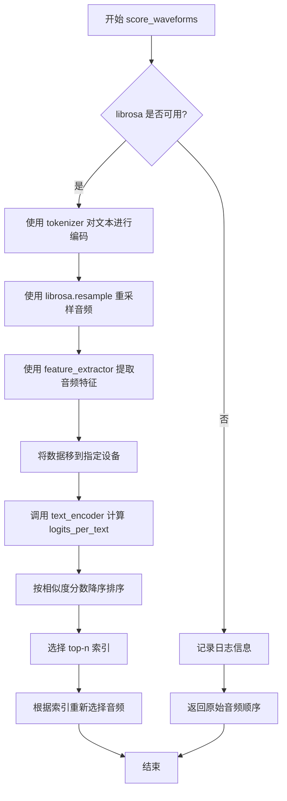

#### 带注释源码

```python
def score_waveforms(self, text, audio, num_waveforms_per_prompt, device, dtype):
    # 检查 librosa 库是否可用，若不可用则直接返回原始音频顺序
    if not is_librosa_available():
        logger.info(
            "Automatic scoring of the generated audio waveforms against the input prompt text requires the "
            "`librosa` package to resample the generated waveforms. Returning the audios in the order they were "
            "generated. To enable automatic scoring, install `librosa` with: `pip install librosa`."
        )
        return audio
    
    # 使用分词器对文本进行编码，返回 PyTorch 格式的张量
    inputs = self.tokenizer(text, return_tensors="pt", padding=True)
    
    # 将音频从 vocoder 的采样率重采样到 feature_extractor 的采样率
    # 以确保音频特征能够被正确提取
    resampled_audio = librosa.resample(
        audio.numpy(), 
        orig_sr=self.vocoder.config.sampling_rate, 
        target_sr=self.feature_extractor.sampling_rate
    )
    
    # 使用特征提取器从重采样后的音频中提取输入特征
    inputs["input_features"] = self.feature_extractor(
        list(resampled_audio), 
        return_tensors="pt", 
        sampling_rate=self.feature_extractor.sampling_rate
    ).input_features.type(dtype)
    
    # 将输入数据移动到指定的计算设备上
    inputs = inputs.to(device)

    # 使用 CLAP 模型计算音频-文本相似度分数
    # logits_per_text 表示每个文本与音频之间的匹配程度
    logits_per_text = self.text_encoder(**inputs).logits_per_text
    
    # 根据相似度分数对每个提示的生成结果进行降序排序
    # 选取分数最高的 num_waveforms_per_prompt 个索引
    indices = torch.argsort(logits_per_text, dim=1, descending=True)[:, :num_waveforms_per_prompt]
    
    # 根据排序后的索引重新选择音频波形
    # 将索引转换为 CPU 设备进行索引选择
    audio = torch.index_select(audio, 0, indices.reshape(-1).cpu())
    
    # 返回按相似度评分重新排序后的音频
    return audio
```


### `MusicLDMPipeline.prepare_extra_step_kwargs`

该方法用于为调度器（scheduler）的 `step` 方法准备额外的关键字参数。由于不同调度器的签名不完全一致，该方法通过检查调度器是否接受特定参数（如 `eta` 和 `generator`）来动态构建传递给 `scheduler.step()` 的参数字典。

参数：

- `generator`：`torch.Generator | list[torch.Generator] | None`，用于控制生成过程的随机性，确保可重复的采样结果
- `eta`：`float`，DDIM 调度器专用的参数，对应 DDIM 论文中的 η 值，取值范围为 [0, 1]，其他调度器会忽略此参数

返回值：`dict`，包含调度器 `step` 方法所需的关键字参数字典，可能包含 `eta` 和/或 `generator` 键

#### 流程图

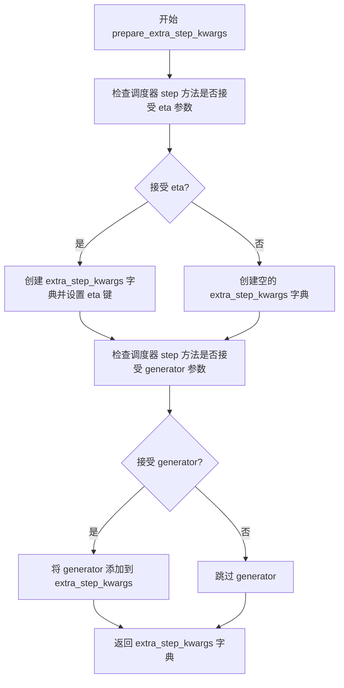

#### 带注释源码

```python
# Copied from diffusers.pipelines.stable_diffusion.pipeline_stable_diffusion.StableDiffusionPipeline.prepare_extra_step_kwargs
def prepare_extra_step_kwargs(self, generator, eta):
    # 为调度器步骤准备额外的关键字参数，因为并非所有调度器都具有相同的签名
    # eta (η) 仅在 DDIMScheduler 中使用，对于其他调度器将被忽略。
    # eta 对应 DDIM 论文 (https://huggingface.co/papers/2010.02502) 中的 η
    # 取值应在 [0, 1] 之间

    # 通过检查调度器 step 方法的签名参数名来判断是否接受 eta 参数
    accepts_eta = "eta" in set(inspect.signature(self.scheduler.step).parameters.keys())
    # 初始化用于存储额外参数的字典
    extra_step_kwargs = {}
    # 如果调度器接受 eta 参数，则将其添加到参数字典中
    if accepts_eta:
        extra_step_kwargs["eta"] = eta

    # 检查调度器是否接受 generator 参数
    accepts_generator = "generator" in set(inspect.signature(self.scheduler.step).parameters.keys())
    # 如果调度器接受 generator 参数，则将其添加到参数字典中
    if accepts_generator:
        extra_step_kwargs["generator"] = generator
    
    # 返回构建好的参数字典，供 scheduler.step() 使用
    return extra_step_kwargs
```


### `MusicLDMPipeline.check_inputs`

该方法用于验证 MusicLDMPipeline 的输入参数是否合法，确保音频长度、回调步骤、提示词和提示词嵌入等参数满足模型要求，从而在生成前提前捕获潜在的配置错误。

参数：

- `prompt`：`str | list[str] | None`，用于引导音频生成的文本提示词
- `audio_length_in_s`：`float`，生成的音频样本长度（秒）
- `vocoder_upsample_factor`：`float`，声码器上采样因子，用于计算最小音频长度
- `callback_steps`：`int | None`，在推理过程中调用回调函数的频率
- `negative_prompt`：`str | list[str] | None`，用于引导不希望出现内容的文本提示词
- `prompt_embeds`：`torch.Tensor | None`，预生成的文本嵌入向量
- `negative_prompt_embeds`：`torch.Tensor | None`，预生成的负面文本嵌入向量

返回值：`None`，该方法不返回任何值，仅通过抛出 ValueError 来指示输入错误

#### 流程图

```mermaid
flowchart TD
    A[开始 check_inputs] --> B[计算最小音频长度: min_audio_length_in_s]
    B --> C{audio_length_in_s >= min_audio_length_in_s?}
    C -->|否| D[抛出 ValueError: 音频长度不足]
    C -->|是| E{声码器维度 % vae_scale_factor == 0?}
    E -->|否| F[抛出 ValueError: 频率bins不可整除]
    E -->|是| G{callback_steps 是正整数?}
    G -->|否| H[抛出 ValueError: callback_steps无效]
    G -->|是| I{prompt 和 prompt_embeds 都存在?}
    I -->|是| J[抛出 ValueError: 只能传一个]
    I -->|否| K{prompt 和 prompt_embeds 都为None?}
    K -->|是| L[抛出 ValueError: 必须提供一个]
    K -->|否| M{prompt 类型正确?]
    M -->|否| N[抛出 ValueError: 类型错误]
    M -->|是| O{negative_prompt 和 negative_prompt_embeds 都存在?]
    O -->|是| P[抛出 ValueError: 只能传一个]
    O -->|否| Q{prompt_embeds 和 negative_prompt_embeds 都存在?]
    Q -->|是| R{两者shape相同?]
    R -->|否| S[抛出 ValueError: shape不匹配]
    R -->|是| T[验证通过]
    Q -->|否| T
    O -->|否| T
    M -->|是| T
    D --> T
    F --> T
    H --> T
    J --> T
    L --> T
    N --> T
    P --> T
    S --> T
```

#### 带注释源码

```python
def check_inputs(
    self,
    prompt,                           # 用户输入的文本提示词，str或list类型
    audio_length_in_s,                # 期望生成的音频长度（秒）
    vocoder_upsample_factor,          # 声码器的上采样率，用于计算最小音频长度
    callback_steps,                   # 回调函数调用频率，必须为正整数
    negative_prompt=None,             # 可选的负面提示词
    prompt_embeds=None,               # 可选的预计算文本嵌入
    negative_prompt_embeds=None,      # 可选的预计算负面文本嵌入
):
    # 1. 验证音频长度是否满足模型处理的最小要求
    # 计算公式：最小长度 = vocoder上采样因子 * VAE缩放因子
    min_audio_length_in_s = vocoder_upsample_factor * self.vae_scale_factor
    if audio_length_in_s < min_audio_length_in_s:
        raise ValueError(
            f"`audio_length_in_s` has to be a positive value greater than or equal to {min_audio_length_in_s}, but "
            f"is {audio_length_in_s}."
        )

    # 2. 验证声码器的频率bins数量是否能被VAE缩放因子整除
    # 这确保了频谱图维度在解码过程中能够正确处理
    if self.vocoder.config.model_in_dim % self.vae_scale_factor != 0:
        raise ValueError(
            f"The number of frequency bins in the vocoder's log-mel spectrogram has to be divisible by the "
            f"VAE scale factor, but got {self.vocoder.config.model_in_dim} bins and a scale factor of "
            f"{self.vae_scale_factor}."
        )

    # 3. 验证callback_steps是否为正整数
    # callback_steps用于控制推理过程中回调函数的调用频率
    if (callback_steps is None) or (
        callback_steps is not None and (not isinstance(callback_steps, int) or callback_steps <= 0)
    ):
        raise ValueError(
            f"`callback_steps` has to be a positive integer but is {callback_steps} of type"
            f" {type(callback_steps)}."
        )

    # 4. 验证prompt和prompt_embeds不能同时提供
    # 两者都是用于向模型传递文本信息的方式，只能选择其一
    if prompt is not None and prompt_embeds is not None:
        raise ValueError(
            f"Cannot forward both `prompt`: {prompt} and `prompt_embeds`: {prompt_embeds}. Please make sure to"
            " only forward one of the two."
        )

    # 5. 验证prompt和prompt_embeds至少提供一个
    # 模型需要文本信息来指导音频生成，两者都不能为空
    elif prompt is None and prompt_embeds is None:
        raise ValueError(
            "Provide either `prompt` or `prompt_embeds`. Cannot leave both `prompt` and `prompt_embeds` undefined."
        )

    # 6. 验证prompt的类型是否合法
    # 必须是字符串或字符串列表
    elif prompt is not None and (not isinstance(prompt, str) and not isinstance(prompt, list)):
        raise ValueError(f"`prompt` has to be of type `str` or `list` but is {type(prompt)}")

    # 7. 验证negative_prompt和negative_prompt_embeds不能同时提供
    # 与prompt的处理方式相同，两者只能选择其一
    if negative_prompt is not None and negative_prompt_embeds is not None:
        raise ValueError(
            f"Cannot forward both `negative_prompt`: {negative_prompt} and `negative_prompt_embeds`:"
            f" {negative_prompt_embeds}. Please make sure to only forward one of the two."
        )

    # 8. 验证prompt_embeds和negative_prompt_embeds的shape必须一致
    # 当直接传入嵌入向量时，两者的维度必须匹配以确保分类器自由引导正常工作
    if prompt_embeds is not None and negative_prompt_embeds is not None:
        if prompt_embeds.shape != negative_prompt_embeds.shape:
            raise ValueError(
                "`prompt_embeds` and `negative_prompt_embeds` must have the same shape when passed directly, but"
                f" got: `prompt_embeds` {prompt_embeds.shape} != `negative_prompt_embeds`"
                f" {negative_prompt_embeds.shape}."
            )
```


### `MusicLDMPipeline.prepare_latents`

该方法用于准备音频生成流程中的潜在变量（latents）。它根据指定的批次大小、通道数和尺寸创建随机潜在变量，或使用用户提供的潜在变量，并按照调度器的初始噪声标准差对潜在变量进行缩放，以适配去噪过程。

参数：

- `batch_size`：`int`，批次大小，指定生成多少个音频样本
- `num_channels_latents`：`int`，潜在变量的通道数，对应于 UNet 的输入通道数
- `height`：`int`，潜在变量的高度维度，由音频长度转换而来
- `dtype`：`torch.dtype`，潜在变量的数据类型（如 float32、float16 等）
- `device`：`torch.device`，计算设备（CPU 或 CUDA）
- `generator`：`torch.Generator | list[torch.Generator] | None`，用于生成确定性随机数的 PyTorch 生成器
- `latents`：`torch.Tensor | None`，可选的预生成潜在变量，如果为 None 则随机生成

返回值：`torch.Tensor`，处理并缩放后的潜在变量张量

#### 流程图

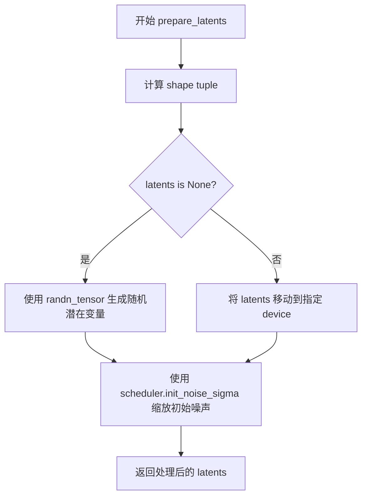

#### 带注释源码

```python
def prepare_latents(
    self,
    batch_size: int,
    num_channels_latents: int,
    height: int,
    dtype: torch.dtype,
    device: torch.device,
    generator: torch.Generator | list[torch.Generator] | None,
    latents: torch.Tensor | None = None,
) -> torch.Tensor:
    """
    准备用于音频生成的潜在变量。

    Args:
        batch_size: 生成的批次大小
        num_channels_latents: UNet 的输入通道数
        height: 从音频长度转换来的潜在变量高度
        dtype: 潜在变量的数据类型
        device: 计算设备
        generator: 可选的随机生成器用于确定性生成
        latents: 可选的预生成潜在变量

    Returns:
        处理后的潜在变量张量
    """
    # 计算潜在变量的形状
    # 宽度由 vocoder 的 model_in_dim 除以 vae_scale_factor 得到
    shape = (
        batch_size,                                          # 批次维度
        num_channels_latents,                                # 通道维度
        int(height) // self.vae_scale_factor,                # 高度维度（按 VAE 缩放因子下采样）
        int(self.vocoder.config.model_in_dim) // self.vae_scale_factor,  # 宽度维度
    )
    
    # 检查生成器列表长度是否与批次大小匹配
    if isinstance(generator, list) and len(generator) != batch_size:
        raise ValueError(
            f"You have passed a list of generators of length {len(generator)}, but requested an effective batch"
            f" size of {batch_size}. Make sure the batch size matches the length of the generators."
        )

    # 如果没有提供潜在变量，则随机生成
    if latents is None:
        # 使用 randn_tensor 生成符合标准正态分布的张量
        latents = randn_tensor(shape, generator=generator, device=device, dtype=dtype)
    else:
        # 如果提供了潜在变量，则确保其在正确的设备上
        latents = latents.to(device)

    # 使用调度器的初始噪声标准差缩放潜在变量
    # 这是扩散模型的关键步骤，确保噪声水平与调度器预期一致
    latents = latents * self.scheduler.init_noise_sigma
    
    return latents
```


### MusicLDMPipeline.enable_model_cpu_offload

该方法用于启用模型 CPU 卸载功能，通过 accelerate 库将所有模型（文本编码器、UNet、VAE、 vocoder 等）从 GPU 卸载到 CPU，以减少显存占用。该方法采用模型级卸载策略，即每次只将一个完整模型加载到加速器进行前向传播，执行完毕后保留在设备上直到下一个模型运行，相比顺序卸载具有更好的性能。

参数：

- `gpu_id`：`int`，指定目标 GPU 设备 ID，默认为 0

返回值：`None`，该方法直接修改实例状态，不返回任何值

#### 流程图

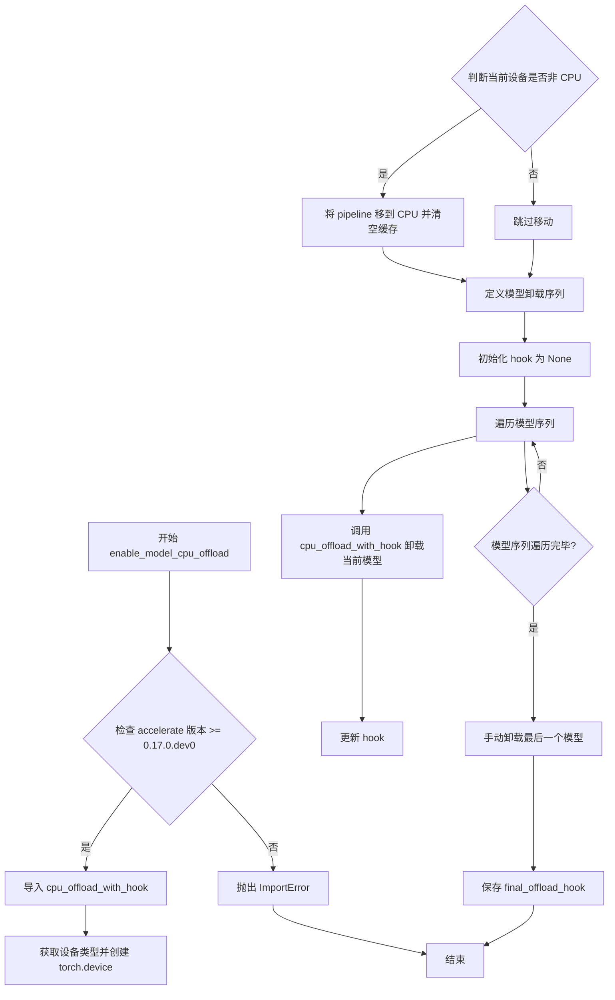

#### 带注释源码

```python
def enable_model_cpu_offload(self, gpu_id=0):
    r"""
    Offloads all models to CPU using accelerate, reducing memory usage with a low impact on performance. Compared
    to `enable_sequential_cpu_offload`, this method moves one whole model at a time to the accelerator when its
    `forward` method is called, and the model remains in accelerator until the next model runs. Memory savings are
    lower than with `enable_sequential_cpu_offload`, but performance is much better due to the iterative execution
    of the `unet`.
    """
    # 检查 accelerate 库是否可用且版本满足要求
    if is_accelerate_available() and is_accelerate_version(">=", "0.17.0.dev0"):
        # 动态导入 CPU 卸载钩子函数
        from accelerate import cpu_offload_with_hook
    else:
        # 版本不满足时抛出导入错误
        raise ImportError("`enable_model_cpu_offload` requires `accelerate v0.17.0` or higher.")

    # 获取当前设备类型（cuda/cpu/mps）并构建设备对象
    device_type = get_device()
    device = torch.device(f"{device_type}:{gpu_id}")

    # 如果当前设备不是 CPU，则将整个 pipeline 移到 CPU 并清空 GPU 缓存
    if self.device.type != "cpu":
        self.to("cpu", silence_dtype_warnings=True)
        empty_device_cache()  # otherwise we don't see the memory savings (but they probably exist)

    # 定义模型卸载顺序：文本模型 → 文本投影 → UNet → VAE → 声码器 → 完整文本编码器
    model_sequence = [
        self.text_encoder.text_model,
        self.text_encoder.text_projection,
        self.unet,
        self.vae,
        self.vocoder,
        self.text_encoder,
    ]

    # 初始化钩子为 None，用于链式连接各模型的卸载钩子
    hook = None
    # 遍历模型序列，依次为每个模型注册 CPU 卸载钩子
    for cpu_offloaded_model in model_sequence:
        # cpu_offload_with_hook 返回 (module, hook)，hook 传递用于串联
        _, hook = cpu_offload_with_hook(cpu_offloaded_model, device, prev_module_hook=hook)

    # 手动卸载最后一个模型，保存最终卸载钩子供后续使用
    # We'll offload the last model manually.
    self.final_offload_hook = hook
```


### `MusicLDMPipeline.__call__`

该方法是MusicLDMPipeline的核心调用函数，用于通过文本提示生成音频。它将文本描述通过CLAP文本编码器编码为文本嵌入，然后利用UNet2D去噪模型在潜在空间中进行迭代去噪，最后通过VAE解码器将潜在表示解码为梅尔频谱图，并使用SpeechT5HifiGan声码器将梅尔频谱图转换为最终音频波形。

参数：

- `prompt`：`str | list[str] | None`，用于引导音频生成的文本提示。如果未定义，则需要传递`prompt_embeds`。
- `audio_length_in_s`：`float | None`，生成的音频样本长度（秒），默认值为10.24秒。
- `num_inference_steps`：`int`，去噪步数，默认为200步。更多去噪步骤通常能产生更高质量的音频，但推理速度会变慢。
- `guidance_scale`：`float`，引导比例，用于控制生成音频与文本提示的相关性。默认值为2.0，当guidance_scale > 1时启用分类器自由引导。
- `negative_prompt`：`str | list[str] | None`，用于引导不包含内容的提示。当不使用引导时将被忽略。
- `num_waveforms_per_prompt`：`int`，每个提示生成的波形数量，默认为1。当大于1时，会自动对生成的音频进行评分排序。
- `eta`：`float`，DDIM调度器的eta参数，仅对DDIMScheduler有效。默认值为0.0。
- `generator`：`torch.Generator | list[torch.Generator] | None`，用于使生成具有确定性的随机生成器。
- `latents`：`torch.Tensor | None`，预生成的噪声潜在向量，用于图像生成的输入。
- `prompt_embeds`：`torch.Tensor | None`，预生成的文本嵌入，可用于轻松调整文本输入。
- `negative_prompt_embeds`：`torch.Tensor | None`，预生成的负面文本嵌入。
- `return_dict`：`bool`，是否返回AudioPipelineOutput，默认为True。
- `callback`：`Callable[[int, int, torch.Tensor], None] | None`，每callback_steps步调用的回调函数。
- `callback_steps`：`int`，回调函数被调用的频率，默认为1。
- `cross_attention_kwargs`：`dict[str, Any] | None`，传递给注意力处理器的kwargs字典。
- `output_type`：`str`，生成音频的输出格式，可选"np"、"pt"或"latent"，默认为"np"。

返回值：`AudioPipelineOutput | tuple`，当return_dict为True时返回AudioPipelineOutput，否则返回包含生成音频的元组。

#### 流程图

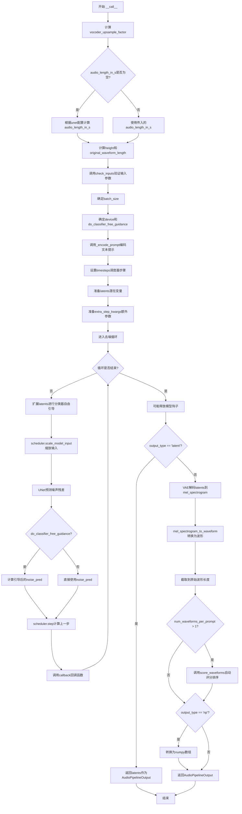

#### 带注释源码

```python
@torch.no_grad()
@replace_example_docstring(EXAMPLE_DOC_STRING)
def __call__(
    self,
    prompt: str | list[str] = None,
    audio_length_in_s: float | None = None,
    num_inference_steps: int = 200,
    guidance_scale: float = 2.0,
    negative_prompt: str | list[str] | None = None,
    num_waveforms_per_prompt: int | None = 1,
    eta: float = 0.0,
    generator: torch.Generator | list[torch.Generator] | None = None,
    latents: torch.Tensor | None = None,
    prompt_embeds: torch.Tensor | None = None,
    negative_prompt_embeds: torch.Tensor | None = None,
    return_dict: bool = True,
    callback: Callable[[int, int, torch.Tensor], None] | None = None,
    callback_steps: int | None = 1,
    cross_attention_kwargs: dict[str, Any] | None = None,
    output_type: str | None = "np",
):
    """
    Pipeline调用函数，用于从文本提示生成音频。
    """
    # 0. 将音频长度从秒转换为频谱图高度
    # 计算vocoder的上采样因子，用于确定频谱图尺寸
    vocoder_upsample_factor = np.prod(self.vocoder.config.upsample_rates) / self.vocoder.config.sampling_rate

    # 如果未指定音频长度，则根据模型配置计算默认长度
    if audio_length_in_s is None:
        audio_length_in_s = self.unet.config.sample_size * self.vae_scale_factor * vocoder_upsample_factor

    # 计算高度（频谱图的时间步数）
    height = int(audio_length_in_s / vocoder_upsample_factor)

    # 计算原始波形长度（采样率 × 时长）
    original_waveform_length = int(audio_length_in_s * self.vocoder.config.sampling_rate)
    
    # 调整高度以适配VAE的缩放因子
    if height % self.vae_scale_factor != 0:
        height = int(np.ceil(height / self.vae_scale_factor)) * self.vae_scale_factor
        logger.info(
            f"Audio length in seconds {audio_length_in_s} is increased to {height * vocoder_upsample_factor} "
            f"so that it can be handled by the model. It will be cut to {audio_length_in_s} after the "
            f"denoising process."
        )

    # 1. 验证输入参数
    self.check_inputs(
        prompt,
        audio_length_in_s,
        vocoder_upsample_factor,
        callback_steps,
        negative_prompt,
        prompt_embeds,
        negative_prompt_embeds,
    )

    # 2. 确定调用参数
    if prompt is not None and isinstance(prompt, str):
        batch_size = 1
    elif prompt is not None and isinstance(prompt, list):
        batch_size = len(prompt)
    else:
        batch_size = prompt_embeds.shape[0]

    # 获取执行设备
    device = self._execution_device
    
    # 判断是否使用分类器自由引导（guidance_scale > 1.0时启用）
    do_classifier_free_guidance = guidance_scale > 1.0

    # 3. 编码输入文本提示
    prompt_embeds = self._encode_prompt(
        prompt,
        device,
        num_waveforms_per_prompt,
        do_classifier_free_guidance,
        negative_prompt,
        prompt_embeds=prompt_embeds,
        negative_prompt_embeds=negative_prompt_embeds,
    )

    # 4. 准备时间步
    self.scheduler.set_timesteps(num_inference_steps, device=device)
    timesteps = self.scheduler.timesteps

    # 5. 准备潜在变量
    num_channels_latents = self.unet.config.in_channels
    latents = self.prepare_latents(
        batch_size * num_waveforms_per_prompt,
        num_channels_latents,
        height,
        prompt_embeds.dtype,
        device,
        generator,
        latents,
    )

    # 6. 准备额外的步骤参数
    extra_step_kwargs = self.prepare_extra_step_kwargs(generator, eta)

    # 7. 去噪循环
    num_warmup_steps = len(timesteps) - num_inference_steps * self.scheduler.order
    with self.progress_bar(total=num_inference_steps) as progress_bar:
        for i, t in enumerate(timesteps):
            # 如果使用分类器自由引导，则扩展latents（复制以处理条件和非条件）
            latent_model_input = torch.cat([latents] * 2) if do_classifier_free_guidance else latents
            latent_model_input = self.scheduler.scale_model_input(latent_model_input, t)

            # 预测噪声残差
            noise_pred = self.unet(
                latent_model_input,
                t,
                encoder_hidden_states=None,
                class_labels=prompt_embeds,
                cross_attention_kwargs=cross_attention_kwargs,
                return_dict=False,
            )[0]

            # 执行分类器自由引导
            if do_classifier_free_guidance:
                noise_pred_uncond, noise_pred_text = noise_pred.chunk(2)
                noise_pred = noise_pred_uncond + guidance_scale * (noise_pred_text - noise_pred_uncond)

            # 计算前一个噪声样本 x_t -> x_t-1
            latents = self.scheduler.step(noise_pred, t, latents, **extra_step_kwargs).prev_sample

            # 调用回调函数（如果提供）
            if i == len(timesteps) - 1 or ((i + 1) > num_warmup_steps and (i + 1) % self.scheduler.order == 0):
                progress_bar.update()
                if callback is not None and i % callback_steps == 0:
                    step_idx = i // getattr(self.scheduler, "order", 1)
                    callback(step_idx, t, latents)

            # 如果使用PyTorch XLA，则标记执行步骤
            if XLA_AVAILABLE:
                xm.mark_step()

    # 释放模型钩子
    self.maybe_free_model_hooks()

    # 8. 后处理
    if not output_type == "latent":
        # 将latents解码为梅尔频谱图
        latents = 1 / self.vae.config.scaling_factor * latents
        mel_spectrogram = self.vae.decode(latents).sample
    else:
        # 直接返回latents
        return AudioPipelineOutput(audios=latents)

    # 将梅尔频谱图转换为波形
    audio = self.mel_spectrogram_to_waveform(mel_spectrogram)

    # 截断到原始波形长度
    audio = audio[:, :original_waveform_length]

    # 9. 自动评分（当生成多个波形时）
    if num_waveforms_per_prompt > 1 and prompt is not None:
        audio = self.score_waveforms(
            text=prompt,
            audio=audio,
            num_waveforms_per_prompt=num_waveforms_per_prompt,
            device=device,
            dtype=prompt_embeds.dtype,
        )

    # 根据output_type转换输出格式
    if output_type == "np":
        audio = audio.numpy()

    # 返回结果
    if not return_dict:
        return (audio,)

    return AudioPipelineOutput(audios=audio)
```

## 关键组件


### MusicLDMPipeline

主类，负责文本到音频的生成，继承自DiffusionPipeline和StableDiffusionMixin，集成了VAE、文本编码器、分词器、特征提取器、UNet、调度器和声码器。

### 张量索引与惰性加载

在score_waveforms方法中使用torch.index_select对生成的音频波形进行索引排序，支持批量生成多个波形并根据文本-音频相似度排序选择最优结果。

### 反量化支持

mel_spectrogram_to_waveform方法中将声码器输出的波形统一转换为float32类型，确保与bfloat16等低精度格式的兼容性，同时保持CPU计算兼容性。

### 量化策略

通过guidance_scale参数控制分类器自由引导强度，支持在生成过程中对无条件和有条件噪声预测进行加权融合，实现文本条件的精确控制。

### 文本编码模块

_encode_prompt方法负责将文本提示编码为文本嵌入向量，支持批量处理、负向提示、分类器自由引导和预计算嵌入。

### VAE编解码器

prepare_latents方法生成初始噪声潜变量，decode方法将去噪后的潜变量转换为梅尔频谱图，vae_scale_factor根据VAE的block_out_channels动态计算。

### 扩散调度器

通过set_timesteps设置去噪步骤，在去噪循环中调用scheduler.step进行噪声预测和样本更新，支持多种调度器配置。

### 声码器转换

mel_spectrogram_to_waveform将梅尔频谱图转换为最终波形音频，使用SpeechT5HifiGan声码器并裁剪到原始波形长度。

### 自动评分排序

score_waveforms利用librosa重采样和CLAP模型计算文本-音频相似度，对多个生成的波形进行排序，筛选出最符合文本描述的音频结果。

## 问题及建议


### 已知问题

-   **`_encode_prompt`方法使用`get_text_features`可能不准确**：代码中使用`self.text_encoder.get_text_features()`获取文本嵌入，但对于CLAP模型，应该使用完整的forward方法以获得更准确的文本-音频联合嵌入，当前实现可能无法充分利用CLAP模型的联合表示能力。

-   **`enable_model_cpu_offload`方法中模型序列重复**：在`model_sequence`列表中同时包含了`self.text_encoder.text_model`、`self.text_encoder.text_projection`和完整的`self.text_encoder`，这会导致text_encoder被重复offload，可能造成内存管理问题或意外行为。

-   **`__call__`方法中UNet调用参数使用不当**：使用`class_labels=prompt_embeds`传递文本嵌入，而不是标准的`encoder_hidden_states`参数。这与大多数DiffusionPipeline的实现不一致，可能导致UNet无法正确利用文本条件信息。

-   **`score_waveforms`方法存在数据处理风险**：使用`list(resampled_audio)`将numpy数组转换为列表后再处理，可能导致内存占用增加和性能下降，应保持numpy数组格式直接处理。

-   **缺少必要的设备类型检查**：在`enable_model_cpu_offload`方法中，当设备不是"cpu"时调用`self.to("cpu")`，但没有检查设备是否支持XLA或CUDA，可能导致在某些环境下失败。

-   **音频长度计算可能不精确**：在计算`height`时使用`int(audio_length_in_s / vocoder_upsample_factor)`，浮点数除法可能引入精度问题，后续又进行多次向上取整调整，逻辑复杂且可能导致不必要的内存分配。

-   **全局变量XLA_AVAILABLE使用不当**：在模块级别定义`XLA_AVAILABLE`，但在实际使用时检查`if XLA_AVAILABLE:`，如果XLA在模块加载后可用，变量不会更新，导致XLA优化永远不生效。

### 优化建议

-   **重构`_encode_prompt`方法**：使用`self.text_encoder(**inputs)`代替`get_text_features()`，并从返回结果中提取文本嵌入，以获得CLAP模型的完整文本-音频联合表示能力。

-   **修复`enable_model_cpu_offload`模型序列**：从`model_sequence`中移除`self.text_encoder`，只保留`self.text_encoder.text_model`和`self.text_encoder.text_projection`，避免重复offload。

-   **修正UNet调用参数**：将`class_labels=prompt_embeds`改为`encoder_hidden_states=prompt_embeds`，与标准DiffusionPipeline接口保持一致。

-   **优化`score_waveforms`数据处理**：保持numpy数组格式，直接将`resampled_audio`数组传递给feature_extractor，避免不必要的列表转换。

-   **添加运行时设备检查**：在使用XLA相关功能前，重新检查XLA可用性，或使用`is_torch_xla_available()`函数动态判断。

-   **简化音频长度计算逻辑**：使用更精确的整数运算代替浮点数除法，避免累积的精度误差。

-   **增强输入验证**：添加对`guidance_scale`范围、负值`num_inference_steps`、无效`output_type`等的验证，提供更友好的错误提示。

-   **考虑添加缓存机制**：对于频繁调用的模块（如tokenizer），可以添加结果缓存以减少重复计算。


## 其它


### 设计目标与约束

**主要设计目标：**
实现文本到音频（Text-to-Audio）生成功能，通过MusicLDM模型将自然语言描述转换为音频波形。核心目标是为用户提供一个端到端的文本到音频生成pipeline，能够根据文字描述生成对应的音频内容。

**性能约束：**
- 默认推理步数为200步，可在质量和速度间权衡调整
- 音频长度默认10.24秒，通过audio_length_in_s参数控制
- guidance_scale默认2.0，用于平衡文本相关性生成
- 支持生成多个波形（num_waveforms_per_prompt）并进行自动评分排序

**兼容性约束：**
- 依赖PyTorch作为深度学习后端
- 支持CUDA设备加速推理
- 支持Apple Silicon (MPS) 设备
- 支持XLA设备加速（可选）

**输入约束：**
- prompt必须为字符串或字符串列表
- audio_length_in_s必须大于等于最小音频长度（vocoder_upsample_factor * vae_scale_factor）
- callback_steps必须为正整数

### 错误处理与异常设计

**输入验证（check_inputs方法）：**
- 音频长度验证：audio_length_in_s必须为正数且大于等于最小允许值
- 频谱_bins验证：vocoder的log-mel spectrogram的bins数必须能被VAE scale factor整除
- callback_steps验证：必须为正整数
- prompt类型验证：必须为str或list类型
- prompt与prompt_embeds互斥：不能同时提供
- negative_prompt与negative_prompt_embeds互斥：不能同时提供
- embeds形状匹配：prompt_embeds和negative_prompt_embeds必须形状一致
- batch_size匹配：negative_prompt的batch_size必须与prompt一致

**依赖检查：**
- librosa库缺失时，score_waveforms方法会记录info级别日志并按生成顺序返回音频，不抛出异常
- accelerate库版本检查：enable_model_cpu_offload需要accelerate v0.17.0及以上版本，版本不符时抛出ImportError
- torch_xla可用性检查：用于XLA设备支持

**类型检查：**
- negative_prompt类型必须与prompt类型一致，否则抛出TypeError
- generator列表长度必须与batch_size匹配，否则抛出ValueError

**运行时错误处理：**
- tokenizer截断警告：当输入文本超过CLAP模型最大token长度时，记录warning并截断
- 音频长度调整：当计算的height不能被vae_scale_factor整除时，自动调整并记录info日志

### 数据流与状态机

**整体数据流：**

```
1. 输入处理阶段
   ├── prompt/negative_prompt -> tokenize -> text_encoder -> prompt_embeds/negative_prompt_embeds
   └── audio_length_in_s -> 计算height和original_waveform_length

2. 潜在变量准备阶段
   ├── batch_size * num_waveforms_per_prompt
   ├── num_channels_latents = unet.config.in_channels
   └── randn_tensor生成噪声latents

3. 去噪循环阶段（迭代num_inference_steps次）
   ├── latent_model_input = concat(latents, latents) [当使用CFG时]
   ├── scheduler.scale_model_input()
   ├── unet.predict(noise_pred)
   ├── classifier_free_guidance计算
   └── scheduler.step() -> 更新latents

4. 后处理阶段
   ├── VAE decode: latents -> mel_spectrogram
   ├── vocoder: mel_spectrogram -> waveform
   └── 裁剪到原始波形长度

5. 自动评分阶段（可选）
   └── score_waveforms: 重新采样 + CLAP评分排序
```

**状态转换：**

```
INITIAL -> ENCODING_PROMPT -> PREPARING_LATENTS -> DENOISING -> POSTPROCESSING -> SCORING -> COMPLETED

- INITIAL: 管道初始化完成，等待调用
- ENCODING_PROMPT: 正在编码文本提示词
- PREPARING_LATENTS: 正在准备噪声潜在变量
- DENOISING: 处于去噪循环中
- POSTPROCESSING: 正在进行VAE解码和vocoder转换
- SCORING: 正在进行自动评分（仅当num_waveforms_per_prompt > 1）
- COMPLETED: 生成完成，返回结果
```

### 外部依赖与接口契约

**核心依赖：**

| 依赖包 | 版本要求 | 用途 |
|--------|----------|------|
| torch | ≥1.9.0 | 深度学习框架 |
| transformers | 最新版 | CLAP文本编码器、Tokenizer、FeatureExtractor、Vocoder |
| diffusers | 最新版 | 基础Pipeline类、VAE、UNet、Scheduler |
| numpy | 最新版 | 数值计算 |
| accelerate | ≥0.17.0 | 模型CPU卸载 |
| librosa | 可选 | 音频重采样和评分 |

**模型组件接口契约：**

| 组件 | 类型 | 输入 | 输出 |
|------|------|------|------|
| text_encoder | ClapTextModelWithProjection/ClapModel | input_ids, attention_mask | text_features (文本特征) |
| tokenizer | RobertaTokenizer/RobertaTokenizerFast | text string | input_ids, attention_mask |
| feature_extractor | ClapFeatureExtractor | audio waveform | input_features (mel-spectrogram) |
| unet | UNet2DConditionModel | latents, timestep, class_labels | noise_pred |
| vae | AutoencoderKL | latents | mel_spectrogram |
| vocoder | SpeechT5HifiGan | mel_spectrogram | waveform |
| scheduler | KarrasDiffusionSchedulers | noise_pred, timestep, latents | previous_sample |

**Pipeline公共接口：**

| 方法 | 职责 | 关键参数 |
|------|------|----------|
| __call__ | 主生成方法 | prompt, audio_length_in_s, num_inference_steps, guidance_scale等 |
| _encode_prompt | 编码文本提示 | prompt, device, do_classifier_free_guidance等 |
| check_inputs | 输入验证 | prompt, audio_length_in_s, callback_steps等 |
| prepare_latents | 准备潜在变量 | batch_size, num_channels_latents, height等 |
| prepare_extra_step_kwargs | 准备调度器参数 | generator, eta |
| mel_spectrogram_to_waveform | 频谱转波形 | mel_spectrogram |
| score_waveforms | 音频评分排序 | text, audio, num_waveforms_per_prompt等 |
| enable_model_cpu_offload | CPU卸载 | gpu_id |

**输出格式：**

| output_type | 返回格式 |
|-------------|----------|
| "np" | numpy.ndarray |
| "pt" | torch.Tensor |
| "latent" | AudioPipelineOutput (latents) |

### 回调机制与扩展性设计

**回调接口：**
- callback函数签名：callback(step: int, timestep: int, latents: torch.Tensor) -> None
- callback_steps：每多少步调用一次回调
- 在去噪循环的warmup步骤之后、scheduler order边界处调用

**模型卸载：**
- enable_model_cpu_offload：使用accelerate的cpu_offload_with_hook实现模型按需加载
- 卸载顺序：text_encoder.text_model -> text_encoder.text_projection -> unet -> vae -> vocoder -> text_encoder
- maybe_free_model_hooks：完成后自动释放模型钩子

**进度报告：**
- 使用progress_bar显示去噪进度
- num_warmup_steps = len(timesteps) - num_inference_steps * scheduler.order

### 配置与常量

**版本信息：**
- _last_supported_version = "0.33.1"：最后支持的pipeline版本

**Example文档字符串：**
- 包含完整的代码示例，展示从模型加载到音频保存的完整流程

**日志记录：**
- 使用logger = logging.get_logger(__name__)进行日志输出
- 支持info、warning、error级别日志

    