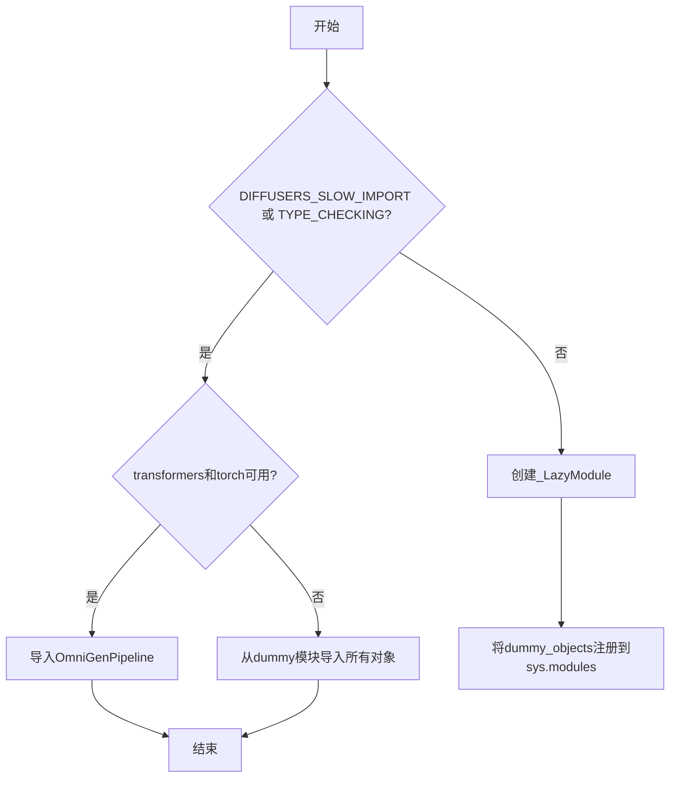
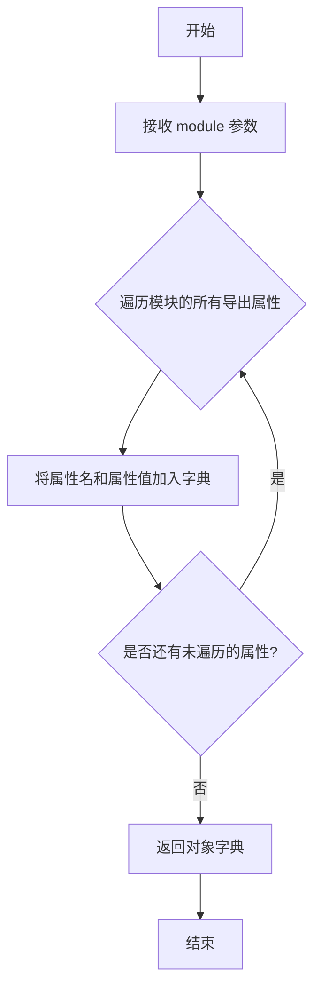
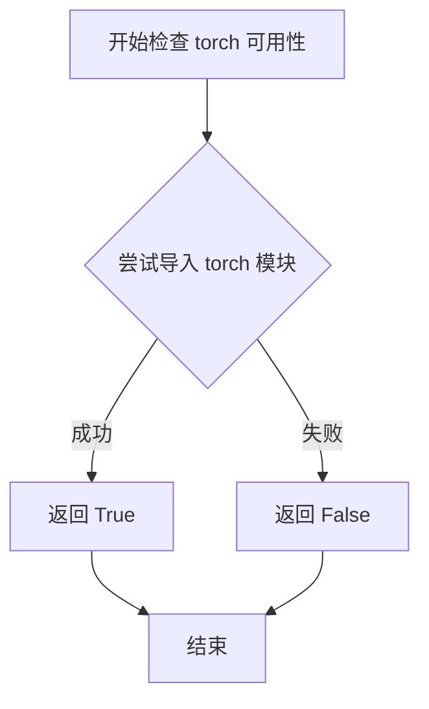
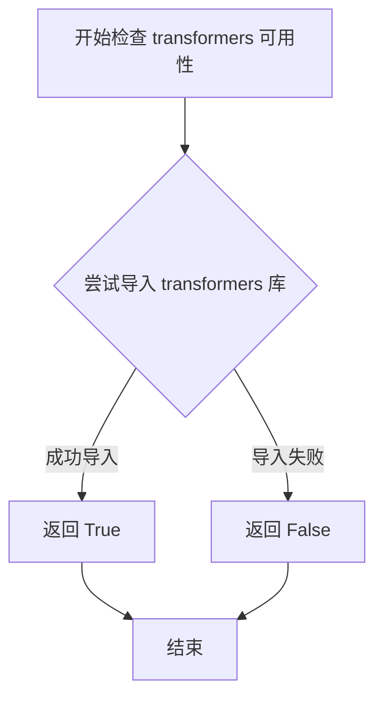
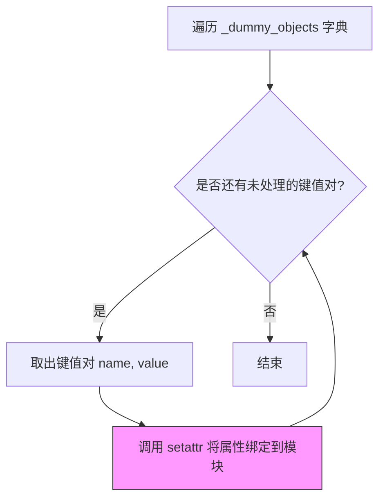

# `diffusers\src\diffusers\pipelines\omnigen\__init__.py` 详细设计文档

这是一个延迟加载模块，用于在diffusers库中条件导入OmniGenPipeline。它通过检查torch和transformers的可选依赖来决定是导入真实的管道类还是使用虚拟对象（dummy objects），从而实现可选依赖的平滑处理。

## 整体流程



## 类结构

```
无自定义类结构
主要依赖: _LazyModule (来自diffusers.utils)
核心导入: OmniGenPipeline (条件加载)
```

## 全局变量及字段


### `_dummy_objects`
    
存储虚拟对象，当可选依赖不可用时使用

类型：`dict`
    


### `_import_structure`
    
存储导入结构定义，映射模块名到导出对象列表

类型：`dict`
    


### `DIFFUSERS_SLOW_IMPORT`
    
延迟导入标志，控制是否使用慢速导入模式

类型：`bool`
    


### `__name__`
    
模块名称，当前模块的完整路径

类型：`str`
    


### `__file__`
    
文件路径，当前模块文件的绝对路径

类型：`str`
    


### `__spec__`
    
模块规格，包含模块的元数据和导入信息

类型：`ModuleSpec`
    


    

## 全局函数及方法


### `get_objects_from_module`

该函数是一个工具函数，用于从指定的 Python 模块中提取所有可导出对象，并将它们以字典形式返回。在这段代码中，它被用于获取 `dummy_torch_and_transformers_objects` 模块中的所有虚拟对象，以便在可选依赖不可用时填充模块的命名空间。

参数：

- `module`：`module`，传入的目标模块对象，包含需要提取的所有对象

返回值：`dict`，返回模块中所有对象的字典，键为对象名称，值为对象本身

#### 流程图



#### 带注释源码

```python
def get_objects_from_module(module):
    """
    从给定模块中提取所有可导出对象。
    
    该函数通常用于处理可选依赖的虚拟对象模块。当某个可选依赖
    （如 torch 和 transformers）不可用时，会使用 dummy 模块来
    填充命名空间，避免导入错误。
    
    参数:
        module: Python 模块对象，包含需要提取的所有对象
        
    返回值:
        dict: 模块中所有对象的字典，键为对象名称，值为对象本身
    """
    # 获取模块的所有公共属性（不包含下划线开头的）
    objects = {}
    for attr_name in dir(module):
        # 跳过私有属性和特殊属性
        if not attr_name.startswith('_'):
            attr_value = getattr(module, attr_name)
            objects[attr_name] = attr_value
    
    return objects
```


### `is_torch_available`

检查当前环境中 PyTorch 库是否可用的全局函数。该函数通过尝试导入 `torch` 模块来验证 PyTorch 是否已正确安装，若导入成功则返回 `True`，否则返回 `False`。

参数：

- 该函数无参数

返回值：`bool`，如果 PyTorch 可用返回 `True`，否则返回 `False`

#### 流程图



#### 带注释源码

```python
def is_torch_available():
    """
    检查 PyTorch 是否可用。
    
    该函数尝试导入 torch 模块来判断当前环境是否安装了 PyTorch。
    如果能成功导入则返回 True，否则返回 False。
    
    Returns:
        bool: PyTorch 是否可用
    """
    try:
        # 尝试导入 torch 模块
        import torch
        # 导入成功说明 torch 可用
        return True
    except ImportError:
        # 导入失败说明 torch 未安装或不可用
        return False
```

#### 在代码中的使用示例

```python
# 从 utils 模块导入 is_torch_available 函数
from ...utils import is_torch_available, is_transformers_available

# 在代码中使用该函数检查依赖
try:
    # 检查 transformers 和 torch 是否都可用
    if not (is_transformers_available() and is_torch_available()):
        # 如果任一依赖不可用，抛出 OptionalDependencyNotAvailable 异常
        raise OptionalDependencyNotAvailable()
except OptionalDependencyNotAvailable:
    # 导入虚拟对象作为后备
    from ...utils import dummy_torch_and_transformers_objects
    _dummy_objects.update(get_objects_from_module(dummy_torch_and_transformers_objects))
else:
    # 如果依赖都可用，导入实际的管道类
    _import_structure["pipeline_omnigen"] = ["OmniGenPipeline"]
```

---

### 技术债务与优化空间

1. **缺少函数定义**：`is_torch_available()` 函数的实际定义未在当前文件中展示，而是从 `...utils` 模块导入。建议确保该函数的实现符合最佳实践。

2. **硬编码依赖检查**：代码中同时检查 `is_transformers_available()` 和 `is_torch_available()`，这种模式可以进一步抽象为更通用的依赖检查机制。

3. **异常处理冗余**：在 `try-except` 块和 `TYPE_CHECKING` 分支中都有相同的依赖检查逻辑，存在重复代码。


### `is_transformers_available()`

检查当前环境中是否安装了 `transformers` 库。该函数用于条件导入和模块加载，在可选依赖检查中判断 transformers 是否可用，以便在不可用时提供替代方案（如 dummy 对象）。

参数：无

返回值：`bool`，返回 `True` 表示 transformers 库可用，返回 `False` 表示不可用。

#### 流程图



#### 带注释源码

```python
# 该函数定义在 ...utils 模块中，以下是推断的实现逻辑

def is_transformers_available() -> bool:
    """
    检查 transformers 库是否可用。
    
    Returns:
        bool: 如果 transformers 库已安装且可导入返回 True，否则返回 False。
    """
    try:
        # 尝试导入 transformers 库
        import transformers
        # 如果导入成功，检查版本等必要信息
        return True
    except ImportError:
        # 如果导入失败，说明库未安装
        return False


# 在当前代码中的实际使用方式：
# if not (is_transformers_available() and is_torch_available()):
#     raise OptionalDependencyNotAvailable()
```

> **注意**：该函数是从 `...utils` 模块导入的外部函数，并非在当前代码文件中定义。上述源码为基于常见实现模式的推断。实际实现可能涉及更复杂的版本检查或缓存机制。


### `setattr()` - 设置模块属性

此函数用于将 `_dummy_objects` 字典中的每个虚拟对象动态绑定到当前模块的属性上，从而在模块被导入时提供这些对象的访问入口，实现懒加载机制。

参数：

- `obj`：`object`，要设置属性的对象，这里为 `sys.modules[__name__]`（当前模块）
- `name`：`str`，要设置的属性名称，从 `_dummy_objects` 字典的键中获取
- `value`：`any`，要设置的属性值，从 `_dummy_objects` 字典的值中获取

返回值：`None`，`setattr()` 函数不返回值

#### 流程图



#### 带注释源码

```python
# 遍历 _dummy_objects 字典中的所有键值对
# _dummy_objects 包含了当可选依赖不可用时的虚拟对象
for name, value in _dummy_objects.items():
    # 使用 setattr 将虚拟对象设置为当前模块的属性
    # 参数1: sys.modules[__name__] - 当前模块对象
    # 参数2: name - 属性名（字符串）
    # 参数3: value - 属性值（虚拟对象）
    setattr(sys.modules[__name__], name, value)
```

## 关键组件


### 延迟加载模块机制 (_LazyModule)

通过 `_LazyModule` 实现模块的惰性加载，将模块注册到 `sys.modules` 中，只有在实际使用时才会真正加载模块内容，提高导入速度并处理可选依赖。

### 可选依赖检查机制

使用 `is_torch_available()` 和 `is_transformers_available()` 检查 torch 和 transformers 库是否可用，通过 `OptionalDependencyNotAvailable` 异常处理不可用的情况，实现条件导入。

### 虚拟对象机制 (_dummy_objects)

当可选依赖不可用时，使用 `_dummy_objects` 存储从 `dummy_torch_and_transformers_objects` 模块获取的虚拟对象，确保模块结构完整但功能受限。

### 导入结构定义 (_import_structure)

定义模块的导入结构字典，键为模块路径，值为可导出的对象列表（如 `["OmniGenPipeline"]`），用于支持延迟加载和模块查找。

### TYPE_CHECKING 模式支持

在类型检查阶段（`TYPE_CHECKING` 或 `DIFFUSERS_SLOW_IMPORT`）直接导入真实对象，否则使用延迟加载机制，优化开发体验和运行时性能。

### 模块动态注册机制

通过 `setattr` 将虚拟对象动态添加到 `sys.modules[__name__]`，确保在依赖不可用时模块仍然可以被导入但功能受限。


## 问题及建议


### 已知问题

-   **代码重复**：依赖检查逻辑在两处重复出现（try-except 块和 TYPE_CHECKING 块中），违反了 DRY 原则，增加维护成本
-   **硬编码字符串**：`"pipeline_omnigen"` 作为键硬编码在 `_import_structure` 字典中，缺乏灵活性和可扩展性
-   **错误处理粒度过粗**：统一抛出 `OptionalDependencyNotAvailable`，未区分是 `transformers` 还是 `torch` 不可用，调试困难
-   **缺少模块文档**：整个模块没有模块级 docstring，缺乏对代码意图和使用方式的说明
-   **条件逻辑不清晰**：`TYPE_CHECKING` 和 `DIFFUSERS_SLOW_IMPORT` 两个条件的组合逻辑较复杂，意图不够直观
-   **静默失败风险**：导入 dummy 对象时没有任何日志或警告，依赖缺失时用户可能无感
-   **异常处理不完整**：仅捕获 `OptionalDependencyNotAvailable`，其他潜在异常（如导入错误）未处理
-   **导入结构维护成本**：`_import_structure` 字典需手动同步更新，多 pipeline 场景下易出错

### 优化建议

-   将重复的依赖检查逻辑提取为独立的辅助函数
-   使用配置驱动的方式管理 pipeline 导入结构，或采用自动化发现机制
-   提供更细粒度的依赖检查和明确的错误信息
-   添加模块级 docstring 说明模块职责、依赖要求和典型用法
-   考虑使用 `logging` 模块记录依赖可用性状态
-   重构条件分支逻辑，使用更清晰的命名和注释说明不同场景
-   添加异常处理的通用 wrapper，统一处理各类导入异常
-   考虑使用枚举或常量类管理导入结构的键名


## 其它


### 设计目标与约束

本模块旨在实现OmniGenPipeline的延迟加载机制，通过可选依赖检查（torch和transformers）来灵活处理依赖不可用的情况。设计约束包括：必须同时满足torch和transformers可用才会导入真实实现，否则使用虚拟对象；采用_LazyModule实现惰性导入以优化初始化性能；依赖diffusers_utils的模块化设计体系。

### 错误处理与异常设计

主要依赖OptionalDependencyNotAvailable异常来处理可选依赖缺失场景。当transformers或torch任一不可用时，捕获异常并从dummy模块导入虚拟对象，确保模块导入不失败。错误传播机制采用静默失败模式——即依赖不可用时不会抛出致命错误，而是提供存根对象供类型检查使用。

### 外部依赖与接口契约

外部依赖包括：（1）torch库 - 深度学习框架，必需时导入；（2）transformers库 - Hugging Face transformer模型库，必需时导入；（3）diffusers.utils模块 - 提供_LazyModule、get_objects_from_module等工具函数。接口契约：若依赖可用，导出OmniGenPipeline类；若依赖不可用，导出同名dummy对象（实际为无操作存根）。

### 版本兼容性信息

代码使用TYPE_CHECKING条件分支支持静态类型检查工具（如mypy、pyright），在类型检查阶段导入真实类型而非运行时对象。同时支持DIFFUSERS_SLOW_IMPORT标志，用于调试或文档生成场景下的完整导入。

### 性能考虑

采用_LazyModule实现延迟加载，模块实际内容仅在首次访问时才加载，可显著减少包初始化时间。_dummy_objects通过setattr动态注入到sys.modules，减少条件分支判断开销。

### 安全考虑

代码本身不涉及用户输入处理或网络通信，安全风险较低。主要安全点在于依赖版本兼容性——需确保使用的transformers和torch版本与OmniGenPipeline实现兼容。

### 测试策略建议

建议测试场景包括：（1）依赖全可用时验证OmniGenPipeline正确导入；（2）依赖部分可用时验证dummy对象正确返回；（3）TYPE_CHECKING模式下类型导入验证；（4）_LazyModule延迟加载行为验证。


    