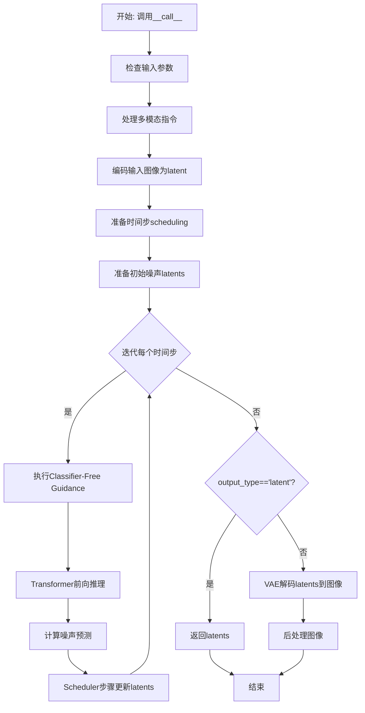
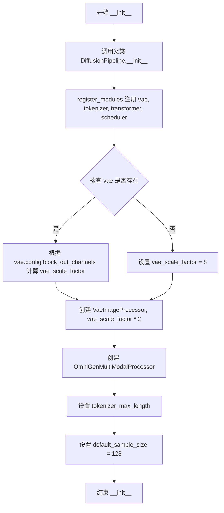
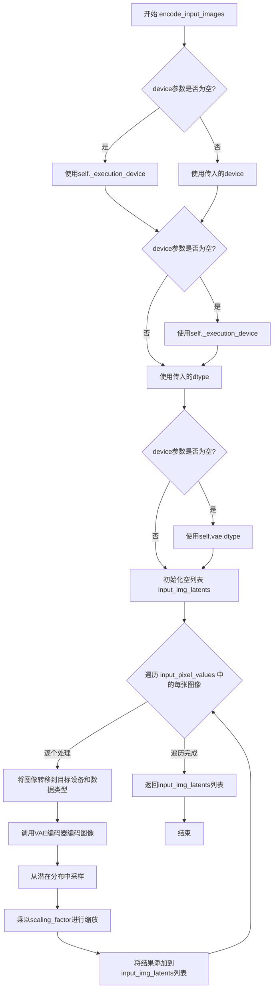
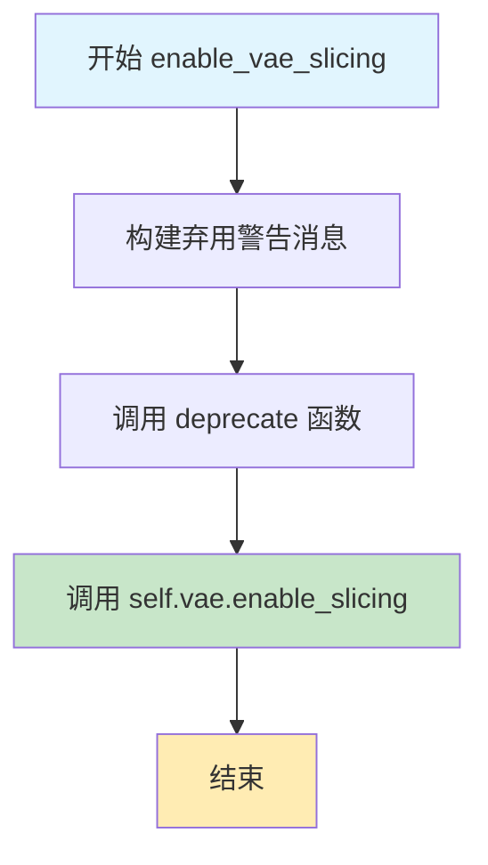
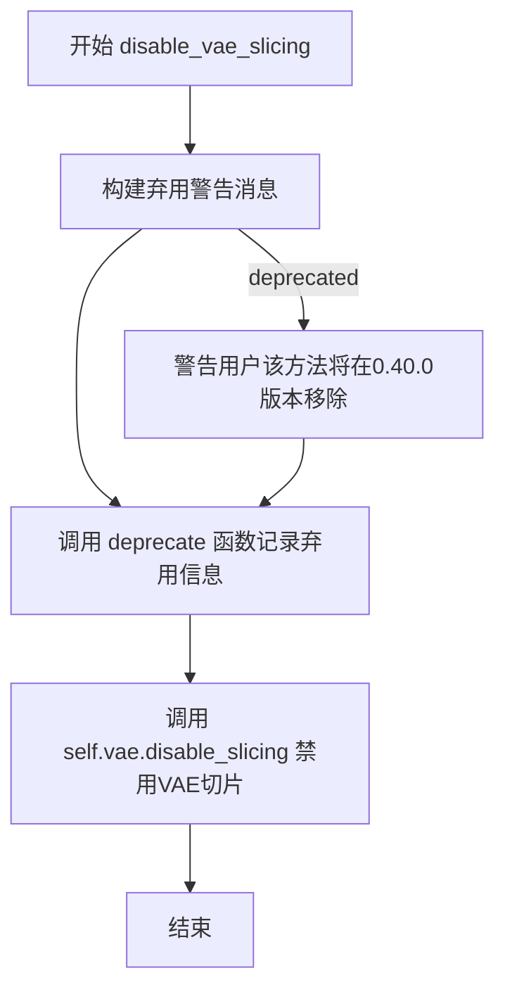
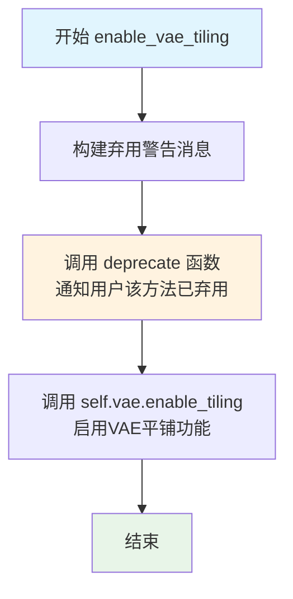
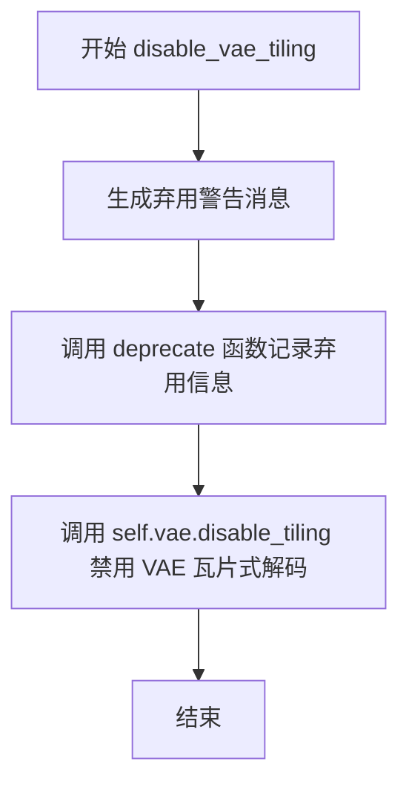
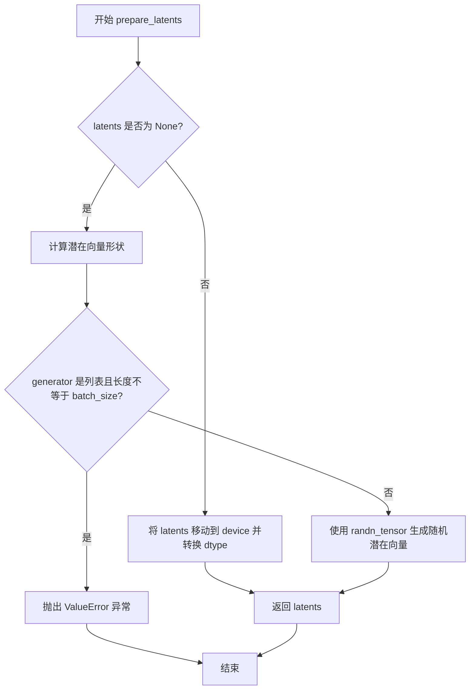
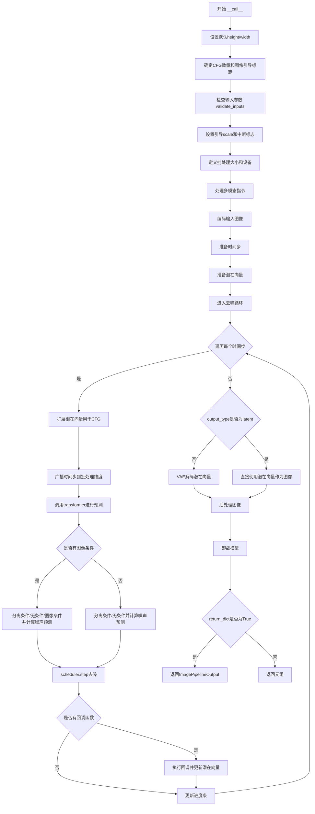

# `diffusers\src\diffusers\pipelines\omnigen\pipeline_omnigen.py` 详细设计文档

OmniGenPipeline是一个多模态到图像生成的扩散管道，结合文本提示和输入图像通过Transformer模型和VAE解码器生成高质量图像。

## 整体流程



## 类结构

```
DiffusionPipeline (基类)
└── OmniGenPipeline
    ├── 依赖模块: OmniGenTransformer2DModel
    ├── 依赖模块: AutoencoderKL (VAE)
    ├── 依赖模块: FlowMatchEulerDiscreteScheduler
    ├── 依赖模块: LlamaTokenizer
    └── 依赖模块: OmniGenMultiModalProcessor
```

## 全局变量及字段


### `EXAMPLE_DOC_STRING`
    
示例文档字符串，包含pipeline使用示例的Markdown格式文档

类型：`str`
    


### `logger`
    
日志记录器，用于输出pipeline运行时的日志信息

类型：`logging.Logger`
    


### `XLA_AVAILABLE`
    
XLA可用性标志，标识PyTorch XLA是否可用

类型：`bool`
    


### `OmniGenPipeline.model_cpu_offload_seq`
    
CPU卸载顺序，指定模型组件卸载到CPU的顺序

类型：`str`
    


### `OmniGenPipeline._optional_components`
    
可选组件列表，定义pipeline中可选的组件

类型：`list`
    


### `OmniGenPipeline._callback_tensor_inputs`
    
回调张量输入列表，指定在推理步骤结束回调中可用的张量

类型：`list`
    


### `OmniGenPipeline.vae`
    
VAE模型，用于编码和解码图像的变分自编码器

类型：`AutoencoderKL`
    


### `OmniGenPipeline.tokenizer`
    
文本分词器，用于将文本输入转换为token序列

类型：`LlamaTokenizer`
    


### `OmniGenPipeline.transformer`
    
Transformer模型，OmniGen的核心去噪transformer

类型：`OmniGenTransformer2DModel`
    


### `OmniGenPipeline.scheduler`
    
调度器，用于控制扩散过程的噪声调度

类型：`FlowMatchEulerDiscreteScheduler`
    


### `OmniGenPipeline.vae_scale_factor`
    
VAE缩放因子，用于计算潜在空间的缩放比例

类型：`int`
    


### `OmniGenPipeline.image_processor`
    
图像处理器，用于处理VAE的输入输出图像

类型：`VaeImageProcessor`
    


### `OmniGenPipeline.multimodal_processor`
    
多模态处理器，用于处理文本和图像的多模态输入

类型：`OmniGenMultiModalProcessor`
    


### `OmniGenPipeline.tokenizer_max_length`
    
分词器最大长度，tokenizer支持的最大序列长度

类型：`int`
    


### `OmniGenPipeline.default_sample_size`
    
默认采样尺寸，生成图像的默认尺寸参数

类型：`int`
    
    

## 全局函数及方法


### `retrieve_timesteps`

该函数是一个全局工具函数，用于调用调度器的 `set_timesteps` 方法并从中获取时间步调度序列，支持自定义时间步或 sigmas，并返回时间步张量和推理步数。

参数：

- `scheduler`：`SchedulerMixin`，调度器对象，用于获取时间步
- `num_inference_steps`：`int | None`，推理步数，当使用预训练模型生成样本时使用，若指定则 `timesteps` 必须为 `None`
- `device`：`str | torch.device | None`，时间步要移动到的设备，若为 `None` 则不移动
- `timesteps`：`list[int] | None`，自定义时间步，用于覆盖调度器的时间步间隔策略，若传入则 `num_inference_steps` 和 `sigmas` 必须为 `None`
- `sigmas`：`list[float] | None`，自定义 sigmas，用于覆盖调度器的时间步间隔策略，若传入则 `num_inference_steps` 和 `timesteps` 必须为 `None`
- `**kwargs`：任意关键字参数，将传递给 `scheduler.set_timesteps`

返回值：`tuple[torch.Tensor, int]`，元组第一个元素是调度器的时间步调度序列，第二个元素是推理步数

#### 流程图

```mermaid
flowchart TD
    A[开始] --> B{timesteps 和 sigmas<br/>是否同时非空?}
    B -->|是| C[抛出 ValueError:<br/>只能选择其中一个]
    B -->|否| D{timesteps 非空?}
    D -->|是| E{scheduler.set_timesteps<br/>是否接受 timesteps?}
    E -->|否| F[抛出 ValueError:<br/>当前调度器不支持自定义时间步]
    E -->|是| G[调用 scheduler.set_timesteps<br/>timesteps=timesteps, device=device]
    G --> H[获取 scheduler.timesteps]
    H --> I[计算 num_inference_steps<br/>len(timesteps)]
    D -->|否| J{sigmas 非空?}
    J -->|是| K{scheduler.set_timesteps<br/>是否接受 sigmas?}
    K -->|否| L[抛出 ValueError:<br/>当前调度器不支持自定义 sigmas]
    K -->|是| M[调用 scheduler.set_timesteps<br/>sigmas=sigmas, device=device]
    M --> N[获取 scheduler.timesteps]
    N --> O[计算 num_inference_steps<br/>len(timesteps)]
    J -->|否| P[调用 scheduler.set_timesteps<br/>num_inference_steps, device=device]
    P --> Q[获取 scheduler.timesteps]
    Q --> R[返回 timesteps 和<br/>num_inference_steps]
    I --> R
    O --> R
    C --> Z[结束]
    F --> Z
    L --> Z
```

#### 带注释源码

```python
# Copied from diffusers.pipelines.stable_diffusion.pipeline_stable_diffusion.retrieve_timesteps
def retrieve_timesteps(
    scheduler,
    num_inference_steps: int | None = None,
    device: str | torch.device | None = None,
    timesteps: list[int] | None = None,
    sigmas: list[float] | None = None,
    **kwargs,
):
    r"""
    Calls the scheduler's `set_timesteps` method and retrieves timesteps from the scheduler after the call. Handles
    custom timesteps. Any kwargs will be supplied to `scheduler.set_timesteps`.

    Args:
        scheduler (`SchedulerMixin`):
            The scheduler to get timesteps from.
        num_inference_steps (`int`):
            The number of diffusion steps used when generating samples with a pre-trained model. If used, `timesteps`
            must be `None`.
        device (`str` or `torch.device`, *optional*):
            The device to which the timesteps should be moved to. If `None`, the timesteps are not moved.
        timesteps (`list[int]`, *optional*):
            Custom timesteps used to override the timestep spacing strategy of the scheduler. If `timesteps` is passed,
            `num_inference_steps` and `sigmas` must be `None`.
        sigmas (`list[float]`, *optional*):
            Custom sigmas used to override the timestep spacing strategy of the scheduler. If `sigmas` is passed,
            `num_inference_steps` and `timesteps` must be `None`.

    Returns:
        `tuple[torch.Tensor, int]`: A tuple where the first element is the timestep schedule from the scheduler and the
        second element is the number of inference steps.
    """
    # 检查不能同时指定 timesteps 和 sigmas，只能选择其中一种自定义方式
    if timesteps is not None and sigmas is not None:
        raise ValueError("Only one of `timesteps` or `sigmas` can be passed. Please choose one to set custom values")
    
    # 处理自定义 timesteps 的情况
    if timesteps is not None:
        # 使用 inspect 检查 scheduler.set_timesteps 是否支持 timesteps 参数
        accepts_timesteps = "timesteps" in set(inspect.signature(scheduler.set_timesteps).parameters.keys())
        if not accepts_timesteps:
            raise ValueError(
                f"The current scheduler class {scheduler.__class__}'s `set_timesteps` does not support custom"
                f" timestep schedules. Please check whether you are using the correct scheduler."
            )
        # 调用调度器的 set_timesteps 方法设置自定义时间步
        scheduler.set_timesteps(timesteps=timesteps, device=device, **kwargs)
        # 从调度器获取更新后的时间步
        timesteps = scheduler.timesteps
        # 计算推理步数
        num_inference_steps = len(timesteps)
    # 处理自定义 sigmas 的情况
    elif sigmas is not None:
        # 使用 inspect 检查 scheduler.set_timesteps 是否支持 sigmas 参数
        accept_sigmas = "sigmas" in set(inspect.signature(scheduler.set_timesteps).parameters.keys())
        if not accept_sigmas:
            raise ValueError(
                f"The current scheduler class {scheduler.__class__}'s `set_timesteps` does not support custom"
                f" sigmas schedules. Please check whether you are using the correct scheduler."
            )
        # 调用调度器的 set_timesteps 方法设置自定义 sigmas
        scheduler.set_timesteps(sigmas=sigmas, device=device, **kwargs)
        # 从调度器获取更新后的时间步
        timesteps = scheduler.timesteps
        # 计算推理步数
        num_inference_steps = len(timesteps)
    # 使用默认推理步数的情况
    else:
        scheduler.set_timesteps(num_inference_steps, device=device, **kwargs)
        timesteps = scheduler.timesteps
    
    # 返回时间步张量和推理步数
    return timesteps, num_inference_steps
```


### OmniGenPipeline.__init__

OmniGenPipeline类的初始化方法，负责接收并注册Transformer模型、调度器、VAE模型和分词器等核心组件，同时初始化图像处理器和多模态处理器，并设置相关的配置参数。

参数：

- `transformer`：`OmniGenTransformer2DModel`，OmniGen的自回归Transformer架构，用于生成图像
- `scheduler`：`FlowMatchEulerDiscreteScheduler`，与Transformer配合使用的调度器，用于去噪图像潜在表示
- `vae`：`AutoencoderKL`，变分自编码器模型，用于编码和解码图像与潜在表示之间的转换
- `tokenizer`：`LlamaTokenizer`，文本分词器，用于处理输入的文本提示

返回值：`None`，构造函数不返回任何值

#### 流程图



#### 带注释源码

```python
def __init__(
    self,
    transformer: OmniGenTransformer2DModel,          # OmniGen Transformer模型
    scheduler: FlowMatchEulerDiscreteScheduler,      # 流量匹配欧拉离散调度器
    vae: AutoencoderKL,                               # 变分自编码器
    tokenizer: LlamaTokenizer,                       # Llama分词器
):
    # 调用父类DiffusionPipeline的初始化方法
    # 父类会设置基础管道配置和执行设备
    super().__init__()

    # 注册所有模块，使管道可以访问各个组件
    # 这些模块可以通过self.vae, self.tokenizer等方式访问
    self.register_modules(
        vae=vae,
        tokenizer=tokenizer,
        transformer=transformer,
        scheduler=scheduler,
    )
    
    # 计算VAE的缩放因子
    # 基于VAE的block_out_channels配置计算，默认为2^(channels-1)
    # 如果VAE不存在，则使用默认值8
    self.vae_scale_factor = (
        2 ** (len(self.vae.config.block_out_channels) - 1) if getattr(self, "vae", None) is not None else 8
    )
    
    # OmniGen的潜在表示被转换为2x2补丁并打包
    # 这意味着潜在宽度和高度必须能被补丁大小整除
    # 因此将VAE缩放因子乘以补丁大小(2)来考虑这一点
    # 创建图像后处理器，用于VAE解码后的图像处理
    self.image_processor = VaeImageProcessor(vae_scale_factor=self.vae_scale_factor * 2)

    # 初始化多模态处理器，用于处理文本和图像的混合输入
    # 设置最大图像尺寸为1024
    self.multimodal_processor = OmniGenMultiModalProcessor(tokenizer, max_image_size=1024)
    
    # 设置分词器的最大长度
    # 如果tokenizer存在且不为None，使用其model_max_length属性
    # 否则使用默认值120000
    self.tokenizer_max_length = (
        self.tokenizer.model_max_length if hasattr(self, "tokenizer") and self.tokenizer is not None else 120000
    )
    
    # 设置默认采样大小，用于生成图像的默认高度和宽度计算
    self.default_sample_size = 128
```


### `OmniGenPipeline.encode_input_images`

该方法是OmniGenPipeline管道中用于将输入图像编码为潜在表示的核心方法。它接收归一化的像素值列表，通过VAE编码器将每张图像转换为连续的潜在嵌入（latent embedding），并返回包含所有图像潜在表示的列表，供后续的Transformer模型使用。

参数：

- `input_pixel_values`：`list[torch.Tensor]`，输入图像的归一化像素值列表，每张图像为一个张量
- `device`：`torch.device | None`，目标设备，默认为执行设备
- `dtype`：`torch.dtype | None`，目标数据类型，默认为VAE的数据类型

返回值：`list[torch.Tensor]`，编码后的图像潜在表示列表，每个元素对应一张输入图像的潜在嵌入

#### 流程图



#### 带注释源码

```python
def encode_input_images(
    self,
    input_pixel_values: list[torch.Tensor],
    device: torch.device | None = None,
    dtype: torch.dtype | None = None,
):
    """
    get the continue embedding of input images by VAE

    Args:
        input_pixel_values: normalized pixel of input images
        device:
    Returns: torch.Tensor
    """
    # 如果未指定device，则使用管道的执行设备
    device = device or self._execution_device
    # 如果未指定dtype，则使用VAE模型的数据类型
    dtype = dtype or self.vae.dtype

    # 初始化用于存储编码后潜在表示的列表
    input_img_latents = []
    # 遍历每一张输入图像
    for img in input_pixel_values:
        # 将图像数据传输到指定设备和数据类型，然后通过VAE编码
        # vae.encode返回一个包含latent_dist的对象，sample()用于从分布中采样
        # mul_()方法进行原位乘法，乘以scaling_factor进行潜在空间缩放
        img = self.vae.encode(img.to(device, dtype)).latent_dist.sample().mul_(self.vae.config.scaling_factor)
        # 将编码后的潜在表示添加到列表中
        input_img_latents.append(img)
    # 返回包含所有图像潜在表示的列表
    return input_img_latents
```


### OmniGenPipeline.check_inputs

该方法负责验证管道输入参数的有效性，包括检查提示词与输入图像数量是否匹配、提示词中是否包含足够的图像占位符、输出图像尺寸是否符合VAE缩放因子要求，以及回调张量输入是否合法。

参数：

- `prompt`：提示词，支持字符串或字符串列表，用于指导图像生成
- `input_images`：输入图像列表，可选，用于提供图像上下文
- `height`：生成图像的高度（像素）
- `width`：生成图像的宽度（像素）
- `use_input_image_size_as_output`：布尔值，是否使用输入图像尺寸作为输出尺寸
- `callback_on_step_end_tensor_inputs`：可选的张量输入列表，用于步骤结束时的回调函数

返回值：`None`，该方法通过抛出异常来指示验证失败

#### 流程图

```mermaid
flowchart TD
    A[开始 check_inputs] --> B{input_images 是否为 None?}
    B -->|否| C{input_images 数量是否等于 prompt 数量?}
    C -->|否| D[抛出 ValueError: 提示词与输入图像数量不匹配]
    C -->|是| E{遍历每个 input_images[i]}
    E --> F{input_images[i] 是否为 None?}
    F -->|否| G{prompt[i] 是否包含所有图像占位符?}
    G -->|否| H[抛出 ValueError: prompt 缺少足够的图像占位符]
    G -->|是| I[继续下一个 input_images[i]]
    F -->|是| I
    I --> E
    E --> J{height 是否可被 vae_scale_factor*2 整除?}
    J -->|否| K[输出警告: 尺寸将被调整]
    J -->|是| L{width 是否可被 vae_scale_factor*2 整除?}
    L -->|否| K
    L -->|是| M{use_input_image_size_as_output 为 True?}
    M -->|是| N{input_images 或 input_images[0] 为 None?}
    N -->|是| O[抛出 ValueError: 启用输出尺寸但无输入图像]
    N -->|否| P
    M -->|否| P{callback_on_step_end_tensor_inputs 不为 None?}
    P -->|是| Q{所有输入都在 _callback_tensor_inputs 中?}
    Q -->|否| R[抛出 ValueError: 回调张量输入不合法]
    Q -->|是| S[验证通过]
    P -->|否| S
    B -->|是| J
    K --> M
    O --> S
    R --> S
    S[结束 check_inputs]
```

#### 带注释源码

```python
def check_inputs(
    self,
    prompt,                          # 提示词，字符串或字符串列表
    input_images,                   # 输入图像列表，可选
    height,                         # 输出图像高度
    width,                          # 输出图像宽度
    use_input_image_size_as_output, # 是否使用输入图像尺寸作为输出
    callback_on_step_end_tensor_inputs=None,  # 回调函数可访问的张量输入
):
    # 验证输入图像与提示词的数量匹配性
    if input_images is not None:
        # 检查提示词数量是否与输入图像数量一致
        if len(input_images) != len(prompt):
            raise ValueError(
                f"The number of prompts: {len(prompt)} does not match the number of input images: {len(input_images)}."
            )
        
        # 遍历每个输入图像，验证提示词中是否包含对应的图像占位符
        for i in range(len(input_images)):
            if input_images[i] is not None:
                # 检查提示词中是否包含所有必需的图像占位符 <|image_{k+1}|></img>
                if not all(f"<|image_{k + 1}|></img>" in prompt[i] for k in range(len(input_images[i]))):
                    raise ValueError(
                        f"prompt `{prompt[i]}` doesn't have enough placeholders for the input images `{input_images[i]}`"
                    )

    # 验证输出图像尺寸是否符合VAE缩放因子的要求
    # OmniGen使用2x2 patches打包，因此需要乘以2
    if height % (self.vae_scale_factor * 2) != 0 or width % (self.vae_scale_factor * 2) != 0:
        logger.warning(
            f"`height` and `width` have to be divisible by {self.vae_scale_factor * 2} but are {height} and {width}. Dimensions will be resized accordingly"
        )

    # 如果启用使用输入图像尺寸作为输出尺寸，则必须提供输入图像
    if use_input_image_size_as_output:
        if input_images is None or input_images[0] is None:
            raise ValueError(
                "`use_input_image_size_as_output` is set to True, but no input image was found. If you are performing a text-to-image task, please set it to False."
            )

    # 验证回调函数的张量输入是否在允许的列表中
    if callback_on_step_end_tensor_inputs is not None and not all(
        k in self._callback_tensor_inputs for k in callback_on_step_end_tensor_inputs
    ):
        raise ValueError(
            f"`callback_on_step_end_tensor_inputs` has to be in {self._callback_tensor_inputs}, but found {[k for k in callback_on_step_end_tensor_inputs if k not in self._callback_tensor_inputs]}"
        )
```


### `OmniGenPipeline.enable_vae_slicing`

启用分片 VAE 解码。当启用此选项时，VAE 会将输入张量分割成多个切片进行分步计算，以节省内存并支持更大的批处理大小。该方法已被弃用，将在未来版本中移除，建议直接使用 `pipe.vae.enable_slicing()`。

参数：

- 该方法无参数（除隐式参数 `self` 外）

返回值：`None`，无返回值

#### 流程图



#### 带注释源码

```python
def enable_vae_slicing(self):
    r"""
    Enable sliced VAE decoding. When this option is enabled, the VAE will split the input tensor in slices to
    compute decoding in several steps. This is useful to save some memory and allow larger batch sizes.
    """
    # 构建弃用警告消息，提示用户该方法已被弃用，应使用 pipe.vae.enable_slicing() 代替
    depr_message = f"Calling `enable_vae_slicing()` on a `{self.__class__.__name__}` is deprecated and this method will be removed in a future version. Please use `pipe.vae.enable_slicing()`."
    
    # 调用 deprecate 函数记录弃用信息，在版本 0.40.0 时完全移除
    deprecate(
        "enable_vae_slicing",      # 被弃用的函数名
        "0.40.0",                  # 计划移除的版本号
        depr_message,              # 弃用警告消息
    )
    
    # 实际执行操作：调用 VAE 模型的 enable_slicing 方法启用分片解码
    self.vae.enable_slicing()
```


### `OmniGenPipeline.disable_vae_slicing`

该方法用于禁用VAE切片解码功能。如果之前通过`enable_vae_slicing`启用了切片解码，此方法将恢复为单步计算解码。此方法已被标记为弃用，建议用户直接调用`pipe.vae.disable_slicing()`。

参数：该方法无显式参数（隐式接收`self`参数）

返回值：`None`，无返回值

#### 流程图



#### 带注释源码

```python
def disable_vae_slicing(self):
    r"""
    Disable sliced VAE decoding. If `enable_vae_slicing` was previously enabled, this method will go back to
    computing decoding in one step.
    """
    # 构建弃用警告消息，提示用户该方法将在未来版本移除
    # 并建议使用 pipe.vae.disable_slicing() 替代
    depr_message = f"Calling `disable_vae_slicing()` on a `{self.__class__.__name__}` is deprecated and this method will be removed in a future version. Please use `pipe.vae.disable_slicing()`."
    
    # 调用 deprecate 函数记录弃用信息
    # 参数: 方法名, 弃用版本号, 弃用消息
    deprecate(
        "disable_vae_slicing",
        "0.40.0",
        depr_message,
    )
    
    # 调用 VAE 模型的 disable_slicing 方法实际禁用切片解码
    # 这将恢复 VAE 为单步解码模式
    self.vae.disable_slicing()
```


### `OmniGenPipeline.enable_vae_tiling`

启用VAE（变分自编码器）的平铺（tiling）解码功能。当启用此选项后，VAE会将输入张量分割成多个块（tiles）分步计算解码和编码过程，从而节省大量内存并支持处理更大的图像。该方法已被弃用，建议直接调用`pipe.vae.enable_tiling()`。

参数：
- （无参数，仅包含self）

返回值：`None`，无返回值

#### 流程图



#### 带注释源码

```python
def enable_vae_tiling(self):
    r"""
    Enable tiled VAE decoding. When this option is enabled, the VAE will split the input tensor into tiles to
    compute decoding and encoding in several steps. This is useful for saving a large amount of memory and to allow
    processing larger images.
    """
    # 构建弃用警告消息，提示用户该方法将在未来版本中移除，并建议使用新的API
    depr_message = f"Calling `enable_vae_tiling()` on a `{self.__class__.__name__}` is deprecated and this method will be removed in a future version. Please use `pipe.vae.enable_tiling()`."
    
    # 调用deprecate函数记录弃用信息，在适当时候向用户显示警告
    deprecate(
        "enable_vae_tiling",      # 被弃用的方法名称
        "0.40.0",                 # 计划移除的版本号
        depr_message,             # 弃用说明消息
    )
    
    # 实际执行：启用VAE的平铺功能
    # 这是核心操作，将VAE的解码/编码模式切换为分块处理
    self.vae.enable_tiling()
```


### `OmniGenPipeline.disable_vae_tiling`

该方法用于禁用瓦片式 VAE 解码，如果之前启用了瓦片式 VAE 解码，该方法将恢复到一步计算解码。

参数：无需参数

返回值：`None`，无返回值

#### 流程图



#### 带注释源码

```python
def disable_vae_tiling(self):
    r"""
    Disable tiled VAE decoding. If `enable_vae_tiling` was previously enabled, this method will go back to
    computing decoding in one step.
    """
    # 构建弃用警告消息，提示用户该方法已弃用，建议直接调用 pipe.vae.disable_tiling()
    depr_message = f"Calling `disable_vae_tiling()` on a `{self.__class__.__name__}` is deprecated and this method will be removed in a future version. Please use `pipe.vae.disable_tiling()`."
    # 调用 deprecate 函数记录弃用信息，用于在未来版本中提醒用户
    deprecate(
        "disable_vae_tiling",
        "0.40.0",
        depr_message,
    )
    # 实际调用 VAE 对象的 disable_tiling 方法，禁用瓦片式解码功能
    self.vae.disable_tiling()
```


### `OmniGenPipeline.prepare_latents`

该函数负责为图像生成流程准备初始潜在向量（latents）。如果调用者已提供了 latents，则将其移动到指定的设备并转换为指定的数据类型；否则，根据批大小、通道数、图像高度和宽度创建一个新的随机潜在向量张量。

参数：

- `batch_size`：`int`，批处理大小，决定生成潜在向量的数量
- `num_channels_latents`：`int`，潜在向量的通道数，对应于 transformer 模型输入通道数
- `height`：`int`，生成图像的高度（像素单位）
- `width`：`int`，生成图像的宽度（像素单位）
- `dtype`：`torch.dtype`，潜在向量应使用的数据类型（如 torch.float32）
- `device`：`torch.device`，潜在向量应放置的设备（如 "cuda" 或 "cpu"）
- `generator`：`torch.Generator` 或 `list[torch.Generator]`，可选的随机数生成器，用于确保生成的可重复性
- `latents`：`torch.Tensor | None`，可选的预生成潜在向量；如果提供，则直接使用；否则创建新的随机潜在向量

返回值：`torch.Tensor`，准备好的潜在向量张量，形状为 (batch_size, num_channels_latents, height/vae_scale_factor, width/vae_scale_factor)

#### 流程图



#### 带注释源码

```python
def prepare_latents(
    self,
    batch_size,              # int: 批处理大小
    num_channels_latents,    # int: 潜在向量通道数
    height,                  # int: 生成图像高度
    width,                   # int: 生成图像宽度
    dtype,                   # torch.dtype: 潜在向量数据类型
    device,                  # torch.device: 潜在向量设备
    generator,               # torch.Generator | list[torch.Generator] | None: 随机生成器
    latents=None,            # torch.Tensor | None: 可选的预生成潜在向量
):
    # 如果调用者已提供 latents，直接将其移动到指定设备并转换数据类型后返回
    if latents is not None:
        return latents.to(device=device, dtype=dtype)

    # 计算潜在向量的形状
    # 注意：高度和宽度需要除以 vae_scale_factor，因为 VAE 在潜在空间中进行下采样
    shape = (
        batch_size,
        num_channels_latents,
        int(height) // self.vae_scale_factor,
        int(width) // self.vae_scale_factor,
    )

    # 验证生成器列表长度是否与批大小匹配
    if isinstance(generator, list) and len(generator) != batch_size:
        raise ValueError(
            f"You have passed a list of generators of length {len(generator)}, but requested an effective batch"
            f" size of {batch_size}. Make sure the batch size matches the length of the generators."
        )

    # 使用 randn_tensor 生成符合正态分布的随机潜在向量
    # 参数包括：形状、生成器、设备和数据类型
    latents = randn_tensor(shape, generator=generator, device=device, dtype=dtype)

    # 返回新生成的潜在向量
    return latents
```


### OmniGenPipeline.__call__

该方法是OmniGenPipeline的核心推理入口，接收文本提示和可选的输入图像，经过多模态指令处理、图像编码、时间步准备、潜在向量初始化、去噪循环（包含文本和图像条件的分类器自由引导）和VAE解码，最终生成目标图像。

参数：

- `prompt`：`str | list[str]`，引导图像生成的提示或提示列表。如果输入包含图像，需要在提示中添加占位符`<|image_i|></img>`来指示第i张图像的位置
- `input_images`：`PipelineImageInput | list[PipelineImageInput] | None`，输入图像列表，将替换提示中的`<|image_i|>`
- `height`：`int | None`，生成图像的高度（像素），默认为`self.unet.config.sample_size * self.vae_scale_factor`
- `width`：`int | None`，生成图像的宽度（像素），默认为`self.unet.config.sample_size * self.vae_scale_factor`
- `num_inference_steps`：`int`，去噪步骤数，默认为50
- `max_input_image_size`：`int`，输入图像的最大尺寸，用于裁剪，默认为1024
- `timesteps`：`list[int] | None`，自定义时间步，用于支持自定义时间步调度的去噪过程
- `guidance_scale`：`float`，分类器自由扩散引导中的引导 scale，默认为2.5
- `img_guidance_scale`：`float`，图像引导 scale，定义为Instrucpix2pix中的方程3，默认为1.6
- `use_input_image_size_as_output`：`bool`，是否使用输入图像尺寸作为输出图像尺寸，适用于图像编辑等任务，默认为False
- `num_images_per_prompt`：`int | None`，每个提示生成的图像数量，默认为1
- `generator`：`torch.Generator | list[torch.Generator] | None`，一个或多个torch生成器，用于使生成具有确定性
- `latents`：`torch.Tensor | None`，预生成的噪声潜在向量，用于图像生成
- `output_type`：`str | None`，生成图像的输出格式，可选"PIL"或"np.array"，默认为"pil"
- `return_dict`：`bool`，是否返回`ImagePipelineOutput`而不是元组，默认为True
- `callback_on_step_end`：`Callable[[int, int], None] | None`，每个去噪步骤结束时调用的函数
- `callback_on_step_end_tensor_inputs`：`list[str]`，传递给回调函数的张量输入列表，默认为["latents"]

返回值：`ImagePipelineOutput | tuple`，当`return_dict=True`时返回`ImagePipelineOutput`对象，否则返回元组（第一个元素为生成的图像列表）

#### 流程图



#### 带注释源码

```python
@torch.no_grad()
@replace_example_docstring(EXAMPLE_DOC_STRING)
def __call__(
    self,
    prompt: str | list[str],  # 文本提示或提示列表
    input_images: PipelineImageInput | list[PipelineImageInput] = None,  # 可选的输入图像
    height: int | None = None,  # 输出图像高度
    width: int | None = None,  # 输出图像宽度
    num_inference_steps: int = 50,  # 去噪迭代次数
    max_input_image_size: int = 1024,  # 输入图像最大尺寸
    timesteps: list[int] = None,  # 自定义时间步
    guidance_scale: float = 2.5,  # 文本引导强度
    img_guidance_scale: float = 1.6,  # 图像引导强度
    use_input_image_size_as_output: bool = False,  # 是否使用输入图像尺寸
    num_images_per_prompt: int | None = 1,  # 每个提示生成的图像数
    generator: torch.Generator | list[torch.Generator] | None = None,  # 随机生成器
    latents: torch.Tensor | None = None,  # 预定义的噪声潜在向量
    output_type: str | None = "pil",  # 输出格式
    return_dict: bool = True,  # 是否返回字典格式
    callback_on_step_end: Callable[[int, int], None] | None = None,  # 迭代结束回调
    callback_on_step_end_tensor_inputs: list[str] = ["latents"],  # 回调函数接收的张量列表
):
    r"""
    Function invoked when calling the pipeline for generation.
    管道调用时执行的生成函数
    """
    # 1. 设置默认尺寸：如果未指定height/width，则使用默认采样大小乘以VAE缩放因子
    height = height or self.default_sample_size * self.vae_scale_factor
    width = width or self.default_sample_size * self.vae_scale_factor
    
    # 2. 确定CFG配置：判断是否使用图像条件引导
    num_cfg = 2 if input_images is not None else 1  # 有图像时使用双条件引导
    use_img_cfg = True if input_images is not None else False
    
    # 确保prompt和input_images都是列表形式，方便批处理
    if isinstance(prompt, str):
        prompt = [prompt]
        input_images = [input_images]

    # 3. 检查输入参数：验证提示词数量与图像数量匹配等
    self.check_inputs(
        prompt,
        input_images,
        height,
        width,
        use_input_image_size_as_output,
        callback_on_step_end_tensor_inputs=callback_on_step_end_tensor_inputs,
    )

    # 保存引导scale和中断标志供属性访问
    self._guidance_scale = guidance_scale
    self._interrupt = False

    # 4. 定义调用参数
    batch_size = len(prompt)  # 批处理大小
    device = self._execution_device  # 执行设备

    # 5. 处理多模态指令：将文本和图像打包成模型输入格式
    if max_input_image_size != self.multimodal_processor.max_image_size:
        self.multimodal_processor.reset_max_image_size(max_image_size=max_input_image_size)
    processed_data = self.multimodal_processor(
        prompt,
        input_images,
        height=height,
        width=width,
        use_img_cfg=use_img_cfg,
        use_input_image_size_as_output=use_input_image_size_as_output,
        num_images_per_prompt=num_images_per_prompt,
    )
    # 将处理后的数据移到指定设备
    processed_data["input_ids"] = processed_data["input_ids"].to(device)
    processed_data["attention_mask"] = processed_data["attention_mask"].to(device)
    processed_data["position_ids"] = processed_data["position_ids"].to(device)

    # 6. 编码输入图像：使用VAE将输入图像转换为潜在表示
    input_img_latents = self.encode_input_images(processed_data["input_pixel_values"], device=device)

    # 7. 准备时间步：使用调度器设置推理时间步
    sigmas = np.linspace(1, 0, num_inference_steps + 1)[:num_inference_steps]  # 从1到0的sigma序列
    if XLA_AVAILABLE:
        timestep_device = "cpu"
    else:
        timestep_device = device
    timesteps, num_inference_steps = retrieve_timesteps(
        self.scheduler, num_inference_steps, timestep_device, timesteps, sigmas=sigmas
    )
    self._num_timesteps = len(timesteps)

    # 8. 准备潜在向量：初始化或复用噪声潜在向量
    transformer_dtype = self.transformer.dtype
    if use_input_image_size_as_output:
        height, width = processed_data["input_pixel_values"][0].shape[-2:]
    latent_channels = self.transformer.config.in_channels
    latents = self.prepare_latents(
        batch_size * num_images_per_prompt,
        latent_channels,
        height,
        width,
        torch.float32,  # 使用float32进行潜在向量计算
        device,
        generator,
        latents,
    )

    # 9. 去噪循环：主推理过程
    with self.progress_bar(total=num_inference_steps) as progress_bar:
        for i, t in enumerate(timesteps):
            # 9.1 扩展潜在向量以支持分类器自由引导（CFG）
            # 如果有图像条件：cond + uncond + img_cond = 3倍
            # 如果无图像条件：cond + uncond = 2倍
            latent_model_input = torch.cat([latents] * (num_cfg + 1))
            latent_model_input = latent_model_input.to(transformer_dtype)

            # 9.2 广播时间步到批处理维度
            timestep = t.expand(latent_model_input.shape[0])

            # 9.3 调用transformer进行噪声预测
            noise_pred = self.transformer(
                hidden_states=latent_model_input,
                timestep=timestep,
                input_ids=processed_data["input_ids"],
                input_img_latents=input_img_latents,
                input_image_sizes=processed_data["input_image_sizes"],
                attention_mask=processed_data["attention_mask"],
                position_ids=processed_data["position_ids"],
                return_dict=False,
            )[0]

            # 9.4 应用分类器自由引导（CFG）
            if num_cfg == 2:
                # 三重分割：条件、无条件、图像条件
                cond, uncond, img_cond = torch.split(noise_pred, len(noise_pred) // 3, dim=0)
                # 组合文本和图像引导
                noise_pred = uncond + img_guidance_scale * (img_cond - uncond) + guidance_scale * (cond - img_cond)
            else:
                # 双重分割：条件和无条件
                cond, uncond = torch.split(noise_pred, len(noise_pred) // 2, dim=0)
                noise_pred = uncond + guidance_scale * (cond - uncond)

            # 9.5 使用调度器执行去噪步骤：x_t -> x_t-1
            latents = self.scheduler.step(noise_pred, t, latents, return_dict=False)[0]

            # 9.6 可选的迭代结束回调
            if callback_on_step_end is not None:
                callback_kwargs = {}
                for k in callback_on_step_end_tensor_inputs:
                    callback_kwargs[k] = locals()[k]
                callback_outputs = callback_on_step_end(self, i, t, callback_kwargs)
                # 允许回调修改潜在向量
                latents = callback_outputs.pop("latents", latents)

            progress_bar.update()

    # 10. 潜在向量解码：如果不需要潜在向量输出，则用VAE解码
    if not output_type == "latent":
        latents = latents.to(self.vae.dtype)
        latents = latents / self.vae.config.scaling_factor
        image = self.vae.decode(latents, return_dict=False)[0]
        image = self.image_processor.postprocess(image, output_type=output_type)
    else:
        image = latents

    # 11. 卸载所有模型：释放GPU内存
    self.maybe_free_model_hooks()

    # 12. 返回结果
    if not return_dict:
        return (image,)

    return ImagePipelineOutput(images=image)
```

## 关键组件


### OmniGenTransformer2DModel

OmniGen的自回归Transformer架构，用于多模态到图像的生成，是pipeline的核心去噪模型

### FlowMatchEulerDiscreteScheduler

用于去噪编码图像潜在表示的调度器，采用Flow Match Euler离散化方法

### AutoencoderKL

变分自编码器(VAE)模型，用于将图像编码和解码到潜在表示空间，支持图像的压缩与重建

### LlamaTokenizer

文本分词器，用于将文本提示转换为模型可处理的token序列

### OmniGenMultiModalProcessor

多模态处理器，负责处理文本提示和输入图像，包括图像大小调整、tokenization和条件编码

### VaeImageProcessor

VAE图像后处理器，用于将VAE解码后的潜在表示转换为最终图像输出

### retrieve_timesteps

时间步检索函数，支持自定义时间步和sigmas调度，用于控制扩散过程的噪声调度

### encode_input_images

图像编码方法，使用VAE将输入图像转换为潜在表示，返回连续embedding供Transformer使用

### check_inputs

输入验证方法，检查prompt与input_images数量匹配、占位符格式、以及输出尺寸约束

### prepare_latents

潜在变量准备方法，为批量生成准备初始噪声潜在向量，支持预生成latents和随机生成

### __call__

主生成方法，执行完整的文本到图像或多模态到图像生成流程，包括多模态处理、编码、去噪循环和解码

### enable_vae_slicing / disable_vae_slicing

VAE切片解码启用/禁用方法，通过将输入张量分片计算来节省内存，支持更大批量

### enable_vae_tiling / disable_vae_tiling

VAE平铺解码启用/禁用方法，通过将输入张量分块处理来节省大量内存，支持处理更大图像

### 张量索引与惰性加载

在去噪循环中通过torch.cat实现classifier-free guidance的潜在变量扩展，采用延迟计算策略

### 反量化支持

在VAE解码前将latents从float32转换为vae.dtype，并除以scaling_factor进行反量化处理

### 量化策略

支持模型CPU offload序列(transformer->vae)，通过model_cpu_offload_seq配置管理设备内存

### guidance_scale & img_guidance_scale

双指导比例机制，guidance_scale控制文本条件强度，img_guidance_scale控制图像条件强度


## 问题及建议


### 已知问题

- **未使用的参数**：`num_images_per_prompt` 参数在 `__call__` 方法中定义但从未被使用，导致该功能形同虚设。
- **硬编码的魔法数字**：存在多个硬编码值，如 `tokenizer_max_length` 默认值 120000、`default_sample_size = 128`、`max_input_image_size` 默认值 1024、`img_guidance_scale` 默认值 1.6，这些值应该通过配置或构造函数参数传入。
- **冗余的Deprecated方法**：`enable_vae_slicing`、`disable_vae_slicing`、`enable_vae_tiling`、`disable_vae_tiling` 这四个方法仅是对 `self.vae` 对应方法的包装，且已被标记为 deprecated，但仍然存在于代码中，增加维护负担。
- **不一致的布尔转换**：`use_img_cfg = True if input_images is not None else False` 应简化为 `use_img_cfg = input_images is not None`；同样 `num_cfg = 2 if input_images is not None else 1` 也可简化。
- **编码效率问题**：`encode_input_images` 方法使用 Python for 循环逐个处理输入图像，未利用批量编码能力，在处理多张图像时效率较低且可能影响 GPU 利用率。
- **类型注解不完整**：`retrieve_timesteps` 函数返回类型标注为 `tuple[torch.Tensor, int]`，但实际返回的是 `timesteps` (torch.Tensor) 和 `num_inference_steps` (int)，类型注解误导性较强。
- **变量命名不清晰**：`num_cfg` 作为关键变量名缺乏描述性，应改为 `num_cfg_steps` 等更明确的名称。
- **设备管理不一致**：部分地方使用 `self._execution_device`，部分地方直接传递 `device` 参数，设备管理逻辑不够统一。
- **梯度上下文选择**：`__call__` 方法使用 `@torch.no_grad()` 装饰器，在现代 PyTorch 中可考虑使用 `torch.inference_mode()` 以获得更好的性能优化。
- **缺失参数校验**：未对 `generator` 参数类型与 `batch_size` 的匹配进行完整校验（仅在 `prepare_latents` 中部分检查）。

### 优化建议

- 移除未使用的 `num_images_per_prompt` 参数，或实现其预期功能。
- 将硬编码的配置值提取为类属性或构造函数可选参数，便于用户自定义。
- 移除四个已 deprecated 的 VAE 控制方法，或将其合并到统一的 VAE 管理接口中。
- 使用简化的布尔表达式和更具描述性的变量名提升代码可读性。
- 重构 `encode_input_images` 方法支持批量 VAE 编码，提高处理效率。
- 修正 `retrieve_timesteps` 函数的返回类型注解以匹配实际返回值。
- 统一设备管理逻辑，明确区分 `_execution_device` 和传入的 `device` 参数的使用场景。
- 考虑将 `@torch.no_grad()` 替换为 `torch.inference_mode()` 以利用更高效的上下文管理器。
- 补充更完整的输入校验逻辑，特别是对 `generator` 参数与 `batch_size` 的一致性校验。

## 其它


### 设计目标与约束

本pipeline的设计目标是实现多模态到图像的生成（multimodal-to-image generation），支持文本提示和输入图像的组合来生成目标图像。核心约束包括：1) 输入图像必须包含对应的占位符`<|image_{k + 1}|></img>`；2) 生成的图像高度和宽度必须能被`vae_scale_factor * 2`整除；3) 当设置`use_input_image_size_as_output=True`时，必须提供输入图像；4) `timesteps`和`sigmas`不能同时传递；5) `callback_on_step_end_tensor_inputs`中的元素必须在`_callback_tensor_inputs`中定义。

### 错误处理与异常设计

代码采用显式异常抛出的错误处理模式，主要包括：1) **输入验证错误**：`ValueError`用于检测不匹配的prompt和input_images数量、占位符缺失、维度不兼容、callback_tensor_inputs不合法等情况；2) **调度器兼容性错误**：`ValueError`用于检查调度器是否支持自定义timesteps或sigmas；3) **生成器长度错误**：`ValueError`用于验证generator列表长度与batch size是否匹配；4) **弃用警告**：使用`deprecate`函数对`enable_vae_slicing`、`disable_vae_slicing`、`enable_vae_tiling`、`disable_vae_tiling`方法进行版本标记，这些方法将在0.40.0版本移除，建议直接调用vae对象对应方法。

### 数据流与状态机

Pipeline的数据流遵循以下状态机：1) **初始化态**：加载transformer、scheduler、vae、tokenizer模型组件；2) **输入处理态**：通过`check_inputs`验证输入合法性，通过`multimodal_processor`处理多模态指令；3) **编码态**：使用VAE对输入图像进行编码得到`input_img_latents`；4) **潜在空间准备态**：通过`prepare_latents`初始化或使用提供的latents；5) **去噪循环态**：在每个timestep执行transformer推理，计算noise_pred，应用classifier-free guidance，更新latents；6) **解码态**：将最终latents通过VAE解码为图像；7) **输出态**：后处理图像并返回结果。

### 外部依赖与接口契约

本pipeline依赖以下外部模块和接口：1) **transformers.LlamaTokenizer**：用于文本tokenization；2) **AutoencoderKL**：VAE模型用于图像编码/解码，接口包括`encode()`方法和`decode()`方法，需要`scaling_factor`配置；3) **OmniGenTransformer2DModel**：核心去噪transformer，输入包括hidden_states、timestep、input_ids、input_img_latents等；4) **FlowMatchEulerDiscreteScheduler**：调度器，需支持`set_timesteps`方法；5) **VaeImageProcessor**：图像后处理；6) **OmniGenMultiModalProcessor**：多模态输入处理器（需torchvision）；7) **randn_tensor**：随机张量生成工具。

### 配置与参数说明

关键配置参数包括：1) `vae_scale_factor`：基于VAE block_out_channels计算，影响latent空间尺寸；2) `image_processor`：使用`VaeImageProcessor`，scale factor乘以2以考虑patch打包；3) `tokenizer_max_length`：默认120000或tokenizer的model_max_length；4) `default_sample_size`：默认128，用于计算默认输出尺寸；5) `model_cpu_offload_seq`：定义模型卸载顺序为"transformer->vae"；6) `_optional_components`：空列表，表示无可选组件；7) `_callback_tensor_inputs`：定义支持回调的tensor输入为["latents"]。

### 性能优化策略

代码包含以下性能优化机制：1) **模型卸载**：通过`model_cpu_offload_seq`实现自动CPU卸载；2) **VAE切片解码**：`enable_vae_slicing()`/`disable_vae_slicing()`允许分片计算以节省显存；3) **VAE平铺解码**：`enable_vae_tiling()`/`disable_vae_tiling()`支持分块处理大图像；4) **XLA支持**：检测torch_xla_available以优化TPU设备上的timestep处理；5) **混合精度**：支持不同dtype转换（transformer用fp32，vae用原始dtype）；6) **进度条**：使用`progress_bar`跟踪去噪进度。

### 版本兼容性与弃用信息

以下方法已标记为弃用，将在0.40.0版本移除：1) `enable_vae_slicing()` - 建议使用`pipe.vae.enable_slicing()`；2) `disable_vae_slicing()` - 建议使用`pipe.vae.disable_slicing()`；3) `enable_vae_tiling()` - 建议使用`pipe.vae.enable_tiling()`；4) `disable_vae_tiling()` - 建议使用`pipe.vae.disable_tiling()`。所有弃用方法都通过`deprecate`函数进行版本标记，保留向后兼容性。

### 使用示例与注意事项

根据EXAMPLE_DOC_STRING，基本用法为：1) 加载pipeline：`pipe = OmniGenPipeline.from_pretrained("Shitao/OmniGen-v1-diffusers", torch_dtype=torch.bfloat16)`；2) 移动到设备：`pipe.to("cuda")`；3) 执行生成：`image = pipe(prompt, num_inference_steps=50, guidance_scale=2.5).images[0]`。注意事项：1) 当输入包含图像时，prompt中必须包含对应占位符`<|image_1|></img>`；2) 可以通过`max_input_image_size`限制输入图像大小（默认1024）；3) `img_guidance_scale`参数用于控制图像条件的引导强度（默认1.6）。


    