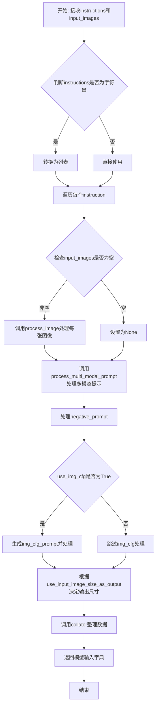
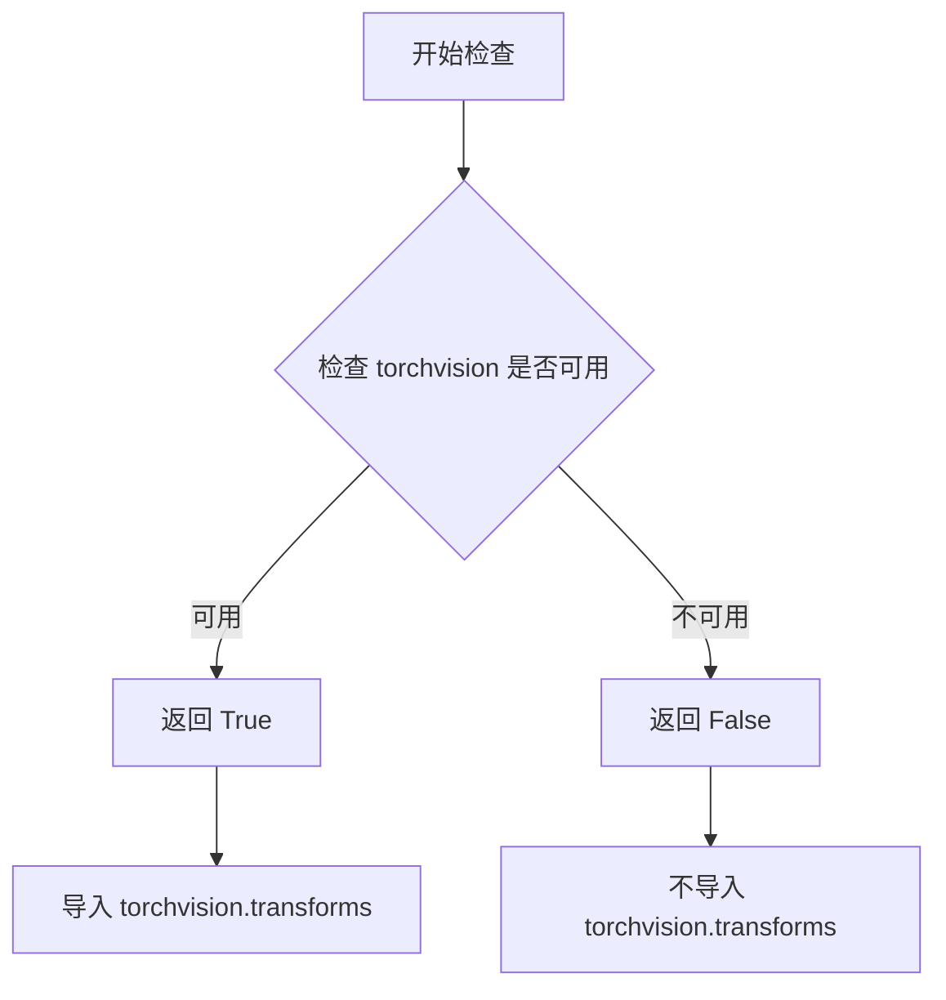
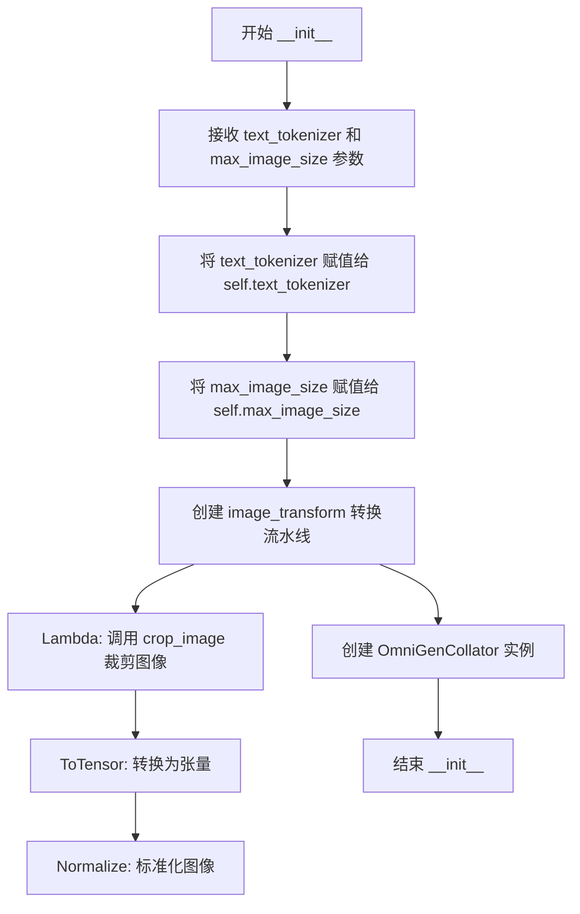
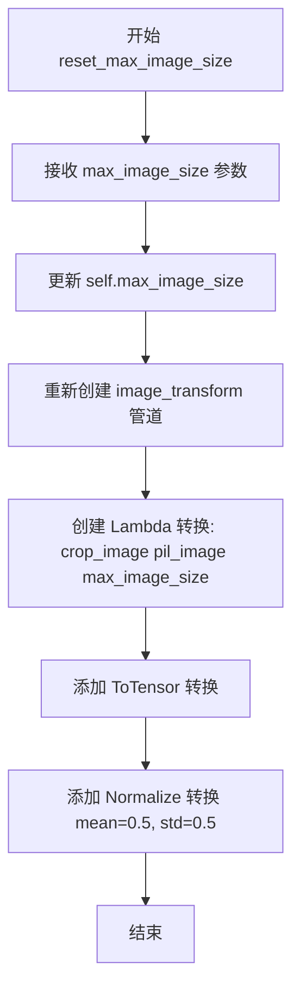
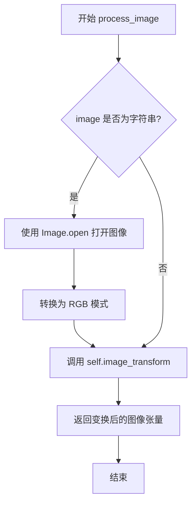
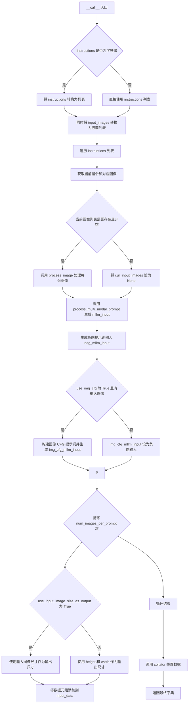
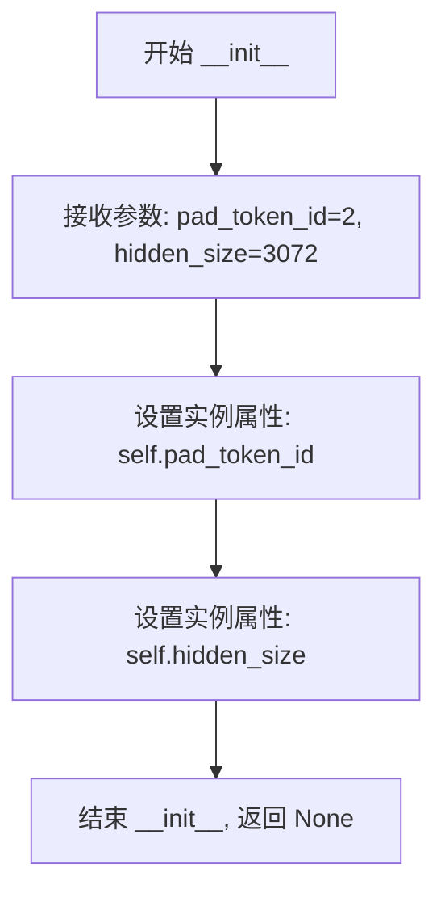
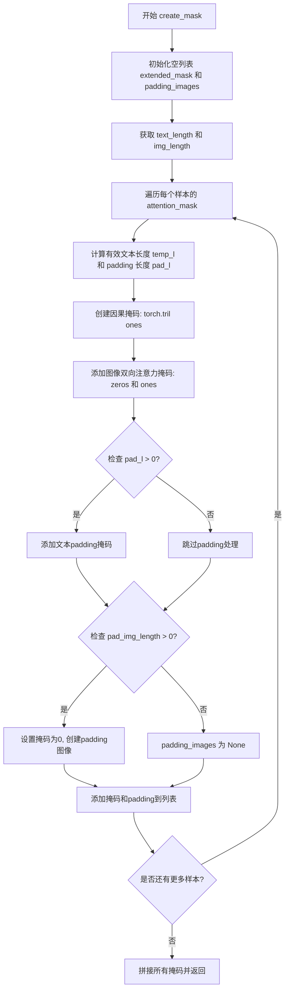
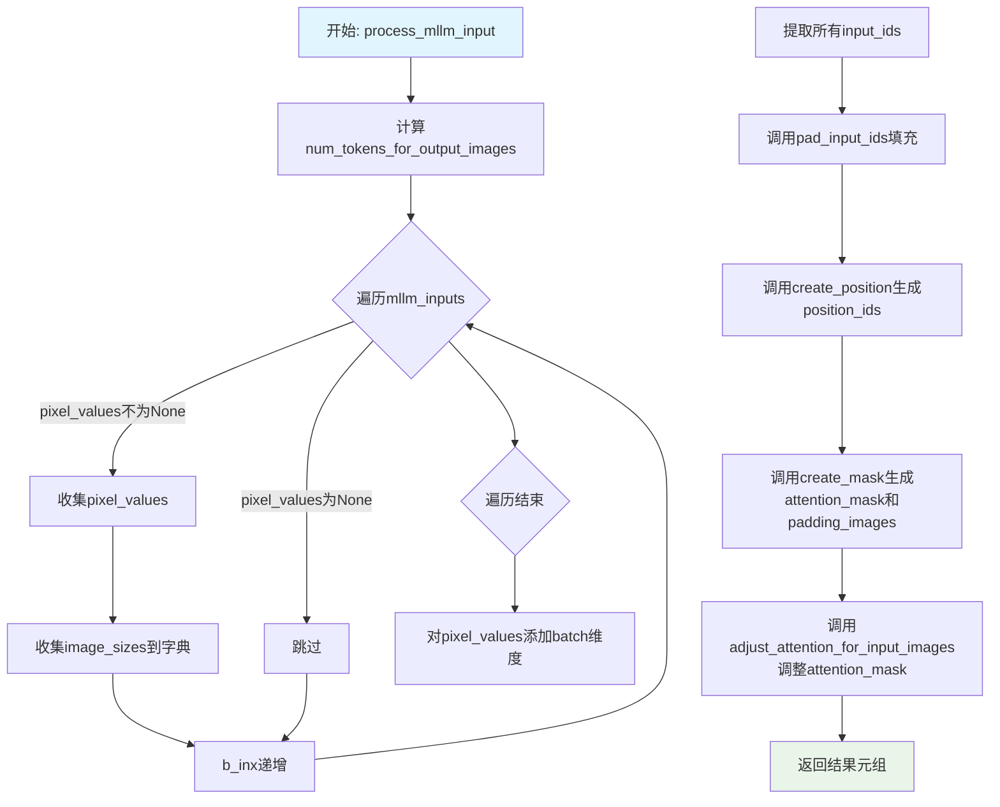
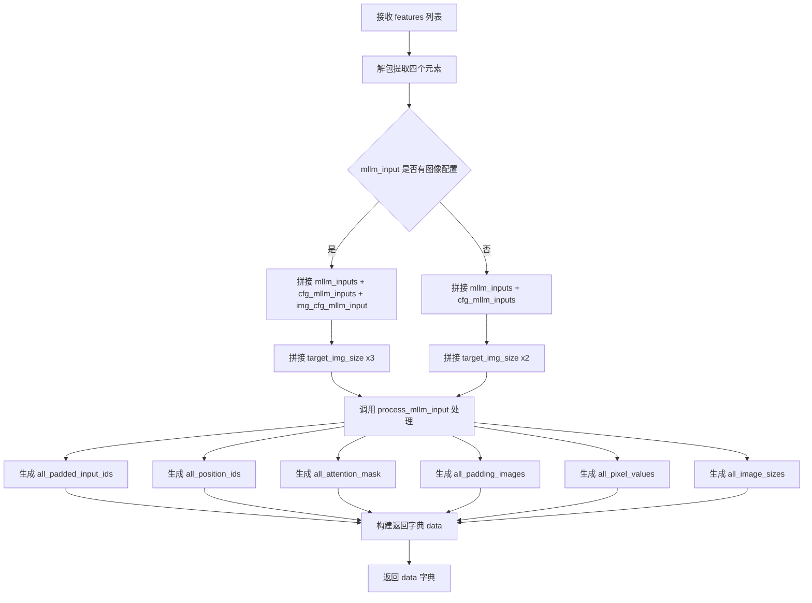

# `diffusers\src\diffusers\pipelines\omnigen\processor_omnigen.py` 详细设计文档

OmniGen多模态处理器是一个用于图像生成模型的输入预处理模块，负责接收文本指令和图像输入，进行图像裁剪转换、文本标记化、位置编码和注意力掩码生成，最终整理成符合模型输入格式的张量数据。

## 整体流程



## 类结构

```
模块级函数
├── crop_image (图像裁剪函数)
│
OmniGenMultiModalProcessor (主处理器类)
├── 字段:
│   ├── text_tokenizer
│   ├── max_image_size
│   ├── image_transform
│   └── collator
│
└── 方法:
    ├── __init__
    ├── reset_max_image_size
    ├── process_image
    ├── process_multi_modal_prompt
    ├── add_prefix_instruction
    └── __call__
│
OmniGenCollator (数据整理器类)
├── 字段:
│   ├── pad_token_id
│   └── hidden_size
│
└── 方法:
    ├── __init__
    ├── create_position
    ├── create_mask
    ├── adjust_attention_for_input_images
    ├── pad_input_ids
    ├── process_mllm_input
    └── __call__
```

## 全局变量及字段


### `crop_image`
    
裁剪图像使其尺寸不超过max_image_size并确保高宽是16的倍数

类型：`function`
    


### `is_torchvision_available`
    
检查torchvision库是否可用

类型：`function`
    


### `OmniGenMultiModalProcessor.text_tokenizer`
    
文本分词器，用于对文本进行tokenize处理

类型：`object`
    


### `OmniGenMultiModalProcessor.max_image_size`
    
最大图像尺寸，默认为1024，用于限制图像处理的大小

类型：`int`
    


### `OmniGenMultiModalProcessor.image_transform`
    
图像转换管道，包含裁剪、转换为tensor和归一化操作

类型：`torchvision.transforms.Compose`
    


### `OmniGenMultiModalProcessor.collator`
    
数据整理器，用于批处理和多模态数据的对齐

类型：`OmniGenCollator`
    


### `OmniGenCollator.pad_token_id`
    
填充token的ID，用于序列padding操作

类型：`int`
    


### `OmniGenCollator.hidden_size`
    
隐藏层大小，用于图像padding的维度

类型：`int`
    
    

## 全局函数及方法


### `crop_image`

该函数负责将 PIL 图像裁剪至指定的最大尺寸约束内，同时确保图像的宽度和高度都是 16 的倍数，以便于后续的神经网络处理（如能被 16 整除的特征图尺寸）。

参数：

- `pil_image`：`PIL.Image`，输入的待处理图像对象
- `max_image_size`：`int`，图像允许的最大边长（高度和宽度均不能超过此值）

返回值：`PIL.Image`，经过缩放和裁剪处理后的图像对象，其尺寸满足不超过 `max_image_size` 且为 16 的倍数

#### 流程图

```mermaid
flowchart TD
    A[开始: 传入 pil_image, max_image_size] --> B{min(*pil_image.size) >= 2 * max_image_size?}
    B -->|Yes| C[使用 BOX 插值将图像尺寸缩小为原来的一半]
    C --> B
    B -->|No| D{max(*pil_image.size) > max_image_size?}
    D -->|Yes| E[计算缩放比例<br>scale = max_image_size / max(*pil_image.size)<br>使用 BICUBIC 插值缩放图像]
    D -->|No| F{min(*pil_image.size) < 16?}
    E --> F
    F -->|Yes| G[计算放大比例<br>scale = 16 / min(*pil_image.size)<br>使用 BICUBIC 插值放大图像]
    F -->|No| H[将 PIL 图像转换为 numpy 数组]
    G --> H
    H --> I[计算垂直方向裁剪量<br>crop_y1 = (height % 16) // 2<br>crop_y2 = height % 16 - crop_y1]
    I --> J[计算水平方向裁剪量<br>crop_x1 = (width % 16) // 2<br>crop_x2 = width % 16 - crop_x1]
    J --> K[执行裁剪<br>arr = arr[crop_y1:height-crop_y2, crop_x1:width-crop_x2]]
    K --> L[将 numpy 数组转回 PIL Image]
    L --> M[返回处理后的图像]
```

#### 带注释源码

```python
def crop_image(pil_image, max_image_size):
    """
    Crop the image so that its height and width does not exceed `max_image_size`, while ensuring both the height and
    width are multiples of 16.
    """
    # 步骤1: 如果图像最小边大于等于 2 倍的最大尺寸，反复将图像缩小一半
    # 使用 BOX 插值（适合缩小操作，速度快且质量尚可）
    while min(*pil_image.size) >= 2 * max_image_size:
        pil_image = pil_image.resize(tuple(x // 2 for x in pil_image.size), resample=Image.BOX)

    # 步骤2: 如果最大边大于最大尺寸，按比例缩小图像
    # 确保缩放后最大边等于 max_image_size
    if max(*pil_image.size) > max_image_size:
        scale = max_image_size / max(*pil_image.size)
        # 使用 BICUBIC 插值（适合缩小操作，质量较高）
        pil_image = pil_image.resize(tuple(round(x * scale) for x in pil_image.size), resample=Image.BICUBIC)

    # 步骤3: 如果最小边小于 16，按比例放大图像至最小边为 16
    # 这是为了满足神经网络处理的最小尺寸要求
    if min(*pil_image.size) < 16:
        scale = 16 / min(*pil_image.size)
        pil_image = pil_image.resize(tuple(round(x * scale) for x in pil_image.size), resample=Image.BICUBIC)

    # 步骤4: 将图像转换为 numpy 数组进行裁剪操作
    arr = np.array(pil_image)

    # 计算垂直方向（高度）需要裁剪的像素数，使高度变为 16 的倍数
    # 居中裁剪：crop_y1 是顶部需要裁剪的像素数，crop_y2 是底部需要裁剪的像素数
    crop_y1 = (arr.shape[0] % 16) // 2
    crop_y2 = arr.shape[0] % 16 - crop_y1

    # 计算水平方向（宽度）需要裁剪的像素数，使宽度变为 16 的倍数
    # 居中裁剪：crop_x1 是左侧需要裁剪的像素数，crop_x2 是右侧需要裁剪的像素数
    crop_x1 = (arr.shape[1] % 16) // 2
    crop_x2 = arr.shape[1] % 16 - crop_x1

    # 执行裁剪，去除多余的像素使尺寸变为 16 的倍数
    arr = arr[crop_y1 : arr.shape[0] - crop_y2, crop_x1 : arr.shape[1] - crop_x2]

    # 将裁剪后的 numpy 数组转换回 PIL Image 对象并返回
    return Image.fromarray(arr)
```


### `is_torchvision_available`

该函数用于检查 `torchvision` 库是否已安装且可用。如果可用，则导入 `torchvision.transforms` 模块供后续图像处理使用。

参数： 无

返回值：`bool`，返回 `True` 表示 `torchvision` 库可用，可以安全导入；返回 `False` 表示 `torchvision` 不可用。

#### 流程图



#### 带注释源码

```
# 该函数定义在 ...utils 模块中（不在当前文件内）
# 当前文件通过以下方式导入：
from ...utils import is_torchvision_available

# 使用方式：
if is_torchvision_available():
    # 只有当 torchvision 可用时才导入
    from torchvision import transforms
```

#### 说明

由于 `is_torchvision_available` 函数定义在 `...utils` 模块中（不在当前代码文件内），以上信息基于其在当前文件中的使用方式推断：

- **函数来源**：`...utils` 包中的工具函数
- **功能**：检查 `torchvision` 库的可用性
- **设计目的**：这是一种常见的可选依赖检查模式，允许代码在 `torchvision` 不可用时也能部分工作（虽然当前文件中 `transforms` 是必需的）


### `OmniGenMultiModalProcessor.__init__`

该方法是 OmniGenMultiModalProcessor 类的构造函数，用于初始化多模态处理器的核心组件，包括文本分词器、图像转换流水线（包含裁剪、归一化等操作）以及数据批处理收集器。

参数：

- `self`：隐含的实例参数，表示类的实例本身
- `text_tokenizer`：任意文本分词器对象，用于对文本进行分词处理
- `max_image_size`：`int`，可选参数，默认值为 1024，表示处理图像的最大尺寸（高度和宽度）

返回值：无（`None`），构造函数不返回任何值，仅初始化实例属性

#### 流程图



#### 带注释源码

```python
def __init__(self, text_tokenizer, max_image_size: int = 1024):
    """
    初始化 OmniGenMultiModalProcessor 多模态处理器
    
    参数:
        text_tokenizer: 文本分词器，用于将文本转换为 token ID
        max_image_size: int, 最大图像尺寸，默认为 1024
    """
    # 1. 存储文本分词器引用，后续用于对指令和提示词进行分词处理
    self.text_tokenizer = text_tokenizer
    
    # 2. 存储最大图像尺寸，用于控制图像预处理时的裁剪和缩放
    self.max_image_size = max_image_size

    # 3. 构建图像转换流水线，包含三个连续的变换操作
    self.image_transform = transforms.Compose(
        [
            # 3.1 Lambda: 对 PIL 图像调用 crop_image 函数进行尺寸调整和裁剪
            # 确保图像尺寸不超过 max_image_size，且宽高都是 16 的倍数
            transforms.Lambda(lambda pil_image: crop_image(pil_image, max_image_size)),
            
            # 3.2 ToTensor: 将 PIL 图像转换为 PyTorch 张量，值域从 [0, 255] 归一化到 [0, 1]
            transforms.ToTensor(),
            
            # 3.3 Normalize: 对图像进行标准化，使用均值和标准差 [0.5, 0.5, 0.5]
            # 将值域从 [0, 1] 变换到 [-1, 1]，inplace=True 表示原地操作节省内存
            transforms.Normalize(mean=[0.5, 0.5, 0.5], std=[0.5, 0.5, 0.5], inplace=True),
        ]
    )

    # 4. 创建数据批处理收集器，用于将多个样本整理为 batch
    # 该收集器负责 padding、attention mask 生成、位置编码等操作
    self.collator = OmniGenCollator()
```


### `OmniGenMultiModalProcessor.reset_max_image_size`

该方法用于动态更新处理器的最大图像尺寸限制，并重新构建图像转换管道，以便在运行时根据新的尺寸约束处理输入图像。

参数：

- `max_image_size`：`int`，新的最大图像尺寸，用于限制图像的高度和宽度

返回值：`None`，该方法仅更新实例状态，不返回任何值

#### 流程图



#### 带注释源码

```python
def reset_max_image_size(self, max_image_size):
    """
    重置最大图像尺寸并更新图像转换管道
    
    参数:
        max_image_size: int - 新的最大图像尺寸限制
    """
    # 1. 更新实例属性，保存新的最大图像尺寸
    self.max_image_size = max_image_size
    
    # 2. 重新构建图像转换管道，包含三个转换步骤
    self.image_transform = transforms.Compose(
        [
            # 步骤1: Lambda转换 - 使用crop_image函数调整图像大小
            # 该函数会将图像裁剪到不超过max_image_size，并确保尺寸是16的倍数
            transforms.Lambda(lambda pil_image: crop_image(pil_image, max_image_size)),
            
            # 步骤2: 将PIL图像转换为PyTorch张量
            transforms.ToTensor(),
            
            # 步骤3: 归一化处理，将像素值从[0,1]范围转换到[-1,1]范围
            # mean和std都设为[0.5, 0.5, 0.5]，即每个通道独立归一化
            transforms.Normalize(mean=[0.5, 0.5, 0.5], std=[0.5, 0.5, 0.5], inplace=True),
        ]
    )
```


### `OmniGenMultiModalProcessor.process_image`

该方法负责将输入的图像转换为模型可处理的张量格式，支持从文件路径加载或直接接收 PIL 图像对象，并应用预设的图像预处理变换（包括裁剪、归一化等操作）。

参数：

- `image`：`Union[str, Image.Image]`，输入图像，可以是图像文件路径（字符串）或已经加载的 PIL Image 对象

返回值：`torch.Tensor`，经过图像变换后的张量数据，形状为 (C, H, W)，已进行归一化处理

#### 流程图



#### 带注释源码

```python
def process_image(self, image):
    """
    处理单张图像，将其转换为模型输入格式的张量。
    
    参数:
        image: 输入图像，可以是文件路径(str)或PIL Image对象
        
    返回值:
        torch.Tensor: 经过预处理的图像张量
    """
    # 判断输入是否为文件路径字符串
    if isinstance(image, str):
        # 从文件路径打开图像并转换为 RGB 模式
        image = Image.open(image).convert("RGB")
    
    # 应用预设的图像变换管道（包括裁剪、ToTensor、归一化）
    return self.image_transform(image)
```


### `OmniGenMultiModalProcessor.process_multi_modal_prompt`

该方法负责将文本提示和输入图像处理为模型可用的多模态输入格式，包括文本分词、图像处理、图像标记替换以及构建交织的输入序列。

参数：

- `text`：`str`，用户输入的文本提示，可能包含图像占位符标签如 `<|image_1|>`
- `input_images`：`list[PIL.Image] | None`，输入的 PIL 图像列表，若为 None 或空则仅处理文本

返回值：`dict`，包含以下键值的字典：
- `input_ids`：列表，处理后的输入 token ID 序列
- `pixel_values`：列表，处理后的图像张量列表，若无图像则为 None
- `image_sizes`：列表，每个图像对应的 token 范围索引，若无图像则为 None

#### 流程图

```mermaid
flowchart TD
    A[开始 process_multi_modal_prompt] --> B[添加前缀指令 add_prefix_instruction]
    B --> C{input_images 是否为空?}
    C -->|是| D[仅分词文本]
    D --> E[返回 input_ids, pixel_values=None, image_sizes=None]
    C -->|否| F[正则匹配图像标签 <|image_d+|>]
    F --> G[按标签分割文本得到文本块列表]
    G --> H[对每个文本块进行分词]
    H --> I[去除每个文本块首位的 BOS token]
    I --> J[提取所有图像标签并解析出图像ID列表]
    J --> K[验证图像ID从1开始且连续]
    K --> L{验证通过?}
    L -->|否| M[抛出断言错误]
    L -->|是| N[根据图像ID顺序重排输入图像]
    N --> O[交织文本token和图像token]
    O --> P[计算每个图像的token数量 size = h*w//16//16]
    P --> Q[构建图像位置索引 img_inx]
    Q --> R[返回 input_ids, pixel_values, image_sizes]
```

#### 带注释源码

```python
def process_multi_modal_prompt(self, text, input_images):
    """
    处理多模态提示，将文本和图像转换为模型输入格式
    
    参数:
        text: str - 包含图像占位符的文本提示，如 "生成一张猫的图片 <|image_1|>"
        input_images: list - PIL图像列表，按图像ID顺序排列
    
    返回:
        dict: {
            'input_ids': 交织的文本和图像token ID列表,
            'pixel_values': 处理后的图像张量列表,
            'image_sizes': 每个图像对应的token范围列表
        }
    """
    # Step 1: 添加前缀指令，构造完整的提示模板
    # 格式: <|user|>\nGenerate an image according to the following instructions\n{prompt}<|end|>\n<|assistant|>\n<|diffusion|>
    text = self.add_prefix_instruction(text)
    
    # Step 2: 如果没有输入图像，直接返回纯文本的分词结果
    if input_images is None or len(input_images) == 0:
        model_inputs = self.text_tokenizer(text)
        return {"input_ids": model_inputs.input_ids, "pixel_values": None, "image_sizes": None}

    # Step 3: 定义正则表达式匹配图像占位符标签，如 <|image_1|>, <|image_2|>
    pattern = r"<\|image_\d+\|>"
    
    # Step 4: 按图像标签分割文本，得到文本块列表
    # 例如: "hello <|image_1|> world <|image_2|>" -> ["hello ", " world ", ""]
    prompt_chunks = [self.text_tokenizer(chunk).input_ids for chunk in re.split(pattern, text)]

    # Step 5: 去除每个文本块首位的 BOS token (id=1)，避免重复
    for i in range(1, len(prompt_chunks)):
        if prompt_chunks[i][0] == 1:
            prompt_chunks[i] = prompt_chunks[i][1:]

    # Step 6: 提取所有图像标签
    image_tags = re.findall(pattern, text)
    # 解析图像ID: "<|image_1|>" -> 1
    image_ids = [int(s.split("|")[1].split("_")[-1]) for s in image_tags]

    # Step 7: 验证图像ID的有效性
    # 要求: 必须从1开始连续递增，如 [1, 2, 3]
    unique_image_ids = sorted(set(image_ids))
    assert unique_image_ids == list(range(1, len(unique_image_ids) + 1)), (
        f"image_ids must start from 1, and must be continuous int, e.g. [1, 2, 3], cannot be {unique_image_ids}"
    )
    # 验证图像标签数量与输入图像数量一致
    assert len(unique_image_ids) == len(input_images), (
        f"total images must be the same as the number of image tags, got {len(unique_image_ids)} image tags and {len(input_images)} images"
    )

    # Step 8: 根据文本中的图像ID顺序重排输入图像
    input_images = [input_images[x - 1] for x in image_ids]

    # Step 9: 交织文本token和图像token，构建完整的输入序列
    all_input_ids = []    # 存储所有token ID
    img_inx = []          # 存储每个图像的token位置范围
    
    for i in range(len(prompt_chunks)):
        # 添加当前文本块的token
        all_input_ids.extend(prompt_chunks[i])
        
        # 如果不是最后一个文本块，说明后面还有图像
        if i != len(prompt_chunks) - 1:
            # 记录图像token的起始位置
            start_inx = len(all_input_ids)
            # 计算图像对应的token数量: 图像面积 // 16 // 16
            # 这是因为图像被编码成 16x16 的patches
            size = input_images[i].size(-2) * input_images[i].size(-1) // 16 // 16
            # 记录图像的token范围 [start, end]
            img_inx.append([start_inx, start_inx + size])
            # 用 padding token (id=0) 填充图像token的位置
            all_input_ids.extend([0] * size)

    # Step 10: 返回处理结果
    return {"input_ids": all_input_ids, "pixel_values": input_images, "image_sizes": img_inx}
```


### `OmniGenMultiModalProcessor.add_prefix_instruction`

该方法用于为输入提示词添加前缀指令格式，将用户提示词包装在特定的XML标签和生成指令中，以便OmniGen模型能够正确识别和处理多模态生成任务。

参数：

- `prompt`：`str`，需要添加前缀指令的用户输入提示词

返回值：`str`，添加了前缀指令格式后的完整提示词字符串

#### 流程图

```mermaid
flowchart TD
    A[Start add_prefix_instruction] --> B[定义 user_prompt = "<|user|>\n"]
    B --> C[定义 generation_prompt = "Generate an image according to the following instructions\n"]
    C --> D[定义 assistant_prompt = "<|assistant|>\n<|diffusion|>"]
    D --> E[定义 prompt_suffix = "<|end|>\n"]
    E --> F[拼接字符串: user_prompt + generation_prompt + prompt + prompt_suffix + assistant_prompt]
    F --> G[返回格式化后的 prompt]
```

#### 带注释源码

```python
def add_prefix_instruction(self, prompt):
    """
    为提示词添加前缀指令格式，用于OmniGen多模态模型推理。
    
    该方法将输入的提示词包装在特定的结构化格式中，包含：
    - 用户标签起始
    - 生成指令描述
    - 原始用户提示词
    - 结束标签
    - 助手标签和扩散模型标记
    
    Args:
        prompt (str): 用户输入的原始提示词
        
    Returns:
        str: 格式化后的完整提示词，包含所有必要的指令前缀和后缀
    """
    # 定义用户部分的开头标签
    user_prompt = "<|user|>\n"
    
    # 定义生成指令，指示模型根据指令生成图像
    generation_prompt = "Generate an image according to the following instructions\n"
    
    # 定义助手部分的标签，标记开始生成内容以及使用扩散模型
    assistant_prompt = "<|assistant|>\n<|diffusion|>"
    
    # 定义提示词的结束标签
    prompt_suffix = "<|end|>\n"
    
    # 按照特定顺序拼接所有部分：用户标签 -> 生成指令 -> 原始提示 -> 结束标签 -> 助手标签
    prompt = f"{user_prompt}{generation_prompt}{prompt_suffix}{assistant_prompt}{prompt}"
    
    # 返回最终格式化后的完整提示词
    return prompt
```


### OmniGenMultiModalProcessor.__call__

该方法是 `OmniGenMultiModalProcessor` 类的核心调用接口，负责将用户指令（文本）和输入图像转换为模型所需的输入格式。它支持批量处理、负向提示词、图像条件引导（CFG）以及输出尺寸控制，最终通过 collator 整理为包含 input_ids、attention_mask、position_ids、pixel_values 等字段的字典，供下游模型使用。

参数：

- `self`：`OmniGenMultiModalProcessor` 实例本身
- `instructions`：`list[str]`，待处理的文本指令列表
- `input_images`：`list[list[str]] = None`，可选的输入图像列表，每个元素是图像路径或 PIL Image 的列表
- `height`：`int = 1024`，输出图像的高度（当 `use_input_image_size_as_output` 为 False 时使用）
- `width`：`int = 1024`，输出图像的宽度（当 `use_input_image_size_as_output` 为 False 时使用）
- `negative_prompt`：`str`，负向提示词，用于图像生成时的条件引导，默认包含低质量等负面描述
- `use_img_cfg`：`bool = True`，是否使用图像 CFG（Image Classifier-Free Guidance）
- `separate_cfg_input`：`bool = False`，是否分离 CFG 输入（当前代码中未使用该参数）
- `use_input_image_size_as_output`：`bool = False`，是否使用输入图像的尺寸作为输出尺寸
- `num_images_per_prompt`：`int = 1`，每个指令生成的图像数量

返回值：`dict`，包含以下键值对：
- `input_ids`：`torch.LongTensor`，填充后的输入 token ID 序列
- `attention_mask`：`torch.LongTensor`，注意力掩码
- `position_ids`：`torch.LongTensor`，位置 ID
- `input_pixel_values`：`list[torch.Tensor]`，输入图像的像素值
- `input_image_sizes`：`dict`，输入图像的尺寸信息

#### 流程图



#### 带注释源码

```python
def __call__(
    self,
    instructions: list[str],
    input_images: list[list[str]] = None,
    height: int = 1024,
    width: int = 1024,
    negative_prompt: str = "low quality, jpeg artifacts, ugly, duplicate, morbid, mutilated, extra fingers, mutated hands, poorly drawn hands, poorly drawn face, mutation, deformed, blurry, dehydrated, bad anatomy, bad proportions, extra limbs, cloned face, disfigured, gross proportions, malformed limbs, missing arms, missing legs, extra arms, extra legs, fused fingers, too many fingers.",
    use_img_cfg: bool = True,
    separate_cfg_input: bool = False,
    use_input_image_size_as_output: bool = False,
    num_images_per_prompt: int = 1,
) -> dict:
    """
    处理指令和图像，生成模型输入数据。
    
    参数:
        instructions: 文本指令列表
        input_images: 可选的图像列表（嵌套列表）
        height: 输出图像高度（默认 1024）
        width: 输出图像宽度（默认 1024）
        negative_prompt: 负向提示词
        use_img_cfg: 是否使用图像 CFG
        separate_cfg_input: 是否分离 CFG 输入（未使用）
        use_input_image_size_as_output: 是否使用输入图像尺寸作为输出
        num_images_per_prompt: 每个指令生成的图像数量
    
    返回:
        包含模型输入的字典
    """
    # 如果指令是单个字符串，转换为列表
    if isinstance(instructions, str):
        instructions = [instructions]
        # 同时将 input_images 也转换为嵌套列表形式（外层列表长度为 1）
        input_images = [input_images]

    # 初始化数据列表，用于存储所有样本的处理结果
    input_data = []
    
    # 遍历每一条指令
    for i in range(len(instructions)):
        # 获取当前指令和对应的图像列表
        cur_instruction = instructions[i]
        cur_input_images = None if input_images is None else input_images[i]
        
        # 如果有输入图像，则处理每张图像
        if cur_input_images is not None and len(cur_input_images) > 0:
            # 使用 process_image 将图像转换为 tensor
            cur_input_images = [self.process_image(x) for x in cur_input_images]
        else:
            cur_input_images = None
            # 确保指令中不包含图像占位符（当没有图像输入时）
            assert "<|image_1|></img>" not in cur_instruction

        # 处理多模态提示词，生成输入 ID 和图像特征
        mllm_input = self.process_multi_modal_prompt(cur_instruction, cur_input_images)

        # 初始化负向和图像 CFG 输入
        neg_mllm_input, img_cfg_mllm_input = None, None
        
        # 生成负向提示词的输入（无图像）
        neg_mllm_input = self.process_multi_modal_prompt(negative_prompt, None)
        
        # 如果启用图像 CFG 且存在输入图像
        if use_img_cfg:
            if cur_input_images is not None and len(cur_input_images) >= 1:
                # 构建图像 CFG 提示词：<|image_1|></img> <|image_2|></img> ...
                img_cfg_prompt = [f"<|image_{i + 1}|></img>" for i in range(len(cur_input_images))]
                img_cfg_mllm_input = self.process_multi_modal_prompt(" ".join(img_cfg_prompt), cur_input_images)
            else:
                # 如果没有输入图像，则图像 CFG 输入等于负向输入
                img_cfg_mllm_input = neg_mllm_input

        # 根据 num_images_per_prompt 次数生成数据
        for _ in range(num_images_per_prompt):
            if use_input_image_size_as_output:
                # 使用第一张输入图像的尺寸作为输出尺寸
                input_data.append(
                    (
                        mllm_input,
                        neg_mllm_input,
                        img_cfg_mllm_input,
                        [mllm_input["pixel_values"][0].size(-2), mllm_input["pixel_values"][0].size(-1)],
                    )
                )
            else:
                # 使用指定的 height 和 width
                input_data.append((mllm_input, neg_mllm_input, img_cfg_mllm_input, [height, width]))

    # 使用 collator 将数据整理为模型输入格式
    return self.collator(input_data)
```


### `OmniGenCollator.__init__`

该方法用于初始化 OmniGenCollator 类实例，配置填充 token 的 ID 和隐藏层大小，作为后续数据整理（collate）过程中的核心配置参数。

参数：

-  `pad_token_id`：`int`，可选，默认值为 `2`，用于指定在批处理时填充（padding）序列的 token ID
-  `hidden_size`：`int`，可选，默认值为 `3072`，用于指定图像 embedding 的隐藏层维度大小，与图像 padding 时的特征维度相关

返回值：`None`，无返回值，该方法仅用于初始化实例属性

#### 流程图



#### 带注释源码

```python
def __init__(self, pad_token_id=2, hidden_size=3072):
    """
    初始化 OmniGenCollator 实例。
    
    参数:
        pad_token_id (int, optional): 填充 token 的 ID，用于在批处理时将不同长度的序列填充到相同长度。默认为 2。
        hidden_size (int, optional): 隐藏层大小，用于图像 embedding 的维度，与图像 padding 时的特征维度保持一致。默认为 3072。
    """
    # 将传入的 pad_token_id 参数存储为实例属性，供后续 pad_input_ids 等方法使用
    self.pad_token_id = pad_token_id
    
    # 将传入的 hidden_size 参数存储为实例属性，供后续 create_mask 方法中创建 padding 图像张量时使用
    self.hidden_size = hidden_size
```


### `OmniGenCollator.create_position`

该方法根据注意力掩码和输出图像的token数量为批次中的每个样本生成位置ID，用于指示序列中每个元素的位置信息。

参数：

- `self`：OmniGenCollator 实例本身
- `attention_mask`：`torch.Tensor`，注意力掩码张量，用于确定每个样本中文本部分的有效长度
- `num_tokens_for_output_images`：`list[int]`，每个输出图像对应的token数量列表

返回值：`torch.Tensor`，形状为 (batch_size, sequence_length) 的位置ID张量

#### 流程图

```mermaid
flowchart TD
    A[开始 create_position] --> B[获取文本长度: text_length = attention_mask.size(-1)]
    B --> C[获取最大图像token数: img_length = max(num_tokens_for_output_images)]
    C --> D[初始化空列表 position_ids]
    D --> E{遍历 attention_mask 中的每个 mask}
    E -->|是| F[计算有效文本长度: temp_l = torch.sum(mask)]
    F --> G[生成位置序列: temp_position = [0] * (text_length - temp_l) + list(range(temp_l + img_length + 1))]
    G --> H[将 temp_position 添加到 position_ids]
    H --> E
    E -->|否| I[将 position_ids 转换为 LongTensor]
    I --> J[返回位置ID张量]
```

#### 带注释源码

```python
def create_position(self, attention_mask, num_tokens_for_output_images):
    """
    根据注意力掩码和输出图像token数量创建位置ID
    
    参数:
        attention_mask: 注意力掩码张量，形状为 (batch_size, text_length)
        num_tokens_for_output_images: 每个输出图像的token数量列表
    
    返回:
        position_ids: 位置ID张量，形状为 (batch_size, total_sequence_length)
    """
    position_ids = []
    
    # 获取文本部分的长度（注意力掩码的最后一个维度）
    text_length = attention_mask.size(-1)
    
    # 获取所有输出图像中最大的token数量
    img_length = max(num_tokens_for_output_images)
    
    # 遍历批次中的每个样本
    for mask in attention_mask:
        # 计算该样本中有效文本token的数量（非padding部分）
        temp_l = torch.sum(mask)
        
        # 构建位置ID序列:
        # 1. 前 (text_length - temp_l) 个位置设为0（对应padding部分）
        # 2. 后续位置从 temp_l 开始递增到 (temp_l + img_length)
        # 3. +1 是因为需要添加一个时间嵌入token到序列中
        temp_position = [0] * (text_length - temp_l) + list(
            range(temp_l + img_length + 1)
        )  # we add a time embedding into the sequence, so add one more token
        
        # 将该样本的位置ID添加到列表中
        position_ids.append(temp_position)
    
    # 将位置ID列表转换为PyTorch LongTensor并返回
    return torch.LongTensor(position_ids)
```


### `OmniGenCollator.create_mask`

该方法用于为OmniGen模型创建特殊的注意力掩码，其中文本部分采用因果注意力（causal attention），每个图像序列内部采用双向注意力（bidirectional attention）。这是OmniGen模型的核心注意力机制实现，参考自其论文。

参数：

- `attention_mask`：`torch.Tensor`，形状为 (batch_size, text_length)，注意力掩码，值为0表示padding位置，值为1表示有效文本token
- `num_tokens_for_output_images`：`list[int]`，每个样本输出图像的token数量列表，用于计算图像序列长度

返回值：`tuple[torch.Tensor, list]`，第一个元素是扩展后的注意力掩码，形状为 (batch_size, seq_len, seq_len)，其中 seq_len = text_length + img_length + 1；第二个元素是padding图像张量列表

#### 流程图



#### 带注释源码

```python
def create_mask(self, attention_mask, num_tokens_for_output_images):
    """
    OmniGen applies causal attention to each element in the sequence, but applies bidirectional attention within
    each image sequence References: [OmniGen](https://huggingface.co/papers/2409.11340)
    """
    # 存储每个样本扩展后的注意力掩码
    extended_mask = []
    # 存储每个样本的padding图像
    padding_images = []
    
    # 获取文本长度（不包括padding）
    text_length = attention_mask.size(-1)
    # 获取所有样本中最大的图像token数量
    img_length = max(num_tokens_for_output_images)
    # 序列总长度 = 文本长度 + 图像长度 + 1（时间嵌入token）
    seq_len = text_length + img_length + 1
    
    # 样本索引
    inx = 0
    # 遍历batch中的每个样本
    for mask in attention_mask:
        # 计算当前样本的有效文本token数量
        temp_l = torch.sum(mask)
        # 计算文本padding长度
        pad_l = text_length - temp_l

        # 创建因果注意力掩码（下三角矩阵，对角线及以下为1）
        # 形状: (temp_l + 1, temp_l + 1)，+1是为时间嵌入token
        temp_mask = torch.tril(torch.ones(size=(temp_l + 1, temp_l + 1)))

        # 创建图像部分的双向注意力掩码（零矩阵，允许所有图像token之间相互注意）
        # 形状: (temp_l + 1, img_length)，追加到因果掩码右侧
        image_mask = torch.zeros(size=(temp_l + 1, img_length))
        temp_mask = torch.cat([temp_mask, image_mask], dim=-1)

        # 创建图像到文本的掩码（全1矩阵，图像可以注意所有文本token）
        # 形状: (img_length, temp_l + img_length + 1)，追加到掩码下方
        image_mask = torch.ones(size=(img_length, temp_l + img_length + 1))
        temp_mask = torch.cat([temp_mask, image_mask], dim=0)

        # 处理文本padding
        if pad_l > 0:
            # 左侧padding（文本部分）
            pad_mask = torch.zeros(size=(temp_l + 1 + img_length, pad_l))
            temp_mask = torch.cat([pad_mask, temp_mask], dim=-1)

            # 顶部padding（整个序列）
            pad_mask = torch.ones(size=(pad_l, seq_len))
            temp_mask = torch.cat([pad_mask, temp_mask], dim=0)

        # 获取当前样本的真实图像token数量
        true_img_length = num_tokens_for_output_images[inx]
        # 计算需要padding的图像token数量
        pad_img_length = img_length - true_img_length
        
        # 处理图像padding
        if pad_img_length > 0:
            # 将padding位置的注意力设为0
            temp_mask[:, -pad_img_length:] = 0
            # 创建padding图像张量（用于后续计算）
            temp_padding_imgs = torch.zeros(size=(1, pad_img_length, self.hidden_size))
        else:
            # 无需图像padding
            temp_padding_imgs = None

        # 将当前样本的掩码添加到列表（添加batch维度）
        extended_mask.append(temp_mask.unsqueeze(0))
        # 添加padding图像
        padding_images.append(temp_padding_imgs)
        # 移动到下一个样本
        inx += 1
    
    # 拼接所有样本的掩码，形成最终的注意力掩码
    # 最终形状: (batch_size, seq_len, seq_len)
    return torch.cat(extended_mask, dim=0), padding_images
```


### `OmniGenCollator.adjust_attention_for_input_images`

该方法用于调整注意力掩码，使输入图像区域能够进行双向注意力计算。在OmniGen模型中，文本部分采用因果注意力机制，而图像内部采用双向注意力，此方法通过将图像区域的注意力掩码值设为1来实现这一设计。

参数：

- `attention_mask`：`torch.Tensor`，注意力掩码张量，初始值为因果注意力掩码，需要根据图像位置进行调整
- `image_sizes`：字典，键为批次索引（b_inx），值为图像位置列表，每个位置为[start_inx, end_inx]表示图像token在序列中的起止位置

返回值：`torch.Tensor`，调整后的注意力掩码张量

#### 流程图

```mermaid
flowchart TD
    A[开始] --> B[遍历 image_sizes 中的每个批次索引 b_inx]
    B --> C{还有未处理的图像位置?}
    C -->|是| D[获取当前图像的 start_inx 和 end_inx]
    D --> E[将 attention_mask[b_inx][start_inx:end_inx, start_inx:end_inx] 设为 1]
    E --> C
    C -->|否| F[返回调整后的 attention_mask]
    F --> G[结束]
```

#### 带注释源码

```
def adjust_attention_for_input_images(self, attention_mask, image_sizes):
    """
    调整注意力掩码，使输入图像区域可以进行双向注意力计算。
    
    在OmniGen架构中：
    - 文本部分使用因果注意力（Causal Attention）
    - 图像内部使用双向注意力（Bidirectional Attention）
    
    此方法通过将图像token对应位置的注意力掩码设为1，
    使得这些位置可以相互注意，从而实现图像内部的双向注意力机制。
    """
    # 遍历每个批次样本
    for b_inx in image_sizes.keys():
        # 遍历该批次中的所有图像位置
        for start_inx, end_inx in image_sizes[b_inx]:
            # 将图像区域的注意力掩码设为1
            # 这使得该区域内的所有token可以相互注意（双向注意力）
            # 而不仅仅是前面的token注意后面的token（因果注意力）
            attention_mask[b_inx][start_inx:end_inx, start_inx:end_inx] = 1

    return attention_mask
```


### `OmniGenCollator.pad_input_ids`

该方法负责将不同长度的输入序列填充（padding）到统一的最大长度，生成对应的注意力掩码（attention mask），并根据填充长度调整图像 token 在序列中的位置索引。这是数据批处理中的关键步骤，确保模型能处理变长输入。

参数：

- `input_ids`：`List[List[int]]`，待填充的输入 ID 列表，每个内部列表代表一个样本的 token 序列
- `image_sizes`：`Dict[int, List[List[int]]]`，图像 token 在各样本中的位置索引，键为样本索引，值为位置区间列表

返回值：

- `padded_ids`：`torch.LongTensor`，填充后的输入 ID 张量，形状为 [batch_size, max_length]
- `attention_mask`：`torch.LongTensor`，注意力掩码张量，1 表示有效 token，0 表示填充位置，形状为 [batch_size, max_length]
- `image_sizes`：`Dict[int, List[List[int]]]`，调整后的图像 token 位置索引，索引值已根据填充长度进行了偏移

#### 流程图

```mermaid
flowchart TD
    A[开始: pad_input_ids] --> B[计算最大序列长度 max_l]
    B --> C[初始化空列表: padded_ids, attention_mask]
    C --> D{遍历每个样本 i}
    D -->|i < len(input_ids)| E[获取当前序列 temp_ids]
    E --> F[计算需填充长度 pad_l = max_l - len]
    F --> G{pad_l == 0?}
    G -->|是| H[attention_mask添加全1列表]
    G -->|否| I[attention_mask添加 pad_l个0 + temp_l个1]
    I --> J[padded_ids添加 pad_token_id前缀 + 原序列]
    H --> K{样本索引 i 在 image_sizes 中?}
    J --> K
    K -->|是| L[调整该样本的所有位置索引: 加pad_l偏移]
    K -->|否| M[返回下一轮]
    L --> M
    M --> D
    D -->|遍历完成| N[转换为LongTensor并返回]
```

#### 带注释源码

```python
def pad_input_ids(self, input_ids, image_sizes):
    """
    对输入序列进行padding，生成attention_mask，并调整image_sizes中的索引位置。
    
    Args:
        input_ids: 待填充的输入ID列表，每个元素是一个样本的token序列
        image_sizes: 图像token的位置索引，键为batch索引，值为位置区间列表
    
    Returns:
        padded_ids: 填充后的ID张量
        attention_mask: 注意力掩码（1=有效，0=填充）
        image_sizes: 调整偏移后的图像位置索引
    """
    # 1. 计算所有序列中的最大长度
    max_l = max([len(x) for x in input_ids])
    
    # 2. 初始化结果容器
    padded_ids = []      # 存储填充后的ID序列
    attention_mask = [] # 存储注意力掩码
    
    # 3. 遍历每个样本进行填充处理
    for i in range(len(input_ids)):
        temp_ids = input_ids[i]    # 当前样本的token序列
        temp_l = len(temp_ids)      # 当前序列长度
        pad_l = max_l - temp_l       # 需要填充的长度
        
        # 4. 根据是否需要填充处理attention_mask和padded_ids
        if pad_l == 0:
            # 无需填充，直接添加全1掩码和原序列
            attention_mask.append([1] * max_l)
            padded_ids.append(temp_ids)
        else:
            # 需要填充：掩码前padding部分为0，有效部分为1
            attention_mask.append([0] * pad_l + [1] * temp_l)
            # padded_ids前面填充pad_token_id，后面接原序列
            padded_ids.append([self.pad_token_id] * pad_l + temp_ids)
        
        # 5. 调整image_sizes中图像token的位置索引
        # 因为序列前面添加了padding，图像token的实际位置需要偏移
        if i in image_sizes:
            new_inx = []
            for old_inx in image_sizes[i]:
                # 每个位置区间都加上pad_l偏移量
                new_inx.append([x + pad_l for x in old_inx])
            image_sizes[i] = new_inx
    
    # 6. 转换为PyTorch张量并返回
    return torch.LongTensor(padded_ids), torch.LongTensor(attention_mask), image_sizes
```


### OmniGenCollator.process_mllm_input

该方法是OmniGenCollator类的核心成员，负责将多模态大型语言模型（MLLM）的输入进行标准化处理，包括计算输出图像所需的token数量、收集像素值和图像尺寸信息、对输入ID进行填充、生成位置ID和注意力掩码，最终返回可供模型使用的完整输入数据。

参数：

- `mllm_inputs`：`List[dict]`，包含多个样本的输入字典，每个字典包含"input_ids"、"pixel_values"和"image_sizes"字段
- `target_img_size`：`List[List[int]]`，目标图像尺寸列表，每个元素为[height, width]格式

返回值：`Tuple[torch.Tensor, torch.Tensor, torch.Tensor, List[torch.Tensor], List[torch.Tensor], dict]`，返回填充后的input_ids、位置ids、注意力掩码、填充图像像素值、像素值张量列表以及图像尺寸字典

#### 流程图



#### 带注释源码

```python
def process_mllm_input(self, mllm_inputs, target_img_size):
    """
    处理多模态大型语言模型输入，将多个样本的输入标准化为模型所需的格式
    
    参数:
        mllm_inputs: 包含多个样本输入的字典列表，每个字典包含input_ids、pixel_values和image_sizes
        target_img_size: 目标图像尺寸列表，格式为[[height, width], ...]
    
    返回:
        包含padded_input_ids、position_ids、attention_mask、padding_images、pixel_values和image_sizes的元组
    """
    # 第一步：计算每个输出图像所需的token数量
    # 图像token数量 = 图像高度 * 图像宽度 // 16 // 16
    # 因为图像被处理成16x16的patch，每个patch对应一个token
    num_tokens_for_output_images = []
    for img_size in target_img_size:
        num_tokens_for_output_images.append(img_size[0] * img_size[1] // 16 // 16)

    # 第二步：收集所有样本的像素值和图像尺寸信息
    pixel_values, image_sizes = [], {}
    b_inx = 0  # batch索引
    for x in mllm_inputs:
        # 检查当前样本是否包含图像
        if x["pixel_values"] is not None:
            # 收集像素值（所有图像的tensor）
            pixel_values.extend(x["pixel_values"])
            # 收集图像尺寸，按batch索引组织
            for size in x["image_sizes"]:
                if b_inx not in image_sizes:
                    image_sizes[b_inx] = [size]
                else:
                    image_sizes[b_inx].append(size)
        b_inx += 1
    
    # 为每个像素值张量添加batch维度（从[ C, H, W]变为[1, C, H, W]）
    pixel_values = [x.unsqueeze(0) for x in pixel_values]

    # 第三步：提取所有input_ids并进行填充
    input_ids = [x["input_ids"] for x in mllm_inputs]
    # 调用pad_input_ids进行填充，返回填充后的ids、attention_mask和更新后的image_sizes
    padded_input_ids, attention_mask, image_sizes = self.pad_input_ids(input_ids, image_sizes)
    
    # 第四步：生成位置ID，用于表示序列中每个token的位置信息
    position_ids = self.create_position(attention_mask, num_tokens_for_output_images)
    
    # 第五步：创建注意力掩码
    # OmniGen使用causal attention（因果注意力）处理文本序列
    # 但对图像序列内部使用bidirectional attention（双向注意力）
    attention_mask, padding_images = self.create_mask(attention_mask, num_tokens_for_output_images)
    
    # 第六步：调整注意力掩码，确保图像内部区域可以进行注意力计算
    attention_mask = self.adjust_attention_for_input_images(attention_mask, image_sizes)

    # 返回处理后的所有数据
    return padded_input_ids, position_ids, attention_mask, padding_images, pixel_values, image_sizes
```


### `OmniGenCollator.__call__`

该方法是 OmniGenCollator 类的核心调用接口，负责将多个样本的特征数据（包含多模态输入、负向提示词输入、图像CFG输入和目标图像尺寸）进行批量处理、填充对齐、注意力掩码和位置编码生成，最终返回符合模型输入格式的字典。

参数：

- `features`：`list[tuple]` 或 `list[list]`，输入特征列表，其中每个元素是一个元组，包含四个元素：(mllm_input, neg_mllm_input, img_cfg_mllm_input, target_img_size)。mllm_input 是多模态输入字典（包含 input_ids、pixel_values、image_sizes），neg_mllm_input 是负向提示词的多模态输入，img_cfg_mllm_input 是图像CFG的输入，target_img_size 是目标图像尺寸列表 [height, width]

返回值：`dict`，返回包含模型所需输入的字典，包含以下键值对：
- `input_ids`：填充后的输入ID张量，类型为 `torch.LongTensor`
- `attention_mask`：注意力掩码张量，类型为 `torch.Tensor`
- `position_ids`：位置编码张量，类型为 `torch.LongTensor`
- `input_pixel_values`：输入图像像素值列表，类型为 `list[torch.Tensor]`
- `input_image_sizes`：输入图像尺寸字典，类型为 `dict`

#### 流程图



#### 带注释源码

```
def __call__(self, features):
    """
    OmniGenCollator 的调用接口，将多个样本的特征数据进行批量处理，
    生成符合模型输入格式的字典
    
    参数:
        features: 列表，每个元素是一个元组 (mllm_input, neg_mllm_input, 
                  img_cfg_mllm_input, target_img_size)
    
    返回:
        dict: 包含模型输入所需的键值对
    """
    # 从 features 中解包提取四个元素
    # mllm_input: 主多模态输入（包含 input_ids, pixel_values, image_sizes）
    mllm_inputs = [f[0] for f in features]
    # cfg_mllm_input: 负向提示词的多模态输入，用于无分类器引导
    cfg_mllm_inputs = [f[1] for f in features]
    # img_cfg_mllm_input: 图像CFG的输入，用于图像引导生成
    img_cfg_mllm_input = [f[2] for f in features]
    # target_img_size: 目标输出图像尺寸 [height, width]
    target_img_size = [f[3] for f in features]

    # 根据是否有图像CFG输入来决定拼接方式
    if img_cfg_mllm_input[0] is not None:
        # 如果有图像CFG，将三类输入拼接在一起（主输入 + 负向输入 + 图像CFG输入）
        # 图像CFG用于Classifier-Free Guidance的图像条件
        mllm_inputs = mllm_inputs + cfg_mllm_inputs + img_cfg_mllm_input
        # 目标尺寸也需要对应拼接三份
        target_img_size = target_img_size + target_img_size + target_img_size
    else:
        # 如果没有图像CFG，只拼接主输入和负向输入
        mllm_inputs = mllm_inputs + cfg_mllm_inputs
        # 目标尺寸拼接两份
        target_img_size = target_img_size + target_img_size

    # 调用 process_mllm_input 进行后续处理：
    # 1. 对 input_ids 进行填充对齐
    # 2. 生成位置编码 position_ids
    # 3. 创建注意力掩码 attention_mask（考虑图像的双向注意力）
    # 4. 生成填充图像 padding_images
    # 5. 处理像素值 pixel_values
    # 6. 更新图像尺寸映射 image_sizes
    (
        all_padded_input_ids,
        all_position_ids,
        all_attention_mask,
        all_padding_images,
        all_pixel_values,
        all_image_sizes,
    ) = self.process_mllm_input(mllm_inputs, target_img_size)

    # 构建返回字典，包含模型所需的所有输入数据
    data = {
        "input_ids": all_padded_input_ids,       # 填充后的token ID序列
        "attention_mask": all_attention_mask,    # 注意力掩码（支持因果注意力+图像双向注意力）
        "position_ids": all_position_ids,        # 位置编码ID
        "input_pixel_values": all_pixel_values,  # 图像的像素值张量列表
        "input_image_sizes": all_image_sizes,    # 图像尺寸信息（用于位置编码）
    }
    return data
```

## 关键组件


### 图像裁剪 (crop_image)

对 PIL 图像进行尺寸调整和裁剪，确保图像尺寸不超过 max_image_size 且宽高都是 16 的倍数，同时避免过度缩小。

### 图像变换 (image_transform)

使用 torchvision transforms 组合实现图像的自动预处理，包括裁剪、转换为张量、归一化，采用 Lambda 包装实现惰性加载。

### 图像处理 (process_image)

将输入的图像路径或 PIL Image 对象转换为 RGB 格式，并应用预设的图像变换流程。

### 多模态提示处理 (process_multi_modal_prompt)

解析文本中的图像占位符标签，提取图像 ID，验证图像顺序连续性，计算图像对应的 token 索引范围，支持多模态输入的序列化。

### 前缀指令添加 (add_prefix_instruction)

为用户提示添加系统级指令前缀和后缀，构造符合 OmniGen 模型输入格式的完整提示字符串。

### 注意力掩码创建 (create_mask)

实现特殊的混合注意力机制：对文本序列应用因果注意力，对每个图像序列内部应用双向注意力，支持图像和文本的混合推理。

### 位置 ID 创建 (create_position)

根据注意力掩码和图像 token 数量生成位置编码，包含文本部分和图像部分，并为时间嵌入预留额外位置。

### 注意力调整 (adjust_attention_for_input_images)

根据图像尺寸信息修改注意力掩码，使同一图像内的 token 之间能够相互注意力，实现图像内部的双向注意力连接。

### 输入 ID 填充 (pad_input_ids)

将不同长度的输入序列填充到相同长度，同时调整图像 token 的索引位置以适应填充偏移。

### MLLM 输入处理 (process_mllm_input)

整合多个输入样本的像素值、输入 ID、位置 ID 和注意力掩码，处理图像尺寸信息，生成批量训练数据。

### 主调用入口 (__call__ - OmniGenMultiModalProcessor)

统筹处理指令列表和图像列表，生成正向、负向和图像条件引导的输入数据，支持 CFG 采样和动态输出尺寸。

### 数据整理入口 (__call__ - OmniGenCollator)

合并多个样本数据，处理配置模式，调用底层方法生成最终的模型输入字典。

### 图像大小重置 (reset_max_image_size)

动态更新最大图像尺寸并重建图像变换管道，支持推理时的图像尺寸调整。


## 问题及建议


### 已知问题

- **魔法数字硬编码**：代码中多处使用硬编码的数字如`16`、`1024`、`2`等，缺乏常量定义，降低了可读性和可维护性
- **重复代码**：`OmniGenMultiModalProcessor.reset_max_image_size`方法中image_transform的构建与`__init__`中完全重复
- **副作用风险**：`OmniGenCollator.pad_input_ids`方法直接修改传入的`image_sizes`字典参数，可能导致意外的副作用
- **类型注解缺失**：多个方法缺少参数和返回值的类型注解，影响代码可读性和静态分析
- **图像转换效率低**：`crop_image`函数中存在多次`np.array`和`Image.fromarray`的相互转换，可以优化为单次转换
- **循环内重复计算**：`create_mask`方法中对于每个样本都重新计算`img_length`，但该值在循环外已确定
- **变量命名不清晰**：如`img_inx`、`inx`、`temp_l`等缩写命名降低了代码可读性
- **正则表达式重复编译**：`process_multi_modal_prompt`中每次调用都重新编译正则表达式`r"<\|image_\d+\|>"`，应预先编译
- **缺少错误处理**：文件路径读取、图像处理等操作缺乏异常捕获和详细错误信息

### 优化建议

- 提取魔法数字为类级或模块级常量，如`TOKEN_SIZE = 16`、`DEFAULT_IMAGE_SIZE = 1024`
- 使用`functools.lru_cache`或类变量缓存正则表达式对象
- 修改`pad_input_ids`为无副作用设计，返回新的image_sizes副本
- 添加完整的类型注解（pep 484风格）
- 将`crop_image`中的多次转换合并为单次操作
- 提取`create_mask`中的公共计算逻辑到循环外
- 重命名缩写变量为完整单词，如`inx`→`index`、`img_inx`→`image_indices`
- 为文件IO和图像处理添加try-except块和具体错误信息

## 其它


### 设计目标与约束

本代码的核心设计目标是为OmniGen多模态生成模型提供统一的数据处理流程，将文本提示和输入图像转换为模型可处理的张量格式，并生成适当的注意力掩码和位置编码。设计约束包括：输入图像尺寸必须被裁剪为16的倍数以适配模型的分块操作；图像token数量必须连续从1开始；支持CFG（Classifier-Free Guidance）模式和图像CFG模式；所有图像处理必须在PIL张量转换前完成以确保兼容性。

### 错误处理与异常设计

代码采用断言（assert）进行关键参数校验，主要包括：图像ID必须从1开始且连续（如[1,2,3]）；图像标签数量必须与实际输入图像数量一致。对于文件路径类型的图像输入，使用PIL的Image.open()方法，若文件不存在或损坏将抛出IOError异常。文本分块处理时若检测到连续的空input_ids会触发索引错误，该错误会在循环处理时自然体现。图像CFG模式下若存在输入图像但处理失败，返回None而非抛出异常以保持流程连续性。

### 数据流与状态机

数据流经过以下主要阶段：原始指令和图像输入 → 图像预处理（裁剪、归一化）→ 多模态提示词处理（提取图像标签、分词）→ 构建输入ID序列和图像位置索引 → Collator批处理（填充、位置编码生成、注意力掩码生成）→ 最终张量字典输出。状态机表现为：初始化状态（加载tokenizer和配置）→ 处理单条数据状态 → 批处理聚合状态 → 最终输出状态。OmniGenCollator内部维护三种输入流（正向输入、负向CFG输入、图像CFG输入）的并行处理状态。

### 外部依赖与接口契约

主要外部依赖包括：torch（张量运算）、numpy（数组操作）、PIL/Pillow（图像处理）、torchvision.transforms（图像变换组合）。可选依赖为torchvision，当不可用时图像变换功能将受限。接口契约方面：process_image接受str（文件路径）或PIL.Image对象，返回标准化后的张量；process_multi_modal_prompt接受文本字符串和图像列表，返回包含input_ids、pixel_values、image_sizes的字典；__call__方法接受指令列表和可选图像列表，返回包含input_ids、attention_mask、position_ids、input_pixel_values、input_image_sizes的字典供模型使用。

### 配置与参数说明

OmniGenMultiModalProcessor主要配置参数：text_tokenizer（必需，文本分词器）、max_image_size（默认1024，最大图像边长）。OmniGenCollator配置参数：pad_token_id（默认2，填充标记ID）、hidden_size（默认3072，隐藏层维度用于生成填充图像张量）。__call__方法参数：height/width（默认1024，输出图像目标尺寸）、negative_prompt（默认负面提示词）、use_img_cfg（默认True启用图像CFG）、separate_cfg_input（默认False分离CFG输入）、use_input_image_size_as_output（默认False使用输入图像尺寸）、num_images_per_prompt（默认1，每条指令生成的图像数量）。

### 性能注意事项

图像裁剪过程中使用了多次resize操作，建议在max_image_size远小于原图尺寸时减少循环次数以提升性能。create_mask方法中每次循环都创建新的torch张量，可考虑预分配内存。图像CFG模式下输入数据会翻倍或变成三倍（正向+负向+图像CFG），显存占用较高。process_mllm_input中对pixel_values逐个执行unsqueeze(0)操作，批量处理时可优化为torch.stack。

### 安全与合规考虑

代码本身不涉及用户数据上传或网络请求，图像处理仅在本地完成。负向提示词包含大量负面描述词汇，这是图像生成领域的标准实践，用于过滤不良输出。Apache 2.0许可证允许商业使用但需保留版权声明。代码中未包含任何个人身份信息处理逻辑，符合通用隐私保护要求。

### 测试与验证策略

建议测试场景包括：单文本输入无图像、单一输入图像、多输入图像、CFG模式开关、图像CFG模式开关、边界尺寸图像（如非常小或非常大的图像）、图像数量与标签不匹配情况、填充token正确性验证、注意力掩码形状与内容正确性、位置编码连续性验证等。关键验证点：输出张量形状正确性、图像token位置连续性、注意力掩码对角线为下三角、填充图像张量为零或指定值。

### 使用示例与典型工作流

基础用法示例：processor = OmniGenMultiModalProcessor(tokenizer, max_image_size=1024); result = processor(["a beautiful sunset"], input_images=None); 包含图像输入：processor = OmniGenMultiModalProcessor(tokenizer); result = processor(["<|image_1|> in the style of"], input_images=[["image_path.png"]]); 带CFG生成：result = processor(instructions, input_images, use_img_cfg=True, use_input_image_size_as_output=True); 返回的字典可直接传递给OmniGen模型的forward方法。

### 版本兼容性与依赖要求

最小Python版本建议3.8+以支持f-string和类型注解。PyTorch版本要求1.8.0+以支持torch.tril等函数。NumPy版本建议1.20+以确保兼容性。Pillow版本建议9.0+以支持Image.BOX和Image.BICUBIC常量。torchvision为可选依赖，如不可用将导致transforms.Compose相关功能失败但文本处理功能仍可用。


    