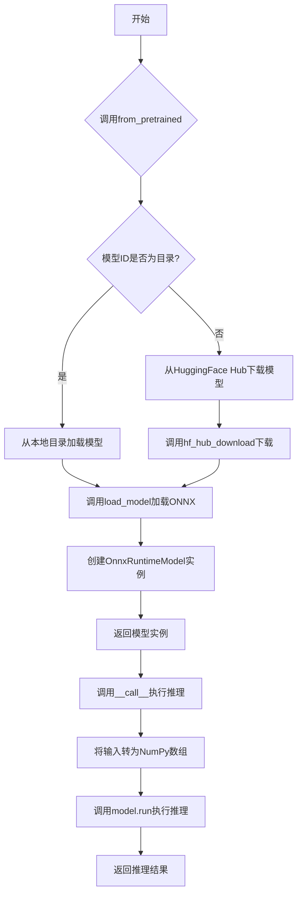
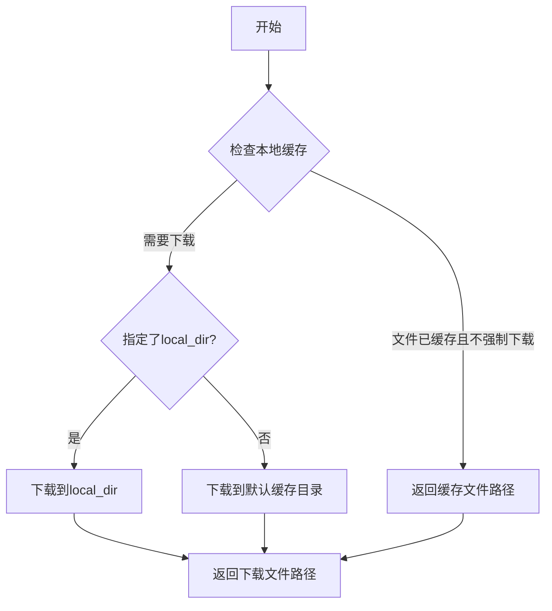
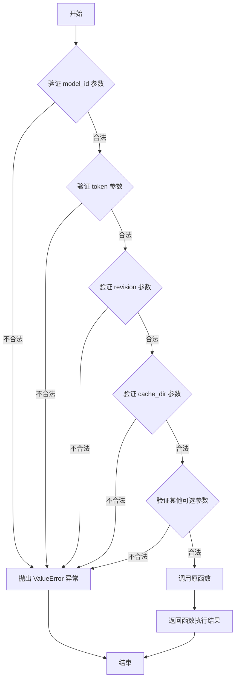
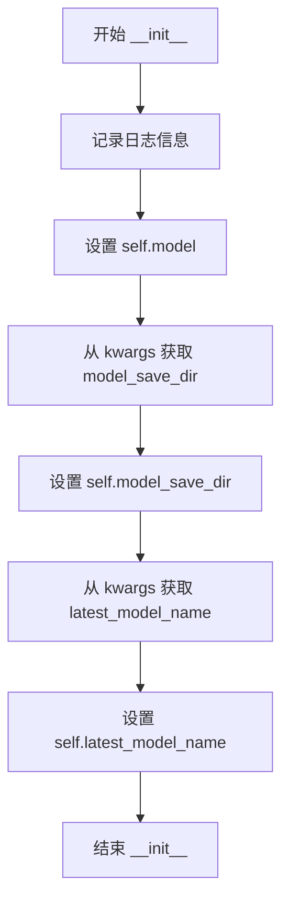
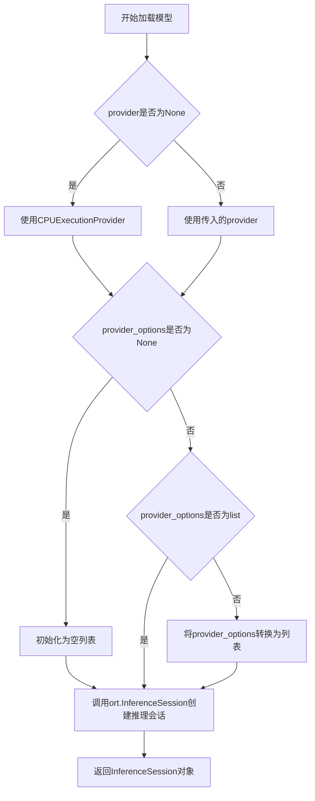
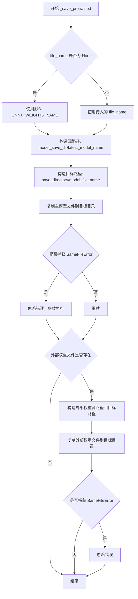
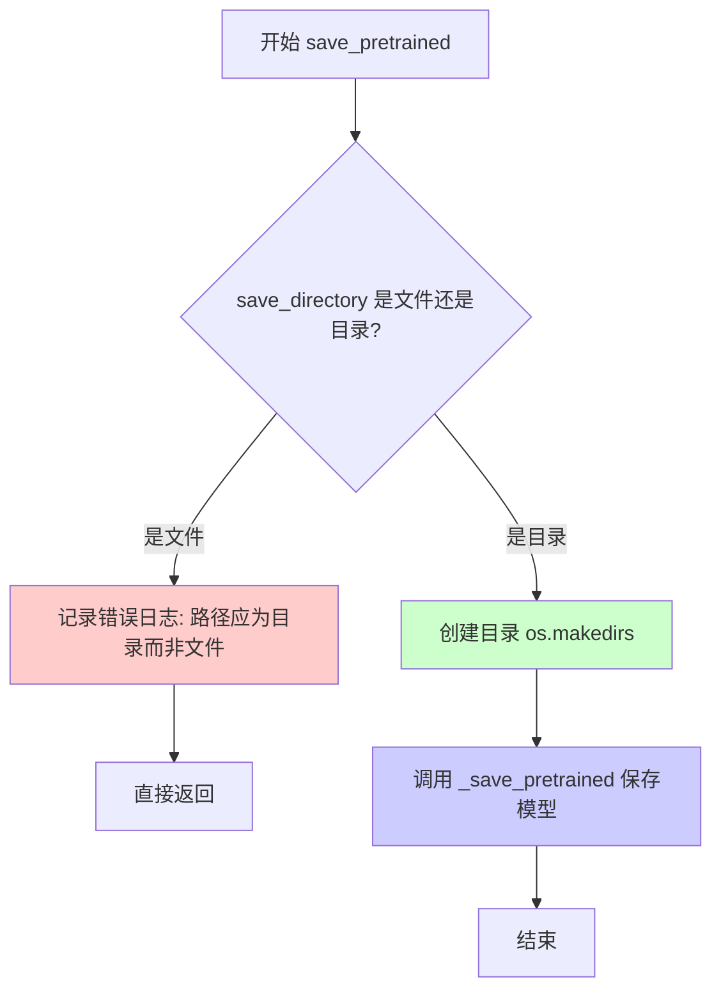
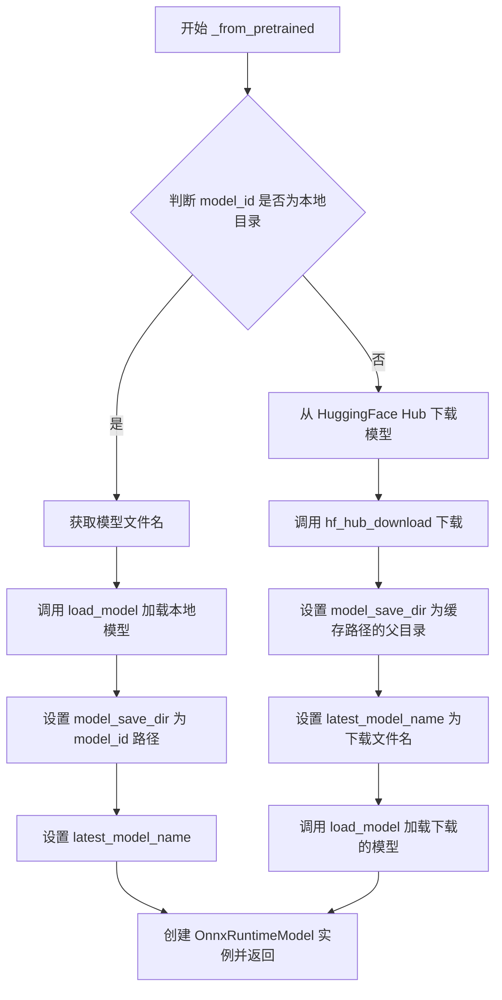
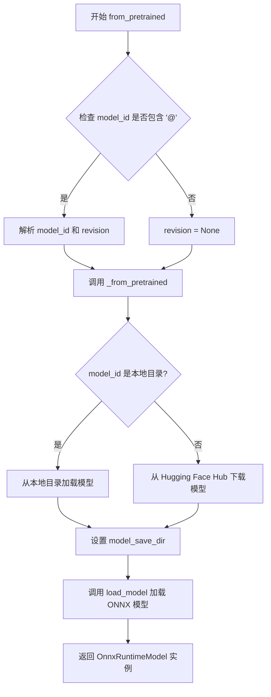

# `diffusers\src\diffusers\pipelines\onnx_utils.py` 详细设计文档

这是一个ONNX Runtime推理模型封装类，属于diffusers库的一部分。该类提供了从本地目录或HuggingFace Hub加载ONNX模型、运行推理、以及保存预训练模型的功能，支持自定义执行提供者（如CPU或CUDA）。

## 整体流程



## 类结构

```
OnnxRuntimeModel (ONNX Runtime模型封装类)
├── __init__: 初始化方法
├── __call__: 推理调用方法
├── load_model: 静态方法 - 加载ONNX模型
├── _save_pretrained: 内部方法 - 保存模型
├── save_pretrained: 公开方法 - 保存预训练模型
├── _from_pretrained: 类方法 - 内部加载方法
└── from_pretrained: 类方法 - 公开加载方法
```

## 全局变量及字段


### `ORT_TO_NP_TYPE`
    
ONNX类型到NumPy类型的映射字典

类型：`dict`
    


### `logger`
    
模块级日志记录器

类型：`logging.Logger`
    


### `OnnxRuntimeModel.model`
    
ONNX推理会话对象

类型：`ort.InferenceSession`
    


### `OnnxRuntimeModel.model_save_dir`
    
模型保存目录路径

类型：`Path | None`
    


### `OnnxRuntimeModel.latest_model_name`
    
最新模型文件名

类型：`str`
    
    

## 全局函数及方法


### `hf_hub_download`

从 HuggingFace Hub 下载指定的文件（模型权重、配置文件等）到本地缓存目录，支持私有仓库和版本控制。

参数：

- `repo_id`：`str`，HuggingFace Hub 上的仓库 ID，格式为 `用户名/仓库名`（如 `facebook/opt-125m`）
- `filename`：`str`，要下载的文件名称
- `token`：`str | bool | None`，用于访问私有或受限制仓库的认证令牌
- `revision`：`str | None`，指定要下载的仓库版本（可以是分支名、标签名或提交 ID）
- `cache_dir`：`str | None`，缓存目录路径，如果不使用默认缓存目录
- `force_download`：`bool`，是否强制重新下载，忽略已缓存的文件（默认为 `False`）
- `local_files_only`：`bool | None`，是否仅使用本地缓存文件，不进行网络请求
- `proxies`：`dict | None`，代理服务器配置
- `resume_download`：`bool | None`，是否断点续传
- `local_dir`：`str | Path | None`，本地目录路径
- `legacy_cache_layout`：`bool | None`，是否使用旧版缓存布局

返回值：`str`，下载文件在本地的缓存路径

#### 流程图



#### 带注释源码

```python
# 在 OnnxRuntimeModel._from_pretrained 方法中的调用位置
# 文件：~OnnxRuntimeModel 类，第143-149行

# load model from hub
else:
    # 下载模型文件
    model_cache_path = hf_hub_download(
        repo_id=model_id,              # 仓库ID，从模型加载请求中传入
        filename=model_file_name,      # 要下载的文件名，默认为"model.onnx"
        token=token,                  # 认证令牌，用于私有仓库
        revision=revision,            # 版本/分支信息
        cache_dir=cache_dir,          # 自定义缓存目录
        force_download=force_download,# 是否强制重新下载
    )
    # 设置模型保存目录为下载文件的父目录
    kwargs["model_save_dir"] = Path(model_cache_path).parent
    # 记录最新下载的文件名
    kwargs["latest_model_name"] = Path(model_cache_path).name
    # 加载ONNX模型
    model = OnnxRuntimeModel.load_model(
        model_cache_path,
        provider=provider,
        sess_options=sess_options,
        provider_options=kwargs.pop("provider_options"),
    )
```

#### 注意事项

1. **函数来源**：`hf_hub_download` 并非在本文件中定义，而是从 `huggingface_hub` 库导入：
   ```python
   from huggingface_hub import hf_hub_download
   ```

2. **调用场景**：此函数在 `OnnxRuntimeModel._from_pretrained` 方法中，当模型 ID 不是本地目录路径时（即从 Hub 加载时）被调用

3. **返回值使用**：返回的缓存路径被进一步用于：
   - 获取父目录作为 `model_save_dir`
   - 获取文件名作为 `latest_model_name`
   - 传递给 `load_model` 方法进行 ONNX 推理会话加载

4. **参数传递**：该函数的参数来源于 `from_pretrained` → `_from_pretrained` 的调用链，最终汇聚了模型标识、认证信息、缓存策略等配置


### `validate_hf_hub_args`

这是 HuggingFace Hub 工具库提供的装饰器函数，用于验证传入 HuggingFace Hub 相关方法（如 `from_pretrained`、`hf_hub_download` 等）的参数（如 `model_id`、`token`、`revision`、`cache_dir` 等）的合法性和格式。该装饰器确保传入的参数符合 HuggingFace Hub 的规范要求。

参数：

-  `func`：`Callable`，被装饰的函数对象，装饰器会验证该函数的参数是否符合 HuggingFace Hub 规范

返回值：`Callable`，返回装饰后的函数对象，该函数在执行前会先验证参数合法性

#### 流程图



#### 带注释源码

```python
# 从 huggingface_hub.utils 模块导入 validate_hf_hub_args 装饰器
# 这是一个外部库函数，用于验证 HuggingFace Hub 相关方法的参数
from huggingface_hub.utils import validate_hf_hub_args


# 使用示例：在 OnnxRuntimeModel 类中应用该装饰器
class OnnxRuntimeModel:
    @classmethod
    @validate_hf_hub_args  # 装饰器：验证从 HuggingFace Hub 加载模型时的参数
    def _from_pretrained(
        cls,
        model_id: str | Path,
        token: bool | str | None = None,
        revision: str | None = None,
        force_download: bool = False,
        cache_dir: str | None = None,
        file_name: str | None = None,
        provider: str | None = None,
        sess_options: "ort.SessionOptions" | None = None,
        **kwargs,
    ):
        """
        从本地目录或 HuggingFace Hub 加载模型
        @validate_hf_hub_args 装饰器会验证：
        - model_id: 必须是有效的仓库ID格式
        - token: 必须是字符串、布尔值或 None
        - revision: 必须是字符串或 None
        - cache_dir: 必须是有效的目录路径或 None
        """
        # 函数实现...
        pass

    @classmethod
    @validate_hf_hub_args  # 同样应用该装饰器到 from_pretrained 方法
    def from_pretrained(
        cls,
        model_id: str | Path,
        force_download: bool = True,
        token: str | None = None,
        cache_dir: str | None = None,
        **model_kwargs,
    ):
        # 函数实现...
        pass
```

#### 补充说明

该装饰器是 HuggingFace Hub 库内部实现的参数验证机制，主要验证以下参数：

| 参数名称 | 验证规则 |
|---------|---------|
| `model_id` | 必须是有效的 HuggingFace Hub 仓库标识符（如 `"username/model"` 或 `"model_id@revision"`） |
| `token` | 必须是字符串、布尔值或 None |
| `revision` | 必须是字符串或 None，通常是分支名、标签名或提交 ID |
| `cache_dir` | 必须是有效的目录路径字符串或 None |
| `force_download` | 必须是布尔值 |
| `proxies` | 必须是字典或 None（如果使用） |

该装饰器通过静态类型检查和格式验证，确保传入 HuggingFace Hub API 的参数符合预期格式，从而提前捕获潜在错误并提供友好的错误信息。


### OnnxRuntimeModel.__init__

该方法是 `OnnxRuntimeModel` 类的构造函数，用于初始化 ONNX Runtime 推理模型的实例。它接受一个可选的模型对象和关键字参数，并设置模型保存目录和最新模型名称等属性。

参数：

- `self`：`OnnxRuntimeModel`，类的实例本身
- `model`：任意类型（可选），传入的 ONNX Runtime 推理会话对象，默认为 `None`
- `**kwargs`：关键字参数，可选的额外配置参数，包括：
  - `model_save_dir`：`str | Path | None`，模型保存目录，默认为 `None`
  - `latest_model_name`：`str`，最新模型文件名，默认为 `ONNX_WEIGHTS_NAME`

返回值：无（`__init__` 方法不返回任何值，仅初始化实例属性）

#### 流程图



#### 带注释源码

```python
def __init__(self, model=None, **kwargs):
    """
    初始化 OnnxRuntimeModel 实例
    
    参数:
        model: 可选的 ONNX Runtime 推理会话对象，默认为 None
        **kwargs: 关键字参数，可包含 model_save_dir 和 latest_model_name
    """
    # 记录一条信息，表明该类是实验性的，未来可能会更改
    logger.info("`diffusers.OnnxRuntimeModel` is experimental and might change in the future.")
    
    # 将传入的模型对象存储为实例属性
    self.model = model
    
    # 从 kwargs 中获取模型保存目录，如果未提供则默认为 None
    self.model_save_dir = kwargs.get("model_save_dir", None)
    
    # 从 kwargs 中获取最新模型名称，如果未提供则使用默认的 ONNX_WEIGHTS_NAME
    self.latest_model_name = kwargs.get("latest_model_name", ONNX_WEIGHTS_NAME)
```


### `OnnxRuntimeModel.__call__`

该方法是 `OnnxRuntimeModel` 类的可调用接口，允许直接对模型实例传入输入参数进行推理。它接收任意关键字参数作为模型输入，将输入值转换为 NumPy 数组后，调用 ONNX Runtime 推理引擎执行前向传播并返回模型输出结果。

参数：

- `**kwargs`：`任意类型`，可变关键字参数，接收任意数量的模型输入。参数名对应 ONNX 模型定义的输入张量名称，参数值应为可转换为 NumPy 数组的数据（如 Python 列表、NumPy 数组或 PyTorch 张量等）

返回值：`List[numpy.ndarray]`，返回模型推理的输出结果列表。列表中的每个元素对应模型的一个输出节点，类型为 NumPy 数组。

#### 流程图

```mermaid
flowchart TD
    A[开始 __call__] --> B[接收 \*\*kwargs]
    B --> C[遍历 kwargs.items]
    C --> D{遍历结束?}
    D -->|否| E[获取键值对 k, v]
    E --> F[v 转换为 NumPy 数组]
    F --> G[构建 inputs 字典<br/>inputs[k] = np.array(v)]
    G --> C
    D -->|是| H[调用 self.model.run<br/>参数: None, inputs]
    H --> I[ONNX Runtime 执行推理]
    I --> J[返回输出列表]
    J --> K[结束]
```

#### 带注释源码

```python
def __call__(self, **kwargs):
    """
    使用 ONNX Runtime 模型执行推理的调用接口。
    
    该方法允许将 OnnxRuntimeModel 实例作为函数调用，
    简化了模型推理的调用方式。
    """
    # 将所有关键字参数转换为字典
    # 键为输入名称（字符串），值为 NumPy 数组
    # np.array() 会将 Python 列表、numpy.ndarray 或类似数组对象转换为 numpy 数组
    inputs = {k: np.array(v) for k, v in kwargs.items()}
    
    # 调用 ONNX Runtime 推理会话的 run 方法
    # 第一个参数 None: 表示返回模型的所有输出节点结果
    # 第二个参数 inputs: 包含所有输入张量的字典
    # 返回值为输出列表，每个元素对应一个输出节点
    return self.model.run(None, inputs)
```


### `OnnxRuntimeModel.load_model`

该方法是一个静态方法，用于从指定路径加载 ONNX 模型，并创建一个 ONNX Runtime 推理会话，支持指定不同的执行提供者（如 CPUExecutionProvider 或 CUDAExecutionProvider），默认使用 CPUExecutionProvider。

参数：

- `path`：`str | Path`，模型文件的路径，可以是字符串或 Path 对象
- `provider`：`str | None`，ONNX Runtime 执行提供者，默认为 CPUExecutionProvider
- `sess_options`：`ort.SessionOptions | None`，会话选项，用于配置推理会话的行为
- `provider_options`：`list | dict | None`，提供者选项，用于配置特定执行提供者的参数

返回值：`ort.InferenceSession`，返回 ONNX Runtime 推理会话对象，用于执行模型推理

#### 流程图



#### 带注释源码

```python
@staticmethod
def load_model(path: str | Path, provider=None, sess_options=None, provider_options=None):
    """
    Loads an ONNX Inference session with an ExecutionProvider. Default provider is `CPUExecutionProvider`

    Arguments:
        path (`str` or `Path`):
            Directory from which to load
        provider(`str`, *optional*):
            Onnxruntime execution provider to use for loading the model, defaults to `CPUExecutionProvider`
    """
    # 如果没有指定提供者，默认使用 CPUExecutionProvider
    if provider is None:
        logger.info("No onnxruntime provider specified, using CPUExecutionProvider")
        provider = "CPUExecutionProvider"

    # 处理 provider_options，确保其为列表格式
    if provider_options is None:
        provider_options = []
    elif not isinstance(provider_options, list):
        provider_options = [provider_options]

    # 创建并返回 ONNX Runtime 推理会话
    return ort.InferenceSession(
        path, providers=[provider], sess_options=sess_options, provider_options=provider_options
    )
```


### `OnnxRuntimeModel._save_pretrained`

该方法负责将ONNX Runtime模型及其配置文件保存到指定目录，支持自定义文件名，并处理大于2GB模型所需的外部权重文件（ONNX External Weights）。

参数：

- `self`：`OnnxRuntimeModel`实例本身，隐式参数，表示当前模型对象
- `save_directory`：`str | Path`，目标目录路径，用于保存模型文件
- `file_name`：`str | None`，可选参数，用于覆盖默认模型文件名（默认值为`ONNX_WEIGHTS_NAME`，即"model.onnx"）
- `**kwargs`：可变关键字参数，用于传递额外参数（当前未使用，保留为扩展性）

返回值：`None`，该方法无返回值，直接将模型文件写入磁盘

#### 流程图



#### 带注释源码

```python
def _save_pretrained(self, save_directory: str | Path, file_name: str | None = None, **kwargs):
    """
    Save a model and its configuration file to a directory, so that it can be re-loaded using the
    [`~optimum.onnxruntime.modeling_ort.ORTModel.from_pretrained`] class method. It will always save the
    latest_model_name.

    Arguments:
        save_directory (`str` or `Path`):
            Directory where to save the model file.
        file_name(`str`, *optional*):
            Overwrites the default model file name from `"model.onnx"` to `file_name`. This allows you to save the
            model with a different name.
    """
    # 确定最终使用的文件名：如果传入了file_name则使用，否则使用默认的ONNX_WEIGHTS_NAME常量
    model_file_name = file_name if file_name is not None else ONNX_WEIGHTS_NAME

    # 构造源路径：从model_save_dir中获取最新模型名称对应的文件
    src_path = self.model_save_dir.joinpath(self.latest_model_name)
    # 构造目标路径：目标目录 + 自定义文件名
    dst_path = Path(save_directory).joinpath(model_file_name)
    try:
        # 使用shutil.copyfile进行文件复制（仅复制内容，不复制元数据）
        shutil.copyfile(src_path, dst_path)
    except shutil.SameFileError:
        # 如果源文件和目标文件相同（已存在），则忽略错误继续执行
        pass

    # 处理外部权重文件（用于大于2GB的模型，ONNX会将权重拆分到外部文件）
    # 构造外部权重文件的源路径
    src_path = self.model_save_dir.joinpath(ONNX_EXTERNAL_WEIGHTS_NAME)
    # 检查外部权重文件是否存在
    if src_path.exists():
        # 构造外部权重文件的目标路径
        dst_path = Path(save_directory).joinpath(ONNX_EXTERNAL_WEIGHTS_NAME)
        try:
            # 复制外部权重文件到目标目录
            shutil.copyfile(src_path, dst_path)
        except shutil.SameFileError:
            # 如果文件已存在则忽略错误
            pass
```


### `OnnxRuntimeModel.save_pretrained`

该方法用于将ONNX Runtime模型保存到指定目录，以便后续可以通过`from_pretrained`方法重新加载模型。方法会验证保存路径为目录而非文件，创建目标目录（如果不存在），然后调用内部方法`_save_pretrained`完成实际的模型文件保存工作。

参数：

- `save_directory`：`str | os.PathLike`，要保存模型的目标目录路径。如果目录不存在将自动创建。
- `**kwargs`：可变关键字参数，会传递给内部的`_save_pretrained`方法，用于指定文件名等额外配置。

返回值：`None`，该方法直接保存模型到文件系统，不返回任何值。

#### 流程图



#### 带注释源码

```python
def save_pretrained(
    self,
    save_directory: str | os.PathLike,
    **kwargs,
):
    """
    Save a model to a directory, so that it can be re-loaded using the [`~OnnxModel.from_pretrained`] class
    method.:

    Arguments:
        save_directory (`str` or `os.PathLike`):
            Directory to which to save. Will be created if it doesn't exist.
    """
    # 检查提供的路径是否为文件，若是则记录错误并提前返回
    if os.path.isfile(save_directory):
        logger.error(f"Provided path ({save_directory}) should be a directory, not a file")
        return

    # 确保目标目录存在，不存在则创建（exist_ok=True 避免已存在时报错）
    os.makedirs(save_directory, exist_ok=True)

    # 调用内部方法保存模型权重和配置文件
    self._save_pretrained(save_directory, **kwargs)
```


### OnnxRuntimeModel._from_pretrained

这是一个类方法，用于从本地目录或HuggingFace Hub加载ONNX Runtime模型。它支持从本地文件系统加载已保存的模型，或从远程仓库下载模型，并返回一个封装了ONNX推理会话的 `OnnxRuntimeModel` 实例。

参数：

- `cls`：类型 `type`，调用该类方法的类本身
- `model_id`：类型 `str | Path`，模型标识符，可以是本地目录路径或HuggingFace Hub上的模型仓库ID
- `token`：类型 `bool | str | None`，用于从私有或受限仓库加载模型的认证token
- `revision`：类型 `str | None`，指定要使用的模型版本，可以是分支名、标签名或提交ID
- `force_download`：类型 `bool`，是否强制重新下载模型文件，默认为 `False`
- `cache_dir`：类型 `str | None`，指定下载模型的缓存目录路径
- `file_name`：类型 `str | None`，指定要加载的模型文件名，覆盖默认的 `"model.onnx"`
- `provider`：类型 `str | None`，ONNX Runtime执行提供者，如 `"CPUExecutionProvider"` 或 `"CUDAExecutionProvider"`
- `sess_options`：类型 `ort.SessionOptions | None`，ONNX Runtime会话配置选项
- `kwargs`：类型 `Dict`，其他可选参数，将传递给模型初始化（如 `provider_options`）

返回值：`OnnxRuntimeModel`，返回一个封装了ONNX推理会话的模型实例，包含 `model`、`model_save_dir` 和 `latest_model_name` 属性

#### 流程图



#### 带注释源码

```python
@classmethod
@validate_hf_hub_args  # 装饰器：验证 HuggingFace Hub 参数的有效性
def _from_pretrained(
    cls,  # 类方法：接收类本身作为第一个参数
    model_id: str | Path,  # 模型ID，本地路径或Hub仓库ID
    token: bool | str | None | None = None,  # 认证token
    revision: str | None | None = None,  # 版本/分支/提交ID
    force_download: bool = False,  # 是否强制下载
    cache_dir: str | None = None,  # 缓存目录
    file_name: str | None = None,  # 模型文件名
    provider: str | None = None,  # ONNX Runtime执行提供者
    sess_options: "ort.SessionOptions" | None = None,  # 会话选项
    **kwargs,  # 其他参数（如 provider_options）
):
    """
    Load a model from a directory or the HF Hub.

    Arguments:
        model_id (`str` or `Path`):
            Directory from which to load
        token (`str` or `bool`):
            Is needed to load models from a private or gated repository
        revision (`str`):
            Revision is the specific model version to use. It can be a branch name, a tag name, or a commit id
        cache_dir (`str | Path`, *optional*):
            Path to a directory in which a downloaded pretrained model configuration should be cached if the
            standard cache should not be used.
        force_download (`bool`, *optional*, defaults to `False`):
            Whether or not to force the (re-)download of the model weights and configuration files, overriding the
            cached versions if they exist.
        file_name(`str`):
            Overwrites the default model file name from `"model.onnx"` to `file_name`. This allows you to load
            different model files from the same repository or directory.
        provider(`str`):
            The ONNX runtime provider, e.g. `CPUExecutionProvider` or `CUDAExecutionProvider`.
        kwargs (`Dict`, *optional*):
            kwargs will be passed to the model during initialization
    """
    # 确定要加载的模型文件名，默认使用 ONNX_WEIGHTS_NAME ("model.onnx")
    model_file_name = file_name if file_name is not None else ONNX_WEIGHTS_NAME
    
    # 判断是本地加载还是远程下载
    if os.path.isdir(model_id):
        # ========== 加载本地模型 ==========
        model = OnnxRuntimeModel.load_model(
            Path(model_id, model_file_name).as_posix(),  # 拼接完整路径
            provider=provider,  # 执行提供者
            sess_options=sess_options,  # 会话选项
            provider_options=kwargs.pop("provider_options"),  # 弹出provider_options参数
        )
        kwargs["model_save_dir"] = Path(model_id)  # 保存模型目录路径
    else:
        # ========== 从 HuggingFace Hub 加载 ==========
        # 下载模型文件到缓存目录
        model_cache_path = hf_hub_download(
            repo_id=model_id,  # 仓库ID
            filename=model_file_name,  # 文件名
            token=token,  # 认证token
            revision=revision,  # 版本
            cache_dir=cache_dir,  # 缓存目录
            force_download=force_download,  # 是否强制下载
        )
        # 设置模型保存目录为缓存路径的父目录
        kwargs["model_save_dir"] = Path(model_cache_path).parent
        # 设置最新模型名称为下载的文件名
        kwargs["latest_model_name"] = Path(model_cache_path).name
        # 加载下载的ONNX模型
        model = OnnxRuntimeModel.load_model(
            model_cache_path,
            provider=provider,
            sess_options=sess_options,
            provider_options=kwargs.pop("provider_options"),
        )
    
    # 创建并返回 OnnxRuntimeModel 实例
    return cls(model=model, **kwargs)
```


### `OnnxRuntimeModel.from_pretrained`

从预训练模型加载 ONNX Runtime 模型的类方法，支持从本地目录或 Hugging Face Hub 加载模型，并返回配置好的 `OnnxRuntimeModel` 实例。

参数：

- `cls`：类型，当前类（OnnxRuntimeModel）
- `model_id`：`str | Path`，模型标识符，可以是本地目录路径或 Hugging Face Hub 上的模型仓库ID
- `force_download`：`bool = True`，是否强制下载模型文件，即使缓存中已存在
- `token`：`str | None = None`，访问私有或受限制模型仓库所需的 Hugging Face token
- `cache_dir`：`str | None = None`，模型缓存目录路径
- `**model_kwargs`：可选，关键字参数，会传递给底层的 `_from_pretrained` 方法（如 `provider`、`sess_options`、`provider_options` 等）

返回值：`OnnxRuntimeModel`，返回加载完成的 ONNX Runtime 模型实例

#### 流程图



#### 带注释源码

```python
@classmethod
@validate_hf_hub_args
def from_pretrained(
    cls,
    model_id: str | Path,
    force_download: bool = True,
    token: str | None = None,
    cache_dir: str | None = None,
    **model_kwargs,
):
    """
    从预训练模型加载 ONNX Runtime 模型
    
    参数:
        model_id: 模型标识符，本地路径或 Hugging Face Hub 模型ID
        force_download: 是否强制下载，默认True
        token: Hugging Face 访问令牌
        cache_dir: 缓存目录
        **model_kwargs: 传递给底层方法的额外参数
    """
    # 初始化revision为None
    revision = None
    
    # 检查model_id是否包含版本信息（格式：model_id@revision）
    if len(str(model_id).split("@")) == 2:
        # 分离model_id和revision
        model_id, revision = model_id.split("@")

    # 调用内部方法_from_pretrained完成实际的加载工作
    return cls._from_pretrained(
        model_id=model_id,
        revision=revision,
        cache_dir=cache_dir,
        force_download=force_download,
        token=token,
        **model_kwargs,
    )
```

## 关键组件


### OnnxRuntimeModel 类

核心模型类，封装ONNX Runtime推理功能，提供模型加载、保存和推理调用能力。

### ORT_TO_NP_TYPE 全局映射

ONNX Runtime数据类型到NumPy数据类型的映射字典，支持bool、int8、uint8、int16、uint16、int32、uint32、int64、uint64、float16、float32、float64等数据类型。

### load_model 静态方法

加载ONNX模型的静态方法，支持指定ONNX Runtime执行提供者（provider），默认使用CPUExecutionProvider，可自定义会话选项和提供者选项，返回onnxruntime InferenceSession对象。

### __call__ 方法

模型调用入口，将输入 kwargs 转换为NumPy数组并执行模型推理，返回模型输出结果。

### _save_pretrained 方法

内部方法，负责将模型文件复制到指定目录，包括主模型文件和外部权重文件（用于超过2GB的模型），处理SameFileError异常。

### save_pretrained 公开方法

公开的模型保存接口，创建目标目录（如果不存在）并调用内部_save_pretrained方法完成模型保存。

### _from_pretrained 类方法

从预训练模型加载的内部实现，支持从本地目录或HuggingFace Hub加载模型，处理模型缓存和提供者选项。

### from_pretrained 公开类方法

公开的模型加载入口，支持通过 "@" 分隔符指定模型版本（revision），解析模型ID并调用_from_pretrained完成加载。

### 张量索引与惰性加载

通过hf_hub_download实现模型的惰性加载，仅在需要时从HuggingFace Hub下载模型，cache_dir参数支持自定义缓存目录。

### 反量化支持

ORT_TO_NP_TYPE映射表支持ONNX量化类型（如int8、uint8等）到NumPy类型的转换，实现反量化功能。

### 量化策略支持

代码通过支持多种ONNX张量类型（float16、int8、uint8等）间接支持不同的量化策略，允许加载使用不同量化方式的ONNX模型。

### 外部依赖与接口契约

依赖huggingface_hub、onnxruntime、numpy等库，提供from_pretrained和save_pretrained统一接口，与HuggingFace生态系统集成。


## 问题及建议


### 已知问题

- **类型标注冗余错误**：`token: bool | str | None | None = None` 和 `revision: str | None | None = None` 包含冗余的 `None`，这是类型注解的错误
- **Provider Options 未提供时的 KeyError**：在 `_from_pretrained` 方法中连续两次调用 `kwargs.pop("provider_options")`，当调用者未传入该参数时会抛出 `KeyError` 异常
- **异常处理不完善**：`_save_pretrained` 方法仅捕获 `SameFileError`，对于文件权限问题、磁盘空间不足、目标文件被占用等常见 IO 异常未做处理
- **保存路径校验不严格**：`save_pretrained` 方法在 `save_directory` 为文件时仅记录错误日志后返回，调用者无法区分是否保存成功，可能导致后续逻辑问题
- **模型对象可变性风险**：构造函数直接接收 model 对象并赋值给实例变量 `self.model`，调用者可能后续修改该对象导致内部状态不一致
- **无资源清理机制**：类中未实现 `__del__` 或上下文管理器协议，无法确保 ONNX Runtime 会话资源被正确释放

### 优化建议

- 修正类型注解中的冗余 `| None`，使用 `bool | str | None` 和 `str | None` 格式
- 为 `provider_options` 提供默认值处理，避免多次 `pop` 操作导致的潜在 KeyError
- 扩展异常捕获范围，处理 `IOError`、`OSError` 等更多 IO 异常情况
- `save_pretrained` 在路径错误时应抛出异常或返回明确的成功/失败状态
- 考虑添加模型验证逻辑，在加载后检查模型输入输出节点是否符合预期
- 实现 `__enter__` 和 `__exit__` 方法以支持上下文管理器用法
- 添加模型元数据存储机制，记录模型配置信息便于追溯


## 其它


### 设计目标与约束

本模块的设计目标是提供一个统一的 `OnnxRuntimeModel` 类，用于加载、运行和保存 ONNX Runtime 模型，支持从本地目录或 Hugging Face Hub 加载模型。主要约束包括：仅支持 ONNX 格式的模型文件，默认使用 `CPUExecutionProvider`，不支持模型推理外的训练或优化功能。

### 错误处理与异常设计

代码中的错误处理主要包括：1) `save_pretrained` 方法中，当传入的 `save_directory` 是文件而非目录时，记录错误日志并提前返回；2) `_save_pretrained` 方法中，使用 `try-except` 捕获 `shutil.SameFileError` 异常，避免重复复制相同文件；3) `load_model` 方法未显式处理异常，由上层调用者处理；4) 缺少对模型文件不存在、ONNX 模型格式错误、provider 不支持等情况的异常处理。

### 数据流与状态机

数据流如下：1) 用户调用 `from_pretrained` 加载模型；2) 如果是本地目录，直接调用 `load_model` 加载；3) 如果是 Hub 地址，先调用 `hf_hub_download` 下载模型到缓存，再调用 `load_model` 加载；4) 加载后的模型保存在 `self.model` 属性中；5) 调用 `__call__` 方法进行推理时，输入的 kwargs 被转换为 numpy 数组，传递给 `model.run` 执行推理；6) 调用 `save_pretrained` 保存模型时，从 `model_save_dir` 复制模型文件到目标目录。

### 外部依赖与接口契约

主要外部依赖包括：1) `onnxruntime` (简称 `ort`) - 用于加载和运行 ONNX 模型；2) `huggingface_hub` - 用于从 Hugging Face Hub 下载模型；3) `numpy` - 用于数据转换；4) `pathlib`、`shutil`、`os` - 用于文件操作。接口契约方面：`load_model` 静态方法接受 `path`、`provider`、`sess_options`、`provider_options` 参数，返回 `ort.InferenceSession` 对象；`__call__` 方法接受任意关键字参数，返回模型推理结果列表；`_from_pretrained` 类方法接受模型ID、token、revision等参数，返回 `OnnxRuntimeModel` 实例。

### 性能考虑与优化空间

当前实现存在以下性能优化空间：1) `__call__` 方法中每次调用都会创建新的 numpy 数组，可考虑缓存机制；2) 缺少对批量推理的优化支持；3) 缺少对模型预热（warmup）的支持；4) 加载模型时未设置会话选项（SessionOptions），无法启用图优化、并行执行等高级特性；5) 未支持多 provider 加载（如 CPU + GPU 协同）。

### 安全性考虑

代码中的安全考虑包括：1) 使用 `validate_hf_hub_args` 装饰器验证 Hugging Face Hub 参数；2) `from_pretrained` 支持 `token` 参数进行身份验证；3) `force_download` 参数允许控制是否强制下载。但存在以下安全风险：1) 未验证下载的 ONNX 模型文件的完整性；2) 未对模型输入进行安全检查（如恶意构造的输入shape）；3) `provider_options` 直接透传给 onnxruntime，可能存在注入风险。

### 版本兼容性

代码中的版本兼容性问题包括：1) 使用了 Python 3.9+ 的类型提示语法（如 `str | Path`）；2) 依赖 `is_onnx_available()` 检查 ONNX 是否可用，但未提供缺失时的明确错误信息；3) `ort.SessionOptions` 类型注解使用了字符串引号包裹（`"ort.SessionOptions"`），表明可能存在类型检查问题；4) 未声明对特定版本 onnxruntime 的依赖。

### 配置管理

当前配置通过以下方式管理：1) `model_save_dir` - 模型保存目录；2) `latest_model_name` - 最新模型文件名，默认为 `ONNX_WEIGHTS_NAME`；3) `provider` - ONNX Runtime 执行提供者；4) `sess_options` - 会话选项；5) `provider_options` - 提供者选项。配置主要通过构造函数和类方法参数传入，缺少统一的配置类或配置文件支持。

### 使用示例与最佳实践

```python
# 从本地目录加载模型
model = OnnxRuntimeModel.from_pretrained("/path/to/onnx/model")

# 从 Hugging Face Hub 加载模型
model = OnnxRuntimeModel.from_pretrained("username/model-name", token="your-token")

# 指定 GPU provider
model = OnnxRuntimeModel.from_pretrained("username/model-name", provider="CUDAExecutionProvider")

# 推理调用
output = model(input_tensor=some_numpy_array)

# 保存模型
model.save_pretrained("/path/to/save/model")
```

最佳实践包括：1) 生产环境指定具体的 provider 而非默认 CPU；2) 使用会话选项优化推理性能；3) 妥善管理 Hugging Face token，避免硬编码；4) 对于大于 2GB 的模型，系统会自动处理外部权重文件。


    