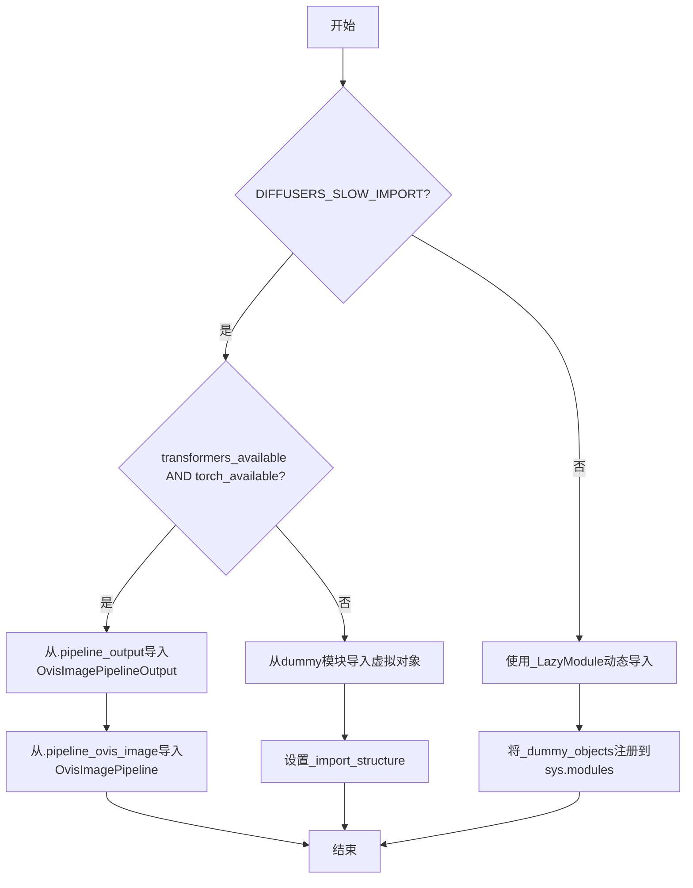

# `diffusers\src\diffusers\pipelines\ovis_image\__init__.py` 详细设计文档

该文件是Ovis图像生成流水线的延迟导入模块，通过条件检查torch和transformers的可用性，动态决定导入实际的OvisImagePipeline和OvisImagePipelineOutput类，还是使用虚拟对象，以保证在没有可选依赖时模块仍可被导入。

## 整体流程



## 类结构

```
LazyImportModule (Ovis流水线初始化)
└── 条件分支: TYPE_CHECKING/DIFFUSERS_SLOW_IMPORT 或运行时
```

## 全局变量及字段


### `_dummy_objects`
    
存储虚拟对象的字典，用于在可选依赖不可用时提供延迟加载的占位符对象

类型：`Dict[str, Any]`
    


### `_import_structure`
    
定义模块导入结构的字典，键为模块名，值为该模块导出的对象名称列表

类型：`Dict[str, List[str]]`
    


    

## 全局函数及方法


## 关键组件


### 延迟加载模块机制

通过 `_LazyModule` 实现模块的惰性加载，在 `DIFFUSERS_SLOW_IMPORT` 为真或 `TYPE_CHECKING` 时才真正导入实际模块，否则将模块注册为延迟加载模块，提高导入速度。

### 可选依赖检查与降级处理

使用 `is_transformers_available()` 和 `is_torch_available()` 检查 torch 和 transformers 依赖是否可用，当依赖不可用时抛出 `OptionalDependencyNotAvailable` 异常并从 dummy 模块加载替代对象，保证代码在缺少可选依赖时仍能部分运行。

### 动态模块与对象注册

通过 `sys.modules` 动态注册模块和对象，使用 `setattr` 将 `_dummy_objects` 中的虚拟对象挂载到当前模块，使模块在没有实际依赖时也能被正常导入。

### 导入结构定义

`_import_structure` 字典定义了模块的公共接口，包括 `OvisImagePipelineOutput` 和 `OvisImagePipeline` 两个可导出类，用于支持 `from ... import *` 的导入方式。

### 类型检查支持

通过 `TYPE_CHECKING` 条件分支，在类型检查时导入实际类用于类型注解，避免运行时不必要的导入，同时保持类型信息的完整性。


## 问题及建议


### 已知问题

-   **重复的依赖检查逻辑**：在 `try-except` 块和 `TYPE_CHECKING` 条件分支中，存在完全相同的可选依赖检查代码（`if not (is_transformers_available() and is_torch_available())`），违反了 DRY 原则，增加维护成本。
-   **魔法字符串散落**：`"pipeline_output"` 和 `"pipeline_ovis_image"` 等字符串字面量直接硬编码在代码中，如果模块名或导出名变更，需要手动修改多处，容易遗漏。
-   **条件逻辑重复**：在 `if TYPE_CHECKING or DIFFUSERS_SLOW_IMPORT:` 分支内部，又重复了一套完整的 `try-except OptionalDependencyNotAvailable` 检查，与外层逻辑高度相似，可抽取为独立函数。
-   **导入结构不一致**：`_import_structure` 字典仅在 `else` 分支（依赖可用时）被填充键值，在 `except` 分支（依赖不可用）时保持空字典，后续模块导入时可能因键不存在产生潜在问题。
-   **类型注解缺失**：虽然导入了 `TYPE_CHECKING`，但文件中未使用类型注解声明函数参数和返回值，降低了代码的可读性和静态检查能力。
-   **裸 except 子句风险**：虽然此处捕获的是特定异常 `OptionalDependencyNotAvailable`，但若该异常类定义变化或导入路径问题，可能导致意外失败。

### 优化建议

-   **抽取依赖检查函数**：将 `is_transformers_available() and is_torch_available()` 的检查逻辑封装为 `_check_dependencies()` 函数，消除重复代码。
-   **常量定义**：在文件顶部定义常量，例如 `IMPORT_KEYS = ("pipeline_output", "pipeline_ovis_image")`，或使用枚举或数据类管理导入结构。
-   **统一导入结构构建**：无论依赖是否可用，始终填充 `_import_structure`，只是根据条件填充真实对象或虚拟对象（dummy objects），保证导入字典的完整性。
-   **添加类型注解**：为 `_LazyModule` 调用、函数参数等添加类型注解，提升代码自文档化能力。
-   **考虑使用 `importlib.util.find_spec` 动态检查**：在运行时更可靠地检测模块可用性，减少对 `is_xxx_available()` 包装函数的强依赖。


## 其它


### 设计目标与约束

本模块采用延迟加载（Lazy Import）架构，主要目标包括：1）优化Diffusers库的导入速度，避免在初始化时加载所有子模块；2）优雅处理可选依赖（torch和transformers），当依赖不可用时提供降级方案；3）通过Dummy Objects机制确保模块结构完整性，使类型检查和静态分析工具正常工作。设计约束方面，模块要求同时具备torch和transformers方可使用完整功能，且必须遵循Diffusers库的LazyModule规范。

### 错误处理与异常设计

异常处理采用分层设计：核心异常为OptionalDependencyNotAvailable，当检测到torch或transformers不可用时抛出；该异常被try-except捕获后，模块会回退到导入dummy_torch_and_transformers_objects中的替代对象。TYPE_CHECKING分支中同样处理此异常，确保类型检查环境下不会因依赖缺失中断。对于运行时导入失败，LazyModule机制会延迟报错直到实际访问对象那一刻。此外，get_objects_from_module函数调用可能返回空字典或异常，需要确保_dummy_objects和_import_structure的完整性。

### 数据流与状态机

模块初始化存在三种状态路径：1）TYPE_CHECK或DIFFUSERS_SLOW_IMPORT为True时，执行即时导入逻辑；2）否则进入延迟加载模式，由_LazyModule接管；3）当可选依赖不可用时，触发降级状态。数据流向为：检查is_transformers_available()和istorch_available() → 决定是否抛出OptionalDependencyNotAvailable → 根据结果选择导入真实模块或dummy objects → 构建_import_structure字典 → 创建LazyModule实例 → 填充sys.modules。状态转换由DIFFUSERS_SLOW_IMPORT标志和可选依赖可用性共同控制。

### 外部依赖与接口契约

外部依赖严格分为必需和可选两类：可选依赖为torch和transformers，通过is_torch_available()和is_transformers_available()检测；必需依赖包括typing.TYPE_CHECKING、...utils中的_LazyModule、get_objects_from_module、OptionalDependencyNotAvailable等。模块公开接口契约明确：导出OvisImagePipeline和OvisImagePipelineOutput两个类；当依赖不可用时，导出的对象为dummy替代品而非真实类；LazyModule的module_spec必须与__spec__关联以确保反射功能正常。使用方需注意：直接导入可能得到dummy对象，应通过isinstance或hasattr检查可用性。

### 版本兼容性考虑

代码需要考虑Python版本兼容性（_LazyModule仅支持Python 3.7+）、torch版本兼容性（不同版本API可能有差异）、transformers版本兼容性（Pipeline接口可能随版本变化）。建议在文档中明确支持的最低版本号，并提供版本检测逻辑。当前实现未包含版本检查，存在潜在兼容性风险。

### 性能优化建议

当前实现中get_objects_from_module在依赖不可用时仍会被调用，可考虑添加早期返回逻辑；_import_structure字典在模块级别构建，建议确保其中不包含重型对象；LazyModule的globals()["__file__"]引用应添加fallback处理以应对特殊加载场景。

### 安全考量

模块未对_import_structure和_dummy_objects的内容进行校验，理论上存在供应链攻击风险；sys.modules的直接操作需要确保线程安全性；建议在生产环境中对动态导入的对象进行白名单验证。


    