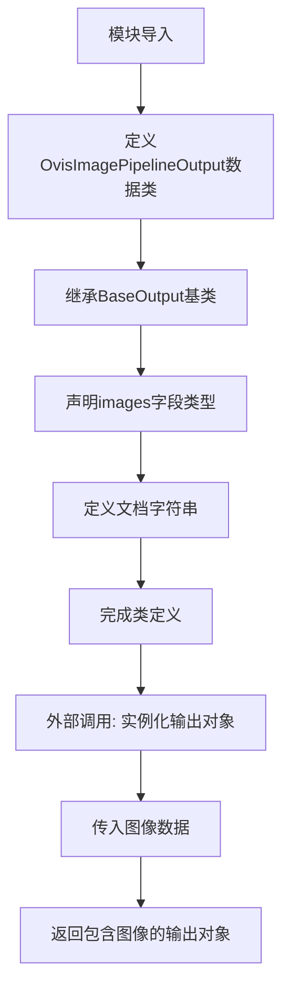

# `diffusers\src\diffusers\pipelines\ovis_image\pipeline_output.py` 详细设计文档

Ovis-Image扩散管道的输出数据类，继承自diffusers库的BaseOutput基类，用于封装去噪后的图像结果，支持PIL.Image图像对象和numpy.ndarray数组两种格式的图像数据存储

## 整体流程



## 类结构

```
BaseOutput (抽象基类)
└── OvisImagePipelineOutput (数据类)
```

## 全局变量及字段


### `OvisImagePipelineOutput.images`
    
去噪后的PIL图像列表或NumPy数组，长度为batch_size，形状为(batch_size, height, width, num_channels)

类型：`list[PIL.Image.Image, np.ndarray]`
    
    

## 全局函数及方法


## 关键组件


### OvisImagePipelineOutput

数据类，继承自`BaseOutput`，用于存储Ovis-Image管道的输出结果。包含一个`images`字段，可以接收PIL图像列表或NumPy数组，封装了去噪后的图像数据。

### images 字段

类型：`list[PIL.Image.Image, np.ndarray]`

描述：存储去噪后的图像，可以是PIL图像列表或NumPy数组，长度对应batch_size，或形状为`(batch_size, height, width, num_channels)`的数组。

### BaseOutput 基类

描述：来自`diffusers.utils`的基类，为管道输出提供标准化的数据结构和序列化支持。

### 依赖外部库

- `dataclasses.dataclass`: Python数据类装饰器
- `numpy`: NumPy数组支持
- `PIL.Image`: PIL图像处理
- `diffusers.utils.BaseOutput`: Diffusers框架基类


## 问题及建议


### 已知问题

-   **类型注解错误**: `list[PIL.Image.Image, np.ndarray]` 在 Python 类型注解中语法不正确。`list[]` 只能接受一个类型参数，当前写法会导致运行时或类型检查器警告。应使用 `Union[list[PIL.Image.Image], np.ndarray]` 或 Python 3.10+ 的 `list[PIL.Image.Image] | np.ndarray`。
-   **类型定义与文档不一致**: 文档字符串描述的是"List of denoised PIL images **or** numpy array"，暗示两者是互斥的联合类型，但类型注解写法模糊且不标准。
-   **缺少数据验证**: 类中没有任何验证逻辑，`images` 字段可能为 `None`、空列表或不符合预期的类型，导致下游处理出错。
-   **序列化边界不明确**: 虽然继承自 `BaseOutput`，但未展示具体的序列化/反序列化方法使用说明，调用方可能不清楚如何正确序列化和反序列化。

### 优化建议

-   **修正类型注解**: 使用正确的联合类型定义，如 `Union[list[PIL.Image.Image], np.ndarray]` 或 `list[PIL.Image.Image] | np.ndarray`。
-   **添加 `__post_init__` 验证**: 在 dataclass 中添加验证逻辑，检查 `images` 是否为有效类型、非空等，提升运行时安全性。
-   **添加类型别名**: 定义 `OvisImageType = Union[list[PIL.Image.Image], np.ndarray]` 提高可读性和可维护性。
-   **完善文档**: 补充序列化/反序列化使用说明，明确 BaseOutput 提供的功能（如 `to_dict`、`from_dict` 等）。
-   **考虑泛型支持**: 若未来输出可能包含多种格式（如 latent tensors），可考虑使用泛型类设计以提高扩展性。


## 其它


### 设计目标与约束

该代码是Ovis-Image扩散流水线的输出类设计，目标是为扩散模型的去噪图像提供标准化的输出数据结构。约束条件包括：必须继承自diffusers库的BaseOutput类，images字段必须支持PIL.Image.Image或np.ndarray两种格式，遵循dataclass设计模式以简化对象创建和属性访问。

### 错误处理与异常设计

由于该类为纯数据容器（dataclass），不涉及业务逻辑处理，因此本身不包含错误处理逻辑。错误处理应由调用该类的上游Pipeline类负责，确保传入的images参数类型正确。类型检查应在Pipeline的forward方法中进行，若传入非法类型应抛出TypeError异常。

### 数据流与状态机

该类作为数据传递的终点，不涉及状态机设计。数据流方向为：扩散模型生成去噪图像 → Pipeline处理并封装 → OvisImagePipelineOutput存储结果 → 返回给用户。images字段可接受列表形式（batch多个图像）或单个图像，Pipeline应确保batch维度的一致性。

### 外部依赖与接口契约

主要外部依赖包括：1）dataclass模块（Python标准库）；2）numpy库，用于数值数组类型；3）PIL.Image库，用于图像处理；4）diffusers.utils.BaseOutput，基类约束。接口契约要求：images字段必须为list类型，内部元素为PIL.Image.Image或np.ndarray，调用方应保证batch_size的一致性。

### 性能考虑

由于仅是数据容器类，无运行时性能开销。内存占用取决于传入图像的数量和分辨率。建议在Pipeline层面进行图像批处理时控制batch_size，避免内存溢出。

### 安全性考虑

该类不涉及文件读写、网络请求或敏感数据处理，安全性风险较低。但需注意：1）传入的图像数据应经过合法性校验；2）避免存储过大的图像数组导致内存安全问题；3）在多进程环境下注意对象序列化问题。

### 版本兼容性

代码使用了Python 3.10+的泛型列表语法（`list[PIL.Image.Image, np.ndarray]`），需确保运行环境的Python版本不低于3.10。numpy和PIL版本应与diffusers库要求保持一致。BaseOutput类的接口在不同版本的diffusers中应保持稳定。

### 使用示例

```python
from PIL import Image
import numpy as np
from ovis_image_pipeline import OvisImagePipelineOutput

# 方式1：PIL图像列表
output = OvisImagePipelineOutput(images=[Image.new('RGB', (256, 256))])

# 方式2：numpy数组列表  
output = OvisImagePipelineOutput(images=[np.zeros((256, 256, 3), dtype=np.uint8)])

# 方式3：混合列表
output = OvisImagePipelineOutput(images=[Image.new('RGB', (256, 256)), np.zeros((256, 256, 3), dtype=np.uint8)])
```

### 测试策略

建议测试用例包括：1）使用PIL图像创建实例；2）使用numpy数组创建实例；3）使用混合类型创建实例；4）验证images属性可访问且类型正确；5）测试dataclass的标准方法（__repr__、__eq__等）是否正常工作；6）测试与BaseOutput基类的兼容性。

### 许可证和版权信息

代码版权声明：Copyright 2025 Alibaba Ovis-Image Team and The HuggingFace Team. 采用Apache License 2.0开源许可证，与diffusers库保持一致。


    