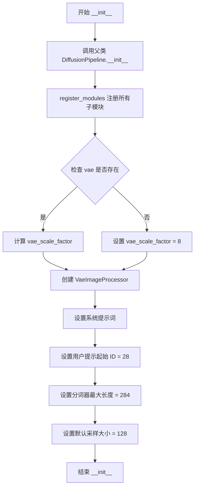
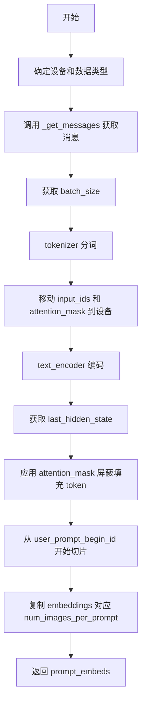
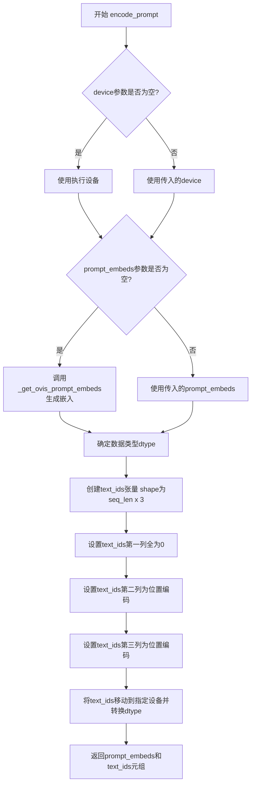
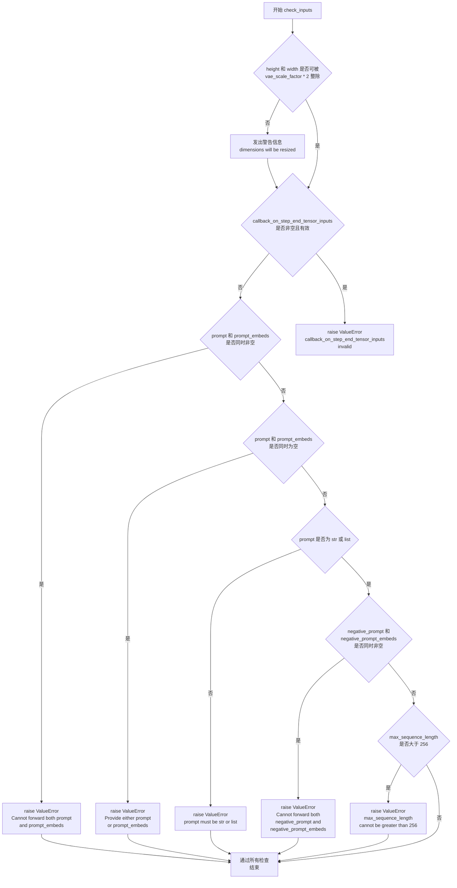
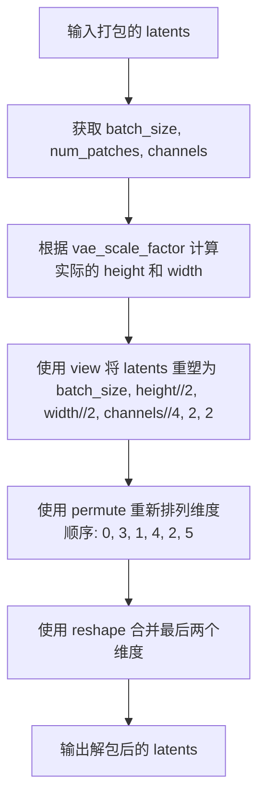
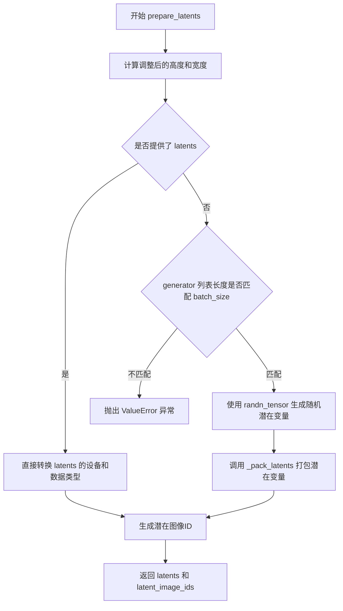

# `diffusers\src\diffusers\pipelines\ovis_image\pipeline_ovis_image.py` 详细设计文档

Ovis-Image Pipeline 是一个基于扩散模型的文本到图像生成管道。它集成了 Qwen3 文本编码器、OvisImageTransformer2DModel 变换器、AutoencoderKL VAE 以及 FlowMatchEulerDiscreteScheduler，通过迭代去噪过程将文本提示转换为图像。

## 整体流程

```mermaid
graph TD
    Start([调用 __call__]) --> CheckInputs{check_inputs}
    CheckInputs -- Invalid --> Error[ValueError]
    CheckInputs -- Valid --> EncodePrompt[encode_prompt]
    EncodePrompt --> PrepareLatents[prepare_latents]
    PrepareLatents --> RetrieveTimesteps[retrieve_timesteps]
    RetrieveTimesteps --> DenoiseLoop{Denoising Loop}
    DenoiseLoop --> ModelFwd[transformer (hidden_states)]
    ModelFwd --> CFGCheck{guidance_scale > 1?}
    CFGCheck -- Yes --> UncondFwd[transformer (uncond)]
    CFGCheck -- No --> MergeCFG
    UncondFwd --> MergeCFG[Apply CFG]
    MergeCFG --> SchedulerStep[scheduler.step]
    SchedulerStep --> DenoiseLoop
    DenoiseLoop -- Finished --> Decode[vae.decode]
    Decode --> Postprocess[image_processor.postprocess]
    Postprocess --> End([返回图像])
```

## 类结构

```
DiffusionPipeline (基类)
└── OvisImagePipeline
```

## 全局变量及字段


### `logger`
    
模块级日志记录器，用于记录管道运行时的信息、警告和错误

类型：`logging.Logger`
    


### `EXAMPLE_DOC_STRING`
    
包含OvisImagePipeline使用示例的文档字符串，展示如何进行文本到图像生成

类型：`str`
    


### `XLA_AVAILABLE`
    
标志位，指示PyTorch XLA是否可用，用于优化TPU设备上的计算性能

类型：`bool`
    


### `calculate_shift`
    
根据图像序列长度计算噪声调度器的shift参数，用于调整去噪过程的中间状态

类型：`Callable[[int, int, int, float, float], float]`
    


### `retrieve_timesteps`
    
从调度器获取去噪过程的时间步序列，支持自定义时间步和sigmas参数

类型：`Callable[..., tuple[torch.Tensor, int]]`
    


### `OvisImagePipeline.vae`
    
变分自编码器模型，负责将图像编码到潜在空间和解码回像素空间

类型：`AutoencoderKL`
    


### `OvisImagePipeline.text_encoder`
    
Qwen3文本编码器模型，将文本提示转换为文本嵌入向量

类型：`Qwen3Model`
    


### `OvisImagePipeline.tokenizer`
    
Qwen2快速分词器，用于将文本分割成token序列

类型：`Qwen2TokenizerFast`
    


### `OvisImagePipeline.transformer`
    
Ovis图像变换模型，执行潜在空间的去噪过程，是核心生成模型

类型：`OvisImageTransformer2DModel`
    


### `OvisImagePipeline.scheduler`
    
Flow Match欧拉离散调度器，控制去噪过程的时间步进和噪声预测

类型：`FlowMatchEulerDiscreteScheduler`
    


### `OvisImagePipeline.vae_scale_factor`
    
VAE缩放因子，用于计算潜在空间的尺寸，基于VAE的通道数

类型：`int`
    


### `OvisImagePipeline.image_processor`
    
VAE图像处理器，负责潜在变量与像素图像之间的预处理和后处理转换

类型：`VaeImageProcessor`
    


### `OvisImagePipeline.system_prompt`
    
系统提示词模板，用于引导模型生成描述性的图像描述

类型：`str`
    


### `OvisImagePipeline.user_prompt_begin_id`
    
用户提示在token序列中的起始位置索引，用于截取用户嵌入

类型：`int`
    


### `OvisImagePipeline.tokenizer_max_length`
    
分词器最大长度，限制输入文本的token数量

类型：`int`
    


### `OvisImagePipeline.default_sample_size`
    
默认采样尺寸，用于生成图像的基础分辨率计算

类型：`int`
    
    

## 全局函数及方法


### `calculate_shift`

该函数用于根据图像序列长度计算动态偏移量（shift），通过线性插值在基础偏移量和最大偏移量之间进行平滑过渡，主要用于扩散模型调度器（FlowMatchEulerDiscreteScheduler）的时间步偏移配置，以适应不同分辨率图像的生成需求。

参数：

- `image_seq_len`：`int`，输入的图像序列长度，决定最终偏移量
- `base_seq_len`：`int`，基础序列长度，默认为 256，用于线性方程的基准点
- `max_seq_len`：`int`，最大序列长度，默认为 4096，用于线性方程的基准点
- `base_shift`：`float`，基础偏移量，默认为 0.5，对应 base_seq_len 时的偏移值
- `max_shift`：`float`，最大偏移量，默认为 1.15，对应 max_seq_len 时的偏移值

返回值：`float`，返回计算得到的偏移量 mu，用于调度器的 sigmas 或 timesteps 计算

#### 流程图

```mermaid
flowchart TD
    A[开始 calculate_shift] --> B[计算斜率 m<br/>m = (max_shift - base_shift) / (max_seq_len - base_seq_len)]
    B --> C[计算截距 b<br/>b = base_shift - m * base_seq_len]
    C --> D[计算偏移量 mu<br/>mu = image_seq_len * m + b]
    D --> E[返回 mu]
    
    style A fill:#f9f,stroke:#333
    style E fill:#9f9,stroke:#333
```

#### 带注释源码

```python
def calculate_shift(
    image_seq_len,          # 输入：图像序列长度，用于确定偏移量
    base_seq_len: int = 256,        # 基础序列长度，默认256
    max_seq_len: int = 4096,        # 最大序列长度，默认4096
    base_shift: float = 0.5,        # 基础偏移量，默认0.5
    max_shift: float = 1.15,        # 最大偏移量，默认1.15
):
    """
    计算动态偏移量，用于扩散模型调度器的时间步调整。
    
    该函数通过线性插值，根据图像序列长度在 base_shift 和 max_shift 之间
    计算一个平滑过渡的偏移量 mu。这是为了适应不同分辨率图像生成的调度需求。
    
    Args:
        image_seq_len: 输入图像的序列长度（latent 空间）
        base_seq_len: 基础序列长度阈值
        max_seq_len: 最大序列长度阈值
        base_shift: 基础偏移量
        max_shift: 最大偏移量
    
    Returns:
        float: 计算得到的偏移量 mu
    """
    # 计算线性方程的斜率 m
    # 斜率 = (最大偏移 - 基础偏移) / (最大序列 - 基础序列)
    m = (max_shift - base_shift) / (max_seq_len - base_seq_len)
    
    # 计算线性方程的截距 b
    # 截距 = 基础偏移 - 斜率 * 基础序列长度
    b = base_shift - m * base_seq_len
    
    # 计算最终的偏移量 mu
    # mu = 图像序列长度 * 斜率 + 截距
    # 这实际上是将 image_seq_len 映射到 [base_shift, max_shift] 区间
    mu = image_seq_len * m + b
    
    return mu
```


### `retrieve_timesteps`

该函数负责调用调度器的 `set_timesteps` 方法并从中获取时间步。它支持自定义时间步和自定义 sigmas，任何额外的关键字参数都会被传递给调度器的 `set_timesteps` 方法。

参数：

- `scheduler`：`SchedulerMixin`，要获取时间步的调度器
- `num_inference_steps`：`int | None`，生成样本时使用的扩散步数。如果使用此参数，`timesteps` 必须为 `None`
- `device`：`str | torch.device | None`，时间步应移动到的设备。如果为 `None`，时间步不会移动
- `timesteps`：`list[int] | None`，用于覆盖调度器时间步间隔策略的自定义时间步。如果传入 `timesteps`，则 `num_inference_steps` 和 `sigmas` 必须为 `None`
- `sigmas`：`list[float] | None`，用于覆盖调度器时间步间隔策略的自定义 sigmas。如果传入 `sigmas`，则 `num_inference_steps` 和 `timesteps` 必须为 `None`
- `**kwargs`：任意关键字参数，将提供给 `scheduler.set_timesteps`

返回值：`tuple[torch.Tensor, int]`，元组中第一个元素是调度器的时间步计划，第二个元素是推理步数

#### 流程图

```mermaid
flowchart TD
    A[开始] --> B{检查timesteps和sigmas是否同时存在}
    B -->|是| C[抛出ValueError: 只能选择timesteps或sigmas之一]
    B -->|否| D{检查timesteps是否不为None}
    D -->|是| E[检查scheduler.set_timesteps是否接受timesteps参数]
    E -->|否| F[抛出ValueError: 当前调度器不支持自定义timesteps]
    E -->|是| G[调用scheduler.set_timesteps(timesteps=timesteps, device=device, **kwargs)]
    G --> H[获取scheduler.timesteps]
    H --> I[计算num_inference_steps = len(timesteps)]
    D -->|否| J{检查sigmas是否不为None}
    J -->|是| K[检查scheduler.set_timesteps是否接受sigmas参数]
    K -->|否| L[抛出ValueError: 当前调度器不支持自定义sigmas]
    K -->|是| M[调用scheduler.set_timesteps(sigmas=sigmas, device=device, **kwargs)]
    M --> N[获取scheduler.timesteps]
    N --> O[计算num_inference_steps = len(timesteps)]
    J -->|否| P[调用scheduler.set_timesteps(num_inference_steps, device=device, **kwargs)]
    P --> Q[获取scheduler.timesteps]
    Q --> R[返回timesteps和num_inference_steps]
    I --> R
    O --> R
```

#### 带注释源码

```python
# Copied from diffusers.pipelines.stable_diffusion.pipeline_stable_diffusion.retrieve_timesteps
def retrieve_timesteps(
    scheduler,
    num_inference_steps: int | None = None,
    device: str | torch.device | None = None,
    timesteps: list[int] | None = None,
    sigmas: list[float] | None = None,
    **kwargs,
):
    r"""
    Calls the scheduler's `set_timesteps` method and retrieves timesteps from the scheduler after the call. Handles
    custom timesteps. Any kwargs will be supplied to `scheduler.set_timesteps`.

    Args:
        scheduler (`SchedulerMixin`):
            The scheduler to get timesteps from.
        num_inference_steps (`int`):
            The number of diffusion steps used when generating samples with a pre-trained model. If used, `timesteps`
            must be `None`.
        device (`str` or `torch.device`, *optional*):
            The device to which the timesteps should be moved to. If `None`, the timesteps are not moved.
        timesteps (`list[int]`, *optional*):
            Custom timesteps used to override the timestep spacing strategy of the scheduler. If `timesteps` is passed,
            `num_inference_steps` and `sigmas` must be `None`.
        sigmas (`list[float]`, *optional*):
            Custom sigmas used to override the timestep spacing strategy of the scheduler. If `sigmas` is passed,
            `num_inference_steps` and `timesteps` must be `None`.

    Returns:
        `tuple[torch.Tensor, int]`: A tuple where the first element is the timestep schedule from the scheduler and the
        second element is the number of inference steps.
    """
    # 检查是否同时传递了timesteps和sigmas，只能选择其中一个
    if timesteps is not None and sigmas is not None:
        raise ValueError("Only one of `timesteps` or `sigmas` can be passed. Please choose one to set custom values")
    
    # 处理自定义timesteps的情况
    if timesteps is not None:
        # 检查调度器的set_timesteps方法是否接受timesteps参数
        accepts_timesteps = "timesteps" in set(inspect.signature(scheduler.set_timesteps).parameters.keys())
        if not accepts_timesteps:
            raise ValueError(
                f"The current scheduler class {scheduler.__class__}'s `set_timesteps` does not support custom"
                f" timestep schedules. Please check whether you are using the correct scheduler."
            )
        # 调用调度器的set_timesteps方法
        scheduler.set_timesteps(timesteps=timesteps, device=device, **kwargs)
        # 从调度器获取设置后的timesteps
        timesteps = scheduler.timesteps
        # 计算推理步数
        num_inference_steps = len(timesteps)
    
    # 处理自定义sigmas的情况
    elif sigmas is not None:
        # 检查调度器的set_timesteps方法是否接受sigmas参数
        accept_sigmas = "sigmas" in set(inspect.signature(scheduler.set_timesteps).parameters.keys())
        if not accept_sigmas:
            raise ValueError(
                f"The current scheduler class {scheduler.__class__}'s `set_timesteps` does not support custom"
                f" sigmas schedules. Please check whether you are using the correct scheduler."
            )
        # 调用调度器的set_timesteps方法
        scheduler.set_timesteps(sigmas=sigmas, device=device, **kwargs)
        # 从调度器获取设置后的timesteps
        timesteps = scheduler.timesteps
        # 计算推理步数
        num_inference_steps = len(timesteps)
    
    # 使用默认行为，根据num_inference_steps设置timesteps
    else:
        scheduler.set_timesteps(num_inference_steps, device=device, **kwargs)
        timesteps = scheduler.timesteps
    
    # 返回timesteps和num_inference_steps的元组
    return timesteps, num_inference_steps
```


### `OvisImagePipeline.__init__`

该方法是 OvisImagePipeline 类的构造函数，负责初始化扩散管道所需的所有核心组件，包括调度器、VAE 模型、文本编码器、分词器和图像变换器，并配置图像处理器参数和系统提示词。

参数：

- `scheduler`：`FlowMatchEulerDiscreteScheduler`，用于去噪过程的调度器
- `vae`：`AutoencoderKL`，变分自编码器模型，用于图像的编码和解码
- `text_encoder`：`Qwen3Model`，文本编码器模型，用于将文本提示转换为嵌入向量
- `tokenizer`：`Qwen2TokenizerFast`，分词器，用于将文本转换为 token
- `transformer`：`OvisImageTransformer2DModel`，条件变换器（MMDiT）架构，用于对编码的图像潜在表示进行去噪

返回值：无（`None`），构造函数不返回值，仅初始化实例属性

#### 流程图



#### 带注释源码

```python
def __init__(
    self,
    scheduler: FlowMatchEulerDiscreteScheduler,
    vae: AutoencoderKL,
    text_encoder: Qwen3Model,
    tokenizer: Qwen2TokenizerFast,
    transformer: OvisImageTransformer2DModel,
):
    # 调用父类 DiffusionPipeline 的初始化方法
    # 继承基础管道功能
    super().__init__()

    # 注册所有子模块到管道中，便于统一管理和访问
    self.register_modules(
        vae=vae,
        text_encoder=text_encoder,
        tokenizer=tokenizer,
        transformer=transformer,
        scheduler=scheduler,
    )
    
    # 计算 VAE 缩放因子，基于 VAE 配置中的块输出通道数
    # 如果 VAE 存在，使用 2^(len(block_out_channels) - 1) 计算缩放因子
    # 否则默认为 8
    self.vae_scale_factor = 2 ** (len(self.vae.config.block_out_channels) - 1) if getattr(self, "vae", None) else 8
    
    # Ovis-Image 的潜在表示被转换为 2x2 的 patch 并打包
    # 这意味着潜在宽度和高度必须能被 patch 大小整除
    # 因此将 VAE 缩放因子乘以 2 来考虑这一点
    self.image_processor = VaeImageProcessor(vae_scale_factor=self.vae_scale_factor * 2)
    
    # 设置系统提示词模板，用于引导图像描述生成
    self.system_prompt = "Describe the image by detailing the color, quantity, text, shape, size, texture, spatial relationships of the objects and background: "
    
    # 用户提示的起始 ID，用于定位 token 序列中用户输入的位置
    self.user_prompt_begin_id = 28
    
    # 设置分词器的最大长度，考虑系统提示的起始位置
    self.tokenizer_max_length = 256 + self.user_prompt_begin_id  # 284
    
    # 设置默认采样大小，用于生成图像的基础尺寸
    self.default_sample_size = 128
```


### `OvisImagePipeline._get_messages`

该方法负责将用户输入的文本提示（prompt）转换为符合 Qwen2 聊天模板格式的字符串列表。它为每个 prompt 添加系统提示前缀，然后使用分词器的聊天模板功能进行格式化，以适配 Qwen3 文本编码器的输入要求。

参数：

-  `prompt`：`str | list[str]`，输入的提示词，可以是单个字符串或字符串列表，默认为 None

返回值：`list[str]`，返回格式化后的聊天消息字符串列表，每个元素都是经过聊天模板处理的字符串

#### 流程图

```mermaid
flowchart TD
    A[开始: _get_messages] --> B{prompt 是否为字符串?}
    B -->|是| C[将 prompt 包装为列表: [prompt]
    B -->|否| D[保持原样]
    C --> E[初始化空列表: messages = []]
    D --> E
    E --> F[遍历 prompt 列表]
    F -->|每个 prompt| G[构建消息字典]
    G --> H["message = {'role': 'user', 'content': system_prompt + prompt}"]
    H --> I[调用 tokenizer.apply_chat_template]
    I --> J["tokenize=False, add_generation_prompt=True, enable_thinking=False"]
    J --> K[将格式化后的消息添加到 messages 列表]
    K --> F
    F -->|遍历完成| L[返回 messages 列表]
    L --> M[结束]
```

#### 带注释源码

```python
def _get_messages(
    self,
    prompt: str | list[str] = None,
):
    """
    将输入的 prompt 转换为符合 Qwen2 聊天模板格式的消息列表
    
    Args:
        prompt: 输入的提示词，可以是单个字符串或字符串列表
        
    Returns:
        格式化后的聊天消息字符串列表
    """
    # 如果 prompt 是单个字符串，将其转换为列表；否则保持原列表
    prompt = [prompt] if isinstance(prompt, str) else prompt
    
    # 初始化用于存储格式化消息的列表
    messages = []
    
    # 遍历每个 prompt（支持批量处理）
    for each_prompt in prompt:
        # 构建单条消息字典，包含角色和内容
        # 内容由系统提示前缀和用户输入的 prompt 组成
        message = [
            {
                "role": "user",
                "content": self.system_prompt + each_prompt,
            }
        ]
        
        # 使用分词器的聊天模板功能将消息字典转换为字符串格式
        # tokenize=False: 返回字符串而不是 token IDs
        # add_generation_prompt=True: 添加生成提示符，准备好接受模型输出
        # enable_thinking=False: 禁用思考模式（Qwen3 的推理模式）
        message = self.tokenizer.apply_chat_template(
            message, tokenize=False, add_generation_prompt=True, enable_thinking=False
        )
        
        # 将格式化后的消息添加到结果列表中
        messages.append(message)
    
    # 返回格式化后的消息列表
    return messages
```


### `OvisImagePipeline._get_ovis_prompt_embeds`

该方法负责将文本提示词编码为 Ovis-Image 模型可用的嵌入向量。它首先通过聊天模板构建消息，然后使用 Qwen3 分词器进行分词，接着利用文本编码器生成嵌入，最后根据每个提示词生成的图像数量复制相应的嵌入向量。

参数：

- `self`：`OvisImagePipeline`，OvisImagePipeline 类的实例，包含分词器、文本编码器等组件
- `prompt`：`str | list[str]`，要编码的文本提示词，可以是单个字符串或字符串列表
- `num_images_per_prompt`：`int`，每个提示词要生成的图像数量，默认为 1
- `device`：`torch.device | None`，指定计算设备，默认为 None（使用执行设备）
- `dtype`：`torch.dtype | None`，指定数据类型，默认为 None（使用文本编码器的数据类型）

返回值：`torch.FloatTensor`，形状为 `(batch_size * num_images_per_prompt, seq_len, hidden_dim)` 的编码后提示词嵌入向量

#### 流程图



#### 带注释源码

```python
def _get_ovis_prompt_embeds(
    self,
    prompt: str | list[str] = None,
    num_images_per_prompt: int = 1,
    device: torch.device | None = None,
    dtype: torch.dtype | None = None,
):
    """
    将文本提示词编码为模型可用的嵌入向量。
    
    Args:
        prompt: 要编码的文本提示词，支持单字符串或字符串列表
        num_images_per_prompt: 每个提示词生成的图像数量
        device: 指定计算设备
        dtype: 指定数据类型
    
    Returns:
        编码后的提示词嵌入向量
    """
    # 确定设备和数据类型，优先使用传入参数，否则使用执行设备和文本编码器的数据类型
    device = device or self._execution_device
    dtype = dtype or self.text_encoder.dtype

    # 调用内部方法将提示词转换为聊天模板格式的消息
    messages = self._get_messages(prompt)
    # 获取批次大小
    batch_size = len(messages)

    # 使用 Qwen2TokenizerFast 对消息进行分词
    tokens = self.tokenizer(
        messages,
        padding="max_length",           # 填充到最大长度
        truncation=True,                 # 截断超长序列
        max_length=self.tokenizer_max_length,  # 最大 token 长度
        return_tensors="pt",             # 返回 PyTorch 张量
        add_special_tokens=False,        # 不自动添加特殊 token
    )
    # 将分词结果移动到指定设备
    input_ids = tokens.input_ids.to(device)
    attention_mask = tokens.attention_mask.to(device)
    
    # 使用 Qwen3Model 文本编码器进行前向传播
    outputs = self.text_encoder(
        input_ids=input_ids,
        attention_mask=attention_mask,
    )
    # 获取最后一层的隐藏状态
    prompt_embeds = outputs.last_hidden_state
    
    # 使用 attention_mask 屏蔽填充位置的嵌入（将填充位置置零）
    prompt_embeds = prompt_embeds * attention_mask[..., None]
    
    # 从 user_prompt_begin_id 开始切片，去除系统提示部分（通常是 28 个 token）
    # 这样可以去掉聊天模板中的系统提示，只保留用户实际的提示嵌入
    prompt_embeds = prompt_embeds[:, self.user_prompt_begin_id :, :]

    # 获取序列长度
    _, seq_len, _ = prompt_embeds.shape

    # 为每个提示词生成多个图像时，复制对应的 text embeddings 和 attention mask
    # 使用 repeat 方法在序列维度复制，这是 MPS 友好的方法
    prompt_embeds = prompt_embeds.repeat(1, num_images_per_prompt, 1)
    # 重塑为 (batch_size * num_images_per_prompt, seq_len, hidden_dim)
    prompt_embeds = prompt_embeds.view(batch_size * num_images_per_prompt, seq_len, -1)

    # 返回编码后的提示词嵌入
    return prompt_embeds
```


### OvisImagePipeline.encode_prompt

该方法用于将文本提示（prompt）编码为文本嵌入（text embeddings）和文本ID（text IDs），供后续的图像生成模型使用。支持直接传入提示文本或预计算的提示嵌入，并可配置每个提示生成的图像数量。

参数：

- `prompt`：`str | list[str]`，要编码的提示文本，可以是单个字符串或字符串列表
- `device`：`torch.device | None`，计算设备，默认为执行设备
- `num_images_per_prompt`：`int`，每个提示要生成的图像数量，默认为1
- `prompt_embeds`：`torch.FloatTensor | None`，预生成的文本嵌入，如果提供则直接使用，否则从prompt生成

返回值：`tuple[torch.FloatTensor, torch.Tensor]`，返回两个元素的元组——第一个是文本嵌入（prompt_embeds），第二个是文本ID（text_ids）

#### 流程图



#### 带注释源码

```python
def encode_prompt(
    self,
    prompt: str | list[str],
    device: torch.device | None = None,
    num_images_per_prompt: int = 1,
    prompt_embeds: torch.FloatTensor | None = None,
):
    r"""
    编码文本提示为文本嵌入和文本ID，供图像生成模型使用

    Args:
        prompt (`str`, *optional*):
            prompt to be encoded 要编码的提示文本
        device: (`torch.device`):
            torch device 计算设备
        num_images_per_prompt (`int`):
            number of images that should be generated per prompt 每个提示生成的图像数量
        prompt_embeds (`torch.FloatTensor`, *optional*):
            Pre-generated text embeddings. Can be used to easily tweak text inputs, *e.g.* prompt weighting. If not
            provided, text embeddings will be generated from `prompt` input argument.
            预生成的文本嵌入，可用于调整文本输入，如提示加权。如果未提供，则从prompt输入参数生成。
    """
    # 确定设备：如果未提供device参数，则使用执行设备（execution device）
    device = device or self._execution_device

    # 如果未提供预计算的prompt_embeds，则需要从prompt生成
    if prompt_embeds is None:
        # 调用内部方法_get_ovis_prompt_embeds生成文本嵌入
        # 该方法会处理提示格式化、tokenization和文本编码
        prompt_embeds = self._get_ovis_prompt_embeds(
            prompt=prompt,
            device=device,
            num_images_per_prompt=num_images_per_prompt,
        )

    # 确定数据类型：优先使用text_encoder的数据类型，如果text_encoder为None则使用transformer的数据类型
    dtype = self.text_encoder.dtype if self.text_encoder is not None else self.transformer.dtype
    
    # 创建text_ids张量，用于表示文本位置信息
    # shape: (seq_len, 3)，其中3代表[x, y, position]三个维度
    text_ids = torch.zeros(prompt_embeds.shape[1], 3)
    
    # 设置第二列（索引1）为行位置编码，使用arange生成0到seq_len-1的序列
    text_ids[..., 1] = text_ids[..., 1] + torch.arange(prompt_embeds.shape[1])[None, :]
    
    # 设置第三列（索引2）为列位置编码，同样使用arange生成位置编码
    # 这种编码方式用于让模型区分文本序列中不同位置的token
    text_ids[..., 2] = text_ids[..., 2] + torch.arange(prompt_embeds.shape[1])[None, :]
    
    # 将text_ids移动到指定设备并转换数据类型
    text_ids = text_ids.to(device=device, dtype=dtype)
    
    # 返回文本嵌入和文本ID的元组
    return prompt_embeds, text_ids
```


### OvisImagePipeline.check_inputs

该方法用于验证图像生成管道的输入参数是否符合要求，包括检查高度和宽度的有效性、回调张量输入的合法性、提示词与提示词嵌入的互斥性、负向提示词与负向提示词嵌入的互斥性，以及序列长度是否超出限制。

参数：

- `self`：`OvisImagePipeline`，管道实例本身
- `prompt`：`str | list[str] | None`，要生成图像的文本提示，可以是单个字符串或字符串列表
- `height`：`int`，生成图像的高度（像素）
- `width`：`int`，生成图像的宽度（像素）
- `negative_prompt`：`str | list[str] | None`，不参与引导的负向提示词
- `prompt_embeds`：`torch.FloatTensor | None`，预生成的文本嵌入向量
- `negative_prompt_embeds`：`torch.FloatTensor | None`，预生成的负向文本嵌入向量
- `callback_on_step_end_tensor_inputs`：`list[str] | None`，每步结束后回调函数需要接收的张量输入列表
- `max_sequence_length`：`int | None`，最大序列长度

返回值：`None`，该方法不返回任何值，仅通过抛出 ValueError 来表示验证失败

#### 流程图



#### 带注释源码

```python
def check_inputs(
    self,
    prompt,
    height,
    width,
    negative_prompt=None,
    prompt_embeds=None,
    negative_prompt_embeds=None,
    callback_on_step_end_tensor_inputs=None,
    max_sequence_length=None,
):
    """
    检查输入参数的有效性，确保满足管道处理的约束条件。
    如果检查失败，会抛出 ValueError 异常。
    """
    
    # 检查1: 验证高度和宽度是否为 VAE 缩放因子 * 2 的整数倍
    # Ovis-Image 的潜在表示被打包成 2x2 的 patches，因此需要满足可被 2 整除的要求
    if height % (self.vae_scale_factor * 2) != 0 or width % (self.vae_scale_factor * 2) != 0:
        logger.warning(
            f"`height` and `width` have to be divisible by {self.vae_scale_factor * 2} but are {height} and {width}. Dimensions will be resized accordingly"
        )

    # 检查2: 验证回调张量输入是否在允许的列表中
    # _callback_tensor_inputs 定义了回调函数可以接收哪些张量
    if callback_on_step_end_tensor_inputs is not None and not all(
        k in self._callback_tensor_inputs for k in callback_on_step_end_tensor_inputs
    ):
        raise ValueError(
            f"`callback_on_step_end_tensor_inputs` has to be in {self._callback_tensor_inputs}, but found {[k for k in callback_on_step_end_tensor_inputs if k not in self._callback_tensor_inputs]}"
        )

    # 检查3: 验证 prompt 和 prompt_embeds 不能同时提供
    # 只能选择其中一种方式提供文本条件
    if prompt is not None and prompt_embeds is not None:
        raise ValueError(
            f"Cannot forward both `prompt`: {prompt} and `prompt_embeds`: {prompt_embeds}. Please make sure to"
            " only forward one of the two."
        )
    
    # 检查4: 验证至少提供 prompt 或 prompt_embeds 之一
    elif prompt is None and prompt_embeds is None:
        raise ValueError(
            "Provide either `prompt` or `prompt_embeds`. Cannot leave both `prompt` and `prompt_embeds` undefined."
        )
    
    # 检查5: 验证 prompt 的类型必须是 str 或 list
    elif prompt is not None and (not isinstance(prompt, str) and not isinstance(prompt, list)):
        raise ValueError(f"`prompt` has to be of type `str` or `list` but is {type(prompt)}")
    
    # 检查6: 验证 negative_prompt 和 negative_prompt_embeds 不能同时提供
    if negative_prompt is not None and negative_prompt_embeds is not None:
        raise ValueError(
            f"Cannot forward both `negative_prompt`: {negative_prompt} and `negative_prompt_embeds`:"
            f" {negative_prompt_embeds}. Please make sure to only forward one of the two."
        )

    # 检查7: 验证最大序列长度不能超过 256
    # 这是由于 tokenizer 的最大长度限制 (256 + user_prompt_begin_id)
    if max_sequence_length is not None and max_sequence_length > 256:
        raise ValueError(f"`max_sequence_length` cannot be greater than 256 but is {max_sequence_length}")
```


### `OvisImagePipeline._prepare_latent_image_ids`

该方法用于在文本到图像生成过程中准备潜在图像的位置编码ID。它通过创建包含空间位置信息的张量（Y坐标在第2通道，X坐标在第3通道），为Transformer模型提供图像patch之间的空间关系信息。

参数：

- `batch_size`：`int`，批量大小（虽然当前实现未直接使用，但保留以备将来扩展）
- `height`：`int`，潜在图像的高度（patch数量）
- `width`：`int`，潜在图像的宽度（patch数量）
- `device`：`torch.device`，张量目标设备
- `dtype`：`torch.dtype`，张量数据类型

返回值：`torch.Tensor`，形状为 `(height * width, 3)` 的位置编码张量，包含每个图像patch的(Y, X, 0)坐标信息

#### 流程图

```mermaid
flowchart TD
    A[开始] --> B[创建零张量: shape=(height, width, 3)]
    B --> C[设置Y坐标: latent_image_ids[..., 1] = torch.arange(height)[:, None]]
    C --> D[设置X坐标: latent_image_ids[..., 2] = torch.arange(width)[None, :]]
    D --> E[获取张量形状: height, width, channels]
    E --> F[重塑张量: reshape(height * width, 3)]
    F --> G[转换设备和数据类型: .to(device=device, dtype=dtype)]
    G --> H[返回位置编码张量]
```

#### 带注释源码

```python
@staticmethod
def _prepare_latent_image_ids(batch_size, height, width, device, dtype):
    """
    准备潜在图像的位置编码ID，用于Transformer模型中的图像条件编码。
    
    该方法创建一种位置编码，其中：
    - 第1通道（索引0）保留为常量0
    - 第2通道（索引1）编码Y坐标（行索引）
    - 第3通道（索引2）编码X坐标（列索引）
    
    这种编码方式使Transformer能够理解图像patch之间的空间关系。
    
    参数:
        batch_size: 批量大小（当前未使用，保留接口兼容性）
        height: 潜在图像的高度（以patch为单位）
        width: 潜在图像的宽度（以patch为单位）
        device: 计算设备
        dtype: 数据类型
    
    返回:
        形状为 (height * width, 3) 的位置编码张量
    """
    # 步骤1: 创建形状为 (height, width, 3) 的零张量
    # 3个通道分别用于: [常量0, Y坐标, X坐标]
    latent_image_ids = torch.zeros(height, width, 3)
    
    # 步骤2: 设置Y坐标（行索引）
    # torch.arange(height) 生成 [0, 1, 2, ..., height-1]
    # [:, None] 将其reshape为 (height, 1)，用于广播
    # 结果: latent_image_ids[..., 1] 的每一行都是相同的Y值
    latent_image_ids[..., 1] = latent_image_ids[..., 1] + torch.arange(height)[:, None]
    
    # 步骤3: 设置X坐标（列索引）
    # torch.arange(width) 生成 [0, 1, 2, ..., width-1]
    # [None, :] 将其reshape为 (1, width)，用于广播
    # 结果: latent_image_ids[..., 2] 的每一列都是相同的X值
    latent_image_ids[..., 2] = latent_image_ids[..., 2] + torch.arange(width)[None, :]
    
    # 步骤4: 获取重塑前的张量形状信息
    latent_image_id_height, latent_image_id_width, latent_image_id_channels = latent_image_ids.shape
    
    # 步骤5: 将3D张量重塑为2D张量
    # 从 (height, width, 3) 转换为 (height * width, 3)
    # 每个 (y, x) 位置被展平为一个唯一的索引
    latent_image_ids = latent_image_ids.reshape(
        latent_image_id_height * latent_image_id_width, latent_image_id_channels
    )
    
    # 步骤6: 将张量移动到指定设备并转换数据类型
    # 返回最终的位置编码张量
    return latent_image_ids.to(device=device, dtype=dtype)
```


### `OvisImagePipeline._pack_latents`

该方法是一个静态方法，用于将图像潜在变量从标准形状打包成适合Transformer处理的序列形状。它将4D潜在张量（批量大小、通道数、高度、宽度）转换为3D序列张量（批量大小、序列长度、扩展通道数），通过将2x2的图像块展开为序列元素来实现空间到序列的转换。

参数：

- `latents`：`torch.Tensor`，输入的4D潜在变量张量，形状为 (batch_size, num_channels_latents, height, width)
- `batch_size`：`int`，批次大小，表示同时处理的样本数量
- `num_channels_latents`：`int`，潜在变量的通道数
- `height`：`int`，潜在变量的高度维度
- `width`：`int`，潜在变量的宽度维度

返回值：`torch.Tensor`，打包后的3D潜在变量张量，形状为 (batch_size, (height//2) * (width//2), num_channels_latents * 4)

#### 流程图

```mermaid
flowchart TD
    A[输入 latents<br/>shape: (B, C, H, W)] --> B[view 操作重塑]
    B --> C[shape: (B, C, H/2, 2, W/2, 2)]
    C --> D[permute 维度重排]
    D --> E[shape: (B, H/2, W/2, C, 2, 2)]
    E --> F[reshape 展平操作]
    F --> G[输出 latents<br/>shape: (B, H/2*W/2, C*4)]
```

#### 带注释源码

```python
@staticmethod
def _pack_latents(latents, batch_size, num_channels_latents, height, width):
    """
    将4D潜在变量打包为适合Transformer处理的3D序列张量
    
    参数:
        latents: 输入张量，形状 (batch_size, num_channels_latents, height, width)
        batch_size: 批次大小
        num_channels_latents: 潜在变量通道数
        height: 潜在变量高度
        width: 潜在变量宽度
    
    返回:
        打包后的张量，形状 (batch_size, (height//2)*(width//2), num_channels_latents*4)
    """
    # 第一步：view操作
    # 将形状从 (B, C, H, W) 转换为 (B, C, H/2, 2, W/2, 2)
    # 这里将图像划分为 2x2 的小块，每个小块包含4个像素
    latents = latents.view(batch_size, num_channels_latents, height // 2, 2, width // 2, 2)
    
    # 第二步：permute操作
    # 重新排列维度从 (0, 1, 2, 3, 4, 5) 到 (0, 2, 4, 1, 3, 5)
    # 交换通道维度和空间块维度，便于后续展平
    latents = latents.permute(0, 2, 4, 1, 3, 5)
    
    # 第三步：reshape操作
    # 将 2x2 块中的4个像素展开为序列维度
    # 最终形状: (B, H/2*W/2, C*4)
    # 这样每个 2x2 区域被"平铺"到通道维度，形成序列表示
    latents = latents.reshape(batch_size, (height // 2) * (width // 2), num_channels_latents * 4)

    return latents
```


### `OvisImagePipeline._unpack_latents`

该方法是一个静态函数，用于将打包后的潜在变量（latents）解包回原始的 2D 图像潜在表示形式。在 Ovis-Image 模型中，潜在变量被打包成 2x2 的 patches 以提高计算效率，此方法执行反向操作恢复原始空间结构。

参数：

- `latents`：`torch.Tensor`，打包后的潜在变量张量，形状为 (batch_size, num_patches, channels)
- `height`：`int`，原始图像的高度（像素）
- `width`：`int`，原始图像的宽度（像素）
- `vae_scale_factor`：`int`，VAE 的缩放因子，用于计算潜在变量的空间维度

返回值：`torch.Tensor`，解包后的潜在变量张量，形状为 (batch_size, channels // (2 * 2), height, width)

#### 流程图



#### 带注释源码

```python
@staticmethod
def _unpack_latents(latents, height, width, vae_scale_factor):
    # 从打包的 latents 张量中提取批次大小、patch 数量和通道数
    batch_size, num_patches, channels = latents.shape

    # VAE 对图像应用 8x 压缩，但还需要考虑 packing 机制，
    # 该机制要求潜在变量的高度和宽度能够被 2 整除
    # 因此需要根据 vae_scale_factor 计算实际的潜在空间尺寸
    height = 2 * (int(height) // (vae_scale_factor * 2))
    width = 2 * (int(width) // (vae_scale_factor * 2))

    # 第一步重塑：将打包的 latents 展开为 2x2 patch 结构
    # 形状从 (batch_size, num_patches, channels) 变为
    # (batch_size, height//2, width//2, channels//4, 2, 2)
    latents = latents.view(batch_size, height // 2, width // 2, channels // 4, 2, 2)
    
    # 第二步维度重排：将通道维度和 patch 维度重新排列
    # permute(0, 3, 1, 4, 2, 5) 将形状变为
    # (batch_size, channels//4, height//2, 2, width//2, 2)
    latents = latents.permute(0, 3, 1, 4, 2, 5)

    # 第三步最终重塑：合并最后两个维度，得到标准的潜在变量形状
    # 最终形状: (batch_size, channels//4, height, width)
    # 即 (batch_size, channels // (2 * 2), height, width)
    latents = latents.reshape(batch_size, channels // (2 * 2), height, width)

    return latents
```


### `OvisImagePipeline.prepare_latents`

准备初始潜在变量（latents），用于图像生成过程。该方法根据指定的批次大小、通道数、高度和宽度创建或处理潜在变量，并生成对应的潜在图像ID用于Transformer模型的注意力机制。

参数：

- `batch_size`：`int`，生成的批次大小
- `num_channels_latents`：`int`，潜在变量的通道数（通常为Transformer输入通道数的1/4）
- `height`：`int`，目标图像的高度（像素）
- `width`：`int`，目标图像的宽度（像素）
- `dtype`：`torch.dtype`，潜在变量的数据类型
- `device`：`torch.device`，潜在变量存放的设备
- `generator`：`torch.Generator` 或 `list[torch.Generator]`，用于生成随机数的随机数生成器
- `latents`：`torch.FloatTensor | None`，可选的预生成潜在变量，如果提供则直接使用

返回值：`tuple[torch.Tensor, torch.Tensor]`，返回打包后的潜在变量和对应的潜在图像ID

#### 流程图



#### 带注释源码

```python
def prepare_latents(
    self,
    batch_size,              # 批次大小
    num_channels_latents,   # 潜在变量通道数
    height,                 # 图像高度
    width,                  # 图像宽度
    dtype,                  # 数据类型
    device,                 # 设备
    generator,              # 随机数生成器
    latents=None,           # 可选的预生成潜在变量
):
    # VAE applies 8x compression on images but we must also account for packing which requires
    # latent height and width to be divisible by 2.
    # 计算调整后的潜在变量高度和宽度，考虑VAE的8倍压缩和打包需要的2的倍数
    height = 2 * (int(height) // (self.vae_scale_factor * 2))
    width = 2 * (int(width) // (self.vae_scale_factor * 2))

    # 定义潜在变量的形状：(batch_size, channels, height, width)
    shape = (batch_size, num_channels_latents, height, width)

    # 如果提供了预生成的潜在变量，直接使用
    if latents is not None:
        # 生成潜在图像ID，用于Transformer的img_ids位置编码
        latent_image_ids = self._prepare_latent_image_ids(batch_size, height // 2, width // 2, device, dtype)
        # 将潜在变量移动到指定设备并转换数据类型
        return latents.to(device=device, dtype=dtype), latent_image_ids

    # 检查generator列表长度是否与batch_size匹配
    if isinstance(generator, list) and len(generator) != batch_size:
        raise ValueError(
            f"You have passed a list of generators of length {len(generator)}, but requested an effective batch"
            f" size of {batch_size}. Make sure the batch size matches the length of the generators."
        )

    # 使用随机数生成器创建符合正态分布的初始潜在变量
    latents = randn_tensor(shape, generator=generator, device=device, dtype=dtype)
    # 对潜在变量进行打包，将其转换为2x2的patch形式以适应Transformer
    latents = self._pack_latents(latents, batch_size, num_channels_latents, height, width)

    # 生成潜在图像ID，用于表示潜在变量的空间位置信息
    latent_image_ids = self._prepare_latent_image_ids(batch_size, height // 2, width // 2, device, dtype)

    # 返回打包后的潜在变量和潜在图像ID
    return latents, latent_image_ids
```


### `OvisImagePipeline.__call__`

执行文本到图像的生成推理流程。该方法接收文本提示词，经过编码、潜在向量准备、时间步调度、去噪循环（包含条件/无条件推理和分类器自由引导）、最终解码等多个阶段，生成与提示词对应的图像。

参数：

-  `prompt`：`str | list[str]`，输入的文本提示词，用于指导图像生成。如果未定义，则必须传入 `prompt_embeds`
-  `negative_prompt`：`str | list[str]`，反向提示词，用于指导图像不生成的内容。当 `guidance_scale` > 1 时生效
-  `guidance_scale`：`float`，分类器自由引导（CFG）比例，默认 5.0，值越大引导越强
-  `height`：`int | None`，生成图像的高度（像素），默认为 `default_sample_size * vae_scale_factor`
-  `width`：`int | None`，生成图像的宽度（像素），默认为 `default_sample_size * vae_scale_factor`
-  `num_inference_steps`：`int`，去噪迭代步数，默认 50，步数越多图像质量越高但推理越慢
-  `sigmas`：`list[float] | None`，自定义 sigmas 值，用于支持自定义调度器时间步
-  `num_images_per_prompt`：`int`，每个提示词生成的图像数量，默认 1
-  `generator`：`torch.Generator | list[torch.Generator] | None`，随机数生成器，用于确保可复现的生成结果
-  `latents`：`torch.FloatTensor | None`，预生成的噪声潜在向量，可用于基于相同噪声生成不同提示词的图像
-  `prompt_embeds`：`torch.FloatTensor | None`，预计算的文本嵌入向量，可用于提示词加权等高级用法
-  `negative_prompt_embeds`：`torch.FloatTensor | None`，预计算的反向文本嵌入向量
-  `output_type`：`str | None`，输出格式，支持 `"pil"`（PIL.Image.Image）或 `"np.array"`，默认为 `"pil"`
-  `return_dict`：`bool`，是否返回 `OvisImagePipelineOutput` 对象，默认 True
-  `joint_attention_kwargs`：`dict[str, Any] | None`，传递给注意力处理器的额外参数字典
-  `callback_on_step_end`：`Callable[[int, int], None] | None`，每个去噪步骤结束时调用的回调函数
-  `callback_on_step_end_tensor_inputs`：`list[str]`，回调函数可访问的张量输入列表，默认为 `["latents"]`
-  `max_sequence_length`：`int`，提示词最大序列长度，默认 256

返回值：`OvisImagePipelineOutput`，包含生成的图像列表。如果 `return_dict` 为 False，则返回元组 `(image,)`

#### 流程图

```mermaid
flowchart TD
    A[开始 __call__] --> B{检查 height/width 是否有效}
    B -->|无效| C[调整尺寸并警告]
    B -->|有效| D[调用 check_inputs 验证参数]
    D --> E[设置内部状态 _joint_attention_kwargs, _current_timestep, _interrupt]
    E --> F[计算 batch_size]
    F --> G[调用 encode_prompt 编码 prompt]
    G --> H{guidance_scale > 1?}
    H -->|是| I[编码 negative_prompt]
    H -->|否| J[跳过 negative_prompt 编码]
    I --> J
    J --> K[调用 prepare_latents 准备潜在向量]
    K --> L[计算 sigmas 和 mu 偏移]
    L --> M[调用 retrieve_timesteps 获取时间步]
    M --> N[初始化进度条]
    N --> O[进入去噪循环 for each timestep]
    O --> P{interrupt 标志?}
    P -->|是| Q[跳过当前迭代]
    P -->|否| R[扩展 timestep 到 batch 维度]
    R --> S[使用 transformer 进行条件推理]
    S --> T{CFG 引导?}
    T -->|是| U[进行无条件推理并计算引导噪声预测]
    T -->|否| V[直接使用噪声预测]
    U --> V
    V --> W[调用 scheduler.step 更新 latents]
    W --> X{callback_on_step_end?}
    X -->|是| Y[执行回调函数]
    X -->|否| Z{最后一步或 warmup 完成?}
    Y --> Z
    Z --> AA[更新进度条]
    AA --> AB{XLA 可用?}
    AB -->|是| AC[xm.mark_step 标记步骤]
    AB -->|否| AD{还有更多时间步?}
    AD -->|是| O
    AD -->|否| AE{output_type == 'latent'?}
    AE -->|是| AF[直接返回 latents 作为图像]
    AE -->|否| AG[调用 _unpack_latents 解包潜在向量]
    AG --> AH[应用 VAE 解码]
    AH --> AI[调用 image_processor 后处理]
    AF --> AJ[可能释放模型内存]
    AI --> AJ
    AJ --> AK{return_dict?}
    AK -->|是| AL[返回 OvisImagePipelineOutput]
    AK -->|否| AM[返回元组 (image,)]
    AL --> AN[结束]
    AM --> AN
```

#### 带注释源码

```python
@torch.no_grad()
@replace_example_docstring(EXAMPLE_DOC_STRING)
def __call__(
    self,
    prompt: str | list[str] = None,
    negative_prompt: str | list[str] = "",
    guidance_scale: float = 5.0,
    height: int | None = None,
    width: int | None = None,
    num_inference_steps: int = 50,
    sigmas: list[float] | None = None,
    num_images_per_prompt: int | None = 1,
    generator: torch.Generator | list[torch.Generator] | None = None,
    latents: torch.FloatTensor | None = None,
    prompt_embeds: torch.FloatTensor | None = None,
    negative_prompt_embeds: torch.FloatTensor | None = None,
    output_type: str | None = "pil",
    return_dict: bool = True,
    joint_attention_kwargs: dict[str, Any] | None = None,
    callback_on_step_end: Callable[[int, int], None] | None = None,
    callback_on_step_end_tensor_inputs: list[str] = ["latents"],
    max_sequence_length: int = 256,
):
    r"""
    Function invoked when calling the pipeline for generation.
    """
    # 步骤1: 设置默认尺寸 - 如果未提供 height/width，则使用默认采样大小乘以 VAE 缩放因子
    height = height or self.default_sample_size * self.vae_scale_factor
    width = width or self.default_sample_size * self.vae_scale_factor

    # 步骤2: 检查输入参数有效性 - 验证 prompt、尺寸、回调等参数是否符合要求
    self.check_inputs(
        prompt,
        height,
        width,
        negative_prompt=negative_prompt,
        prompt_embeds=prompt_embeds,
        negative_prompt_embeds=negative_prompt_embeds,
        callback_on_step_end_tensor_inputs=callback_on_step_end_tensor_inputs,
        max_sequence_length=max_sequence_length,
    )

    # 步骤3: 初始化内部状态变量 - 用于跟踪执行过程中的状态
    self._joint_attention_kwargs = joint_attention_kwargs  # 注意力机制额外参数
    self._current_timestep = None  # 当前时间步（用于外部访问）
    self._interrupt = False  # 中断标志（支持外部中断推理）

    # 步骤4: 确定批处理大小 - 根据 prompt 类型或已提供的 prompt_embeds 确定
    if prompt is not None and isinstance(prompt, str):
        batch_size = 1
    elif prompt is not None and isinstance(prompt, list):
        batch_size = len(prompt)
    else:
        # 如果既没有 prompt 也没有 prompt_embeds，则从已有嵌入的形状推断
        batch_size = prompt_embeds.shape[0]

    device = self._execution_device  # 获取执行设备（GPU/CPU）

    # 判断是否启用分类器自由引导（CFG）- 当 guidance_scale > 1 时启用
    do_classifier_free_guidance = guidance_scale > 1

    # 步骤5: 编码提示词 - 将文本 prompt 转换为 transformer 可用的嵌入向量
    (
        prompt_embeds,
        text_ids,
    ) = self.encode_prompt(
        prompt=prompt,
        prompt_embeds=prompt_embeds,
        device=device,
        num_images_per_prompt=num_images_per_prompt,
    )

    # 如果启用 CFG，同时编码 negative_prompt
    if do_classifier_free_guidance:
        (
            negative_prompt_embeds,
            negative_text_ids,
        ) = self.encode_prompt(
            prompt=negative_prompt,
            prompt_embeds=negative_prompt_embeds,
            device=device,
            num_images_per_prompt=num_images_per_prompt,
        )

    # 步骤6: 准备潜在变量 - 初始化或使用提供的噪声潜在向量
    # 注意: transformer 的输入通道数除以 4（因为使用了 patch 打包）
    num_channels_latents = self.transformer.config.in_channels // 4
    latents, latent_image_ids = self.prepare_latents(
        batch_size * num_images_per_prompt,  # 考虑每提示词生成的图像数量
        num_channels_latents,
        height,
        width,
        prompt_embeds.dtype,
        device,
        generator,
        latents,
    )

    # 步骤7: 准备时间步调度 - 计算 sigmas 和 shift 参数
    # 如果未提供 sigmas，则使用线性间隔从 1.0 到 1/num_inference_steps
    sigmas = np.linspace(1.0, 1 / num_inference_steps, num_inference_steps) if sigmas is None else sigmas
    # 如果调度器配置了 use_flow_sigmas，则忽略传入的 sigmas
    if hasattr(self.scheduler.config, "use_flow_sigmas") and self.scheduler.config.use_flow_sigmas:
        sigmas = None
    
    # 计算图像序列长度相关的 mu 偏移量（用于更好的时间步调度）
    image_seq_len = latents.shape[1]
    mu = calculate_shift(
        image_seq_len,
        self.scheduler.config.get("base_image_seq_len", 256),
        self.scheduler.config.get("max_image_seq_len", 4096),
        self.scheduler.config.get("base_shift", 0.5),
        self.scheduler.config.get("max_shift", 1.15),
    )
    
    # 从调度器获取实际的时间步序列
    timesteps, num_inference_steps = retrieve_timesteps(
        self.scheduler,
        num_inference_steps,
        device,
        sigmas=sigmas,
        mu=mu,
    )
    
    # 计算 warmup 步数（调度器阶数相关的预热阶段）
    num_warmup_steps = max(len(timesteps) - num_inference_steps * self.scheduler.order, 0)
    self._num_timesteps = len(timesteps)  # 保存总时间步数供外部访问

    # 初始化 joint_attention_kwargs 为空字典（如果未提供）
    if self.joint_attention_kwargs is None:
        self._joint_attention_kwargs = {}

    # 步骤8: 去噪主循环 - 迭代执行去噪过程
    self.scheduler.set_begin_index(0)  # 设置调度器起始索引（助于避免 DtoH 同步）
    
    with self.progress_bar(total=num_inference_steps) as progress_bar:
        for i, t in enumerate(timesteps):
            # 检查中断标志，允许外部代码在推理过程中中断
            if self.interrupt:
                continue

            self._current_timestep = t  # 更新当前时间步（供回调使用）
            
            # 将时间步广播到批处理维度（兼容 ONNX/Core ML）
            timestep = t.expand(latents.shape[0]).to(latents.dtype)

            # ----- 条件推理 -----
            with self.transformer.cache_context("cond"):
                noise_pred = self.transformer(
                    hidden_states=latents,  # 当前噪声潜在向量
                    timestep=timestep / 1000,  # 归一化时间步（调度器使用 0-1 范围）
                    encoder_hidden_states=prompt_embeds,  # 文本嵌入
                    txt_ids=text_ids,  # 文本位置 ID
                    img_ids=latent_image_ids,  # 图像位置 ID
                    return_dict=False,
                )[0]

            # ----- 分类器自由引导 -----
            if do_classifier_free_guidance:
                # 无条件推理（使用 negative_prompt）
                with self.transformer.cache_context("uncond"):
                    neg_noise_pred = self.transformer(
                        hidden_states=latents,
                        timestep=timestep / 1000,
                        encoder_hidden_states=negative_prompt_embeds,
                        txt_ids=negative_text_ids,
                        img_ids=latent_image_ids,
                        return_dict=False,
                    )[0]
                
                # 计算引导后的噪声预测: neg_pred + scale * (cond_pred - neg_pred)
                noise_pred = neg_noise_pred + guidance_scale * (noise_pred - neg_noise_pred)

            # ----- 调度器步进 -----
            # 计算前一个噪声样本: x_t -> x_{t-1}
            latents_dtype = latents.dtype  # 保存当前 dtype 以便后续恢复
            latents = self.scheduler.step(noise_pred, t, latents, return_dict=False)[0]

            # 处理 dtype 不匹配问题（特别是 Apple MPS）
            if latents.dtype != latents_dtype:
                if torch.backends.mps.is_available():
                    latents = latents.to(latents_dtype)

            # ----- 步骤结束回调 -----
            if callback_on_step_end is not None:
                callback_kwargs = {}
                # 收集回调需要访问的张量
                for k in callback_on_step_end_tensor_inputs:
                    callback_kwargs[k] = locals()[k]
                # 执行回调函数
                callback_outputs = callback_on_step_end(self, i, t, callback_kwargs)

                # 允许回调修改 latents 和 prompt_embeds
                latents = callback_outputs.pop("latents", latents)
                prompt_embeds = callback_outputs.pop("prompt_embeds", prompt_embeds)

            # ----- 进度更新 -----
            # 在最后一步或 warmup 完成后更新进度条
            if i == len(timesteps) - 1 or ((i + 1) > num_warmup_steps and (i + 1) % self.scheduler.order == 0):
                progress_bar.update()

            # ----- XLA 同步 -----
            if XLA_AVAILABLE:
                xm.mark_step()  # 标记 XLA 计算步骤

    # 清理当前时间步
    self._current_timestep = None

    # 步骤9: 潜在向量解码 - 将潜在向量转换为图像
    if output_type == "latent":
        # 如果只需要潜在向量输出，直接返回
        image = latents
    else:
        # 解包潜在向量（还原打包操作）
        latents = self._unpack_latents(latents, height, width, self.vae_scale_factor)
        # 反缩放：应用 VAE 的缩放和偏移因子
        latents = (latents / self.vae.config.scaling_factor) + self.vae.config.shift_factor
        # 使用 VAE 解码器将潜在向量解码为图像
        image = self.vae.decode(latents, return_dict=False)[0]
        # 后处理：转换为指定的输出格式（PIL 或 numpy）
        image = self.image_processor.postprocess(image, output_type=output_type)

    # 释放所有模型的内存钩子（CPU offload 等）
    self.maybe_free_model_hooks()

    # 步骤10: 返回结果
    if not return_dict:
        return (image,)

    return OvisImagePipelineOutput(images=image)
```

## 关键组件


### 张量索引与惰性加载

在去噪循环中使用`transformer.cache_context("cond")`和`transformer.cache_context("uncond")`实现条件和非条件推理的上下文管理，避免重复计算文本嵌入，提高推理效率。

### 反量化支持

代码处理了多种dtype场景：latents在推理过程中保持特定dtype（如bfloat16），并在scheduler.step后检测dtype变化，对MPS后端的dtype不匹配问题进行了兼容处理。

### 量化策略

通过`self.vae_scale_factor`计算和`self._unpack_latents`方法处理VAE的压缩/解压缩流程，配合`self.image_processor.postprocess`进行图像后处理。

### Flow Match 调度器

使用`FlowMatchEulerDiscreteScheduler`结合动态sigma计算和序列长度偏移（通过`calculate_shift`函数），支持自定义timesteps和sigmas，提供灵活的采样策略。

### 潜在表示打包机制

`_pack_latents`将latents从`(B, C, H, W)`打包为`(B, (H//2)*(W//2), C*4)`的patch形式，`_unpack_latents`执行反向操作，实现2x2 patch的高效打包。

### 潜在图像ID生成

`_prepare_latent_image_ids`为每个空间位置生成唯一的位置编码ID，用于transformer的图像token建模，支持空间信息的精确注入。

### 多模态提示编码

整合Qwen3文本编码器和聊天模板（`_get_messages`），支持系统提示和用户提示的组合，使用`user_prompt_begin_id`跳过特定token。

### 分类器自由引导

实现标准的CFG机制，在条件和非条件推理间切换，根据`guidance_scale`加权噪声预测，支持negative_prompt引导。

### XLA设备支持

通过`is_torch_xla_available()`检测TPU环境，使用`xm.mark_step()`在每个去噪步骤后同步设备，提高XLA编译效率。


## 问题及建议


### 已知问题

-   **encode_prompt 方法不支持 negative_prompt_embeds 参数**：在 `__call__` 方法中调用 `encode_prompt` 处理 negative_prompt 时，没有传递 `negative_prompt_embeds` 参数，导致即使调用者传入了预计算的 negative_prompt_embeds 也会被忽略。
-   **negative_text_ids 变量未实际使用**：在 CFG（Classifier-Free Guidance）推理过程中，获取了 `negative_text_ids` 但实际调用 transformer 时传入的是 `text_ids` 而非 `negative_text_ids`，导致 negative prompt 的位置编码不正确。
-   **latent_image_ids 在 CFG 循环中重复使用未重新计算**：在 denoising loop 的 uncond 分支中使用了与 cond 分支相同的 `latent_image_ids`，应该根据是否为 unconditional 来调整或重新计算。
-   **image_seq_len 计算时机错误**：`image_seq_len = latents.shape[1]` 获取的是 packing 后的序列长度，而 `calculate_shift` 函数期望的是原始图像 patch 序列长度，导致 mu 值计算不准确。
-   **缺失 generator 列表长度验证**：当传入单个 generator 但 batch_size > 1 时没有报错，而传入 generator 列表时只检查了长度不等于 batch_size 的情况。
-   **硬编码的配置值缺乏灵活性**：`user_prompt_begin_id = 28`、`default_sample_size = 128`、`tokenizer_max_length` 等关键参数硬编码在类中，应该从模型配置或初始化参数中读取。
-  **scheduler 配置属性访问缺乏保护**：直接访问 `self.scheduler.config.use_flow_sigmas` 和 `self.scheduler.config.get(...)` 等属性，未检查这些配置项是否存在。

### 优化建议

-   **修复 negative_prompt_embeds 处理逻辑**：在 `encode_prompt` 方法中添加 `negative_prompt_embeds` 和 `negative_text_ids` 参数支持，并在 `__call__` 方法中正确传递和使用这些参数。
-   **修正 latent_image_ids 的使用逻辑**：在 CFG 的 unconditional 分支中，应该使用与 cond 分支不同的处理方式，或者在调用前重新计算 latent_image_ids。
-  **调整 image_seq_len 的计算方式**：在 packing 之前计算原始的 latent 序列长度，或者在 packing 之后进行正确的逆变换来获取原始序列长度。
-  **将硬编码值迁移到配置**：从模型配置文件或 constructor 参数中读取 `user_prompt_begin_id`、`default_sample_size` 等值，提高代码的可配置性。
-  **增加 scheduler 配置的安全性检查**：使用 `getattr` 或 `get` 方法安全地访问 scheduler 配置属性，并提供默认值处理。
-  **完善 generator 参数验证**：添加对单个 generator 情况下 batch_size 兼容性的检查，保持逻辑一致性。
-  **添加类型注解和运行时检查**：对关键方法的输入参数增加更严格的类型检查和验证，提升代码健壮性。

## 其它


### 设计目标与约束

本pipeline的设计目标是实现高质量的文本到图像生成功能，基于Ovis-Image-7B模型，采用DiT（Diffusion Transformer）架构进行去噪处理。核心约束包括：1）输入高度和宽度必须能被vae_scale_factor*2整除，否则会触发警告并自动调整；2）max_sequence_length最大为256；3）仅支持PyTorch深度学习框架；4）支持GPU、CPU以及Apple MPS设备（存在已知bug需特殊处理）；5）依赖transformers库的Qwen3Model和Qwen2TokenizerFast进行文本编码。

### 错误处理与异常设计

代码采用多层错误处理机制：1）在check_inputs方法中进行输入参数校验，包括高度/宽度整除性检查、回调张量合法性检查、prompt与prompt_embeds互斥检查、类型检查等；2）在retrieve_timesteps中校验scheduler是否支持自定义timesteps或sigmas；3）在prepare_latents中检查generator列表长度与batch_size匹配性；4）所有transformer调用被torch.no_grad()包裹以节省显存；5）当latents dtype变化时（特别是MPS设备），进行显式dtype转换以避免计算错误；6）使用logger.warning而非异常处理维度不匹配情况，提供优雅降级。

### 数据流与状态机

Pipeline执行流程遵循标准扩散模型状态机：初始状态（接收prompt/embeds）→编码状态（encode_prompt生成text_ids）→潜在空间准备状态（prepare_latents生成latents和latent_image_ids）→时间步调度状态（retrieve_timesteps获取timesteps）→去噪循环状态（多轮transformer推理+scheduler.step）→解码状态（vae.decode将latents转回图像）→结束状态（maybe_free_model_hooks释放显存）。状态转换由guidance_scale控制是否启用classifier-free guidance，do_classifier_free_guidance标志位决定是否执行negative prompt推理分支。

### 外部依赖与接口契约

核心依赖包括：transformers库提供Qwen3Model文本编码器和Qwen2TokenizerFast分词器；diffusers库提供AutoencoderKL变分自编码器、VaeImageProcessor图像处理器、FlowMatchEulerDiscreteScheduler流匹配调度器、DiffusionPipeline基类；numpy库用于sigmas数组计算；torch库提供张量操作和随机数生成。接口契约方面：transformer必须实现__call__接口接受hidden_states、timestep、encoder_hidden_states、txt_ids、img_ids参数并返回noise_pred；scheduler必须实现set_timesteps和step方法；vae必须实现decode方法；tokenizer必须支持apply_chat_template方法。

### 性能考虑与优化空间

性能优化策略：1）使用torch.no_grad()禁用推理阶段梯度计算；2）支持torch.compile()编译加速；3）通过set_begin_index(0)避免DtoH同步开销；4）支持XLA设备使用xm.mark_step()优化TPU执行；5）提供model_cpu_offload_seq实现模型顺序offload以节省显存；6）latent packing技术将2x2 patches压缩以提高推理效率。优化空间：当前实现中每次推理都重新encode_prompt，可考虑缓存机制；negative_prompt_embeds也可预计算；callback机制存在一定的函数调用开销；MPS设备的dtype转换可进一步优化。

### 安全性考虑

代码遵循Apache 2.0开源许可证。安全考量：1）prompt_embeds通过attention_mask进行masking防止信息泄露；2）支持negative_prompt实现内容过滤；3）系统级prompt采用安全的描述性指令模板；4）模型offload机制防止显存泄露；5）不直接加载远程代码或执行动态内容。潜在风险：用户提供的prompt可能包含恶意指令，但pipeline本身仅执行确定性图像生成无执行风险。

### 配置与参数设计

关键配置参数：vae_scale_factor基于vae.config.block_out_channels计算（默认8）；user_prompt_begin_id固定为28（Qwen3模型特定偏移）；tokenizer_max_length=256+user_prompt_begin_id；default_sample_size=128；scheduler采用FlowMatchEulerDiscreteScheduler支持use_flow_sigmas配置；guidance_scale默认5.0，num_inference_steps默认50；image_seq_len通过calculate_shift函数动态计算mu值用于时间步偏移。

### 版本兼容性

代码检查is_torch_xla_available以条件导入torch_xla；MPS设备通过torch.backends.mps.is_available()检测并针对已知bug做兼容处理；scheduler支持config.get方法实现配置回退；支持PIL和numpy两种output_type；Python类型注解使用|语法需Python 3.10+。transformers库需支持Qwen3Model和apply_chat_template方法。

### 监控与可观测性

提供丰富的运行时状态监控：num_timesteps属性返回总推理步数；current_timestep属性返回当前时间步；guidance_scale和joint_attention_kwargs属性可查询；progress_bar实现推理进度可视化；callback_on_step_end支持自定义监控回调；logger.warning输出维度调整警告。XLA设备支持xm.mark_step()实现细粒度执行追踪。

### 使用示例与最佳实践

推荐使用方式：1）优先使用from_pretrained加载预训练模型；2）明确指定torch_dtype=to来控制计算精度；3）建议height和width设置为vae_scale_factor*2的倍数（如1024x1024）；4）guidance_scale在3.0-7.0范围效果最佳；5）num_inference_steps建议30-50步；6）使用bfloat16精度以平衡性能和画质；7）生成后及时保存图像避免内存泄漏；8）多图生成时使用generator保证可复现性。

### 扩展性设计

Pipeline采用模块化注册机制： DiffusionPipeline基类提供标准接口；register_modules支持动态替换组件；_optional_components允许可选组件；_callback_tensor_inputs支持自定义回调张量。扩展方向：可继承实现VideoPipeline或InpaintingPipeline；可通过joint_attention_kwargs注入自定义AttentionProcessor；支持自定义Scheduler替换；可通过image_processor后处理实现风格迁移。


    