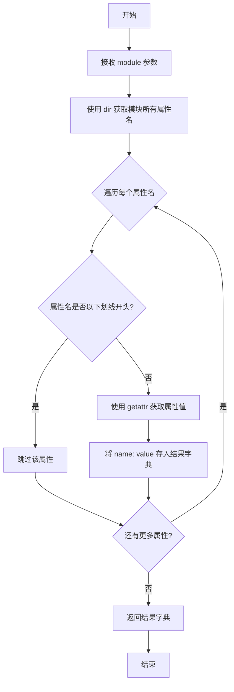
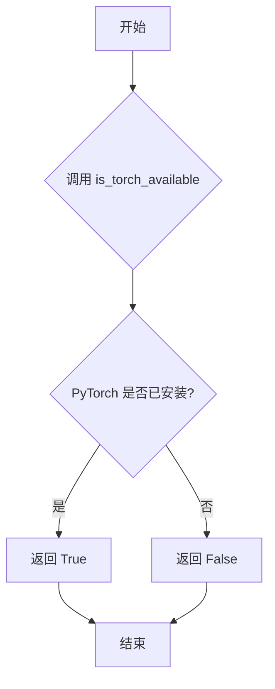
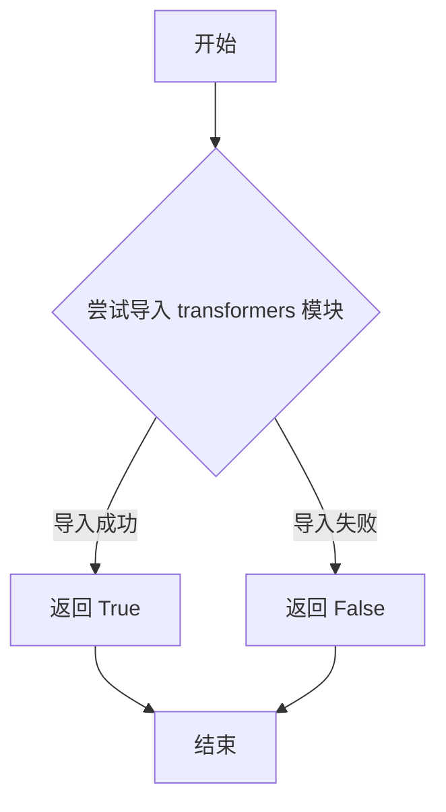
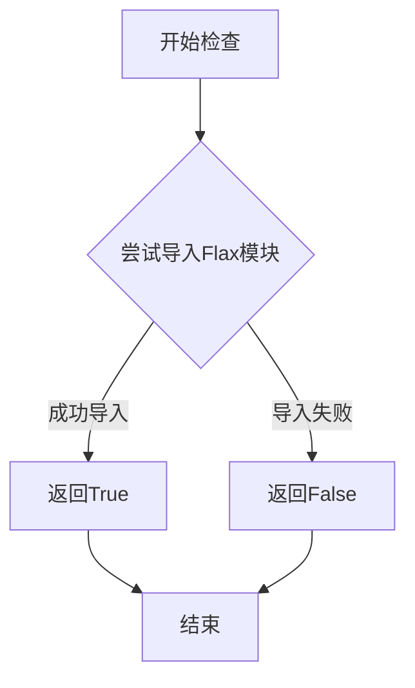

# `diffusers\src\diffusers\pipelines\pag\__init__.py` 详细设计文档

这是diffusers库中PAG(Progressive Attention Guidance)流水线的入口模块,通过延迟加载机制动态导入各种图像生成pipeline,在保证可选依赖(torch/transformers)可用时才加载真实实现,否则提供虚拟对象以支持静态导入检查。

## 整体流程

```mermaid
graph TD
A[模块加载] --> B{DIFFUSERS_SLOW_IMPORT or TYPE_CHECK}
B -- 是 --> C[检查torch和transformers可用性]
C --> D{依赖满足?}
D -- 否 --> E[导入dummy虚拟对象]
D -- 是 --> F[直接导入真实pipeline类]
B -- 否 --> G[使用_LazyModule延迟加载]
G --> H[设置sys.modules[__name__]]
H --> I[注入_dummy_objects到模块命名空间]
```

## 类结构

```
PAGEntranceModule (延迟加载入口)
├── _import_structure (导入结构字典)
├── _dummy_objects (虚拟对象字典)
├── 真实Pipeline类 (当依赖可用时)
└── 虚拟Pipeline类 (当依赖不可用时)
```

## 全局变量及字段


### `_dummy_objects`
    
用于存储虚拟对象的字典，当可选依赖不可用时提供替代对象，实现延迟加载机制

类型：`dict`
    


### `_import_structure`
    
定义模块导入结构的字典，映射模块路径到可导出的对象列表，用于LazyModule的延迟加载

类型：`dict`
    


### `TYPE_CHECKING`
    
从typing导入的布尔标志，表示是否处于类型检查模式，影响模块的导入方式

类型：`bool`
    


### `DIFFUSERS_SLOW_IMPORT`
    
控制是否启用慢速导入模式的标志，用于调试或特殊场景下的模块加载策略

类型：`bool`
    


    

## 全局函数及方法


### `get_objects_from_module`

从指定模块中提取所有公开对象（不包括以下划线开头的属性），并返回一个包含对象名称到对象映射的字典。该函数主要用于延迟加载机制中，从 dummy 模块获取占位对象。

参数：

- `module`：`module` 类型，需要从中提取公开属性的模块对象

返回值：`Dict[str, Any]` 类型，返回一个字典，键为对象名称（字符串），值为模块中对应的属性对象

#### 流程图



#### 带注释源码

```
def get_objects_from_module(module):
    """
    从给定模块中提取所有非下划线开头的公开对象
    
    参数:
        module: 要提取对象的模块
        
    返回:
        包含模块公开属性的字典，键为属性名，值为属性对象
    """
    # 定义空字典存储结果
    objects = {}
    
    # 遍历模块的所有属性
    for name in dir(module):
        # 过滤掉以下划线开头的私有/内部属性
        if not name.startswith('_'):
            # 获取属性值并添加到结果字典
            objects[name] = getattr(module, name)
    
    return objects

# 在 __init__.__.py 中的典型用法:
# _dummy_objects = {}
# _dummy_objects.update(get_objects_from_module(dummy_torch_and_transformers_objects))
# 
# # 之后将这些对象设置到当前模块中
# for name, value in _dummy_objects.items():
#     setattr(sys.modules[__name__], name, value)
```


### `is_torch_available`

这是一个从 `...utils` 模块导入的函数，用于检查 PyTorch 库是否在当前环境中可用。

参数：无可用参数信息（该函数为无参数函数）

返回值：`bool`，返回 `True` 表示 PyTorch 可用，返回 `False` 表示 PyTorch 不可用

#### 流程图



#### 带注释源码

```python
# 注意：以下是调用方代码，is_torch_available 函数本身未在此文件中定义
# 该函数从 ...utils 模块导入

from ...utils import is_torch_available  # 导入函数

# 使用示例：
try:
    if not (is_transformers_available() and is_torch_available()):
        # 如果 transformers 或 torch 不可用，则抛出异常
        raise OptionalDependencyNotAvailable()
except OptionalDependencyNotAvailable:
    # 处理可选依赖不可用的情况
    from ...utils import dummy_torch_and_transformers_objects
    _dummy_objects.update(get_objects_from_module(dummy_torch_and_transformers_objects))
```

---

**注意**：该函数 `is_torch_available` 的完整定义（源码）不在当前提供的代码文件中，而是定义在 `...utils` 模块中。以上信息是基于该函数在当前文件中的使用方式推断得出的。如需获取完整的函数定义，请参考 `...utils` 模块的源代码。


### `is_transformers_available`

该函数是 Diffusers 库中的依赖检查工具函数，用于检测当前环境中是否安装了 `transformers` 库。它返回一个布尔值，表示 transformers 是否可用，以便在代码中条件性地导入或使用相关功能。

参数：无

返回值：`bool`，返回 `True` 表示 transformers 库可用且已正确安装，返回 `False` 表示不可用。

#### 流程图



#### 带注释源码

```python
# 该函数定义在 ...utils 模块中
# 以下为基于 Diffusers 库惯例的推断实现

def is_transformers_available() -> bool:
    """
    检查 transformers 库是否可用。
    
    Returns:
        bool: 如果 transformers 库已安装且可导入返回 True，否则返回 False
    """
    try:
        import transformers  # noqa: F401
        return True
    except ImportError:
        return False
```

> **注意**：该函数定义在 `src/diffusers/src/diffusers/utils/__init__.py` 或类似的 utils 模块中，当前代码文件仅通过 `from ...utils import is_transformers_available` 导入并使用它。


### `is_flax_available`

该函数是 `diffusers` 库中的一个工具函数，用于检查当前环境中是否安装了 Flax 深度学习框架。通过动态检测 Flax 的可用性，来决定是否加载相关的 Flax 管道或模型。

参数：无参数

返回值：`bool`，返回 `True` 表示 Flax 可用，返回 `False` 表示 Flax 不可用

#### 流程图



#### 带注释源码

```
# 从 utils 模块导入 is_flax_available 函数
# 该函数用于检查 Flax 是否可用
from ...utils import (
    DIFFUSERS_SLOW_IMPORT,
    OptionalDependencyNotAvailable,
    _LazyModule,
    get_objects_from_module,
    is_flax_available,  # <-- 导入的函数：检查 Flax 是否可用
    is_torch_available,
    is_transformers_available,
)

# 注意：在当前代码文件中，is_flax_available 函数并未被直接调用
# 它被导入以供模块的其他部分使用，或者用于条件导入
# 典型的使用方式类似于：
# if is_flax_available():
#     from .pipeline_flax_xxx import FlaxPipeline
```

#### 补充说明

- **函数来源**：`is_flax_available` 来自 `diffusers` 库的 `...utils` 模块
- **设计目的**：这是一种常见的依赖检查模式，用于实现可选依赖的延迟导入，避免在用户未安装特定依赖时程序崩溃
- **相关函数**：代码中还导入了 `is_torch_available` 和 `is_transformers_available`，它们执行类似的检查但针对不同的深度学习框架


### `_LazyModule` (sys.modules[__name__] 赋值)

这是 `_LazyModule` 类的实例化调用，用于将当前模块替换为延迟加载的模块代理，实现按需导入子模块的功能。

参数：

- `__name__`：`str`，当前模块的完全限定名称（`__name__`）
- `globals()["__file__"]`：`str`，当前模块的源文件路径
- `_import_structure`：`dict[str, list[str]]`，导入结构字典，键为子模块名，值为该子模块导出的类/函数名列表
- `module_spec`：`ModuleSpec | None`，模块规格对象（`__spec__`），包含模块的元数据

返回值：`_LazyModule`，延迟加载模块代理对象，替换 `sys.modules` 中的当前模块

#### 流程图

```mermaid
flowchart TD
    A[开始] --> B{检查依赖是否可用}
    B -->|可用| C[构建 _import_structure 字典]
    B -->|不可用| D[使用虚拟对象 _dummy_objects]
    C --> E[创建 _LazyModule 实例]
    D --> E
    E --> F[替换 sys.modules[__name__]]
    F --> G[设置虚拟对象属性]
    G --> H[延迟加载机制就绪]
    
    style E fill:#f9f,stroke:#333,stroke-width:2px
    style H fill:#9f9,stroke:#333,stroke-width:2px
```

#### 带注释源码

```python
# 当不是 TYPE_CHECKING 且不是 DIFFUSERS_SLOW_IMPORT 时执行延迟加载
else:
    import sys

    # 将当前模块替换为 _LazyModule 延迟加载代理
    sys.modules[__name__] = _LazyModule(
        __name__,                          # 当前模块名称
        globals()["__file__"],              # 模块文件路径
        _import_structure,                 # 导入结构：定义可导出的类/函数
        module_spec=__spec__,              # 模块规格对象
    )
    # 为模块设置虚拟对象（当依赖不可用时的替代品）
    for name, value in _dummy_objects.items():
        setattr(sys.modules[__name__], name, value)
```

## 关键组件


### 条件依赖检查

检查transformers和torch是否同时可用，作为模块导入的前提条件

### 懒加载模块(_LazyModule)

实现延迟加载机制，仅在首次访问时加载实际的流水线类，节省内存和启动时间

### 虚拟对象占位符(_dummy_objects)

当可选依赖不可用时，提供空的占位符对象以避免导入错误

### 导入结构字典(_import_structure)

定义模块的公共API接口，映射流水线名称到对应的类名

### 运行时模块注册

将LazyModule和虚拟对象注册到sys.modules，实现模块的动态导入

### PAG流水线变体集合

支持多种模型架构的PAG实现，包括：StableDiffusion、StableDiffusionXL、StableDiffusion3、ControlNet、Inpaint、Img2Img、AnimateDiff、HunyuanDiT、Kolors、PixArtSigma、Sana等


## 问题及建议


### 已知问题

-   **重复的条件判断逻辑**：检查 `is_transformers_available() and is_torch_available()` 的代码在 try-except 块中重复了两次，增加了维护成本和出错风险
-   **硬编码的导入结构**：所有 pipeline 名称和类名都以硬编码字符串形式存在于 `_import_structure` 字典中，缺乏动态生成机制，导致添加新 pipeline 时需要手动修改多处
-   **缺少模块级文档**：整个模块没有文档字符串（docstring），难以理解其用途和设计意图
- **魔法字符串和数字**：pipeline 名称、模块路径等使用大量硬编码字符串，缺乏统一的常量定义或枚举管理
- **导入结构的混乱组织**：TYPE_CHECKING 分支下的导入使用了相对导入（from .pipeline_xxx），而 _import_structure 使用字符串键，类型不一致
- **潜在的导入顺序问题**：依赖 dummy 对象的动态设置（`setattr(sys.modules[__name__], name, value)`），如果模块加载顺序改变可能导致问题
- **缺乏错误传播机制**：当可选依赖不可用时，导入 dummy 对象，但没有任何日志或警告机制告知用户为什么某些功能不可用

### 优化建议

-   **提取依赖检查逻辑**：将 `is_transformers_available() and is_torch_available()` 的检查封装为独立的函数或方法，避免代码重复
-   **实现动态导入注册机制**：使用反射或配置文件动态扫描并注册 pipeline 类，减少手动维护成本
-   **添加模块文档**：为整个模块添加清晰的 docstring，说明其用途、支持的 pipeline 类型和依赖要求
-   **统一管理 pipeline 元数据**：创建配置文件或数据类来集中管理 pipeline 名称、类名和对应的模块路径
-   **增强错误处理和日志**：在可选依赖不可用时添加适当的警告或日志，帮助开发者诊断问题
-   **重构导入结构**：将 TYPE_CHECKING 和运行时的导入逻辑统一，使用一致的相对导入方式
-   **考虑使用装饰器或元类**：对于类似的 pipeline 注册场景，可以考虑使用装饰器模式来自动注册


## 其它


### 设计目标与约束

本模块采用延迟导入(Lazy Import)和动态模块加载机制，旨在解决大型AI框架中依赖管理复杂、启动速度慢的问题。设计目标包括：1) 支持可选依赖（PyTorch、Transformers）的条件加载，当依赖不可用时提供友好的错误处理；2) 通过`_LazyModule`实现模块的惰性加载，减少内存占用；3) 维护统一的导入结构`_import_structure`，确保所有pipeline类的可访问性一致。约束条件包括：必须同时满足`is_transformers_available()`和`is_torch_available()`两个条件才能导入真实pipeline对象，否则使用dummy对象替代。

### 错误处理与异常设计

本模块采用分层错误处理策略：1) **依赖检查层**：通过`try-except`捕获`OptionalDependencyNotAvailable`异常，当检测到缺少torch或transformers时抛出该异常；2) **替代对象层**：当依赖不可用时，从`dummy_torch_and_transformers_objects`模块导入虚拟对象填充`_dummy_objects`，确保模块结构完整，避免AttributeError；3) **运行时层**：通过`_LazyModule`的`__getattr__`机制，在实际访问时才触发导入错误，提供更清晰的错误信息。`OptionalDependencyNotAvailable`异常作为信号量，用于控制真实对象与虚拟对象的选择逻辑。

### 外部依赖与接口契约

本模块的外部依赖包括：1) **核心依赖**：`typing.TYPE_CHECKING`、`sys.modules`、`__spec__`（模块规范对象）；2) **可选依赖**：`is_torch_available()`、`is_transformers_available()`来自`...utils`模块；3) **内部模块**：各pipeline子模块（如`pipeline_pag_sd`、`pipeline_pag_sd_xl`等）。接口契约方面：模块导出遵循统一的`_import_structure`字典结构，键为子模块路径，值为类名字符串列表；所有pipeline类通过`from ... import StableDiffusionPAGPipeline`形式导入；`TYPE_CHECKING`或`DIFFUSERS_SLOW_IMPORT`为True时执行真实导入，否则使用LazyModule包装。

### 模块初始化流程

模块加载分为三个阶段：1) **定义阶段**：执行模块顶层代码，建立`_import_structure`字典和`_dummy_objects`字典；2) **条件分支阶段**：根据依赖可用性选择填充真实类名或虚拟对象；3) **注册阶段**：当非类型检查模式运行时，将当前模块注册为`_LazyModule`实例，并将dummy对象绑定到模块属性。此流程确保了导入顺序无关性（import-independent）和循环导入安全性。

    