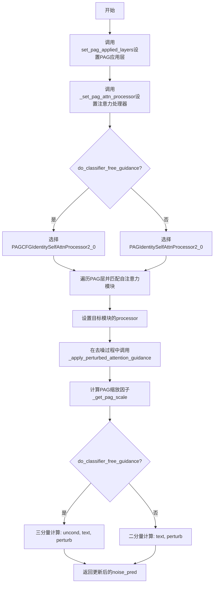
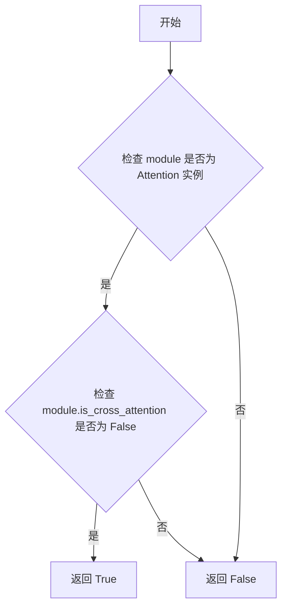
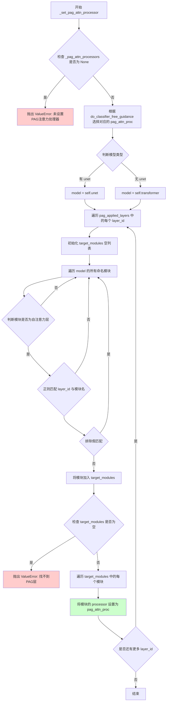
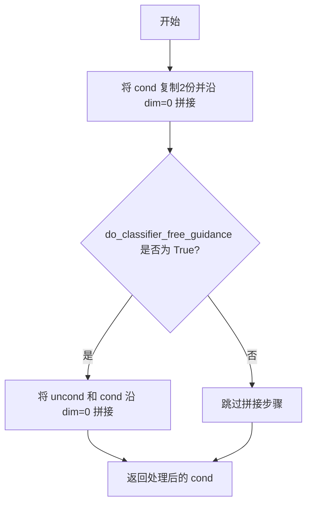
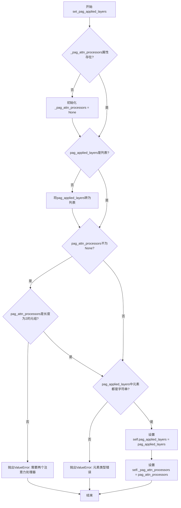

# `diffusers\src\diffusers\pipelines\pag\pag_utils.py` 详细设计文档

PAGMixin是一个混合类，用于在扩散模型中实现扰动注意力引导(Perturbed Attention Guidance)技术，通过修改自注意力层的处理器来改进图像生成质量，支持分类器自由引导(CFG)和自适应缩放功能。

## 整体流程



## 类结构

```
PAGMixin (混合类)
├── 依赖: Attention (注意力模块)
├── 依赖: AttentionProcessor (处理器基类)
├── 依赖: PAGCFGIdentitySelfAttnProcessor2_0 (CFG启用时使用)
└── 依赖: PAGIdentitySelfAttnProcessor2_0 (CFG禁用时使用)
```

## 全局变量及字段


### `logger`
    
模块级日志记录器，用于输出调试和信息日志

类型：`logging.Logger`
    


### `re`
    
Python正则表达式模块，用于匹配层名称

类型：`module`
    


### `torch`
    
PyTorch深度学习框架库

类型：`module`
    


### `nn`
    
PyTorch神经网络模块

类型：`module`
    


### `PAGMixin._pag_attn_processors`
    
存储PAG注意力处理器的元组，包含CFG启用和禁用两种处理器

类型：`tuple[AttentionProcessor, AttentionProcessor] | None`
    


### `PAGMixin.pag_applied_layers`
    
存储需要应用PAG的层名称列表

类型：`list[str]`
    


### `PAGMixin._pag_scale`
    
PAG缩放因子，控制扰动注意力引导的强度

类型：`float`
    


### `PAGMixin._pag_adaptive_scale`
    
PAG自适应缩放因子，用于动态调整引导强度

类型：`float`
    


### `PAGMixin.unet/transformer`
    
UNet或Transformer去噪模型，通过hasattr动态获取

类型：`nn.Module`
    
    

## 全局函数及方法


### `PAGMixin._set_pag_attn_processor.is_self_attn`

检查给定的模块是否为自注意力（Self-Attention）模块。函数通过判断模块是否为 `Attention` 类的实例且不具备交叉注意力属性来确定其类型。

参数：

- `module`：`nn.Module`，需要检查的神经网络模块

返回值：`bool`，如果模块是自注意力模块则返回 `True`，否则返回 `False`

#### 流程图



#### 带注释源码

```python
def is_self_attn(module: nn.Module) -> bool:
    r"""
    Check if the module is self-attention module based on its name.
    
    该函数用于识别模型中的自注意力层。在 PAG（Perturbed Attention Guidance）机制中，
    需要筛选出特定的自注意力层来应用扰动注意力处理器。
    
    判断逻辑：
    1. 首先检查模块是否为 Attention 类的实例
    2. 然后确认该模块不是交叉注意力（cross-attention）模块
    只有同时满足这两个条件时，才认为该模块是自注意力模块。
    
    Args:
        module (nn.Module): 需要检查的神经网络模块，通常是 UNet 或 Transformer 中的注意力层
        
    Returns:
        bool: 返回 True 表示该模块是自注意力模块，返回 False 表示不是
    """
    return isinstance(module, Attention) and not module.is_cross_attention
```


### `is_fake_integral_match`

这是一个嵌套辅助函数，用于检测模块名称是否为"假整数匹配"。在 PAG（Perturbed Attention Guidance）应用中，当使用类似 `blocks.1` 的层 ID 进行正则匹配时，可能会错误地匹配到 `blocks.10`、`blocks.11` 等层。该函数通过比较层 ID 和模块名称的最后部分来防止这种误匹配，确保精确匹配指定的层。

参数：

- `layer_id`：`str`，PAG 应用的层标识符（如 "blocks.1"）
- `name`：`str`，模型中模块的完整名称（如 "blocks.10"）

返回值：`bool`，如果两个最后部分都是数字且相等，返回 `True`（表示是假匹配，应跳过）；否则返回 `False`（表示不是假匹配，应正常处理）

#### 流程图

```mermaid
flowchart TD
    A[开始: is_fake_integral_match] --> B[输入: layer_id, name]
    B --> C[layer_id最后部分 = layer_id.split('.')[-1]]
    C --> D[name最后部分 = name.split('.')[-1]]
    D --> E{layer_id最后部分.isnumeric?}
    E -->|否| F[返回 False]
    E -->|是| G{name最后部分.isnumeric?}
    G -->|否| F
    G -->|是| H{layer_id最后部分 == name最后部分?}
    H -->|否| F
    H -->|是| I[返回 True]
    F --> J[结束]
    I --> J
```

#### 带注释源码

```python
def is_fake_integral_match(layer_id, name):
    """
    检查模块名称是否为"假整数匹配"。
    
    用途：在 PAG 应用中，当 layer_id 为 "blocks.1" 时，
    正则匹配可能会错误地匹配到 "blocks.10"、"blocks.11" 等。
    该函数用于识别并跳过这种误匹配。
    
    参数:
        layer_id (str): PAG 应用的层标识符，如 "blocks.1"
        name (str): 模型中模块的完整名称，如 "blocks.10"
    
    返回:
        bool: 如果是假整数匹配返回 True，否则返回 False
    """
    # 提取 layer_id 的最后一部分（例如 "blocks.1" -> "1"）
    layer_id = layer_id.split(".")[-1]
    
    # 提取 name 的最后一部分（例如 "blocks.10" -> "10"）
    name = name.split(".")[-1]
    
    # 只有当两者都是纯数字且相等时才认为是假匹配
    # 这样 "blocks.1" 匹配 "blocks.1" 会返回 True（跳过）
    # 而 "blocks.1" 匹配 "blocks.10" 也会返回 True（跳过，避免误匹配）
    return layer_id.isnumeric() and name.isnumeric() and layer_id == name
```


### `PAGMixin._set_pag_attn_processor`

该方法用于为PAG（Perturbed Attention Guidance）模型设置注意力处理器。它通过遍历模型的所有模块，根据指定的PAG应用层名称（layer_id）匹配对应的自注意力层，并将这些层的处理器替换为PAG专用的注意力处理器。

参数：

- `self`：`PAGMixin`，Mixin类实例，隐式参数
- `pag_applied_layers`：`str | list[str]`，指定要应用PAG的层标识符，可以是单个字符串（如"blocks.1"）或字符串列表，支持正则表达式匹配多层
- `do_classifier_free_guidance`：`bool`，指示是否启用了无分类器自由引导（CFG），为True时使用包含条件和无条件预测的处理器，为False时仅使用无条件预测的处理器

返回值：无返回值（`None`），该方法直接修改模型内部状态

#### 流程图



#### 带注释源码

```python
def _set_pag_attn_processor(self, pag_applied_layers, do_classifier_free_guidance):
    r"""
    Set the attention processor for the PAG layers.
    
    为PAG层设置注意力处理器。该方法遍历模型的模块，根据传入的
    pag_applied_layers参数找到匹配的自注意力层，并将这些层的
    处理器替换为PAG专用的注意力处理器。
    """
    # 从Mixin类实例中获取已保存的PAG注意力处理器
    pag_attn_processors = self._pag_attn_processors
    
    # 检查是否已设置PAG注意力处理器，若未设置则抛出异常
    if pag_attn_processors is None:
        raise ValueError(
            "No PAG attention processors have been set. Set the attention processors by calling `set_pag_applied_layers` and passing the relevant parameters."
        )

    # 根据是否启用无分类器自由引导（CFG）选择对应的处理器
    # do_classifier_free_guidance=True时使用索引0的处理器（包含CFG逻辑）
    # do_classifier_free_guidance=False时使用索引1的处理器（无CFG逻辑）
    pag_attn_proc = pag_attn_processors[0] if do_classifier_free_guidance else pag_attn_processors[1]

    # 确定模型类型：优先使用unet，否则使用transformer
    # 这支持DiffusionPipeline的不同实现方式
    if hasattr(self, "unet"):
        model: nn.Module = self.unet
    else:
        model: nn.Module = self.transformer

    def is_self_attn(module: nn.Module) -> bool:
        r"""
        Check if the module is self-attention module based on its name.
        
        检查模块是否为自注意力模块。需要同时满足两个条件：
        1. 模块是Attention类的实例
        2. 模块不是交叉注意力（is_cross_attention为False）
        """
        return isinstance(module, Attention) and not module.is_cross_attention

    def is_fake_integral_match(layer_id, name):
        r"""
        防止假匹配的工具函数。
        
        例如layer_id="blocks.1"和name="blocks.10"不应该匹配，
        因为.1和.10是不同的数字。该函数通过比较最后一部分来排除这种情况。
        """
        # 提取layer_id和name的最后一个"."后面的部分
        layer_id = layer_id.split(".")[-1]
        name = name.split(".")[-1]
        # 只有当两者都是纯数字且相等时才认为是假匹配
        return layer_id.isnumeric() and name.isnumeric() and layer_id == name

    # 遍历每一个需要应用PAG的层标识符
    for layer_id in pag_applied_layers:
        # for each PAG layer input, we find corresponding self-attention layers in the unet model
        # 为每个PAG层输入在unet模型中找到对应的自注意力层
        target_modules = []

        # 遍历模型的所有命名模块
        for name, module in model.named_modules():
            # Identify the following simple cases:
            #   (1) Self Attention layer existing
            #   (2) Whether the module name matches pag layer id even partially
            #   (3) Make sure it's not a fake integral match if the layer_id ends with a number
            #       For example, blocks.1, blocks.10 should be differentiable if layer_id="blocks.1"
            # 识别以下简单情况：
            #   (1) 自注意力层是否存在
            #   (2) 模块名是否部分匹配pag层id
            #   (3) 确保如果layer_id以数字结尾，则不是假匹配
            #       例如，如果layer_id="blocks.1"，则blocks.1和blocks.10应该可区分
            if (
                is_self_attn(module)  # 检查是否为自注意力模块
                and re.search(layer_id, name) is not None  # 检查名称是否匹配（支持正则）
                and not is_fake_integral_match(layer_id, name)  # 排除假数字匹配
            ):
                logger.debug(f"Applying PAG to layer: {name}")
                target_modules.append(module)

        # 如果找不到匹配的目标模块，抛出明确的错误信息
        if len(target_modules) == 0:
            raise ValueError(f"Cannot find PAG layer to set attention processor for: {layer_id}")

        # 将找到的每个目标模块的处理器替换为PAG专用处理器
        for module in target_modules:
            module.processor = pag_attn_proc
```


### `PAGMixin._get_pag_scale`

获取扰动注意力引导在时间步 `t` 处的缩放因子，支持自适应缩放模式。

参数：

-  `t`：`int`，当前推理时间步（denoising timestep）

返回值：`float`，扰动注意力引导的缩放因子（signal_scale 或 pag_scale）

#### 流程图

```mermaid
flowchart TD
    A[开始 _get_pag_scale] --> B{do_pag_adaptive_scaling?}
    B -->|是| C[计算 signal_scale = pag_scale - pag_adaptive_scale * (1000 - t)]
    C --> D{signal_scale < 0?}
    D -->|是| E[signal_scale = 0]
    D -->|否| F[返回 signal_scale]
    B -->|否| G[返回 pag_scale]
    E --> F
    F --> H[结束]
    G --> H
```

#### 带注释源码

```python
def _get_pag_scale(self, t):
    r"""
    Get the scale factor for the perturbed attention guidance at timestep `t`.
    
    该方法根据当前时间步 t 计算 PAG (Perturbed Attention Guidance) 的缩放因子。
    支持两种模式：
    1. 自适应缩放模式 (do_pag_adaptive_scaling=True): 根据时间步动态调整缩放因子
    2. 固定缩放模式: 返回固定的 pag_scale 值
    
    Args:
        t (int): 当前推理时间步，范围通常在 0-1000 之间
        
    Returns:
        float: 计算得到的 signal_scale 缩放因子，确保非负
    """
    
    # 检查是否启用自适应缩放模式
    # 自适应缩放条件: pag_adaptive_scale > 0 且 pag_scale > 0 且有 PAG 应用层
    if self.do_pag_adaptive_scaling:
        # 自适应缩放计算公式:
        # 随着时间步 t 增大，(1000 - t) 减小，
        # 因此 pag_adaptive_scale * (1000 - t) 减小，
        # signal_scale 增大，实现从低到高的过渡
        signal_scale = self.pag_scale - self.pag_adaptive_scale * (1000 - t)
        
        # 确保缩放因子非负，防止负值导致的异常行为
        if signal_scale < 0:
            signal_scale = 0
        return signal_scale
    else:
        # 固定缩放模式，直接返回预设的 pag_scale
        return self.pag_scale
```


### `PAGMixin._apply_perturbed_attention_guidance`

该方法用于将扰动注意力引导（PAG）应用到噪声预测中，根据是否启用无分类器引导（CFG）来计算最终的噪声预测。

参数：

- `noise_pred`：`torch.Tensor`，输入的噪声预测张量
- `do_classifier_free_guidance`：`bool`，是否启用无分类器引导
- `guidance_scale`：`float`，引导项的缩放因子
- `t`：`int`，当前时间步
- `return_pred_text`：`bool`，是否返回文本噪声预测

返回值：`torch.Tensor | tuple[torch.Tensor, torch.Tensor]`，应用扰动注意力引导后的更新噪声预测张量，以及可选的文本噪声预测张量

#### 流程图

```mermaid
flowchart TD
    A[开始] --> B[获取 PAG 缩放因子: pag_scale = _get_pag_scale(t)]
    B --> C{do_classifier_free_guidance?}
    C -->|True| D[将 noise_pred 分成3份: uncond, text, perturb]
    D --> E[计算: noise_pred = uncond + guidance_scale * (text - uncond) + pag_scale * (text - perturb)]
    C -->|False| F[将 noise_pred 分成2份: text, perturb]
    F --> G[计算: noise_pred = text + pag_scale * (text - perturb)]
    E --> H{return_pred_text?}
    G --> H
    H -->|True| I[返回 (noise_pred, text)]
    H -->|False| J[返回 noise_pred]
    I --> K[结束]
    J --> K
```

#### 带注释源码

```python
def _apply_perturbed_attention_guidance(
    self, noise_pred, do_classifier_free_guidance, guidance_scale, t, return_pred_text=False
):
    r"""
    Apply perturbed attention guidance to the noise prediction.

    Args:
        noise_pred (torch.Tensor): The noise prediction tensor.
        do_classifier_free_guidance (bool): Whether to apply classifier-free guidance.
        guidance_scale (float): The scale factor for the guidance term.
        t (int): The current time step.
        return_pred_text (bool): Whether to return the text noise prediction.

    Returns:
        torch.Tensor | tuple[torch.Tensor, torch.Tensor]: The updated noise prediction tensor after applying
        perturbed attention guidance and the text noise prediction.
    """
    # 获取当前时间步的 PAG 缩放因子
    pag_scale = self._get_pag_scale(t)
    
    # 根据是否启用无分类器引导（CFG）进行不同的处理
    if do_classifier_free_guidance:
        # 当启用 CFG 时，noise_pred 包含三部分：无条件预测、文本预测、扰动预测
        noise_pred_uncond, noise_pred_text, noise_pred_perturb = noise_pred.chunk(3)
        # 应用 CFG 和 PAG 的组合引导
        noise_pred = (
            noise_pred_uncond
            + guidance_scale * (noise_pred_text - noise_pred_uncond)
            + pag_scale * (noise_pred_text - noise_pred_perturb)
        )
    else:
        # 当关闭 CFG 时，noise_pred 只包含两部分：文本预测和扰动预测
        noise_pred_text, noise_pred_perturb = noise_pred.chunk(2)
        # 只应用 PAG 引导
        noise_pred = noise_pred_text + pag_scale * (noise_pred_text - noise_pred_perturb)
    
    # 根据需求决定是否返回文本预测
    if return_pred_text:
        return noise_pred, noise_pred_text
    return noise_pred
```


### `PAGMixin._prepare_perturbed_attention_guidance`

该方法用于准备扰动注意力指导（Perturbed Attention Guidance, PAG）所需的条件张量，通过复制条件输入并根据是否启用无分类器指导来拼接无条件输入，以构建完整的输入张量供后续的噪声预测使用。

参数：

- `self`：`PAGMixin`，类实例本身
- `cond`：`torch.Tensor`，条件输入张量（如文本嵌入）
- `uncond`：`torch.Tensor`，无条件输入张量（如空文本嵌入）
- `do_classifier_free_guidance`：`bool`，标志位，指示是否执行无分类器指导

返回值：`torch.Tensor`，准备好的扰动注意力指导张量

#### 流程图



#### 带注释源码

```python
def _prepare_perturbed_attention_guidance(self, cond, uncond, do_classifier_free_guidance):
    """
    Prepares the perturbed attention guidance for the PAG model.

    Args:
        cond (torch.Tensor): The conditional input tensor.
        uncond (torch.Tensor): The unconditional input tensor.
        do_classifier_free_guidance (bool): Flag indicating whether to perform classifier-free guidance.

    Returns:
        torch.Tensor: The prepared perturbed attention guidance tensor.
    """

    # 第一步：将条件输入复制2份并在第0维度（batch维度）上拼接
    # 这为了后续在同一个batch中同时处理原始条件和扰动后的条件
    cond = torch.cat([cond] * 2, dim=0)

    # 第二步：如果启用无分类器指导（CFG），则在第0维度上拼接无条件输入和条件输入
    # 这会在batch中形成 [uncond, cond, cond]（当CFG启用时，共3个样本）
    # 而在不使用CFG时，形成 [cond, cond]（共2个样本）
    if do_classifier_free_guidance:
        cond = torch.cat([uncond, cond], dim=0)
    
    # 返回处理后的张量，用于后续的扰动注意力指导计算
    return cond
```


### `PAGMixin.set_pag_applied_layers`

该方法用于设置要将扰动注意力引导（PAG）应用于的UNet/Transformer自注意力层，并配置相应的注意力处理器。它接受层标识符（字符串或字符串列表）和可选的自定义注意力处理器元组，并对输入进行验证后存储到实例属性中。

参数：

- `pag_applied_layers`：`str | list[str]`，要应用PAG的层标识符。可以是单个层名（如"blocks.1"）、层名列表、块名（如"mid"）或正则表达式（如"blocks.(1|2)"）
- `pag_attn_processors`：`tuple[AttentionProcessor, AttentionProcessor]`，可选参数，默认值为`(PAGCFGIdentitySelfAttnProcessor2_0(), PAGIdentitySelfAttnProcessor2_0())`。第一个处理器用于启用无分类器引导（CFG）时的PAG，第二个用于禁用CFG时的PAG

返回值：`None`，无返回值，该方法仅执行实例属性的赋值操作

#### 流程图



#### 带注释源码

```python
def set_pag_applied_layers(
    self,
    pag_applied_layers: str | list[str],
    pag_attn_processors: tuple[AttentionProcessor, AttentionProcessor] = (
        PAGCFGIdentitySelfAttnProcessor2_0(),
        PAGIdentitySelfAttnProcessor2_0(),
    ),
):
    r"""
    Set the self-attention layers to apply PAG. Raise ValueError if the input is invalid.

    Args:
        pag_applied_layers (`str` or `list[str]`):
            One or more strings identifying the layer names, or a simple regex for matching multiple layers, where
            PAG is to be applied. A few ways of expected usage are as follows:
              - Single layers specified as - "blocks.{layer_index}"
              - Multiple layers as a list - ["blocks.{layers_index_1}", "blocks.{layer_index_2}", ...]
              - Multiple layers as a block name - "mid"
              - Multiple layers as regex - "blocks.({layer_index_1}|{layer_index_2})"
        pag_attn_processors:
            (`tuple[AttentionProcessor, AttentionProcessor]`, defaults to `(PAGCFGIdentitySelfAttnProcessor2_0(),
            PAGIdentitySelfAttnProcessor2_0())`): A tuple of two attention processors. The first attention
            processor is for PAG with Classifier-free guidance enabled (conditional and unconditional). The second
            attention processor is for PAG with CFG disabled (unconditional only).
    """

    # 如果实例还没有_pag_attn_processors属性，则初始化为None
    if not hasattr(self, "_pag_attn_processors"):
        self._pag_attn_processors = None

    # 如果传入的不是列表，则转换为单元素列表，便于统一处理
    if not isinstance(pag_applied_layers, list):
        pag_applied_layers = [pag_applied_layers]
    
    # 如果传入了pag_attn_processors，则进行类型和长度验证
    if pag_attn_processors is not None:
        if not isinstance(pag_attn_processors, tuple) or len(pag_attn_processors) != 2:
            raise ValueError("Expected a tuple of two attention processors")

    # 遍历所有传入的层标识符，验证每个元素都是字符串类型
    for i in range(len(pag_applied_layers)):
        if not isinstance(pag_applied_layers[i], str):
            raise ValueError(
                f"Expected either a string or a list of string but got type {type(pag_applied_layers[i])}"
            )

    # 将验证后的参数存储到实例属性中，供后续PAG处理使用
    self.pag_applied_layers = pag_applied_layers
    self._pag_attn_processors = pag_attn_processors
```

## 关键组件


### PAGMixin 类

PAGMixin是一个Mixin类，核心功能是实现Perturbed Attention Guidance (PAG) 扰动注意力指导机制，用于扩散模型的推理过程中提升生成质量。该类通过混合方式为UNet或Transformer模型添加PAG功能，支持自适应缩放和分类器无关引导（CFG）的组合使用。

### 注意力处理器设置组件

负责将PAG注意力处理器分配给目标自注意力层。通过正则表达式匹配层名称，识别模型中的自注意力模块，并将指定的PAG处理器应用到匹配层。支持区分伪造积分匹配（如blocks.1和blocks.10的区分），确保精确的层定位。

### 缩放因子计算组件

提供PAG缩放因子的动态计算功能。支持两种模式：固定缩放和自适应缩放。在自适应模式下，根据当前时间步t计算信号缩放值，公式为`pag_scale - pag_adaptive_scale * (1000 - t)`，实现随去噪进程递减的指导强度。

### 扰动注意力指导应用组件

核心功能是将PAG应用于噪声预测。在有分类器无关引导时，将噪声预测分为无条件、条件和扰动三部分，使用加权组合计算最终预测；在无CFG时，只使用条件和扰动部分。支持可选返回文本噪声预测。

### 扰动注意力准备组件

准备PAG所需的输入张量。根据是否启用CFG，将条件张量进行复制和拼接操作，生成符合PAG算法要求的输入格式。

### 层配置管理组件

管理PAG应用层的配置和验证。接受字符串或字符串列表形式的层标识符，支持单层、多层、块名和正则表达式四种指定方式。同时管理PAG注意力处理器的配置，提供只读属性访问PAG相关参数。

### 属性访问器组件

提供PAG相关配置的属性访问接口。包括：`pag_scale`获取缩放因子、`pag_adaptive_scale`获取自适应缩放值、`do_pag_adaptive_scaling`判断是否启用自适应缩放、`do_perturbed_attention_guidance`判断是否启用PAG、`pag_attn_processors`获取当前使用的PAG注意力处理器字典。


## 问题及建议


### 已知问题

- **魔法数字硬编码**: `_get_pag_scale` 方法中数字 `1000` 被硬编码，应作为可配置参数（如 `max_timesteps`）以提高通用性
- **属性名冲突**: `pag_attn_processors` 属性与 `_pag_attn_processors` 内部属性及参数名称相同，容易造成混淆
- **重复代码**: 多处重复检查 `self.unet` 或 `self.transformer` 的存在，应提取为公共方法或属性
- **模块遍历效率**: `_set_pag_attn_processor` 每次调用都遍历整个模型的所有模块，对于大型模型性能较低，建议缓存目标模块
- **张量就地修改**: `_prepare_perturbed_attention_guidance` 方法直接修改输入张量，可能导致意外的副作用
- **缺少输入验证**: `set_pag_applied_layers` 验证了类型但未验证 layer 名称是否匹配实际模型层，直到运行时才报错
- **默认实例化时机**: `pag_attn_processors` 参数的默认值在模块加载时创建实例，可能导致不必要的内存占用

### 优化建议

- 提取 `_get_denoiser_module` 公共方法减少重复代码
- 添加 `max_timesteps` 参数到配置中，替换硬编码的 `1000`
- 使用更明确的属性名区分内部状态和公共接口（如 `_pag_attn_processors` 改为 `_pag_attn_procs`）
- 实现模块缓存机制或使用注册表方式定位目标层，减少重复遍历
- 在 `_prepare_perturbed_attention_guidance` 中使用 `torch.cat` 创建新张量而非修改原张量
- 预先验证 layer 名称或在文档中明确说明格式要求
- 考虑使用 `None` 作为默认值，并在首次访问时延迟初始化处理器实例

## 其它


### 设计目标与约束

**设计目标**:
- 实现Perturbed Attention Guidance (PAG)技术，用于提升扩散模型的图像生成质量
- 提供灵活的层选择机制，支持单层、多层、块级和正则表达式匹配
- 支持Classifier-Free Guidance (CFG)开启和关闭两种模式
- 支持自适应缩放策略，动态调整PAG强度

**设计约束**:
- 依赖PyTorch和nn.Module架构
- 需要模型具备unet或transformer属性
- 需要Attention和AttentionProcessor类支持
- 仅支持自注意力层（self-attention），不支持交叉注意力层

### 错误处理与异常设计

**异常场景1**: `_pag_attn_processors`为None时
- 抛出ValueError: "No PAG attention processors have been set. Set the attention processors by calling `set_pag_applied_layers` and passing the relevant parameters."

**异常场景2**: 找不到对应的PAG层时
- 抛出ValueError: f"Cannot find PAG layer to set attention processor for: {layer_id}"

**异常场景3**: pag_attn_processors参数类型错误时
- 抛出ValueError: "Expected a tuple of two attention processors"

**异常场景4**: pag_applied_layers元素类型错误时
- 抛出ValueError: f"Expected either a string or a list of string but got type {type(pag_applied_layers[i])}"

**异常场景5**: 未找到denoiser模块时
- 抛出ValueError: "No denoiser module found."

**输入验证**: set_pag_applied_layers方法对pag_applied_layers和pag_attn_processors进行类型检查

### 数据流与状态机

**主要数据流**:

```
输入: cond (条件输入), uncond (无条件输入), noise_pred (噪声预测)
    ↓
prepare_perturbed_attention_guidance: 准备PAG所需的张量拼接
    ↓ chunk分割: [noise_pred_uncond, noise_pred_text, noise_pred_perturb] 或 [noise_pred_text, noise_pred_perturb]
    ↓
get_pag_scale: 根据 timestep t 计算PAG缩放因子
    ↓
apply_perturbed_attention_guidance: 应用PAG公式
    - CFG开启: noise_pred = noise_pred_uncond + scale*(noise_pred_text-noise_pred_uncond) + pag_scale*(noise_pred_text-noise_pred_perturb)
    - CFG关闭: noise_pred = noise_pred_text + pag_scale*(noise_pred_text-noise_pred_perturb)
    ↓
输出: 更新后的noise_pred
```

**状态管理**:
- `_pag_attn_processors`: 存储PAG注意力处理器元组
- `pag_applied_layers`: 存储应用PAG的层标识列表
- `_pag_scale`: PAG基础缩放因子
- `_pag_adaptive_scale`: PAG自适应缩放因子
- `do_pag_adaptive_scaling`: 自适应缩放启用状态（计算属性）
- `do_perturbed_attention_guidance`: PAG启用状态（计算属性）

### 外部依赖与接口契约

**外部依赖**:
- `torch`: 张量操作和神经网络基础
- `torch.nn`: 神经网络模块
- `re`: 正则表达式用于层匹配
- `...models.attention_processor`: Attention, AttentionProcessor, PAGCFGIdentitySelfAttnProcessor2_0, PAGIdentitySelfAttnProcessor2_0
- `...utils.logging`: 日志记录工具

**接口契约**:
1. **set_pag_applied_layers**: 设置PAG应用的层和注意力处理器
   - 输入: pag_applied_layers (str|list[str]), pag_attn_processors (tuple[AttentionProcessor, AttentionProcessor])
   - 输出: 无返回值，修改实例状态

2. **_set_pag_attn_processor**: 将注意力处理器应用到目标层
   - 输入: pag_applied_layers (list), do_classifier_free_guidance (bool)
   - 输出: 无返回值，修改module.processor属性

3. **_apply_perturbed_attention_guidance**: 应用扰动注意力引导
   - 输入: noise_pred, do_classifier_free_guidance, guidance_scale, t, return_pred_text
   - 输出: torch.Tensor 或 tuple[torch.Tensor, torch.Tensor]

4. **_prepare_perturbed_attention_guidance**: 准备PAG引导张量
   - 输入: cond, uncond, do_classifier_free_guidance
   - 输出: torch.Tensor

**Mixin使用约束**:
- 混入类必须具有unet或transformer属性
- 目标模型必须具有attn_processors属性
- 自注意力模块必须是Attention类实例

### 性能考量与优化空间

**计算复杂度**:
- 层搜索复杂度: O(n) where n为模型模块总数
- 每次推理需进行chunk分割和PAG公式计算
- 自适应缩放每个timestep需计算一次

**优化建议**:
1. 缓存target_modules列表，避免每次调用重复搜索
2. 使用更高效的正则表达式预编译
3. 支持延迟初始化pag_attn_processors
4. 考虑GPU内存优化，avoid unnecessary tensor concatenations

### 安全性与合规性

**安全性**:
- 无用户输入直接执行代码的风险
- 层名称匹配使用正则表达式，需防止正则表达式注入（当前实现安全）

**合规性**:
- Apache License 2.0开源许可
- 版权归属HuggingFace Team (2025)

### 版本兼容性与迁移指南

**兼容性**:
- 依赖transformers/diffusers库的最新版本
- 需要PyTorch 2.0+支持

**迁移注意事项**:
- 从旧版本迁移时需确保模型实现了必要的属性（unet/transformer）
- 注意力处理器API可能随版本变化，需同步更新PAG处理器

### 测试策略建议

**单元测试**:
- 测试set_pag_applied_layers的输入验证
- 测试_get_pag_scale在不同配置下的返回值
- 测试_apply_perturbed_attention_guidance的数学正确性

**集成测试**:
- 测试与UNet/Transformer的集成
- 测试完整生成流程中的PAG应用

**边界测试**:
- 测试空pag_applied_layers
- 测试无效的layer_id
- 测试do_classifier_free_guidance开关

    