# `diffusers\src\diffusers\pipelines\pag\pipeline_pag_controlnet_sd.py` 详细设计文档

这是一个基于Stable Diffusion的ControlNet文本到图像生成Pipeline，集成了PAG（Perturbed Attention Guidance）技术。该Pipeline通过ControlNet提供额外的条件控制，使用户能够通过边缘检测图、姿态图等控制图像生成，同时利用PAG技术提高生成质量。它支持LoRA、Textual Inversion、IP-Adapter等多种增强功能，并可从单个文件加载模型。

## 整体流程

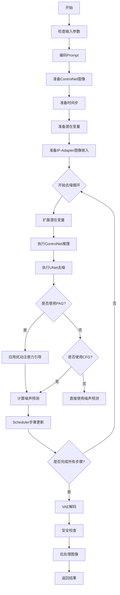

## 类结构

```
DiffusionPipeline (基类)
├── StableDiffusionMixin
├── TextualInversionLoaderMixin
├── StableDiffusionLoraLoaderMixin
├── IPAdapterMixin
├── FromSingleFileMixin
└── PAGMixin
    └── StableDiffusionControlNetPAGPipeline (主类)
```

## 全局变量及字段


### `logger`
    
Logger instance for the module, used for warning and info messages

类型：`logging.Logger`
    


### `XLA_AVAILABLE`
    
Boolean flag indicating whether PyTorch XLA is available for TPU support

类型：`bool`
    


### `EXAMPLE_DOC_STRING`
    
Documentation string containing example usage code for the pipeline

类型：`str`
    


### `StableDiffusionControlNetPAGPipeline.vae`
    
Variational Auto-Encoder model for encoding and decoding images to/from latent representations

类型：`AutoencoderKL`
    


### `StableDiffusionControlNetPAGPipeline.text_encoder`
    
Frozen text encoder (CLIP) for encoding text prompts into embeddings

类型：`CLIPTextModel`
    


### `StableDiffusionControlNetPAGPipeline.tokenizer`
    
CLIP tokenizer for converting text prompts into token IDs

类型：`CLIPTokenizer`
    


### `StableDiffusionControlNetPAGPipeline.unet`
    
UNet2DConditionModel for denoising encoded image latents during diffusion process

类型：`UNet2DConditionModel`
    


### `StableDiffusionControlNetPAGPipeline.controlnet`
    
ControlNet model(s) providing additional conditioning to the UNet during denoising

类型：`ControlNetModel | list[ControlNetModel] | MultiControlNetModel`
    


### `StableDiffusionControlNetPAGPipeline.scheduler`
    
Scheduler for controlling the diffusion denoising process steps

类型：`KarrasDiffusionSchedulers`
    


### `StableDiffusionControlNetPAGPipeline.safety_checker`
    
Safety checker module for detecting potentially harmful or NSFW generated images

类型：`StableDiffusionSafetyChecker`
    


### `StableDiffusionControlNetPAGPipeline.feature_extractor`
    
CLIP image processor for extracting features from images for safety checking

类型：`CLIPImageProcessor`
    


### `StableDiffusionControlNetPAGPipeline.image_encoder`
    
Optional CLIP vision model for IP-Adapter image embeddings

类型：`CLIPVisionModelWithProjection`
    


### `StableDiffusionControlNetPAGPipeline.vae_scale_factor`
    
Scaling factor for VAE latent space, derived from VAE block out channels

类型：`int`
    


### `StableDiffusionControlNetPAGPipeline.image_processor`
    
Image processor for VAE encoding/decoding with RGB conversion support

类型：`VaeImageProcessor`
    


### `StableDiffusionControlNetPAGPipeline.control_image_processor`
    
Image processor for ControlNet input images with normalization disabled

类型：`VaeImageProcessor`
    


### `StableDiffusionControlNetPAGPipeline._guidance_scale`
    
Private attribute storing the classifier-free guidance scale value

类型：`float`
    


### `StableDiffusionControlNetPAGPipeline._clip_skip`
    
Private attribute storing the number of CLIP layers to skip for prompt embeddings

类型：`int`
    


### `StableDiffusionControlNetPAGPipeline._cross_attention_kwargs`
    
Private dictionary storing cross-attention keyword arguments for the diffusion process

类型：`dict[str, Any]`
    


### `StableDiffusionControlNetPAGPipeline._num_timesteps`
    
Private attribute storing the total number of denoising timesteps

类型：`int`
    


### `StableDiffusionControlNetPAGPipeline._pag_scale`
    
Private attribute storing the Perturbed Attention Guidance (PAG) scale factor

类型：`float`
    


### `StableDiffusionControlNetPAGPipeline._pag_adaptive_scale`
    
Private attribute storing the adaptive scale factor for PAG

类型：`float`
    


### `StableDiffusionControlNetPAGPipeline.model_cpu_offload_seq`
    
Class attribute defining the sequence for CPU offloading of models

类型：`str`
    


### `StableDiffusionControlNetPAGPipeline._optional_components`
    
Class attribute listing optional components that can be None (safety_checker, feature_extractor, image_encoder)

类型：`list[str]`
    


### `StableDiffusionControlNetPAGPipeline._exclude_from_cpu_offload`
    
Class attribute listing components excluded from CPU offload (safety_checker)

类型：`list[str]`
    


### `StableDiffusionControlNetPAGPipeline._callback_tensor_inputs`
    
Class attribute listing tensor inputs allowed in callback functions (latents, prompt_embeds, negative_prompt_embeds)

类型：`list[str]`
    
    

## 全局函数及方法


### `retrieve_timesteps`

该函数是扩散模型管道中的通用时间步检索工具，通过调用调度器的 `set_timesteps` 方法来获取时间步序列。它支持三种配置模式：使用自定义时间步列表、使用自定义 sigma 值，或使用默认的推理步数。函数内部通过检查调度器方法签名来验证兼容性，并返回时间步张量和实际的推理步数。

参数：

- `scheduler`：`SchedulerMixin`，用于获取时间步的调度器对象
- `num_inference_steps`：`int | None`，生成样本时使用的扩散步数，如果使用此参数，则 `timesteps` 必须为 `None`
- `device`：`str | torch.device | None`，时间步应该移动到的设备，如果为 `None` 则不移动
- `timesteps`：`list[int] | None`，用于覆盖调度器时间步间隔策略的自定义时间步，如果传递此参数，则 `num_inference_steps` 和 `sigmas` 必须为 `None`
- `sigmas`：`list[float] | None`，用于覆盖调度器时间步间隔策略的自定义 sigma 值，如果传递此参数，则 `num_inference_steps` 和 `timesteps` 必须为 `None`
- `**kwargs`：任意关键字参数，将传递给调度器的 `set_timesteps` 方法

返回值：`tuple[torch.Tensor, int]`，元组包含调度器的时间步时间表和推理步数

#### 流程图

```mermaid
flowchart TD
    A[开始] --> B{检查timesteps和sigmas是否同时存在}
    B -->|是| C[抛出ValueError: 只能选择timesteps或sigmas之一]
    B -->|否| D{检查timesteps是否不为None}
    D -->|是| E[检查scheduler.set_timesteps是否接受timesteps参数]
    E -->|不接受| F[抛出ValueError: 当前调度器不支持自定义时间步]
    E -->|接受| G[调用scheduler.set_timesteps并传递timesteps和device]
    G --> H[获取scheduler.timesteps]
    H --> I[计算num_inference_steps = len(timesteps)]
    I --> J[返回timesteps和num_inference_steps]
    D -->|否| K{检查sigmas是否不为None}
    K -->|是| L[检查scheduler.set_timesteps是否接受sigmas参数]
    L -->|不接受| M[抛出ValueError: 当前调度器不支持自定义sigmas]
    L -->|接受| N[调用scheduler.set_timesteps并传递sigmas和device]
    N --> O[获取scheduler.timesteps]
    O --> P[计算num_inference_steps = len(timesteps)]
    P --> J
    K -->|否| Q[调用scheduler.set_timesteps并传递num_inference_steps和device]
    Q --> R[获取scheduler.timesteps]
    R --> S[计算num_inference_steps = len(timesteps)]
    S --> J
```

#### 带注释源码

```python
def retrieve_timesteps(
    scheduler,
    num_inference_steps: int | None = None,
    device: str | torch.device | None = None,
    timesteps: list[int] | None = None,
    sigmas: list[float] | None = None,
    **kwargs,
):
    r"""
    Calls the scheduler's `set_timesteps` method and retrieves timesteps from the scheduler after the call. Handles
    custom timesteps. Any kwargs will be supplied to `scheduler.set_timesteps`.

    Args:
        scheduler (`SchedulerMixin`):
            The scheduler to get timesteps from.
        num_inference_steps (`int`):
            The number of diffusion steps used when generating samples with a pre-trained model. If used, `timesteps`
            must be `None`.
        device (`str` or `torch.device`, *optional*):
            The device to which the timesteps should be moved to. If `None`, the timesteps are not moved.
        timesteps (`list[int]`, *optional*):
            Custom timesteps used to override the timestep spacing strategy of the scheduler. If `timesteps` is passed,
            `num_inference_steps` and `sigmas` must be `None`.
        sigmas (`list[float]`, *optional*):
            Custom sigmas used to override the timestep spacing strategy of the scheduler. If `sigmas` is passed,
            `num_inference_steps` and `timesteps` must be `None`.

    Returns:
        `tuple[torch.Tensor, int]`: A tuple where the first element is the timestep schedule from the scheduler and the
        second element is the number of inference steps.
    """
    # 检查是否同时传入了timesteps和sigmas，两者只能选其一
    if timesteps is not None and sigmas is not None:
        raise ValueError("Only one of `timesteps` or `sigmas` can be passed. Please choose one to set custom values")
    
    # 处理自定义timesteps的情况
    if timesteps is not None:
        # 通过inspect检查scheduler.set_timesteps是否接受timesteps参数
        accepts_timesteps = "timesteps" in set(inspect.signature(scheduler.set_timesteps).parameters.keys())
        if not accepts_timesteps:
            raise ValueError(
                f"The current scheduler class {scheduler.__class__}'s `set_timesteps` does not support custom"
                f" timestep schedules. Please check whether you are using the correct scheduler."
            )
        # 调用scheduler的set_timesteps方法设置自定义时间步
        scheduler.set_timesteps(timesteps=timesteps, device=device, **kwargs)
        # 从scheduler获取设置后的时间步
        timesteps = scheduler.timesteps
        # 计算实际的推理步数
        num_inference_steps = len(timesteps)
    # 处理自定义sigmas的情况
    elif sigmas is not None:
        # 通过inspect检查scheduler.set_timesteps是否接受sigmas参数
        accept_sigmas = "sigmas" in set(inspect.signature(scheduler.set_timesteps).parameters.keys())
        if not accept_sigmas:
            raise ValueError(
                f"The current scheduler class {scheduler.__class__}'s `set_timesteps` does not support custom"
                f" sigmas schedules. Please check whether you are using the correct scheduler."
            )
        # 调用scheduler的set_timesteps方法设置自定义sigmas
        scheduler.set_timesteps(sigmas=sigmas, device=device, **kwargs)
        # 从scheduler获取设置后的时间步
        timesteps = scheduler.timesteps
        # 计算实际的推理步数
        num_inference_steps = len(timesteps)
    # 处理默认情况：使用num_inference_steps
    else:
        # 调用scheduler的set_timesteps方法设置推理步数
        scheduler.set_timesteps(num_inference_steps, device=device, **kwargs)
        # 从scheduler获取设置后的时间步
        timesteps = scheduler.timesteps
    
    # 返回时间步张量和推理步数
    return timesteps, num_inference_steps
```


### `StableDiffusionControlNetPAGPipeline.__init__`

该方法是 `StableDiffusionControlNetPAGPipeline` 类的构造函数，负责初始化整个 ControlNet PAG 管道所需的所有组件，包括 VAE、文本编码器、Tokenizer、UNet、ControlNet、调度器、安全检查器等，并对各个组件进行注册和配置。

参数：

- `vae`：`AutoencoderKL`，Variational Auto-Encoder (VAE) 模型，用于编码和解码图像到潜在表示
- `text_encoder`：`CLIPTextModel`，冻结的文本编码器 (clip-vit-large-patch14)
- `tokenizer`：`CLIPTokenizer`，用于对文本进行 token 化
- `unet`：`UNet2DConditionModel`，用于对编码后的图像潜在表示进行去噪
- `controlnet`：`ControlNetModel | list[ControlNetModel] | tuple[ControlNetModel] | MultiControlNetModel`，在去噪过程中为 `unet` 提供额外的条件控制
- `scheduler`：`KarrasDiffusionSchedulers`，与 `unet` 结合使用以对编码后的图像潜在表示进行去噪的调度器
- `safety_checker`：`StableDiffusionSafetyChecker`，用于评估生成的图像是否被认为具有攻击性或有害的分类模块
- `feature_extractor`：`CLIPImageProcessor`，用于从生成的图像中提取特征，作为 `safety_checker` 的输入
- `image_encoder`：`CLIPVisionModelWithProjection`（可选），用于 IP-Adapter 的图像编码器
- `requires_safety_checker`：`bool`（默认 `True`），是否需要安全检查器
- `pag_applied_layers`：`str | list[str]`（默认 `"mid"`），PAG（Perturbed Attention Guidance）应用层

返回值：`None`，构造函数不返回值，仅初始化对象状态

#### 流程图

```mermaid
flowchart TD
    A[开始 __init__] --> B[调用 super().__init__]
    B --> C{safety_checker is None<br/>且 requires_safety_checker?}
    C -->|是| D[发出安全检查器禁用警告]
    C -->|否| E{safety_checker is not None<br/>且 feature_extractor is None?}
    D --> E
    E -->|是| F[抛出 ValueError:<br/>必须定义 feature_extractor]
    E -->|否| G{controlnet 是 list 或 tuple?}
    G -->|是| H[包装为 MultiControlNetModel]
    G -->|否| I[保持原样]
    H --> J[register_modules 注册所有模块]
    I --> J
    J --> K[计算 vae_scale_factor]
    K --> L[创建 VaeImageProcessor<br/>用于主图像]
    L --> M[创建 VaeImageProcessor<br/>用于控制图像<br/>do_normalize=False]
    M --> N[register_to_config<br/>保存 requires_safety_checker]
    N --> O[set_pag_applied_layers<br/>设置 PAG 应用层]
    O --> P[结束 __init__]
```

#### 带注释源码

```python
def __init__(
    self,
    vae: AutoencoderKL,
    text_encoder: CLIPTextModel,
    tokenizer: CLIPTokenizer,
    unet: UNet2DConditionModel,
    controlnet: ControlNetModel | list[ControlNetModel] | tuple[ControlNetModel] | MultiControlNetModel,
    scheduler: KarrasDiffusionSchedulers,
    safety_checker: StableDiffusionSafetyChecker,
    feature_extractor: CLIPImageProcessor,
    image_encoder: CLIPVisionModelWithProjection = None,
    requires_safety_checker: bool = True,
    pag_applied_layers: str | list[str] = "mid",
):
    # 调用父类 DiffusionPipeline 的初始化方法
    super().__init__()

    # 如果 safety_checker 为 None 但 requires_safety_checker 为 True，发出警告
    # 提醒用户遵守 Stable Diffusion 许可协议，不在公开服务中暴露未过滤的结果
    if safety_checker is None and requires_safety_checker:
        logger.warning(
            f"You have disabled the safety checker for {self.__class__} by passing `safety_checker=None`. Ensure"
            " that you abide to the conditions of the Stable Diffusion license and do not expose unfiltered"
            " results in services or applications open to the public. Both the diffusers team and Hugging Face"
            " strongly recommend to keep the safety filter enabled in all public facing circumstances, disabling"
            " it only for use-cases that involve analyzing network behavior or auditing its results. For more"
            " information, please have a look at https://github.com/huggingface/diffusers/pull/254 ."
        )

    # 如果提供了 safety_checker 但没有提供 feature_extractor，抛出错误
    # 安全检查器需要特征提取器来预处理图像
    if safety_checker is not None and feature_extractor is None:
        raise ValueError(
            "Make sure to define a feature extractor when loading {self.__class__} if you want to use the safety"
            " checker. If you do not want to use the safety checker, you can pass `'safety_checker=None'` instead."
        )

    # 如果 controlnet 是列表或元组，包装为 MultiControlNetModel
    # 以支持多个 ControlNet 协同工作
    if isinstance(controlnet, (list, tuple)):
        controlnet = MultiControlNetModel(controlnet)

    # 注册所有模块，使它们可以通过管道对象访问
    self.register_modules(
        vae=vae,
        text_encoder=text_encoder,
        tokenizer=tokenizer,
        unet=unet,
        controlnet=controlnet,
        scheduler=scheduler,
        safety_checker=safety_checker,
        feature_extractor=feature_extractor,
        image_encoder=image_encoder,
    )

    # 计算 VAE 缩放因子，基于 VAE 块输出通道数的 2^(n-1)
    # 用于将像素空间图像转换为潜在空间
    self.vae_scale_factor = 2 ** (len(self.vae.config.block_out_channels) - 1) if getattr(self, "vae", None) else 8

    # 创建图像处理器，用于 VAE 的图像预处理和后处理
    # do_convert_rgb=True 表示将图像转换为 RGB 格式
    self.image_processor = VaeImageProcessor(vae_scale_factor=self.vae_scale_factor, do_convert_rgb=True)

    # 创建控制图像的专用处理器
    # do_normalize=False 表示控制图像不需要归一化
    self.control_image_processor = VaeImageProcessor(
        vae_scale_factor=self.vae_scale_factor, do_convert_rgb=True, do_normalize=False
    )

    # 将 requires_safety_checker 保存到配置中
    self.register_to_config(requires_safety_checker=requires_safety_checker)

    # 设置 PAG（Perturbed Attention Guidance）应用层
    # 默认为 "mid" 层，可自定义为字符串或列表
    self.set_pag_applied_layers(pag_applied_layers)
```


### `StableDiffusionControlNetPAGPipeline.encode_prompt`

该方法负责将文本提示词（prompt）编码为文本编码器的隐藏状态（embeddings），支持LoRA权重调整、CLIP层跳过、文本反转（Textual Inversion）以及无分类器引导（Classifier-Free Guidance）所需的负面提示词嵌入处理。

参数：

- `prompt`：`str | list[str] | None`，需要编码的提示词，支持单字符串或字符串列表
- `device`：`torch.device`，PyTorch设备，用于将计算结果移动到指定设备
- `num_images_per_prompt`：`int`，每个提示词需要生成的图像数量，用于扩展embeddings维度
- `do_classifier_free_guidance`：`bool`，是否执行无分类器引导，若为True则需要生成负面embeddings
- `negative_prompt`：`str | list[str] | None`，负面提示词，用于指导不希望出现在生成图像中的元素
- `prompt_embeds`：`torch.Tensor | None`，预生成的提示词嵌入，若提供则直接使用，跳过从文本生成的过程
- `negative_prompt_embeds`：`torch.Tensor | None`，预生成的负面提示词嵌入
- `lora_scale`：`float | None`，LoRA缩放因子，用于调整LoRA层的影响权重
- `clip_skip`：`int | None`，CLIP模型中跳过的层数，用于获取不同层次的特征表示

返回值：`tuple[torch.Tensor, torch.Tensor]`，返回两个张量——第一个是提示词嵌入（prompt_embeds），第二个是负面提示词嵌入（negative_prompt_embeds）

#### 流程图

```mermaid
flowchart TD
    A[encode_prompt 开始] --> B{检查 lora_scale}
    B -->|非 None| C[设置 self._lora_scale]
    C --> D{判断 USE_PEFT_BACKEND}
    D -->|True| E[scale_lora_layers]
    D -->|False| F[adjust_lora_scale_text_encoder]
    B -->|None| G[确定 batch_size]
    E --> G
    F --> G
    
    G --> H{prompt_embeds 为 None?}
    H -->|Yes| I{处理 Textual Inversion}
    I -->|Yes| J[maybe_convert_prompt]
    I -->|No| K[tokenizer 编码文本]
    J --> K
    
    K --> L{检查 attention_mask}
    L -->|有 config.use_attention_mask| M[使用文本的 attention_mask]
    L -->|无| N[attention_mask = None]
    M --> O{clip_skip 为 None?}
    N --> O
    
    O -->|Yes| P[text_encoder 前向传播]
    O -->|No| Q[text_encoder 输出 hidden_states]
    Q --> R[根据 clip_skip 选择隐藏层]
    R --> S[应用 final_layer_norm]
    P --> T[获取 prompt_embeds]
    S --> T
    
    H -->|No| T
    
    T --> U[转换 dtype 和 device]
    U --> V[重复 embeddings: num_images_per_prompt 次]
    
    V --> W{do_classifier_free_guidance?}
    W -->|Yes 且 negative_prompt_embeds 为 None| X[处理 uncond_tokens]
    X --> Y{negative_prompt 类型检查]
    Y --> Z[tokenizer 编码 uncond_tokens]
    Z --> AA[text_encoder 编码获取 negative_prompt_embeds]
    
    W -->|No| AB[返回结果]
    AA --> AC[重复 negative_prompt_embeds]
    AC --> AB
    
    AB --> AD{使用 LoRA 且 PEFT backend?}
    AD -->|Yes| AE[unscale_lora_layers]
    AD -->|No| AF[返回 prompt_embeds, negative_prompt_embeds]
    AE --> AF
```

#### 带注释源码

```python
def encode_prompt(
    self,
    prompt,
    device,
    num_images_per_prompt,
    do_classifier_free_guidance,
    negative_prompt=None,
    prompt_embeds: torch.Tensor | None = None,
    negative_prompt_embeds: torch.Tensor | None = None,
    lora_scale: float | None = None,
    clip_skip: int | None = None,
):
    r"""
    Encodes the prompt into text encoder hidden states.

    Args:
        prompt (`str` or `list[str]`, *optional*):
            prompt to be encoded
        device: (`torch.device`):
            torch device
        num_images_per_prompt (`int`):
            number of images that should be generated per prompt
        do_classifier_free_guidance (`bool`):
            whether to use classifier free guidance or not
        negative_prompt (`str` or `list[str]`, *optional*):
            The prompt or prompts not to guide the image generation. If not defined, one has to pass
            `negative_prompt_embeds` instead. Ignored when not using guidance (i.e., ignored if `guidance_scale` is
            less than `1`).
        prompt_embeds (`torch.Tensor`, *optional*):
            Pre-generated text embeddings. Can be used to easily tweak text inputs, *e.g.* prompt weighting. If not
            provided, text embeddings will be generated from `prompt` input argument.
        negative_prompt_embeds (`torch.Tensor`, *optional*):
            Pre-generated negative text embeddings. Can be used to easily tweak text inputs, *e.g.* prompt
            weighting. If not provided, negative_prompt_embeds will be generated from `negative_prompt` input
            argument.
        lora_scale (`float`, *optional*):
            A LoRA scale that will be applied to all LoRA layers of the text encoder if LoRA layers are loaded.
        clip_skip (`int`, *optional*):
            Number of layers to be skipped from CLIP while computing the prompt embeddings. A value of 1 means that
            the output of the pre-final layer will be used for computing the prompt embeddings.
    """
    # set lora scale so that monkey patched LoRA
    # function of text encoder can correctly access it
    # 如果传入了 lora_scale，则设置 LoRA 缩放因子，使文本编码器的 LoRA 函数可以正确访问
    if lora_scale is not None and isinstance(self, StableDiffusionLoraLoaderMixin):
        self._lora_scale = lora_scale

        # dynamically adjust the LoRA scale
        # 根据是否使用 PEFT backend 动态调整 LoRA 缩放
        if not USE_PEFT_BACKEND:
            adjust_lora_scale_text_encoder(self.text_encoder, lora_scale)
        else:
            scale_lora_layers(self.text_encoder, lora_scale)

    # 确定 batch_size：根据 prompt 或 prompt_embeds 的类型确定批次大小
    if prompt is not None and isinstance(prompt, str):
        batch_size = 1
    elif prompt is not None and isinstance(prompt, list):
        batch_size = len(prompt)
    else:
        batch_size = prompt_embeds.shape[0]

    # 如果没有提供 prompt_embeds，则需要从 prompt 生成
    if prompt_embeds is None:
        # textual inversion: process multi-vector tokens if necessary
        # 如果是 TextualInversionLoaderMixin，处理多向量 token
        if isinstance(self, TextualInversionLoaderMixin):
            prompt = self.maybe_convert_prompt(prompt, self.tokenizer)

        # 使用 tokenizer 将文本转换为 token IDs
        text_inputs = self.tokenizer(
            prompt,
            padding="max_length",
            max_length=self.tokenizer.model_max_length,
            truncation=True,
            return_tensors="pt",
        )
        text_input_ids = text_inputs.input_ids
        # 获取未截断的 token 序列，用于检测截断情况
        untruncated_ids = self.tokenizer(prompt, padding="longest", return_tensors="pt").input_ids

        # 检测是否发生了截断，并记录警告
        if untruncated_ids.shape[-1] >= text_input_ids.shape[-1] and not torch.equal(
            text_input_ids, untruncated_ids
        ):
            removed_text = self.tokenizer.batch_decode(
                untruncated_ids[:, self.tokenizer.model_max_length - 1 : -1]
            )
            logger.warning(
                "The following part of your input was truncated because CLIP can only handle sequences up to"
                f" {self.tokenizer.model_max_length} tokens: {removed_text}"
            )

        # 处理 attention mask：如果文本编码器配置中有 use_attention_mask，则使用 tokenizer 生成的 attention_mask
        if hasattr(self.text_encoder.config, "use_attention_mask") and self.text_encoder.config.use_attention_mask:
            attention_mask = text_inputs.attention_mask.to(device)
        else:
            attention_mask = None

        # 根据 clip_skip 参数决定如何获取 prompt embeddings
        if clip_skip is None:
            # 直接使用文本编码器获取 embeddings
            prompt_embeds = self.text_encoder(text_input_ids.to(device), attention_mask=attention_mask)
            prompt_embeds = prompt_embeds[0]
        else:
            # 获取所有隐藏状态，然后根据 clip_skip 选择特定层的输出
            prompt_embeds = self.text_encoder(
                text_input_ids.to(device), attention_mask=attention_mask, output_hidden_states=True
            )
            # Access the `hidden_states` first, that contains a tuple of
            # all the hidden states from the encoder layers. Then index into
            # the tuple to access the hidden states from the desired layer.
            prompt_embeds = prompt_embeds[-1][-(clip_skip + 1)]
            # We also need to apply the final LayerNorm here to not mess with the
            # representations. The `last_hidden_states` that we typically use for
            # obtaining the final prompt representations passes through the LayerNorm
            # layer.
            # 应用 final_layer_norm 以获得正确的表示
            prompt_embeds = self.text_encoder.text_model.final_layer_norm(prompt_embeds)

    # 确定 prompt_embeds 的 dtype：优先使用 text_encoder 的 dtype，其次使用 unet 的 dtype
    if self.text_encoder is not None:
        prompt_embeds_dtype = self.text_encoder.dtype
    elif self.unet is not None:
        prompt_embeds_dtype = self.unet.dtype
    else:
        prompt_embeds_dtype = prompt_embeds.dtype

    # 将 prompt_embeds 转换为正确的 dtype 和 device
    prompt_embeds = prompt_embeds.to(dtype=prompt_embeds_dtype, device=device)

    # 扩展 prompt embeddings 以匹配每个 prompt 生成的图像数量
    bs_embed, seq_len, _ = prompt_embeds.shape
    # duplicate text embeddings for each generation per prompt, using mps friendly method
    # 使用 mps 友好的方法为每个 prompt 的每次生成复制 text embeddings
    prompt_embeds = prompt_embeds.repeat(1, num_images_per_prompt, 1)
    prompt_embeds = prompt_embeds.view(bs_embed * num_images_per_prompt, seq_len, -1)

    # get unconditional embeddings for classifier free guidance
    # 为无分类器引导获取无条件 embeddings
    if do_classifier_free_guidance and negative_prompt_embeds is None:
        uncond_tokens: list[str]
        # 处理 negative_prompt：如果为 None，则使用空字符串
        if negative_prompt is None:
            uncond_tokens = [""] * batch_size
        # 类型检查：negative_prompt 和 prompt 类型必须一致
        elif prompt is not None and type(prompt) is not type(negative_prompt):
            raise TypeError(
                f"`negative_prompt` should be the same type to `prompt`, but got {type(negative_prompt)} !="
                f" {type(prompt)}."
            )
        elif isinstance(negative_prompt, str):
            uncond_tokens = [negative_prompt]
        # 批次大小检查
        elif batch_size != len(negative_prompt):
            raise ValueError(
                f"`negative_prompt`: {negative_prompt} has batch size {len(negative_prompt)}, but `prompt`:"
                f" {prompt} has batch size {batch_size}. Please make sure that passed `negative_prompt` matches"
                " the batch size of `prompt`."
            )
        else:
            uncond_tokens = negative_prompt

        # textual inversion: process multi-vector tokens if necessary
        # 处理 Textual Inversion 的多向量 token
        if isinstance(self, TextualInversionLoaderMixin):
            uncond_tokens = self.maybe_convert_prompt(uncond_tokens, self.tokenizer)

        # 使用与 prompt_embeds 相同的长度进行 tokenizer
        max_length = prompt_embeds.shape[1]
        uncond_input = self.tokenizer(
            uncond_tokens,
            padding="max_length",
            max_length=max_length,
            truncation=True,
            return_tensors="pt",
        )

        # 处理 attention mask
        if hasattr(self.text_encoder.config, "use_attention_mask") and self.text_encoder.config.use_attention_mask:
            attention_mask = uncond_input.attention_mask.to(device)
        else:
            attention_mask = None

        # 编码 negative_prompt 获取无条件 embeddings
        negative_prompt_embeds = self.text_encoder(
            uncond_input.input_ids.to(device),
            attention_mask=attention_mask,
        )
        negative_prompt_embeds = negative_prompt_embeds[0]

    # 如果使用无分类器引导，扩展 negative_prompt_embeds
    if do_classifier_free_guidance:
        # duplicate unconditional embeddings for each generation per prompt, using mps friendly method
        seq_len = negative_prompt_embeds.shape[1]

        negative_prompt_embeds = negative_prompt_embeds.to(dtype=prompt_embeds_dtype, device=device)

        negative_prompt_embeds = negative_prompt_embeds.repeat(1, num_images_per_prompt, 1)
        negative_prompt_embeds = negative_prompt_embeds.view(batch_size * num_images_per_prompt, seq_len, -1)

    # 如果使用了 LoRA 且使用 PEFT backend，需要恢复 LoRA 层的原始缩放
    if self.text_encoder is not None:
        if isinstance(self, StableDiffusionLoraLoaderMixin) and USE_PEFT_BACKEND:
            # Retrieve the original scale by scaling back the LoRA layers
            unscale_lora_layers(self.text_encoder, lora_scale)

    # 返回 prompt_embeds 和 negative_prompt_embeds
    return prompt_embeds, negative_prompt_embeds
```


### StableDiffusionControlNetPAGPipeline.encode_image

该方法用于将输入图像编码为图像嵌入向量或隐藏状态，支持有条件和无条件的图像表示生成，以便于在Stable Diffusion pipeline中与文本嵌入结合使用进行图像生成。

参数：

- `image`：`torch.Tensor | PIL.Image.Image | np.ndarray | list`，输入图像，支持多种格式（PIL图像、NumPy数组、PyTorch张量或列表），如果是PIL图像或NumPy数组则通过feature_extractor转换为张量
- `device`：`torch.device`，目标设备，用于将图像张量移动到指定设备（如CPU或GPU）
- `num_images_per_prompt`：`int`，每个提示词生成的图像数量，用于对图像嵌入进行重复以匹配批量大小
- `output_hidden_states`：`bool | None`，可选参数，设为True时返回图像编码器的隐藏状态（倒数第二层），设为False或None时返回图像嵌入（image_embeds）

返回值：`tuple[torch.Tensor, torch.Tensor]`，返回两个张量组成的元组：
- 第一个元素为条件图像嵌入/隐藏状态（`image_embeds` 或 `image_enc_hidden_states`）
- 第二个元素为无条件图像嵌入/隐藏状态（`uncond_image_embeds` 或 `uncond_image_enc_hidden_states`）
两个元素均按 `num_images_per_prompt` 进行了重复处理

#### 流程图

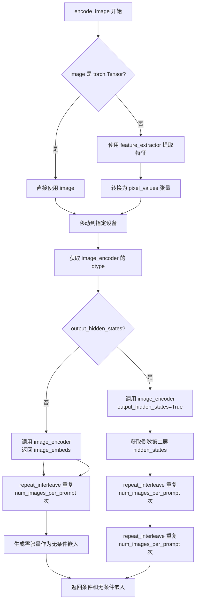

#### 带注释源码

```python
def encode_image(self, image, device, num_images_per_prompt, output_hidden_states=None):
    """
    将输入图像编码为图像嵌入向量或隐藏状态，用于后续的图像生成过程。
    
    Args:
        image: 输入图像，支持 torch.Tensor, PIL.Image.Image, np.ndarray 或 list 格式
        device: torch.device，目标设备
        num_images_per_prompt: int，每个提示词生成的图像数量
        output_hidden_states: bool，是否返回隐藏状态而非图像嵌入
    
    Returns:
        tuple: (条件嵌入, 无条件嵌入)
    """
    # 获取图像编码器的参数数据类型，用于后续的类型转换
    dtype = next(self.image_encoder.parameters()).dtype

    # 如果输入不是 PyTorch 张量，则使用 feature_extractor 进行预处理
    if not isinstance(image, torch.Tensor):
        # 使用 CLIP 图像处理器将 PIL 图像或 numpy 数组转换为张量
        image = self.feature_extractor(image, return_tensors="pt").pixel_values

    # 将图像移动到指定设备并转换为正确的 dtype
    image = image.to(device=device, dtype=dtype)
    
    # 根据 output_hidden_states 参数决定返回隐藏状态还是图像嵌入
    if output_hidden_states:
        # 获取图像编码器的隐藏状态（倒数第二层，通常是倒数第二层效果最好）
        image_enc_hidden_states = self.image_encoder(image, output_hidden_states=True).hidden_states[-2]
        # 为每个提示词生成的图像重复嵌入向量
        image_enc_hidden_states = image_enc_hidden_states.repeat_interleave(num_images_per_prompt, dim=0)
        
        # 生成零张量作为无条件的图像隐藏状态（用于 classifier-free guidance）
        uncond_image_enc_hidden_states = self.image_encoder(
            torch.zeros_like(image), output_hidden_states=True
        ).hidden_states[-2]
        # 同样重复无条件嵌入
        uncond_image_enc_hidden_states = uncond_image_enc_hidden_states.repeat_interleave(
            num_images_per_prompt, dim=0
        )
        # 返回隐藏状态形式的条件和无条件嵌入
        return image_enc_hidden_states, uncond_image_enc_hidden_states
    else:
        # 获取图像嵌入向量
        image_embeds = self.image_encoder(image).image_embeds
        # 为每个提示词生成的图像重复嵌入向量
        image_embeds = image_embeds.repeat_interleave(num_images_per_prompt, dim=0)
        
        # 生成零张量作为无条件的图像嵌入（用于 classifier-free guidance）
        uncond_image_embeds = torch.zeros_like(image_embeds)

        # 返回图像嵌入形式的条件和无条件嵌入
        return image_embeds, uncond_image_embeds
```


### `StableDiffusionControlNetPAGPipeline.prepare_ip_adapter_image_embeds`

该方法用于准备IP-Adapter的图像嵌入，处理输入图像或预计算的图像嵌入，并根据是否启用无分类器自由guidance（CFG）来组织输出格式。

参数：

- `self`：`StableDiffusionControlNetPAGPipeline`实例本身，隐式传递
- `ip_adapter_image`：`PipelineImageInput | None`，输入的IP-Adapter图像，可以是单个图像、图像列表或None
- `ip_adapter_image_embeds`：`list[torch.Tensor] | None`，预计算的图像嵌入列表，如果为None则从`ip_adapter_image`编码生成
- `device`：`torch.device`，目标设备，用于将张量移动到指定设备
- `num_images_per_prompt`：`int`，每个prompt生成的图像数量，用于复制嵌入
- `do_classifier_free_guidance`：`bool`，是否启用无分类器自由guidance，影响负向嵌入的处理

返回值：`list[torch.Tensor]`，处理后的IP-Adapter图像嵌入列表，每个元素是对应IP-Adapter的嵌入张量

#### 流程图

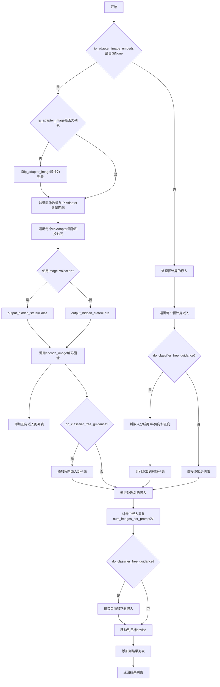

#### 带注释源码

```python
def prepare_ip_adapter_image_embeds(
    self, 
    ip_adapter_image,  # PipelineImageInput | None: IP-Adapter输入图像
    ip_adapter_image_embeds,  # list[torch.Tensor] | None: 预计算的图像嵌入
    device,  # torch.device: 目标设备
    num_images_per_prompt,  # int: 每个prompt生成的图像数量
    do_classifier_free_guidance  # bool: 是否启用无分类器自由guidance
):
    """
    准备IP-Adapter的图像嵌入。
    
    该方法处理两种输入情况：
    1. 当ip_adapter_image_embeds为None时，从ip_adapter_image编码生成嵌入
    2. 当ip_adapter_image_embeds不为None时，直接处理预计算的嵌入
    
    如果启用do_classifier_free_guidance，会生成负向图像嵌入用于无分类器引导。
    """
    
    # 初始化正向嵌入列表
    image_embeds = []
    
    # 如果启用CFG，初始化负向嵌入列表
    if do_classifier_free_guidance:
        negative_image_embeds = []
    
    # 情况1：需要从图像编码生成嵌入
    if ip_adapter_image_embeds is None:
        # 确保输入图像是列表格式
        if not isinstance(ip_adapter_image, list):
            ip_adapter_image = [ip_adapter_image]
        
        # 验证图像数量与IP-Adapter数量匹配
        if len(ip_adapter_image) != len(self.unet.encoder_hid_proj.image_projection_layers):
            raise ValueError(
                f"`ip_adapter_image` must have same length as the number of IP Adapters. "
                f"Got {len(ip_adapter_image)} images and "
                f"{len(self.unet.encoder_hid_proj.image_projection_layers)} IP Adapters."
            )
        
        # 遍历每个IP-Adapter的图像和对应的投影层
        for single_ip_adapter_image, image_proj_layer in zip(
            ip_adapter_image, 
            self.unet.encoder_hid_proj.image_projection_layers
        ):
            # 确定是否输出隐藏状态：如果不是ImageProjection类型则输出隐藏状态
            output_hidden_state = not isinstance(image_proj_layer, ImageProjection)
            
            # 调用encode_image方法编码单个图像
            single_image_embeds, single_negative_image_embeds = self.encode_image(
                single_ip_adapter_image, 
                device, 
                1,  # 每个IP-Adapter生成1个嵌入
                output_hidden_state
            )
            
            # 添加批次维度[1, ...]并添加到列表
            image_embeds.append(single_image_embeds[None, :])
            
            # 如果启用CFG，同时保存负向嵌入
            if do_classifier_free_guidance:
                negative_image_embeds.append(single_negative_image_embeds[None, :])
    
    # 情况2：直接处理预计算的嵌入
    else:
        for single_image_embeds in ip_adapter_image_embeds:
            # 如果启用CFG，预计算的嵌入包含正向和负向两部分
            if do_classifier_free_guidance:
                # 将嵌入分成两半：前半是负向，后半是正向
                single_negative_image_embeds, single_image_embeds = single_image_embeds.chunk(2)
                negative_image_embeds.append(single_negative_image_embeds)
            
            image_embeds.append(single_image_embeds)
    
    # 处理嵌入的重复和拼接
    ip_adapter_image_embeds = []
    
    for i, single_image_embeds in enumerate(image_embeds):
        # 为每个prompt复制对应的嵌入数量
        single_image_embeds = torch.cat(
            [single_image_embeds] * num_images_per_prompt, 
            dim=0  # 在批次维度拼接
        )
        
        # 如果启用CFG，需要在正向嵌入前拼接负向嵌入
        if do_classifier_free_guidance:
            single_negative_image_embeds = torch.cat(
                [negative_image_embeds[i]] * num_images_per_prompt, 
                dim=0
            )
            # 拼接格式: [负向嵌入, 正向嵌入]
            single_image_embeds = torch.cat(
                [single_negative_image_embeds, single_image_embeds], 
                dim=0
            )
        
        # 将处理后的嵌入移动到目标设备
        single_image_embeds = single_image_embeds.to(device=device)
        
        # 添加到结果列表
        ip_adapter_image_embeds.append(single_image_embeds)
    
    return ip_adapter_image_embeds
```


### `StableDiffusionControlNetPAGPipeline.run_safety_checker`

该方法用于在图像生成完成后调用安全检查器（Safety Checker），检测生成的图像是否包含不适宜内容（NSFW），并对检测到的问题图像进行模糊处理或替换。

参数：

- `self`：隐式参数，类型为 `StableDiffusionControlNetPAGPipeline` 实例，表示调用该方法的对象本身
- `image`：类型为 `torch.Tensor | numpy.ndarray | list`，待检查的生成图像，可以是 PyTorch 张量、NumPy 数组或图像列表
- `device`：类型为 `torch.device`，用于将特征提取器输入移动到指定设备（如 CUDA 或 CPU）
- `dtype`：类型为 `torch.dtype`，用于将特征提取器输入转换为指定数据类型（如 float16）

返回值：`tuple[torch.Tensor | list, list[bool] | None]`，返回元组，第一个元素是处理后的图像（如果安全检查器为 None 则保持原样），第二个元素是布尔列表表示每张图像是否包含 NSFW 概念，若安全检查器为 None 则返回 None

#### 流程图

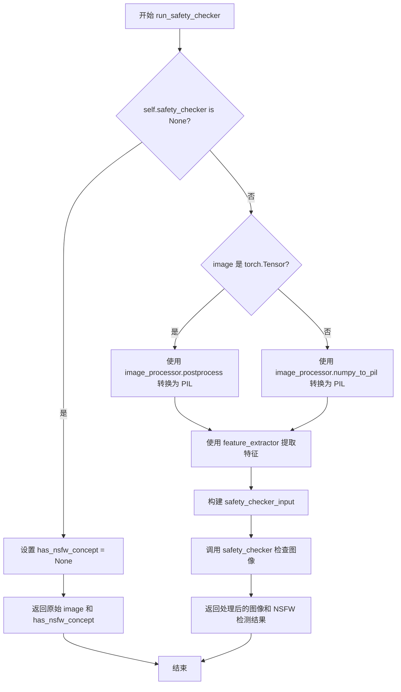

#### 带注释源码

```python
# Copied from diffusers.pipelines.stable_diffusion.pipeline_stable_diffusion.StableDiffusionPipeline.run_safety_checker
def run_safety_checker(self, image, device, dtype):
    """
    运行安全检查器以检测生成的图像是否包含不适宜内容（NSFW）。
    
    Args:
        image: 待检查的图像，可以是 torch.Tensor、numpy.ndarray 或列表
        device: 用于处理的设备
        dtype: 用于转换的数据类型
    
    Returns:
        tuple: (处理后的图像, NSFW 检测结果)
    """
    # 如果没有配置安全检查器，直接返回原图和 None
    if self.safety_checker is None:
        has_nsfw_concept = None
    else:
        # 根据图像类型进行预处理，转换为 PIL 图像格式供特征提取器使用
        if torch.is_tensor(image):
            # 将张量格式的图像转换为 PIL 图像
            feature_extractor_input = self.image_processor.postprocess(image, output_type="pil")
        else:
            # 将 numpy 数组格式的图像转换为 PIL 图像
            feature_extractor_input = self.image_processor.numpy_to_pil(image)
        
        # 使用特征提取器提取图像特征，并移动到指定设备和数据类型
        safety_checker_input = self.feature_extractor(feature_extractor_input, return_tensors="pt").to(device)
        
        # 调用安全检查器模型进行 NSFW 检测
        # 参数:
        #   images: 待检查的图像
        #   clip_input: 从特征提取器得到的 CLIP 输入
        image, has_nsfw_concept = self.safety_checker(
            images=image, clip_input=safety_checker_input.pixel_values.to(dtype)
        )
    
    # 返回处理后的图像和 NSFW 检测结果
    return image, has_nsfw_concept
```


### `StableDiffusionControlNetPAGPipeline.prepare_extra_step_kwargs`

该方法用于准备调度器（scheduler）的额外关键字参数。由于不同调度器具有不同的签名，该方法通过动态检查调度器的`step`方法参数，决定是否将`generator`和`eta`参数传递给调度器，从而实现对多种调度器的兼容支持。

参数：

- `generator`：`torch.Generator | list[torch.Generator] | None`，可选的生成器，用于控制随机数生成以实现可重复的图像生成
- `eta`：`float`，DDIM调度器的η参数，仅在使用DDIMScheduler时生效，取值范围为[0, 1]

返回值：`dict[str, Any]`，包含调度器step方法所需的关键字参数字典，可能包含`eta`和/或`generator`键

#### 流程图

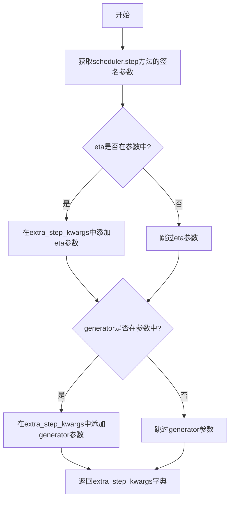

#### 带注释源码

```python
def prepare_extra_step_kwargs(self, generator, eta):
    """
    为调度器步骤准备额外的关键字参数，因为并非所有调度器都具有相同的签名。
    eta (η) 仅在 DDIMScheduler 中使用，其他调度器会忽略它。
    eta 对应 DDIM 论文 (https://huggingface.co/papers/2010.02502) 中的 η 参数，
    取值应在 [0, 1] 范围内。
    
    参数:
        generator: 可选的 torch.Generator，用于控制随机数生成
        eta: float，对应 DDIM 论文中的 η 参数
    
    返回:
        dict: 包含调度器所需额外参数的关键字参数字典
    """
    
    # 使用 inspect 模块检查调度器的 step 方法是否接受 eta 参数
    # 不同调度器（如 DDIMScheduler、PNDMScheduler、LMSDiscreteScheduler）签名不同
    accepts_eta = "eta" in set(inspect.signature(self.scheduler.step).parameters.keys())
    
    # 初始化空字典用于存储额外的调度器参数
    extra_step_kwargs = {}
    
    # 如果调度器接受 eta 参数，则将其添加到 extra_step_kwargs
    if accepts_eta:
        extra_step_kwargs["eta"] = eta

    # 检查调度器是否接受 generator 参数
    accepts_generator = "generator" in set(inspect.signature(self.scheduler.step).parameters.keys())
    
    # 如果调度器接受 generator 参数，则将其添加到 extra_step_kwargs
    if accepts_generator:
        extra_step_kwargs["generator"] = generator
    
    # 返回构建好的参数字典，供后续 scheduler.step() 调用使用
    return extra_step_kwargs
```


### `StableDiffusionControlNetPAGPipeline.check_inputs`

该方法用于验证Stable Diffusion ControlNet PAG Pipeline的输入参数是否有效，包括对prompt、image、negative_prompt、controlnet_conditioning_scale、control_guidance_start、control_guidance_end以及IP-Adapter相关参数的类型和一致性检查，确保pipeline能够正确执行。

参数：

- `prompt`：`str | list[str] | None`，用户提供的文本提示，用于指导图像生成
- `image`：`PipelineImageInput`，控制网络的输入条件图像，用于指导UNet去噪过程
- `negative_prompt`：`str | list[str] | None`，负面提示词，用于指导不包含在图像中的内容
- `prompt_embeds`：`torch.Tensor | None`，预生成的文本嵌入，用于替代prompt
- `negative_prompt_embeds`：`torch.Tensor | None`，预生成的负面文本嵌入
- `ip_adapter_image`：`PipelineImageInput | None`，IP-Adapter的输入图像
- `ip_adapter_image_embeds`：`list[torch.Tensor] | None`，预生成的IP-Adapter图像嵌入
- `controlnet_conditioning_scale`：`float | list[float]`，ControlNet输出到UNet残差的乘数
- `control_guidance_start`：`float | list[float]`，ControlNet开始应用的总步数百分比
- `control_guidance_end`：`float | list[float]`，ControlNet停止应用的總步數百分比
- `callback_on_step_end_tensor_inputs`：`list[str] | None`，每步结束回调函数可访问的张量输入列表

返回值：`None`，该方法不返回任何值，仅进行参数验证和异常抛出

#### 流程图

```mermaid
flowchart TD
    A[开始 check_inputs] --> B{检查 callback_on_step_end_tensor_inputs}
    B -->|无效| C[抛出 ValueError]
    B -->|有效| D{prompt 和 prompt_embeds 同时存在?}
    D -->|是| E[抛出 ValueError: 不能同时提供]
    D -->|否| F{prompt 和 prompt_embeds 都为空?}
    F -->|是| G[抛出 ValueError: 至少提供一个]
    F -->|否| H{prompt 类型合法?}
    H -->|否| I[抛出 ValueError: 类型错误]
    H -->|是| J{negative_prompt 和 negative_prompt_embeds 同时存在?}
    J -->|是| K[抛出 ValueError: 不能同时提供]
    J -->|否| L{prompt_embeds 和 negative_prompt_embeds 形状相同?}
    L -->|否| M[抛出 ValueError: 形状不匹配]
    L -->|是| N{检查 image 类型和数量]
    N --> O{ControlNet 类型?}
    O -->|Single ControlNet| P[调用 check_image 验证单图]
    O -->|Multi ControlNet| Q{image 是 list?}
    Q -->|否| R[抛出 TypeError: 需要 list]
    Q -->|是| S{image 是嵌套 list?]
    S -->|是| T[转置并验证每个子列表]
    S -->|否| U{image 数量与 ControlNet 数量一致?}
    U -->|否| V[抛出 ValueError: 数量不匹配]
    U -->|是| W[遍历调用 check_image]
    P --> X[验证 controlnet_conditioning_scale]
    T --> X
    W --> X
    X --> Y{ControlNet 类型?}
    Y -->|Single| Z[必须是 float 类型]
    Y -->|Multi| AA[检查 list 类型和长度]
    Z --> AB[验证 control_guidance_start 和 control_guidance_end]
    AA --> AB
    AB --> AC{start 和 end 长度相等?}
    AC -->|否| AD[抛出 ValueError: 长度不匹配]
    AC -->|是| AE{start >= end 或超出范围?}
    AE -->|是| AF[抛出 ValueError: 范围错误]
    AE -->|否| AG{检查 IP-Adapter 参数]
    AG --> AH{ip_adapter_image 和 ip_adapter_image_embeds 都存在?}
    AH -->|是| AI[抛出 ValueError: 只能提供一个]
    AH -->|否| AJ{ip_adapter_image_embeds 类型合法?}
    AJ -->|否| AK[抛出 ValueError: 类型错误]
    AJ -->|是| AL{嵌入维度合法?}
    AL -->|否| AM[抛出 ValueError: 维度错误]
    AL -->|是| AN[结束验证]
    C --> AN
    E --> AN
    G --> AN
    I --> AN
    K --> AN
    M --> AN
    R --> AN
    V --> AN
    AD --> AN
    AF --> AN
    AI --> AN
    AK --> AN
    AM --> AN
```

#### 带注释源码

```python
def check_inputs(
    self,
    prompt,
    image,
    negative_prompt=None,
    prompt_embeds=None,
    negative_prompt_embeds=None,
    ip_adapter_image=None,
    ip_adapter_image_embeds=None,
    controlnet_conditioning_scale=1.0,
    control_guidance_start=0.0,
    control_guidance_end=1.0,
    callback_on_step_end_tensor_inputs=None,
):
    """
    验证pipeline的输入参数是否有效
    
    参数:
        prompt: 文本提示
        image: 控制网络输入图像
        negative_prompt: 负面提示词
        prompt_embeds: 预计算的提示词嵌入
        negative_prompt_embeds: 预计算的负面提示词嵌入
        ip_adapter_image: IP-Adapter图像
        ip_adapter_image_embeds: IP-Adapter图像嵌入
        controlnet_conditioning_scale: ControlNet条件缩放因子
        control_guidance_start: ControlNet开始应用的步骤比例
        control_guidance_end: ControlNet停止应用的步骤比例
        callback_on_step_end_tensor_inputs: 回调函数可访问的张量
    """
    # 检查回调张量输入是否在允许的列表中
    if callback_on_step_end_tensor_inputs is not None and not all(
        k in self._callback_tensor_inputs for k in callback_on_step_end_tensor_inputs
    ):
        raise ValueError(
            f"`callback_on_step_end_tensor_inputs` has to be in {self._callback_tensor_inputs}, but found {[k for k in callback_on_step_end_tensor_inputs if k not in self._callback_tensor_inputs]}"
        )

    # 检查prompt和prompt_embeds不能同时提供
    if prompt is not None and prompt_embeds is not None:
        raise ValueError(
            f"Cannot forward both `prompt`: {prompt} and `prompt_embeds`: {prompt_embeds}. Please make sure to"
            " only forward one of the two."
        )
    # 检查至少提供一个
    elif prompt is None and prompt_embeds is None:
        raise ValueError(
            "Provide either `prompt` or `prompt_embeds`. Cannot leave both `prompt` and `prompt_embeds` undefined."
        )
    # 检查prompt类型
    elif prompt is not None and (not isinstance(prompt, str) and not isinstance(prompt, list)):
        raise ValueError(f"`prompt` has to be of type `str` or `list` but is {type(prompt)}")

    # 检查negative_prompt和negative_prompt_embeds不能同时提供
    if negative_prompt is not None and negative_prompt_embeds is not None:
        raise ValueError(
            f"Cannot forward both `negative_prompt`: {negative_prompt} and `negative_prompt_embeds`:"
            f" {negative_prompt_embeds}. Please make sure to only forward one of the two."
        )

    # 检查prompt_embeds和negative_prompt_embeds形状一致性
    if prompt_embeds is not None and negative_prompt_embeds is not None:
        if prompt_embeds.shape != negative_prompt_embeds.shape:
            raise ValueError(
                "`prompt_embeds` and `negative_prompt_embeds` must have the same shape when passed directly, but"
                f" got: `prompt_embeds` {prompt_embeds.shape} != `negative_prompt_embeds`"
                f" {negative_prompt_embeds.shape}."
            )

    # 检查image参数
    is_compiled = hasattr(F, "scaled_dot_product_attention") and isinstance(
        self.controlnet, torch._dynamo.eval_frame.OptimizedModule
    )
    if (
        isinstance(self.controlnet, ControlNetModel)
        or is_compiled
        and isinstance(self.controlnet._orig_mod, ControlNetModel)
    ):
        # 单个ControlNet：验证单张图像
        self.check_image(image, prompt, prompt_embeds)
    elif (
        isinstance(self.controlnet, MultiControlNetModel)
        or is_compiled
        and isinstance(self.controlnet._orig_mod, MultiControlNetModel)
    ):
        # 多个ControlNet：验证图像列表
        if not isinstance(image, list):
            raise TypeError("For multiple controlnets: `image` must be type `list`")

        # 处理嵌套列表情况（如 [[canny1, pose1], [canny2, pose2]]）
        elif any(isinstance(i, list) for i in image):
            transposed_image = [list(t) for t in zip(*image)]
            if len(transposed_image) != len(self.controlnet.nets):
                raise ValueError(
                    f"For multiple controlnets: if you pass`image` as a list of list, each sublist must have the same length as the number of controlnets, but the sublists in `image` got {len(transposed_image)} images and {len(self.controlnet.nets)} ControlNets."
                )
            for image_ in transposed_image:
                self.check_image(image_, prompt, prompt_embeds)
        # 检查图像数量与ControlNet数量一致性
        elif len(image) != len(self.controlnet.nets):
            raise ValueError(
                f"For multiple controlnets: `image` must have the same length as the number of controlnets, but got {len(image)} images and {len(self.controlnet.nets)} ControlNets."
            )
        else:
            for image_ in image:
                self.check_image(image_, prompt, prompt_embeds)
    else:
        assert False

    # 验证controlnet_conditioning_scale
    if (
        isinstance(self.controlnet, ControlNetModel)
        or is_compiled
        and isinstance(self.controlnet._orig_mod, ControlNetModel)
    ):
        # 单个ControlNet必须是float类型
        if not isinstance(controlnet_conditioning_scale, float):
            raise TypeError("For single controlnet: `controlnet_conditioning_scale` must be type `float`.")
    elif (
        isinstance(self.controlnet, MultiControlNetModel)
        or is_compiled
        and isinstance(self.controlnet._orig_mod, MultiControlNetModel)
    ):
        # 多个ControlNet可以是float或list
        if isinstance(controlnet_conditioning_scale, list):
            if any(isinstance(i, list) for i in controlnet_conditioning_scale):
                raise ValueError(
                    "A single batch of varying conditioning scale settings (e.g. [[1.0, 0.5], [0.2, 0.8]]) is not supported at the moment. "
                    "The conditioning scale must be fixed across the batch."
                )
        elif isinstance(controlnet_conditioning_scale, list) and len(controlnet_conditioning_scale) != len(
            self.controlnet.nets
        ):
            raise ValueError(
                "For multiple controlnets: When `controlnet_conditioning_scale` is specified as `list`, it must have"
                " the same length as the number of controlnets"
            )
    else:
        assert False

    # 验证control_guidance_start和control_guidance_end
    if not isinstance(control_guidance_start, (tuple, list)):
        control_guidance_start = [control_guidance_start]

    if not isinstance(control_guidance_end, (tuple, list)):
        control_guidance_end = [control_guidance_end]

    if len(control_guidance_start) != len(control_guidance_end):
        raise ValueError(
            f"`control_guidance_start` has {len(control_guidance_start)} elements, but `control_guidance_end` has {len(control_guidance_end)} elements. Make sure to provide the same number of elements to each list."
        )

    if isinstance(self.controlnet, MultiControlNetModel):
        if len(control_guidance_start) != len(self.controlnet.nets):
            raise ValueError(
                f"`control_guidance_start`: {control_guidance_start} has {len(control_guidance_start)} elements but there are {len(self.controlnet.nets)} controlnets available. Make sure to provide {len(self.controlnet.nets)}."
            )

    # 验证每个start-end对的有效性
    for start, end in zip(control_guidance_start, control_guidance_end):
        if start >= end:
            raise ValueError(
                f"control guidance start: {start} cannot be larger or equal to control guidance end: {end}."
            )
        if start < 0.0:
            raise ValueError(f"control guidance start: {start} can't be smaller than 0.")
        if end > 1.0:
            raise ValueError(f"control guidance end: {end} can't be larger than 1.0.")

    # 验证IP-Adapter参数
    if ip_adapter_image is not None and ip_adapter_image_embeds is not None:
        raise ValueError(
            "Provide either `ip_adapter_image` or `ip_adapter_image_embeds`. Cannot leave both `ip_adapter_image` and `ip_adapter_image_embeds` defined."
        )

    if ip_adapter_image_embeds is not None:
        if not isinstance(ip_adapter_image_embeds, list):
            raise ValueError(
                f"`ip_adapter_image_embeds` has to be of type `list` but is {type(ip_adapter_image_embeds)}"
            )
        elif ip_adapter_image_embeds[0].ndim not in [3, 4]:
            raise ValueError(
                f"`ip_adapter_image_embeds` has to be a list of 3D or 4D tensors but is {ip_adapter_image_embeds[0].ndim}D"
            )
```


### StableDiffusionControlNetPAGPipeline.check_image

该方法用于验证输入的图像和提示词是否符合Pipeline的要求，检查图像类型（PIL Image、torch.Tensor、numpy.ndarray或其列表）是否合法，并确保图像批次大小与提示词批次大小一致（当图像批次大小不为1时）。

参数：

- `image`：PIL.Image.Image | torch.Tensor | np.ndarray | list[PIL.Image.Image] | list[torch.Tensor] | list[np.ndarray]，待检查的控制网络输入图像
- `prompt`：str | list[str] | None，用于生成图像的文本提示词
- `prompt_embeds`：torch.Tensor | None，预生成的文本嵌入向量

返回值：无（None），该方法仅进行参数验证，不返回任何值

#### 流程图

```mermaid
flowchart TD
    A[开始 check_image] --> B{检查 image 类型}
    
    B --> C{image 是 PIL.Image?}
    C -->|是| D[image_is_pil = True]
    C -->|否| E{image 是 torch.Tensor?}
    
    E -->|是| F[image_is_tensor = True]
    E -->|否| G{image 是 np.ndarray?}
    
    G -->|是| H[image_is_np = True]
    G -->|否| I{image 是 list?}
    
    I -->|是| J{检查列表第一个元素类型}
    I -->|否| K[类型检查失败]
    
    J --> J1[PIL? → image_is_pil_list]
    J --> J2[Tensor? → image_is_tensor_list]
    J --> J3[np? → image_is_np_list]
    
    D --> L[所有标志位检查]
    F --> L
    H --> L
    J1 --> L
    J2 --> L
    J3 --> L
    K --> L
    
    L --> M{类型是否合法?}
    M -->|否| N[抛出 TypeError]
    M -->|是| O{确定 image_batch_size}
    
    O --> P{image_is_pil?}
    P -->|是| Q[image_batch_size = 1]
    P -->|否| R[image_batch_size = len(image)]
    
    Q --> S{确定 prompt_batch_size}
    R --> S
    
    S --> T{prompt 是否为 str?}
    T -->|是| U[prompt_batch_size = 1]
    T -->|否| V{prompt 是否为 list?}
    
    V -->|是| W[prompt_batch_size = len(prompt)]
    V -->|否| X{prompt_embeds 是否存在?}
    
    X -->|是| Y[prompt_batch_size = prompt_embeds.shape[0]]
    X -->|否| Z[prompt_batch_size 未定义]
    
    U --> AA[批次大小一致性检查]
    W --> AA
    Y --> AA
    
    AA --> BB{image_batch_size != 1 且 != prompt_batch_size?}
    BB -->|是| CC[抛出 ValueError]
    BB -->|否| DD[验证通过]
    
    N --> EE[结束]
    CC --> EE
    DD --> EE
```

#### 带注释源码

```python
# Copied from diffusers.pipelines.controlnet.pipeline_controlnet.StableDiffusionControlNetPipeline.check_image
def check_image(self, image, prompt, prompt_embeds):
    """
    检查输入图像的有效性，确保图像类型和批次大小符合要求。
    
    该方法执行以下验证：
    1. 验证 image 是支持的类型（PIL Image, torch.Tensor, numpy.ndarray 或它们的列表）
    2. 验证图像批次大小与提示词批次大小一致（当图像批次大小不为1时）
    
    Args:
        image: 控制网络输入图像，支持多种格式
        prompt: 文本提示词
        prompt_embeds: 预生成的文本嵌入
    
    Raises:
        TypeError: 当 image 类型不支持时
        ValueError: 当图像批次大小与提示词批次大小不匹配时
    """
    # 检查图像是否为 PIL Image
    image_is_pil = isinstance(image, PIL.Image.Image)
    # 检查图像是否为 torch.Tensor
    image_is_tensor = isinstance(image, torch.Tensor)
    # 检查图像是否为 numpy.ndarray
    image_is_np = isinstance(image, np.ndarray)
    # 检查是否为 PIL Image 列表
    image_is_pil_list = isinstance(image, list) and isinstance(image[0], PIL.Image.Image)
    # 检查是否为 torch.Tensor 列表
    image_is_tensor_list = isinstance(image, list) and isinstance(image[0], torch.Tensor)
    # 检查是否为 numpy.ndarray 列表
    image_is_np_list = isinstance(image, list) and isinstance(image[0], np.ndarray)

    # 验证图像类型是否合法
    if (
        not image_is_pil
        and not image_is_tensor
        and not image_is_np
        and not image_is_pil_list
        and not image_is_tensor_list
        and not image_is_np_list
    ):
        raise TypeError(
            f"image must be passed and be one of PIL image, numpy array, torch tensor, list of PIL images, list of numpy arrays or list of torch tensors, but is {type(image)}"
        )

    # 确定图像批次大小
    if image_is_pil:
        image_batch_size = 1
    else:
        image_batch_size = len(image)

    # 确定提示词批次大小
    if prompt is not None and isinstance(prompt, str):
        prompt_batch_size = 1
    elif prompt is not None and isinstance(prompt, list):
        prompt_batch_size = len(prompt)
    elif prompt_embeds is not None:
        prompt_batch_size = prompt_embeds.shape[0]

    # 验证图像批次大小与提示词批次大小的一致性
    if image_batch_size != 1 and image_batch_size != prompt_batch_size:
        raise ValueError(
            f"If image batch size is not 1, image batch size must be same as prompt batch size. image batch size: {image_batch_size}, prompt batch size: {prompt_batch_size}"
        )
```


### `StableDiffusionControlNetPAGPipeline.prepare_image`

该方法负责将输入的ControlNet图像进行预处理，包括尺寸调整、类型转换、批处理重复等操作，以适配Stable Diffusion模型的输入格式要求。

参数：

-  `self`：`StableDiffusionControlNetPAGPipeline` 实例，管道对象本身
-  `image`：`PipelineImageInput`（torch.Tensor | PIL.Image.Image | np.ndarray | list），ControlNet输入图像，支持多种格式
-  `width`：`int`，目标输出图像宽度（像素）
-  `height`：`int`，目标输出图像高度（像素）
-  `batch_size`：`int`，批处理大小，用于确定图像重复次数
-  `num_images_per_prompt`：`int`，每个prompt生成的图像数量
-  `device`：`torch.device`，目标设备（CPU/CUDA）
-  `dtype`：`torch.dtype`，目标数据类型
-  `do_classifier_free_guidance`：`bool`，是否启用无分类器引导，默认为False
-  `guess_mode`：`bool`，是否启用猜测模式，默认为False

返回值：`torch.Tensor`，预处理后的图像张量，形状为 `(batch_size * num_images_per_prompt, C, H, W)` 或在启用CFG时为 `(2 * batch_size * num_images_per_prompt, C, H, W)`

#### 流程图

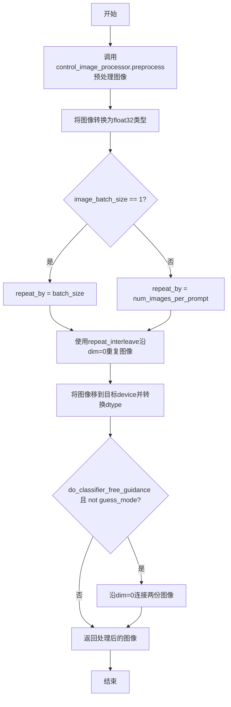

#### 带注释源码

```python
def prepare_image(
    self,
    image,
    width,
    height,
    batch_size,
    num_images_per_prompt,
    device,
    dtype,
    do_classifier_free_guidance=False,
    guess_mode=False,
):
    """
    预处理ControlNet输入图像，包括尺寸调整、类型转换和批处理重复
    
    Args:
        image: ControlNet输入图像，支持PIL.Image、numpy数组、torch.Tensor或列表
        width: 目标宽度
        height: 目标高度
        batch_size: 批处理大小
        num_images_per_prompt: 每个prompt生成的图像数
        device: 目标设备
        dtype: 目标数据类型
        do_classifier_free_guidance: 是否启用无分类器引导
        guess_mode: 是否启用猜测模式
    
    Returns:
        torch.Tensor: 预处理后的图像张量
    """
    # 步骤1：使用control_image_processor预处理图像（调整尺寸、归一化等），并转换为float32
    image = self.control_image_processor.preprocess(image, height=height, width=width).to(dtype=torch.float32)
    
    # 步骤2：获取图像批次大小
    image_batch_size = image.shape[0]

    # 步骤3：根据图像批次大小确定重复次数
    if image_batch_size == 1:
        # 如果只有一张图像，按batch_size重复
        repeat_by = batch_size
    else:
        # 图像批次大小与prompt批次大小相同时，按num_images_per_prompt重复
        repeat_by = num_images_per_prompt

    # 步骤4：沿批次维度重复图像
    image = image.repeat_interleave(repeat_by, dim=0)

    # 步骤5：将图像移到目标设备并转换数据类型
    image = image.to(device=device, dtype=dtype)

    # 步骤6：如果启用无分类器引导且不是猜测模式，则复制图像用于后续guidance
    if do_classifier_free_guidance and not guess_mode:
        # 复制图像用于unconditional和conditional分支
        image = torch.cat([image] * 2)

    # 步骤7：返回处理后的图像
    return image
```


### `StableDiffusionControlNetPAGPipeline.prepare_latents`

该方法用于准备扩散过程的初始潜在向量（latents），根据指定的批次大小、图像尺寸和数据类型生成随机噪声，或使用提供的潜在向量，并按照调度器的初始噪声标准差进行缩放。

参数：

- `batch_size`：`int`，批量大小，即一次生成图像的数量
- `num_channels_latents`：`int`，潜在空间的通道数，通常对应UNet的输入通道数
- `height`：`int`，生成图像的高度（像素）
- `width`：`int`，生成图像的宽度（像素）
- `dtype`：`torch.dtype`，生成潜在向量的数据类型（如torch.float16）
- `device`：`torch.device`，生成潜在向量所在的设备（如cuda:0）
- `generator`：`torch.Generator | list[torch.Generator] | None`，用于生成随机噪声的随机数生成器，可确保可重复性
- `latents`：`torch.Tensor | None`，可选的预生成潜在向量，若为None则随机生成

返回值：`torch.Tensor`，处理后的潜在向量张量，形状为(batch_size, num_channels_latents, height//vae_scale_factor, width//vae_scale_factor)

#### 流程图

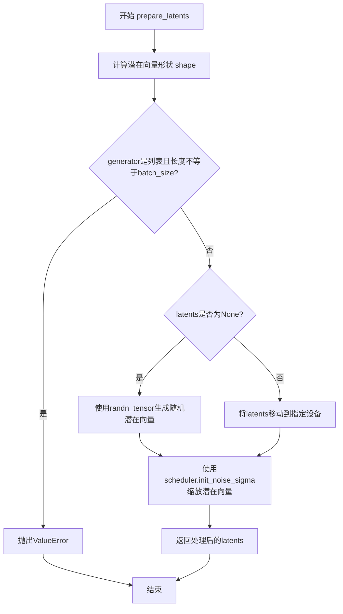

#### 带注释源码

```python
# Copied from diffusers.pipelines.stable_diffusion.pipeline_stable_diffusion.StableDiffusionPipeline.prepare_latents
def prepare_latents(
    self,
    batch_size: int,
    num_channels_latents: int,
    height: int,
    width: int,
    dtype: torch.dtype,
    device: torch.device,
    generator: torch.Generator | list[torch.Generator] | None,
    latents: torch.Tensor | None = None,
) -> torch.Tensor:
    """
    准备用于扩散过程的初始潜在向量。
    
    根据提供的参数计算潜在向量的形状，如果未提供预生成的潜在向量，
    则使用随机噪声生成器创建新的潜在向量，最后按照调度器的要求进行缩放。
    
    Args:
        batch_size: 批次大小
        num_channels_latents: 潜在空间的通道数
        height: 图像高度
        width: 图像宽度
        dtype: 数据类型
        device: 设备
        generator: 随机数生成器
        latents: 可选的预生成潜在向量
    
    Returns:
        处理后的潜在向量张量
    """
    # 计算潜在向量的形状，根据VAE的缩放因子调整高度和宽度
    # VAE的缩放因子通常为8，意味着潜在空间是像素空间的1/8
    shape = (
        batch_size,
        num_channels_latents,
        int(height) // self.vae_scale_factor,
        int(width) // self.vae_scale_factor,
    )
    
    # 验证生成器列表长度与批次大小是否匹配
    if isinstance(generator, list) and len(generator) != batch_size:
        raise ValueError(
            f"You have passed a list of generators of length {len(generator)}, but requested an effective batch"
            f" size of {batch_size}. Make sure the batch size matches the length of the generators."
        )

    # 如果没有提供潜在向量，则随机生成
    if latents is None:
        # 使用randn_tensor生成标准正态分布的随机张量
        latents = randn_tensor(shape, generator=generator, device=device, dtype=dtype)
    else:
        # 如果提供了潜在向量，确保其在正确的设备上
        latents = latents.to(device)

    # 使用调度器的初始噪声标准差缩放初始噪声
    # 不同的调度器有不同的初始噪声缩放要求
    latents = latents * self.scheduler.init_noise_sigma
    return latents
```


### `StableDiffusionControlNetPAGPipeline.get_guidance_scale_embedding`

该方法用于生成引导比例（guidance scale）的嵌入向量，通过正弦和余弦函数将标量的引导比例值映射到高维空间，以便后续丰富时间步嵌入（timestep embeddings）。该实现源自 Google Research 的 VDM 项目。

参数：

- `self`：`StableDiffusionControlNetPAGPipeline`，管道实例自身
- `w`：`torch.Tensor`，一维张量，用于生成嵌入向量的引导比例值
- `embedding_dim`：`int`，可选，默认值为 512，生成嵌入向量的维度
- `dtype`：`torch.dtype`，可选，默认值为 `torch.float32`，生成嵌入向量的数据类型

返回值：`torch.Tensor`，形状为 `(len(w), embedding_dim)` 的嵌入向量张量

#### 流程图

```mermaid
flowchart TD
    A[开始: 接收引导比例张量 w] --> B{验证输入}
    B -->|通过| C[将 w 乘以 1000.0 进行缩放]
    C --> D[计算半维: half_dim = embedding_dim // 2]
    D --> E[计算对数基础: log_base = log(10000.0) / (half_dim - 1)]
    E --> F[生成频率向量: emb = exp(arange(half_dim) * -log_base)]
    F --> G[广播乘法: emb = w[:, None] * emb[None, :]]
    G --> H[拼接正弦和余弦: emb = concat([sin(emb), cos(emb)], dim=1)]
    H --> I{embedding_dim 为奇数?}
    I -->|是| J[零填充: pad(emb, (0, 1))]
    I -->|否| K[跳过填充]
    J --> L[验证输出形状]
    K --> L
    L --> M[返回嵌入向量]
```

#### 带注释源码

```python
def get_guidance_scale_embedding(
    self, w: torch.Tensor, embedding_dim: int = 512, dtype: torch.dtype = torch.float32
) -> torch.Tensor:
    """
    生成引导比例嵌入向量，用于丰富时间步嵌入。
    基于 https://github.com/google-research/vdm/blob/dc27b98a554f65cdc654b800da5aa1846545d41b/model_vdm.py#L298

    Args:
        w: 用于生成嵌入向量的引导比例张量，形状为 (batch_size,)
        embedding_dim: 嵌入向量的维度，默认 512
        dtype: 嵌入向量的数据类型，默认 torch.float32

    Returns:
        形状为 (len(w), embedding_dim) 的嵌入向量张量
    """
    # 断言确保输入是一维张量
    assert len(w.shape) == 1
    
    # 将引导比例缩放 1000 倍，这与训练时的缩放因子对应
    w = w * 1000.0

    # 计算嵌入维度的一半（因为后续会拼接正弦和余弦）
    half_dim = embedding_dim // 2
    
    # 计算对数基础值，用于生成频率向量
    # 等价于 log(10000.0) / (half_dim - 1)
    emb = torch.log(torch.tensor(10000.0)) / (half_dim - 1)
    
    # 生成频率向量：从 0 到 half_dim-1 的指数衰减序列
    # 频率从高到低递减，这样可以捕获不同尺度的特征
    emb = torch.exp(torch.arange(half_dim, dtype=dtype) * -emb)
    
    # 广播乘法：将每个引导比例值与所有频率相乘
    # w: (batch_size,) -> (batch_size, 1)
    # emb: (half_dim,) -> (1, half_dim)
    # 结果: (batch_size, half_dim)
    emb = w.to(dtype)[:, None] * emb[None, :]
    
    # 拼接正弦和余弦变换，形成完整的嵌入向量
    # 形状: (batch_size, half_dim * 2) = (batch_size, embedding_dim) 或 (batch_size, embedding_dim-1)
    emb = torch.cat([torch.sin(emb), torch.cos(emb)], dim=1)
    
    # 如果嵌入维度为奇数，需要进行零填充
    if embedding_dim % 2 == 1:
        emb = torch.nn.functional.pad(emb, (0, 1))
    
    # 验证输出形状是否正确
    assert emb.shape == (w.shape[0], embedding_dim)
    
    return emb
```


### `StableDiffusionControlNetPAGPipeline.guidance_scale`

该属性返回当前管道的引导比例（guidance scale），用于控制图像生成与文本提示的相关性。guidance_scale 值越高，生成的图像与文本提示的关联性越强，但可能导致图像质量下降。

参数： 无

返回值：`float`，返回当前设置的引导比例值，用于控制分类器-free引导的强度。

#### 流程图

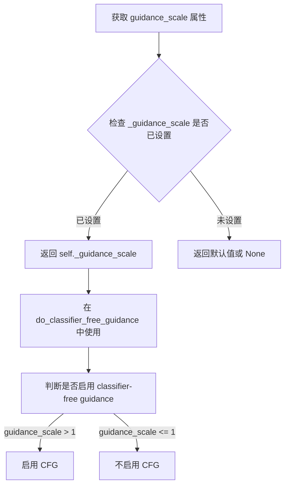

#### 带注释源码

```python
@property
def guidance_scale(self):
    """
    返回当前管道的引导比例（guidance scale）。
    
    guidance_scale 是用于分类器-free引导（Classifier-Free Guidance）的权重参数，
    类似于 Imagen 论文中的 w 参数。该值控制了生成图像与文本提示的匹配程度：
    -值为 1.0 时，不进行分类器-free引导
    -值大于 1.0 时，引导模型更紧密地跟随文本提示
    
    返回值:
        float: 当前设置的引导比例值
    """
    return self._guidance_scale
```

#### 相关属性说明

| 属性名 | 类型 | 描述 |
|--------|------|------|
| `_guidance_scale` | float | 内部存储的引导比例值，在 `__call__` 方法中设置 |
| `do_classifier_free_guidance` | bool | 根据 guidance_scale > 1 且 unet.config.time_cond_proj_dim 为 None 时判断是否启用 CFG |
| `clip_skip` | int \| None | CLIP 模型跳过的层数属性 |

#### 使用示例

在 `__call__` 方法中的使用：

```python
# 设置 guidance_scale
self._guidance_scale = guidance_scale  # 默认值为 7.5

# 在去噪循环中用于判断是否启用 CFG
if self.do_perturbed_attention_guidance:
    noise_pred = self._apply_perturbed_attention_guidance(
        noise_pred, self.do_classifier_free_guidance, self.guidance_scale, t
    )
elif self.do_classifier_free_guidance:
    noise_pred_uncond, noise_pred_text = noise_pred.chunk(2)
    noise_pred = noise_pred_uncond + self.guidance_scale * (noise_pred_text - noise_pred_uncond)
```


### `StableDiffusionControlNetPAGPipeline.clip_skip`

这是一个属性（property），用于获取在计算提示嵌入时从CLIP文本编码器跳过的层数。该属性允许用户在文本编码过程中选择使用CLIP模型的早期或晚期隐藏状态，从而影响生成图像与文本提示的对齐程度。

参数： 无（这是一个属性getter，没有参数）

返回值： `int | None`，返回要跳过的CLIP层数。如果为`None`，则使用CLIP模型的最后一层输出；如果设置具体数值，则跳过相应数量的层并使用前一层的输出。

#### 流程图

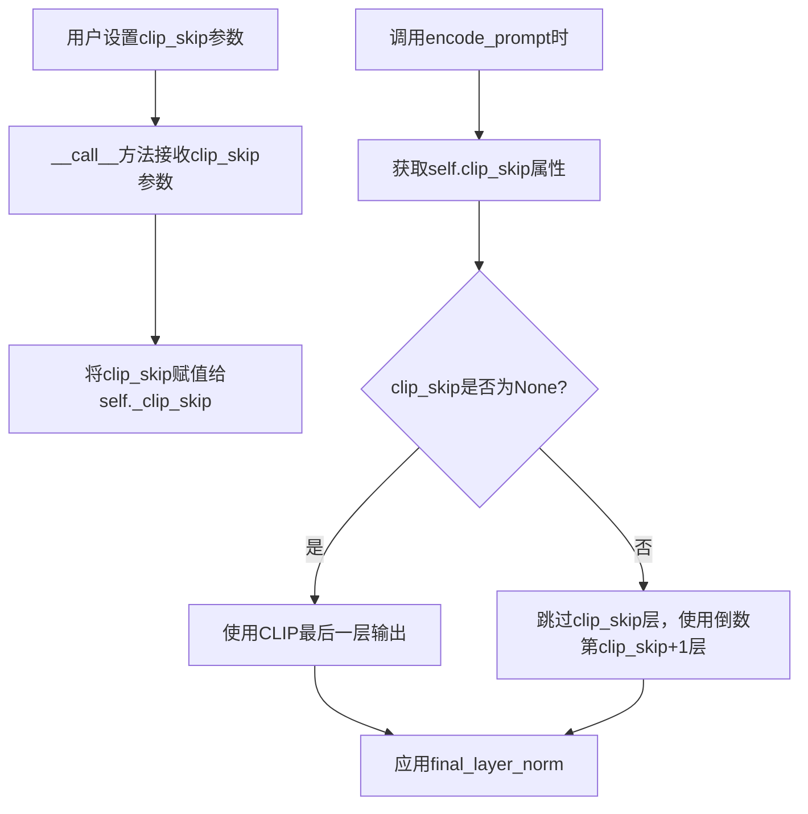

#### 带注释源码

```python
@property
def clip_skip(self):
    r"""
    Property to get the number of CLIP layers to skip when computing prompt embeddings.
    
    This property returns the value of `_clip_skip`, which controls how many layers
    from the CLIP text encoder are skipped when generating text embeddings. A value
    of 1 means the output of the pre-final layer will be used instead of the final
    layer, which can affect the quality of text-image alignment in generation.
    
    Returns:
        int | None: The number of CLIP layers to skip. None means using the final layer.
    """
    return self._clip_skip
```

#### 相关上下文源码

在 `__call__` 方法中设置该属性：

```python
# 在 __call__ 方法中
self._clip_skip = clip_skip  # 接收用户传入的 clip_skip 参数
```

在 `encode_prompt` 方法中使用该属性：

```python
# 在 encode_prompt 方法中
if clip_skip is None:
    # 不跳过，使用最后一层
    prompt_embeds = self.text_encoder(text_input_ids.to(device), attention_mask=attention_mask)
    prompt_embeds = prompt_embeds[0]
else:
    # 跳过指定层数，获取隐藏状态
    prompt_embeds = self.text_encoder(
        text_input_ids.to(device), attention_mask=attention_mask, output_hidden_states=True
    )
    # 从隐藏状态元组中获取倒数第 clip_skip+1 层
    prompt_embeds = prompt_embeds[-1][-(clip_skip + 1)]
    # 应用 LayerNorm 以获得正确的表示
    prompt_embeds = self.text_encoder.text_model.final_layer_norm(prompt_embeds)
```


### `StableDiffusionControlNetPAGPipeline.do_classifier_free_guidance`

这是一个属性方法，用于判断当前配置下是否启用分类器自由引导（Classifier-Free Guidance，CFG）。当guidance_scale大于1且unet的时间条件投影维度为None时返回True，表示可以进行分类器自由引导以提高生成图像与文本提示的一致性。

参数：

- 该方法为属性方法，无显式参数

返回值：`bool`，返回True表示启用分类器自由引导，返回False表示禁用

#### 流程图

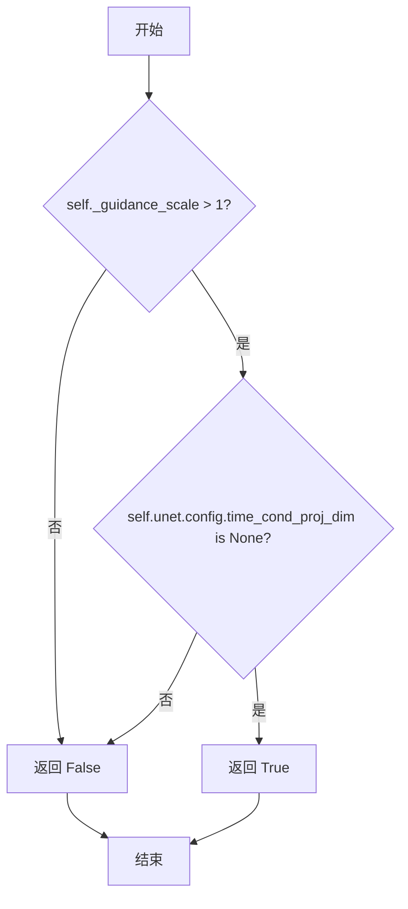

#### 带注释源码

```python
@property
def do_classifier_free_guidance(self):
    """
    属性方法：判断是否启用分类器自由引导（Classifier-Free Guidance）
    
    分类器自由引导是一种提高扩散模型生成质量的技术，通过在推理时同时
    考虑条件（带文本提示）和无条件（不带文本提示）的噪声预测，以更
    好地将生成结果对齐到文本提示。
    
    该属性返回True的条件：
    1. guidance_scale > 1：引导强度大于1才启用CFG
    2. unet.config.time_cond_proj_dim is None：UNet配置中不存在时间条件投影维度
       （如果存在该维度，说明模型使用了不同的条件引导机制）
    
    Returns:
        bool: 是否启用分类器自由引导
    """
    return self._guidance_scale > 1 and self.unet.config.time_cond_proj_dim is None
```


### `StableDiffusionControlNetPAGPipeline.cross_attention_kwargs`

该属性是 StableDiffusionControlNetPAGPipeline 类的一个属性 getter，用于获取在 pipeline 调用过程中传递的交叉注意力机制参数（kwargs）。这些参数会被传递给 AttentionProcessor，用于控制注意力机制的各种行为，例如 LoRA 权重、注意力模式等。

参数： 无

返回值： `dict[str, Any] | None`，存储在实例变量 `_cross_attention_kwargs` 中的交叉注意力 kwargs 字典。如果未设置，则返回 `None`。

#### 流程图

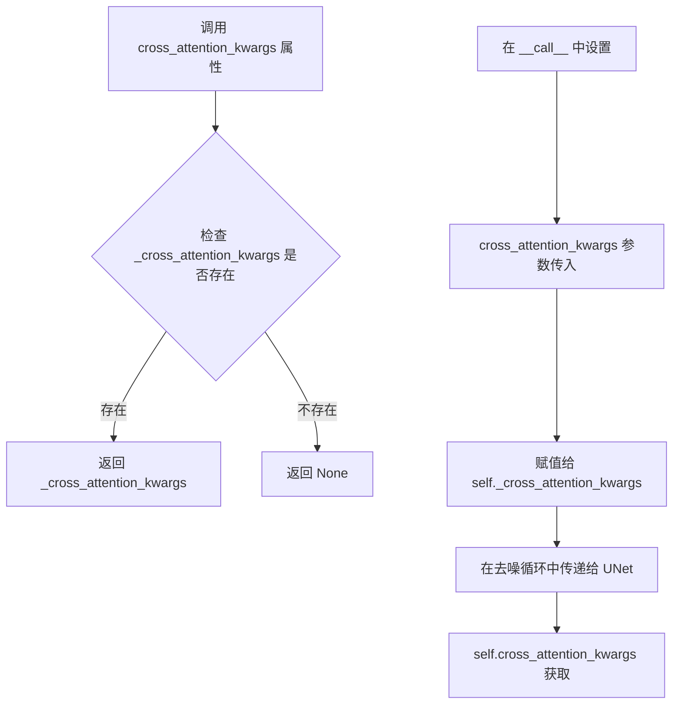

#### 带注释源码

```python
@property
def cross_attention_kwargs(self):
    """
    属性 getter：获取交叉注意力 kwargs。
    
    该属性返回在 pipeline 调用时设置的交叉注意力参数。
    这些参数会被传递给 UNet 模型中的 AttentionProcessor，用于：
    - LoRA 权重调整 (lora_scale)
    - 自定义注意力模式
    - 其它注意力相关的配置
    
    Returns:
        dict[str, Any] | None: 交叉注意力参数字典，如果未设置则返回 None
    """
    return self._cross_attention_kwargs
```

#### 关键信息补充

**属性设置位置**（在 `__call__` 方法中）：

```python
# 在 __call__ 方法中设置
self._cross_attention_kwargs = cross_attention_kwargs

# 后续使用场景1：获取 LoRA 缩放因子
text_encoder_lora_scale = (
    self.cross_attention_kwargs.get("scale", None) 
    if self.cross_attention_kwargs is not None 
    else None
)

# 后续使用场景2：传递给 UNet 进行去噪
noise_pred = self.unet(
    latent_model_input,
    t,
    encoder_hidden_states=prompt_embeds,
    timestep_cond=timestep_cond,
    cross_attention_kwargs=self.cross_attention_kwargs,  # 传递注意力参数
    down_block_additional_residuals=down_block_res_samples,
    mid_block_additional_residual=mid_block_res_sample,
    added_cond_kwargs=added_cond_kwargs,
    return_dict=False,
)[0]
```


### `StableDiffusionControlNetPAGPipeline.num_timesteps`

该属性用于返回扩散过程中使用的时间步数。它是一个只读属性，通过返回内部变量 `_num_timesteps` 来获取在管道调用期间设置的时间步总数。

参数： 无（该方法为属性访问器，仅包含隐式参数 `self`）

返回值：`int`，返回扩散过程中使用的时间步数量。

#### 流程图

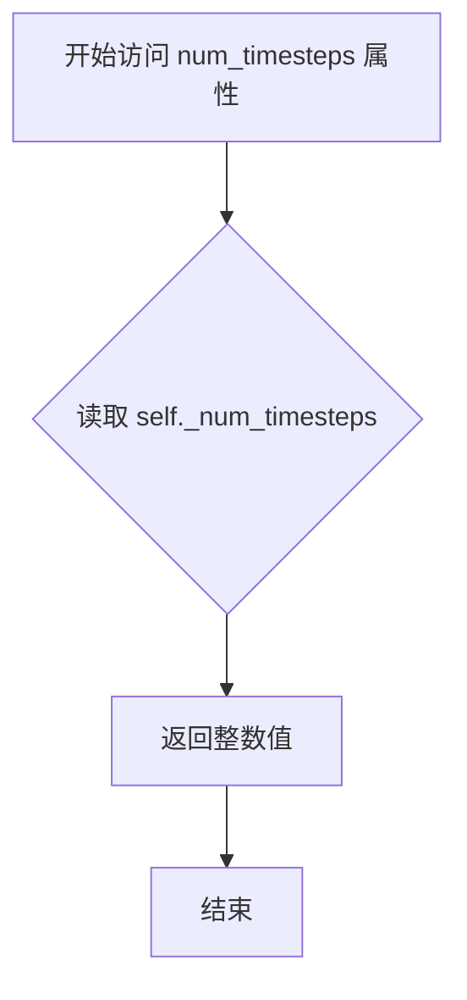

#### 带注释源码

```python
@property
def num_timesteps(self):
    """
    属性访问器：获取扩散过程的时间步总数
    
    该属性返回在 __call__ 方法执行期间设置的时间步数量。
    _num_timesteps 在调用 retrieve_timesteps 函数后被赋值：
    self._num_timesteps = len(timesteps)
    
    Returns:
        int: 扩散过程中使用的时间步总数
    """
    return self._num_timesteps
```


### StableDiffusionControlNetPAGPipeline.__call__

该方法是Stable Diffusion与ControlNet和PAG（Perturbed Attention Guidance）结合的核心推理接口，通过文本提示和ControlNet条件图像引导潜在变量去噪，生成与文本描述和视觉条件相符的图像。

参数：

- `prompt`：`str | list[str] | None`，用于引导图像生成的文本提示，若未定义需传递`prompt_embeds`
- `image`：`PipelineImageInput | None`，ControlNet输入条件图像，用于为UNet提供额外的生成指导，支持torch.Tensor、PIL.Image.Image、np.ndarray或这些类型的列表
- `height`：`int | None`，生成图像的高度（像素），默认为`self.unet.config.sample_size * self.vae_scale_factor`
- `width`：`int | None`，生成图像的宽度（像素），默认为`self.unet.config.sample_size * self.vae_scale_factor`
- `num_inference_steps`：`int`，去噪步数，更多步数通常能生成更高质量的图像但推理速度更慢，默认为50
- `timesteps`：`list[int] | None`，自定义时间步列表，用于支持该特性的调度器，若传递则`num_inference_steps`和`sigmas`必须为None
- `sigmas`：`list[float] | None`，自定义sigma值列表，用于支持该特性的调度器，若传递则`num_inference_steps`和`timesteps`必须为None
- `guidance_scale`：`float`，引导比例值，越高越接近文本提示但可能牺牲图像质量，默认为7.5，当大于1时启用无分类器引导
- `negative_prompt`：`str | list[str] | None`，不希望出现在图像中的提示，若未定义需传递`negative_prompt_embeds`，仅在启用引导时生效
- `num_images_per_prompt`：`int | None`，每个提示生成的图像数量，默认为1
- `eta`：`float`，DDIM调度器的η参数，仅DDIMScheduler生效，默认为0.0
- `generator`：`torch.Generator | list[torch.Generator] | None`，用于使生成具有确定性的随机生成器
- `latents`：`torch.Tensor | None`，预生成的噪声潜在向量，若未提供则使用随机`generator`采样生成
- `prompt_embeds`：`torch.Tensor | None`，预生成的文本嵌入，可用于轻松调整文本输入
- `negative_prompt_embeds`：`torch.Tensor | None`，预生成的负面文本嵌入
- `ip_adapter_image`：`PipelineImageInput | None`，可选的图像输入用于IP适配器
- `ip_adapter_image_embeds`：`list[torch.Tensor] | None`，IP适配器的预生成图像嵌入列表，长度应与IP适配器数量相同
- `output_type`：`str | None`，生成图像的输出格式，可选`PIL.Image`或`np.array`，默认为`"pil"`
- `return_dict`：`bool`，是否返回`StableDiffusionPipelineOutput`而非元组，默认为True
- `cross_attention_kwargs`：`dict[str, Any] | None`，传递给AttentionProcessor的参数字典
- `controlnet_conditioning_scale`：`float | list[float]`，ControlNet输出乘以该系数后添加到UNet残差中，多ControlNet时可使用列表
- `guess_mode`：`bool`，ControlNet编码器尝试识别输入图像内容，即使没有提示，默认为False
- `control_guidance_start`：`float | list[float]`，ControlNet开始应用的总步数百分比，默认为0.0
- `control_guidance_end`：`float | list[float]`，ControlNet停止应用的总步数百分比，默认为1.0
- `clip_skip`：`int | None`，计算提示嵌入时从CLIP跳过的层数
- `callback_on_step_end`：`Callable | PipelineCallback | MultiPipelineCallbacks | None`，每个去噪步骤结束时调用的回调函数
- `callback_on_step_end_tensor_inputs`：`list[str]`，回调函数使用的张量输入列表，默认为`["latents"]`
- `pag_scale`：`float`，扰动注意力引导的缩放因子，设为0.0则不使用PAG，默认为3.0
- `pag_adaptive_scale`：`float`，扰动注意力引导的自适应缩放因子，默认为0.0

返回值：`StableDiffusionPipelineOutput | tuple`，当`return_dict`为True时返回`StableDiffusionPipelineOutput`（包含生成的图像列表和NSFW检测布尔列表），否则返回元组

#### 流程图

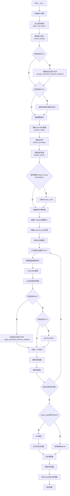

#### 带注释源码

```python
@torch.no_grad()
@replace_example_docstring(EXAMPLE_DOC_STRING)
def __call__(
    self,
    prompt: str | list[str] = None,
    image: PipelineImageInput = None,
    height: int | None = None,
    width: int | None = None,
    num_inference_steps: int = 50,
    timesteps: list[int] = None,
    sigmas: list[float] = None,
    guidance_scale: float = 7.5,
    negative_prompt: str | list[str] | None = None,
    num_images_per_prompt: int | None = 1,
    eta: float = 0.0,
    generator: torch.Generator | list[torch.Generator] | None = None,
    latents: torch.Tensor | None = None,
    prompt_embeds: torch.Tensor | None = None,
    negative_prompt_embeds: torch.Tensor | None = None,
    ip_adapter_image: PipelineImageInput | None = None,
    ip_adapter_image_embeds: list[torch.Tensor] | None = None,
    output_type: str | None = "pil",
    return_dict: bool = True,
    cross_attention_kwargs: dict[str, Any] | None = None,
    controlnet_conditioning_scale: float | list[float] = 1.0,
    guess_mode: bool = False,
    control_guidance_start: float | list[float] = 0.0,
    control_guidance_end: float | list[float] = 1.0,
    clip_skip: int | None = None,
    callback_on_step_end: Callable[[int, int], None] | PipelineCallback | MultiPipelineCallbacks | None = None,
    callback_on_step_end_tensor_inputs: list[str] = ["latents"],
    pag_scale: float = 3.0,
    pag_adaptive_scale: float = 0.0,
):
    # 处理回调函数的张量输入列表
    if isinstance(callback_on_step_end, (PipelineCallback, MultiPipelineCallbacks)):
        callback_on_step_end_tensor_inputs = callback_on_step_end.tensor_inputs

    # 获取原始controlnet（如果已编译）
    controlnet = self.controlnet._orig_mod if is_compiled_module(self.controlnet) else self.controlnet

    # 调整control guidance格式以保持一致
    if not isinstance(control_guidance_start, list) and isinstance(control_guidance_end, list):
        control_guidance_start = len(control_guidance_end) * [control_guidance_start]
    elif not isinstance(control_guidance_end, list) and isinstance(control_guidance_start, list):
        control_guidance_end = len(control_guidance_start) * [control_guidance_end]
    elif not isinstance(control_guidance_start, list) and not isinstance(control_guidance_end, list):
        # 根据ControlNet数量扩展
        mult = len(controlnet.nets) if isinstance(controlnet, MultiControlNetModel) else 1
        control_guidance_start, control_guidance_end = (
            mult * [control_guidance_start],
            mult * [control_guidance_end],
        )

    # 1. 检查输入参数，若不正确则抛出错误
    self.check_inputs(
        prompt,
        image,
        negative_prompt,
        prompt_embeds,
        negative_prompt_embeds,
        ip_adapter_image,
        ip_adapter_image_embeds,
        controlnet_conditioning_scale,
        control_guidance_start,
        control_guidance_end,
        callback_on_step_end_tensor_inputs,
    )

    # 保存引导比例和其他参数供属性使用
    self._guidance_scale = guidance_scale
    self._clip_skip = clip_skip
    self._cross_attention_kwargs = cross_attention_kwargs
    self._pag_scale = pag_scale
    self._pag_adaptive_scale = pag_adaptive_scale

    # 2. 定义调用参数
    if prompt is not None and isinstance(prompt, str):
        batch_size = 1
    elif prompt is not None and isinstance(prompt, list):
        batch_size = len(prompt)
    else:
        batch_size = prompt_embeds.shape[0]

    device = self._execution_device

    # 处理多个ControlNet的conditioning_scale
    if isinstance(controlnet, MultiControlNetModel) and isinstance(controlnet_conditioning_scale, float):
        controlnet_conditioning_scale = [controlnet_conditioning_scale] * len(controlnet.nets)

    # 判断是否使用全局池化条件
    global_pool_conditions = (
        controlnet.config.global_pool_conditions
        if isinstance(controlnet, ControlNetModel)
        else controlnet.nets[0].config.global_pool_conditions
    )
    guess_mode = guess_mode or global_pool_conditions

    # 3. 编码输入提示
    text_encoder_lora_scale = (
        self.cross_attention_kwargs.get("scale", None) if self.cross_attention_kwargs is not None else None
    )
    prompt_embeds, negative_prompt_embeds = self.encode_prompt(
        prompt,
        device,
        num_images_per_prompt,
        self.do_classifier_free_guidance,
        negative_prompt,
        prompt_embeds=prompt_embeds,
        negative_prompt_embeds=negative_prompt_embeds,
        lora_scale=text_encoder_lora_scale,
        clip_skip=self.clip_skip,
    )

    # 对于无分类器引导，需要进行两次前向传播
    # 这里将无条件和文本嵌入连接成单个批次以避免两次前向传播
    if self.do_perturbed_attention_guidance:
        # 准备扰动注意力引导
        prompt_embeds = self._prepare_perturbed_attention_guidance(
            prompt_embeds, negative_prompt_embeds, self.do_classifier_free_guidance
        )
    elif self.do_classifier_free_guidance:
        # 连接负面和正面提示嵌入
        prompt_embeds = torch.cat([negative_prompt_embeds, prompt_embeds])

    # 4. 准备图像
    if isinstance(controlnet, ControlNetModel):
        image = self.prepare_image(
            image=image,
            width=width,
            height=height,
            batch_size=batch_size * num_images_per_prompt,
            num_images_per_prompt=num_images_per_prompt,
            device=device,
            dtype=controlnet.dtype,
            do_classifier_free_guidance=self.do_classifier_free_guidance,
            guess_mode=guess_mode,
        )
        height, width = image.shape[-2:]
    elif isinstance(controlnet, MultiControlNetModel):
        images = []

        # 嵌套列表作为ControlNet条件
        if isinstance(image[0], list):
            # 转置嵌套图像列表
            image = [list(t) for t in zip(*image)]

        for image_ in image:
            image_ = self.prepare_image(
                image=image_,
                width=width,
                height=height,
                batch_size=batch_size * num_images_per_prompt,
                num_images_per_prompt=num_images_per_prompt,
                device=device,
                dtype=controlnet.dtype,
                do_classifier_free_guidance=self.do_classifier_free_guidance,
                guess_mode=guess_mode,
            )

            images.append(image_)

        image = images
        height, width = image[0].shape[-2:]
    else:
        assert False

    # 5. 准备时间步
    if XLA_AVAILABLE:
        timestep_device = "cpu"
    else:
        timestep_device = device
    timesteps, num_inference_steps = retrieve_timesteps(
        self.scheduler, num_inference_steps, timestep_device, timesteps, sigmas
    )
    self._num_timesteps = len(timesteps)

    # 6. 准备潜在变量
    num_channels_latents = self.unet.config.in_channels
    latents = self.prepare_latents(
        batch_size * num_images_per_prompt,
        num_channels_latents,
        height,
        width,
        prompt_embeds.dtype,
        device,
        generator,
        latents,
    )

    # 6.5 可选获取Guidance Scale Embedding
    timestep_cond = None
    if self.unet.config.time_cond_proj_dim is not None:
        guidance_scale_tensor = torch.tensor(self.guidance_scale - 1).repeat(batch_size * num_images_per_prompt)
        timestep_cond = self.get_guidance_scale_embedding(
            guidance_scale_tensor, embedding_dim=self.unet.config.time_cond_proj_dim
        ).to(device=device, dtype=latents.dtype)

    # 7. 准备额外步骤参数
    extra_step_kwargs = self.prepare_extra_step_kwargs(generator, eta)

    # 7.1 为IP-Adapter添加图像嵌入
    if ip_adapter_image is not None or ip_adapter_image_embeds is not None:
        ip_adapter_image_embeds = self.prepare_ip_adapter_image_embeds(
            ip_adapter_image,
            ip_adapter_image_embeds,
            device,
            batch_size * num_images_per_prompt,
            self.do_classifier_free_guidance,
        )
        for i, image_embeds in enumerate(ip_adapter_image_embeds):
            negative_image_embeds = None
            if self.do_classifier_free_guidance:
                negative_image_embeds, image_embeds = image_embeds.chunk(2)

            if self.do_perturbed_attention_guidance:
                image_embeds = self._prepare_perturbed_attention_guidance(
                    image_embeds, negative_image_embeds, self.do_classifier_free_guidance
                )
            elif self.do_classifier_free_guidance:
                image_embeds = torch.cat([negative_image_embeds, image_embeds], dim=0)
            image_embeds = image_embeds.to(device)
            ip_adapter_image_embeds[i] = image_embeds

    added_cond_kwargs = (
        {"image_embeds": ip_adapter_image_embeds}
        if ip_adapter_image is not None or ip_adapter_image_embeds is not None
        else None
    )

    controlnet_prompt_embeds = prompt_embeds

    # 7.2 创建指示保留哪些ControlNet的张量
    controlnet_keep = []
    for i in range(len(timesteps)):
        keeps = [
            1.0 - float(i / len(timesteps) < s or (i + 1) / len(timesteps) > e)
            for s, e in zip(control_guidance_start, control_guidance_end)
        ]
        controlnet_keep.append(keeps[0] if isinstance(controlnet, ControlNetModel) else keeps)

    # 准备图像列表
    images = image if isinstance(image, list) else [image]
    for i, single_image in enumerate(images):
        if self.do_classifier_free_guidance:
            single_image = single_image.chunk(2)[0]

        if self.do_perturbed_attention_guidance:
            single_image = self._prepare_perturbed_attention_guidance(
                single_image, single_image, self.do_classifier_free_guidance
            )
        elif self.do_classifier_free_guidance:
            single_image = torch.cat([single_image] * 2)
        single_image = single_image.to(device)
        images[i] = single_image

    image = images if isinstance(image, list) else images[0]

    # 8. 去噪循环
    if self.do_perturbed_attention_guidance:
        # 保存原始注意力处理器
        original_attn_proc = self.unet.attn_processors
        # 设置PAG注意力处理器
        self._set_pag_attn_processor(
            pag_applied_layers=self.pag_applied_layers,
            do_classifier_free_guidance=self.do_classifier_free_guidance,
        )
    
    num_warmup_steps = len(timesteps) - num_inference_steps * self.scheduler.order
    is_unet_compiled = is_compiled_module(self.unet)
    is_controlnet_compiled = is_compiled_module(self.controlnet)
    is_torch_higher_equal_2_1 = is_torch_version(">=", "2.1")
    
    with self.progress_bar(total=num_inference_steps) as progress_bar:
        for i, t in enumerate(timesteps):
            # 在CUDA图模式下开始步骤
            if (
                torch.cuda.is_available()
                and (is_unet_compiled and is_controlnet_compiled)
                and is_torch_higher_equal_2_1
            ):
                torch._inductor.cudagraph_mark_step_begin()
            
            # 如果进行无分类器引导，则扩增潜在变量
            latent_model_input = torch.cat([latents] * (prompt_embeds.shape[0] // latents.shape[0]))
            latent_model_input = self.scheduler.scale_model_input(latent_model_input, t)

            # ControlNet推理
            control_model_input = latent_model_input

            if isinstance(controlnet_keep[i], list):
                cond_scale = [c * s for c, s in zip(controlnet_conditioning_scale, controlnet_keep[i])]
            else:
                controlnet_cond_scale = controlnet_conditioning_scale
                if isinstance(controlnet_cond_scale, list):
                    controlnet_cond_scale = controlnet_cond_scale[0]
                cond_scale = controlnet_cond_scale * controlnet_keep[i]

            down_block_res_samples, mid_block_res_sample = self.controlnet(
                control_model_input,
                t,
                encoder_hidden_states=controlnet_prompt_embeds,
                controlnet_cond=image,
                conditioning_scale=cond_scale,
                guess_mode=guess_mode,
                return_dict=False,
            )

            # 在guess_mode和CFG下，仅对条件批次推断ControlNet
            if guess_mode and self.do_classifier_free_guidance:
                # 将0连接到无条件批次以保持不变
                down_block_res_samples = [torch.cat([torch.zeros_like(d), d]) for d in down_block_res_samples]
                mid_block_res_sample = torch.cat([torch.zeros_like(mid_block_res_sample), mid_block_res_sample])

            # 预测噪声残差
            noise_pred = self.unet(
                latent_model_input,
                t,
                encoder_hidden_states=prompt_embeds,
                timestep_cond=timestep_cond,
                cross_attention_kwargs=self.cross_attention_kwargs,
                down_block_additional_residuals=down_block_res_samples,
                mid_block_additional_residual=mid_block_res_sample,
                added_cond_kwargs=added_cond_kwargs,
                return_dict=False,
            )[0]

            # 执行引导
            if self.do_perturbed_attention_guidance:
                noise_pred = self._apply_perturbed_attention_guidance(
                    noise_pred, self.do_classifier_free_guidance, self.guidance_scale, t
                )
            elif self.do_classifier_free_guidance:
                noise_pred_uncond, noise_pred_text = noise_pred.chunk(2)
                noise_pred = noise_pred_uncond + self.guidance_scale * (noise_pred_text - noise_pred_uncond)

            # 计算上一步的噪声样本 x_t -> x_t-1
            latents = self.scheduler.step(noise_pred, t, latents, **extra_step_kwargs, return_dict=False)[0]

            # 调用步骤结束时的回调
            if callback_on_step_end is not None:
                callback_kwargs = {}
                for k in callback_on_step_end_tensor_inputs:
                    callback_kwargs[k] = locals()[k]
                callback_outputs = callback_on_step_end(self, i, t, callback_kwargs)

                latents = callback_outputs.pop("latents", latents)
                prompt_embeds = callback_outputs.pop("prompt_embeds", prompt_embeds)
                negative_prompt_embeds = callback_outputs.pop("negative_prompt_embeds", negative_prompt_embeds)

            # 进度更新回调
            if i == len(timesteps) - 1 or ((i + 1) > num_warmup_steps and (i + 1) % self.scheduler.order == 0):
                progress_bar.update()

            if XLA_AVAILABLE:
                xm.mark_step()

    # 如果使用顺序模型卸载，手动卸载UNet和ControlNet以节省内存
    if hasattr(self, "final_offload_hook") and self.final_offload_hook is not None:
        self.unet.to("cpu")
        self.controlnet.to("cpu")
        empty_device_cache()

    # VAE解码
    if not output_type == "latent":
        image = self.vae.decode(latents / self.vae.config.scaling_factor, return_dict=False, generator=generator)[
            0
        ]
        image, has_nsfw_concept = self.run_safety_checker(image, device, prompt_embeds.dtype)
    else:
        image = latents
        has_nsfw_concept = None

    # 处理反规范化
    if has_nsfw_concept is None:
        do_denormalize = [True] * image.shape[0]
    else:
        do_denormalize = [not has_nsfw for has_nsfw in has_nsfw_concept]

    # 后处理图像
    image = self.image_processor.postprocess(image, output_type=output_type, do_denormalize=do_denormalize)

    # 卸载所有模型
    self.maybe_free_model_hooks()

    # 恢复原始注意力处理器
    if self.do_perturbed_attention_guidance:
        self.unet.set_attn_processor(original_attn_proc)

    if not return_dict:
        return (image, has_nsfw_concept)

    return StableDiffusionPipelineOutput(images=image, nsfw_content_detected=has_nsfw_concept)
```

## 关键组件


### 张量索引与惰性加载

在`prepare_latents`方法中，通过`randn_tensor`函数生成随机潜在变量，并使用索引操作`latents.shape[0]`来计算批次大小。惰性加载通过`@torch.no_grad()`装饰器在`__call__`方法上实现，避免不必要的梯度计算，提高内存效率。

### 反量化支持

代码通过`vae_scale_factor`计算和`vae.config.scaling_factor`进行潜在变量的缩放与反缩放。在解码阶段，`latents / self.vae.config.scaling_factor`实现反量化操作，将潜在空间的值转换回像素空间进行解码。

### 量化策略

支持LoRA权重的量化，通过`adjust_lora_scale_text_encoder`、`scale_lora_layers`和`unscale_lora_layers`函数管理LoRA缩放因子。`USE_PEFT_BACKEND`标志用于区分PEFT后端和传统LoRA实现，支持`torch_dtype`参数进行dtype转换。

### PAG (Perturbed Attention Guidance)

通过`PAGMixin`混入类实现，提供扰动注意力引导功能。关键属性包括`pag_scale`和`pag_applied_layers`，控制扰动强度和应用层。`_prepare_perturbed_attention_guidance`方法准备引导所需的嵌入，`_apply_perturbed_attention_guidance`方法在推理时应用扰动。

### ControlNet控制

支持单和多ControlNet模型(`ControlNetModel`和`MultiControlNetModel`)。`prepare_image`方法预处理ControlNet输入图像，`controlnet_conditioning_scale`参数控制条件强度，`control_guidance_start`和`control_guidance_end`实现时间步级别的控制范围。

### IP-Adapter适配器

通过`IPAdapterMixin`提供IP-Adapter支持，`prepare_ip_adapter_image_embeds`方法处理图像嵌入的准备工作，支持条件和无条件图像嵌入的批量处理。

### 图像安全检查

`run_safety_checker`方法使用`StableDiffusionSafetyChecker`对生成的图像进行NSFW内容检测，确保输出内容的安全性。

### 潜在变量管理

`prepare_latents`方法负责初始化和准备潜在变量，支持通过`generator`参数进行确定性生成，支持预提供的`latents`输入进行潜变量重用。


## 问题及建议


### 已知问题

-   **代码重复**：大量方法（如 `encode_prompt`、`encode_image`、`prepare_ip_adapter_image_embeds`、`run_safety_checker`、`check_inputs`、`check_image`、`prepare_image`、`prepare_latents` 等）从其他 Pipeline 复制而来，导致维护成本高，任何底层修改都需要在多处同步更新。
-   **不规范的错误处理**：在 `check_inputs` 方法末尾使用 `assert False` 而非抛出明确的异常，这会导致调试困难且不符合最佳实践。
-   **魔法数字**：多处硬编码值如 `pag_scale` 默认值 `3.0`、`embedding_dim` 默认值 `512`、`vae_scale_factor` 默认 `8` 等，缺乏常量定义。
-   **回调机制实现问题**：`callback_on_step_end` 中使用 `locals()` 获取变量，依赖当前局部作用域，脆弱且不易于调试和维护。
-   **图像格式转换开销**：在 `__call__` 中 `image` 在 list 和 tensor 之间多次转换，且在不同格式（PIL、numpy、torch）间反复切换，可能带来不必要的性能开销。
-   **条件分支复杂**：`__call__` 方法中存在大量嵌套的 `isinstance` 检查来处理不同的 ControlNet 类型（单/多）和引导模式，代码可读性和可维护性较差。
-   **LoRA 逻辑重复**：LoRA 缩放处理在 `encode_prompt` 中有两处相似的逻辑分支（PEFT vs 非 PEFT backend），存在重复代码。
- **内存占用隐患**：ControlNet 的中间结果 `down_block_res_samples` 和 `mid_block_res_sample` 以列表形式保存多组 tensor，在高分辨率或多次推理时可能导致内存峰值较高。

### 优化建议

-   **提取公共基类或 Mixin**：将复制的方法统一到基类或 Mixin 中，通过继承复用逻辑，减少代码冗余。
-   **重构错误处理**：将 `assert False` 替换为 `raise ValueError` 或 `TypeError`，并提供有意义的错误信息。
-   **定义常量类**：将魔法数字提取到配置常量或配置文件中，例如创建 `PAG_CONFIG` 字典管理默认参数。
-   **改进回调机制**：明确传递所需变量到回调函数，而非依赖 `locals()` 动态获取。
-   **优化图像处理流程**：在 Pipeline 初始化时确定输入图像格式，减少运行时的格式判断和转换分支。
-   **简化 ControlNet 处理逻辑**：使用策略模式或工厂方法封装单/多 ControlNet 的处理差异，减少 `__call__` 中的条件分支。
-   **合并 LoRA 缩放逻辑**：重构 `encode_prompt` 中的 LoRA 处理代码，统一 PEFT 和非 PEFT backend 的逻辑路径。
-   **考虑流式处理或分块计算**：对于 ControlNet 输出的大列表，考虑使用生成器或分块处理以降低内存峰值。

## 其它


### 设计目标与约束

本管道的设计目标是为Stable Diffusion模型提供基于ControlNet的条件图像生成能力，同时集成PAG（Perturbed Attention Guidance）技术以提升生成质量。核心约束包括：1）必须兼容HuggingFace Diffusers框架的DiffusionPipeline标准接口；2）支持多种输入格式（PIL Image、numpy数组、torch张量及其列表）；3）支持classifier-free guidance和IP-Adapter；4）内存效率优化，支持xformers和CPU offload；5）支持单文件加载和LoRA权重管理。

### 错误处理与异常设计

管道采用分层错误处理策略：1）输入验证阶段（check_inputs、check_image）使用显式ValueError和TypeError，清晰指出错误原因；2）调度器兼容性检查在retrieve_timesteps中进行，验证set_timesteps方法是否支持自定义timesteps或sigmas；3）LoRA与PEFT后端兼容性在encode_prompt中动态检测；4）安全检查器缺失时发出警告但不阻断执行；5）NSFW内容检测结果允许为None，区分"未检测"和"检测通过"两种状态。

### 数据流与状态机

管道执行遵循固定的状态转换流程：1）初始化态：加载模型组件（VAE、TextEncoder、UNet、ControlNet、Scheduler）；2）输入准备态：编码prompt、处理control图像、准备latents；3）去噪循环态：遍历timesteps执行UNet推理和调度器步骤；4）后处理态：VAE解码、安全检查、图像后处理；5）输出态：返回StableDiffusionPipelineOutput或元组。状态转换由调度器的timesteps驱动，每个step内完成latent_model_input缩放、ControlNet推理、UNet预测、噪声预测应用、调度器步进等子步骤。

### 外部依赖与接口契约

管道依赖以下核心外部组件：1）Transformers库：CLIPTextModel、CLIPTokenizer、CLIPImageProcessor、CLIPVisionModelWithProjection；2）Diffusers内部模块：AutoencoderKL、ControlNetModel、UNet2DConditionModel、KarrasDiffusionSchedulers；3）图像处理库：PIL、OpenCV（示例中使用）、NumPy；4）PyTorch及torch_xla（条件导入）。接口契约包括：所有模型组件必须实现from_pretrained方法；调度器必须实现set_timesteps和step方法；图像处理器遵循VaeImageProcessor接口规范；回调系统遵循PipelineCallback协议。

### 版本兼容性考虑

代码对PyTorch版本和设备有明确兼容性检查：1）使用is_torch_version检测>=2.1版本以启用CUDA graphs优化；2）条件导入torch_xla以支持TPU；3）is_compiled_module检测torch.compile编译的模型；4）dtype处理确保不同模型组件（text_encoder、unet、vae）间_dtype一致；5）XLA_AVAILABLE标志控制TPU特定代码路径。

### 资源管理与内存优化

管道实现多层次内存优化策略：1）模型CPU offload序列定义（model_cpu_offload_seq）支持自动设备迁移；2）final_offload_hook在推理结束后手动卸载UNet和ControlNet；3）maybe_free_model_hooks释放所有模型钩子；4）randn_tensor支持传入generator实现可复现采样；5）支持xformers_memory_efficient_attention；6）vae_scale_factor计算遵循标准SD架构（2^(block_out_channels-1)）。

### 安全与合规性

安全机制包含：1）SafetyChecker可选但默认启用；2）requires_safety_checker配置控制强制要求；3）feature_extractor与safety_checker必须成对出现；4）NSFW检测结果通过nsfw_content_detected标志返回；5）示例代码包含许可证和法律合规提示。

### 配置与可扩展性

管道采用注册模块模式（register_modules）支持运行时组件替换：1）可选组件列表（_optional_components）允许safety_checker和feature_extractor为空；2）_exclude_from_cpu_offload将safety_checker排除在offload序列外；3）_callback_tensor_inputs定义允许回调访问的张量；4）PAGMixin提供扰动注意力引导的可配置层（pag_applied_layers）；5）支持自定义cross_attention_kwargs传递给注意力处理器。


    