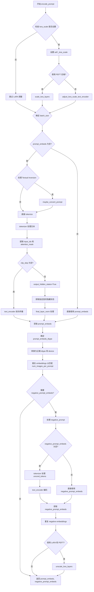
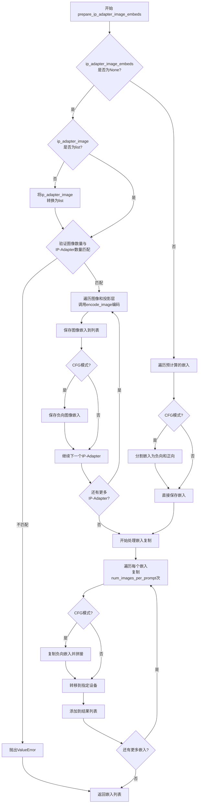
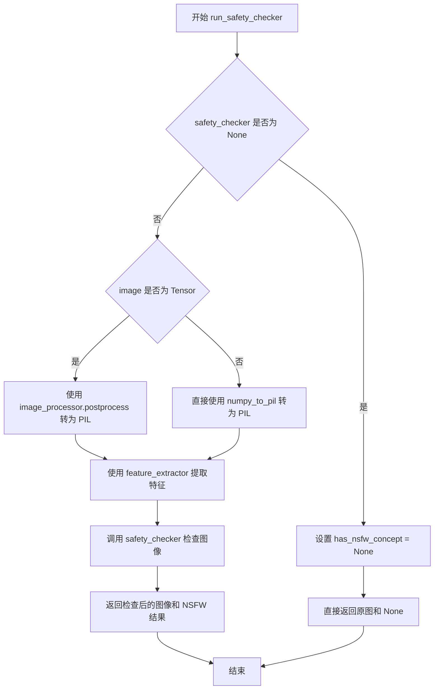
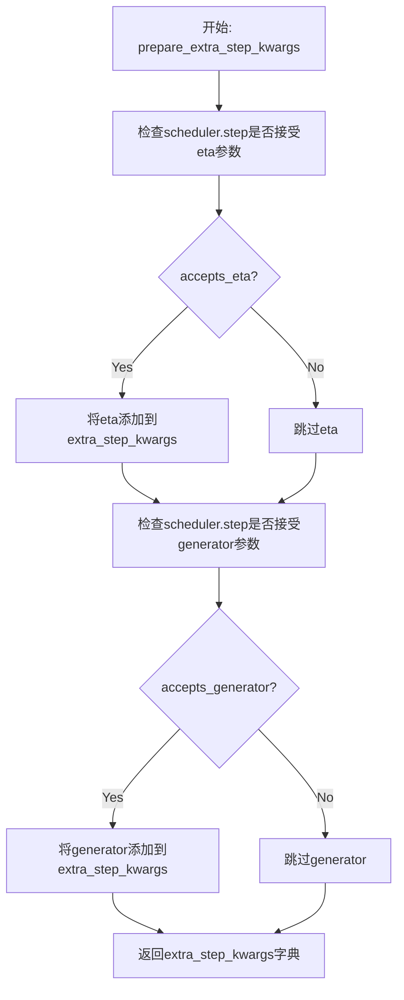
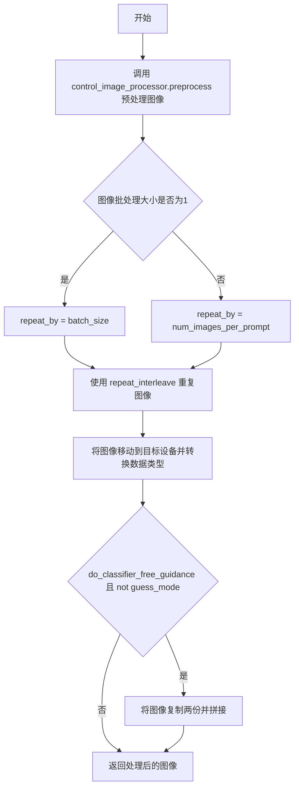
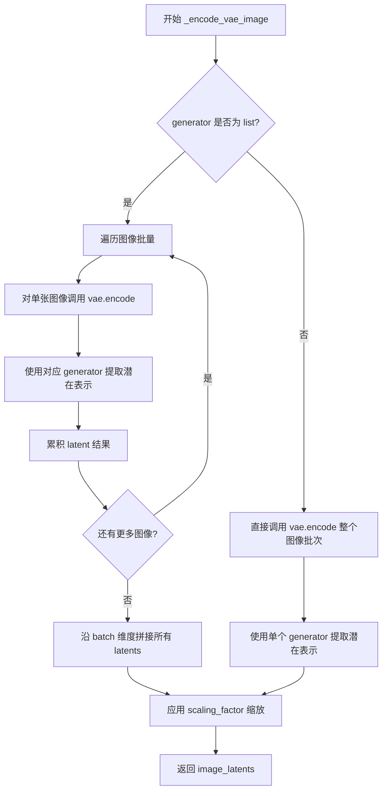

```mermaid
flowchart TD
    A[开始 __call__] --> B[检查并标准化控制引导参数]
    B --> C{检查输入参数有效性}
    C -->|失败| D[抛出错误]
    C -->|成功| E[设置内部状态变量]
    E --> F[定义批处理大小]
    F --> G{是否有padding_mask_crop?}
    G -->|是| H[计算裁剪坐标和调整模式]
    G -->|否| I[设置裁剪坐标为None]
    H --> J[获取执行设备]
    I --> J
    J --> K[编码输入提示]
    K --> L{是否使用PAG引导?}
    L -->|是| M[准备PAG引导的提示嵌入]
    L -->|否| N{是否使用CFG引导?}
    M --> N
    N -->|是| O[连接无条件和文本嵌入]
    N -->|否| P[保持提示嵌入不变]
    O --> Q[准备IP Adapter图像嵌入]
    P --> Q
    Q --> R{ControlNet类型?}
    R -->|单ControlNet| S[准备单个控制图像]
    R -->|多ControlNet| T[准备多个控制图像]
    S --> U[预处理图像和掩码]
    T --> U
    U --> V[设置调度器时间步]
    V --> W[获取时间步和推理步数]
    W --> X[准备潜在变量]
    X --> Y[准备掩码潜在变量]
    Y --> Z{检查UNet通道配置}
    Z -->|9通道| AA[验证掩码配置]
    Z -->|4通道| AB[继续]
    AA --> AC[准备额外步骤参数]
    AB --> AC
    AC --> AD[准备IP嵌入和条件]
    AD --> AE[创建控制网络保持张量]
    AE --> AF{是否需要Guidance Scale嵌入?}
    AF -->|是| AG[生成Guidance Scale嵌入]
    AF -->|否| AH[跳过嵌入生成]
    AG --> AI[开始去噪循环]
    AH --> AI
    AI --> AJ[设置PAG注意力处理器]
    AJ --> AK[迭代每个时间步]
    AK --> AL{还有更多时间步?}
    AL -->|是| AM[扩展潜在向量]
    AM --> AN[缩放模型输入]
    AN --> AO[执行ControlNet推理]
    AO --> AP[连接潜在向量、掩码和掩码潜在]
    AP --> AQ[UNet预测噪声残差]
    AQ --> AR{使用PAG引导?}
    AR -->|是| AS[应用PAG引导]
    AR -->|否| AT{使用CFG引导?}
    AS --> AU[计算上一步]
    AT -->|是| AV[执行CFG引导]
    AT -->|否| AW[跳过引导]
    AV --> AU
    AW --> AU
    AU --> AX[处理4通道情况的潜在混合]
    AX --> AY[执行回调函数]
    AY --> AZ{是否是最后一步或检查点?}
    AZ -->|是| BA[更新进度条]
    AZ -->|否| BB[继续下一迭代]
    BA --> BC{XLA可用?}
    BB --> AK
    BC -->|是| BD[标记XLA步骤]
    BC -->|否| BE[检查是否需要手动释放模型]
    BD --> BE
    BE --> BF{输出类型是latent?}
    BF -->|否| BG[VAE解码潜在向量]
    BF -->|是| BH[使用潜在向量作为图像]
    BG --> BI[运行安全检查器]
    BH --> BI
    BI --> BJ[后处理图像]
    BK{padding_mask_crop不为None?}
    BJ --> BK
    BK -->|是| BL[应用叠加覆盖]
    BK -->|否| BM[释放模型钩子]
    BL --> BM
    BM --> BN{使用PAG引导?}
    BN -->|是| BO[恢复原始注意力处理器]
    BN -->|否| BP{return_dict为True?}
    BO --> BP
    BP -->|是| BQ[返回StableDiffusionPipelineOutput]
    BP -->|否| BR[返回元组]
    BQ --> BS[结束]
    BR --> BS
```

# `diffusers\src\diffusers\pipelines\pag\pipeline_pag_controlnet_sd_inpaint.py` 详细设计文档

This code implements a complex image inpainting pipeline that combines Stable Diffusion with ControlNet for structural guidance and Perturbed Attention Guidance (PAG) to refine the generation process based on text prompts, mask images, and optional control images.

## 整体流程

```mermaid
graph TD
    A[Start: __call__] --> B[check_inputs]
    B --> C[encode_prompt]
    C --> D[prepare_ip_adapter_image_embeds]
    D --> E[prepare_control_image]
    E --> F[Preprocess: Image & Mask]
    F --> G[get_timesteps]
    G --> H[prepare_latents]
    H --> I[prepare_mask_latents]
    I --> J{Loop: for t in timesteps}
    J --> K[Scale Model Input]
    K --> L[ControlNet Inference]
    L --> M{Is Inpainting (9 channels)?}
    M -- Yes --> N[Concat: Latents + Mask + MaskedImage]
    M -- No --> O[UNet Inference]
    N --> O
    O --> P{Apply Guidance (PAG/CFG)}
    P --> Q[Scheduler Step]
    Q --> R[callback_on_step_end]
    R --> S{More Steps?}
    S -- Yes --> J
    S -- No --> T[VAE Decode]
    T --> U[run_safety_checker]
    U --> V[Post-process Image]
    V --> Z[End: Return Output]
```

## 类结构

```
StableDiffusionControlNetPAGInpaintPipeline
├── DiffusionPipeline (Base Class)
├── StableDiffusionMixin
├── TextualInversionLoaderMixin
├── StableDiffusionLoraLoaderMixin
├── IPAdapterMixin
├── FromSingleFileMixin
└── PAGMixin
```

## 全局变量及字段


### `logger`
    
Logger instance for tracking runtime information and warnings

类型：`logging.Logger`
    


### `XLA_AVAILABLE`
    
Flag indicating whether PyTorch XLA is available for TPU acceleration

类型：`bool`
    


### `EXAMPLE_DOC_STRING`
    
Documentation string containing example usage code for the pipeline

类型：`str`
    


### `StableDiffusionControlNetPAGInpaintPipeline.vae`
    
Variational Auto-Encoder for latent space encoding/decoding

类型：`AutoencoderKL`
    


### `StableDiffusionControlNetPAGInpaintPipeline.text_encoder`
    
Frozen CLIP text encoder for converting prompts to embeddings

类型：`CLIPTextModel`
    


### `StableDiffusionControlNetPAGInpaintPipeline.tokenizer`
    
Tokenizer for text input processing

类型：`CLIPTokenizer`
    


### `StableDiffusionControlNetPAGInpaintPipeline.unet`
    
UNet model for noise prediction in diffusion process

类型：`UNet2DConditionModel`
    


### `StableDiffusionControlNetPAGInpaintPipeline.controlnet`
    
Model providing conditional guidance from control images

类型：`ControlNetModel | MultiControlNetModel`
    


### `StableDiffusionControlNetPAGInpaintPipeline.scheduler`
    
Noise scheduler for controlling diffusion process

类型：`KarrasDiffusionSchedulers`
    


### `StableDiffusionControlNetPAGInpaintPipeline.safety_checker`
    
NSFW content checker for generated images

类型：`StableDiffusionSafetyChecker`
    


### `StableDiffusionControlNetPAGInpaintPipeline.feature_extractor`
    
Feature extractor for safety checker

类型：`CLIPImageProcessor`
    


### `StableDiffusionControlNetPAGInpaintPipeline.image_encoder`
    
Encoder for IP-Adapter image embeddings

类型：`CLIPVisionModelWithProjection`
    


### `StableDiffusionControlNetPAGInpaintPipeline.vae_scale_factor`
    
Scaling factor derived from VAE configuration

类型：`int`
    


### `StableDiffusionControlNetPAGInpaintPipeline.image_processor`
    
Processor for input image preprocessing

类型：`VaeImageProcessor`
    


### `StableDiffusionControlNetPAGInpaintPipeline.mask_processor`
    
Processor for mask image preprocessing

类型：`VaeImageProcessor`
    


### `StableDiffusionControlNetPAGInpaintPipeline.control_image_processor`
    
Processor for control image preprocessing

类型：`VaeImageProcessor`
    
    

## 全局函数及方法


### `retrieve_latents`

该函数是一个全局工具函数，用于从 VAE（变分自编码器）的编码器输出中提取潜在向量（latents）。它支持两种采样模式：从潜在分布中采样（sample）或取分布的众数（argmax），也可以直接返回预计算的潜在向量。

参数：

- `encoder_output`：`torch.Tensor`，VAE 编码器的输出对象，通常包含 `latent_dist` 属性（表示潜在分布）或 `latents` 属性（表示已计算的潜在向量）
- `generator`：`torch.Generator | None`，可选的随机数生成器，用于确保采样过程的可重复性
- `sample_mode`：`str`，采样模式，默认为 "sample"（从分布中采样），也可设置为 "argmax"（取分布的众数）

返回值：`torch.Tensor`，提取出的潜在向量张量

#### 流程图

```mermaid
flowchart TD
    A[开始: retrieve_latents] --> B{encoder_output 是否有 latent_dist 属性?}
    B -- 是 --> C{sample_mode == 'sample'?}
    B -- 否 --> D{encoder_output 是否有 latents 属性?}
    C -- 是 --> E[返回 encoder_output.latent_dist.sample<br/>(使用 generator)]
    C -- 否 --> F{sample_mode == 'argmax'?}
    D -- 是 --> G[返回 encoder_output.latents]
    D -- 否 --> H[抛出 AttributeError]
    F -- 是 --> I[返回 encoder_output.latent_dist.mode<br/>(不使用 generator)]
    F -- 否 --> H
    E --> J[结束]
    G --> J
    I --> J
    H --> J
```

#### 带注释源码

```
# 从 VAE 编码器输出中提取潜在向量的全局函数
# Copied from diffusers.pipelines.stable_diffusion.pipeline_stable_diffusion_img2img.retrieve_latents
def retrieve_latents(
    encoder_output: torch.Tensor,  # VAE 编码器的输出对象
    generator: torch.Generator | None = None,  # 可选的随机数生成器
    sample_mode: str = "sample"  # 采样模式: "sample" 或 "argmax"
):
    # 情况1: 如果 encoder_output 有 latent_dist 属性且模式为 "sample"
    # 从潜在分布中采样得到潜在向量
    if hasattr(encoder_output, "latent_dist") and sample_mode == "sample":
        return encoder_output.latent_dist.sample(generator)
    
    # 情况2: 如果 encoder_output 有 latent_dist 属性且模式为 "argmax"
    # 取潜在分布的众数（最可能的值）作为潜在向量
    elif hasattr(encoder_output, "latent_dist") and sample_mode == "argmax":
        return encoder_output.latent_dist.mode()
    
    # 情况3: 如果 encoder_output 直接包含 latents 属性
    # 直接返回预计算的潜在向量
    elif hasattr(encoder_output, "latents"):
        return encoder_output.latents
    
    # 错误情况: 无法从 encoder_output 中提取潜在向量
    else:
        raise AttributeError("Could not access latents of provided encoder_output")
```


### StableDiffusionControlNetPAGInpaintPipeline.__init__

该方法是 `StableDiffusionControlNetPAGInpaintPipeline` 类的构造函数，负责初始化一个结合了 Stable Diffusion、ControlNet 和 PAG（Perturbed Attention Guidance）的图像修复（inpainting）管道。该方法接收多个深度学习模型组件，进行安全检查，配置图像处理器，并设置 PAG 应用的层。

参数：

- `vae`：`AutoencoderKL`，用于将图像编码和解码到潜在表示的变分自编码器模型。
- `text_encoder`：`CLIPTextModel`，冻结的文本编码器（clip-vit-large-patch14），用于将文本提示转换为嵌入向量。
- `tokenizer`：`CLIPTokenizer`，用于对文本进行分词的 CLIP 分词器。
- `unet`：`UNet2DConditionModel`，用于对编码后的图像潜在表示进行去噪的条件 UNet 模型。
- `controlnet`：`ControlNetModel | list[ControlNetModel] | tuple[ControlNetModel] | MultiControlNetModel`，提供额外条件引导的 ControlNet 模型，可以是单个或多个 ControlNet。
- `scheduler`：`KarrasDiffusionSchedulers`，与 `unet` 结合使用以对编码图像潜在表示进行去噪的调度器。
- `safety_checker`：`StableDiffusionSafetyChecker`，分类模块，用于评估生成的图像是否可能被认为是冒犯性或有害的。
- `feature_extractor`：`CLIPImageProcessor`，用于从生成的图像中提取特征的图像处理器，作为 safety_checker 的输入。
- `image_encoder`：`CLIPVisionModelWithProjection`，可选的视觉编码器，用于 IP Adapter 功能。
- `requires_safety_checker`：`bool`，默认为 `True`，是否需要安全检查器。
- `pag_applied_layers`：`str | list[str]`，默认为 `"mid"`，指定应用 PAG（Perturbed Attention Guidance）的层。

返回值：无（`None`），构造函数用于初始化对象状态，不返回任何内容。

#### 流程图

```mermaid
flowchart TD
    A[开始 __init__] --> B[调用父类构造函数 super().__init__]
    B --> C{safety_checker is None<br>且 requires_safety_checker is True?}
    C -->|是| D[记录警告日志<br>建议启用安全检查器]
    C -->|否| E{safety_checker is not None<br>且 feature_extractor is None?}
    D --> E
    E -->|是| F[抛出 ValueError<br>需要定义 feature_extractor]
    E -->|否| G{controlnet 是 list 或 tuple?}
    F --> H[结束]
    G -->|是| I[将 controlnet 包装为 MultiControlNetModel]
    G -->|否| J[注册所有模块到 Pipeline]
    I --> J
    J --> K[计算 vae_scale_factor]
    K --> L[初始化 VaeImageProcessor<br>用于主图像处理]
    L --> M[初始化 VaeImageProcessor<br>用于掩码处理<br>do_normalize=False<br>do_binarize=True<br>do_convert_grayscale=True]
    M --> N[初始化 VaeImageProcessor<br>用于控制图像处理<br>do_convert_rgb=True<br>do_normalize=False]
    N --> O[注册 requires_safety_checker 到配置]
    O --> P[调用 set_pag_applied_layers<br>设置 PAG 应用层]
    P --> H
```

#### 带注释源码

```python
def __init__(
    self,
    vae: AutoencoderKL,
    text_encoder: CLIPTextModel,
    tokenizer: CLIPTokenizer,
    unet: UNet2DConditionModel,
    controlnet: ControlNetModel | list[ControlNetModel] | tuple[ControlNetModel] | MultiControlNetModel,
    scheduler: KarrasDiffusionSchedulers,
    safety_checker: StableDiffusionSafetyChecker,
    feature_extractor: CLIPImageProcessor,
    image_encoder: CLIPVisionModelWithProjection = None,
    requires_safety_checker: bool = True,
    pag_applied_layers: str | list[str] = "mid",
):
    # 1. 调用父类 DiffusionPipeline 的构造函数进行基础初始化
    super().__init__()

    # 2. 安全检查器验证逻辑
    # 如果用户传入 safety_checker=None 但 requires_safety_checker 为 True，则发出警告
    if safety_checker is None and requires_safety_checker:
        logger.warning(
            f"You have disabled the safety checker for {self.__class__} by passing `safety_checker=None`. Ensure"
            " that you abide to the conditions of the Stable Diffusion license and do not expose unfiltered"
            " results in services or applications open to the public. Both the diffusers team and Hugging Face"
            " strongly recommend to keep the safety filter enabled in all public facing circumstances, disabling"
            " it only for use-cases that involve analyzing network behavior or auditing its results. For more"
            " information, please have a look at https://github.com/huggingface/diffusers/pull/254 ."
        )

    # 3. 验证 feature_extractor 的必要性
    # 如果提供了 safety_checker 但没有提供 feature_extractor，则抛出错误
    if safety_checker is not None and feature_extractor is None:
        raise ValueError(
            "Make sure to define a feature extractor when loading {self.__class__} if you want to use the safety"
            " checker. If you do not want to use the safety checker, you can pass `'safety_checker=None'` instead."
        )

    # 4. 处理 ControlNet 模型
    # 如果传入的是 list 或 tuple，将其包装为 MultiControlNetModel 以支持多个 ControlNet
    if isinstance(controlnet, (list, tuple)):
        controlnet = MultiControlNetModel(controlnet)

    # 5. 注册所有模块
    # 这是 DiffusionPipeline 的标准做法，将所有核心组件注册到 pipeline 中
    # 以便进行保存、加载和设备管理
    self.register_modules(
        vae=vae,
        text_encoder=text_encoder,
        tokenizer=tokenizer,
        unet=unet,
        controlnet=controlnet,
        scheduler=scheduler,
        safety_checker=safety_checker,
        feature_extractor=feature_extractor,
        image_encoder=image_encoder,
    )

    # 6. 计算 VAE 缩放因子
    # VAE scale factor 用于在潜空间和像素空间之间进行转换时缩放图像
    # 计算公式: 2^(len(vae.config.block_out_channels) - 1)
    # 通常对于 SD1.5 是 8，对于 SD2.x 是 16 或 32
    self.vae_scale_factor = 2 ** (len(self.vae.config.block_out_channels) - 1) if getattr(self, "vae", None) else 8

    # 7. 初始化图像处理器
    # 主图像处理器：用于处理输入图像和输出图像
    self.image_processor = VaeImageProcessor(vae_scale_factor=self.vae_scale_factor)
    
    # 掩码处理器：专门用于处理 inpainting 掩码
    # do_normalize=False: 不归一化
    # do_binarize=True: 二值化掩码
    # do_convert_grayscale=True: 转换为灰度图
    self.mask_processor = VaeImageProcessor(
        vae_scale_factor=self.vae_scale_factor, do_normalize=False, do_binarize=True, do_convert_grayscale=True
    )
    
    # 控制图像处理器：专门用于处理 ControlNet 的输入图像
    # do_convert_rgb=True: 转换为 RGB 格式
    # do_normalize=False: 不归一化
    self.control_image_processor = VaeImageProcessor(
        vae_scale_factor=self.vae_scale_factor, do_convert_rgb=True, do_normalize=False
    )

    # 8. 注册配置参数
    # 保存 requires_safety_checker 到 pipeline config 中
    self.register_to_config(requires_safety_checker=requires_safety_checker)

    # 9. 初始化 PAG（Perturbed Attention Guidance）相关设置
    # 设置在哪些层应用 PAG 技术
    self.set_pag_applied_layers(pag_applied_layers)
```


### `StableDiffusionControlNetPAGInpaintPipeline.encode_prompt`

该方法将文本提示（prompt）编码为文本编码器的隐藏状态（hidden states），支持分类器无引导（Classifier-Free Guidance）、LoRA 权重调整、文本反转（Textual Inversion）以及 CLIP 跳层（clip_skip）等功能。它首先处理 LoRA 缩放因子，然后根据是否提供了预计算的 prompt_embeds 来决定是直接使用还是从原始提示生成。在分类器无引导模式下，它还会生成负向提示嵌入（negative prompt embeds），并对所有嵌入进行复制以匹配每提示生成的图像数量。

参数：

- `prompt`：`str | list[str] | None`，要编码的提示词，可以是单个字符串或字符串列表
- `device`：`torch.device`，torch 设备，用于将张量移动到指定设备
- `num_images_per_prompt`：`int`，每个提示词要生成的图像数量
- `do_classifier_free_guidance`：`bool`，是否使用分类器无引导
- `negative_prompt`：`str | list[str] | None`，不引导图像生成的提示词
- `prompt_embeds`：`torch.Tensor | None`，预生成的文本嵌入，如果未提供则从 prompt 生成
- `negative_prompt_embeds`：`torch.Tensor | None`，预生成的负向文本嵌入
- `lora_scale`：`float | None`，LoRA 缩放因子，用于调整 LoRA 层的权重
- `clip_skip`：`int | None`，从 CLIP 跳过层数来计算提示嵌入

返回值：`tuple[torch.Tensor, torch.Tensor]`，返回两个张量——`prompt_embeds`（正向提示嵌入）和 `negative_prompt_embeds`（负向提示嵌入）

#### 流程图



#### 带注释源码

```python
def encode_prompt(
    self,
    prompt,
    device,
    num_images_per_prompt,
    do_classifier_free_guidance,
    negative_prompt=None,
    prompt_embeds: torch.Tensor | None = None,
    negative_prompt_embeds: torch.Tensor | None = None,
    lora_scale: float | None = None,
    clip_skip: int | None = None,
):
    r"""
    Encodes the prompt into text encoder hidden states.

    Args:
        prompt (`str` or `list[str]`, *optional*):
            prompt to be encoded
        device: (`torch.device`):
            torch device
        num_images_per_prompt (`int`):
            number of images that should be generated per prompt
        do_classifier_free_guidance (`bool`):
            whether to use classifier free guidance or not
        negative_prompt (`str` or `list[str]`, *optional*):
            The prompt or prompts not to guide the image generation. If not defined, one has to pass
            `negative_prompt_embeds` instead. Ignored when not using guidance (i.e., ignored if `guidance_scale` is
            less than `1`).
        prompt_embeds (`torch.Tensor`, *optional*):
            Pre-generated text embeddings. Can be used to easily tweak text inputs, *e.g.* prompt weighting. If not
            provided, text embeddings will be generated from `prompt` input argument.
        negative_prompt_embeds (`torch.Tensor`, *optional*):
            Pre-generated negative text embeddings. Can be used to easily tweak text inputs, *e.g.* prompt
            weighting. If not provided, negative_prompt_embeds will be generated from `negative_prompt` input
            argument.
        lora_scale (`float`, *optional*):
            A LoRA scale that will be applied to all LoRA layers of the text encoder if LoRA layers are loaded.
        clip_skip (`int`, *optional*):
            Number of layers to be skipped from CLIP while computing the prompt embeddings. A value of 1 means that
            the output of the pre-final layer will be used for computing the prompt embeddings.
    """
    # 设置 lora scale 以便 text encoder 的 monkey patched LoRA 函数可以正确访问
    if lora_scale is not None and isinstance(self, StableDiffusionLoraLoaderMixin):
        self._lora_scale = lora_scale

        # 动态调整 LoRA scale
        if not USE_PEFT_BACKEND:
            adjust_lora_scale_text_encoder(self.text_encoder, lora_scale)
        else:
            scale_lora_layers(self.text_encoder, lora_scale)

    # 确定 batch_size
    if prompt is not None and isinstance(prompt, str):
        batch_size = 1
    elif prompt is not None and isinstance(prompt, list):
        batch_size = len(prompt)
    else:
        batch_size = prompt_embeds.shape[0]

    # 如果没有提供 prompt_embeds，则从 prompt 生成
    if prompt_embeds is None:
        # textual inversion: 如果需要，处理多向量 token
        if isinstance(self, TextualInversionLoaderMixin):
            prompt = self.maybe_convert_prompt(prompt, self.tokenizer)

        # 使用 tokenizer 将文本转换为 token
        text_inputs = self.tokenizer(
            prompt,
            padding="max_length",
            max_length=self.tokenizer.model_max_length,
            truncation=True,
            return_tensors="pt",
        )
        text_input_ids = text_inputs.input_ids
        # 获取未截断的 token 序列用于检查
        untruncated_ids = self.tokenizer(prompt, padding="longest", return_tensors="pt").input_ids

        # 检查是否发生截断并记录警告
        if untruncated_ids.shape[-1] >= text_input_ids.shape[-1] and not torch.equal(
            text_input_ids, untruncated_ids
        ):
            removed_text = self.tokenizer.batch_decode(
                untruncated_ids[:, self.tokenizer.model_max_length - 1 : -1]
            )
            logger.warning(
                "The following part of your input was truncated because CLIP can only handle sequences up to"
                f" {self.tokenizer.model_max_length} tokens: {removed_text}"
            )

        # 获取 attention mask
        if hasattr(self.text_encoder.config, "use_attention_mask") and self.text_encoder.config.use_attention_mask:
            attention_mask = text_inputs.attention_mask.to(device)
        else:
            attention_mask = None

        # 根据是否使用 clip_skip 来决定如何获取 prompt embeddings
        if clip_skip is None:
            prompt_embeds = self.text_encoder(text_input_ids.to(device), attention_mask=attention_mask)
            prompt_embeds = prompt_embeds[0]
        else:
            # 获取所有隐藏状态
            prompt_embeds = self.text_encoder(
                text_input_ids.to(device), attention_mask=attention_mask, output_hidden_states=True
            )
            # 访问指定层的隐藏状态
            prompt_embeds = prompt_embeds[-1][-(clip_skip + 1)]
            # 应用 final LayerNorm 以保持表示的一致性
            prompt_embeds = self.text_encoder.text_model.final_layer_norm(prompt_embeds)

    # 确定 prompt_embeds 的 dtype
    if self.text_encoder is not None:
        prompt_embeds_dtype = self.text_encoder.dtype
    elif self.unet is not None:
        prompt_embeds_dtype = self.unet.dtype
    else:
        prompt_embeds_dtype = prompt_embeds.dtype

    # 转换 prompt_embeds 到正确的 dtype 和 device
    prompt_embeds = prompt_embeds.to(dtype=prompt_embeds_dtype, device=device)

    # 复制 text embeddings 以匹配每个提示生成的图像数量
    bs_embed, seq_len, _ = prompt_embeds.shape
    prompt_embeds = prompt_embeds.repeat(1, num_images_per_prompt, 1)
    prompt_embeds = prompt_embeds.view(bs_embed * num_images_per_prompt, seq_len, -1)

    # 获取分类器无引导的 unconditional embeddings
    if do_classifier_free_guidance and negative_prompt_embeds is None:
        uncond_tokens: list[str]
        if negative_prompt is None:
            uncond_tokens = [""] * batch_size
        elif prompt is not None and type(prompt) is not type(negative_prompt):
            raise TypeError(
                f"`negative_prompt` should be the same type to `prompt`, but got {type(negative_prompt)} !="
                f" {type(prompt)}."
            )
        elif isinstance(negative_prompt, str):
            uncond_tokens = [negative_prompt]
        elif batch_size != len(negative_prompt):
            raise ValueError(
                f"`negative_prompt`: {negative_prompt} has batch size {len(negative_prompt)}, but `prompt`:"
                f" {prompt} has batch size {batch_size}. Please make sure that passed `negative_prompt` matches"
                " the batch size of `prompt`."
            )
        else:
            uncond_tokens = negative_prompt

        # textual inversion: 如果需要，处理多向量 token
        if isinstance(self, TextualInversionLoaderMixin):
            uncond_tokens = self.maybe_convert_prompt(uncond_tokens, self.tokenizer)

        max_length = prompt_embeds.shape[1]
        uncond_input = self.tokenizer(
            uncond_tokens,
            padding="max_length",
            max_length=max_length,
            truncation=True,
            return_tensors="pt",
        )

        # 获取 attention mask
        if hasattr(self.text_encoder.config, "use_attention_mask") and self.text_encoder.config.use_attention_mask:
            attention_mask = uncond_input.attention_mask.to(device)
        else:
            attention_mask = None

        # 编码 negative prompts
        negative_prompt_embeds = self.text_encoder(
            uncond_input.input_ids.to(device),
            attention_mask=attention_mask,
        )
        negative_prompt_embeds = negative_prompt_embeds[0]

    # 如果使用分类器无引导，复制 unconditional embeddings
    if do_classifier_free_guidance:
        seq_len = negative_prompt_embeds.shape[1]

        negative_prompt_embeds = negative_prompt_embeds.to(dtype=prompt_embeds_dtype, device=device)

        negative_prompt_embeds = negative_prompt_embeds.repeat(1, num_images_per_prompt, 1)
        negative_prompt_embeds = negative_prompt_embeds.view(batch_size * num_images_per_prompt, seq_len, -1)

    # 恢复原始 LoRA scale（如果使用了 PEFT 后端）
    if self.text_encoder is not None:
        if isinstance(self, StableDiffusionLoraLoaderMixin) and USE_PEFT_BACKEND:
            # 通过 unscale LoRA layers 来恢复原始 scale
            unscale_lora_layers(self.text_encoder, lora_scale)

    return prompt_embeds, negative_prompt_embeds
```


### `StableDiffusionControlNetPAGInpaintPipeline.encode_image`

该方法用于将输入图像编码为图像嵌入（image embeddings）或隐藏状态（hidden states），支持有条件（conditional）和无条件（unconditional）两种图像表示，以供后续的 IP-Adapter 图像引导生成或分类器自由引导（Classifier-Free Guidance）使用。

参数：

- `image`：`torch.Tensor | PIL.Image.Image | np.ndarray | list`，要编码的输入图像，可以是 PyTorch 张量、PIL 图像、NumPy 数组或图像列表
- `device`：`torch.device`，目标计算设备，用于将图像张量移动到指定设备
- `num_images_per_prompt`：`int`，每个 prompt 生成的图像数量，用于对图像嵌入进行相应倍数的重复
- `output_hidden_states`：`bool | None`，可选参数，指定是否返回图像编码器的隐藏状态；若为 `True`，返回倒数第二层隐藏状态；若为 `None` 或 `False`，返回图像嵌入（image_embeds）

返回值：`tuple[torch.Tensor, torch.Tensor]`，返回一个元组，包含：
- 第一个元素：条件图像嵌入或隐藏状态（`image_embeds` 或 `image_enc_hidden_states`），形状为 `(batch_size * num_images_per_prompt, embedding_dim)`
- 第二个元素：无条件图像嵌入或隐藏状态（`uncond_image_embeds` 或 `uncond_image_enc_hidden_states`），形状与第一个元素相同，用于分类器自由引导

#### 流程图

```mermaid
flowchart TD
    A[开始 encode_image] --> B[获取 image_encoder 的 dtype]
    B --> C{image 是否为 torch.Tensor?}
    C -->|否| D[使用 feature_extractor 提取像素值]
    C -->|是| E[直接使用]
    D --> F[将图像移至 device 并转换 dtype]
    E --> F
    F --> G{output_hidden_states == True?}
    G -->|是| H[调用 image_encoder<br/>output_hidden_states=True]
    G -->|否| I[调用 image_encoder<br/>获取 image_embeds]
    H --> J[提取倒数第二层隐藏状态 hidden_states[-2]]
    I --> K[重复 image_embeds num_images_per_prompt 次]
    J --> L[重复 hidden_states num_images_per_prompt 次]
    K --> M[创建 zeros_like 作为无条件嵌入]
    L --> N[创建 zeros_like 作为无条件隐藏状态]
    M --> O[返回 image_embeds<br/>uncond_image_embeds]
    N --> P[返回 hidden_states<br/>uncond_hidden_states]
    O --> Q[结束]
    P --> Q
```

#### 带注释源码

```python
def encode_image(self, image, device, num_images_per_prompt, output_hidden_states=None):
    """
    将输入图像编码为图像嵌入或隐藏状态，用于图像引导生成。

    参数:
        image: 输入图像，支持 torch.Tensor, PIL.Image, np.ndarray 或 list 格式
        device: torch.device，目标设备
        num_images_per_prompt: int，每个 prompt 生成的图像数量
        output_hidden_states: bool，是否返回隐藏状态而非图像嵌入

    返回:
        tuple: (条件嵌入, 无条件嵌入)
    """
    # 1. 获取图像编码器的参数数据类型，用于保持数据类型一致性
    dtype = next(self.image_encoder.parameters()).dtype

    # 2. 如果输入不是 PyTorch 张量，则使用特征提取器将其转换为张量
    #    feature_extractor 来自 transformers.CLIPImageProcessor
    if not isinstance(image, torch.Tensor):
        image = self.feature_extractor(image, return_tensors="pt").pixel_values

    # 3. 将图像移动到指定设备并转换数据类型
    image = image.to(device=device, dtype=dtype)

    # 4. 根据 output_hidden_states 参数决定输出格式
    if output_hidden_states:
        # 路径 A: 返回隐藏状态（用于更细粒度的图像条件）
        
        # 4.1.1 获取条件图像的隐藏状态，选取倒数第二层（-2）
        #      通常使用倒数第二层而非最后一层，以获得更好的泛化能力
        image_enc_hidden_states = self.image_encoder(image, output_hidden_states=True).hidden_states[-2]
        
        # 4.1.2 为每个 prompt 重复图像嵌入，支持批量生成
        image_enc_hidden_states = image_enc_hidden_states.repeat_interleave(num_images_per_prompt, dim=0)
        
        # 4.1.3 创建无条件图像的隐藏状态（全零张量）
        #      zeros_like 创建与 image 相同形状的全零张量
        uncond_image_enc_hidden_states = self.image_encoder(
            torch.zeros_like(image), output_hidden_states=True
        ).hidden_states[-2]
        
        # 4.1.4 同样重复无条件隐藏状态
        uncond_image_enc_hidden_states = uncond_image_enc_hidden_states.repeat_interleave(
            num_images_per_prompt, dim=0
        )
        
        # 4.1.5 返回隐藏状态对
        return image_enc_hidden_states, uncond_image_enc_hidden_states
    else:
        # 路径 B: 返回图像嵌入（image_embeds）
        
        # 4.2.1 直接从图像编码器获取图像嵌入向量
        image_embeds = self.image_encoder(image).image_embeds
        
        # 4.2.2 重复嵌入以匹配批量大小
        image_embeds = image_embeds.repeat_interleave(num_images_per_prompt, dim=0)
        
        # 4.2.3 创建无条件图像嵌入（全零，与条件嵌入形状相同）
        #      用于分类器自由引导：无条件嵌入通常为零向量
        uncond_image_embeds = torch.zeros_like(image_embeds)

        # 4.2.4 返回嵌入对
        return image_embeds, uncond_image_embeds
```


### `StableDiffusionControlNetPAGInpaintPipeline.prepare_ip_adapter_image_embeds`

该方法用于准备IP-Adapter的图像嵌入（image embeddings），将输入的IP-Adapter图像编码为模型可用的嵌入向量，支持无分类器自由引导（CFG）模式，并根据每个提示生成的图像数量进行复制和拼接。

参数：

- `ip_adapter_image`：`PipelineImageInput | None`，待编码的IP-Adapter输入图像，支持PIL.Image、torch.Tensor、numpy.array或它们的列表
- `ip_adapter_image_embeds`：`list[torch.Tensor] | None`，预生成的图像嵌入列表，如果提供则直接使用，跳过图像编码过程
- `device`：`torch.device`，计算设备（CPU/CUDA）
- `num_images_per_prompt`：`int`，每个提示词生成的图像数量，用于复制嵌入向量
- `do_classifier_free_guidance`：`bool`，是否启用无分类器自由引导，若为True则需要生成负向图像嵌入

返回值：`list[torch.Tensor]`，处理后的IP-Adapter图像嵌入列表，每个元素对应一个IP-Adapter，形状为 `(batch_size * num_images_per_prompt, emb_dim)` 或在CFG模式下为 `(2 * batch_size * num_images_per_prompt, emb_dim)`

#### 流程图



#### 带注释源码

```python
def prepare_ip_adapter_image_embeds(
    self,
    ip_adapter_image: PipelineImageInput | None,           # IP-Adapter输入图像
    ip_adapter_image_embeds: list[torch.Tensor] | None,    # 预计算的图像嵌入
    device: torch.device,                                   # 计算设备
    num_images_per_prompt: int,                             # 每个prompt生成的图像数
    do_classifier_free_guidance: bool,                      # 是否启用CFG
):
    """
    准备IP-Adapter的图像嵌入。
    
    该方法处理两种输入模式：
    1. 直接输入图像：需要调用encode_image编码为嵌入
    2. 预计算嵌入：直接使用提供的嵌入向量
    
    对于CFG模式，需要生成负向图像嵌入并与正向嵌入拼接。
    """
    
    # 初始化正向图像嵌入列表
    image_embeds = []
    
    # 如果启用CFG，初始化负向图像嵌入列表
    if do_classifier_free_guidance:
        negative_image_embeds = []
    
    # 情况1：未提供预计算嵌入，需要从图像编码
    if ip_adapter_image_embeds is None:
        # 确保图像是列表形式（支持单图像或多图像输入）
        if not isinstance(ip_adapter_image, list):
            ip_adapter_image = [ip_adapter_image]
        
        # 验证图像数量与IP-Adapter数量是否匹配
        # 每个IP-Adapter有对应的image_projection_layer
        if len(ip_adapter_image) != len(self.unet.encoder_hid_proj.image_projection_layers):
            raise ValueError(
                f"`ip_adapter_image` must have same length as the number of IP Adapters. "
                f"Got {len(ip_adapter_image)} images and "
                f"{len(self.unet.encoder_hid_proj.image_projection_layers)} IP Adapters."
            )
        
        # 遍历每个IP-Adapter图像及其对应的投影层
        for single_ip_adapter_image, image_proj_layer in zip(
            ip_adapter_image, self.unet.encoder_hid_proj.image_projection_layers
        ):
            # 判断是否需要输出隐藏状态
            # ImageProjection类型使用image_embeds，非ImageProjection类型使用hidden_states
            output_hidden_state = not isinstance(image_proj_layer, ImageProjection)
            
            # 调用encode_image编码单个图像
            # 返回正向嵌入和（在CFG模式下）负向嵌入
            single_image_embeds, single_negative_image_embeds = self.encode_image(
                single_ip_adapter_image, device, 1, output_hidden_state
            )
            
            # 添加批次维度 [1, :] 并保存到列表
            image_embeds.append(single_image_embeds[None, :])
            
            # 如果启用CFG，同时保存负向嵌入
            if do_classifier_free_guidance:
                negative_image_embeds.append(single_negative_image_embeds[None, :])
    
    # 情况2：已提供预计算嵌入，直接使用
    else:
        for single_image_embeds in ip_adapter_image_embeds:
            # 在CFG模式下，每个嵌入包含负向和正向两部分
            if do_classifier_free_guidance:
                # chunk(2) 将嵌入分割为负向和正向
                single_negative_image_embeds, single_image_embeds = single_image_embeds.chunk(2)
                negative_image_embeds.append(single_negative_image_embeds)
            
            # 保存嵌入
            image_embeds.append(single_image_embeds)
    
    # 处理嵌入复制：根据num_images_per_prompt复制，并处理CFG拼接
    ip_adapter_image_embeds = []
    
    for i, single_image_embeds in enumerate(image_embeds):
        # 复制 embeddings 以匹配每个prompt生成的图像数量
        # 例如：如果num_images_per_prompt=3，复制3份
        single_image_embeds = torch.cat([single_image_embeds] * num_images_per_prompt, dim=0)
        
        # 如果启用CFG，需要复制负向嵌入并拼接
        # 拼接后的顺序：[负向embeddings, 正向embeddings]
        if do_classifier_free_guidance:
            single_negative_image_embeds = torch.cat(
                [negative_image_embeds[i]] * num_images_per_prompt, dim=0
            )
            single_image_embeds = torch.cat(
                [single_negative_image_embeds, single_image_embeds], dim=0
            )
        
        # 将嵌入转移到指定设备
        single_image_embeds = single_image_embeds.to(device=device)
        
        # 添加到结果列表
        ip_adapter_image_embeds.append(single_image_embeds)
    
    return ip_adapter_image_embeds
```


### `StableDiffusionControlNetPAGInpaintPipeline.run_safety_checker`

该方法用于对生成的图像进行安全检查，通过 NSFW（Not Safe For Work）检测器判断图像是否包含不当内容。如果未配置安全检查器，则直接返回原始图像和 None。

参数：

- `image`：`torch.Tensor | list | np.ndarray`，待检查的图像数据，可以是 PyTorch 张量、列表或 NumPy 数组
- `device`：`torch.device`，用于计算的目标设备（如 CPU 或 CUDA 设备）
- `dtype`：`torch.dtype`，图像数据的精度类型（如 float32、float16）

返回值：`tuple[torch.Tensor | list | np.ndarray, torch.Tensor | None]`，返回检查后的图像和 NSFW 检测结果。如果安全检查器未启用，则第二个返回值为 None

#### 流程图



#### 带注释源码

```python
def run_safety_checker(self, image, device, dtype):
    """
    对生成的图像运行安全检查器，检测是否包含 NSFW（不宜公开）内容。
    
    参数:
        image: 待检查的图像，可以是 torch.Tensor、list 或 np.ndarray 格式
        device: 计算设备，用于将特征提取器输入移动到指定设备
        dtype: 数据类型，用于将特征提取器输入转换为指定精度
    
    返回:
        tuple: (处理后的图像, NSFW 检测结果)
               如果 safety_checker 为 None，则返回 (原始图像, None)
    """
    # 如果安全检查器未初始化，直接返回原始图像和 None
    if self.safety_checker is None:
        has_nsfw_concept = None
    else:
        # 判断输入图像的类型
        if torch.is_tensor(image):
            # 如果是 PyTorch 张量，使用后处理器将其转换为 PIL 图像
            feature_extractor_input = self.image_processor.postprocess(image, output_type="pil")
        else:
            # 如果是其他格式（numpy array 或 PIL），直接转为 PIL 图像列表
            feature_extractor_input = self.image_processor.numpy_to_pil(image)
        
        # 使用特征提取器处理图像，生成安全检查器所需的输入
        safety_checker_input = self.feature_extractor(feature_extractor_input, return_tensors="pt").to(device)
        
        # 调用安全检查器模型，检查图像是否包含不当内容
        # 同时将图像数据转换为指定的精度类型（dtype）
        image, has_nsfw_concept = self.safety_checker(
            images=image, 
            clip_input=safety_checker_input.pixel_values.to(dtype)
        )
    
    # 返回处理后的图像和 NSFW 检测结果
    return image, has_nsfw_concept
```


### `StableDiffusionControlNetPAGInpaintPipeline.prepare_extra_step_kwargs`

该方法用于准备调度器（scheduler）的额外参数，因为不同调度器的签名不同，该方法通过检查调度器的`step`函数签名来动态添加`eta`和`generator`参数，确保兼容性。

参数：

- `self`：`StableDiffusionControlNetPAGInpaintPipeline` 实例，管道对象自身
- `generator`：`torch.Generator | list[torch.Generator] | None`，用于控制随机数生成的可选生成器，以确保可重复性
- `eta`：`float`，DDIM调度器专用的η参数，范围应在[0,1]之间，其他调度器会忽略该参数

返回值：`dict`，包含调度器`step`方法所需额外参数（如`eta`和`generator`）的字典

#### 流程图



#### 带注释源码

```python
# Copied from diffusers.pipelines.stable_diffusion.pipeline_stable_diffusion.StableDiffusionPipeline.prepare_extra_step_kwargs
def prepare_extra_step_kwargs(self, generator, eta):
    """
    准备调度器的额外关键字参数。
    由于并非所有调度器都具有相同的签名，此方法动态检查并添加必要的参数。
    
    参数:
        generator: 可选的PyTorch生成器，用于生成确定性随机数
        eta: DDIM调度器专用的η参数，范围[0,1]
    
    返回:
        包含额外参数的字典，用于scheduler.step调用
    """
    # 准备调度器步骤的额外参数，因为并非所有调度器具有相同的签名
    # eta (η) 仅用于DDIMScheduler，其他调度器将忽略它
    # eta 对应DDIM论文中的η参数: https://huggingface.co/papers/2010.02502
    # 取值应在[0, 1]之间
    
    # 使用inspect模块检查scheduler.step方法的签名，确定是否接受eta参数
    accepts_eta = "eta" in set(inspect.signature(self.scheduler.step).parameters.keys())
    
    # 初始化空字典存储额外参数
    extra_step_kwargs = {}
    
    # 如果调度器接受eta参数，则添加到extra_step_kwargs中
    if accepts_eta:
        extra_step_kwargs["eta"] = eta

    # 检查调度器是否接受generator参数
    accepts_generator = "generator" in set(inspect.signature(self.scheduler.step).parameters.keys())
    
    # 如果调度器接受generator参数，则添加到extra_step_kwargs中
    if accepts_generator:
        extra_step_kwargs["generator"] = generator
    
    # 返回准备好的额外参数字典
    return extra_step_kwargs
```


### `StableDiffusionControlNetPAGInpaintPipeline.get_timesteps`

该方法用于根据给定的推理步数和强度参数计算实际的时间步序列。它从调度器的时间步中选择合适的子集，以实现基于图像强度的去噪过程。

参数：

- `num_inference_steps`：`int`，推理过程中使用的总步数
- `strength`：`float`，图像变换强度，值在0到1之间，决定加入多少噪声以及使用多少时间步
- `device`：`torch.device`，计算设备（CPU或GPU）

返回值：

- `timesteps`：`torch.Tensor`，从调度器中选择的时间步序列
- `num_inference_steps - t_start`：`int`，实际使用的时间步数量

#### 流程图

```mermaid
flowchart TD
    A[开始] --> B[计算init_timestep = min(int(num_inference_steps × strength), num_inference_steps)]
    B --> C[计算t_start = max(num_inference_steps - init_timestep, 0)]
    C --> D[从scheduler.timesteps中提取子序列: timesteps = scheduler.timesteps[t_start × scheduler.order:]
    D --> E{scheduler是否有set_begin_index方法?}
    E -->|是| F[调用scheduler.set_begin_index(t_start × scheduler.order)]
    E -->|否| G[跳过]
    F --> H[返回timesteps和num_inference_steps - t_start]
    G --> H
```

#### 带注释源码

```python
def get_timesteps(self, num_inference_steps, strength, device):
    """
    计算用于去噪过程的时间步序列。
    
    根据strength参数确定实际使用的时间步数量，实现基于图像强度的去噪控制。
    当strength < 1时，只会使用部分时间步，保留更多的原始图像特征。
    """
    # 计算初始时间步数，受strength参数和总步数限制
    # strength越接近1，加入的噪声越多，需要更多的去噪步数
    init_timestep = min(int(num_inference_steps * strength), num_inference_steps)

    # 计算起始索引，确保不从负索引开始
    # 这决定了从时间步序列的哪个位置开始
    t_start = max(num_inference_steps - init_timestep, 0)
    
    # 从调度器的时间步中提取子序列
    # 乘以scheduler.order是为了正确处理多步调度器
    timesteps = self.scheduler.timesteps[t_start * self.scheduler.order :]
    
    # 如果调度器支持设置起始索引，则进行设置
    # 这确保调度器从正确的位置开始迭代
    if hasattr(self.scheduler, "set_begin_index"):
        self.scheduler.set_begin_index(t_start * self.scheduler.order)

    # 返回时间步序列和实际使用的步数
    return timesteps, num_inference_steps - t_start
```


### `StableDiffusionControlNetPAGInpaintPipeline.check_inputs`

该方法用于验证图像修复管道的所有输入参数是否符合要求，包括检查图像尺寸、提示词与嵌入的一致性、ControlNet配置、引导参数范围等，确保在执行推理前所有输入都处于有效状态。

参数：

- `self`：隐式参数，管道实例本身
- `prompt`：`str | list[str] | None`，要编码的提示词文本
- `image`：`PipelineImageInput`，作为修复起点的输入图像
- `mask_image`：`PipelineImageInput`，用于遮罩的掩码图像，白色像素将被重绘
- `height`：`int | None`，生成图像的高度（像素）
- `width`：`int | None`，生成图像的宽度（像素）
- `output_type`：`str`，输出格式，可选 "pil" 或 "latent"
- `negative_prompt`：`str | list[str] | None`，负面提示词，用于指导不包含的内容
- `prompt_embeds`：`torch.Tensor | None`，预生成的文本嵌入
- `negative_prompt_embeds`：`torch.Tensor | None`，预生成的负面文本嵌入
- `ip_adapter_image`：`PipelineImageInput | None`，IP适配器图像输入
- `ip_adapter_image_embeds`：`list[torch.Tensor] | None`，IP适配器图像嵌入列表
- `controlnet_conditioning_scale`：`float | list[float]`，ControlNet输出缩放因子
- `control_guidance_start`：`float | list[float]`，ControlNet开始应用的步骤百分比
- `control_guidance_end`：`float | list[float]`，ControlNet停止应用的步骤百分比
- `callback_on_step_end_tensor_inputs`：`list[str] | None`，步骤结束回调的张量输入列表
- `padding_mask_crop`：`int | None`，裁剪应用的边距大小

返回值：`None`，该方法不返回任何值，仅通过抛出异常来处理无效输入

#### 流程图

```mermaid
flowchart TD
    A[开始 check_inputs] --> B{height和width是否可被8整除}
    B -->|否| B1[抛出ValueError]
    B -->|是| C{callback_on_step_end_tensor_inputs是否有效}
    C -->|否| C1[抛出ValueError]
    C -->|是| D{prompt和prompt_embeds同时提供?}
    D -->|是| D1[抛出ValueError]
    D -->|否| E{prompt和prompt_embeds都未提供?}
    E -->|是| E1[抛出ValueError]
    E -->|否| F{prompt类型是否有效}
    F -->|否| F1[抛出ValueError]
    F -->|是| G{negative_prompt和negative_prompt_embeds同时提供?}
    G -->|是| G1[抛出ValueError]
    G -->|否| H{prompt_embeds和negative_prompt_embeds形状是否一致}
    H -->|否| H1[抛出ValueError]
    H -->|是| I{padding_mask_crop是否设置}
    I -->|是| I1{image是否为PIL.Image}
    I1 -->|否| I2[抛出ValueError]
    I1 -->|是| I3{mask_image是否为PIL.Image}
    I3 -->|否| I4[抛出ValueError]
    I3 -->|是| I5{output_type是否为pil}
    I5 -->|否| I5a[抛出ValueError]
    I5 -->|是| J{MultiControlNetModel?}
    I -->|否| J
    J -->|是| J1{prompt是否为list]
    J1 -->|是| J2[记录警告]
    J1 -->|否| K{image类型检查}
    J -->|否| K
    K --> L{ControlNet类型?}
    L -->|ControlNetModel| M[调用check_image单图]
    L -->|MultiControlNetModel| N{image是否为list]
    N -->|否| N1[抛出TypeError]
    N -->|是| N2{image是否为嵌套list]
    N2 -->|是| N3[抛出ValueError]
    N2 -->|否| N4{image数量与nets数量是否匹配]
    N4 -->|否| N4a[抛出ValueError]
    N4 -->|是| N5[遍历每个image调用check_image]
    M --> O{controlnet_conditioning_scale类型检查}
    N5 --> O
    O --> P{control_guidance_start/end长度是否一致}
    P -->|否| P1[抛出ValueError]
    P -->|是| Q{MultiControlNetModel时长度是否匹配]
    Q -->|否| Q1[抛出ValueError]
    Q -->|是| R{遍历每个start/end对}
    R --> S{start >= end?}
    S -->|是| S1[抛出ValueError]
    S -->|否| T{start < 0?}
    T -->|是| T1[抛出ValueError]
    T -->|否| U{end > 1.0?}
    U -->|是| U1[抛出ValueError]
    U -->|否| V{ip_adapter_image和ip_adapter_image_embeds同时提供?}
    V -->|是| V1[抛出ValueError]
    V -->|否| W{ip_adapter_image_embeds类型检查]
    W --> X[结束 - 验证通过]
```

#### 带注释源码

```python
def check_inputs(
    self,
    prompt,
    image,
    mask_image,
    height,
    width,
    output_type,
    negative_prompt=None,
    prompt_embeds=None,
    negative_prompt_embeds=None,
    ip_adapter_image=None,
    ip_adapter_image_embeds=None,
    controlnet_conditioning_scale=1.0,
    control_guidance_start=0.0,
    control_guidance_end=1.0,
    callback_on_step_end_tensor_inputs=None,
    padding_mask_crop=None,
):
    """
    检查输入参数的有效性，确保在执行推理前所有输入都符合管道要求。
    该方法会进行多项验证，任何不符合要求的输入都会抛出ValueError或TypeError异常。
    """
    
    # 检查height和width是否可被8整除
    # Stable Diffusion模型要求输出尺寸必须是8的倍数，因为VAE的8倍下采样
    if height is not None and height % 8 != 0 or width is not None and width % 8 != 0:
        raise ValueError(f"`height` and `width` have to be divisible by 8 but are {height} and {width}.")

    # 检查callback_on_step_end_tensor_inputs是否包含在允许的回调张量输入列表中
    # 这些是允许在步骤结束时回调中访问的张量
    if callback_on_step_end_tensor_inputs is not None and not all(
        k in self._callback_tensor_inputs for k in callback_on_step_end_tensor_inputs
    ):
        raise ValueError(
            f"`callback_on_step_end_tensor_inputs` has to be in {self._callback_tensor_inputs}, but found {[k for k in callback_on_step_end_tensor_inputs if k not in self._callback_tensor_inputs]}"
        )

    # 不能同时提供prompt和prompt_embeds，只能选择其中一种方式提供文本输入
    if prompt is not None and prompt_embeds is not None:
        raise ValueError(
            f"Cannot forward both `prompt`: {prompt} and `prompt_embeds`: {prompt_embeds}. Please make sure to"
            " only forward one of the two."
        )
    # 至少需要提供prompt或prompt_embeds之一
    elif prompt is None and prompt_embeds is None:
        raise ValueError(
            "Provide either `prompt` or `prompt_embeds`. Cannot leave both `prompt` and `prompt_embeds` undefined."
        )
    # prompt必须是str或list类型
    elif prompt is not None and (not isinstance(prompt, str) and not isinstance(prompt, list)):
        raise ValueError(f"`prompt` has to be of type `str` or `list` but is {type(prompt)}")

    # 不能同时提供negative_prompt和negative_prompt_embeds
    if negative_prompt is not None and negative_prompt_embeds is not None:
        raise ValueError(
            f"Cannot forward both `negative_prompt`: {negative_prompt} and `negative_prompt_embeds`:"
            f" {negative_prompt_embeds}. Please make sure to only forward one of the two."
        )

    # 如果都提供了embeds，则必须形状一致
    if prompt_embeds is not None and negative_prompt_embeds is not None:
        if prompt_embeds.shape != negative_prompt_embeds.shape:
            raise ValueError(
                "`prompt_embeds` and `negative_prompt_embeds` must have the same shape when passed directly, but"
                f" got: `prompt_embeds` {prompt_embeds.shape} != `negative_prompt_embeds`"
                f" {negative_prompt_embeds.shape}."
            )

    # 当使用padding_mask_crop时，image和mask_image必须是PIL.Image类型
    if padding_mask_crop is not None:
        if not isinstance(image, PIL.Image.Image):
            raise ValueError(
                f"The image should be a PIL image when inpainting mask crop, but is of type {type(image)}."
            )
        if not isinstance(mask_image, PIL.Image.Image):
            raise ValueError(
                f"The mask image should be a PIL image when inpainting mask crop, but is of type"
                f" {type(mask_image)}."
            )
        # 使用padding_mask_crop时，output_type必须是"pil"
        if output_type != "pil":
            raise ValueError(f"The output type should be PIL when inpainting mask crop, but is {output_type}.")

    # 当使用多个ControlNet时，prompt作为list会发出警告
    # 条件将跨提示词固定
    if isinstance(self.controlnet, MultiControlNetModel):
        if isinstance(prompt, list):
            logger.warning(
                f"You have {len(self.controlnet.nets)} ControlNets and you have passed {len(prompt)}"
                " prompts. The conditionings will be fixed across the prompts."
            )

    # 检查image参数的类型和有效性
    # 处理多种可能的image类型：PIL.Image, torch.Tensor, np.ndarray, 或它们的list
    is_compiled = hasattr(F, "scaled_dot_product_attention") and isinstance(
        self.controlnet, torch._dynamo.eval_frame.OptimizedModule
    )
    
    # 单个ControlNet的情况
    if (
        isinstance(self.controlnet, ControlNetModel)
        or is_compiled
        and isinstance(self.controlnet._orig_mod, ControlNetModel)
    ):
        self.check_image(image, prompt, prompt_embeds)
    # 多个ControlNet的情况
    elif (
        isinstance(self.controlnet, MultiControlNetModel)
        or is_compiled
        and isinstance(self.controlnet._orig_mod, MultiControlNetModel)
    ):
        # image必须是list类型
        if not isinstance(image, list):
            raise TypeError("For multiple controlnets: `image` must be type `list`")

        # 不支持嵌套list（单个批次多个条件）
        elif any(isinstance(i, list) for i in image):
            raise ValueError("A single batch of multiple conditionings are supported at the moment.")
        # image数量必须与ControlNet数量匹配
        elif len(image) != len(self.controlnet.nets):
            raise ValueError(
                f"For multiple controlnets: `image` must have the same length as the number of controlnets, but got {len(image)} images and {len(self.controlnet.nets)} ControlNets."
            )

        # 遍历每个ControlNet对应的image进行验证
        for image_ in image:
            self.check_image(image_, prompt, prompt_embeds)
    else:
        assert False

    # 检查controlnet_conditioning_scale参数
    # 单个ControlNet必须是float类型
    if (
        isinstance(self.controlnet, ControlNetModel)
        or is_compiled
        and isinstance(self.controlnet._orig_mod, ControlNetModel)
    ):
        if not isinstance(controlnet_conditioning_scale, float):
            raise TypeError("For single controlnet: `controlnet_conditioning_scale` must be type `float`.")
    # 多个ControlNet的情况
    elif (
        isinstance(self.controlnet, MultiControlNetModel)
        or is_compiled
        and isinstance(self.controlnet._orig_mod, MultiControlNetModel)
    ):
        # 如果是list，不支持嵌套list
        if isinstance(controlnet_conditioning_scale, list):
            if any(isinstance(i, list) for i in controlnet_conditioning_scale):
                raise ValueError("A single batch of multiple conditionings are supported at the moment.")
        # 如果是list，长度必须与ControlNet数量匹配
        elif isinstance(controlnet_conditioning_scale, list) and len(controlnet_conditioning_scale) != len(
            self.controlnet.nets
        ):
            raise ValueError(
                "For multiple controlnets: When `controlnet_conditioning_scale` is specified as `list`, it must have"
                " the same length as the number of controlnets"
            )
    else:
        assert False

    # control_guidance_start和control_guidance_end长度必须一致
    if len(control_guidance_start) != len(control_guidance_end):
        raise ValueError(
            f"`control_guidance_start` has {len(control_guidance_start)} elements, but `control_guidance_end` has {len(control_guidance_end)} elements. Make sure to provide the same number of elements to each list."
        )

    # MultiControlNetModel时，长度必须与nets数量匹配
    if isinstance(self.controlnet, MultiControlNetModel):
        if len(control_guidance_start) != len(self.controlnet.nets):
            raise ValueError(
                f"`control_guidance_start`: {control_guidance_start} has {len(control_guidance_start)} elements but there are {len(self.controlnet.nets)} controlnets available. Make sure to provide {len(self.controlnet.nets)}."
            )

    # 验证每对start/end的值
    for start, end in zip(control_guidance_start, control_guidance_end):
        # start必须小于end
        if start >= end:
            raise ValueError(
                f"control guidance start: {start} cannot be larger or equal to control guidance end: {end}."
            )
        # start不能小于0
        if start < 0.0:
            raise ValueError(f"control guidance start: {start} can't be smaller than 0.")
        # end不能大于1.0
        if end > 1.0:
            raise ValueError(f"control guidance end: {end} can't be larger than 1.0.")

    # 不能同时提供ip_adapter_image和ip_adapter_image_embeds
    if ip_adapter_image is not None and ip_adapter_image_embeds is not None:
        raise ValueError(
            "Provide either `ip_adapter_image` or `ip_adapter_image_embeds`. Cannot leave both `ip_adapter_image` and `ip_adapter_image_embeds` defined."
        )

    # 检查ip_adapter_image_embeds的格式
    if ip_adapter_image_embeds is not None:
        if not isinstance(ip_adapter_image_embeds, list):
            raise ValueError(
                f"`ip_adapter_image_embeds` has to be of type `list` but is {type(ip_adapter_image_embeds)}"
            )
        # 必须是3D或4D张量
        elif ip_adapter_image_embeds[0].ndim not in [3, 4]:
            raise ValueError(
                f"`ip_adapter_image_embeds` has to be a list of 3D or 4D tensors but is {ip_adapter_image_embeds[0].ndim}D"
            )
```


### `StableDiffusionControlNetPAGInpaintPipeline.check_image`

该方法用于验证输入的 ControlNet 条件图像是否符合管道要求。它检查图像类型是否合法（PIL图像、PyTorch张量、NumPy数组或其列表），并确保图像批次大小与提示词批次大小一致，以防止批次维度不匹配导致的运行时错误。

参数：

- `self`：隐式参数，类型为 `StableDiffusionControlNetPAGInpaintPipeline` 实例，表示 Pipeline 对象本身。
- `image`：类型为 `PIL.Image.Image | torch.Tensor | np.ndarray | list[PIL.Image.Image] | list[torch.Tensor] | list[np.ndarray]`，需要进行验证的 ControlNet 条件图像输入。
- `prompt`：类型为 `str | list[str] | None`，用于引导图像生成的文本提示词，用于计算批次大小。
- `prompt_embeds`：类型为 `torch.Tensor | None`，预先计算的文本嵌入，用于在提供提示词时计算批次大小。

返回值：`None`，该方法不返回任何值，仅通过抛出异常来指示验证失败。

#### 流程图

```mermaid
flowchart TD
    A[开始 check_image] --> B{检查 image 类型}
    B -->|PIL.Image| C[设置 image_batch_size = 1]
    B -->|torch.Tensor| D[设置 image_batch_size = len(image)]
    B -->|np.ndarray| D
    B -->|list| E{检查 list 第一个元素类型}
    E -->|PIL.Image| C
    E -->|torch.Tensor| D
    E -->|np.ndarray| D
    B -->|其他类型| F[抛出 TypeError]
    C --> G{计算 prompt_batch_size}
    G -->|prompt 是 str| H[prompt_batch_size = 1]
    G -->|prompt 是 list| I[prompt_batch_size = len(prompt)]
    G -->|prompt_embeds 存在| J[prompt_batch_size = prompt_embeds.shape[0]]
    D --> G
    F --> K[结束 - 异常]
    H --> K1{检查批次大小}
    I --> K1
    J --> K1
    K1 -->|image_batch_size != 1 且 != prompt_batch_size| L[抛出 ValueError]
    K1 -->|批次大小匹配| M[结束 - 验证通过]
```

#### 带注释源码

```python
def check_image(self, image, prompt, prompt_embeds):
    # 检查 image 是否为 PIL Image 类型
    image_is_pil = isinstance(image, PIL.Image.Image)
    # 检查 image 是否为 PyTorch Tensor 类型
    image_is_tensor = isinstance(image, torch.Tensor)
    # 检查 image 是否为 NumPy Array 类型
    image_is_np = isinstance(image, np.ndarray)
    # 检查 image 是否为 PIL Image 列表
    image_is_pil_list = isinstance(image, list) and isinstance(image[0], PIL.Image.Image)
    # 检查 image 是否为 Tensor 列表
    image_is_tensor_list = isinstance(image, list) and isinstance(image[0], torch.Tensor)
    # 检查 image 是否为 NumPy Array 列表
    image_is_np_list = isinstance(image, list) and isinstance(image[0], np.ndarray)

    # 如果 image 不属于任何支持的类型，抛出 TypeError
    if (
        not image_is_pil
        and not image_is_tensor
        and not image_is_np
        and not image_is_pil_list
        and not image_is_tensor_list
        and not image_is_np_list
    ):
        raise TypeError(
            f"image must be passed and be one of PIL image, numpy array, torch tensor, list of PIL images, list of numpy arrays or list of torch tensors, but is {type(image)}"
        )

    # 根据 image 类型确定图像批次大小
    # 如果是单个 PIL Image，批次大小为 1
    if image_is_pil:
        image_batch_size = 1
    # 否则为列表，批次大小为列表长度
    else:
        image_batch_size = len(image)

    # 计算 prompt 批次大小
    # 如果 prompt 是字符串，批次大小为 1
    if prompt is not None and isinstance(prompt, str):
        prompt_batch_size = 1
    # 如果 prompt 是列表，批次大小为列表长度
    elif prompt is not None and isinstance(prompt, list):
        prompt_batch_size = len(prompt)
    # 如果提供了预计算的 prompt_embeds，使用其形状确定批次大小
    elif prompt_embeds is not None:
        prompt_batch_size = prompt_embeds.shape[0]

    # 验证图像批次大小与提示词批次大小的一致性
    # 当图像批次大小不为 1 时，必须与 prompt 批次大小相同
    if image_batch_size != 1 and image_batch_size != prompt_batch_size:
        raise ValueError(
            f"If image batch size is not 1, image batch size must be same as prompt batch size. image batch size: {image_batch_size}, prompt batch size: {prompt_batch_size}"
        )
```


### `StableDiffusionControlNetPAGInpaintPipeline.prepare_control_image`

该方法负责对控制图像（control image）进行预处理，包括调整大小、裁剪、重复以匹配批处理大小，以及在需要时为无分类器自由引导（classifier-free guidance）复制图像。

参数：

- `image`：`PipelineImageInput`，待处理的控制图像输入，支持 PIL.Image、torch.Tensor、np.ndarray 或它们的列表
- `width`：`int`，目标输出宽度（像素）
- `height`：`int`，目标输出高度（像素）
- `batch_size`：`int`，批处理大小，用于确定图像重复次数
- `num_images_per_prompt`：`int`，每个提示词生成的图像数量
- `device`：`torch.device`，目标设备（CPU 或 GPU）
- `dtype`：`torch.dtype`，目标数据类型
- `crops_coords`：`tuple` 或 `None`，裁剪坐标，指定图像的裁剪区域
- `resize_mode`：`str`，调整大小模式（"default" 或 "fill"）
- `do_classifier_free_guidance`：`bool`，是否启用无分类器自由引导
- `guess_mode`：`bool`，是否使用猜测模式

返回值：`torch.Tensor`，预处理后的控制图像张量，形状为 (B, C, H, W)

#### 流程图



#### 带注释源码

```python
def prepare_control_image(
    self,
    image,
    width,
    height,
    batch_size,
    num_images_per_prompt,
    device,
    dtype,
    crops_coords,
    resize_mode,
    do_classifier_free_guidance=False,
    guess_mode=False,
):
    """
    预处理控制图像以适配 ControlNet 输入要求。
    
    处理流程：
    1. 使用 control_image_processor 对图像进行预处理（调整大小、归一化等）
    2. 根据批处理参数确定图像重复次数
    3. 将图像移动到目标设备并转换数据类型
    4. 如果启用无分类器自由引导，复制图像以同时处理条件和非条件输入
    """
    # 步骤1: 使用图像处理器预处理图像
    # 预处理包括：调整大小、归一化、转换为 RGB 等
    image = self.control_image_processor.preprocess(
        image, height=height, width=width, crops_coords=crops_coords, resize_mode=resize_mode
    ).to(dtype=torch.float32)  # 预处理阶段使用 float32 以保证精度
    
    # 获取预处理后图像的批处理大小
    image_batch_size = image.shape[0]

    # 步骤2: 确定图像重复次数
    if image_batch_size == 1:
        # 单张图像时，根据整体批处理大小重复
        repeat_by = batch_size
    else:
        # 图像批处理大小与提示词批处理大小相同时
        # 根据每提示词生成图像数量重复
        repeat_by = num_images_per_prompt

    # 步骤3: 沿批次维度重复图像以匹配批处理要求
    image = image.repeat_interleave(repeat_by, dim=0)

    # 步骤4: 将图像移动到目标设备并转换为目标数据类型
    image = image.to(device=device, dtype=dtype)

    # 步骤5: 无分类器自由引导处理
    # 在无分类器自由引导中，需要同时处理有条件和无条件的输入
    # 因此将图像复制两份：一份用于条件输入，一份用于非条件输入
    if do_classifier_free_guidance and not guess_mode:
        image = torch.cat([image] * 2)

    return image
```


### `StableDiffusionControlNetPAGInpaintPipeline.prepare_latents`

该方法负责为图像修复（inpainting）任务准备初始的潜在向量（latents）。它根据输入的图像、噪声和强度参数，初始化或混合潜在向量，支持纯噪声初始化、图像+噪声混合以及潜在向量的自定义输入。

参数：

- `batch_size`：`int`，批量大小，指定一次生成多少张图像
- `num_channels_latents`：`int`，潜在通道数，对应VAE的潜在空间维度
- `height`：`int`，生成图像的高度（像素）
- `width`：`int`，生成图像的宽度（像素）
- `dtype`：`torch.dtype`，潜在张量的数据类型（如float32、float16）
- `device`：`torch.device`，计算设备（CPU或CUDA）
- `generator`：`torch.Generator | list[torch.Generator] | None`，随机数生成器，用于确保可重现性
- `latents`：`torch.Tensor | None`，可选的预生成噪声潜在向量
- `image`：`torch.Tensor | None`，用于修复的输入图像（编码为潜在向量）
- `timestep`：`torch.Tensor | None`，噪声添加的时间步
- `is_strength_max`：`bool`，是否为最大强度（1.0），决定初始化方式
- `return_noise`：`bool`，是否返回噪声张量
- `return_image_latents`：`bool`，是否返回图像潜在向量

返回值：`tuple`，返回由`latents`组成的元组，可选包含`noise`和`image_latents`

#### 流程图

```mermaid
flowchart TD
    A[开始 prepare_latents] --> B[计算shape: batch_size, num_channels_latents, height//vae_scale_factor, width//vae_scale_factor]
    B --> C{generator列表长度是否等于batch_size?}
    C -->|否| D[抛出ValueError: 生成器长度不匹配]
    C -->|是| E{image和timestep是否为空且is_strength_max为False?}
    E -->|是| F[抛出ValueError: 强度小于1时需要提供image或timestep]
    E -->|否| G{是否需要返回image_latents或latents为空且强度非最大?}
    G -->|是| H[将image移到device并转换为dtype]
    H --> I{image通道数是否为4?}
    I -->|是| J[直接使用image作为image_latents]
    I -->|否| K[调用_encode_vae_image编码image]
    J --> L[重复image_latents以匹配batch_size]
    K --> L
    G -->|否| M{latents是否为空?}
    M -->|是| N[使用randn_tensor生成噪声]
    M -->|否| O[使用传入的latents作为噪声]
    N --> P{is_strength_max是否为True?}
    P -->|是| Q[latents = noise × scheduler.init_noise_sigma]
    P -->|否| R[latents = scheduler.add_noise(image_latents, noise, timestep)]
    O --> S[latents = latents × scheduler.init_noise_sigma]
    Q --> T[构建输出元组latents]
    R --> T
    S --> T
    T --> U{return_noise是否为True?}
    U -->|是| V[添加noise到输出元组]
    U -->|否| W{return_image_latents是否为True?}
    V --> W
    W -->|是| X[添加image_latents到输出元组]
    W -->|否| Y[返回输出元组]
    X --> Y
    Y --> Z[结束]
```

#### 带注释源码

```python
def prepare_latents(
    self,
    batch_size,                      # 批量大小
    num_channels_latents,            # 潜在通道数
    height,                          # 图像高度
    width,                           # 图像宽度
    dtype,                           # 数据类型
    device,                          # 计算设备
    generator,                       # 随机生成器
    latents=None,                    # 预提供潜在向量
    image=None,                      # 输入图像
    timestep=None,                   # 时间步
    is_strength_max=True,            # 是否最大强度
    return_noise=False,              # 是否返回噪声
    return_image_latents=False,      # 是否返回图像潜在向量
):
    # 计算潜在向量形状: 批量大小 × 通道数 × (高度/VAE缩放因子) × (宽度/VAE缩放因子)
    shape = (
        batch_size,
        num_channels_latents,
        int(height) // self.vae_scale_factor,
        int(width) // self.vae_scale_factor,
    )
    
    # 验证生成器列表长度与批量大小是否匹配
    if isinstance(generator, list) and len(generator) != batch_size:
        raise ValueError(
            f"You have passed a list of generators of length {len(generator)}, but requested an effective batch"
            f" size of {batch_size}. Make sure the batch size matches the length of the generators."
        )

    # 当强度小于1时，初始潜在向量需要由图像和噪声组合而成
    # 因此必须提供图像或噪声时间步
    if (image is None or timestep is None) and not is_strength_max:
        raise ValueError(
            "Since strength < 1. initial latents are to be initialised as a combination of Image + Noise."
            "However, either the image or the noise timestep has not been provided."
        )

    # 如果需要返回图像潜在向量，或者未提供latents且强度非最大，则编码图像
    if return_image_latents or (latents is None and not is_strength_max):
        # 将图像移到指定设备并转换数据类型
        image = image.to(device=device, dtype=dtype)

        # 如果图像已经是4通道潜在向量格式，直接使用
        if image.shape[1] == 4:
            image_latents = image
        else:
            # 否则使用VAE编码图像为潜在向量
            image_latents = self._encode_vae_image(image=image, generator=generator)
        
        # 重复图像潜在向量以匹配批量大小
        image_latents = image_latents.repeat(batch_size // image_latents.shape[0], 1, 1, 1)

    # 处理潜在向量的初始化
    if latents is None:
        # 生成随机噪声
        noise = randn_tensor(shape, generator=generator, device=device, dtype=dtype)
        
        # 根据强度决定初始化方式:
        # - 最大强度(1.0): 纯噪声初始化
        # - 非最大强度: 图像潜在向量 + 噪声的混合
        if is_strength_max:
            latents = noise * self.scheduler.init_noise_sigma
        else:
            latents = self.scheduler.add_noise(image_latents, noise, timestep)
    else:
        # 使用预提供的潜在向量，并应用调度器的初始噪声sigma
        noise = latents.to(device)
        latents = noise * self.scheduler.init_noise_sigma

    # 构建输出元组
    outputs = (latents,)

    # 根据参数添加可选的输出
    if return_noise:
        outputs += (noise,)

    if return_image_latents:
        outputs += (image_latents,)

    return outputs
```


### `StableDiffusionControlNetPAGInpaintPipeline.prepare_mask_latents`

该方法用于准备掩码（mask）和被掩码覆盖的图像（masked image）的潜在表示（latents），以便在 Stable Diffusion 图像修复（inpainting）pipeline 中使用。它负责调整掩码尺寸、通过 VAE 编码被掩码的图像、复制以匹配批次大小，并在需要分类器无引导（classifier-free guidance）时进行复制。

参数：

-   `self`：实例本身，包含 `vae_scale_factor` 等属性用于尺寸计算
-   `mask`：`torch.Tensor`，输入的掩码张量，通常为单通道（灰度），形状为 `(B, 1, H, W)`
-   `masked_image`：`torch.Tensor`，被掩码覆盖的图像张量，形状为 `(B, C, H, W)` 或 `(B, 4, H, W)`（如果已经是 latent 形式）
-   `batch_size`：`int`，目标批次大小，用于复制掩码和 masked_image_latents 以匹配
-   `height`：`int`，图像高度（像素单位）
-   `width`：`int`，图像宽度（像素单位）
-   `dtype`：`torch.dtype`，目标数据类型（如 `torch.float16`）
-   `device`：`torch.device`，目标设备（如 `cuda:0` 或 `cpu`）
-   `generator`：`torch.Generator | None`，用于生成随机数的生成器，以确保 VAE 编码的可重复性
-   `do_classifier_free_guidance`：`bool`，是否启用分类器无指导，如果是则将掩码和 latent 复制两份（一份用于无条件生成，一份用于条件生成）

返回值：`tuple[torch.Tensor, torch.Tensor]`，返回处理后的掩码和被掩码覆盖图像的潜在表示，形状分别为 `(B, 1, H_latent, W_latent)` 和 `(B, 4, H_latent, W_latent)`。如果启用 CFG，批次大小会翻倍。

#### 流程图

```mermaid
flowchart TD
    A[开始: prepare_mask_latents] --> B[调整掩码尺寸]
    B --> C[将掩码移至目标设备和dtype]
    C --> D[将masked_image移至目标设备和dtype]
    D --> E{判断 masked_image 是否为 latent 格式?}
    E -->|是 (4通道)| F[直接使用 masked_image]
    E -->|否 (3通道)| G[调用 _encode_vae_image 编码为 latent]
    F --> H
    G --> H{检查掩码批次大小是否小于目标批次大小?}
    H -->|是| I[验证掩码可整除]
    I --> J[重复掩码以匹配批次大小]
    H -->|否| K{检查 masked_image_latents 批次大小是否小于目标批次大小?}
    K -->|是| L[验证图像可整除]
    L --> M[重复 masked_image_latents 以匹配批次大小]
    K -->|否| N
    J --> N
    M --> N
    N{是否启用 Classifier-Free Guidance?}
    N -->|是| O[将掩码和 masked_image_latents 各复制一份并拼接]
    N -->|否| P[保持原样]
    O --> Q[确保 masked_image_latents 设备一致]
    P --> Q
    Q --> R[返回 (mask, masked_image_latents)]
```

#### 带注释源码

```python
def prepare_mask_latents(
    self, mask, masked_image, batch_size, height, width, dtype, device, generator, do_classifier_free_guidance
):
    # 将掩码调整到与 latent 相同的空间尺寸，因为在通道维度拼接时需要空间维度匹配
    # 在转换为 dtype 之前执行此操作，以避免在使用 cpu_offload 和半精度时出现问题
    # vae_scale_factor 通常为 8，意味着 512 像素 -> 64 latent 空间尺寸
    mask = torch.nn.functional.interpolate(
        mask, size=(height // self.vae_scale_factor, width // self.vae_scale_factor)
    )
    # 将掩码移至目标设备并转换类型
    mask = mask.to(device=device, dtype=dtype)

    # 同样将 masked_image 移至目标设备并转换类型
    masked_image = masked_image.to(device=device, dtype=dtype)

    # 检查 masked_image 是否已经是 latent 格式（即已经过 VAE 编码）
    # latent 格式通常有 4 个通道
    if masked_image.shape[1] == 4:
        # 如果已经是 latent 格式，直接使用
        masked_image_latents = masked_image
    else:
        # 否则，通过 VAE 编码器将图像转换为 latent 空间表示
        # 这是将像素空间图像转换为潜在空间的关键步骤
        masked_image_latents = self._encode_vae_image(masked_image, generator=generator)

    # 为每个 prompt 复制掩码和 masked_image_latents，使用 MPS 友好的方法
    # 确保批次大小匹配，以便后续与 prompt embeddings 等进行拼接
    if mask.shape[0] < batch_size:
        # 检查掩码数量是否能整除目标批次大小
        if not batch_size % mask.shape[0] == 0:
            raise ValueError(
                "The passed mask and the required batch size don't match. Masks are supposed to be duplicated to"
                f" a total batch size of {batch_size}, but {mask.shape[0]} masks were passed. Make sure the number"
                " of masks that you pass is divisible by the total requested batch size."
            )
        # 重复掩码以匹配批次大小
        mask = mask.repeat(batch_size // mask.shape[0], 1, 1, 1)
    
    # 同样的逻辑应用于 masked_image_latents
    if masked_image_latents.shape[0] < batch_size:
        if not batch_size % masked_image_latents.shape[0] == 0:
            raise ValueError(
                "The passed images and the required batch size don't match. Images are supposed to be duplicated"
                f" a total batch size of {batch_size}, but {masked_image_latents.shape[0]} images were passed."
                " Make sure the number of images that you pass is divisible by the total requested batch size."
            )
        masked_image_latents = masked_image_latents.repeat(batch_size // masked_image_latents.shape[0], 1, 1, 1)

    # 如果启用分类器无指导 (CFG)，需要复制一份用于无条件生成
    # 拼接后的顺序通常是 [unconditional, conditional]
    mask = torch.cat([mask] * 2) if do_classifier_free_guidance else mask
    masked_image_latents = (
        torch.cat([masked_image_latents] * 2) if do_classifier_free_guidance else masked_image_latents
    )

    # 对齐设备以防止在和 latent model input 拼接时出现设备错误
    masked_image_latents = masked_image_latents.to(device=device, dtype=dtype)
    return mask, masked_image_latents
```


### `StableDiffusionControlNetPAGInpaintPipeline._encode_vae_image`

该方法负责将输入图像编码为VAE潜在空间表示，是图像修复管道中的关键组件。它通过VAE编码器处理图像，并根据提供的随机生成器或默认方式提取潜在表示，最后应用VAE的缩放因子进行归一化。

参数：

- `self`：`StableDiffusionControlNetPAGInpaintPipeline`，管道实例自身
- `image`：`torch.Tensor`，待编码的图像张量，期望形状为 `(B, C, H, W)`，其中 B 为批量大小
- `generator`：`torch.Generator`，用于生成随机数的PyTorch生成器，用于确保编码过程的可重复性

返回值：`torch.Tensor`，编码后的图像潜在表示，形状为 `(B, latent_channels, H // vae_scale_factor, W // vae_scale_factor)`

#### 流程图



#### 带注释源码

```python
def _encode_vae_image(self, image: torch.Tensor, generator: torch.Generator):
    """
    使用VAE编码器将图像转换为潜在空间表示。
    
    参数:
        image: 待编码的图像张量，形状为 (B, C, H, W)
        generator: PyTorch随机生成器，用于确保可重复性
    
    返回:
        编码后的潜在表示，已应用VAE缩放因子
    """
    # 检查generator是否为列表（多生成器场景）
    if isinstance(generator, list):
        # 逐个处理图像，支持每个样本使用不同的随机种子
        image_latents = [
            # 对每个图像样本单独编码
            retrieve_latents(self.vae.encode(image[i : i + 1]), generator=generator[i])
            for i in range(image.shape[0])
        ]
        # 拼接所有单独编码的结果形成批量
        image_latents = torch.cat(image_latents, dim=0)
    else:
        # 批量编码所有图像，使用单个生成器
        image_latents = retrieve_latents(self.vae.encode(image), generator=generator)

    # 应用VAE配置中的缩放因子，这是Stable Diffusion的标准做法
    # 用于将潜在表示调整到适当的数值范围
    image_latents = self.vae.config.scaling_factor * image_latents

    return image_latents
```


### `StableDiffusionControlNetPAGInpaintPipeline.get_guidance_scale_embedding`

该方法实现基于 Transformer/ViT 论文中的正弦位置编码（Sinusoidal Positional Encoding）技术，将引导比例（guidance scale）标量值转换为高维嵌入向量，以便在 UNet 的时间条件投影层中使用，增强模型对引导强度的感知能力。

参数：

- `w`：`torch.Tensor`，一维张量，表示引导比例（guidance scale）值，用于生成嵌入向量以丰富时间步嵌入
- `embedding_dim`：`int`，可选，默认值为 512，表示生成的嵌入向量的维度
- `dtype`：`torch.dtype`，可选，默认值为 `torch.float32`，生成嵌入的数据类型

返回值：`torch.Tensor`，形状为 `(len(w), embedding_dim)` 的嵌入向量

#### 流程图

```mermaid
flowchart TD
    A[开始: 输入 w, embedding_dim, dtype] --> B{验证输入}
    B -->|shape != 1| C[抛出 AssertionError]
    B -->|shape == 1| D[将 w 乘以 1000.0 进行缩放]
    D --> E[计算半维 half_dim = embedding_dim // 2]
    E --> F[计算基础频率 emb = log(10000.0) / (half_dim - 1)]
    F --> G[生成频率序列 emb = exp.arange<br/>half_dim \* -emb]
    G --> H[计算输入与频率的外积<br/>emb = w[:, None] \* emb[None, :]]
    H --> I[拼接正弦和余弦特征<br/>emb = concat[sin, cos]]
    I --> J{embedding_dim 为奇数?}
    J -->|是| K[零填充最后维度<br/>pad emb with 0]
    J -->|否| L[验证输出形状]
    K --> L
    L --> M[返回嵌入向量]
```

#### 带注释源码

```python
def get_guidance_scale_embedding(
    self, w: torch.Tensor, embedding_dim: int = 512, dtype: torch.dtype = torch.float32
) -> torch.Tensor:
    """
    基于 VDM 论文的正弦位置编码实现
    See https://github.com/google-research/vdm/blob/dc27b98a554f65cdc654b800da5aa1846545d41b/model_vdm.py#L298

    Args:
        w: 输入的引导比例张量，一维
        embedding_dim: 嵌入维度，默认 512
        dtype: 输出数据类型，默认 float32

    Returns:
        形状为 (len(w), embedding_dim) 的嵌入向量
    """
    # 验证输入维度为一维
    assert len(w.shape) == 1
    
    # 将 guidance scale 缩放 1000 倍，使数值落在合理范围
    w = w * 1000.0

    # 计算半维，用于生成 sin 和 cos 两部分特征
    half_dim = embedding_dim // 2
    
    # 计算基础频率：log(10000) / (half_dim - 1)
    # 这创建了一个从大到小的频率范围
    emb = torch.log(torch.tensor(10000.0)) / (half_dim - 1)
    
    # 生成指数衰减的频率序列: exp(0), exp(-1*emb), exp(-2*emb), ...
    emb = torch.exp(torch.arange(half_dim, dtype=dtype) * -emb)
    
    # 外积计算：将每个 w 值与所有频率相乘
    # 结果形状: (len(w), half_dim)
    emb = w.to(dtype)[:, None] * emb[None, :]
    
    # 拼接正弦和余弦特征，形成完整的positional encoding
    # 结果形状: (len(w), half_dim * 2) = (len(w), embedding_dim if even)
    emb = torch.cat([torch.sin(emb), torch.cos(emb)], dim=1)
    
    # 如果 embedding_dim 为奇数，需要填充一个维度
    if embedding_dim % 2 == 1:
        emb = torch.nn.functional.pad(emb, (0, 1))
    
    # 最终形状验证
    assert emb.shape == (w.shape[0], embedding_dim)
    
    return emb
```


### `StableDiffusionControlNetPAGInpaintPipeline.__call__`

该方法是Stable Diffusion图像修复管道的核心调用函数，融合了ControlNet条件控制和PAG（Perturbed Attention Guidance）扰动注意力引导技术。它接收文本提示、原始图像、修复掩码和ControlNet控制图像，通过多步去噪过程生成符合提示内容的修复后图像。

参数：

- `prompt`：`str | list[str] | None`，用于引导图像生成的文本提示，未定义时需传入`prompt_embeds`
- `image`：`PipelineImageInput`，作为起点的图像输入，支持张量、PIL图像、NumPy数组或其列表形式
- `mask_image`：`PipelineImageInput`，用于遮罩原始图像的掩码，白色像素被重绘，黑色像素保留
- `control_image`：`PipelineImageInput`，提供ControlNet条件控制的输入图像
- `height`：`int | None`，生成图像的高度像素，默认为`self.unet.config.sample_size * self.vae_scale_factor`
- `width`：`int | None`，生成图像的宽度像素，默认为`self.unet.config.sample_size * self.vae_scale_factor`
- `padding_mask_crop`：`int | None`，裁剪应用的边距大小，为None时不对图像和掩码进行裁剪
- `strength`：`float`，指示转换参考图像的程度，值介于0到1之间
- `num_inference_steps`：`int`，去噪步数，越多通常图像质量越高但推理越慢
- `guidance_scale`：`float`，引导尺度值，值为1时表示不使用分类器自由引导
- `negative_prompt`：`str | list[str] | None`，引导图像生成时不包含的内容提示
- `num_images_per_prompt`：`int`，每个提示生成的图像数量
- `eta`：`float`，DDIM论文中的eta参数，仅适用于DDIMScheduler
- `generator`：`torch.Generator | list[torch.Generator] | None`，用于使生成具有确定性
- `latents`：`torch.Tensor | None`，预生成的噪声潜在向量
- `prompt_embeds`：`torch.Tensor | None`，预生成的文本嵌入
- `negative_prompt_embeds`：`torch.Tensor | None`，预生成的负面文本嵌入
- `ip_adapter_image`：`PipelineImageInput | None`，用于IP Adapter的可选图像输入
- `ip_adapter_image_embeds`：`list[torch.Tensor] | None`，IP-Adapter的预生成图像嵌入列表
- `output_type`：`str | None`，生成图像的输出格式，默认为"pil"
- `return_dict`：`bool`，是否返回StableDiffusionPipelineOutput而非元组
- `cross_attention_kwargs`：`dict[str, Any] | None`，传递给注意力处理器的 kwargs 字典
- `controlnet_conditioning_scale`：`float | list[float]`，ControlNet输出乘数
- `control_guidance_start`：`float | list[float]`，ControlNet开始应用的总步数百分比
- `control_guidance_end`：`float | list[float]`，ControlNet停止应用的总步数百分比
- `clip_skip`：`int | None`，计算提示嵌入时从CLIP跳过的层数
- `callback_on_step_end`：`Callable | PipelineCallback | MultiPipelineCallbacks | None`，每个去噪步骤结束时的回调函数
- `callback_on_step_end_tensor_inputs`：`list[str]`，回调函数的张量输入列表
- `pag_scale`：`float`，扰动注意力引导的缩放因子，设为0.0则不使用PAG
- `pag_adaptive_scale`：`float`，扰动注意力引导的自适应缩放因子

返回值：`StableDiffusionPipelineOutput | tuple`，包含生成的图像列表和NSFW内容检测布尔值列表

#### 流程图



#### 带注释源码

```python
@torch.no_grad()
@replace_example_docstring(EXAMPLE_DOC_STRING)
def __call__(
    self,
    prompt: str | list[str] = None,
    image: PipelineImageInput = None,
    mask_image: PipelineImageInput = None,
    control_image: PipelineImageInput = None,
    height: int | None = None,
    width: int | None = None,
    padding_mask_crop: int | None = None,
    strength: float = 1.0,
    num_inference_steps: int = 50,
    guidance_scale: float = 7.5,
    negative_prompt: str | list[str] | None = None,
    num_images_per_prompt: int | None = 1,
    eta: float = 0.0,
    generator: torch.Generator | list[torch.Generator] | None = None,
    latents: torch.Tensor | None = None,
    prompt_embeds: torch.Tensor | None = None,
    negative_prompt_embeds: torch.Tensor | None = None,
    ip_adapter_image: PipelineImageInput | None = None,
    ip_adapter_image_embeds: list[torch.Tensor] | None = None,
    output_type: str | None = "pil",
    return_dict: bool = True,
    cross_attention_kwargs: dict[str, Any] | None = None,
    controlnet_conditioning_scale: float | list[float] = 0.5,
    control_guidance_start: float | list[float] = 0.0,
    control_guidance_end: float | list[float] = 1.0,
    clip_skip: int | None = None,
    callback_on_step_end: Callable[[int, int], None] | PipelineCallback | MultiPipelineCallbacks | None = None,
    callback_on_step_end_tensor_inputs: list[str] = ["latents"],
    pag_scale: float = 3.0,
    pag_adaptive_scale: float = 0.0,
):
    r"""
    The call function to the pipeline for generation.
    """
    # 处理回调函数：如果传入的是PipelineCallback或MultiPipelineCallbacks对象，提取其tensor_inputs
    if isinstance(callback_on_step_end, (PipelineCallback, MultiPipelineCallbacks)):
        callback_on_step_end_tensor_inputs = callback_on_step_end.tensor_inputs

    # 获取原始的ControlNet模型（如果是编译后的模块）
    controlnet = self.controlnet._orig_mod if is_compiled_module(self.controlnet) else self.controlnet

    # 1. 对齐控制引导参数的格式
    # 确保control_guidance_start和control_guidance_end都是列表格式
    if not isinstance(control_guidance_start, list) and isinstance(control_guidance_end, list):
        control_guidance_start = len(control_guidance_end) * [control_guidance_start]
    elif not isinstance(control_guidance_end, list) and isinstance(control_guidance_start, list):
        control_guidance_end = len(control_guidance_start) * [control_guidance_end]
    elif not isinstance(control_guidance_start, list) and not isinstance(control_guidance_end, list):
        # 如果是单个ControlNet或多个ControlNet，扩展为列表
        mult = len(controlnet.nets) if isinstance(controlnet, MultiControlNetModel) else 1
        control_guidance_start, control_guidance_end = (
            mult * [control_guidance_start],
            mult * [control_guidance_end],
        )

    # 2. 检查输入参数有效性，抛出错误如果不符合要求
    self.check_inputs(
        prompt,
        control_image,
        mask_image,
        height,
        width,
        output_type,
        negative_prompt,
        prompt_embeds,
        negative_prompt_embeds,
        ip_adapter_image,
        ip_adapter_image_embeds,
        controlnet_conditioning_scale,
        control_guidance_start,
        control_guidance_end,
        callback_on_step_end_tensor_inputs,
        padding_mask_crop,
    )

    # 3. 设置内部状态变量，供其他方法使用
    self._guidance_scale = guidance_scale
    self._clip_skip = clip_skip
    self._cross_attention_kwargs = cross_attention_kwargs
    self._pag_scale = pag_scale
    self._pag_adaptive_scale = pag_adaptive_scale

    # 4. 定义调用参数：确定批处理大小
    if prompt is not None and isinstance(prompt, str):
        batch_size = 1
    elif prompt is not None and isinstance(prompt, list):
        batch_size = len(prompt)
    else:
        batch_size = prompt_embeds.shape[0]

    # 5. 处理padding_mask_crop：如果指定了裁剪，计算裁剪坐标和调整模式
    if padding_mask_crop is not None:
        height, width = self.image_processor.get_default_height_width(image, height, width)
        crops_coords = self.mask_processor.get_crop_region(mask_image, width, height, pad=padding_mask_crop)
        resize_mode = "fill"
    else:
        crops_coords = None
        resize_mode = "default"

    # 获取执行设备
    device = self._execution_device

    # 6. 处理ControlNet条件缩放：如果是单个float，转换为列表
    if isinstance(controlnet, MultiControlNetModel) and isinstance(controlnet_conditioning_scale, float):
        controlnet_conditioning_scale = [controlnet_conditioning_scale] * len(controlnet.nets)

    # 7. 编码输入提示：生成prompt_embeds和negative_prompt_embeds
    text_encoder_lora_scale = (
        self.cross_attention_kwargs.get("scale", None) if self.cross_attention_kwargs is not None else None
    )
    prompt_embeds, negative_prompt_embeds = self.encode_prompt(
        prompt,
        device,
        num_images_per_prompt,
        self.do_classifier_free_guidance,
        negative_prompt,
        prompt_embeds=prompt_embeds,
        negative_prompt_embeds=negative_prompt_embeds,
        lora_scale=text_encoder_lora_scale,
        clip_skip=self.clip_skip,
    )

    # 8. 处理提示嵌入：根据是否使用PAG引导或CFG引导进行合并
    if self.do_perturbed_attention_guidance:
        # 使用PAG引导时，准备扰动注意力引导的嵌入
        prompt_embeds = self._prepare_perturbed_attention_guidance(
            prompt_embeds, negative_prompt_embeds, self.do_classifier_free_guidance
        )
    elif self.do_classifier_free_guidance:
        # 使用CFG时，连接无条件嵌入和文本嵌入为一个批次，避免两次前向传播
        prompt_embeds = torch.cat([negative_prompt_embeds, prompt_embeds])

    # 9. 准备IP Adapter图像嵌入
    if ip_adapter_image is not None or ip_adapter_image_embeds is not None:
        ip_adapter_image_embeds = self.prepare_ip_adapter_image_embeds(
            ip_adapter_image,
            ip_adapter_image_embeds,
            device,
            batch_size * num_images_per_prompt,
            self.do_classifier_free_guidance,
        )

    # 10. 准备控制图像：根据ControlNet类型（单或多）处理control_image
    if isinstance(controlnet, ControlNetModel):
        control_image = self.prepare_control_image(
            image=control_image,
            width=width,
            height=height,
            batch_size=batch_size * num_images_per_prompt,
            num_images_per_prompt=num_images_per_prompt,
            device=device,
            dtype=controlnet.dtype,
            crops_coords=crops_coords,
            resize_mode=resize_mode,
            do_classifier_free_guidance=self.do_classifier_free_guidance,
            guess_mode=False,
        )
    elif isinstance(controlnet, MultiControlNetModel):
        control_images = []
        for control_image_ in control_image:
            control_image_ = self.prepare_control_image(
                image=control_image_,
                width=width,
                height=height,
                batch_size=batch_size * num_images_per_prompt,
                num_images_per_prompt=num_images_per_prompt,
                device=device,
                dtype=controlnet.dtype,
                crops_coords=crops_coords,
                resize_mode=resize_mode,
                do_classifier_free_guidance=self.do_classifier_free_guidance,
                guess_mode=False,
            )
            control_images.append(control_image_)
        control_image = control_images

    # 11. 预处理原始图像和掩码：调整大小以匹配height和width
    original_image = image
    init_image = self.image_processor.preprocess(
        image, height=height, width=width, crops_coords=crops_coords, resize_mode=resize_mode
    )
    init_image = init_image.to(dtype=torch.float32)

    mask = self.mask_processor.preprocess(
        mask_image, height=height, width=width, resize_mode=resize_mode, crops_coords=crops_coords
    )

    # 创建掩码图像：使用掩码将原始图像中需要修复的部分遮盖
    masked_image = init_image * (mask < 0.5)
    _, _, height, width = init_image.shape

    # 12. 准备时间步：设置调度器的去噪步骤
    self.scheduler.set_timesteps(num_inference_steps, device=device)
    timesteps, num_inference_steps = self.get_timesteps(
        num_inference_steps=num_inference_steps, strength=strength, device=device
    )
    # 设置初始噪声时间步（如果strength为0.5，则为50%）
    latent_timestep = timesteps[:1].repeat(batch_size * num_images_per_prompt)
    # 检查strength是否设置为1（纯噪声初始化）
    is_strength_max = strength == 1.0
    self._num_timesteps = len(timesteps)

    # 13. 准备潜在变量：初始化噪声或图像+噪声混合
    num_channels_latents = self.vae.config.latent_channels
    num_channels_unet = self.unet.config.in_channels
    return_image_latents = num_channels_unet == 4
    latents_outputs = self.prepare_latents(
        batch_size * num_images_per_prompt,
        num_channels_latents,
        height,
        width,
        prompt_embeds.dtype,
        device,
        generator,
        latents,
        image=init_image,
        timestep=latent_timestep,
        is_strength_max=is_strength_max,
        return_noise=True,
        return_image_latents=return_image_latents,
    )

    if return_image_latents:
        latents, noise, image_latents = latents_outputs
    else:
        latents, noise = latents_outputs

    # 14. 准备掩码潜在变量：调整掩码大小并编码掩码图像
    mask, masked_image_latents = self.prepare_mask_latents(
        mask,
        masked_image,
        batch_size * num_images_per_prompt,
        height,
        width,
        prompt_embeds.dtype,
        device,
        generator,
        self.do_classifier_free_guidance,
    )

    # 15. 检查掩码、掩码图像和潜在变量的通道配置是否匹配
    if num_channels_unet == 9:
        # stable-diffusion-v1-5/stable-diffusion-inpainting的默认情况
        num_channels_mask = mask.shape[1]
        num_channels_masked_image = masked_image_latents.shape[1]
        if num_channels_latents + num_channels_mask + num_channels_masked_image != self.unet.config.in_channels:
            raise ValueError(
                f"Incorrect configuration settings! The config of `pipeline.unet`: {self.unet.config} expects"
                f" {self.unet.config.in_channels} but received `num_channels_latents`: {num_channels_latents} +"
                f" `num_channels_mask`: {num_channels_mask} + `num_channels_masked_image`: {num_channels_masked_image}"
                f" = {num_channels_latents + num_channels_masked_image + num_channels_mask}. Please verify the config of"
                " `pipeline.unet` or your `mask_image` or `image` input."
            )
    elif num_channels_unet != 4:
        raise ValueError(
            f"The unet {self.unet.__class__} should have either 4 or 9 input channels, not {self.unet.config.in_channels}."
        )

    # 16. 准备额外步骤参数（eta和generator）
    extra_step_kwargs = self.prepare_extra_step_kwargs(generator, eta)

    # 17. 准备 embeddings：处理IP-Adapter和ControlNet的嵌入
    # 处理IP-Adapter图像嵌入
    if ip_adapter_image_embeds is not None:
        for i, image_embeds in enumerate(ip_adapter_image_embeds):
            negative_image_embeds = None
            if self.do_classifier_free_guidance:
                negative_image_embeds, image_embeds = image_embeds.chunk(2)

            if self.do_perturbed_attention_guidance:
                image_embeds = self._prepare_perturbed_attention_guidance(
                    image_embeds, negative_image_embeds, self.do_classifier_free_guidance
                )
            elif self.do_classifier_free_guidance:
                image_embeds = torch.cat([negative_image_embeds, image_embeds], dim=0)
            image_embeds = image_embeds.to(device)
            ip_adapter_image_embeds[i] = image_embeds

    # 设置附加条件参数
    added_cond_kwargs = (
        {"image_embeds": ip_adapter_image_embeds}
        if ip_adapter_image is not None or ip_adapter_image_embeds is not None
        else None
    )

    # 处理ControlNet图像
    control_images = control_image if isinstance(control_image, list) else [control_image]
    for i, single_control_image in enumerate(control_images):
        if self.do_classifier_free_guidance:
            single_control_image = single_control_image.chunk(2)[0]

        if self.do_perturbed_attention_guidance:
            single_control_image = self._prepare_perturbed_attention_guidance(
                single_control_image, single_control_image, self.do_classifier_free_guidance
            )
        elif self.do_classifier_free_guidance:
            single_control_image = torch.cat([single_control_image] * 2)
        single_control_image = single_control_image.to(device)
        control_images[i] = single_control_image

    control_image = control_images if isinstance(control_image, list) else control_images[0]
    controlnet_prompt_embeds = prompt_embeds

    # 18. 创建控制网络保持张量：确定每个时间步哪些ControlNet保持激活
    controlnet_keep = []
    for i in range(len(timesteps)):
        keeps = [
            1.0 - float(i / len(timesteps) < s or (i + 1) / len(timesteps) > e)
            for s, e in zip(control_guidance_start, control_guidance_end)
        ]
        controlnet_keep.append(keeps[0] if isinstance(controlnet, ControlNetModel) else keeps)

    # 19. 准备Guidance Scale Embedding（可选，用于时间步条件）
    timestep_cond = None
    if self.unet.config.time_cond_proj_dim is not None:
        guidance_scale_tensor = torch.tensor(self.guidance_scale - 1).repeat(batch_size * num_images_per_prompt)
        timestep_cond = self.get_guidance_scale_embedding(
            guidance_scale_tensor, embedding_dim=self.unet.config.time_cond_proj_dim
        ).to(device=device, dtype=latents.dtype)

    # 20. 去噪循环：主推理过程
    num_warmup_steps = len(timesteps) - num_inference_steps * self.scheduler.order
    
    # 如果使用PAG，设置PAG注意力处理器
    if self.do_perturbed_attention_guidance:
        original_attn_proc = self.unet.attn_processors
        self._set_pag_attn_processor(
            pag_applied_layers=self.pag_applied_layers,
            do_classifier_free_guidance=self.do_classifier_free_guidance,
        )
    
    with self.progress_bar(total=num_inference_steps) as progress_bar:
        for i, t in enumerate(timesteps):
            # 21. 扩展潜在向量（如果使用分类器自由引导）
            latent_model_input = torch.cat([latents] * (prompt_embeds.shape[0] // latents.shape[0]))
            latent_model_input = self.scheduler.scale_model_input(latent_model_input, t)

            # 22. ControlNet推理
            control_model_input = latent_model_input

            # 计算条件缩放
            if isinstance(controlnet_keep[i], list):
                cond_scale = [c * s for c, s in zip(controlnet_conditioning_scale, controlnet_keep[i])]
            else:
                controlnet_cond_scale = controlnet_conditioning_scale
                if isinstance(controlnet_cond_scale, list):
                    controlnet_cond_scale = controlnet_cond_scale[0]
                cond_scale = controlnet_cond_scale * controlnet_keep[i]

            # 执行ControlNet获取残差连接
            down_block_res_samples, mid_block_res_sample = self.controlnet(
                control_model_input,
                t,
                encoder_hidden_states=controlnet_prompt_embeds,
                controlnet_cond=control_image,
                conditioning_scale=cond_scale,
                guess_mode=False,
                return_dict=False,
            )

            # 23. 在通道维度连接latents、mask和masked_image_latents
            if num_channels_unet == 9:
                first_dim_size = latent_model_input.shape[0]
                # 确保mask和masked_image_latents维度正确
                if mask.shape[0] < first_dim_size:
                    repeat_factor = (first_dim_size + mask.shape[0] - 1) // mask.shape[0]
                    mask = mask.repeat(repeat_factor, 1, 1, 1)[:first_dim_size]
                if masked_image_latents.shape[0] < first_dim_size:
                    repeat_factor = (
                        first_dim_size + masked_image_latents.shape[0] - 1
                    ) // masked_image_latents.shape[0]
                    masked_image_latents = masked_image_latents.repeat(repeat_factor, 1, 1, 1)[:first_dim_size]
                # 执行连接
                latent_model_input = torch.cat([latent_model_input, mask, masked_image_latents], dim=1)

            # 24. UNet预测噪声残差
            noise_pred = self.unet(
                latent_model_input,
                t,
                encoder_hidden_states=prompt_embeds,
                timestep_cond=timestep_cond,
                cross_attention_kwargs=self.cross_attention_kwargs,
                down_block_additional_residuals=down_block_res_samples,
                mid_block_additional_residual=mid_block_res_sample,
                added_cond_kwargs=added_cond_kwargs,
                return_dict=False,
            )[0]

            # 25. 执行引导：PAG或CFG
            if self.do_perturbed_attention_guidance:
                # 应用PAG引导
                noise_pred = self._apply_perturbed_attention_guidance(
                    noise_pred, self.do_classifier_free_guidance, self.guidance_scale, t
                )
            elif self.do_classifier_free_guidance:
                # 执行分类器自由引导
                noise_pred_uncond, noise_pred_text = noise_pred.chunk(2)
                noise_pred = noise_pred_uncond + guidance_scale * (noise_pred_text - noise_pred_uncond)

            # 26. 计算上一步：x_t -> x_{t-1}
            latents = self.scheduler.step(noise_pred, t, latents, **extra_step_kwargs, return_dict=False)[0]

            # 27. 对于4通道UNet，混合原始图像潜在和生成潜在
            if num_channels_unet == 4:
                init_latents_proper = image_latents
                if self.do_classifier_free_guidance:
                    init_mask, _ = mask.chunk(2)
                else:
                    init_mask = mask

                if i < len(timesteps) - 1:
                    noise_timestep = timesteps[i + 1]
                    init_latents_proper = self.scheduler.add_noise(
                        init_latents_proper, noise, torch.tensor([noise_timestep])
                    )

                # 基于掩码混合：保留区域使用原始潜在，修复区域使用生成潜在
                latents = (1 - init_mask) * init_latents_proper + init_mask * latents

            # 28. 执行每步结束时的回调
            if callback_on_step_end is not None:
                callback_kwargs = {}
                for k in callback_on_step_end_tensor_inputs:
                    callback_kwargs[k] = locals()[k]
                callback_outputs = callback_on_step_end(self, i, t, callback_kwargs)

                # 允许回调修改latents和embeddings
                latents = callback_outputs.pop("latents", latents)
                prompt_embeds = callback_outputs.pop("prompt_embeds", prompt_embeds)
                negative_prompt_embeds = callback_outputs.pop("negative_prompt_embeds", negative_prompt_embeds)

            # 29. 更新进度条并处理XLA
            if i == len(timesteps) - 1 or ((i + 1) > num_warmup_steps and (i + 1) % self.scheduler.order == 0):
                progress_bar.update()

            if XLA_AVAILABLE:
                xm.mark_step()

    # 30. 后处理：如果使用顺序模型卸载，手动卸载UNet和ControlNet
    if hasattr(self, "final_offload_hook") and self.final_offload_hook is not None:
        self.unet.to("cpu")
        self.controlnet.to("cpu")
        empty_device_cache()

    # 31. 解码潜在向量到图像
    if not output_type == "latent":
        image = self.vae.decode(latents / self.vae.config.scaling_factor, return_dict=False, generator=generator)[
            0
        ]
        # 运行安全检查器
        image, has_nsfw_concept = self.run_safety_checker(image, device, prompt_embeds.dtype)
    else:
        image = latents
        has_nsfw_concept = None

    # 32. 处理NSFW概念：设置是否需要反归一化
    if has_nsfw_concept is None:
        do_denormalize = [True] * image.shape[0]
    else:
        do_denormalize = [not has_nsfw for has_nsfw in has_nsfw_concept]

    # 33. 后处理图像：转换为输出格式
    image = self.image_processor.postprocess(image, output_type=output_type, do_denormalize=do_denormalize)

    # 34. 如果使用了padding_mask_crop，应用叠加覆盖
    if padding_mask_crop is not None:
        image = [self.image_processor.apply_overlay(mask_image, original_image, i, crops_coords) for i in image]

    # 35. 卸载所有模型
    self.maybe_free_model_hooks()

    # 36. 如果使用了PAG，恢复原始注意力处理器
    if self.do_perturbed_attention_guidance:
        self.unet.set_attn_processor(original_attn_proc)

    # 37. 返回结果
    if not return_dict:
        return (image, has_nsfw_concept)

    return StableDiffusionPipelineOutput(images=image, nsfw_content_detected=has_nsfw_concept)
```

## 关键组件


### 张量索引与惰性加载

该组件通过`retrieve_latents`函数实现从VAE encoder输出中惰性提取latents。函数通过`hasattr`检查`encoder_output`是否具有`latent_dist`属性，并支持`sample_mode`参数（"sample"或"argmax"）来选择不同的采样策略。当encoder_output直接包含`latents`属性时，也支持直接访问。

### 反量化支持

该组件通过数据类型管理实现反量化支持。在`encode_prompt`中，通过`prompt_embeds_dtype`变量动态确定文本嵌入的数据类型，优先使用text_encoder或unet的配置类型。图像编码时使用`next(self.image_encoder.parameters()).dtype`获取目标精度，确保数据类型在整个管道中的一致性传递。

### 量化策略

该组件体现在precision handling机制上。Pipeline使用`vae_scale_factor`（基于VAE的block_out_channels计算）和`scaling_factor`进行latent空间的缩放。在`prepare_latents`中，使用`self.scheduler.init_noise_sigma`进行初始噪声的缩放。`get_guidance_scale_embedding`函数将guidance scale映射到高维嵌入空间，支持更精细的扩散过程控制。

### PAGMixin集成

该组件通过继承`PAGMixin`实现Perturbed Attention Guidance。Pipeline使用`self.do_perturbed_attention_guidance`属性判断是否启用PAG，使用`_prepare_perturbed_attention_guidance`和`_apply_perturbed_attention_guidance`方法处理提示嵌入和噪声预测。`pag_applied_layers`配置决定在哪些UNet层应用PAG。

### ControlNet多模型支持

该组件通过`MultiControlNetModel`支持多个ControlNet。`check_inputs`方法验证多个ControlNet的配置一致性，`prepare_control_image`为每个ControlNet独立处理控制图像，`controlnet_keep`列表管理每个时间步各ControlNet的启用状态。

### IP-Adapter图像嵌入准备

该组件负责准备IP-Adapter的图像嵌入。`prepare_ip_adapter_image_embeds`方法处理单张或多张图像输入，支持分类器自由引导模式下的负样本嵌入，并为每个IP-Adapter生成重复的图像嵌入以匹配批处理大小。

### 安全检查器

该组件用于过滤不适当内容。`run_safety_checker`方法将生成的图像转换为特征提取器所需格式，然后使用safety_checker进行NSFW检测，返回处理后的图像和检测结果标志。

### Latent空间操作

该组件负责latent空间的编码和解码操作。`_encode_vae_image`使用VAE编码图像并返回scaling_factor缩放后的latents。`prepare_latents`处理噪声初始化、图像latents混合和强度控制。`prepare_mask_latents`调整mask尺寸并与masked image latents进行拼接准备。


## 问题及建议


### 已知问题

-   **使用 assert False 进行错误处理**：在 `check_inputs` 方法中多处使用 `assert False` 进行错误处理，这会导致程序以模糊的错误信息崩溃，应使用 `raise ValueError` 或 `raise TypeError` 替代。
-   **代码重复**：大量从其他 Pipeline 复用的方法（如 `encode_prompt`、`encode_image`、`run_safety_checker`、`prepare_extra_step_kwargs`、`get_timesteps` 等）散落在多个类中，增加了维护成本和代码膨胀。
-   **长函数问题**：`__call__` 方法极其庞大（约 400 行），包含大量嵌套的条件判断和重复的图像预处理逻辑，难以阅读和维护。
-   **PAG 功能缺乏错误检查**：`self.do_perturbed_attention_guidance` 属性在 `PAGMixin` 中定义，但如果 `pag_scale` 为 0 时可能产生意外行为，缺乏显式的检查和文档说明。
-   **ControlNet 处理逻辑冗余**：在 `check_inputs` 和 `__call__` 中对 `ControlNetModel` 和 `MultiControlNetModel` 的处理存在大量重复的条件判断。
-   **缺少类型提示**：部分方法参数和返回值缺少完整的类型注解，如 `check_image`、`retrieve_latents` 等。
-   **中间张量未显式释放**：在去噪循环中产生的中间张量（如 `down_block_res_samples`、`mid_block_res_sample`）未显式释放，可能导致显存占用较高。

### 优化建议

-   **重构错误处理**：将所有 `assert False` 替换为具有明确错误信息的异常抛出，并统一错误处理风格。
-   **提取公共基类**：将 `encode_prompt`、`encode_image`、`prepare_extra_step_kwargs` 等通用方法提取到 `StableDiffusionMixin` 或新的基类中，减少代码重复。
-   **拆分 __call__ 方法**：将 `__call__` 方法拆分为多个私有方法，如 `_prepare_images()`、`_prepare_controlnet()`、`_denoise()` 等，提高可读性和可测试性。
-   **简化 ControlNet 处理逻辑**：创建辅助方法 `._get_controlnet_processor()` 统一处理 ControlNet 相关逻辑，减少条件分支。
-   **添加显式 PAG 检查**：在 `__call__` 开头添加对 `pag_scale` 的有效性检查，并明确文档说明 `pag_scale=0` 时的行为。
-   **完善类型注解**：为所有公共方法添加完整的类型注解，包括泛型类型的使用。
-   **优化显存管理**：在去噪循环结束后显式 `del` 中间张量，或使用 `torch.cuda.empty_cache()` 配合上下文管理器。
-   **提取图像预处理逻辑**：将图像、Mask、Control Image 的预处理逻辑提取为独立方法，增强代码模块化。


## 其它


### 设计目标与约束

本Pipeline的设计目标是实现一个支持ControlNet引导的Stable Diffusion图像修复（Inpainting）pipeline，同时集成PAG（Perturbed Attention Guidance）技术以提升生成质量。核心约束包括：1）必须继承DiffusionPipeline及其相关Mixin以保持与diffusers框架的一致性；2）支持单ControlNet和多ControlNet配置；3）兼容LoRA、Textual Inversion、IP-Adapter等微调技术；4）遵循内存优化模式（model CPU offload、sequential offload）；5）支持XLA设备加速（可选）。

### 错误处理与异常设计

Pipeline在多个关键点进行输入验证和错误处理：1）`check_inputs`方法全面检查prompt、image、mask_image、height、width等参数的合法性，包括类型检查、维度检查、batch size一致性检查；2）`check_image`方法专门验证control_image的类型和维度；3）在`__init__`中检查safety_checker和feature_extractor的配套性；4）在`prepare_latents`和`prepare_mask_latents`中验证generator列表长度与batch size的匹配；5）异常处理主要采用ValueError和TypeError，logger.warning用于非致命性警告（如truncated tokens、safety checker禁用提示）。

### 数据流与状态机

Pipeline的数据流遵循以下状态转换：1）初始状态：接收prompt、image、mask_image、control_image等输入；2）编码状态：encode_prompt生成text embeddings，encode_image生成image embeddings（可选）；3）预处理状态：prepare_control_image处理control image，prepare_latents准备初始噪声，prepare_mask_latents处理mask和masked image；4）去噪循环状态：scheduler.step迭代执行噪声预测和latents更新，包含ControlNet前向传播和PAG处理；5）解码状态：vae.decode将latents转换回图像；6）后处理状态：run_safety_checker检查NSFW，postprocess输出最终图像。

### 外部依赖与接口契约

主要外部依赖包括：1）transformers库：CLIPTextModel、CLIPTokenizer、CLIPImageProcessor、CLIPVisionModelWithProjection；2）diffusers内部模块：AutoencoderKL、ControlNetModel、UNet2DConditionModel、各类Scheduler；3）torch和numpy；4）PIL.Image。接口契约方面：1）pipeline必须实现`__call__`方法作为主要入口；2）支持prompt或prompt_embeds两种输入方式；3）输出格式可通过output_type参数控制（pil/numpy/latent）；4）return_dict控制返回值类型；5）callback机制允许在每个去噪步骤后介入。

### 性能考量与优化建议

当前实现已包含多项优化：1）model_cpu_offload_seq定义模型卸载顺序；2）is_compiled_module检查支持torch.compile；3）XLA设备支持（is_torch_xla_available）；4）progress_bar进度显示。潜在优化空间：1）enable_sequential_cpu_offload()的更细粒度控制；2）flash attention或sdpa的更充分利用；3）mixed precision的更灵活配置；4）对于大规模batch的可选分块处理；5）PAG processor的缓存机制。

### 安全性考量

Pipeline集成StableDiffusionSafetyChecker进行NSFW内容检测，默认开启（requires_safety_checker=True）。当safety_checker为None时会发出警告。图像后处理阶段会检查has_nsfw_concept并相应调整denormalize策略。用户可通过传入safety_checker=None完全禁用安全检查，但这在公开服务中不被推荐。

### 版本兼容性

代码假设使用的diffusers版本应支持：1）DiffusionPipeline基类；2）所有Mixin类（TextualInversionLoaderMixin、StableDiffusionLoraLoaderMixin、IPAdapterMixin、FromSingleFileMixin、PAGMixin）；3）PAG相关方法（do_perturbed_attention_guidance属性、_prepare_perturbed_attention_guidance、_apply_perturbed_attention_guidance、_set_pag_attn_processor）；4）PipelineCallback和MultiPipelineCallbacks；5）VAE的scaling_factor配置。

### 配置与参数说明

关键配置参数包括：1）vae_scale_factor：基于VAE block_out_channels计算，用于latent空间与像素空间的尺寸转换；2）model_cpu_offload_seq：定义模型卸载顺序"text_encoder->image_encoder->unet->vae"；3）_optional_components：可选组件列表["safety_checker", "feature_extractor", "image_encoder"]；4）_callback_tensor_inputs：支持回调的tensor输入列表["latents", "prompt_embeds", "negative_prompt_embeds"]；5）pag_applied_layers：PAG应用的UNet层，可为"mid"或层列表。

### 资源管理与内存优化

Pipeline采用多层级的资源管理策略：1）初始化时通过model_cpu_offload_seq注册卸载顺序；2）可选的enable_model_cpu_offload()和enable_sequential_cpu_offload()；3）maybe_free_model_hooks()在pipeline执行完毕后释放模型钩子；4）final_offload_hook在最后阶段将unet和controlnet手动卸载到CPU；5）empty_device_cache()清理CUDA缓存。PAG相关处理器在去噪循环结束后恢复原始attn_processors。

### 测试策略建议

建议针对以下场景编写测试：1）单ControlNet + 单图像生成；2）多ControlNet配置；3）LoRA权重加载与生成；4）Textual Inversion嵌入；5）IP-Adapter图像条件生成；6）PAG开启/关闭对比；7）不同scheduler兼容性；8）Safety checker开启/禁用；9）callback机制功能验证；10）内存泄漏检测（特别是XLA设备）。

    