# `diffusers\src\diffusers\pipelines\pag\pipeline_pag_controlnet_sd_xl.py` 详细设计文档

这是一个基于 Diffusers 库的 Stable Diffusion XL (SDXL) 文本到图像生成管道，集成了 ControlNet 用于结构化条件引导，并应用了 Perturbed Attention Guidance (PAG) 技术以提升生成图像的质量和文本对齐度。

## 整体流程

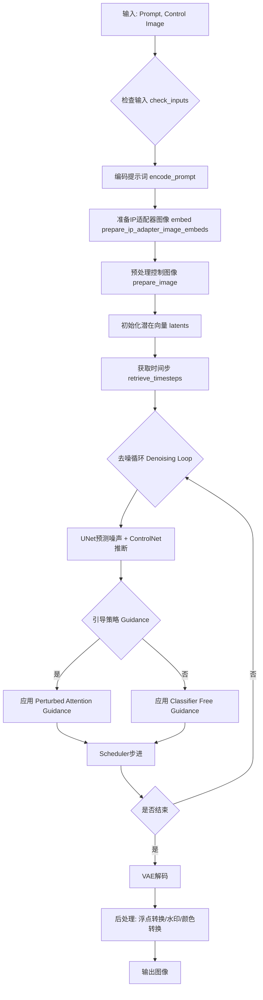

## 类结构

```
StableDiffusionXLControlNetPAGPipeline (主类)
├── DiffusionPipeline (基础管道)
├── StableDiffusionMixin (SDXL混入)
├── TextualInversionLoaderMixin (文本反转加载)
├── StableDiffusionXLLoraLoaderMixin (LoRA加载)
├── IPAdapterMixin (IP适配器)
├── FromSingleFileMixin (单文件加载)
└── PAGMixin (PAG引导混入)
```

## 全局变量及字段


### `logger`
    
模块级日志记录器，用于输出调试和运行信息

类型：`logging.Logger`
    


### `EXAMPLE_DOC_STRING`
    
包含Pipeline使用示例的文档字符串，展示如何进行ControlNet图像生成

类型：`str`
    


### `XLA_AVAILABLE`
    
PyTorch XLA可用性标志，用于判断是否支持XLA设备加速

类型：`bool`
    


### `StableDiffusionXLControlNetPAGPipeline.vae`
    
变分自编码器模型，用于将图像编码到潜在空间并从潜在向量重建图像

类型：`AutoencoderKL`
    


### `StableDiffusionXLControlNetPAGPipeline.text_encoder`
    
主文本编码器，将文本提示转换为嵌入向量用于指导图像生成

类型：`CLIPTextModel`
    


### `StableDiffusionXLControlNetPAGPipeline.text_encoder_2`
    
第二文本编码器，生成带有投影维度的文本嵌入用于SDXL双文本编码器架构

类型：`CLIPTextModelWithProjection`
    


### `StableDiffusionXLControlNetPAGPipeline.tokenizer`
    
主分词器，将文本字符串转换为token ID序列供text_encoder处理

类型：`CLIPTokenizer`
    


### `StableDiffusionXLControlNetPAGPipeline.tokenizer_2`
    
第二分词器，用于处理第二文本编码器的输入

类型：`CLIPTokenizer`
    


### `StableDiffusionXLControlNetPAGPipeline.unet`
    
条件去噪U-Net网络，在潜在空间中根据文本嵌入和ControlNet条件进行噪声预测

类型：`UNet2DConditionModel`
    


### `StableDiffusionXLControlNetPAGPipeline.controlnet`
    
ControlNet模型，提供额外条件信息指导UNet去噪过程，支持单或多ControlNet

类型：`ControlNetModel | list[ControlNetModel] | MultiControlNetModel`
    


### `StableDiffusionXLControlNetPAGPipeline.scheduler`
    
扩散调度器，管理去噪过程中的时间步和噪声调度策略

类型：`KarrasDiffusionSchedulers`
    


### `StableDiffusionXLControlNetPAGPipeline.watermark`
    
水印处理器，用于在生成的图像上添加不可见水印以标识来源

类型：`StableDiffusionXLWatermarker | None`
    


### `StableDiffusionXLControlNetPAGPipeline.image_processor`
    
VAE图像处理器，负责VAE编码前和decode后的图像预处理与后处理

类型：`VaeImageProcessor`
    


### `StableDiffusionXLControlNetPAGPipeline.control_image_processor`
    
ControlNet专用图像处理器，用于预处理ControlNet的输入条件图像

类型：`VaeImageProcessor`
    


### `StableDiffusionXLControlNetPAGPipeline.vae_scale_factor`
    
VAE缩放因子，用于计算潜在空间与像素空间的尺寸转换比例

类型：`int`
    
    

## 全局函数及方法


### `retrieve_timesteps`

调用调度器的 `set_timesteps` 方法并从中获取时间步，处理自定义时间步。任何 kwargs 都将传递给 `scheduler.set_timesteps`。

参数：

- `scheduler`：`SchedulerMixin`，用于获取时间步的调度器
- `num_inference_steps`：`int | None`，使用预训练模型生成样本时的扩散步数。如果使用此参数，`timesteps` 必须为 `None`
- `device`：`str | torch.device | None`，时间步要移动到的设备。如果为 `None`，时间步不会移动
- `timesteps`：`list[int] | None`，用于覆盖调度器时间步间距策略的自定义时间步。如果传入 `timesteps`，则 `num_inference_steps` 和 `sigmas` 必须为 `None`
- `sigmas`：`list[float] | None`，用于覆盖调度器时间步间距策略的自定义 sigmas。如果传入 `sigmas`，则 `num_inference_steps` 和 `timesteps` 必须为 `None`
- `**kwargs`：任意关键字参数，将传递给调度器的 `set_timesteps` 方法

返回值：`tuple[torch.Tensor, int]`，元组包含调度器的时间步调度和推理步数

#### 流程图

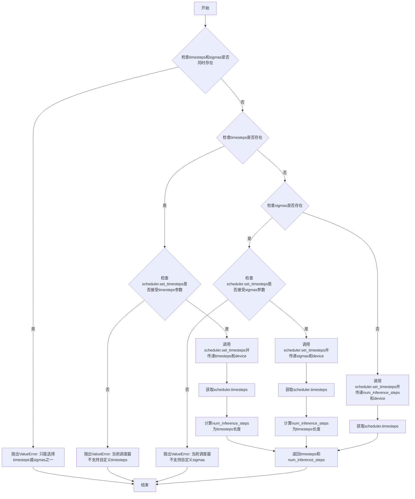

#### 带注释源码

```python
# Copied from diffusers.pipelines.stable_diffusion.pipeline_stable_diffusion.retrieve_timesteps
def retrieve_timesteps(
    scheduler,
    num_inference_steps: int | None = None,
    device: str | torch.device | None = None,
    timesteps: list[int] | None = None,
    sigmas: list[float] | None = None,
    **kwargs,
):
    r"""
    Calls the scheduler's `set_timesteps` method and retrieves timesteps from the scheduler after the call. Handles
    custom timesteps. Any kwargs will be supplied to `scheduler.set_timesteps`.

    Args:
        scheduler (`SchedulerMixin`):
            The scheduler to get timesteps from.
        num_inference_steps (`int`):
            The number of diffusion steps used when generating samples with a pre-trained model. If used, `timesteps`
            must be `None`.
        device (`str` or `torch.device`, *optional*):
            The device to which the timesteps should be moved to. If `None`, the timesteps are not moved.
        timesteps (`list[int]`, *optional*):
            Custom timesteps used to override the timestep spacing strategy of the scheduler. If `timesteps` is passed,
            `num_inference_steps` and `sigmas` must be `None`.
        sigmas (`list[float]`, *optional*):
            Custom sigmas used to override the timestep spacing strategy of the scheduler. If `sigmas` is passed,
            `num_inference_steps` and `timesteps` must be `None`.

    Returns:
        `tuple[torch.Tensor, int]`: A tuple where the first element is the timestep schedule from the scheduler and the
        second element is the number of inference steps.
    """
    # 检查是否同时传入了timesteps和sigmas，这是不允许的
    if timesteps is not None and sigmas is not None:
        raise ValueError("Only one of `timesteps` or `sigmas` can be passed. Please choose one to set custom values")
    
    # 处理自定义timesteps的情况
    if timesteps is not None:
        # 使用inspect检查scheduler.set_timesteps是否接受timesteps参数
        accepts_timesteps = "timesteps" in set(inspect.signature(scheduler.set_timesteps).parameters.keys())
        if not accepts_timesteps:
            raise ValueError(
                f"The current scheduler class {scheduler.__class__}'s `set_timesteps` does not support custom"
                f" timestep schedules. Please check whether you are using the correct scheduler."
            )
        # 调用scheduler的set_timesteps方法设置自定义时间步
        scheduler.set_timesteps(timesteps=timesteps, device=device, **kwargs)
        # 从scheduler获取设置后的时间步
        timesteps = scheduler.timesteps
        # 计算推理步数
        num_inference_steps = len(timesteps)
    # 处理自定义sigmas的情况
    elif sigmas is not None:
        # 使用inspect检查scheduler.set_timesteps是否接受sigmas参数
        accept_sigmas = "sigmas" in set(inspect.signature(scheduler.set_timesteps).parameters.keys())
        if not accept_sigmas:
            raise ValueError(
                f"The current scheduler class {scheduler.__class__}'s `set_timesteps` does not support custom"
                f" sigmas schedules. Please check whether you are using the correct scheduler."
            )
        # 调用scheduler的set_timesteps方法设置自定义sigmas
        scheduler.set_timesteps(sigmas=sigmas, device=device, **kwargs)
        # 从scheduler获取设置后的时间步
        timesteps = scheduler.timesteps
        # 计算推理步数
        num_inference_steps = len(timesteps)
    # 使用默认的推理步数
    else:
        scheduler.set_timesteps(num_inference_steps, device=device, **kwargs)
        timesteps = scheduler.timesteps
    
    # 返回时间步调度和推理步数
    return timesteps, num_inference_steps
```


### `StableDiffusionXLControlNetPAGPipeline.__init__`

初始化 Stable Diffusion XL ControlNet PAG Pipeline 管道组件，包括 VAE、文本编码器、分词器、UNet、ControlNet、调度器等核心模型，并配置图像处理器和水印处理器。

参数：

- `vae`：`AutoencoderKL`，Variational Auto-Encoder (VAE) 模型，用于编码和解码图像到潜在表示
- `text_encoder`：`CLIPTextModel`，冻结的文本编码器 (clip-vit-large-patch14)
- `text_encoder_2`：`CLIPTextModelWithProjection`，第二个冻结的文本编码器
- `tokenizer`：`CLIPTokenizer`，用于对文本进行分词
- `tokenizer_2`：`CLIPTokenizer`，第二个分词器
- `unet`：`UNet2DConditionModel`，去噪图像潜在表示的 UNet 模型
- `controlnet`：`ControlNetModel | list[ControlNetModel] | tuple[ControlNetModel] | MultiControlNetModel`，提供额外条件的 ControlNet
- `scheduler`：`KarrasDiffusionSchedulers`，与 unet 配合去噪的调度器
- `force_zeros_for_empty_prompt`：`bool`，可选，默认 `True`，是否将负 prompt 嵌入始终设为 0
- `add_watermarker`：`bool | None`，可选，是否使用不可见水印
- `feature_extractor`：`CLIPImageProcessor`，可选，特征提取器
- `image_encoder`：`CLIPVisionModelWithProjection`，可选，图像编码器
- `pag_applied_layers`：`str | list[str]`，可选，默认 `"mid"`，PAG 应用层

返回值：`None`，无返回值（构造函数）

#### 流程图

```mermaid
flowchart TD
    A[开始 __init__] --> B[调用 super().__init__]
    B --> C{controlnet 是 list 或 tuple?}
    C -->|是| D[转换为 MultiControlNetModel]
    C -->|否| E[保持原样]
    D --> F[register_modules 注册所有模块]
    E --> F
    F --> G[计算 vae_scale_factor]
    H[创建 VaeImageProcessor] --> I[创建 control_image_processor]
    I --> J{add_watermarker 未指定?}
    J -->|是| K{is_invisible_watermark_available?}
    J -->|否| L[使用指定值]
    K -->|是| M[设为 True]
    K -->|否| N[设为 False]
    L --> O[创建 watermark]
    M --> O
    N --> O
    O --> P[register_to_config 注册配置]
    P --> Q[set_pag_applied_layers 设置 PAG 层]
    Q --> R[结束]
```

#### 带注释源码

```python
def __init__(
    self,
    vae: AutoencoderKL,
    text_encoder: CLIPTextModel,
    text_encoder_2: CLIPTextModelWithProjection,
    tokenizer: CLIPTokenizer,
    tokenizer_2: CLIPTokenizer,
    unet: UNet2DConditionModel,
    controlnet: ControlNetModel | list[ControlNetModel] | tuple[ControlNetModel] | MultiControlNetModel,
    scheduler: KarrasDiffusionSchedulers,
    force_zeros_for_empty_prompt: bool = True,
    add_watermarker: bool | None = None,
    feature_extractor: CLIPImageProcessor = None,
    image_encoder: CLIPVisionModelWithProjection = None,
    pag_applied_layers: str | list[str] = "mid",  # ["down.block_2", "up.block_1.attentions_0"], "mid"
):
    # 调用父类 DiffusionPipeline 的初始化方法
    super().__init__()

    # 如果 controlnet 是列表或元组，转换为 MultiControlNetModel
    # MultiControlNetModel 用于管理多个 ControlNet 模型
    if isinstance(controlnet, (list, tuple)):
        controlnet = MultiControlNetModel(controlnet)

    # 注册所有模块到管道中，使它们可以通过 self.xxx 访问
    self.register_modules(
        vae=vae,
        text_encoder=text_encoder,
        text_encoder_2=text_encoder_2,
        tokenizer=tokenizer,
        tokenizer_2=tokenizer_2,
        unet=unet,
        controlnet=controlnet,
        scheduler=scheduler,
        feature_extractor=feature_extractor,
        image_encoder=image_encoder,
    )

    # 计算 VAE 缩放因子，基于 VAE 块输出通道数的幂
    # 2 ** (len(self.vae.config.block_out_channels) - 1)
    # 例如：如果有 [128, 256, 512, 512] 通道，则 2 ** (4-1) = 8
    self.vae_scale_factor = 2 ** (len(self.vae.config.block_out_channels) - 1) if getattr(self, "vae", None) else 8

    # 创建图像处理器，用于处理输入输出图像
    # do_convert_rgb=True 表示将图像转换为 RGB 格式
    self.image_processor = VaeImageProcessor(vae_scale_factor=self.vae_scale_factor, do_convert_rgb=True)

    # 创建 ControlNet 专用的图像处理器
    # do_normalize=False 表示不进行归一化处理
    self.control_image_processor = VaeImageProcessor(
        vae_scale_factor=self.vae_scale_factor, do_convert_rgb=True, do_normalize=False
    )

    # 如果 add_watermarker 未指定，则根据水印库是否可用自动决定
    add_watermarker = add_watermarker if add_watermarker is not None else is_invisible_watermark_available()

    # 如果需要添加水印，创建水印处理器
    if add_watermarker:
        self.watermark = StableDiffusionXLWatermarker()
    else:
        self.watermark = None

    # 将配置参数注册到 config 中
    self.register_to_config(force_zeros_for_empty_prompt=force_zeros_for_empty_prompt)

    # 设置 PAG (Perturbed Attention Guidance) 应用层
    # 这些层将用于应用 PAG 技术
    self.set_pag_applied_layers(pag_applied_layers)
```


### `StableDiffusionXLControlNetPAGPipeline.encode_prompt`

该函数负责将文本提示词（prompt）编码为文本嵌入向量（text embeddings），支持单文本编码器和双文本编码器（SDXL架构），同时处理负面提示词、LoRA缩放和CLIP层跳过等高级功能，为后续的图像生成过程准备文本条件信息。

参数：

- `prompt`：`str` 或 `list[str]`，要编码的主提示词，支持字符串或字符串列表
- `prompt_2`：`str` 或 `list[str]` 或 `None`，发送给第二个tokenizer和text_encoder的提示词，若不指定则使用prompt
- `device`：`torch.device` 或 `None`，指定torch设备，若为None则使用执行设备
- `num_images_per_prompt`：`int`，每个提示词生成的图像数量，用于扩展embeddings
- `do_classifier_free_guidance`：`bool`，是否使用无分类器自由引导（CFG）
- `negative_prompt`：`str` 或 `list[str]` 或 `None`，负面提示词，用于引导图像远离某些内容
- `negative_prompt_2`：`str` 或 `list[str]` 或 `None`，发送给第二个tokenizer和text_encoder的负面提示词
- `prompt_embeds`：`torch.Tensor` 或 `None`，预生成的文本嵌入，若提供则直接使用
- `negative_prompt_embeds`：`torch.Tensor` 或 `None`，预生成的负面文本嵌入
- `pooled_prompt_embeds`：`torch.Tensor` 或 `None`，预生成的池化文本嵌入
- `negative_pooled_prompt_embeds`：`torch.Tensor` 或 `None`，预生成的负面池化文本嵌入
- `lora_scale`：`float` 或 `None`，LoRA缩放因子，用于调整LoRA层的影响
- `clip_skip`：`int` 或 `None`，CLIP跳过的层数，用于选择不同层次的特征

返回值：`tuple[torch.Tensor, torch.Tensor, torch.Tensor, torch.Tensor]`，包含四个张量：编码后的提示词嵌入、负面提示词嵌入、池化提示词嵌入、负面池化提示词嵌入

#### 流程图

```mermaid
flowchart TD
    A[开始 encode_prompt] --> B{device参数是否为None}
    B -->|是| C[使用执行设备self._execution_device]
    B -->|否| D[使用传入的device]
    C --> E{检查lora_scale参数}
    D --> E
    
    E --> F{LoRA scale是否有效且为StableDiffusionXLLoraLoaderMixin}
    F -->|是| G[设置self._lora_scale并调整LoRA层]
    F -->|否| H[跳过LoRA调整]
    G --> I[将prompt转为列表]
    H --> I
    
    I --> J{prompt_embeds是否为None}
    J -->|是| K[处理prompt_2]
    J -->|否| L[使用已有的prompt_embeds]
    
    K --> M{判断tokenizer和text_encoder组合}
    M --> N[使用tokenizer和text_encoder_2]
    M --> O[同时使用两个tokenizer和text_encoder]
    
    N --> P[调用maybe_convert_prompt处理TextualInversion]
    O --> P
    P --> Q[tokenizer处理prompt]
    Q --> R[text_encoder编码获取hidden_states]
    R --> S[提取pooled_prompt_embeds]
    S --> T[根据clip_skip选择隐藏层]
    T --> U[添加到prompt_embeds_list]
    
    L --> V[concat所有prompt_embeds]
    U --> V
    
    V --> W{是否需要CFG}
    W -->|是| X{negative_prompt_embeds是否为None}
    W -->|否| Y[跳过负面嵌入处理]
    
    X -->|是且zero_out_negative_prompt| Z[创建零张量]
    X -->|否| AA[处理negative_prompt和negative_prompt_2]
    Z --> AB[创建零的pooled嵌入]
    AA --> AC[tokenizer处理negative_prompt]
    AC --> AD[text_encoder编码negative_prompt]
    AD --> AE[提取negative_pooled_prompt_embeds]
    AE --> AF[获取负面hidden_states]
    AF --> AB
    
    Y --> AG[转换dtype和device]
    AB --> AG
    
    AG --> AH[重复embeddings以匹配num_images_per_prompt]
    AH --> AI{do_classifier_free_guidance为真}
    AI -->|是| AJ[重复negative_prompt_embeds]
    AI -->|否| AK[跳过重复]
    AJ --> AL[调整维度]
    AK --> AL
    
    AL --> AM{是否使用PEFT backend}
    AM -->|是| AN[反缩放LoRA层]
    AM -->|否| AO[跳过反缩放]
    
    AN --> AP[返回四个embeddings]
    AO --> AP
```

#### 带注释源码

```python
def encode_prompt(
    self,
    prompt: str,
    prompt_2: str | None = None,
    device: torch.device | None = None,
    num_images_per_prompt: int = 1,
    do_classifier_free_guidance: bool = True,
    negative_prompt: str | None = None,
    negative_prompt_2: str | None = None,
    prompt_embeds: torch.Tensor | None = None,
    negative_prompt_embeds: torch.Tensor | None = None,
    pooled_prompt_embeds: torch.Tensor | None = None,
    negative_pooled_prompt_embeds: torch.Tensor | None = None,
    lora_scale: float | None = None,
    clip_skip: int | None = None,
):
    r"""
    Encodes the prompt into text encoder hidden states.

    Args:
        prompt (`str` or `list[str]`, *optional*):
            prompt to be encoded
        prompt_2 (`str` or `list[str]`, *optional*):
            The prompt or prompts to be sent to the `tokenizer_2` and `text_encoder_2`. If not defined, `prompt` is
            used in both text-encoders
        device: (`torch.device`):
            torch device
        num_images_per_prompt (`int`):
            number of images that should be generated per prompt
        do_classifier_free_guidance (`bool`):
            whether to use classifier free guidance or not
        negative_prompt (`str` or `list[str]`, *optional*):
            The prompt or prompts not to guide the image generation. If not defined, one has to pass
            `negative_prompt_embeds` instead. Ignored when not using guidance (i.e., ignored if `guidance_scale` is
            less than `1`).
        negative_prompt_2 (`str` or `list[str]`, *optional*):
            The prompt or prompts not to guide the image generation to be sent to `tokenizer_2` and
            `text_encoder_2`. If not defined, `negative_prompt` is used in both text-encoders
        prompt_embeds (`torch.Tensor`, *optional*):
            Pre-generated text embeddings. Can be used to easily tweak text inputs, *e.g.* prompt weighting. If not
            provided, text embeddings will be generated from `prompt` input argument.
        negative_prompt_embeds (`torch.Tensor`, *optional*):
            Pre-generated negative text embeddings. Can be used to easily tweak text inputs, *e.g.* prompt
            weighting. If not provided, negative_prompt_embeds will be generated from `negative_prompt` input
            argument.
        pooled_prompt_embeds (`torch.Tensor`, *optional*):
            Pre-generated pooled text embeddings. Can be used to easily tweak text inputs, *e.g.* prompt weighting.
            If not provided, pooled text embeddings will be generated from `prompt` input argument.
        negative_pooled_prompt_embeds (`torch.Tensor`, *optional*):
            Pre-generated negative pooled text embeddings. Can be used to easily tweak text inputs, *e.g.* prompt
            weighting. If not provided, pooled negative_prompt_embeds will be generated from `negative_prompt`
            input argument.
        lora_scale (`float`, *optional*):
            A lora scale that will be applied to all LoRA layers of the text encoder if LoRA layers are loaded.
        clip_skip (`int`, *optional*):
            Number of layers to be skipped from CLIP while computing the prompt embeddings. A value of 1 means that
            the output of the pre-final layer will be used for computing the prompt embeddings.
    """
    # 确定设备，如果未指定则使用执行设备
    device = device or self._execution_device

    # 设置LoRA缩放，以便文本编码器的LoRA函数可以正确访问
    # 如果lora_scale不为None且是StableDiffusionXLLoraLoaderMixin的实例
    if lora_scale is not None and isinstance(self, StableDiffusionXLLoraLoaderMixin):
        self._lora_scale = lora_scale

        # 动态调整LoRA缩放
        if self.text_encoder is not None:
            if not USE_PEFT_BACKEND:
                adjust_lora_scale_text_encoder(self.text_encoder, lora_scale)
            else:
                scale_lora_layers(self.text_encoder, lora_scale)

        if self.text_encoder_2 is not None:
            if not USE_PEFT_BACKEND:
                adjust_lora_scale_text_encoder(self.text_encoder_2, lora_scale)
            else:
                scale_lora_layers(self.text_encoder_2, lora_scale)

    # 将prompt转换为列表，统一处理
    prompt = [prompt] if isinstance(prompt, str) else prompt

    # 确定batch_size
    if prompt is not None:
        batch_size = len(prompt)
    else:
        batch_size = prompt_embeds.shape[0]

    # 定义tokenizers和text_encoders列表
    # 根据哪个encoder可用选择使用一个或两个
    tokenizers = [self.tokenizer, self.tokenizer_2] if self.tokenizer is not None else [self.tokenizer_2]
    text_encoders = (
        [self.text_encoder, self.text_encoder_2] if self.text_encoder is not None else [self.text_encoder_2]
    )

    # 如果没有提供prompt_embeds，则从prompt生成
    if prompt_embeds is None:
        # prompt_2默认为prompt
        prompt_2 = prompt_2 or prompt
        prompt_2 = [prompt_2] if isinstance(prompt_2, str) else prompt_2

        # textual inversion: 处理多向量tokens
        prompt_embeds_list = []
        prompts = [prompt, prompt_2]
        for prompt, tokenizer, text_encoder in zip(prompts, tokenizers, text_encoders):
            # 如果支持TextualInversion，转换prompt
            if isinstance(self, TextualInversionLoaderMixin):
                prompt = self.maybe_convert_prompt(prompt, tokenizer)

            # tokenizer处理文本
            text_inputs = tokenizer(
                prompt,
                padding="max_length",
                max_length=tokenizer.model_max_length,
                truncation=True,
                return_tensors="pt",
            )

            text_input_ids = text_inputs.input_ids
            # 获取未截断的IDs用于检测截断
            untruncated_ids = tokenizer(prompt, padding="longest", return_tensors="pt").input_ids

            # 检测是否发生了截断
            if untruncated_ids.shape[-1] >= text_input_ids.shape[-1] and not torch.equal(
                text_input_ids, untruncated_ids
            ):
                removed_text = tokenizer.batch_decode(untruncated_ids[:, tokenizer.model_max_length - 1 : -1])
                logger.warning(
                    "The following part of your input was truncated because CLIP can only handle sequences up to"
                    f" {tokenizer.model_max_length} tokens: {removed_text}"
                )

            # text_encoder编码获取hidden_states
            prompt_embeds = text_encoder(text_input_ids.to(device), output_hidden_states=True)

            # 我们总是对最终的text encoder的pooled输出感兴趣
            if pooled_prompt_embeds is None and prompt_embeds[0].ndim == 2:
                pooled_prompt_embeds = prompt_embeds[0]

            # 根据clip_skip选择hidden_states层
            if clip_skip is None:
                prompt_embeds = prompt_embeds.hidden_states[-2]
            else:
                # "2" 因为SDXL总是从倒数第二层索引
                prompt_embeds = prompt_embeds.hidden_states[-(clip_skip + 2)]

            prompt_embeds_list.append(prompt_embeds)

        # 合并两个encoder的embeddings
        prompt_embeds = torch.concat(prompt_embeds_list, dim=-1)

    # 获取无分类器自由引导的unconditional embeddings
    # 判断是否需要将negative_prompt设为零
    zero_out_negative_prompt = negative_prompt is None and self.config.force_zeros_for_empty_prompt
    
    # 处理negative_prompt_embeds
    if do_classifier_free_guidance and negative_prompt_embeds is None and zero_out_negative_prompt:
        # 创建与prompt_embeds形状相同的零张量
        negative_prompt_embeds = torch.zeros_like(prompt_embeds)
        negative_pooled_prompt_embeds = torch.zeros_like(pooled_prompt_embeds)
    elif do_classifier_free_guidance and negative_prompt_embeds is None:
        # 需要从negative_prompt生成embeddings
        negative_prompt = negative_prompt or ""
        negative_prompt_2 = negative_prompt_2 or negative_prompt

        # 规范化为列表
        negative_prompt = batch_size * [negative_prompt] if isinstance(negative_prompt, str) else negative_prompt
        negative_prompt_2 = (
            batch_size * [negative_prompt_2] if isinstance(negative_prompt_2, str) else negative_prompt_2
        )

        uncond_tokens: list[str]
        if prompt is not None and type(prompt) is not type(negative_prompt):
            raise TypeError(
                f"`negative_prompt` should be the same type to `prompt`, but got {type(negative_prompt)} !="
                f" {type(prompt)}."
            )
        elif batch_size != len(negative_prompt):
            raise ValueError(
                f"`negative_prompt`: {negative_prompt} has batch size {len(negative_prompt)}, but `prompt`:"
                f" {prompt} has batch size {batch_size}. Please make sure that passed `negative_prompt` matches"
                " the batch size of `prompt`."
            )
        else:
            uncond_tokens = [negative_prompt, negative_prompt_2]

        negative_prompt_embeds_list = []
        for negative_prompt, tokenizer, text_encoder in zip(uncond_tokens, tokenizers, text_encoders):
            # 处理TextualInversion
            if isinstance(self, TextualInversionLoaderMixin):
                negative_prompt = self.maybe_convert_prompt(negative_prompt, tokenizer)

            max_length = prompt_embeds.shape[1]
            uncond_input = tokenizer(
                negative_prompt,
                padding="max_length",
                max_length=max_length,
                truncation=True,
                return_tensors="pt",
            )

            negative_prompt_embeds = text_encoder(
                uncond_input.input_ids.to(device),
                output_hidden_states=True,
            )

            # 提取pooled输出
            if negative_pooled_prompt_embeds is None and negative_prompt_embeds[0].ndim == 2:
                negative_pooled_prompt_embeds = negative_prompt_embeds[0]
            negative_prompt_embeds = negative_prompt_embeds.hidden_states[-2]

            negative_prompt_embeds_list.append(negative_prompt_embeds)

        negative_prompt_embeds = torch.concat(negative_prompt_embeds_list, dim=-1)

    # 确保embeddings的dtype与text_encoder_2或unet匹配
    if self.text_encoder_2 is not None:
        prompt_embeds = prompt_embeds.to(dtype=self.text_encoder_2.dtype, device=device)
    else:
        prompt_embeds = prompt_embeds.to(dtype=self.unet.dtype, device=device)

    bs_embed, seq_len, _ = prompt_embeds.shape
    # 为每个prompt复制text embeddings，使用mps友好的方法
    prompt_embeds = prompt_embeds.repeat(1, num_images_per_prompt, 1)
    prompt_embeds = prompt_embeds.view(bs_embed * num_images_per_prompt, seq_len, -1)

    if do_classifier_free_guidance:
        # 复制unconditional embeddings
        seq_len = negative_prompt_embeds.shape[1]

        if self.text_encoder_2 is not None:
            negative_prompt_embeds = negative_prompt_embeds.to(dtype=self.text_encoder_2.dtype, device=device)
        else:
            negative_prompt_embeds = negative_prompt_embeds.to(dtype=self.unet.dtype, device=device)

        negative_prompt_embeds = negative_prompt_embeds.repeat(1, num_images_per_prompt, 1)
        negative_prompt_embeds = negative_prompt_embeds.view(batch_size * num_images_per_prompt, seq_len, -1)

    # 复制pooled embeddings
    pooled_prompt_embeds = pooled_prompt_embeds.repeat(1, num_images_per_prompt).view(
        bs_embed * num_images_per_prompt, -1
    )
    if do_classifier_free_guidance:
        negative_pooled_prompt_embeds = negative_pooled_prompt_embeds.repeat(1, num_images_per_prompt).view(
            bs_embed * num_images_per_prompt, -1
        )

    # 如果使用PEFT backend，需要反缩放LoRA层以恢复原始scale
    if self.text_encoder is not None:
        if isinstance(self, StableDiffusionXLLoraLoaderMixin) and USE_PEFT_BACKEND:
            unscale_lora_layers(self.text_encoder, lora_scale)

    if self.text_encoder_2 is not None:
        if isinstance(self, StableDiffusionXLLoraLoaderMixin) and USE_PEFT_BACKEND:
            unscale_lora_layers(self.text_encoder_2, lora_scale)

    # 返回四个embeddings：prompt_embeds, negative_prompt_embeds, pooled_prompt_embeds, negative_pooled_prompt_embeds
    return prompt_embeds, negative_prompt_embeds, pooled_prompt_embeds, negative_pooled_prompt_embeds
```


### `StableDiffusionXLControlNetPAGPipeline.encode_image`

该方法用于将图像输入编码为图像嵌入向量或隐藏状态，支持分类器自由引导（Classifier-Free Guidance）所需的有条件和无条件图像表示。

参数：

- `image`：`Union[torch.Tensor, PIL.Image, np.ndarray, List]`，待编码的图像输入，支持 torch.Tensor、PIL.Image、np.ndarray 或它们的列表形式
- `device`：`torch.device`，图像张量要移动到的目标设备
- `num_images_per_prompt`：`int`，每个提示词要生成的图像数量，用于对图像嵌入进行重复以匹配批量大小
- `output_hidden_states`：`Optional[bool]`，可选参数，指定是否返回图像编码器的隐藏状态而非图像嵌入

返回值：`Tuple[torch.Tensor, torch.Tensor]`，返回两个张量元组——第一个是条件图像表示（有条件），第二个是无条件图像表示。当 `output_hidden_states=True` 时返回隐藏状态，否则返回图像嵌入。

#### 流程图

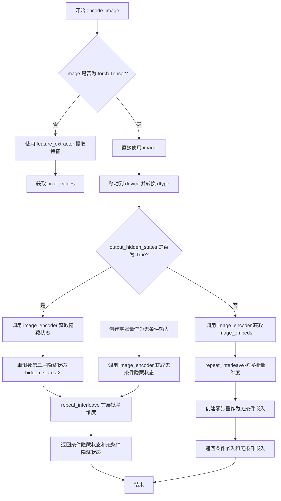

#### 带注释源码

```python
def encode_image(self, image, device, num_images_per_prompt, output_hidden_states=None):
    # 获取图像编码器参数的数据类型，用于后续计算
    dtype = next(self.image_encoder.parameters()).dtype

    # 如果输入不是 torch.Tensor，则使用特征提取器将其转换为张量
    # 支持 PIL.Image、np.ndarray 等格式的输入
    if not isinstance(image, torch.Tensor):
        image = self.feature_extractor(image, return_tensors="pt").pixel_values

    # 将图像移动到指定设备并转换为正确的dtype
    image = image.to(device=device, dtype=dtype)
    
    # 根据 output_hidden_states 参数选择不同的处理路径
    if output_hidden_states:
        # 路径1：返回图像编码器的隐藏状态（用于更细粒度的控制）
        
        # 对输入图像进行编码，获取隐藏状态序列
        image_enc_hidden_states = self.image_encoder(image, output_hidden_states=True).hidden_states[-2]
        # 使用 repeat_interleave 扩展批量维度，以匹配 num_images_per_prompt
        # 例如：从 (batch_size, seq_len, dim) 扩展为 (batch_size * num_images_per_prompt, seq_len, dim)
        image_enc_hidden_states = image_enc_hidden_states.repeat_interleave(num_images_per_prompt, dim=0)
        
        # 创建与输入图像形状相同的零张量，用于生成无条件（negative）图像表示
        # 这用于分类器自由引导（Classifier-Free Guidance）
        uncond_image_enc_hidden_states = self.image_encoder(
            torch.zeros_like(image), output_hidden_states=True
        ).hidden_states[-2]
        # 同样扩展无条件隐藏状态的批量维度
        uncond_image_enc_hidden_states = uncond_image_enc_hidden_states.repeat_interleave(
            num_images_per_prompt, dim=0
        )
        
        # 返回条件隐藏状态和无条件隐藏状态的元组
        return image_enc_hidden_states, uncond_image_enc_hidden_states
    else:
        # 路径2：返回图像嵌入（image_embeds）- 更简洁的表示
        
        # 对输入图像进行编码，获取图像嵌入向量
        image_embeds = self.image_encoder(image).image_embeds
        # 扩展图像嵌入的批量维度
        image_embeds = image_embeds.repeat_interleave(num_images_per_prompt, dim=0)
        
        # 创建形状相同的零张量作为无条件图像嵌入
        # 用于分类器自由引导，让模型能够区分"有图像条件"和"无图像条件"
        uncond_image_embeds = torch.zeros_like(image_embeds)

        # 返回条件嵌入和无条件嵌入的元组
        return image_embeds, uncond_image_embeds
```


### `StableDiffusionXLControlNetPAGPipeline.prepare_ip_adapter_image_embeds`

该方法用于准备IP适配器（IP-Adapter）的图像embeddings，处理输入图像或预计算的图像embeddings，支持分类器自由引导（classifier-free guidance），并返回适配器所需的图像embeddings列表。

参数：

- `self`：`StableDiffusionXLControlNetPAGPipeline` 实例本身
- `ip_adapter_image`：`PipelineImageInput | None`，要处理的IP适配器输入图像，可以是PIL图像、numpy数组、torch张量或它们的列表
- `ip_adapter_image_embeds`：`list[torch.Tensor] | None`，预计算的图像embeddings列表，如果为None则从`ip_adapter_image`编码生成
- `device`：`torch.device`，计算设备
- `num_images_per_prompt`：`int`，每个提示生成的图像数量
- `do_classifier_free_guidance`：`bool`，是否启用分类器自由引导

返回值：`list[torch.Tensor]`，处理后的IP适配器图像embeddings列表，每个元素是对应IP适配器的图像embeddings

#### 流程图

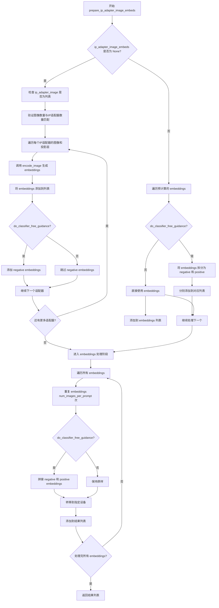

#### 带注释源码

```python
def prepare_ip_adapter_image_embeds(
    self, 
    ip_adapter_image,  # 输入的IP适配器图像
    ip_adapter_image_embeds,  # 预计算的图像embeddings，可为None
    device,  # 计算设备
    num_images_per_prompt,  # 每个提示生成的图像数量
    do_classifier_free_guidance  # 是否使用分类器自由引导
):
    """
    准备IP适配器的图像embeddings。
    
    该方法处理两种情况：
    1. 当 ip_adapter_image_embeds 为 None 时，从 ip_adapter_image 编码生成embeddings
    2. 当 ip_adapter_image_embeds 已提供时，直接处理并返回
    """
    
    # 初始化用于存储图像embeddings的列表
    image_embeds = []
    
    # 如果启用分类器自由引导，同时初始化negative embeddings列表
    if do_classifier_free_guidance:
        negative_image_embeds = []
    
    # === 情况1：需要从图像编码生成embeddings ===
    if ip_adapter_image_embeds is None:
        # 确保输入图像是列表形式
        if not isinstance(ip_adapter_image, list):
            ip_adapter_image = [ip_adapter_image]
        
        # 验证图像数量与IP适配器数量是否匹配
        # IP适配器数量由unet的encoder_hid_proj.image_projection_layers决定
        if len(ip_adapter_image) != len(self.unet.encoder_hid_proj.image_projection_layers):
            raise ValueError(
                f"`ip_adapter_image` must have same length as the number of IP Adapters. "
                f"Got {len(ip_adapter_image)} images and "
                f"{len(self.unet.encoder_hid_proj.image_projection_layers)} IP Adapters."
            )
        
        # 遍历每个IP适配器对应的图像和投影层
        for single_ip_adapter_image, image_proj_layer in zip(
            ip_adapter_image, self.unet.encoder_hid_proj.image_projection_layers
        ):
            # 判断是否需要输出hidden states
            # 如果投影层不是ImageProjection类型，则输出hidden states
            output_hidden_state = not isinstance(image_proj_layer, ImageProjection)
            
            # 调用encode_image方法编码单个图像
            # 返回positive和negative两种embeddings
            single_image_embeds, single_negative_image_embeds = self.encode_image(
                single_ip_adapter_image, device, 1, output_hidden_state
            )
            
            # 将单个图像embeddings添加到列表（添加batch维度）
            image_embeds.append(single_image_embeds[None, :])
            
            # 如果启用分类器自由引导，同时保存negative embeddings
            if do_classifier_free_guidance:
                negative_image_embeds.append(single_negative_image_embeds[None, :])
    
    # === 情况2：使用预计算的embeddings ===
    else:
        # 遍历预计算的图像embeddings
        for single_image_embeds in ip_adapter_image_embeds:
            if do_classifier_free_guidance:
                # 预计算的embeddings通常将negative和positive拼接在一起
                # 使用chunk(2)将它们拆分
                single_negative_image_embeds, single_image_embeds = single_image_embeds.chunk(2)
                negative_image_embeds.append(single_negative_image_embeds)
            
            # 直接添加embeddings
            image_embeds.append(single_image_embeds)
    
    # === 处理和格式化最终的embeddings ===
    ip_adapter_image_embeds = []
    
    # 遍历所有图像embeddings
    for i, single_image_embeds in enumerate(image_embeds):
        # 根据num_images_per_prompt重复embeddings
        # 例如：如果num_images_per_prompt=2，每个embeddings会被复制2份
        single_image_embeds = torch.cat([single_image_embeds] * num_images_per_prompt, dim=0)
        
        if do_classifier_free_guidance:
            # 对negative embeddings也进行相同的重复操作
            single_negative_image_embeds = torch.cat(
                [negative_image_embeds[i]] * num_images_per_prompt, dim=0
            )
            # 将negative和positive embeddings拼接在一起
            # 顺序：negative在前，positive在后（这是diffusers的标准做法）
            single_image_embeds = torch.cat(
                [single_negative_image_embeds, single_image_embeds], dim=0
            )
        
        # 将结果转移到指定的计算设备
        single_image_embeds = single_image_embeds.to(device=device)
        
        # 添加到最终的embeddings列表
        ip_adapter_image_embeds.append(single_image_embeds)
    
    return ip_adapter_image_embeds
```


### `StableDiffusionXLControlNetPAGPipeline.prepare_extra_step_kwargs`

准备调度器的额外参数，用于处理不同调度器签名不一致的问题。由于并非所有调度器都支持相同的参数（如 eta 仅用于 DDIMScheduler），该方法通过检查调度器的 `step` 方法签名来动态添加相应参数。

参数：

- `self`：`StableDiffusionXLControlNetPAGPipeline`， Pipeline 实例本身
- `generator`：`torch.Generator | list[torch.Generator] | None`，用于生成确定性噪声的随机数生成器
- `eta`：`float`，DDIM 调度器的 eta 参数（η），对应 DDIM 论文中的参数，取值范围 [0, 1]

返回值：`dict[str, Any]`，包含调度器 `step` 方法额外参数的字典，可能包含 `eta` 和/或 `generator` 键

#### 流程图

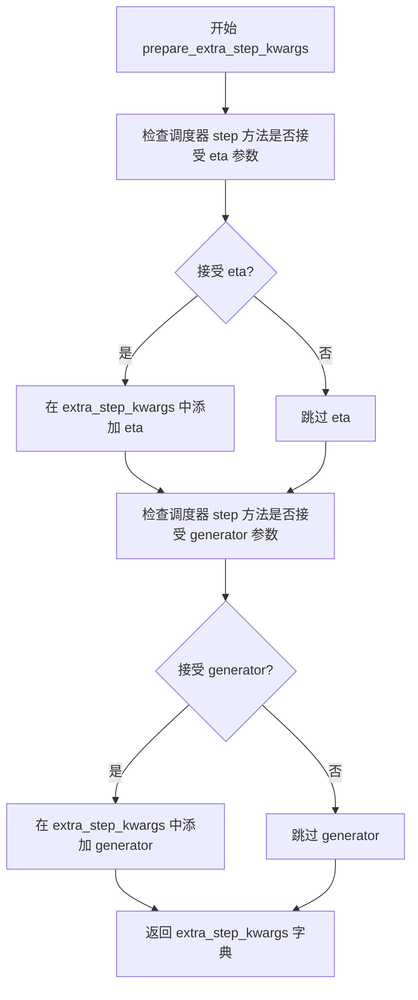

#### 带注释源码

```python
def prepare_extra_step_kwargs(self, generator, eta):
    # 准备调度器步骤的额外参数，因为并非所有调度器都具有相同的签名
    # eta (η) 仅与 DDIMScheduler 一起使用，其他调度器将忽略它
    # eta 对应 DDIM 论文中的 η：https://huggingface.co/papers/2010.02502
    # 取值应在 [0, 1] 之间
    
    # 使用 inspect 模块检查调度器的 step 方法是否接受 eta 参数
    accepts_eta = "eta" in set(inspect.signature(self.scheduler.step).parameters.keys())
    
    # 初始化额外参数字典
    extra_step_kwargs = {}
    
    # 如果调度器接受 eta 参数，则将其添加到 extra_step_kwargs
    if accepts_eta:
        extra_step_kwargs["eta"] = eta

    # 检查调度器是否接受 generator 参数
    accepts_generator = "generator" in set(inspect.signature(self.scheduler.step).parameters.keys())
    
    # 如果调度器接受 generator 参数，则将其添加到 extra_step_kwargs
    if accepts_generator:
        extra_step_kwargs["generator"] = generator
    
    # 返回准备好的额外参数字典
    return extra_step_kwargs
```


### `StableDiffusionXLControlNetPAGPipeline.check_inputs`

该方法用于验证 Stable Diffusion XL 控制网管道的所有输入参数合法性，确保 prompt、图像、控制网参数、IP Adapter 参数等的类型、形状和取值范围符合管道预期，防止在后续推理过程中因参数错误导致异常。

参数：

- `self`：`StableDiffusionXLControlNetPAGPipeline` 实例，管道对象本身
- `prompt`：`str | list[str] | None`，主文本提示，用于指导图像生成
- `prompt_2`：`str | list[str] | None`，发送给第二个分词器和文本编码器的提示，若不指定则使用 `prompt`
- `image`：`PipelineImageInput`，控制网输入图像，用于为 `unet` 提供额外条件引导
- `callback_steps`：`int | None`，回调函数的调用步数，必须为正整数
- `negative_prompt`：`str | list[str] | None`，负面提示，用于指导不包含在图像中的内容
- `negative_prompt_2`：`str | list[str] | None`，第二个负面提示，发送给第二个分词器和文本编码器
- `prompt_embeds`：`torch.Tensor | None`，预生成的文本嵌入，用于微调文本输入
- `negative_prompt_embeds`：`torch.Tensor | None`，预生成的负面文本嵌入
- `pooled_prompt_embeds`：`torch.Tensor | None`，预生成的池化文本嵌入
- `ip_adapter_image`：`PipelineImageInput | None`，IP Adapter 图像输入
- `ip_adapter_image_embeds`：`list[torch.Tensor] | None`，预生成的 IP Adapter 图像嵌入
- `negative_pooled_prompt_embeds`：`torch.Tensor | None`，预生成的负面池化文本嵌入
- `controlnet_conditioning_scale`：`float | list[float]`，控制网输出与 `unet` 残差相加前的乘数
- `control_guidance_start`：`float | list[float]`，控制网开始应用的总步数百分比
- `control_guidance_end`：`float | list[float]`，控制网停止应用的总步数百分比
- `callback_on_step_end_tensor_inputs`：`list[str] | None`，`callback_on_step_end` 函数可使用的张量输入列表

返回值：`None`，该方法仅通过抛出异常来报告错误，验证通过则不返回任何值

#### 流程图

```mermaid
flowchart TD
    A[开始 check_inputs] --> B{检查 callback_steps}
    B -->|无效| B1[抛出 ValueError]
    B -->|有效| C{检查 callback_on_step_end_tensor_inputs}
    C -->|不在列表中| C1[抛出 ValueError]
    C -->|有效| D{prompt 和 prompt_embeds 互斥}
    D -->|同时提供| D1[抛出 ValueError]
    D -->|仅一个| E{prompt_2 和 prompt_embeds 互斥}
    E -->|同时提供| E1[抛出 ValueError]
    E -->|有效| F{prompt 和 prompt_embeds 必须提供一个}
    F -->|都为空| F1[抛出 ValueError]
    F -->|有效| G{prompt 类型检查]
    G -->|类型错误| G1[抛出 ValueError]
    G -->|有效| H{prompt_2 类型检查]
    H -->|类型错误| H1[抛出 ValueError]
    H -->|有效| I{negative_prompt 和 negative_prompt_embeds 互斥]
    I -->|同时提供| I1[抛出 ValueError]
    I -->|有效| J{negative_prompt_2 和 negative_prompt_embeds 互斥]
    J -->|同时提供| J1[抛出 ValueError]
    J -->|有效| K{prompt_embeds 与 negative_prompt_embeds 形状一致性]
    K -->|不一致| K1[抛出 ValueError]
    K -->|一致| L{prompt_embeds 时必须提供 pooled_prompt_embeds]
    L -->|未提供| L1[抛出 ValueError]
    L -->|有效| M{negative_prompt_embeds 时必须提供 negative_pooled_prompt_embeds}
    M -->|未提供| M1[抛出 ValueError]
    M -->|有效| N{MultiControlNetModel 时检查 prompt 列表}
    N -->|警告| O{检查 image 参数}
    O -->|单 ControlNet| O1[调用 check_image]
    O -->|多 ControlNet| O2[检查 image 为 list 类型]
    O2 -->|嵌套列表| O2a[抛出 ValueError]
    O2 -->|长度不匹配| O2b[抛出 ValueError]
    O2 -->|有效| O3[遍历 image 调用 check_image]
    O -->|其他| O4[assert False]
    O1 --> P{检查 controlnet_conditioning_scale}
    P -->|单 ControlNet| P1[类型必须为 float]
    P -->|多 ControlNet| P2[检查 list 长度和嵌套]
    P1 -->|类型错误| P1a[抛出异常]
    P2 -->|嵌套或长度错误| P2a[抛出异常]
    P -->|有效| Q{检查 control_guidance_start/end 类型}
    Q -->|类型错误| Q1[转换为 list]
    Q -->|有效| R{检查 start/end 长度一致}
    R -->|不一致| R1[抛出 ValueError]
    R -->|一致| S{MultiControlNetModel 时检查长度匹配}
    S -->|不匹配| S1[抛出 ValueError]
    S -->|有效| T{检查 start < end 且范围 0-1}
    T -->|不满足| T1[抛出 ValueError]
    T -->|满足| U{检查 ip_adapter_image 和 ip_adapter_image_embeds 互斥}
    U -->|同时提供| U1[抛出 ValueError]
    U -->|有效| V{检查 ip_adapter_image_embeds 类型和维度}
    V -->|类型错误| V1[抛出 ValueError]
    V -->|维度错误| V2[抛出 ValueError]
    V -->|有效| W[验证通过，方法结束]
```

#### 带注释源码

```python
def check_inputs(
    self,
    prompt,                     # 主文本提示，str 或 list[str] 或 None
    prompt_2,                   # 第二文本提示，用于双文本编码器管道
    image,                      # 控制网输入图像，支持多种格式
    callback_steps,             # 回调步数，必须为正整数
    negative_prompt=None,       # 负面提示
    negative_prompt_2=None,     # 第二负面提示
    prompt_embeds=None,         # 预计算的提示嵌入
    negative_prompt_embeds=None,# 预计算的负面提示嵌入
    pooled_prompt_embeds=None,  # 池化后的提示嵌入
    ip_adapter_image=None,      # IP Adapter 图像输入
    ip_adapter_image_embeds=None,# IP Adapter 图像嵌入
    negative_pooled_prompt_embeds=None, # 负面池化嵌入
    controlnet_conditioning_scale=1.0,  # 控制网条件缩放因子
    control_guidance_start=0.0, # 控制网开始引导的步数百分比
    control_guidance_end=1.0,   # 控制网结束引导的步数百分比
    callback_on_step_end_tensor_inputs=None, # 回调函数可用的张量输入
):
    # 1. 检查 callback_steps：必须是正整数
    if callback_steps is not None and (not isinstance(callback_steps, int) or callback_steps <= 0):
        raise ValueError(
            f"`callback_steps` has to be a positive integer but is {callback_steps} of type"
            f" {type(callback_steps)}."
        )

    # 2. 检查 callback_on_step_end_tensor_inputs：必须在允许的列表中
    if callback_on_step_end_tensor_inputs is not None and not all(
        k in self._callback_tensor_inputs for k in callback_on_step_end_tensor_inputs
    ):
        raise ValueError(
            f"`callback_on_step_end_tensor_inputs` has to be in {self._callback_tensor_inputs}, but found {[k for k in callback_on_step_end_tensor_inputs if k not in self._callback_tensor_inputs]}"
        )

    # 3. 检查 prompt 和 prompt_embeds 互斥：不能同时提供
    if prompt is not None and prompt_embeds is not None:
        raise ValueError(
            f"Cannot forward both `prompt`: {prompt} and `prompt_embeds`: {prompt_embeds}. Please make sure to"
            " only forward one of the two."
        )
    # 4. 检查 prompt_2 和 prompt_embeds 互斥
    elif prompt_2 is not None and prompt_embeds is not None:
        raise ValueError(
            f"Cannot forward both `prompt_2`: {prompt_2} and `prompt_embeds`: {prompt_embeds}. Please make sure to"
            " only forward one of the two."
        )
    # 5. 检查必须提供 prompt 或 prompt_embeds 之一
    elif prompt is None and prompt_embeds is None:
        raise ValueError(
            "Provide either `prompt` or `prompt_embeds`. Cannot leave both `prompt` and `prompt_embeds` undefined."
        )
    # 6. 检查 prompt 类型：必须是 str 或 list
    elif prompt is not None and (not isinstance(prompt, str) and not isinstance(prompt, list)):
        raise ValueError(f"`prompt` has to be of type `str` or `list` but is {type(prompt)}")
    # 7. 检查 prompt_2 类型
    elif prompt_2 is not None and (not isinstance(prompt_2, str) and not isinstance(prompt_2, list)):
        raise ValueError(f"`prompt_2` has to be of type `str` or `list` but is {type(prompt_2)}")

    # 8. 检查 negative_prompt 和 negative_prompt_embeds 互斥
    if negative_prompt is not None and negative_prompt_embeds is not None:
        raise ValueError(
            f"Cannot forward both `negative_prompt`: {negative_prompt} and `negative_prompt_embeds`:"
            f" {negative_prompt_embeds}. Please make sure to only forward one of the two."
        )
    # 9. 检查 negative_prompt_2 和 negative_prompt_embeds 互斥
    elif negative_prompt_2 is not None and negative_prompt_embeds is not None:
        raise ValueError(
            f"Cannot forward both `negative_prompt_2`: {negative_prompt_2} and `negative_prompt_embeds`:"
            f" {negative_prompt_embeds}. Please make sure to only forward one of the two."
        )

    # 10. 检查 prompt_embeds 和 negative_prompt_embeds 形状一致性
    if prompt_embeds is not None and negative_prompt_embeds is not None:
        if prompt_embeds.shape != negative_prompt_embeds.shape:
            raise ValueError(
                "`prompt_embeds` and `negative_prompt_embeds` must have the same shape when passed directly, but"
                f" got: `prompt_embeds` {prompt_embeds.shape} != `negative_prompt_embeds`"
                f" {negative_prompt_embeds.shape}."
            )

    # 11. 检查提供 prompt_embeds 时必须同时提供 pooled_prompt_embeds
    if prompt_embeds is not None and pooled_prompt_embeds is None:
        raise ValueError(
            "If `prompt_embeds` are provided, `pooled_prompt_embeds` also have to be passed. Make sure to generate `pooled_prompt_embeds` from the same text encoder that was used to generate `prompt_embeds`."
        )

    # 12. 检查提供 negative_prompt_embeds 时必须同时提供 negative_pooled_prompt_embeds
    if negative_prompt_embeds is not None and negative_pooled_prompt_embeds is None:
        raise ValueError(
            "If `negative_prompt_embeds` are provided, `negative_pooled_prompt_embeds` also have to be passed. Make sure to generate `negative_pooled_prompt_embeds` from the same text encoder that was used to generate `negative_prompt_embeds`."
        )

    # 13. 多控制网时的提示处理警告
    if isinstance(self.controlnet, MultiControlNetModel):
        if isinstance(prompt, list):
            logger.warning(
                f"You have {len(self.controlnet.nets)} ControlNets and you have passed {len(prompt)}"
                " prompts. The conditionings will be fixed across the prompts."
            )

    # 14. 检查 image 参数
    is_compiled = hasattr(F, "scaled_dot_product_attention") and isinstance(
        self.controlnet, torch._dynamo.eval_frame.OptimizedModule
    )
    # 单控制网或编译后的单控制网
    if (
        isinstance(self.controlnet, ControlNetModel)
        or is_compiled
        and isinstance(self.controlnet._orig_mod, ControlNetModel)
    ):
        self.check_image(image, prompt, prompt_embeds)
    # 多控制网或编译后的多控制网
    elif (
        isinstance(self.controlnet, MultiControlNetModel)
        or is_compiled
        and isinstance(self.controlnet._orig_mod, MultiControlNetModel)
    ):
        if not isinstance(image, list):
            raise TypeError("For multiple controlnets: `image` must be type `list`")
        # 不支持嵌套列表（多批次条件）
        elif any(isinstance(i, list) for i in image):
            raise ValueError("A single batch of multiple conditionings are supported at the moment.")
        # 检查 image 数量与控制网数量一致
        elif len(image) != len(self.controlnet.nets):
            raise ValueError(
                f"For multiple controlnets: `image` must have the same length as the number of controlnets, but got {len(image)} images and {len(self.controlnet.nets)} ControlNets."
            )
        # 遍历每个 image 进行检查
        for image_ in image:
            self.check_image(image_, prompt, prompt_embeds)
    else:
        assert False

    # 15. 检查 controlnet_conditioning_scale
    if (
        isinstance(self.controlnet, ControlNetModel)
        or is_compiled
        and isinstance(self.controlnet._orig_mod, ControlNetModel)
    ):
        if not isinstance(controlnet_conditioning_scale, float):
            raise TypeError("For single controlnet: `controlnet_conditioning_scale` must be type `float`.")
    elif (
        isinstance(self.controlnet, MultiControlNetModel)
        or is_compiled
        and isinstance(self.controlnet._orig_mod, MultiControlNetModel)
    ):
        # 支持 list 类型的缩放因子
        if isinstance(controlnet_conditioning_scale, list):
            if any(isinstance(i, list) for i in controlnet_conditioning_scale):
                raise ValueError("A single batch of multiple conditionings are supported at the moment.")
        # list 长度必须与控制网数量一致
        elif isinstance(controlnet_conditioning_scale, list) and len(controlnet_conditioning_scale) != len(
            self.controlnet.nets
        ):
            raise ValueError(
                "For multiple controlnets: When `controlnet_conditioning_scale` is specified as `list`, it must have"
                " the same length as the number of controlnets"
            )
    else:
        assert False

    # 16. 标准化 control_guidance_start 和 control_guidance_end 为 list
    if not isinstance(control_guidance_start, (tuple, list)):
        control_guidance_start = [control_guidance_start]

    if not isinstance(control_guidance_end, (tuple, list)):
        control_guidance_end = [control_guidance_end]

    # 17. 检查 start 和 end 长度一致性
    if len(control_guidance_start) != len(control_guidance_end):
        raise ValueError(
            f"`control_guidance_start` has {len(control_guidance_start)} elements, but `control_guidance_end` has {len(control_guidance_end)} elements. Make sure to provide the same number of elements to each list."
        )

    # 18. 多控制网时检查长度匹配
    if isinstance(self.controlnet, MultiControlNetModel):
        if len(control_guidance_start) != len(self.controlnet.nets):
            raise ValueError(
                f"`control_guidance_start`: {control_guidance_start} has {len(control_guidance_start)} elements but there are {len(self.controlnet.nets)} controlnets available. Make sure to provide {len(self.controlnet.nets)}."
            )

    # 19. 检查 start < end 且范围在 [0, 1]
    for start, end in zip(control_guidance_start, control_guidance_end):
        if start >= end:
            raise ValueError(
                f"control guidance start: {start} cannot be larger or equal to control guidance end: {end}."
            )
        if start < 0.0:
            raise ValueError(f"control guidance start: {start} can't be smaller than 0.")
        if end > 1.0:
            raise ValueError(f"control guidance end: {end} can't be larger than 1.0.")

    # 20. 检查 ip_adapter_image 和 ip_adapter_image_embeds 互斥
    if ip_adapter_image is not None and ip_adapter_image_embeds is not None:
        raise ValueError(
            "Provide either `ip_adapter_image` or `ip_adapter_image_embeds`. Cannot leave both `ip_adapter_image` and `ip_adapter_image_embeds` defined."
        )

    # 21. 检查 ip_adapter_image_embeds 类型和维度
    if ip_adapter_image_embeds is not None:
        if not isinstance(ip_adapter_image_embeds, list):
            raise ValueError(
                f"`ip_adapter_image_embeds` has to be of type `list` but is {type(ip_adapter_image_embeds)}"
            )
        elif ip_adapter_image_embeds[0].ndim not in [3, 4]:
            raise ValueError(
                f"`ip_adapter_image_embeds` has to be a list of 3D or 4D tensors but is {ip_adapter_image_embeds[0].ndim}D"
            )
```


### `StableDiffusionXLControlNetPAGPipeline.check_image`

验证控制图像（ControlNet 输入图像）的格式是否合法，确保图像类型、维度以及与提示词批次大小的一致性。

参数：

- `self`：`StableDiffusionXLControlNetPAGPipeline` 实例本身
- `image`：`PIL.Image.Image | torch.Tensor | np.ndarray | list[PIL.Image.Image] | list[torch.Tensor] | list[np.ndarray]`，ControlNet 所需的控制图像输入，支持单张图像或图像列表
- `prompt`：`str | list[str] | None`，文本提示词，用于与图像批次大小进行校验
- `prompt_embeds`：`torch.Tensor | None`，预计算的文本嵌入向量，用于确定提示词批次大小

返回值：`None`，该方法不返回任何值，仅通过抛出异常来处理无效输入。

#### 流程图

```mermaid
flowchart TD
    A[开始 check_image] --> B{判断 image 类型}
    
    B --> C1{image 是 PIL.Image?}
    B --> C2{image 是 torch.Tensor?}
    B --> C3{image 是 np.ndarray?}
    B --> C4{image 是 PIL.Image 列表?}
    B --> C5{image 是 torch.Tensor 列表?}
    B --> C6{image 是 np.ndarray 列表?}
    B --> C7{其他类型?}
    
    C1 --> D1[设置 image_batch_size = 1]
    C2 --> D2[从 len(image) 获取 batch size]
    C3 --> D2
    C4 --> D2
    C5 --> D2
    C6 --> D2
    C7 --> E[抛出 TypeError 异常]
    
    D1 --> F{prompt 是否为 str?}
    D2 --> F
    
    F --> G1[prompt_batch_size = 1]
    F --> G2{prompt 是 list?}
    G2 --> G3[prompt_batch_size = len(prompt)]
    G2 --> G4{prompt_embeds 不为空?}
    G4 --> G5[prompt_batch_size = prompt_embeds.shape[0]]
    
    G1 --> H{image_batch_size != 1 且 != prompt_batch_size?}
    G3 --> H
    G5 --> H
    
    H --> I[抛出 ValueError: 批次大小不匹配]
    H --> J[验证通过]
    
    E --> K[结束 - 异常]
    J --> L[结束 - 验证成功]
```

#### 带注释源码

```python
def check_image(self, image, prompt, prompt_embeds):
    # 1. 检查 image 是否为合法的图像类型
    # 支持 PIL Image, torch.Tensor, numpy array, 或它们的列表形式
    image_is_pil = isinstance(image, PIL.Image.Image)
    image_is_tensor = isinstance(image, torch.Tensor)
    image_is_np = isinstance(image, np.ndarray)
    # 列表形式的图像检查
    image_is_pil_list = isinstance(image, list) and isinstance(image[0], PIL.Image.Image)
    image_is_tensor_list = isinstance(image, list) and isinstance(image[0], torch.Tensor)
    image_is_np_list = isinstance(image, list) and isinstance(image[0], np.ndarray)

    # 2. 如果图像类型不在支持列表中，抛出 TypeError
    if (
        not image_is_pil
        and not image_is_tensor
        and not image_is_np
        and not image_is_pil_list
        and not image_is_tensor_list
        and not image_is_np_list
    ):
        raise TypeError(
            f"image must be passed and be one of PIL image, numpy array, torch tensor, "
            f"list of PIL images, list of numpy arrays or list of torch tensors, "
            f"but is {type(image)}"
        )

    # 3. 确定图像的批次大小
    # 单张 PIL Image 批次大小为 1，否则从列表长度获取
    if image_is_pil:
        image_batch_size = 1
    else:
        image_batch_size = len(image)

    # 4. 确定提示词的批次大小
    if prompt is not None and isinstance(prompt, str):
        prompt_batch_size = 1
    elif prompt is not None and isinstance(prompt, list):
        prompt_batch_size = len(prompt)
    elif prompt_embeds is not None:
        prompt_batch_size = prompt_embeds.shape[0]

    # 5. 验证图像批次大小与提示词批次大小的一致性
    # 批次大小必须匹配（除非其中一个为 1，表示单样本）
    if image_batch_size != 1 and image_batch_size != prompt_batch_size:
        raise ValueError(
            f"If image batch size is not 1, image batch size must be same as prompt batch size. "
            f"image batch size: {image_batch_size}, prompt batch size: {prompt_batch_size}"
        )
```


### `StableDiffusionXLControlNetPAGPipeline.prepare_image`

该方法负责将输入的控制图像（ControlNet conditioning image）进行预处理，包括尺寸调整、批处理扩展和数据类型转换，以适配Stable Diffusion XL模型的输入要求。

参数：

- `image`：`PipelineImageInput`，待处理控制图像，支持PIL.Image.Image、torch.Tensor、np.ndarray或它们的列表形式
- `width`：`int`，目标输出宽度（像素）
- `height`：`int`，目标输出高度（像素）
- `batch_size`：`int`，批处理大小，用于确定图像重复次数
- `num_images_per_prompt`：`int`，每个提示词生成的图像数量
- `device`：`torch.device`，目标设备（CPU/CUDA）
- `dtype`：`torch.dtype`，目标数据类型
- `do_classifier_free_guidance`：`bool`，是否启用无分类器自由引导（默认为False）
- `guess_mode`：`bool`，猜测模式标志（默认为False）

返回值：`torch.Tensor`，预处理后的控制图像张量，形状为 [batch_size, channels, height, width]

#### 流程图

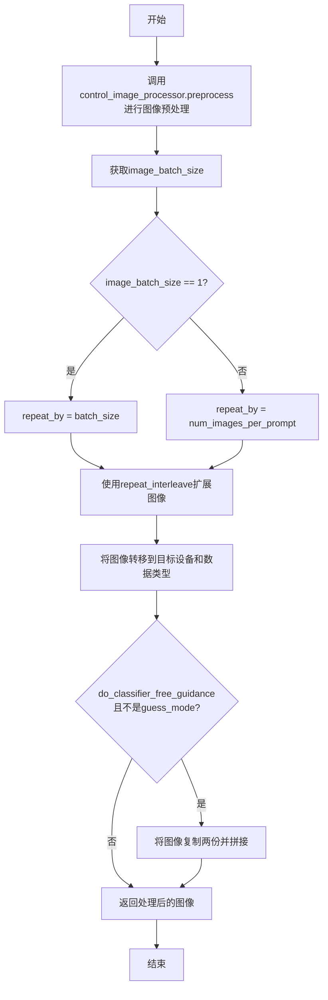

#### 带注释源码

```python
def prepare_image(
    self,
    image,
    width,
    height,
    batch_size,
    num_images_per_prompt,
    device,
    dtype,
    do_classifier_free_guidance=False,
    guess_mode=False,
):
    """
    预处理控制图像以适配ControlNet输入格式
    
    处理流程：
    1. 使用VaeImageProcessor进行尺寸调整和归一化
    2. 根据batch_size和num_images_per_prompt扩展图像维度
    3. 转移至目标设备和数据类型
    4. 如果启用无分类器引导，复制图像用于条件/非条件输入
    """
    
    # 步骤1：预处理图像 - 调整尺寸并归一化
    # 使用control_image_processor进行预处理，将图像转换为float32张量
    image = self.control_image_processor.preprocess(image, height=height, width=width).to(dtype=torch.float32)
    
    # 获取预处理后图像的批次大小
    image_batch_size = image.shape[0]

    # 步骤2：确定图像重复次数
    if image_batch_size == 1:
        # 单张图像时，按总批处理大小重复
        repeat_by = batch_size
    else:
        # 图像批次大小与提示词批次大小相同时，按每提示词图像数重复
        repeat_by = num_images_per_prompt

    # 使用repeat_interleave沿批次维度重复图像
    image = image.repeat_interleave(repeat_by, dim=0)

    # 步骤3：转移至目标设备和数据类型
    image = image.to(device=device, dtype=dtype)

    # 步骤4：无分类器自由引导处理
    # 当启用CFG且不在guess_mode时，需要同时提供条件和非条件图像
    if do_classifier_free_guidance and not guess_mode:
        # 将图像复制两份并拼接：前半为非条件，后半为条件
        image = torch.cat([image] * 2)

    return image
```


### `StableDiffusionXLControlNetPAGPipeline.prepare_latents`

准备初始噪声潜在向量，用于图像生成的去噪过程。该方法根据批大小、图像尺寸和VAE缩放因子计算潜在向量的形状，并使用随机张量生成器或直接使用提供的潜在向量进行初始化，最后根据调度器的初始噪声标准差进行缩放。

参数：

- `batch_size`：`int`，生成的图像批处理大小
- `num_channels_latents`：`int`，潜在向量的通道数，通常对应于UNet的输入通道数
- `height`：`int`，生成图像的高度（像素）
- `width`：`int`，生成图像的宽度（像素）
- `dtype`：`torch.dtype`，潜在向量的数据类型
- `device`：`torch.device`，潜在向量所在的设备
- `generator`：`torch.Generator` 或 `list[torch.Generator]`，可选的随机数生成器，用于确保可重复性
- `latents`：`torch.Tensor` 或 `None`，可选的预生成潜在向量，如果为None则随机生成

返回值：`torch.Tensor`，初始化并缩放后的潜在向量

#### 流程图

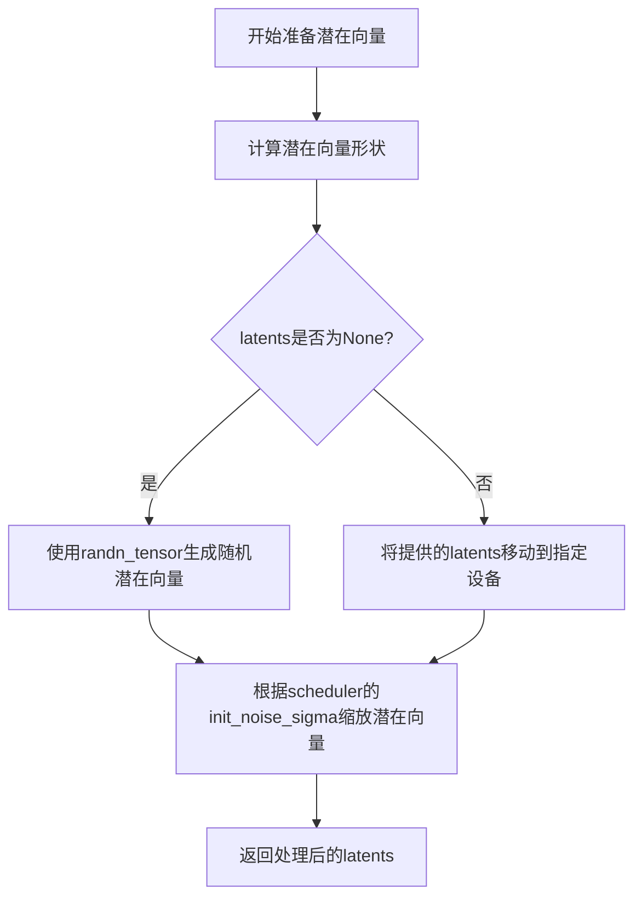

#### 带注释源码

```python
def prepare_latents(
    self,
    batch_size: int,
    num_channels_latents: int,
    height: int,
    width: int,
    dtype: torch.dtype,
    device: torch.device,
    generator: torch.Generator | list[torch.Generator] | None,
    latents: torch.Tensor | None = None
) -> torch.Tensor:
    """
    准备用于图像生成的初始潜在向量。
    
    Args:
        batch_size: 批处理大小，即每次生成图像的数量
        num_channels_latents: 潜在向量的通道数，通常等于UNet的in_channels
        height: 输出图像的高度（像素）
        width: 输出图像的宽度（像素）
        dtype: 潜在向量的数据类型
        device: 潜在向量应放置的设备
        generator: 用于生成随机数的生成器，确保可重复性
        latents: 可选的预生成潜在向量，如果为None则随机生成
    
    Returns:
        初始化并缩放后的潜在向量张量
    """
    # 计算潜在向量的形状：批次大小 × 通道数 × (高度/VAE缩放因子) × (宽度/VAE缩放因子)
    # VAE将图像压缩到潜在空间，因此潜在向量的尺寸是图像尺寸除以VAE缩放因子
    shape = (
        batch_size,
        num_channels_latents,
        int(height) // self.vae_scale_factor,
        int(width) // self.vae_scale_factor,
    )
    
    # 验证生成器列表长度与批大小是否匹配
    if isinstance(generator, list) and len(generator) != batch_size:
        raise ValueError(
            f"You have passed a list of generators of length {len(generator)}, but requested an effective batch"
            f" size of {batch_size}. Make sure the batch size matches the length of the generators."
        )

    # 根据是否有预生成的潜在向量来决定初始化方式
    if latents is None:
        # 使用randn_tensor生成符合正态分布的随机潜在向量
        latents = randn_tensor(shape, generator=generator, device=device, dtype=dtype)
    else:
        # 如果提供了潜在向量，则确保其位于正确的设备上
        latents = latents.to(device)

    # 根据调度器的初始噪声标准差缩放潜在向量
    # 不同调度器可能需要不同的初始噪声水平，这由scheduler.init_noise_sigma定义
    latents = latents * self.scheduler.init_noise_sigma
    
    return latents
```


### `StableDiffusionXLControlNetPAGPipeline._get_add_time_ids`

该方法用于获取Stable Diffusion XL的额外时间ID（Additional Time IDs），这些时间ID包含了图像的原始尺寸、裁剪坐标和目标尺寸信息，是SDXL微条件（micro-conditioning）的重要组成部分，用于增强模型对图像尺寸和裁剪信息的理解。

参数：

- `self`：`StableDiffusionXLControlNetPAGPipeline`，Pipeline实例本身
- `original_size`：`tuple[int, int]`，原始图像尺寸，格式为(height, width)
- `crops_coords_top_left`：`tuple[int, int]`，裁剪坐标左上角位置，格式为(y, x)
- `target_size`：`tuple[int, int]`，目标生成图像尺寸，格式为(height, width)
- `dtype`：`torch.dtype`，返回张量的数据类型
- `text_encoder_projection_dim`：`int | None`，文本编码器的投影维度，用于计算嵌入维度

返回值：`torch.Tensor`，形状为(1, 6)的张量，包含6个时间ID值（原始尺寸2个 + 裁剪坐标2个 + 目标尺寸2个）

#### 流程图

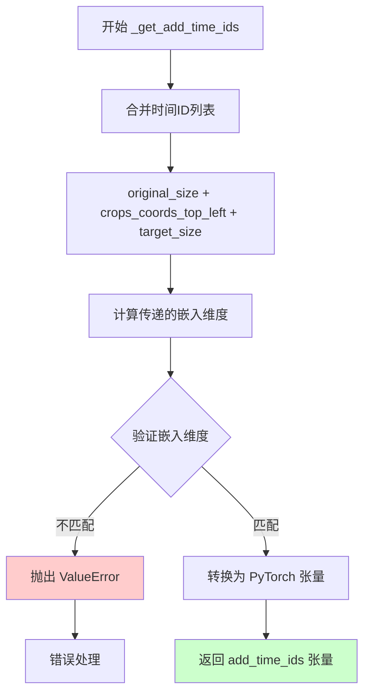

#### 带注释源码

```python
def _get_add_time_ids(
    self, original_size, crops_coords_top_left, target_size, dtype, text_encoder_projection_dim=None
):
    """
    获取额外的時間ID，用於SDXL的條件生成。
    
    這些時間ID包含了圖像的原始尺寸、裁剪坐標和目標尺寸信息，
    是SDXL微條件（micro-conditioning）的重要組成部分。
    
    參數:
        original_size: 原始圖像尺寸 (height, width)
        crops_coords_top_left: 裁剪坐標左上角 (y, x)
        target_size: 目標生成尺寸 (height, width)
        dtype: 返回張量的數據類型
        text_encoder_projection_dim: 文本編碼器投影維度
    
    返回:
        包含6個時間ID值的張量，形狀為 (1, 6)
    """
    
    # 步驟1: 將三個尺寸參數合併為一個列表
    # original_size: (h, w) - 2個值
    # crops_coords_top_left: (y, x) - 2個值  
    # target_size: (h, w) - 2個值
    # 總共6個值
    add_time_ids = list(original_size + crops_coords_top_left + target_size)

    # 步驟2: 計算傳遞給UNet的嵌入維度
    # addition_time_embed_dim 是UNet配置中的時間嵌入維度
    # 乘以時間ID的數量（3個tuple，每個2個值 = 6）
    # 加上文本編碼器的投影維度
    passed_add_embed_dim = (
        self.unet.config.addition_time_embed_dim * len(add_time_ids) + text_encoder_projection_dim
    )
    
    # 步驟3: 從UNet配置中獲取期望的嵌入維度
    # add_embedding.linear_1.in_features 是第一個線性層的輸入特徵數
    expected_add_embed_dim = self.unet.add_embedding.linear_1.in_features

    # 步驟4: 驗證維度是否匹配
    # 如果不匹配，說明模型配置有問題
    if expected_add_embed_dim != passed_add_embed_dim:
        raise ValueError(
            f"Model expects an added time embedding vector of length {expected_add_embed_dim}, but a vector of {passed_add_embed_dim} was created. The model has an incorrect config. Please check `unet.config.time_embedding_type` and `text_encoder_2.config.projection_dim`."
        )

    # 步驟5: 將列表轉換為PyTorch張量
    # 形狀: (1, 6) - 批量大小為1，6個時間ID值
    add_time_ids = torch.tensor([add_time_ids], dtype=dtype)
    
    # 返回時間ID張量
    # 這個張量後續會與其他條件嵌入一起傳遞給UNet
    return add_time_ids
```


### `StableDiffusionXLControlNetPAGPipeline.get_guidance_scale_embedding`

获取引导尺度嵌入，用于将引导尺度（guidance scale）转换为时间步嵌入向量，以便在去噪过程中增强模型对引导尺度的条件反应。

参数：

-  `self`：类的实例方法隐含参数
-  `w`：`torch.Tensor`，一维张量，用于生成嵌入向量的引导尺度值
-  `embedding_dim`：`int`，可选，默认值为 512，生成嵌入向量的维度
-  `dtype`：`torch.dtype`，可选，默认值为 `torch.float32`，生成嵌入的数据类型

返回值：`torch.Tensor`，形状为 `(len(w), embedding_dim)` 的嵌入向量

#### 流程图

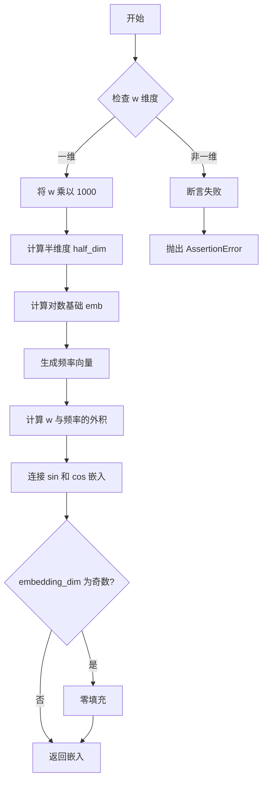

#### 带注释源码

```
# 从 latent_consistency_models.pipeline_latent_consistency_text2img.LatentConsistencyModelPipeline.get_guidance_scale_embedding 复制
def get_guidance_scale_embedding(
    self, w: torch.Tensor, embedding_dim: int = 512, dtype: torch.dtype = torch.float32
) -> torch.Tensor:
    """
    基于 VDM 论文生成引导尺度嵌入向量
    参考: https://github.com/google-research/vdm/blob/dc27b98a554f65cdc654b800da5aa1846545d41b/model_vdm.py#L298

    参数:
        w: 用于生成嵌入向量的引导尺度张量
        embedding_dim: 嵌入向量的维度，默认为 512
        dtype: 生成嵌入的数据类型，默认为 torch.float32

    返回:
        形状为 (len(w), embedding_dim) 的嵌入向量张量
    """
    # 确保输入是一维张量
    assert len(w.shape) == 1
    
    # 将引导尺度放大 1000 倍，以获得更好的数值范围
    w = w * 1000.0

    # 计算嵌入维度的一半（因为使用 sin 和 cos 两种频率）
    half_dim = embedding_dim // 2
    
    # 计算对数基础，用于生成频率向量
    # 使用 log(10000) / (half_dim - 1) 作为基础频率
    emb = torch.log(torch.tensor(10000.0)) / (half_dim - 1)
    
    # 生成指数递减的频率向量
    emb = torch.exp(torch.arange(half_dim, dtype=dtype) * -emb)
    
    # 计算输入 w 与频率向量的外积
    # 将 w 扩展为列向量，emb 扩展为行向量，进行元素级乘法
    emb = w.to(dtype)[:, None] * emb[None, :]
    
    # 连接 sin 和 cos 嵌入，形成完整的周期嵌入
    emb = torch.cat([torch.sin(emb), torch.cos(emb)], dim=1)
    
    # 如果 embedding_dim 为奇数，需要零填充以达到指定维度
    if embedding_dim % 2 == 1:
        emb = torch.nn.functional.pad(emb, (0, 1))
    
    # 验证输出形状是否正确
    assert emb.shape == (w.shape[0], embedding_dim)
    
    return emb
```


### `StableDiffusionXLControlNetPAGPipeline.__call__`

这是Stable Diffusion XL与ControlNet和PAG（Perturbed Attention Guidance）结合的图像生成管道的主方法。该方法接收文本提示和可选的ControlNet条件图像，执行完整的去噪推理过程，生成与文本描述相符的图像。支持多种高级功能，如IP-Adapter、LoRA、分类器自由引导、时间控制等。

参数：

- `prompt`：`str | list[str] | None`，用于指导图像生成的主要提示词
- `prompt_2`：`str | list[str] | None`，发送给第二个tokenizer和text_encoder的提示词
- `image`：`PipelineImageInput | None`，ControlNet输入条件图像，用于引导unet生成
- `height`：`int | None`，生成图像的高度（像素），默认为unet.config.sample_size * vae_scale_factor
- `width`：`int | None`，生成图像的宽度（像素），默认为unet.config.sample_size * vae_scale_factor
- `num_inference_steps`：`int`，去噪步数，默认为50
- `timesteps`：`list[int] | None`，自定义时间步，用于支持timesteps的scheduler
- `sigmas`：`list[float] | None`，自定义sigma值，用于支持sigmas的scheduler
- `denoising_end`：`float | None`，去噪过程结束的点（0.0-1.0之间的分数）
- `guidance_scale`：`float`，引导比例，控制图像与提示词的相关性，默认为5.0
- `negative_prompt`：`str | list[str] | None`，负面提示词，指定不想包含的内容
- `negative_prompt_2`：`str | list[str] | None`，第二个负面提示词
- `num_images_per_prompt`：`int | None`，每个提示词生成的图像数量，默认为1
- `eta`：`float`，DDIM论文中的η参数，仅DDIMScheduler使用，默认为0.0
- `generator`：`torch.Generator | list[torch.Generator] | None`，随机生成器，用于确保可重复生成
- `latents`：`torch.Tensor | None`，预生成的噪声潜在向量，用于相同的生成不同提示词
- `prompt_embeds`：`torch.Tensor | None`，预生成的文本嵌入，用于提示词加权
- `negative_prompt_embeds`：`torch.Tensor | None`，预生成的负面文本嵌入
- `pooled_prompt_embeds`：`torch.Tensor | None`，预生成的池化文本嵌入
- `negative_pooled_prompt_embeds`：`torch.Tensor | None`，预生成的负面池化文本嵌入
- `ip_adapter_image`：`PipelineImageInput | None`，IP-Adapter的图像输入
- `ip_adapter_image_embeds`：`list[torch.Tensor] | None`，预生成的IP-Adapter图像嵌入
- `output_type`：`str | None`，输出格式，默认为"pil"
- `return_dict`：`bool`，是否返回PipelineOutput对象，默认为True
- `cross_attention_kwargs`：`dict[str, Any] | None`，传递给AttentionProcessor的参数字典
- `controlnet_conditioning_scale`：`float | list[float]`，ControlNet输出乘以的比例因子
- `control_guidance_start`：`float | list[float]`，ControlNet开始应用的步骤百分比
- `control_guidance_end`：`float | list[float]`，ControlNet停止应用的步骤百分比
- `original_size`：`tuple[int, int] | None`，原始尺寸，用于SDXL微条件
- `crops_coords_top_left`：`tuple[int, int]`，裁剪坐标左上角，默认为(0, 0)
- `target_size`：`tuple[int, int] | None`，目标尺寸，用于SDXL微条件
- `negative_original_size`：`tuple[int, int] | None`，负面原始尺寸
- `negative_crops_coords_top_left`：`tuple[int, int]`，负面裁剪坐标
- `negative_target_size`：`tuple[int, int] | None`，负面目标尺寸
- `clip_skip`：`int | None`，CLIP计算提示词嵌入时跳过的层数
- `callback_on_step_end`：`Callable | PipelineCallback | MultiPipelineCallbacks | None`，每个去噪步骤结束时调用的函数
- `callback_on_step_end_tensor_inputs`：`list[str]`，回调函数的张量输入列表
- `pag_scale`：`float`，受扰动引导的比例因子，默认为3.0
- `pag_adaptive_scale`：`float`，受扰动引导的自适应比例因子，默认为0.0

返回值：`StableDiffusionXLPipelineOutput | tuple`，生成的图像输出

#### 流程图

```mermaid
flowchart TD
    A[开始 __call__] --> B[检查并格式化控制引导参数]
    B --> C[验证输入参数 check_inputs]
    C --> D[设置引导比例和PAG参数]
    D --> E[定义批次大小]
    E --> F[编码输入提示词 encode_prompt]
    F --> G{是否有IP-Adapter?}
    G -->|是| H[准备IP-Adapter图像嵌入]
    G -->|否| I[准备ControlNet条件图像]
    H --> I
    I --> J[准备时间步 retrieve_timesteps]
    J --> K[准备潜在向量 prepare_latents]
    K --> L[获取引导尺度嵌入 get_guidance_scale_embedding]
    L --> M[准备额外步骤参数 prepare_extra_step_kwargs]
    M --> N[计算ControlNet保留权重]
    N --> O[准备添加的时间ID和嵌入]
    O --> P[准备PAG条件图像]
    P --> Q[应用PAG或CFG到提示词嵌入]
    Q --> R[设置去噪循环]
    R --> S[迭代去噪]
    S --> T[扩展潜在向量]
    T --> U[调度器缩放模型输入]
    U --> V[ControlNet推理]
    V --> W[UNet预测噪声残差]
    W --> X{是否使用PAG?}
    X -->|是| Y[应用受扰动引导]
    X -->|否| Z{是否使用CFG?}
    Y --> AA[执行分类器自由引导]
    Z -->|是| AA
    Z -->|否| AB
    AA --> AC[调度器步骤计算前一潜在向量]
    AB --> AC
    AC --> AD[回调函数]
    AD --> AE{是否还有时间步?}
    AE -->|是| S
    AE -->|否| AF[去噪完成]
    AF --> AG{output_type是否为latent?}
    AG -->|否| AH[VAE解码]
    AG -->|是| AI[使用潜在向量]
    AH --> AJ[应用水印]
    AJ --> AK[后处理图像]
    AK --> AL[卸载模型]
    AI --> AL
    AL --> AM{return_dict?}
    AM -->|是| AN[返回PipelineOutput]
    AM -->|否| AO[返回元组]
    AN --> AP[结束]
    AO --> AP
```

#### 带注释源码

```python
@torch.no_grad()
@replace_example_docstring(EXAMPLE_DOC_STRING)
def __call__(
    self,
    prompt: str | list[str] = None,
    prompt_2: str | list[str] | None = None,
    image: PipelineImageInput = None,
    height: int | None = None,
    width: int | None = None,
    num_inference_steps: int = 50,
    timesteps: list[int] = None,
    sigmas: list[float] = None,
    denoising_end: float | None = None,
    guidance_scale: float = 5.0,
    negative_prompt: str | list[str] | None = None,
    negative_prompt_2: str | list[str] | None = None,
    num_images_per_prompt: int | None = 1,
    eta: float = 0.0,
    generator: torch.Generator | list[torch.Generator] | None = None,
    latents: torch.Tensor | None = None,
    prompt_embeds: torch.Tensor | None = None,
    negative_prompt_embeds: torch.Tensor | None = None,
    pooled_prompt_embeds: torch.Tensor | None = None,
    negative_pooled_prompt_embeds: torch.Tensor | None = None,
    ip_adapter_image: PipelineImageInput | None = None,
    ip_adapter_image_embeds: list[torch.Tensor] | None = None,
    output_type: str | None = "pil",
    return_dict: bool = True,
    cross_attention_kwargs: dict[str, Any] | None = None,
    controlnet_conditioning_scale: float | list[float] = 1.0,
    control_guidance_start: float | list[float] = 0.0,
    control_guidance_end: float | list[float] = 1.0,
    original_size: tuple[int, int] = None,
    crops_coords_top_left: tuple[int, int] = (0, 0),
    target_size: tuple[int, int] = None,
    negative_original_size: tuple[int, int] | None = None,
    negative_crops_coords_top_left: tuple[int, int] = (0, 0),
    negative_target_size: tuple[int, int] | None = None,
    clip_skip: int | None = None,
    callback_on_step_end: Callable[[int, int], None] | PipelineCallback | MultiPipelineCallbacks | None = None,
    callback_on_step_end_tensor_inputs: list[str] = ["latents"],
    pag_scale: float = 3.0,
    pag_adaptive_scale: float = 0.0,
):
    r"""
    执行管道生成的主方法。

    Args:
        prompt: 主要提示词
        prompt_2: 第二个文本编码器的提示词
        image: ControlNet条件图像
        height/width: 输出图像尺寸
        num_inference_steps: 去噪步数
        timesteps/sigmas: 自定义调度参数
        denoising_end: 提前终止去噪的比例
        guidance_scale: CFG引导强度
        negative_prompt/negative_prompt_2: 负面提示词
        num_images_per_prompt: 每个提示生成的图像数
        eta: DDIM参数
        generator: 随机数生成器
        latents: 预计算的噪声潜在向量
        prompt_embeds/negative_prompt_embeds: 预计算的文本嵌入
        pooled_prompt_embeds: 池化后的文本嵌入
        ip_adapter_image/ip_adapter_image_embeds: IP-Adapter相关参数
        output_type: 输出格式
        return_dict: 是否返回字典格式
        cross_attention_kwargs: 交叉注意力额外参数
        controlnet_conditioning_scale: ControlNet强度
        control_guidance_start/end: ControlNet应用时间范围
        original_size/target_size: SDXL尺寸条件
        clip_skip: CLIP跳过的层数
        callback_on_step_end: 步骤结束回调
        pag_scale/pag_adaptive_scale: PAG引导参数

    Returns:
        StableDiffusionXLPipelineOutput或tuple: 生成的图像
    """
    # 处理回调函数格式
    if isinstance(callback_on_step_end, (PipelineCallback, MultiPipelineCallbacks)):
        callback_on_step_end_tensor_inputs = callback_on_step_end.tensor_inputs

    # 获取原始ControlNet模块（处理torch.compile情况）
    controlnet = self.controlnet._orig_mod if is_compiled_module(self.controlnet) else self.controlnet

    # 对控制引导参数进行格式化对齐
    if not isinstance(control_guidance_start, list) and isinstance(control_guidance_end, list):
        control_guidance_start = len(control_guidance_end) * [control_guidance_start]
    elif not isinstance(control_guidance_end, list) and isinstance(control_guidance_start, list):
        control_guidance_end = len(control_guidance_start) * [control_guidance_end]
    elif not isinstance(control_guidance_start, list) and not isinstance(control_guidance_end, list):
        mult = len(controlnet.nets) if isinstance(controlnet, MultiControlNetModel) else 1
        control_guidance_start, control_guidance_end = (
            mult * [control_guidance_start],
            mult * [control_guidance_end],
        )

    # 1. 检查输入参数
    self.check_inputs(...)

    # 2. 设置引导参数
    self._guidance_scale = guidance_scale
    self._clip_skip = clip_skip
    self._cross_attention_kwargs = cross_attention_kwargs
    self._denoising_end = denoising_end
    self._pag_scale = pag_scale
    self._pag_adaptive_scale = pag_adaptive_scale

    # 3. 定义批次大小
    if prompt is not None and isinstance(prompt, str):
        batch_size = 1
    elif prompt is not None and isinstance(prompt, list):
        batch_size = len(prompt)
    else:
        batch_size = prompt_embeds.shape[0]

    device = self._execution_device

    # 4. 编码输入提示词
    (
        prompt_embeds,
        negative_prompt_embeds,
        pooled_prompt_embeds,
        negative_pooled_prompt_embeds,
    ) = self.encode_prompt(...)

    # 5. 编码IP-Adapter图像
    if ip_adapter_image is not None or ip_adapter_image_embeds is not None:
        ip_adapter_image_embeds = self.prepare_ip_adapter_image_embeds(...)

    # 6. 准备ControlNet条件图像
    if isinstance(controlnet, ControlNetModel):
        image = self.prepare_image(...)
        height, width = image.shape[-2:]
    elif isinstance(controlnet, MultiControlNetModel):
        # 处理多个ControlNet
        images = []
        for image_ in image:
            image_ = self.prepare_image(...)
            images.append(image_)
        image = images
        height, width = image[0].shape[-2:]

    # 7. 准备时间步
    timesteps, num_inference_steps = retrieve_timesteps(self.scheduler, num_inference_steps, ...)
    self._num_timesteps = len(timesteps)

    # 8. 准备潜在向量
    latents = self.prepare_latents(...)

    # 9. 准备引导尺度嵌入（如果需要）
    timestep_cond = None
    if self.unet.config.time_cond_proj_dim is not None:
        guidance_scale_tensor = torch.tensor(self.guidance_scale - 1).repeat(batch_size * num_images_per_prompt)
        timestep_cond = self.get_guidance_scale_embedding(...)

    # 10. 准备额外步骤参数
    extra_step_kwargs = self.prepare_extra_step_kwargs(generator, eta)

    # 11. 创建ControlNet保留权重
    controlnet_keep = []
    for i in range(len(timesteps)):
        keeps = [
            1.0 - float(i / len(timesteps) < s or (i + 1) / len(timesteps) > e)
            for s, e in zip(control_guidance_start, control_guidance_end)
        ]
        controlnet_keep.append(keeps[0] if isinstance(controlnet, ControlNetModel) else keeps)

    # 12. 准备添加的时间ID和嵌入
    add_text_embeds = pooled_prompt_embeds
    add_time_ids = self._get_add_time_ids(...)
    # 处理负面条件
    if negative_original_size is not None:
        negative_add_time_ids = self._get_add_time_ids(...)
    else:
        negative_add_time_ids = add_time_ids

    # 13. 准备PAG条件图像
    images = image if isinstance(image, list) else [image]
    for i, single_image in enumerate(images):
        if self.do_classifier_free_guidance:
            single_image = single_image.chunk(2)[0]

        if self.do_perturbed_attention_guidance:
            single_image = self._prepare_perturbed_attention_guidance(...)
        elif self.do_classifier_free_guidance:
            single_image = torch.cat([single_image] * 2)
        
        single_image = single_image.to(device)
        images[i] = single_image
    image = images if isinstance(image, list) else images[0]

    # 14. 处理IP-Adapter嵌入
    if ip_adapter_image_embeds is not None:
        for i, image_embeds in enumerate(ip_adapter_image_embeds):
            negative_image_embeds = None
            if self.do_classifier_free_guidance:
                negative_image_embeds, image_embeds = image_embeds.chunk(2)
            
            if self.do_perturbed_attention_guidance:
                image_embeds = self._prepare_perturbed_attention_guidance(...)
            elif self.do_classifier_free_guidance:
                image_embeds = torch.cat([negative_image_embeds, image_embeds], dim=0)
            
            ip_adapter_image_embeds[i] = image_embeds.to(device)

    # 15. 应用PAG或CFG到提示词嵌入
    if self.do_perturbed_attention_guidance:
        prompt_embeds = self._prepare_perturbed_attention_guidance(...)
        add_text_embeds = self._prepare_perturbed_attention_guidance(...)
        add_time_ids = self._prepare_perturbed_attention_guidance(...)
    elif self.do_classifier_free_guidance:
        prompt_embeds = torch.cat([negative_prompt_embeds, prompt_embeds], dim=0)
        add_text_embeds = torch.cat([negative_pooled_prompt_embeds, add_text_embeds], dim=0)
        add_time_ids = torch.cat([negative_add_time_ids, add_time_ids], dim=0)

    # 准备控制网络条件
    prompt_embeds = prompt_embeds.to(device)
    add_text_embeds = add_text_embeds.to(device)
    add_time_ids = add_time_ids.to(device).repeat(batch_size * num_images_per_prompt, 1)
    added_cond_kwargs = {"text_embeds": add_text_embeds, "time_ids": add_time_ids}
    controlnet_prompt_embeds = prompt_embeds
    controlnet_added_cond_kwargs = added_cond_kwargs

    # 16. 设置PAG注意力处理器
    if self.do_perturbed_attention_guidance:
        original_attn_proc = self.unet.attn_processors
        self._set_pag_attn_processor(...)

    # 17. 去噪循环
    num_warmup_steps = len(timesteps) - num_inference_steps * self.scheduler.order

    # 处理去噪结束参数
    if self.denoising_end is not None and ...:
        discrete_timestep_cutoff = int(...)
        num_inference_steps = len(list(filter(lambda ts: ts >= discrete_timestep_cutoff, timesteps)))
        timesteps = timesteps[:num_inference_steps]

    is_unet_compiled = is_compiled_module(self.unet)
    is_controlnet_compiled = is_compiled_module(self.controlnet)

    with self.progress_bar(total=num_inference_steps) as progress_bar:
        for i, t in enumerate(timesteps):
            # CUDA图优化
            if torch.cuda.is_available() and is_unet_compiled and is_controlnet_compiled:
                torch._inductor.cudagraph_mark_step_begin()
            
            # 扩展潜在向量（用于CFG）
            latent_model_input = torch.cat([latents] * (prompt_embeds.shape[0] // latents.shape[0]))
            latent_model_input = self.scheduler.scale_model_input(latent_model_input, t)

            # ControlNet推理
            down_block_res_samples, mid_block_res_sample = self.controlnet(
                control_model_input,
                t,
                encoder_hidden_states=controlnet_prompt_embeds,
                controlnet_cond=image,
                conditioning_scale=cond_scale,
                ...
            )

            # 添加IP-Adapter图像嵌入
            if ip_adapter_image_embeds is not None:
                added_cond_kwargs["image_embeds"] = ip_adapter_image_embeds

            # UNet预测噪声
            noise_pred = self.unet(
                latent_model_input,
                t,
                encoder_hidden_states=prompt_embeds,
                timestep_cond=timestep_cond,
                cross_attention_kwargs=self.cross_attention_kwargs,
                down_block_additional_residuals=down_block_res_samples,
                mid_block_additional_residual=mid_block_res_sample,
                added_cond_kwargs=added_cond_kwargs,
                ...
            )[0]

            # 执行引导
            if self.do_perturbed_attention_guidance:
                noise_pred = self._apply_perturbed_attention_guidance(...)
            elif self.do_classifier_free_guidance:
                noise_pred_uncond, noise_pred_text = noise_pred.chunk(2)
                noise_pred = noise_pred_uncond + guidance_scale * (noise_pred_text - noise_pred_uncond)

            # 调度器步骤
            latents = self.scheduler.step(noise_pred, t, latents, **extra_step_kwargs)[0]

            # 回调处理
            if callback_on_step_end is not None:
                callback_kwargs = {}
                for k in callback_on_step_end_tensor_inputs:
                    callback_kwargs[k] = locals()[k]
                callback_outputs = callback_on_step_end(self, i, t, callback_kwargs)
                # 更新变量
                latents = callback_outputs.pop("latents", latents)
                ...

            # 更新进度条
            if i == len(timesteps) - 1 or ((i + 1) > num_warmup_steps and (i + 1) % self.scheduler.order == 0):
                progress_bar.update()

    # 18. 后处理
    if not output_type == "latent":
        # VAE解码
        needs_upcasting = self.vae.dtype == torch.float16 and self.vae.config.force_upcast
        if needs_upcasting:
            self.upcast_vae()
        
        # 反标准化潜在向量
        if has_latents_mean and has_latents_std:
            latents = latents * latents_std / self.vae.config.scaling_factor + latents_mean
        else:
            latents = latents / self.vae.config.scaling_factor

        image = self.vae.decode(latents)[0]

        # 应用水印
        if self.watermark is not None:
            image = self.watermark.apply_watermark(image)

        # 后处理图像
        image = self.image_processor.postprocess(image, output_type=output_type)
    else:
        image = latents

    # 19. 清理资源
    self.maybe_free_model_hooks()

    # 恢复注意力处理器
    if self.do_perturbed_attention_guidance:
        self.unet.set_attn_processor(original_attn_proc)

    # 20. 返回结果
    if not return_dict:
        return (image,)

    return StableDiffusionXLPipelineOutput(images=image)
```

## 关键组件


### 张量索引与惰性加载

该管道使用多种张量操作来实现高效的内存使用和计算。通过`randn_tensor`生成潜在变量，并在不同阶段使用`torch.concat`、`chunk`等方法对张量进行索引和拼接，避免不必要的数据复制。

### 反量化支持

`upcast_vae`方法实现了VAE的反量化功能，将模型从float16转换为float32以避免溢出。此外，管道在解码阶段会根据需要将VAE从float16转换为float32，完成后再转回float16。

### 量化策略

管道集成了LoRA和PEFT后端支持。通过`scale_lora_layers`和`unscale_lora_layers`函数动态调整LoRA权重，实现量化模型的灵活加载和卸载。文本编码器根据可用性选择适当的dtype（float16或unet.dtype）进行计算。

## 问题及建议


### 已知问题

-   **方法过长且复杂**：`__call__` 方法超过 300 行，包含过多的逻辑分支和状态处理，难以维护和调试
-   **代码重复**：`encode_prompt` 方法中处理两个文本编码器的逻辑大量重复，可以提取为独立函数
- **类型检查冗余**：大量使用 `isinstance` 进行运行时类型检查，可以使用类型提示和早期断言优化
- **硬编码配置**：`pag_scale=3.0`、`pag_adplive_scale=0.0` 等参数硬编码在方法签名中，缺少统一的配置管理
- **设备传输冗余**：在循环中多次调用 `.to(device)` 和 `.to(dtype=...)`，可能在每次迭代中产生不必要的数据传输
- **错误处理不完善**：使用 `assert False` 进行流程控制，应使用明确的异常处理
- **变量命名冗长**：部分变量名过长，如 `controlnet_conditioning_scale`、`negative_pooled_prompt_embeds`，影响代码可读性

### 优化建议

-   **拆分 `__call__` 方法**：将主生成循环前的准备步骤和循环后的后处理步骤拆分为独立私有方法
-   **提取公共逻辑**：将 `encode_prompt` 中处理双文本编码器的逻辑抽取为可复用的辅助函数
-   **添加类型注解**：增强函数参数和返回值的类型注解，减少运行时类型检查需求
-   **优化张量操作**：预先计算重复使用的设备和dtype，避免在循环中重复调用 `.to()`
-   **使用配置类**：创建配置 dataclass 统一管理管道参数，提供默认值和验证逻辑
-   **改进错误处理**：用 `raise NotImplementedError` 或明确的异常替代 `assert False`
-   **文档字符串优化**：为复杂逻辑添加更清晰的文档说明，特别是条件分支的意图

## 其它


### 设计目标与约束

本Pipeline的设计目标是实现一个基于Stable Diffusion XL的文本到图像生成管道，结合ControlNet控制能力和PAG（Perturbed Attention Guidance）增强功能。主要约束包括：1) 依赖PyTorch和Transformers库；2) 需要支持FP16推理以降低显存占用；3) 必须兼容HuggingFace Diffusers框架的调度器系统；4) 支持多ControlNet联合控制；5) 支持IP-Adapter图像提示；6) 支持LoRA权重加载和文本反转嵌入。

### 错误处理与异常设计

代码中的错误处理主要通过参数验证实现。在`check_inputs`方法中，系统会检查callback_steps的正整数性、prompt与prompt_embeds的互斥性、图像批次与提示批次的一致性、ControlNet数量与 Conditioning Scale匹配等。对于timesteps和sigmas的冲突使用，会抛出ValueError提醒用户只能选择其一。在`retrieve_timesteps`函数中，会验证调度器是否支持自定义timesteps或sigmas。整个管道中使用了deprecate函数来处理废弃功能的警告。

### 外部依赖与接口契约

主要依赖包括：transformers库提供CLIPTextModel、CLIPTokenizer等；diffusers库提供DiffusionPipeline、调度器等；PIL和numpy用于图像处理；torch用于张量运算。接口契约方面，encode_prompt返回四个张量（prompt_embeds、negative_prompt_embeds、pooled_prompt_embeds、negative_pooled_prompt_embeds）；__call__方法接受多种输入格式并返回StableDiffusionXLPipelineOutput；ControlNet接受预处理后的图像和条件嵌入。

### 性能考虑

代码包含多项性能优化：1) 使用torch.cuda.is_available()检查CUDA可用性；2) 支持torch.compile编译UNet和ControlNet以提升推理速度；3) 支持XLA设备加速（通过torch_xla）；4) 提供model_cpu_offload_seq进行模型CPU卸载；5) 支持VAE分块处理以避免OOM；6) 使用randn_tensor生成确定性随机数；7) 通过num_images_per_prompt参数控制批量生成。

### 安全性考虑

代码中包含水印处理（StableDiffusionXLWatermarker）用于标识AI生成图像；通过force_zeros_for_empty_prompt参数控制空提示的负嵌入行为；CLIPTokenizer有最大长度截断保护；所有外部输入（prompt、image）都经过类型验证。

### 可扩展性设计

Pipeline采用多重继承结构（DiffusionPipeline、StableDiffusionMixin、TextualInversionLoaderMixin等），支持多种扩展：1) 通过IPAdapterMixin支持IP-Adapter；2) 通过FromSingleFileMixin支持单文件加载；3) 通过PAGMixin支持PAG增强；4) _optional_components列表允许可选组件；5) _callback_tensor_inputs支持自定义回调张量；6) pag_applied_layers参数支持自定义PAG应用层。

### 配置与参数说明

关键配置参数包括：vae_scale_factor（VAE缩放因子，默认8）；controlnet_conditioning_scale（ControlNet条件缩放，默认1.0）；guidance_scale（分类器自由引导权重，默认5.0）；pag_scale（PAG缩放因子，默认3.0）；num_inference_steps（去噪步数，默认50）；clip_skip（CLIP跳过的层数）；control_guidance_start/end（ControlNet应用起止时间步）。

### 使用示例与最佳实践

代码在EXAMPLE_DOC_STRING中提供了完整使用示例。最佳实践包括：1) 使用enable_model_cpu_offload()管理显存；2) 预处理图像使用OpenCV Canny边缘检测；3) 设置合适的controlnet_conditioning_scale（推荐0.5）；4) pag_scale建议设置为0.3左右；5) 建议使用FP16 dtype加载模型；6) 推荐图像分辨率为1024x1024。

    