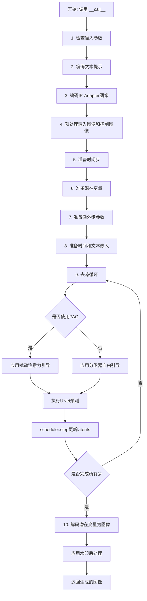
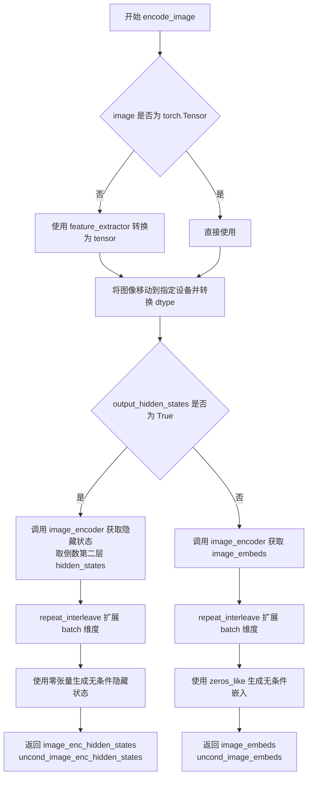
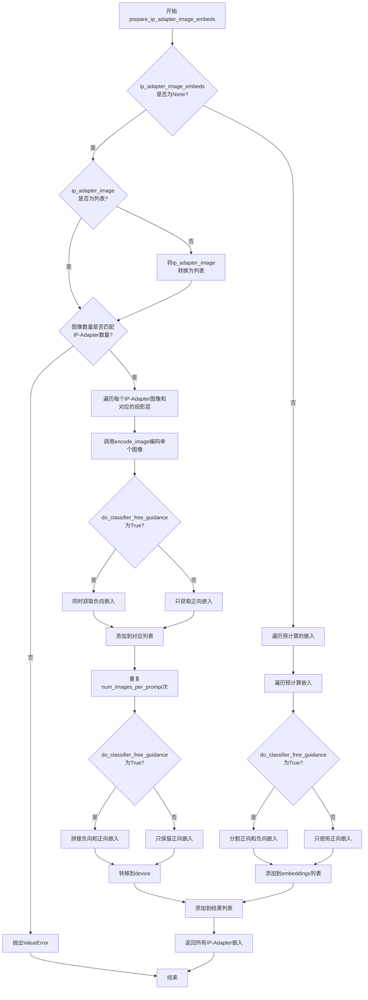
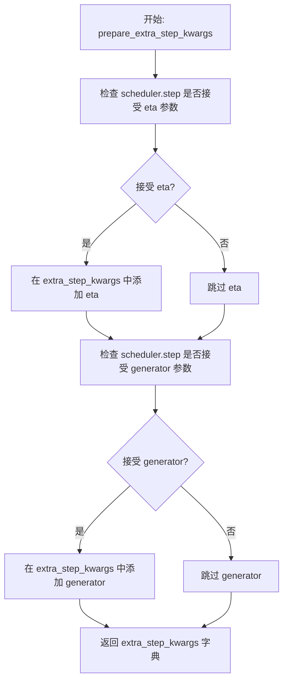
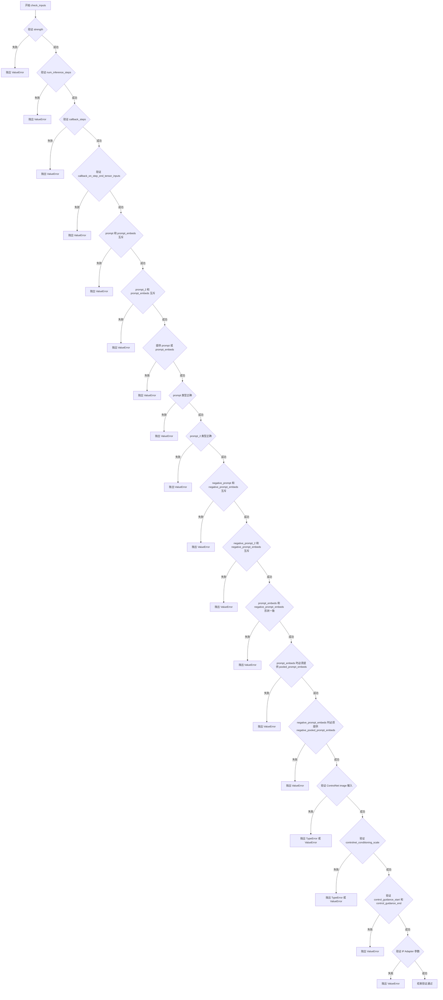
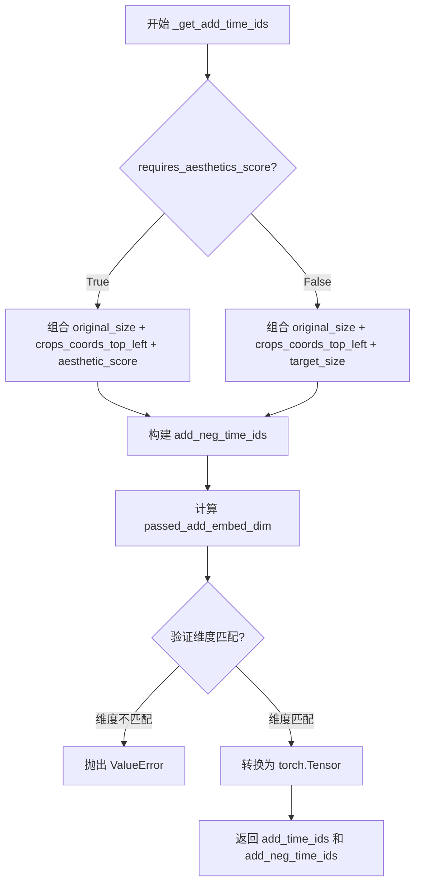
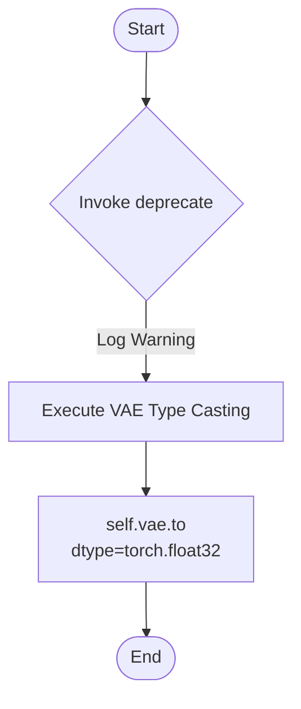

```mermaid
flowchart TD
    A[开始 encode_prompt] --> B{检查 lora_scale}
    B -->|非空| C[设置 LoRA 缩放<br/>调整文本编码器 LoRA 权重]
    B -->|空| D[跳过 LoRA 调整]
    C --> E[标准化 prompt 为列表]
    D --> E
    E --> F{判断 batch_size}
    F -->|prompt 非空| G[batch_size = len prompt]
    F -->|prompt 为空| H[batch_size = prompt_embeds.shape 0]
    G --> I[获取 tokenizers 和 text_encoders 列表]
    H --> I
    I --> J{prompt_embeds 为空?}
    J -->|是| K[遍历两个编码器处理提示词]
    J -->|否| L[跳过文本编码流程]
    K --> M[调用 maybe_convert_prompt<br/>处理 textual inversion]
    M --> N[tokenizer 分词]
    N --> O{检测截断}
    O -->|截断过| P[记录警告日志]
    O -->|未截断| Q[text_encoder 编码]
    P --> Q
    Q --> R{clip_skip 为空?}
    R -->|是| S[取倒数第二层隐藏状态]
    R -->|否| T[根据 clip_skip 计算隐藏状态索引]
    S --> U[添加到 prompt_embeds_list]
    T --> U
    U --> V[拼接所有 prompt_embeds]
    L --> W[处理负面提示词]
    V --> W
    W --> X{zero_out_negative_prompt?}
    X -->|是| Y[创建零张量]
    X -->|否| Z[编码负面提示词]
    Y --> AA[类型和批次大小检查]
    Z --> AA
    AA --> AB[遍历编码负面提示词]
    AB --> AC[创建零张量或编码负面提示]
    AC --> AD[添加到列表并拼接]
    AD --> AE{text_encoder_2 存在?}
    AE -->|是| AF[转换 prompt_embeds dtype]
    AE -->|否| AG[转换到 unet dtype]
    AF --> AH[复制以支持多图生成]
    AG --> AH
    AH --> AI{do_classifier_free_guidance?}
    AI -->|是| AJ[复制 negative_prompt_embeds]
    AI -->|否| AK[跳过负面嵌入复制]
    AJ --> AL[处理 pooled_prompt_embeds]
    AK --> AL
    AL --> AM{使用 PEFT Backend?}
    AM -->|是| AN[取消 LoRA 缩放]
    AM -->|否| AO[跳过]
    AN --> AP[返回四个嵌入张量]
    AO --> AP
```

# `diffusers\src\diffusers\pipelines\pag\pipeline_pag_controlnet_sd_xl_img2img.py` 详细设计文档

这是一个基于Stable Diffusion XL的图像到图像生成Pipeline，结合了ControlNet条件控制和PAG（Perturbed Attention Guidance）技术。该Pipeline接收文本提示、输入图像和控制图像，通过ControlNet提供的额外条件信息来指导去噪过程，并可选地使用PAG技术增强生成质量，最终生成符合指导的图像。

## 整体流程



## 类结构

```
DiffusionPipeline (基类)
├── StableDiffusionMixin
├── TextualInversionLoaderMixin
├── StableDiffusionXLLoraLoaderMixin
├── FromSingleFileMixin
├── IPAdapterMixin
├── PAGMixin
└── StableDiffusionXLControlNetPAGImg2ImgPipeline
```

## 全局变量及字段


### `logger`
    
Logger instance for the module

类型：`logging.Logger`
    


### `EXAMPLE_DOC_STRING`
    
Example documentation string showing pipeline usage

类型：`str`
    


### `XLA_AVAILABLE`
    
Flag indicating if PyTorch XLA is available for TPU support

类型：`bool`
    


### `retrieve_latents`
    
Function to retrieve latents from encoder output

类型：`function`
    


### `StableDiffusionXLControlNetPAGImg2ImgPipeline.vae`
    
VAE model for encoding and decoding images to and from latent representations

类型：`AutoencoderKL`
    


### `StableDiffusionXLControlNetPAGImg2ImgPipeline.text_encoder`
    
First frozen text encoder for generating text embeddings

类型：`CLIPTextModel`
    


### `StableDiffusionXLControlNetPAGImg2ImgPipeline.text_encoder_2`
    
Second frozen text encoder with projection for SDXL

类型：`CLIPTextModelWithProjection`
    


### `StableDiffusionXLControlNetPAGImg2ImgPipeline.tokenizer`
    
First tokenizer for text encoding

类型：`CLIPTokenizer`
    


### `StableDiffusionXLControlNetPAGImg2ImgPipeline.tokenizer_2`
    
Second tokenizer for SDXL text encoding

类型：`CLIPTokenizer`
    


### `StableDiffusionXLControlNetPAGImg2ImgPipeline.unet`
    
Conditional U-Net architecture for denoising image latents

类型：`UNet2DConditionModel`
    


### `StableDiffusionXLControlNetPAGImg2ImgPipeline.controlnet`
    
ControlNet model providing additional conditioning to the denoising process

类型：`ControlNetModel | MultiControlNetModel`
    


### `StableDiffusionXLControlNetPAGImg2ImgPipeline.scheduler`
    
Diffusion scheduler for controlling the denoising process

类型：`KarrasDiffusionSchedulers`
    


### `StableDiffusionXLControlNetPAGImg2ImgPipeline.feature_extractor`
    
CLIP image processor for extracting features from images

类型：`CLIPImageProcessor`
    


### `StableDiffusionXLControlNetPAGImg2ImgPipeline.image_encoder`
    
Vision model for encoding images for IP-Adapter support

类型：`CLIPVisionModelWithProjection`
    


### `StableDiffusionXLControlNetPAGImg2ImgPipeline.watermark`
    
Watermark handler for applying invisible watermarks to output images

类型：`StableDiffusionXLWatermarker | None`
    


### `StableDiffusionXLControlNetPAGImg2ImgPipeline.vae_scale_factor`
    
Scaling factor for VAE latent space based on number of output channels

类型：`int`
    


### `StableDiffusionXLControlNetPAGImg2ImgPipeline.image_processor`
    
Image processor for preprocessing and postprocessing images

类型：`VaeImageProcessor`
    


### `StableDiffusionXLControlNetPAGImg2ImgPipeline.control_image_processor`
    
Image processor for ControlNet conditioning images without normalization

类型：`VaeImageProcessor`
    


### `StableDiffusionXLControlNetPAGImg2ImgPipeline.model_cpu_offload_seq`
    
Sequence string defining the order for CPU offloading models

类型：`str`
    


### `StableDiffusionXLControlNetPAGImg2ImgPipeline._optional_components`
    
List of optional components that can be loaded

类型：`list`
    


### `StableDiffusionXLControlNetPAGImg2ImgPipeline._callback_tensor_inputs`
    
List of tensor inputs that can be passed to callbacks

类型：`list`
    
    

## 全局函数及方法


### `retrieve_latents`

从encoder输出中检索潜在变量，支持多种采样模式（sample/argmax）并处理不同的encoder输出格式。

参数：

- `encoder_output`：`torch.Tensor`，encoder的输出对象，可能包含`latent_dist`属性或`latents`属性
- `generator`：`torch.Generator | None`，可选的随机数生成器，用于采样过程中的随机性控制
- `sample_mode`：`str`，采样模式，默认为"sample"，可选值为"sample"（从分布采样）或"argmax"（取分布的众数）

返回值：`torch.Tensor`，从encoder输出中提取的潜在变量张量

#### 流程图

```mermaid
flowchart TD
    A[开始: retrieve_latents] --> B{encoder_output是否有<br/>latent_dist属性?}
    B -- 是 --> C{sample_mode == 'sample'?}
    B -- 否 --> D{encoder_output是否有<br/>latents属性?}
    C -- 是 --> E[返回 encoder_output.latent_dist.sample<br/>(generator)]
    C -- 否 --> F{sample_mode == 'argmax'?}
    F -- 是 --> G[返回 encoder_output.latent_dist.mode<br/>()]
    F -- 否 --> H[抛出 AttributeError]
    D -- 是 --> I[返回 encoder_output.latents]
    D -- 否 --> H
    E --> J[结束]
    G --> J
    I --> J
    H --> J
```

#### 带注释源码

```python
# 从encoder输出中检索潜在变量的全局函数
# 来源: diffusers.pipelines.stable_diffusion.pipeline_stable_diffusion_img2img.retrieve_latents
def retrieve_latents(
    encoder_output: torch.Tensor,  # encoder的输出，可能包含latent_dist或latents属性
    generator: torch.Generator | None = None,  # 可选的随机数生成器，用于采样
    sample_mode: str = "sample"  # 采样模式: "sample"或"argmax"
):
    # 情况1: encoder_output有latent_dist属性且使用sample模式
    # 从潜在分布中采样得到潜在变量
    if hasattr(encoder_output, "latent_dist") and sample_mode == "sample":
        return encoder_output.latent_dist.sample(generator)
    
    # 情况2: encoder_output有latent_dist属性且使用argmax模式
    # 取潜在分布的众数（最大值对应的潜在变量）
    elif hasattr(encoder_output, "latent_dist") and sample_mode == "argmax":
        return encoder_output.latent_dist.mode()
    
    # 情况3: encoder_output直接有latents属性
    # 直接返回预计算的潜在变量
    elif hasattr(encoder_output, "latents"):
        return encoder_output.latents
    
    # 错误情况: 无法从encoder_output中获取潜在变量
    else:
        raise AttributeError("Could not access latents of provided encoder_output")
```


### `StableDiffusionXLControlNetPAGImg2ImgPipeline.__init__`

该方法是 Stable Diffusion XL ControlNet PAG (Perturbed Attention Guidance) Image-to-Image Pipeline 的构造函数，负责初始化所有模型组件、处理器和配置参数。

参数：

- `vae`：`AutoencoderKL`，用于将图像编码和解码到潜在表示的变分自编码器模型
- `text_encoder`：`CLIPTextModel`，冻结的文本编码器，Stable Diffusion 使用 CLIP 的文本部分
- `text_encoder_2`：`CLIPTextModelWithProjection`，第二个冻结的文本编码器，用于 Stable Diffusion XL
- `tokenizer`：`CLIPTokenizer`，第一个分词器
- `tokenizer_2`：`CLIPTokenizer`，第二个分词器
- `unet`：`UNet2DConditionModel`，条件 U-Net 架构，用于对编码后的图像潜在表示进行去噪
- `controlnet`：`ControlNetModel | list[ControlNetModel] | tuple[ControlNetModel] | MultiControlNetModel`，提供额外条件的 ControlNet 模型
- `scheduler`：`KarrasDiffusionSchedulers`，与 unet 配合使用的调度器
- `requires_aesthetics_score`：`bool`，默认为 False，是否需要在推理时传入 aesthetic_score 条件
- `force_zeros_for_empty_prompt`：`bool`，默认为 True，是否将负提示嵌入强制设为 0
- `add_watermarker`：`bool | None`，是否为输出图像添加隐形水印
- `feature_extractor`：`CLIPImageProcessor`，用于从生成的图像中提取特征的处理器
- `image_encoder`：`CLIPVisionModelWithProjection`，用于 IP Adapter 的图像编码器
- `pag_applied_layers`：`str | list[str]`，默认为 "mid"，PAG 应用的层名称

返回值：无（`__init__` 方法返回 None）

#### 流程图

```mermaid
flowchart TD
    A[开始 __init__] --> B[调用 super().__init__]
    B --> C{controlnet 是 list 或 tuple?}
    C -->|是| D[转换为 MultiControlNetModel]
    C -->|否| E[保持原样]
    D --> F
    E --> F
    F[register_modules 注册所有模块] --> G[计算 vae_scale_factor]
    G --> H[创建 VaeImageProcessor]
    H --> I[创建 control_image_processor]
    I --> J{add_watermarker 为 None?}
    J -->|是| K{is_invisible_watermark_available?}
    J -->|否| L
    K -->|是| M[创建 StableDiffusionXLWatermarker]
    K -->|否| N[watermark 设为 None]
    M --> L
    N --> L
    L[register_to_config 注册配置] --> O[set_pag_applied_layers 设置 PAG 层]
    O --> P[结束 __init__]
```

#### 带注释源码

```python
def __init__(
    self,
    vae: AutoencoderKL,
    text_encoder: CLIPTextModel,
    text_encoder_2: CLIPTextModelWithProjection,
    tokenizer: CLIPTokenizer,
    tokenizer_2: CLIPTokenizer,
    unet: UNet2DConditionModel,
    controlnet: ControlNetModel | list[ControlNetModel] | tuple[ControlNetModel] | MultiControlNetModel,
    scheduler: KarrasDiffusionSchedulers,
    requires_aesthetics_score: bool = False,
    force_zeros_for_empty_prompt: bool = True,
    add_watermarker: bool | None = None,
    feature_extractor: CLIPImageProcessor = None,
    image_encoder: CLIPVisionModelWithProjection = None,
    pag_applied_layers: str | list[str] = "mid",  # ["mid"], ["down.block_1", "up.block_0.attentions_0"]
):
    # 调用父类 DiffusionPipeline 的初始化方法
    super().__init__()

    # 如果 controlnet 是 list 或 tuple，将其转换为 MultiControlNetModel 以便统一处理
    if isinstance(controlnet, (list, tuple)):
        controlnet = MultiControlNetModel(controlnet)

    # 注册所有模块，使它们可以通过 self.xxx 访问
    self.register_modules(
        vae=vae,
        text_encoder=text_encoder,
        text_encoder_2=text_encoder_2,
        tokenizer=tokenizer,
        tokenizer_2=tokenizer_2,
        unet=unet,
        controlnet=controlnet,
        scheduler=scheduler,
        feature_extractor=feature_extractor,
        image_encoder=image_encoder,
    )

    # 计算 VAE 缩放因子，基于 VAE 的 block_out_channels 数量
    # 2^(len(config.block_out_channels) - 1)，例如对于 [128, 256, 512, 512] 结果为 8
    self.vae_scale_factor = 2 ** (len(self.vae.config.block_out_channels) - 1) if getattr(self, "vae", None) else 8

    # 创建图像处理器，用于预处理和后处理图像
    self.image_processor = VaeImageProcessor(vae_scale_factor=self.vae_scale_factor, do_convert_rgb=True)

    # 创建 ControlNet 图像处理器，不进行归一化
    self.control_image_processor = VaeImageProcessor(
        vae_scale_factor=self.vae_scale_factor, do_convert_rgb=True, do_normalize=False
    )

    # 如果 add_watermarker 为 None，根据是否安装隐形水印库来决定
    add_watermarker = add_watermarker if add_watermarker is not None else is_invisible_watermark_available()

    # 根据 add_watermarker 设置水印器
    if add_watermarker:
        self.watermark = StableDiffusionXLWatermarker()
    else:
        self.watermark = None

    # 注册配置参数到 config 对象
    self.register_to_config(force_zeros_for_empty_prompt=force_zeros_for_empty_prompt)
    self.register_to_config(requires_aesthetics_score=requires_aesthetics_score)

    # 设置 PAG (Perturbed Attention Guidance) 应用的层
    self.set_pag_applied_layers(pag_applied_layers)
```


### `StableDiffusionXLControlNetPAGImg2ImgPipeline.encode_prompt`

该方法负责将文本提示词编码为文本编码器的隐藏状态（embeddings），支持单文本编码器和双文本编码器（SDXL架构），同时处理LoRA缩放、CLIP跳过层、负面提示词、条件无分类器引导（CFG）等复杂逻辑，是图像生成管道的核心前置步骤。

参数：

- `self`：类实例本身，包含tokenizer、text_encoder等组件
- `prompt`：`str | list[str] | None`，要编码的主提示词，可以是单字符串或字符串列表
- `prompt_2`：`str | list[str] | None`，发送给第二个tokenizer和text_encoder的提示词，若不指定则使用prompt
- `device`：`torch.device | None`，torch设备，若不指定则使用执行设备
- `num_images_per_prompt`：`int`，每个提示词生成的图像数量，默认为1
- `do_classifier_free_guidance`：`bool`，是否启用无分类器引导，默认为True
- `negative_prompt`：`str | list[str] | None`，不引导图像生成的负面提示词
- `negative_prompt_2`：`str | list[str] | None`，发送给第二个编码器的负面提示词
- `prompt_embeds`：`torch.Tensor | None`，预生成的文本嵌入，用于直接传入而非从提示词生成
- `negative_prompt_embeds`：`torch.Tensor | None`，预生成的负面文本嵌入
- `pooled_prompt_embeds`：`torch.Tensor | None`，预生成的池化文本嵌入
- `negative_pooled_prompt_embeds`：`torch.Tensor | None`，预生成的负面池化文本嵌入
- `lora_scale`：`float | None`，应用于所有LoRA层的缩放因子
- `clip_skip`：`int | None`，CLIP计算提示嵌入时跳过的层数

返回值：`tuple[torch.Tensor, torch.Tensor, torch.Tensor, torch.Tensor]`，返回四个张量：
- `prompt_embeds`：编码后的提示词嵌入
- `negative_prompt_embeds`：编码后的负面提示词嵌入
- `pooled_prompt_embeds`：池化后的提示词嵌入
- `negative_pooled_prompt_embeds`：池化后的负面提示词嵌入

#### 流程图



#### 带注释源码

```python
def encode_prompt(
    self,
    prompt: str,
    prompt_2: str | None = None,
    device: torch.device | None = None,
    num_images_per_prompt: int = 1,
    do_classifier_free_guidance: bool = True,
    negative_prompt: str | None = None,
    negative_prompt_2: str | None = None,
    prompt_embeds: torch.Tensor | None = None,
    negative_prompt_embeds: torch.Tensor | None = None,
    pooled_prompt_embeds: torch.Tensor | None = None,
    negative_pooled_prompt_embeds: torch.Tensor | None = None,
    lora_scale: float | None = None,
    clip_skip: int | None = None,
):
    r"""
    Encodes the prompt into text encoder hidden states.

    Args:
        prompt (`str` or `list[str]`, *optional*):
            prompt to be encoded
        prompt_2 (`str` or `list[str]`, *optional*):
            The prompt or prompts to be sent to the `tokenizer_2` and `text_encoder_2`. If not defined, `prompt` is
            used in both text-encoders
        device: (`torch.device`):
            torch device
        num_images_per_prompt (`int`):
            number of images that should be generated per prompt
        do_classifier_free_guidance (`bool`):
            whether to use classifier free guidance or not
        negative_prompt (`str` or `list[str]`, *optional*):
            The prompt or prompts not to guide the image generation. If not defined, one has to pass
            `negative_prompt_embeds` instead. Ignored when not using guidance (i.e., ignored if `guidance_scale` is
            less than `1`).
        negative_prompt_2 (`str` or `list[str]`, *optional*):
            The prompt or prompts not to guide the image generation to be sent to `tokenizer_2` and
            `text_encoder_2`. If not defined, `negative_prompt` is used in both text-encoders
        prompt_embeds (`torch.Tensor`, *optional*):
            Pre-generated text embeddings. Can be used to easily tweak text inputs, *e.g.* prompt weighting. If not
            provided, text embeddings will be generated from `prompt` input argument.
        negative_prompt_embeds (`torch.Tensor`, *optional*):
            Pre-generated negative text embeddings. Can be used to easily tweak text inputs, *e.g.* prompt
            weighting. If not provided, negative_prompt_embeds will be generated from `negative_prompt` input
            argument.
        pooled_prompt_embeds (`torch.Tensor`, *optional*):
            Pre-generated pooled text embeddings. Can be used to easily tweak text inputs, *e.g.* prompt weighting.
            If not provided, pooled text embeddings will be generated from `prompt` input argument.
        negative_pooled_prompt_embeds (`torch.Tensor`, *optional*):
            Pre-generated negative pooled text embeddings. Can be used to easily tweak text inputs, *e.g.* prompt
            weighting. If not provided, pooled negative_prompt_embeds will be generated from `negative_prompt`
            input argument.
        lora_scale (`float`, *optional*):
            A lora scale that will be applied to all LoRA layers of the text encoder if LoRA layers are loaded.
        clip_skip (`int`, *optional*):
            Number of layers to be skipped from CLIP while computing the prompt embeddings. A value of 1 means that
            the output of the pre-final layer will be used for computing the prompt embeddings.
    """
    # 确定设备，优先使用传入的device，否则使用执行设备
    device = device or self._execution_device

    # 如果传入了lora_scale且类继承了StableDiffusionXLLoraLoaderMixin，则设置LoRA缩放
    if lora_scale is not None and isinstance(self, StableDiffusionXLLoraLoaderMixin):
        self._lora_scale = lora_scale

        # 动态调整LoRA scale
        if self.text_encoder is not None:
            if not USE_PEFT_BACKEND:
                adjust_lora_scale_text_encoder(self.text_encoder, lora_scale)
            else:
                scale_lora_layers(self.text_encoder, lora_scale)

        if self.text_encoder_2 is not None:
            if not USE_PEFT_BACKEND:
                adjust_lora_scale_text_encoder(self.text_encoder_2, lora_scale)
            else:
                scale_lora_layers(self.text_encoder_2, lora_scale)

    # 标准化prompt为列表形式，便于批量处理
    prompt = [prompt] if isinstance(prompt, str) else prompt

    # 确定批次大小
    if prompt is not None:
        batch_size = len(prompt)
    else:
        batch_size = prompt_embeds.shape[0]

    # 定义tokenizers和text_encoders列表，支持双文本编码器架构
    tokenizers = [self.tokenizer, self.tokenizer_2] if self.tokenizer is not None else [self.tokenizer_2]
    text_encoders = (
        [self.text_encoder, self.text_encoder_2] if self.text_encoder is not None else [self.text_encoder_2]
    )

    # 如果没有预先生成prompt_embeds，则从prompt生成
    if prompt_embeds is None:
        # prompt_2默认为prompt
        prompt_2 = prompt_2 or prompt
        prompt_2 = [prompt_2] if isinstance(prompt_2, str) else prompt_2

        # textual inversion处理：处理多向量token
        prompt_embeds_list = []
        prompts = [prompt, prompt_2]
        
        # 遍历两个文本编码器分别处理
        for prompt, tokenizer, text_encoder in zip(prompts, tokenizers, text_encoders):
            # 如果支持TextualInversionLoaderMixin，转换prompt
            if isinstance(self, TextualInversionLoaderMixin):
                prompt = self.maybe_convert_prompt(prompt, tokenizer)

            # tokenize处理
            text_inputs = tokenizer(
                prompt,
                padding="max_length",
                max_length=tokenizer.model_max_length,
                truncation=True,
                return_tensors="pt",
            )

            text_input_ids = text_inputs.input_ids
            # 获取未截断的输入用于比较
            untruncated_ids = tokenizer(prompt, padding="longest", return_tensors="pt").input_ids

            # 检测CLIP截断情况并警告
            if untruncated_ids.shape[-1] >= text_input_ids.shape[-1] and not torch.equal(
                text_input_ids, untruncated_ids
            ):
                removed_text = tokenizer.batch_decode(untruncated_ids[:, tokenizer.model_max_length - 1 : -1])
                logger.warning(
                    "The following part of your input was truncated because CLIP can only handle sequences up to"
                    f" {tokenizer.model_max_length} tokens: {removed_text}"
                )

            # 文本编码器编码，获取隐藏状态
            prompt_embeds = text_encoder(text_input_ids.to(device), output_hidden_states=True)

            # 获取池化输出（最终文本编码器的 pooled output）
            if pooled_prompt_embeds is None and prompt_embeds[0].ndim == 2:
                pooled_prompt_embeds = prompt_embeds[0]

            # 根据clip_skip决定使用哪层隐藏状态
            if clip_skip is None:
                # 默认使用倒数第二层（SDXL总是从倒数第二层索引）
                prompt_embeds = prompt_embeds.hidden_states[-2]
            else:
                # "2" because SDXL always indexes from the penultimate layer.
                prompt_embeds = prompt_embeds.hidden_states[-(clip_skip + 2)]

            prompt_embeds_list.append(prompt_embeds)

        # 在最后一个维度拼接两个编码器的输出
        prompt_embeds = torch.concat(prompt_embeds_list, dim=-1)

    # 处理无分类器引导的负面嵌入
    zero_out_negative_prompt = negative_prompt is None and self.config.force_zeros_for_empty_prompt
    
    # 情况1：需要CFG但没有负面提示词嵌入且配置强制为零
    if do_classifier_free_guidance and negative_prompt_embeds is None and zero_out_negative_prompt:
        negative_prompt_embeds = torch.zeros_like(prompt_embeds)
        negative_pooled_prompt_embeds = torch.zeros_like(pooled_prompt_embeds)
    # 情况2：需要CFG且有负面提示词，需要编码
    elif do_classifier_free_guidance and negative_prompt_embeds is None:
        negative_prompt = negative_prompt or ""
        negative_prompt_2 = negative_prompt_2 or negative_prompt

        # 标准化为列表
        negative_prompt = batch_size * [negative_prompt] if isinstance(negative_prompt, str) else negative_prompt
        negative_prompt_2 = (
            batch_size * [negative_prompt_2] if isinstance(negative_prompt_2, str) else negative_prompt_2
        )

        # 类型和批次大小检查
        uncond_tokens: list[str]
        if prompt is not None and type(prompt) is not type(negative_prompt):
            raise TypeError(
                f"`negative_prompt` should be the same type to `prompt`, but got {type(negative_prompt)} !="
                f" {type(prompt)}."
            )
        elif batch_size != len(negative_prompt):
            raise ValueError(
                f"`negative_prompt`: {negative_prompt} has batch size {len(negative_prompt)}, but `prompt`:"
                f" {prompt} has batch size {batch_size}. Please make sure that passed `negative_prompt` matches"
                " the batch size of `prompt`."
            )
        else:
            uncond_tokens = [negative_prompt, negative_prompt_2]

        # 编码负面提示词
        negative_prompt_embeds_list = []
        for negative_prompt, tokenizer, text_encoder in zip(uncond_tokens, tokenizers, text_encoders):
            if isinstance(self, TextualInversionLoaderMixin):
                negative_prompt = self.maybe_convert_prompt(negative_prompt, tokenizer)

            max_length = prompt_embeds.shape[1]
            uncond_input = tokenizer(
                negative_prompt,
                padding="max_length",
                max_length=max_length,
                truncation=True,
                return_tensors="pt",
            )

            negative_prompt_embeds = text_encoder(
                uncond_input.input_ids.to(device),
                output_hidden_states=True,
            )

            # 获取池化输出
            if negative_pooled_prompt_embeds is None and negative_prompt_embeds[0].ndim == 2:
                negative_pooled_prompt_embeds = negative_prompt_embeds[0]
            negative_prompt_embeds = negative_prompt_embeds.hidden_states[-2]

            negative_prompt_embeds_list.append(negative_prompt_embeds)

        negative_prompt_embeds = torch.concat(negative_prompt_embeds_list, dim=-1)

    # 确保嵌入类型一致
    if self.text_encoder_2 is not None:
        prompt_embeds = prompt_embeds.to(dtype=self.text_encoder_2.dtype, device=device)
    else:
        prompt_embeds = prompt_embeds.to(dtype=self.unet.dtype, device=device)

    # 复制以支持每个提示词生成多个图像（MPS友好的方法）
    bs_embed, seq_len, _ = prompt_embeds.shape
    prompt_embeds = prompt_embeds.repeat(1, num_images_per_prompt, 1)
    prompt_embeds = prompt_embeds.view(bs_embed * num_images_per_prompt, seq_len, -1)

    # 处理无分类器引导的负面嵌入
    if do_classifier_free_guidance:
        seq_len = negative_prompt_embeds.shape[1]

        if self.text_encoder_2 is not None:
            negative_prompt_embeds = negative_prompt_embeds.to(dtype=self.text_encoder_2.dtype, device=device)
        else:
            negative_prompt_embeds = negative_prompt_embeds.to(dtype=self.unet.dtype, device=device)

        negative_prompt_embeds = negative_prompt_embeds.repeat(1, num_images_per_prompt, 1)
        negative_prompt_embeds = negative_prompt_embeds.view(batch_size * num_images_per_prompt, seq_len, -1)

    # 处理池化嵌入
    pooled_prompt_embeds = pooled_prompt_embeds.repeat(1, num_images_per_prompt).view(
        bs_embed * num_images_per_prompt, -1
    )
    if do_classifier_free_guidance:
        negative_pooled_prompt_embeds = negative_pooled_prompt_embeds.repeat(1, num_images_per_prompt).view(
            bs_embed * num_images_per_prompt, -1
        )

    # 如果使用PEFT backend，恢复原始LoRA scale
    if self.text_encoder is not None:
        if isinstance(self, StableDiffusionXLLoraLoaderMixin) and USE_PEFT_BACKEND:
            # Retrieve the original scale by scaling back the LoRA layers
            unscale_lora_layers(self.text_encoder, lora_scale)

    if self.text_encoder_2 is not None:
        if isinstance(self, StableDiffusionXLLoraLoaderMixin) and USE_PEFT_BACKEND:
            # Retrieve the original scale by scaling back the LoRA layers
            unscale_lora_layers(self.text_encoder_2, lora_scale)

    # 返回四个嵌入张量供后续去噪过程使用
    return prompt_embeds, negative_prompt_embeds, pooled_prompt_embeds, negative_pooled_prompt_embeds
```


### `StableDiffusionXLControlNetPAGImg2ImgPipeline.encode_image`

该方法用于将输入图像编码为图像嵌入（image embeddings）或隐藏状态（hidden states），以便在后续的图像生成过程中使用。它支持分类器自由引导（classifier-free guidance），并能够根据参数输出不同形式的编码结果。

参数：

- `image`：图像输入，支持 `torch.Tensor`、`PIL.Image.Image`、`numpy.ndarray` 或它们的列表。如果不是 tensor 类型，会先通过 `feature_extractor` 转换为 tensor。
- `device`：`torch.device`，指定将图像移动到哪个设备（如 CPU 或 CUDA）。
- `num_images_per_prompt`：`int`，每个 prompt 需要生成的图像数量，用于对嵌入进行重复扩展。
- `output_hidden_states`：`bool`，可选参数，默认为 `None`。如果为 `True`，则返回图像编码器的隐藏状态；否则返回图像嵌入（image_embeds）。

返回值：返回两个张量组成的元组。当 `output_hidden_states=True` 时，返回 `(image_enc_hidden_states, uncond_image_enc_hidden_states)`；否则返回 `(image_embeds, uncond_image_embeds)`。其中，带有 `uncond_` 前缀的表示无条件（negative）嵌入，用于分类器自由引导。

#### 流程图



#### 带注释源码

```python
def encode_image(self, image, device, num_images_per_prompt, output_hidden_states=None):
    # 获取图像编码器的参数数据类型（dtype），通常为 float32 或 float16
    dtype = next(self.image_encoder.parameters()).dtype

    # 如果输入的 image 不是 torch.Tensor 类型
    if not isinstance(image, torch.Tensor):
        # 使用 feature_extractor 将 PIL Image 或 numpy array 转换为 tensor
        # 返回的 pixel_values 形状为 (batch_size, channels, height, width)
        image = self.feature_extractor(image, return_tensors="pt").pixel_values

    # 将图像移动到指定设备（cpu/cuda）并转换为正确的 dtype
    image = image.to(device=device, dtype=dtype)
    
    # 根据 output_hidden_states 参数决定输出形式
    if output_hidden_states:
        # 获取图像编码器的隐藏状态（hidden states）
        # hidden_states 是一个元组，包含所有层的输出
        # 取倒数第二层 [-2] 作为图像特征表示（通常最后一层是更抽象的表示）
        image_enc_hidden_states = self.image_encoder(image, output_hidden_states=True).hidden_states[-2]
        
        # 为每个 prompt 复制对应的图像嵌入
        # repeat_interleave 在 batch 维度（dim=0）上重复 num_images_per_prompt 次
        image_enc_hidden_states = image_enc_hidden_hidden_states.repeat_interleave(num_images_per_prompt, dim=0)
        
        # 创建零张量用于无条件的图像编码（用于 classifier-free guidance）
        # 形状与 image_enc_hidden_states 相同
        uncond_image_enc_hidden_states = self.image_encoder(
            torch.zeros_like(image), output_hidden_states=True
        ).hidden_states[-2]
        
        # 同样扩展无条件嵌入的 batch 维度
        uncond_image_enc_hidden_states = uncond_image_enc_hidden_states.repeat_interleave(
            num_images_per_prompt, dim=0
        )
        
        # 返回图像隐藏状态和有条件隐藏状态
        return image_enc_hidden_states, uncond_image_enc_hidden_states
    else:
        # 直接获取图像嵌入（image_embeds）
        # 这是图像编码器的pooled输出，通常是一个一维向量
        image_embeds = self.image_encoder(image).image_embeds
        
        # 扩展 batch 维度以匹配 num_images_per_prompt
        image_embeds = image_embeds.repeat_interleave(num_images_per_prompt, dim=0)
        
        # 创建零张量作为无条件的图像嵌入
        # 用于在 classifier-free guidance 中与有条件嵌入一起使用
        uncond_image_embeds = torch.zeros_like(image_embeds)

        # 返回图像嵌入和无条件嵌入
        return image_embeds, uncond_image_embeds
```


### `StableDiffusionXLControlNetPAGImg2ImgPipeline.prepare_ip_adapter_image_embeds`

该方法用于准备IP-Adapter的图像嵌入（image embeddings），将输入的IP-Adapter图像编码为模型可用的嵌入向量，同时支持无分类器引导（classifier-free guidance）模式下的正向和负向嵌入处理。

参数：

- `self`：类实例本身
- `ip_adapter_image`：`PipelineImageInput | None`，输入的IP-Adapter图像，可以是PIL图像、torch.Tensor、numpy数组或它们的列表
- `ip_adapter_image_embeds`：`list[torch.Tensor] | None`，预先生成的图像嵌入列表，如果提供则直接使用，否则从`ip_adapter_image`编码生成
- `device`：`torch.device`，用于计算的目标设备
- `num_images_per_prompt`：`int`，每个提示词生成的图像数量
- `do_classifier_free_guidance`：`bool`，是否启用无分类器引导模式

返回值：`list[torch.Tensor]`，处理后的IP-Adapter图像嵌入列表，每个元素包含正向（和可能的负向）嵌入

#### 流程图



#### 带注释源码

```python
def prepare_ip_adapter_image_embeds(
    self, 
    ip_adapter_image,  # 输入的IP-Adapter图像
    ip_adapter_image_embeds,  # 预计算的嵌入（可选）
    device,  # 计算设备
    num_images_per_prompt,  # 每个prompt生成的图像数
    do_classifier_free_guidance  # 是否使用无分类器引导
):
    # 初始化用于存储图像嵌入的列表
    image_embeds = []
    
    # 如果启用无分类器引导，同时初始化负向嵌入列表
    if do_classifier_free_guidance:
        negative_image_embeds = []
    
    # 如果没有提供预计算的嵌入，则从原始图像编码
    if ip_adapter_image_embeds is None:
        # 确保图像是列表格式
        if not isinstance(ip_adapter_image, list):
            ip_adapter_image = [ip_adapter_image]
        
        # 验证图像数量与IP-Adapter数量是否匹配
        if len(ip_adapter_image) != len(self.unet.encoder_hid_proj.image_projection_layers):
            raise ValueError(
                f"`ip_adapter_image` must have same length as the number of IP Adapters. Got {len(ip_adapter_image)} images and {len(self.unet.encoder_hid_proj.image_projection_layers)} IP Adapters."
            )
        
        # 遍历每个IP-Adapter图像和对应的图像投影层
        for single_ip_adapter_image, image_proj_layer in zip(
            ip_adapter_image, self.unet.encoder_hid_proj.image_projection_layers
        ):
            # 判断是否需要输出隐藏状态（ImageProjection类型不需要）
            output_hidden_state = not isinstance(image_proj_layer, ImageProjection)
            
            # 编码单个图像获取嵌入
            single_image_embeds, single_negative_image_embeds = self.encode_image(
                single_ip_adapter_image, device, 1, output_hidden_state
            )
            
            # 将正向嵌入添加到列表（增加batch维度）
            image_embeds.append(single_image_embeds[None, :])
            
            # 如果启用无分类器引导，同时保存负向嵌入
            if do_classifier_free_guidance:
                negative_image_embeds.append(single_negative_image_embeds[None, :])
    else:
        # 使用预计算的嵌入，直接遍历
        for single_image_embeds in ip_adapter_image_embeds:
            if do_classifier_free_guidance:
                # 预计算嵌入中已包含正负嵌入，按chunk(2)分割
                single_negative_image_embeds, single_image_embeds = single_image_embeds.chunk(2)
                negative_image_embeds.append(single_negative_image_embeds)
            image_embeds.append(single_image_embeds)
    
    # 第二轮处理：将嵌入扩展到num_images_per_prompt维度
    ip_adapter_image_embeds = []
    for i, single_image_embeds in enumerate(image_embeds):
        # 重复num_images_per_prompt次以匹配生成数量
        single_image_embeds = torch.cat([single_image_embeds] * num_images_per_prompt, dim=0)
        
        if do_classifier_free_guidance:
            # 对负向嵌入同样重复num_images_per_prompt次
            single_negative_image_embeds = torch.cat([negative_image_embeds[i]] * num_images_per_prompt, dim=0)
            # 拼接负向和正向嵌入：[negative, positive] 格式
            single_image_embeds = torch.cat([single_negative_image_embeds, single_image_embeds], dim=0)
        
        # 确保嵌入在正确的设备上
        single_image_embeds = single_image_embeds.to(device=device)
        ip_adapter_image_embeds.append(single_image_embeds)
    
    return ip_adapter_image_embeds
```


### `StableDiffusionXLControlNetPAGImg2ImgPipeline.prepare_extra_step_kwargs`

该方法用于准备扩散模型调度器（scheduler）步骤所需的额外参数。由于不同的调度器可能有不同的签名，该方法通过检查调度器的 `step` 方法是否接受特定参数（如 `eta` 和 `generator`）来动态构建额外参数字典，从而确保与各种调度器兼容。

参数：

- `self`：`StableDiffusionXLControlNetPAGImg2ImgPipeline` 实例，管道对象本身
- `generator`：`torch.Generator | list[torch.Generator] | None`，可选的随机数生成器，用于确保生成过程的可重现性
- `eta`：`float`，DDIM 调度器的参数 η，对应论文 https://huggingface.co/papers/2010.02502 中的 η，应在 [0, 1] 范围内；对于其他调度器该参数会被忽略

返回值：`dict`，包含调度器 `step` 方法所需额外参数（如 `eta` 和/或 `generator`）的字典

#### 流程图



#### 带注释源码

```python
def prepare_extra_step_kwargs(self, generator, eta):
    # 准备调度器的额外参数，因为并非所有调度器都具有相同的签名
    # eta (η) 仅在 DDIMScheduler 中使用，对于其他调度器将被忽略
    # eta 对应 DDIM 论文中的 η：https://huggingface.co/papers/2010.02502
    # eta 值应在 [0, 1] 范围内

    # 检查调度器的 step 方法是否接受 eta 参数
    accepts_eta = "eta" in set(inspect.signature(self.scheduler.step).parameters.keys())
    extra_step_kwargs = {}
    if accepts_eta:
        extra_step_kwargs["eta"] = eta

    # 检查调度器是否接受 generator 参数
    accepts_generator = "generator" in set(inspect.signature(self.scheduler.step).parameters.keys())
    if accepts_generator:
        extra_step_kwargs["generator"] = generator
    
    # 返回包含调度器所需额外参数的字典
    return extra_step_kwargs
```


### `StableDiffusionXLControlNetPAGImg2ImgPipeline.check_inputs`

该方法用于验证 Stable Diffusion XL ControlNet PAG Img2Img Pipeline 的所有输入参数，确保参数类型、范围和互斥关系正确，防止在后续推理过程中出现错误。

参数：

- `prompt`：`str | list[str] | None`，主要提示词，用于引导图像生成
- `prompt_2`：`str | list[str] | None`，发送给第二个分词器和文本编码器的提示词
- `image`：`PipelineImageInput`，初始图像，作为图像生成过程的起点
- `strength`：`float`，指示转换参考图像的程度，必须在 [0.0, 1.0] 范围内
- `num_inference_steps`：`int`，去噪步数，必须是正整数
- `callback_steps`：`int | None`，回调步数，必须是正整数（如果提供）
- `negative_prompt`：`str | list[str] | None`，不引导图像生成的提示词
- `negative_prompt_2`：`str | list[str] | None`，发送给第二个分词器和文本编码器的负面提示词
- `prompt_embeds`：`torch.Tensor | None`，预生成的文本嵌入
- `negative_prompt_embeds`：`torch.Tensor | None`，预生成的负面文本嵌入
- `pooled_prompt_embeds`：`torch.Tensor | None`，预生成的池化文本嵌入
- `negative_pooled_prompt_embeds`：`torch.Tensor | None`，预生成的负面池化文本嵌入
- `ip_adapter_image`：`PipelineImageInput | None`，IP Adapter 可选图像输入
- `ip_adapter_image_embeds`：`list[torch.Tensor] | None`，IP-Adapter 预生成的图像嵌入
- `controlnet_conditioning_scale`：`float | list[float]`，ControlNet 输出乘数
- `control_guidance_start`：`float | list[float]`，ControlNet 开始应用的步数百分比
- `control_guidance_end`：`float | list[float]`，ControlNet 停止应用的步数百分比
- `callback_on_step_end_tensor_inputs`：`list[str] | None`，在每步结束时调用的张量输入列表

返回值：`None`，该方法仅进行参数验证，不返回任何值

#### 流程图



#### 带注释源码

```python
def check_inputs(
    self,
    prompt,                          # str | list[str] | None: 主要提示词
    prompt_2,                        # str | list[str] | None: 第二提示词
    image,                           # PipelineImageInput: 输入图像
    strength,                        # float: 强度值 [0.0, 1.0]
    num_inference_steps,            # int: 推理步数
    callback_steps,                  # int | None: 回调步数
    negative_prompt=None,            # str | list[str] | None: 负面提示词
    negative_prompt_2=None,          # str | list[str] | None: 第二负面提示词
    prompt_embeds=None,              # torch.Tensor | None: 文本嵌入
    negative_prompt_embeds=None,     # torch.Tensor | None: 负面文本嵌入
    pooled_prompt_embeds=None,       # torch.Tensor | None: 池化文本嵌入
    negative_pooled_prompt_embeds=None, # torch.Tensor | None: 负面池化文本嵌入
    ip_adapter_image=None,           # PipelineImageInput | None: IP适配器图像
    ip_adapter_image_embeds=None,    # list[torch.Tensor] | None: IP适配器图像嵌入
    controlnet_conditioning_scale=1.0, # float | list[float]: 控制网调节比例
    control_guidance_start=0.0,      # float | list[float]: 控制引导起始
    control_guidance_end=1.0,        # float | list[float]: 控制引导结束
    callback_on_step_end_tensor_inputs=None, # list[str] | None: 回调张量输入
):
    """
    验证所有输入参数的有效性。
    
    检查项目包括：
    1. strength 必须在 [0.0, 1.0] 范围内
    2. num_inference_steps 必须是正整数
    3. callback_steps 必须是正整数（如果提供）
    4. callback_on_step_end_tensor_inputs 必须在允许的列表中
    5. prompt 和 prompt_embeds 不能同时提供
    6. prompt_2 和 prompt_embeds 不能同时提供
    7. 必须提供 prompt 或 prompt_embeds 之一
    8. prompt 必须是 str 或 list 类型
    9. prompt_2 必须是 str 或 list 类型
    10. negative_prompt 和 negative_prompt_embeds 不能同时提供
    11. negative_prompt_2 和 negative_prompt_embeds 不能同时提供
    12. prompt_embeds 和 negative_prompt_embeds 形状必须一致
    13. 提供 prompt_embeds 时必须同时提供 pooled_prompt_embeds
    14. 提供 negative_prompt_embeds 时必须同时提供 negative_pooled_prompt_embeds
    15. ControlNet image 输入类型验证
    16. ControlNet conditioning_scale 类型和长度验证
    17. control_guidance_start 和 control_guidance_end 验证
    18. IP Adapter 参数验证
    """
    
    # 验证 strength 在有效范围内
    if strength < 0 or strength > 1:
        raise ValueError(f"The value of strength should in [0.0, 1.0] but is {strength}")
    
    # 验证 num_inference_steps 是正整数
    if num_inference_steps is None:
        raise ValueError("`num_inference_steps` cannot be None.")
    elif not isinstance(num_inference_steps, int) or num_inference_steps <= 0:
        raise ValueError(
            f"`num_inference_steps` has to be a positive integer but is {num_inference_steps} of type"
            f" {type(num_inference_steps)}."
        )

    # 验证 callback_steps 是正整数（如果提供）
    if callback_steps is not None and (not isinstance(callback_steps, int) or callback_steps <= 0):
        raise ValueError(
            f"`callback_steps` has to be a positive integer but is {callback_steps} of type"
            f" {type(callback_steps)}."
        )

    # 验证 callback_on_step_end_tensor_inputs 在允许的列表中
    if callback_on_step_end_tensor_inputs is not None and not all(
        k in self._callback_tensor_inputs for k in callback_on_step_end_tensor_inputs
    ):
        raise ValueError(
            f"`callback_on_step_end_tensor_inputs` has to be in {self._callback_tensor_inputs}, but found {[k for k in callback_on_step_end_tensor_inputs if k not in self._callback_tensor_inputs]}"
        )

    # 验证 prompt 和 prompt_embeds 互斥
    if prompt is not None and prompt_embeds is not None:
        raise ValueError(
            f"Cannot forward both `prompt`: {prompt} and `prompt_embeds`: {prompt_embeds}. Please make sure to"
            " only forward one of the two."
        )
    # 验证 prompt_2 和 prompt_embeds 互斥
    elif prompt_2 is not None and prompt_embeds is not None:
        raise ValueError(
            f"Cannot forward both `prompt_2`: {prompt_2} and `prompt_embeds`: {prompt_embeds}. Please make sure to"
            " only forward one of the two."
        )
    # 验证至少提供 prompt 或 prompt_embeds 之一
    elif prompt is None and prompt_embeds is None:
        raise ValueError(
            "Provide either `prompt` or `prompt_embeds`. Cannot leave both `prompt` and `prompt_embeds` undefined."
        )
    # 验证 prompt 类型
    elif prompt is not None and (not isinstance(prompt, str) and not isinstance(prompt, list)):
        raise ValueError(f"`prompt` has to be of type `str` or `list` but is {type(prompt)}")
    # 验证 prompt_2 类型
    elif prompt_2 is not None and (not isinstance(prompt_2, str) and not isinstance(prompt_2, list)):
        raise ValueError(f"`prompt_2` has to be of type `str` or `list` but is {type(prompt_2)}")

    # 验证 negative_prompt 和 negative_prompt_embeds 互斥
    if negative_prompt is not None and negative_prompt_embeds is not None:
        raise ValueError(
            f"Cannot forward both `negative_prompt`: {negative_prompt} and `negative_prompt_embeds`:"
            f" {negative_prompt_embeds}. Please make sure to only forward one of the two."
        )
    # 验证 negative_prompt_2 和 negative_prompt_embeds 互斥
    elif negative_prompt_2 is not None and negative_prompt_embeds is not None:
        raise ValueError(
            f"Cannot forward both `negative_prompt_2`: {negative_prompt_2} and `negative_prompt_embeds`:"
            f" {negative_prompt_embeds}. Please make sure to only forward one of the two."
        )

    # 验证 prompt_embeds 和 negative_prompt_embeds 形状一致
    if prompt_embeds is not None and negative_prompt_embeds is not None:
        if prompt_embeds.shape != negative_prompt_embeds.shape:
            raise ValueError(
                "`prompt_embeds` and `negative_prompt_embeds` must have the same shape when passed directly, but"
                f" got: `prompt_embeds` {prompt_embeds.shape} != `negative_prompt_embeds`"
                f" {negative_prompt_embeds.shape}."
            )

    # 验证 prompt_embeds 时必须提供 pooled_prompt_embeds
    if prompt_embeds is not None and pooled_prompt_embeds is None:
        raise ValueError(
            "If `prompt_embeds` are provided, `pooled_prompt_embeds` also have to be passed. Make sure to generate `pooled_prompt_embeds` from the same text encoder that was used to generate `prompt_embeds`."
        )

    # 验证 negative_prompt_embeds 时必须提供 negative_pooled_prompt_embeds
    if negative_prompt_embeds is not None and negative_pooled_prompt_embeds is None:
        raise ValueError(
            "If `negative_prompt_embeds` are provided, `negative_pooled_prompt_embeds` also have to be passed. Make sure to generate `negative_pooled_prompt_embeds` from the same text encoder that was used to generate `negative_prompt_embeds`."
        )

    # 多个 ControlNet 时的警告
    if isinstance(self.controlnet, MultiControlNetModel):
        if isinstance(prompt, list):
            logger.warning(
                f"You have {len(self.controlnet.nets)} ControlNets and you have passed {len(prompt)}"
                " prompts. The conditionings will be fixed across the prompts."
            )

    # 检查 image 输入
    is_compiled = hasattr(F, "scaled_dot_product_attention") and isinstance(
        self.controlnet, torch._dynamo.eval_frame.OptimizedModule
    )
    if (
        isinstance(self.controlnet, ControlNetModel)
        or is_compiled
        and isinstance(self.controlnet._orig_mod, ControlNetModel)
    ):
        # 单个 ControlNet 验证
        self.check_image(image, prompt, prompt_embeds)
    elif (
        isinstance(self.controlnet, MultiControlNetModel)
        or is_compiled
        and isinstance(self.controlnet._orig_mod, MultiControlNetModel)
    ):
        # 多个 ControlNet 验证
        if not isinstance(image, list):
            raise TypeError("For multiple controlnets: `image` must be type `list`")

        # 检查嵌套列表（暂不支持）
        elif any(isinstance(i, list) for i in image):
            raise ValueError("A single batch of multiple conditionings are supported at the moment.")
        # 检查 image 数量与 ControlNet 数量一致
        elif len(image) != len(self.controlnet.nets):
            raise ValueError(
                f"For multiple controlnets: `image` must have the same length as the number of controlnets, but got {len(image)} images and {len(self.controlnet.nets)} ControlNets."
            )

        for image_ in image:
            self.check_image(image_, prompt, prompt_embeds)
    else:
        assert False

    # 检查 controlnet_conditioning_scale
    if (
        isinstance(self.controlnet, ControlNetModel)
        or is_compiled
        and isinstance(self.controlnet._orig_mod, ControlNetModel)
    ):
        # 单个 ControlNet 必须是 float 类型
        if not isinstance(controlnet_conditioning_scale, float):
            raise TypeError("For single controlnet: `controlnet_conditioning_scale` must be type `float`.")
    elif (
        isinstance(self.controlnet, MultiControlNetModel)
        or is_compiled
        and isinstance(self.controlnet._orig_mod, MultiControlNetModel)
    ):
        # 多个 ControlNet 的情况
        if isinstance(controlnet_conditioning_scale, list):
            if any(isinstance(i, list) for i in controlnet_conditioning_scale):
                raise ValueError("A single batch of multiple conditionings are supported at the moment.")
        elif isinstance(controlnet_conditioning_scale, list) and len(controlnet_conditioning_scale) != len(
            self.controlnet.nets
        ):
            raise ValueError(
                "For multiple controlnets: When `controlnet_conditioning_scale` is specified as `list`, it must have"
                " the same length as the number of controlnets"
            )
    else:
        assert False

    # 验证 control_guidance_start 和 control_guidance_end
    if not isinstance(control_guidance_start, (tuple, list)):
        control_guidance_start = [control_guidance_start]

    if not isinstance(control_guidance_end, (tuple, list)):
        control_guidance_end = [control_guidance_end]

    # 长度必须一致
    if len(control_guidance_start) != len(control_guidance_end):
        raise ValueError(
            f"`control_guidance_start` has {len(control_guidance_start)} elements, but `control_guidance_end` has {len(control_guidance_end)} elements. Make sure to provide the same number of elements to each list."
        )

    # 对于多个 ControlNet，长度必须匹配
    if isinstance(self.controlnet, MultiControlNetModel):
        if len(control_guidance_start) != len(self.controlnet.nets):
            raise ValueError(
                f"`control_guidance_start`: {control_guidance_start} has {len(control_guidance_start)} elements but there are {len(self.controlnet.nets)} controlnets available. Make sure to provide {len(self.controlnet.nets)}."
            )

    # 验证每个 start < end，且在有效范围内
    for start, end in zip(control_guidance_start, control_guidance_end):
        if start >= end:
            raise ValueError(
                f"control guidance start: {start} cannot be larger or equal to control guidance end: {end}."
            )
        if start < 0.0:
            raise ValueError(f"control guidance start: {start} can't be smaller than 0.")
        if end > 1.0:
            raise ValueError(f"control guidance end: {end} can't be larger than 1.0.")

    # IP Adapter 参数互斥验证
    if ip_adapter_image is not None and ip_adapter_image_embeds is not None:
        raise ValueError(
            "Provide either `ip_adapter_image` or `ip_adapter_image_embeds`. Cannot leave both `ip_adapter_image` and `ip_adapter_image_embeds` defined."
        )

    # IP Adapter image_embeds 验证
    if ip_adapter_image_embeds is not None:
        if not isinstance(ip_adapter_image_embeds, list):
            raise ValueError(
                f"`ip_adapter_image_embeds` has to be of type `list` but is {type(ip_adapter_image_embeds)}"
            )
        elif ip_adapter_image_embeds[0].ndim not in [3, 4]:
            raise ValueError(
                f"`ip_adapter_image_embeds` has to be a list of 3D or 4D tensors but is {ip_adapter_image_embeds[0].ndim}D"
            )
```


### `StableDiffusionXLControlNetPAGImg2ImgPipeline.check_image`

该方法用于验证输入图像和提示的批次大小是否匹配，确保输入的图像是支持的类型（PIL图像、torch张量、numpy数组或其列表）。

参数：

- `self`：隐式参数，Pipeline 实例本身
- `image`：`PIL.Image.Image | torch.Tensor | np.ndarray | list[PIL.Image.Image] | list[torch.Tensor] | list[np.ndarray]`，输入的控制网络条件图像
- `prompt`：`str | list[str] | None`，文本提示
- `prompt_embeds`：`torch.Tensor | None`，预生成的文本嵌入

返回值：`None`，该方法仅进行验证，不返回任何值

#### 流程图

```mermaid
flowchart TD
    A[开始 check_image] --> B{检查 image 类型}
    B --> C{是否是 PIL.Image?}
    B --> D{是否是 torch.Tensor?}
    B --> E{是否是 np.ndarray?}
    B --> F{是否是 PIL.Image 列表?}
    B --> G{是否是 torch.Tensor 列表?}
    B --> H{是否是 np.ndarray 列表?}
    
    C --> I{任一条件为真?}
    D --> I
    E --> I
    F --> I
    G --> I
    H --> I
    
    I -->|是| J{image 是 PIL.Image?}
    I -->|否| K[抛出 TypeError]
    
    J -->|是| L[设置 image_batch_size = 1]
    J -->|否| M[设置 image_batch_size = len(image)]
    
    L --> N{确定 prompt_batch_size}
    M --> N
    
    N --> O{prompt 是 str?}
    O -->|是| P[prompt_batch_size = 1]
    O -->|否| Q{prompt 是 list?}
    Q -->|是| R[prompt_batch_size = len(prompt)]
    Q -->|否| S[prompt_batch_size = prompt_embeds.shape[0]]
    
    P --> T{检查批次大小是否匹配}
    R --> T
    S --> T
    
    T --> U{image_batch_size != 1 且 != prompt_batch_size?}
    U -->|是| V[抛出 ValueError]
    U -->|否| W[结束]
    
    K --> W
    V --> W
```

#### 带注释源码

```python
# Copied from diffusers.pipelines.controlnet.pipeline_controlnet_sd_xl.StableDiffusionXLControlNetPipeline.check_image
def check_image(self, image, prompt, prompt_embeds):
    """
    检查输入图像的有效性，并验证图像批次大小与提示批次大小是否匹配。
    
    参数:
        image: 输入的控制网络条件图像，支持多种格式
        prompt: 文本提示
        prompt_embeds: 预生成的文本嵌入
        
    异常:
        TypeError: 当图像类型不支持时抛出
        ValueError: 当图像批次大小与提示批次大小不匹配时抛出
    """
    # 检查图像是否为 PIL Image 类型
    image_is_pil = isinstance(image, PIL.Image.Image)
    # 检查图像是否为 torch Tensor 类型
    image_is_tensor = isinstance(image, torch.Tensor)
    # 检查图像是否为 numpy array 类型
    image_is_np = isinstance(image, np.ndarray)
    # 检查图像是否为 PIL Image 列表
    image_is_pil_list = isinstance(image, list) and isinstance(image[0], PIL.Image.Image)
    # 检查图像是否为 torch Tensor 列表
    image_is_tensor_list = isinstance(image, list) and isinstance(image[0], torch.Tensor)
    # 检查图像是否为 numpy array 列表
    image_is_np_list = isinstance(image, list) and isinstance(image[0], np.ndarray)

    # 验证图像是否为支持的类型之一
    if (
        not image_is_pil
        and not image_is_tensor
        and not image_is_np
        and not image_is_pil_list
        and not image_is_tensor_list
        and not image_is_np_list
    ):
        raise TypeError(
            f"image must be passed and be one of PIL image, numpy array, torch tensor, list of PIL images, list of numpy arrays or list of torch tensors, but is {type(image)}"
        )

    # 确定图像批次大小
    if image_is_pil:
        # 单个 PIL 图像，批次大小为 1
        image_batch_size = 1
    else:
        # 列表形式，批次大小为列表长度
        image_batch_size = len(image)

    # 确定提示批次大小
    if prompt is not None and isinstance(prompt, str):
        # 字符串形式的提示，批次大小为 1
        prompt_batch_size = 1
    elif prompt is not None and isinstance(prompt, list):
        # 列表形式的提示，批次大小为列表长度
        prompt_batch_size = len(prompt)
    elif prompt_embeds is not None:
        # 使用预生成的嵌入，批次大小为嵌入的第一维
        prompt_batch_size = prompt_embeds.shape[0]

    # 验证图像批次大小与提示批次大小是否匹配
    # 当图像批次大小不为 1 时，必须与提示批次大小一致
    if image_batch_size != 1 and image_batch_size != prompt_batch_size:
        raise ValueError(
            f"If image batch size is not 1, image batch size must be same as prompt batch size. image batch size: {image_batch_size}, prompt batch size: {prompt_batch_size}"
        )
```


### `StableDiffusionXLControlNetPAGImg2ImgPipeline.prepare_control_image`

该方法用于对 ControlNet 的输入控制图像进行预处理，包括图像尺寸调整、批次复制、设备与数据类型转换，以及在分类器自由引导模式下对图像进行复制以适配条件和非条件输入。

参数：

- `image`：`PipelineImageInput`，待处理的控制图像输入，支持 PIL.Image.Image、torch.Tensor、np.ndarray 或它们的列表形式
- `width`：`int`，目标输出图像的宽度（像素）
- `height`：`int`，目标输出图像的高度（像素）
- `batch_size`：`int`，prompt 批处理大小，用于决定图像重复次数
- `num_images_per_prompt`：`int`，每个 prompt 生成的图像数量
- `device`：`torch.device`，图像处理的目标设备
- `dtype`：`torch.dtype`，图像张量的目标数据类型
- `do_classifier_free_guidance`：`bool`，是否启用分类器自由引导，默认为 False
- `guess_mode`：`bool`，是否为猜测模式，默认为 False

返回值：`torch.Tensor`，处理后的控制图像张量

#### 流程图

```mermaid
flowchart TD
    A[开始: prepare_control_image] --> B[预处理图像]
    B --> C{image_batch_size == 1?}
    C -->|是| D[repeat_by = batch_size]
    C -->|否| E[repeat_by = num_images_per_prompt]
    D --> F[按 repeat_by 重复图像]
    E --> F
    F --> G[转换设备和数据类型]
    G --> H{do_classifier_free_guidance<br/>且 not guess_mode?}
    H -->|是| I[拼接图像副本<br/>image = torch.cat([image] * 2)]
    H -->|否| J[返回处理后的图像]
    I --> J
    J --> K[结束]
```

#### 带注释源码

```python
def prepare_control_image(
    self,
    image,
    width,
    height,
    batch_size,
    num_images_per_prompt,
    device,
    dtype,
    do_classifier_free_guidance=False,
    guess_mode=False,
):
    """
    准备控制图像用于 ControlNet 推理。
    
    该方法执行以下步骤：
    1. 使用 control_image_processor 预处理图像（调整大小、归一化）
    2. 根据批次大小和每 prompt 图像数复制图像
    3. 转移至目标设备和数据类型
    4. 在分类器自由引导模式下复制图像以同时包含条件和非条件输入
    """
    # Step 1: 预处理图像 - 调整尺寸并转换为 float32
    image = self.control_image_processor.preprocess(image, height=height, width=width).to(dtype=torch.float32)
    image_batch_size = image.shape[0]

    # Step 2: 确定图像复制次数
    if image_batch_size == 1:
        # 单张图像时，按整个批次大小复制
        repeat_by = batch_size
    else:
        # 图像批次与 prompt 批次相同时，按每 prompt 图像数复制
        repeat_by = num_images_per_prompt

    # 按批次维度重复图像以匹配生成数量
    image = image.repeat_interleave(repeat_by, dim=0)

    # Step 3: 转移至目标设备和指定数据类型
    image = image.to(device=device, dtype=dtype)

    # Step 4: 分类器自由引导处理
    # 在 CFG 模式下，需要同时传入条件和非条件图像
    if do_classifier_free_guidance and not guess_mode:
        image = torch.cat([image] * 2)

    return image
```


### `StableDiffusionXLControlNetPAGImg2ImgPipeline.get_timesteps`

该方法用于根据推理步数和图像变换强度（strength）计算去噪过程所需的时间步序列，并根据计算结果调整调度器的起始索引，从而实现对图像变换程度的控制。

参数：

- `num_inference_steps`：`int`，总推理步数，即去噪过程要执行的迭代次数
- `strength`：`float`，图像变换强度，范围 0 到 1，表示对原始图像的保留程度
- `device`：`torch.device`，用于张量运算的目标设备

返回值：`tuple[torch.Tensor, int]`，返回一个元组，包含 `timesteps`（调度器的时间步序列张量）和实际执行的推理步数（`num_inference_steps - t_start`）

#### 流程图

```mermaid
flowchart TD
    A[开始 get_timesteps] --> B[计算 init_timestep = min(int(num_inference_steps * strength), num_inference_steps)]
    B --> C[计算 t_start = max(num_inference_steps - init_timestep, 0)]
    C --> D[从调度器提取时间步序列: timesteps = scheduler.timesteps[t_start * scheduler.order:]]
    D --> E{调度器是否有 set_begin_index 方法?}
    E -->|是| F[调用 scheduler.set_begin_index(t_start * scheduler.order)]
    E -->|否| G[跳过设置]
    F --> H[返回 timesteps 和 num_inference_steps - t_start]
    G --> H
```

#### 带注释源码

```python
def get_timesteps(self, num_inference_steps, strength, device):
    """
    根据推理步数和图像变换强度计算时间步序列
    
    参数:
        num_inference_steps: int - 总的去噪推理步数
        strength: float - 图像变换强度，值越大表示变化越大（0-1之间）
        device: torch.device - 计算设备
    
    返回:
        timesteps: torch.Tensor - 调整后的时间步序列
        actual_steps: int - 实际执行的推理步数
    """
    
    # 计算初始时间步数：根据strength计算需要跳过的步数
    # strength=1.0 表示完全重绘，strength=0.0 表示不添加噪声
    init_timestep = min(int(num_inference_steps * strength), num_inference_steps)
    
    # 计算起始索引：从调度器时间步序列的末尾开始
    # 这样可以确保从正确的位置开始去噪过程
    t_start = max(num_inference_steps - init_timestep, 0)
    
    # 提取时间步序列：乘以scheduler.order因为调度器可能使用多步方法
    timesteps = self.scheduler.timesteps[t_start * self.scheduler.order :]
    
    # 某些调度器支持设置起始索引以优化内部状态
    if hasattr(self.scheduler, "set_begin_index"):
        self.scheduler.set_begin_index(t_start * self.scheduler.order)
    
    # 返回时间步和实际推理步数
    # 第二个返回值用于记录实际执行的去噪步数
    return timesteps, num_inference_steps - t_start
```


### `StableDiffusionXLControlNetPAGImg2ImgPipeline.prepare_latents`

该方法负责为Stable Diffusion XL图像到图像生成管道准备潜变量（latents）。它接收输入图像，处理图像编码或直接使用预编码的latents，并根据配置添加噪声，同时处理批次大小扩展和时间步调整。

参数：

- `self`：隐式参数，Pipeline实例本身
- `image`：`torch.Tensor | PIL.Image.Image | list`，输入图像，用于生成潜变量的原始图像
- `timestep`：`int` 或 `torch.Tensor`，当前扩散过程的时间步，用于噪声调度
- `batch_size`：`int`，基础批次大小
- `num_images_per_prompt`：`int`，每个提示词生成的图像数量，用于扩展批次
- `dtype`：`torch.dtype`，目标数据类型（通常是float16或float32）
- `device`：`torch.device`，目标设备（CPU或CUDA）
- `generator`：`torch.Generator | list[torch.Generator] | None`，可选的随机数生成器，用于可重复的噪声生成
- `add_noise`：`bool`，是否向初始潜变量添加噪声，默认为True

返回值：`torch.Tensor`，处理后的潜变量张量，用于后续去噪过程

#### 流程图

```mermaid
flowchart TD
    A[开始: prepare_latents] --> B{验证image类型}
    B -->|类型无效| C[抛出ValueError]
    B -->|类型有效| D[获取VAE latents均值和标准差]
    D --> E{检查final_offload_hook}
    E -->|存在| F[卸载text_encoder_2到CPU]
    E -->|不存在| G[继续]
    F --> G
    G --> H[将image移到目标device]
    H --> I[计算有效批次大小: batch_size * num_images_per_prompt]
    I --> J{image通道数是否为4}
    J -->|是| K[直接作为init_latents]
    J -->|否| L{VAE是否需要upcast]
    L -->|是| M[将image和VAE转为float32]
    L -->|否| N[继续]
    M --> N
    N --> O{generator是list吗}
    O -->|是| P[验证generator长度]
    O -->|否| Q{generator是单个吗}
    P --> R[逐个编码图像块]
    Q -->|是| S[使用单个generator编码]
    Q -->|否| T[直接编码整个图像]
    R --> U[合并init_latents]
    S --> V[编码image]
    T --> V
    V --> W[retrieve_latents获取latents分布样本]
    U --> X[应用scaling_factor归一化]
    W --> X
    X --> Y{批次大小大于init_latents?}
    Y -->|是且整除| Z[重复扩展init_latents]
    Y -->|是且不整除| AA[抛出ValueError]
    Y -->|否| AB[直接使用init_latents]
    Z --> AC
    AA --> AC
    AB --> AC
    AC --> AD{add_noise为True?}
    AD -->|是| AE[生成随机噪声]
    AD -->|否| AF[跳过噪声添加]
    AE --> AG[scheduler.add_noise添加噪声]
    AF --> AH[latents = init_latents]
    AG --> AH
    AH --> AI[返回latents]
```

#### 带注释源码

```python
def prepare_latents(
    self, image, timestep, batch_size, num_images_per_prompt, dtype, device, generator=None, add_noise=True
):
    """
    准备用于图像生成的潜变量（latents）。
    
    参数:
        image: 输入图像，可以是torch.Tensor、PIL.Image.Image或list
        timestep: 当前扩散过程的时间步
        batch_size: 基础批次大小
        num_images_per_prompt: 每个提示词生成的图像数量
        dtype: 目标数据类型
        device: 目标设备
        generator: 可选的随机数生成器
        add_noise: 是否添加噪声
    
    返回:
        处理后的潜变量张量
    """
    # 1. 验证输入图像类型
    if not isinstance(image, (torch.Tensor, PIL.Image.Image, list)):
        raise ValueError(
            f"`image` has to be of type `torch.Tensor`, `PIL.Image.Image` or list but is {type(image)}"
        )

    # 2. 获取VAE的latents统计参数（如果配置中有）
    latents_mean = latents_std = None
    if hasattr(self.vae.config, "latents_mean") and self.vae.config.latents_mean is not None:
        # 将均值reshape为(1, 4, 1, 1)以适配latents的形状
        latents_mean = torch.tensor(self.vae.config.latents_mean).view(1, 4, 1, 1)
    if hasattr(self.vae.config, "latents_std") and self.vae.config.latents_std is not None:
        latents_std = torch.tensor(self.vae.config.latents_std).view(1, 4, 1, 1)

    # 3. 如果启用了模型CPU卸载，卸载text_encoder_2以释放显存
    if hasattr(self, "final_offload_hook") and self.final_offload_hook is not None:
        self.text_encoder_2.to("cpu")
        empty_device_cache()

    # 4. 将图像移到目标设备
    image = image.to(device=device, dtype=dtype)

    # 5. 计算有效批次大小（考虑每个提示生成多张图像）
    batch_size = batch_size * num_images_per_prompt

    # 6. 判断图像是否已经是latents格式（4通道）
    if image.shape[1] == 4:
        # 图像已经是latents格式，直接使用
        init_latents = image
    else:
        # 7. 图像是普通图像，需要通过VAE编码
        
        # 7.1 如果VAE配置要求强制upcast，将其转为float32以避免溢出
        if self.vae.config.force_upcast:
            image = image.float()
            self.vae.to(dtype=torch.float32)

        # 7.2 处理多个generator的情况
        if isinstance(generator, list) and len(generator) != batch_size:
            raise ValueError(
                f"You have passed a list of generators of length {len(generator)}, but requested an effective batch"
                f" size of {batch_size}. Make sure the batch size matches the length of the generators."
            )

        elif isinstance(generator, list):
            # 多个generator：逐个编码图像块
            if image.shape[0] < batch_size and batch_size % image.shape[0] == 0:
                # 图像批次小于目标批次且可以整除，重复图像
                image = torch.cat([image] * (batch_size // image.shape[0]), dim=0)
            elif image.shape[0] < batch_size and batch_size % image.shape[0] != 0:
                raise ValueError(
                    f"Cannot duplicate `image` of batch size {image.shape[0]} to effective batch_size {batch_size} "
                )

            # 逐个编码并使用对应的generator
            init_latents = [
                retrieve_latents(self.vae.encode(image[i : i + 1]), generator=generator[i])
                for i in range(batch_size)
            ]
            init_latents = torch.cat(init_latents, dim=0)
        else:
            # 单个generator或无generator：直接编码
            init_latents = retrieve_latents(self.vae.encode(image), generator=generator)

        # 7.3 恢复VAE的数据类型
        if self.vae.config.force_upcast:
            self.vae.to(dtype)

        # 7.4 转换数据类型并应用归一化
        init_latents = init_latents.to(dtype)
        if latents_mean is not None and latents_std is not None:
            # 如果配置了均值和标准差，应用归一化
            latents_mean = latents_mean.to(device=device, dtype=dtype)
            latents_std = latents_std.to(device=device, dtype=dtype)
            # (latents - mean) * scaling_factor / std
            init_latents = (init_latents - latents_mean) * self.vae.config.scaling_factor / latents_std
        else:
            # 否则只应用scaling_factor
            init_latents = self.vae.config.scaling_factor * init_latents

    # 8. 处理批次大小扩展（当需要生成的图像多于init_latents时）
    if batch_size > init_latents.shape[0] and batch_size % init_latents.shape[0] == 0:
        # 可以整除：重复扩展
        additional_image_per_prompt = batch_size // init_latents.shape[0]
        init_latents = torch.cat([init_latents] * additional_image_per_prompt, dim=0)
    elif batch_size > init_latents.shape[0] and batch_size % init_latents.shape[0] != 0:
        # 不能整除：抛出错误
        raise ValueError(
            f"Cannot duplicate `image` of batch size {init_latents.shape[0]} to {batch_size} text prompts."
        )
    else:
        # 批次大小匹配或更小：直接使用
        init_latents = torch.cat([init_latents], dim=0)

    # 9. 如果需要，添加噪声
    if add_noise:
        shape = init_latents.shape
        # 生成与init_latents形状相同的随机噪声
        noise = randn_tensor(shape, generator=generator, device=device, dtype=dtype)
        # 使用调度器在给定时间步添加噪声
        init_latents = self.scheduler.add_noise(init_latents, noise, timestep)

    # 10. 返回最终的latents
    latents = init_latents

    return latents
```


### `StableDiffusionXLControlNetPAGImg2ImgPipeline._get_add_time_ids`

该方法用于生成 Stable Diffusion XL 模型的额外时间标识（add_time_ids），这些标识包含了图像的原始尺寸、裁剪坐标、目标尺寸以及美学评分等信息，用于条件化去噪过程。

参数：

- `self`：类的实例方法隐含参数
- `original_size`：`tuple[int, int]`，原始图像的尺寸 (height, width)
- `crops_coords_top_left`：`tuple[int, int]`，裁剪坐标的左上角位置
- `target_size`：`tuple[int, int]`，目标图像的尺寸 (height, width)
- `aesthetic_score`：`float`，正向提示的美学评分，用于影响生成图像的美感
- `negative_aesthetic_score`：`float`，负向提示的美学评分
- `negative_original_size`：`tuple[int, int]`，负向提示的原始图像尺寸
- `negative_crops_coords_top_left`：`tuple[int, int]`，负向提示的裁剪坐标左上角
- `negative_target_size`：`tuple[int, int]`，负向提示的目标图像尺寸
- `dtype`：`torch.dtype`，返回张量的数据类型
- `text_encoder_projection_dim`：`int | None`，文本编码器的投影维度

返回值：`tuple[torch.Tensor, torch.Tensor]`，返回两个张量，分别是正向和负向的额外时间标识

#### 流程图



#### 带注释源码

```python
def _get_add_time_ids(
    self,
    original_size,              # 原始图像尺寸 (height, width)
    crops_coords_top_left,      # 裁剪坐标左上角 (y, x)
    target_size,                # 目标图像尺寸 (height, width)
    aesthetic_score,            # 正向美学评分
    negative_aesthetic_score,   # 负向美学评分
    negative_original_size,    # 负向原始尺寸
    negative_crops_coords_top_left,  # 负向裁剪坐标
    negative_target_size,       # 负向目标尺寸
    dtype,                      # 输出张量的数据类型
    text_encoder_projection_dim=None,  # 文本编码器投影维度
):
    # 根据配置决定是否包含美学评分
    if self.config.requires_aesthetics_score:
        # 包含美学评分的时间标识：[original_height, original_width, crop_y, crop_x, aesthetic_score]
        add_time_ids = list(original_size + crops_coords_top_left + (aesthetic_score,))
        add_neg_time_ids = list(
            negative_original_size + negative_crops_coords_top_left + (negative_aesthetic_score,)
        )
    else:
        # 包含目标尺寸的时间标识：[original_height, original_width, crop_y, crop_x, target_height, target_width]
        add_time_ids = list(original_size + crops_coords_top_left + target_size)
        add_neg_time_ids = list(negative_original_size + crops_coords_top_left + negative_target_size)

    # 计算实际传入的嵌入维度：时间嵌入维度 × 时间标识数量 + 文本编码器投影维度
    passed_add_embed_dim = (
        self.unet.config.addition_time_embed_dim * len(add_time_ids) + text_encoder_projection_dim
    )
    # 获取模型期望的嵌入维度
    expected_add_embed_dim = self.unet.add_embedding.linear_1.in_features

    # 维度验证：如果期望维度大于实际维度（差值为一个时间嵌入维度），说明需要启用美学评分
    if (
        expected_add_embed_dim > passed_add_embed_dim
        and (expected_add_embed_dim - passed_add_embed_dim) == self.unet.config.addition_time_embed_dim
    ):
        raise ValueError(
            f"Model expects an added time embedding vector of length {expected_add_embed_dim}, but a vector of {passed_add_embed_dim} was created. Please make sure to enable `requires_aesthetics_score` with `pipe.register_to_config(requires_aesthetics_score=True)` to make sure `aesthetic_score` {aesthetic_score} and `negative_aesthetic_score` {negative_aesthetic_score} is correctly used by the model."
        )
    # 如果期望维度小于实际维度（差值为一个时间嵌入维度），说明需要禁用美学评分
    elif (
        expected_add_embed_dim < passed_add_embed_dim
        and (passed_add_embed_dim - expected_add_embed_dim) == self.unet.config.addition_time_embed_dim
    ):
        raise ValueError(
            f"Model expects an added time embedding vector of length {expected_add_embed_dim}, but a vector of {passed_add_embed_dim} was created. Please make sure to disable `requires_aesthetics_score` with `pipe.register_to_config(requires_aesthetics_score=False)` to make sure `target_size` {target_size} is correctly used by the model."
        )
    # 其他维度不匹配情况
    elif expected_add_embed_dim != passed_add_embed_dim:
        raise ValueError(
            f"Model expects an added time embedding vector of length {expected_add_embed_dim}, but a vector of {passed_add_embed_dim} was created. The model has an incorrect config. Please check `unet.config.time_embedding_type` and `text_encoder_2.config.projection_dim`."
        )

    # 将列表转换为 PyTorch 张量
    add_time_ids = torch.tensor([add_time_ids], dtype=dtype)
    add_neg_time_ids = torch.tensor([add_neg_time_ids], dtype=dtype)

    return add_time_ids, add_neg_time_ids
```


### `StableDiffusionXLControlNetPAGImg2ImgPipeline.upcast_vae`

该方法用于将管道中的 VAE（变分自编码器）模型强制转换为 `torch.float32` 数据类型，以解决在 float16 推理时可能出现的数值溢出问题。该方法目前已被标记为弃用（Deprecated），建议直接调用 `pipe.vae.to(torch.float32)`。

参数：

- `self`：`StableDiffusionXLControlNetPAGImg2ImgPipeline` 实例，指向当前的 Pipeline 对象。

返回值：`None`，无返回值（该方法直接修改对象状态）。

#### 流程图



#### 带注释源码

```python
# Copied from diffusers.pipelines.stable_diffusion.pipeline_stable_diffusion_upscale.StableDiffusionUpscalePipeline.upcast_vae
def upcast_vae(self):
    """
    Deprecated method to upcast the VAE to float32.
    """
    # 触发弃用警告，提示用户该方法将在未来版本移除，并推荐使用新的写法
    deprecate(
        "upcast_vae",
        "1.0.0",
        "`upcast_vae` is deprecated. Please use `pipe.vae.to(torch.float32)`. For more details, please refer to: https://github.com/huggingface/diffusers/pull/12619#issue-3606633695.",
    )
    # 将 VAE 模型的核心参数移动到 float32 精度
    self.vae.to(dtype=torch.float32)
```


### StableDiffusionXLControlNetPAGImg2ImgPipeline.__call__

该方法是Stable Diffusion XL ControlNet PAG图像到图像生成管道的主入口函数，接收文本提示、条件图像（ControlNet控制信号）和各种生成参数，通过去噪循环将初始噪声 latent 逐步去噪为最终图像，同时结合 ControlNet 条件引导和 PAG（扰动注意力引导）技术来提升生成质量。

参数：

- `prompt`：`str | list[str]`，要引导图像生成的提示词，若未定义则必须传递 prompt_embeds
- `prompt_2`：`str | list[str] | None`，要发送到第二个分词器和文本编码器的提示词，若未定义则使用 prompt
- `image`：`PipelineImageInput`，用作图像生成起点的初始图像，也可以接受图像 latent
- `control_image`：`PipelineImageInput`，ControlNet 输入条件，用于生成对 Unet 的引导
- `height`：`int | None`，生成图像的高度（像素），默认为 control_image 的尺寸
- `width`：`int | None`，生成图像的宽度（像素），默认为 control_image 的尺寸
- `strength`：`float`，指示转换参考图像的程度，介于 0 和 1 之间
- `num_inference_steps`：`int`，去噪步数，默认为 50
- `guidance_scale`：`float`，无分类器自由引导的引导 scale，默认为 5.0
- `negative_prompt`：`str | list[str] | None`，不引导图像生成的提示词
- `negative_prompt_2`：`str | list[str] | None`，发送到第二个分词器和文本编码器的负面提示词
- `num_images_per_prompt`：`int | None`，每个提示词生成的图像数量
- `eta`：`float`，DDIM 论文中的 eta 参数，仅适用于 DDIMScheduler
- `generator`：`torch.Generator | list[torch.Generator] | None`，随机生成器，用于使生成具有确定性
- `latents`：`torch.Tensor | None`，预生成的噪声 latents
- `prompt_embeds`：`torch.Tensor | None`，预生成的文本嵌入
- `negative_prompt_embeds`：`torch.Tensor | None`，预生成的负面文本嵌入
- `pooled_prompt_embeds`：`torch.Tensor | None`，预生成的池化文本嵌入
- `negative_pooled_prompt_embeds`：`torch.Tensor | None`，预生成的负面池化文本嵌入
- `ip_adapter_image`：`PipelineImageInput | None`，用于 IP Adapter 的可选图像输入
- `ip_adapter_image_embeds`：`list[torch.Tensor] | None`，IP-Adapter 的预生成图像嵌入
- `output_type`：`str | None`，生成图像的输出格式，默认为 "pil"
- `return_dict`：`bool`，是否返回 PipelineOutput 而不是元组
- `cross_attention_kwargs`：`dict[str, Any] | None`，传递给 AttentionProcessor 的 kwargs
- `controlnet_conditioning_scale`：`float | list[float]`，ControlNet 输出乘数，默认为 0.8
- `guess_mode`：`bool`，ControlNet 编码器尝试最佳识别输入内容的模式
- `control_guidance_start`：`float | list[float]`，ControlNet 开始应用的步骤百分比
- `control_guidance_end`：`float | list[float]`，ControlNet 停止应用的步骤百分比
- `original_size`：`tuple[int, int]`，原始图像尺寸，默认为 (1024, 1024)
- `crops_coords_top_left`：`tuple[int, int]`，裁剪坐标左上角，默认为 (0, 0)
- `target_size`：`tuple[int, int]`，目标图像尺寸，默认为 (height, width)
- `negative_original_size`：`tuple[int, int] | None`，负面条件原始尺寸
- `negative_crops_coords_top_left`：`tuple[int, int]`，负面条件裁剪坐标
- `negative_target_size`：`tuple[int, int] | None`，负面条件目标尺寸
- `aesthetic_score`：`float`，用于模拟生成图像的美学分数，默认为 6.0
- `negative_aesthetic_score`：`float`，负面美学分数，默认为 2.5
- `clip_skip`：`int | None`，计算提示嵌入时跳过的 CLIP 层数
- `callback_on_step_end`：`Callable | PipelineCallback | MultiPipelineCallbacks | None`，每个去噪步骤结束时的回调函数
- `callback_on_step_end_tensor_inputs`：`list[str]`，回调函数的张量输入列表
- `pag_scale`：`float`，扰动注意力引导的 scale 因子，默认为 3.0
- `pag_adaptive_scale`：`float`，扰动注意力引导的自适应 scale 因子，默认为 0.0

返回值：`StableDiffusionXLPipelineOutput | tuple`，包含生成的图像，若 return_dict 为 True 则返回 PipelineOutput，否则返回元组

#### 流程图

```mermaid
flowchart TD
    A[开始 __call__] --> B{检查回调类型}
    B -->|PipelineCallback| C[设置回调张量输入]
    C --> D[获取 controlnet 原始模块]
    D --> E[对齐控制引导格式]
    E --> F[检查输入参数]
    F --> G[设置引导 scale 和注意力参数]
    G --> H[定义批次大小和设备]
    H --> I{处理 ControlNet conditioning scale}
    I -->|MultiControlNet| J[转换为列表]
    J --> K[编码输入提示词]
    I -->|Single ControlNet| K
    K --> L[准备 IP Adapter 图像嵌入]
    L --> M[预处理输入图像]
    M --> N{ControlNet 类型}
    N -->|ControlNetModel| O[准备单个控制图像]
    N -->|MultiControlNetModel| P[准备多个控制图像]
    O --> Q[准备时间步]
    P --> Q
    Q --> R[准备 latent 变量]
    R --> S[准备额外步骤参数]
    S --> T[创建 ControlNet 保留张量]
    T --> U[准备添加的时间 ID 和嵌入]
    U --> V{PAG 启用?}
    V -->|是| W[设置 PAG 注意力处理器]
    V -->|否| X[跳过 PAG 设置]
    W --> Y[进入去噪循环]
    X --> Y
    Y --> Z{迭代 timesteps}
    Z -->|未完成| AA[扩展 latent 模型输入]
    AA --> AB[运行 ControlNet 推理]
    AB --> AC[预测噪声残差]
    AC --> AD{执行 PAG 引导?]
    AD -->|是| AE[应用扰动注意力引导]
    AD -->|否| AF{执行 CFG?}
    AE --> AG[计算下一步 latents]
    AF -->|是| AH[执行分类器自由引导]
    AH --> AG
    AF -->|否| AG
    AG --> AI[执行回调函数]
    AI --> AJ{检查进度更新}
    AJ -->|是| AK[更新进度条]
    AK --> Z
    AJ -->|否| Z
    Z -->|完成| AL[卸载模型]
    AL --> AM{output_type == 'latent'? }
    AM -->|是| AN[返回 latent]
    AM -->|否| AO[解码 latents 为图像]
    AO --> AP[应用水印]
    AP --> AQ[后处理图像]
    AQ --> AR[释放模型钩子]
    AR --> AS{PAG 启用?}
    AS -->|是| AT[恢复原始注意力处理器]
    AT --> AU[返回结果]
    AS -->|否| AU
    AU --> AV[结束]
```

#### 带注释源码

```python
@torch.no_grad()
@replace_example_docstring(EXAMPLE_DOC_STRING)
def __call__(
    self,
    prompt: str | list[str] = None,
    prompt_2: str | list[str] | None = None,
    image: PipelineImageInput = None,
    control_image: PipelineImageInput = None,
    height: int | None = None,
    width: int | None = None,
    strength: float = 0.8,
    num_inference_steps: int = 50,
    guidance_scale: float = 5.0,
    negative_prompt: str | list[str] | None = None,
    negative_prompt_2: str | list[str] | None = None,
    num_images_per_prompt: int | None = 1,
    eta: float = 0.0,
    generator: torch.Generator | list[torch.Generator] | None = None,
    latents: torch.Tensor | None = None,
    prompt_embeds: torch.Tensor | None = None,
    negative_prompt_embeds: torch.Tensor | None = None,
    pooled_prompt_embeds: torch.Tensor | None = None,
    negative_pooled_prompt_embeds: torch.Tensor | None = None,
    ip_adapter_image: PipelineImageInput | None = None,
    ip_adapter_image_embeds: list[torch.Tensor] | None = None,
    output_type: str | None = "pil",
    return_dict: bool = True,
    cross_attention_kwargs: dict[str, Any] | None = None,
    controlnet_conditioning_scale: float | list[float] = 0.8,
    guess_mode: bool = False,
    control_guidance_start: float | list[float] = 0.0,
    control_guidance_end: float | list[float] = 1.0,
    original_size: tuple[int, int] = None,
    crops_coords_top_left: tuple[int, int] = (0, 0),
    target_size: tuple[int, int] = None,
    negative_original_size: tuple[int, int] | None = None,
    negative_crops_coords_top_left: tuple[int, int] = (0, 0),
    negative_target_size: tuple[int, int] | None = None,
    aesthetic_score: float = 6.0,
    negative_aesthetic_score: float = 2.5,
    clip_skip: int | None = None,
    callback_on_step_end: Callable[[int, int], None] | PipelineCallback | MultiPipelineCallbacks | None = None,
    callback_on_step_end_tensor_inputs: list[str] = ["latents"],
    pag_scale: float = 3.0,
    pag_adaptive_scale: float = 0.0,
):
    # 检查回调类型，如果是 PipelineCallback 或 MultiPipelineCallbacks，则提取张量输入
    if isinstance(callback_on_step_end, (PipelineCallback, MultiPipelineCallbacks)):
        callback_on_step_end_tensor_inputs = callback_on_step_end.tensor_inputs

    # 获取 controlnet 的原始模块（如果是编译模块）
    controlnet = self.controlnet._orig_mod if is_compiled_module(self.controlnet) else self.controlnet

    # 对齐控制引导格式，确保 start 和 end 都是列表
    if not isinstance(control_guidance_start, list) and isinstance(control_guidance_end, list):
        control_guidance_start = len(control_guidance_end) * [control_guidance_start]
    elif not isinstance(control_guidance_end, list) and isinstance(control_guidance_start, list):
        control_guidance_end = len(control_guidance_start) * [control_guidance_end]
    elif not isinstance(control_guidance_start, list) and not isinstance(control_guidance_end, list):
        mult = len(controlnet.nets) if isinstance(controlnet, MultiControlNetModel) else 1
        control_guidance_start, control_guidance_end = (
            mult * [control_guidance_start],
            mult * [control_guidance_end],
        )

    # 1. 检查输入参数是否正确，错误则抛出异常
    self.check_inputs(
        prompt, prompt_2, control_image, strength, num_inference_steps, None,
        negative_prompt, negative_prompt_2, prompt_embeds, negative_prompt_embeds,
        pooled_prompt_embeds, negative_pooled_prompt_embeds, ip_adapter_image,
        ip_adapter_image_embeds, controlnet_conditioning_scale, control_guidance_start,
        control_guidance_end, callback_on_step_end_tensor_inputs,
    )

    # 设置引导 scale、clip skip、交叉注意力 kwargs 和 PAG 参数
    self._guidance_scale = guidance_scale
    self._clip_skip = clip_skip
    self._cross_attention_kwargs = cross_attention_kwargs
    self._pag_scale = pag_scale
    self._pag_adaptive_scale = pag_adaptive_scale

    # 2. 定义调用参数，确定批次大小
    if prompt is not None and isinstance(prompt, str):
        batch_size = 1
    elif prompt is not None and isinstance(prompt, list):
        batch_size = len(prompt)
    else:
        batch_size = prompt_embeds.shape[0]

    device = self._execution_device

    # 如果是 MultiControlNet 且 scale 是浮点数，则转换为列表
    if isinstance(controlnet, MultiControlNetModel) and isinstance(controlnet_conditioning_scale, float):
        controlnet_conditioning_scale = [controlnet_conditioning_scale] * len(controlnet.nets)

    # 3.1 编码输入提示词
    text_encoder_lora_scale = (
        self.cross_attention_kwargs.get("scale", None) if self.cross_attention_kwargs is not None else None
    )
    (
        prompt_embeds,
        negative_prompt_embeds,
        pooled_prompt_embeds,
        negative_pooled_prompt_embeds,
    ) = self.encode_prompt(
        prompt, prompt_2, device, num_images_per_prompt, self.do_classifier_free_guidance,
        negative_prompt, negative_prompt_2, prompt_embeds=prompt_embeds,
        negative_prompt_embeds=negative_prompt_embeds, pooled_prompt_embeds=pooled_prompt_embeds,
        negative_pooled_prompt_embeds=negative_pooled_prompt_embeds,
        lora_scale=text_encoder_lora_scale, clip_skip=self.clip_skip,
    )

    # 3.2 编码 IP Adapter 图像嵌入
    if ip_adapter_image is not None or ip_adapter_image_embeds is not None:
        ip_adapter_image_embeds = self.prepare_ip_adapter_image_embeds(
            ip_adapter_image, ip_adapter_image_embeds, device,
            batch_size * num_images_per_prompt, self.do_classifier_free_guidance,
        )

    # 4. 预处理输入图像和 ControlNet 条件图像
    image = self.image_processor.preprocess(image, height=height, width=width).to(dtype=torch.float32)

    if isinstance(controlnet, ControlNetModel):
        control_image = self.prepare_control_image(
            image=control_image, width=width, height=height,
            batch_size=batch_size * num_images_per_prompt,
            num_images_per_prompt=num_images_per_prompt, device=device,
            dtype=controlnet.dtype,
            do_classifier_free_guidance=self.do_classifier_free_guidance,
            guess_mode=False,
        )
        height, width = control_image.shape[-2:]
    elif isinstance(controlnet, MultiControlNetModel):
        control_images = []
        for control_image_ in control_image:
            control_image_ = self.prepare_control_image(
                image=control_image_, width=width, height=height,
                batch_size=batch_size * num_images_per_prompt,
                num_images_per_prompt=num_images_per_prompt, device=device,
                dtype=controlnet.dtype,
                do_classifier_free_guidance=self.do_classifier_free_guidance,
                guess_mode=False,
            )
            control_images.append(control_image_)
        control_image = control_images
        height, width = control_image[0].shape[-2:]
    else:
        assert False

    # 5. 准备时间步
    self.scheduler.set_timesteps(num_inference_steps, device=device)
    timesteps, num_inference_steps = self.get_timesteps(num_inference_steps, strength, device)
    latent_timestep = timesteps[:1].repeat(batch_size * num_images_per_prompt)
    self._num_timesteps = len(timesteps)

    # 6. 准备 latent 变量
    if latents is None:
        latents = self.prepare_latents(
            image, latent_timestep, batch_size, num_images_per_prompt,
            prompt_embeds.dtype, device, generator, True,
        )

    # 7. 准备额外步骤参数
    extra_step_kwargs = self.prepare_extra_step_kwargs(generator, eta)

    # 7.1 创建控制网络保留张量
    controlnet_keep = []
    for i in range(len(timesteps)):
        keeps = [
            1.0 - float(i / len(timesteps) < s or (i + 1) / len(timesteps) > e)
            for s, e in zip(control_guidance_start, control_guidance_end)
        ]
        controlnet_keep.append(keeps[0] if isinstance(controlnet, ControlNetModel) else keeps)

    # 7.2 准备添加的时间 ID 和嵌入
    if isinstance(control_image, list):
        original_size = original_size or control_image[0].shape[-2:]
    else:
        original_size = original_size or control_image.shape[-2:]
    target_size = target_size or (height, width)

    if negative_original_size is None:
        negative_original_size = original_size
    if negative_target_size is None:
        negative_target_size = target_size
    add_text_embeds = pooled_prompt_embeds

    if self.text_encoder_2 is None:
        text_encoder_projection_dim = int(pooled_prompt_embeds.shape[-1])
    else:
        text_encoder_projection_dim = self.text_encoder_2.config.projection_dim

    add_time_ids, add_neg_time_ids = self._get_add_time_ids(
        original_size, crops_coords_top_left, target_size, aesthetic_score,
        negative_aesthetic_score, negative_original_size, negative_crops_coords_top_left,
        negative_target_size, dtype=prompt_embeds.dtype,
        text_encoder_projection_dim=text_encoder_projection_dim,
    )
    add_time_ids = add_time_ids.repeat(batch_size * num_images_per_prompt, 1)
    add_neg_time_ids = add_neg_time_ids.repeat(batch_size * num_images_per_prompt, 1)

    # 处理 ControlNet 图像
    control_images = control_image if isinstance(control_image, list) else [control_image]
    for i, single_image in enumerate(control_images):
        if self.do_classifier_free_guidance:
            single_image = single_image.chunk(2)[0]

        if self.do_perturbed_attention_guidance:
            single_image = self._prepare_perturbed_attention_guidance(
                single_image, single_image, self.do_classifier_free_guidance
            )
        elif self.do_classifier_free_guidance:
            single_image = torch.cat([single_image] * 2)
        single_image = single_image.to(device)
        control_images[i] = single_image

    control_image = control_images if isinstance(control_image, list) else control_images[0]

    # 处理 IP Adapter 图像嵌入
    if ip_adapter_image_embeds is not None:
        for i, image_embeds in enumerate(ip_adapter_image_embeds):
            negative_image_embeds = None
            if self.do_classifier_free_guidance:
                negative_image_embeds, image_embeds = image_embeds.chunk(2)

            if self.do_perturbed_attention_guidance:
                image_embeds = self._prepare_perturbed_attention_guidance(
                    image_embeds, negative_image_embeds, self.do_classifier_free_guidance
                )
            elif self.do_classifier_free_guidance:
                image_embeds = torch.cat([negative_image_embeds, image_embeds], dim=0)
            image_embeds = image_embeds.to(device)
            ip_adapter_image_embeds[i] = image_embeds

    # 应用 PAG 或 CFG 到提示嵌入
    if self.do_perturbed_attention_guidance:
        prompt_embeds = self._prepare_perturbed_attention_guidance(
            prompt_embeds, negative_prompt_embeds, self.do_classifier_free_guidance
        )
        add_text_embeds = self._prepare_perturbed_attention_guidance(
            add_text_embeds, negative_pooled_prompt_embeds, self.do_classifier_free_guidance
        )
        add_time_ids = self._prepare_perturbed_attention_guidance(
            add_time_ids, add_neg_time_ids, self.do_classifier_free_guidance
        )
    elif self.do_classifier_free_guidance:
        prompt_embeds = torch.cat([negative_prompt_embeds, prompt_embeds], dim=0)
        add_text_embeds = torch.cat([negative_pooled_prompt_embeds, add_text_embeds], dim=0)
        add_time_ids = torch.cat([add_neg_time_ids, add_time_ids], dim=0)

    prompt_embeds = prompt_embeds.to(device)
    add_text_embeds = add_text_embeds.to(device)
    add_time_ids = add_time_ids.to(device)
    added_cond_kwargs = {"text_embeds": add_text_embeds, "time_ids": add_time_ids}

    controlnet_prompt_embeds = prompt_embeds
    controlnet_added_cond_kwargs = added_cond_kwargs

    # 8. 去噪循环
    num_warmup_steps = len(timesteps) - num_inference_steps * self.scheduler.order

    if self.do_perturbed_attention_guidance:
        original_attn_proc = self.unet.attn_processors
        self._set_pag_attn_processor(
            pag_applied_layers=self.pag_applied_layers,
            do_classifier_free_guidance=self.do_classifier_free_guidance,
        )

    with self.progress_bar(total=num_inference_steps) as progress_bar:
        for i, t in enumerate(timesteps):
            # 扩展 latent 以进行分类器自由引导
            latent_model_input = torch.cat([latents] * (prompt_embeds.shape[0] // latents.shape[0]))
            latent_model_input = self.scheduler.scale_model_input(latent_model_input, t)

            # ControlNet 推理
            control_model_input = latent_model_input

            if isinstance(controlnet_keep[i], list):
                cond_scale = [c * s for c, s in zip(controlnet_conditioning_scale, controlnet_keep[i])]
            else:
                controlnet_cond_scale = controlnet_conditioning_scale
                if isinstance(controlnet_cond_scale, list):
                    controlnet_cond_scale = controlnet_cond_scale[0]
                cond_scale = controlnet_cond_scale * controlnet_keep[i]
            down_block_res_samples, mid_block_res_sample = self.controlnet(
                control_model_input, t, encoder_hidden_states=controlnet_prompt_embeds,
                controlnet_cond=control_image, conditioning_scale=cond_scale,
                guess_mode=False, added_cond_kwargs=controlnet_added_cond_kwargs,
                return_dict=False,
            )

            if ip_adapter_image_embeds is not None:
                added_cond_kwargs["image_embeds"] = ip_adapter_image_embeds

            # 预测噪声残差
            noise_pred = self.unet(
                latent_model_input, t, encoder_hidden_states=prompt_embeds,
                cross_attention_kwargs=self.cross_attention_kwargs,
                down_block_additional_residuals=down_block_res_samples,
                mid_block_additional_residual=mid_block_res_sample,
                added_cond_kwargs=added_cond_kwargs,
                return_dict=False,
            )[0]

            # 执行引导
            if self.do_perturbed_attention_guidance:
                noise_pred = self._apply_perturbed_attention_guidance(
                    noise_pred, self.do_classifier_free_guidance, self.guidance_scale, t
                )
            elif self.do_classifier_free_guidance:
                noise_pred_uncond, noise_pred_text = noise_pred.chunk(2)
                noise_pred = noise_pred_uncond + guidance_scale * (noise_pred_text - noise_pred_uncond)

            # 计算上一步的 noisy sample x_t -> x_t-1
            latents = self.scheduler.step(noise_pred, t, latents, **extra_step_kwargs, return_dict=False)[0]

            # 执行回调
            if callback_on_step_end is not None:
                callback_kwargs = {}
                for k in callback_on_step_end_tensor_inputs:
                    callback_kwargs[k] = locals()[k]
                callback_outputs = callback_on_step_end(self, i, t, callback_kwargs)

                latents = callback_outputs.pop("latents", latents)
                prompt_embeds = callback_outputs.pop("prompt_embeds", prompt_embeds)
                negative_prompt_embeds = callback_outputs.pop("negative_prompt_embeds", negative_prompt_embeds)
                add_text_embeds = callback_outputs.pop("add_text_embeds", add_text_embeds)
                negative_pooled_prompt_embeds = callback_outputs.pop(
                    "negative_pooled_prompt_embeds", negative_pooled_prompt_embeds
                )
                add_time_ids = callback_outputs.pop("add_time_ids", add_time_ids)
                add_neg_time_ids = callback_outputs.pop("add_neg_time_ids", add_neg_time_ids)

            # 回调进度更新
            if i == len(timesteps) - 1 or ((i + 1) > num_warmup_steps and (i + 1) % self.scheduler.order == 0):
                progress_bar.update()

            if XLA_AVAILABLE:
                xm.mark_step()

    # 手动卸载 Unet 和 ControlNet 以节省内存
    if hasattr(self, "final_offload_hook") and self.final_offload_hook is not None:
        self.unet.to("cpu")
        self.controlnet.to("cpu")
        empty_device_cache()

    # 解码 latent 为图像
    if not output_type == "latent":
        # 确保 VAE 为 float32 模式
        needs_upcasting = self.vae.dtype == torch.float16 and self.vae.config.force_upcast

        if needs_upcasting:
            self.upcast_vae()
            latents = latents.to(next(iter(self.vae.post_quant_conv.parameters())).dtype)

        # 反归一化 latents
        has_latents_mean = hasattr(self.vae.config, "latents_mean") and self.vae.config.latents_mean is not None
        has_latents_std = hasattr(self.vae.config, "latents_std") and self.vae.config.latents_std is not None
        if has_latents_mean and has_latents_std:
            latents_mean = (
                torch.tensor(self.vae.config.latents_mean).view(1, 4, 1, 1).to(latents.device, latents.dtype)
            )
            latents_std = (
                torch.tensor(self.vae.config.latents_std).view(1, 4, 1, 1).to(latents.device, latents.dtype)
            )
            latents = latents * latents_std / self.vae.config.scaling_factor + latents_mean
        else:
            latents = latents / self.vae.config.scaling_factor

        image = self.vae.decode(latents, return_dict=False)[0]

        # 恢复到 fp16
        if needs_upcasting:
            self.vae.to(dtype=torch.float16)
    else:
        image = latents
        return StableDiffusionXLPipelineOutput(images=image)

    # 应用水印
    if self.watermark is not None:
        image = self.watermark.apply_watermark(image)

    # 后处理图像
    image = self.image_processor.postprocess(image, output_type=output_type)

    # 卸载所有模型
    self.maybe_free_model_hooks()

    if self.do_perturbed_attention_guidance:
        self.unet.set_attn_processor(original_attn_proc)

    if not return_dict:
        return (image,)

    return StableDiffusionXLPipelineOutput(images=image)
```

## 关键组件


### 张量索引与惰性加载

代码通过PAGMixin中的`_prepare_perturbed_attention_guidance`方法实现张量索引，支持对prompt_embeds、add_text_embeds、add_time_ids等张量进行条件分割和拼接，实现惰性加载以优化内存使用。

### 反量化支持

代码包含`upcast_vae`方法用于将VAE从float16反量化到float32，避免float16溢出问题。在`__call__`方法中通过`needs_upcasting`检查自动处理反量化逻辑。

### 量化策略

Pipeline使用`torch.float16`作为默认精度，通过`vae.config.force_upcast`配置控制VAE的强制上转换，确保在float16模式下安全执行编解码操作。

### ControlNet条件控制

通过`prepare_control_image`方法预处理控制图像，支持多种输入格式（PIL.Image、numpy array、torch.Tensor），并通过`controlnet_conditioning_scale`参数调节控制强度。

### VAE图像编码解码

使用`retrieve_latents`函数从encoder_output中提取潜在表示，支持sample和argmax两种模式，并通过`latents_mean`和`latents_std`进行标准化处理。

### 多文本编码器支持

Pipeline集成了两个文本编码器（text_encoder和text_encoder_2），通过`encode_prompt`方法分别处理并融合文本嵌入，支持LoRA权重调整和CLIP跳过层配置。

### 调度器与时间步管理

通过`get_timesteps`方法根据strength参数计算初始时间步，支持KarrasDiffusionSchedulers调度器，实现噪声调度和时间步对齐。

### IP-Adapter图像适配

`prepare_ip_adapter_image_embeds`方法处理IP适配器图像嵌入，支持分类器自由引导下的正负图像嵌入拼接和批量处理。

### 水印处理

可选的StableDiffusionXLWatermarker用于在输出图像上应用不可见水印，通过`add_watermarker`参数控制启用状态。

### PAG扰动注意力引导

通过`_set_pag_attn_processor`和`_apply_perturbed_attention_guidance`方法实现扰动注意力引导，支持`pag_scale`和`pag_adaptive_scale`参数调节引导强度。


## 问题及建议


### 已知问题

-   **方法参数过多**：`__call__`方法拥有超过50个参数，违反了函数参数应尽量精简的设计原则，导致API难以使用和维护。
-   **代码重复严重**：`encode_prompt`、`encode_image`、`check_inputs`、`prepare_latents`等多个方法直接从其他Pipeline复制而来，未进行抽象或提取公共基类。
-   **类型注解不一致**：代码中混用了Python 3.10+的联合类型语法（如`str | list[str]`）和`typing.Union`或旧版`|`语法，部分参数缺少类型注解。
-   **断言滥用**：多处使用`assert False`作为条件分支的最终处理，应改为抛出明确的`ValueError`或`TypeError`异常。
-   **tensor重复转换**：在循环和多个方法中多次调用`.to(device)`和`.to(dtype)`，导致不必要的设备/类型转换开销。
-   **PAG实现分散**：受扰动注意力引导（PAG）相关逻辑分散在`__call__`方法中（约200行代码），缺乏清晰的模块化封装。
-   **硬编码默认值**：部分参数（如`aesthetic_score=6.0`, `negative_aesthetic_score=2.5`）硬编码在方法签名中，难以配置。
-   **缺少Early Return优化**：在`check_inputs`等验证方法中，错误检查未使用early return模式，导致多层嵌套降低可读性。

### 优化建议

-   **重构__call__方法**：将大量参数封装为配置类（Config Dataclass），例如创建`PipelineConfig`、`ControlNetConfig`等，减少参数数量。
-   **提取公共基类**：将复制的代码逻辑提取到`StableDiffusionXLControlNetMixin`或类似基类中，避免代码重复。
-   **统一类型注解**：确保所有参数使用一致的现代类型注解（Python 3.10+语法），并为缺失参数补充类型。
-   **替换断言为异常**：将所有`assert False`替换为`raise ValueError("...")`或`raise TypeError("...")`，提供明确的错误信息。
-   **缓存tensor转换**：在循环外预先计算设备/dtype，必要时使用`torch.empty_like`或`clone()`避免重复分配。
-   **封装PAG逻辑**：将PAG相关的扰动注意力引导逻辑提取为独立方法，如`_apply_pag_guidance()`，提高代码可读性。
-   **优化验证流程**：在`check_inputs`等方法中使用early return模式，减少嵌套层级。
-   **参数默认值配置化**：将硬编码的美学评分等默认值移至配置或初始化参数中，提供更大的灵活性。

## 其它


### 设计目标与约束

本Pipeline的设计目标是实现一个支持ControlNet条件控制的Stable Diffusion XL图像到图像生成Pipeline，并集成PAG（Perturbed Attention Guidance）技术以提升生成质量。核心约束包括：1) 仅支持Stable Diffusion XL架构；2) 需要配合CLIP文本编码器（两个）和VAE模型使用；3) ControlNet条件图像必须与输入图像尺寸匹配；4) strength参数控制在0-1之间；5) 推理步数必须为正整数。

### 错误处理与异常设计

代码中通过check_inputs方法进行输入验证，涵盖：strength值范围检查、num_inference_steps正整数验证、callback_steps有效性检查、prompt与prompt_embeds互斥检查、negative_prompt与negative_prompt_embeds互斥检查、prompt_embeds与negative_prompt_embeds形状一致性检查、pooled_prompt_embeds必要性检查、controlnet_conditioning_scale类型检查、control_guidance_start/end有效性检查（0-1范围且start<end）、IP Adapter相关参数互斥检查等。异常类型主要包括ValueError、TypeError和AttributeError，所有验证失败均抛出明确的错误信息。

### 数据流与状态机

Pipeline执行流程分为以下阶段：1) 输入验证阶段（check_inputs）；2) 提示词编码阶段（encode_prompt生成prompt_embeds和negative_prompt_embeds）；3) IP Adapter图像编码阶段（prepare_ip_adapter_image_embeds）；4) 图像预处理阶段（image_processor.preprocess和prepare_control_image）；5) 时间步准备阶段（scheduler.set_timesteps和get_timesteps）；6) 潜在变量准备阶段（prepare_latents）；7) 去噪循环阶段（遍历timesteps进行UNet推理）；8) VAE解码阶段（vae.decode）；9) 后处理阶段（watermark和postprocess）。状态转换由scheduler控制，通过step方法从latents(t)推进到latents(t-1)。

### 外部依赖与接口契约

主要依赖包括：transformers库（CLIPTextModel、CLIPTextModelWithProjection、CLIPTokenizer、CLIPImageProcessor、CLIPVisionModelWithProjection）；diffusers库内部模块（AutoencoderKL、ControlNetModel、UNet2DConditionModel、各类Scheduler、PipelineImageInput、VaeImageProcessor等）；numpy和PIL用于图像处理；torch用于张量运算。外部模型接口包括：from_pretrained加载预训练权重，save_pretrained保存模型权重。PipelineOutput返回StableDiffusionXLPipelineOutput对象，包含images属性。

### 性能考虑与资源管理

代码支持多种性能优化机制：1) 模型CPU卸载（enable_model_cpu_offload）；2) XLA设备支持（is_torch_xla_available）；3) VAEfloat32升采样以防止溢出；4) 编译模块支持（is_compiled_module）；5) 可选的PAG（Perturbed Attention Guidance）加速；6) LoRA层动态缩放管理。关键性能参数包括：num_images_per_prompt（批量生成）、num_inference_steps（推理步数，越多越慢但质量越高）、vae_scale_factor（VAE下采样倍数，默认8）。

### 安全性考虑

代码包含以下安全机制：1) InvisibleWatermark支持用于图像版权保护；2) 模型offload防止显存溢出；3) 输入类型检查防止恶意输入；4) 文本编码器输出的dtype转换确保精度匹配；5) 无实际操作的安全检查器调用（feature_extractor作为可选组件）。需要注意的是，本Pipeline本身不包含NSFW内容过滤功能。

### 版本兼容性

代码依赖以下版本要求：1) Python版本建议3.8+；2) PyTorch版本建议2.0+；3) transformers库版本需支持CLIPTextModelWithProjection；4) diffusers库版本需支持Stable Diffusion XL相关组件；5) 需安装invisible_watermark库以启用水印功能。代码中使用类型注解（Python 3.10+语法如str|list[str]），需要确保Python版本支持。

### 测试策略建议

建议的测试用例包括：1) 基础功能测试（单prompt生成、批量生成）；2) ControlNet条件控制测试（深度图、边缘图等）；3) 图像到图像变换测试（不同strength值）；4) LoRA权重加载测试；5) Textual Inversion嵌入加载测试；6) IP Adapter功能测试；7) PAG开关测试；8) 多ControlNet组合测试；9) 错误输入验证测试；10) 显存占用与性能基准测试。

### 配置与参数说明

关键配置参数：1) force_zeros_for_empty_prompt（默认为True，空prompt时负样本嵌入设为零）；2) requires_aesthetics_score（默认为False，是否需要美学评分）；3) vae_scale_factor（由VAE架构自动计算）；4) pag_applied_layers（默认为"mid"，PAG应用的UNet层）。运行时参数：guidance_scale（默认5.0，CFG强度）；strength（默认0.8，噪声添加程度）；controlnet_conditioning_scale（默认0.8，ControlNet影响系数）；pag_scale（默认3.0，PAG强度）。

### 使用示例与最佳实践

最佳实践包括：1) 建议使用enable_model_cpu_offload()管理显存；2) ControlNet条件图建议使用深度图或边缘图；3) strength值建议0.7-0.9以平衡原图特征保留和生成创新；4) 推理步数建议30-50；5) 使用torch.float16加速推理；6) 批量生成时注意显存线性增长。典型应用场景：风格迁移、图像修复、图像编辑、条件控制生成等。

    