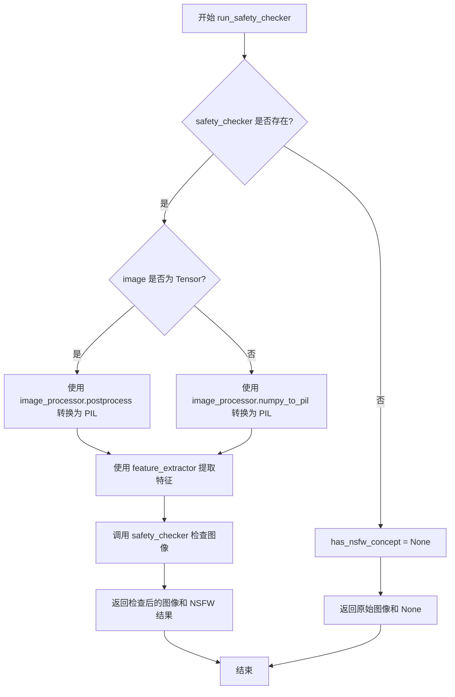
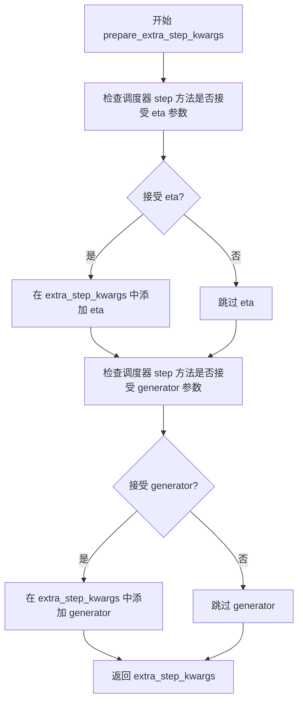
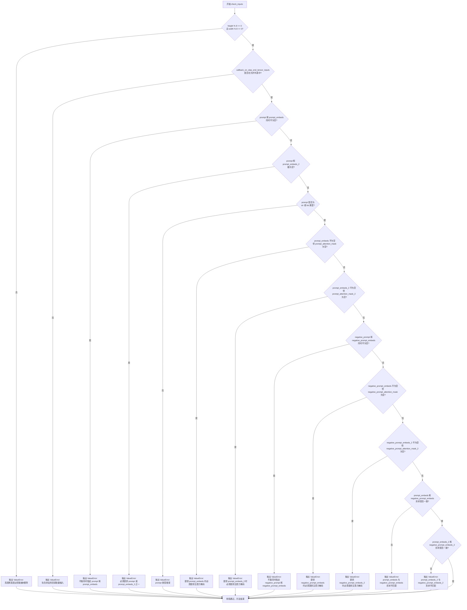
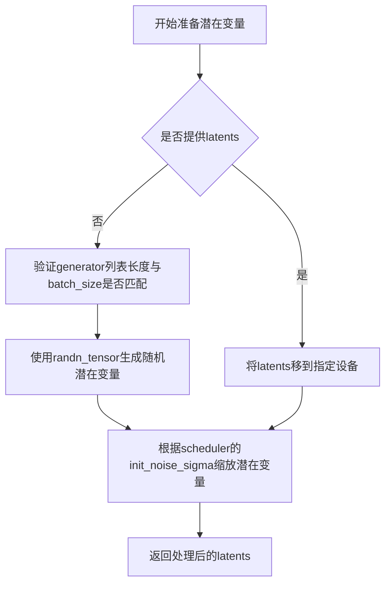

# `diffusers\src\diffusers\pipelines\pag\pipeline_pag_hunyuandit.py` 详细设计文档

HunyuanDiT PAG Pipeline是一个基于扩散模型的文本到图像生成管线，结合了双文本编码器(CLIP和T5)和Perturbed Attention Guidance (PAG)技术，支持中英文提示词生成高质量图像。

## 整体流程

```mermaid
graph TD
A[开始: __call__] --> B[0. 设置默认高度和宽度]
B --> C{是否使用分辨率绑定?}
C -- 是 --> D[映射到标准形状]
C -- 否 --> E[1. 检查输入参数]
D --> E
E --> F[2. 定义批处理大小和设备]
F --> G[3. 编码输入提示词]
G --> H[调用encode_prompt (CLIP)]
G --> I[调用encode_prompt (T5)]
H --> J[4. 准备时间步]
I --> J
J --> K[5. 准备潜在变量]
K --> L[6. 准备额外步骤参数]
L --> M[7. 创建旋转嵌入和时间ID]
M --> N{是否使用PAG?}
N -- 是 --> O[准备PAG引导]
N -- 否 --> P{是否使用CFG?}
O --> P
P --> Q[8. 去噪循环]
Q --> R[对潜在变量进行条件扩展]
R --> S[缩放模型输入]
S --> T[预测噪声残差]
T --> U{是否使用PAG?}
U -- 是 --> V[应用PAG引导]
U -- 否 --> W{是否使用CFG?}
V --> X[执行引导]
W -- 是 --> X
W -- 否 --> Y[计算上一步的噪声样本]
X --> Y
Y --> Z{是否完成所有步骤?}
Z -- 否 --> Q
Z -- 是 --> AA[9. 解码潜在变量]
AA --> BB[运行安全检查器]
BB --> CC[后处理图像]
CC --> DD[卸载模型]
DD --> EE[返回结果]
```

## 类结构

```
DiffusionPipeline (基类)
├── PAGMixin (混入类)
└── HunyuanDiTPAGPipeline
```

## 全局变量及字段


### `XLA_AVAILABLE`
    
XLA是否可用

类型：`bool`
    


### `logger`
    
日志记录器

类型：`logging.Logger`
    


### `EXAMPLE_DOC_STRING`
    
示例文档字符串

类型：`str`
    


### `STANDARD_RATIO`
    
标准宽高比数组，包含1:1、4:3、3:4、16:9、9:16比例

类型：`np.array`
    


### `STANDARD_SHAPE`
    
标准形状列表，每个比例对应的分辨率组合

类型：`list`
    


### `STANDARD_AREA`
    
标准面积列表，每个形状的像素面积

类型：`list`
    


### `SUPPORTED_SHAPE`
    
支持的形状列表，包含所有允许的分辨率对

类型：`list`
    


### `map_to_standard_shapes`
    
将目标宽高映射到最接近的标准形状

类型：`function`
    


### `get_resize_crop_region_for_grid`
    
计算调整大小和裁剪区域用于网格处理

类型：`function`
    


### `rescale_noise_cfg`
    
根据guidance_rescale重新缩放噪声预测以改善图像质量

类型：`function`
    


### `HunyuanDiTPAGPipeline.vae`
    
VAE编码器/解码器模型，用于图像与潜在表示的相互转换

类型：`AutoencoderKL`
    


### `HunyuanDiTPAGPipeline.text_encoder`
    
CLIP双语文本编码器，用于将文本提示编码为嵌入向量

类型：`BertModel`
    


### `HunyuanDiTPAGPipeline.tokenizer`
    
CLIP分词器，用于将文本分割为token

类型：`BertTokenizer`
    


### `HunyuanDiTPAGPipeline.transformer`
    
HunyuanDiT变换器模型，核心的去噪扩散模型

类型：`HunyuanDiT2DModel`
    


### `HunyuanDiTPAGPipeline.scheduler`
    
DDPM去噪调度器，控制扩散过程的噪声调度

类型：`DDPMScheduler`
    


### `HunyuanDiTPAGPipeline.safety_checker`
    
安全检查器，用于检测和过滤不安全内容

类型：`StableDiffusionSafetyChecker`
    


### `HunyuanDiTPAGPipeline.feature_extractor`
    
CLIP特征提取器，用于提取图像特征用于安全检查

类型：`CLIPImageProcessor`
    


### `HunyuanDiTPAGPipeline.text_encoder_2`
    
T5文本编码器(mT5)，提供更长的序列支持

类型：`T5EncoderModel`
    


### `HunyuanDiTPAGPipeline.tokenizer_2`
    
T5分词器，用于T5编码器的文本处理

类型：`T5Tokenizer`
    


### `HunyuanDiTPAGPipeline.vae_scale_factor`
    
VAE缩放因子，用于计算潜在空间的尺寸

类型：`int`
    


### `HunyuanDiTPAGPipeline.image_processor`
    
图像处理器，用于图像的后处理和格式转换

类型：`VaeImageProcessor`
    


### `HunyuanDiTPAGPipeline.default_sample_size`
    
默认采样尺寸，当未指定高度和宽度时使用

类型：`int`
    


### `HunyuanDiTPAGPipeline.pag_applied_layers`
    
PAG(扰动注意力引导)应用层，指定应用PAG的Transformer层

类型：`str | list[str]`
    
    

## 全局函数及方法


### `map_to_standard_shapes`

该函数用于将用户指定的目标图像宽高映射到预定义的标准宽高集合中最近的尺寸。它通过计算目标宽高比与标准宽高比的差异，以及目标面积与标准面积的差异，选择最匹配的标准分辨率，以确保生成图像的尺寸符合模型支持的标准分辨率。

参数：

- `target_width`：`int`，目标图像的宽度（像素）
- `target_height`：`int`，目标图像的高度（像素）

返回值：`tuple[int, int]`，返回最接近目标尺寸的标准宽度和高度元组

#### 流程图

```mermaid
flowchart TD
    A[Start: map_to_standard_shapes] --> B[Calculate target_ratio = target_width / target_height]
    B --> C[Find closest_ratio_idx = argmin|STANDARD_RATIO - target_ratio|]
    C --> D[Find closest_area_idx = argmin|STANDARD_AREA[closest_ratio_idx] - target_width * target_height|]
    D --> E[Get width, height from STANDARD_SHAPE[closest_ratio_idx][closest_area_idx]]
    E --> F[Return (width, height)]
```

#### 带注释源码

```python
def map_to_standard_shapes(target_width, target_height):
    """
    将目标宽高映射到最近的标准宽高尺寸。
    
    该函数通过比较目标宽高比与预定义的标准宽高比集合，
    以及目标面积与各标准形状的面积集合，选择最接近的
    标准分辨率。
    
    Args:
        target_width: 目标宽度（像素）
        target_height: 目标高度（像素）
    
    Returns:
        tuple: (标准宽度, 标准高度)
    """
    # 计算目标宽高比
    target_ratio = target_width / target_height
    
    # 找到与目标宽高比最接近的标准比例索引
    # STANDARD_RATIO 包含预定义的标准比例: [1:1, 4:3, 3:4, 16:9, 9:16]
    closest_ratio_idx = np.argmin(np.abs(STANDARD_RATIO - target_ratio))
    
    # 在目标比例对应的标准形状列表中，找到面积最接近的形状索引
    # STANDARD_AREA 是一个列表，每个元素是对应比例下所有标准形状的面积数组
    closest_area_idx = np.argmin(np.abs(STANDARD_AREA[closest_ratio_idx] - target_width * target_height))
    
    # 根据索引获取标准宽高
    width, height = STANDARD_SHAPE[closest_ratio_idx][closest_area_idx]
    
    return width, height
```


### `get_resize_crop_region_for_grid`

该函数用于计算在将图像调整大小并裁剪到目标尺寸时的裁剪区域。它根据源图像的宽高比，计算调整大小后的尺寸，并返回居中裁剪的左上角和右下角坐标。

参数：

- `src`：`tuple`，源图像的尺寸，格式为 (height, width)
- `tgt_size`：`int`，目标尺寸（正方形边长）

返回值：`tuple`，包含两个元组：
- 第一个元组：裁剪区域的左上角坐标 (crop_top, crop_left)
- 第二个元组：裁剪区域的右下角坐标 (crop_top + resize_height, crop_left + resize_width)

#### 流程图

```mermaid
flowchart TD
    A[开始] --> B[输入 src=(h,w), tgt_size]
    B --> C[设 th = tw = tgt_size]
    C --> D[计算 r = h / w]
    D --> E{r > 1?}
    E -->|是| F[resize_height = th]
    E -->|否| G[resize_width = tw]
    F --> H[resize_width = round(th / h * w)]
    G --> I[resize_height = round(tw / w * h)]
    H --> J[计算裁剪坐标]
    I --> J
    J --> K[crop_top = round((th - resize_height) / 2.0)]
    K --> L[crop_left = round((tw - resize_width) / 2.0)]
    L --> M[返回 ((crop_top, crop_left), (crop_top + resize_height, crop_left + resize_width))]
    M --> N[结束]
```

#### 带注释源码

```python
def get_resize_crop_region_for_grid(src, tgt_size):
    """
    计算图像调整大小和裁剪到目标尺寸时的裁剪区域
    
    参数:
        src: 源图像尺寸，格式为 (height, width)
        tgt_size: 目标尺寸（正方形边长）
    
    返回:
        裁剪区域的左上角和右下角坐标
    """
    # 将目标尺寸赋值给高度和宽度变量
    th = tw = tgt_size
    # 解包源图像的尺寸
    h, w = src

    # 计算源图像的宽高比
    r = h / w

    # 根据宽高比调整图像大小
    # resize: 将图像调整到目标尺寸范围内，同时保持宽高比
    if r > 1:
        # 如果图像高度大于宽度，以高度为基准调整
        resize_height = th
        # 按比例计算调整后的宽度
        resize_width = int(round(th / h * w))
    else:
        # 如果图像宽度大于高度，以宽度为基准调整
        resize_width = tw
        # 按比例计算调整后的高度
        resize_height = int(round(tw / w * h))

    # 计算居中裁剪的左上角坐标
    # 通过从目标尺寸中减去调整后的尺寸，然后除以2来获得居中偏移
    crop_top = int(round((th - resize_height) / 2.0))
    crop_left = int(round((tw - resize_width) / 2.0))

    # 返回裁剪区域的坐标
    # 第一个元组是左上角坐标 (top, left)
    # 第二个元组是右下角坐标 (top + height, left + width)
    return (crop_top, crop_left), (crop_top + resize_height, crop_left + resize_width)
```


### `rescale_noise_cfg`

该函数用于根据 guidance_rescale 参数重新缩放噪声预测张量，以提高图像质量并修复过度曝光问题。该方法基于 Common Diffusion Noise Schedules and Sample Steps are Flawed 论文的第 3.4 节，通过计算噪声预测的标准差进行重新缩放，并与原始结果混合以避免图像看起来过于平淡。

参数：

- `noise_cfg`：`torch.Tensor`，引导扩散过程中预测的噪声张量
- `noise_pred_text`：`torch.Tensor`，文本引导扩散过程中预测的噪声张量
- `guidance_rescale`：`float`，可选参数，默认为 0.0，应用于噪声预测的重新缩放因子

返回值：`torch.Tensor`，重新缩放后的噪声预测张量

#### 流程图

```mermaid
flowchart TD
    A[开始] --> B[计算 noise_pred_text 的标准差 std_text]
    B --> C[计算 noise_cfg 的标准差 std_cfg]
    C --> D[计算重新缩放的噪声预测 noise_pred_rescaled = noise_cfg \* std_text / std_cfg]
    D --> E[根据 guidance_rescale 混合结果: noise_cfg = guidance_rescale \* noise_pred_rescaled + (1 - guidance_rescale) \* noise_cfg]
    E --> F[返回重新缩放后的 noise_cfg]
```

#### 带注释源码

```python
# Copied from diffusers.pipelines.stable_diffusion.pipeline_stable_diffusion.rescale_noise_cfg
def rescale_noise_cfg(noise_cfg, noise_pred_text, guidance_rescale=0.0):
    r"""
    Rescales `noise_cfg` tensor based on `guidance_rescale` to improve image quality and fix overexposure. Based on
    Section 3.4 from [Common Diffusion Noise Schedules and Sample Steps are
    Flawed](https://huggingface.co/papers/2305.08891).

    Args:
        noise_cfg (`torch.Tensor`):
            The predicted noise tensor for the guided diffusion process.
        noise_pred_text (`torch.Tensor`):
            The predicted noise tensor for the text-guided diffusion process.
        guidance_rescale (`float`, *optional*, defaults to 0.0):
            A rescale factor applied to the noise predictions.

    Returns:
        noise_cfg (`torch.Tensor`): The rescaled noise prediction tensor.
    """
    # 计算文本引导噪声预测的标准差，保持维度以便后续广播
    std_text = noise_pred_text.std(dim=list(range(1, noise_pred_text.ndim)), keepdim=True)
    # 计算引导噪声预测的标准差，保持维度以便后续广播
    std_cfg = noise_cfg.std(dim=list(range(1, noise_cfg.ndim)), keepdim=True)
    # 重新缩放引导结果（修复过度曝光）
    # 通过将 noise_cfg 乘以文本预测与_cfg预测的标准差比率来实现
    noise_pred_rescaled = noise_cfg * (std_text / std_cfg)
    # 通过 guidance_rescale 因子与原始引导结果混合，避免"平淡"的图像
    # 当 guidance_rescale 为 0 时，返回原始 noise_cfg
    # 当 guidance_rescale 为 1 时，返回完全重新缩放的 noise_pred_rescaled
    noise_cfg = guidance_rescale * noise_pred_rescaled + (1 - guidance_rescale) * noise_cfg
    return noise_cfg
```


### HunyuanDiTPAGPipeline.__init__

这是 HunyuanDiTPAGPipeline 类的初始化方法，负责初始化扩散管道所需的所有组件，包括 VAE、文本编码器、Transformer 模型、调度器等，并配置 Perturbed Attention Guidance (PAG) 相关的参数。

参数：

- `vae`：`AutoencoderKL`，Variational Auto-Encoder (VAE) 模型，用于将图像编码和解码到潜在表示
- `text_encoder`：`BertModel`，冻结的文本编码器（双语 CLIP），用于将文本提示编码为嵌入向量
- `tokenizer`：`BertTokenizer`，用于对文本进行分词
- `transformer`：`HunyuanDiT2DModel`，腾讯混元 DiT 模型，是核心的扩散变换器
- `scheduler`：`DDPMScheduler`，用于去噪的调度器
- `safety_checker`：`StableDiffusionSafetyChecker | None`，安全检查器，用于过滤不适当的内容，默认为 None
- `feature_extractor`：`CLIPImageProcessor | None`，特征提取器，用于安全检查器的图像预处理，默认为 None
- `requires_safety_checker`：`bool`，是否需要安全检查器，默认为 True
- `text_encoder_2`：`T5EncoderModel | None`，第二个文本编码器（mT5），用于更长序列的文本编码，默认为 None
- `tokenizer_2`：`T5Tokenizer | None`，第二个文本分词器，用于 mT5 编码器，默认为 None
- `pag_applied_layers`：`str | list[str]`，PAG 应用的层标识，可以是 "blocks.1"、"blocks.16.attn1" 等形式，默认为 "blocks.1"

返回值：无（`None`），构造函数不返回任何值

#### 流程图

```mermaid
flowchart TD
    A[开始 __init__] --> B[调用 super().__init__]
    B --> C[register_modules 注册所有模块]
    C --> D{安全检查器为None<br/>且 requires_safety_checker 为 True?}
    D -->|是| E[记录警告日志]
    D -->|否| F{安全检查器不为None<br/>且 feature_extractor 为 None?}
    E --> F
    F -->|是| G[抛出 ValueError]
    F -->|否| H[计算 vae_scale_factor]
    H --> I[创建 VaeImageProcessor]
    I --> J[注册 requires_safety_checker 到 config]
    J --> K[设置 default_sample_size]
    K --> L[调用 set_pag_applied_layers<br/>配置 PAG 注意力处理器]
    L --> M[结束 __init__]
    
    G --> N[异常终止]
```

#### 带注释源码

```python
def __init__(
    self,
    vae: AutoencoderKL,  # VAE 模型
    text_encoder: BertModel,  # 文本编码器 (CLIP)
    tokenizer: BertTokenizer,  # 分词器
    transformer: HunyuanDiT2DModel,  # 核心扩散 Transformer
    scheduler: DDPMScheduler,  # 去噪调度器
    safety_checker: StableDiffusionSafetyChecker | None = None,  # 安全检查器
    feature_extractor: CLIPImageProcessor | None = None,  # 特征提取器
    requires_safety_checker: bool = True,  # 是否需要安全检查器
    text_encoder_2: T5EncoderModel | None = None,  # 第二个文本编码器 (T5)
    tokenizer_2: T5Tokenizer | None = None,  # 第二个分词器
    pag_applied_layers: str | list[str] = "blocks.1",  # PAG 应用层
):
    # 调用父类 DiffusionPipeline 和 PAGMixin 的初始化
    super().__init__()

    # 注册所有模块到管道中
    self.register_modules(
        vae=vae,
        text_encoder=text_encoder,
        tokenizer=tokenizer,
        tokenizer_2=tokenizer_2,
        transformer=transformer,
        scheduler=scheduler,
        safety_checker=safety_checker,
        feature_extractor=feature_extractor,
        text_encoder_2=text_encoder_2,
    )

    # 如果没有提供安全检查器但要求有安全检查器，记录警告
    if safety_checker is None and requires_safety_checker:
        logger.warning(
            f"You have disabled the safety checker for {self.__class__} by passing `safety_checker=None`. Ensure"
            " that you abide to the conditions of the Stable Diffusion license and do not expose unfiltered"
            " results in services or applications open to the public. Both the diffusers team and Hugging Face"
            " strongly recommend to keep the safety filter enabled in all public facing circumstances, disabling"
            " it only for use-cases that involve analyzing network behavior or auditing its results. For more"
            " information, please have a look at https://github.com/huggingface/diffusers/pull/254 ."
        )

    # 如果提供了安全检查器但没有特征提取器，抛出错误
    if safety_checker is not None and feature_extractor is None:
        raise ValueError(
            "Make sure to define a feature extractor when loading {self.__class__} if you want to use the safety"
            " checker. If you do not want to use the safety checker, you can pass `'safety_checker=None'` instead."
        )

    # 计算 VAE 缩放因子，基于 VAE 的 block_out_channels
    self.vae_scale_factor = 2 ** (len(self.vae.config.block_out_channels) - 1) if getattr(self, "vae", None) else 8
    
    # 创建图像处理器
    self.image_processor = VaeImageProcessor(vae_scale_factor=self.vae_scale_factor)
    
    # 将 requires_safety_checker 注册到配置中
    self.register_to_config(requires_safety_checker=requires_safety_checker)
    
    # 设置默认采样大小
    self.default_sample_size = (
        self.transformer.config.sample_size
        if hasattr(self, "transformer") and self.transformer is not None
        else 128
    )

    # 设置 PAG 应用的层和注意力处理器
    self.set_pag_applied_layers(
        pag_applied_layers, 
        pag_attn_processors=(PAGCFGHunyuanAttnProcessor2_0(), PAGHunyuanAttnProcessor2_0())
    )
```


### HunyuanDiTPAGPipeline.encode_prompt

该方法用于将文本提示（prompt）编码为文本编码器的隐藏状态（hidden states）。它支持双文本编码器（CLIP 和 T5），并处理分类器自由引导（Classifier-Free Guidance）所需的无条件嵌入（unconditional embeddings）。

参数：

- `prompt`：`str | list[str] | None`，要编码的提示文本，支持单个字符串或字符串列表
- `device`：`torch.device | None`，torch 设备，默认为执行设备
- `dtype`：`torch.dtype | None`，torch 数据类型，默认为 text_encoder_2 或 transformer 的数据类型
- `num_images_per_prompt`：`int`，每个提示生成的图像数量，用于批量生成
- `do_classifier_free_guidance`：`bool`，是否使用分类器自由引导
- `negative_prompt`：`str | list[str] | None`，不包含在图像生成中的提示文本
- `prompt_embeds`：`torch.Tensor | None`，预生成的文本嵌入，用于快速调整文本输入
- `negative_prompt_embeds`：`torch.Tensor | None`，预生成的负面文本嵌入
- `prompt_attention_mask`：`torch.Tensor | None`，提示文本的注意力掩码
- `negative_prompt_attention_mask`：`torch.Tensor | None`，负面提示的注意力掩码
- `max_sequence_length`：`int | None`，提示使用的最大序列长度
- `text_encoder_index`：`int`，使用的文本编码器索引，0 表示 CLIP，1 表示 T5

返回值：`tuple[torch.Tensor, torch.Tensor, torch.Tensor, torch.Tensor]`，返回四个张量：提示文本嵌入、负面提示文本嵌入、提示注意力掩码、负面提示注意力掩码

#### 流程图

```mermaid
flowchart TD
    A[开始 encode_prompt] --> B{检查 dtype}
    B -->|None| C{text_encoder_2 存在?}
    C -->|是| D[使用 text_encoder_2.dtype]
    C -->|否| E{transformer 存在?}
    E -->|是| F[使用 transformer.dtype]
    E -->|否| G[dtype = None]
    D --> H{检查 device}
    F --> H
    G --> H
    H -->|None| I[使用 _execution_device]
    I --> J[根据 text_encoder_index 选择 tokenizer 和 text_encoder]
    J --> K{设置 max_length}
    K -->|text_encoder_index == 0| L[max_length = 77]
    K -->|text_encoder_index == 1| M[max_length = 256]
    K -->|max_sequence_length 已设置| N[max_length = max_sequence_length]
    L --> O{确定 batch_size}
    M --> O
    N --> O
    O --> P{prompt_embeds 为 None?}
    P -->|是| Q[tokenizer tokenize prompt]
    Q --> R[检查截断并警告]
    R --> S[text_encoder 编码]
    S --> T[重复 prompt_embeds 和 attention_mask]
    P -->|否| U[直接使用 prompt_embeds]
    T --> V[转换为指定 dtype 和 device]
    U --> V
    V --> W{do_classifier_free_guidance 且 negative_prompt_embeds 为 None?}
    W -->|是| X{确定 uncond_tokens}
    X -->|negative_prompt 为 None| Y[uncond_tokens = 空字符串列表]
    X -->|negative_prompt 是字符串| Z[uncond_tokens = [negative_prompt]]
    X -->|negative_prompt 是列表| AA[uncond_tokens = negative_prompt]
    W -->|否| AB[跳过无条件嵌入生成]
    Y --> AB
    Z --> AB
    AA --> AB
    AB --> AC[重复 negative_prompt_embeds]
    AC --> AD[返回 prompt_embeds, negative_prompt_embeds, prompt_attention_mask, negative_prompt_attention_mask]
```

#### 带注释源码

```python
def encode_prompt(
    self,
    prompt: str,
    device: torch.device = None,
    dtype: torch.dtype = None,
    num_images_per_prompt: int = 1,
    do_classifier_free_guidance: bool = True,
    negative_prompt: str | None = None,
    prompt_embeds: torch.Tensor | None = None,
    negative_prompt_embeds: torch.Tensor | None = None,
    prompt_attention_mask: torch.Tensor | None = None,
    negative_prompt_attention_mask: torch.Tensor | None = None,
    max_sequence_length: int | None = None,
    text_encoder_index: int = 0,
):
    r"""
    Encodes the prompt into text encoder hidden states.

    Args:
        prompt (`str` or `list[str]`, *optional*):
            prompt to be encoded
        device: (`torch.device`):
            torch device
        dtype (`torch.dtype`):
            torch dtype
        num_images_per_prompt (`int`):
            number of images that should be generated per prompt
        do_classifier_free_guidance (`bool`):
            whether to use classifier free guidance or not
        negative_prompt (`str` or `list[str]`, *optional*):
            The prompt or prompts not to guide the image generation. If not defined, one has to pass
            `negative_prompt_embeds` instead. Ignored when not using guidance (i.e., ignored if `guidance_scale` is
            less than `1`).
        prompt_embeds (`torch.Tensor`, *optional*):
            Pre-generated text embeddings. Can be used to easily tweak text inputs, *e.g.* prompt weighting. If not
            provided, text embeddings will be generated from `prompt` input argument.
        negative_prompt_embeds (`torch.Tensor`, *optional*):
            Pre-generated negative text embeddings. Can be used to easily tweak text inputs, *e.g.* prompt
            weighting. If not provided, negative_prompt_embeds will be generated from `negative_prompt` input
            argument.
        prompt_attention_mask (`torch.Tensor`, *optional*):
            Attention mask for the prompt. Required when `prompt_embeds` is passed directly.
        negative_prompt_attention_mask (`torch.Tensor`, *optional*):
            Attention mask for the negative prompt. Required when `negative_prompt_embeds` is passed directly.
        max_sequence_length (`int`, *optional*): maximum sequence length to use for the prompt.
        text_encoder_index (`int`, *optional*):
            Index of the text encoder to use. `0` for clip and `1` for T5.
    """
    # 如果 dtype 未指定，则根据可用的编码器确定默认数据类型
    if dtype is None:
        if self.text_encoder_2 is not None:
            dtype = self.text_encoder_2.dtype
        elif self.transformer is not None:
            dtype = self.transformer.dtype
        else:
            dtype = None

    # 如果 device 未指定，则使用执行设备
    if device is None:
        device = self._execution_device

    # 获取所有 tokenizers 和 text_encoders（支持双文本编码器：CLIP 和 T5）
    tokenizers = [self.tokenizer, self.tokenizer_2]
    text_encoders = [self.text_encoder, self.text_encoder_2]

    # 根据索引选择要使用的 tokenizer 和 text_encoder
    tokenizer = tokenizers[text_encoder_index]
    text_encoder = text_encoders[text_encoder_index]

    # 确定最大序列长度（CLIP 默认 77，T5 默认 256）
    if max_sequence_length is None:
        if text_encoder_index == 0:
            max_length = 77
        if text_encoder_index == 1:
            max_length = 256
    else:
        max_length = max_sequence_length

    # 确定批处理大小
    if prompt is not None and isinstance(prompt, str):
        batch_size = 1
    elif prompt is not None and isinstance(prompt, list):
        batch_size = len(prompt)
    else:
        batch_size = prompt_embeds.shape[0]

    # 如果未提供 prompt_embeds，则从 prompt 生成
    if prompt_embeds is None:
        # 使用 tokenizer 对 prompt 进行分词
        text_inputs = tokenizer(
            prompt,
            padding="max_length",
            max_length=max_length,
            truncation=True,
            return_attention_mask=True,
            return_tensors="pt",
        )
        text_input_ids = text_inputs.input_ids
        # 获取未截断的 token IDs 用于检查
        untruncated_ids = tokenizer(prompt, padding="longest", return_tensors="pt").input_ids

        # 检查是否发生截断并记录警告
        if untruncated_ids.shape[-1] >= text_input_ids.shape[-1] and not torch.equal(
            text_input_ids, untruncated_ids
        ):
            removed_text = tokenizer.batch_decode(untruncated_ids[:, tokenizer.model_max_length - 1 : -1])
            logger.warning(
                "The following part of your input was truncated because CLIP can only handle sequences up to"
                f" {tokenizer.model_max_length} tokens: {removed_text}"
            )

        # 将注意力掩码和 input_ids 移动到指定设备
        prompt_attention_mask = text_inputs.attention_mask.to(device)
        prompt_embeds = text_encoder(
            text_input_ids.to(device),
            attention_mask=prompt_attention_mask,
        )
        prompt_embeds = prompt_embeds[0]
        # 为每个生成的图像重复注意力掩码
        prompt_attention_mask = prompt_attention_mask.repeat(num_images_per_prompt, 1)

    # 将 prompt_embeds 转换为指定的 dtype 和 device
    prompt_embeds = prompt_embeds.to(dtype=dtype, device=device)

    bs_embed, seq_len, _ = prompt_embeds.shape
    # 复制文本嵌入以匹配每个提示生成的图像数量（使用 mps 友好的方法）
    prompt_embeds = prompt_embeds.repeat(1, num_images_per_prompt, 1)
    prompt_embeds = prompt_embeds.view(bs_embed * num_images_per_prompt, seq_len, -1)

    # 如果使用分类器自由引导且未提供 negative_prompt_embeds，则生成无条件嵌入
    if do_classifier_free_guidance and negative_prompt_embeds is None:
        uncond_tokens: list[str]
        if negative_prompt is None:
            uncond_tokens = [""] * batch_size
        elif prompt is not None and type(prompt) is not type(negative_prompt):
            raise TypeError(
                f"`negative_prompt` should be the same type to `prompt`, but got {type(negative_prompt)} !="
                f" {type(prompt)}."
            )
        elif isinstance(negative_prompt, str):
            uncond_tokens = [negative_prompt]
        elif batch_size != len(negative_prompt):
            raise ValueError(
                f"`negative_prompt`: {negative_prompt} has batch size {len(negative_prompt)}, but `prompt`:"
                f" {prompt} has batch size {batch_size}. Please make sure that passed `negative_prompt` matches"
                " the batch size of `prompt`."
            )
        else:
            uncond_tokens = negative_prompt

        max_length = prompt_embeds.shape[1]
        # 对无条件输入进行分词
        uncond_input = tokenizer(
            uncond_tokens,
            padding="max_length",
            max_length=max_length,
            truncation=True,
            return_tensors="pt",
        )

        negative_prompt_attention_mask = uncond_input.attention_mask.to(device)
        negative_prompt_embeds = text_encoder(
            uncond_input.input_ids.to(device),
            attention_mask=negative_prompt_attention_mask,
        )
        negative_prompt_embeds = negative_prompt_embeds[0]
        negative_prompt_attention_mask = negative_prompt_attention_mask.repeat(num_images_per_prompt, 1)

    if do_classifier_free_guidance:
        # 复制无条件嵌入以匹配每个提示生成的图像数量
        seq_len = negative_prompt_embeds.shape[1]

        negative_prompt_embeds = negative_prompt_embeds.to(dtype=dtype, device=device)

        negative_prompt_embeds = negative_prompt_embeds.repeat(1, num_images_per_prompt, 1)
        negative_prompt_embeds = negative_prompt_embeds.view(batch_size * num_images_per_prompt, seq_len, -1)

    return prompt_embeds, negative_prompt_embeds, prompt_attention_mask, negative_prompt_attention_mask
```


### `HunyuanDiTPAGPipeline.run_safety_checker`

该方法用于在图像生成完成后进行安全检查，检测生成的图像是否包含不适合工作内容（NSFW），并根据需要将图像转换为适合安全检查器处理的格式。

参数：

- `self`：隐式参数，HunyuanDiTPAGPipeline 实例本身
- `image`：`torch.Tensor` 或 `numpy.ndarray`，需要检查的图像数据
- `device`：`torch.device`，用于安全检查器计算的设备
- `dtype`：`torch.dtype`，用于安全检查器计算的数据类型

返回值：(`torch.Tensor` 或 `numpy.ndarray`, `torch.Tensor` 或 `None`)，返回处理后的图像和 NSFW 检测结果元组

#### 流程图



#### 带注释源码

```python
def run_safety_checker(self, image, device, dtype):
    """
    运行安全检查器以检测 NSFW 内容
    
    参数:
        image: 需要检查的图像 (Tensor 或 ndarray)
        device: 计算设备
        dtype: 计算数据类型
    
    返回:
        tuple: (处理后的图像, NSFW 检测结果)
    """
    # 如果没有配置安全检查器，直接返回 None
    if self.safety_checker is None:
        has_nsfw_concept = None
    else:
        # 根据图像类型选择不同的预处理方式
        if torch.is_tensor(image):
            # Tensor 类型使用 postprocess 转换为 PIL 图像
            feature_extractor_input = self.image_processor.postprocess(image, output_type="pil")
        else:
            # numpy 数组直接转换为 PIL 图像
            feature_extractor_input = self.image_processor.numpy_to_pil(image)
        
        # 提取特征并移动到指定设备
        safety_checker_input = self.feature_extractor(feature_extractor_input, return_tensors="pt").to(device)
        
        # 调用安全检查器进行 NSFW 检测
        # 返回处理后的图像和 NSFW 概念标志
        image, has_nsfw_concept = self.safety_checker(
            images=image, 
            clip_input=safety_checker_input.pixel_values.to(dtype)
        )
    
    # 返回图像和 NSFW 检测结果
    return image, has_nsfw_concept
```


### HunyuanDiTPAGPipeline.prepare_extra_step_kwargs

该方法用于准备调度器（scheduler）的额外参数。由于不同调度器的签名不同，此方法通过检查调度器的 `step` 方法是否接受 `eta` 和 `generator` 参数来动态构建额外参数字典，确保兼容性。

参数：

- `generator`：`torch.Generator | list[torch.Generator] | None`，用于生成确定性噪声的随机生成器
- `eta`：`float`，DDIM 论文中的参数 η，仅在使用 DDIMScheduler 时有效，范围应为 [0, 1]

返回值：`dict`，包含调度器 `step` 方法所需的额外参数，可能包含 `eta` 和/或 `generator`

#### 流程图



#### 带注释源码

```python
def prepare_extra_step_kwargs(self, generator, eta):
    # 准备调度器步骤的额外参数，因为并非所有调度器都具有相同的签名
    # eta (η) 仅与 DDIMScheduler 一起使用，其他调度器将忽略它
    # eta 对应 DDIM 论文中的 η: https://huggingface.co/papers/2010.02502
    # eta 值应在 [0, 1] 范围内

    # 使用 inspect 模块检查调度器的 step 方法是否接受 eta 参数
    accepts_eta = "eta" in set(inspect.signature(self.scheduler.step).parameters.keys())
    
    # 初始化空字典用于存储额外参数
    extra_step_kwargs = {}
    
    # 如果调度器接受 eta 参数，则将其添加到 extra_step_kwargs
    if accepts_eta:
        extra_step_kwargs["eta"] = eta

    # 检查调度器是否接受 generator 参数
    accepts_generator = "generator" in set(inspect.signature(self.scheduler.step).parameters.keys())
    
    # 如果调度器接受 generator 参数，则将其添加到 extra_step_kwargs
    if accepts_generator:
        extra_step_kwargs["generator"] = generator
    
    # 返回包含调度器所需额外参数的字典
    return extra_step_kwargs
```


### `HunyuanDiTPAGPipeline.check_inputs`

该方法负责验证图像生成管道的输入参数合法性，包括检查图像尺寸是否可被8整除、prompt与prompt_embeds互斥、attention_mask与embeddings配对、negative与positive embeddings形状匹配等关键校验，确保后续生成流程的稳定运行。

参数：

- `self`： HunyuanDiTPAGPipeline 实例本身
- `prompt`：`str | list[str] | None`，用户输入的文本提示词
- `height`：`int`，生成图像的高度（像素）
- `width`：`int`，生成图像的宽度（像素）
- `negative_prompt`：`str | list[str] | None`，负面提示词，用于指导不希望出现的元素
- `prompt_embeds`：`torch.Tensor | None`，预计算的文本嵌入向量（CLIP编码器）
- `negative_prompt_embeds`：`torch.Tensor | None`，预计算的负面文本嵌入向量
- `prompt_attention_mask`：`torch.Tensor | None`，CLIP文本嵌入的注意力掩码
- `negative_prompt_attention_mask`：`torch.Tensor | None`，CLIP负面文本嵌入的注意力掩码
- `prompt_embeds_2`：`torch.Tensor | None`，预计算的文本嵌入向量（T5编码器）
- `negative_prompt_embeds_2`：`torch.Tensor | None`，预计算的负面文本嵌入向量（T5编码器）
- `prompt_attention_mask_2`：`torch.Tensor | None`，T5文本嵌入的注意力掩码
- `negative_prompt_attention_mask_2`：`torch.Tensor | None`，T5负面文本嵌入的注意力掩码
- `callback_on_step_end_tensor_inputs`：`list[str] | None`，每步结束回调时传递的张量输入名称列表

返回值：`None`，该方法仅进行参数校验，若校验失败则抛出 `ValueError` 异常

#### 流程图



#### 带注释源码

```python
def check_inputs(
    self,
    prompt,  # 输入文本提示词
    height,  # 生成图像高度
    width,   # 生成图像宽度
    negative_prompt=None,  # 负面提示词
    prompt_embeds=None,  # CLIP文本嵌入
    negative_prompt_embeds=None,  # CLIP负面文本嵌入
    prompt_attention_mask=None,  # CLIP注意力掩码
    negative_prompt_attention_mask=None,  # CLIP负面注意力掩码
    prompt_embeds_2=None,  # T5文本嵌入
    negative_prompt_embeds_2=None,  # T5负面文本嵌入
    prompt_attention_mask_2=None,  # T5注意力掩码
    negative_prompt_attention_mask_2=None,  # T5负面注意力掩码
    callback_on_step_end_tensor_inputs=None,  # 回调张量输入列表
):
    # 检查图像尺寸是否可被8整除（VAE和Transformer的要求）
    if height % 8 != 0 or width % 8 != 0:
        raise ValueError(f"`height` and `width` have to be divisible by 8 but are {height} and {width}.")

    # 检查回调张量输入是否在允许的列表中
    if callback_on_step_end_tensor_inputs is not None and not all(
        k in self._callback_tensor_inputs for k in callback_on_step_end_tensor_inputs
    ):
        raise ValueError(
            f"`callback_on_step_end_tensor_inputs` has to be in {self._callback_tensor_inputs}, but found {[k for k in callback_on_step_end_tensor_inputs if k not in self._callback_tensor_inputs]}"
        )

    # 校验 prompt 和 prompt_embeds 互斥，不能同时提供
    if prompt is not None and prompt_embeds is not None:
        raise ValueError(
            f"Cannot forward both `prompt`: {prompt} and `prompt_embeds`: {prompt_embeds}. Please make sure to"
            " only forward one of the two."
        )
    # 至少需要提供一种文本输入方式
    elif prompt is None and prompt_embeds is None:
        raise ValueError(
            "Provide either `prompt` or `prompt_embeds`. Cannot leave both `prompt` and `prompt_embeds` undefined."
        )
    # 第二文本编码器（T5）也必须提供文本输入
    elif prompt is None and prompt_embeds_2 is None:
        raise ValueError(
            "Provide either `prompt` or `prompt_embeds_2`. Cannot leave both `prompt` and `prompt_embeds_2` undefined."
        )
    # 校验 prompt 类型
    elif prompt is not None and (not isinstance(prompt, str) and not isinstance(prompt, list)):
        raise ValueError(f"`prompt` has to be of type `str` or `list` but is {type(prompt)}")

    # 当直接提供 prompt_embeds 时，必须配套提供 attention_mask
    if prompt_embeds is not None and prompt_attention_mask is None:
        raise ValueError("Must provide `prompt_attention_mask` when specifying `prompt_embeds`.")

    # 当直接提供 prompt_embeds_2 时，必须配套提供 attention_mask
    if prompt_embeds_2 is not None and prompt_attention_mask_2 is None:
        raise ValueError("Must provide `prompt_attention_mask_2` when specifying `prompt_embeds_2`.")

    # 校验 negative_prompt 和 negative_prompt_embeds 互斥
    if negative_prompt is not None and negative_prompt_embeds is not None:
        raise ValueError(
            f"Cannot forward both `negative_prompt`: {negative_prompt} and `negative_prompt_embeds`:"
            f" {negative_prompt_embeds}. Please make sure to only forward one of the two."
        )

    # 当直接提供 negative_prompt_embeds 时，必须配套提供 attention_mask
    if negative_prompt_embeds is not None and negative_prompt_attention_mask is None:
        raise ValueError("Must provide `negative_prompt_attention_mask` when specifying `negative_prompt_embeds`.")

    # 当直接提供 negative_prompt_embeds_2 时，必须配套提供 attention_mask
    if negative_prompt_embeds_2 is not None and negative_prompt_attention_mask_2 is None:
        raise ValueError(
            "Must provide `negative_prompt_attention_mask_2` when specifying `negative_prompt_embeds_2`."
        )
    
    # 校验 prompt_embeds 与 negative_prompt_embeds 形状必须一致（用于Classifier-Free Guidance）
    if prompt_embeds is not None and negative_prompt_embeds is not None:
        if prompt_embeds.shape != negative_prompt_embeds.shape:
            raise ValueError(
                "`prompt_embeds` and `negative_prompt_embeds` must have the same shape when passed directly, but"
                f" got: `prompt_embeds` {prompt_embeds.shape} != `negative_prompt_embeds`"
                f" {negative_prompt_embeds.shape}."
            )
    # 校验 prompt_embeds_2 与 negative_prompt_embeds_2 形状必须一致
    if prompt_embeds_2 is not None and negative_prompt_embeds_2 is not None:
        if prompt_embeds_2.shape != negative_prompt_embeds_2.shape:
            raise ValueError(
                "`prompt_embeds_2` and `negative_prompt_embeds_2` must have the same shape when passed directly, but"
                f" got: `prompt_embeds_2` {prompt_embeds_2.shape} != `negative_prompt_embeds_2`"
                f" {negative_prompt_embeds_2.shape}."
            )
```


### `HunyuanDiTPAGPipeline.prepare_latents`

该方法负责为扩散模型的去噪过程准备初始潜在变量。它根据指定的批次大小、图像尺寸和通道数构建潜在变量的shape，验证生成器列表的长度是否与批次大小匹配，然后使用随机张量生成器创建初始噪声（或使用提供的潜在变量），最后根据调度器的初始噪声标准差对潜在变量进行缩放。

参数：

- `batch_size`：`int`，批次大小，决定生成图像的数量
- `num_channels_latents`：`int`，潜在变量的通道数，对应于Transformer模型的输入通道数
- `height`：`int`，生成图像的高度（像素）
- `width`：`int`，生成图像的宽度（像素）
- `dtype`：`torch.dtype`，潜在变量的数据类型
- `device`：`torch.device`，潜在变量所在的设备（CPU或GPU）
- `generator`：`torch.Generator` 或 `list[torch.Generator]`，可选，用于生成确定性随机噪声的生成器
- `latents`：`torch.Tensor | None`，可选，如果提供了潜在变量，则使用提供的潜在变量；否则生成新的随机潜在变量

返回值：`torch.Tensor`，处理后的潜在变量张量，用于扩散模型的去噪过程

#### 流程图



#### 带注释源码

```python
def prepare_latents(
    self,
    batch_size: int,
    num_channels_latents: int,
    height: int,
    width: int,
    dtype: torch.dtype,
    device: torch.device,
    generator: torch.Generator | list[torch.Generator] | None = None,
    latents: torch.Tensor | None = None,
) -> torch.Tensor:
    """
    为扩散模型的去噪过程准备初始潜在变量。
    
    参数:
        batch_size: 批次大小
        num_channels_latents: 潜在变量的通道数
        height: 生成图像的高度
        width: 生成图像的宽度
        dtype: 潜在变量的数据类型
        device: 设备
        generator: 随机生成器
        latents: 可选的预定义潜在变量
    
    返回:
        处理后的潜在变量张量
    """
    # 计算潜在变量的shape，考虑VAE的缩放因子
    # height和width需要除以vae_scale_factor（通常是8）以得到潜在空间的尺寸
    shape = (
        batch_size,
        num_channels_latents,
        int(height) // self.vae_scale_factor,
        int(width) // self.vae_scale_factor,
    )
    
    # 验证生成器列表的长度是否与批次大小匹配
    if isinstance(generator, list) and len(generator) != batch_size:
        raise ValueError(
            f"You have passed a list of generators of length {len(generator)}, but requested an effective batch"
            f" size of {batch_size}. Make sure the batch size matches the length of the generators."
        )

    # 如果没有提供潜在变量，则生成随机噪声
    if latents is None:
        latents = randn_tensor(shape, generator=generator, device=device, dtype=dtype)
    else:
        # 如果提供了潜在变量，确保它在正确的设备上
        latents = latents.to(device)

    # 根据调度器的要求缩放初始噪声
    # 不同调度器对噪声的缩放要求不同，这确保了与调度器的兼容性
    latents = latents * self.scheduler.init_noise_sigma
    
    return latents
```


### HunyuanDiTPAGPipeline.__call__

该方法是 HunyuanDiT 文本到图像生成管道的核心调用函数，结合了腾讯 HunyuanDiT 模型和 Perturbed Attention Guidance (PAG) 技术，支持中英文提示词生成高质量图像。

参数：

- `prompt`：`str | list[str]`，要引导图像生成的提示词，若未定义则需传递 prompt_embeds
- `height`：`int | None`，生成图像的高度（像素）
- `width`：`int | None`，生成图像的宽度（像素）
- `num_inference_steps`：`int`，去噪步数，默认为 50
- `guidance_scale`：`float`，引导比例，控制图像与提示词的相关性，默认为 5.0
- `negative_prompt`：`str | list[str] | None`，负面提示词，用于指定不应包含的内容
- `num_images_per_prompt`：`int`，每个提示词生成的图像数量，默认为 1
- `eta`：`float`，DDIM 调度器的 eta 参数，默认为 0.0
- `generator`：`torch.Generator | list[torch.Generator] | None`，随机数生成器，用于确保可重复生成
- `latents`：`torch.Tensor | None`，预定义的潜在变量
- `prompt_embeds`：`torch.Tensor | None`，预生成的 CLIP 文本嵌入
- `prompt_embeds_2`：`torch.Tensor | None`，预生成的 T5 文本嵌入
- `negative_prompt_embeds`：`torch.Tensor | None`，负面提示词的 CLIP 嵌入
- `negative_prompt_embeds_2`：`torch.Tensor | None`，负面提示词的 T5 嵌入
- `prompt_attention_mask`：`torch.Tensor | None`，CLIP 提示词的注意力掩码
- `prompt_attention_mask_2`：`torch.Tensor | None`，T5 提示词的注意力掩码
- `negative_prompt_attention_mask`：`torch.Tensor | None`，负面提示词的 CLIP 注意力掩码
- `negative_prompt_attention_mask_2`：`torch.Tensor | None`，负面提示词的 T5 注意力掩码
- `output_type`：`str`，输出格式，可选 "pil" 或 "np.array"，默认为 "pil"
- `return_dict`：`bool`，是否返回 StableDiffusionPipelineOutput，默认为 True
- `callback_on_step_end`：`Callable | PipelineCallback | MultiPipelineCallbacks | None`，每步结束时的回调函数
- `callback_on_step_end_tensor_inputs`：`list[str]`，传递给回调的张量输入列表
- `guidance_rescale`：`float`，噪声预测的重缩放因子，默认为 0.0
- `original_size`：`tuple[int, int]`，原始图像尺寸，默认为 (1024, 1024)
- `target_size`：`tuple[int, int]`，目标图像尺寸
- `crops_coords_top_left`：`tuple[int, int]`，裁剪左上角坐标，默认为 (0, 0)
- `use_resolution_binning`：`bool`，是否使用分辨率分箱，默认为 True
- `pag_scale`：`float`，PAG 引导的比例因子，默认为 3.0
- `pag_adaptive_scale`：`float`，PAG 自适应比例因子，默认为 0.0

返回值：`StableDiffusionPipelineOutput | tuple`，生成的图像和 NSFW 检测结果

#### 流程图

```mermaid
flowchart TD
    A[开始 __call__] --> B{检查回调类型}
    B -->|PipelineCallback| C[设置回调张量输入]
    C --> D[设置默认高度和宽度]
    D --> E{分辨率分箱启用?}
    E -->|是且不支持的分辨率| F[映射到标准形状]
    E -->|否| G[检查输入参数]
    F --> G
    G --> H[设置引导比例和 PAG 参数]
    H --> I[确定批次大小]
    I --> J[编码提示词 - CLIP]
    J --> K[编码提示词 - T5]
    K --> L[准备时间步]
    L --> M[准备潜在变量]
    M --> N[准备额外步骤参数]
    N --> O[创建旋转嵌入/风格/时间 ID]
    O --> P{是否使用 PAG 引导?]
    P -->|是| Q[准备扰动注意力引导]
    P -->|否| R{是否使用 CFG?]
    Q --> S[连接条件和文本嵌入]
    R -->|是| S
    R -->|否| T[跳过去噪循环]
    S --> U[初始化进度条]
    U --> V[开始去噪循环]
    V --> W{有中断?}
    W -->|是| W
    W -->|否| X[扩展潜在变量]
    X --> Y[缩放模型输入]
    Y --> Z[扩展时间步]
    Z --> AA[Transformer 预测噪声]
    AA --> AB{使用 PAG 引导?}
    AB -->|是| AC[应用 PAG 引导]
    AB -->|否| AD{使用 CFG?}
    AC --> AE[计算噪声预测]
    AD -->|是| AF[应用 CFG 引导]
    AD -->|否| AE
    AE --> AG[重缩放噪声配置]
    AG --> AH[调度器步进]
    AH --> AI{有回调?}
    AI -->|是| AJ[执行回调]
    AI -->|否| AK{达到最后一步或 warmup 结束?}
    AJ --> AK
    AK --> AL{还有更多时间步?}
    AL -->|是| V
    AL -->|否| AM{输出类型是 latent?}
    AM -->|否| AN[VAE 解码]
    AM -->|是| AO[使用潜在变量作为图像]
    AN --> AP[运行安全检查器]
    AO --> AP
    AP --> AQ[后处理图像]
    AQ --> AR[卸载模型]
    AR --> AS{使用 PAG?}
    AS -->|是| AT[恢复原始注意力处理器]
    AS -->|否| AU{返回 dict?}
    AT --> AU
    AU -->|是| AV[返回 PipelineOutput]
    AU -->|否| AX[返回元组]
    AV --> AY[结束]
    AX --> AY
```

#### 带注释源码

```python
@torch.no_grad()
@replace_example_docstring(EXAMPLE_DOC_STRING)
def __call__(
    self,
    prompt: str | list[str] = None,
    height: int | None = None,
    width: int | None = None,
    num_inference_steps: int = 50,
    guidance_scale: float = 5.0,
    negative_prompt: str | list[str] | None = None,
    num_images_per_prompt: int = 1,
    eta: float = 0.0,
    generator: torch.Generator | list[torch.Generator] | None = None,
    latents: torch.Tensor | None = None,
    prompt_embeds: torch.Tensor | None = None,
    prompt_embeds_2: torch.Tensor | None = None,
    negative_prompt_embeds: torch.Tensor | None = None,
    negative_prompt_embeds_2: torch.Tensor | None = None,
    prompt_attention_mask: torch.Tensor | None = None,
    prompt_attention_mask_2: torch.Tensor | None = None,
    negative_prompt_attention_mask: torch.Tensor | None = None,
    negative_prompt_attention_mask_2: torch.Tensor | None = None,
    output_type: str = "pil",
    return_dict: bool = True,
    callback_on_step_end: Callable[[int, int, dict], None]
    | PipelineCallback
    | MultiPipelineCallbacks
    | None = None,
    callback_on_step_end_tensor_inputs: list[str] = ["latents"],
    guidance_rescale: float = 0.0,
    original_size: tuple[int, int] = (1024, 1024),
    target_size: tuple[int, int] = None,
    crops_coords_top_left: tuple[int, int] = (0, 0),
    use_resolution_binning: bool = True,
    pag_scale: float = 3.0,
    pag_adaptive_scale: float = 0.0,
):
    # 0. 处理回调 - 如果传入的是回调对象，提取其张量输入列表
    if isinstance(callback_on_step_end, (PipelineCallback, MultiPipelineCallbacks)):
        callback_on_step_end_tensor_inputs = callback_on_step_end.tensor_inputs

    # 1. 设置默认高度和宽度 - 使用 VAE 缩放因子和默认样本大小
    height = height or self.default_sample_size * self.vae_scale_factor
    width = width or self.default_sample_size * self.vae_scale_factor
    # 确保高度和宽度是 16 的倍数
    height = int((height // 16) * 16)
    width = int((width // 16) * 16)

    # 如果启用分辨率分箱且输入分辨率不在支持列表中，映射到最接近的标准分辨率
    if use_resolution_binning and (height, width) not in SUPPORTED_SHAPE:
        width, height = map_to_standard_shapes(width, height)
        height = int(height)
        width = int(width)
        logger.warning(f"Reshaped to (height, width)=({height}, {width}), Supported shapes are {SUPPORTED_SHAPE}")

    # 2. 验证输入参数 - 确保所有参数有效
    self.check_inputs(
        prompt, height, width, negative_prompt,
        prompt_embeds, negative_prompt_embeds,
        prompt_attention_mask, negative_prompt_attention_mask,
        prompt_embeds_2, negative_prompt_embeds_2,
        prompt_attention_mask_2, negative_prompt_attention_mask_2,
        callback_on_step_end_tensor_inputs,
    )
    # 设置引导参数
    self._guidance_scale = guidance_scale
    self._guidance_rescale = guidance_rescale
    self._interrupt = False
    self._pag_scale = pag_scale
    self._pag_adaptive_scale = pag_adaptive_scale

    # 3. 确定批次大小
    if prompt is not None and isinstance(prompt, str):
        batch_size = 1
    elif prompt is not None and isinstance(prompt, list):
        batch_size = len(prompt)
    else:
        batch_size = prompt_embeds.shape[0]

    device = self._execution_device

    # 4. 编码输入提示词 - 使用 CLIP 编码器 (text_encoder_index=0)
    (
        prompt_embeds,
        negative_prompt_embeds,
        prompt_attention_mask,
        negative_prompt_attention_mask,
    ) = self.encode_prompt(
        prompt=prompt,
        device=device,
        dtype=self.transformer.dtype,
        num_images_per_prompt=num_images_per_prompt,
        do_classifier_free_guidance=self.do_classifier_free_guidance,
        negative_prompt=negative_prompt,
        prompt_embeds=prompt_embeds,
        negative_prompt_embeds=negative_prompt_embeds,
        prompt_attention_mask=prompt_attention_mask,
        negative_prompt_attention_mask=negative_prompt_attention_mask,
        max_sequence_length=77,  # CLIP 最大长度
        text_encoder_index=0,
    )
    # 编码提示词 - 使用 T5 编码器 (text_encoder_index=1)
    (
        prompt_embeds_2,
        negative_prompt_embeds_2,
        prompt_attention_mask_2,
        negative_prompt_attention_mask_2,
    ) = self.encode_prompt(
        prompt=prompt,
        device=device,
        dtype=self.transformer.dtype,
        num_images_per_prompt=num_images_per_prompt,
        do_classifier_free_guidance=self.do_classifier_free_guidance,
        negative_prompt=negative_prompt,
        prompt_embeds=prompt_embeds_2,
        negative_prompt_embeds=negative_prompt_embeds_2,
        prompt_attention_mask=prompt_attention_mask_2,
        negative_prompt_attention_mask=negative_prompt_attention_mask_2,
        max_sequence_length=256,  # T5 最大长度
        text_encoder_index=1,
    )

    # 5. 准备时间步 - 从调度器获取去噪步骤
    self.scheduler.set_timesteps(num_inference_steps, device=device)
    timesteps = self.scheduler.timesteps

    # 6. 准备潜在变量 - 初始化随机噪声
    num_channels_latents = self.transformer.config.in_channels
    latents = self.prepare_latents(
        batch_size * num_images_per_prompt,
        num_channels_latents,
        height,
        width,
        prompt_embeds.dtype,
        device,
        generator,
        latents,
    )

    # 7. 准备额外步骤参数 - 处理调度器的额外参数
    extra_step_kwargs = self.prepare_extra_step_kwargs(generator, eta)

    # 8. 创建旋转嵌入、风格嵌入和时间 ID
    grid_height = height // 8 // self.transformer.config.patch_size
    grid_width = width // 8 // self.transformer.config.patch_size
    base_size = 512 // 8 // self.transformer.config.patch_size
    grid_crops_coords = get_resize_crop_region_for_grid((grid_height, grid_width), base_size)
    # 获取 2D 旋转位置嵌入
    image_rotary_emb = get_2d_rotary_pos_embed(
        self.transformer.inner_dim // self.transformer.num_heads,
        grid_crops_coords,
        (grid_height, grid_width),
        device=device,
        output_type="pt",
    )

    style = torch.tensor([0], device=device)  # 风格嵌入

    target_size = target_size or (height, width)
    # 构建时间 ID: [原始尺寸, 目标尺寸, 裁剪坐标]
    add_time_ids = list(original_size + target_size + crops_coords_top_left)
    add_time_ids = torch.tensor([add_time_ids], dtype=prompt_embeds.dtype)

    # 9. 准备引导 - 组合条件和无条件嵌入
    if self.do_perturbed_attention_guidance:
        # 使用 PAG 时需要三个分支: 无条件 + 条件 + 文本
        prompt_embeds = self._prepare_perturbed_attention_guidance(
            prompt_embeds, negative_prompt_embeds, self.do_classifier_free_guidance
        )
        prompt_attention_mask = self._prepare_perturbed_attention_guidance(
            prompt_attention_mask, negative_prompt_attention_mask, self.do_classifier_free_guidance
        )
        prompt_embeds_2 = self._prepare_perturbed_attention_guidance(
            prompt_embeds_2, negative_prompt_embeds_2, self.do_classifier_free_guidance
        )
        prompt_attention_mask_2 = self._prepare_perturbed_attention_guidance(
            prompt_attention_mask_2, negative_prompt_attention_mask_2, self.do_classifier_free_guidance
        )
        add_time_ids = torch.cat([add_time_ids] * 3, dim=0)
        style = torch.cat([style] * 3, dim=0)
    elif self.do_classifier_free_guidance:
        # 标准 CFG: 无条件 + 条件
        prompt_embeds = torch.cat([negative_prompt_embeds, prompt_embeds])
        prompt_attention_mask = torch.cat([negative_prompt_attention_mask, prompt_attention_mask])
        prompt_embeds_2 = torch.cat([negative_prompt_embeds_2, prompt_embeds_2])
        prompt_attention_mask_2 = torch.cat([negative_prompt_attention_mask_2, prompt_attention_mask_2])
        add_time_ids = torch.cat([add_time_ids] * 2, dim=0)
        style = torch.cat([style] * 2, dim=0)

    # 移动到设备
    prompt_embeds = prompt_embeds.to(device=device)
    prompt_attention_mask = prompt_attention_mask.to(device=device)
    prompt_embeds_2 = prompt_embeds_2.to(device=device)
    prompt_attention_mask_2 = prompt_attention_mask_2.to(device=device)
    add_time_ids = add_time_ids.to(dtype=prompt_embeds.dtype, device=device).repeat(
        batch_size * num_images_per_prompt, 1
    )
    style = style.to(device=device).repeat(batch_size * num_images_per_prompt)

    # 10. 去噪循环
    num_warmup_steps = len(timesteps) - num_inference_steps * self.scheduler.order
    self._num_timesteps = len(timesteps)

    # 如果使用 PAG，设置注意力处理器
    if self.do_perturbed_attention_guidance:
        original_attn_proc = self.transformer.attn_processors
        self._set_pag_attn_processor(
            pag_applied_layers=self.pag_applied_layers,
            do_classifier_free_guidance=self.do_classifier_free_guidance,
        )

    with self.progress_bar(total=num_inference_steps) as progress_bar:
        for i, t in enumerate(timesteps):
            # 检查是否中断
            if self.interrupt:
                continue

            # 扩展潜在变量以匹配批次大小
            latent_model_input = torch.cat([latents] * (prompt_embeds.shape[0] // latents.shape[0]))
            latent_model_input = self.scheduler.scale_model_input(latent_model_input, t)

            # 扩展时间步以匹配潜在变量的第一维
            t_expand = torch.tensor([t] * latent_model_input.shape[0], device=device).to(
                dtype=latent_model_input.dtype
            )

            # Transformer 预测噪声残差
            noise_pred = self.transformer(
                latent_model_input,
                t_expand,
                encoder_hidden_states=prompt_embeds,
                text_embedding_mask=prompt_attention_mask,
                encoder_hidden_states_t5=prompt_embeds_2,
                text_embedding_mask_t5=prompt_attention_mask_2,
                image_meta_size=add_time_ids,
                style=style,
                image_rotary_emb=image_rotary_emb,
                return_dict=False,
            )[0]

            # 分离条件和无条件预测 (如果是 PAG，则为三部分)
            noise_pred, _ = noise_pred.chunk(2, dim=1)

            # 应用引导
            if self.do_perturbed_attention_guidance:
                # 应用扰动注意力引导
                noise_pred, noise_pred_text = self._apply_perturbed_attention_guidance(
                    noise_pred, self.do_classifier_free_guidance, self.guidance_scale, t, True
                )
            elif self.do_classifier_free_guidance:
                # 应用标准分类器自由引导
                noise_pred_uncond, noise_pred_text = noise_pred.chunk(2)
                noise_pred = noise_pred_uncond + guidance_scale * (noise_pred_text - noise_pred_uncond)

            # 根据 guidance_rescale 重缩放噪声配置
            if self.do_classifier_free_guidance and guidance_rescale > 0.0:
                noise_pred = rescale_noise_cfg(noise_pred, noise_pred_text, guidance_rescale=guidance_rescale)

            # 计算上一步: x_t -> x_t-1
            latents = self.scheduler.step(noise_pred, t, latents, **extra_step_kwargs, return_dict=False)[0]

            # 执行回调
            if callback_on_step_end is not None:
                callback_kwargs = {}
                for k in callback_on_step_end_tensor_inputs:
                    callback_kwargs[k] = locals()[k]
                callback_outputs = callback_on_step_end(self, i, t, callback_kwargs)

                # 更新可能被回调修改的值
                latents = callback_outputs.pop("latents", latents)
                prompt_embeds = callback_outputs.pop("prompt_embeds", prompt_embeds)
                negative_prompt_embeds = callback_outputs.pop("negative_prompt_embeds", negative_prompt_embeds)
                prompt_embeds_2 = callback_outputs.pop("prompt_embeds_2", prompt_embeds_2)
                negative_prompt_embeds_2 = callback_outputs.pop("negative_prompt_embeds_2", negative_prompt_embeds_2)

            # 更新进度条 - 在最后一步或 warmup 结束后
            if i == len(timesteps) - 1 or ((i + 1) > num_warmup_steps and (i + 1) % self.scheduler.order == 0):
                progress_bar.update()

            # XLA 设备支持
            if XLA_AVAILABLE:
                xm.mark_step()

    # 11. 解码潜在变量到图像
    if not output_type == "latent":
        # VAE 解码
        image = self.vae.decode(latents / self.vae.config.scaling_factor, return_dict=False)[0]
        # 运行安全检查器
        image, has_nsfw_concept = self.run_safety_checker(image, device, prompt_embeds.dtype)
    else:
        image = latents
        has_nsfw_concept = None

    # 12. 归一化处理
    if has_nsfw_concept is None:
        do_denormalize = [True] * image.shape[0]
    else:
        do_denormalize = [not has_nsfw for has_nsfw in has_nsfw_concept]

    # 后处理图像
    image = self.image_processor.postprocess(image, output_type=output_type, do_denormalize=do_denormalize)

    # 13. 卸载模型
    self.maybe_free_model_hooks()

    # 恢复原始注意力处理器 (如果使用了 PAG)
    if self.do_perturbed_attention_guidance:
        self.transformer.set_attn_processor(original_attn_proc)

    # 14. 返回结果
    if not return_dict:
        return (image, has_nsfw_concept)

    return StableDiffusionPipelineOutput(images=image, nsfw_content_detected=has_nsfw_concept)
```

## 关键组件


### HunyuanDiTPAGPipeline

核心扩散管道类，集成了HunyuanDiT模型和Perturbed Attention Guidance (PAG)技术，支持中英文文本到图像生成。

### PAGMixin

扰动注意力引导(PAG)的混入类，提供了`do_perturbed_attention_guidance`属性以及`_prepare_perturbed_attention_guidance`、`_apply_perturbed_attention_guidance`等方法，用于实现PAG技术以提升图像质量。

### 双文本编码器架构

同时使用CLIP (text_encoder/tokenizer) 和 T5 (text_encoder_2/tokenizer_2) 两个文本编码器，分别对应不同的max_sequence_length (77和256)，增强文本理解能力。

### 分辨率映射与二值化机制

通过STANDARD_RATIO、STANDARD_SHAPE、STANDARD_AREA和SUPPORTED_SHAPE定义标准分辨率集合，配合map_to_standard_shapes和get_resize_crop_region_for_grid函数实现分辨率自适应映射。

### 图像后处理与VAE解码

使用VaeImageProcessor进行图像后处理，包括归一化、反归一化和格式转换；VAE解码将latents转换为最终图像。

### 安全检查器集成

集成StableDiffusionSafetyChecker进行NSFW内容检测，确保生成内容的安全性。

### 调度器与噪声管理

使用DDPMScheduler进行去噪步骤调度，配合rescale_noise_cfg函数实现噪声配置重缩放，基于Imagen论文改进guidance策略。

### 时间ID与旋转位置嵌入

通过get_2d_rotary_pos_embed生成2D旋转位置嵌入(image_rotary_emb)，结合add_time_ids(包含original_size、target_size和crops_coords_top_left)处理图像元信息。

### 回调与中断机制

支持PipelineCallback和MultiPipelineCallbacks实现自定义回调，通过interrupt属性支持推理中断，XLA集成支持分布式训练。

## 问题及建议


### 已知问题

-   **大量代码重复**：`encode_prompt`、`run_safety_checker`、`prepare_extra_step_kwargs`、`check_inputs`、`prepare_latents`等方法直接从其他管道复制过来，导致代码冗余，维护成本高。
-   **硬编码值缺乏灵活性**：`default_sample_size = 128`、VAE scale factor计算逻辑、分辨率映射表等硬编码在类中，扩展性差。
-   **check_inputs方法过于臃肿**：单个方法包含超过80行输入验证代码，违反单一职责原则，错误消息模板化不足。
-   **循环内张量创建**：在去噪循环的每次迭代中重复创建`torch.tensor([t] * ...)`和`add_time_ids.repeat()`，可优化为预分配。
-   **XLA支持不完整**：虽然检测了XLA可用性，但仅在循环外调用`xm.mark_step()`，未充分利用XLA的图优化能力。
-   **类型提示不完整**：部分方法参数缺少类型注解，如`check_inputs`中的`prompt`参数，文档与实际类型不完全匹配。
-   **回调机制复杂**：多层回调封装（`PipelineCallback`和`MultiPipelineCallbacks`），增加了代码理解难度和潜在的性能开销。
-   **属性管理混乱**：通过`self._guidance_scale`、`self._guidance_rescale`、`self._interrupt`等私有属性管理状态，缺乏统一的状态管理机制。

### 优化建议

-   **提取基类或Mixin**：将通用的管道功能（如`encode_prompt`、`check_inputs`等）提取到基类或Mixin中，减少代码重复。
-   **配置对象化**：将硬编码的分辨率、比例因子等封装为配置类或数据类，提高可配置性。
-   **拆分验证逻辑**：将`check_inputs`拆分为多个小型验证函数，每个函数负责单一验证逻辑，提升可读性和可测试性。
-   **预分配张量**：在去噪循环开始前预分配`t_expand`等重复使用的张量，减少循环内的内存分配开销。
-   **增强XLA优化**：考虑使用`xm.optimizer_step`或更细粒度的XLA标记，充分发挥XLA加速优势。
-   **完善类型注解**：补充所有公开方法的完整类型注解，使用`typing.Optional`替代`| None`语法以保持一致性。
-   **简化回调设计**：提供回调机制的简化接口，隐藏复杂性，同时保留高级功能。
-   **状态管理模式**：引入状态管理类或使用`dataclass`管理管道状态，提高代码可维护性。

## 其它


### 设计目标与约束

**设计目标：**
实现一个基于 HunyuanDiT 模型的中英文双语文本到图像生成管道，集成 Perturbed Attention Guidance (PAG) 技术以提升图像质量。该管道支持多种标准分辨率和宽高比，能够生成 1024x1024、1280x1280 等多种尺寸的图像。

**设计约束：**
- 输入高度和宽度必须能被 8 整除
- 使用 resolution binning 时，仅支持预定义的标准分辨率（1024x1024、1280x1280、1024x768 等 10 种）
- CLIP tokenizer 最大序列长度为 77，T5 tokenizer 最大序列长度为 256
- 批量生成时，generator 列表长度必须与 batch_size 匹配

### 错误处理与异常设计

**参数验证（check_inputs 方法）：**
- 高度和宽度必须被 8 整除，否则抛出 ValueError
- callback_on_step_end_tensor_inputs 中的每个键必须在 _callback_tensor_inputs 列表中
- prompt 和 prompt_embeds 不能同时提供，negative_prompt 和 negative_prompt_embeds 不能同时提供
- 如果提供 prompt_embeds，则必须同时提供 prompt_attention_mask
- prompt_embeds 和 negative_prompt_embeds 的形状必须一致

**运行时错误处理：**
- 当 safety_checker 为 None 但 requires_safety_checker 为 True 时，发出警告
- 当 safety_checker 存在但 feature_extractor 为 None 时，抛出 ValueError
- tokenizer 截断文本时发出警告，提示被截断的内容

### 数据流与状态机

**主生成流程：**
1. 参数解析与默认值设置 → 2. 输入验证 → 3. 提示词编码（CLIP+T5 双编码器）→ 4. 时间步准备 → 5. 潜在变量初始化 → 6. 旋转位置嵌入、样式嵌入、时间 ID 计算 → 7. 分类器自由引导准备 → 8. 去噪循环（迭代推断）→ 9. VAE 解码 → 10. 安全检查 → 11. 后处理与输出

**状态管理：**
- 通过内部属性 _guidance_scale、_guidance_rescale、_interrupt、_pag_scale、_pag_adaptive_scale 管理运行时状态
- 通过 do_perturbed_attention_guidance 属性判断是否启用 PAG
- 使用 progress_bar 跟踪去噪进度

### 外部依赖与接口契约

**核心依赖：**
- transformers: BertModel, BertTokenizer, T5EncoderModel, T5Tokenizer, CLIPImageProcessor
- diffusers: DiffusionPipeline, AutoencoderKL, HunyuanDiT2DModel, DDPMScheduler, VaeImageProcessor
- diffusers.models.attention_processor: PAGCFGHunyuanAttnProcessor2_0, PAGHunyuanAttnProcessor2_0
- diffusers.models.embeddings: get_2d_rotary_pos_embed
- torch, numpy

**接口契约：**
- __call__ 方法返回 StableDiffusionPipelineOutput 或 (image, has_nsfw_concept) 元组
- encode_prompt 返回 (prompt_embeds, negative_prompt_embeds, prompt_attention_mask, negative_prompt_attention_mask) 四元组
- prepare_latents 返回初始噪声张量
- scheduler.step 返回下一步的潜在变量

### 性能优化与资源管理

**模型卸载：**
- 使用 model_cpu_offload_seq 定义卸载顺序："text_encoder->text_encoder_2->transformer->vae"
- 通过 maybe_free_model_hooks 在生成完成后卸载所有模型
- safety_checker 被排除在 CPU 卸载之外

**性能特性：**
- 支持 XLA 加速（通过 torch_xla）
- 支持混合精度计算（float16）
- 使用 randn_tensor 生成确定性随机噪声
- 支持批量生成（num_images_per_prompt）
- 支持分辨率自适应（resolution binning）减少不必要的计算

### 安全性考虑

**NSFW 检测：**
- 集成 StableDiffusionSafetyChecker 进行内容安全检查
- 通过 feature_extractor 提取图像特征进行安全评估
- 输出 has_nsfw_concept 标记潜在不安全内容
- 支持配置 requires_safety_checker 强制启用安全检查

**安全建议：**
- 默认启用安全检查器
- 公开服务中建议保持安全过滤器启用
- 仅在特定分析场景下可考虑禁用

### 版本兼容性

**依赖版本：**
- 需要 Python 3.8+ 环境
- PyTorch 1.11+ 推荐
- transformers 库需支持 BERT、T5、CLIP 模型
- diffusers 库需支持 Stable Diffusion 管道结构

**兼容性说明：**
- 代码继承自 DiffusionPipeline 和 PAGMixin
- 部分方法从 diffusers 其他管道复制（标记为 Copied from）
- 支持自定义 scheduler，但需符合标准接口

### 测试策略

**功能测试：**
- 使用示例代码验证端到端生成功能
- 测试中英文双语提示词支持
- 测试不同分辨率和宽高比生成
- 测试 PAG 功能（pag_scale > 0）
- 测试分类器自由引导（guidance_scale > 1）

**边界条件测试：**
- 测试不支持的分辨率（应自动映射到标准分辨率）
- 测试 prompt 和 prompt_embeds 同时提供的错误
- 测试 batch_size 与 generator 长度不匹配的错误

### 配置与参数说明

**主要配置参数：**
- vae_scale_factor: VAE 缩放因子，默认从 VAE 配置推断
- default_sample_size: 默认采样大小，默认从 transformer 配置获取或使用 128
- vae_scale_factor: 2^(len(vae.config.block_out_channels)-1) 或 8
- pag_applied_layers: PAG 应用层，默认为 "blocks.1"

**生成参数：**
- num_inference_steps: 去噪步数，默认 50
- guidance_scale: 引导尺度，默认 5.0
- pag_scale: PAG 尺度，默认 3.0
- guidance_rescale: 噪声配置重缩放，默认 0.0
- original_size: 原始尺寸，默认 (1024, 1024)
- use_resolution_binning: 是否使用分辨率分箱，默认 True

### 使用示例与最佳实践

**基本用法：**
```python
import torch
from diffusers import AutoPipelineForText2Image

pipe = AutoPipelineForText2Image.from_pretrained(
    "Tencent-Hunyuan/HunyuanDiT-v1.2-Diffusers",
    torch_dtype=torch.float16,
    enable_pag=True,
    pag_applied_layers=[14],
).to("cuda")

prompt = "一个宇航员在骑马"
image = pipe(prompt, guidance_scale=4, pag_scale=3).images[0]
```

**最佳实践：**
- 使用 float16 提升推理速度并减少显存占用
- 在支持的分辨率中选择以获得最佳质量
- 启用 PAG 可提升图像细节和质量
- 使用 guidance_rescale (0.0-0.5) 可改善过曝问题
- 在生成多张图像时，合理设置 num_images_per_prompt
- 长时间生成任务可利用 callback_on_step_end 进行进度监控和中间结果处理


    