# `diffusers\src\diffusers\pipelines\pag\pipeline_pag_kolors.py` 详细设计文档

KolorsPAGPipeline是一个基于Diffusion模型的文本到图像生成Pipeline，集成了Perturbed Attention Guidance (PAG)技术，通过ChatGLM3-6B文本编码器、VAE解码器和UNet条件去噪网络实现高质量图像生成，支持IP-Adapter、LoRA加载器等高级功能。

## 整体流程

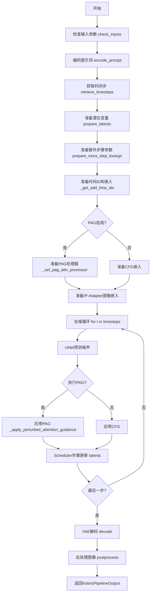

## 类结构

```
DiffusionPipeline (基类)
├── StableDiffusionMixin
├── StableDiffusionXLLoraLoaderMixin
├── IPAdapterMixin
└── PAGMixin
    └── KolorsPAGPipeline (主类)
```

## 全局变量及字段


### `XLA_AVAILABLE`
    
torch_xla库可用性标志，用于判断是否可以在TPU上运行

类型：`bool`
    


### `logger`
    
模块级日志记录器，用于输出调试和信息日志

类型：`logging.Logger`
    


### `EXAMPLE_DOC_STRING`
    
示例文档字符串，包含Kolors Pipeline的使用示例代码

类型：`str`
    


### `retrieve_timesteps`
    
检索时间步函数，根据调度器获取扩散过程的时间步序列

类型：`function`
    


### `KolorsPAGPipeline.model_cpu_offload_seq`
    
CPU卸载顺序字符串，定义模型组件卸载到CPU的顺序

类型：`str`
    


### `KolorsPAGPipeline._optional_components`
    
可选组件列表，包含image_encoder和feature_extractor等可选模块

类型：`list`
    


### `KolorsPAGPipeline._callback_tensor_inputs`
    
回调张量输入列表，定义哪些张量可以在回调函数中使用

类型：`list`
    


### `KolorsPAGPipeline.vae`
    
变分自编码器模型，用于编码和解码图像的潜在表示

类型：`AutoencoderKL`
    


### `KolorsPAGPipeline.text_encoder`
    
文本编码器模型，将文本提示转换为嵌入向量

类型：`ChatGLMModel`
    


### `KolorsPAGPipeline.tokenizer`
    
分词器，将文本分割成token序列并转换为模型输入格式

类型：`ChatGLMTokenizer`
    


### `KolorsPAGPipeline.unet`
    
条件U-Net模型，根据噪声和条件信息预测噪声残差

类型：`UNet2DConditionModel`
    


### `KolorsPAGPipeline.scheduler`
    
扩散调度器，管理去噪过程中的时间步和噪声调度

类型：`KarrasDiffusionSchedulers`
    


### `KolorsPAGPipeline.image_encoder`
    
CLIP图像编码器，用于IP-Adapter图像特征提取

类型：`CLIPVisionModelWithProjection`
    


### `KolorsPAGPipeline.feature_extractor`
    
CLIP图像特征提取器，用于预处理图像输入

类型：`CLIPImageProcessor`
    


### `KolorsPAGPipeline.vae_scale_factor`
    
VAE缩放因子，用于调整潜在空间的尺寸

类型：`int`
    


### `KolorsPAGPipeline.image_processor`
    
VAE图像处理器，处理图像的编码和解码操作

类型：`VaeImageProcessor`
    


### `KolorsPAGPipeline.default_sample_size`
    
默认采样尺寸，基于UNet配置的样本大小

类型：`int`
    


### `KolorsPAGPipeline.pag_applied_layers`
    
PAG应用层，指定应用扰动注意力引导的Transformer层

类型：`str|list`
    


### `KolorsPAGPipeline._guidance_scale`
    
引导尺度，控制分类器自由引导的强度

类型：`float`
    


### `KolorsPAGPipeline._cross_attention_kwargs`
    
交叉注意力参数字典，传递给注意力处理器

类型：`dict`
    


### `KolorsPAGPipeline._denoising_end`
    
去噪结束点，控制提前终止去噪过程的比例

类型：`float`
    


### `KolorsPAGPipeline._num_timesteps`
    
时间步数，记录去噪过程的总步数

类型：`int`
    


### `KolorsPAGPipeline._interrupt`
    
中断标志，用于在去噪循环中中断生成过程

类型：`bool`
    


### `KolorsPAGPipeline._pag_scale`
    
PAG尺度，扰动注意力引导的缩放因子

类型：`float`
    


### `KolorsPAGPipeline._pag_adaptive_scale`
    
PAG自适应尺度，用于动态调整PAG强度

类型：`float`
    
    

## 全局函数及方法


### `retrieve_timesteps`

获取调度器时间步的辅助函数，用于在扩散模型推理过程中设置和检索时间步序列。该函数支持自定义时间步和sigmas，并处理不同调度器的兼容性检查。

参数：

- `scheduler`：`SchedulerMixin`，调度器对象，用于获取时间步
- `num_inference_steps`：`int | None`，推理步数，用于生成样本时使用的扩散步数，若使用此参数则`timesteps`必须为`None`
- `device`：`str | torch.device | None`，时间步要移动到的设备，若为`None`则不移动时间步
- `timesteps`：`list[int] | None`，自定义时间步，用于覆盖调度器的时间步间隔策略，若传入此参数则`num_inference_steps`和`sigmas`必须为`None`
- `sigmas`：`list[float] | None`，自定义sigmas，用于覆盖调度器的时间步间隔策略，若传入此参数则`num_inference_steps`和`timesteps`必须为`None`
- `**kwargs`：任意关键字参数，将传递给`scheduler.set_timesteps`方法

返回值：`tuple[torch.Tensor, int]`，元组包含调度器的时间步序列（第一个元素）和推理步数（第二个元素）

#### 流程图

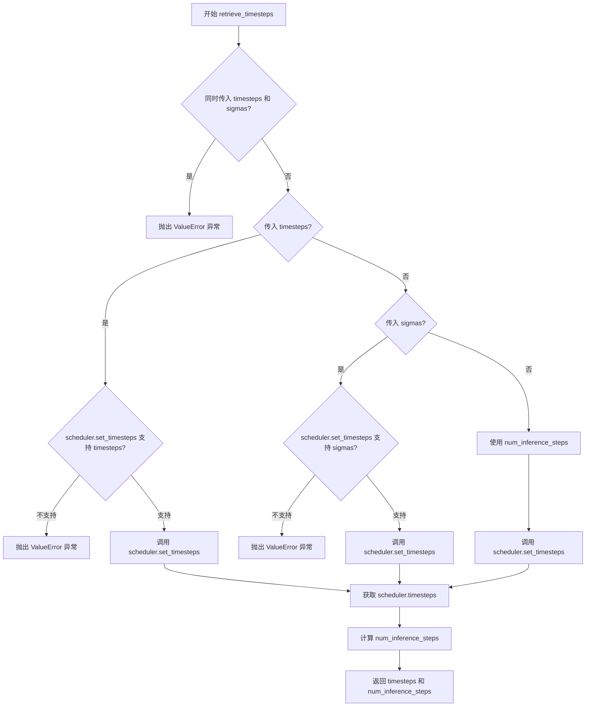

#### 带注释源码

```python
def retrieve_timesteps(
    scheduler,
    num_inference_steps: int | None = None,
    device: str | torch.device | None = None,
    timesteps: list[int] | None = None,
    sigmas: list[float] | None = None,
    **kwargs,
):
    r"""
    Calls the scheduler's `set_timesteps` method and retrieves timesteps from the scheduler after the call. Handles
    custom timesteps. Any kwargs will be supplied to `scheduler.set_timesteps`.

    Args:
        scheduler (`SchedulerMixin`):
            The scheduler to get timesteps from.
        num_inference_steps (`int`):
            The number of diffusion steps used when generating samples with a pre-trained model. If used, `timesteps`
            must be `None`.
        device (`str` or `torch.device`, *optional*):
            The device to which the timesteps should be moved to. If `None`, the timesteps are not moved.
        timesteps (`list[int]`, *optional*):
            Custom timesteps used to override the timestep spacing strategy of the scheduler. If `timesteps` is passed,
            `num_inference_steps` and `sigmas` must be `None`.
        sigmas (`list[float]`, *optional*):
            Custom sigmas used to override the timestep spacing strategy of the scheduler. If `sigmas` is passed,
            `num_inference_steps` and `timesteps` must be `None`.

    Returns:
        `tuple[torch.Tensor, int]`: A tuple where the first element is the timestep schedule from the scheduler and the
        second element is the number of inference steps.
    """
    # 检查是否同时传入了 timesteps 和 sigmas，两者只能传一个
    if timesteps is not None and sigmas is not None:
        raise ValueError("Only one of `timesteps` or `sigmas` can be passed. Please choose one to set custom values")
    
    # 处理自定义时间步的情况
    if timesteps is not None:
        # 检查调度器是否支持 timesteps 参数
        accepts_timesteps = "timesteps" in set(inspect.signature(scheduler.set_timesteps).parameters.keys())
        if not accepts_timesteps:
            raise ValueError(
                f"The current scheduler class {scheduler.__class__}'s `set_timesteps` does not support custom"
                f" timestep schedules. Please check whether you are using the correct scheduler."
            )
        # 调用调度器的 set_timesteps 方法设置自定义时间步
        scheduler.set_timesteps(timesteps=timesteps, device=device, **kwargs)
        # 从调度器获取时间步序列
        timesteps = scheduler.timesteps
        # 计算推理步数
        num_inference_steps = len(timesteps)
    
    # 处理自定义 sigmas 的情况
    elif sigmas is not None:
        # 检查调度器是否支持 sigmas 参数
        accept_sigmas = "sigmas" in set(inspect.signature(scheduler.set_timesteps).parameters.keys())
        if not accept_sigmas:
            raise ValueError(
                f"The current scheduler class {scheduler.__class__}'s `set_timesteps` does not support custom"
                f" sigmas schedules. Please check whether you are using the correct scheduler."
            )
        # 调用调度器的 set_timesteps 方法设置自定义 sigmas
        scheduler.set_timesteps(sigmas=sigmas, device=device, **kwargs)
        # 从调度器获取时间步序列
        timesteps = scheduler.timesteps
        # 计算推理步数
        num_inference_steps = len(timesteps)
    
    # 默认情况：使用 num_inference_steps 设置时间步
    else:
        scheduler.set_timesteps(num_inference_steps, device=device, **kwargs)
        timesteps = scheduler.timesteps
    
    # 返回时间步序列和推理步数
    return timesteps, num_inference_steps
```


### `KolorsPAGPipeline.__init__`

初始化Kolors文本到图像生成管道的核心方法，负责注册所有模型组件、配置调度器、设置图像处理器以及初始化PAG（Perturbed Attention Guidance）相关参数。

参数：

- `vae`：`AutoencoderKL`，Variational Auto-Encoder模型，用于编码和解码图像与潜在表示之间的转换
- `text_encoder`：`ChatGLMModel`，冻结的文本编码器，Kolors使用ChatGLM3-6B
- `tokenizer`：`ChatGLMTokenizer`，用于对文本进行分词
- `unet`：`UNet2DConditionModel`，条件U-Net架构，用于对编码后的图像潜在表示进行去噪
- `scheduler`：`KarrasDiffusionSchedulers`，与unet结合使用以去噪图像潜在表示的调度器
- `image_encoder`：`CLIPVisionModelWithProjection`，可选的CLIP图像编码器，用于IP-Adapter功能
- `feature_extractor`：`CLIPImageProcessor`，可选的特征提取器，用于处理图像输入
- `force_zeros_for_empty_prompt`：`bool`，是否将空提示的负提示嵌入强制设为0
- `pag_applied_layers`：`str | list[str]`，应用PAG的transformer注意力层，默认为"mid"

返回值：`None`，构造函数无返回值

#### 流程图

```mermaid
flowchart TD
    A[开始 __init__] --> B[调用父类 __init__]
    B --> C[register_modules: 注册 vae, text_encoder, tokenizer, unet, scheduler, image_encoder, feature_extractor]
    C --> D[register_to_config: 注册 force_zeros_for_empty_prompt 配置]
    D --> E{self.vae 是否存在}
    E -->|是| F[计算 vae_scale_factor = 2^(len(vae.config.block_out_channels) - 1)]
    E -->|否| G[vae_scale_factor = 8]
    F --> H[创建 VaeImageProcessor]
    G --> H
    H --> I{self.unet 是否存在且有 sample_size}
    I -->|是| J[default_sample_size = unet.config.sample_size]
    I -->|否| K[default_sample_size = 128]
    J --> L[调用 set_pag_applied_layers 设置PAG应用层]
    K --> L
    L --> M[结束 __init__]
```

#### 带注释源码

```python
def __init__(
    self,
    vae: AutoencoderKL,                          # VAE模型实例
    text_encoder: ChatGLMModel,                  # 文本编码器实例
    tokenizer: ChatGLMTokenizer,                # 分词器实例
    unet: UNet2DConditionModel,                 # UNet去噪模型实例
    scheduler: KarrasDiffusionSchedulers,       # 扩散调度器实例
    image_encoder: CLIPVisionModelWithProjection = None,  # 可选的CLIP图像编码器
    feature_extractor: CLIPImageProcessor = None,         # 可选的图像特征提取器
    force_zeros_for_empty_prompt: bool = False,  # 是否强制零嵌入
    pag_applied_layers: str | list[str] = "mid", # PAG应用层配置
):
    # 调用父类DiffusionPipeline的初始化方法
    super().__init__()

    # 注册所有模型模块，使它们可以通过pipeline.xxx访问
    self.register_modules(
        vae=vae,
        text_encoder=text_encoder,
        tokenizer=tokenizer,
        unet=unet,
        scheduler=scheduler,
        image_encoder=image_encoder,
        feature_extractor=feature_extractor,
    )

    # 将force_zeros_for_empty_prompt注册到pipeline配置中
    self.register_to_config(force_zeros_for_empty_prompt=force_zeros_for_empty_prompt)

    # 计算VAE缩放因子，用于调整潜在表示的空间维度
    # 基于VAE的block_out_channels计算，典型值为8
    self.vae_scale_factor = 2 ** (len(self.vae.config.block_out_channels) - 1) if getattr(self, "vae", None) else 8

    # 创建图像处理器，用于图像的预处理和后处理
    self.image_processor = VaeImageProcessor(vae_scale_factor=self.vae_scale_factor)

    # 确定默认采样尺寸，用于生成图像的分辨率计算
    self.default_sample_size = (
        self.unet.config.sample_size
        if hasattr(self, "unet") and self.unet is not None and hasattr(self.unet.config, "sample_size")
        else 128  # 回退到默认值128
    )

    # 设置PAG（Perturbed Attention Guidance）应用的层
    # 这允许在特定的UNet层上应用扰动注意力引导以提高生成质量
    self.set_pag_applied_layers(pag_applied_layers)
```


### `KolorsPAGPipeline.encode_prompt`

该方法将文本提示词编码为文本编码器的隐藏状态，用于后续的图像生成过程。它支持正负提示词的嵌入生成、批量处理、分类器自由引导（CFG）以及预计算嵌入的复用。

参数：

- `self`：隐式参数，类方法的标准参数
- `prompt`：`str | list[str] | None`，要编码的提示词，可以是单个字符串或字符串列表
- `device`：`torch.device | None`，torch 设备，默认为执行设备
- `num_images_per_prompt`：`int`，每个提示词生成的图像数量，默认为 1
- `do_classifier_free_guidance`：`bool`，是否使用分类器自由引导，默认为 True
- `negative_prompt`：`str | list[str] | None`，不参与图像生成的提示词，用于引导
- `prompt_embeds`：`torch.FloatTensor | None`，预生成的文本嵌入，用于微调输入
- `pooled_prompt_embeds`：`torch.Tensor | None`，预生成的池化文本嵌入
- `negative_prompt_embeds`：`torch.FloatTensor | None`，预生成的负面文本嵌入
- `negative_pooled_prompt_embeds`：`torch.Tensor | None`，预生成的负面池化文本嵌入
- `max_sequence_length`：`int`，提示词使用的最大序列长度，默认为 256

返回值：`tuple[torch.Tensor, torch.Tensor, torch.Tensor, torch.Tensor]`，包含提示词嵌入、负面提示词嵌入、池化提示词嵌入和负面池化提示词嵌入的元组

#### 流程图

```mermaid
flowchart TD
    A[开始 encode_prompt] --> B{检查 prompt 类型}
    B -->|字符串| C[batch_size = 1]
    B -->|列表| D[batch_size = len/prompt]
    B -->|否则| E[使用 prompt_embeds.shape[0]]
    C --> F[定义 tokenizer 和 text_encoder]
    D --> F
    E --> F
    F --> G{prompt_embeds 为空?}
    G -->|是| H[遍历 tokenizers 和 text_encoders]
    G -->|否| I[跳过嵌入生成]
    H --> J[tokenizer 处理 prompt]
    J --> K[text_encoder 编码]
    K --> L[提取 hidden_states]
    L --> M[permute 和 clone]
    M --> N[重复 num_images_per_prompt 次]
    N --> O[调整形状]
    O --> P[添加到 prompt_embeds_list]
    P --> Q{prompt_embeds_list 长度 > 1?}
    Q -->|是| R[合并多个嵌入]
    Q -->|否| S[使用第一个嵌入]
    I --> T{需要 CFG?}
    R --> T
    S --> T
    T -->|是| U{negative_prompt_embeds 为空?}
    T -->|否| V[直接返回]
    U -->|是且 zero_out| W[生成零嵌入]
    U -->|否| X[处理 uncond_tokens]
    W --> Y[重复并调整形状]
    X --> Z[tokenizer 处理 uncond_tokens]
    Z --> AA[text_encoder 编码]
    AA --> AB[提取负面嵌入]
    AB --> AC[重复 num_images_per_prompt]
    AC --> AD[调整形状]
    AD --> Y
    Y --> AE[重复 pooled 嵌入]
    AE --> V[返回四个嵌入]
```

#### 带注释源码

```python
def encode_prompt(
    self,
    prompt,
    device: torch.device | None = None,
    num_images_per_prompt: int = 1,
    do_classifier_free_guidance: bool = True,
    negative_prompt=None,
    prompt_embeds: torch.FloatTensor | None = None,
    pooled_prompt_embeds: torch.Tensor | None = None,
    negative_prompt_embeds: torch.FloatTensor | None = None,
    negative_pooled_prompt_embeds: torch.Tensor | None = None,
    max_sequence_length: int = 256,
):
    r"""
    Encodes the prompt into text encoder hidden states.

    Args:
        prompt (`str` or `list[str]`, *optional*):
            prompt to be encoded
        device: (`torch.device`):
            torch device
        num_images_per_prompt (`int`):
            number of images that should be generated per prompt
        do_classifier_free_guidance (`bool`):
            whether to use classifier free guidance or not
        negative_prompt (`str` or `list[str]`, *optional*):
            The prompt or prompts not to guide the image generation. If not defined, one has to pass
            `negative_prompt_embeds` instead. Ignored when not using guidance (i.e., ignored if `guidance_scale` is
            less than `1`).
        prompt_embeds (`torch.FloatTensor`, *optional*):
            Pre-generated text embeddings. Can be used to easily tweak text inputs, *e.g.* prompt weighting. If not
            provided, text embeddings will be generated from `prompt` input argument.
        pooled_prompt_embeds (`torch.Tensor`, *optional*):
            Pre-generated pooled text embeddings. Can be used to easily tweak text inputs, *e.g.* prompt weighting.
            If not provided, pooled text embeddings will be generated from `prompt` input argument.
        negative_prompt_embeds (`torch.FloatTensor`, *optional*):
            Pre-generated negative text embeddings. Can be used to easily tweak text inputs, *e.g.* prompt
            weighting. If not provided, negative_prompt_embeds will be generated from `negative_prompt` input
            argument.
        negative_pooled_prompt_embeds (`torch.Tensor`, *optional*):
            Pre-generated negative pooled text embeddings. Can be used to easily tweak text inputs, *e.g.* prompt
            weighting. If not provided, pooled negative_prompt_embeds will be generated from `negative_prompt`
            input argument.
        max_sequence_length (`int` defaults to 256): Maximum sequence length to use with the `prompt`.
    """
    # 确定设备，如果未指定则使用执行设备
    device = device or self._execution_device

    # 根据 prompt 类型确定批量大小
    if prompt is not None and isinstance(prompt, str):
        batch_size = 1
    elif prompt is not None and isinstance(prompt, list):
        batch_size = len(prompt)
    else:
        # 如果没有 prompt，则使用 prompt_embeds 的批量大小
        batch_size = prompt_embeds.shape[0]

    # 定义 tokenizers 和 text_encoders 列表（支持多模态/多编码器扩展）
    tokenizers = [self.tokenizer]
    text_encoders = [self.text_encoder]

    # 如果没有提供预计算的 prompt_embeds，则需要生成
    if prompt_embeds is None:
        prompt_embeds_list = []
        for tokenizer, text_encoder in zip(tokenizers, text_encoders):
            # 使用 tokenizer 将文本转换为 token 张量
            text_inputs = tokenizer(
                prompt,
                padding="max_length",
                max_length=max_sequence_length,
                truncation=True,
                return_tensors="pt",
            ).to(device)
            
            # 使用 text_encoder 编码，输出隐藏状态
            output = text_encoder(
                input_ids=text_inputs["input_ids"],
                attention_mask=text_inputs["attention_mask"],
                position_ids=text_inputs["position_ids"],
                output_hidden_states=True,
            )

            # 处理隐藏状态：[max_sequence_length, batch, hidden_size] -> [batch, max_sequence_length, hidden_size]
            # clone 创建连续张量以避免内存问题
            prompt_embeds = output.hidden_states[-2].permute(1, 0, 2).clone()
            # 提取池化嵌入：[max_sequence_length, batch, hidden_size] -> [batch, hidden_size]
            pooled_prompt_embeds = output.hidden_states[-1][-1, :, :].clone()
            
            # 获取形状信息
            bs_embed, seq_len, _ = prompt_embeds.shape
            # 为每个提示词重复嵌入 num_images_per_prompt 次
            prompt_embeds = prompt_embeds.repeat(1, num_images_per_prompt, 1)
            prompt_embeds = prompt_embeds.view(bs_embed * num_images_per_prompt, seq_len, -1)

            prompt_embeds_list.append(prompt_embeds)

        # 如果有多个编码器，合并结果；否则使用第一个
        prompt_embeds = prompt_embeds_list[0]

    # 获取无条件嵌入用于分类器自由引导（CFG）
    # 确定是否需要将负面提示词置零
    zero_out_negative_prompt = negative_prompt is None and self.config.force_zeros_for_empty_prompt

    # 处理 CFG：需要生成负面提示词嵌入
    if do_classifier_free_guidance and negative_prompt_embeds is None and zero_out_negative_prompt:
        # 如果配置要求且未提供负面提示，则使用零嵌入
        negative_prompt_embeds = torch.zeros_like(prompt_embeds)
    elif do_classifier_free_guidance and negative_prompt_embeds is None:
        # 需要生成实际的负面提示词嵌入
        uncond_tokens: list[str]
        
        # 处理各种负面提示词输入情况
        if negative_prompt is None:
            uncond_tokens = [""] * batch_size
        elif prompt is not None and type(prompt) is not type(negative_prompt):
            raise TypeError(
                f"`negative_prompt` should be the same type to `prompt`, but got {type(negative_prompt)} !="
                f" {type(prompt)}."
            )
        elif isinstance(negative_prompt, str):
            uncond_tokens = [negative_prompt]
        elif batch_size != len(negative_prompt):
            raise ValueError(
                f"`negative_prompt`: {negative_prompt} has batch size {len(negative_prompt)}, but `prompt`:"
                f" {prompt} has batch size {batch_size}. Please make sure that passed `negative_prompt` matches"
                " the batch size of `prompt`."
            )
        else:
            uncond_tokens = negative_prompt

        negative_prompt_embeds_list = []

        for tokenizer, text_encoder in zip(tokenizers, text_encoders):
            # 使用 tokenizer 处理无条件输入
            uncond_input = tokenizer(
                uncond_tokens,
                padding="max_length",
                max_length=max_sequence_length,
                truncation=True,
                return_tensors="pt",
            ).to(device)
            
            # 编码无条件输入
            output = text_encoder(
                input_ids=uncond_input["input_ids"],
                attention_mask=uncond_input["attention_mask"],
                position_ids=uncond_input["position_ids"],
                output_hidden_states=True,
            )

            # 处理负面提示词嵌入
            negative_prompt_embeds = output.hidden_states[-2].permute(1, 0, 2).clone()
            # 提取负面池化嵌入
            negative_pooled_prompt_embeds = output.hidden_states[-1][-1, :, :].clone()

            # 如果启用 CFG，复制无条件嵌入以匹配批量大小
            if do_classifier_free_guidance:
                # 获取序列长度
                seq_len = negative_prompt_embeds.shape[1]

                # 转换为适当的 dtype 和 device
                negative_prompt_embeds = negative_prompt_embeds.to(dtype=text_encoder.dtype, device=device)

                # 重复以匹配每个提示词生成的图像数量
                negative_prompt_embeds = negative_prompt_embeds.repeat(1, num_images_per_prompt, 1)
                negative_prompt_embeds = negative_prompt_embeds.view(
                    batch_size * num_images_per_prompt, seq_len, -1
                )

            negative_prompt_embeds_list.append(negative_prompt_embeds)

        negative_prompt_embeds = negative_prompt_embeds_list[0]

    # 处理池化提示词嵌入：重复以匹配批量大小
    bs_embed = pooled_prompt_embeds.shape[0]
    pooled_prompt_embeds = pooled_prompt_embeds.repeat(1, num_images_per_prompt).view(
        bs_embed * num_images_per_prompt, -1
    )

    # 如果启用 CFG，处理负面池化嵌入
    if do_classifier_free_guidance:
        negative_pooled_prompt_embeds = negative_pooled_prompt_embeds.repeat(1, num_images_per_prompt).view(
            bs_embed * num_images_per_prompt, -1
        )

    # 返回四个嵌入：提示词嵌入、负面提示词嵌入、池化提示词嵌入、负面池化提示词嵌入
    return prompt_embeds, negative_prompt_embeds, pooled_prompt_embeds, negative_pooled_prompt_embeds
```


### `KolorsPAGPipeline.encode_image`

该方法用于将输入图像编码为图像嵌入向量，支持有条件和无条件的图像嵌入生成，以便在图像生成过程中实现分类器自由引导（Classifier-Free Guidance）。方法首先检查输入是否为张量格式，若不是则通过特征提取器转换，然后根据参数决定返回完整隐藏状态或仅图像嵌入。

参数：

- `image`：`torch.Tensor` 或其他格式，输入图像数据，可以是原始图像或已处理的张量
- `device`：`torch.device`，指定计算设备，用于将图像张量移动到指定设备
- `num_images_per_prompt`：`int`，每个提示词生成的图像数量，用于批量生成时的嵌入复制
- `output_hidden_states`：`bool` 或 `None`，可选参数，指定是否返回编码器的完整隐藏状态，默认为 `None`

返回值：`tuple`，返回两个张量组成的元组——第一个是条件图像嵌入（`image_embeds` 或 `image_enc_hidden_states`），第二个是对应的无条件图像嵌入（`uncond_image_embeds` 或 `uncond_image_enc_hidden_states`），用于分类器自由引导计算

#### 流程图

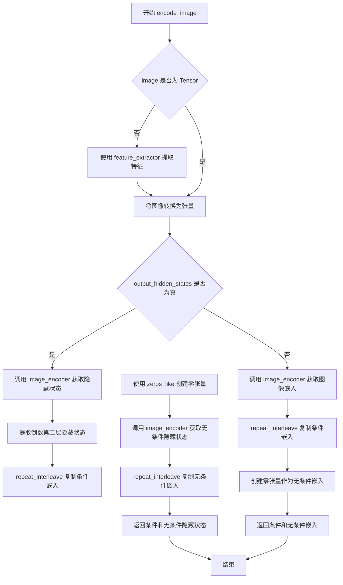

#### 带注释源码

```python
def encode_image(self, image, device, num_images_per_prompt, output_hidden_states=None):
    """
    将输入图像编码为图像嵌入向量，用于图像生成过程中的条件控制。
    
    Args:
        image: 输入图像，支持 torch.Tensor 或其他图像格式（PIL Image, numpy array 等）
        device: torch.device，目标计算设备
        num_images_per_prompt: 每个提示词生成的图像数量
        output_hidden_states: 是否返回完整的隐藏状态序列而非图像嵌入
    
    Returns:
        tuple: (条件嵌入, 无条件嵌入)
            - 若 output_hidden_states=True: 返回隐藏状态元组
            - 否则: 返回图像嵌入元组
    """
    # 获取图像编码器的参数数据类型，确保输入数据类型一致
    dtype = next(self.image_encoder.parameters()).dtype

    # 如果输入不是张量格式，使用特征提取器进行预处理
    # 这支持 PIL Image、numpy array 等多种图像输入格式
    if not isinstance(image, torch.Tensor):
        image = self.feature_extractor(image, return_tensors="pt").pixel_values

    # 将图像移动到指定设备并转换为正确的 dtype
    image = image.to(device=device, dtype=dtype)
    
    # 根据 output_hidden_states 参数决定输出格式
    if output_hidden_states:
        # 返回完整隐藏状态：用于更细粒度的特征控制
        # hidden_states[-2] 通常是倒数第二层，包含了丰富的视觉特征
        image_enc_hidden_states = self.image_encoder(image, output_hidden_states=True).hidden_states[-2]
        # repeat_interleave 在 batch 维度复制嵌入，以匹配 num_images_per_prompt
        image_enc_hidden_states = image_enc_hidden_states.repeat_interleave(num_images_per_prompt, dim=0)
        
        # 创建零张量作为无条件嵌入，用于分类器自由引导
        # zeros_like 确保形状和设备与原始嵌入一致
        uncond_image_enc_hidden_states = self.image_encoder(
            torch.zeros_like(image), output_hidden_states=True
        ).hidden_states[-2]
        uncond_image_enc_hidden_states = uncond_image_enc_hidden_states.repeat_interleave(
            num_images_per_prompt, dim=0
        )
        return image_enc_hidden_states, uncond_image_enc_hidden_states
    else:
        # 使用预训练的图像嵌入（image_embeds），这是编码器的池化输出
        # 更轻量，适合大多数使用场景
        image_embeds = self.image_encoder(image).image_embeds
        image_embeds = image_embeds.repeat_interleave(num_images_per_prompt, dim=0)
        
        # 无条件嵌入设为零向量，表示不引导的默认状态
        # 这是 CFG 的核心：条件和无条件嵌入的差异引导生成方向
        uncond_image_embeds = torch.zeros_like(image_embeds)

        return image_embeds, uncond_image_embeds
```


### `KolorsPAGPipeline.prepare_ip_adapter_image_embeds`

该方法用于准备IP-Adapter的图像嵌入向量，支持classifier-free guidance模式，能够处理预计算的图像嵌入或直接从图像编码器生成嵌入，并将嵌入复制到指定设备。

参数：

- `ip_adapter_image`：`PipelineImageInput | None`，要用于IP-Adapter的输入图像，可以是单个图像或图像列表
- `ip_adapter_image_embeds`：`list[torch.Tensor] | None`，预计算的图像嵌入向量列表，如果为None则从`ip_adapter_image`编码生成
- `device`：`torch.device`，要将嵌入向量移动到的目标设备
- `num_images_per_prompt`：`int`，每个prompt生成的图像数量，用于复制嵌入向量
- `do_classifier_free_guidance`：`bool`，是否启用classifier-free guidance，决定是否生成negative图像嵌入

返回值：`list[torch.Tensor]`，处理后的IP-Adapter图像嵌入向量列表，每个元素是拼接了negative和positive嵌入的张量

#### 流程图

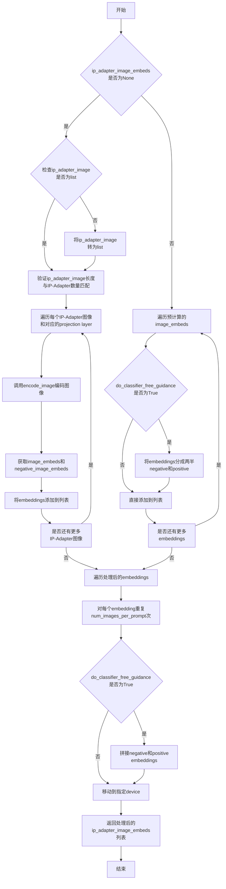

#### 带注释源码

```python
def prepare_ip_adapter_image_embeds(
    self, ip_adapter_image, ip_adapter_image_embeds, device, num_images_per_prompt, do_classifier_free_guidance
):
    """
    准备IP-Adapter的图像嵌入向量。
    
    该方法支持两种模式：
    1. 从原始图像编码生成嵌入（ip_adapter_image_embeds为None时）
    2. 直接使用预计算的嵌入（ip_adapter_image_embeds不为None时）
    
    参数:
        ip_adapter_image: 要用于IP-Adapter的输入图像
        ip_adapter_image_embeds: 预计算的图像嵌入，如果为None则从图像编码
        device: 目标设备
        num_images_per_prompt: 每个prompt生成的图像数量
        do_classifier_free_guidance: 是否启用classifier-free guidance
    
    返回:
        处理后的IP-Adapter图像嵌入列表
    """
    # 初始化存放图像嵌入的列表
    image_embeds = []
    
    # 如果启用classifier-free guidance，同时初始化negative图像嵌入列表
    if do_classifier_free_guidance:
        negative_image_embeds = []
    
    # 模式1：需要从原始图像编码生成嵌入
    if ip_adapter_image_embeds is None:
        # 确保输入图像是列表格式
        if not isinstance(ip_adapter_image, list):
            ip_adapter_image = [ip_adapter_image]

        # 验证图像数量与IP-Adapter数量是否匹配
        if len(ip_adapter_image) != len(self.unet.encoder_hid_proj.image_projection_layers):
            raise ValueError(
                f"`ip_adapter_image` must have same length as the number of IP Adapters. "
                f"Got {len(ip_adapter_image)} images and {len(self.unet.encoder_hid_proj.image_projection_layers)} IP Adapters."
            )

        # 遍历每个IP-Adapter的图像和对应的projection layer
        for single_ip_adapter_image, image_proj_layer in zip(
            ip_adapter_image, self.unet.encoder_hid_proj.image_projection_layers
        ):
            # 判断是否需要输出hidden states（ImageProjection类型不需要）
            output_hidden_state = not isinstance(image_proj_layer, ImageProjection)
            
            # 调用encode_image编码单个图像
            single_image_embeds, single_negative_image_embeds = self.encode_image(
                single_ip_adapter_image, device, 1, output_hidden_state
            )

            # 添加batch维度并存储positive embeddings
            image_embeds.append(single_image_embeds[None, :])
            
            # 如果启用classifier-free guidance，同时存储negative embeddings
            if do_classifier_free_guidance:
                negative_image_embeds.append(single_negative_image_embeds[None, :])
    else:
        # 模式2：直接使用预计算的嵌入向量
        for single_image_embeds in ip_adapter_image_embeds:
            if do_classifier_free_guidance:
                # 预计算的嵌入通常包含negative和positive两部分，需要拆分
                single_negative_image_embeds, single_image_embeds = single_image_embeds.chunk(2)
                negative_image_embeds.append(single_negative_image_embeds)
            image_embeds.append(single_image_embeds)

    # 对嵌入进行后处理：复制num_images_per_prompt次并拼接
    ip_adapter_image_embeds = []
    for i, single_image_embeds in enumerate(image_embeds):
        # 复制positive embeddings num_images_per_prompt次
        single_image_embeds = torch.cat([single_image_embeds] * num_images_per_prompt, dim=0)
        
        if do_classifier_free_guidance:
            # 复制negative embeddings num_images_per_prompt次
            single_negative_image_embeds = torch.cat([negative_image_embeds[i]] * num_images_per_prompt, dim=0)
            # 拼接negative和positive embeddings（negative在前，符合classifier-free guidance的惯例）
            single_image_embeds = torch.cat([single_negative_image_embeds, single_image_embeds], dim=0)

        # 移动到指定设备
        single_image_embeds = single_image_embeds.to(device=device)
        ip_adapter_image_embeds.append(single_image_embeds)

    return ip_adapter_image_embeds
```


### `KolorsPAGPipeline.prepare_extra_step_kwargs`

该方法用于准备调度器（scheduler）步骤所需的额外参数。由于不同的调度器具有不同的签名，该方法通过检查调度器的 `step` 方法是否接受特定参数（如 `eta` 和 `generator`）来动态构建参数字典，确保与各种调度器兼容。

参数：

-  `generator`：`torch.Generator | list[torch.Generator] | None`，用于生成确定性随机数的生成器
-  `eta`：`float`，DDIM 调度器的 η 参数，对应 DDIM 论文中的 η，应在 [0, 1] 范围内

返回值：`dict[str, Any]`，包含调度器 `step` 方法所需的额外关键字参数（如 `eta` 和/或 `generator`）

#### 流程图

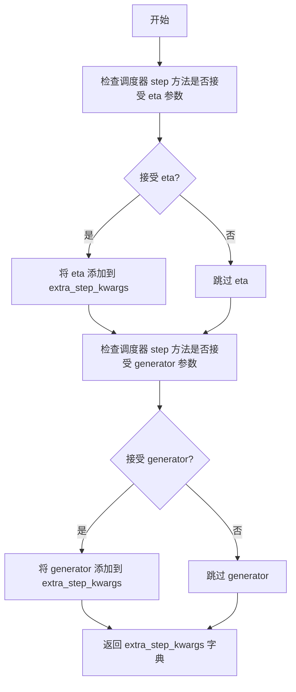

#### 带注释源码

```
# Copied from diffusers.pipelines.stable_diffusion.pipeline_stable_diffusion.StableDiffusionPipeline.prepare_extra_step_kwargs
def prepare_extra_step_kwargs(self, generator, eta):
    # 准备调度器步骤的额外参数，因为并非所有调度器都具有相同的签名
    # eta (η) 仅在 DDIMScheduler 中使用，对于其他调度器将被忽略
    # eta 对应 DDIM 论文中的 η：https://huggingface.co/papers/2010.02502
    # eta 值应在 [0, 1] 范围内

    # 使用 inspect 模块检查调度器的 step 方法是否接受 eta 参数
    accepts_eta = "eta" in set(inspect.signature(self.scheduler.step).parameters.keys())
    
    # 初始化额外的参数字典
    extra_step_kwargs = {}
    
    # 如果调度器接受 eta 参数，则将其添加到 extra_step_kwargs
    if accepts_eta:
        extra_step_kwargs["eta"] = eta

    # 检查调度器是否接受 generator 参数
    accepts_generator = "generator" in set(inspect.signature(self.scheduler.step).parameters.keys())
    
    # 如果调度器接受 generator 参数，则将其添加到 extra_step_kwargs
    if accepts_generator:
        extra_step_kwargs["generator"] = generator
    
    # 返回包含调度器所需额外参数的字典
    return extra_step_kwargs
```


### `KolorsPAGPipeline.check_inputs`

验证KolorsPAGPipeline的输入参数是否合法，包括检查推理步数必须为正整数、图像尺寸必须能被8整除、提示词与提示词嵌入不能同时提供、提示词嵌入与负向提示词嵌入必须形状匹配、IP适配器图像与图像嵌入不能同时定义、以及序列长度不能超过256等约束条件。

参数：

- `prompt`：`str | list[str] | None`，用户输入的文本提示词，用于指导图像生成
- `num_inference_steps`：`int`，去噪推理的步数，必须为正整数
- `height`：`int`，生成图像的高度（像素），必须能被8整除
- `width`：`int`，生成图像的宽度（像素），必须能被8整除
- `negative_prompt`：`str | list[str] | Optional`，不参与图像生成的负向提示词
- `prompt_embeds`：`torch.FloatTensor | None`，预生成的文本嵌入向量
- `pooled_prompt_embeds`：`torch.Tensor | None`，预生成的池化文本嵌入向量
- `negative_prompt_embeds`：`torch.FloatTensor | None`，预生成的负向文本嵌入向量
- `negative_pooled_prompt_embeds`：`torch.Tensor | None`，预生成的负向池化文本嵌入向量
- `ip_adapter_image`：`PipelineImageInput | None`，用于IP适配器的输入图像
- `ip_adapter_image_embeds`：`list[torch.Tensor] | None`，预生成的IP适配器图像嵌入列表
- `callback_on_step_end_tensor_inputs`：`list[str] | None`，每步结束时要传递的张量输入列表
- `max_sequence_length`：`int | None`，文本序列的最大长度，默认256

返回值：`None`，该方法仅进行参数验证，通过则不返回任何值，失败则抛出ValueError异常

#### 流程图

```mermaid
flowchart TD
    A[开始 check_inputs] --> B{num_inference_steps是否为正整数?}
    B -->|否| C[抛出ValueError: num_inference_steps必须是正整数]
    B -->|是| D{height和width是否能被8整除?}
    D -->|否| E[抛出ValueError: height和width必须能被8整除]
    D -->|是| F{callback_on_step_end_tensor_inputs是否在允许列表中?}
    F -->|否| G[抛出ValueError: 存在不允许的tensor输入]
    F -->|是| H{prompt和prompt_embeds是否同时提供?}
    H -->|是| I[抛出ValueError: 不能同时提供prompt和prompt_embeds]
    H -->|否| J{prompt和prompt_embeds是否都未提供?}
    J -->|是| K[抛出ValueError: 必须提供prompt或prompt_embeds之一]
    J -->|否| L{prompt是否为str或list类型?}
    L -->|否| M[抛出ValueError: prompt类型必须是str或list]
    L -->|是| N{negative_prompt和negative_prompt_embeds是否同时提供?}
    N -->|是| O[抛出ValueError: 不能同时提供negative_prompt和negative_prompt_embeds]
    N -->|否| P{prompt_embeds和negative_prompt_embeds形状是否匹配?}
    P -->|否| Q[抛出ValueError: prompt_embeds和negative_prompt_embeds形状必须一致]
    P -->|是| R{prompt_embeds是否提供但pooled_prompt_embeds未提供?}
    R -->|是| S[抛出ValueError: 提供prompt_embeds时必须同时提供pooled_prompt_embeds]
    R -->|否| T{negative_prompt_embeds提供但negative_pooled_prompt_embeds未提供?}
    T -->|是| U[抛出ValueError: 提供negative_prompt_embeds时必须同时提供negative_pooled_prompt_embeds]
    T -->|否| V{ip_adapter_image和ip_adapter_image_embeds是否同时提供?}
    V -->|是| W[抛出ValueError: 不能同时提供ip_adapter_image和ip_adapter_image_embeds]
    V -->|否| X{ip_adapter_image_embeds是否为list类型?}
    X -->|否| Y[抛出ValueError: ip_adapter_image_embeds必须是list类型]
    X -->|是| Z{ip_adapter_image_embeds[0]维度是否为3或4?}
    Z -->|否| AA[抛出ValueError: ip_adapter_image_embeds必须是3D或4D张量列表]
    Z -->|是| AB{max_sequence_length是否大于256?}
    AB -->|是| AC[抛出ValueError: max_sequence_length不能大于256]
    AB -->|否| AD[验证通过，方法结束]
    
    C --> AD
    E --> AD
    G --> AD
    I --> AD
    K --> AD
    M --> AD
    O --> AD
    Q --> AD
    S --> AD
    U --> AD
    W --> AD
    Y --> AD
    AA --> AD
    AC --> AD
```

#### 带注释源码

```python
def check_inputs(
    self,
    prompt,                          # 用户输入的文本提示词
    num_inference_steps,             # 去噪推理步数
    height,                          # 生成图像高度
    width,                           # 生成图像宽度
    negative_prompt=None,            # 负向提示词
    prompt_embeds=None,              # 预生成文本嵌入
    pooled_prompt_embeds=None,       # 池化文本嵌入
    negative_prompt_embeds=None,     # 负向文本嵌入
    negative_pooled_prompt_embeds=None,  # 负向池化文本嵌入
    ip_adapter_image=None,          # IP适配器图像
    ip_adapter_image_embeds=None,   # IP适配器图像嵌入
    callback_on_step_end_tensor_inputs=None,  # 回调张量输入
    max_sequence_length=None,        # 最大序列长度
):
    # 检查1: num_inference_steps必须是正整数
    if not isinstance(num_inference_steps, int) or num_inference_steps <= 0:
        raise ValueError(
            f"`num_inference_steps` has to be a positive integer but is {num_inference_steps} of type"
            f" {type(num_inference_steps)}."
        )

    # 检查2: height和width必须能被8整除（VAE的缩放因子要求）
    if height % 8 != 0 or width % 8 != 0:
        raise ValueError(f"`height` and `width` have to be divisible by 8 but are {height} and {width}.")

    # 检查3: callback_on_step_end_tensor_inputs必须在允许的tensor输入列表中
    if callback_on_step_end_tensor_inputs is not None and not all(
        k in self._callback_tensor_inputs for k in callback_on_step_end_tensor_inputs
    ):
        raise ValueError(
            f"`callback_on_step_end_tensor_inputs` has to be in {self._callback_tensor_inputs}, but found {[k for k in callback_on_step_end_tensor_inputs if k not in self._callback_tensor_inputs]}"
        )

    # 检查4: prompt和prompt_embeds不能同时提供
    if prompt is not None and prompt_embeds is not None:
        raise ValueError(
            f"Cannot forward both `prompt`: {prompt} and `prompt_embeds`: {prompt_embeds}. Please make sure to"
            " only forward one of the two."
        )
    # 检查5: prompt和prompt_embeds至少提供一个
    elif prompt is None and prompt_embeds is None:
        raise ValueError(
            "Provide either `prompt` or `prompt_embeds`. Cannot leave both `prompt` and `prompt_embeds` undefined."
        )
    # 检查6: prompt类型必须是str或list
    elif prompt is not None and (not isinstance(prompt, str) and not isinstance(prompt, list)):
        raise ValueError(f"`prompt` has to be of type `str` or `list` but is {type(prompt)}")

    # 检查7: negative_prompt和negative_prompt_embeds不能同时提供
    if negative_prompt is not None and negative_prompt_embeds is not None:
        raise ValueError(
            f"Cannot forward both `negative_prompt`: {negative_prompt} and `negative_prompt_embeds`:"
            f" {negative_prompt_embeds}. Please make sure to only forward one of the two."
        )

    # 检查8: prompt_embeds和negative_prompt_embeds形状必须匹配
    if prompt_embeds is not None and negative_prompt_embeds is not None:
        if prompt_embeds.shape != negative_prompt_embeds.shape:
            raise ValueError(
                "`prompt_embeds` and `negative_prompt_embeds` must have the same shape when passed directly, but"
                f" got: `prompt_embeds` {prompt_embeds.shape} != `negative_prompt_embeds`"
                f" {negative_prompt_embeds.shape}."
            )

    # 检查9: 如果提供了prompt_embeds，也必须提供pooled_prompt_embeds
    if prompt_embeds is not None and pooled_prompt_embeds is None:
        raise ValueError(
            "If `prompt_embeds` are provided, `pooled_prompt_embeds` also have to be passed. Make sure to generate `pooled_prompt_embeds` from the same text encoder that was used to generate `prompt_embeds`."
        )

    # 检查10: 如果提供了negative_prompt_embeds，也必须提供negative_pooled_prompt_embeds
    if negative_prompt_embeds is not None and negative_pooled_prompt_embeds is None:
        raise ValueError(
            "If `negative_prompt_embeds` are provided, `negative_pooled_prompt_embeds` also have to be passed. Make sure to generate `negative_pooled_prompt_embeds` from the same text encoder that was used to generate `negative_prompt_embeds`."
        )

    # 检查11: ip_adapter_image和ip_adapter_image_embeds不能同时提供
    if ip_adapter_image is not None and ip_adapter_image_embeds is not None:
        raise ValueError(
            "Provide either `ip_adapter_image` or `ip_adapter_image_embeds`. Cannot leave both `ip_adapter_image` and `ip_adapter_image_embeds` defined."
        )

    # 检查12: ip_adapter_image_embeds必须是list类型
    if ip_adapter_image_embeds is not None:
        if not isinstance(ip_adapter_image_embeds, list):
            raise ValueError(
                f"`ip_adapter_image_embeds` has to be of type `list` but is {type(ip_adapter_image_embeds)}"
            )
        # 检查13: ip_adapter_image_embeds中的张量必须是3D或4D
        elif ip_adapter_image_embeds[0].ndim not in [3, 4]:
            raise ValueError(
                f"`ip_adapter_image_embeds` has to be a list of 3D or 4D tensors but is {ip_adapter_image_embeds[0].ndim}D"
            )

    # 检查14: max_sequence_length不能超过256
    if max_sequence_length is not None and max_sequence_length > 256:
        raise ValueError(f"`max_sequence_length` cannot be greater than 256 but is {max_sequence_length}")
```


### `KolorsPAGPipeline.prepare_latents`

该方法用于在文本到图像生成过程中准备初始的潜在向量（latents）。它根据批次大小、图像尺寸和VAE的缩放因子计算潜在空间的形状，验证随机生成器的一致性，生成或加载初始噪声，并通过调度器的初始噪声标准差对其进行缩放，以适配去噪过程的起始条件。

参数：

- `batch_size`：`int`，批次大小，指定要生成的图像数量
- `num_channels_latents`：`int`，潜在变量的通道数，对应于UNet的输入通道配置
- `height`：`int`，生成图像的高度（像素），用于计算潜在空间的spatial维度
- `width`：`int`，生成图像的宽度（像素），用于计算潜在空间的spatial维度
- `dtype`：`torch.dtype`，生成潜在变量所使用的数据类型（如torch.float16）
- `device`：`torch.device`，生成潜在变量所要放置的设备（如cuda或cpu）
- `generator`：`torch.Generator` 或 `list[torch.Generator]`，可选的随机生成器，用于确保生成的可重复性
- `latents`：`torch.Tensor`，可选的预生成潜在变量，如果为None则生成随机噪声

返回值：`torch.Tensor`，处理后的潜在变量张量，shape为(batch_size, num_channels_latents, height//vae_scale_factor, width//vae_scale_factor)，已根据调度器的init_noise_sigma进行缩放

#### 流程图

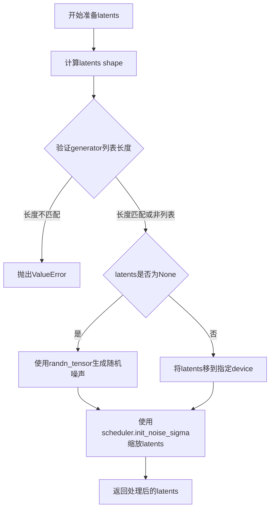

#### 带注释源码

```python
def prepare_latents(
    self,
    batch_size: int,
    num_channels_latents: int,
    height: int,
    width: int,
    dtype: torch.dtype,
    device: torch.device,
    generator: torch.Generator | list[torch.Generator] | None = None,
    latents: torch.Tensor | None = None,
) -> torch.Tensor:
    """
    准备用于去噪过程的初始潜在变量。

    Args:
        batch_size: 批次大小
        num_channels_latents: 潜在变量的通道数
        height: 目标图像高度
        width: 目标图像宽度
        dtype: 数据类型
        device: 计算设备
        generator: 随机生成器
        latents: 预提供的潜在变量

    Returns:
        处理后的潜在变量张量
    """
    # 1. 计算潜在变量的shape，考虑VAE缩放因子
    # VAE scale factor通常为2^(len(vae.config.block_out_channels)-1)，如8
    shape = (
        batch_size,
        num_channels_latents,
        int(height) // self.vae_scale_factor,
        int(width) // self.vae_scale_factor,
    )

    # 2. 验证generator列表长度与batch_size是否匹配
    if isinstance(generator, list) and len(generator) != batch_size:
        raise ValueError(
            f"You have passed a list of generators of length {len(generator)}, but requested an effective batch"
            f" size of {batch_size}. Make sure the batch size matches the length of the generators."
        )

    # 3. 如果没有提供latents，则生成随机噪声；否则使用提供的latents
    if latents is None:
        # 使用randn_tensor生成符合正态分布的随机潜在变量
        latents = randn_tensor(shape, generator=generator, device=device, dtype=dtype)
    else:
        # 将已提供的latents移动到目标设备
        latents = latents.to(device)

    # 4. 根据调度器的初始噪声标准差缩放latents
    # 不同的调度器可能需要不同的初始噪声缩放（如DDIM使用1.0，DDPM使用不同的值）
    latents = latents * self.scheduler.init_noise_sigma

    return latents
```


### `KolorsPAGPipeline._get_add_time_ids`

该方法用于生成SDXL风格的时间标识（time IDs），将原始图像尺寸、裁剪坐标和目标尺寸组合成一个嵌入向量，用于条件生成过程。

参数：

- `self`：`KolorsPAGPipeline` 实例本身
- `original_size`：`tuple[int, int]`，原始图像尺寸，格式为 (height, width)
- `crops_coords_top_left`：`tuple[int, int]`，裁剪左上角坐标，格式为 (y, x)
- `target_size`：`tuple[int, int]`，目标图像尺寸，格式为 (height, width)
- `dtype`：`torch.dtype`，输出张量的数据类型
- `text_encoder_projection_dim`：`int | None`，文本编码器的投影维度，用于计算嵌入维度

返回值：`torch.Tensor`，形状为 (1, 6) 的张量，包含原始尺寸、裁剪坐标和目标尺寸的信息，用于UNet的时间嵌入

#### 流程图

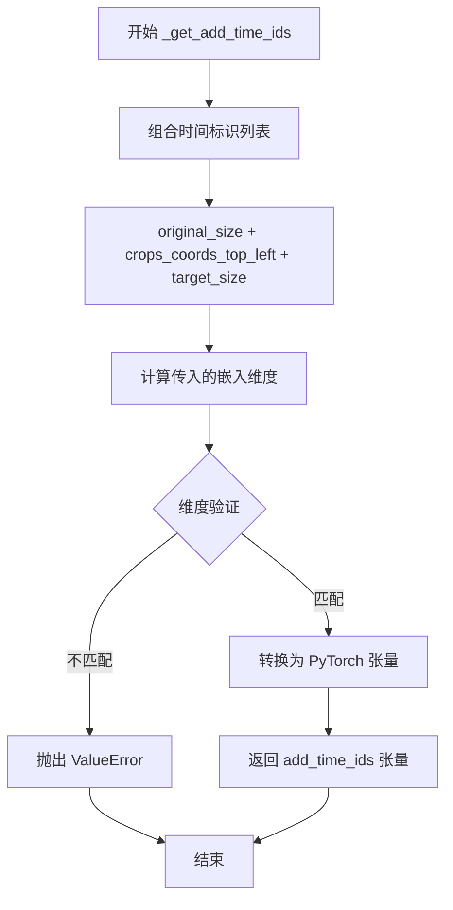

#### 带注释源码

```python
# Copied from diffusers.pipelines.stable_diffusion_xl.pipeline_stable_diffusion_xl.StableDiffusionXLPipeline._get_add_time_ids
def _get_add_time_ids(
    self, original_size, crops_coords_top_left, target_size, dtype, text_encoder_projection_dim=None
):
    """
    生成用于SDXL条件生成的时间标识（time IDs）。
    
    该方法将原始尺寸、裁剪坐标和目标尺寸组合成一个向量，
    用于向UNet传递图像尺寸相关的条件信息。
    
    参数:
        original_size: 原始图像尺寸 (height, width)
        crops_coords_top_left: 裁剪左上角坐标 (y, x)
        target_size: 目标图像尺寸 (height, width)
        dtype: 输出张量的数据类型
        text_encoder_projection_dim: 文本编码器投影维度
    
    返回:
        包含时间标识的PyTorch张量
    """
    # 将三个元组连接成一个列表 [orig_h, orig_w, crop_y, crop_x, target_h, target_w]
    add_time_ids = list(original_size + crops_coords_top_left + target_size)

    # 计算实际传入的嵌入维度 = addition_time_embed_dim * 标识数量 + 文本投影维度
    passed_add_embed_dim = (
        self.unet.config.addition_time_embed_dim * len(add_time_ids) + text_encoder_projection_dim
    )
    
    # 从UNet配置中获取期望的嵌入维度
    expected_add_embed_dim = self.unet.add_embedding.linear_1.in_features

    # 验证维度是否匹配，确保模型配置正确
    if expected_add_embed_dim != passed_add_embed_dim:
        raise ValueError(
            f"Model expects an added time embedding vector of length {expected_add_embed_dim}, but a vector of {passed_add_embed_dim} was created. The model has an incorrect config. Please check `unet.config.time_embedding_type` and `text_encoder_2.config.projection_dim`."
        )

    # 将列表转换为PyTorch张量，形状为 (1, 6)
    add_time_ids = torch.tensor([add_time_ids], dtype=dtype)
    return add_time_ids
```


### `KolorsPAGPipeline.upcast_vae`

该方法用于将VAE模型从当前数据类型（通常是float16）上转换为float32类型，以避免在解码过程中出现数值溢出问题。该方法已被标记为废弃，推荐直接使用`pipe.vae.to(torch.float32)`。

参数：此方法无显式参数（仅包含隐式参数`self`）

返回值：`None`，该方法直接修改VAE模型的dtype，不返回任何值。

#### 流程图

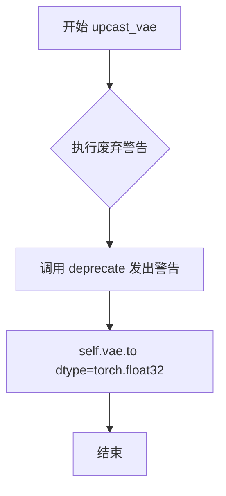

#### 带注释源码

```python
# Copied from diffusers.pipelines.stable_diffusion_xl.pipeline_stable_diffusion_xl.StableDiffusionXLPipeline.upcast_vae
def upcast_vae(self):
    """
    将 VAE 模型上转换为 float32 类型。
    
    此方法已被废弃，原因是在 float16 模式下进行 VAE 解码时可能会发生数值溢出。
    现在推荐直接使用 pipe.vae.to(torch.float32) 来替代此方法。
    """
    # 发出废弃警告，提醒用户使用新方法
    deprecate(
        "upcast_vae",  # 函数名
        "1.0.0",       # 废弃版本号
        # 废弃警告消息，包含新方法的推荐用法和参考链接
        "`upcast_vae` is deprecated. Please use `pipe.vae.to(torch.float32)`. For more details, please refer to: https://github.com/huggingface/diffusers/pull/12619#issue-3606633695.",
    )
    # 将 VAE 模型转换为 float32 类型
    # 目的：避免在解码过程中出现数值溢出（特别是当 VAE 原本为 float16 时）
    self.vae.to(dtype=torch.float32)
```


### `KolorsPAGPipeline.get_guidance_scale_embedding`

该函数用于将guidance scale（引导强度）转换为高维嵌入向量，以便在UNet的时间条件投影中使用。这是实现Classifier-Free Guidance的关键组件，通过将guidance scale编码为与时间嵌入相同维度的向量，使模型能够根据不同的引导强度自适应地调整生成过程。

参数：

- `self`：`KolorsPAGPipeline`，Pipeline实例本身
- `w`：`torch.Tensor`，一维张量，表示要转换的guidance scale值，用于生成嵌入向量以丰富时间嵌入
- `embedding_dim`：`int`，可选，默认值为512，生成嵌入向量的维度
- `dtype`：`torch.dtype`，可选，默认值为`torch.float32`，生成嵌入向量的数据类型

返回值：`torch.Tensor`，形状为`(len(w), embedding_dim)`的嵌入向量矩阵

#### 流程图

```mermaid
flowchart TD
    A[开始: 输入w, embedding_dim, dtype] --> B{验证输入}
    B -->|通过| C[将w乘以1000.0进行缩放]
    B -->|失败| Z[抛出断言错误]
    C --> D[计算half_dim = embedding_dim // 2]
    D --> E[计算基础频率: log10000 / (half_dim - 1)]
    E --> F[生成频率数组: exp -emb * arangehalf_dim]
    F --> G[计算加权的w与频率的外积]
    G --> H[分别计算sin和cos]
    H --> I{embedding_dim是否为奇数}
    I -->|是| J[在末尾填充零]
    I -->|否| K[跳过填充]
    J --> L[验证输出形状]
    K --> L
    L -->|通过| M[返回嵌入向量]
    L -->|失败| Z
```

#### 带注释源码

```
def get_guidance_scale_embedding(
    self, w: torch.Tensor, embedding_dim: int = 512, dtype: torch.dtype = torch.float32
) -> torch.Tensor:
    """
    实现基于正弦余弦的位置编码方式，将guidance scale转换为嵌入向量
    参考: https://github.com/google-research/vdm/blob/dc27b98a554f65cdc654b800da5aa1846545d41b/model_vdm.py#L298
    
    参数:
        w: 输入的guidance scale值，一维张量
        embedding_dim: 嵌入向量的维度，默认512
        dtype: 输出张量的数据类型，默认torch.float32
        
    返回:
        形状为 (len(w), embedding_dim) 的嵌入向量
    """
    # 验证输入是一维张量
    assert len(w.shape) == 1
    
    # 将guidance scale缩放1000倍，使其范围适合嵌入计算
    # 这是一个经验值，用于将典型的guidance scale值（如1-20）映射到合适的数值范围
    w = w * 1000.0

    # 计算嵌入维度的一半，用于生成正弦和余弦两种编码
    half_dim = embedding_dim // 2
    
    # 计算基础频率因子
    # 使用log(10000)作为基础，创造不同频率的正弦波
    # 这种设计灵感来自Transformer中的位置编码
    emb = torch.log(torch.tensor(10000.0)) / (half_dim - 1)
    
    # 生成频率数组: [0, 1, 2, ..., half_dim-1]
    # 并计算负指数: exp(-0), exp(-1), exp(-2), ...
    # 这会创造出从高到低不同频率的正弦波
    emb = torch.exp(torch.arange(half_dim, dtype=dtype) * -emb)
    
    # 计算外积: w的每个元素乘以所有频率
    # 结果形状: (len(w), half_dim)
    emb = w.to(dtype)[:, None] * emb[None, :]
    
    # 连接正弦和余弦编码，形成完整的嵌入
    # 结果形状: (len(w), embedding_dim)
    emb = torch.cat([torch.sin(emb), torch.cos(emb)], dim=1)
    
    # 如果embedding_dim是奇数，需要在最后填充一个零
    # 这是为了处理某些模型可能要求奇数维度的情况
    if embedding_dim % 2 == 1:  # zero pad
        emb = torch.nn.functional.pad(emb, (0, 1))
    
    # 最终验证输出形状正确
    assert emb.shape == (w.shape[0], embedding_dim)
    return emb
```


### `KolorsPAGPipeline.guidance_scale`

该属性是 `KolorsPAGPipeline` 类的分类器自由引导（Classifier-Free Guidance）强度属性，通过 `@property` 装饰器实现，只读访问内部存储的 `_guidance_scale` 值，用于控制生成图像与文本提示的关联强度。

参数： 无（属性 getter不接受参数）

返回值：`float`，返回当前配置的引导强度值

#### 流程图

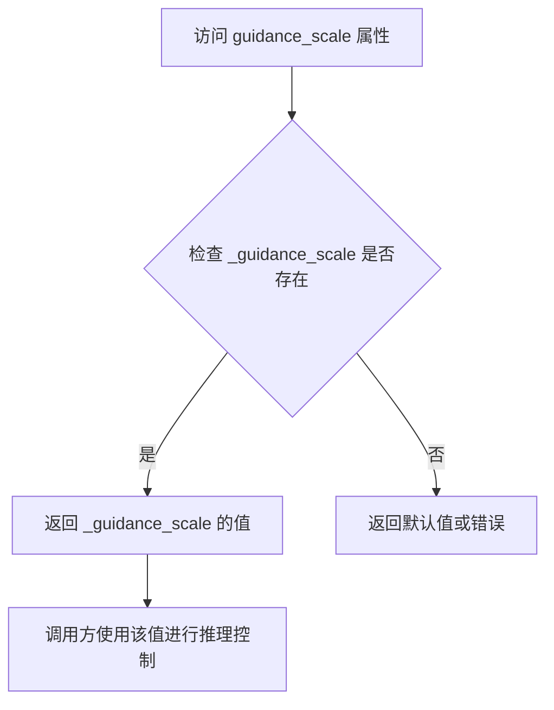

#### 带注释源码

```python
@property
def guidance_scale(self):
    r"""
    属性用于获取分类器自由引导（Classifier-Free Guidance）的强度值。

    该属性是一个只读属性，它返回在管道调用时设置的内部变量 `_guidance_scale`。
    guidance_scale 控制文本提示对图像生成的影响程度：
    - 值为 1.0 时，不进行分类器自由引导
    - 值大于 1.0 时，引导生成更接近文本提示的图像
    - 值越高，图像与提示越相关，但可能导致质量下降

    在 __call__ 方法中通过以下方式设置：
        self._guidance_scale = guidance_scale

    Returns:
        float: 当前配置的引导强度值
    """
    return self._guidance_scale
```


### `KolorsPAGPipeline.do_classifier_free_guidance`

这是一个属性（property），用于判断当前配置是否启用了无分类器自由引导（Classifier-Free Guidance，CFG）。该属性通过检查 `guidance_scale` 是否大于1以及 UNet 的 `time_cond_proj_dim` 是否为 None 来决定是否执行 CFG。

参数：

- 无参数（这是一个属性而非方法）

返回值：`bool`，返回 True 表示启用无分类器自由引导，返回 False 表示不启用

#### 流程图

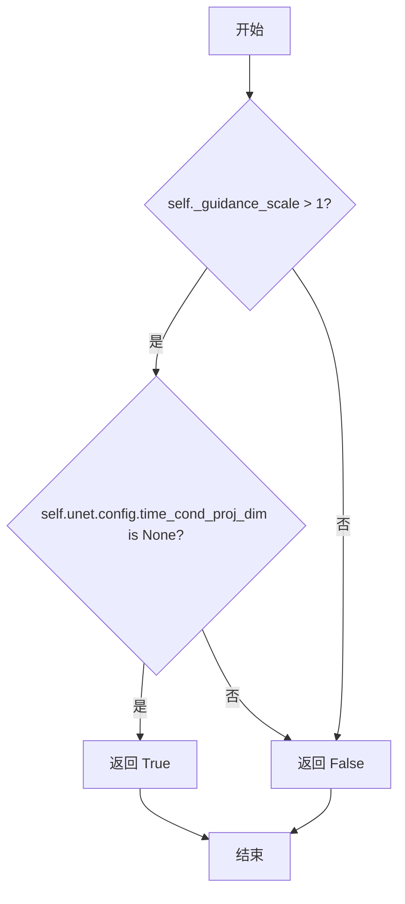

#### 带注释源码

```python
@property
def do_classifier_free_guidance(self):
    """
    判断是否启用无分类器自由引导（Classifier-Free Guidance）。
    
    无分类器自由引导是一种提高扩散模型生成质量的技术，
    它通过同时使用条件嵌入（prompt）和无条件嵌入（空prompt）
    来引导生成过程。
    
    启用条件：
    1. guidance_scale > 1：引导强度大于1才启用CFG
    2. unet.config.time_cond_proj_dim is None：UNet不使用时间条件投影
    
    Returns:
        bool: 是否启用无分类器自由引导
    """
    return self._guidance_scale > 1 and self.unet.config.time_cond_proj_dim is None
```


### `KolorsPAGPipeline.cross_attention_kwargs`

该属性方法用于获取在文本到图像生成过程中传递给注意力处理器（AttentionProcessor）的 kwargs 字典。该字典包含了控制交叉注意力行为的各种参数，例如自定义注意力实现、dropout 控制等。

参数： 无

返回值：`dict[str, Any] | None`，返回传递给 `AttentionProcessor` 的 kwargs 字典，如果未设置则返回 `None`。

#### 流程图

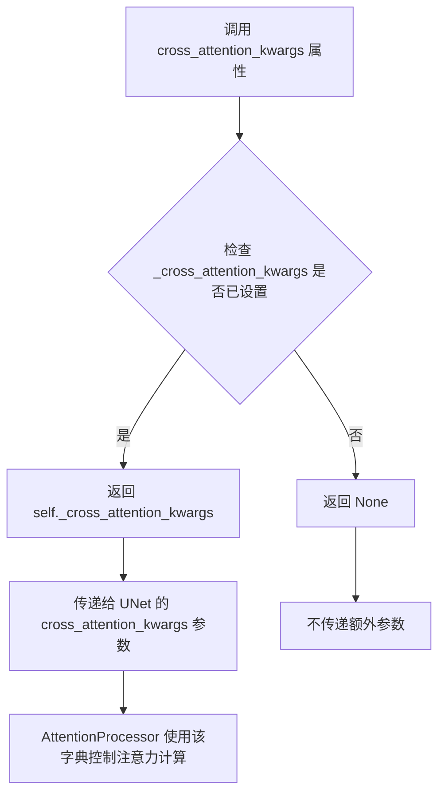

#### 带注释源码

```python
@property
def cross_attention_kwargs(self):
    """
    属性方法：获取交叉注意力 kwargs
    
    该属性返回在 pipeline 调用时设置的交叉注意力参数字典。
    这些参数会被传递给 UNet 模型中的注意力处理器，用于控制
    注意力机制的具体行为，例如：
    - 使用自定义的注意力实现
    - 控制注意力 dropout
    - 传递额外的控制信号
    
    Returns:
        dict[str, Any] | None: 交叉注意力 kwargs 字典，如果未设置则返回 None
        
    Example:
        # 在 pipeline 调用时设置
        pipeline(
            prompt="A beautiful landscape",
            cross_attention_kwargs={"scale": 0.5}
        )
        
        # 获取当前设置的 cross_attention_kwargs
        current_kwargs = pipeline.cross_attention_kwargs
        # 返回: {"scale": 0.5} 或 None
    """
    return self._cross_attention_kwargs
```

#### 详细说明

**设计目的**：
- 提供一种机制来自定义注意力计算行为
- 支持在推理时动态调整注意力参数
- 与 HuggingFace Diffusers 库的 `AttentionProcessor` 接口兼容

**使用场景**：
该属性在 `__call__` 方法中被使用，当调用 UNet 进行噪声预测时：

```python
noise_pred = self.unet(
    latent_model_input,
    t,
    encoder_hidden_states=prompt_embeds,
    timestep_cond=timestep_cond,
    cross_attention_kwargs=self.cross_attention_kwargs,  # 使用该属性
    added_cond_kwargs=added_cond_kwargs,
    return_dict=False,
)[0]
```

**相关配置**：
- `_cross_attention_kwargs`：在 `__call__` 方法开始时通过参数 `cross_attention_kwargs: dict[str, Any] | None = None` 设置
- 默认值为 `None`，表示不传递额外的注意力参数


### `KolorsPAGPipeline.denoising_end`

该属性用于获取当前管道的去噪结束参数，控制去噪过程提前终止的时机。

参数：无（这是一个属性 getter）

返回值：`float | None`，返回提前终止去噪过程的比例值（0.0 到 1.0 之间），如果未设置则返回 `None`

#### 流程图

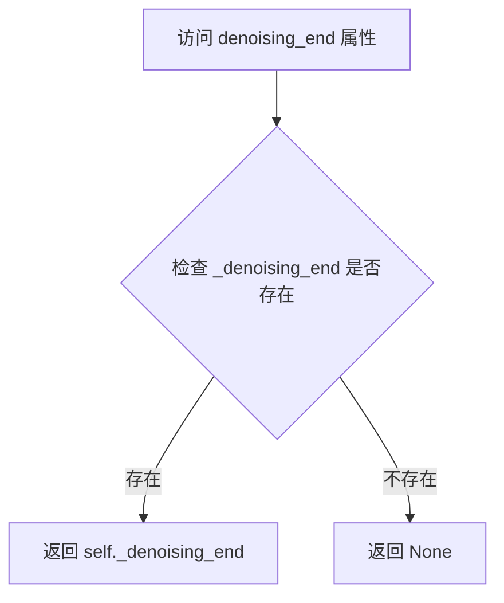

#### 带注释源码

```python
@property
def denoising_end(self):
    """
    属性 getter 方法，用于获取去噪结束参数。
    
    该属性返回在 pipeline __call__ 方法中设置的 _denoising_end 值。
    当设置了这个值时，表示在总去噪过程的指定比例处提前终止去噪，
    常用于"Mixture of Denoisers"多管道设置中。
    
    返回:
        float | None: 去噪结束比例值，范围 0.0-1.0，如果未设置则为 None
    """
    return self._denoising_end
```


### `KolorsPAGPipeline.num_timesteps`

该属性是一个只读的类属性，用于返回扩散模型在推理过程中实际使用的时间步数量。它在管道执行期间通过 `__call__` 方法自动设置，记录了从调度器获取的实际时间步列表的长度。

参数： 无

返回值：`int`，返回推理过程中使用的时间步数量，即实际执行的去噪步数。

#### 流程图

```mermaid
flowchart TD
    A[访问 num_timesteps 属性] --> B{检查 _num_timesteps 是否已设置}
    B -->|已设置| C[返回 self._num_timesteps]
    B -->|未设置| D[返回默认值或 0]
    
    E[__call__ 方法执行] --> F[retrieve_timesteps 获取时间步]
    F --> G[设置 self._num_timesteps = len(timesteps)]
```

#### 带注释源码

```python
@property
def num_timesteps(self):
    """
    返回扩散管道推理过程中使用的时间步数量。
    
    该属性在 __call__ 方法中被设置，当调用管道生成图像时，
    调度器会根据 num_inference_steps 参数生成相应的时间步序列，
    然后将该序列的长度存储在 _num_timesteps 中供后续使用。
    
    Returns:
        int: 推理过程中实际使用的时间步数量。如果管道尚未调用，
             则可能返回未初始化的值。
    """
    return self._num_timesteps
```


### `KolorsPAGPipeline.interrupt`

该属性用于获取KolorsPAGPipeline管道的中断状态标志，通过返回内部私有属性`_interrupt`的值来控制推理循环是否可以继续执行。

参数： 无

返回值：`bool`，返回管道的中断状态。当值为`True`时，表示管道已被外部请求中断，推理循环将跳过当前迭代；默认值为`False`，表示管道正常运行。

#### 流程图

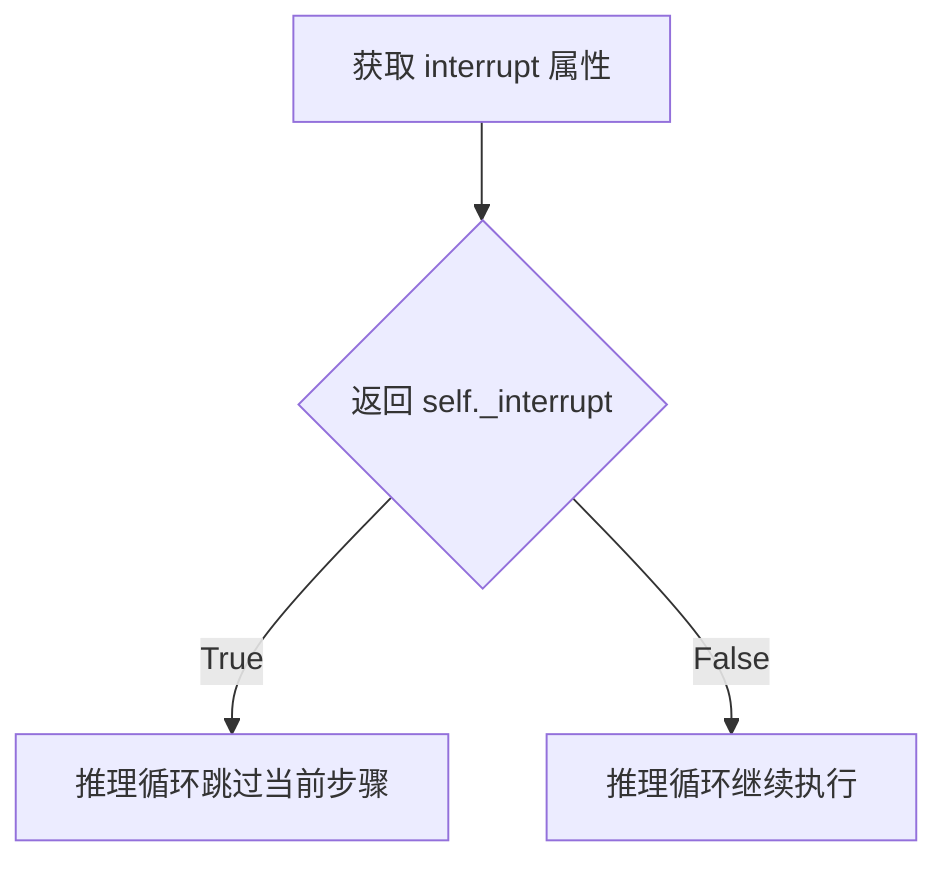

#### 带注释源码

```python
@property
def interrupt(self):
    """
    属性方法，用于获取管道的中断状态。
    
    该属性在 __call__ 方法的推理循环中被检查：
        if self.interrupt:
            continue
    
    当外部调用者设置 pipeline._interrupt = True 时，
    推理循环会在下一次迭代开始时立即跳过当前步骤，
    从而实现提前终止生成过程的目的。
    
    Returns:
        bool: 中断状态标志。True 表示已请求中断，False 表示正常运行。
    """
    return self._interrupt
```


### `KolorsPAGPipeline.__call__`

该方法是 KolorsPAGPipeline 的核心调用函数，负责执行基于文本提示的图像生成任务。它整合了编码提示、潜在变量准备、去噪循环（包括 Perturbed Attention Guidance）、可选的 IP-Adapter 支持以及最终的图像解码过程，支持多种输入格式和微调参数。

参数：

- `prompt`：`str | list[str] | None`，用于指导图像生成的文本提示
- `height`：`int | None`，生成图像的高度（像素），默认为 unet 配置的样本大小乘以 vae 缩放因子
- `width`：`int | None`，生成图像的宽度（像素），默认为 unet 配置的样本大小乘以 vae 缩放因子
- `num_inference_steps`：`int`，去噪步数，默认为 50
- `timesteps`：`list[int] | None`，自定义时间步，用于支持自定义时间步调度器
- `sigmas`：`list[float] | None`，自定义 sigma 值，用于支持自定义 sigma 调度器
- `denoising_end`：`float | None`，提前终止去噪过程的比例（0.0 到 1.0 之间）
- `guidance_scale`：`float`，分类器自由引导（CFG）比例，默认为 5.0
- `negative_prompt`：`str | list[str] | None`，不参与引导图像生成的负面提示
- `num_images_per_prompt`：`int | None`，每个提示生成的图像数量，默认为 1
- `eta`：`float`，DDIM 论文中的 eta 参数，仅适用于 DDIM 调度器
- `generator`：`torch.Generator | list[torch.Generator] | None`，用于生成确定性结果的随机数生成器
- `latents`：`torch.Tensor | None`，预生成的噪声潜在变量
- `prompt_embeds`：`torch.Tensor | None`，预生成的文本嵌入
- `pooled_prompt_embeds`：`torch.Tensor | None`，预生成的池化文本嵌入
- `negative_prompt_embeds`：`torch.Tensor | None`，预生成的负面文本嵌入
- `negative_pooled_prompt_embeds`：`torch.Tensor | None`，预生成的负面池化文本嵌入
- `ip_adapter_image`：`PipelineImageInput | None`，IP-Adapter 的可选图像输入
- `ip_adapter_image_embeds`：`list[torch.Tensor] | None`，预生成的 IP-Adapter 图像嵌入列表
- `output_type`：`str | None`，输出格式，默认为 "pil"
- `return_dict`：`bool`，是否返回 KolorsPipelineOutput 对象，默认为 True
- `cross_attention_kwargs`：`dict[str, Any] | None`，传递给注意力处理器的额外关键字参数
- `original_size`：`tuple[int, int] | None`，原始图像尺寸，用于微条件处理
- `crops_coords_top_left`：`tuple[int, int]`，裁剪坐标的左上角，默认为 (0, 0)
- `target_size`：`tuple[int, int] | None`，目标图像尺寸，用于微条件处理
- `negative_original_size`：`tuple[int, int] | None`，负面提示的原始尺寸
- `negative_crops_coords_top_left`：`tuple[int, int]`，负面提示的裁剪坐标左上角
- `negative_target_size`：`tuple[int, int] | None`，负面提示的目标尺寸
- `callback_on_step_end`：`Callable | PipelineCallback | MultiPipelineCallbacks | None`，每个去噪步骤结束时调用的回调函数
- `callback_on_step_end_tensor_inputs`：`list[str]`，传递给回调函数的张量输入列表
- `pag_scale`：`float`，扰动注意力引导（PAG）的比例因子，默认为 3.0
- `pag_adaptive_scale`：`float`，扰动注意力引导的自适应比例因子，默认为 0.0
- `max_sequence_length`：`int`，提示的最大序列长度，默认为 256

返回值：`KolorsPipelineOutput | tuple`，当 return_dict 为 True 时返回 KolorsPipelineOutput 对象，否则返回元组（包含生成的图像列表）

#### 流程图

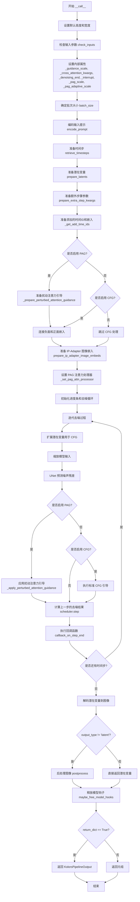

#### 带注释源码

```python
@torch.no_grad()
@replace_example_docstring(EXAMPLE_DOC_STRING)
def __call__(
    self,
    prompt: str | list[str] = None,
    height: int | None = None,
    width: int | None = None,
    num_inference_steps: int = 50,
    timesteps: list[int] = None,
    sigmas: list[float] = None,
    denoising_end: float | None = None,
    guidance_scale: float = 5.0,
    negative_prompt: str | list[str] | None = None,
    num_images_per_prompt: int | None = 1,
    eta: float = 0.0,
    generator: torch.Generator | list[torch.Generator] | None = None,
    latents: torch.Tensor | None = None,
    prompt_embeds: torch.Tensor | None = None,
    pooled_prompt_embeds: torch.Tensor | None = None,
    negative_prompt_embeds: torch.Tensor | None = None,
    negative_pooled_prompt_embeds: torch.Tensor | None = None,
    ip_adapter_image: PipelineImageInput | None = None,
    ip_adapter_image_embeds: list[torch.Tensor] | None = None,
    output_type: str | None = "pil",
    return_dict: bool = True,
    cross_attention_kwargs: dict[str, Any] | None = None,
    original_size: tuple[int, int] | None = None,
    crops_coords_top_left: tuple[int, int] = (0, 0),
    target_size: tuple[int, int] | None = None,
    negative_original_size: tuple[int, int] | None = None,
    negative_crops_coords_top_left: tuple[int, int] = (0, 0),
    negative_target_size: tuple[int, int] | None = None,
    callback_on_step_end: Callable[[int, int], None] | PipelineCallback | MultiPipelineCallbacks | None = None,
    callback_on_step_end_tensor_inputs: list[str] = ["latents"],
    pag_scale: float = 3.0,
    pag_adaptive_scale: float = 0.0,
    max_sequence_length: int = 256,
):
    r"""
    Function invoked when calling the pipeline for generation.

    Args:
        prompt (`str` or `list[str]`, *optional*):
            The prompt or prompts to guide the image generation. If not defined, one has to pass `prompt_embeds`.
            instead.
        height (`int`, *optional*, defaults to self.unet.config.sample_size * self.vae_scale_factor):
            The height in pixels of the generated image. This is set to 1024 by default for the best results.
            Anything below 512 pixels won't work well for
            [Kwai-Kolors/Kolors-diffusers](https://huggingface.co/Kwai-Kolors/Kolors-diffusers) and checkpoints
            that are not specifically fine-tuned on low resolutions.
        width (`int`, *optional*, defaults to self.unet.config.sample_size * self.vae_scale_factor):
            The width in pixels of the generated image. This is set to 1024 by default for the best results.
            Anything below 512 pixels won't work well for
            [Kwai-Kolors/Kolors-diffusers](https://huggingface.co/Kwai-Kolors/Kolors-diffusers) and checkpoints
            that are not specifically fine-tuned on low resolutions.
        num_inference_steps (`int`, *optional*, defaults to 50):
            The number of denoising steps. More denoising steps usually lead to a higher quality image at the
            expense of slower inference.
        timesteps (`list[int]`, *optional*):
            Custom timesteps to use for the denoising process with schedulers which support a `timesteps` argument
            in their `set_timesteps` method. If not defined, the default behavior when `num_inference_steps` is
            passed will be used. Must be in descending order.
        sigmas (`list[float]`, *optional*):
            Custom sigmas to use for the denoising process with schedulers which support a `sigmas` argument in
            their `set_timesteps` method. If not defined, the default behavior when `num_inference_steps` is passed
            will be used.
        denoising_end (`float`, *optional*):
            When specified, determines the fraction (between 0.0 and 1.0) of the total denoising process to be
            completed before it is intentionally prematurely terminated. As a result, the returned sample will
            still retain a substantial amount of noise as determined by the discrete timesteps selected by the
            scheduler. The denoising_end parameter should ideally be utilized when this pipeline forms a part of a
            "Mixture of Denoisers" multi-pipeline setup, as elaborated in [**Refining the Image
            Output**](https://huggingface.co/docs/diffusers/api/pipelines/stable_diffusion/stable_diffusion_xl#refining-the-image-output)
        guidance_scale (`float`, *optional*, defaults to 5.0):
            Guidance scale as defined in [Classifier-Free Diffusion
            Guidance](https://huggingface.co/papers/2207.12598). `guidance_scale` is defined as `w` of equation 2.
            of [Imagen Paper](https://huggingface.co/papers/2205.11487). Guidance scale is enabled by setting
            `guidance_scale > 1`. Higher guidance scale encourages to generate images that are closely linked to
            the text `prompt`, usually at the expense of lower image quality.
        negative_prompt (`str` or `list[str]`, *optional*):
            The prompt or prompts not to guide the image generation. If not defined, one has to pass
            `negative_prompt_embeds` instead. Ignored when not using guidance (i.e., ignored if `guidance_scale` is
            less than `1`).
        num_images_per_prompt (`int`, *optional*, defaults to 1):
            The number of images to generate per prompt.
        eta (`float`, *optional*, defaults to 0.0):
            Corresponds to parameter eta (η) in the DDIM paper: https://huggingface.co/papers/2010.02502. Only
            applies to [`schedulers.DDIMScheduler`], will be ignored for others.
        generator (`torch.Generator` or `list[torch.Generator]`, *optional*):
            One or a list of [torch generator(s)](https://pytorch.org/docs/stable/generated/torch.Generator.html)
            to make generation deterministic.
        latents (`torch.Tensor`, *optional*):
            Pre-generated noisy latents, sampled from a Gaussian distribution, to be used as inputs for image
            generation. Can be used to tweak the same generation with different prompts. If not provided, a latents
            tensor will be generated by sampling using the supplied random `generator`.
        prompt_embeds (`torch.Tensor`, *optional*):
            Pre-generated text embeddings. Can be used to easily tweak text inputs, *e.g.* prompt weighting. If not
            provided, text embeddings will be generated from `prompt` input argument.
        pooled_prompt_embeds (`torch.Tensor`, *optional*):
            Pre-generated pooled text embeddings. Can be used to easily tweak text inputs, *e.g.* prompt weighting.
            If not provided, pooled text embeddings will be generated from `prompt` input argument.
        negative_prompt_embeds (`torch.Tensor`, *optional*):
            Pre-generated negative text embeddings. Can be used to easily tweak text inputs, *e.g.* prompt
            weighting. If not provided, negative_prompt_embeds will be generated from `negative_prompt` input
            argument.
        negative_pooled_prompt_embeds (`torch.Tensor`, *optional*):
            Pre-generated negative pooled text embeddings. Can be used to easily tweak text inputs, *e.g.* prompt
            weighting. If not provided, pooled negative_prompt_embeds will be generated from `negative_prompt`
            input argument.
        ip_adapter_image: (`PipelineImageInput`, *optional*): Optional image input to work with IP Adapters.
        ip_adapter_image_embeds (`list[torch.Tensor]`, *optional*):
            Pre-generated image embeddings for IP-Adapter. It should be a list of length same as number of
            IP-adapters. Each element should be a tensor of shape `(batch_size, num_images, emb_dim)`. It should
            contain the negative image embedding if `do_classifier_free_guidance` is set to `True`. If not
            provided, embeddings are computed from the `ip_adapter_image` input argument.
        output_type (`str`, *optional*, defaults to `"pil"`):
            The output format of the generate image. Choose between
            [PIL](https://pillow.readthedocs.io/en/stable/): `PIL.Image.Image` or `np.array`.
        return_dict (`bool`, *optional*, defaults to `True`):
            Whether or not to return a [`~pipelines.kolors.KolorsPipelineOutput`] instead of a plain tuple.
        cross_attention_kwargs (`dict`, *optional*):
            A kwargs dictionary that if specified is passed along to the `AttentionProcessor` as defined under
            `self.processor` in
            [diffusers.models.attention_processor](https://github.com/huggingface/diffusers/blob/main/src/diffusers/models/attention_processor.py).
        original_size (`tuple[int]`, *optional*, defaults to (1024, 1024)):
            If `original_size` is not the same as `target_size` the image will appear to be down- or upsampled.
            `original_size` defaults to `(height, width)` if not specified. Part of SDXL's micro-conditioning as
            explained in section 2.2 of
            [https://huggingface.co/papers/2307.01952](https://huggingface.co/papers/2307.01952).
        crops_coords_top_left (`tuple[int]`, *optional*, defaults to (0, 0)):
            `crops_coords_top_left` can be used to generate an image that appears to be "cropped" from the position
            `crops_coords_top_left` downwards. Favorable, well-centered images are usually achieved by setting
            `crops_coords_top_left` to (0, 0). Part of SDXL's micro-conditioning as explained in section 2.2 of
            [https://huggingface.co/papers/2307.01952](https://huggingface.co/papers/2307.01952).
        target_size (`tuple[int]`, *optional*, defaults to (1024, 1024)):
            For most cases, `target_size` should be set to the desired height and width of the generated image. If
            not specified it will default to `(height, width)`. Part of SDXL's micro-conditioning as explained in
            section 2.2 of [https://huggingface.co/papers/2307.01952](https://huggingface.co/papers/2307.01952).
        negative_original_size (`tuple[int]`, *optional*, defaults to (1024, 1024)):
            To negatively condition the generation process based on a specific image resolution. Part of SDXL's
            micro-conditioning as explained in section 2.2 of
            [https://huggingface.co/papers/2307.01952](https://huggingface.co/papers/2307.01952). For more
            information, refer to this issue thread: https://github.com/huggingface/diffusers/issues/4208.
        negative_crops_coords_top_left (`tuple[int]`, *optional*, defaults to (0, 0)):
            To negatively condition the generation process based on a specific crop coordinates. Part of SDXL's
            micro-conditioning as explained in section 2.2 of
            [https://huggingface.co/papers/2307.01952](https://huggingface.co/papers/2307.01952). For more
            information, refer to this issue thread: https://github.com/huggingface/diffusers/issues/4208.
        negative_target_size (`tuple[int]`, *optional*, defaults to (1024, 1024)):
            To negatively condition the generation process based on a target image resolution. It should be as same
            as the `target_size` for most cases. Part of SDXL's micro-conditioning as explained in section 2.2 of
            [https://huggingface.co/papers/2307.01952](https://huggingface.co/papers/2307.01952). For more
            information, refer to this issue thread: https://github.com/huggingface/diffusers/issues/4208.
        callback_on_step_end (`Callable`, `PipelineCallback`, `MultiPipelineCallbacks`, *optional*):
            A function or a subclass of `PipelineCallback` or `MultiPipelineCallbacks` that is called at the end of
            each denoising step during the inference. with the following arguments: `callback_on_step_end(self:
            DiffusionPipeline, step: int, timestep: int, callback_kwargs: Dict)`. `callback_kwargs` will include a
            list of all tensors as specified by `callback_on_step_end_tensor_inputs`.
        callback_on_step_end_tensor_inputs (`list`, *optional*):
            The list of tensor inputs for the `callback_on_step_end` function. The tensors specified in the list
            will be passed as `callback_kwargs` argument. You will only be able to include variables listed in the
            `._callback_tensor_inputs` attribute of your pipeline class.
        pag_scale (`float`, *optional*, defaults to 3.0):
            The scale factor for the perturbed attention guidance. If it is set to 0.0, the perturbed attention
            guidance will not be used.
        pag_adaptive_scale (`float`, *optional*, defaults to 0.0):
            The adaptive scale factor for the perturbed attention guidance. If it is set to 0.0, `pag_scale` is
            used.
        max_sequence_length (`int` defaults to 256): Maximum sequence length to use with the `prompt`.

    Examples:

    Returns:
        [`~pipelines.kolors.KolorsPipelineOutput`] or `tuple`: [`~pipelines.kolors.KolorsPipelineOutput`] if
        `return_dict` is True, otherwise a `tuple`. When returning a tuple, the first element is a list with the
        generated images.
    """

    # 处理回调函数，如果传入的是 PipelineCallback 或 MultiPipelineCallbacks 对象
    if isinstance(callback_on_step_end, (PipelineCallback, MultiPipelineCallbacks)):
        callback_on_step_end_tensor_inputs = callback_on_step_end.tensor_inputs

    # 0. 默认高度和宽度设置为 unet 的样本大小乘以 vae 缩放因子
    height = height or self.default_sample_size * self.vae_scale_factor
    width = width or self.default_sample_size * self.vae_scale_factor

    # 设置默认的原始尺寸和目标尺寸
    original_size = original_size or (height, width)
    target_size = target_size or (height, width)

    # 1. 检查输入参数，如果不符合要求则抛出错误
    self.check_inputs(
        prompt,
        num_inference_steps,
        height,
        width,
        negative_prompt,
        prompt_embeds,
        pooled_prompt_embeds,
        negative_prompt_embeds,
        negative_pooled_prompt_embeds,
        ip_adapter_image,
        ip_adapter_image_embeds,
        callback_on_step_end_tensor_inputs,
        max_sequence_length=max_sequence_length,
    )

    # 设置内部状态变量
    self._guidance_scale = guidance_scale
    self._cross_attention_kwargs = cross_attention_kwargs
    self._denoising_end = denoising_end
    self._interrupt = False
    self._pag_scale = pag_scale
    self._pag_adaptive_scale = pag_adaptive_scale

    # 2. 定义调用参数，确定批次大小
    if prompt is not None and isinstance(prompt, str):
        batch_size = 1
    elif prompt is not None and isinstance(prompt, list):
        batch_size = len(prompt)
    else:
        batch_size = prompt_embeds.shape[0]

    device = self._execution_device

    # 3. 编码输入提示
    (
        prompt_embeds,
        negative_prompt_embeds,
        pooled_prompt_embeds,
        negative_pooled_prompt_embeds,
    ) = self.encode_prompt(
        prompt=prompt,
        device=device,
        num_images_per_prompt=num_images_per_prompt,
        do_classifier_free_guidance=self.do_classifier_free_guidance,
        negative_prompt=negative_prompt,
        prompt_embeds=prompt_embeds,
        pooled_prompt_embeds=pooled_prompt_embeds,
        negative_prompt_embeds=negative_prompt_embeds,
        negative_pooled_prompt_embeds=negative_pooled_prompt_embeds,
    )

    # 4. 准备时间步
    if XLA_AVAILABLE:
        timestep_device = "cpu"
    else:
        timestep_device = device
    timesteps, num_inference_steps = retrieve_timesteps(
        self.scheduler, num_inference_steps, timestep_device, timesteps, sigmas
    )

    # 5. 准备潜在变量
    num_channels_latents = self.unet.config.in_channels
    latents = self.prepare_latents(
        batch_size * num_images_per_prompt,
        num_channels_latents,
        height,
        width,
        prompt_embeds.dtype,
        device,
        generator,
        latents,
    )

    # 6. 准备额外步骤参数
    extra_step_kwargs = self.prepare_extra_step_kwargs(generator, eta)

    # 7. 准备添加的时间 ID 和嵌入
    add_text_embeds = pooled_prompt_embeds
    text_encoder_projection_dim = int(pooled_prompt_embeds.shape[-1])

    add_time_ids = self._get_add_time_ids(
        original_size,
        crops_coords_top_left,
        target_size,
        dtype=prompt_embeds.dtype,
        text_encoder_projection_dim=text_encoder_projection_dim,
    )
    if negative_original_size is not None and negative_target_size is not None:
        negative_add_time_ids = self._get_add_time_ids(
            negative_original_size,
            negative_crops_coords_top_left,
            negative_target_size,
            dtype=prompt_embeds.dtype,
            text_encoder_projection_dim=text_encoder_projection_dim,
        )
    else:
        negative_add_time_ids = add_time_ids

    # 如果启用扰动注意力引导（PAG），则准备相关的嵌入
    if self.do_perturbed_attention_guidance:
        prompt_embeds = self._prepare_perturbed_attention_guidance(
            prompt_embeds, negative_prompt_embeds, self.do_classifier_free_guidance
        )
        add_text_embeds = self._prepare_perturbed_attention_guidance(
            add_text_embeds, negative_pooled_prompt_embeds, self.do_classifier_free_guidance
        )
        add_time_ids = self._prepare_perturbed_attention_guidance(
            add_time_ids, negative_add_time_ids, self.do_classifier_free_guidance
        )
    # 否则使用标准的分类器自由引导（CFG）
    elif self.do_classifier_free_guidance:
        prompt_embeds = torch.cat([negative_prompt_embeds, prompt_embeds], dim=0)
        add_text_embeds = torch.cat([negative_pooled_prompt_embeds, add_text_embeds], dim=0)
        add_time_ids = torch.cat([negative_add_time_ids, add_time_ids], dim=0)

    # 将张量移动到设备上
    prompt_embeds = prompt_embeds.to(device)
    add_text_embeds = add_text_embeds.to(device)
    add_time_ids = add_time_ids.to(device).repeat(batch_size * num_images_per_prompt, 1)

    # 如果有 IP-Adapter 图像或图像嵌入，准备它们
    if ip_adapter_image is not None or ip_adapter_image_embeds is not None:
        image_embeds = self.prepare_ip_adapter_image_embeds(
            ip_adapter_image,
            ip_adapter_image_embeds,
            device,
            batch_size * num_images_per_prompt,
            self.do_classifier_free_guidance,
        )

        for i, image_embeds in enumerate(ip_adapter_image_embeds):
            negative_image_embeds = None
            if self.do_classifier_free_guidance:
                negative_image_embeds, image_embeds = image_embeds.chunk(2)

            if self.do_perturbed_attention_guidance:
                image_embeds = self._prepare_perturbed_attention_guidance(
                    image_embeds, negative_image_embeds, self.do_classifier_free_guidance
                )
            elif self.do_classifier_free_guidance:
                image_embeds = torch.cat([negative_image_embeds, image_embeds], dim=0)
            image_embeds = image_embeds.to(device)
            ip_adapter_image_embeds[i] = image_embeds

    # 8. 去噪循环
    num_warmup_steps = max(len(timesteps) - num_inference_steps * self.scheduler.order, 0)

    # 8.1 应用 denoising_end
    if (
        self.denoising_end is not None
        and isinstance(self.denoising_end, float)
        and self.denoising_end > 0
        self.denoising_end < 1
    ):
        discrete_timestep_cutoff = int(
            round(
                self.scheduler.config.num_train_timesteps
                - (self.denoising_end * self.scheduler.config.num_train_timesteps)
            )
        )
        num_inference_steps = len(list(filter(lambda ts: ts >= discrete_timestep_cutoff, timesteps)))
        timesteps = timesteps[:num_inference_steps]

    # 9. 可选地获取引导比例嵌入
    timestep_cond = None
    if self.unet.config.time_cond_proj_dim is not None:
        guidance_scale_tensor = torch.tensor(self.guidance_scale - 1).repeat(batch_size * num_images_per_prompt)
        timestep_cond = self.get_guidance_scale_embedding(
            guidance_scale_tensor, embedding_dim=self.unet.config.time_cond_proj_dim
        ).to(device=device, dtype=latents.dtype)

    # 如果启用 PAG，设置 PAG 注意力处理器
    if self.do_perturbed_attention_guidance:
        original_attn_proc = self.unet.attn_processors
        self._set_pag_attn_processor(
            pag_applied_layers=self.pag_applied_layers,
            do_classifier_free_guidance=self.do_classifier_free_guidance,
        )

    self._num_timesteps = len(timesteps)
    with self.progress_bar(total=num_inference_steps) as progress_bar:
        for i, t in enumerate(timesteps):
            if self.interrupt:
                continue

            # 如果使用分类器自由引导，则扩展潜在变量
            latent_model_input = torch.cat([latents] * (prompt_embeds.shape[0] // latents.shape[0]))

            latent_model_input = self.scheduler.scale_model_input(latent_model_input, t)

            # 预测噪声残差
            added_cond_kwargs = {"text_embeds": add_text_embeds, "time_ids": add_time_ids}

            if ip_adapter_image is not None or ip_adapter_image_embeds is not None:
                added_cond_kwargs["image_embeds"] = image_embeds

            noise_pred = self.unet(
                latent_model_input,
                t,
                encoder_hidden_states=prompt_embeds,
                timestep_cond=timestep_cond,
                cross_attention_kwargs=self.cross_attention_kwargs,
                added_cond_kwargs=added_cond_kwargs,
                return_dict=False,
            )[0]

            # 执行引导
            if self.do_perturbed_attention_guidance:
                noise_pred = self._apply_perturbed_attention_guidance(
                    noise_pred, self.do_classifier_free_guidance, self.guidance_scale, t
                )
            elif self.do_classifier_free_guidance:
                noise_pred_uncond, noise_pred_text = noise_pred.chunk(2)
                noise_pred = noise_pred_uncond + self.guidance_scale * (noise_pred_text - noise_pred_uncond)

            # 计算上一步的噪声样本 x_t -> x_t-1
            latents_dtype = latents.dtype
            latents = self.scheduler.step(noise_pred, t, latents, **extra_step_kwargs, return_dict=False)[0]
            if latents.dtype != latents_dtype:
                if torch.backends.mps.is_available():
                    # 某些平台（如 apple mps）由于 pytorch 错误而表现异常
                    latents = latents.to(latents_dtype)

            # 如果有回调函数，则执行
            if callback_on_step_end is not None:
                callback_kwargs = {}
                for k in callback_on_step_end_tensor_inputs:
                    callback_kwargs[k] = locals()[k]
                callback_outputs = callback_on_step_end(self, i, t, callback_kwargs)

                latents = callback_outputs.pop("latents", latents)
                prompt_embeds = callback_outputs.pop("prompt_embeds", prompt_embeds)
                negative_prompt_embeds = callback_outputs.pop("negative_prompt_embeds", negative_prompt_embeds)
                add_text_embeds = callback_outputs.pop("add_text_embeds", add_text_embeds)
                negative_pooled_prompt_embeds = callback_outputs.pop(
                    "negative_pooled_prompt_embeds", negative_pooled_prompt_embeds
                )
                add_time_ids = callback_outputs.pop("add_time_ids", add_time_ids)
                negative_add_time_ids = callback_outputs.pop("negative_add_time_ids", negative_add_time_ids)

            # 更新进度条
            if i == len(timesteps) - 1 or ((i + 1) > num_warmup_steps and (i + 1) % self.scheduler.order == 0):
                progress_bar.update()

            # 如果使用 XLA，则标记步骤
            if XLA_AVAILABLE:
                xm.mark_step()

    # 如果输出类型不是 latent，则解码潜在变量
    if not output_type == "latent":
        # 确保 VAE 处于 float32 模式，因为它会在 float16 中溢出
        needs_upcasting = self.vae.dtype == torch.float16 and self.vae.config.force_upcast

        if needs_upcasting:
            self.upcast_vae()
            latents = latents.to(next(iter(self.vae.post_quant_conv.parameters())).dtype)
        elif latents.dtype != self.vae.dtype:
            if torch.backends.mps.is_available():
                # 某些平台（如 apple mps）由于 pytorch 错误而表现异常
                self.vae = self.vae.to(latents.dtype)

        # 取消缩放/反归一化潜在变量
        latents = latents / self.vae.config.scaling_factor

        image = self.vae.decode(latents, return_dict=False)[0]

        # 如果需要，回转到 fp16
        if needs_upcasting:
            self.vae.to(dtype=torch.float16)
    else:
        image = latents

    # 后处理图像
    if not output_type == "latent":
        image = self.image_processor.postprocess(image, output_type=output_type)

    # 释放所有模型
    self.maybe_free_model_hooks()

    # 如果启用了 PAG，恢复原始注意力处理器
    if self.do_perturbed_attention_guidance:
        self.unet.set_attn_processor(original_attn_proc)

    # 根据 return_dict 返回结果
    if not return_dict:
        return (image,)

    return KolorsPipelineOutput(images=image)
```

## 关键组件


### KolorsPAGPipeline

Kolors文本到图像生成管道，集成了PAG（扰动注意力引导）机制，支持IP-Adapter图像提示适配器、LoRA权重加载和Classifier-Free Guidance。

### retrieve_timesteps

全局函数，用于获取扩散调度器的时间步序列，支持自定义timesteps和sigmas参数。

### VAE (AutoencoderKL)

变分自编码器模型，用于在潜在空间和像素空间之间进行图像编码和解码。

### Text Encoder (ChatGLMModel)

冻结的文本编码器，Kolors使用ChatGLM3-6B模型将文本提示转换为文本嵌入。

### Tokenizer (ChatGLMTokenizer)

ChatGLM分词器，用于将文本提示转换为token序列。

### UNet2DConditionModel

条件U-Net架构，用于对编码的图像潜在表示进行去噪。

### Scheduler (KarrasDiffusionSchedulers)

扩散调度器，用于在去噪过程中生成时间步序列，支持多种调度算法。

### Image Encoder (CLIPVisionModelWithProjection)

CLIP视觉模型，用于提取图像特征，支持IP-Adapter功能。

### Feature Extractor (CLIPImageProcessor)

CLIP图像预处理器，用于将输入图像转换为特征向量。

### PAGMixin

扰动注意力引导混合类，提供PAG相关的注意力处理器设置和应用方法。

### IPAdapterMixin

IP-Adapter混合类，提供图像提示适配器的加载和嵌入准备功能。

### StableDiffusionXLLoraLoaderMixin

LoRA权重加载混合类，支持加载和保存LoRA权重。

### DiffusionPipeline

扩散管道基类，提供通用的管道功能如设备管理、模型卸载等。

### encode_prompt

编码文本提示为文本嵌入向量，处理positive和negative prompt，支持Classifier-Free Guidance。

### encode_image

使用CLIP图像编码器对图像进行编码，返回图像嵌入或隐藏状态。

### prepare_ip_adapter_image_embeds

准备IP-Adapter的图像嵌入，处理多适配器场景，支持分类器自由引导。

### prepare_latents

准备初始噪声潜在变量，支持随机生成或使用提供的潜在变量。

### check_inputs

验证输入参数的合法性，包括提示词、嵌入向量、图像尺寸等。

### prepare_extra_step_kwargs

准备调度器步骤的额外参数，如eta和generator。

### _get_add_time_ids

生成SDXL微条件的时间嵌入，包括原始尺寸、裁剪坐标和目标尺寸。

### get_guidance_scale_embedding

生成指导规模嵌入向量，用于时间条件投影。

### __call__

主生成方法，执行完整的文本到图像生成流程，包括编码、调度、去噪、解码等步骤。

### KolorsPipelineOutput

管道输出类，包含生成的图像列表。


## 问题及建议


### 已知问题

-   **代码重复问题**：`encode_prompt`方法中存在大量重复的tokenizer和text_encoder处理逻辑，正向和负向prompt embeds的生成代码结构几乎相同，可抽取为独立方法
-   **过长且复杂的验证逻辑**：`check_inputs`方法包含过多的验证逻辑，违反了单一职责原则，建议拆分为多个独立的验证方法
-   **魔法数字和硬编码**：多处使用硬编码值（如`max_sequence_length=256`、`default_sample_size=128`），缺乏配置化
-   **类型检查方式不当**：使用`type(prompt) is not type(negative_prompt)`进行类型比较，不符合Python最佳实践，应使用`isinstance()`
-   **遗留的调试代码**：代码中存在被注释掉的调试代码`# from IPython import embed; embed(); exit()`，未清理
-   **冗余变量赋值**：`ip_adapter_image_embeds`在for循环中被重复赋值，且变量命名与外部变量同名导致混淆
-   **空指针风险**：`self.unet`、`self.vae`等属性在运行时才确保存在，依赖`getattr`和条件检查，可通过早期验证或类型注解改进
-   **重复的tensor操作**：多处使用`.repeat()`和`.view()`进行维度变换，可能产生中间tensor浪费内存
-   **过长方法**：`__call__`方法包含数百行代码，包含多个阶段的处理逻辑，可考虑拆分

### 优化建议

-   **提取验证逻辑**：将`check_inputs`方法拆分为多个小型验证方法（如`validate_prompt`、`validate_image_inputs`等），提高可读性和可维护性
-   **消除重复代码**：将`encode_prompt`中处理正向和负向prompt的公共逻辑抽取为私有方法
-   **添加缓存机制**：对于重复调用的组件（如text_encoder），可考虑添加结果缓存避免重复计算
-   **统一错误处理**：建立统一的异常处理机制，提供更详细的错误信息
-   **移除调试代码**：删除所有被注释掉的调试代码
-   **配置化管理**：将硬编码的默认值抽取为类常量或配置文件
-   **重构长方法**：将`__call__`方法拆分为私有方法，如`_encode_prompts`、`_prepare_latents`、`_denoise`等
-   **优化tensor操作**：使用inplace操作或更高效的tensorreshape方法减少内存分配

## 其它


### 设计目标与约束

本代码实现了一个基于Kolors模型的文本到图像生成Pipeline，支持PAG（扰动注意力引导）、IP-Adapter、LoRA等高级功能。设计目标包括：(1) 提供高质量的文本到图像生成能力；(2) 支持 classifier-free guidance 和扰动注意力引导两种引导策略；(3) 支持图像条件输入（IP-Adapter）和LoRA权重加载；(4) 兼容XLA设备加速。主要约束包括：输入分辨率必须能被8整除（height % 8 == 0, width % 8 == 0）；最大序列长度限制为256；建议生成图像分辨率不低于512像素；批处理大小受限于设备内存。

### 错误处理与异常设计

代码采用分层错误处理机制。在参数验证层面，`check_inputs`方法对所有输入参数进行严格校验，包括：num_inference_steps必须为正整数；height和width必须能被8整除；prompt与prompt_embeds不能同时传递；negative_prompt与negative_prompt_embeds不能同时传递；prompt_embeds与negative_prompt_embeds维度必须一致；IP-Adapter相关参数互斥校验；max_sequence_length不能超过256。调度器兼容性检查在`retrieve_timesteps`函数中执行，验证调度器是否支持自定义timesteps或sigmas。设备特定问题处理包括MPS后端的dtype兼容性问题处理、XLA设备的特殊处理。此外，代码通过deprecate函数对废弃API进行警告提示。

### 数据流与状态机

Pipeline的数据流遵循以下状态机流程：(1) 初始化状态：加载模型组件（VAE、Text Encoder、Tokenizer、UNet、Scheduler）；(2) 输入准备状态：验证并规范化输入参数，计算batch_size；(3) Prompt编码状态：调用encode_prompt生成text_embeddings和pooled_prompt_embeds；(4) 时间步准备状态：调用retrieve_timesteps获取调度器时间步；(5) 潜在变量准备状态：调用prepare_latents生成或接收噪声潜在变量；(6) 去噪循环状态：迭代执行UNet预测噪声->应用引导（CFG或PAG）->调度器步进；(7) 解码状态：VAE解码潜在变量生成最终图像；(8) 后处理状态：图像格式转换和模型卸载。关键状态属性包括：_guidance_scale、_cross_attention_kwargs、_denoising_end、_interrupt、_pag_scale、_pag_adaptive_scale、_num_timesteps。

### 外部依赖与接口契约

主要外部依赖包括：(1) transformers库：CLIPImageProcessor和CLIPVisionModelWithProjection用于IP-Adapter图像编码；(2) diffusers库：AutoencoderKL（VAE模型）、UNet2DConditionModel（条件U-Net）、ImageProjection（图像投影层）、KarrasDiffusionSchedulers（调度器基类）、DiffusionPipeline（管道基类）、VaeImageProcessor（图像处理）、PipelineImageInput（图像输入类型）；(3) 自定义模块：ChatGLMModel和ChatGLMTokenizer（Kolors专用文本编码器）、PAGMixin（扰动注意力引导混合类）、IPAdapterMixin（IP适配器混合类）、StableDiffusionXLLoraLoaderMixin（LoRA加载混合类）。接口契约方面，Pipeline实现了DiffusionPipeline标准接口，支持from_pretrained方法加载预训练权重，支持save_pretrained保存模型，支持pipeline调用__call__方法执行推理。

### 版本兼容性考虑

代码考虑了多种兼容性场景。(1) PyTorch版本兼容性：使用torch.no_grad()装饰器确保推理时禁用梯度计算；(2) MPS设备兼容性：针对Apple MPS设备的dtype问题有特殊处理逻辑（torch.backends.mps.is_available()检查）；(3) XLA设备兼容性：通过is_torch_xla_available()检查支持TPU加速；(4) 调度器兼容性：通过inspect.signature动态检查调度器参数支持情况；(5) VAE精度兼容性：FP16 VAE在解码时可能溢出，代码实现了upcast_vae机制。版本废弃警告通过deprecate函数统一管理。

### 性能优化策略

代码包含多项性能优化策略。(1) 模型卸载：使用model_cpu_offload_seq定义卸载顺序，支持半精度（FP16）推理；(2) 内存优化：支持prompt_embeds和latents的预计算，避免重复编码；(3) 并行处理：num_images_per_prompt参数支持单次调用生成多张图像；(4) 调度器优化：使用sigmas自定义采样策略；(5) 条件计算：denoising_end参数支持提前终止去噪过程；(6) 注意力优化：PAG机制通过pag_applied_layers选择性应用引导减少计算开销；(7) 批处理优化：通过batch_size * num_images_per_prompt合并处理多图像请求。

### 安全性与权限管理

代码遵循Apache License 2.0开源协议。敏感操作包括：(1) 设备选择：自动检测CUDA、XLA、MPS可用性并选择最优设备；(2) 模型权重安全：from_pretrained方法需验证模型来源；(3) 内存安全：latents的dtype转换需兼容目标设备；(4) 输入安全：prompt_embeds和negative_prompt_embeds的shape一致性检查防止维度错配攻击。代码不包含用户数据上传逻辑，所有推理在本地执行。

### 测试与验证建议

基于代码分析，建议以下测试策略：(1) 单元测试：各方法独立测试（encode_prompt、prepare_latents、check_inputs等）；(2) 集成测试：完整pipeline调用，验证生成图像质量；(3) 参数边界测试：测试num_inference_steps=1、height=512、width=512等边界条件；(4) 调度器兼容性测试：测试DDIMScheduler、LMSDiscreteScheduler、PNDMScheduler等多种调度器；(5) 设备测试：CPU、CUDA、MPS、XLA各设备测试；(6) 引导策略测试：分别测试CFG、PAG、IP-Adapter各引导模式；(7) 错误输入测试：验证各项错误处理的正确性。

### 配置管理

代码通过以下方式进行配置管理。(1) 注册配置：self.register_to_config()保存force_zeros_for_empty_prompt等配置；(2) 模块注册：self.register_modules()注册所有模型组件；(3) 可选组件：_optional_components定义image_encoder和feature_extractor为可选；(4) 回调张量：_callback_tensor_inputs定义回调可访问的内部状态；(5) 序列配置：model_cpu_offload_seq定义模型卸载顺序；(6) PAG配置：pag_applied_layers通过set_pag_applied_layers方法动态设置。所有配置可通过Pipeline的__init__方法传入或通过config属性访问。


    