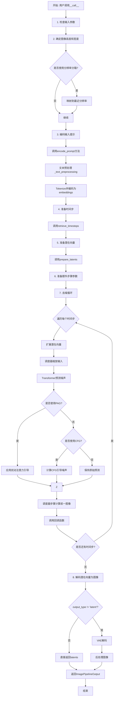
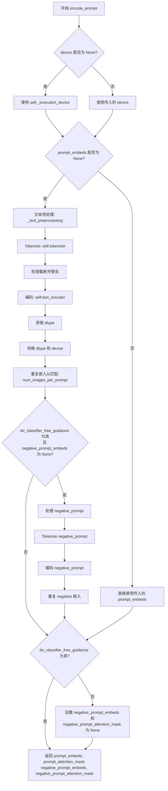
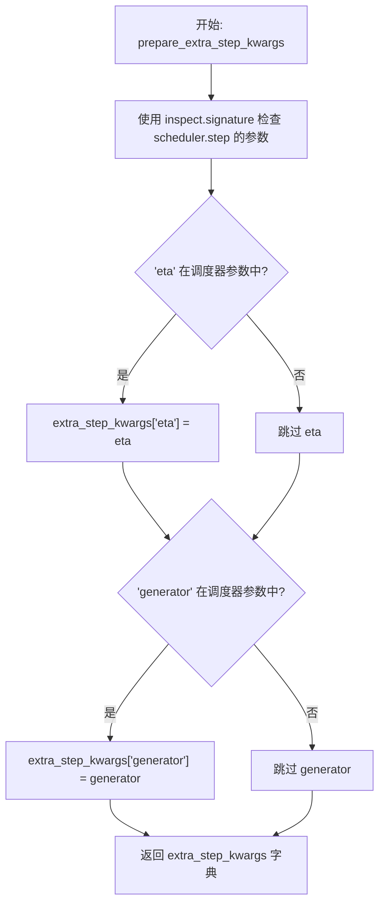
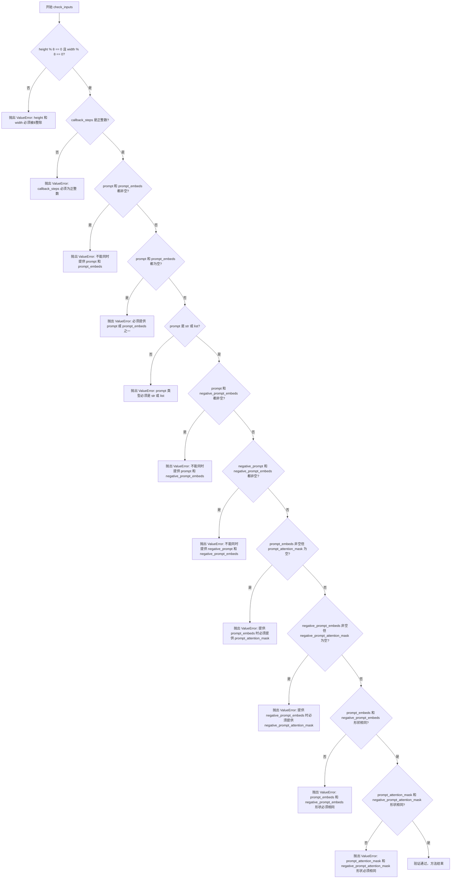
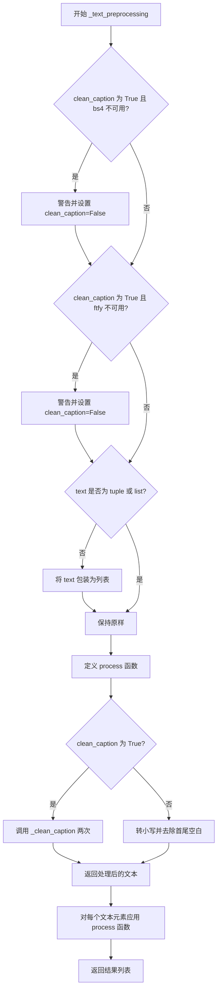
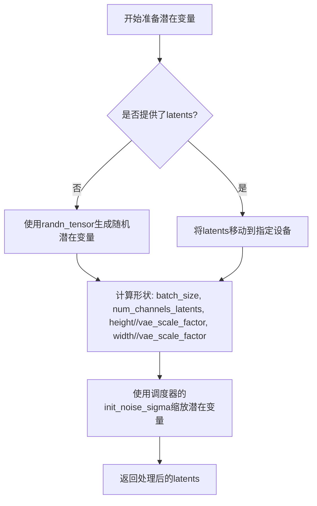
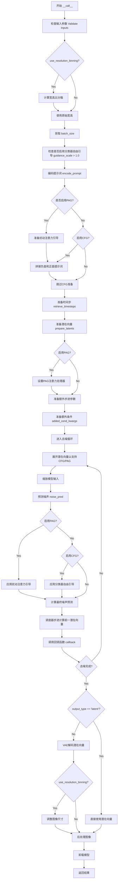

```mermaid
flowchart TD
    A[开始 retrieve_timesteps] --> B{检查 timesteps 和 sigmas 是否同时存在}
    B -- 是 --> C[抛出 ValueError: 只能选择 timesteps 或 sigmas 之一]
    B -- 否 --> D{检查是否提供了 timesteps}
    D -- 是 --> E{检查 scheduler.set_timesteps 是否支持 timesteps 参数}
    E -- 否 --> F[抛出 ValueError: 当前调度器不支持自定义 timesteps]
    E -- 是 --> G[调用 scheduler.set_timesteps&#40;timesteps=timesteps, device=device, **kwargs&#41;]
    G --> H[获取 scheduler.timesteps]
    H --> I[计算 num_inference_steps = len&#40;timesteps&#41;]
    D -- 否 --> J{检查是否提供了 sigmas}
    J -- 是 --> K{检查 scheduler.set_timesteps 是否支持 sigmas 参数}
    K -- 否 --> L[抛出 ValueError: 当前调度器不支持自定义 sigmas]
    K -- 是 --> M[调用 scheduler.set_timesteps&#40;sigmas=sigmas, device=device, **kwargs&#41;]
    M --> N[获取 scheduler.timesteps]
    N --> O[计算 num_inference_steps = len&#40;timesteps&#41;]
    J -- 否 --> P[调用 scheduler.set_timesteps&#40;num_inference_steps, device=device, **kwargs&#41;]
    P --> Q[获取 scheduler.timesteps]
    Q --> R[设置 num_inference_steps = len&#40;timesteps&#41;]
    I --> S[返回 timesteps, num_inference_steps]
    O --> S
    R --> S
    S --> T[结束]
```

# `diffusers\src\diffusers\pipelines\pag\pipeline_pag_pixart_sigma.py` 详细设计文档

这是一个基于PixArt-Sigma模型的文本到图像生成扩散管道，实现了PAG（Perturbed Attention Guidance）技术。该管道通过T5编码器将文本提示转换为嵌入向量，使用PixArtTransformer2DModel进行去噪处理，最后通过VAE将潜在空间解码为图像，支持高分辨率生成和多种引导参数控制。

## 整体流程



## 类结构

```
DiffusionPipeline (抽象基类)
├── PixArtSigmaPAGPipeline
│   └── PAGMixin (混入类)
```

## 全局变量及字段


### `XLA_AVAILABLE`
    
Flag indicating whether PyTorch XLA is available for accelerated computation

类型：`bool`
    


### `logger`
    
Module-level logger instance for tracking runtime events and warnings

类型：`logging.Logger`
    


### `EXAMPLE_DOC_STRING`
    
Documentation string containing usage examples for the pipeline

类型：`str`
    


### `ASPECT_RATIO_256_BIN`
    
Predefined aspect ratio bins for 256px resolution images

类型：`list[tuple[int, int]]`
    


### `ASPECT_RATIO_512_BIN`
    
Predefined aspect ratio bins for 512px resolution images

类型：`list[tuple[int, int]]`
    


### `ASPECT_RATIO_1024_BIN`
    
Predefined aspect ratio bins for 1024px resolution images

类型：`list[tuple[int, int]]`
    


### `ASPECT_RATIO_2048_BIN`
    
Predefined aspect ratio bins for 2048px resolution images

类型：`list[tuple[int, int]]`
    


### `PixArtSigmaPAGPipeline.bad_punct_regex`
    
Regular expression pattern for detecting and removing bad punctuation characters

类型：`re.Pattern`
    


### `PixArtSigmaPAGPipeline._optional_components`
    
List of optional pipeline components that can be omitted during initialization

类型：`list[str]`
    


### `PixArtSigmaPAGPipeline.model_cpu_offload_seq`
    
Sequence string defining the order for CPU offloading of models

类型：`str`
    


### `PixArtSigmaPAGPipeline.vae_scale_factor`
    
Scaling factor for VAE latent space based on the number of VAE block output channels

类型：`int`
    


### `PixArtSigmaPAGPipeline.image_processor`
    
Image processor for handling input/output image transformations and preprocessing

类型：`PixArtImageProcessor`
    
    

## 全局函数及方法


### `retrieve_timesteps`

该函数是扩散模型Pipeline中的通用工具函数，负责调用调度器（Scheduler）的 `set_timesteps` 方法并从中获取时间步（timesteps）序列。它支持自定义时间步或_sigmas_（噪声调度参数），同时提供灵活的参数校验与错误处理，确保调度器支持所请求的功能。

参数：

- `scheduler`：`SchedulerMixin`，提供时间步的调度器对象
- `num_inference_steps`：`int | None`，生成样本时使用的扩散步数，若使用则 `timesteps` 必须为 `None`
- `device`：`str | torch.device | None`，时间步应移动到的设备，若为 `None` 则不移动
- `timesteps`：`list[int] | None`，自定义时间步，用于覆盖调度器的时间步间隔策略，若传递此参数则 `num_inference_steps` 和 `sigmas` 必须为 `None`
- `sigmas`：`list[float] | None`，自定义_sigmas_，用于覆盖调度器的时间步间隔策略，若传递此参数则 `num_inference_steps` 和 `timesteps` 必须为 `None`
- `**kwargs`：任意关键字参数，将传递给 `scheduler.set_timesteps`

返回值：`tuple[torch.Tensor, int]`，包含调度器的时间步序列张量（第一个元素）和推理步数（第二个元素）

#### 流程图



#### 带注释源码

```python
# Copied from diffusers.pipelines.stable_diffusion.pipeline_stable_diffusion.retrieve_timesteps
def retrieve_timesteps(
    scheduler,
    num_inference_steps: int | None = None,
    device: str | torch.device | None = None,
    timesteps: list[int] | None = None,
    sigmas: list[float] | None = None,
    **kwargs,
):
    r"""
    Calls the scheduler's `set_timesteps` method and retrieves timesteps from the scheduler after the call. Handles
    custom timesteps. Any kwargs will be supplied to `scheduler.set_timesteps`.

    Args:
        scheduler (`SchedulerMixin`):
            The scheduler to get timesteps from.
        num_inference_steps (`int`):
            The number of diffusion steps used when generating samples with a pre-trained model. If used, `timesteps`
            must be `None`.
        device (`str` or `torch.device`, *optional*):
            The device to which the timesteps should be moved to. If `None`, the timesteps are not moved.
        timesteps (`list[int]`, *optional*):
            Custom timesteps used to override the timestep spacing strategy of the scheduler. If `timesteps` is passed,
            `num_inference_steps` and `sigmas` must be `None`.
        sigmas (`list[float]`, *optional*):
            Custom sigmas used to override the timestep spacing strategy of the scheduler. If `sigmas` is passed,
            `num_inference_steps` and `timesteps` must be `None`.

    Returns:
        `tuple[torch.Tensor, int]`: A tuple where the first element is the timestep schedule from the scheduler and the
        second element is the number of inference steps.
    """
    # 检查用户是否同时传递了 timesteps 和 sigmas，这是不允许的，只能选择其一
    if timesteps is not None and sigmas is not None:
        raise ValueError("Only one of `timesteps` or `sigmas` can be passed. Please choose one to set custom values")
    
    # 处理自定义 timesteps 的情况
    if timesteps is not None:
        # 通过 inspect 模块检查 scheduler.set_timesteps 方法是否接受 timesteps 参数
        accepts_timesteps = "timesteps" in set(inspect.signature(scheduler.set_timesteps).parameters.keys())
        if not accepts_timesteps:
            raise ValueError(
                f"The current scheduler class {scheduler.__class__}'s `set_timesteps` does not support custom"
                f" timestep schedules. Please check whether you are using the correct scheduler."
            )
        # 调用调度器的 set_timesteps 方法设置自定义时间步
        scheduler.set_timesteps(timesteps=timesteps, device=device, **kwargs)
        # 从调度器获取更新后的 timesteps
        timesteps = scheduler.timesteps
        # 计算实际的推理步数
        num_inference_steps = len(timesteps)
    
    # 处理自定义 sigmas 的情况
    elif sigmas is not None:
        # 检查调度器是否支持 sigmas 参数
        accept_sigmas = "sigmas" in set(inspect.signature(scheduler.set_timesteps).parameters.keys())
        if not accept_sigmas:
            raise ValueError(
                f"The current scheduler class {scheduler.__class__}'s `set_timesteps` does not support custom"
                f" sigmas schedules. Please check whether you are using the correct scheduler."
            )
        # 调用调度器的 set_timesteps 方法设置自定义 sigmas
        scheduler.set_timesteps(sigmas=sigmas, device=device, **kwargs)
        # 从调度器获取更新后的 timesteps（调度器会根据 sigmas 生成对应的时间步）
        timesteps = scheduler.timesteps
        # 计算实际的推理步数
        num_inference_steps = len(timesteps)
    
    # 默认情况：使用 num_inference_steps 由调度器自动生成时间步
    else:
        scheduler.set_timesteps(num_inference_steps, device=device, **kwargs)
        timesteps = scheduler.timesteps
    
    # 返回时间步序列和推理步数
    return timesteps, num_inference_steps
```


### `PixArtSigmaPAGPipeline.__init__`

该方法是 `PixArtSigmaPAGPipeline` 类的构造函数，负责初始化整个 PAG（Perturbed Attention Guidance）Pipeline 实例。它接收分词器、文本编码器、VAE、Transformer、调度器等核心组件，并注册模块、计算 VAE 缩放因子、初始化图像处理器以及配置 PAG 应用层。

参数：

- `tokenizer`：`T5Tokenizer`，用于将文本提示编码为模型可处理的 token 序列
- `text_encoder`：`T5EncoderModel`，将 token 序列编码为文本嵌入向量
- `vae`：`AutoencoderKL`，变分自编码器，用于将潜在表示解码为图像
- `transformer`：`PixArtTransformer2DModel`，PixArt-Sigma 主干变换器模型，负责去噪预测
- `scheduler`：`KarrasDiffusionSchedulers`，扩散调度器，控制去噪过程的噪声调度
- `pag_applied_layers`：`str | list[str]`，默认为 `"blocks.1"`（第一个 Transformer 块），指定应用 PAG 的层

返回值：`None`，构造函数无返回值

#### 流程图

```mermaid
flowchart TD
    A[开始 __init__] --> B[调用 super().__init__]
    B --> C[register_modules 注册所有模块]
    C --> D[计算 vae_scale_factor]
    D --> E[创建 PixArtImageProcessor]
    E --> F[调用 set_pag_applied_layers]
    F --> G[结束 __init__]
```

#### 带注释源码

```python
def __init__(
    self,
    tokenizer: T5Tokenizer,
    text_encoder: T5EncoderModel,
    vae: AutoencoderKL,
    transformer: PixArtTransformer2DModel,
    scheduler: KarrasDiffusionSchedulers,
    pag_applied_layers: str | list[str] = "blocks.1",  # 1st transformer block
):
    """
    初始化 PixArtSigmaPAGPipeline 实例。
    
    参数:
        tokenizer: T5 分词器
        text_encoder: T5 文本编码器模型
        vae: 变分自编码器 (VAE)
        transformer: PixArt Transformer 2D 模型
        scheduler: Karras 扩散调度器
        pag_applied_layers: 应用 PAG 的层，默认为 "blocks.1"
    """
    # 调用父类 DiffusionPipeline 的初始化方法
    # 设置基本的 pipeline 配置和属性
    super().__init__()

    # 使用 register_modules 注册所有子模块
    # 这些模块会被添加到 pipeline 中并可通过 self.xxx 访问
    # 同时支持 .to(), .half() 等模型方法
    self.register_modules(
        tokenizer=tokenizer, 
        text_encoder=text_encoder, 
        vae=vae, 
        transformer=transformer, 
        scheduler=scheduler
    )

    # 计算 VAE 缩放因子
    # VAE 通常有多个输出通道块，缩放因子为 2^(block_out_channels 数量 - 1)
    # 例如: block_out_channels = [128, 256, 512, 512] -> 2^3 = 8
    # 如果没有 vae 模块，默认使用 8
    self.vae_scale_factor = 2 ** (len(self.vae.config.block_out_channels) - 1) if getattr(self, "vae", None) else 8
    
    # 初始化图像处理器
    # 用于处理图像的预处理和后处理操作
    self.image_processor = PixArtImageProcessor(vae_scale_factor=self.vae_scale_factor)

    # 设置 PAG 应用层
    # 这些层将用于扰动注意力引导（PAG）技术
    self.set_pag_applied_layers(pag_applied_layers)
```


### `PixArtSigmaPAGPipeline.encode_prompt`

该方法负责将文本提示（prompt）编码为文本编码器（Text Encoder）的隐藏状态（hidden states），支持分类器无关引导（Classifier-Free Guidance, CFG），并返回提示的嵌入向量、注意力掩码及其对应的负向提示嵌入向量和注意力掩码。

参数：

- `self`：`PixArtSigmaPAGPipeline` 实例本身
- `prompt`：`str | list[str]`，要编码的文本提示，支持单字符串或字符串列表
- `do_classifier_free_guidance`：`bool`，是否启用分类器无关引导，默认为 `True`
- `negative_prompt`：`str`，负向提示，用于引导图像生成方向，默认为空字符串
- `num_images_per_prompt`：`int`，每个提示生成的图像数量，默认为 1
- `device`：`torch.device | None`，用于放置结果嵌入的设备，若为 `None` 则使用执行设备
- `prompt_embeds`：`torch.Tensor | None`，预生成的文本嵌入，可用于调整文本输入，若未提供则从 `prompt` 生成
- `negative_prompt_embeds`：`torch.Tensor | None`，预生成的负向文本嵌入，若未提供则从 `negative_prompt` 生成
- `prompt_attention_mask`：`torch.Tensor | None`，文本嵌入的注意力掩码
- `negative_prompt_attention_mask`：`torch.Tensor | None`，负向文本嵌入的注意力掩码
- `clean_caption`：`bool`，是否在编码前清理提示文本，默认为 `False`
- `max_sequence_length`：`int`，提示的最大序列长度，默认为 300（T5 模型支持）
- `**kwargs`：其他关键字参数，目前用于处理已废弃的 `mask_feature` 参数

返回值：`tuple[torch.Tensor, torch.Tensor, torch.Tensor, torch.Tensor]`，包含四个张量：
- `prompt_embeds`：编码后的提示嵌入向量
- `prompt_attention_mask`：提示的注意力掩码
- `negative_prompt_embeds`：编码后的负向提示嵌入向量
- `negative_prompt_attention_mask`：负向提示的注意力掩码

#### 流程图



#### 带注释源码

```python
def encode_prompt(
    self,
    prompt: str | list[str],
    do_classifier_free_guidance: bool = True,
    negative_prompt: str = "",
    num_images_per_prompt: int = 1,
    device: torch.device | None = None,
    prompt_embeds: torch.Tensor | None = None,
    negative_prompt_embeds: torch.Tensor | None = None,
    prompt_attention_mask: torch.Tensor | None = None,
    negative_prompt_attention_mask: torch.Tensor | None = None,
    clean_caption: bool = False,
    max_sequence_length: int = 300,
    **kwargs,
):
    r"""
    Encodes the prompt into text encoder hidden states.

    Args:
        prompt (`str` or `list[str]`, *optional*):
            prompt to be encoded
        negative_prompt (`str` or `list[str]`, *optional*):
            The prompt not to guide the image generation. If not defined, one has to pass `negative_prompt_embeds`
            instead. Ignored when not using guidance (i.e., ignored if `guidance_scale` is less than `1`). For
            PixArt-Alpha, this should be "".
        do_classifier_free_guidance (`bool`, *optional*, defaults to `True`):
            whether to use classifier free guidance or not
        num_images_per_prompt (`int`, *optional*, defaults to 1):
            number of images that should be generated per prompt
        device: (`torch.device`, *optional*):
            torch device to place the resulting embeddings on
        prompt_embeds (`torch.Tensor`, *optional*):
            Pre-generated text embeddings. Can be used to easily tweak text inputs, *e.g.* prompt weighting. If not
            provided, text embeddings will be generated from `prompt` input argument.
        negative_prompt_embeds (`torch.Tensor`, *optional*):
            Pre-generated negative text embeddings. For PixArt-Alpha, it's should be the embeddings of the ""
            string.
        clean_caption (`bool`, defaults to `False`):
            If `True`, the function will preprocess and clean the provided caption before encoding.
        max_sequence_length (`int`, defaults to 300): Maximum sequence length to use for the prompt.
    """

    # 处理已废弃的 mask_feature 参数，发出警告但不中断
    if "mask_feature" in kwargs:
        deprecation_message = "The use of `mask_feature` is deprecated. It is no longer used in any computation and that doesn't affect the end results. It will be removed in a future version."
        deprecate("mask_feature", "1.0.0", deprecation_message, standard_warn=False)

    # 如果未指定设备，则使用管道的执行设备
    if device is None:
        device = self._execution_device

    # 根据论文 Section 3.1，设置最大序列长度
    max_length = max_sequence_length

    # 如果未提供预计算的 prompt_embeds，则需要从 prompt 生成
    if prompt_embeds is None:
        # 对文本进行预处理（清理大小写、清理特殊字符等）
        prompt = self._text_preprocessing(prompt, clean_caption=clean_caption)
        
        # 使用 T5 Tokenizer 对提示进行分词
        text_inputs = self.tokenizer(
            prompt,
            padding="max_length",
            max_length=max_length,
            truncation=True,
            add_special_tokens=True,
            return_tensors="pt",
        )
        text_input_ids = text_inputs.input_ids
        
        # 检查是否发生了截断，如果是则警告用户
        untruncated_ids = self.tokenizer(prompt, padding="longest", return_tensors="pt").input_ids
        if untruncated_ids.shape[-1] >= text_input_ids.shape[-1] and not torch.equal(
            text_input_ids, untruncated_ids
        ):
            removed_text = self.tokenizer.batch_decode(untruncated_ids[:, max_length - 1 : -1])
            logger.warning(
                "The following part of your input was truncated because T5 can only handle sequences up to"
                f" {max_length} tokens: {removed_text}"
            )

        # 获取注意力掩码并移至指定设备
        prompt_attention_mask = text_inputs.attention_mask
        prompt_attention_mask = prompt_attention_mask.to(device)

        # 使用 Text Encoder 编码文本输入
        prompt_embeds = self.text_encoder(text_input_ids.to(device), attention_mask=prompt_attention_mask)
        # 获取隐藏状态（通常为 tuple，索引 [0] 为实际嵌入）
        prompt_embeds = prompt_embeds[0]

    # 确定数据类型，优先使用 text_encoder 的 dtype，其次使用 transformer 的 dtype
    if self.text_encoder is not None:
        dtype = self.text_encoder.dtype
    elif self.transformer is not None:
        dtype = self.transformer.dtype
    else:
        dtype = None

    # 将 prompt_embeds 转换到指定的 dtype 和设备
    prompt_embeds = prompt_embeds.to(dtype=dtype, device=device)

    # 获取批次大小和序列长度
    bs_embed, seq_len, _ = prompt_embeds.shape
    
    # 复制文本嵌入和注意力掩码以匹配每个提示生成的图像数量（使用 MPS 友好的方法）
    prompt_embeds = prompt_embeds.repeat(1, num_images_per_prompt, 1)
    prompt_embeds = prompt_embeds.view(bs_embed * num_images_per_prompt, seq_len, -1)
    prompt_attention_mask = prompt_attention_mask.repeat(1, num_images_per_prompt)
    prompt_attention_mask = prompt_attention_mask.view(bs_embed * num_images_per_prompt, -1)

    # 获取用于分类器无关引导的无条件嵌入
    if do_classifier_free_guidance and negative_prompt_embeds is None:
        # 将负向提示扩展为批次大小
        uncond_tokens = [negative_prompt] * bs_embed if isinstance(negative_prompt, str) else negative_prompt
        # 文本预处理
        uncond_tokens = self._text_preprocessing(uncond_tokens, clean_caption=clean_caption)
        max_length = prompt_embeds.shape[1]
        
        # Tokenize 负向提示
        uncond_input = self.tokenizer(
            uncond_tokens,
            padding="max_length",
            max_length=max_length,
            truncation=True,
            return_attention_mask=True,
            add_special_tokens=True,
            return_tensors="pt",
        )
        negative_prompt_attention_mask = uncond_input.attention_mask
        negative_prompt_attention_mask = negative_prompt_attention_mask.to(device)

        # 编码负向提示
        negative_prompt_embeds = self.text_encoder(
            uncond_input.input_ids.to(device), attention_mask=negative_prompt_attention_mask
        )
        negative_prompt_embeds = negative_prompt_embeds[0]

    # 如果启用分类器无关引导，处理负向嵌入
    if do_classifier_free_guidance:
        # 获取序列长度
        seq_len = negative_prompt_embeds.shape[1]

        # 转换 dtype 和 device
        negative_prompt_embeds = negative_prompt_embeds.to(dtype=dtype, device=device)

        # 复制无条件嵌入以匹配每个提示生成的图像数量
        negative_prompt_embeds = negative_prompt_embeds.repeat(1, num_images_per_prompt, 1)
        negative_prompt_embeds = negative_prompt_embeds.view(bs_embed * num_images_per_prompt, seq_len, -1)

        negative_prompt_attention_mask = negative_prompt_attention_mask.repeat(1, num_images_per_prompt)
        negative_prompt_attention_mask = negative_prompt_attention_mask.view(bs_embed * num_images_per_prompt, -1)
    else:
        # 如果不启用 CFG，设置负向嵌入为 None
        negative_prompt_embeds = None
        negative_prompt_attention_mask = None

    # 返回四个张量：prompt_embeds, prompt_attention_mask, negative_prompt_embeds, negative_prompt_attention_mask
    return prompt_embeds, prompt_attention_mask, negative_prompt_embeds, negative_prompt_attention_mask
```


### `PixArtSigmaPAGPipeline.prepare_extra_step_kwargs`

该方法用于准备调度器（scheduler）的额外参数。由于不同调度器具有不同的签名接口，此方法通过检查调度器的 `step` 方法是否接受特定参数（如 `eta` 和 `generator`），动态构建并返回需要传递给调度器步进函数的额外关键字参数字典。

参数：

- `self`：隐式参数，`PixArtSigmaPAGPipeline` 实例本身
- `generator`：`torch.Generator | list[torch.Generator] | None`，用于使生成过程具有确定性的随机数生成器，可传入单个生成器或生成器列表
- `eta`：`float`，对应 DDIM 论文中的参数 η (eta)，仅在 DDIMScheduler 中使用，其他调度器会忽略该参数，其值应在 [0, 1] 范围内

返回值：`dict`，包含调度器 `step` 方法所需额外参数（如 `eta` 和/或 `generator`）的字典

#### 流程图



#### 带注释源码

```python
# Copied from diffusers.pipelines.stable_diffusion.pipeline_stable_diffusion.StableDiffusionPipeline.prepare_extra_step_kwargs
def prepare_extra_step_kwargs(self, generator, eta):
    """
    准备调度器步进函数的额外参数。
    由于并非所有调度器都具有相同的签名，因此需要动态检查调度器支持的参数。
    
    参数:
        generator: torch.Generator 或其列表，用于控制随机性，使生成可复现
        eta (η): 仅用于 DDIMScheduler，对应 DDIM 论文中的参数，应在 [0, 1] 范围内
    
    返回:
        包含调度器所需额外参数的字典
    """
    
    # 通过 inspect 模块检查调度器的 step 方法签名，判断是否接受 'eta' 参数
    # eta (η) 仅在 DDIMScheduler 中使用，其他调度器会忽略此参数
    # eta 对应 DDIM 论文: https://huggingface.co/papers/2010.02502
    accepts_eta = "eta" in set(inspect.signature(self.scheduler.step).parameters.keys())
    
    # 初始化空字典用于存储额外参数
    extra_step_kwargs = {}
    
    # 如果调度器接受 eta 参数，则将其添加到 extra_step_kwargs
    if accepts_eta:
        extra_step_kwargs["eta"] = eta

    # 检查调度器是否接受 generator 参数
    # generator 用于使生成过程具有确定性
    accepts_generator = "generator" in set(inspect.signature(self.scheduler.step).parameters.keys())
    
    # 如果调度器接受 generator 参数，则将其添加到 extra_step_kwargs
    if accepts_generator:
        extra_step_kwargs["generator"] = generator
    
    # 返回构建好的额外参数字典，供 scheduler.step 调用时使用
    return extra_step_kwargs
```


### `PixArtSigmaPAGPipeline.check_inputs`

该方法用于验证图像生成管道的输入参数是否合法，包括检查高度和宽度是否为8的倍数、callback_steps是否为正整数、prompt和prompt_embeds不能同时提供且至少提供一个、prompt类型必须为字符串或列表、prompt和negative_prompt_embeds不能同时提供、negative_prompt和negative_prompt_embeds不能同时提供、提供prompt_embeds时必须提供prompt_attention_mask、提供negative_prompt_embeds时必须提供negative_prompt_attention_mask，以及prompt_embeds和negative_prompt_embeds的形状必须一致、prompt_attention_mask和negative_pention_mask的形状必须一致。如果任何检查失败，将抛出相应的ValueError异常。

参数：

- `self`：`PixArtSigmaPAGPipeline`，Pipeline 实例本身
- `prompt`：`str | list[str] | None`，用户提供的文本提示，可以是单个字符串或字符串列表
- `height`：`int`，生成图像的高度（像素）
- `width`：`int`，生成图像的宽度（像素）
- `negative_prompt`：`str | list[str] | None`，用于反向引导的负面提示
- `callback_steps`：`int | None`，每多少步调用一次回调函数
- `prompt_embeds`：`torch.Tensor | None`，预生成的文本嵌入向量
- `negative_prompt_embeds`：`torch.Tensor | None`，预生成的负面文本嵌入向量
- `prompt_attention_mask`：`torch.Tensor | None`，文本嵌入的注意力掩码
- `negative_prompt_attention_mask`：`torch.Tensor | None`，负面文本嵌入的注意力掩码

返回值：`None`，该方法不返回任何值，仅通过抛出异常来处理错误

#### 流程图



#### 带注释源码

```python
def check_inputs(
    self,
    prompt,
    height,
    width,
    negative_prompt,
    callback_steps,
    prompt_embeds=None,
    negative_prompt_embeds=None,
    prompt_attention_mask=None,
    negative_prompt_attention_mask=None,
):
    """
    检查输入参数的合法性，在生成图像前进行一系列验证。
    
    该方法会检查：
    1. 高度和宽度必须是8的倍数
    2. callback_steps必须是正整数
    3. prompt和prompt_embeds不能同时提供
    4. prompt和prompt_embeds至少提供一个
    5. prompt类型必须是str或list
    6. prompt和negative_prompt_embeds不能同时提供
    7. negative_prompt和negative_prompt_embeds不能同时提供
    8. 如果提供prompt_embeds，必须同时提供prompt_attention_mask
    9. 如果提供negative_prompt_embeds，必须同时提供negative_prompt_attention_mask
    10. prompt_embeds和negative_prompt_embeds形状必须一致
    11. prompt_attention_mask和negative_prompt_attention_mask形状必须一致
    """
    
    # 检查高度和宽度是否为8的倍数
    if height % 8 != 0 or width % 8 != 0:
        raise ValueError(f"`height` and `width` have to be divisible by 8 but are {height} and {width}.")

    # 检查callback_steps是否为正整数
    if (callback_steps is None) or (
        callback_steps is not None and (not isinstance(callback_steps, int) or callback_steps <= 0)
    ):
        raise ValueError(
            f"`callback_steps` has to be a positive integer but is {callback_steps} of type"
            f" {type(callback_steps)}."
        )

    # 检查prompt和prompt_embeds不能同时提供
    if prompt is not None and prompt_embeds is not None:
        raise ValueError(
            f"Cannot forward both `prompt`: {prompt} and `prompt_embeds`: {prompt_embeds}. Please make sure to"
            " only forward one of the two."
        )
    # 检查prompt和prompt_embeds至少提供一个
    elif prompt is None and prompt_embeds is None:
        raise ValueError(
            "Provide either `prompt` or `prompt_embeds`. Cannot leave both `prompt` and `prompt_embeds` undefined."
        )
    # 检查prompt类型必须是str或list
    elif prompt is not None and (not isinstance(prompt, str) and not isinstance(prompt, list)):
        raise ValueError(f"`prompt` has to be of type `str` or `list` but is {type(prompt)}")

    # 检查prompt和negative_prompt_embeds不能同时提供
    if prompt is not None and negative_prompt_embeds is not None:
        raise ValueError(
            f"Cannot forward both `prompt`: {prompt} and `negative_prompt_embeds`:"
            f" {negative_prompt_embeds}. Please make sure to only forward one of the two."
        )

    # 检查negative_prompt和negative_prompt_embeds不能同时提供
    if negative_prompt is not None and negative_prompt_embeds is not None:
        raise ValueError(
            f"Cannot forward both `negative_prompt`: {negative_prompt} and `negative_prompt_embeds`:"
            f" {negative_prompt_embeds}. Please make sure to only forward one of the two."
        )

    # 检查提供prompt_embeds时必须提供prompt_attention_mask
    if prompt_embeds is not None and prompt_attention_mask is None:
        raise ValueError("Must provide `prompt_attention_mask` when specifying `prompt_embeds`.")

    # 检查提供negative_prompt_embeds时必须提供negative_prompt_attention_mask
    if negative_prompt_embeds is not None and negative_prompt_attention_mask is None:
        raise ValueError("Must provide `negative_prompt_attention_mask` when specifying `negative_prompt_embeds`.")

    # 检查prompt_embeds和negative_prompt_embeds形状一致性
    if prompt_embeds is not None and negative_prompt_embeds is not None:
        if prompt_embeds.shape != negative_prompt_embeds.shape:
            raise ValueError(
                "`prompt_embeds` and `negative_prompt_embeds` must have the same shape when passed directly, but"
                f" got: `prompt_embeds` {prompt_embeds.shape} != `negative_prompt_embeds`"
                f" {negative_prompt_embeds.shape}."
            )
        # 检查prompt_attention_mask和negative_prompt_attention_mask形状一致性
        if prompt_attention_mask.shape != negative_prompt_attention_mask.shape:
            raise ValueError(
                "`prompt_attention_mask` and `negative_prompt_attention_mask` must have the same shape when passed directly, but"
                f" got: `prompt_attention_mask` {prompt_attention_mask.shape} != `negative_prompt_attention_mask`"
                f" {negative_prompt_attention_mask.shape}."
            )
```


### `PixArtSigmaPAGPipeline._text_preprocessing`

该方法用于对输入的文本提示进行预处理，支持两种模式：基础模式（转小写并去除首尾空白）和清理模式（使用 `_clean_caption` 进行深度清理）。

参数：

- `text`：`str | list[str] | tuple[str]`，需要预处理的文本提示，可以是单个字符串或字符串列表/元组
- `clean_caption`：`bool`，是否使用深度清理模式（需要 `beautifulsoup4` 和 `ftfy` 库支持），默认为 `False`

返回值：`list[str]`，预处理后的文本列表

#### 流程图



#### 带注释源码

```python
def _text_preprocessing(self, text, clean_caption=False):
    r"""
    Preprocesses the input text prompt(s) for encoding.

    This method handles text normalization and optional advanced cleaning.
    It supports both basic preprocessing (lowercase + strip) and advanced
    caption cleaning using BeautifulSoup and ftfy libraries.

    Args:
        text: Input text to preprocess (str, list, or tuple)
        clean_caption: Whether to apply advanced cleaning (default: False)

    Returns:
        List of preprocessed text strings
    """
    # 检查 BeautifulSoup (bs4) 是否可用，如果不可用则禁用清理功能
    if clean_caption and not is_bs4_available():
        logger.warning(BACKENDS_MAPPING["bs4"][-1].format("Setting `clean_caption=True`"))
        logger.warning("Setting `clean_caption` to False...")
        clean_caption = False

    # 检查 ftfy 是否可用，如果不可用则禁用清理功能
    if clean_caption and not is_ftfy_available():
        logger.warning(BACKENDS_MAPPING["ftfy"][-1].format("Setting `clean_caption=True`"))
        logger.warning("Setting `clean_caption` to False...")
        clean_caption = False

    # 统一处理：将单个字符串转换为列表，以便统一处理
    if not isinstance(text, (tuple, list)):
        text = [text]

    # 定义内部处理函数，对单个文本进行预处理
    def process(text: str):
        # 如果启用清理模式，则进行深度清理（调用两次以增强效果）
        if clean_caption:
            text = self._clean_caption(text)
            text = self._clean_caption(text)
        else:
            # 否则只进行基础处理：转小写并去除首尾空白
            text = text.lower().strip()
        return text

    # 对列表中的每个文本元素应用处理函数
    return [process(t) for t in text]
```


### `PixArtSigmaPAGPipeline._clean_caption`

该方法是一个文本预处理函数，用于清理和标准化图像生成提示词（caption）。它通过 URL 解码、HTML 解析、CJK 字符过滤、特殊符号清理等多种正则表达式操作，去除提示词中的噪声信息（如 URL、HTML 标签、CJK 字符、数字序列、特殊标点等），确保模型接收到的提示词是干净、标准化的文本。

参数：

- `caption`：`str`，需要清理的原始文本标题（caption）

返回值：`str`，清理并标准化后的文本

#### 流程图

```mermaid
flowchart TD
    A[开始: 输入原始caption] --> B[转换为字符串并URL解码]
    B --> C[去除首尾空格并转为小写]
    C --> D[替换&lt;person&gt;为person]
    D --> E[正则匹配并移除URL链接]
    E --> F[BeautifulSoup解析移除HTML标签]
    F --> G[正则移除@昵称]
    G --> H[正则移除CJK字符集]
    H --> I[统一破折号为标准横线]
    I --> J[统一引号格式]
    J --> K[移除HTML实体如&amp; &quot;]
    K --> L[移除IP地址]
    L --> M[移除文章ID和换行符]
    M --> N[移除#标签和数字序列]
    N --> O[移除文件名和媒体扩展名]
    O --> P[合并重复引号和句点]
    P --> Q[移除特殊标点和多余空格]
    Q --> R[处理下划线/连字符分隔的复合词]
    R --> S[ftfy修复文本编码]
    S --> T[双重HTMLunescape解码]
    T --> U[移除字母数字组合如jc6640]
    U --> V[移除快递/下载/页码等广告信息]
    V --> W[移除剩余广告模式]
    W --> X[清理首尾标点符号]
    X --> Y[返回清理后的caption.strip()]
```

#### 带注释源码

```python
def _clean_caption(self, caption):
    """
    清理并标准化输入的图像描述文本（caption）
    
    该方法执行多轮文本清洗操作，包括：
    - URL解码
    - HTML标签移除
    - CJK字符过滤
    - 特殊符号标准化
    - 广告/噪声文本移除
    """
    # 1. 基础类型转换
    caption = str(caption)  # 确保输入为字符串类型
    
    # 2. URL解码：处理URL编码的字符（如 %20 转换为空格）
    caption = ul.unquote_plus(caption)
    
    # 3. 去除首尾空格并转为小写
    caption = caption.strip().lower()
    
    # 4. 替换常见的占位符标记
    caption = re.sub("<person>", "person", caption)
    
    # 5. 移除HTTP/HTTPS URLs（两种正则模式）
    caption = re.sub(
        r"\b((?:https?:(?:\/{1,3}|[a-zA-Z0-9%])|[a-zA-Z0-9.\-]+[.](?:com|co|ru|net|org|edu|gov|it)[\w/-]*\b\/?(?!@)))",  # noqa
        "",
        caption,
    )  # regex for urls
    
    # 6. 移除www开头的URL
    caption = re.sub(
        r"\b((?:www:(?:\/{1,3}|[a-zA-Z0-9%])|[a-zA-Z0-9.\-]+[.](?:com|co|ru|net|org|edu|gov|it)[\w/-]*\b\/?(?!@)))",  # noqa
        "",
        caption,
    )  # regex for urls
    
    # 7. 使用BeautifulSoup解析HTML并提取纯文本
    caption = BeautifulSoup(caption, features="html.parser").text
    
    # 8. 移除Twitter/社交媒体@昵称
    caption = re.sub(r"@[\w\d]+\b", "", caption)
    
    # 9-15. 移除CJK（中日韩）Unicode字符集
    # 这些字符范围覆盖了CJK统一表意文字、偏旁部首等
    caption = re.sub(r"[\u31c0-\u31ef]+", "", caption)   # CJK笔画
    caption = re.sub(r"[\u31f0-\u31ff]+", "", caption)   # 片假名音扩展
    caption = re.sub(r"[\u3200-\u32ff]+", "", caption)   # CJK圈环字母
    caption = re.sub(r"[\u3300-\u33ff]+", "", caption)   # CJK兼容字符
    caption = re.sub(r"[\u3400-\u4dbf]+", "", caption)   # CJK统一表意文字扩展A
    caption = re.sub(r"[\u4dc0-\u4dff]+", "", caption)   # 易经六十四卦符号
    caption = re.sub(r"[\u4e00-\u9fff]+", "", caption)   # CJK统一表意文字
    
    # 16. 将各类破折号统一转换为标准横线"-"
    caption = re.sub(
        r"[\u002D\u058A\u05BE\u1400\u1806\u2010-\u2015\u2E17\u2E1A\u2E3A\u2E3B\u2E40\u301C\u3030\u30A0\uFE31\uFE32\uFE58\uFE63\uFF0D]+",  # noqa
        "-",
        caption,
    )
    
    # 17. 统一引号风格
    caption = re.sub(r"[`´«»""¨]", '"', caption)  # 双引号统一
    caption = re.sub(r"['']", "'", caption)       # 单引号统一
    
    # 18. 移除HTML实体
    caption = re.sub(r"&quot;?", "", caption)  # 移除&quot;
    caption = re.sub(r"&amp", "", caption)    # 移除&amp;
    
    # 19. 移除IP地址
    caption = re.sub(r"\d{1,3}\.\d{1,3}\.\d{1,3}\.\d{1,3}", " ", caption)
    
    # 20. 移除文章ID（格式如 "12:34 " 结尾）
    caption = re.sub(r"\d:\d\d\s+$", "", caption)
    
    # 21. 移除转义换行符
    caption = re.sub(r"\\n", " ", caption)
    
    # 22-25. 移除数字标签和长数字序列
    caption = re.sub(r"#\d{1,3}\b", "", caption)      # #123
    caption = re.sub(r"#\d{5,}\b", "", caption)      # #12345..
    caption = re.sub(r"\b\d{6,}\b", "", caption)     # 123456..
    
    # 26. 移除常见图片/文件扩展名
    caption = re.sub(r"[\S]+\.(?:png|jpg|jpeg|bmp|webp|eps|pdf|apk|mp4)", "", caption)
    
    # 27-28. 合并重复的引号和句点
    caption = re.sub(r"[\"']{2,}", r'"', caption)  # """AUSVERKAUFT"""
    caption = re.sub(r"[\.]{2,}", r" ", caption)  # """AUSVERKAUFT"""
    
    # 29. 使用bad_punct_regex移除特殊标点（定义在类属性中）
    caption = re.sub(self.bad_punct_regex, r" ", caption)  # ***AUSVERKAUFT***, #AUSVERKAUFT
    caption = re.sub(r"\s+\.\s+", r" ", caption)  # " . "
    
    # 30. 处理连字符/下划线分隔的复合词
    # 如果超过3个分隔符，则将整个短语转为空格分隔
    regex2 = re.compile(r"(?:\-|\_)")
    if len(re.findall(regex2, caption)) > 3:
        caption = re.sub(regex2, " ", caption)
    
    # 31. 使用ftfy库修复常见的文本编码问题
    caption = ftfy.fix_text(caption)
    
    # 32. 双重HTML解码（处理嵌套的HTML实体）
    caption = html.unescape(html.unescape(caption))
    
    # 33-35. 移除字母数字组合模式（常见于产品型号/广告）
    caption = re.sub(r"\b[a-zA-Z]{1,3}\d{3,15}\b", "", caption)   # jc6640
    caption = re.sub(r"\b[a-zA-Z]+\d+[a-zA-Z]+\b", "", caption)  # jc6640vc
    caption = re.sub(r"\b\d+[a-zA-Z]+\d+\b", "", caption)        # 6640vc231
    
    # 36-37. 移除广告关键词
    caption = re.sub(r"(worldwide\s+)?(free\s+)?shipping", "", caption)
    caption = re.sub(r"(free\s)?download(\sfree)?", "", caption)
    caption = re.sub(r"\bclick\b\s(?:for|on)\s\w+", "", caption)
    caption = re.sub(r"\b(?:png|jpg|jpeg|bmp|webp|eps|pdf|apk|mp4)(\simage[s]?)?", "", caption)
    caption = re.sub(r"\bpage\s+\d+\b", "", caption)
    
    # 38. 移除包含数字和字母的复杂模式
    caption = re.sub(r"\b\d*[a-zA-Z]+\d+[a-zA-Z]+\d+[a-zA-Z\d]*\b", r" ", caption)  # j2d1a2a...
    
    # 39. 移除尺寸规格（如 1920x1080，注意包含俄语字母х）
    caption = re.sub(r"\b\d+\.?\d*[xх×]\d+\.?\d*\b", "", caption)
    
    # 40-42. 格式化处理
    caption = re.sub(r"\b\s+\:\s+", r": ", caption)       # 修复冒号周围空格
    caption = re.sub(r"(\D[,\./])\b", r"\1 ", caption)   # 在标点后添加空格
    caption = re.sub(r"\s+", " ", caption)                # 合并多余空格
    
    # 注意：caption.strip() 被调用但结果未赋值，这里是原代码的意图
    caption.strip()
    
    # 43. 移除首尾引号包裹
    caption = re.sub(r"^[\"\']([\w\W]+)[\"\']$", r"\1", caption)
    
    # 44. 移除首尾特定标点符号
    caption = re.sub(r"^[\'\_,\-\:;]", r" "", caption)
    caption = re.sub(r"[\'\_,\-\:\-\+]$", r"", caption)
    
    # 45. 移除以句点开头的单词（如 ".AUSVERKAUFT"）
    caption = re.sub(r"^\.\S+$", "", caption)
    
    # 返回最终清理结果
    return caption.strip()
```


### `PixArtSigmaPAGPipeline.prepare_latents`

该方法用于准备扩散模型的潜在变量（latents），即初始化或处理噪声张量，根据批次大小、图像尺寸和VAE缩放因子计算潜在空间的形状，并通过随机张量生成或直接使用提供的潜在变量，最后根据调度器的初始噪声标准差进行缩放。

参数：

- `batch_size`：`int`，批次大小，指定生成图像的数量
- `num_channels_latents`：`int`，潜在变量的通道数，通常对应于Transformer模型的输入通道数
- `height`：`int`，生成图像的高度（像素）
- `width`：`int`，生成图像的宽度（像素）
- `dtype`：`torch.dtype`，潜在变量的数据类型
- `device`：`torch.device`，潜在变量存放的设备
- `generator`：`torch.Generator` 或 `list[torch.Generator]`，可选的随机数生成器，用于确保可重复性
- `latents`：`torch.Tensor | None`，可选的预生成潜在变量，如果为None则随机生成

返回值：`torch.Tensor`，处理后的潜在变量张量，已根据调度器的初始噪声标准差进行缩放

#### 流程图



#### 带注释源码

```python
def prepare_latents(
    self,
    batch_size: int,
    num_channels_latents: int,
    height: int,
    width: int,
    dtype: torch.dtype,
    device: torch.device,
    generator: torch.Generator | list[torch.Generator],
    latents: torch.Tensor | None = None
) -> torch.Tensor:
    """
    准备用于去噪过程的潜在变量。
    
    该方法根据提供的参数计算潜在空间的形状，
    并生成或处理潜在变量张量。
    """
    # 计算潜在变量的形状
    # 高度和宽度需要除以vae_scale_factor，因为VAE的编码/解码过程会下采样/上采样
    shape = (
        batch_size,
        num_channels_latents,
        int(height) // self.vae_scale_factor,
        int(width) // self.vae_scale_factor,
    )
    
    # 验证生成器列表长度是否与批次大小匹配
    if isinstance(generator, list) and len(generator) != batch_size:
        raise ValueError(
            f"You have passed a list of generators of length {len(generator)}, but requested an effective batch"
            f" size of {batch_size}. Make sure the batch size matches the length of the generators."
        )

    # 如果没有提供latents，则随机生成
    if latents is None:
        latents = randn_tensor(shape, generator=generator, device=device, dtype=dtype)
    else:
        # 否则将提供的latents移动到指定设备
        latents = latents.to(device)

    # 根据调度器要求的初始噪声标准差缩放潜在变量
    # 这是为了让噪声级别与调度器的去噪计划相匹配
    latents = latents * self.scheduler.init_noise_sigma
    
    return latents
```


### `PixArtSigmaPAGPipeline.__call__`

这是 PixArt-Sigma 模型的 PAG（Perturbed Attention Guidance）Pipeline 的主调用方法，负责执行完整的文本到图像生成流程。该方法整合了提示编码、噪声调度、transformer推理、PAG指导、潜在解码等步骤，支持分辨率分箱、分类器自由引导和扰动注意力引导等高级功能。

参数：

- `prompt`：`str | list[str]`，要引导图像生成的提示词，如未定义则需传入 `prompt_embeds`
- `negative_prompt`：`str`，不引导图像生成的提示词，如未定义则需传入 `negative_prompt_embeds`，当 `guidance_scale < 1` 时忽略
- `num_inference_steps`：`int`，去噪步数，越多图像质量越高但推理越慢，默认 20
- `timesteps`：`list[int]`，自定义时间步，用于支持 timesteps 的调度器
- `sigmas`：`list[float]`，自定义 sigma 值，用于支持 sigmas 的调度器
- `guidance_scale`：`float`，分类器自由引导权重，默认 4.5，设为 1 时禁用引导
- `num_images_per_prompt`：`int | None`，每个提示词生成的图像数量，默认 1
- `height`：`int | None`，生成图像的高度（像素），默认使用 transformer.config.sample_size * vae_scale_factor
- `width`：`int | None`，生成图像的宽度（像素），默认使用 transformer.config.sample_size * vae_scale_factor
- `eta`：`float`，DDIM 论文中的 eta 参数，仅对 DDIMScheduler 有效，默认 0.0
- `generator`：`torch.Generator | list[torch.Generator] | None`，用于生成确定性结果的随机数生成器
- `latents`：`torch.Tensor | None`，预生成的噪声潜在向量，如不提供则使用随机 generator 生成
- `prompt_embeds`：`torch.Tensor | None`，预生成的文本嵌入，可用于提示词加权
- `prompt_attention_mask`：`torch.Tensor | None`，文本嵌入的预生成注意力掩码
- `negative_prompt_embeds`：`torch.Tensor | None`，预生成的负面文本嵌入，对于 PixArt-Sigma 应为空字符串 ""
- `negative_prompt_attention_mask`：`torch.Tensor | None`，负面文本嵌入的预生成注意力掩码
- `output_type`：`str | None`，输出格式，可选 "pil" 或 "np.array"，默认 "pil"
- `return_dict`：`bool`，是否返回 ImagePipelineOutput，默认 True
- `callback`：`Callable[[int, int, torch.Tensor], None] | None`，每 callback_steps 步调用的回调函数
- `callback_steps`：`int`，回调函数被调用的频率，默认 1
- `clean_caption`：`bool`，是否在创建嵌入前清理提示词，需要 beautifulsoup4 和 ftfy，默认 True
- `use_resolution_binning`：`bool`，是否使用分辨率分箱，将请求的高度宽度映射到最接近的分辨率，默认 True
- `max_sequence_length`：`int`，提示词最大序列长度，默认 300
- `pag_scale`：`float`，扰动注意力引导的缩放因子，设为 0.0 时禁用，默认 3.0
- `pag_adaptive_scale`：`float`，扰动注意力引导的自适应缩放因子，设为 0.0 时使用 pag_scale，默认 0.0

返回值：`ImagePipelineOutput | tuple`，如 return_dict 为 True 返回 ImagePipelineOutput，否则返回包含生成图像列表的元组

#### 流程图



#### 带注释源码

```python
@torch.no_grad()
@replace_example_docstring(EXAMPLE_DOC_STRING)
def __call__(
    self,
    prompt: str | list[str] = None,
    negative_prompt: str = "",
    num_inference_steps: int = 20,
    timesteps: list[int] = None,
    sigmas: list[float] = None,
    guidance_scale: float = 4.5,
    num_images_per_prompt: int | None = 1,
    height: int | None = None,
    width: int | None = None,
    eta: float = 0.0,
    generator: torch.Generator | list[torch.Generator] | None = None,
    latents: torch.Tensor | None = None,
    prompt_embeds: torch.Tensor | None = None,
    prompt_attention_mask: torch.Tensor | None = None,
    negative_prompt_embeds: torch.Tensor | None = None,
    negative_prompt_attention_mask: torch.Tensor | None = None,
    output_type: str | None = "pil",
    return_dict: bool = True,
    callback: Callable[[int, int, torch.Tensor], None] | None = None,
    callback_steps: int = 1,
    clean_caption: bool = True,
    use_resolution_binning: bool = True,
    max_sequence_length: int = 300,
    pag_scale: float = 3.0,
    pag_adaptive_scale: float = 0.0,
) -> ImagePipelineOutput | tuple:
    # 1. Check inputs. Raise error if not correct
    # 使用transformer的sample_size和vae_scale_factor计算默认高度和宽度
    height = height or self.transformer.config.sample_size * self.vae_scale_factor
    width = width or self.transformer.config.sample_size * self.vae_scale_factor
    
    # 如果启用分辨率分箱，将请求的尺寸映射到最接近的预定义分辨率
    if use_resolution_binning:
        # 根据sample_size选择对应的宽高比分箱
        if self.transformer.config.sample_size == 256:
            aspect_ratio_bin = ASPECT_RATIO_2048_BIN
        elif self.transformer.config.sample_size == 128:
            aspect_ratio_bin = ASPECT_RATIO_1024_BIN
        elif self.transformer.config.sample_size == 64:
            aspect_ratio_bin = ASPECT_RATIO_512_BIN
        elif self.transformer.config.sample_size == 32:
            aspect_ratio_bin = ASPECT_RATIO_256_BIN
        else:
            raise ValueError("Invalid sample size")
        
        # 保存原始尺寸用于后续恢复
        orig_height, orig_width = height, width
        # 使用图像处理器分类高度和宽度到最接近的分辨率
        height, width = self.image_processor.classify_height_width_bin(height, width, ratios=aspect_ratio_bin)

    # 验证输入参数的有效性
    self.check_inputs(
        prompt,
        height,
        width,
        negative_prompt,
        callback_steps,
        prompt_embeds,
        negative_prompt_embeds,
        prompt_attention_mask,
        negative_prompt_attention_mask,
    )
    
    # 设置PAG相关的缩放参数
    self._pag_scale = pag_scale
    self._pag_adaptive_scale = pag_adaptive_scale

    # 2. Default height and width to transformer
    # 根据prompt或prompt_embeds确定batch_size
    if prompt is not None and isinstance(prompt, str):
        batch_size = 1
    elif prompt is not None and isinstance(prompt, list):
        batch_size = len(prompt)
    else:
        batch_size = prompt_embeds.shape[0]

    # 获取执行设备
    device = self._execution_device

    # 判断是否启用分类器自由引导（guidance_scale > 1.0）
    do_classifier_free_guidance = guidance_scale > 1.0

    # 3. Encode input prompt - 编码输入提示词
    (
        prompt_embeds,
        prompt_attention_mask,
        negative_prompt_embeds,
        negative_prompt_attention_mask,
    ) = self.encode_prompt(
        prompt,
        do_classifier_free_guidance,
        negative_prompt=negative_prompt,
        num_images_per_prompt=num_images_per_prompt,
        device=device,
        prompt_embeds=prompt_embeds,
        negative_prompt_embeds=negative_prompt_embeds,
        prompt_attention_mask=prompt_attention_mask,
        negative_prompt_attention_mask=negative_prompt_attention_mask,
        clean_caption=clean_caption,
        max_sequence_length=max_sequence_length,
    )
    
    # 如果启用扰动注意力引导，准备PAG所需的提示词
    if self.do_perturbed_attention_guidance:
        prompt_embeds = self._prepare_perturbed_attention_guidance(
            prompt_embeds, negative_prompt_embeds, do_classifier_free_guidance
        )
        prompt_attention_mask = self._prepare_perturbed_attention_guidance(
            prompt_attention_mask, negative_prompt_attention_mask, do_classifier_free_guidance
        )
    elif do_classifier_free_guidance:
        # 将负面和正面提示词拼接用于分类器自由引导
        prompt_embeds = torch.cat([negative_prompt_embeds, prompt_embeds], dim=0)
        prompt_attention_mask = torch.cat([negative_prompt_attention_mask, prompt_attention_mask], dim=0)

    # 4. Prepare timesteps - 准备时间步
    # XLA设备需要特殊处理时间步设备
    if XLA_AVAILABLE:
        timestep_device = "cpu"
    else:
        timestep_device = device
    
    # 获取调度器的时间步
    timesteps, num_inference_steps = retrieve_timesteps(
        self.scheduler, num_inference_steps, timestep_device, timesteps, sigmas
    )

    # 5. Prepare latents - 准备潜在向量
    latent_channels = self.transformer.config.in_channels
    latents = self.prepare_latents(
        batch_size * num_images_per_prompt,
        latent_channels,
        height,
        width,
        prompt_embeds.dtype,
        device,
        generator,
        latents,
    )
    
    # 如果启用PAG，设置PAG注意力处理器
    if self.do_perturbed_attention_guidance:
        # 保存原始注意力处理器以便后续恢复
        original_attn_proc = self.transformer.attn_processors
        self._set_pag_attn_processor(
            pag_applied_layers=self.pag_applied_layers,
            do_classifier_free_guidance=do_classifier_free_guidance,
        )

    # 6. Prepare extra step kwargs - 准备额外的步进参数
    extra_step_kwargs = self.prepare_extra_step_kwargs(generator, eta)

    # 6.1 Prepare micro-conditions - 准备微观条件
    added_cond_kwargs = {"resolution": None, "aspect_ratio": None}

    # 7. Denoising loop - 去噪循环
    num_warmup_steps = max(len(timesteps) - num_inference_steps * self.scheduler.order, 0)

    # 进度条上下文管理器
    with self.progress_bar(total=num_inference_steps) as progress_bar:
        for i, t in enumerate(timesteps):
            # 展开潜在向量以支持分类器自由引导、PAG或两者
            latent_model_input = torch.cat([latents] * (prompt_embeds.shape[0] // latents.shape[0]))
            latent_model_input = self.scheduler.scale_model_input(latent_model_input, t)

            current_timestep = t
            if not torch.is_tensor(current_timestep):
                # 处理时间步类型转换（CPU/GPU同步问题）
                is_mps = latent_model_input.device.type == "mps"
                is_npu = latent_model_input.device.type == "npu"
                if isinstance(current_timestep, float):
                    dtype = torch.float32 if (is_mps or is_npu) else torch.float64
                else:
                    dtype = torch.int32 if (is_mps or is_npu) else torch.int64
                current_timestep = torch.tensor([current_timestep], dtype=dtype, device=latent_model_input.device)
            elif len(current_timestep.shape) == 0:
                current_timestep = current_timestep[None].to(latent_model_input.device)
            
            # 将时间步广播到batch维度（兼容ONNX/Core ML）
            current_timestep = current_timestep.expand(latent_model_input.shape[0])

            # 使用transformer预测噪声
            noise_pred = self.transformer(
                latent_model_input,
                encoder_hidden_states=prompt_embeds,
                encoder_attention_mask=prompt_attention_mask,
                timestep=current_timestep,
                added_cond_kwargs=added_cond_kwargs,
                return_dict=False,
            )[0]

            # 执行引导
            if self.do_perturbed_attention_guidance:
                # 应用扰动注意力引导
                noise_pred = self._apply_perturbed_attention_guidance(
                    noise_pred, do_classifier_free_guidance, guidance_scale, current_timestep
                )
            elif do_classifier_free_guidance:
                # 应用分类器自由引导
                noise_pred_uncond, noise_pred_text = noise_pred.chunk(2)
                noise_pred = noise_pred_uncond + guidance_scale * (noise_pred_text - noise_pred_uncond)

            # 处理学习的sigma（如果transformer输出双通道）
            if self.transformer.config.out_channels // 2 == latent_channels:
                noise_pred = noise_pred.chunk(2, dim=1)[0]
            else:
                noise_pred = noise_pred

            # 计算前一图像：x_t -> x_t-1
            latents = self.scheduler.step(noise_pred, t, latents, **extra_step_kwargs, return_dict=False)[0]

            # 调用回调函数（如提供）
            if i == len(timesteps) - 1 or ((i + 1) > num_warmup_steps and (i + 1) % self.scheduler.order == 0):
                progress_bar.update()
                if callback is not None and i % callback_steps == 0:
                    step_idx = i // getattr(self.scheduler, "order", 1)
                    callback(step_idx, t, latents)

            # XLA设备特殊处理
            if XLA_AVAILABLE:
                xm.mark_step()

    # 8. 解码潜在向量到图像
    if not output_type == "latent":
        # 使用VAE解码潜在向量
        image = self.vae.decode(latents / self.vae.config.scaling_factor, return_dict=False)[0]
        
        # 如启用分辨率分箱，调整图像回原始尺寸
        if use_resolution_binning:
            image = self.image_processor.resize_and_crop_tensor(image, orig_width, orig_height)
    else:
        image = latents

    # 后处理图像（转换为PIL或numpy数组）
    if not output_type == "latent":
        image = self.image_processor.postprocess(image, output_type=output_type)

    # 卸载所有模型
    self.maybe_free_model_hooks()

    # 恢复原始注意力处理器
    if self.do_perturbed_attention_guidance:
        self.transformer.set_attn_processor(original_attn_proc)

    # 返回结果
    if not return_dict:
        return (image,)

    return ImagePipelineOutput(images=image)
```

## 关键组件


### PixArtSigmaPAGPipeline

PixArt-Sigma 文本到图像生成管道，集成了 PAG（Perturbed Attention Guidance）扰动注意力引导技术，用于提升生成图像的质量和文本对齐度。

### PAGMixin

提供扰动注意力指导（PAG）功能的混入类，包含 `do_perturbed_attention_guidance` 属性以及 `_prepare_perturbed_attention_guidance`、`_apply_perturbed_attention_guidance`、`_set_pag_attn_processor` 等方法，用于在去噪过程中动态调整注意力机制。

### retrieve_timesteps

时间步检索函数，负责调用调度器的 `set_timesteps` 方法并返回时间步序列和推理步数，支持自定义时间步和 sigmas 参数。

### encode_prompt

提示编码方法，使用 T5Tokenizer 和 T5EncoderModel 将文本提示转换为嵌入向量，支持分类器自由引导（CFG），并处理负面提示和注意力掩码。

### check_inputs

输入验证函数，检查管道输入参数的有效性，包括高度/宽度倍数、回调步数、提示嵌入维度匹配等，确保参数符合模型要求。

### prepare_latents

潜在变量准备方法，根据批大小、通道数、高度和宽度生成或使用提供的潜在变量，并按调度器的初始噪声标准差进行缩放。

### _text_preprocessing

文本预处理方法，支持清理和规范化输入文本，可选使用 beautifulsoup4 和 ftfy 库清洗标题中的 HTML 标签、URL 等噪声内容。

### 分辨率分箱（Resolution Binning）

根据变压器配置的图片尺寸（32/64/128/256）选择对应的宽高比分箱（ASPECT_RATIO_256_BIN/512_BIN/1024_BIN/2048_BIN），将请求的图像尺寸映射到最接近的预定义分辨率，以优化生成效率。

### 模型卸载（Model Offloading）

通过 `model_cpu_offload_seq` 定义模型卸载顺序（"text_encoder->transformer->vae"），结合 `maybe_free_model_hooks` 实现推理过程中的内存优化。

### 扰动注意力引导（PAG）策略

在去噪循环中，根据 `pag_scale` 和 `pag_adaptive_scale` 参数动态调整注意力指导，通过 `self.do_perturbed_attention_guidance` 标志位控制是否启用 PAG 机制，并在生成完成后恢复原始注意力处理器。

### VAE 解码与后处理

使用 VAE 的 `decode` 方法将潜在变量转换为图像，并调用 `PixArtImageProcessor` 进行分辨率调整、归一化和输出格式转换（支持 PIL 和 numpy 数组）。

## 问题及建议


### 已知问题

-   **代码重复严重**：`encode_prompt`、`prepare_extra_step_kwargs`、`check_inputs`、`prepare_latents`、`_text_preprocessing`、`_clean_caption`等多个方法是从其他Pipeline（如PixArtAlphaPipeline、StableDiffusionPipeline、IFPipeline）复制而来，增加了维护成本和代码冗余
-   **文本预处理逻辑复杂且难以维护**：`_clean_caption`方法包含超过60个正则表达式替换操作，逻辑分散且难以调试，任何修改都可能影响其他功能
-   **硬编码默认值**：如`pag_applied_layers`默认为"blocks.1"，`max_sequence_length`默认为300等配置被硬编码在类定义中，缺乏灵活的配置机制
- **类型检查可以更严格**：部分参数（如`prompt`）的类型检查使用`isinstance`进行多重判断，可以采用更严格的类型注解和验证
- **PAGMixin耦合度高**：`PAGMixin`的实现细节与主类紧密耦合，如果PAG策略需要更换，需要修改大量代码
- **正则表达式编译未缓存**：在`_clean_caption`中使用的多个正则表达式（如`bad_punct_regex`）每次调用都会重新使用，但可以在类级别预编译以提高性能
- **进度回调机制冗余**：回调函数使用`callback_steps`进行节流，但实现中有重复的逻辑判断（如`i == len(timesteps) - 1`与`i % callback_steps == 0`）
- **潜在的内存效率问题**：批量生成时`prompt_embeds.repeat()`和`prompt_attention_mask.repeat()`会创建大量张量副本，对于大规模推理场景可能造成内存压力

### 优化建议

-   **提取公共基类或混入**：将复用的方法（如文本编码、输入检查、调度器准备等）提取到共享的基类或工具模块中，通过继承或组合复用
-   **重构文本预处理模块**：将`_clean_caption`的复杂逻辑拆分为独立模块，使用配置驱动的正则表达式管理，考虑使用更清晰的管道式处理流程
-   **引入配置管理机制**：将硬编码的默认值（如PAG层、序列长度、默认分辨率等）迁移到配置文件或构造函数参数中，提供更灵活的配置接口
-   **优化正则表达式性能**：将类级别的正则表达式在`__init__`或模块加载时预编译为`re.Pattern`对象，避免重复编译开销
-   **实现内存优化策略**：对于大批量生成场景，考虑使用`torch.repeat`的反向操作或in-place操作减少内存占用
-   **简化回调逻辑**：统一回调触发条件，消除重复的条件判断，提供更清晰的回调机制文档
-   **增强类型安全**：使用Python 3.10+的match语句或更严格的类型注解改进类型检查逻辑

## 其它


### 设计目标与约束

本管道的设计目标是实现基于PixArt-Sigma模型的文本到图像生成，并集成PAG（Perturbed Attention Guidance）技术以提升图像质量。主要约束包括：1）输入高度和宽度必须能被8整除；2）支持的最大序列长度为300（T5编码器限制）；3）支持的标准分辨率为256、512、1024和2048像素；4）仅支持Python 3.8+和PyTorch 1.11+；5）文本编码器使用T5-base模型。

### 错误处理与异常设计

管道实现了多层次的错误处理机制：1）输入验证（check_inputs方法）：检查高度/宽度 divisibility（必须能被8整除）、callback_steps类型和正整数、prompt与prompt_embeds互斥、negative_prompt与negative_prompt_embeds互斥、prompt_embeds与prompt_attention_mask必须同时提供、embeddings和attention_mask的shape匹配；2）调度器兼容性检查（retrieve_timesteps）：验证调度器是否支持自定义timesteps或sigmas参数；3）文本截断警告：当T5处理超过最大长度时记录警告；4）可选依赖降级处理：clean_caption功能在bs4或ftfy不可用时自动禁用；5）设备类型处理：MPS和NPU设备使用特定的dtype（float32/int32）。

### 数据流与状态机

管道的数据流遵循以下状态机：1）初始化状态：加载模型组件（tokenizer、text_encoder、vae、transformer、scheduler）并注册模块；2）输入预处理状态：对prompt进行清理（可选）和编码；3）潜在空间准备状态：初始化噪声潜在张量；4）去噪循环状态（迭代num_inference_steps次）：a) 扩展潜在以适应CFG，b) 调度器缩放输入，c) 变压器预测噪声，d) 应用PAG和/或CFG，e) 调度器执行去噪步骤；5）解码状态：VAE将潜在解码为图像；6）后处理状态：图像分辨率调整（如使用resolution binning）和格式转换；7）清理状态：卸载模型钩子。

### 外部依赖与接口契约

核心依赖包括：1）transformers库：T5EncoderModel和T5Tokenizer；2）diffusers内部模块：AutoencoderKL、PixArtTransformer2DModel、KarrasDiffusionSchedulers、PixArtImageProcessor；3）可选依赖：beautifulsoup4（bs4）用于HTML清理、ftfy用于文本修复；4）PyTorch和torch_xla（可选）用于XLA设备支持。接口契约：encode_prompt返回(prompt_embeds, prompt_attention_mask, negative_prompt_embeds, negative_prompt_attention_mask)四元组；prepare_latents返回标准化的潜在张量；__call__返回ImagePipelineOutput或(image_list, )元组。

### 配置与常量

关键配置常量包括：1）ASPECT_RATIO_BIN系列：ASPECT_RATIO_256_BIN、ASPECT_RATIO_512_BIN、ASPECT_RATIO_1024_BIN、ASPECT_RATIO_2048_BIN，用于分辨率分箱；2）model_cpu_offload_seq定义模型卸载顺序："text_encoder->transformer->vae"；3）_optional_components标记可选组件：["tokenizer", "text_encoder"]；4）bad_punct_regex定义需要过滤的特殊字符；5）默认pag_applied_layers为"blocks.1"（第一个transformer块）。

### 并行与性能优化

管道支持多种性能优化：1）CPU卸载：通过model_cpu_offload_seq实现模型按序卸载；2）梯度禁用：@torch.no_grad()装饰器确保推理时不计算梯度；3）批量生成：支持num_images_per_prompt参数进行批量图像生成；4）XLA支持：可选的torch_xla集成用于TPU设备加速；5）潜在分块：支持latents预生成以实现相同种子的可重复生成。

### 版本与兼容性

管道继承自DiffusionPipeline基类并集成PAGMixin。代码从多个管道复制方法（PixArtAlphaPipeline、StableDiffusionPipeline、IFPipeline），这表明需要保持与这些管道的API兼容性。版本标记：支持Python类型提示的union语法（str | list[str]），需要Python 3.10+。

### 安全与伦理考虑

管道实现了prompt清理机制（_clean_caption），移除：1）URL链接；2）HTML标签；3）IP地址；4）社交媒体昵称（@开头）；5）特殊Unicode字符（CJK字符、emoji等）；6）文件 extensions；7）营销相关词汇（shipping、download等）。这旨在减少恶意输入和生成不当内容的风险。

    