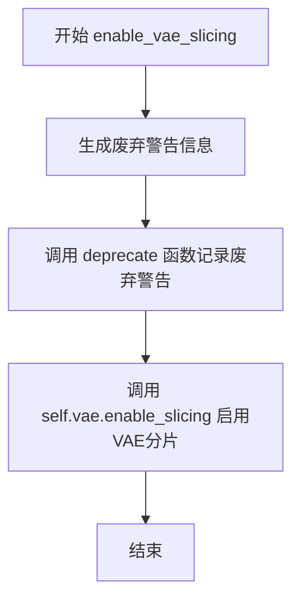
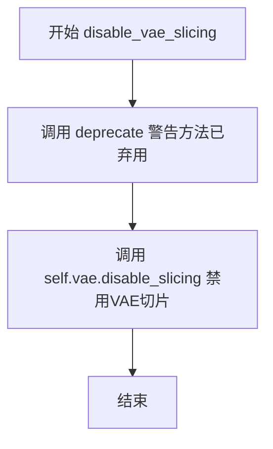
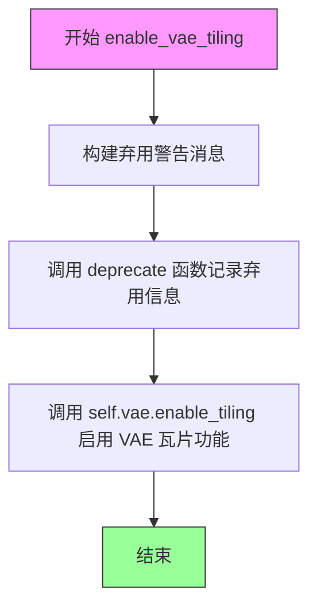
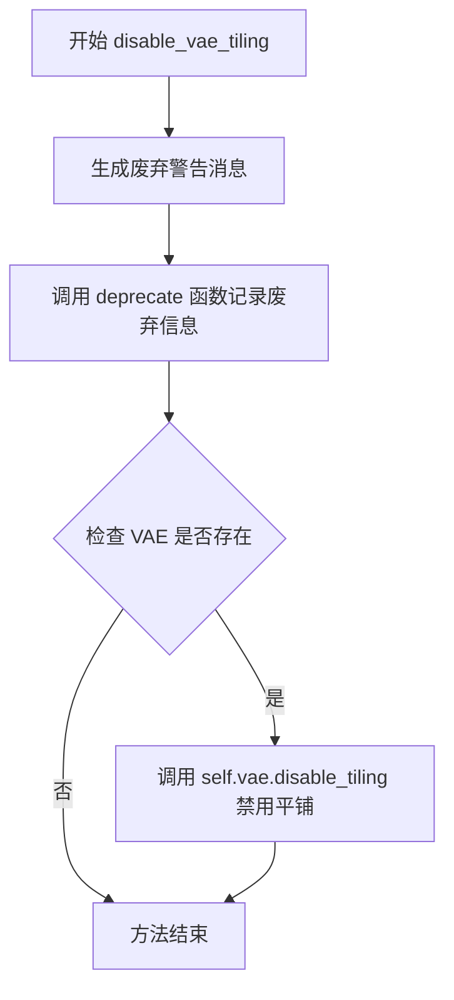
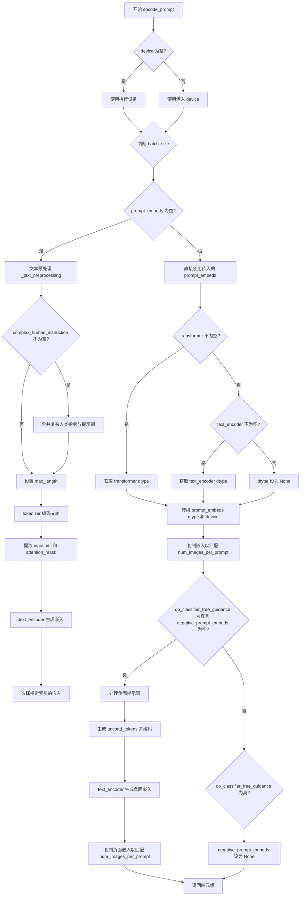
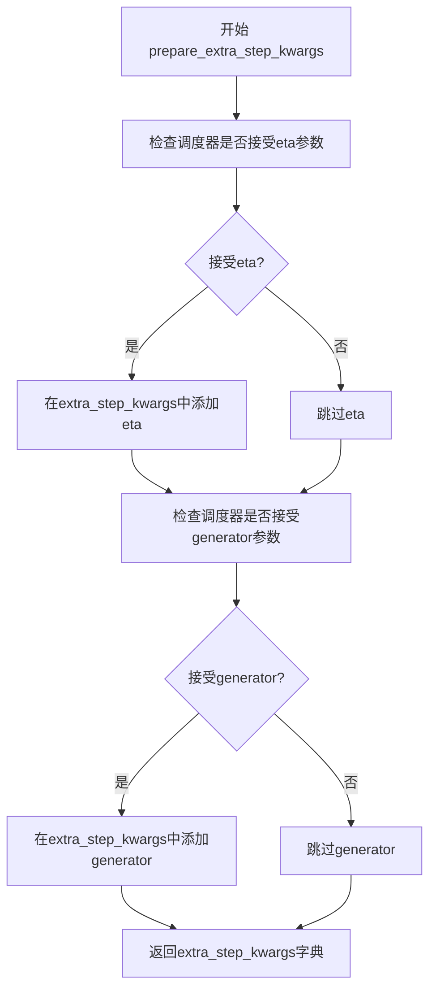
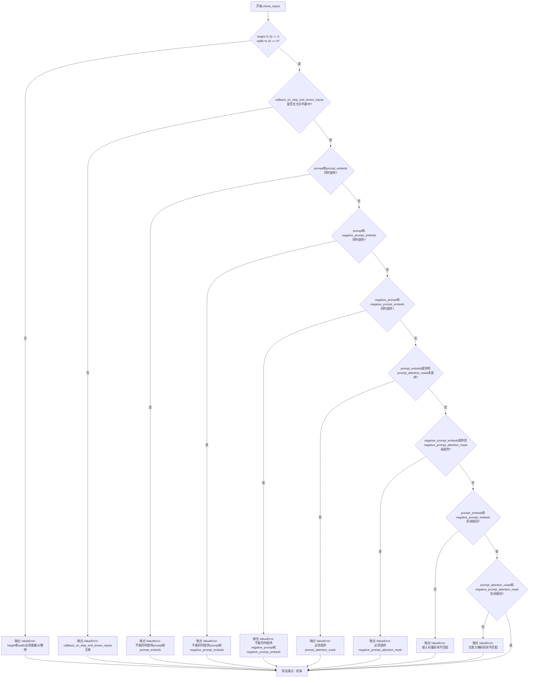
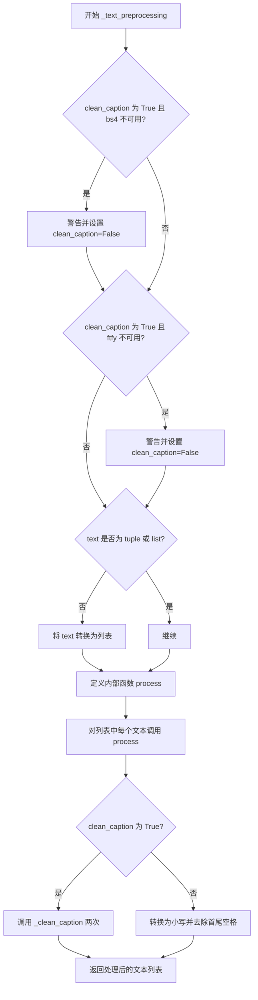
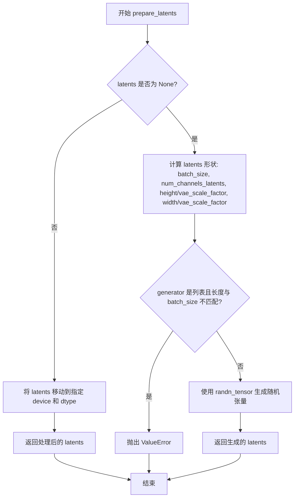

# `diffusers\src\diffusers\pipelines\pag\pipeline_pag_sana.py` 详细设计文档

SanaPAGPipeline是一个用于文本到图像生成的扩散管道，支持Perturbed Attention Guidance (PAG)技术。该管道基于Sana模型，通过对文本提示进行编码、噪声预测和去噪过程来生成图像。

## 整体流程

```mermaid
graph TD
    A[开始] --> B[检查输入参数]
B --> C[编码提示词 encode_prompt]
C --> D[准备时间步 retrieve_timesteps]
D --> E[准备潜在向量 prepare_latents]
E --> F{执行去噪循环}
F --> G[Transformer预测噪声]
G --> H{是否使用PAG?] --> I[应用PAG guidance]
H --> J{是否使用CFG?] --> K[应用CFG]
I --> L[Scheduler步骤计算]
J --> L
K --> L
L --> M{是否完成所有步]
M -- 否 --> F
M -- 是 --> N{output_type == latent?] --> O[VAE解码]
N -- 是 --> P[返回潜在向量]
O --> Q[后处理图像]
P --> R[结束]
Q --> R
```

## 类结构

```
DiffusionPipeline (基类)
├── PAGMixin (混合类)
└── SanaPAGPipeline
    ├── 模块: tokenizer, text_encoder, vae, transformer, scheduler
    └── 组件: PixArtImageProcessor
```

## 全局变量及字段


### `XLA_AVAILABLE`
    
Flag indicating whether PyTorch XLA is available for accelerated computation

类型：`bool`
    


### `logger`
    
Logger instance for recording runtime messages and debugging information

类型：`logging.Logger`
    


### `EXAMPLE_DOC_STRING`
    
Documentation string containing usage examples for the SanaPAGPipeline

类型：`str`
    


### `SanaPAGPipeline.bad_punct_regex`
    
Compiled regex pattern for identifying and filtering unwanted punctuation characters

类型：`re.Pattern`
    


### `SanaPAGPipeline.model_cpu_offload_seq`
    
Sequence string specifying the order for CPU offloading of model components

类型：`str`
    


### `SanaPAGPipeline._callback_tensor_inputs`
    
List of tensor input names that can be passed to step callbacks during inference

类型：`list[str]`
    


### `SanaPAGPipeline.vae_scale_factor`
    
Scaling factor derived from VAE architecture for latent space dimension calculations

类型：`int`
    


### `SanaPAGPipeline.image_processor`
    
Image processor for handling preprocessing, postprocessing and resolution binning of images

类型：`PixArtImageProcessor`
    
    

## 全局函数及方法


### `retrieve_timesteps`

这是一个全局工具函数，用于调用调度器（scheduler）的`set_timesteps`方法并从中获取时间步（timesteps）。它支持自定义时间步和自定义sigmas，并返回调度器的时间步序列以及实际的推理步数。

参数：

- `scheduler`：`SchedulerMixin`，调度器对象，用于获取时间步
- `num_inference_steps`：`int | None`，生成样本时使用的扩散步数，如果使用则`timesteps`必须为`None`
- `device`：`str | torch.device | None`，时间步要移动到的设备，如果为`None`则不移动
- `timesteps`：`list[int] | None`，用于覆盖调度器时间步间隔策略的自定义时间步
- `sigmas`：`list[float] | None`，用于覆盖调度器时间步间隔策略的自定义sigmas
- `**kwargs`：任意关键字参数，将传递给`scheduler.set_timesteps`

返回值：`tuple[torch.Tensor, int]`，元组包含调度器的时间步序列和推理步数

#### 流程图

```mermaid
flowchart TD
    A[开始] --> B{检查timesteps和sigmas是否同时存在}
    B -->|是| C[抛出ValueError: 只能指定timesteps或sigmas之一]
    B -->|否| D{检查timesteps是否不为None}
    D -->|是| E{检查scheduler.set_timesteps是否接受timesteps参数}
    E -->|否| F[抛出ValueError: 当前调度器不支持自定义timesteps]
    E -->|是| G[调用scheduler.set_timesteps设置timesteps]
    G --> H[获取scheduler.timesteps]
    H --> I[计算num_inference_steps = len(timesteps)]
    D -->|否| J{检查sigmas是否不为None}
    J -->|是| K{检查scheduler.set_timesteps是否接受sigmas参数}
    K -->|否| L[抛出ValueError: 当前调度器不支持自定义sigmas]
    K -->|是| M[调用scheduler.set_timesteps设置sigmas]
    M --> N[获取scheduler.timesteps]
    N --> O[计算num_inference_steps = len(timesteps)]
    J -->|否| P[调用scheduler.set_timesteps使用num_inference_steps]
    P --> Q[获取scheduler.timesteps]
    Q --> R[返回timesteps和num_inference_steps元组]
    I --> R
    O --> R
```

#### 带注释源码

```python
# Copied from diffusers.pipelines.stable_diffusion.pipeline_stable_diffusion.retrieve_timesteps
def retrieve_timesteps(
    scheduler,
    num_inference_steps: int | None = None,
    device: str | torch.device | None = None,
    timesteps: list[int] | None = None,
    sigmas: list[float] | None = None,
    **kwargs,
):
    r"""
    Calls the scheduler's `set_timesteps` method and retrieves timesteps from the scheduler after the call. Handles
    custom timesteps. Any kwargs will be supplied to `scheduler.set_timesteps`.

    Args:
        scheduler (`SchedulerMixin`):
            The scheduler to get timesteps from.
        num_inference_steps (`int`):
            The number of diffusion steps used when generating samples with a pre-trained model. If used, `timesteps`
            must be `None`.
        device (`str` or `torch.device`, *optional*):
            The device to which the timesteps should be moved to. If `None`, the timesteps are not moved.
        timesteps (`list[int]`, *optional*):
            Custom timesteps used to override the timestep spacing strategy of the scheduler. If `timesteps` is passed,
            `num_inference_steps` and `sigmas` must be `None`.
        sigmas (`list[float]`, *optional*):
            Custom sigmas used to override the timestep spacing strategy of the scheduler. If `sigmas` is passed,
            `num_inference_steps` and `timesteps` must be `None`.

    Returns:
        `tuple[torch.Tensor, int]`: A tuple where the first element is the timestep schedule from the scheduler and the
        second element is the number of inference steps.
    """
    # 检查不能同时指定timesteps和sigmas
    if timesteps is not None and sigmas is not None:
        raise ValueError("Only one of `timesteps` or `sigmas` can be passed. Please choose one to set custom values")
    
    # 处理自定义timesteps
    if timesteps is not None:
        # 检查调度器是否支持timesteps参数
        accepts_timesteps = "timesteps" in set(inspect.signature(scheduler.set_timesteps).parameters.keys())
        if not accepts_timesteps:
            raise ValueError(
                f"The current scheduler class {scheduler.__class__}'s `set_timesteps` does not support custom"
                f" timestep schedules. Please check whether you are using the correct scheduler."
            )
        # 调用调度器的set_timesteps方法
        scheduler.set_timesteps(timesteps=timesteps, device=device, **kwargs)
        # 从调度器获取timesteps
        timesteps = scheduler.timesteps
        # 计算推理步数
        num_inference_steps = len(timesteps)
    # 处理自定义sigmas
    elif sigmas is not None:
        # 检查调度器是否支持sigmas参数
        accept_sigmas = "sigmas" in set(inspect.signature(scheduler.set_timesteps).parameters.keys())
        if not accept_sigmas:
            raise ValueError(
                f"The current scheduler class {scheduler.__class__}'s `set_timesteps` does not support custom"
                f" sigmas schedules. Please check whether you are using the correct scheduler."
            )
        # 调用调度器的set_timesteps方法
        scheduler.set_timesteps(sigmas=sigmas, device=device, **kwargs)
        # 从调度器获取timesteps
        timesteps = scheduler.timesteps
        # 计算推理步数
        num_inference_steps = len(timesteps)
    # 默认行为：使用num_inference_steps
    else:
        scheduler.set_timesteps(num_inference_steps, device=device, **kwargs)
        timesteps = scheduler.timesteps
    
    # 返回timesteps和num_inference_steps
    return timesteps, num_inference_steps
```


### `SanaPAGPipeline.__init__`

该方法是 SanaPAGPipeline 类的构造函数，负责初始化文本到图像生成管道。它接收分词器、文本编码器、VAE、变换器和调度器等核心组件，完成模块注册、VAE 缩放因子计算、图像处理器初始化以及 PAG（Perturbed Attention Guidance）应用层的设置。

参数：

- `self`：类的实例对象，自动传入
- `tokenizer`：`GemmaTokenizer | GemmaTokenizerFast`，Gemma 分词器，用于将文本 prompt 转换为 token 序列
- `text_encoder`：`Gemma2PreTrainedModel`，预训练的 Gemma2 文本编码器，用于将 token 序列编码为文本嵌入
- `vae`：`AutoencoderDC`，变分自编码器（VAE），负责将潜在表示解码为图像
- `transformer`：`SanaTransformer2DModel`，Sana 主干变换器模型，负责去噪预测
- `scheduler`：`FlowMatchEulerDiscreteScheduler`，调度器，用于控制扩散过程的噪声调度
- `pag_applied_layers`：`str | list[str]`，默认为 `"transformer_blocks.0"`，PAG 应用的目标层名称或层名称列表

返回值：无（`None`），构造函数不返回值，仅完成对象初始化

#### 流程图

```mermaid
flowchart TD
    A[开始 __init__] --> B[调用父类 __init__]
    B --> C[register_modules: 注册 tokenizer, text_encoder, vae, transformer, scheduler]
    C --> D{self.vae 存在且非空?}
    D -->|是| E[计算 vae_scale_factor: 2^(len(vae.config.encoder_block_out_channels) - 1)]
    D -->|否| F[vae_scale_factor = 8]
    E --> G[创建 PixArtImageProcessor 实例]
    F --> G
    G --> H[调用 set_pag_applied_layers 设置 PAG 应用层]
    H --> I[结束 __init__]
    
    style A fill:#f9f,color:#000
    style I fill:#9f9,color:#000
```

#### 带注释源码

```python
def __init__(
    self,
    tokenizer: GemmaTokenizer | GemmaTokenizerFast,
    text_encoder: Gemma2PreTrainedModel,
    vae: AutoencoderDC,
    transformer: SanaTransformer2DModel,
    scheduler: FlowMatchEulerDiscreteScheduler,
    pag_applied_layers: str | list[str] = "transformer_blocks.0",
):
    """
    初始化 SanaPAGPipeline 管道实例。

    参数:
        tokenizer: Gemma 分词器，用于文本预处理
        text_encoder: Gemma2 预训练文本编码器
        vae: 变分自编码器，用于图像解码
        transformer: Sana 变换器模型
        scheduler: FlowMatch 调度器
        pag_applied_layers: PAG 应用的目标层，默认为第一层变换器块
    """
    # 调用父类 DiffusionPipeline 的初始化方法
    # 父类负责基础管道功能的初始化
    super().__init__()

    # 使用 register_modules 方法注册所有核心组件
    # 这些组件将通过管道属性暴露，可通过 pipe.component_name 访问
    self.register_modules(
        tokenizer=tokenizer, 
        text_encoder=text_encoder, 
        vae=vae, 
        transformer=transformer, 
        scheduler=scheduler
    )

    # 计算 VAE 缩放因子，用于潜在空间与像素空间的转换
    # VAE 通常将图像压缩到 1/8、1/16 或 1/32 的分辨率
    # 公式: 2^(encoder_block_out_channels 数量 - 1)
    self.vae_scale_factor = (
        2 ** (len(self.vae.config.encoder_block_out_channels) - 1)
        if hasattr(self, "vae") and self.vae is not None
        else 8  # 默认缩放因子为 8（对应 1/8 压缩）
    )
    
    # 创建 PixArt 图像处理器
    # 负责图像的预处理（resize、normalize）和后处理（denormalize、convert）
    self.image_processor = PixArtImageProcessor(vae_scale_factor=self.vae_scale_factor)

    # 设置 PAG（Perturbed Attention Guidance）应用层
    # PAG 是一种改进的 CFG 技术，通过在特定层应用扰动注意力来提升图像质量
    # 传入 PAG 注意力处理器：CFG 版本和 Identity（无操作）版本
    self.set_pag_applied_layers(
        pag_applied_layers,
        pag_attn_processors=(
            PAGCFGSanaLinearAttnProcessor2_0(), 
            PAGIdentitySanaLinearAttnProcessor2_0()
        ),
    )
```


### `SanaPAGPipeline.enable_vae_slicing`

该方法用于启用 VAE 分片解码功能。当启用此选项时，VAE 会将输入张量分割成多个切片分步计算解码，从而节省内存并支持更大的批量大小。该方法目前已废弃，推荐直接使用 `pipe.vae.enable_slicing()`。

参数：该方法无参数（仅包含 `self`）

返回值：`None`，无返回值

#### 流程图



#### 带注释源码

```python
def enable_vae_slicing(self):
    r"""
    Enable sliced VAE decoding. When this option is enabled, the VAE will split the input tensor in slices to
    compute decoding in several steps. This is useful to save some memory and allow larger batch sizes.
    """
    # 构建废弃警告消息，包含被调用的类名
    depr_message = f"Calling `enable_vae_slicing()` on a `{self.__class__.__name__}` is deprecated and this method will be removed in a future version. Please use `pipe.vae.enable_slicing()`."
    # 调用 deprecate 函数记录废弃警告，版本号为 0.40.0
    deprecate(
        "enable_vae_slicing",
        "0.40.0",
        depr_message,
    )
    # 实际调用 VAE 模型的 enable_slicing 方法来启用分片解码功能
    self.vae.enable_slicing()
```


### `SanaPAGPipeline.disable_vae_slicing`

禁用 VAE 切片解码功能。如果之前启用了 `enable_vae_slicing`，此方法将使解码回到单步计算模式。该方法已被弃用，将在未来版本中移除，建议使用 `pipe.vae.disable_slicing()` 代替。

参数：

- 该方法无参数（仅包含 `self`）

返回值：`None`，无返回值

#### 流程图



#### 带注释源码

```python
def disable_vae_slicing(self):
    r"""
    Disable sliced VAE decoding. If `enable_vae_slicing` was previously enabled, this method will go back to
    computing decoding in one step.
    """
    # 构建弃用警告消息，提示用户使用新的 API
    depr_message = f"Calling `disable_vae_slicing()` on a `{self.__class__.__name__}` is deprecated and this method will be removed in a future version. Please use `pipe.vae.disable_slicing()`."
    
    # 调用 deprecate 函数记录弃用警告，在版本 0.40.0 后将移除
    deprecate(
        "disable_vae_slicing",      # 被弃用的方法名
        "0.40.0",                    # 计划移除的版本
        depr_message,                # 弃用说明信息
    )
    
    # 调用底层 VAE 对象的 disable_slicing 方法，实际执行禁用切片解码的功能
    self.vae.disable_slicing()
```


### `SanaPAGPipeline.enable_vae_tiling`

启用瓦片式 VAE 解码。当启用此选项时，VAE 会将输入张量分割成瓦片，以多个步骤计算解码和编码。这对于节省大量内存并处理更大的图像非常有用。

参数：

-  无（仅包含 `self` 隐式参数）

返回值：无（`None`），该方法直接操作 VAE 模块，不返回任何值

#### 流程图



#### 带注释源码

```python
def enable_vae_tiling(self):
    r"""
    Enable tiled VAE decoding. When this option is enabled, the VAE will split the input tensor into tiles to
    compute decoding and encoding in several steps. This is useful for saving a large amount of memory and to allow
    processing larger images.
    """
    # 构建弃用警告消息，提示用户该方法将在 0.40.0 版本被移除
    # 应使用 pipe.vae.enable_tiling() 代替
    depr_message = f"Calling `enable_vae_tiling()` on a `{self.__class__.__name__}` is deprecated and this method will be removed in a future version. Please use `pipe.vae.enable_tiling()`."
    
    # 调用 deprecate 函数记录弃用信息，触发警告
    deprecate(
        "enable_vae_tiling",      # 要弃用的功能名称
        "0.40.0",                  # 弃用版本号
        depr_message,             # 弃用消息
    )
    
    # 委托给 VAE 模型的 enable_tiling 方法来启用瓦片式解码/编码
    self.vae.enable_tiling()
```


### `SanaPAGPipeline.disable_vae_tiling`

该方法用于禁用VAE（变分自编码器）的平铺解码模式，使解码过程恢复为单步执行。如果之前启用了VAE平铺，该方法将把解码方式改回一次性完成整个图像的解码。

参数：无需参数

返回值：无返回值（`None`），通过调用 `self.vae.disable_tiling()` 间接完成禁用平铺的功能

#### 流程图



#### 带注释源码

```python
def disable_vae_tiling(self):
    r"""
    Disable tiled VAE decoding. If `enable_vae_tiling` was previously enabled, this method will go back to
    computing decoding in one step.
    """
    # 构建废弃警告消息，提示用户该方法将在未来版本中移除
    # 并建议使用 pipe.vae.disable_tiling() 代替
    depr_message = f"Calling `disable_vae_tiling()` on a `{self.__class__.__name__}` is deprecated and this method will be removed in a future version. Please use `pipe.vae.disable_tiling()`."
    
    # 调用 deprecate 函数记录废弃信息
    # 参数：方法名、废弃版本号、警告消息
    deprecate(
        "disable_vae_tiling",
        "0.40.0",
        depr_message,
    )
    
    # 实际执行禁用VAE平铺解码的操作
    # 调用VAE对象的disable_tiling方法
    self.vae.disable_tiling()
```


### `SanaPAGPipeline.encode_prompt`

该方法负责将文本提示（prompt）编码为文本编码器隐藏状态（text encoder hidden states），生成用于图像生成模型的文本嵌入向量。同时支持分类器自由引导（Classifier-Free Guidance），生成正向和负向提示词嵌入，并在有需要时对复杂人类指令进行预处理和合并。

参数：

- `prompt`：`str | list[str]`，要编码的文本提示，可以是单个字符串或字符串列表
- `do_classifier_free_guidance`：`bool`，是否启用分类器自由引导，默认为 `True`
- `negative_prompt`：`str`，不参与图像生成的负面提示词，默认为空字符串
- `num_images_per_prompt`：`int`，每个提示词要生成的图像数量，默认为 1
- `device`：`torch.device | None`，用于放置结果嵌入的张量设备，若为 `None` 则使用执行设备
- `prompt_embeds`：`torch.Tensor | None`，预生成的提示词嵌入，可用于调整文本输入，若不提供则从 `prompt` 生成
- `negative_prompt_embeds`：`torch.Tensor | None`，预生成的负面提示词嵌入，对于 Sana 应为空字符串 "" 的嵌入
- `prompt_attention_mask`：`torch.Tensor | None`，提示词的注意力掩码
- `negative_prompt_attention_mask`：`torch.Tensor | None`，负面提示词的注意力掩码
- `clean_caption`：`bool`，是否在编码前预处理和清理标题，默认为 `False`
- `max_sequence_length`：`int`，提示词使用的最大序列长度，默认为 300
- `complex_human_instruction`：`list[str] | None`，复杂人类指令列表，若不为空则使用该指令增强提示词

返回值：`tuple[torch.Tensor, torch.Tensor, torch.Tensor, torch.Tensor]`，返回四个元素的元组，分别是提示词嵌入（prompt_embeds）、提示词注意力掩码（prompt_attention_mask）、负面提示词嵌入（negative_prompt_embeds）和负面提示词注意力掩码（negative_prompt_attention_mask）

#### 流程图



#### 带注释源码

```python
def encode_prompt(
    self,
    prompt: str | list[str],
    do_classifier_free_guidance: bool = True,
    negative_prompt: str = "",
    num_images_per_prompt: int = 1,
    device: torch.device | None = None,
    prompt_embeds: torch.Tensor | None = None,
    negative_prompt_embeds: torch.Tensor | None = None,
    prompt_attention_mask: torch.Tensor | None = None,
    negative_prompt_attention_mask: torch.Tensor | None = None,
    clean_caption: bool = False,
    max_sequence_length: int = 300,
    complex_human_instruction: list[str] | None = None,
):
    r"""
    Encodes the prompt into text encoder hidden states.

    Args:
        prompt (`str` or `list[str]`, *optional*):
            prompt to be encoded
        negative_prompt (`str` or `list[str]`, *optional*):
            The prompt not to guide the image generation. If not defined, one has to pass `negative_prompt_embeds`
            instead. Ignored when not using guidance (i.e., ignored if `guidance_scale` is less than `1`). For
            PixArt-Alpha, this should be "".
        do_classifier_free_guidance (`bool`, *optional*, defaults to `True`):
            whether to use classifier free guidance or not
        num_images_per_prompt (`int`, *optional*, defaults to 1):
            number of images that should be generated per prompt
        device: (`torch.device`, *optional*):
            torch device to place the resulting embeddings on
        prompt_embeds (`torch.Tensor`, *optional*):
            Pre-generated text embeddings. Can be used to easily tweak text inputs, *e.g.* prompt weighting. If not
            provided, text embeddings will be generated from `prompt` input argument.
        negative_prompt_embeds (`torch.Tensor`, *optional*):
            Pre-generated negative text embeddings. For Sana, it's should be the embeddings of the "" string.
        clean_caption (`bool`, defaults to `False`):
            If `True`, the function will preprocess and clean the provided caption before encoding.
        max_sequence_length (`int`, defaults to 300): Maximum sequence length to use for the prompt.
        complex_human_instruction (`list[str]`, defaults to `complex_human_instruction`):
            If `complex_human_instruction` is not empty, the function will use the complex Human instruction for
            the prompt.
    """

    # 确定设备，如果未指定则使用执行设备
    if device is None:
        device = self._execution_device

    # 根据 prompt 类型确定 batch_size
    if prompt is not None and isinstance(prompt, str):
        batch_size = 1
    elif prompt is not None and isinstance(prompt, list):
        batch_size = len(prompt)
    else:
        batch_size = prompt_embeds.shape[0]

    # 设置 tokenizer 的 padding side 为右侧
    if getattr(self, "tokenizer", None) is not None:
        self.tokenizer.padding_side = "right"

    # 根据论文 Section 3.1，设置最大长度并选择索引
    max_length = max_sequence_length
    select_index = [0] + list(range(-max_length + 1, 0))

    # 如果未提供 prompt_embeds，则需要从 prompt 生成
    if prompt_embeds is None:
        # 文本预处理：清理 caption（可选）
        prompt = self._text_preprocessing(prompt, clean_caption=clean_caption)

        # 处理复杂人类指令
        if not complex_human_instruction:
            max_length_all = max_length
        else:
            # 将复杂指令与提示词合并
            chi_prompt = "\n".join(complex_human_instruction)
            prompt = [chi_prompt + p for p in prompt]
            # 计算复杂指令的 token 数量
            num_chi_prompt_tokens = len(self.tokenizer.encode(chi_prompt))
            max_length_all = num_chi_prompt_tokens + max_length - 2

        # 使用 tokenizer 编码文本
        text_inputs = self.tokenizer(
            prompt,
            padding="max_length",
            max_length=max_length_all,
            truncation=True,
            add_special_tokens=True,
            return_tensors="pt",
        )
        text_input_ids = text_inputs.input_ids

        # 获取注意力掩码并移动到设备
        prompt_attention_mask = text_inputs.attention_mask
        prompt_attention_mask = prompt_attention_mask.to(device)

        # 使用 text_encoder 生成嵌入
        prompt_embeds = self.text_encoder(text_input_ids.to(device), attention_mask=prompt_attention_mask)
        # 只保留选定的索引位置（去除 padding）
        prompt_embeds = prompt_embeds[0][:, select_index]
        prompt_attention_mask = prompt_attention_mask[:, select_index]

    # 确定数据类型（dtype）
    if self.transformer is not None:
        dtype = self.transformer.dtype
    elif self.text_encoder is not None:
        dtype = self.text_encoder.dtype
    else:
        dtype = None

    # 将 prompt_embeds 转换为指定 dtype 和 device
    prompt_embeds = prompt_embeds.to(dtype=dtype, device=device)

    # 获取嵌入的形状
    bs_embed, seq_len, _ = prompt_embeds.shape
    # 为每个提示词复制文本嵌入以生成多个图像（使用 mps 友好的方法）
    prompt_embeds = prompt_embeds.repeat(1, num_images_per_prompt, 1)
    prompt_embeds = prompt_embeds.view(bs_embed * num_images_per_prompt, seq_len, -1)
    prompt_attention_mask = prompt_attention_mask.view(bs_embed, -1)
    prompt_attention_mask = prompt_attention_mask.repeat(num_images_per_prompt, 1)

    # 获取分类器自由引导的无条件嵌入
    if do_classifier_free_guidance and negative_prompt_embeds is None:
        # 准备无条件 token
        uncond_tokens = [negative_prompt] * batch_size if isinstance(negative_prompt, str) else negative_prompt
        uncond_tokens = self._text_preprocessing(uncond_tokens, clean_caption=clean_caption)
        max_length = prompt_embeds.shape[1]
        # tokenizer 编码无条件输入
        uncond_input = self.tokenizer(
            uncond_tokens,
            padding="max_length",
            max_length=max_length,
            truncation=True,
            return_attention_mask=True,
            add_special_tokens=True,
            return_tensors="pt",
        )
        negative_prompt_attention_mask = uncond_input.attention_mask
        negative_prompt_attention_mask = negative_prompt_attention_mask.to(device)

        # 生成负面提示词嵌入
        negative_prompt_embeds = self.text_encoder(
            uncond_input.input_ids.to(device), attention_mask=negative_prompt_attention_mask
        )
        negative_prompt_embeds = negative_prompt_embeds[0]

    # 如果使用分类器自由引导
    if do_classifier_free_guidance:
        # 复制无条件嵌入以匹配每个提示词的生成数量
        seq_len = negative_prompt_embeds.shape[1]

        negative_prompt_embeds = negative_prompt_embeds.to(dtype=dtype, device=device)

        negative_prompt_embeds = negative_prompt_embeds.repeat(1, num_images_per_prompt, 1)
        negative_prompt_embeds = negative_prompt_embeds.view(batch_size * num_images_per_prompt, seq_len, -1)

        negative_prompt_attention_mask = negative_prompt_attention_mask.view(bs_embed, -1)
        negative_prompt_attention_mask = negative_prompt_attention_mask.repeat(num_images_per_prompt, 1)
    else:
        # 不使用引导时，负面提示词嵌入和掩码设为 None
        negative_prompt_embeds = None
        negative_prompt_attention_mask = None

    # 返回四个元素的元组
    return prompt_embeds, prompt_attention_mask, negative_prompt_embeds, negative_prompt_attention_mask
```


### `SanaPAGPipeline.prepare_extra_step_kwargs`

该方法用于准备调度器（scheduler）的额外参数。由于不同的调度器具有不同的签名，该方法通过检查调度器的`step`方法是否接受特定参数（`eta`和`generator`），动态构建需要传递给调度器的额外关键字参数字典。

参数：

- `self`：隐式参数，`SanaPAGPipeline`实例本身
- `generator`：`torch.Generator | list[torch.Generator] | None`，用于生成确定性随机数的生成器
- `eta`：`float`，DDIM调度器的η参数，仅在调度器支持时生效，应在[0,1]范围内

返回值：`dict`，包含调度器`step`方法所需额外参数（如`eta`和`generator`）的字典

#### 流程图



#### 带注释源码

```python
def prepare_extra_step_kwargs(self, generator, eta):
    """
    为调度器步骤准备额外的关键字参数，因为并非所有调度器都具有相同的签名。
    eta (η) 仅在与 DDIMScheduler 一起使用时会生效，其他调度器会忽略它。
    eta 对应 DDIM 论文中的 η：https://huggingface.co/papers/2010.02502
    取值应在 [0, 1] 范围内。
    """
    
    # 通过检查调度器step方法的签名参数，判断是否接受eta参数
    accepts_eta = "eta" in set(inspect.signature(self.scheduler.step).parameters.keys())
    
    # 初始化空字典用于存储额外参数
    extra_step_kwargs = {}
    
    # 如果调度器接受eta参数，则将其添加到extra_step_kwargs中
    if accepts_eta:
        extra_step_kwargs["eta"] = eta

    # 检查调度器是否接受generator参数
    accepts_generator = "generator" in set(inspect.signature(self.scheduler.step).parameters.keys())
    
    # 如果调度器接受generator参数，则将其添加到extra_step_kwargs中
    if accepts_generator:
        extra_step_kwargs["generator"] = generator
    
    # 返回构建好的额外参数字典，供调度器step方法使用
    return extra_step_kwargs
```


### `SanaPAGPipeline.check_inputs`

该方法用于验证文本到图像生成管道的输入参数有效性，确保用户提供的prompt、负向prompt、嵌入向量和注意力掩码等参数符合要求，并在参数不符合规范时抛出明确的错误信息。

参数：

- `prompt`：字符串或字符串列表，待验证的文本提示
- `height`：整数，生成图像的高度（像素）
- `width`：整数，生成图像的宽度（像素）
- `callback_on_step_end_tensor_inputs`：列表或None，可选的回调张量输入名称列表
- `negative_prompt`：字符串或字符串列表，负向提示词
- `prompt_embeds`：张量或None，预生成的文本嵌入向量
- `negative_prompt_embeds`：张量或None，预生成的负向文本嵌入向量
- `prompt_attention_mask`：张量或None，文本嵌入的注意力掩码
- `negative_prompt_attention_mask`：张量或None，负向文本嵌入的注意力掩码

返回值：无（`None`），该方法通过抛出`ValueError`异常来处理验证失败的情况

#### 流程图



#### 带注释源码

```python
def check_inputs(
    self,
    prompt,
    height,
    width,
    callback_on_step_end_tensor_inputs=None,
    negative_prompt=None,
    prompt_embeds=None,
    negative_prompt_embeds=None,
    prompt_attention_mask=None,
    negative_prompt_attention_mask=None,
):
    """
    验证输入参数的有效性，确保符合管道处理要求
    
    参数:
        prompt: 用户提供的文本提示，可为字符串或字符串列表
        height: 生成图像的高度像素值
        width: 生成图像的宽度像素值
        callback_on_step_end_tensor_inputs: 回调函数可访问的张量输入名称列表
        negative_prompt: 不希望出现在生成图像中的负向提示词
        prompt_embeds: 预先计算的文本嵌入向量
        negative_prompt_embeds: 预先计算的负向文本嵌入向量
        prompt_attention_mask: 文本嵌入的注意力掩码
        negative_prompt_attention_mask: 负向文本嵌入的注意力掩码
    
    抛出:
        ValueError: 当任何验证条件不满足时抛出详细错误信息
    """
    
    # 检查1: 验证图像尺寸必须是32的倍数（VAE的潜在空间下采样因子要求）
    if height % 32 != 0 or width % 32 != 0:
        raise ValueError(f"`height` and `width` have to be divisible by 32 but are {height} and {width}.")

    # 检查2: 验证回调张量输入必须在允许列表中
    # _callback_tensor_inputs类属性定义了管道允许传递到回调的张量名称
    if callback_on_step_end_tensor_inputs is not None and not all(
        k in self._callback_tensor_inputs for k in callback_on_step_end_tensor_inputs
    ):
        raise ValueError(
            f"`callback_on_step_end_tensor_inputs` has to be in {self._callback_tensor_inputs}, but found {[k for k in callback_on_step_end_tensor_inputs if k not in self._callback_tensor_inputs]}"
        )

    # 检查3: prompt和prompt_embeds不能同时提供（只能选择一种方式传递文本信息）
    if prompt is not None and prompt_embeds is not None:
        raise ValueError(
            f"Cannot forward both `prompt`: {prompt} and `prompt_embeds`: {prompt_embeds}. Please make sure to"
            " only forward one of the two."
        )
    # 检查4: prompt和prompt_embeds不能同时为空（至少需要提供一种）
    elif prompt is None and prompt_embeds is None:
        raise ValueError(
            "Provide either `prompt` or `prompt_embeds`. Cannot leave both `prompt` and `prompt_embeds` undefined."
        )
    # 检查5: prompt类型必须是字符串或字符串列表
    elif prompt is not None and (not isinstance(prompt, str) and not isinstance(prompt, list)):
        raise ValueError(f"`prompt` has to be of type `str` or `list` but is {type(prompt)}")

    # 检查6: prompt和negative_prompt_embeds不能同时提供
    if prompt is not None and negative_prompt_embeds is not None:
        raise ValueError(
            f"Cannot forward both `prompt`: {prompt} and `negative_prompt_embeds`:"
            f" {negative_prompt_embeds}. Please make sure to only forward one of the two."
        )

    # 检查7: negative_prompt和negative_prompt_embeds不能同时提供
    if negative_prompt is not None and negative_prompt_embeds is not None:
        raise ValueError(
            f"Cannot forward both `negative_prompt`: {negative_prompt} and `negative_prompt_embeds`:"
            f" {negative_prompt_embeds}. Please make sure to only forward one of the two."
        )

    # 检查8: 如果提供了prompt_embeds，必须同时提供对应的注意力掩码
    if prompt_embeds is not None and prompt_attention_mask is None:
        raise ValueError("Must provide `prompt_attention_mask` when specifying `prompt_embeds`.")

    # 检查9: 如果提供了negative_prompt_embeds，必须同时提供对应的注意力掩码
    if negative_prompt_embeds is not None and negative_prompt_attention_mask is None:
        raise ValueError("Must provide `negative_prompt_attention_mask` when specifying `negative_prompt_embeds`.")

    # 检查10: 当两者都提供时，prompt_embeds和negative_prompt_embeds形状必须一致
    if prompt_embeds is not None and negative_prompt_embeds is not None:
        if prompt_embeds.shape != negative_prompt_embeds.shape:
            raise ValueError(
                "`prompt_embeds` and `negative_prompt_embeds` must have the same shape when passed directly, but"
                f" got: `prompt_embeds` {prompt_embeds.shape} != `negative_prompt_embeds`"
                f" {negative_prompt_embeds.shape}."
            )
        # 检查11: 注意力掩码的形状也必须一致
        if prompt_attention_mask.shape != negative_prompt_attention_mask.shape:
            raise ValueError(
                "`prompt_attention_mask` and `negative_prompt_attention_mask` must have the same shape when passed directly, but"
                f" got: `prompt_attention_mask` {prompt_attention_mask.shape} != `negative_prompt_attention_mask`"
                f" {negative_prompt_attention_mask.shape}."
            )
```


### `SanaPAGPipeline._text_preprocessing`

该方法用于在将文本提示编码到文本编码器之前对其进行预处理，包括检查必要的依赖库（beautifulsoup4和ftfy），并将文本转换为小写或根据clean_caption标志进行深度清洗。

参数：

-  `text`：`str | list[str]`，要预处理的原始文本，可以是单个字符串或字符串列表
-  `clean_caption`：`bool`，是否对标题进行深度清洗，默认为False

返回值：`list[str]`，处理后的文本列表

#### 流程图



#### 带注释源码

```
def _text_preprocessing(self, text, clean_caption=False):
    # 如果需要清洗标题但缺少 bs4 库，发出警告并禁用清洗功能
    if clean_caption and not is_bs4_available():
        logger.warning(BACKENDS_MAPPING["bs4"][-1].format("Setting `clean_caption=True`"))
        logger.warning("Setting `clean_caption` to False...")
        clean_caption = False

    # 如果需要清洗标题但缺少 ftfy 库，发出警告并禁用清洗功能
    if clean_caption and not is_ftfy_available():
        logger.warning(BACKENDS_MAPPING["ftfy"][-1].format("Setting `clean_caption=True`"))
        logger.warning("Setting `clean_caption` to False...")
        clean_caption = False

    # 确保输入为列表格式，便于统一处理
    if not isinstance(text, (tuple, list)):
        text = [text]

    # 定义内部处理函数，对单个文本进行清洗或简单预处理
    def process(text: str):
        if clean_caption:
            # 调用深度清洗方法两次以确保效果
            text = self._clean_caption(text)
            text = self._clean_caption(text)
        else:
            # 仅进行小写转换和去除首尾空格
            text = text.lower().strip()
        return text

    # 对列表中每个文本元素应用处理函数
    return [process(t) for t in text]
```


### `SanaPAGPipeline._clean_caption`

该方法用于对文本提示（caption）进行深度清洗和规范化处理，移除URL、HTML标签、特殊字符、CJK字符、商业广告文本等干扰内容，并将文本转换为适合图像生成模型输入的标准格式。

参数：

- `self`：`SanaPAGPipeline` 实例本身，隐式参数
- `caption`：任意类型，输入的文本提示内容

返回值：`str`，返回清洗和规范化后的文本字符串

#### 流程图

```mermaid
flowchart TD
    A[开始: 接收caption] --> B[转换为字符串]
    B --> C[URL解码 unquote_plus]
    C --> D[转小写并去除首尾空白]
    D --> E[替换<person>为person]
    E --> F1[正则匹配移除HTTP/HTTPS URLs]
    F1 --> F2[正则匹配移除www开头的URLs]
    F2 --> F3[BeautifulSoup解析移除HTML标签]
    F3 --> F4[正则匹配移除@昵称]
    F4 --> F5[正则移除CJK字符范围]
    F5 --> F6[统一各类破折号为标准横线]
    F6 --> F7[统一引号为双引号]
    F7 --> F8[移除&quot和&amp等HTML实体]
    F8 --> F9[移除IP地址]
    F9 --> F10[移除文章ID和\n转义符]
    F10 --> F11[移除#数字标签和长数字串]
    F11 --> F12[移除常见文件扩展名]
    F12 --> F13[合并连续引号和点号]
    F13 --> F14[使用bad_punct_regex移除特殊标点]
    F14 --> F15[处理下划线/连字符过多的词]
    F15 --> F16[ftfy修复文本编码]
    F16 --> F17[双重html.unescape反转义]
    F17 --> F18[移除字母数字混合短码]
    F18 --> F19[移除商业广告词]
    F19 --> F20[移除尺寸规格如1920x1080]
    F20 --> F21[清理多余空白和标点]
    F21 --> F22[去除首尾特殊字符]
    A22[结束: 返回strip后的文本]
    F22 --> A22
```

#### 带注释源码

```python
def _clean_caption(self, caption):
    """
    清洗并规范化输入的文本提示（caption），移除干扰内容并标准化格式
    
    处理内容包括：
    - URL链接（http/https/www开头）
    - HTML标签和实体
    - @提及
    - CJK统一汉字、日文等Unicode字符
    - 各类破折号/连字符统一化
    - 引号规范化
    - IP地址
    - 数字标签（#123）
    - 文件名和扩展名
    - 商业广告词（free shipping等）
    - 混合字母数字短码
    - 尺寸规格（如1920x1080）
    - 多余空白和特殊字符
    """
    caption = str(caption)                                    # 转换为字符串
    caption = ul.unquote_plus(caption)                         # URL解码，处理%20等编码
    caption = caption.strip().lower()                          # 转小写并去除首尾空白
    
    # 替换特殊标签
    caption = re.sub("<person>", "person", caption)            # 统一person标签
    
    # ===== URL移除 =====
    # 移除 http/https 开头的URL
    caption = re.sub(
        r"\b((?:https?:(?:\/{1,3}|[a-zA-Z0-9%])|[a-zA-Z0-9.\-]+[.](?:com|co|ru|net|org|edu|gov|it)[\w/-]*\b\/?(?!@)))",  # noqa
        "",
        caption,
    )
    # 移除 www 开头的URL
    caption = re.sub(
        r"\b((?:www:(?:\/{1,3}|[a-zA-Z0-9%])|[a-zA-Z0-9.\-]+[.](?:com|co|ru|net|org|edu|gov|it)[\w/-]*\b\/?(?!@)))",  # noqa
        "",
        caption,
    )
    
    # ===== HTML处理 =====
    # 使用BeautifulSoup解析并提取纯文本，移除HTML标签
    caption = BeautifulSoup(caption, features="html.parser").text
    
    # ===== @提及移除 =====
    caption = re.sub(r"@[\w\d]+\b", "", caption)               # 移除@昵称
    
    # ===== CJK字符移除 =====
    # 31C0—31EF CJK Strokes
    caption = re.sub(r"[\u31c0-\u31ef]+", "", caption)
    # 31F0—31FF Katakana Phonetic Extensions
    caption = re.sub(r"[\u31f0-\u31ff]+", "", caption)
    # 3200—32FF Enclosed CJK Letters and Months
    caption = re.sub(r"[\u3200-\u32ff]+", "", caption)
    # 3300—33FF CJK Compatibility
    caption = re.sub(r"[\u3300-\u33ff]+", "", caption)
    # 3400—4DBF CJK Unified Ideographs Extension A
    caption = re.sub(r"[\u3400-\u4dbf]+", "", caption)
    # 4DC0—4DFF Yijing Hexagram Symbols
    caption = re.sub(r"[\u4dc0-\u4dff]+", "", caption)
    # 4E00—9FFF CJK Unified Ideographs
    caption = re.sub(r"[\u4e00-\u9fff]+", "", caption)
    
    # ===== 破折号统一化 =====
    # 将各类Unicode破折号统一转换为标准横线
    caption = re.sub(
        r"[\u002D\u058A\u05BE\u1400\u1806\u2010-\u2015\u2E17\u2E1A\u2E3A\u2E3B\u2E40\u301C\u3030\u30A0\uFE31\uFE32\uFE58\uFE63\uFF0D]+",  # noqa
        "-",
        caption,
    )
    
    # ===== 引号规范化 =====
    caption = re.sub(r"[`´«»""¨]", '"', caption)              # 统一为双引号
    caption = re.sub(r"['']", "'", caption)                   # 统一为单引号
    
    # ===== HTML实体移除 =====
    caption = re.sub(r"&quot;?", "", caption)                  # 移除 &quot;
    caption = re.sub(r"&amp", "", caption)                     # 移除 &amp
    
    # ===== IP地址移除 =====
    caption = re.sub(r"\d{1,3}\.\d{1,3}\.\d{1,3}\.\d{1,3}", " ", caption)
    
    # ===== 文章ID移除 =====
    caption = re.sub(r"\d:\d\d\s+$", "", caption)              # 移除末尾的文章ID
    
    # ===== 转义换行符处理 =====
    caption = re.sub(r"\\n", " ", caption)                    # 将\n转义符替换为空格
    
    # ===== 数字标签移除 =====
    caption = re.sub(r"#\d{1,3}\b", "", caption)              # 移除 #123
    caption = re.sub(r"#\d{5,}\b", "", caption)               # 移除 #12345...
    caption = re.sub(r"\b\d{6,}\b", "", caption)              # 移除长数字串
    
    # ===== 文件名移除 =====
    caption = re.sub(r"[\S]+\.(?:png|jpg|jpeg|bmp|webp|eps|pdf|apk|mp4)", "", caption)
    
    # ===== 重复标点合并 =====
    caption = re.sub(r"[\"']{2,}", r'"', caption)              # 合并连续引号
    caption = re.sub(r"[\.]{2,}", r" ", caption)              # 合并连续点号
    
    # ===== 特殊标点移除 =====
    caption = re.sub(self.bad_punct_regex, r" ", caption)    # 使用类级正则移除特殊标点
    caption = re.sub(r"\s+\.\s+", r" ", caption)              # 移除 " . " 模式
    
    # ===== 过多连字符/下划线处理 =====
    # 如果一个词包含超过3个-或_，则将其拆分为独立单词
    regex2 = re.compile(r"(?:\-|\_)")
    if len(re.findall(regex2, caption)) > 3:
        caption = re.sub(regex2, " ", caption)
    
    # ===== ftfy修复文本编码 =====
    caption = ftfy.fix_text(caption)                          # 修复损坏的UTF-8编码
    
    # ===== HTML反转义 =====
    caption = html.unescape(html.unescape(caption))           # 双重反转义处理嵌套实体
    
    # ===== 字母数字混合码移除 =====
    caption = re.sub(r"\b[a-zA-Z]{1,3}\d{3,15}\b", "", caption)   # 如 jc6640
    caption = re.sub(r"\b[a-zA-Z]+\d+[a-zA-Z]+\b", "", caption)   # 如 jc6640vc
    caption = re.sub(r"\b\d+[a-zA-Z]+\d+\b", "", caption)         # 如 6640vc231
    
    # ===== 商业广告词移除 =====
    caption = re.sub(r"(worldwide\s+)?(free\s+)?shipping", "", caption)
    caption = re.sub(r"(free\s)?download(\sfree)?", "", caption)
    caption = re.sub(r"\bclick\b\s(?:for|on)\s\w+", "", caption)
    caption = re.sub(r"\b(?:png|jpg|jpeg|bmp|webp|eps|pdf|apk|mp4)(\simage[s]?)?", "", caption)
    caption = re.sub(r"\bpage\s+\d+\b", "", caption)
    
    # ===== 复杂字母数字组合移除 =====
    caption = re.sub(r"\b\d*[a-zA-Z]+\d+[a-zA-Z]+\d+[a-zA-Z\d]*\b", r" ", caption)  # 如 j2d1a2a...
    
    # ===== 尺寸规格移除 =====
    caption = re.sub(r"\b\d+\.?\d*[xх×]\d+\.?\d*\b", "", caption)  # 支持x、X、×
    
    # ===== 空白和标点清理 =====
    caption = re.sub(r"\b\s+\:\s+", r": ", caption)           # 规范化冒号周围空白
    caption = re.sub(r"(\D[,\./])\b", r"\1 ", caption)        # 在标点后添加空格
    caption = re.sub(r"\s+", " ", caption)                    # 合并多个空格
    
    caption.strip()                                           # 去除首尾空白（结果未使用）
    
    # ===== 首尾特殊字符清理 =====
    caption = re.sub(r"^[\"\']([\w\W]+)[\"\']$", r"\1", caption)  # 去除首尾引号
    caption = re.sub(r"^[\'\_,\-\:;]", r"", caption)               # 去除开头特殊字符
    caption = re.sub(r"[\'\_,\-\:\-\+]$", r"", caption)            # 去除末尾特殊字符
    caption = re.sub(r"^\.\S+$", "", caption)                      # 去除以.开头的非空格串
    
    return caption.strip()                                     # 返回最终清洗后的文本
```


### `SanaPAGPipeline.prepare_latents`

该方法用于为图像生成准备潜在向量（latents）。如果提供了预生成的潜在向量，则将其移动到指定设备并转换为指定数据类型；否则，根据批大小、通道数、图像高度和宽度（经VAE缩放因子调整后）生成随机潜在向量。

参数：

- `self`：`SanaPAGPipeline`，管道实例本身
- `batch_size`：`int`，批处理的样本数量
- `num_channels_latents`：`int`，潜在空间的通道数
- `height`：`int`，生成图像的高度（像素）
- `width`：`int`，生成图像的宽度（像素）
- `dtype`：`torch.dtype`，张量的数据类型
- `device`：`torch.device`，张量放置的设备
- `generator`：`torch.Generator | list[torch.Generator] | None`，用于生成确定性随机数的生成器
- `latents`：`torch.Tensor | None`，可选的预生成潜在向量

返回值：`torch.Tensor`，处理后的潜在向量张量

#### 流程图



#### 带注释源码

```python
# Copied from diffusers.pipelines.sana.pipeline_sana.SanaPipeline.prepare_latents
def prepare_latents(
    self,
    batch_size: int,
    num_channels_latents: int,
    height: int,
    width: int,
    dtype: torch.dtype,
    device: torch.device,
    generator: torch.Generator | list[torch.Generator] | None,
    latents: torch.Tensor | None = None
) -> torch.Tensor:
    """
    为图像生成准备潜在向量（latents）。

    如果提供了预生成的潜在向量，则直接将其移动到指定设备并转换为指定数据类型。
    否则，根据批大小、通道数、图像尺寸（经VAE缩放因子调整后）生成随机潜在向量。

    Args:
        batch_size: 批处理的样本数量
        num_channels_latents: 潜在空间的通道数
        height: 生成图像的高度
        width: 生成图像的宽度
        dtype: 张量的数据类型
        device: 张量放置的设备
        generator: 用于生成确定性随机数的生成器
        latents: 可选的预生成潜在向量

    Returns:
        处理后的潜在向量张量
    """
    # 如果已提供 latents，直接移动到目标设备并转换数据类型后返回
    if latents is not None:
        return latents.to(device=device, dtype=dtype)

    # 计算潜在向量的形状
    # 需要考虑 VAE 缩放因子，将图像尺寸从像素空间降采样到潜在空间
    shape = (
        batch_size,
        num_channels_latents,
        int(height) // self.vae_scale_factor,
        int(width) // self.vae_scale_factor,
    )

    # 检查 generator 列表长度是否与 batch_size 匹配
    if isinstance(generator, list) and len(generator) != batch_size:
        raise ValueError(
            f"You have passed a list of generators of length {len(generator)}, but requested an effective batch"
            f" size of {batch_size}. Make sure the batch size matches the length of the generators."
        )

    # 使用 randn_tensor 生成符合标准正态分布的随机潜在向量
    latents = randn_tensor(shape, generator=generator, device=device, dtype=dtype)
    return latents
```


### `SanaPAGPipeline.__call__`

该方法是 SanaPAGPipeline 的核心调用函数，用于通过 Sana 模型和 Perturbed Attention Guidance (PAG) 技术实现文本到图像的生成。它接受文本提示、负向提示、推理步数、引导尺度等参数，执行编码、潜在向量准备、去噪循环、VAE 解码等步骤，最终返回生成的图像。

参数：

- `prompt`：`str | list[str]`，要引导图像生成的提示词，如果未定义则必须传递 `prompt_embeds`
- `negative_prompt`：`str`，不引导图像生成的提示词，当 `guidance_scale < 1` 时忽略
- `num_inference_steps`：`int`，去噪步数，默认为 20
- `timesteps`：`list[int]`，自定义时间步，用于支持 timesteps 的调度器
- `sigmas`：`list[float]`，自定义 sigmas，用于支持 sigmas 的调度器
- `guidance_scale`：`float`，分类器自由扩散引导（CFG）的引导尺度，默认为 4.5
- `num_images_per_prompt`：`int | None`，每个提示词生成的图像数量，默认为 1
- `height`：`int`，生成图像的高度（像素），默认为 1024
- `width`：`int`，生成图像的宽度（像素），默认为 1024
- `eta`：`float`，DDIM 论文中的 eta 参数，仅适用于 DDIMScheduler
- `generator`：`torch.Generator | list[torch.Generator] | None`，随机生成器，用于确保生成的可确定性
- `latents`：`torch.Tensor | None`，预生成的噪声潜在向量
- `prompt_embeds`：`torch.Tensor | None`，预生成的文本嵌入
- `prompt_attention_mask`：`torch.Tensor | None`，文本嵌入的预生成注意力掩码
- `negative_prompt_embeds`：`torch.Tensor | None`，负向提示的预生成文本嵌入
- `negative_prompt_attention_mask`：`torch.Tensor | None`，负向提示文本嵌入的注意力掩码
- `output_type`：`str | None`，输出格式，可选 "pil" 或 "latent"，默认为 "pil"
- `return_dict`：`bool`，是否返回 ImagePipelineOutput，默认为 True
- `clean_caption`：`bool`，是否在创建嵌入前清洗提示词
- `use_resolution_binning`：`bool`，是否使用分辨率分箱，默认为 True
- `callback_on_step_end`：`Callable[[int, int], None] | None`，每个去噪步骤结束时调用的函数
- `callback_on_step_end_tensor_inputs`：`list[str]`，传递给回调的张量输入列表
- `max_sequence_length`：`int`，提示词的最大序列长度，默认为 300
- `complex_human_instruction`：`list[str]`，复杂人类指令列表
- `pag_scale`：`float`，PAG 引导的缩放因子，默认为 3.0
- `pag_adaptive_scale`：`float`，PAG 的自适应缩放因子，默认为 0.0

返回值：`ImagePipelineOutput | tuple`，生成的图像列表或元组

#### 流程图

```mermaid
flowchart TD
    A[开始 __call__] --> B{callback_on_step_end 是 PipelineCallback?}
    B -->|Yes| C[获取 tensor_inputs]
    B -->|No| D[跳过]
    C --> D
    D --> E{use_resolution_binning?}
    E -->|Yes| F[根据 transformer.config.sample_size 选择 aspect_ratio_bin]
    E -->|No| G[跳过]
    F --> H[classify_height_width_bin 获取调整后的 height, width]
    G --> I[check_inputs 验证输入参数]
    H --> I
    I --> J[设置 _pag_scale, _pag_adaptive_scale, _guidance_scale, _interrupt]
    J --> K[确定 batch_size]
    K --> L[encode_prompt 编码输入提示]
    L --> M{do_perturbed_attention_guidance?}
    M -->|Yes| N[prepare_perturbed_attention_guidance 处理提示嵌入]
    M -->|No| O{do_classifier_free_guidance?}
    N --> P
    O -->|Yes| Q[concat 正负提示嵌入]
    O -->|No| P
    Q --> P
    P --> R[retrieve_timesteps 获取时间步]
    R --> S[prepare_latents 准备潜在向量]
    S --> T{do_perturbed_attention_guidance?}
    T -->|Yes| U[设置 PAG 注意力处理器]
    T -->|No| V[prepare_extra_step_kwargs]
    U --> V
    V --> W[初始化进度条和 _num_timesteps]
    W --> X[进入去噪循环 for i, t in enumerate timesteps]
    X --> Y{interrupt?}
    Y -->|Yes| Z[continue]
    Y -->|No| AA[expand latents 到 batch 维度]
    AA --> AB[expand timestep]
    AB --> AC[transformer 预测噪声]
    AD --> AE{do_perturbed_attention_guidance?}
    AD --> AF{do_classifier_free_guidance?}
    AE -->|Yes| AG[apply_perturbed_attention_guidance]
    AE -->|No| AH[chunk 并计算 CFG]
    AG --> AJ
    AF -->|Yes| AI[noise_pred = uncond + scale * (text - uncond)]
    AF -->|No| AJ
    AI --> AJ
    AH --> AJ[latents = scheduler.step]
    AJ --> AK{callback_on_step_end?}
    AK -->|Yes| AL[调用回调处理 latents 和 prompt_embeds]
    AK -->|No| AM{最后一步或 warmup 后调度器步?}
    AL --> AM
    AM --> AN[更新进度条]
    AN --> AO{XLA_AVAILABLE?}
    AO -->|Yes| AP[mark_step]
    AO -->|No| AQ{循环继续?}
    AP --> AQ
    AQ -->|Yes| X
    AQ -->|No| AR{output_type == latent?}
    AR -->|Yes| AS[image = latents]
    AR -->|No| AT[vae.decode 解码潜在向量]
    AT --> AU{use_resolution_binning?}
    AU -->|Yes| AV[resize_and_crop_tensor 调整图像]
    AU -->|No| AW[postprocess 处理图像]
    AV --> AW
    AS --> AX[maybe_free_model_hooks 卸载模型]
    AW --> AX
    AX --> AY{do_perturbed_attention_guidance?}
    AY -->|Yes| AZ[恢复原始注意力处理器]
    AY -->|No| BA{return_dict?}
    AZ --> BA
    BA -->|Yes| BB[返回 ImagePipelineOutput]
    BA -->|No| BC[返回 tuple]
    BB --> BD[结束]
    BC --> BD
```

#### 带注释源码

```python
@torch.no_grad()
@replace_example_docstring(EXAMPLE_DOC_STRING)
def __call__(
    self,
    prompt: str | list[str] = None,  # 文本提示词
    negative_prompt: str = "",  # 负向提示词
    num_inference_steps: int = 20,  # 去噪步数
    timesteps: list[int] = None,  # 自定义时间步
    sigmas: list[float] = None,  # 自定义 sigmas
    guidance_scale: float = 4.5,  # CFG 引导尺度
    num_images_per_prompt: int | None = 1,  # 每提示生成的图像数
    height: int = 1024,  # 输出高度
    width: int = 1024,  # 输出宽度
    eta: float = 0.0,  # DDIM eta 参数
    generator: torch.Generator | list[torch.Generator] | None = None,  # 随机生成器
    latents: torch.Tensor | None = None,  # 预生成潜在向量
    prompt_embeds: torch.Tensor | None = None,  # 预生成文本嵌入
    prompt_attention_mask: torch.Tensor | None = None,  # 文本注意力掩码
    negative_prompt_embeds: torch.Tensor | None = None,  # 负向文本嵌入
    negative_prompt_attention_mask: torch.Tensor | None = None,  # 负向注意力掩码
    output_type: str | None = "pil",  # 输出类型
    return_dict: bool = True,  # 是否返回字典
    clean_caption: bool = False,  # 是否清洗标题
    use_resolution_binning: bool = True,  # 是否使用分辨率分箱
    callback_on_step_end: Callable[[int, int], None] | None = None,  # 步骤结束回调
    callback_on_step_end_tensor_inputs: list[str] = ["latents"],  # 回调张量输入
    max_sequence_length: int = 300,  # 最大序列长度
    complex_human_instruction: list[str] = [...],  # 复杂人类指令
    pag_scale: float = 3.0,  # PAG 缩放因子
    pag_adaptive_scale: float = 0.0,  # PAG 自适应缩放
) -> ImagePipelineOutput | tuple:
    # 如果提供了回调函数，获取其所需的张量输入
    if isinstance(callback_on_step_end, (PipelineCallback, MultiPipelineCallbacks)):
        callback_on_step_end_tensor_inputs = callback_on_step_end.tensor_inputs

    # 根据 transformer 的 sample_size 选择合适的宽高比分箱
    if use_resolution_binning:
        if self.transformer.config.sample_size == 128:
            aspect_ratio_bin = ASPECT_RATIO_4096_BIN
        elif self.transformer.config.sample_size == 64:
            aspect_ratio_bin = ASPECT_RATIO_2048_BIN
        elif self.transformer.config.sample_size == 32:
            aspect_ratio_bin = ASPECT_RATIO_1024_BIN
        elif self.transformer.config.sample_size == 16:
            aspect_ratio_bin = ASPECT_RATIO_512_BIN
        else:
            raise ValueError("Invalid sample size")
        orig_height, orig_width = height, width  # 保存原始尺寸
        # 调整高度和宽度到最接近的分箱分辨率
        height, width = self.image_processor.classify_height_width_bin(height, width, ratios=aspect_ratio_bin)

    # 验证输入参数
    self.check_inputs(
        prompt, height, width, callback_on_step_end_tensor_inputs,
        negative_prompt, prompt_embeds, negative_prompt_embeds,
        prompt_attention_mask, negative_prompt_attention_mask
    )

    # 设置 PAG 和 CFG 相关参数
    self._pag_scale = pag_scale
    self._pag_adaptive_scale = pag_adaptive_scale
    self._guidance_scale = guidance_scale
    self._interrupt = False

    # 2. 确定批次大小
    if prompt is not None and isinstance(prompt, str):
        batch_size = 1
    elif prompt is not None and isinstance(prompt, list):
        batch_size = len(prompt)
    else:
        batch_size = prompt_embeds.shape[0]

    device = self._execution_device

    # 3. 编码输入提示词
    (
        prompt_embeds, prompt_attention_mask,
        negative_prompt_embeds, negative_prompt_attention_mask,
    ) = self.encode_prompt(
        prompt, self.do_classifier_free_guidance,
        negative_prompt=negative_prompt,
        num_images_per_prompt=num_images_per_prompt,
        device=device, prompt_embeds=prompt_embeds,
        negative_prompt_embeds=negative_prompt_embeds,
        prompt_attention_mask=prompt_attention_mask,
        negative_prompt_attention_mask=negative_prompt_attention_mask,
        clean_caption=clean_caption,
        max_sequence_length=max_sequence_length,
        complex_human_instruction=complex_human_instruction,
    )

    # 根据是否启用 PAG 或 CFG 处理提示嵌入
    if self.do_perturbed_attention_guidance:
        prompt_embeds = self._prepare_perturbed_attention_guidance(
            prompt_embeds, negative_prompt_embeds, self.do_classifier_free_guidance
        )
        prompt_attention_mask = self._prepare_perturbed_attention_guidance(
            prompt_attention_mask, negative_prompt_attention_mask, self.do_classifier_free_guidance
        )
    elif self.do_classifier_free_guidance:
        prompt_embeds = torch.cat([negative_prompt_embeds, prompt_embeds], dim=0)
        prompt_attention_mask = torch.cat([negative_prompt_attention_mask, prompt_attention_mask], dim=0)

    # 4. 准备时间步
    timestep_device = "cpu" if XLA_AVAILABLE else device
    timesteps, num_inference_steps = retrieve_timesteps(
        self.scheduler, num_inference_steps, timestep_device, timesteps, sigmas
    )

    # 5. 准备潜在向量
    latent_channels = self.transformer.config.in_channels
    latents = self.prepare_latents(
        batch_size * num_images_per_prompt, latent_channels, height, width,
        torch.float32, device, generator, latents,
    )

    # 如果启用 PAG，设置注意力处理器
    if self.do_perturbed_attention_guidance:
        original_attn_proc = self.transformer.attn_processors
        self._set_pag_attn_processor(
            pag_applied_layers=self.pag_applied_layers,
            do_classifier_free_guidance=self.do_classifier_free_guidance,
        )

    # 6. 准备额外步骤参数
    extra_step_kwargs = self.prepare_extra_step_kwargs(generator, eta)

    # 7. 去噪循环
    num_warmup_steps = max(len(timesteps) - num_inference_steps * self.scheduler.order, 0)
    self._num_timesteps = len(timesteps)

    with self.progress_bar(total=num_inference_steps) as progress_bar:
        for i, t in enumerate(timesteps):
            if self.interrupt:
                continue

            # 扩展潜在向量以匹配批次维度
            latent_model_input = torch.cat([latents] * (prompt_embeds.shape[0] // latents.shape[0]))
            latent_model_input = latent_model_input.to(prompt_embeds.dtype)

            # 扩展时间步到批次维度
            timestep = t.expand(latent_model_input.shape[0]).to(latents.dtype)

            # 使用 transformer 预测噪声
            noise_pred = self.transformer(
                latent_model_input, encoder_hidden_states=prompt_embeds,
                encoder_attention_mask=prompt_attention_mask,
                timestep=timestep, return_dict=False,
            )[0]
            noise_pred = noise_pred.float()

            # 执行引导
            if self.do_perturbed_attention_guidance:
                noise_pred = self._apply_perturbed_attention_guidance(
                    noise_pred, self.do_classifier_free_guidance, guidance_scale, t
                )
            elif self.do_classifier_free_guidance:
                noise_pred_uncond, noise_pred_text = noise_pred.chunk(2)
                noise_pred = noise_pred_uncond + guidance_scale * (noise_pred_text - noise_pred_uncond)

            # 计算前一个图像: x_t -> x_t-1
            latents = self.scheduler.step(noise_pred, t, latents, **extra_step_kwargs, return_dict=False)[0]

            # 调用回调函数
            if callback_on_step_end is not None:
                callback_kwargs = {k: locals()[k] for k in callback_on_step_end_tensor_inputs}
                callback_outputs = callback_on_step_end(self, i, t, callback_kwargs)
                latents = callback_outputs.pop("latents", latents)
                prompt_embeds = callback_outputs.pop("prompt_embeds", prompt_embeds)
                negative_prompt_embeds = callback_outputs.pop("negative_prompt_embeds", negative_prompt_embeds)

            # 更新进度条
            if i == len(timesteps) - 1 or ((i + 1) > num_warmup_steps and (i + 1) % self.scheduler.order == 0):
                progress_bar.update()

            if XLA_AVAILABLE:
                xm.mark_step()

    # 8. 解码潜在向量为图像
    if output_type == "latent":
        image = latents
    else:
        latents = latents.to(self.vae.dtype)
        # 处理 OOM 错误
        torch_accelerator_module = getattr(torch, get_device(), torch.cuda)
        oom_error = (torch.OutOfMemoryError if is_torch_version(">=", "2.5.0") else torch_accelerator_module.OutOfMemoryError)
        try:
            image = self.vae.decode(latents / self.vae.config.scaling_factor, return_dict=False)[0]
        except oom_error as e:
            warnings.warn(f"{e}. \nTry to use VAE tiling for large images.")

        # 如果使用分辨率分箱，调整图像回原始尺寸
        if use_resolution_binning:
            image = self.image_processor.resize_and_crop_tensor(image, orig_width, orig_height)

    # 后处理图像
    if not output_type == "latent":
        image = self.image_processor.postprocess(image, output_type=output_type)

    # 卸载所有模型
    self.maybe_free_model_hooks()

    # 恢复原始注意力处理器
    if self.do_perturbed_attention_guidance:
        self.transformer.set_attn_processor(original_attn_proc)

    # 返回结果
    if not return_dict:
        return (image,)

    return ImagePipelineOutput(images=image)
```

## 关键组件


### 张量索引与惰性加载

通过 `select_index` 实现文本嵌入的索引切片，采用 `randn_tensor` 惰性生成潜在变量，按需分配计算资源。

### 反量化支持

通过 `dtype` 参数在 `prompt_embeds`、`latents` 和 `vae` 之间进行动态类型转换，支持 float32/float16/bfloat16 混合精度推理。

### 量化策略

采用配置化的模型精度策略，示例代码中通过 `torch.bfloat16` 转换 text_encoder 和 transformer，支持灵活的模型量化部署。

### 扰动注意力引导 (PAG)

实现 Perturbed Attention Guidance 机制，通过 `_prepare_perturbed_attention_guidance` 和 `_apply_perturbed_attention_guidance` 方法在去噪过程中注入扰动信号，提升图像生成质量。

### VAE 切片与平铺解码

提供 `enable_vae_slicing`、`disable_vae_slicing`、`enable_vae_tiling`、`disable_vae_tiling` 方法，支持大规模图像的内存优化解码。

### 分辨率分箱

通过 `ASPECT_RATIO_4096_BIN`、`ASPECT_RATIO_2048_BIN` 等分箱策略，将输入分辨率映射到最优生成尺寸，实现非方形图像的自适应生成。

### 文本预处理

实现 `_text_preprocessing` 和 `_clean_caption` 方法，支持 HTML 解码、URL 清理、CJK 字符处理等复杂文本清洗流程。

### 时间步检索

`retrieve_timesteps` 函数支持自定义时间步和sigma调度，提供灵活的去噪步数配置接口。


## 问题及建议


### 已知问题

-   **`__call__`方法职责过重**：该方法承担了过多职责（超过300行），包括参数验证、prompt编码、latent准备、去噪循环、VAE解码、图像后处理等，导致代码难以维护和测试。
-   **`complex_human_instruction`默认参数冗长**：该参数在函数签名中定义了超过20行的默认指令列表，占据大量代码空间，应该提取为模块级常量。
-   **硬编码的PAG参数默认值**：`pag_scale=3.0`和`pag_adaptive_scale=0.0`是硬编码的默认值，缺乏灵活性，用户必须显式传递参数才能调整。
-   **弃用方法仍保留**：VAE切片和平铺的enable/disable方法已标记为弃用（版本0.40.0），但实现只是简单委托给底层VAE方法，增加了代码复杂度且可能误导用户。
-   **设备管理不一致**：设备选择逻辑在代码中多处出现（如`timestep_device`、`device`参数、execution_device），缺乏统一的设备管理抽象。
-   **OOM错误处理不够健壮**：VAE解码时的OOM处理仅发出警告，未尝试自动启用tiling或回退策略。
-   **类型检查使用旧式isinstance**：多处使用`isinstance(prompt, str)`等旧式类型检查，可考虑使用Python 3.10+的模式匹配。
-   **魔法数字散布**：代码中存在多处硬编码数值（如`max_sequence_length=300`、`guidance_scale=4.5`），缺乏可配置性。
-   **XLA支持逻辑与主流程耦合**：XLA设备判断`XLA_AVAILABLE`散布在代码中，增加了条件分支复杂度。
-   **PAG处理器状态管理**：PAG处理器的保存和恢复逻辑（`original_attn_proc`）嵌入在去噪循环中，不够清晰。

### 优化建议

-   **提取配置常量**：将`pag_scale`、`guidance_scale`、`max_sequence_length`等配置值提取为类或模块级配置常量。
-   **重构`__call__`方法**：将去噪循环、VAE解码、图像后处理等逻辑拆分为独立的私有方法，每个方法职责单一。
-   **简化complex_human_instruction**：将该默认参数提取为模块级常量`DEFAULT_COMPLEX_HUMAN_INSTRUCTION`。
-   **统一设备管理**：创建`_get_device()`或`_resolve_device()`方法统一处理设备选择逻辑。
-   **改进OOM处理**：在VAE解码OOM时，自动尝试启用tiling或降低分辨率，而非仅发出警告。
-   **清理弃用方法**：在下一版本中完全移除`enable_vae_slicing`/`disable_vae_slicing`等弃用方法。
-   **添加PAG配置类**：创建`PAGConfig`类封装PAG相关参数，提高可配置性。
-   **优化XLA支持**：将XLA相关逻辑抽象为独立的辅助方法或上下文管理器。

## 其它


### 设计目标与约束

本Pipeline的设计目标是实现基于Sana模型的文本到图像生成功能，并支持Perturbed Attention Guidance (PAG)技术以提升生成图像的质量。主要约束包括：1) 支持1024x1024默认分辨率，并可通过resolution binning适应不同尺寸需求；2) 依赖Gemma2文本编码器进行文本嵌入；3) 使用FlowMatchEulerDiscreteScheduler调度器；4) 必须与diffusers框架的DiffusionPipeline基类兼容；5) 支持模型CPU offload和VAE切片/平铺优化。

### 错误处理与异常设计

主要错误处理场景包括：1) 输入验证错误（height/width必须能被32整除、prompt与prompt_embeds不能同时传递等）在check_inputs方法中通过ValueError抛出；2) 调度器参数不兼容错误在retrieve_timesteps中检查并抛出；3) 内存溢出错误在VAE解码时捕获OutOfMemoryError并建议使用VAE tiling；4) 依赖缺失警告通过is_bs4_available、is_ftfy_available等函数检查并记录日志；5) 废弃方法警告通过deprecate函数提示用户。

### 数据流与状态机

Pipeline的核心数据流为：1) 文本预处理（_text_preprocessing）→ 2) 文本编码（encode_prompt生成prompt_embeds）→ 3) 时间步获取（retrieve_timesteps）→ 4) 潜在向量初始化（prepare_latents）→ 5) 去噪循环（transformer预测噪声 + scheduler步骤更新）→ 6) VAE解码（vae.decode）→ 7) 图像后处理（image_processor.postprocess）。状态机主要涉及PAG模式的切换：通过do_perturbed_attention_guidance属性判断是否启用PAG，通过_set_pag_attn_processor和set_attn_processor管理注意力处理器状态。

### 外部依赖与接口契约

核心外部依赖包括：1) transformers库提供的Gemma2PreTrainedModel和GemmaTokenizer；2) diffusers库的DiffusionPipeline基类、SchedulerMixin、ImagePipelineOutput；3) 本地模块包括PixArtImageProcessor、AutoencoderDC、SanaTransformer2DModel、FlowMatchEulerDiscreteScheduler、PAGMixin；4) 可选依赖bs4和ftfy用于文本清洗。接口契约方面：encode_prompt返回(prompt_embeds, prompt_attention_mask, negative_prompt_embeds, negative_prompt_attention_mask)四元组；__call__方法接受复杂参数并返回ImagePipelineOutput或tuple；prepare_latents方法返回torch.Tensor类型的latents。

### 配置与参数设计

关键配置参数包括：1) pag_applied_layers指定应用PAG的transformer层；2) guidance_scale默认4.5控制分类器自由引导强度；3) num_inference_steps默认20控制去噪步数；4) pag_scale默认3.0和pag_adaptive_scale默认0.0控制PAG强度；5) max_sequence_length默认300限制文本序列长度；6) use_resolution_binning默认True启用分辨率分箱。配置通过register_modules注册到Pipeline，VAE scale factor通过vae.config.encoder_block_out_channels自动计算或默认为8。

### 性能优化策略

本Pipeline实现多种性能优化：1) 模型CPU offload通过model_cpu_offload_seq指定卸载顺序"text_encoder->transformer->vae"；2) VAE切片（enable_vae_slicing）将输入tensor分片处理以节省显存；3) VAE平铺（enable_vae_tiling）分块编码/解码大图像；4) XLA支持通过torch_xla加速（XLA_AVAILABLE标志检测）；5) 可选使用torch.float32进行latents计算以平衡精度与速度；6) progress_bar提供去噪循环进度反馈；7) maybe_free_model_hooks在生成完成后卸载模型。

### 安全性考量

安全相关设计包括：1) 文本清洗机制（_clean_caption）移除潜在恶意URL、HTML标签、特殊字符等；2) prompt_embeds和negative_prompt_embeds的形状一致性验证防止维度不匹配；3) callback_on_step_end_tensor_inputs白名单机制防止注入非法tensor参数；4) device参数校验确保张量在正确设备上操作；5) dtype转换确保混合精度训练兼容性（如transformer使用bfloat16时prompt_embeds需相应转换）。

### 版本兼容性

版本兼容性考虑：1) is_torch_version检查PyTorch版本以适配OutOfMemoryError类型（2.5.0+使用torch.OutOfMemoryError）；2) Scheduler的eta和generator参数通过inspect.signature动态检测支持情况；3) timesteps和sigmas参数互斥，通过运行时检查调度器能力；4) 不同sample_size对应不同aspect_ratio_bin（16→512, 32→1024, 64→2048, 128→4096）；5) 废弃方法通过deprecate装饰器标记并在未来版本移除（如enable_vae_slicing等方法）。


    