# `diffusers\src\diffusers\pipelines\pag\pipeline_pag_sd.py` 详细设计文档

Stable Diffusion PAG Pipeline 是一个用于文本到图像生成的扩散模型Pipeline，集成了PAG（Perturbed Attention Guidance）技术，通过改进的注意力引导机制提高生成图像的质量。该Pipeline继承自多个Mixin类，支持LoRA、Textual Inversion、IP-Adapter等多种功能。

## 整体流程

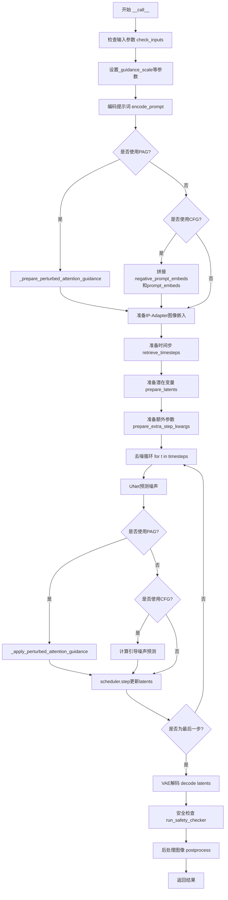

## 类结构

```
DiffusionPipeline (抽象基类)
├── StableDiffusionPAGPipeline (主Pipeline类)
│   ├── StableDiffusionMixin
│   ├── TextualInversionLoaderMixin
│   ├── StableDiffusionLoraLoaderMixin
│   ├── IPAdapterMixin
│   ├── FromSingleFileMixin
│   └── PAGMixin
```

## 全局变量及字段


### `XLA_AVAILABLE`
    
标记torch_xla库是否可用，用于支持TPU/XLA设备加速

类型：`bool`
    


### `logger`
    
模块级日志记录器，用于输出调试和信息日志

类型：`logging.Logger`
    


### `EXAMPLE_DOC_STRING`
    
包含pipeline使用示例的文档字符串，展示基本调用方式

类型：`str`
    


### `StableDiffusionPAGPipeline.vae`
    
变分自编码器模型，用于将图像编码到潜在空间和解码回像素空间

类型：`AutoencoderKL`
    


### `StableDiffusionPAGPipeline.text_encoder`
    
冻结的CLIP文本编码器，将文本提示转换为文本嵌入向量

类型：`CLIPTextModel`
    


### `StableDiffusionPAGPipeline.tokenizer`
    
CLIP分词器，用于将文本提示 tokenize 为token序列

类型：`CLIPTokenizer`
    


### `StableDiffusionPAGPipeline.unet`
    
条件UNet模型，在去噪过程中预测噪声残差

类型：`UNet2DConditionModel`
    


### `StableDiffusionPAGPipeline.scheduler`
    
Karras扩散调度器，管理去噪过程中的时间步和噪声调度

类型：`KarrasDiffusionSchedulers`
    


### `StableDiffusionPAGPipeline.safety_checker`
    
安全检查器，检测并过滤可能的有害或不当内容

类型：`StableDiffusionSafetyChecker`
    


### `StableDiffusionPAGPipeline.feature_extractor`
    
CLIP图像处理器，从生成的图像中提取特征用于安全检查

类型：`CLIPImageProcessor`
    


### `StableDiffusionPAGPipeline.image_encoder`
    
CLIP视觉编码器，用于IP-Adapter图像提示的编码

类型：`CLIPVisionModelWithProjection`
    


### `StableDiffusionPAGPipeline.vae_scale_factor`
    
VAE缩放因子，用于计算潜在空间与像素空间的尺寸转换

类型：`int`
    


### `StableDiffusionPAGPipeline.image_processor`
    
VAE图像处理器，处理图像的后处理和归一化

类型：`VaeImageProcessor`
    


### `StableDiffusionPAGPipeline.model_cpu_offload_seq`
    
模型CPU卸载顺序，定义各模型组件从GPU到CPU的卸载优先级

类型：`str`
    


### `StableDiffusionPAGPipeline._optional_components`
    
可选组件列表，包含safety_checker、feature_extractor和image_encoder

类型：`list`
    


### `StableDiffusionPAGPipeline._exclude_from_cpu_offload`
    
排除CPU卸载的组件列表，safety_checker不在自动卸载范围内

类型：`list`
    


### `StableDiffusionPAGPipeline._callback_tensor_inputs`
    
回调函数可访问的张量输入名称列表，用于步骤结束回调

类型：`list`
    


### `StableDiffusionPAGPipeline._guidance_scale`
    
分类器自由引导比例，控制文本提示对生成图像的影响强度

类型：`float`
    


### `StableDiffusionPAGPipeline._guidance_rescale`
    
引导重新缩放因子，用于修复过度曝光问题

类型：`float`
    


### `StableDiffusionPAGPipeline._clip_skip`
    
CLIP跳过层数，决定使用哪一层隐藏状态计算提示嵌入

类型：`int`
    


### `StableDiffusionPAGPipeline._cross_attention_kwargs`
    
交叉注意力关键字参数，传递给注意力处理器

类型：`dict`
    


### `StableDiffusionPAGPipeline._num_timesteps`
    
去噪过程的时间步总数

类型：`int`
    


### `StableDiffusionPAGPipeline._interrupt`
    
中断标志，用于在去噪循环中提前终止生成

类型：`bool`
    


### `StableDiffusionPAGPipeline._pag_scale`
    
扰动注意力引导比例，控制PAG方法的引导强度

类型：`float`
    


### `StableDiffusionPAGPipeline._pag_adaptive_scale`
    
PAG自适应比例，用于动态调整引导强度

类型：`float`
    
    

## 全局函数及方法


### `rescale_noise_cfg`

该函数用于根据 `guidance_rescale` 参数重新缩放噪声预测张量，以改善图像质量并修复过度曝光问题。基于论文 Common Diffusion Noise Schedules and Sample Steps are Flawed 的第3.4节实现。

参数：

- `noise_cfg`：`torch.Tensor`，引导扩散过程的预测噪声张量
- `noise_pred_text`：`torch.Tensor`，文本引导扩散过程的预测噪声张量
- `guidance_rescale`：`float`，可选，默认为 0.0，应用到噪声预测的重新缩放因子

返回值：`torch.Tensor`，重新缩放后的噪声预测张量

#### 流程图

```mermaid
flowchart TD
    A[开始] --> B[计算noise_pred_text的标准差<br/>std_text]
    B --> C[计算noise_cfg的标准差<br/>std_cfg]
    C --> D[重新缩放噪声预测<br/>noise_pred_rescaled = noise_cfg<br/>* std_text / std_cfg]
    D --> E[混合原始和重新缩放的结果<br/>noise_cfg = guidance_rescale<br/>* noise_pred_rescaled<br/>+ (1 - guidance_rescale) * noise_cfg]
    E --> F[返回重新缩放的noise_cfg]
```

#### 带注释源码

```python
def rescale_noise_cfg(noise_cfg, noise_pred_text, guidance_rescale=0.0):
    r"""
    Rescales `noise_cfg` tensor based on `guidance_rescale` to improve image quality and fix overexposure. Based on
    Section 3.4 from [Common Diffusion Noise Schedules and Sample Steps are
    Flawed](https://huggingface.co/papers/2305.08891).

    Args:
        noise_cfg (`torch.Tensor`):
            The predicted noise tensor for the guided diffusion process.
        noise_pred_text (`torch.Tensor`):
            The predicted noise tensor for the text-guided diffusion process.
        guidance_rescale (`float`, *optional*, defaults to 0.0):
            A rescale factor applied to the noise predictions.

    Returns:
        noise_cfg (`torch.Tensor`): The rescaled noise prediction tensor.
    """
    # 计算文本预测噪声的标准差（保留维度以便广播）
    std_text = noise_pred_text.std(dim=list(range(1, noise_pred_text.ndim)), keepdim=True)
    # 计算CFG预测噪声的标准差（保留维度以便广播）
    std_cfg = noise_cfg.std(dim=list(range(1, noise_cfg.ndim)), keepdim=True)
    # 重新缩放引导结果（修复过度曝光）
    # 通过将noise_cfg的标准差缩放到与text噪声相同
    noise_pred_rescaled = noise_cfg * (std_text / std_cfg)
    # 通过guidance_rescale因子混合原始引导结果，避免"平淡"的图像
    # guidance_rescale=0时保持原样，guidance_rescale=1时完全使用重新缩放的结果
    noise_cfg = guidance_rescale * noise_pred_rescaled + (1 - guidance_rescale) * noise_cfg
    return noise_cfg
```


### `retrieve_timesteps`

该函数是 Stable Diffusion 管道中的时间步检索工具函数，负责调用调度器的 `set_timesteps` 方法并返回生成过程所需的时间步序列和推理步数，支持自定义时间步或 sigmas 覆盖默认调度策略。

参数：

- `scheduler`：`SchedulerMixin`，要获取时间步的调度器对象
- `num_inference_steps`：`int | None`，使用预训练模型生成样本时的扩散步数，若使用此参数则 `timesteps` 必须为 `None`
- `device`：`str | torch.device | None`，时间步要移动到的设备，若为 `None` 则不移动
- `timesteps`：`list[int] | None`，用于覆盖调度器时间步间隔策略的自定义时间步，若传递此参数则 `num_inference_steps` 和 `sigmas` 必须为 `None`
- `sigmas`：`list[float] | None`，用于覆盖调度器时间步间隔策略的自定义 sigmas，若传递此参数则 `num_inference_steps` 和 `timesteps` 必须为 `None`
- `**kwargs`：任意关键字参数，将传递给调度器的 `set_timesteps` 方法

返回值：`tuple[torch.Tensor, int]`，元组第一个元素是调度器的时间步计划，第二个元素是推理步数

#### 流程图

```mermaid
flowchart TD
    A[开始] --> B{检查timesteps和sigmas是否同时存在}
    B -->|是| C[抛出ValueError: 只能选择timesteps或sigmas之一]
    B -->|否| D{是否提供timesteps?}
    D -->|是| E[检查scheduler.set_timesteps是否接受timesteps参数]
    E -->|不支持| F[抛出ValueError: 当前调度器不支持自定义timesteps]
    E -->|支持| G[调用scheduler.set_timesteps timesteps=timesteps, device=device]
    G --> H[获取scheduler.timesteps]
    H --> I[计算num_inference_steps = len(timesteps)]
    I --> J[返回timesteps, num_inference_steps]
    
    D -->|否| K{是否提供sigmas?}
    K -->|是| L[检查scheduler.set_timesteps是否接受sigmas参数]
    L -->|不支持| M[抛出ValueError: 当前调度器不支持自定义sigmas]
    L -->|支持| N[调用scheduler.set_timesteps sigmas=sigmas, device=device]
    N --> O[获取scheduler.timesteps]
    O --> P[计算num_inference_steps = len(timesteps)]
    P --> J
    
    K -->|否| Q[调用scheduler.set_timesteps num_inference_steps, device=device]
    Q --> R[获取scheduler.timesteps]
    R --> J
    
    C --> S[结束]
    F --> S
    M --> S
    J --> S
```

#### 带注释源码

```python
# Copied from diffusers.pipelines.stable_diffusion.pipeline_stable_diffusion.retrieve_timesteps
def retrieve_timesteps(
    scheduler,
    num_inference_steps: int | None = None,
    device: str | torch.device | None = None,
    timesteps: list[int] | None = None,
    sigmas: list[float] | None = None,
    **kwargs,
):
    r"""
    Calls the scheduler's `set_timesteps` method and retrieves timesteps from the scheduler after the call. Handles
    custom timesteps. Any kwargs will be supplied to `scheduler.set_timesteps`.

    Args:
        scheduler (`SchedulerMixin`):
            The scheduler to get timesteps from.
        num_inference_steps (`int`):
            The number of diffusion steps used when generating samples with a pre-trained model. If used, `timesteps`
            must be `None`.
        device (`str` or `torch.device`, *optional*):
            The device to which the timesteps should be moved to. If `None`, the timesteps are not moved.
        timesteps (`list[int]`, *optional*):
            Custom timesteps used to override the timestep spacing strategy of the scheduler. If `timesteps` is passed,
            `num_inference_steps` and `sigmas` must be `None`.
        sigmas (`list[float]`, *optional*):
            Custom sigmas used to override the timestep spacing strategy of the scheduler. If `sigmas` is passed,
            `num_inference_steps` and `timesteps` must be `None`.

    Returns:
        `tuple[torch.Tensor, int]`: A tuple where the first element is the timestep schedule from the scheduler and the
        second element is the number of inference steps.
    """
    # 检查是否同时传入了timesteps和sigmas，两者只能选其一
    if timesteps is not None and sigmas is not None:
        raise ValueError("Only one of `timesteps` or `sigmas` can be passed. Please choose one to set custom values")
    
    # 处理自定义timesteps的情况
    if timesteps is not None:
        # 使用inspect检查调度器的set_timesteps方法是否接受timesteps参数
        accepts_timesteps = "timesteps" in set(inspect.signature(scheduler.set_timesteps).parameters.keys())
        if not accepts_timesteps:
            raise ValueError(
                f"The current scheduler class {scheduler.__class__}'s `set_timesteps` does not support custom"
                f" timestep schedules. Please check whether you are using the correct scheduler."
            )
        # 调用调度器的set_timesteps方法设置自定义时间步
        scheduler.set_timesteps(timesteps=timesteps, device=device, **kwargs)
        # 从调度器获取更新后的timesteps
        timesteps = scheduler.timesteps
        # 计算推理步数
        num_inference_steps = len(timesteps)
    # 处理自定义sigmas的情况
    elif sigmas is not None:
        # 使用inspect检查调度器的set_timesteps方法是否接受sigmas参数
        accept_sigmas = "sigmas" in set(inspect.signature(scheduler.set_timesteps).parameters.keys())
        if not accept_sigmas:
            raise ValueError(
                f"The current scheduler class {scheduler.__class__}'s `set_timesteps` does not support custom"
                f" sigmas schedules. Please check whether you are using the correct scheduler."
            )
        # 调用调度器的set_timesteps方法设置自定义sigmas
        scheduler.set_timesteps(sigmas=sigmas, device=device, **kwargs)
        # 从调度器获取更新后的timesteps
        timesteps = scheduler.timesteps
        # 计算推理步数
        num_inference_steps = len(timesteps)
    # 默认情况：使用num_inference_steps设置时间步
    else:
        scheduler.set_timesteps(num_inference_steps, device=device, **kwargs)
        timesteps = scheduler.timesteps
    
    # 返回时间步序列和推理步数
    return timesteps, num_inference_steps
```


### `StableDiffusionPAGPipeline.__init__`

该方法是StableDiffusionPAGPipeline类的构造函数，负责初始化用于文本到图像生成的PAG（Perturbed Attention Guidance）增强版Stable Diffusion Pipeline，包括VAE、文本编码器、UNet、调度器等核心组件，并进行配置验证和PAG层的设置。

参数：

- `vae`：`AutoencoderKL`，Variational Auto-Encoder (VAE) 模型，用于将图像编码到潜在空间并从潜在表示解码图像。
- `text_encoder`：`CLIPTextModel`，冻结的文本编码器（clip-vit-large-patch14），用于将文本提示转换为嵌入向量。
- `tokenizer`：`CLIPTokenizer`，CLIP分词器，用于将文本分词为token。
- `unet`：`UNet2DConditionModel`，条件UNet模型，用于对编码的图像潜在表示进行去噪。
- `scheduler`：`KarrasDiffusionSchedulers`，调度器，与UNet结合用于去噪编码后的图像潜在表示。
- `safety_checker`：`StableDiffusionSafetyChecker`，安全检查器模块，用于估计生成的图像是否被认为是有害的。
- `feature_extractor`：`CLIPImageProcessor`，CLIP图像处理器，用于从生成的图像中提取特征，作为safety_checker的输入。
- `image_encoder`：`CLIPVisionModelWithProjection`（可选），视觉编码器，用于IP-Adapter功能。
- `requires_safety_checker`：`bool`（默认值为`True`），是否需要安全检查器。
- `pag_applied_layers`：`str | list[str]`（默认值为`"mid"`），PAG应用的目标层，可以是"mid"、"up"或层名称列表。

返回值：`None`，构造函数无返回值。

#### 流程图

```mermaid
flowchart TD
    A[开始 __init__] --> B[调用 super().__init__]
    B --> C{scheduler.config.steps_offset != 1?}
    C -->|是| D[发出警告并修正 steps_offset]
    C -->|否| E{scheduler.config.clip_sample == True?}
    D --> E
    E -->|是| F[发出警告并修正 clip_sample]
    E -->|否| G{safety_checker is None and requires_safety_checker?}
    F --> G
    G -->|是| H[发出警告：安全检查器被禁用]
    G -->|否| I{safety_checker is not None and feature_extractor is None?}
    H --> I
    I -->|是| J[抛出 ValueError：未定义 feature_extractor]
    I -->|否| K{unet版本 < 0.9.0 且 sample_size < 64?}
    J --> K
    K -->|是| L[发出警告并修正 sample_size]
    K -->|否| M[register_modules 注册所有模块]
    L --> M
    M --> N[计算 vae_scale_factor]
    N --> O[创建 VaeImageProcessor]
    O --> P[register_to_config 保存 requires_safety_checker]
    P --> Q[调用 set_pag_applied_layers 设置PAG层]
    Q --> R[结束 __init__]
```

#### 带注释源码

```
def __init__(
    self,
    vae: AutoencoderKL,
    text_encoder: CLIPTextModel,
    tokenizer: CLIPTokenizer,
    unet: UNet2DConditionModel,
    scheduler: KarrasDiffusionSchedulers,
    safety_checker: StableDiffusionSafetyChecker,
    feature_extractor: CLIPImageProcessor,
    image_encoder: CLIPVisionModelWithProjection = None,
    requires_safety_checker: bool = True,
    pag_applied_layers: str | list[str] = "mid",
):
    # 初始化父类 DiffusionPipeline
    super().__init__()

    # ==================== 调度器配置检查与修正 ====================
    # 检查 scheduler 的 steps_offset 配置是否为 1（旧版本默认为 1）
    if scheduler is not None and getattr(scheduler.config, "steps_offset", 1) != 1:
        # 发出弃用警告
        deprecation_message = (
            f"The configuration file of this scheduler: {scheduler} is outdated. `steps_offset`"
            f" should be set to 1 instead of {scheduler.config.steps_offset}. Please make sure "
            "to update the config accordingly as leaving `steps_offset` might led to incorrect results"
            " in future versions. If you have downloaded this checkpoint from the Hugging Face Hub,"
            " it would be very nice if you could open a Pull request for the `scheduler/scheduler_config.json`"
            " file"
        )
        deprecate("steps_offset!=1", "1.0.0", deprecation_message, standard_warn=False)
        # 修正配置
        new_config = dict(scheduler.config)
        new_config["steps_offset"] = 1
        scheduler._internal_dict = FrozenDict(new_config)

    # 检查 scheduler 的 clip_sample 配置（应设为 False）
    if scheduler is not None and getattr(scheduler.config, "clip_sample", False) is True:
        deprecation_message = (
            f"The configuration file of this scheduler: {scheduler} has not set the configuration `clip_sample`."
            " `clip_sample` should be set to False in the configuration file. Please make sure to update the"
            " config accordingly as not setting `clip_sample` in the config might lead to incorrect results in"
            " future versions. If you have downloaded this checkpoint from the Hugging Face Hub, it would be very"
            " nice if you could open a Pull request for the `scheduler/scheduler_config.json` file"
        )
        deprecate("clip_sample not set", "1.0.0", deprecation_message, standard_warn=False)
        new_config = dict(scheduler.config)
        new_config["clip_sample"] = False
        scheduler._internal_dict = FrozenDict(new_config)

    # ==================== 安全检查器验证 ====================
    # 如果 safety_checker 为 None 但 requires_safety_checker 为 True，发出警告
    if safety_checker is None and requires_safety_checker:
        logger.warning(
            f"You have disabled the safety checker for {self.__class__} by passing `safety_checker=None`. Ensure"
            " that you abide to the conditions of the Stable Diffusion license and do not expose unfiltered"
            " results in services or applications open to the public. Both the diffusers team and Hugging Face"
            " strongly recommend to keep the safety filter enabled in all public facing circumstances, disabling"
            " it only for use-cases that involve analyzing network behavior or auditing its results. For more"
            " information, please have a look at https://github.com/huggingface/diffusers/pull/254 ."
        )

    # 如果提供了 safety_checker 但没有 feature_extractor，抛出错误
    if safety_checker is not None and feature_extractor is None:
        raise ValueError(
            "Make sure to define a feature extractor when loading {self.__class__} if you want to use the safety"
            " checker. If you do not want to use the safety checker, you can pass `'safety_checker=None'` instead."
        )

    # ==================== UNet 配置检查与修正 ====================
    # 检查 UNet 版本和 sample_size 配置
    is_unet_version_less_0_9_0 = (
        unet is not None
        and hasattr(unet.config, "_diffusers_version")
        and version.parse(version.parse(unet.config._diffusers_version).base_version) < version.parse("0.9.0.dev0")
    )
    is_unet_sample_size_less_64 = (
        unet is not None and hasattr(unet.config, "sample_size") and unet.config.sample_size < 64
    )
    # 如果 UNet 版本较旧且 sample_size 小于 64，发出警告并修正
    if is_unet_version_less_0_9_0 and is_unet_sample_size_less_64:
        deprecation_message = (
            "The configuration file of the unet has set the default `sample_size` to smaller than"
            " 64 which seems highly unlikely. If your checkpoint is a fine-tuned version of any of the"
            " following: \n- CompVis/stable-diffusion-v1-4 \n- CompVis/stable-diffusion-v1-3 \n-"
            " CompVis/stable-diffusion-v1-2 \n- CompVis/stable-diffusion-v1-1 \n- stable-diffusion-v1-5/stable-diffusion-v1-5"
            " \n- stable-diffusion-v1-5/stable-diffusion-inpainting \n you should change 'sample_size' to 64 in the"
            " configuration file. Please make sure to update the config accordingly as leaving `sample_size=32`"
            " in the config might lead to incorrect results in future versions. If you have downloaded this"
            " checkpoint from the Hugging Face Hub, it would be very nice if you could open a Pull request for"
            " the `unet/config.json` file"
        )
        deprecate("sample_size<64", "1.0.0", deprecation_message, standard_warn=False)
        new_config = dict(unet.config)
        new_config["sample_size"] = 64
        unet._internal_dict = FrozenDict(new_config)

    # ==================== 注册模块 ====================
    # 将所有组件模块注册到 pipeline 中
    self.register_modules(
        vae=vae,
        text_encoder=text_encoder,
        tokenizer=tokenizer,
        unet=unet,
        scheduler=scheduler,
        safety_checker=safety_checker,
        feature_extractor=feature_extractor,
        image_encoder=image_encoder,
    )

    # ==================== 图像处理配置 ====================
    # 计算 VAE 缩放因子，基于 VAE block_out_channels
    self.vae_scale_factor = 2 ** (len(self.vae.config.block_out_channels) - 1) if getattr(self, "vae", None) else 8
    # 创建 VAE 图像处理器
    self.image_processor = VaeImageProcessor(vae_scale_factor=self.vae_scale_factor)

    # ==================== 保存配置 ====================
    # 将 requires_safety_checker 保存到配置中
    self.register_to_config(requires_safety_checker=requires_safety_checker)

    # ==================== PAG 配置 ====================
    # 设置 PAG 应用的目标层
    self.set_pag_applied_layers(pag_applied_layers)
```


### `StableDiffusionPAGPipeline.encode_prompt`

该方法负责将文本提示（prompt）编码为文本编码器（CLIP Text Encoder）的隐藏状态向量（hidden states），支持LoRA权重调整、文本反转（Textual Inversion）嵌入、classifier-free guidance（无分类器引导）所需的负向提示嵌入，以及可选的CLIP层跳过功能。

参数：

- `prompt`：`str | list[str] | None`，要编码的文本提示，可以是单个字符串或字符串列表
- `device`：`torch.device`，指定计算设备（CPU/CUDA）
- `num_images_per_prompt`：`int`，每个提示生成的图像数量，用于复制嵌入向量
- `do_classifier_free_guidance`：`bool`，是否启用classifier-free guidance，若为True则需要生成负向嵌入
- `negative_prompt`：`str | list[str] | None`，不希望出现的提示内容，用于生成负向嵌入
- `prompt_embeds`：`torch.Tensor | None`，预生成的提示嵌入，若提供则直接使用而不重新编码
- `negative_prompt_embeds`：`torch.Tensor | None`，预生成的负向提示嵌入
- `lora_scale`：`float | None`，LoRA权重缩放因子，用于调整LoRA层的影响程度
- `clip_skip`：`int | None`，CLIP模型中跳过的层数，用于获取不同层次的表示

返回值：`tuple[torch.Tensor, torch.Tensor]`，返回编码后的提示嵌入和负向提示嵌入（可能为None）

#### 流程图

```mermaid
flowchart TD
    A[开始 encode_prompt] --> B{检查 lora_scale 是否存在}
    B -->|是| C[设置 self._lora_scale]
    B -->|否| D
    
    C --> D{检查 lora_scale 和 StableDiffusionLoraLoaderMixin 类型}
    D -->|使用 PEFT| E[scale_lora_layers]
    D -->|不使用 PEFT| F[adjust_lora_scale_text_encoder]
    
    E --> G{检查 prompt 类型}
    F --> G
    
    G -->|str| H[batch_size = 1]
    G -->|list| I[batch_size = len(prompt)]
    G -->|其他| J[batch_size = prompt_embeds.shape[0]]
    
    H --> K{prompt_embeds 是否为 None}
    I --> K
    J --> K
    
    K -->|是| L{检查 TextualInversionLoaderMixin}
    K -->|否| O
    
    L -->|是| M[maybe_convert_prompt 处理提示]
    L -->|否| N
    
    M --> N[tokenizer 处理文本]
    N --> O{clip_skip 是否为 None}
    
    O -->|是| P[text_encoder 编码获取嵌入]
    O -->|否| Q[text_encoder 编码获取隐藏状态]
    
    P --> R[直接使用[0]获取嵌入]
    Q --> S[根据 clip_skip 选取对应层的隐藏状态]
    Q --> T[应用 final_layer_norm]
    
    R --> U{text_encoder 是否存在}
    S --> U
    T --> U
    
    U -->|是| V[获取 text_encoder.dtype]
    U -->|否| W{unet 是否存在}
    
    V --> X[转换为对应 dtype 和 device]
    W -->|是| V
    W -->|否| X
    
    X --> Y[复制 prompt_embeds num_images_per_prompt 次]
    Y --> Z{do_classifier_free_guidance 为真<br/>且 negative_prompt_embeds 为 None}
    
    Z -->|是| AA[处理 negative_prompt]
    Z -->|否| EE
    
    AA --> AB{negative_prompt 类型检查}
    AB -->|None| AC[使用空字符串]
    AB -->|str| AD[转为列表]
    AB -->|list| AE[直接使用]
    
    AC --> AF[TextualInversionLoaderMixin 处理]
    AD --> AF
    AE --> AF
    
    AF --> AG[tokenizer 处理负向文本]
    AG --> AH[text_encoder 编码负向嵌入]
    
    EE --> AI{do_classifier_free_guidance 为真}
    AI -->|是| AJ[复制 negative_prompt_embeds]
    AI -->|否| AK[返回结果]
    
    AJ --> AK[返回 prompt_embeds, negative_prompt_embeds]
```

#### 带注释源码

```python
def encode_prompt(
    self,
    prompt,                      # str | list[str] | None: 输入文本提示
    device,                     # torch.device: 计算设备
    num_images_per_prompt,      # int: 每个提示生成的图像数量
    do_classifier_free_guidance, # bool: 是否启用 classifier-free guidance
    negative_prompt=None,       # str | list[str] | None: 负向提示
    prompt_embeds: torch.Tensor | None = None,  # 预计算的提示嵌入
    negative_prompt_embeds: torch.Tensor | None = None,  # 预计算的负向嵌入
    lora_scale: float | None = None,  # LoRA 缩放因子
    clip_skip: int | None = None,    # CLIP 跳过的层数
):
    r"""
    Encodes the prompt into text encoder hidden states.

    Args:
        prompt (`str` or `list[str]`, *optional*):
            prompt to be encoded
        device: (`torch.device`):
            torch device
        num_images_per_prompt (`int`):
            number of images that should be generated per prompt
        do_classifier_free_guidance (`bool`):
            whether to use classifier free guidance or not
        negative_prompt (`str` or `list[str]`, *optional*):
            The prompt or prompts not to guide the image generation. If not defined, one has to pass
            `negative_prompt_embeds` instead. Ignored when not using guidance (i.e., ignored if `guidance_scale` is
            less than `1`).
        prompt_embeds (`torch.Tensor`, *optional*):
            Pre-generated text embeddings. Can be used to easily tweak text inputs, *e.g.* prompt weighting. If not
            provided, text embeddings will be generated from `prompt` input argument.
        negative_prompt_embeds (`torch.Tensor`, *optional*):
            Pre-generated negative text embeddings. Can be used to easily tweak text inputs, *e.g.* prompt
            weighting. If not provided, negative_prompt_embeds will be generated from `negative_prompt` input
            argument.
        lora_scale (`float`, *optional*):
            A LoRA scale that will be applied to all LoRA layers of the text encoder if LoRA layers are loaded.
        clip_skip (`int`, *optional*):
            Number of layers to be skipped from CLIP while computing the prompt embeddings. A value of 1 means that
            the output of the pre-final layer will be used for computing the prompt embeddings.
    """
    # 设置 LoRA 缩放因子，以便文本编码器的 monkey patched LoRA 函数可以正确访问
    if lora_scale is not None and isinstance(self, StableDiffusionLoraLoaderMixin):
        self._lora_scale = lora_scale

        # 动态调整 LoRA 缩放因子
        if not USE_PEFT_BACKEND:
            adjust_lora_scale_text_encoder(self.text_encoder, lora_scale)
        else:
            scale_lora_layers(self.text_encoder, lora_scale)

    # 确定批次大小
    if prompt is not None and isinstance(prompt, str):
        batch_size = 1
    elif prompt is not None and isinstance(prompt, list):
        batch_size = len(prompt)
    else:
        batch_size = prompt_embeds.shape[0]

    # 如果未提供 prompt_embeds，则从 prompt 生成
    if prompt_embeds is None:
        # 文本反转：如有需要处理多向量 token
        if isinstance(self, TextualInversionLoaderMixin):
            prompt = self.maybe_convert_prompt(prompt, self.tokenizer)

        # 使用 tokenizer 将文本转换为 token ID
        text_inputs = self.tokenizer(
            prompt,
            padding="max_length",
            max_length=self.tokenizer.model_max_length,
            truncation=True,
            return_tensors="pt",
        )
        text_input_ids = text_inputs.input_ids
        # 获取未截断的 token 序列用于检查
        untruncated_ids = self.tokenizer(prompt, padding="longest", return_tensors="pt").input_ids

        # 检查是否发生了截断，并记录警告
        if untruncated_ids.shape[-1] >= text_input_ids.shape[-1] and not torch.equal(
            text_input_ids, untruncated_ids
        ):
            removed_text = self.tokenizer.batch_decode(
                untruncated_ids[:, self.tokenizer.model_max_length - 1 : -1]
            )
            logger.warning(
                "The following part of your input was truncated because CLIP can only handle sequences up to"
                f" {self.tokenizer.model_max_length} tokens: {removed_text}"
            )

        # 获取 attention mask
        if hasattr(self.text_encoder.config, "use_attention_mask") and self.text_encoder.config.use_attention_mask:
            attention_mask = text_inputs.attention_mask.to(device)
        else:
            attention_mask = None

        # 根据 clip_skip 参数决定如何获取嵌入
        if clip_skip is None:
            # 直接获取最后一层的输出
            prompt_embeds = self.text_encoder(text_input_ids.to(device), attention_mask=attention_mask)
            prompt_embeds = prompt_embeds[0]
        else:
            # 获取所有隐藏状态，然后根据 clip_skip 选取对应层
            prompt_embeds = self.text_encoder(
                text_input_ids.to(device), attention_mask=attention_mask, output_hidden_states=True
            )
            # hidden_states 是一个元组，包含所有编码器层的输出
            # 索引到所需的层（clip_skip + 1，因为最后还有一个最终层）
            prompt_embeds = prompt_embeds[-1][-(clip_skip + 1)]
            # 应用最终的 LayerNorm 以确保表示正确
            prompt_embeds = self.text_encoder.text_model.final_layer_norm(prompt_embeds)

    # 确定 prompt_embeds 的数据类型
    if self.text_encoder is not None:
        prompt_embeds_dtype = self.text_encoder.dtype
    elif self.unet is not None:
        prompt_embeds_dtype = self.unet.dtype
    else:
        prompt_embeds_dtype = prompt_embeds.dtype

    # 转换设备并保持 dtype 一致
    prompt_embeds = prompt_embeds.to(dtype=prompt_embeds_dtype, device=device)

    # 为每个提示复制多次嵌入（用于生成多张图像）
    bs_embed, seq_len, _ = prompt_embeds.shape
    # 友好的 mps 兼容方法复制文本嵌入
    prompt_embeds = prompt_embeds.repeat(1, num_images_per_prompt, 1)
    prompt_embeds = prompt_embeds.view(bs_embed * num_images_per_prompt, seq_len, -1)

    # 获取 classifier-free guidance 所需的无条件嵌入
    if do_classifier_free_guidance and negative_prompt_embeds is None:
        uncond_tokens: list[str]
        if negative_prompt is None:
            uncond_tokens = [""] * batch_size
        elif prompt is not None and type(prompt) is not type(negative_prompt):
            raise TypeError(
                f"`negative_prompt` should be the same type to `prompt`, but got {type(negative_prompt)} !="
                f" {type(prompt)}."
            )
        elif isinstance(negative_prompt, str):
            uncond_tokens = [negative_prompt]
        elif batch_size != len(negative_prompt):
            raise ValueError(
                f"`negative_prompt`: {negative_prompt} has batch size {len(negative_prompt)}, but `prompt`:"
                f" {prompt} has batch size {batch_size}. Please make sure that passed `negative_prompt` matches"
                " the batch size of `prompt`."
            )
        else:
            uncond_tokens = negative_prompt

        # 文本反转处理
        if isinstance(self, TextualInversionLoaderMixin):
            uncond_tokens = self.maybe_convert_prompt(uncond_tokens, self.tokenizer)

        max_length = prompt_embeds.shape[1]
        uncond_input = self.tokenizer(
            uncond_tokens,
            padding="max_length",
            max_length=max_length,
            truncation=True,
            return_tensors="pt",
        )

        # 获取 attention mask
        if hasattr(self.text_encoder.config, "use_attention_mask") and self.text_encoder.config.use_attention_mask:
            attention_mask = uncond_input.attention_mask.to(device)
        else:
            attention_mask = None

        # 编码无条件嵌入
        negative_prompt_embeds = self.text_encoder(
            uncond_input.input_ids.to(device),
            attention_mask=attention_mask,
        )
        negative_prompt_embeds = negative_prompt_embeds[0]

    # 如果使用 classifier-free guidance，复制无条件嵌入
    if do_classifier_free_guidance:
        seq_len = negative_prompt_embeds.shape[1]

        negative_prompt_embeds = negative_prompt_embeds.to(dtype=prompt_embeds_dtype, device=device)

        # 复制无条件嵌入
        negative_prompt_embeds = negative_prompt_embeds.repeat(1, num_images_per_prompt, 1)
        negative_prompt_embeds = negative_prompt_embeds.view(batch_size * num_images_per_prompt, seq_len, -1)

    # 如果使用了 PEFT backend，恢复 LoRA 层的原始缩放
    if self.text_encoder is not None:
        if isinstance(self, StableDiffusionLoraLoaderMixin) and USE_PEFT_BACKEND:
            unscale_lora_layers(self.text_encoder, lora_scale)

    return prompt_embeds, negative_prompt_embeds
```


### `StableDiffusionPAGPipeline.encode_image`

该方法用于将输入图像编码为图像嵌入向量（image embeddings）或隐藏状态（hidden states），支持有条件和无条件的图像表示生成，以便在后续的扩散模型中结合文本提示进行图像生成。

参数：

- `image`：`torch.Tensor | PipelineImageInput`，输入的图像数据，可以是原始图像或预处理的张量
- `device`：`torch.device`，指定计算设备（CPU/CUDA）
- `num_images_per_prompt`：`int`，每个提示词生成的图像数量，用于复制图像嵌入
- `output_hidden_states`：`bool | None`，可选参数，指定是否输出图像编码器的隐藏状态而非图像嵌入

返回值：`tuple[torch.Tensor, torch.Tensor]`，返回两个张量元组——第一个为条件图像嵌入/隐藏状态，第二个为无条件（零）图像嵌入/隐藏状态，用于分类器自由引导（Classifier-Free Guidance）

#### 流程图

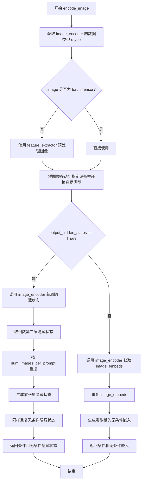

#### 带注释源码

```python
def encode_image(self, image, device, num_images_per_prompt, output_hidden_states=None):
    """
    将输入图像编码为图像嵌入向量或隐藏状态表示
    
    Args:
        image: 输入图像，支持 PIL Image、numpy array 或 torch.Tensor 格式
        device: 目标计算设备
        num_images_per_prompt: 每个提示词生成的图像数量
        output_hidden_states: 是否返回隐藏状态而非图像嵌入
    
    Returns:
        元组 (条件嵌入, 无条件嵌入) 或 (条件隐藏状态, 无条件隐藏状态)
    """
    # 获取图像编码器的参数数据类型，用于后续类型转换
    dtype = next(self.image_encoder.parameters()).dtype

    # 如果输入不是张量格式，则使用特征提取器进行预处理
    if not isinstance(image, torch.Tensor):
        image = self.feature_extractor(image, return_tensors="pt").pixel_values

    # 将图像数据移动到指定设备并转换数据类型
    image = image.to(device=device, dtype=dtype)
    
    # 根据 output_hidden_states 参数选择不同的编码路径
    if output_hidden_states:
        # 路径1：输出隐藏状态（用于更细粒度的控制）
        # 获取图像编码器输出的隐藏状态，取倒数第二层（通常包含更丰富的特征）
        image_enc_hidden_states = self.image_encoder(image, output_hidden_states=True).hidden_states[-2]
        # 为每个提示词复制对应的图像隐藏状态
        image_enc_hidden_states = image_enc_hidden_states.repeat_interleave(num_images_per_prompt, dim=0)
        
        # 生成零张量作为无条件的图像隐藏状态（用于 CFG）
        uncond_image_enc_hidden_states = self.image_encoder(
            torch.zeros_like(image), output_hidden_states=True
        ).hidden_states[-2]
        # 同样复制无条件隐藏状态
        uncond_image_enc_hidden_states = uncond_image_enc_hidden_states.repeat_interleave(
            num_images_per_prompt, dim=0
        )
        return image_enc_hidden_states, uncond_image_enc_hidden_states
    else:
        # 路径2：输出图像嵌入向量（默认行为）
        # 直接获取图像嵌入表示
        image_embeds = self.image_encoder(image).image_embeds
        # 复制嵌入向量以匹配生成的图像数量
        image_embeds = image_embeds.repeat_interleave(num_images_per_prompt, dim=0)
        # 生成零张量的无条件嵌入（与条件嵌入形状相同）
        uncond_image_embeds = torch.zeros_like(image_embeds)

        return image_embeds, uncond_image_embeds
```


### `StableDiffusionPAGPipeline.prepare_ip_adapter_image_embeds`

该方法用于准备 IP-Adapter 的图像嵌入。它处理两种输入方式：如果传入原始图像，则使用图像编码器编码；如果传入预计算的嵌入，则直接使用。最后根据是否启用无分类器引导来组织正负图像嵌入，并复制到每个提示生成的图像数量。

参数：

- `self`：类实例本身，包含 `encode_image` 方法和 `unet.encoder_hid_proj.image_projection_layers` 属性
- `ip_adapter_image`：`PipelineImageInput | None`，要用于 IP-Adapter 的输入图像，可以是单个图像或图像列表
- `ip_adapter_image_embeds`：`list[torch.Tensor] | None`，预计算的图像嵌入列表，每个元素应为形状 `(batch_size, num_images, emb_dim)` 的张量
- `device`：`str | torch.device`，计算设备
- `num_images_per_prompt`：`int`，每个提示生成的图像数量
- `do_classifier_free_guidance`：`bool`，是否启用无分类器引导

返回值：`list[torch.Tensor]`，处理后的 IP-Adapter 图像嵌入列表，每个元素是拼接了负样本嵌入（如果启用 CFG）的张量

#### 流程图

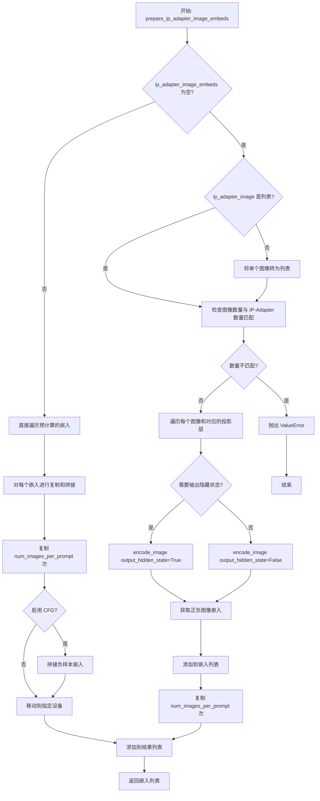

#### 带注释源码

```python
def prepare_ip_adapter_image_embeds(
    self, ip_adapter_image, ip_adapter_image_embeds, device, num_images_per_prompt, do_classifier_free_guidance
):
    """
    Prepares image embeddings for IP-Adapter.
    
    处理 IP-Adapter 的图像嵌入准备。支持两种输入模式：
    1. 输入原始图像：需要通过图像编码器编码
    2. 输入预计算嵌入：直接使用
    
    Args:
        ip_adapter_image: 输入的原始图像或图像列表
        ip_adapter_image_embeds: 预计算的图像嵌入，如果为 None 则从图像编码
        device: 计算设备
        num_images_per_prompt: 每个提示生成的图像数量
        do_classifier_free_guidance: 是否启用无分类器引导
    
    Returns:
        处理后的图像嵌入列表
    """
    # 初始化正负嵌入列表
    image_embeds = []
    if do_classifier_free_guidance:
        negative_image_embeds = []
    
    # 情况1：需要从图像编码
    if ip_adapter_image_embeds is None:
        # 统一转为列表格式
        if not isinstance(ip_adapter_image, list):
            ip_adapter_image = [ip_adapter_image]

        # 验证图像数量与 IP-Adapter 数量匹配
        if len(ip_adapter_image) != len(self.unet.encoder_hid_proj.image_projection_layers):
            raise ValueError(
                f"`ip_adapter_image` must have same length as the number of IP Adapters. "
                f"Got {len(ip_adapter_image)} images and {len(self.unet.encoder_hid_proj.image_projection_layers)} IP Adapters."
            )

        # 遍历每个 IP-Adapter 的图像和投影层
        for single_ip_adapter_image, image_proj_layer in zip(
            ip_adapter_image, self.unet.encoder_hid_proj.image_projection_layers
        ):
            # 判断是否需要输出隐藏状态（ImageProjection 类不需要）
            output_hidden_state = not isinstance(image_proj_layer, ImageProjection)
            
            # 编码图像获取嵌入
            single_image_embeds, single_negative_image_embeds = self.encode_image(
                single_ip_adapter_image, device, 1, output_hidden_state
            )

            # 添加正样本嵌入（增加批次维度）
            image_embeds.append(single_image_embeds[None, :])
            # 如果启用 CFG，添加负样本嵌入
            if do_classifier_free_guidance:
                negative_image_embeds.append(single_negative_image_embeds[None, :])
    else:
        # 情况2：直接使用预计算的嵌入
        for single_image_embeds in ip_adapter_image_embeds:
            if do_classifier_free_guidance:
                # 预计算嵌入中包含正负样本，需要拆分
                single_negative_image_embeds, single_image_embeds = single_image_embeds.chunk(2)
                negative_image_embeds.append(single_negative_image_embeds)
            image_embeds.append(single_image_embeds)

    # 处理每个嵌入：复制到 num_images_per_prompt 数量，并处理 CFG
    ip_adapter_image_embeds = []
    for i, single_image_embeds in enumerate(image_embeds):
        # 复制 num_images_per_prompt 次
        single_image_embeds = torch.cat([single_image_embeds] * num_images_per_prompt, dim=0)
        
        if do_classifier_free_guidance:
            # 负样本嵌入同样复制，并拼接到前面
            single_negative_image_embeds = torch.cat([negative_image_embeds[i]] * num_images_per_prompt, dim=0)
            single_image_embeds = torch.cat([single_negative_image_embeds, single_image_embeds], dim=0)

        # 移动到指定设备
        single_image_embeds = single_image_embeds.to(device=device)
        ip_adapter_image_embeds.append(single_image_embeds)

    return ip_adapter_image_embeds
```


### `StableDiffusionPAGPipeline.run_safety_checker`

该方法用于对生成的图像进行安全检查（NSFW检测），通过调用 `StableDiffusionSafetyChecker` 来判断图像是否包含不当内容，并返回检查后的图像以及是否存在不安全概念的标记。

参数：

- `image`：`torch.Tensor | Any`，待检查的图像，可以是 PyTorch 张量或其他格式的图像数据
- `device`：`torch.device`，用于将特征提取器输入移动到指定设备（如 CPU 或 CUDA）
- `dtype`：`torch.dtype`，用于将特征提取器输入转换为指定数据类型（如 float16）

返回值：`tuple[Any, torch.Tensor | None]`，返回两个元素：第一个是检查后的图像（如果安全检查器启用则可能被修改），第二个是布尔值列表或 `None`，表示每张图像是否包含 "not-safe-for-work"（NSFW）内容

#### 流程图

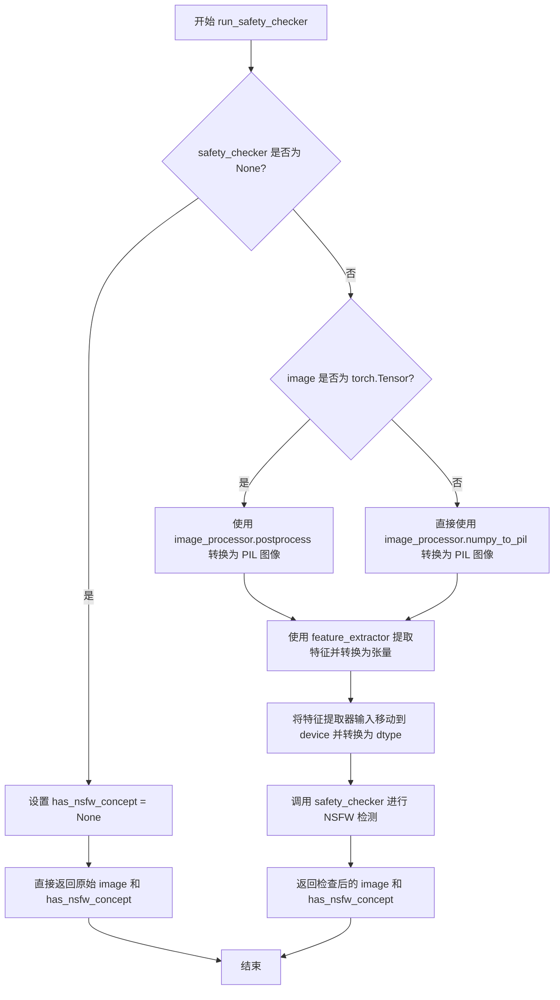

#### 带注释源码

```python
# Copied from diffusers.pipelines.stable_diffusion.pipeline_stable_diffusion.StableDiffusionPipeline.run_safety_checker
def run_safety_checker(self, image, device, dtype):
    """
    运行安全检查器以检测生成的图像是否包含不当内容（NSFW）。

    Args:
        image: 待检查的图像，可以是 torch.Tensor 或其他格式
        device: 计算设备
        dtype: 数据类型

    Returns:
        tuple: (检查后的图像, NSFW 检测结果)
    """
    # 如果没有配置安全检查器，直接返回 None 表示没有 NSFW 概念
    if self.safety_checker is None:
        has_nsfw_concept = None
    else:
        # 根据输入类型选择合适的后处理方式
        if torch.is_tensor(image):
            # 如果是张量，使用后处理器转换为 PIL 图像
            feature_extractor_input = self.image_processor.postprocess(image, output_type="pil")
        else:
            # 如果不是张量（如 numpy 数组），直接转换为 PIL 图像
            feature_extractor_input = self.image_processor.numpy_to_pil(image)
        
        # 使用特征提取器提取图像特征，并移动到指定设备和数据类型
        safety_checker_input = self.feature_extractor(feature_extractor_input, return_tensors="pt").to(device)
        
        # 调用安全检查器进行实际的 NSFW 检测
        # safety_checker 接受图像和 CLIP 特征作为输入
        image, has_nsfw_concept = self.safety_checker(
            images=image, clip_input=safety_checker_input.pixel_values.to(dtype)
        )
    
    # 返回处理后的图像和 NSFW 检测结果
    return image, has_nsfw_concept
```


### `StableDiffusionPAGPipeline.prepare_extra_step_kwargs`

该方法用于为调度器（scheduler）的 `step` 方法准备额外的关键字参数。由于不同调度器（如 DDIMScheduler、LMSDiscreteScheduler 等）具有不同的签名，该方法通过反射机制动态检查调度器是否支持 `eta` 和 `generator` 参数，从而实现参数兼容性。

参数：

- `generator`：`torch.Generator | list[torch.Generator] | None`，用于控制生成过程的随机性，确保可重复生成
- `eta`：`float`，对应 DDIM 论文中的参数 η，仅在 DDIMScheduler 中生效，其他调度器会忽略该参数

返回值：`dict[str, Any]`，包含调度器 `step` 方法所需的关键字参数字典，可能包含 `eta` 和/或 `generator`

#### 流程图

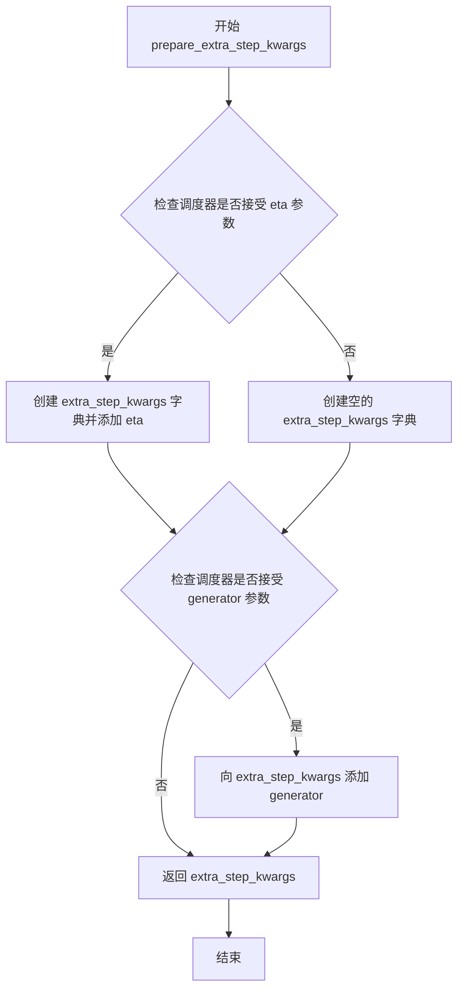

#### 带注释源码

```python
# Copied from diffusers.pipelines.stable_diffusion.pipeline_stable_diffusion.StableDiffusionPipeline.prepare_extra_step_kwargs
def prepare_extra_step_kwargs(self, generator, eta):
    # 准备调度器步骤的额外参数，因为并非所有调度器都具有相同的签名
    # eta (η) 仅与 DDIMScheduler 一起使用，其他调度器将忽略它。
    # eta 对应于 DDIM 论文中的 η：https://huggingface.co/papers/2010.02502
    # 且应在 [0, 1] 范围内

    # 使用 inspect 模块检查调度器的 step 方法是否接受 eta 参数
    accepts_eta = "eta" in set(inspect.signature(self.scheduler.step).parameters.keys())
    # 初始化空字典用于存储额外参数
    extra_step_kwargs = {}
    # 如果调度器接受 eta，则将其添加到参数字典中
    if accepts_eta:
        extra_step_kwargs["eta"] = eta

    # 检查调度器是否接受 generator 参数
    accepts_generator = "generator" in set(inspect.signature(self.scheduler.step).parameters.keys())
    # 如果接受，则将 generator 添加到参数字典中
    if accepts_generator:
        extra_step_kwargs["generator"] = generator
    # 返回包含所有额外参数的字典
    return extra_step_kwargs
```


### `StableDiffusionPAGPipeline.check_inputs`

该方法用于验证 Stable Diffusion PAG Pipeline 的输入参数是否合法，包括检查图像尺寸、回调步骤、提示词和嵌入向量的有效性，以及 IP-Adapter 相关的输入参数。

参数：

- `prompt`：`str | list[str] | None`，用户提供的文本提示词，用于指导图像生成
- `height`：`int`，生成图像的高度（像素），必须能被 8 整除
- `width`：`int`，生成图像的宽度（像素），必须能被 8 整除
- `callback_steps`：`int | None`，每隔多少步执行一次回调函数，必须为正整数
- `negative_prompt`：`str | list[str] | None`，负面提示词，用于指导不生成的内容
- `prompt_embeds`：`torch.Tensor | None`，预计算的文本嵌入向量
- `negative_prompt_embeds`：`torch.Tensor | None`，预计算的负面文本嵌入向量
- `ip_adapter_image`：`PipelineImageInput | None`，IP-Adapter 使用的输入图像
- `ip_adapter_image_embeds`：`list[torch.Tensor] | None`，预计算的 IP-Adapter 图像嵌入
- `callback_on_step_end_tensor_inputs`：`list[str] | None`，回调函数在每步结束时可访问的张量名称列表

返回值：`None`，该方法不返回任何值，仅通过抛出异常来处理无效输入

#### 流程图

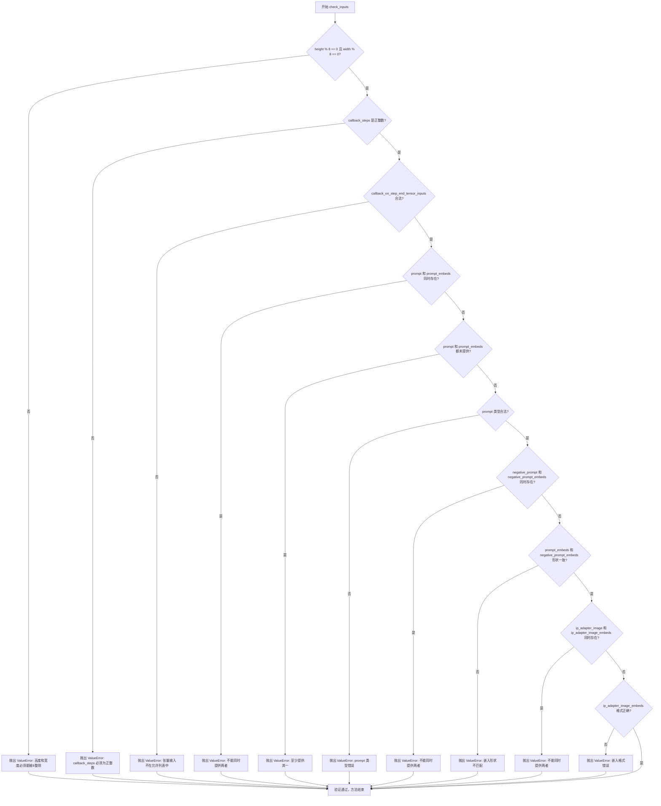

#### 带注释源码

```python
def check_inputs(
    self,
    prompt,
    height,
    width,
    callback_steps,
    negative_prompt=None,
    prompt_embeds=None,
    negative_prompt_embeds=None,
    ip_adapter_image=None,
    ip_adapter_image_embeds=None,
    callback_on_step_end_tensor_inputs=None,
):
    # 检查图像尺寸是否为8的倍数，Stable Diffusion的VAE和UNet要求尺寸能被8整除
    if height % 8 != 0 or width % 8 != 0:
        raise ValueError(f"`height` and `width` have to be divisible by 8 but are {height} and {width}.")

    # 验证callback_steps为正整数，用于控制回调函数的执行频率
    if callback_steps is not None and (not isinstance(callback_steps, int) or callback_steps <= 0):
        raise ValueError(
            f"`callback_steps` has to be a positive integer but is {callback_steps} of type"
            f" {type(callback_steps)}."
        )
    # 确保回调函数能访问的张量输入都在允许列表中，防止越权访问
    if callback_on_step_end_tensor_inputs is not None and not all(
        k in self._callback_tensor_inputs for k in callback_on_step_end_tensor_inputs
    ):
        raise ValueError(
            f"`callback_on_step_end_tensor_inputs` has to be in {self._callback_tensor_inputs}, but found {[k for k in callback_on_step_end_tensor_inputs if k not in self._callback_tensor_inputs]}"
        )

    # prompt和prompt_embeds是互斥的，只能提供其中一种
    if prompt is not None and prompt_embeds is not None:
        raise ValueError(
            f"Cannot forward both `prompt`: {prompt} and `prompt_embeds`: {prompt_embeds}. Please make sure to"
            " only forward one of the two."
        )
    # 至少需要提供prompt或prompt_embeds之一
    elif prompt is None and prompt_embeds is None:
        raise ValueError(
            "Provide either `prompt` or `prompt_embeds`. Cannot leave both `prompt` and `prompt_embeds` undefined."
        )
    # prompt类型检查，必须是字符串或列表
    elif prompt is not None and (not isinstance(prompt, str) and not isinstance(prompt, list)):
        raise ValueError(f"`prompt` has to be of type `str` or `list` but is {type(prompt)}")

    # negative_prompt和negative_prompt_embeds也是互斥的
    if negative_prompt is not None and negative_prompt_embeds is not None:
        raise ValueError(
            f"Cannot forward both `negative_prompt`: {negative_prompt} and `negative_prompt_embeds`:"
            f" {negative_prompt_embeds}. Please make sure to only forward one of the two."
        )

    # 当两者都提供时，必须形状一致，用于分类器自由引导
    if prompt_embeds is not None and negative_prompt_embeds is not None:
        if prompt_embeds.shape != negative_prompt_embeds.shape:
            raise ValueError(
                "`prompt_embeds` and `negative_prompt_embeds` must have the same shape when passed directly, but"
                f" got: `prompt_embeds` {prompt_embeds.shape} != `negative_prompt_embeds`"
                f" {negative_prompt_embeds.shape}."
            )

    # IP-Adapter的图像和嵌入也是互斥的
    if ip_adapter_image is not None and ip_adapter_image_embeds is not None:
        raise ValueError(
            "Provide either `ip_adapter_image` or `ip_adapter_image_embeds`. Cannot leave both `ip_adapter_image` and `ip_adapter_image_embeds` defined."
        )

    # 验证IP-Adapter嵌入的格式有效性
    if ip_adapter_image_embeds is not None:
        if not isinstance(ip_adapter_image_embeds, list):
            raise ValueError(
                f"`ip_adapter_image_embeds` has to be of type `list` but is {type(ip_adapter_image_embeds)}"
            )
        elif ip_adapter_image_embeds[0].ndim not in [3, 4]:
            raise ValueError(
                f"`ip_adapter_image_embeds` has to be a list of 3D or 4D tensors but is {ip_adapter_image_embeds[0].ndim}D"
            )
```


### `StableDiffusionPAGPipeline.prepare_latents`

该方法负责为扩散模型的降噪过程准备初始潜在向量（latents）。它根据指定的批次大小、图像尺寸和潜在通道数构建潜在向量的形状，若未提供潜在向量则使用随机噪声生成器创建新的潜在向量，并将其按照调度器的初始噪声标准差进行缩放。

参数：

- `batch_size`：`int`，生成的图像批次大小
- `num_channels_latents`：`int`，潜在向量的通道数，通常对应于 UNet 的输入通道数
- `height`：`int`，生成图像的高度（像素）
- `width`：`int`，生成图像的宽度（像素）
- `dtype`：`torch.dtype`，潜在向量的数据类型
- `device`：`torch.device`，潜在向量所在的设备
- `generator`：`torch.Generator` 或 `list[torch.Generator]`，可选，用于确保可重现性的随机数生成器
- `latents`：`torch.Tensor | None`，可选，若提供则直接使用该潜在向量，否则新生成

返回值：`torch.Tensor`，准备好的潜在向量，已按调度器的初始噪声标准差进行缩放

#### 流程图

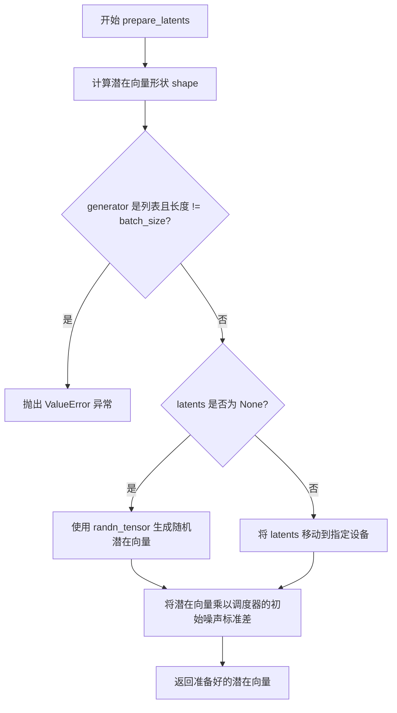

#### 带注释源码

```python
def prepare_latents(
    self,
    batch_size,                 # int: 批次大小
    num_channels_latents,       # int: 潜在通道数
    height,                     # int: 图像高度
    width,                      # int: 图像宽度
    dtype,                      # torch.dtype: 数据类型
    device,                     # torch.device: 设备
    generator,                  # torch.Generator | list[torch.Generator] | None: 随机生成器
    latents=None                # torch.Tensor | None: 预提供的潜在向量
):
    # 计算潜在向量的形状：批次大小 x 通道数 x (高度/vae缩放因子) x (宽度/vae缩放因子)
    shape = (
        batch_size,
        num_channels_latents,
        int(height) // self.vae_scale_factor,
        int(width) // self.vae_scale_factor,
    )
    
    # 验证生成器列表长度与批次大小是否匹配
    if isinstance(generator, list) and len(generator) != batch_size:
        raise ValueError(
            f"You have passed a list of generators of length {len(generator)}, but requested an effective batch"
            f" size of {batch_size}. Make sure the batch size matches the length of the generators."
        )

    # 根据是否有预提供的潜在向量决定生成方式
    if latents is None:
        # 使用 randn_tensor 生成随机噪声潜在向量
        latents = randn_tensor(shape, generator=generator, device=device, dtype=dtype)
    else:
        # 将已提供的潜在向量移动到指定设备
        latents = latents.to(device)

    # 根据调度器的要求缩放初始噪声标准差
    # 这是扩散模型采样的关键步骤，确保噪声与调度器的时间步相匹配
    latents = latents * self.scheduler.init_noise_sigma
    
    return latents
```


### `StableDiffusionPAGPipeline.get_guidance_scale_embedding`

该方法用于生成指导比例（guidance scale）的嵌入向量，基于正弦和余弦函数将标量指导值映射到高维向量空间，以增强时间步嵌入。

参数：

- `self`：`StableDiffusionPAGPipeline` 实例本身，隐式参数
- `w`：`torch.Tensor`，一维张量，包含要生成嵌入向量的指导比例值
- `embedding_dim`：`int`，可选参数，默认为 512，指定生成嵌入向量的维度
- `dtype`：`torch.dtype`，可选参数，默认为 `torch.float32`，指定生成嵌入向量的数据类型

返回值：`torch.Tensor`，形状为 `(len(w), embedding_dim)` 的嵌入向量张量

#### 流程图

```mermaid
flowchart TD
    A[开始: 输入 w, embedding_dim, dtype] --> B{验证输入}
    B -->|通过| C[w = w * 1000.0]
    C --> D[计算 half_dim = embedding_dim // 2]
    D --> E[计算频率基础向量 emb]
    E --> F[计算指数衰减频率: exp<br/>torch.arange(half_dim, dtype=dtype) * -emb]
    F --> G[广播乘法: w[:, None] * emb[None, :]]
    G --> H[拼接正弦余弦: torch.cat<br/>[sin(emb), cos(emb)], dim=1]
    H --> I{embedding_dim 为奇数?}
    I -->|是| J[零填充: torch.nn.functional.pad<br/>emb, (0, 1)]
    I -->|否| K[跳过填充]
    J --> L[验证输出形状]
    K --> L
    L --> M[返回嵌入向量]
```

#### 带注释源码

```python
def get_guidance_scale_embedding(
    self, w: torch.Tensor, embedding_dim: int = 512, dtype: torch.dtype = torch.float32
) -> torch.Tensor:
    """
    See https://github.com/google-research/vdm/blob/dc27b98a554f65cdc654b800da5aa1846545d41b/model_vdm.py#L298

    Args:
        w (`torch.Tensor`):
            Generate embedding vectors with a specified guidance scale to subsequently enrich timestep embeddings.
        embedding_dim (`int`, *optional*, defaults to 512):
            Dimension of the embeddings to generate.
        dtype (`torch.dtype`, *optional*, defaults to `torch.float32`):
            Data type of the generated embeddings.

    Returns:
        `torch.Tensor`: Embedding vectors with shape `(len(w), embedding_dim)`.
    """
    # 验证输入 w 是一维张量
    assert len(w.shape) == 1
    
    # 将指导比例缩放 1000 倍，以获得更细粒度的嵌入表示
    w = w * 1000.0

    # 计算嵌入向量的一半维度（用于正弦和余弦两个部分）
    half_dim = embedding_dim // 2
    
    # 计算对数空间的频率基础向量
    # 等价于 log(10000) / (half_dim - 1)，用于创建平滑的频率衰减
    emb = torch.log(torch.tensor(10000.0)) / (half_dim - 1)
    
    # 计算指数衰减的频率值，生成从大到小的频率序列
    emb = torch.exp(torch.arange(half_dim, dtype=dtype) * -emb)
    
    # 对指导值进行广播乘法，将每个指导值与所有频率进行加权组合
    emb = w.to(dtype)[:, None] * emb[None, :]
    
    # 将正弦和余弦值沿最后一个维度拼接，形成完整的嵌入向量
    emb = torch.cat([torch.sin(emb), torch.cos(emb)], dim=1)
    
    # 如果 embedding_dim 为奇数，需要进行零填充以满足指定的维度要求
    if embedding_dim % 2 == 1:  # zero pad
        emb = torch.nn.functional.pad(emb, (0, 1))
    
    # 验证最终输出形状是否正确
    assert emb.shape == (w.shape[0], embedding_dim)
    
    return emb
```


### `StableDiffusionPAGPipeline.guidance_scale`

该属性是Stable Diffusion PAG Pipeline中用于控制图像生成过程中文本引导强度的参数。它返回当前配置的guidance_scale值，该值决定了模型在生成图像时对文本提示的遵循程度。

参数：无（属性访问器不接受参数）

返回值：`float`，返回当前_pipeline的guidance_scale值，用于控制分类器-free引导的强度

#### 流程图

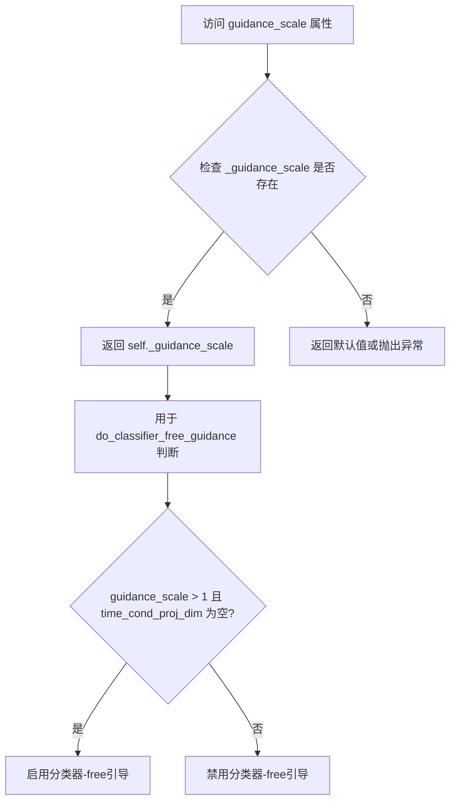

#### 带注释源码

```python
@property
def guidance_scale(self):
    r"""
    属性访问器：获取当前管道的guidance_scale值
    
    guidance_scale控制图像生成时对文本提示的引导强度。
    较高的值会使生成的图像更紧密地与文本提示相关联，
    但可能会牺牲一些图像质量。
    
    该属性通常与 do_classifier_free_guidance 属性配合使用，
    只有当 guidance_scale > 1 时，分类器-free引导才会生效。
    
    返回:
        float: 当前的guidance_scale值
    """
    return self._guidance_scale
```

#### 相关配置说明

在`__call__`方法中，`_guidance_scale`通过以下方式设置：

```python
# 在 __call__ 方法中
self._guidance_scale = guidance_scale  # 默认值为 7.5
```

`guidance_scale`属性与`do_classifier_free_guidance`属性联动：

```python
@property
def do_classifier_free_guidance(self):
    r"""
    判断是否启用分类器-free引导 (CFG)
    
    只有当 guidance_scale > 1 且 unet.config.time_cond_proj_dim 为 None 时
    才会启用 CFG 引导
    """
    return self._guidance_scale > 1 and self.unet.config.time_cond_proj_dim is None
```


### `StableDiffusionPAGPipeline.guidance_rescale`

这是一个属性getter方法，用于获取当前管道的引导重缩放（guidance rescale）参数值。该参数用于根据Section 3.4从论文"Common Diffusion Noise Schedules and Sample Steps are Flawed"来重新缩放噪声预测，以改善图像质量并修复过度曝光问题。

参数： 无（属性访问器不接受参数）

返回值：`float`，返回当前设置的引导重缩放因子，默认为0.0

#### 流程图

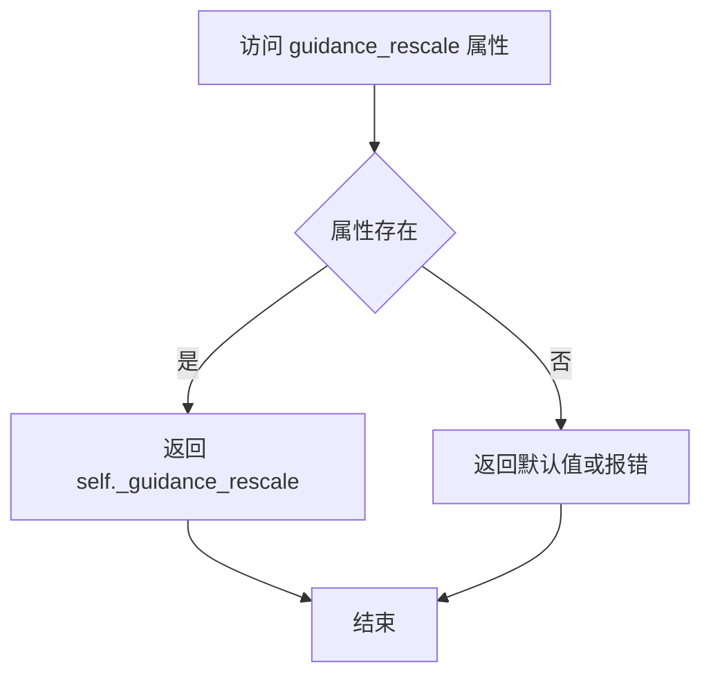

#### 带注释源码

```python
@property
def guidance_rescale(self):
    r"""
    属性 getter: 获取引导重缩放因子
    
    该属性返回在 pipeline __call__ 方法中设置的 _guidance_rescale 值。
    guidance_rescale 参数用于根据 Section 3.4 从论文 
    https://huggingface.co/papers/2305.08891 来重新缩放噪声预测。
    这有助于修复使用零终端SNR时的过度曝光问题。
    
    Returns:
        float: 引导重缩放因子，值越大，图像对比度越高
    """
    return self._guidance_rescale
```


### `StableDiffusionPAGPipeline.clip_skip`

该属性是StableDiffusionPAGPipeline类的一个只读属性，用于获取CLIP文本编码器在计算prompt embeddings时跳过的层数。该值控制是否使用CLIP模型倒数第二层的输出而非最后一层的输出，以调整文本提示的编码方式。

参数：

- （无参数，属性访问器）

返回值：`int | None`，返回CLIP模型中跳过的层数。如果为`None`，则使用CLIP的最后一层输出；如果为整数，则跳过相应数量的层数使用更早的隐藏层。

#### 流程图

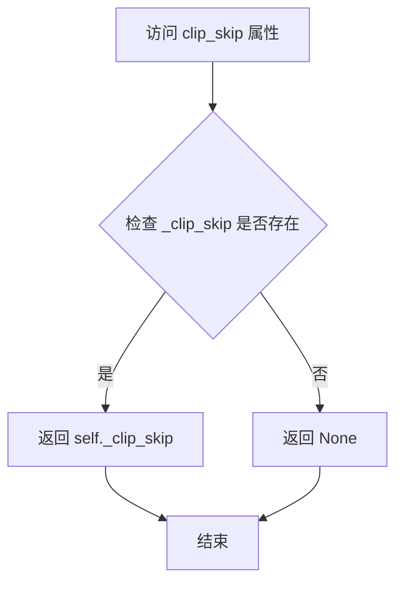

#### 带注释源码

```python
@property
def clip_skip(self):
    """
    获取CLIP文本编码器跳过的层数。
    
    该属性控制CLIP模型在编码文本提示时使用的隐藏层。
    - 当值为 None 时，使用CLIP最后一层的输出
    - 当值为正整数 n 时，跳过最后n层，使用第 -(n+1) 层的输出
    
    Returns:
        int | None: CLIP跳过的层数，用于调整文本编码的深度
    """
    return self._clip_skip
```

#### 关联信息

该属性在以下上下文中使用：

1. **在`__call__`方法中设置**：
   ```python
   self._clip_skip = clip_skip  # 接收用户传入的参数
   ```

2. **在`encode_prompt`方法中使用**：
   ```python
   # 当 clip_skip 不为 None 时，从指定隐藏层获取 prompt embeddings
   if clip_skip is None:
       prompt_embeds = self.text_encoder(text_input_ids.to(device), attention_mask=attention_mask)
       prompt_embeds = prompt_embeds[0]
   else:
       prompt_embeds = self.text_encoder(
           text_input_ids.to(device), attention_mask=attention_mask, output_hidden_states=True
       )
       # 从隐藏状态元组中获取倒数第 (clip_skip + 1) 层
       prompt_embeds = prompt_embeds[-1][-(clip_skip + 1)]
       # 应用最终的 LayerNorm 以确保表示一致性
       prompt_embeds = self.text_encoder.text_model.final_layer_norm(prompt_embeds)
   ```

3. **在`encode_prompt`调用处**：
   ```python
   prompt_embeds, negative_prompt_embeds = self.encode_prompt(
       prompt,
       device,
       num_images_per_prompt,
       self.do_classifier_free_guidance,
       negative_prompt,
       prompt_embeds=prompt_embeds,
       negative_prompt_embeds=negative_prompt_embeds,
       lora_scale=lora_scale,
       clip_skip=self.clip_skip,  # 使用属性获取值
   )
   ```


### `StableDiffusionPAGPipeline.do_classifier_free_guidance`

该属性用于判断当前管道是否应启用无分类器自由引导（Classifier-Free Guidance，CFG）机制。它通过检查引导比例是否大于1以及UNet配置中是否存在时间条件投影维度来做出决定。

参数：

- 无显式参数（隐式参数 `self`：当前管道实例）

返回值：`bool`，返回 `True` 表示启用无分类器自由引导，返回 `False` 表示不启用

#### 流程图

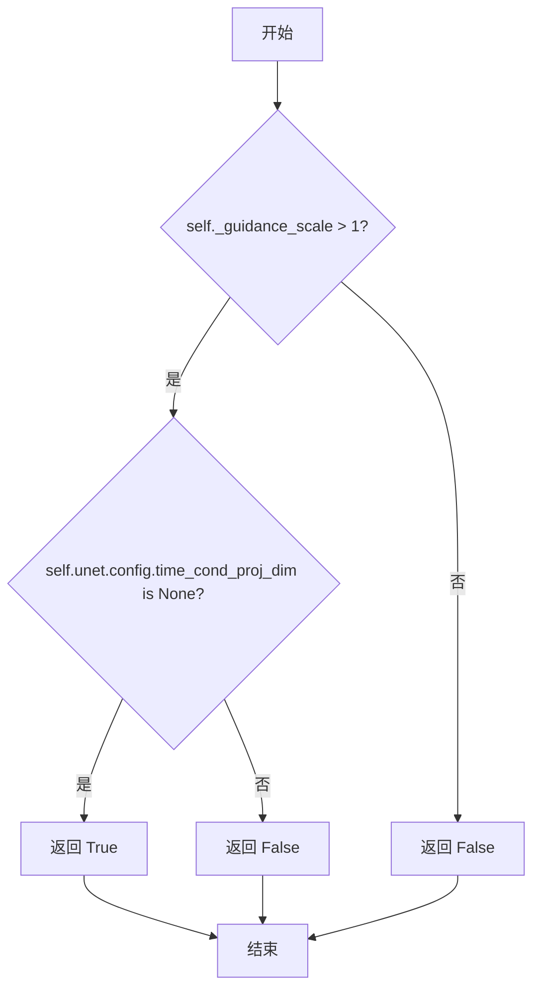

#### 带注释源码

```python
@property
def do_classifier_free_guidance(self):
    """
    属性：判断是否执行无分类器自由引导（Classifier-Free Guidance）

    无分类器自由引导是一种提高文本到图像生成质量的技术，
    通过同时考虑条件（正向）和无条件（负向）噪声预测来引导生成过程。

    返回条件：
    1. guidance_scale > 1：引导比例大于1时才启用CFG
    2. unet.config.time_cond_proj_dim is None：当UNet没有配置时间条件投影维度时启用
       （如果配置了该维度，说明使用了其他条件化技术如Grid conditioning）

    对应Imagen论文中的guidance weight w（方程2）：
    guidance_scale = 1 对应不执行无分类器自由引导
    """
    return self._guidance_scale > 1 and self.unet.config.time_cond_proj_dim is None
```


### `StableDiffusionPAGPipeline.cross_attention_kwargs`

该属性是 `StableDiffusionPAGPipeline` 类的只读属性，用于获取传递给注意力处理器（AttentionProcessor）的关键字参数字典。这些参数用于控制交叉注意力机制的行为，例如 LoRA 权重缩放等。

参数：

- 该属性无显式参数（通过 `self` 隐式访问实例）

返回值：`dict[str, Any] | None`，返回存储在实例中的交叉注意力关键字参数字典。如果未设置，则返回 `None`。该字典通常包含诸如 `"scale"`（LoRA 权重缩放因子）等键值对，用于自定义注意力模块的行为。

#### 流程图

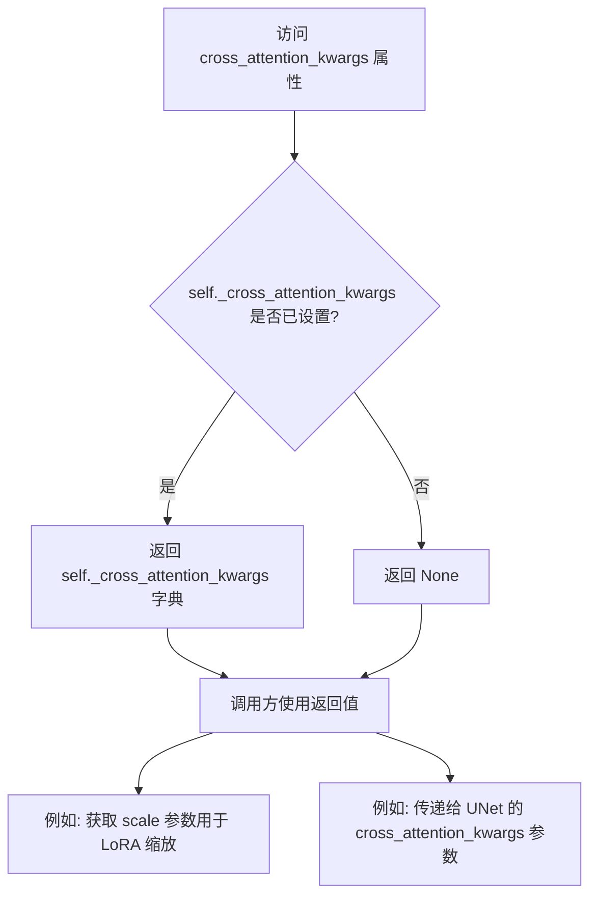

#### 带注释源码

```python
@property
def cross_attention_kwargs(self):
    """
    获取传递给注意力处理器的关键字参数。
    
    该属性返回一个字典，其中包含用于自定义交叉注意力机制的参数。
    常见用途包括：
    - LoRA 权重缩放因子 (通过 "scale" 键)
    - 自定义注意力处理器所需的任何其他参数
    
    Returns:
        dict[str, Any] | None: 交叉注意力关键字参数字典，如果未设置则返回 None。
    """
    return self._cross_attention_kwargs
```


### `StableDiffusionPAGPipeline.num_timesteps`

这是一个只读属性，用于获取扩散模型在推理过程中使用的时间步数量。该属性返回 `_num_timesteps` 的值，该值在管道执行去噪循环时被设置。

参数：
- 无参数（这是一个属性访问器）

返回值：`int`，返回推理过程中使用的时间步总数（即 `timesteps` 列表的长度）。

#### 流程图

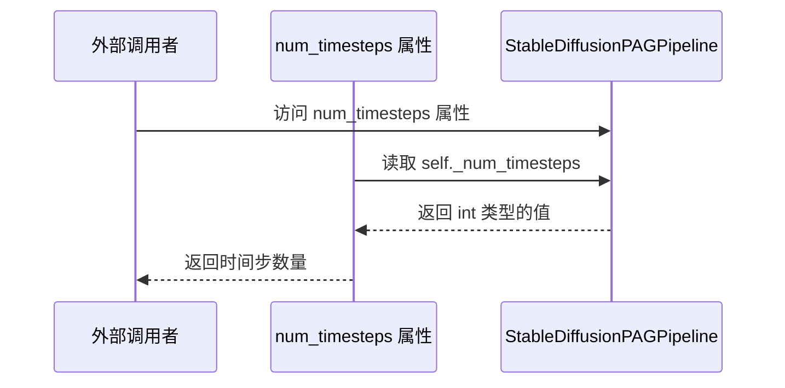

#### 带注释源码

```python
@property
def num_timesteps(self):
    """
    只读属性，返回扩散推理过程中的时间步数量。
    
    该属性在 __call__ 方法的去噪循环开始前被设置：
    self._num_timesteps = len(timesteps)
    
    Returns:
        int: 时间步的数量，通常等于 num_inference_steps（推理步数）
    """
    return self._num_timesteps
```

#### 相关上下文信息

**设置该属性的位置（在 `__call__` 方法中）：**

```python
# 在去噪循环开始前设置时间步数量
# 位置：__call__ 方法的第7步 "Denoising loop" 部分
self._num_timesteps = len(timesteps)
```

**使用场景：**
- 外部可以通过 `pipeline.num_timesteps` 获取当前或上次运行的推理步数
- 常用于进度条显示、性能监控等场景


### `StableDiffusionPAGPipeline.interrupt`

该属性是一个用于控制管道生成流程中断的标志位属性。通过返回内部 `_interrupt` 属性的值，允许外部调用者检查或设置生成过程的中断状态，从而在迭代生成过程中实现动态中断功能。

#### 流程图

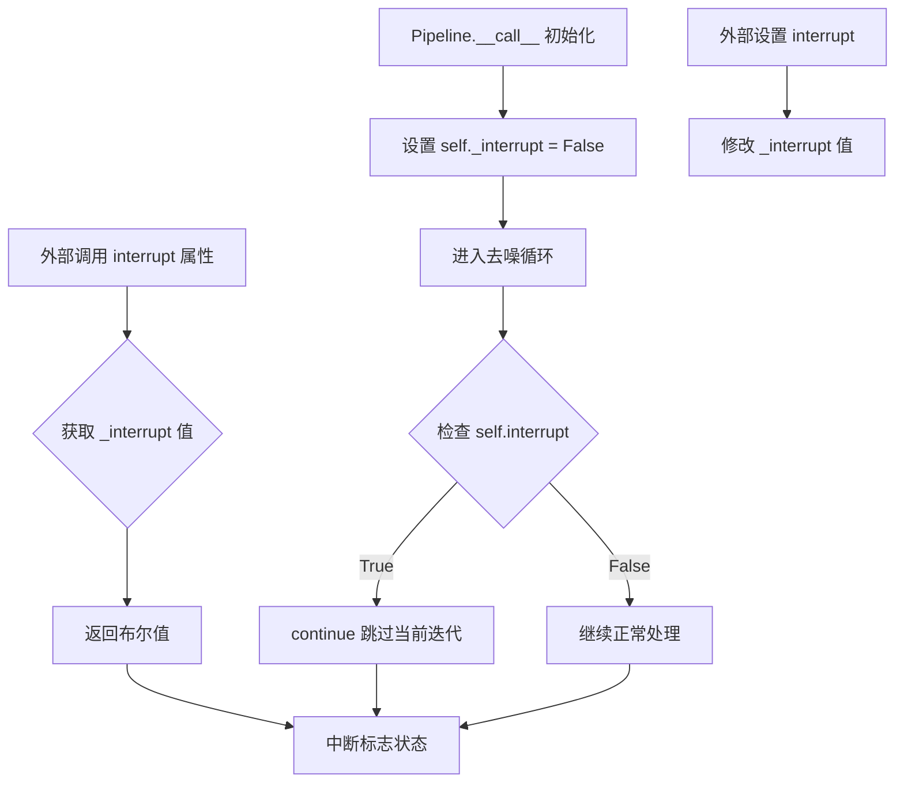

#### 带注释源码

```python
@property
def interrupt(self):
    r"""
    属性用于获取当前的中断标志状态。
    
    该属性返回一个布尔值，表示管道生成过程是否被请求中断。
    在 __call__ 方法的去噪循环中会检查此标志，如果为 True，则跳过当前迭代。
    
    返回:
        bool: 返回 _interrupt 属性的当前值。
              - False (默认): 管道正常运行，不中断
              - True: 管道应中断当前生成过程
    """
    return self._interrupt
```


### `StableDiffusionPAGPipeline.__call__`

这是Stable Diffusion管线的主生成方法，集成了Perturbed Attention Guidance (PAG)技术，用于根据文本提示生成图像。该方法支持条件引导、IP-Adapter、LoRA等高级功能，并包含完整的去噪循环和潜在解码流程。

参数：

- `prompt`：`str | list[str] | None`，用于引导图像生成的文本提示，如未定义需传递`prompt_embeds`
- `height`：`int | None`，生成图像的高度（像素），默认`self.unet.config.sample_size * self.vae_scale_factor`
- `width`：`int | None`，生成图像的宽度（像素），默认`self.unet.config.sample_size * self.vae_scale_factor`
- `num_inference_steps`：`int`，去噪步数，步数越多图像质量越高但推理越慢，默认50
- `timesteps`：`list[int] | None`，使用支持timesteps的调度器时的自定义时间步，必须按降序排列
- `sigmas`：`list[float] | None`，使用支持sigmas的调度器时的自定义sigma值
- `guidance_scale`：`float`，引导尺度值，值越高图像与文本关联越紧密但质量可能降低，默认7.5，当>1时启用分类器自由引导
- `negative_prompt`：`str | list[str] | None`，引导不包含内容的负面提示，如未定义需传递`negative_prompt_embeds`，guidance_scale<1时忽略
- `num_images_per_prompt`：`int | None`，每个提示生成的图像数量，默认1
- `eta`：`float`，DDIM论文中的η参数，仅DDIMScheduler使用，其他调度器忽略，默认0.0
- `generator`：`torch.Generator | list[torch.Generator] | None`，用于生成确定性结果的torch随机生成器
- `latents`：`torch.Tensor | None`，预生成的噪声潜在向量，如不提供则使用随机generator生成
- `prompt_embeds`：`torch.Tensor | None`，预生成的文本嵌入，可用于轻松调整文本输入（如prompt weighting）
- `negative_prompt_embeds`：`torch.Tensor | None`，预生成的负面文本嵌入，如不提供则从`negative_prompt`生成
- `ip_adapter_image`：`PipelineImageInput | None`，可选的图像输入用于IP-Adapter
- `ip_adapter_image_embeds`：`list[torch.Tensor] | None`，IP-Adapter的预生成图像嵌入列表，长度需与IP-Adapter数量一致
- `output_type`：`str | None`，生成图像的输出格式，可选`PIL.Image`或`np.array`，默认`"pil"`
- `return_dict`：`bool`，是否返回`StableDiffusionPipelineOutput`而非元组，默认True
- `cross_attention_kwargs`：`dict[str, Any] | None`，传递给`AttentionProcessor`的kwargs字典
- `guidance_rescale`：`float`，来自Common Diffusion Noise Schedules论文的引导重缩放因子，用于修复过曝，默认0.0
- `clip_skip`：`int | None`，计算prompt嵌入时从CLIP跳过的层数，1表示使用预最终层的输出
- `callback_on_step_end`：`Callable | PipelineCallback | MultiPipelineCallbacks | None`，每个去噪步骤结束时调用的回调函数
- `callback_on_step_end_tensor_inputs`：`list[str]`，传递给回调函数的tensor输入列表，默认`["latents"]`
- `pag_scale`：`float`，扰动注意力引导的缩放因子，设为0.0则不使用PAG，默认3.0
- `pag_adaptive_scale`：`float`，扰动注意力引导的自适应缩放因子，设为0.0时使用`pag_scale`，默认0.0

返回值：`StableDiffusionPipelineOutput`或`tuple`，当`return_dict=True`时返回包含生成图像列表和NSFW检测布尔值列表的输出对象，否则返回元组

#### 流程图

```mermaid
flowchart TD
    A[开始 __call__] --> B[设置默认高度和宽度]
    B --> C{检查输入参数有效性}
    C -->|失败| D[抛出 ValueError]
    C -->|成功| E[设置内部属性 _guidance_scale, _guidance_rescale, _clip_skip等]
    E --> F[确定batch_size]
    F --> G[获取执行设备 device]
    G --> H[从cross_attention_kwargs获取lora_scale]
    H --> I[调用 encode_prompt 编码提示词]
    I --> J{是否使用扰动注意力引导?}
    J -->|是| K[调用 _prepare_perturbed_attention_guidance 准备引导]
    J -->|否| L{是否使用分类器自由引导?}
    K --> M
    L -->|是| M[拼接 negative_prompt_embeds 和 prompt_embeds]
    L -->|否| N[跳过拼接]
    M --> O{存在IP-Adapter图像?}
    O -->|是| P[调用 prepare_ip_adapter_image_embeds 准备图像嵌入]
    O -->|否| Q
    P --> Q
    N --> Q
    Q --> R[调用 retrieve_timesteps 获取时间步]
    R --> S[调用 prepare_latents 准备潜在变量]
    S --> T[调用 prepare_extra_step_kwargs 准备额外参数]
    T --> U{存在IP-Adapter嵌入?}
    U -->|是| V[构建 added_cond_kwargs]
    U -->|否| W
    V --> W
    W --> X{UNet需要时间步条件嵌入?}
    X -->|是| Y[计算 timestep_cond]
    X -->|否| Z
    Y --> Z
    Z --> AA[设置PAG注意力处理器]
    AA --> AB[初始化进度条和去噪循环]
    AB --> AC[遍历每个时间步 t]
    AC --> AD{interrupt 标志?}
    AD -->|是| AE[continue 继续下一轮]
    AD -->|否| AF[扩展latents用于分类器自由引导]
    AF --> AG[scheduler.scale_model_input 缩放输入]
    AG --> AH[UNet预测噪声残差]
    AH --> AI{使用扰动注意力引导?}
    AI -->|是| AJ[调用 _apply_perturbed_attention_guidance]
    AI -->|否| AK{使用分类器自由引导?}
    AJ --> AL
    AK -->|是| AM[分割noise_pred为uncond和text]
    AK -->|否| AN[不使用引导]
    AM --> AO[计算引导后的noise_pred]
    AL --> AP{需要guidance_rescale?}
    AO --> AP
    AN --> AP
    AP -->|是| AQ[调用 rescale_noise_cfg 重缩放]
    AP -->|否| AR
    AQ --> AR
    AR --> AS[scheduler.step 计算上一步的latents]
    AS --> AT{存在 callback_on_step_end?}
    AT -->|是| AU[执行回调函数]
    AT -->|否| AV
    AU --> AW[更新latents和prompt_embeds]
    AW --> AV
    AV --> AX{是否最后一步或需要更新进度条?}
    AX -->|是| AY[progress_bar.update]
    AX -->|否| AZ
    AY --> AZ
    AZ --> BA[遍历下一时间步]
    BA --> AC
    BB[去噪循环结束]
    AC --> BB
    BB --> BC{output_type == 'latent'?}
    BC -->|否| BD[VAE.decode 解码latents为图像]
    BC -->|是| BE[直接使用latents作为图像]
    BD --> BF[run_safety_checker 安全检查]
    BF --> BG
    BE --> BG
    BG =>> BH[postprocess 后处理图像]
    BH =>> BI[maybe_free_model_hooks 卸载模型]
    BI =>> BJ{使用PAG?}
    BJ -->|是| BK[恢复原始注意力处理器]
    BJ -->|否| BL
    BK --> BL
    BL =>> BM{return_dict?}
    BM -->|是| BN[返回 StableDiffusionPipelineOutput]
    BM -->|否| BO[返回 tuple 格式]
```

#### 带注释源码

```python
@torch.no_grad()
@replace_example_docstring(EXAMPLE_DOC_STRING)
def __call__(
    self,
    prompt: str | list[str] = None,
    height: int | None = None,
    width: int | None = None,
    num_inference_steps: int = 50,
    timesteps: list[int] = None,
    sigmas: list[float] = None,
    guidance_scale: float = 7.5,
    negative_prompt: str | list[str] | None = None,
    num_images_per_prompt: int | None = 1,
    eta: float = 0.0,
    generator: torch.Generator | list[torch.Generator] | None = None,
    latents: torch.Tensor | None = None,
    prompt_embeds: torch.Tensor | None = None,
    negative_prompt_embeds: torch.Tensor | None = None,
    ip_adapter_image: PipelineImageInput | None = None,
    ip_adapter_image_embeds: list[torch.Tensor] | None = None,
    output_type: str | None = "pil",
    return_dict: bool = True,
    cross_attention_kwargs: dict[str, Any] | None = None,
    guidance_rescale: float = 0.0,
    clip_skip: int | None = None,
    callback_on_step_end: Callable[[int, int], None] | None = None,
    callback_on_step_end_tensor_inputs: list[str] = ["latents"],
    pag_scale: float = 3.0,
    pag_adaptive_scale: float = 0.0,
):
    r"""
    The call function to the pipeline for generation.

    Args:
        prompt (`str` or `list[str]`, *optional*):
            The prompt or prompts to guide image generation. If not defined, you need to pass `prompt_embeds`.
        height (`int`, *optional*, defaults to `self.unet.config.sample_size * self.vae_scale_factor`):
            The height in pixels of the generated image.
        width (`int`, *optional*, defaults to `self.unet.config.sample_size * self.vae_scale_factor`):
            The width in pixels of the generated image.
        num_inference_steps (`int`, *optional*, defaults to 50):
            The number of denoising steps. More denoising steps usually lead to a higher quality image at the
            expense of slower inference.
        timesteps (`list[int]`, *optional*):
            Custom timesteps to use for the denoising process with schedulers which support a `timesteps` argument
            in their `set_timesteps` method. If not defined, the default behavior when `num_inference_steps` is
            passed will be used. Must be in descending order.
        sigmas (`list[float]`, *optional*):
            Custom sigmas to use for the denoising process with schedulers which support a `sigmas` argument in
            their `set_timesteps` method. If not defined, the default behavior when `num_inference_steps` is passed
            will be used.
        guidance_scale (`float`, *optional*, defaults to 7.5):
            A higher guidance scale value encourages the model to generate images closely linked to the text
            `prompt` at the expense of lower image quality. Guidance scale is enabled when `guidance_scale > 1`.
        negative_prompt (`str` or `list[str]`, *optional*):
            The prompt or prompts to guide what to not include in image generation. If not defined, you need to
            pass `negative_prompt_embeds` instead. Ignored when not using guidance (`guidance_scale < 1`).
        num_images_per_prompt (`int`, *optional*, defaults to 1):
            The number of images to generate per prompt.
        eta (`float`, *optional*, defaults to 0.0):
            Corresponds to parameter eta (η) from the [DDIM](https://huggingface.co/papers/2010.02502) paper. Only
            applies to the [`~schedulers.DDIMScheduler`], and is ignored in other schedulers.
        generator (`torch.Generator` or `list[torch.Generator]`, *optional*):
            A [`torch.Generator`](https://pytorch.org/docs/stable/generated/torch.Generator.html) to make
            generation deterministic.
        latents (`torch.Tensor`, *optional*):
            Pre-generated noisy latents sampled from a Gaussian distribution, to be used as inputs for image
            generation. Can be used to tweak the same generation with different prompts. If not provided, a latents
            tensor is generated by sampling using the supplied random `generator`.
        prompt_embeds (`torch.Tensor`, *optional*):
            Pre-generated text embeddings. Can be used to easily tweak text inputs (prompt weighting). If not
            provided, text embeddings are generated from the `prompt` input argument.
        negative_prompt_embeds (`torch.Tensor`, *optional*):
            Pre-generated negative text embeddings. Can be used to easily tweak text inputs (prompt weighting). If
            not provided, `negative_prompt_embeds` are generated from the `negative_prompt` input argument.
        ip_adapter_image: (`PipelineImageInput`, *optional*): Optional image input to work with IP Adapters.
        ip_adapter_image_embeds (`list[torch.Tensor]`, *optional*):
            Pre-generated image embeddings for IP-Adapter. It should be a list of length same as number of
            IP-adapters. Each element should be a tensor of shape `(batch_size, num_images, emb_dim)`. It should
            contain the negative image embedding if `do_classifier_free_guidance` is set to `True`. If not
            provided, embeddings are computed from the `ip_adapter_image` input argument.
        output_type (`str`, *optional*, defaults to `"pil"`):
            The output format of the generated image. Choose between `PIL.Image` or `np.array`.
        return_dict (`bool`, *optional*, defaults to `True`):
            Whether or not to return a [`~pipelines.stable_diffusion.StableDiffusionPipelineOutput`] instead of a
            plain tuple.
        cross_attention_kwargs (`dict`, *optional*):
            A kwargs dictionary that if specified is passed along to the [`AttentionProcessor`] as defined in
            [`self.processor`](https://github.com/huggingface/diffusers/blob/main/src/diffusers/models/attention_processor.py).
        guidance_rescale (`float`, *optional*, defaults to 0.0):
            Guidance rescale factor from [Common Diffusion Noise Schedules and Sample Steps are
            Flawed](https://huggingface.co/papers/2305.08891). Guidance rescale factor should fix overexposure when
            using zero terminal SNR.
        clip_skip (`int`, *optional*):
            Number of layers to be skipped from CLIP while computing the prompt embeddings. A value of 1 means that
            the output of the pre-final layer will be used for computing the prompt embeddings.
        callback_on_step_end (`Callable`, `PipelineCallback`, `MultiPipelineCallbacks`, *optional*):
            A function or a subclass of `PipelineCallback` or `MultiPipelineCallbacks` that is called at the end of
            each denoising step during the inference. with the following arguments: `callback_on_step_end(self:
            DiffusionPipeline, step: int, timestep: int, callback_kwargs: Dict)`. `callback_kwargs` will include a
            list of all tensors as specified by `callback_on_step_end_tensor_inputs`.
        callback_on_step_end_tensor_inputs (`list`, *optional*):
            The list of tensor inputs for the `callback_on_step_end` function. The tensors specified in the list
            will be passed as `callback_kwargs` argument. You will only be able to include variables listed in the
            `._callback_tensor_inputs` attribute of your pipeline class.
        pag_scale (`float`, *optional*, defaults to 3.0):
            The scale factor for the perturbed attention guidance. If it is set to 0.0, the perturbed attention
            guidance will not be used.
        pag_adaptive_scale (`float`, *optional*, defaults to 0.0):
            The adaptive scale factor for the perturbed attention guidance. If it is set to 0.0, `pag_scale` is
            used.

    Examples:

    Returns:
        [`~pipelines.stable_diffusion.StableDiffusionPipelineOutput`] or `tuple`:
            If `return_dict` is `True`, [`~pipelines.stable_diffusion.StableDiffusionPipelineOutput`] is returned,
            otherwise a `tuple` is returned where the first element is a list with the generated images and the
            second element is a list of `bool`s indicating whether the corresponding generated image contains
            "not-safe-for-work" (nsfw) content.
    """

    # 0. Default height and width to unet
    # 如果未指定height和width，则使用UNet配置中的sample_size乘以VAE缩放因子作为默认值
    height = height or self.unet.config.sample_size * self.vae_scale_factor
    width = width or self.unet.config.sample_size * self.vae_scale_factor
    # to deal with lora scaling and other possible forward hooks

    # 1. Check inputs. Raise error if not correct
    # 检查输入参数的有效性，包括height/width是否能被8整除、callback_steps是否为正整数等
    self.check_inputs(
        prompt,
        height,
        width,
        None,
        negative_prompt,
        prompt_embeds,
        negative_prompt_embeds,
        ip_adapter_image,
        ip_adapter_image_embeds,
        callback_on_step_end_tensor_inputs,
    )

    # 2. 保存引导参数到实例属性，供后续属性方法使用
    self._guidance_scale = guidance_scale
    self._guidance_rescale = guidance_rescale
    self._clip_skip = clip_skip
    self._cross_attention_kwargs = cross_attention_kwargs
    self._interrupt = False  # 中断标志，用于提前停止去噪循环
    self._pag_scale = pag_scale  # PAG缩放因子
    self._pag_adaptive_scale = pag_adaptive_scale  # PAG自适应缩放因子

    # 2. Define call parameters
    # 根据prompt或prompt_embeds确定batch_size
    if prompt is not None and isinstance(prompt, str):
        batch_size = 1
    elif prompt is not None and isinstance(prompt, list):
        batch_size = len(prompt)
    else:
        batch_size = prompt_embeds.shape[0]

    # 获取执行设备（可能是CPU、CUDA等）
    device = self._execution_device

    # 3. Encode input prompt
    # 从cross_attention_kwargs中提取LoRA缩放因子
    lora_scale = (
        self.cross_attention_kwargs.get("scale", None) if self.cross_attention_kwargs is not None else None
    )

    # 调用encode_prompt方法将文本prompt编码为文本嵌入
    prompt_embeds, negative_prompt_embeds = self.encode_prompt(
        prompt,
        device,
        num_images_per_prompt,
        self.do_classifier_free_guidance,
        negative_prompt,
        prompt_embeds=prompt_embeds,
        negative_prompt_embeds=negative_prompt_embeds,
        lora_scale=lora_scale,
        clip_skip=self.clip_skip,
    )

    # For classifier free guidance, we need to do two forward passes.
    # Here we concatenate the unconditional and text embeddings into a single batch
    # to avoid doing two forward passes
    # 如果启用PAG（Perturbed Attention Guidance），则准备扰动注意力引导
    if self.do_perturbed_attention_guidance:
        prompt_embeds = self._prepare_perturbed_attention_guidance(
            prompt_embeds, negative_prompt_embeds, self.do_classifier_free_guidance
        )
    # 如果仅启用分类器自由引导（非PAG），则拼接无条件嵌入和条件嵌入
    elif self.do_classifier_free_guidance:
        prompt_embeds = torch.cat([negative_prompt_embeds, prompt_embeds])

    # 处理IP-Adapter图像嵌入
    if ip_adapter_image is not None or ip_adapter_image_embeds is not None:
        ip_adapter_image_embeds = self.prepare_ip_adapter_image_embeds(
            ip_adapter_image,
            ip_adapter_image_embeds,
            device,
            batch_size * num_images_per_prompt,
            self.do_classifier_free_guidance,
        )

        for i, image_embeds in enumerate(ip_adapter_image_embeds):
            negative_image_embeds = None
            if self.do_classifier_free_guidance:
                # 分割图像嵌入为负面和条件两部分
                negative_image_embeds, image_embeds = image_embeds.chunk(2)
            if self.do_perturbed_attention_guidance:
                # 为IP-Adapter也应用PAG
                image_embeds = self._prepare_perturbed_attention_guidance(
                    image_embeds, negative_image_embeds, self.do_classifier_free_guidance
                )

            elif self.do_classifier_free_guidance:
                image_embeds = torch.cat([negative_image_embeds, image_embeds], dim=0)
            image_embeds = image_embeds.to(device)
            ip_adapter_image_embeds[i] = image_embeds

    # 4. Prepare timesteps
    # 根据是否使用XLA选择时间步设备，然后获取调度器的时间步
    if XLA_AVAILABLE:
        timestep_device = "cpu"
    else:
        timestep_device = device
    timesteps, num_inference_steps = retrieve_timesteps(
        self.scheduler, num_inference_steps, timestep_device, timesteps, sigmas
    )

    # 5. Prepare latent variables
    # 准备初始潜在变量（噪声）
    num_channels_latents = self.unet.config.in_channels
    latents = self.prepare_latents(
        batch_size * num_images_per_prompt,
        num_channels_latents,
        height,
        width,
        prompt_embeds.dtype,
        device,
        generator,
        latents,
    )

    # 6. Prepare extra step kwargs. TODO: Logic should ideally just be moved out of the pipeline
    # 准备调度器步骤的额外参数（如eta和generator）
    extra_step_kwargs = self.prepare_extra_step_kwargs(generator, eta)

    # 6.1 Add image embeds for IP-Adapter
    # 如果使用IP-Adapter，添加图像嵌入到条件参数中
    added_cond_kwargs = (
        {"image_embeds": ip_adapter_image_embeds}
        if (ip_adapter_image is not None or ip_adapter_image_embeds is not None)
        else None
    )

    # 6.2 Optionally get Guidance Scale Embedding
    # 如果UNet配置了time_cond_proj_dim，则计算引导尺度嵌入用于时间步条件
    timestep_cond = None
    if self.unet.config.time_cond_proj_dim is not None:
        guidance_scale_tensor = torch.tensor(self.guidance_scale - 1).repeat(batch_size * num_images_per_prompt)
        timestep_cond = self.get_guidance_scale_embedding(
            guidance_scale_tensor, embedding_dim=self.unet.config.time_cond_proj_dim
        ).to(device=device, dtype=latents.dtype)

    # 7. Denoising loop
    # 计算预热步数（用于进度条显示）
    num_warmup_steps = len(timesteps) - num_inference_steps * self.scheduler.order
    # 如果使用PAG，设置PAG注意力处理器
    if self.do_perturbed_attention_guidance:
        original_attn_proc = self.unet.attn_processors  # 保存原始注意力处理器
        self._set_pag_attn_processor(
            pag_applied_layers=self.pag_applied_layers,
            do_classifier_free_guidance=self.do_classifier_free_guidance,
        )
    self._num_timesteps = len(timesteps)
    # 开始进度条和去噪循环
    with self.progress_bar(total=num_inference_steps) as progress_bar:
        for i, t in enumerate(timesteps):
            # 检查中断标志，允许外部代码提前停止生成
            if self.interrupt:
                continue

            # expand the latents if we are doing classifier free guidance
            # 扩展latents以匹配分类器自由引导的batch大小
            latent_model_input = torch.cat([latents] * (prompt_embeds.shape[0] // latents.shape[0]))
            # 调度器缩放输入（根据当前时间步调整噪声水平）
            latent_model_input = self.scheduler.scale_model_input(latent_model_input, t)

            # predict the noise residual
            # 使用UNet预测噪声残差
            noise_pred = self.unet(
                latent_model_input,
                t,
                encoder_hidden_states=prompt_embeds,
                timestep_cond=timestep_cond,
                cross_attention_kwargs=self.cross_attention_kwargs,
                added_cond_kwargs=added_cond_kwargs,
                return_dict=False,
            )[0]

            # perform guidance
            # 根据是否使用PAG或分类器自由引导执行引导
            if self.do_perturbed_attention_guidance:
                noise_pred, noise_pred_text = self._apply_perturbed_attention_guidance(
                    noise_pred, self.do_classifier_free_guidance, self.guidance_scale, t, True
                )

            elif self.do_classifier_free_guidance:
                # 分离无条件预测和文本条件预测
                noise_pred_uncond, noise_pred_text = noise_pred.chunk(2)
                # 应用分类器自由引导
                noise_pred = noise_pred_uncond + self.guidance_scale * (noise_pred_text - noise_pred_uncond)

            # 如果设置了guidance_rescale，应用噪声重缩放以修复过曝
            if self.do_classifier_free_guidance and self.guidance_rescale > 0.0:
                # Based on 3.4. in https://huggingface.co/papers/2305.08891
                noise_pred = rescale_noise_cfg(noise_pred, noise_pred_text, guidance_rescale=self.guidance_rescale)

            # compute the previous noisy sample x_t -> x_t-1
            # 使用调度器根据预测的噪声计算上一步的latents
            latents = self.scheduler.step(noise_pred, t, latents, **extra_step_kwargs, return_dict=False)[0]

            # 如果提供了回调函数，在每步结束时调用
            if callback_on_step_end is not None:
                callback_kwargs = {}
                for k in callback_on_step_end_tensor_inputs:
                    callback_kwargs[k] = locals()[k]
                callback_outputs = callback_on_step_end(self, i, t, callback_kwargs)

                # 允许回调修改latents和embeddings
                latents = callback_outputs.pop("latents", latents)
                prompt_embeds = callback_outputs.pop("prompt_embeds", prompt_embeds)
                negative_prompt_embeds = callback_outputs.pop("negative_prompt_embeds", negative_prompt_embeds)

            # call the callback, if provided
            # 更新进度条（最后一步或预热步之后按调度器order更新）
            if i == len(timesteps) - 1 or ((i + 1) > num_warmup_steps and (i + 1) % self.scheduler.order == 0):
                progress_bar.update()

            # XLA支持：标记计算步骤
            if XLA_AVAILABLE:
                xm.mark_step()

    # 去噪循环结束，解码latents为图像
    if not output_type == "latent":
        # 使用VAE解码latents到图像空间
        image = self.vae.decode(latents / self.vae.config.scaling_factor, return_dict=False, generator=generator)[
            0
        ]
        # 运行安全检查器检测NSFW内容
        image, has_nsfw_concept = self.run_safety_checker(image, device, prompt_embeds.dtype)
    else:
        # 如果output_type是latent，直接返回latents
        image = latents
        has_nsfw_concept = None

    # 准备去归一化标志
    if has_nsfw_concept is None:
        do_denormalize = [True] * image.shape[0]
    else:
        do_denormalize = [not has_nsfw for has_nsfw in has_nsfw_concept]

    # 后处理图像（转换格式、去归一化等）
    image = self.image_processor.postprocess(image, output_type=output_type, do_denormalize=do_denormalize)

    # Offload all models
    # 卸载所有模型以释放内存
    self.maybe_free_model_hooks()

    # 如果使用了PAG，恢复原始注意力处理器
    if self.do_perturbed_attention_guidance:
        self.unet.set_attn_processor(original_attn_proc)

    # 返回结果
    if not return_dict:
        return (image, has_nsfw_concept)

    return StableDiffusionPipelineOutput(images=image, nsfw_content_detected=has_nsfw_concept)
```

## 关键组件


### StableDiffusionPAGPipeline

Stable Diffusion文本到图像生成管道，支持扰动注意力引导（PAG）技术，通过在去噪过程中引入扰动注意力机制来提升图像质量，同时保持与标准Stable Diffusion管道的兼容性。

### 张量索引与批处理

在encode_prompt方法中实现，支持批量提示词处理和分类器自由引导（CFG）的无条件嵌入复制，使用view和repeat操作实现MPS友好的批处理扩展。

### 惰性加载与模块化设计

通过DiffusionPipeline和多个Mixin类（TextualInversionLoaderMixin、StableDiffusionLoraLoaderMixin、IPAdapterMixin、FromSingleFileMixin）实现模块化加载，按需加载文本反转嵌入、LoRA权重和IP适配器。

### 反量化支持

VAE解码时使用scaling_factor（self.vae.config.scaling_factor）对潜在变量进行反量化，将潜在空间转换回像素空间进行图像生成。

### 量化策略

管道支持多种精度模式（float32、float16等），在encode_prompt中自动推断并转换prompt_embeds的dtype以匹配text_encoder或unet的精度。

### PAGMixin集成

集成PAGMixin提供扰动注意力引导功能，通过_set_pag_attn_processor和_apply_perturbed_attention_guidance方法在去噪循环中应用PAG，显著提升生成图像的细节和质量。

### IP-Adapter支持

完整的IP-Adapter图像提示集成，包括encode_image、prepare_ip_adapter_image_embeds方法，支持图像条件和分类器自由引导的组合。

### 安全检查机制

StableDiffusionSafetyChecker集成，在图像生成后进行NSFW内容检测，使用CLIPImageProcessor提取特征并过滤潜在有害内容。

### 时间步调度

retrieve_timesteps函数支持自定义时间步和sigma调度，兼容多种DiffusionScheduler实现，提供灵活的去噪策略配置。

### LoRA支持

通过StableDiffusionLoraLoaderMixin集成LoRA权重加载和调整，支持PEFT后端和传统LoRA scale调整机制。


## 问题及建议


### 已知问题

- **参数验证不完整**: `check_inputs` 方法未对 `pag_scale` 和 `pag_adaptive_scale` 参数进行验证，这两个参数直接影响生成质量
- **方法重复代码过多**: `encode_prompt`、`encode_image`、`prepare_ip_adapter_image_embeds` 等方法从其他 Pipeline 复制而来，导致代码冗余且维护困难
- **调度器配置检查逻辑重复**: 在 `__init__` 中对 `scheduler.config` 的 `steps_offset` 和 `clip_sample` 进行检查和修改，这种运行时配置修正模式容易导致潜在的一致性问题
- **条件分支复杂**: `__call__` 方法中包含大量嵌套的条件判断（如 `do_perturbed_attention_guidance` 和 `do_classifier_free_guidance` 的组合），可读性和可维护性较差
- **缺乏类型提示的一致性**: 部分方法参数使用 `|` 联合类型（如 `str | list[str]`），部分使用 `Optional` 类型，风格不统一
- **XLA 设备处理特殊**: 存在 `XLA_AVAILABLE` 的特殊分支处理，可能导致在 TPU 环境下行为不一致

### 优化建议

- **重构参数验证**: 在 `check_inputs` 中添加对 `pag_scale >= 0` 和 `pag_adaptive_scale >= 0` 的验证
- **提取公共逻辑**: 将重复的编码方法提取到基类或 Mixin 中，通过组合模式减少代码冗余
- **简化条件分支**: 使用策略模式或提前返回的方式减少 `__call__` 方法中的嵌套层级
- **统一类型提示风格**: 全面使用 Python 3.10+ 的联合类型语法 `|` 或统一使用 `typing.Optional`
- **增强错误信息**: 为配置检查失败提供更具体的修复建议和日志记录
- **考虑添加缓存机制**: 对 `prompt_embeds` 和 `negative_prompt_embeds` 进行缓存，避免重复编码

## 其它


### 设计目标与约束

本Pipeline的设计目标是实现基于Stable Diffusion的文本到图像生成能力，并集成Perturbed Attention Guidance (PAG)技术以提升图像质量。核心约束包括：支持标准的Stable Diffusion模型加载与推理、兼容LoRA、Textual Inversion、IP Adapter等微调技术、遵循Hugging Face diffusers库的架构规范、支持CPU/GPU/XLA设备部署、确保图像生成的安全性与合规性（通过Safety Checker）。

### 错误处理与异常设计

Pipeline在多个关键节点实现了完整的错误检查与异常处理机制。在输入验证方面，`check_inputs`方法检查height/width必须能被8整除、callback_steps必须为正整数、prompt与prompt_embeds不能同时提供、负向提示与嵌入的形状必须匹配、IP Adapter相关参数互斥等。在调度器兼容性方面，`retrieve_timesteps`函数验证调度器是否支持自定义timesteps或sigmas。模型加载时进行版本检查（如UNet版本、sample_size检查）。对于可选组件如safety_checker，提供了适当的警告和默认值处理。整体采用异常抛出与警告日志相结合的策略，确保问题可追溯同时不影响正常流程。

### 数据流与状态机

Pipeline的核心数据流遵循以下状态机：初始化状态（模型加载、配置验证）→ 输入预处理状态（prompt编码、latents准备）→ 推理循环状态（denoising step迭代）→ 后处理状态（VAE解码、safety检查、图像后处理）→ 完成状态（结果返回）。在推理循环中，每个step的状态转换包括：latent扩展 → 模型输入缩放 → 噪声预测 → 指导应用（CFG/PAG）→ 噪声调度步骤 → 回调处理 → 进度更新。对于PAG流程，额外涉及注意力处理器替换、条件 embeddings 准备等状态切换。

### 外部依赖与接口契约

本Pipeline依赖以下核心外部组件：PyTorch（张量计算与神经网络）、transformers库（CLIPTextModel、CLIPTokenizer、CLIPImageProcessor、CLIPVisionModelWithProjection）、diffusers核心模块（DiffusionPipeline、SchedulerMixin、VariousMixin类）、packaging库（版本解析）。接口契约方面：主入口`__call__`方法接受标准扩散模型参数（prompt、height、width、num_inference_steps等）以及PAG特定参数（pag_scale、pag_adaptive_scale）；返回StableDiffusionPipelineOutput或tuple格式；所有模型组件通过`register_modules`注册，支持动态替换；调度器需实现set_timesteps和step方法；LoRA/Textual Inversion等通过Mixin方法实现加载/保存。

### 配置管理与模型版本兼容性

Pipeline实现了完善的配置管理机制，包括：使用FrozenDict确保配置不可变、版本兼容性检查（UNet版本、sample_size、scheduler配置）、配置默认值自动修正（steps_offset、clip_sample）。模型版本兼容性方面，针对旧版本checkpoint（<0.9.0）自动调整sample_size至64，针对不同scheduler配置进行警告和自动修复。这种设计确保了Pipeline对不同来源和版本的Stable Diffusion模型的良好兼容性。

### 性能优化与资源管理

Pipeline实现了多种性能优化策略：模型CPU卸载序列定义（model_cpu_offload_seq）、可选组件懒加载（safety_checker、feature_extractor、image_encoder）、XLA设备支持（torch_xla）、进度条显示（progress_bar）、generator确定性生成支持。在内存管理方面，通过maybe_free_model_hooks在推理完成后释放模型权重，PAG处理时保存和恢复原始注意力处理器。性能相关参数包括：num_images_per_prompt（批量生成）、latents预填充（避免重复采样）、scheduler.init_noise_sigma缩放等。

### 安全性与合规性

安全性设计涵盖多个层面：图像安全检查（StableDiffusionSafetyChecker）、NSFW内容检测与标记、safety_checker依赖检查与警告机制、可配置的requires_safety_checker参数。合规性方面：代码遵循Apache License 2.0、包含完整的版权头注释、模型卡片引用与许可证提示。Pipeline在检测到潜在不当内容时会设置nsfw_content_detected标志，用户可通过return_dict参数控制返回格式。
</think>
    