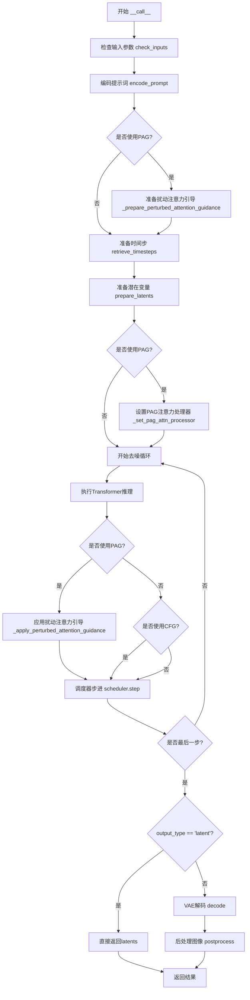
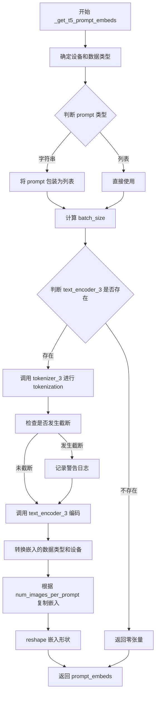
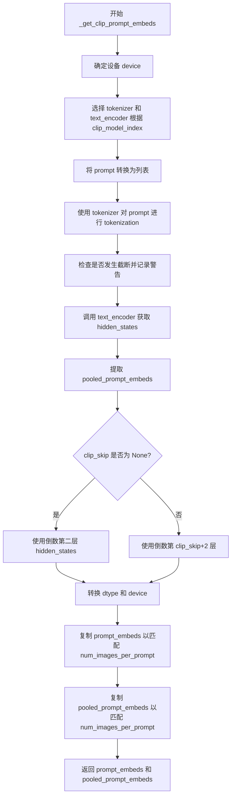
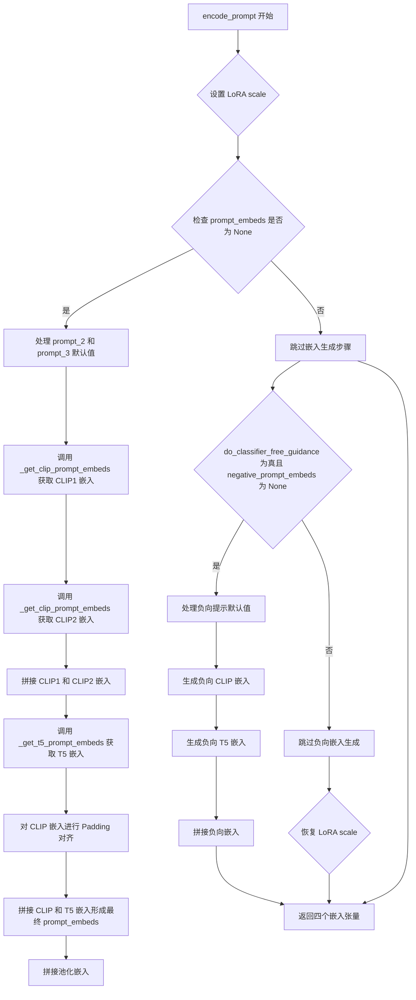
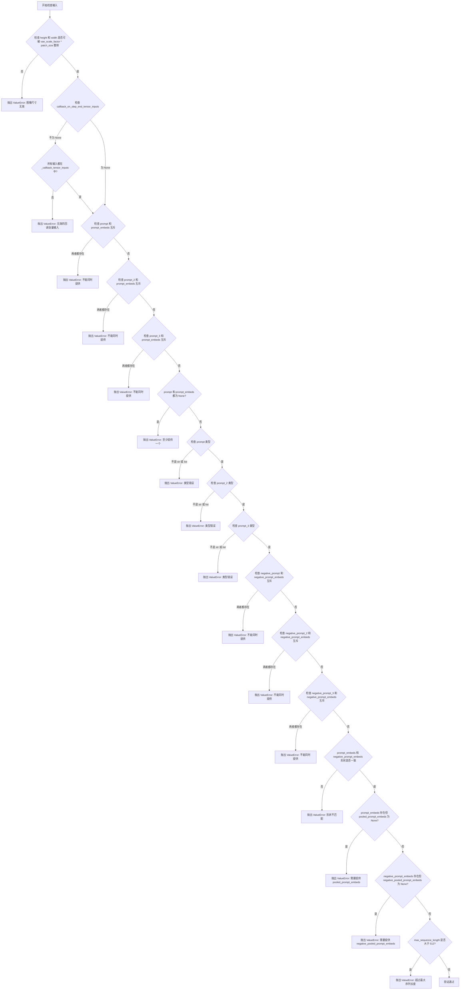
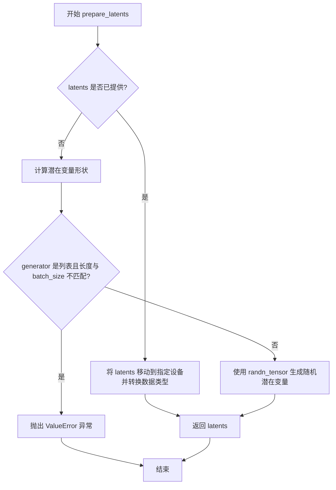
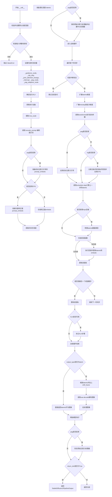

# `diffusers\src\diffusers\pipelines\pag\pipeline_pag_sd_3.py` 详细设计文档

这是 Stable Diffusion 3 的 PAG（Perturbed Attention Guidance）Pipeline 实现，用于文本到图像生成。该 Pipeline 结合了多个文本编码器（CLIP 和 T5）和 SD3Transformer 模型，支持通过扰动注意力机制来增强图像生成的质量和多样性。

## 整体流程



## 类结构

```
DiffusionPipeline (抽象基类)
├── StableDiffusion3PAGPipeline (主类)
│   ├── 继承: SD3LoraLoaderMixin
│   ├── 继承: FromSingleFileMixin
│   └── 继承: PAGMixin
```

## 全局变量及字段


### `XLA_AVAILABLE`
    
标识是否安装了PyTorch XLA库以支持TPU/XLA设备

类型：`bool`
    


### `logger`
    
用于记录代码执行过程中的日志信息

类型：`Logger`
    


### `EXAMPLE_DOC_STRING`
    
包含Pipeline使用示例的文档字符串

类型：`str`
    


### `model_cpu_offload_seq`
    
定义模型组件CPU卸载顺序的字符串

类型：`str`
    


### `_optional_components`
    
Pipeline的可选组件列表

类型：`list`
    


### `_callback_tensor_inputs`
    
回调函数可用的张量输入名称列表

类型：`list`
    


### `StableDiffusion3PAGPipeline.vae`
    
变分自编码器模型，用于图像与潜在表示之间的编码和解码

类型：`AutoencoderKL`
    


### `StableDiffusion3PAGPipeline.text_encoder`
    
第一个CLIP文本编码器，将文本转换为嵌入向量

类型：`CLIPTextModelWithProjection`
    


### `StableDiffusion3PAGPipeline.text_encoder_2`
    
第二个CLIP文本编码器，提供额外的文本嵌入

类型：`CLIPTextModelWithProjection`
    


### `StableDiffusion3PAGPipeline.text_encoder_3`
    
T5文本编码器，用于生成更长的文本嵌入

类型：`T5EncoderModel`
    


### `StableDiffusion3PAGPipeline.tokenizer`
    
第一个分词器，用于将文本转换为token IDs

类型：`CLIPTokenizer`
    


### `StableDiffusion3PAGPipeline.tokenizer_2`
    
第二个分词器，配合第二个文本编码器使用

类型：`CLIPTokenizer`
    


### `StableDiffusion3PAGPipeline.tokenizer_3`
    
T5快速分词器，用于T5文本编码器

类型：`T5TokenizerFast`
    


### `StableDiffusion3PAGPipeline.transformer`
    
主Transformer模型，负责去噪潜在表示

类型：`SD3Transformer2DModel`
    


### `StableDiffusion3PAGPipeline.scheduler`
    
调度器，控制去噪过程中的时间步

类型：`FlowMatchEulerDiscreteScheduler`
    


### `StableDiffusion3PAGPipeline.vae_scale_factor`
    
VAE缩放因子，用于计算潜在空间的尺寸

类型：`int`
    


### `StableDiffusion3PAGPipeline.image_processor`
    
图像处理器，用于VAE解码后的图像后处理

类型：`VaeImageProcessor`
    


### `StableDiffusion3PAGPipeline.tokenizer_max_length`
    
分词器的最大序列长度

类型：`int`
    


### `StableDiffusion3PAGPipeline.default_sample_size`
    
默认的采样尺寸，决定生成图像的基础分辨率

类型：`int`
    


### `StableDiffusion3PAGPipeline.patch_size`
    
Transformer的patch大小，用于图像分块处理

类型：`int`
    


### `StableDiffusion3PAGPipeline._guidance_scale`
    
分类器自由引导比例，控制文本条件的影响程度

类型：`float`
    


### `StableDiffusion3PAGPipeline._clip_skip`
    
CLIP跳过的层数，用于控制嵌入的层选择

类型：`int`
    


### `StableDiffusion3PAGPipeline._joint_attention_kwargs`
    
联合注意力机制的额外参数

类型：`dict`
    


### `StableDiffusion3PAGPipeline._num_timesteps`
    
去噪过程的时间步总数

类型：`int`
    


### `StableDiffusion3PAGPipeline._interrupt`
    
中断标志，用于控制生成过程的提前终止

类型：`bool`
    


### `StableDiffusion3PAGPipeline._pag_scale`
    
扰动注意力引导的缩放因子

类型：`float`
    


### `StableDiffusion3PAGPipeline._pag_adaptive_scale`
    
扰动注意力引导的自适应缩放因子

类型：`float`
    
    

## 全局函数及方法


### `retrieve_timesteps`

该函数是 Stable Diffusion 3 PAG Pipeline 中的时间步检索工具函数，用于调用调度器的 `set_timesteps` 方法并从中获取时间步调度。它支持自定义时间步（timesteps）或自定义噪声强度（sigmas），同时处理各种调度器的兼容性检查，并将设备参数正确传递给调度器。

参数：

- `scheduler`：`SchedulerMixin`，要获取时间步的调度器对象
- `num_inference_steps`：`int | None`，生成样本时使用的扩散步数，若使用此参数则 `timesteps` 必须为 `None`
- `device`：`str | torch.device | None`，时间步要移动到的设备，若为 `None` 则不移动
- `timesteps`：`list[int] | None`，用于覆盖调度器时间步间隔策略的自定义时间步，若传递此参数则 `num_inference_steps` 和 `sigmas` 必须为 `None`
- `sigmas`：`list[float] | None`，用于覆盖调度器时间步间隔策略的自定义噪声强度，若传递此参数则 `num_inference_steps` 和 `timesteps` 必须为 `None`
- `**kwargs`：任意关键字参数，将提供给 `scheduler.set_timesteps`

返回值：`tuple[torch.Tensor, int]`，元组包含调度器的时间步调度张量以及推理步数

#### 流程图

```mermaid
flowchart TD
    A[开始] --> B{检查timesteps和sigmas同时存在?}
    B -->|是| C[抛出ValueError:只能指定timesteps或sigmas之一]
    B -->|否| D{检查timesteps是否存在?}
    D -->|是| E[检查scheduler.set_timesteps是否接受timesteps参数]
    E -->|不接受| F[抛出ValueError:当前调度器不支持自定义timesteps]
    E -->|接受| G[调用scheduler.set_timesteps<br/>timesteps=timesteps, device=device]
    G --> H[获取scheduler.timesteps]
    H --> I[计算num_inference_steps = len(timesteps)]
    D -->|否| J{检查sigmas是否存在?}
    J -->|是| K[检查scheduler.set_timesteps是否接受sigmas参数]
    K -->|不接受| L[抛出ValueError:当前调度器不支持自定义sigmas]
    K -->|接受| M[调用scheduler.set_timesteps<br/>sigmas=sigmas, device=device]
    M --> N[获取scheduler.timesteps]
    N --> O[计算num_inference_steps = len(timesteps)]
    J -->|否| P[调用scheduler.set_timesteps<br/>num_inference_steps, device=device]
    P --> Q[获取scheduler.timesteps]
    Q --> R[返回timesteps和num_inference_steps]
    I --> R
    O --> R
```

#### 带注释源码

```python
def retrieve_timesteps(
    scheduler,
    num_inference_steps: int | None = None,
    device: str | torch.device | None = None,
    timesteps: list[int] | None = None,
    sigmas: list[float] | None = None,
    **kwargs,
):
    r"""
    Calls the scheduler's `set_timesteps` method and retrieves timesteps from the scheduler after the call. Handles
    custom timesteps. Any kwargs will be supplied to `scheduler.set_timesteps`.

    Args:
        scheduler (`SchedulerMixin`):
            The scheduler to get timesteps from.
        num_inference_steps (`int`):
            The number of diffusion steps used when generating samples with a pre-trained model. If used, `timesteps`
            must be `None`.
        device (`str` or `torch.device`, *optional*):
            The device to which the timesteps should be moved to. If `None`, the timesteps are not moved.
        timesteps (`list[int]`, *optional*):
            Custom timesteps used to override the timestep spacing strategy of the scheduler. If `timesteps` is passed,
            `num_inference_steps` and `sigmas` must be `None`.
        sigmas (`list[float]`, *optional*):
            Custom sigmas used to override the timestep spacing strategy of the scheduler. If `sigmas` is passed,
            `num_inference_steps` and `timesteps` must be `None`.

    Returns:
        `tuple[torch.Tensor, int]`: A tuple where the first element is the timestep schedule from the scheduler and the
        second element is the number of inference steps.
    """
    # 检查是否同时传入了timesteps和sigmas，这是不允许的，只能选择其中一种方式自定义
    if timesteps is not None and sigmas is not None:
        raise ValueError("Only one of `timesteps` or `sigmas` can be passed. Please choose one to set custom values")
    
    # 处理自定义timesteps的情况
    if timesteps is not None:
        # 通过inspect检查调度器的set_timesteps方法是否支持timesteps参数
        accepts_timesteps = "timesteps" in set(inspect.signature(scheduler.set_timesteps).parameters.keys())
        if not accepts_timesteps:
            raise ValueError(
                f"The current scheduler class {scheduler.__class__}'s `set_timesteps` does not support custom"
                f" timestep schedules. Please check whether you are using the correct scheduler."
            )
        # 调用调度器的set_timesteps方法设置自定义时间步
        scheduler.set_timesteps(timesteps=timesteps, device=device, **kwargs)
        # 从调度器获取设置后的时间步
        timesteps = scheduler.timesteps
        # 计算推理步数
        num_inference_steps = len(timesteps)
    # 处理自定义sigmas的情况
    elif sigmas is not None:
        # 通过inspect检查调度器的set_timesteps方法是否支持sigmas参数
        accept_sigmas = "sigmas" in set(inspect.signature(scheduler.set_timesteps).parameters.keys())
        if not accept_sigmas:
            raise ValueError(
                f"The current scheduler class {scheduler.__class__}'s `set_timesteps` does not support custom"
                f" sigmas schedules. Please check whether you are using the correct scheduler."
            )
        # 调用调度器的set_timesteps方法设置自定义sigmas
        scheduler.set_timesteps(sigmas=sigmas, device=device, **kwargs)
        # 从调度器获取设置后的时间步
        timesteps = scheduler.timesteps
        # 计算推理步数
        num_inference_steps = len(timesteps)
    # 处理默认情况：使用num_inference_steps设置时间步
    else:
        scheduler.set_timesteps(num_inference_steps, device=device, **kwargs)
        timesteps = scheduler.timesteps
    
    # 返回时间步张量和推理步数
    return timesteps, num_inference_steps
```


### `StableDiffusion3PAGPipeline.__init__`

该方法是 `StableDiffusion3PAGPipeline` 类的构造函数，负责初始化整个图像生成Pipeline。它接收所有必要的模型组件（Transformer、VAE、多个文本编码器和分词器）以及PAG配置，通过注册模块、计算图像处理参数和设置PAG注意力处理器来完成Pipeline的初始化。

#### 参数

- **transformer**：`SD3Transformer2DModel`，条件Transformer (MMDiT) 架构，用于对编码的图像潜在表示进行去噪
- **scheduler**：`FlowMatchEulerDiscreteScheduler`，与transformer结合使用以对编码的图像潜在表示进行去噪的调度器
- **vae**：`AutoencoderKL`，变分自编码器模型，用于在潜在表示之间编码和解码图像
- **text_encoder**：`CLIPTextModelWithProjection`，CLIP文本编码器（带投影层）
- **tokenizer**：`CLIPTokenizer`，CLIP分词器
- **text_encoder_2**：`CLIPTextModelWithProjection`，第二个CLIP文本编码器
- **tokenizer_2**：`CLIPTokenizer`，第二个CLIP分词器
- **text_encoder_3**：`T5EncoderModel`，T5文本编码器（用于长文本序列）
- **tokenizer_3**：`T5TokenizerFast`，T5快速分词器
- **pag_applied_layers**：`str | list[str]`，应用PAG（Perturbed Attention Guidance）的层，默认为"blocks.1"（第一个transformer块）

#### 流程图

```mermaid
flowchart TD
    A[开始 __init__] --> B[调用 super().__init__]
    B --> C[register_modules 注册所有模型组件]
    C --> D[计算 vae_scale_factor<br/>2 ** (len(vae.config.block_out_channels) - 1)]
    D --> E[创建 VaeImageProcessor]
    E --> F[设置 tokenizer_max_length<br/>默认为77]
    F --> G[设置 default_sample_size<br/>从transformer.config获取]
    G --> H[设置 patch_size<br/>从transformer.config获取]
    H --> I[调用 set_pag_applied_layers<br/>配置PAG注意力处理器]
    I --> J[结束 __init__]
    
    C --> C1[vae]
    C --> C2[text_encoder]
    C --> C3[text_encoder_2]
    C --> C4[text_encoder_3]
    C --> C5[tokenizer]
    C --> C6[tokenizer_2]
    C --> C7[tokenizer_3]
    C --> C8[transformer]
    C --> C9[scheduler]
```

#### 带注释源码

```python
def __init__(
    self,
    transformer: SD3Transformer2DModel,
    scheduler: FlowMatchEulerDiscreteScheduler,
    vae: AutoencoderKL,
    text_encoder: CLIPTextModelWithProjection,
    tokenizer: CLIPTokenizer,
    text_encoder_2: CLIPTextModelWithProjection,
    tokenizer_2: CLIPTokenizer,
    text_encoder_3: T5EncoderModel,
    tokenizer_3: T5TokenizerFast,
    pag_applied_layers: str | list[str] = "blocks.1",  # 1st transformer block
):
    """
    初始化StableDiffusion3PAGPipeline实例。
    
    参数:
        transformer: 条件Transformer (MMDiT) 架构，用于对编码的图像潜在表示进行去噪
        scheduler: 用于在去噪过程中与transformer结合使用的调度器
        vae: 变分自编码器 (VAE) 模型，用于在潜在表示之间编码和解码图像
        text_encoder: CLIP文本编码器 (带投影层)
        tokenizer: CLIP分词器
        text_encoder_2: 第二个CLIP文本编码器
        tokenizer_2: 第二个CLIP分词器
        text_encoder_3: T5文本编码器（用于处理长文本序列）
        tokenizer_3: T5快速分词器
        pag_applied_layers: 应用PAG的层，默认为"blocks.1"（第一个transformer块）
    """
    # 调用父类DiffusionPipeline的初始化方法
    super().__init__()

    # 注册所有模块，使它们可以通过self.module_name访问
    self.register_modules(
        vae=vae,
        text_encoder=text_encoder,
        text_encoder_2=text_encoder_2,
        text_encoder_3=text_encoder_3,
        tokenizer=tokenizer,
        tokenizer_2=tokenizer_2,
        tokenizer_3=tokenizer_3,
        transformer=transformer,
        scheduler=scheduler,
    )
    
    # 计算VAE缩放因子，基于VAE的block_out_channels
    # 例如：如果 VAE 有 [128, 256, 512, 512] 四个通道，则 2^(4-1) = 8
    self.vae_scale_factor = 2 ** (len(self.vae.config.block_out_channels) - 1) if getattr(self, "vae", None) else 8
    
    # 创建图像后处理器，用于将VAE输出转换为图像
    self.image_processor = VaeImageProcessor(vae_scale_factor=self.vae_scale_factor)
    
    # 设置分词器的最大长度，用于文本编码
    self.tokenizer_max_length = (
        self.tokenizer.model_max_length if hasattr(self, "tokenizer") and self.tokenizer is not None else 77
    )
    
    # 获取transformer的默认样本大小，用于确定生成图像的默认尺寸
    self.default_sample_size = (
        self.transformer.config.sample_size
        if hasattr(self, "transformer") and self.transformer is not None
        else 128
    )
    
    # 获取transformer的patch大小，用于计算潜在表示的尺寸
    self.patch_size = (
        self.transformer.config.patch_size if hasattr(self, "transformer") and self.transformer is not None else 2
    )

    # 设置PAG应用的层，并配置对应的注意力处理器
    # PAGCFGJointAttnProcessor2_0 用于Classifier-Free Guidance模式
    # PAGJointAttnProcessor2_0 用于非CFG模式
    self.set_pag_applied_layers(
        pag_applied_layers, 
        pag_attn_processors=(PAGCFGJointAttnProcessor2_0(), PAGJointAttnProcessor2_0())
    )
```


### `StableDiffusion3PAGPipeline._get_t5_prompt_embeds`

该方法用于使用 T5 文本编码器（text_encoder_3）对输入提示词进行编码，生成 T5 提示词嵌入（prompt embeddings）。它处理提示词的tokenization、编码，并根据 `num_images_per_prompt` 参数复制嵌入以支持批量图像生成。如果 T5 编码器不存在，则返回零张量作为占位符。

参数：

- `self`：`StableDiffusion3PAGPipeline` 实例本身
- `prompt`：`str | list[str]`，要编码的提示词，可以是单个字符串或字符串列表
- `num_images_per_prompt`：`int = 1`，每个提示词生成的图像数量，用于复制提示词嵌入
- `max_sequence_length`：`int = 256`，T5 编码的最大序列长度
- `device`：`torch.device | None = None`，计算设备，默认为执行设备
- `dtype`：`torch.dtype | None = None`，输出张量的数据类型，默认为文本编码器的数据类型

返回值：`torch.Tensor`，形状为 `(batch_size * num_images_per_prompt, seq_len, joint_attention_dim)` 的提示词嵌入张量

#### 流程图



#### 带注释源码

```python
def _get_t5_prompt_embeds(
    self,
    prompt: str | list[str] = None,
    num_images_per_prompt: int = 1,
    max_sequence_length: int = 256,
    device: torch.device | None = None,
    dtype: torch.dtype | None = None,
):
    """
    获取 T5 提示词嵌入 (T5 prompt embeddings)。

    该方法使用 T5 文本编码器 (text_encoder_3) 对提示词进行编码，
    生成用于 Stable Diffusion 3 模型的文本嵌入表示。

    参数:
        prompt: 要编码的提示词，可以是单个字符串或字符串列表
        num_images_per_prompt: 每个提示词生成的图像数量
        max_sequence_length: T5 编码的最大序列长度
        device: 计算设备
        dtype: 输出数据类型

    返回:
        提示词嵌入张量
    """
    # 确定计算设备，如果未指定则使用执行设备
    device = device or self._execution_device
    # 确定数据类型，如果未指定则使用文本编码器的数据类型
    dtype = dtype or self.text_encoder.dtype

    # 如果 prompt 是单个字符串，转换为列表以便批量处理
    prompt = [prompt] if isinstance(prompt, str) else prompt
    # 计算批处理大小
    batch_size = len(prompt)

    # 如果 T5 编码器不存在，返回零张量作为占位符
    # 形状: (batch_size * num_images_per_prompt, max_sequence_length, joint_attention_dim)
    if self.text_encoder_3 is None:
        return torch.zeros(
            (
                batch_size * num_images_per_prompt,
                max_sequence_length,
                self.transformer.config.joint_attention_dim,
            ),
            device=device,
            dtype=dtype,
        )

    # 使用 T5 tokenizer_3 对提示词进行 tokenization
    # padding="max_length": 填充到最大长度
    # max_length=max_sequence_length: 最大序列长度
    # truncation=True: 截断超长序列
    # add_special_tokens=True: 添加特殊 tokens (如 EOS)
    # return_tensors="pt": 返回 PyTorch 张量
    text_inputs = self.tokenizer_3(
        prompt,
        padding="max_length",
        max_length=max_sequence_length,
        truncation=True,
        add_special_tokens=True,
        return_tensors="pt",
    )
    # 获取 tokenization 后的 input_ids
    text_input_ids = text_inputs.input_ids
    # 使用最长填充获取未截断的 input_ids，用于检测截断
    untruncated_ids = self.tokenizer_3(prompt, padding="longest", return_tensors="pt").input_ids

    # 检测是否发生了截断，并记录警告
    # 比较未截断和截断后的长度，如果不一致说明有内容被截断
    if untruncated_ids.shape[-1] >= text_input_ids.shape[-1] and not torch.equal(text_input_ids, untruncated_ids):
        # 解码被截断的部分
        removed_text = self.tokenizer_3.batch_decode(untruncated_ids[:, self.tokenizer_max_length - 1 : -1])
        logger.warning(
            "The following part of your input was truncated because `max_sequence_length` is set to "
            f" {max_sequence_length} tokens: {removed_text}"
        )

    # 调用 T5 文本编码器获取嵌入
    # text_input_ids.to(device): 将输入移到指定设备
    # [0]: 获取隐藏状态 (hidden states)
    prompt_embeds = self.text_encoder_3(text_input_ids.to(device))[0]

    # 确保嵌入的数据类型和设备正确
    dtype = self.text_encoder_3.dtype
    prompt_embeds = prompt_embeds.to(dtype=dtype, device=device)

    # 获取序列长度
    _, seq_len, _ = prompt_embeds.shape

    # 复制提示词嵌入以支持每个提示词生成多个图像
    # 使用 MPS 友好的方法 (repeat + view)
    # 先在序列维度重复，再reshape为 (batch_size * num_images_per_prompt, seq_len, hidden_dim)
    prompt_embeds = prompt_embeds.repeat(1, num_images_per_prompt, 1)
    prompt_embeds = prompt_embeds.view(batch_size * num_images_per_prompt, seq_len, -1)

    # 返回最终的提示词嵌入
    return prompt_embeds
```


### `StableDiffusion3PAGPipeline._get_clip_prompt_embeds`

该方法用于从CLIP文本编码器生成文本提示的嵌入向量（prompt embeddings）。它支持两个CLIP文本编码器（clip_model_index 0和1），处理提示的tokenization、编码，并返回完整的序列嵌入和池化后的嵌入，用于后续的图像生成过程。

参数：

- `prompt`：`str | list[str]`，要编码的文本提示，可以是单个字符串或字符串列表
- `num_images_per_prompt`：`int = 1`，每个提示生成的图像数量，用于复制embeddings
- `device`：`torch.device | None = None`，指定计算设备，默认为执行设备
- `clip_skip`：`int | None = None`，从CLIP模型最后几层中跳过的层数，用于调整嵌入质量
- `clip_model_index`：`int = 0`，选择使用的CLIP文本编码器索引（0对应tokenizer和text_encoder，1对应tokenizer_2和text_encoder_2）

返回值：`tuple[torch.Tensor, torch.Tensor]`，返回两个张量——第一个是prompt_embeds（形状为(batch_size * num_images_per_prompt, seq_len, hidden_dim)的文本序列嵌入），第二个是pooled_prompt_embeds（形状为(batch_size * num_images_per_prompt, hidden_dim)的池化嵌入）

#### 流程图



#### 带注释源码

```python
def _get_clip_prompt_embeds(
    self,
    prompt: str | list[str],
    num_images_per_prompt: int = 1,
    device: torch.device | None = None,
    clip_skip: int | None = None,
    clip_model_index: int = 0,
):
    # 确定计算设备，如果未指定则使用当前执行设备
    device = device or self._execution_device

    # 获取所有CLIP tokenizer和text_encoder
    clip_tokenizers = [self.tokenizer, self.tokenizer_2]
    clip_text_encoders = [self.text_encoder, self.text_encoder_2]

    # 根据索引选择对应的tokenizer和text_encoder
    tokenizer = clip_tokenizers[clip_model_index]
    text_encoder = clip_text_encoders[clip_model_index]

    # 如果prompt是字符串，转换为单元素列表；否则保持列表形式
    prompt = [prompt] if isinstance(prompt, str) else prompt
    # 获取batch size
    batch_size = len(prompt)

    # 使用tokenizer对prompt进行tokenization
    # padding="max_length" 填充到最大长度
    # truncation=True 截断超过max_length的序列
    # return_tensors="pt" 返回PyTorch张量
    text_inputs = tokenizer(
        prompt,
        padding="max_length",
        max_length=self.tokenizer_max_length,
        truncation=True,
        return_tensors="pt",
    )

    # 获取tokenized后的input ids
    text_input_ids = text_inputs.input_ids
    # 使用最长padding获取未截断的ids用于对比
    untruncated_ids = tokenizer(prompt, padding="longest", return_tensors="pt").input_ids
    
    # 检查是否发生了截断，如果是则记录警告信息
    if untruncated_ids.shape[-1] >= text_input_ids.shape[-1] and not torch.equal(text_input_ids, untruncated_ids):
        # 解码被截断的部分用于警告信息
        removed_text = tokenizer.batch_decode(untruncated_ids[:, self.tokenizer_max_length - 1 : -1])
        logger.warning(
            "The following part of your input was truncated because CLIP can only handle sequences up to"
            f" {self.tokenizer_max_length} tokens: {removed_text}"
        )
    
    # 调用text_encoder获取embeddings
    # output_hidden_states=True 确保返回所有隐藏状态用于选择
    prompt_embeds = text_encoder(text_input_ids.to(device), output_hidden_states=True)
    # pooler_output是第一个元素，包含[CLS]标记的输出
    pooled_prompt_embeds = prompt_embeds[0]

    # 根据clip_skip决定使用哪一层的hidden states
    if clip_skip is None:
        # 默认使用倒数第二层（最后一层之前的一层）
        prompt_embeds = prompt_embeds.hidden_states[-2]
    else:
        # 使用倒数第clip_skip+2层（例如clip_skip=1时使用倒数第三层）
        prompt_embeds = prompt_embeds.hidden_states[-(clip_skip + 2)]

    # 确保embeddings使用正确的dtype和device
    prompt_embeds = prompt_embeds.to(dtype=self.text_encoder.dtype, device=device)

    # 获取序列长度
    _, seq_len, _ = prompt_embeds.shape
    # 复制text embeddings以匹配每个prompt生成的图像数量
    # 使用repeat和view方法以支持MPS等不同设备
    prompt_embeds = prompt_embeds.repeat(1, num_images_per_prompt, 1)
    prompt_embeds = prompt_embeds.view(batch_size * num_images_per_prompt, seq_len, -1)

    # 同样处理pooled embeddings
    pooled_prompt_embeds = pooled_prompt_embeds.repeat(1, num_images_per_prompt)
    pooled_prompt_embeds = pooled_prompt_embeds.view(batch_size * num_images_per_prompt, -1)

    # 返回完整的prompt embeddings和pooled embeddings
    return prompt_embeds, pooled_prompt_embeds
```


### `StableDiffusion3PAGPipeline.encode_prompt`

该方法负责将文本提示（prompt）编码为文本嵌入向量（text embeddings），供 Stable Diffusion 3 模型在图像生成过程中使用。该方法支持多个文本编码器（CLIP 和 T5）的联合嵌入计算、分类器自由引导（CFG）的负向嵌入生成、LoRA 权重调整，以及预计算嵌入的重用。

参数：

- `prompt`：`str | list[str]`，要编码的主要文本提示
- `prompt_2`：`str | list[str]`，发送给第二个 CLIP 编码器的文本提示，若为 None 则使用 prompt
- `prompt_3`：`str | list[str]`，发送给 T5 编码器的文本提示，若为 None 则使用 prompt
- `device`：`torch.device | None`，目标计算设备，若为 None 则使用内部执行设备
- `num_images_per_prompt`：`int = 1`，每个提示生成的图像数量
- `do_classifier_free_guidance`：`bool = True`，是否启用分类器自由引导
- `negative_prompt`：`str | list[str] | None`，负向提示，用于引导图像生成排除某些内容
- `negative_prompt_2`：`str | list[str] | None`，第二个编码器的负向提示
- `negative_prompt_3`：`str | list[str] | None`，T5 编码器的负向提示
- `prompt_embeds`：`torch.FloatTensor | None`，预生成的文本嵌入，可用于微调文本输入
- `negative_prompt_embeds`：`torch.FloatTensor | None`，预生成的负向文本嵌入
- `pooled_prompt_embeds`：`torch.FloatTensor | None`，预生成的池化文本嵌入
- `negative_pooled_prompt_embeds`：`torch.FloatTensor | None`，预生成的负向池化嵌入
- `clip_skip`：`int | None`，CLIP 编码时跳过的层数
- `max_sequence_length`：`int = 256`，T5 编码的最大序列长度
- `lora_scale`：`float | None`，LoRA 层的缩放因子

返回值：`tuple[torch.FloatTensor, torch.FloatTensor, torch.FloatTensor, torch.FloatTensor]`，返回四个张量：prompt_embeds（文本嵌入）、negative_prompt_embeds（负向文本嵌入）、pooled_prompt_embeds（池化文本嵌入）、negative_pooled_prompt_embeds（负向池化嵌入）

#### 流程图



#### 带注释源码

```python
def encode_prompt(
    self,
    prompt: str | list[str],
    prompt_2: str | list[str],
    prompt_3: str | list[str],
    device: torch.device | None = None,
    num_images_per_prompt: int = 1,
    do_classifier_free_guidance: bool = True,
    negative_prompt: str | list[str] | None = None,
    negative_prompt_2: str | list[str] | None = None,
    negative_prompt_3: str | list[str] | None = None,
    prompt_embeds: torch.FloatTensor | None = None,
    negative_prompt_embeds: torch.FloatTensor | None = None,
    pooled_prompt_embeds: torch.FloatTensor | None = None,
    negative_pooled_prompt_embeds: torch.FloatTensor | None = None,
    clip_skip: int | None = None,
    max_sequence_length: int = 256,
    lora_scale: float | None = None,
):
    """
    将文本提示编码为文本嵌入向量，供 Stable Diffusion 3 模型使用。
    支持 CLIP（两个）和 T5 三个文本编码器的联合嵌入计算。
    """
    # 获取执行设备，默认使用内部存储的执行设备
    device = device or self._execution_device

    # 如果传入了 LoRA scale，设置内部变量供文本编码器的 monkey patch 函数访问
    if lora_scale is not None and isinstance(self, SD3LoraLoaderMixin):
        self._lora_scale = lora_scale

        # 动态调整 LoRA scale
        if self.text_encoder is not None and USE_PEFT_BACKEND:
            scale_lora_layers(self.text_encoder, lora_scale)
        if self.text_encoder_2 is not None and USE_PEFT_BACKEND:
            scale_lora_layers(self.text_encoder_2, lora_scale)

    # 将 prompt 规范化为列表格式，方便批处理
    prompt = [prompt] if isinstance(prompt, str) else prompt
    if prompt is not None:
        batch_size = len(prompt)
    else:
        # 如果没有 prompt，则从 prompt_embeds 获取批次大小
        batch_size = prompt_embeds.shape[0]

    # 如果没有预提供 prompt_embeds，则从文本生成嵌入
    if prompt_embeds is None:
        # 处理 prompt_2 和 prompt_3 的默认值
        prompt_2 = prompt_2 or prompt
        prompt_2 = [prompt_2] if isinstance(prompt_2, str) else prompt_2

        prompt_3 = prompt_3 or prompt
        prompt_3 = [prompt_3] if isinstance(prompt_3, str) else prompt_3

        # 调用第一个 CLIP 编码器获取嵌入
        prompt_embed, pooled_prompt_embed = self._get_clip_prompt_embeds(
            prompt=prompt,
            device=device,
            num_images_per_prompt=num_images_per_prompt,
            clip_skip=clip_skip,
            clip_model_index=0,
        )
        
        # 调用第二个 CLIP 编码器获取嵌入
        prompt_2_embed, pooled_prompt_2_embed = self._get_clip_prompt_embeds(
            prompt=prompt_2,
            device=device,
            num_images_per_prompt=num_images_per_prompt,
            clip_skip=clip_skip,
            clip_model_index=1,
        )
        
        # 在最后一维拼接两个 CLIP 嵌入
        clip_prompt_embeds = torch.cat([prompt_embed, prompt_2_embed], dim=-1)

        # 调用 T5 编码器获取长序列嵌入
        t5_prompt_embed = self._get_t5_prompt_embeds(
            prompt=prompt_3,
            num_images_per_prompt=num_images_per_prompt,
            max_sequence_length=max_sequence_length,
            device=device,
        )

        # 对 CLIP 嵌入进行填充，使其与 T5 嵌入维度对齐
        clip_prompt_embeds = torch.nn.functional.pad(
            clip_prompt_embeds, (0, t5_prompt_embed.shape[-1] - clip_prompt_embeds.shape[-1])
        )

        # 在倒数第二维拼接 CLIP 和 T5 嵌入，形成最终的 prompt_embeds
        prompt_embeds = torch.cat([clip_prompt_embeds, t5_prompt_embed], dim=-2)
        
        # 拼接池化的文本嵌入
        pooled_prompt_embeds = torch.cat([pooled_prompt_embed, pooled_prompt_2_embed], dim=-1)

    # 处理分类器自由引导的负向嵌入
    if do_classifier_free_guidance and negative_prompt_embeds is None:
        # 处理负向提示的默认值
        negative_prompt = negative_prompt or ""
        negative_prompt_2 = negative_prompt_2 or negative_prompt
        negative_prompt_3 = negative_prompt_3 or negative_prompt

        # 将负向提示规范化为列表
        negative_prompt = batch_size * [negative_prompt] if isinstance(negative_prompt, str) else negative_prompt
        negative_prompt_2 = (
            batch_size * [negative_prompt_2] if isinstance(negative_prompt_2, str) else negative_prompt_2
        )
        negative_prompt_3 = (
            batch_size * [negative_prompt_3] if isinstance(negative_prompt_3, str) else negative_prompt_3
        )

        # 类型和批次大小一致性检查
        if prompt is not None and type(prompt) is not type(negative_prompt):
            raise TypeError(
                f"`negative_prompt` should be the same type to `prompt`, but got {type(negative_prompt)} !="
                f" {type(prompt)}."
            )
        elif batch_size != len(negative_prompt):
            raise ValueError(
                f"`negative_prompt`: {negative_prompt} has batch size {len(negative_prompt)}, but `prompt`:"
                f" {prompt} has batch size {batch_size}. Please make sure that passed `negative_prompt` matches"
                " the batch size of `prompt`."
            )

        # 生成第一个 CLIP 编码器的负向嵌入
        negative_prompt_embed, negative_pooled_prompt_embed = self._get_clip_prompt_embeds(
            negative_prompt,
            device=device,
            num_images_per_prompt=num_images_per_prompt,
            clip_skip=None,
            clip_model_index=0,
        )
        
        # 生成第二个 CLIP 编码器的负向嵌入
        negative_prompt_2_embed, negative_pooled_prompt_2_embed = self._get_clip_prompt_embeds(
            negative_prompt_2,
            device=device,
            num_images_per_prompt=num_images_per_prompt,
            clip_skip=None,
            clip_model_index=1,
        )
        
        # 拼接两个负向 CLIP 嵌入
        negative_clip_prompt_embeds = torch.cat([negative_prompt_embed, negative_prompt_2_embed], dim=-1)

        # 生成 T5 编码器的负向嵌入
        t5_negative_prompt_embed = self._get_t5_prompt_embeds(
            prompt=negative_prompt_3,
            num_images_per_prompt=num_images_per_prompt,
            max_sequence_length=max_sequence_length,
            device=device,
        )

        # 对负向 CLIP 嵌入进行填充对齐
        negative_clip_prompt_embeds = torch.nn.functional.pad(
            negative_clip_prompt_embeds,
            (0, t5_negative_prompt_embed.shape[-1] - negative_clip_prompt_embeds.shape[-1]),
        )

        # 拼接形成最终的负向嵌入
        negative_prompt_embeds = torch.cat([negative_clip_prompt_embeds, t5_negative_prompt_embed], dim=-2)
        negative_pooled_prompt_embeds = torch.cat(
            [negative_pooled_prompt_embed, negative_pooled_prompt_2_embed], dim=-1
        )

    # 恢复 LoRA 缩放，移除对文本编码器的缩放影响
    if self.text_encoder is not None:
        if isinstance(self, SD3LoraLoaderMixin) and USE_PEFT_BACKEND:
            # 通过反向缩放 LoRA 层恢复原始权重
            unscale_lora_layers(self.text_encoder, lora_scale)

    if self.text_encoder_2 is not None:
        if isinstance(self, SD3LoraLoaderMixin) and USE_PEFT_BACKEND:
            # 恢复第二个文本编码器的 LoRA 权重
            unscale_lora_layers(self.text_encoder_2, lora_scale)

    # 返回四个嵌入张量
    return prompt_embeds, negative_prompt_embeds, pooled_prompt_embeds, negative_pooled_prompt_embeds
```


### `StableDiffusion3PAGPipeline.check_inputs`

该方法用于验证文本到图像生成管道的输入参数是否合法，包括检查图像尺寸是否符合VAE和Transformer的缩放因子要求、回调张量输入是否在允许列表中、提示词与预计算嵌入的互斥性、类型一致性以及形状匹配等。

参数：

- `prompt`：`str | list[str] | None`，主要提示词，用于指导图像生成
- `prompt_2`：`str | list[str] | None`，发送给第二个文本编码器（CLIP）的提示词
- `prompt_3`：`str | list[str] | None`，发送给第三个文本编码器（T5）的提示词
- `height`：`int`，生成图像的高度（像素）
- `width`：`int`，生成图像的宽度（像素）
- `negative_prompt`：`str | list[str] | None`，负面提示词，用于指导图像生成时避免的内容
- `negative_prompt_2`：`str | list[str] | None`，第二个负面提示词
- `negative_prompt_3`：`str | list[str] | None`，第三个负面提示词
- `prompt_embeds`：`torch.FloatTensor | None`，预生成的文本嵌入向量
- `negative_prompt_embeds`：`torch.FloatTensor | None`，预生成的负面文本嵌入向量
- `pooled_prompt_embeds`：`torch.FloatTensor | None`，预生成的池化文本嵌入向量
- `negative_pooled_prompt_embeds`：`torch.FloatTensor | None`，预生成的负面池化文本嵌入向量
- `callback_on_step_end_tensor_inputs`：`list[str] | None`，在每个去噪步骤结束时需要传递给回调函数的张量输入列表
- `max_sequence_length`：`int | None`，T5编码器使用的最大序列长度

返回值：`None`，该方法不返回任何值，仅通过抛出`ValueError`来指示输入验证失败。

#### 流程图



#### 带注释源码

```python
def check_inputs(
    self,
    prompt,
    prompt_2,
    prompt_3,
    height,
    width,
    negative_prompt=None,
    negative_prompt_2=None,
    negative_prompt_3=None,
    prompt_embeds=None,
    negative_prompt_embeds=None,
    pooled_prompt_embeds=None,
    negative_pooled_prompt_embeds=None,
    callback_on_step_end_tensor_inputs=None,
    max_sequence_length=None,
):
    # 检查图像高度和宽度是否可被 VAE 缩放因子和补丁大小整除
    # 这是因为 VAE 的下采样和 Transformer 的补丁操作需要特定尺寸
    if (
        height % (self.vae_scale_factor * self.patch_size) != 0
        or width % (self.vae_scale_factor * self.patch_size) != 0
    ):
        raise ValueError(
            f"`height` and `width` have to be divisible by {self.vae_scale_factor * self.patch_size} but are {height} and {width}."
            f"You can use height {height - height % (self.vae_scale_factor * self.patch_size)} and width {width - width % (self.vae_scale_factor * self.patch_size)}."
        )

    # 验证回调函数张量输入是否在允许的列表中
    # _callback_tensor_inputs 定义了哪些张量可以在步骤结束时被传递给回调函数
    if callback_on_step_end_tensor_inputs is not None and not all(
        k in self._callback_tensor_inputs for k in callback_on_step_end_tensor_inputs
    ):
        raise ValueError(
            f"`callback_on_step_end_tensor_inputs` has to be in {self._callback_tensor_inputs}, but found {[k for k in callback_on_step_end_tensor_inputs if k not in self._callback_tensor_inputs]}"
        )

    # 检查 prompt 和 prompt_embeds 互斥：不能同时提供原始提示词和预计算嵌入
    if prompt is not None and prompt_embeds is not None:
        raise ValueError(
            f"Cannot forward both `prompt`: {prompt} and `prompt_embeds`: {prompt_embeds}. Please make sure to"
            " only forward one of the two."
        )
    # 检查 prompt_2 和 prompt_embeds 互斥
    elif prompt_2 is not None and prompt_embeds is not None:
        raise ValueError(
            f"Cannot forward both `prompt_2`: {prompt_2} and `prompt_embeds`: {prompt_embeds}. Please make sure to"
            " only forward one of the two."
        )
    # 检查 prompt_3 和 prompt_embeds 互斥
    elif prompt_3 is not None and prompt_embeds is not None:
        raise ValueError(
            f"Cannot forward both `prompt_3`: {prompt_2} and `prompt_embeds`: {prompt_embeds}. Please make sure to"
            " only forward one of the two."
        )
    # 至少需要提供 prompt 或 prompt_embeds 之一
    elif prompt is None and prompt_embeds is None:
        raise ValueError(
            "Provide either `prompt` or `prompt_embeds`. Cannot leave both `prompt` and `prompt_embeds` undefined."
        )
    # 验证 prompt 类型：必须是字符串或字符串列表
    elif prompt is not None and (not isinstance(prompt, str) and not isinstance(prompt, list)):
        raise ValueError(f"`prompt` has to be of type `str` or `list` but is {type(prompt)}")
    # 验证 prompt_2 类型
    elif prompt_2 is not None and (not isinstance(prompt_2, str) and not isinstance(prompt_2, list)):
        raise ValueError(f"`prompt_2` has to be of type `str` or `list` but is {type(prompt_2)}")
    # 验证 prompt_3 类型
    elif prompt_3 is not None and (not isinstance(prompt_3, str) and not isinstance(prompt_3, list)):
        raise ValueError(f"`prompt_3` has to be of type `str` or `list` but is {type(prompt_3)}")

    # 检查负面提示词和预计算嵌入的互斥性
    if negative_prompt is not None and negative_prompt_embeds is not None:
        raise ValueError(
            f"Cannot forward both `negative_prompt`: {negative_prompt} and `negative_prompt_embeds`:"
            f" {negative_prompt_embeds}. Please make sure to only forward one of the two."
        )
    elif negative_prompt_2 is not None and negative_prompt_embeds is not None:
        raise ValueError(
            f"Cannot forward both `negative_prompt_2`: {negative_prompt_2} and `negative_prompt_embeds`:"
            f" {negative_prompt_embeds}. Please make sure to only forward one of the two."
        )
    elif negative_prompt_3 is not None and negative_prompt_embeds is not None:
        raise ValueError(
            f"Cannot forward both `negative_prompt_3`: {negative_prompt_3} and `negative_prompt_embeds`:"
            f" {negative_prompt_embeds}. Please make sure to only forward one of the two."
        )

    # 检查正向和负向提示嵌入的形状是否匹配
    if prompt_embeds is not None and negative_prompt_embeds is not None:
        if prompt_embeds.shape != negative_prompt_embeds.shape:
            raise ValueError(
                "`prompt_embeds` and `negative_prompt_embeds` must have the same shape when passed directly, but"
                f" got: `prompt_embeds` {prompt_embeds.shape} != `negative_prompt_embeds`"
                f" {negative_prompt_embeds.shape}."
            )

    # 如果提供了 prompt_embeds，则必须也提供 pooled_prompt_embeds
    # 因为它们来自同一个文本编码器，需要保持一致性
    if prompt_embeds is not None and pooled_prompt_embeds is None:
        raise ValueError(
            "If `prompt_embeds` are provided, `pooled_prompt_embeds` also have to be passed. Make sure to generate `pooled_prompt_embeds` from the same text encoder that was used to generate `prompt_embeds`."
        )

    # 如果提供了 negative_prompt_embeds，则必须也提供 negative_pooled_prompt_embeds
    if negative_prompt_embeds is not None and negative_pooled_prompt_embeds is None:
        raise ValueError(
            "If `negative_prompt_embeds` are provided, `negative_pooled_prompt_embeds` also have to be passed. Make sure to generate `negative_pooled_prompt_embeds` from the same text encoder that was used to generate `negative_prompt_embeds`."
        )

    # 检查 T5 编码器的最大序列长度是否超过 512 的限制
    if max_sequence_length is not None and max_sequence_length > 512:
        raise ValueError(f"`max_sequence_length` cannot be greater than 512 but is {max_sequence_length}")
```


### `StableDiffusion3PAGPipeline.prepare_latents`

该方法用于为 Stable Diffusion 3 图像生成流程准备潜在变量（latents）。如果已提供了 latents，则将其移动到指定设备并转换数据类型；否则，根据指定的批次大小、图像尺寸和通道数随机生成新的潜在变量张量。

参数：

- `self`：`StableDiffusion3PAGPipeline` 实例本身
- `batch_size`：`int`，生成的图像批次大小
- `num_channels_latents`：`int`，潜在变量的通道数，通常对应于 Transformer 模型的输入通道数
- `height`：`int`，目标生成图像的高度（像素）
- `width`：`int`，目标生成图像的宽度（像素）
- `dtype`：`torch.dtype`，潜在变量的数据类型（如 torch.float32）
- `device`：`torch.device`，潜在变量要放置的设备（如 'cuda' 或 'cpu'）
- `generator`：`torch.Generator | list[torch.Generator] | None`，用于生成随机潜在变量的随机数生成器，可为单个或列表形式
- `latents`：`torch.FloatTensor | None`，可选的预生成潜在变量张量，若提供则直接使用，否则随机生成

返回值：`torch.FloatTensor`，准备好的潜在变量张量，形状为 (batch_size, num_channels_latents, height//vae_scale_factor, width//vae_scale_factor)

#### 流程图



#### 带注释源码

```python
def prepare_latents(
    self,
    batch_size: int,
    num_channels_latents: int,
    height: int,
    width: int,
    dtype: torch.dtype,
    device: torch.device,
    generator: torch.Generator | list[torch.Generator] | None,
    latents: torch.FloatTensor | None = None,
):
    """
    准备用于去噪过程的潜在变量张量。

    参数:
        batch_size: 批处理大小
        num_channels_latents: 潜在变量的通道数
        height: 生成图像的高度
        width: 生成图像的宽度
        dtype: 潜在变量的数据类型
        device: 潜在变量放置的设备
        generator: 随机数生成器，用于确保可重复性
        latents: 可选的预生成潜在变量

    返回:
        准备好的潜在变量张量
    """
    # 如果已经提供了 latents，直接将其移动到指定设备并转换数据类型后返回
    if latents is not None:
        return latents.to(device=device, dtype=dtype)

    # 计算潜在变量的形状，需要根据 VAE 缩放因子调整高度和宽度
    shape = (
        batch_size,                          # 批次维度
        num_channels_latents,                # 通道维度
        int(height) // self.vae_scale_factor, # 高度维度（按 VAE 缩放因子降采样）
        int(width) // self.vae_scale_factor,  # 宽度维度（按 VAE 缩放因子降采样）
    )

    # 检查 generator 列表长度是否与 batch_size 匹配
    if isinstance(generator, list) and len(generator) != batch_size:
        raise ValueError(
            f"You have passed a list of generators of length {len(generator)}, but requested an effective batch"
            f" size of {batch_size}. Make sure the batch size matches the length of the generators."
        )

    # 使用随机张量生成器创建符合标准正态分布的潜在变量
    latents = randn_tensor(shape, generator=generator, device=device, dtype=dtype)

    return latents
```


### `StableDiffusion3PAGPipeline.__call__`

该方法是Stable Diffusion 3 PAG（Perturbed Attention Guidance）管道的核心调用方法，负责执行文本到图像的生成任务。通过结合CLIP和T5文本编码器、条件Transformer（MMDiT）架构以及VAE解码器，并在去噪过程中应用PAG技术来增强图像质量和文本对齐度，最终返回生成的图像或包含图像的输出对象。

参数：

- `prompt`：`str | list[str] | None`，用于引导图像生成的文本提示，若未定义则必须提供`prompt_embeds`
- `prompt_2`：`str | list[str] | None`，发送给`tokenizer_2`和`text_encoder_2`的提示词，未定义时使用`prompt`
- `prompt_3`：`str | list[str] | None`，发送给`tokenizer_3`和`text_encoder_3`的提示词，未定义时使用`prompt`
- `height`：`int | None`，生成图像的高度（像素），默认为`self.unet.config.sample_size * self.vae_scale_factor`
- `width`：`int | None`，生成图像的宽度（像素），默认为`self.unet.config.sample_size * self.vae_scale_factor`
- `num_inference_steps`：`int`，去噪步数，默认为28，步数越多图像质量越高但推理越慢
- `sigmas`：`list[float] | None`，自定义sigmas值，用于支持sigmas参数的调度器
- `guidance_scale`：`float`，分类器自由引导（CFG）比例，默认为7.0，值越大越符合文本提示
- `negative_prompt`：`str | list[str] | None`，不希望出现在图像中的提示词，用于负面引导
- `negative_prompt_2`：`str | list[str] | None`，发送给`tokenizer_2`和`text_encoder_2`的负面提示词
- `negative_prompt_3`：`str | list[str] | None`，发送给`tokenizer_3`和`text_encoder_3`的负面提示词
- `num_images_per_prompt`：`int | None`，每个提示词生成的图像数量，默认为1
- `generator`：`torch.Generator | list[torch.Generator] | None`，随机数生成器，用于确保生成的可重复性
- `latents`：`torch.FloatTensor | None`，预生成的噪声潜在向量，可用于通过不同提示词调整相同生成
- `prompt_embeds`：`torch.FloatTensor | None`，预生成的文本嵌入，可用于提示词加权等微调
- `negative_prompt_embeds`：`torch.FloatTensor | None`，预生成的负面文本嵌入
- `pooled_prompt_embeds`：`torch.FloatTensor | None`，预生成的池化文本嵌入
- `negative_pooled_prompt_embeds`：`torch.FloatTensor | None`，预生成的负面池化文本嵌入
- `output_type`：`str | None`，输出格式，默认为"pil"，可选PIL.Image.Image或np.array
- `return_dict`：`bool`，是否返回`StableDiffusion3PipelineOutput`，默认为True
- `joint_attention_kwargs`：`dict[str, Any] | None`，传递给注意力处理器的关键字参数字典
- `clip_skip`：`int | None`，CLIP计算提示嵌入时跳过的层数
- `callback_on_step_end`：`Callable[[int, int], None] | None`，每个去噪步骤结束时调用的回调函数
- `callback_on_step_end_tensor_inputs`：`list[str]`，回调函数需要的张量输入列表，默认为["latents"]
- `max_sequence_length`：`int`，提示词的最大序列长度，默认为256
- `pag_scale`：`float`，扰动注意力引导（PAG）的比例因子，默认为3.0，设为0.0则不使用PAG
- `pag_adaptive_scale`：`float`，PAG的自适应比例因子，默认为0.0，设为0.0时使用`pag_scale`

返回值：`StableDiffusion3PipelineOutput | tuple`，当`return_dict`为True时返回包含生成图像列表的`StableDiffusion3PipelineOutput`对象，否则返回元组（第一个元素为图像列表）

#### 流程图



#### 带注释源码

```python
@torch.no_grad()
@replace_example_docstring(EXAMPLE_DOC_STRING)
def __call__(
    self,
    prompt: str | list[str] = None,
    prompt_2: str | list[str] | None = None,
    prompt_3: str | list[str] | None = None,
    height: int | None = None,
    width: int | None = None,
    num_inference_steps: int = 28,
    sigmas: list[float] | None = None,
    guidance_scale: float = 7.0,
    negative_prompt: str | list[str] | None = None,
    negative_prompt_2: str | list[str] | None = None,
    negative_prompt_3: str | list[str] | None = None,
    num_images_per_prompt: int | None = 1,
    generator: torch.Generator | list[torch.Generator] | None = None,
    latents: torch.FloatTensor | None = None,
    prompt_embeds: torch.FloatTensor | None = None,
    negative_prompt_embeds: torch.FloatTensor | None = None,
    pooled_prompt_embeds: torch.FloatTensor | None = None,
    negative_pooled_prompt_embeds: torch.FloatTensor | None = None,
    output_type: str | None = "pil",
    return_dict: bool = True,
    joint_attention_kwargs: dict[str, Any] | None = None,
    clip_skip: int | None = None,
    callback_on_step_end: Callable[[int, int], None] | None = None,
    callback_on_step_end_tensor_inputs: list[str] = ["latents"],
    max_sequence_length: int = 256,
    pag_scale: float = 3.0,
    pag_adaptive_scale: float = 0.0,
):
    r"""
    Function invoked when calling the pipeline for generation.

    详细参数说明见上文...
    """

    # 1. 设置默认高度和宽度（如果未提供）
    # 默认使用 default_sample_size * vae_scale_factor 计算得出
    height = height or self.default_sample_size * self.vae_scale_factor
    width = width or self.default_sample_size * self.vae_scale_factor

    # 2. 检查输入参数的有效性
    # 验证提示词、嵌入向量、图像尺寸等是否符合要求
    self.check_inputs(
        prompt,
        prompt_2,
        prompt_3,
        height,
        width,
        negative_prompt=negative_prompt,
        negative_prompt_2=negative_prompt_2,
        negative_prompt_3=negative_prompt_3,
        prompt_embeds=prompt_embeds,
        negative_prompt_embeds=negative_prompt_embeds,
        pooled_prompt_embeds=pooled_prompt_embeds,
        negative_pooled_prompt_embeds=negative_pooled_prompt_embeds,
        callback_on_step_end_tensor_inputs=callback_on_step_end_tensor_inputs,
        max_sequence_length=max_sequence_length,
    )

    # 3. 设置内部状态变量
    self._guidance_scale = guidance_scale          # CFG引导比例
    self._clip_skip = clip_skip                    # CLIP跳过层数
    self._joint_attention_kwargs = joint_attention_kwargs  # 联合注意力参数
    self._interrupt = False                        # 中断标志
    self._pag_scale = pag_scale                    # PAG比例因子
    self._pag_adaptive_scale = pag_adaptive_scale # PAG自适应比例

    # 4. 确定批次大小
    # 根据prompt类型（字符串/列表）或已计算的prompt_embeds确定
    if prompt is not None and isinstance(prompt, str):
        batch_size = 1
    elif prompt is not None and isinstance(prompt, list):
        batch_size = len(prompt)
    else:
        batch_size = prompt_embeds.shape[0]

    # 获取执行设备（CPU/CUDA等）
    device = self._execution_device

    # 从joint_attention_kwargs中提取lora_scale
    lora_scale = (
        self.joint_attention_kwargs.get("scale", None) if self.joint_attention_kwargs is not None else None
    )
    
    # 5. 编码提示词
    # 使用CLIP和T5编码器将文本转换为嵌入向量
    (
        prompt_embeds,
        negative_prompt_embeds,
        pooled_prompt_embeds,
        negative_pooled_prompt_embeds,
    ) = self.encode_prompt(
        prompt=prompt,
        prompt_2=prompt_2,
        prompt_3=prompt_3,
        negative_prompt=negative_prompt,
        negative_prompt_2=negative_prompt_2,
        negative_prompt_3=negative_prompt_3,
        do_classifier_free_guidance=self.do_classifier_free_guidance,
        prompt_embeds=prompt_embeds,
        negative_prompt_embeds=negative_prompt_embeds,
        pooled_prompt_embeds=pooled_prompt_embeds,
        negative_pooled_prompt_embeds=negative_pooled_prompt_embeds,
        device=device,
        clip_skip=self.clip_skip,
        num_images_per_prompt=num_images_per_prompt,
        max_sequence_length=max_sequence_length,
        lora_scale=lora_scale,
    )

    # 6. 根据是否启用PAG处理prompt_embeds
    if self.do_perturbed_attention_guidance:
        # 为PAG准备扰动注意力引导的嵌入向量
        prompt_embeds = self._prepare_perturbed_attention_guidance(
            prompt_embeds, negative_prompt_embeds, self.do_classifier_free_guidance
        )
        pooled_prompt_embeds = self._prepare_perturbed_attention_guidance(
            pooled_prompt_embeds, negative_pooled_prompt_embeds, self.do_classifier_free_guidance
        )
    elif self.do_classifier_free_guidance:
        # 拼接负面和正面嵌入用于CFG
        prompt_embeds = torch.cat([negative_prompt_embeds, prompt_embeds], dim=0)
        pooled_prompt_embeds = torch.cat([negative_pooled_prompt_embeds, pooled_prompt_embeds], dim=0)

    # 7. 获取时间步调度
    # 调用调度器的set_timesteps方法获取去噪步骤
    if XLA_AVAILABLE:
        timestep_device = "cpu"
    else:
        timestep_device = device
    timesteps, num_inference_steps = retrieve_timesteps(
        self.scheduler, num_inference_steps, timestep_device, sigmas=sigmas
    )
    num_warmup_steps = max(len(timesteps) - num_inference_steps * self.scheduler.order, 0)
    self._num_timesteps = len(timesteps)

    # 8. 准备潜在变量
    # 创建或使用提供的噪声潜在向量
    num_channels_latents = self.transformer.config.in_channels
    latents = self.prepare_latents(
        batch_size * num_images_per_prompt,
        num_channels_latents,
        height,
        width,
        prompt_embeds.dtype,
        device,
        generator,
        latents,
    )

    # 9. 如果启用PAG，设置PAG注意力处理器
    if self.do_perturbed_attention_guidance:
        original_attn_proc = self.transformer.attn_processors  # 保存原始处理器
        self._set_pag_attn_processor(
            pag_applied_layers=self.pag_applied_layers,
            do_classifier_free_guidance=self.do_classifier_free_guidance,
        )

    # 10. 去噪循环
    # 逐步从噪声图像重建为清晰图像
    with self.progress_bar(total=num_inference_steps) as progress_bar:
        for i, t in enumerate(timesteps):
            # 检查是否需要中断生成
            if self.interrupt:
                continue

            # 扩展latents维度以匹配CFG或PAG需要
            latent_model_input = torch.cat([latents] * (prompt_embeds.shape[0] // latents.shape[0]))
            # 广播timestep到批次维度
            timestep = t.expand(latent_model_input.shape[0])

            # 调用Transformer进行去噪预测
            noise_pred = self.transformer(
                hidden_states=latent_model_input,
                timestep=timestep,
                encoder_hidden_states=prompt_embeds,
                pooled_projections=pooled_prompt_embeds,
                joint_attention_kwargs=self.joint_attention_kwargs,
                return_dict=False,
            )[0]

            # 执行引导（CFG或PAG）
            if self.do_perturbed_attention_guidance:
                # 应用PAG引导
                noise_pred = self._apply_perturbed_attention_guidance(
                    noise_pred, self.do_classifier_free_guidance, self.guidance_scale, t
                )
            elif self.do_classifier_free_guidance:
                # 应用标准CFG引导
                noise_pred_uncond, noise_pred_text = noise_pred.chunk(2)
                noise_pred = noise_pred_uncond + self.guidance_scale * (noise_pred_text - noise_pred_uncond)

            # 使用调度器计算上一步的latents
            latents_dtype = latents.dtype
            latents = self.scheduler.step(noise_pred, t, latents, return_dict=False)[0]

            # 处理数据类型转换（特别是MPS后端）
            if latents.dtype != latents_dtype:
                if torch.backends.mps.is_available():
                    latents = latents.to(latents_dtype)

            # 执行回调函数（如果提供）
            if callback_on_step_end is not None:
                callback_kwargs = {}
                for k in callback_on_step_end_tensor_inputs:
                    callback_kwargs[k] = locals()[k]
                callback_outputs = callback_on_step_end(self, i, t, callback_kwargs)

                # 更新回调返回的值
                latents = callback_outputs.pop("latents", latents)
                prompt_embeds = callback_outputs.pop("prompt_embeds", prompt_embeds)
                negative_prompt_embeds = callback_outputs.pop("negative_prompt_embeds", negative_prompt_embeds)
                negative_pooled_prompt_embeds = callback_outputs.pop(
                    "negative_pooled_prompt_embeds", negative_pooled_prompt_embeds
                )

            # 更新进度条
            if i == len(timesteps) - 1 or ((i + 1) > num_warmup_steps and (i + 1) % self.scheduler.order == 0):
                progress_bar.update()

            # XLA设备特殊处理
            if XLA_AVAILABLE:
                xm.mark_step()

    # 11. 后处理：解码潜在向量为图像
    if output_type == "latent":
        # 直接返回潜在向量
        image = latents
    else:
        # 缩放并偏移latents
        latents = (latents / self.vae.config.scaling_factor) + self.vae.config.shift_factor
        # 使用VAE解码
        image = self.vae.decode(latents, return_dict=False)[0]
        # 后处理图像（转换为PIL或numpy）
        image = self.image_processor.postprocess(image, output_type=output_type)

    # 12. 清理资源
    # 释放所有模型的CPU/GPU内存
    self.maybe_free_model_hooks()

    # 恢复原始注意力处理器（如果使用了PAG）
    if self.do_perturbed_attention_guidance:
        self.transformer.set_attn_processor(original_attn_proc)

    # 13. 返回结果
    if not return_dict:
        return (image,)

    return StableDiffusion3PipelineOutput(images=image)
```

## 关键组件


### 张量索引与惰性加载

在去噪循环中，通过 `latent_model_input = torch.cat([latents] * (prompt_embeds.shape[0] // latents.shape[0]))` 实现批量维度广播；在 `prepare_latents` 中使用 `latents.to(device=device, dtype=dtype)` 进行惰性设备转换，避免提前分配内存。

### 反量化支持

VAE解码前进行缩放反量化：`latents = (latents / self.vae.config.scaling_factor) + self.vae.config.shift_factor`，将潜在空间从缩放后的表示转换回原始表示。

### 量化策略

通过 `scale_lora_layers` 和 `unscale_lora_layers` 对LoRA层进行动态缩放，配合 `USE_PEFT_BACKEND` 判断是否使用PEFT后端，实现对量化LoRA权重的正确处理。

### PAGMixin混合类

继承自PAGMixin，提供受扰动注意力引导（PAG）功能，通过 `_prepare_perturbed_attention_guidance` 和 `_apply_perturbed_attention_guidance` 方法在去噪过程中注入引导信号。

### SD3LoraLoaderMixin混合类

支持从单文件加载LoRA权重，提供LoRA层的动态加载和缩放功能，通过 `SD3LoraLoaderMixin` 实现与文本编码器的集成。

### 多模态文本编码

集成了三个文本编码器（CLIPTextModelWithProjection x2 和 T5EncoderModel），通过 `_get_clip_prompt_embeds` 和 `_get_t5_prompt_embeds` 分别处理CLIP和T5文本嵌入，并在 `encode_prompt` 中进行拼接融合。

### 时间步调度器

使用 `FlowMatchEulerDiscreteScheduler` 进行离散时间步调度，通过 `retrieve_timesteps` 函数自定义时间步或sigma序列，支持灵活的去噪调度策略。

### VAE图像处理

通过 `VaeImageProcessor` 进行图像的后处理和潜在空间缩放，使用 `vae_scale_factor` 计算潜在空间与像素空间的对应关系。

### 设备适配与卸载

实现模型CPU卸载序列 `model_cpu_offload_seq`，支持XLA设备加速，通过 `maybe_free_model_hooks` 在推理完成后释放模型资源。

## 问题及建议


### 已知问题

-   **代码重复严重**：多个方法（`_get_clip_prompt_embeds`、`_get_t5_prompt_embeds`、`encode_prompt`、`check_inputs`、`prepare_latents`、`retrieve_timesteps`）从其他Pipeline复制过来，导致代码冗余，增加维护成本
-   **变量覆盖风险**：在 `_get_t5_prompt_embeds` 方法中，函数参数 `dtype` 被重新赋值为 `dtype = self.text_encoder_3.dtype`，覆盖了输入参数，可能导致意外的参数丢失
-   **类型检查不当**：使用 `type(prompt) is not type(negative_prompt)` 进行类型比较，而不是使用 `isinstance()`，这种检查方式不够灵活且不符合Python最佳实践
-   **LoRA缩放逻辑重复**：在 `encode_prompt` 中对 `self.text_encoder` 和 `self.text_encoder_2` 分别进行 LoRA 缩放和取消缩放操作，代码结构重复，可提取为通用函数
-   **PAG默认值硬编码**：`pag_applied_layers` 默认值为 `"blocks.1"`，这个值是硬编码的Magic Number，缺乏文档说明为什么选择第一个transformer block

### 优化建议

-   **提取公共基类**：将重复的文本编码、输入检查、latents准备等逻辑提取到基类 `StableDiffusion3Pipeline` 中，避免代码重复
-   **重构LoRA处理逻辑**：创建 `_apply_lora_scale` 和 `_restore_lora_scale` 辅助方法，减少重复代码
-   **修复变量覆盖问题**：将 `_get_t5_prompt_embeds` 中的 `dtype = self.text_encoder_3.dtype` 改为使用临时变量，如 `encoder_dtype = self.text_encoder_3.dtype`
-   **改进类型检查**：将 `type(prompt) is not type(negative_prompt)` 改为更健壮的 `isinstance()` 检查，并添加更详细的错误信息
-   **添加配置验证**：在 `__init__` 中验证 `pag_applied_layers` 的有效性，确保指定的层在transformer中存在
-   **提取Magic Numbers**：将 `pag_applied_layers` 的默认值和 `pag_scale`、`pag_adaptive_scale` 的默认值提取为类常量或配置常量，并添加文档说明

## 其它


### 设计目标与约束

本Pipeline的设计目标是实现基于Stable Diffusion 3架构的文本到图像生成能力，并集成PAG（Perturbed Attention Guidance）技术以提升图像质量。核心约束包括：1）支持最大分辨率为1024x1024像素的图像生成；2）支持最多512个token的文本序列长度；3）必须兼容PyTorch 2.0及以上版本；4）支持FP16和FP32两种精度模式；5）图像尺寸必须能被vae_scale_factor * patch_size（默认为16）整除。

### 错误处理与异常设计

代码采用分层异常处理机制。在输入验证阶段，通过`check_inputs`方法进行全面的参数校验，包括：图像尺寸合法性检查、prompt类型检查、embeds维度匹配检查、callback_on_step_end_tensor_inputs有效性检查。在执行阶段，通过try-except捕获常见错误：设备不匹配错误、内存溢出错误、调度器不支持自定义timesteps/sigmas错误。关键异常包括ValueError用于参数校验、TypeError用于类型不匹配、RuntimeError用于推理过程中的致命错误。XLA设备支持通过is_torch_xla_available()进行条件导入，避免环境依赖问题。

### 数据流与状态机

Pipeline的核心数据流遵循以下状态转换：1）初始化态（Initial）：加载模型和配置；2）准备态（Prepare）：编码prompt、准备latents、设置timesteps；3）推理态（Denoise）：迭代执行去噪循环，每步包含噪声预测、引导计算、样本更新；4）解码态（Decode）：VAE解码latents到图像；5）完成态（Complete）：返回结果并释放资源。PAG技术的启用通过do_perturbed_attention_guidance属性控制，会在去噪循环中额外应用扰动注意力引导计算。

### 外部依赖与接口契约

核心依赖包括：transformers库提供的CLIPTextModelWithProjection和T5EncoderModel；diffusers库的AutoencoderKL、SD3Transformer2DModel、FlowMatchEulerDiscreteScheduler；torch库用于张量运算。接口契约方面，encode_prompt方法接受多模态prompt输入，返回四元组(prompt_embeds, negative_prompt_embeds, pooled_prompt_embeds, negative_pooled_prompt_embeds)；__call__方法遵循DiffusionPipeline标准接口，支持可选的pre-computed embeddings输入；支持callback_on_step_end机制用于每步结束后的自定义处理。

### 性能优化与资源管理

性能优化策略包括：1）模型CPU卸载序列定义（model_cpu_offload_seq）实现智能内存管理；2）支持XLA加速以提升TPU设备性能；3）LoRA层动态缩放机制避免不必要的计算；4）MPS设备特殊处理以解决PyTorch bug导致的类型转换问题；5）批量生成优化（num_images_per_prompt）支持单次调用生成多张图像。内存优化方面采用梯度禁用（@torch.no_grad()）和条件性模型卸载。

### 安全性考虑

代码遵循安全最佳实践：1）所有外部模型加载均通过HuggingFace Hub安全下载；2）不支持从不受信任来源加载任意代码；3）prompt内容不执行直接评估，避免注入风险；4）梯度计算禁用以防止反向传播过程中的内存泄漏；5）XLA设备使用独立导入机制避免主流程依赖。

### 版本兼容性

版本兼容性设计：1）调度器API通过inspect模块动态检测set_timesteps方法支持的参数；2）tokenizer_max_length默认值为77，兼容CLIP标准；3）可选组件机制（_optional_components）允许部分模型缺失时仍可运行；4）T5模型缺失时返回零张量而非抛出异常；5）通过USE_PEFT_BACKEND标志条件化LoRA功能。

### 测试策略建议

测试应覆盖：1）单元测试验证各方法（encode_prompt、check_inputs、prepare_latents）的正确性；2）集成测试验证完整生成流程；3）边界条件测试包括空prompt、单侧prompt_embeds、高分辨率生成；4）PAG功能专项测试验证pag_scale和pag_adaptive_scale参数效果；5）内存泄漏检测；6）跨平台测试（CUDA、MPS、XLA、CPU）。

### 配置与参数调优

关键可调参数：1）guidance_scale（默认7.0）控制分类器自由引导强度；2）num_inference_steps（默认28）控制去噪步数；3）pag_scale（默认3.0）控制PAG引导强度；4）pag_adaptive_scale（默认0.0）启用自适应缩放；5）clip_skip控制CLIP层跳过数；6）max_sequence_length（默认256）控制T5编码长度。pag_applied_layers参数指定应用PAG的transformer块，默认"blocks.1"。

### 并发与异步处理

当前实现为同步设计，但具备扩展能力：1）支持torch.Generator实现确定性生成；2）callback_on_step_end机制允许在每步执行自定义异步操作；3）XLA支持通过xm.mark_step()实现设备间同步；4）进度条（progress_bar）提供实时状态反馈。潜在改进包括引入asyncio支持批量请求处理。

### 监控与日志

日志机制通过diffusers.utils.logging模块实现：1）truncation警告提示序列被截断；2）方法调用前的参数校验日志；3）模型加载状态日志。监控指标包括：_num_timesteps记录总推理步数、guidance_scale记录引导强度、interrupt标志支持中断控制。进度条在每个去噪步骤结束时更新。

### 部署与扩展性

部署考量：1）模型文件可通过from_pretrained或from_single_file两种方式加载；2）支持PEFT后端集成LoRA权重；3）image_processor提供灵活的后处理输出格式（PIL、numpy）；4）return_dict参数支持字典或元组返回值格式。扩展性设计：_optional_components允许添加新组件而不破坏现有接口；PAGMixin提供可复用的扰动注意力引导实现。

    