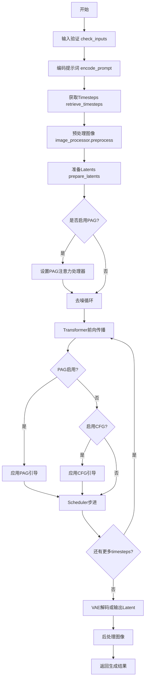
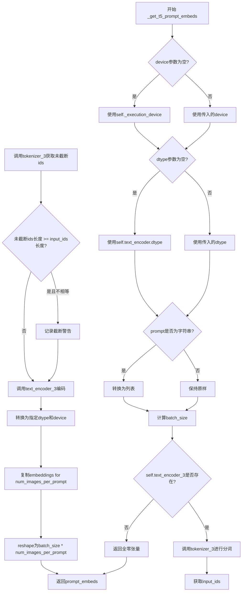
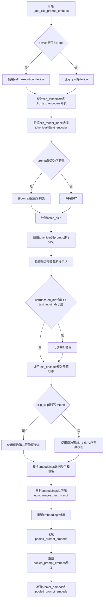
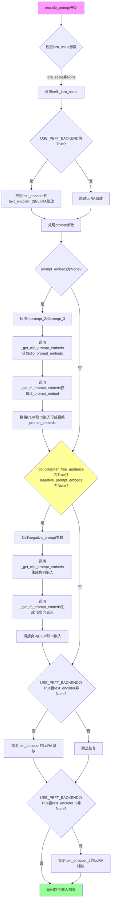
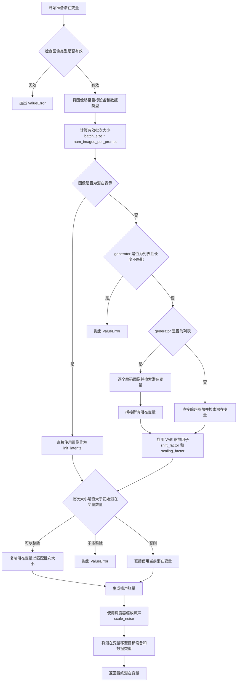
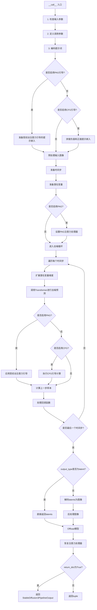

# `diffusers\src\diffusers\pipelines\pag\pipeline_pag_sd_3_img2img.py` 详细设计文档

Stable Diffusion 3的PAG（Perturbed Attention Guidance）图像到图像生成管道，支持基于文本提示的条件图像生成与转换，结合多模态文本编码器（CLIP+T5）和扰动注意力引导技术提升生成质量。

## 整体流程



## 类结构

```
DiffusionPipeline (基类)
├── SD3LoraLoaderMixin (LoRA加载Mixin)
├── FromSingleFileMixin (单文件加载Mixin)
├── PAGMixin (PAG引导Mixin)
└── StableDiffusion3PAGImg2ImgPipeline (主实现类)
```

## 全局变量及字段


### `XLA_AVAILABLE`
    
XLA可用性标志，标识torch_xla是否可用

类型：`bool`
    


### `logger`
    
日志记录器，用于输出管道运行信息

类型：`logging.Logger`
    


### `EXAMPLE_DOC_STRING`
    
示例文档字符串，包含管道使用示例代码

类型：`str`
    


### `StableDiffusion3PAGImg2ImgPipeline.transformer`
    
主干Transformer模型，用于去噪图像潜在表示

类型：`SD3Transformer2DModel`
    


### `StableDiffusion3PAGImg2ImgPipeline.scheduler`
    
扩散调度器，控制去噪过程的时间步调度

类型：`FlowMatchEulerDiscreteScheduler`
    


### `StableDiffusion3PAGImg2ImgPipeline.vae`
    
VAE编解码器，用于编码和解码图像与潜在表示

类型：`AutoencoderKL`
    


### `StableDiffusion3PAGImg2ImgPipeline.text_encoder`
    
CLIP文本编码器1，用于将文本提示转换为嵌入向量

类型：`CLIPTextModelWithProjection`
    


### `StableDiffusion3PAGImg2ImgPipeline.text_encoder_2`
    
CLIP文本编码器2，用于第二路文本嵌入

类型：`CLIPTextModelWithProjection`
    


### `StableDiffusion3PAGImg2ImgPipeline.text_encoder_3`
    
T5文本编码器，用于长序列文本嵌入

类型：`T5EncoderModel`
    


### `StableDiffusion3PAGImg2ImgPipeline.tokenizer`
    
CLIP分词器1，用于对文本进行分词

类型：`CLIPTokenizer`
    


### `StableDiffusion3PAGImg2ImgPipeline.tokenizer_2`
    
CLIP分词器2，用于第二路文本分词

类型：`CLIPTokenizer`
    


### `StableDiffusion3PAGImg2ImgPipeline.tokenizer_3`
    
T5分词器，用于T5编码器的文本分词

类型：`T5TokenizerFast`
    


### `StableDiffusion3PAGImg2ImgPipeline.vae_scale_factor`
    
VAE缩放因子，用于计算潜在空间的尺寸

类型：`int`
    


### `StableDiffusion3PAGImg2ImgPipeline.image_processor`
    
图像处理器，用于图像的预处理和后处理

类型：`VaeImageProcessor`
    


### `StableDiffusion3PAGImg2ImgPipeline.tokenizer_max_length`
    
分词器最大长度，限制文本序列的最大token数

类型：`int`
    


### `StableDiffusion3PAGImg2ImgPipeline.default_sample_size`
    
默认采样尺寸，用于确定输出图像的默认分辨率

类型：`int`
    


### `StableDiffusion3PAGImg2ImgPipeline.patch_size`
    
Transformer补丁大小，用于图像分块处理

类型：`int`
    


### `StableDiffusion3PAGImg2ImgPipeline.model_cpu_offload_seq`
    
CPU卸载顺序，定义模型组件卸载到CPU的顺序

类型：`str`
    


### `StableDiffusion3PAGImg2ImgPipeline._optional_components`
    
可选组件列表，存储管道中的可选模型组件

类型：`list`
    


### `StableDiffusion3PAGImg2ImgPipeline._callback_tensor_inputs`
    
回调张量输入列表，定义回调函数可访问的张量

类型：`list`
    


### `StableDiffusion3PAGImg2ImgPipeline._guidance_scale`
    
引导尺度，用于控制无分类器引导的强度

类型：`float`
    


### `StableDiffusion3PAGImg2ImgPipeline._clip_skip`
    
CLIP跳过层数，用于控制CLIP嵌入的层数

类型：`int`
    


### `StableDiffusion3PAGImg2ImgPipeline._joint_attention_kwargs`
    
联合注意力参数，传递给联合注意力机制的额外参数

类型：`dict`
    


### `StableDiffusion3PAGImg2ImgPipeline._num_timesteps`
    
时间步数，记录去噪过程的总步数

类型：`int`
    


### `StableDiffusion3PAGImg2ImgPipeline._interrupt`
    
中断标志，用于中断去噪循环

类型：`bool`
    


### `StableDiffusion3PAGImg2ImgPipeline._pag_scale`
    
PAG尺度，用于扰动注意力引导的缩放因子

类型：`float`
    


### `StableDiffusion3PAGImg2ImgPipeline._pag_adaptive_scale`
    
PAG自适应尺度，用于扰动注意力引导的自适应缩放

类型：`float`
    
    

## 全局函数及方法


### `retrieve_latents`

从encoder输出中提取latents。根据encoder_output的结构和sample_mode参数，从潜在分布中采样或获取mode值，或者直接返回预计算的latents。

参数：

- `encoder_output`：`torch.Tensor`，encoder的输出对象，可能包含`latent_dist`属性（带有`sample()`和`mode()`方法）或`latents`属性
- `generator`：`torch.Generator | None`，可选的随机数生成器，用于采样时的随机性控制
- `sample_mode`：`str`，采样模式，`"sample"`表示从分布中采样，`"argmax"`表示取分布的mode（最大值对应的类别）

返回值：`torch.Tensor`，提取的latent张量

#### 流程图

```mermaid
flowchart TD
    A[开始] --> B{检查 encoder_output<br/>是否有 latent_dist}
    B -->|有| C{sample_mode == "sample"}
    C -->|是| D[返回 latent_dist.sample<br/>(generator)]
    C -->|否| E[返回 latent_dist.mode<br/>()]
    B -->|没有| F{检查 encoder_output<br/>是否有 latents}
    F -->|有| G[返回 encoder_output.latents]
    F -->|没有| H[抛出 AttributeError:<br/>Could not access latents<br/>of provided encoder_output]
```

#### 带注释源码

```
# Copied from diffusers.pipelines.stable_diffusion.pipeline_stable_diffusion_img2img.retrieve_latents
def retrieve_latents(
    encoder_output: torch.Tensor, generator: torch.Generator | None = None, sample_mode: str = "sample"
):
    # 如果encoder_output有latent_dist属性（表示是VAE的潜在分布输出）
    if hasattr(encoder_output, "latent_dist") and sample_mode == "sample":
        # 从潜在分布中采样得到latents
        return encoder_output.latent_dist.sample(generator)
    # 如果sample_mode为"argmax"，取潜在分布的mode（最可能值）
    elif hasattr(encoder_output, "latent_dist") and sample_mode == "argmax":
        return encoder_output.latent_dist.mode()
    # 如果encoder_output直接有latents属性（预计算的latents）
    elif hasattr(encoder_output, "latents"):
        return encoder_output.latents
    # 如果无法获取latents，抛出异常
    else:
        raise AttributeError("Could not access latents of provided encoder_output")
```


### `retrieve_timesteps`

该函数是 Diffusion Pipeline 的工具函数，用于调用调度器（scheduler）的 `set_timesteps` 方法并从中获取时间步调度。它支持自定义时间步（timesteps）或自定义 sigma 值来覆盖调度器的默认时间步间隔策略。

参数：

- `scheduler`：`SchedulerMixin`，要获取时间步的调度器对象
- `num_inference_steps`：`int | None`，生成样本时使用的扩散步数。如果使用此参数，`timesteps` 必须为 `None`
- `device`：`str | torch.device | None`，时间步要移动到的设备。如果为 `None`，则不移动时间步
- `timesteps`：`list[int] | None`，自定义时间步，用于覆盖调度器的时间步间隔策略。如果传递了 `timesteps`，则 `num_inference_steps` 和 `sigmas` 必须为 `None`
- `sigmas`：`list[float] | None`，自定义 sigma 值，用于覆盖调度器的时间步间隔策略。如果传递了 `sigmas`，则 `num_inference_steps` 和 `timesteps` 必须为 `None`
- `**kwargs`：任意关键字参数，将传递给 `scheduler.set_timesteps`

返回值：`tuple[torch.Tensor, int]`，元组包含调度器的时间步调度（第一个元素）和推理步数（第二个元素）

#### 流程图

```mermaid
flowchart TD
    A[开始 retrieve_timesteps] --> B{同时传入 timesteps 和 sigmas?}
    B -->|是| C[抛出 ValueError: 只能传一个]
    B -->|否| D{传入了 timesteps?}
    D -->|是| E{scheduler.set_timesteps 支持 timesteps?}
    D -->|否| F{传入了 sigmas?}
    E -->|不支持| G[抛出 ValueError: 不支持自定义时间步]
    E -->|支持| H[调用 scheduler.set_timesteps timesteps=timesteps device=device **kwargs]
    F -->|是| I{scheduler.set_timesteps 支持 sigmas?}
    F -->|否| J[抛出 ValueError: 不支持自定义 sigmas]
    I -->|支持| K[调用 scheduler.set_timesteps sigmas=sigmas device=device **kwargs]
    F -->|否| L[调用 scheduler.set_timesteps num_inference_steps device=device **kwargs]
    H --> M[获取 scheduler.timesteps]
    K --> M
    L --> M
    M --> N[计算 num_inference_steps = len(timesteps)]
    N --> O[返回 timesteps, num_inference_steps]
    O --> P[结束]
    
    style A fill:#f9f,stroke:#333
    style O fill:#9f9,stroke:#333
    style C fill:#f99,stroke:#333
    style G fill:#f99,stroke:#333
    style J fill:#f99,stroke:#333
```

#### 带注释源码

```python
# Copied from diffusers.pipelines.stable_diffusion.pipeline_stable_diffusion.retrieve_timesteps
def retrieve_timesteps(
    scheduler,
    num_inference_steps: int | None = None,
    device: str | torch.device | None = None,
    timesteps: list[int] | None = None,
    sigmas: list[float] | None = None,
    **kwargs,
):
    r"""
    Calls the scheduler's `set_timesteps` method and retrieves timesteps from the scheduler after the call. Handles
    custom timesteps. Any kwargs will be supplied to `scheduler.set_timesteps`.

    Args:
        scheduler (`SchedulerMixin`):
            The scheduler to get timesteps from.
        num_inference_steps (`int`):
            The number of diffusion steps used when generating samples with a pre-trained model. If used, `timesteps`
            must be `None`.
        device (`str` or `torch.device`, *optional*):
            The device to which the timesteps should be moved to. If `None`, the timesteps are not moved.
        timesteps (`list[int]`, *optional*):
            Custom timesteps used to override the timestep spacing strategy of the scheduler. If `timesteps` is passed,
            `num_inference_steps` and `sigmas` must be `None`.
        sigmas (`list[float]`, *optional*):
            Custom sigmas used to override the timestep spacing strategy of the scheduler. If `sigmas` is passed,
            `num_inference_steps` and `timesteps` must be `None`.

    Returns:
        `tuple[torch.Tensor, int]`: A tuple where the first element is the timestep schedule from the scheduler and the
        second element is the number of inference steps.
    """
    # 检查是否同时传入了 timesteps 和 sigmas，两者只能选一个
    if timesteps is not None and sigmas is not None:
        raise ValueError("Only one of `timesteps` or `sigmas` can be passed. Please choose one to set custom values")
    
    # 处理自定义 timesteps 的情况
    if timesteps is not None:
        # 使用 inspect 检查 scheduler.set_timesteps 方法是否支持 timesteps 参数
        accepts_timesteps = "timesteps" in set(inspect.signature(scheduler.set_timesteps).parameters.keys())
        if not accepts_timesteps:
            raise ValueError(
                f"The current scheduler class {scheduler.__class__}'s `set_timesteps` does not support custom"
                f" timestep schedules. Please check whether you are using the correct scheduler."
            )
        # 调用 scheduler 的 set_timesteps 方法，传入自定义 timesteps
        scheduler.set_timesteps(timesteps=timesteps, device=device, **kwargs)
        # 从 scheduler 获取设置后的 timesteps
        timesteps = scheduler.timesteps
        # 计算推理步数
        num_inference_steps = len(timesteps)
    
    # 处理自定义 sigmas 的情况
    elif sigmas is not None:
        # 使用 inspect 检查 scheduler.set_timesteps 方法是否支持 sigmas 参数
        accept_sigmas = "sigmas" in set(inspect.signature(scheduler.set_timesteps).parameters.keys())
        if not accept_sigmas:
            raise ValueError(
                f"The current scheduler class {scheduler.__class__}'s `set_timesteps` does not support custom"
                f" sigmas schedules. Please check whether you are using the correct scheduler."
            )
        # 调用 scheduler 的 set_timesteps 方法，传入自定义 sigmas
        scheduler.set_timesteps(sigmas=sigmas, device=device, **kwargs)
        # 从 scheduler 获取设置后的 timesteps
        timesteps = scheduler.timesteps
        # 计算推理步数
        num_inference_steps = len(timesteps)
    
    # 既没有自定义 timesteps 也没有自定义 sigmas，使用默认行为
    else:
        # 调用 scheduler 的 set_timesteps 方法，使用 num_inference_steps
        scheduler.set_timesteps(num_inference_steps, device=device, **kwargs)
        # 从 scheduler 获取设置后的 timesteps
        timesteps = scheduler.timesteps
    
    # 返回 timesteps 和推理步数
    return timesteps, num_inference_steps
```


### `StableDiffusion3PAGImg2ImgPipeline.__init__`

初始化 Stable Diffusion 3 PAG（Perturbed Attention Guidance）图像到图像生成管道，设置所有必要的组件包括 transformer、VAE、文本编码器、分词器、调度器以及图像处理器。

参数：

- `transformer`：`SD3Transformer2DModel`，条件 Transformer (MMDiT) 架构，用于对编码的图像潜在表示进行去噪
- `scheduler`：`FlowMatchEulerDiscreteScheduler`，与 transformer 配合使用以对编码图像潜在表示进行去噪的调度器
- `vae`：`AutoencoderKL`，变分自编码器模型，用于在潜在表示之间编码和解码图像
- `text_encoder`：`CLIPTextModelWithProjection`，第一个 CLIP 文本编码器，带有投影层
- `tokenizer`：`CLIPTokenizer`，第一个分词器，用于将文本转换为 token
- `text_encoder_2`：`CLIPTextModelWithProjection`，第二个 CLIP 文本编码器
- `tokenizer_2`：`CLIPTokenizer`，第二个分词器
- `text_encoder_3`：`T5EncoderModel`，T5 文本编码器
- `tokenizer_3`：`T5TokenizerFast`，T5 分词器
- `pag_applied_layers`：`str | list[str]`，PAG 应用的层，默认为 "blocks.1"（第一个 transformer 块）

返回值：`None`，该方法为构造函数，不返回任何值

#### 流程图

```mermaid
flowchart TD
    A[开始 __init__] --> B[调用 super().__init__ 初始化基类]
    B --> C[register_modules 注册所有模块]
    C --> D[计算 vae_scale_factor]
    D --> E[创建 VaeImageProcessor 图像处理器]
    E --> F[设置 tokenizer_max_length]
    F --> G[设置 default_sample_size]
    G --> H[设置 patch_size]
    H --> I[调用 set_pag_applied_layers 设置PAG注意力处理器]
    I --> J[结束 __init__]
```

#### 带注释源码

```python
def __init__(
    self,
    transformer: SD3Transformer2DModel,
    scheduler: FlowMatchEulerDiscreteScheduler,
    vae: AutoencoderKL,
    text_encoder: CLIPTextModelWithProjection,
    tokenizer: CLIPTokenizer,
    text_encoder_2: CLIPTextModelWithProjection,
    tokenizer_2: CLIPTokenizer,
    text_encoder_3: T5EncoderModel,
    tokenizer_3: T5TokenizerFast,
    pag_applied_layers: str | list[str] = "blocks.1",  # 1st transformer block
):
    """
    初始化 StableDiffusion3PAGImg2ImgPipeline 管道
    
    参数:
        transformer: 条件 Transformer (MMDiT) 架构，用于去噪潜在表示
        scheduler: FlowMatch 调度器，用于去噪过程
        vae: 变分自编码器，用于图像编码/解码
        text_encoder: 第一个 CLIP 文本编码器
        tokenizer: 第一个 CLIP 分词器
        text_encoder_2: 第二个 CLIP 文本编码器
        tokenizer_2: 第二个 CLIP 分词器
        text_encoder_3: T5 文本编码器
        tokenizer_3: T5 分词器
        pag_applied_layers: PAG 应用的层名称或列表
    """
    # 调用父类 DiffusionPipeline 的初始化方法
    super().__init__()

    # 注册所有模块到管道中，使它们可以通过 self.xxx 访问
    self.register_modules(
        vae=vae,
        text_encoder=text_encoder,
        text_encoder_2=text_encoder_2,
        text_encoder_3=text_encoder_3,
        tokenizer=tokenizer,
        tokenizer_2=tokenizer_2,
        tokenizer_3=tokenizer_3,
        transformer=transformer,
        scheduler=scheduler,
    )
    
    # 计算 VAE 缩放因子，用于调整潜在空间的分辨率
    # 基于 VAE 的块输出通道数量计算（通常是 2^(num_blocks-1)）
    self.vae_scale_factor = 2 ** (len(self.vae.config.block_out_channels) - 1) if getattr(self, "vae", None) else 8
    
    # 创建图像处理器，用于图像的预处理和后处理
    self.image_processor = VaeImageProcessor(vae_scale_factor=self.vae_scale_factor)
    
    # 获取 tokenizer 的最大长度（通常是 77）
    self.tokenizer_max_length = (
        self.tokenizer.model_max_length if hasattr(self, "tokenizer") and self.tokenizer is not None else 77
    )
    
    # 从 transformer 配置中获取默认采样大小（生成的潜在空间尺寸）
    self.default_sample_size = (
        self.transformer.config.sample_size
        if hasattr(self, "transformer") and self.transformer is not None
        else 128
    )
    
    # 从 transformer 配置中获取 patch 大小
    self.patch_size = (
        self.transformer.config.patch_size if hasattr(self, "transformer") and self.transformer is not None else 2
    )

    # 设置 PAG（Perturbed Attention Guidance）应用的层
    # 使用两种注意力处理器：PAGCFGJointAttnProcessor2_0 和 PAGJointAttnProcessor2_0
    # 分别用于无分类器引导和非引导情况
    self.set_pag_applied_layers(
        pag_applied_layers, 
        pag_attn_processors=(PAGCFGJointAttnProcessor2_0(), PAGJointAttnProcessor2_0())
    )
```


### `StableDiffusion3PAGImg2ImgPipeline._get_t5_prompt_embeds`

该方法负责获取T5文本编码器的提示词嵌入（prompt embeddings），将输入的文本提示转换为可供Stable Diffusion 3模型使用的向量表示，支持批量生成和动态设备分配。

参数：

- `prompt`：`str | list[str]`，待编码的文本提示，可以是单个字符串或字符串列表
- `num_images_per_prompt`：`int = 1`，每个提示生成的图像数量，用于复制嵌入向量
- `max_sequence_length`：`int = 256`，T5编码器的最大序列长度，超过该长度会被截断
- `device`：`torch.device | None`，指定计算设备，默认为执行设备
- `dtype`：`torch.dtype | None`，指定数据类型，默认为文本编码器的数据类型

返回值：`torch.FloatTensor`，形状为`(batch_size * num_images_per_prompt, seq_len, joint_attention_dim)`的文本嵌入张量

#### 流程图



#### 带注释源码

```python
def _get_t5_prompt_embeds(
    self,
    prompt: str | list[str] = None,
    num_images_per_prompt: int = 1,
    max_sequence_length: int = 256,
    device: torch.device | None = None,
    dtype: torch.dtype | None = None,
):
    # 确定设备：如果未指定，则使用管道的执行设备
    device = device or self._execution_device
    # 确定数据类型：如果未指定，则使用text_encoder的数据类型
    dtype = dtype or self.text_encoder.dtype

    # 标准化prompt为列表格式，便于批量处理
    prompt = [prompt] if isinstance(prompt, str) else prompt
    batch_size = len(prompt)

    # 如果T5文本编码器不存在，返回零张量作为占位符
    # 这是为了保持接口一致性，避免空值导致的错误
    if self.text_encoder_3 is None:
        return torch.zeros(
            (
                batch_size * num_images_per_prompt,
                max_sequence_length,
                self.transformer.config.joint_attention_dim,
            ),
            device=device,
            dtype=dtype,
        )

    # 使用T5 tokenizer对prompt进行分词
    # padding="max_length" 确保输出长度统一
    # truncation=True 截断超过max_sequence_length的序列
    # add_special_tokens=True 添加特殊 tokens如eos
    text_inputs = self.tokenizer_3(
        prompt,
        padding="max_length",
        max_length=max_sequence_length,
        truncation=True,
        add_special_tokens=True,
        return_tensors="pt",
    )
    text_input_ids = text_inputs.input_ids
    
    # 获取未截断的ids用于检测是否发生了截断
    untruncated_ids = self.tokenizer_3(prompt, padding="longest", return_tensors="pt").input_ids

    # 检测截断并记录警告信息
    if untruncated_ids.shape[-1] >= text_input_ids.shape[-1] and not torch.equal(text_input_ids, untruncated_ids):
        # 解码被截断的部分用于日志输出
        removed_text = self.tokenizer_3.batch_decode(untruncated_ids[:, self.tokenizer_max_length - 1 : -1])
        logger.warning(
            "The following part of your input was truncated because `max_sequence_length` is set to "
            f" {max_sequence_length} tokens: {removed_text}"
        )

    # 将input_ids移动到目标设备并通过T5编码器获取嵌入
    prompt_embeds = self.text_encoder_3(text_input_ids.to(device))[0]

    # 确保输出类型和设备符合要求
    dtype = self.text_encoder_3.dtype
    prompt_embeds = prompt_embeds.to(dtype=dtype, device=device)

    # 获取序列长度
    _, seq_len, _ = prompt_embeds.shape

    # 为每个prompt生成的多个图像复制embeddings
    # 这是一种MPS友好的方法
    prompt_embeds = prompt_embeds.repeat(1, num_images_per_prompt, 1)
    # 重新整形为 (batch_size * num_images_per_prompt, seq_len, hidden_dim)
    prompt_embeds = prompt_embeds.view(batch_size * num_images_per_prompt, seq_len, -1)

    return prompt_embeds
```


### `StableDiffusion3PAGImg2ImgPipeline._get_clip_prompt_embeds`

获取CLIP模型的提示词嵌入向量，将文本提示词转换为稠密的向量表示，支持多个CLIP模型（通过clip_model_index选择），并处理批量生成和嵌入的复制。

参数：

- `prompt`：`str | list[str]`，要编码的文本提示词，可以是单个字符串或字符串列表
- `num_images_per_prompt`：`int`，默认为1，每个提示词需要生成的图像数量，用于复制嵌入向量
- `device`：`torch.device | None`，默认为None，目标计算设备，如果为None则使用执行设备
- `clip_skip`：`int | None`，默认为None，跳过的CLIP层数，用于获取不同层的隐藏状态
- `clip_model_index`：`int`，默认为0，CLIP模型索引，用于选择使用哪个CLIP编码器（0对应tokenizer/text_encoder，1对应tokenizer_2/text_encoder_2）

返回值：`tuple[torch.Tensor, torch.Tensor]`，返回包含两个张量的元组

- 第一个元素`prompt_embeds`：`torch.Tensor`，形状为`(batch_size * num_images_per_prompt, seq_len, hidden_dim)`的提示词嵌入
- 第二个元素`pooled_prompt_embeds`：`torch.Tensor`，形状为`(batch_size * num_images_per_prompt, pooled_dim)`的池化提示词嵌入

#### 流程图



#### 带注释源码

```python
def _get_clip_prompt_embeds(
    self,
    prompt: str | list[str],  # 输入的文本提示词
    num_images_per_prompt: int = 1,  # 每个提示词生成的图像数量
    device: torch.device | None = None,  # 目标设备
    clip_skip: int | None = None,  # 跳过的CLIP层数
    clip_model_index: int = 0,  # 使用的CLIP模型索引
):
    # 确定设备：如果未指定则使用执行设备
    device = device or self._execution_device

    # 获取可用的CLIP tokenizers和text encoders列表
    clip_tokenizers = [self.tokenizer, self.tokenizer_2]
    clip_text_encoders = [self.text_encoder, self.text_encoder_2]

    # 根据索引选择对应的tokenizer和text_encoder
    tokenizer = clip_tokenizers[clip_model_index]
    text_encoder = clip_text_encoders[clip_model_index]

    # 将prompt转换为列表格式（如果是字符串则包装为列表）
    prompt = [prompt] if isinstance(prompt, str) else prompt
    batch_size = len(prompt)  # 计算批量大小

    # 使用tokenizer对prompt进行分词处理
    # padding="max_length" 填充到最大长度
    # truncation=True 截断超过最大长度的序列
    # return_tensors="pt" 返回PyTorch张量
    text_inputs = tokenizer(
        prompt,
        padding="max_length",
        max_length=self.tokenizer_max_length,
        truncation=True,
        return_tensors="pt",
    )

    text_input_ids = text_inputs.input_ids  # 获取输入IDs

    # 获取未截断的输入用于比较
    untruncated_ids = tokenizer(prompt, padding="longest", return_tensors="pt").input_ids

    # 检查是否发生了截断，如果是则记录警告信息
    if untruncated_ids.shape[-1] >= text_input_ids.shape[-1] and not torch.equal(text_input_ids, untruncated_ids):
        # 解码被截断的部分用于日志记录
        removed_text = tokenizer.batch_decode(untruncated_ids[:, self.tokenizer_max_length - 1 : -1])
        logger.warning(
            "The following part of your input was truncated because CLIP can only handle sequences up to"
            f" {self.tokenizer_max_length} tokens: {removed_text}"
        )

    # 调用text_encoder获取嵌入向量
    # output_hidden_states=True 要求返回所有隐藏状态
    prompt_embeds = text_encoder(text_input_ids.to(device), output_hidden_states=True)
    pooled_prompt_embeds = prompt_embeds[0]  # 获取pooled输出（第一个元素）

    # 根据clip_skip参数选择隐藏状态层
    # 如果clip_skip为None，使用倒数第二层（-2）
    # 否则使用倒数第clip_skip+2层
    if clip_skip is None:
        prompt_embeds = prompt_embeds.hidden_states[-2]
    else:
        prompt_embeds = prompt_embeds.hidden_states[-(clip_skip + 2)]

    # 确保embeddings的数据类型和设备正确
    prompt_embeds = prompt_embeds.to(dtype=self.text_encoder.dtype, device=device)

    # 获取序列长度
    _, seq_len, _ = prompt_embeds.shape

    # 复制text embeddings以匹配每个提示词生成的图像数量
    # 使用MPS友好的方法进行复制
    prompt_embeds = prompt_embeds.repeat(1, num_images_per_prompt, 1)
    # 重塑维度：(batch_size, num_images_per_prompt, seq_len, hidden_dim) -> (batch_size * num_images_per_prompt, seq_len, hidden_dim)
    prompt_embeds = prompt_embeds.view(batch_size * num_images_per_prompt, seq_len, -1)

    # 同样处理pooled prompt embeddings
    pooled_prompt_embeds = pooled_prompt_embeds.repeat(1, num_images_per_prompt)
    pooled_prompt_embeds = pooled_prompt_embeds.view(batch_size * num_images_per_prompt, -1)

    # 返回提示词嵌入和池化后的嵌入
    return prompt_embeds, pooled_prompt_embeds
```


### StableDiffusion3PAGImg2ImgPipeline.encode_prompt

该方法负责将正负提示词（prompt）编码为文本嵌入向量（prompt_embeds），支持多文本编码器（CLIP和T5），并处理LoRA权重调整、批量生成、分类器自由引导等复杂逻辑，是Stable Diffusion 3图像生成管道的核心预处理步骤。

参数：

- `prompt`：`str | list[str]`，主要提示词，用于第一个CLIP文本编码器
- `prompt_2`：`str | list[str]`，第二个提示词，用于第二个CLIP文本编码器，若未定义则使用prompt
- `prompt_3`：`str | list[str]`，第三个提示词，用于T5文本编码器，若未定义则使用prompt
- `device`：`torch.device | None`，计算设备，若为None则使用执行设备
- `num_images_per_prompt`：`int`，每个提示词生成的图像数量，用于批量嵌入复制
- `do_classifier_free_guidance`：`bool`，是否启用分类器自由引导，决定是否生成负向嵌入
- `negative_prompt`：`str | list[str] | None`，负向提示词，用于引导图像生成方向
- `negative_prompt_2`：`str | list[str] | None`，第二个负向提示词
- `negative_prompt_3`：`str | list[str] | None`，第三个负向提示词
- `prompt_embeds`：`torch.FloatTensor | None`，预生成的正向文本嵌入，若提供则跳过嵌入生成
- `negative_prompt_embeds`：`torch.FloatTensor | None`，预生成的负向文本嵌入
- `pooled_prompt_embeds`：`torch.FloatTensor | None`，预生成的池化正向嵌入
- `negative_pooled_prompt_embeds`：`torch.FloatTensor | None`，预生成的池化负向嵌入
- `clip_skip`：`int | None`，CLIP编码器跳过的层数，用于获取不同层的表示
- `max_sequence_length`：`int`，T5编码器的最大序列长度，默认为256
- `lora_scale`：`float | None`，LoRA层的缩放因子，用于调整LoRA权重的影响

返回值：`tuple[torch.FloatTensor, torch.FloatTensor, torch.FloatTensor, torch.FloatTensor]`，包含四个张量：正向提示词嵌入、负向提示词嵌入、池化正向嵌入、池化负向嵌入

#### 流程图



#### 带注释源码

```python
def encode_prompt(
    self,
    prompt: str | list[str],
    prompt_2: str | list[str],
    prompt_3: str | list[str],
    device: torch.device | None = None,
    num_images_per_prompt: int = 1,
    do_classifier_free_guidance: bool = True,
    negative_prompt: str | list[str] | None = None,
    negative_prompt_2: str | list[str] | None = None,
    negative_prompt_3: str | list[str] | None = None,
    prompt_embeds: torch.FloatTensor | None = None,
    negative_prompt_embeds: torch.FloatTensor | None = None,
    pooled_prompt_embeds: torch.FloatTensor | None = None,
    negative_pooled_prompt_embeds: torch.FloatTensor | None = None,
    clip_skip: int | None = None,
    max_sequence_length: int = 256,
    lora_scale: float | None = None,
):
    r"""
    编码正负提示词为文本嵌入向量

    该方法支持三种文本编码器（两个CLIP和一个T5），并处理分类器自由引导（CFG）
    和LoRA权重调整。返回值包含四个张量：正向嵌入、负向嵌入、池化正向嵌入、池化负向嵌入。
    """
    # 确定设备，优先使用传入的device，否则使用执行设备
    device = device or self._execution_device

    # 设置LoRA缩放因子，以便文本编码器的LoRA函数能正确访问
    if lora_scale is not None and isinstance(self, SD3LoraLoaderMixin):
        self._lora_scale = lora_scale

        # 动态调整LoRA缩放
        if self.text_encoder is not None and USE_PEFT_BACKEND:
            scale_lora_layers(self.text_encoder, lora_scale)
        if self.text_encoder_2 is not None and USE_PEFT_BACKEND:
            scale_lora_layers(self.text_encoder_2, lora_scale)

    # 标准化prompt为列表格式，便于批量处理
    prompt = [prompt] if isinstance(prompt, str) else prompt
    if prompt is not None:
        batch_size = len(prompt)
    else:
        # 如果prompt为None，则从prompt_embeds获取batch_size
        batch_size = prompt_embeds.shape[0]

    # 如果未提供预计算的prompt_embeds，则需要生成
    if prompt_embeds is None:
        # 标准化prompt_2和prompt_3
        prompt_2 = prompt_2 or prompt
        prompt_2 = [prompt_2] if isinstance(prompt_2, str) else prompt_2

        prompt_3 = prompt_3 or prompt
        prompt_3 = [prompt_3] if isinstance(prompt_3, str) else prompt_3

        # 调用_get_clip_prompt_embeds获取第一个CLIP编码器的嵌入
        prompt_embed, pooled_prompt_embed = self._get_clip_prompt_embeds(
            prompt=prompt,
            device=device,
            num_images_per_prompt=num_images_per_prompt,
            clip_skip=clip_skip,
            clip_model_index=0,  # 使用第一个CLIP编码器
        )
        
        # 调用_get_clip_prompt_embeds获取第二个CLIP编码器的嵌入
        prompt_2_embed, pooled_prompt_2_embed = self._get_clip_prompt_embeds(
            prompt=prompt_2,
            device=device,
            num_images_per_prompt=num_images_per_prompt,
            clip_skip=clip_skip,
            clip_model_index=1,  # 使用第二个CLIP编码器
        )
        
        # 在最后一个维度拼接两个CLIP嵌入
        clip_prompt_embeds = torch.cat([prompt_embed, prompt_2_embed], dim=-1)

        # 调用_get_t5_prompt_embeds获取T5编码器的嵌入
        t5_prompt_embed = self._get_t5_prompt_embeds(
            prompt=prompt_3,
            num_images_per_prompt=num_images_per_prompt,
            max_sequence_length=max_sequence_length,
            device=device,
        )

        # 对CLIP嵌入进行padding，使其与T5嵌入的最后一个维度对齐
        clip_prompt_embeds = torch.nn.functional.pad(
            clip_prompt_embeds, (0, t5_prompt_embed.shape[-1] - clip_prompt_embeds.shape[-1])
        )

        # 在倒数第二个维度拼接CLIP和T5嵌入，形成最终的正向提示词嵌入
        prompt_embeds = torch.cat([clip_prompt_embeds, t5_prompt_embed], dim=-2)
        
        # 拼接池化后的嵌入
        pooled_prompt_embeds = torch.cat([pooled_prompt_embed, pooled_prompt_2_embed], dim=-1)

    # 处理负向提示词嵌入（当启用分类器自由引导且未提供预计算嵌入时）
    if do_classifier_free_guidance and negative_prompt_embeds is None:
        # 默认使用空字符串作为负向提示词
        negative_prompt = negative_prompt or ""
        negative_prompt_2 = negative_prompt_2 or negative_prompt
        negative_prompt_3 = negative_prompt_3 or negative_prompt

        # 将负向提示词标准化为列表，确保与batch_size匹配
        negative_prompt = batch_size * [negative_prompt] if isinstance(negative_prompt, str) else negative_prompt
        negative_prompt_2 = (
            batch_size * [negative_prompt_2] if isinstance(negative_prompt_2, str) else negative_prompt_2
        )
        negative_prompt_3 = (
            batch_size * [negative_prompt_3] if isinstance(negative_prompt_3, str) else negative_prompt_3
        )

        # 类型检查：负向提示词类型必须与正向提示词一致
        if prompt is not None and type(prompt) is not type(negative_prompt):
            raise TypeError(
                f"`negative_prompt` should be the same type to `prompt`, but got {type(negative_prompt)} !="
                f" {type(prompt)}."
            )
        # 批次大小检查
        elif batch_size != len(negative_prompt):
            raise ValueError(
                f"`negative_prompt`: {negative_prompt} has batch size {len(negative_prompt)}, but `prompt`:"
                f" {prompt} has batch size {batch_size}. Please make sure that passed `negative_prompt` matches"
                " the batch size of `prompt`."
            )

        # 生成第一个CLIP编码器的负向嵌入（不使用clip_skip）
        negative_prompt_embed, negative_pooled_prompt_embed = self._get_clip_prompt_embeds(
            negative_prompt,
            device=device,
            num_images_per_prompt=num_images_per_prompt,
            clip_skip=None,
            clip_model_index=0,
        )
        
        # 生成第二个CLIP编码器的负向嵌入
        negative_prompt_2_embed, negative_pooled_prompt_2_embed = self._get_clip_prompt_embeds(
            negative_prompt_2,
            device=device,
            num_images_per_prompt=num_images_per_prompt,
            clip_skip=None,
            clip_model_index=1,
        )
        
        # 拼接负向CLIP嵌入
        negative_clip_prompt_embeds = torch.cat([negative_prompt_embed, negative_prompt_2_embed], dim=-1)

        # 生成T5编码器的负向嵌入
        t5_negative_prompt_embed = self._get_t5_prompt_embeds(
            prompt=negative_prompt_3,
            num_images_per_prompt=num_images_per_prompt,
            max_sequence_length=max_sequence_length,
            device=device,
        )

        # 对负向CLIP嵌入进行padding对齐
        negative_clip_prompt_embeds = torch.nn.functional.pad(
            negative_clip_prompt_embeds,
            (0, t5_negative_prompt_embed.shape[-1] - negative_clip_prompt_embeds.shape[-1]),
        )

        # 拼接形成最终的负向提示词嵌入
        negative_prompt_embeds = torch.cat([negative_clip_prompt_embeds, t5_negative_prompt_embed], dim=-2)
        
        # 拼接池化的负向嵌入
        negative_pooled_prompt_embeds = torch.cat(
            [negative_pooled_prompt_embed, negative_pooled_prompt_2_embed], dim=-1
        )

    # 恢复LoRA层到原始缩放（如果之前应用了缩放）
    if self.text_encoder is not None:
        if isinstance(self, SD3LoraLoaderMixin) and USE_PEFT_BACKEND:
            # 通过取消缩放恢复原始权重
            unscale_lora_layers(self.text_encoder, lora_scale)

    if self.text_encoder_2 is not None:
        if isinstance(self, SD3LoraLoaderMixin) and USE_PEFT_BACKEND:
            unscale_lora_layers(self.text_encoder_2, lora_scale)

    # 返回四个嵌入向量供后续去噪过程使用
    return prompt_embeds, negative_prompt_embeds, pooled_prompt_embeds, negative_pooled_prompt_embeds
```


### `StableDiffusion3PAGImg2ImgPipeline.check_inputs`

验证图像到图像生成管道的输入参数是否合法，包括图像尺寸、提示词、嵌入向量等关键参数的有效性检查，确保后续生成流程能够正常运行。

参数：

- `prompt`：`str | list[str]`，主要的文本提示词，用于指导图像生成
- `prompt_2`：`str | list[str] | None`，第二个文本提示词，用于 CLIP 2 文本编码器
- `prompt_3`：`str | list[str] | None`，第三个文本提示词，用于 T5 文本编码器
- `height`：`int`，生成图像的高度
- `width`：`int`，生成图像的宽度
- `strength`：`float`，图像变换强度，值在 [0.0, 1.0] 范围内
- `negative_prompt`：`str | list[str] | None`，负面提示词，用于指导不希望出现的图像特征
- `negative_prompt_2`：`str | list[str] | None`，第二个负面提示词
- `negative_prompt_3`：`str | list[str] | None`，第三个负面提示词
- `prompt_embeds`：`torch.FloatTensor | None`，预计算的提示词嵌入向量
- `negative_prompt_embeds`：`torch.FloatTensor | None`，预计算的负面提示词嵌入向量
- `pooled_prompt_embeds`：`torch.FloatTensor | None`，预计算的池化提示词嵌入向量
- `negative_pooled_prompt_embeds`：`torch.FloatTensor | None`，预计算的池化负面提示词嵌入向量
- `callback_on_step_end_tensor_inputs`：`list[str] | None`，每步结束时的回调函数接收的张量输入列表
- `max_sequence_length`：`int | None`，文本序列的最大长度

返回值：`None`，该方法仅进行参数验证，不返回任何值

#### 流程图

```mermaid
flowchart TD
    A[开始验证] --> B{height 和 width 是否可被 vae_scale_factor * patch_size 整除}
    B -->|否| B1[抛出 ValueError]
    B -->|是| C{strength 在 [0, 1] 范围内}
    C -->|否| C1[抛出 ValueError]
    C -->|是| D{callback_on_step_end_tensor_inputs 是否合法}
    D -->|否| D1[抛出 ValueError]
    D -->|是| E{prompt 和 prompt_embeds 是否同时存在}
    E -->|是| E1[抛出 ValueError]
    E -->|否| F{prompt_2 和 prompt_embeds 是否同时存在}
    F -->|是| F1[抛出 ValueError]
    F -->|否| G{prompt_3 和 prompt_embeds 是否同时存在}
    G -->|是| G1[抛出 ValueError]
    G -->|否| H{prompt 和 prompt_embeds 是否都为空}
    H -->|是| H1[抛出 ValueError]
    H -->|否| I{prompt 类型是否合法}
    I -->|否| I1[抛出 ValueError]
    I -->|是| J{prompt_2 和 prompt_3 类型是否合法}
    J -->|否| J1[抛出 ValueError]
    J -->|是| K{negative_prompt 和 negative_prompt_embeds 是否同时存在}
    K -->|是| K1[抛出 ValueError]
    K -->|否| L{negative_prompt_2/3 和 negative_prompt_embeds 是否同时存在}
    L -->|是| L1[抛出 ValueError]
    L -->|否| M{prompt_embeds 和 negative_prompt_embeds 形状是否相同}
    M -->|否| M1[抛出 ValueError]
    M -->|是| N{prompt_embeds 存在但 pooled_prompt_embeds 为空}
    N -->|是| N1[抛出 ValueError]
    N -->|否| O{negative_prompt_embeds 存在但 negative_pooled_prompt_embeds 为空}
    O -->|是| O1[抛出 ValueError]
    O -->|否| P{max_sequence_length 是否大于 512}
    P -->|是| P1[抛出 ValueError]
    P -->|否| Q[验证通过]
    
    B1 --> Z[结束]
    C1 --> Z
    D1 --> Z
    E1 --> Z
    F1 --> Z
    G1 --> Z
    H1 --> Z
    I1 --> Z
    J1 --> Z
    K1 --> Z
    L1 --> Z
    M1 --> Z
    N1 --> Z
    O1 --> Z
    P1 --> Z
    Q --> Z
```

#### 带注释源码

```python
def check_inputs(
    self,
    prompt,
    prompt_2,
    prompt_3,
    height,
    width,
    strength,
    negative_prompt=None,
    negative_prompt_2=None,
    negative_prompt_3=None,
    prompt_embeds=None,
    negative_prompt_embeds=None,
    pooled_prompt_embeds=None,
    negative_pooled_prompt_embeds=None,
    callback_on_step_end_tensor_inputs=None,
    max_sequence_length=None,
):
    # 验证图像尺寸是否符合 VAE 和 patch size 的要求
    # height 和 width 必须能被 vae_scale_factor * patch_size 整除，否则无法正确处理潜在空间
    if (
        height % (self.vae_scale_factor * self.patch_size) != 0
        or width % (self.vae_scale_factor * self.patch_size) != 0
    ):
        raise ValueError(
            f"`height` and `width` have to be divisible by {self.vae_scale_factor * self.patch_size} but are {height} and {width}."
            f"You can use height {height - height % (self.vae_scale_factor * self.patch_size)} and width {width - width % (self.vae_scale_factor * self.patch_size)}."
        )

    # 验证图像变换强度是否在有效范围内
    # strength 必须介于 0 和 1 之间，控制对原始图像的变换程度
    if strength < 0 or strength > 1:
        raise ValueError(f"The value of strength should in [0.0, 1.0] but is {strength}")

    # 验证回调函数的张量输入是否在允许的列表中
    # callback_on_step_end_tensor_inputs 必须全是预定义的合法张量名称
    if callback_on_step_end_tensor_inputs is not None and not all(
        k in self._callback_tensor_inputs for k in callback_on_step_end_tensor_inputs
    ):
        raise ValueError(
            f"`callback_on_step_end_tensor_inputs` has to be in {self._callback_tensor_inputs}, but found {[k for k in callback_on_step_end_tensor_inputs if k not in self._callback_tensor_inputs]}"
        )

    # 验证 prompt 和 prompt_embeds 不能同时提供
    # 两者是互斥的输入方式，只能选择其一
    if prompt is not None and prompt_embeds is not None:
        raise ValueError(
            f"Cannot forward both `prompt`: {prompt} and `prompt_embeds`: {prompt_embeds}. Please make sure to"
            " only forward one of the two."
        )
    elif prompt_2 is not None and prompt_embeds is not None:
        raise ValueError(
            f"Cannot forward both `prompt_2`: {prompt_2} and `prompt_embeds`: {prompt_embeds}. Please make sure to"
            " only forward one of the two."
        )
    elif prompt_3 is not None and prompt_embeds is not None:
        raise ValueError(
            f"Cannot forward both `prompt_3`: {prompt_2} and `prompt_embeds`: {prompt_embeds}. Please make sure to"
            " only forward one of the two."
        )
    # 至少需要提供 prompt 或 prompt_embeds 之一
    elif prompt is None and prompt_embeds is None:
        raise ValueError(
            "Provide either `prompt` or `prompt_embeds`. Cannot leave both `prompt` and `prompt_embeds` undefined."
        )
    # 验证 prompt 的类型必须是 str 或 list
    elif prompt is not None and (not isinstance(prompt, str) and not isinstance(prompt, list)):
        raise ValueError(f"`prompt` has to be of type `str` or `list` but is {type(prompt)}")
    elif prompt_2 is not None and (not isinstance(prompt_2, str) and not isinstance(prompt_2, list)):
        raise ValueError(f"`prompt_2` has to be of type `str` or `list` but is {type(prompt_2)}")
    elif prompt_3 is not None and (not isinstance(prompt_3, str) and not isinstance(prompt_3, list)):
        raise ValueError(f"`prompt_3` has to be of type `str` or `list` but is {type(prompt_3)}")

    # 验证 negative_prompt 和 negative_prompt_embeds 不能同时提供
    if negative_prompt is not None and negative_prompt_embeds is not None:
        raise ValueError(
            f"Cannot forward both `negative_prompt`: {negative_prompt} and `negative_prompt_embeds`:"
            f" {negative_prompt_embeds}. Please make sure to only forward one of the two."
        )
    elif negative_prompt_2 is not None and negative_prompt_embeds is not None:
        raise ValueError(
            f"Cannot forward both `negative_prompt_2`: {negative_prompt_2} and `negative_prompt_embeds`:"
            f" {negative_prompt_embeds}. Please make sure to only forward one of the two."
        )
    elif negative_prompt_3 is not None and negative_prompt_embeds is not None:
        raise ValueError(
            f"Cannot forward both `negative_prompt_3`: {negative_prompt_3} and `negative_prompt_embeds`:"
            f" {negative_prompt_embeds}. Please make sure to only forward one of the two."
        )

    # 如果同时提供了 prompt_embeds 和 negative_prompt_embeds，验证它们的形状必须一致
    if prompt_embeds is not None and negative_prompt_embeds is not None:
        if prompt_embeds.shape != negative_prompt_embeds.shape:
            raise ValueError(
                "`prompt_embeds` and `negative_prompt_embeds` must have the same shape when passed directly, but"
                f" got: `prompt_embeds` {prompt_embeds.shape} != `negative_prompt_embeds`"
                f" {negative_prompt_embeds.shape}."
            )

    # 如果提供了 prompt_embeds，也必须提供 pooled_prompt_embeds
    if prompt_embeds is not None and pooled_prompt_embeds is None:
        raise ValueError(
            "If `prompt_embeds` are provided, `pooled_prompt_embeds` also have to be passed. Make sure to generate `pooled_prompt_embeds` from the same text encoder that was used to generate `prompt_embeds`."
        )

    # 如果提供了 negative_prompt_embeds，也必须提供 negative_pooled_prompt_embeds
    if negative_prompt_embeds is not None and negative_pooled_prompt_embeds is None:
        raise ValueError(
            "If `negative_prompt_embeds` are provided, `negative_pooled_prompt_embeds` also have to be passed. Make sure to generate `negative_pooled_prompt_embeds` from the same text encoder that was used to generate `negative_prompt_embeds`."
        )

    # 验证最大序列长度不能超过 512
    if max_sequence_length is not None and max_sequence_length > 512:
        raise ValueError(f"`max_sequence_length` cannot be greater than 512 but is {max_sequence_length}")
```


### `StableDiffusion3PAGImg2ImgPipeline.get_timesteps`

该函数用于在图像到图像（Image-to-Image）生成过程中，根据推理步数和强度参数获取去噪时间步。它根据 `strength` 参数计算需要跳过的初始时间步，返回调整后的时间步序列和实际执行的推理步数。

参数：

- `num_inference_steps`：`int`，去噪过程的总推理步数
- `strength`：`float`，强度参数，范围在 0 到 1 之间，决定了从原始图像到生成图像的变换程度
- `device`：`torch.device`，计算设备，用于确定时间步的放置位置（虽然在当前实现中未直接使用）

返回值：`tuple[torch.Tensor, int]`，第一个元素是调整后的时间步序列，第二个元素是实际执行的推理步数

#### 流程图

```mermaid
flowchart TD
    A[开始] --> B[计算 init_timestep = min(num_inference_steps × strength, num_inference_steps)]
    B --> C[计算 t_start = max(num_inference_steps - init_timestep, 0)]
    C --> D[从 scheduler.timesteps 中提取子序列: timesteps = timesteps[t_start × order:]
    D --> E{scheduler 是否有 set_begin_index 方法?}
    F[是] --> G[调用 scheduler.set_begin_index(t_start × order)]
    F[否] --> H[跳过此步骤]
    G --> I[返回 timesteps 和 num_inference_steps - t_start]
    H --> I
```

#### 带注释源码

```python
def get_timesteps(self, num_inference_steps, strength, device):
    # 根据强度参数计算初始时间步数
    # strength 越高，init_timestep 越大，意味着保留更多原始图像信息
    # 例如：num_inference_steps=50, strength=0.6 时，init_timestep = min(30, 50) = 30
    init_timestep = min(num_inference_steps * strength, num_inference_steps)

    # 计算起始索引，确定从时间步序列的哪个位置开始
    # 跳过前面的时间步，保留后面的时间步用于去噪
    # 例如：num_inference_steps=50, init_timestep=30 时，t_start = max(50-30, 0) = 20
    t_start = int(max(num_inference_steps - init_timestep, 0))
    
    # 从 scheduler 的时间步序列中提取从 t_start 开始的时间步
    # self.scheduler.order 是调度器的阶数，用于正确索引
    timesteps = self.scheduler.timesteps[t_start * self.scheduler.order :]
    
    # 如果调度器支持设置起始索引，则设置它
    # 这对于某些调度器的内部状态很重要
    if hasattr(self.scheduler, "set_begin_index"):
        self.scheduler.set_begin_index(t_start * self.scheduler.order)

    # 返回调整后的时间步和实际执行的推理步数
    # timesteps: 用于去噪的时间步序列
    # num_inference_steps - t_start: 实际执行的推理步数
    return timesteps, num_inference_steps - t_start
```


### `StableDiffusion3PAGImg2ImgPipeline.prepare_latents`

该方法负责为 Stable Diffusion 3 PAG 图像到图像管道准备初始潜在变量。它接收输入图像，将其编码为 VAE 潜在空间表示，处理批次大小，生成噪声，并根据时间步将噪声添加到潜在变量中，以用于后续的去噪扩散过程。

参数：

- `image`：`torch.Tensor | PIL.Image.Image | list`，输入图像，用于编码为潜在表示的原始图像数据
- `timestep`：`torch.Tensor`，当前扩散过程的时间步，用于噪声调度
- `batch_size`：`int`，批处理大小，表示要处理的图像数量
- `num_images_per_prompt`：`int`，每个提示生成的图像数量，用于扩展示例
- `dtype`：`torch.dtype`，目标数据类型，用于潜在变量的数据类型
- `device`：`torch.device`，目标设备，用于张量运算
- `generator`：`torch.Generator | list[torch.Generator] | None`，可选的随机生成器，用于确保可重复的噪声生成

返回值：`torch.FloatTensor`，准备好的潜在变量张量，可直接用于扩散模型的去噪过程

#### 流程图



#### 带注释源码

```python
def prepare_latents(
    self,
    image,  # torch.Tensor | PIL.Image.Image | list: 输入图像
    timestep,  # torch.Tensor: 当前时间步
    batch_size,  # int: 批处理大小
    num_images_per_prompt,  # int: 每个提示的图像数量
    dtype,  # torch.dtype: 目标数据类型
    device,  # torch.device: 目标设备
    generator=None,  # torch.Generator | list[torch.Generator] | None: 随机生成器
):
    # 步骤1: 验证输入图像类型是否为有效类型
    # 支持 torch.Tensor, PIL.Image.Image 或 list 类型
    if not isinstance(image, (torch.Tensor, PIL.Image.Image, list)):
        raise ValueError(
            f"`image` has to be of type `torch.Tensor`, `PIL.Image.Image` or list but is {type(image)}"
        )

    # 步骤2: 将图像移至目标设备和指定数据类型
    image = image.to(device=device, dtype=dtype)

    # 步骤3: 计算有效批次大小（考虑每提示图像数量）
    batch_size = batch_size * num_images_per_prompt

    # 步骤4: 检查图像是否已经是潜在表示
    # 如果图像通道数等于 VAE 的潜在通道数，则认为已经是潜在表示
    if image.shape[1] == self.vae.config.latent_channels:
        init_latents = image  # 直接使用，无需编码

    # 步骤5: 如果需要编码，则使用 VAE 编码图像
    else:
        # 检查生成器列表长度是否与批次大小匹配
        if isinstance(generator, list) and len(generator) != batch_size:
            raise ValueError(
                f"You have passed a list of generators of length {len(generator)}, but requested an effective batch"
                f" size of {batch_size}. Make sure the batch size matches the length of the generators."
            )

        # 处理生成器为列表的情况，逐个编码
        elif isinstance(generator, list):
            init_latents = [
                retrieve_latents(self.vae.encode(image[i : i + 1]), generator=generator[i])
                for i in range(batch_size)
            ]
            init_latents = torch.cat(init_latents, dim=0)

        # 处理单个生成器或无生成器的情况
        else:
            init_latents = retrieve_latents(self.vae.encode(image), generator=generator)

        # 应用 VAE 的缩放因子和偏移因子进行归一化
        # 这确保潜在表示在适当的数值范围内
        init_latents = (init_latents - self.vae.config.shift_factor) * self.vae.config.scaling_factor

    # 步骤6: 处理批次大小扩展
    # 如果批次大小大于初始潜在变量数量且可以整除，则复制潜在变量
    if batch_size > init_latents.shape[0] and batch_size % init_latents.shape[0] == 0:
        # expand init_latents for batch_size
        additional_image_per_prompt = batch_size // init_latents.shape[0]
        init_latents = torch.cat([init_latents] * additional_image_per_prompt, dim=0)

    # 如果不能整除，则抛出错误
    elif batch_size > init_latents.shape[0] and batch_size % init_latents.shape[0] != 0:
        raise ValueError(
            f"Cannot duplicate `image` of batch size {init_latents.shape[0]} to {batch_size} text prompts."
        )

    # 否则直接使用当前潜在变量
    else:
        init_latents = torch.cat([init_latents], dim=0)

    # 步骤7: 使用随机张量生成噪声
    shape = init_latents.shape
    noise = randn_tensor(shape, generator=generator, device=device, dtype=dtype)

    # 步骤8: 使用调度器的 scale_noise 方法将噪声应用到初始潜在变量
    # 这确保了噪声按照扩散过程的调度正确添加
    init_latents = self.scheduler.scale_noise(init_latents, timestep, noise)

    # 步骤9: 将最终潜在变量移至目标设备和数据类型
    latents = init_latents.to(device=device, dtype=dtype)

    # 返回准备好的潜在变量
    return latents
```


### `StableDiffusion3PAGImg2ImgPipeline.__call__`

这是Stable Diffusion 3 PAG（Perturbed Attention Guidance）图像到图像生成管道的主入口方法。该方法接收文本提示和初始图像作为输入，通过多步去噪过程生成符合文本描述的目标图像，支持分类器自由引导（CFG）和受扰动注意力引导（PAG）两种引导技术。

参数：

- `prompt`：`str | list[str] | None`，主要文本提示，引导图像生成的内容
- `prompt_2`：`str | list[str] | None`，发送给第二文本编码器的提示，若不定义则使用`prompt`
- `prompt_3`：`str | list[str] | None`，发送给T5文本编码器的提示，若不定义则使用`prompt`
- `height`：`int | None`，生成图像的高度，默认为`default_sample_size * vae_scale_factor`
- `width`：`int | None`，生成图像的宽度，默认为`default_sample_size * vae_scale_factor`
- `image`：`PipelineImageInput`，用于图像到图像转换的起始图像
- `strength`：`float`，变换强度，范围0-1，值越大表示对原图的改变越多
- `num_inference_steps`：`int`，去噪迭代次数，默认为50
- `sigmas`：`list[float] | None`，自定义sigma值，用于支持sigmas的调度器
- `guidance_scale`：`float`，分类器自由引导尺度，默认为7.0
- `negative_prompt`：`str | list[str] | None`，负面提示，用于引导不期望的内容
- `negative_prompt_2`：`str | list[str] | None`，第二负面提示
- `negative_prompt_3`：`str | list[str] | None`，T5编码器的负面提示
- `num_images_per_prompt`：`int`，每个提示生成的图像数量
- `generator`：`torch.Generator | list[torch.Generator] | None`，随机数生成器，确保可复现性
- `latents`：`torch.FloatTensor | None`，预生成的噪声潜在向量
- `prompt_embeds`：`torch.FloatTensor | None`，预生成的文本嵌入
- `negative_prompt_embeds`：`torch.FloatTensor | None`，预生成的负面文本嵌入
- `pooled_prompt_embeds`：`torch.FloatTensor | None`，预生成的池化文本嵌入
- `negative_pooled_prompt_embeds`：`torch.FloatTensor | None`，预生成的负面池化文本嵌入
- `output_type`：`str`，输出格式，默认为"pil"
- `return_dict`：`bool`，是否返回字典格式，默认为True
- `joint_attention_kwargs`：`dict[str, Any] | None`，传递给注意力处理器的额外参数
- `clip_skip`：`int | None`，CLIP模型跳过的层数
- `callback_on_step_end`：`Callable | None`，每个去噪步骤结束时调用的回调函数
- `callback_on_step_end_tensor_inputs`：`list[str]`，回调函数接收的张量输入列表
- `max_sequence_length`：`int`，T5编码器的最大序列长度，默认为256
- `pag_scale`：`float`，受扰动注意力引导的缩放因子，默认为3.0
- `pag_adaptive_scale`：`float`，受扰动注意力引导的自适应缩放因子，默认为0.0

返回值：`StableDiffusion3PipelineOutput | tuple`，返回生成的图像列表或包含图像的元组

#### 流程图



#### 带注释源码

```python
@torch.no_grad()
@replace_example_docstring(EXAMPLE_DOC_STRING)
def __call__(
    self,
    prompt: str | list[str] = None,
    prompt_2: str | list[str] | None = None,
    prompt_3: str | list[str] | None = None,
    height: int | None = None,
    width: int | None = None,
    image: PipelineImageInput = None,
    strength: float = 0.6,
    num_inference_steps: int = 50,
    sigmas: list[float] | None = None,
    guidance_scale: float = 7.0,
    negative_prompt: str | list[str] | None = None,
    negative_prompt_2: str | list[str] | None = None,
    negative_prompt_3: str | list[str] | None = None,
    num_images_per_prompt: int | None = 1,
    generator: torch.Generator | list[torch.Generator] | None = None,
    latents: torch.FloatTensor | None = None,
    prompt_embeds: torch.FloatTensor | None = None,
    negative_prompt_embeds: torch.FloatTensor | None = None,
    pooled_prompt_embeds: torch.FloatTensor | None = None,
    negative_pooled_prompt_embeds: torch.FloatTensor | None = None,
    output_type: str | None = "pil",
    return_dict: bool = True,
    joint_attention_kwargs: dict[str, Any] | None = None,
    clip_skip: int | None = None,
    callback_on_step_end: Callable[[int, int], None] | None = None,
    callback_on_step_end_tensor_inputs: list[str] = ["latents"],
    max_sequence_length: int = 256,
    pag_scale: float = 3.0,
    pag_adaptive_scale: float = 0.0,
):
    # 1. 检查并设置默认图像尺寸
    height = height or self.default_sample_size * self.vae_scale_factor
    width = width or self.default_sample_size * self.vae_scale_factor
    
    # 1. 检查输入参数合法性
    self.check_inputs(
        prompt, prompt_2, prompt_3, height, width, strength,
        negative_prompt, negative_prompt_2, negative_prompt_3,
        prompt_embeds, negative_prompt_embeds,
        pooled_prompt_embeds, negative_pooled_prompt_embeds,
        callback_on_step_end_tensor_inputs, max_sequence_length,
    )

    # 2. 设置内部状态变量
    self._guidance_scale = guidance_scale
    self._clip_skip = clip_skip
    self._joint_attention_kwargs = joint_attention_kwargs
    self._interrupt = False
    self._pag_scale = pag_scale
    self._pag_adaptive_scale = pag_adaptive_scale

    # 2. 确定批次大小
    if prompt is not None and isinstance(prompt, str):
        batch_size = 1
    elif prompt is not None and isinstance(prompt, list):
        batch_size = len(prompt)
    else:
        batch_size = prompt_embeds.shape[0]

    device = self._execution_device

    # 获取LoRA缩放因子
    lora_scale = (
        self.joint_attention_kwargs.get("scale", None) 
        if self.joint_attention_kwargs is not None else None
    )
    
    # 3. 编码文本提示为嵌入向量
    (
        prompt_embeds,
        negative_prompt_embeds,
        pooled_prompt_embeds,
        negative_pooled_prompt_embeds,
    ) = self.encode_prompt(
        prompt=prompt, prompt_2=prompt_2, prompt_3=prompt_3,
        negative_prompt=negative_prompt,
        negative_prompt_2=negative_prompt_2,
        negative_prompt_3=negative_prompt_3,
        do_classifier_free_guidance=self.do_classifier_free_guidance,
        prompt_embeds=prompt_embeds,
        negative_prompt_embeds=negative_prompt_embeds,
        pooled_prompt_embeds=pooled_prompt_embeds,
        negative_pooled_prompt_embeds=negative_pooled_prompt_embeds,
        device=device, clip_skip=self.clip_skip,
        num_images_per_prompt=num_images_per_prompt,
        max_sequence_length=max_sequence_length,
        lora_scale=lora_scale,
    )

    # 根据引导类型准备提示嵌入
    if self.do_perturbed_attention_guidance:
        # 启用PAG时准备受扰动注意力引导
        prompt_embeds = self._prepare_perturbed_attention_guidance(
            prompt_embeds, negative_prompt_embeds, self.do_classifier_free_guidance
        )
        pooled_prompt_embeds = self._prepare_perturbed_attention_guidance(
            pooled_prompt_embeds, negative_pooled_prompt_embeds, self.do_classifier_free_guidance
        )
    elif self.do_classifier_free_guidance:
        # 启用CFG时拼接负面和正面嵌入
        prompt_embeds = torch.cat([negative_prompt_embeds, prompt_embeds], dim=0)
        pooled_prompt_embeds = torch.cat([negative_pooled_prompt_embeds, pooled_prompt_embeds], dim=0)

    # 3. 预处理输入图像
    image = self.image_processor.preprocess(image, height=height, width=width)

    # 4. 准备去噪时间步
    if XLA_AVAILABLE:
        timestep_device = "cpu"
    else:
        timestep_device = device
    
    timesteps, num_inference_steps = retrieve_timesteps(
        self.scheduler, num_inference_steps, timestep_device, sigmas=sigmas
    )
    # 根据strength调整时间步
    timesteps, num_inference_steps = self.get_timesteps(num_inference_steps, strength, device)
    # 复制初始时间步以匹配批次大小
    latent_timestep = timesteps[:1].repeat(batch_size * num_images_per_prompt)
    
    # 5. 准备初始潜在变量
    num_channels_latents = self.transformer.config.in_channels
    if latents is None:
        latents = self.prepare_latents(
            image, latent_timestep, batch_size, num_images_per_prompt,
            prompt_embeds.dtype, device, generator,
        )

    # 如果启用PAG，设置PAG注意力处理器
    if self.do_perturbed_attention_guidance:
        original_attn_proc = self.transformer.attn_processors
        self._set_pag_attn_processor(
            pag_applied_layers=self.pag_applied_layers,
            do_classifier_free_guidance=self.do_classifier_free_guidance,
        )

    # 6. 去噪循环
    num_warmup_steps = max(len(timesteps) - num_inference_steps * self.scheduler.order, 0)
    self._num_timesteps = len(timesteps)
    
    with self.progress_bar(total=num_inference_steps) as progress_bar:
        for i, t in enumerate(timesteps):
            # 检查是否中断
            if self.interrupt:
                continue

            # 扩展潜在变量维度以适配CFG或PAG
            latent_model_input = torch.cat([latents] * (prompt_embeds.shape[0] // latents.shape[0]))
            # 扩展时间步以匹配批次维度
            timestep = t.expand(latent_model_input.shape[0])

            # 调用Transformer进行噪声预测
            noise_pred = self.transformer(
                hidden_states=latent_model_input,
                timestep=timestep,
                encoder_hidden_states=prompt_embeds,
                pooled_projections=pooled_prompt_embeds,
                joint_attention_kwargs=self.joint_attention_kwargs,
                return_dict=False,
            )[0]

            # 应用引导策略
            if self.do_perturbed_attention_guidance:
                # 应用受扰动注意力引导
                noise_pred = self._apply_perturbed_attention_guidance(
                    noise_pred, self.do_classifier_free_guidance, self.guidance_scale, t
                )
            elif self.do_classifier_free_guidance:
                # 执行分类器自由引导
                noise_pred_uncond, noise_pred_text = noise_pred.chunk(2)
                noise_pred = noise_pred_uncond + self.guidance_scale * (noise_pred_text - noise_pred_uncond)

            # 计算上一步的去噪结果
            latents_dtype = latents.dtype
            latents = self.scheduler.step(noise_pred, t, latents, return_dict=False)[0]

            # 处理数据类型转换（针对MPS设备）
            if latents.dtype != latents_dtype:
                if torch.backends.mps.is_available():
                    latents = latents.to(latents_dtype)

            # 处理步骤结束回调
            if callback_on_step_end is not None:
                callback_kwargs = {}
                for k in callback_on_step_end_tensor_inputs:
                    callback_kwargs[k] = locals()[k]
                callback_outputs = callback_on_step_end(self, i, t, callback_kwargs)

                latents = callback_outputs.pop("latents", latents)
                prompt_embeds = callback_outputs.pop("prompt_embeds", prompt_embeds)
                negative_prompt_embeds = callback_outputs.pop("negative_prompt_embeds", negative_prompt_embeds)
                negative_pooled_prompt_embeds = callback_outputs.pop(
                    "negative_pooled_prompt_embeds", negative_pooled_prompt_embeds
                )

            # 更新进度条
            if i == len(timesteps) - 1 or ((i + 1) > num_warmup_steps and (i + 1) % self.scheduler.order == 0):
                progress_bar.update()

            # XLA设备特殊处理
            if XLA_AVAILABLE:
                xm.mark_step()

    # 7. 处理输出
    if output_type == "latent":
        image = latents
    else:
        # 解码潜在向量为图像
        latents = (latents / self.vae.config.scaling_factor) + self.vae.config.shift_factor
        image = self.vae.decode(latents, return_dict=False)[0]
        image = self.image_processor.postprocess(image, output_type=output_type)

    # 8. 释放模型资源
    self.maybe_free_model_hooks()

    # 恢复原始注意力处理器
    if self.do_perturbed_attention_guidance:
        self.transformer.set_attn_processor(original_attn_proc)

    # 9. 返回结果
    if not return_dict:
        return (image,)

    return StableDiffusion3PipelineOutput(images=image)
```

## 关键组件


### StableDiffusion3PAGImg2ImgPipeline

主Pipeline类，集成了Stable Diffusion 3模型与PAG（扰动注意力引导）机制，用于图像到图像的生成任务。该类继承自DiffusionPipeline、SD3LoraLoaderMixin、FromSingleFileMixin和PAGMixin，支持LoRA加载和单文件模型加载。

### 张量索引与惰性加载

在`retrieve_latents`函数中实现，通过检查encoder_output是否具有`latent_dist`属性或`latents`属性来惰性获取latents，支持sample和argmax两种采样模式。

### 反量化支持

在`prepare_latents`方法中实现，使用`vae.encode`对图像进行编码，并通过`shift_factor`和`scaling_factor`对latents进行反量化处理，将latents从潜在空间转换回原始空间。

### 量化策略

在`encode_prompt`方法中集成，支持通过`lora_scale`参数动态调整LoRA层的权重缩放，并使用`scale_lora_layers`和`unscale_lora_layers`函数进行LoRA权重的加载和卸载。

### 多模态文本编码

通过`_get_clip_prompt_embeds`和`_get_t5_prompt_embeds`方法实现，支持CLIP（text_encoder和text_encoder_2）以及T5（text_encoder_3）三种文本编码器的联合使用，实现多模态文本嵌入生成。

### VAE图像处理

通过`VaeImageProcessor`类实现图像的预处理和后处理，包括`preprocess`和`postprocess`方法，负责图像到latent空间和latent空间到图像的转换。

### PAG（扰动注意力引导）

通过PAGMixin混入类实现，包含`_prepare_perturbed_attention_guidance`、`_apply_perturbed_attention_guidance`和`_set_pag_attn_processor`方法，支持PAGCFGJointAttnProcessor2_0和PAGJointAttnProcessor2_0两种注意力处理器。

### 调度器集成

通过`FlowMatchEulerDiscreteScheduler`实现，配合`retrieve_timesteps`和`get_timesteps`函数，支持自定义timesteps和sigmas，以及基于strength的噪声调度控制。

### 潜在技术债务

Pipeline类承担了过多职责，包括文本编码、图像处理、噪声调度、PAG引导等，建议拆分或使用策略模式优化。部分方法直接从其他Pipeline复制而来（如retrieve_timesteps、_get_t5_prompt_embeds等），存在代码重复。

## 问题及建议


### 已知问题

-   **参数检查错误**：在 `check_inputs` 方法中，提示 `prompt_3` 的错误消息错误地使用了 `prompt_2` 变量名（`f"Cannot forward both `prompt_3`: {prompt_2} and..."`），这会导致误导性的错误提示。
-   **重复代码过多**：大量使用 "Copied from" 注释，表明 `_get_t5_prompt_embeds`、`_get_clip_prompt_embeds`、`encode_prompt` 等方法是从其他管道复制的，未进行适当的代码重构和抽象。
-   **LoRA 缩放逻辑重复**：`encode_prompt` 方法中 LoRA 缩放和取消缩放的代码重复出现在多个位置，且在 `text_encoder` 和 `text_encoder_2` 的处理逻辑几乎完全相同。
-   **回调函数使用 `locals()`**：`callback_on_step_end` 的调用中使用 `locals()[k]` 获取变量，这种方式不够清晰且可能引入隐藏的 bug。
-   **缺少 PAG 参数验证**：`pag_scale` 和 `pag_adaptive_scale` 参数未在 `check_inputs` 方法中进行验证（如范围检查），可能导致运行时错误。
-   **设备管理不一致**：在 XLA 可用时使用 `timestep_device = "cpu"`，但在其他地方直接使用 `device`，可能导致设备不匹配问题。
-   **PAG 状态管理**：PAG 注意力处理器的设置和恢复逻辑嵌入在主循环中，与核心去噪逻辑耦合度高，难以独立测试和维护。

### 优化建议

-   将重复的文本编码方法提取到基类或混入类（Mixin）中，实现代码复用。
-   重构 `encode_prompt` 方法，使用辅助函数处理 LoRA 缩放逻辑，减少代码重复。
-   修复 `check_inputs` 中 `prompt_3` 的错误消息。
-   为 `pag_scale` 和 `pag_adaptive_scale` 添加参数验证逻辑。
-   将回调函数中使用的变量显式传递，而非依赖 `locals()`。
-   考虑将 PAG 相关的逻辑（设置处理器、应用扰动注意力、恢复处理器）封装成独立方法，提高代码可读性和可测试性。
-   统一设备管理逻辑，确保在 XLA 环境下所有张量操作使用正确的设备。

## 其它


### 设计目标与约束

设计目标：
- 实现基于 Stable Diffusion 3 的图像到图像（PAG）生成管道
- 支持多模态文本编码（CLIP+T5）融合
- 提供 Perturbed Attention Guidance（PAG）技术以提升图像质量
- 支持 LoRA 微调功能

约束条件：
- 输入图像尺寸必须能被 `vae_scale_factor * patch_size` 整除
- `strength` 参数必须在 [0, 1] 范围内
- `max_sequence_length` 不能超过 512
- 必须使用 FlowMatchEulerDiscreteScheduler 调度器

### 错误处理与异常设计

错误处理策略：
- **输入验证**：通过 `check_inputs` 方法进行多维度验证，包括尺寸对齐、参数范围检查、类型检查等
- **模型输出验证**：使用 `retrieve_latents` 函数处理不同类型的 encoder 输出，处理缺失属性情况
- **调度器兼容性**：通过 `inspect` 模块动态检查调度器是否支持自定义 timesteps 或 sigmas
- **设备兼容性**：针对 Apple MPS 设备特殊处理 `latents.dtype` 转换问题
- **XLA 支持**：可选的 XLA 加速支持，通过 `xm.mark_step()` 同步设备

关键异常类型：
- `ValueError`：参数值不合规（尺寸、范围、类型不匹配）
- `TypeError`：类型不匹配
- `AttributeError`：encoder 输出格式不符合预期

### 数据流与状态机

数据流：
1. **输入阶段**：原始图像 → `image_processor.preprocess()` 预处理 → 标准化尺寸
2. **编码阶段**：文本提示 → `encode_prompt()` → 合并 CLIP 和 T5 嵌入 → 生成条件嵌入
3. **潜在空间准备**：`prepare_latents()` 将图像编码为潜在向量，添加噪声
4. **去噪循环**：迭代处理 timesteps，通过 transformer 预测噪声，执行引导（CFG/PAG）
5. **解码阶段**：潜在向量 → VAE decode → 后处理 → 输出图像

状态管理：
- `_guidance_scale`：分类器自由引导权重
- `_clip_skip`：CLIP 跳过的层数
- `_joint_attention_kwargs`：联合注意力参数
- `_interrupt`：中断标志
- `_num_timesteps`：总时间步数
- `_pag_scale`：PAG 缩放因子
- `_pag_adaptive_scale`：PAG 自适应缩放因子

### 外部依赖与接口契约

核心依赖：
- `transformers`：CLIPTextModelWithProjection、CLIPTokenizer、T5EncoderModel、T5TokenizerFast
- `diffusers`：AutoencoderKL、SD3Transformer2DModel、FlowMatchEulerDiscreteScheduler、VaeImageProcessor
- `torch`：张量操作、随机数生成
- `PIL.Image`：图像处理

模块间接口：
- `DiffusionPipeline`：基类，提供模型加载、推理框架
- `SD3LoraLoaderMixin`：LoRA 加载混合类
- `FromSingleFileMixin`：单文件加载混合类
- `PAGMixin`：PAG 功能混合类
- `PipelineImageInput`：图像输入类型别名
- `StableDiffusion3PipelineOutput`：输出格式定义

### 性能优化与资源管理

性能优化策略：
- **模型卸载**：使用 `model_cpu_offload_seq` 定义模型卸载顺序（text_encoder → text_encoder_2 → text_encoder_3 → transformer → vae）
- **VAE 分块解码**：大图像处理时可能使用分块解码
- **XLA 加速**：可选的 PyTorch XLA 支持
- **批处理优化**：使用 `repeat` 方法而非循环复制嵌入向量

资源管理：
- 通过 `maybe_free_model_hooks()` 在推理结束后释放模型钩子
- PAG 处理器在推理完成后恢复原始注意力处理器
- 支持 MPS 后端的特殊内存处理

### 版本兼容性说明

兼容性考虑：
- PyTorch 版本兼容性（MPS 设备特殊处理）
- 调度器兼容性检查（timesteps/sigmas 支持）
- 文本编码器动态检查（text_encoder_3 可能为 None）
- LoRA 层的 PEFT 后端支持检测

### 配置参数详解

关键配置参数：
- `vae_scale_factor`：VAE 缩放因子，默认 2^(len(vae.config.block_out_channels)-1)
- `patch_size`：Transformer patch 大小，用于尺寸对齐计算
- `tokenizer_max_length`：文本分词器最大长度（默认77）
- `default_sample_size`：默认采样尺寸（默认128）
- `pag_applied_layers`：PAG 应用的层（默认 "blocks.1"）

### 安全性考虑

安全考量：
- 输入提示词长度限制（max_sequence_length ≤ 512）
- 负向提示词支持用于内容过滤
- 潜在空间操作避免直接访问原始像素数据
- 模型来源验证（stabilityai 官方模型）

    