# `diffusers\src\diffusers\pipelines\pag\pipeline_pag_sd_animatediff.py` 详细设计文档

AnimateDiffPAGPipeline 是一个结合了 AnimateDiff 文本到视频生成能力和 Perturbed Attention Guidance (PAG) 技术的扩散 pipeline，能够根据文本提示生成高质量的动态视频。

## 整体流程

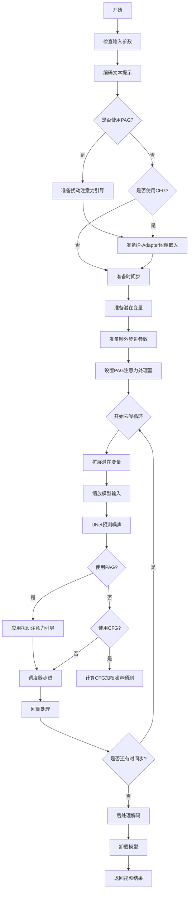

## 类结构

```
DiffusionPipeline (基类)
├── StableDiffusionMixin
├── TextualInversionLoaderMixin
├── IPAdapterMixin
├── StableDiffusionLoraLoaderMixin
├── FreeInitMixin
├── AnimateDiffFreeNoiseMixin
└── PAGMixin
    └── AnimateDiffPAGPipeline
```

## 全局变量及字段


### `logger`
    
用于记录管道运行过程中的日志信息的日志记录器

类型：`logging.Logger`
    


### `EXAMPLE_DOC_STRING`
    
包含AnimateDiffPAGPipeline使用示例的文档字符串

类型：`str`
    


### `XLA_AVAILABLE`
    
标志位，表示PyTorch XLA是否可用以支持加速计算

类型：`bool`
    


### `AnimateDiffPAGPipeline.vae`
    
变分自编码器，用于将图像编码到潜在空间并从潜在空间解码还原图像

类型：`AutoencoderKL`
    


### `AnimateDiffPAGPipeline.text_encoder`
    
冻结的CLIP文本编码器，用于将文本提示转换为嵌入向量

类型：`CLIPTextModel`
    


### `AnimateDiffPAGPipeline.tokenizer`
    
CLIP分词器，用于将文本分割为token序列

类型：`CLIPTokenizer`
    


### `AnimateDiffPAGPipeline.unet`
    
带运动适配器的UNet模型，用于去噪视频潜在表示

类型：`UNetMotionModel`
    


### `AnimateDiffPAGPipeline.motion_adapter`
    
运动适配器模块，为UNet提供时间维度的运动信息处理能力

类型：`MotionAdapter`
    


### `AnimateDiffPAGPipeline.scheduler`
    
扩散调度器，控制去噪过程中的噪声调度和采样策略

类型：`KarrasDiffusionSchedulers`
    


### `AnimateDiffPAGPipeline.feature_extractor`
    
CLIP图像特征提取器，用于处理IP-Adapter输入图像（可选组件）

类型：`CLIPImageProcessor`
    


### `AnimateDiffPAGPipeline.image_encoder`
    
CLIP视觉编码器，用于生成图像嵌入向量（可选组件）

类型：`CLIPVisionModelWithProjection`
    


### `AnimateDiffPAGPipeline.vae_scale_factor`
    
VAE缩放因子，用于计算潜在空间的分辨率缩放比例

类型：`int`
    


### `AnimateDiffPAGPipeline.video_processor`
    
视频后处理器，用于将解码后的潜在表示转换为最终视频输出

类型：`VideoProcessor`
    


### `AnimateDiffPAGPipeline.model_cpu_offload_seq`
    
模型CPU卸载顺序定义，指定模块卸载到CPU的优先级序列

类型：`str`
    


### `AnimateDiffPAGPipeline._optional_components`
    
可选组件列表，定义可选择性加载的管道组件

类型：`list`
    


### `AnimateDiffPAGPipeline._callback_tensor_inputs`
    
回调函数可访问的张量输入名称列表，用于自定义后处理逻辑

类型：`list`
    


### `AnimateDiffPAGPipeline._guidance_scale`
    
分类器自由引导尺度，控制文本提示对生成结果的影响程度

类型：`float`
    


### `AnimateDiffPAGPipeline._clip_skip`
    
CLIP跳过的层数，用于控制文本嵌入提取的中间层深度

类型：`int`
    


### `AnimateDiffPAGPipeline._cross_attention_kwargs`
    
交叉注意力关键字参数字典，用于自定义注意力机制的行为

类型：`dict`
    


### `AnimateDiffPAGPipeline._pag_scale`
    
扰动注意力引导(PAG)尺度，控制PAG方法对生成质量的影响强度

类型：`float`
    


### `AnimateDiffPAGPipeline._pag_adaptive_scale`
    
PAG自适应尺度因子，用于动态调整PAG强度（为0时使用固定pag_scale）

类型：`float`
    


### `AnimateDiffPAGPipeline._num_timesteps`
    
扩散过程的推理步数，记录当前管道的去噪迭代次数

类型：`int`
    
    

## 全局函数及方法


### `is_torch_xla_available`

检查当前环境是否安装了 PyTorch XLA（Accelerator）库，用于判断是否可以在 TPU 或其他加速器上运行。

参数： 无

返回值：`bool`，返回 `True` 表示 PyTorch XLA 可用，`False` 表示不可用

#### 流程图

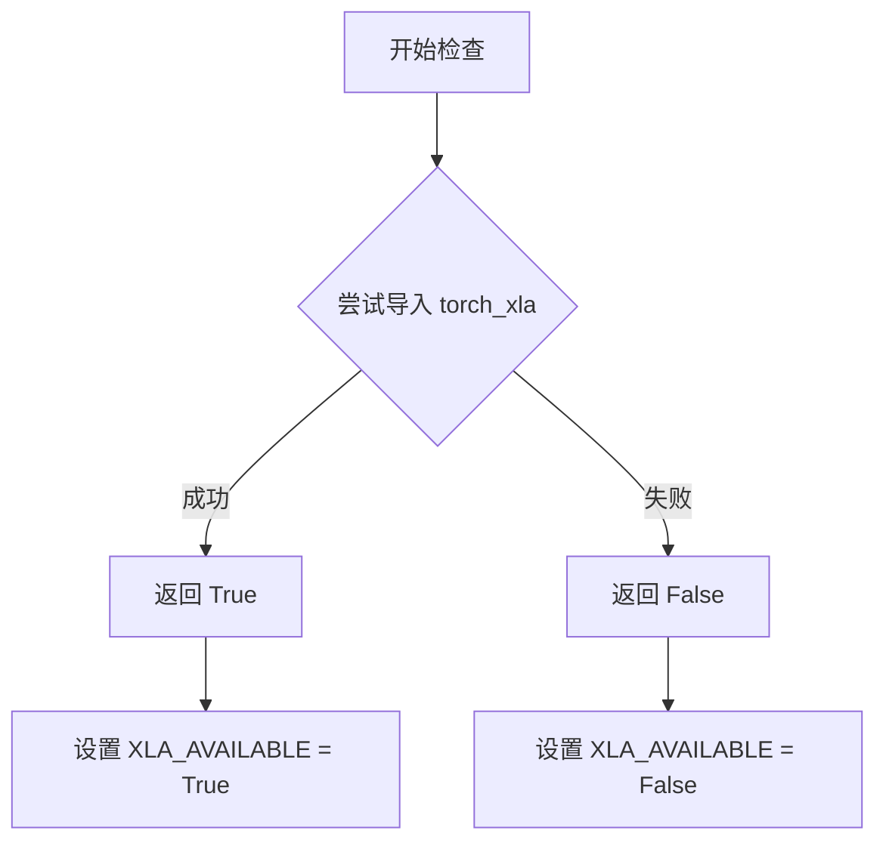

#### 带注释源码

```python
# is_torch_xla_available 的调用示例（来源：当前代码文件）

# 从 diffusers.utils 导入 is_torch_xla_available 函数
from ...utils import (
    USE_PEFT_BACKEND,
    is_torch_xla_available,  # <-- 从 utils 模块导入的检查函数
    logging,
    replace_example_docstring,
    scale_lora_layers,
    unscale_lora_layers,
)

# 使用 is_torch_xla_available 检查 XLA 是否可用
if is_torch_xla_available():
    # 如果 XLA 可用，导入 torch_xla 的核心模块
    import torch_xla.core.xla_model as xm

    # 设置全局标志，表示 XLA 可用
    XLA_AVAILABLE = True
else:
    # XLA 不可用，设置全局标志为 False
    XLA_AVAILABLE = False

# ... (代码后续部分)

# 在去噪循环中，如果 XLA 可用，则调用 mark_step() 进行加速
if XLA_AVAILABLE:
    xm.mark_step()
```

> **注意**：由于 `is_torch_xla_available` 函数的完整实现在 `diffusers` 包的 `...utils` 模块中（未在当前文件中给出），上述源码为基于其使用方式的推断。


我来分析代码中的 `logging.get_logger` 函数。从代码中可以看到，这是一个从 `diffusers.utils` 导入的自定义日志模块。

### logging.get_logger

获取一个与当前模块关联的日志记录器实例，用于在模块中记录日志信息。

参数：

- `name`：`str`，日志记录器的名称，通常传入 `__name__` 以获取模块级别的日志记录器

返回值：`logging.Logger`，返回一个日志记录器对象，可用于记录不同级别的日志信息

#### 流程图

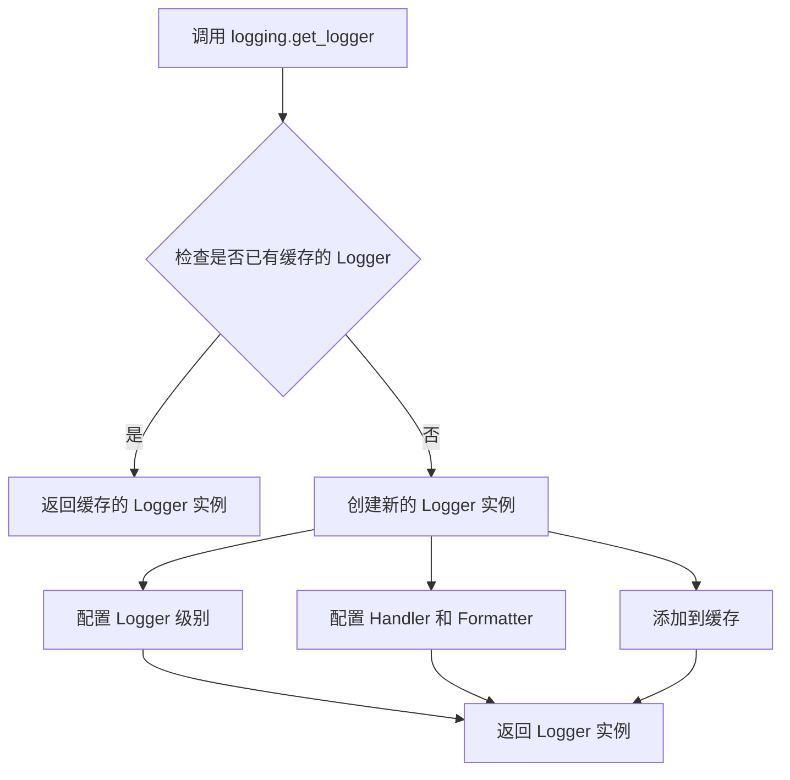

#### 带注释源码

```python
# 从 diffusers.utils 导入 logging 模块
from ...utils import (
    USE_PEFT_BACKEND,
    is_torch_xla_available,
    logging,  # <-- 这是 diffusers 自定义的 logging 模块
    replace_example_docstring,
    scale_lora_layers,
    unscale_lora_layers,
)

# 调用 logging.get_logger(__name__) 获取当前模块的日志记录器
# __name__ 是 Python 内置变量，表示当前模块的完全限定名
# 例如：如果这个文件是 src/diffusers/pipelines/animatediff/pipeline_animatediff_pag.py
# 则 __name__ 就是 "diffusers.pipelines.animatediff.pipeline_animatediff_pag"
logger = logging.get_logger(__name__)  # pylint: disable=invalid-name

# 使用示例：
# logger.info("Starting pipeline initialization")  # 记录信息级别日志
# logger.warning("Memory usage high")              # 记录警告级别日志
# logger.error("Failed to load model")             # 记录错误级别日志
# logger.debug("Processing step %d", step)         # 记录调试级别日志
```

#### 相关说明

`logging.get_logger` 是 `diffusers` 库封装的日志获取函数，它基于 Python 标准库的 `logging` 模块实现。该函数的主要特点包括：

1. **单例模式**：相同名称的日志记录器会被缓存和复用
2. **统一配置**：通过 `diffusers.utils.logging` 统一管理所有模块的日志行为
3. **模块级别**：使用 `__name__` 可以方便地标识日志来源，便于调试

在代码中，`logger` 变量被广泛用于记录：
- 输入参数的处理信息
- 潜在的性能问题警告
- 错误和异常信息
- 调试用的中间状态信息


### `replace_example_docstring`

替换示例文档字符串装饰器，用于自动替换被装饰函数的文档字符串，通常用于将示例代码注入到管道的 `__call__` 方法文档中。

参数：

- `doc_string`：`str`，用于替换被装饰函数原始文档字符串的示例文档字符串，通常包含使用该管道的示例代码

返回值：`Callable`，返回装饰后的函数对象

#### 流程图

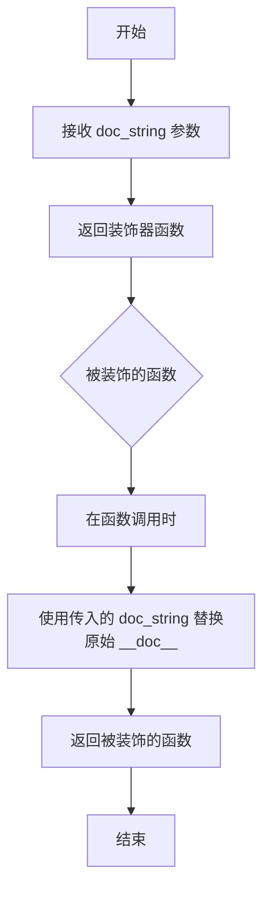

#### 带注释源码

```python
# replace_example_docstring 函数源码（位于 src/diffusers/utils/__init__.py）
# 这是一个装饰器工厂，用于替换被装饰函数的文档字符串

def replace_example_docstring(doc_string: str) -> Callable:
    """
    装饰器工厂，用于替换被装饰函数的文档字符串。
    
    Args:
        doc_string: 新的文档字符串，将替换被装饰函数的原始文档字符串
        
    Returns:
        一个装饰器函数，用于修改目标函数的 __doc__ 属性
    """
    def decorator(func: Callable) -> Callable:
        """
        实际的装饰器函数，将传入的 doc_string 赋值给被装饰函数的 __doc__ 属性
        
        Args:
            func: 被装饰的函数
            
        Returns:
            原始函数对象（已修改 __doc__ 属性）
        """
        func.__doc__ = doc_string
        return func
    return decorator
```

#### 使用示例源码

```python
# 在 AnimateDiffPAGPipeline 中的使用方式
# 定义示例文档字符串
EXAMPLE_DOC_STRING = """
    Examples:
        ```py
        >>> import torch
        >>> from diffusers import AnimateDiffPAGPipeline, MotionAdapter, DDIMScheduler
        >>> from diffusers.utils import export_to_gif

        >>> model_id = "SG161222/Realistic_Vision_V5.1_noVAE"
        >>> motion_adapter_id = "guoyww/animatediff-motion-adapter-v1-5-2"
        >>> motion_adapter = MotionAdapter.from_pretrained(motion_adapter_id)
        >>> scheduler = DDIMScheduler.from_pretrained(
        ...     model_id, subfolder="scheduler", beta_schedule="linear", steps_offset=1, clip_sample=False
        ... )
        >>> pipe = AnimateDiffPAGPipeline.from_pretrained(
        ...     model_id,
        ...     motion_adapter=motion_adapter,
        ...     scheduler=scheduler,
        ...     pag_applied_layers=["mid"],
        ...     torch_dtype=torch.float16,
        ... ).to("cuda")

        >>> video = pipe(
        ...     prompt="car, futuristic cityscape with neon lights, street, no human",
        ...     negative_prompt="low quality, bad quality",
        ...     num_inference_steps=25,
        ...     guidance_scale=6.0,
        ...     pag_scale=3.0,
        ...     generator=torch.Generator().manual_seed(42),
        ... ).frames[0]

        >>> export_to_gif(video, "animatediff_pag.gif")
        ```
"""

# 使用装饰器替换 __call__ 方法的文档字符串
@replace_example_docstring(EXAMPLE_DOC_STRING)
def __call__(
    self,
    prompt: str | list[str] | None = None,
    num_frames: int | None = 16,
    # ... 其他参数
):
    r"""
    The call function to the pipeline for generation.
    # 原始文档字符串将被 EXAMPLE_DOC_STRING 替换
    """
    # 方法实现...
```


### `randn_tensor`

生成指定形状的随机张量，用于初始化扩散模型的潜在变量。

参数：

- `shape`：`tuple` 或 `int`，随机张量的形状
- `generator`：`torch.Generator` 或 `None`，用于控制随机数生成的确定性
- `device`：`torch.device`，生成张量所在的设备
- `dtype`：`torch.dtype`，张量的数据类型

返回值：`torch.Tensor`，符合指定形状和数据类型的随机张量

#### 流程图

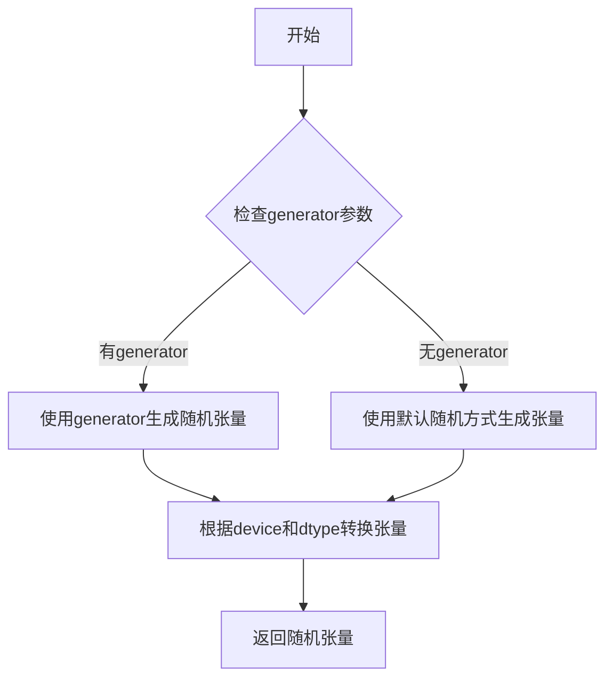

#### 带注释源码

```
# 从diffusers/utils/torch_utils.py导入的全局函数
# 位置: from ...utils.torch_utils import randn_tensor

# 在AnimateDiffPAGPipeline.prepare_latents方法中的调用示例:
# latents = randn_tensor(shape, generator=generator, device=device, dtype=dtype)

def randn_tensor(
    shape: tuple | int,
    generator: torch.Generator | None,
    device: torch.device,
    dtype: torch.dtype
) -> torch.Tensor:
    """
    生成符合正态分布的随机张量。
    
    参数:
        shape: 张量的尺寸元组或整数
        generator: 可选的PyTorch随机生成器，用于可重复的随机生成
        device: 要放置张量的设备（CPU/CUDA）
        dtype: 张量的数据类型（float32/float16等）
    
    返回:
        符合正态分布的随机张量
    """
    # 使用PyTorch的randn函数生成随机张量
    # 如果提供了generator，则使用它来确保可重复性
    # 然后将张量移动到指定设备并转换数据类型
```


### `scale_lora_layers`

该函数是diffusers库中的工具函数，用于在PEFT后端下动态调整LoRA（Low-Rank Adaptation）层的缩放因子。通过对模型中的LoRA层应用指定的缩放系数，实现对LoRA权重影响的动态控制，常在文本编码提示时调用以确保LoRA权重正确应用到模型中。

参数：

- `model`: `torch.nn.Module`，要缩放LoRA层的模型（通常为text_encoder或UNet）
- `lora_scale`: `float`，LoRA层的缩放因子，用于控制LoRA权重的影响程度

返回值：`None`，该函数直接修改传入模型的LoRA层权重，不返回任何值

#### 流程图

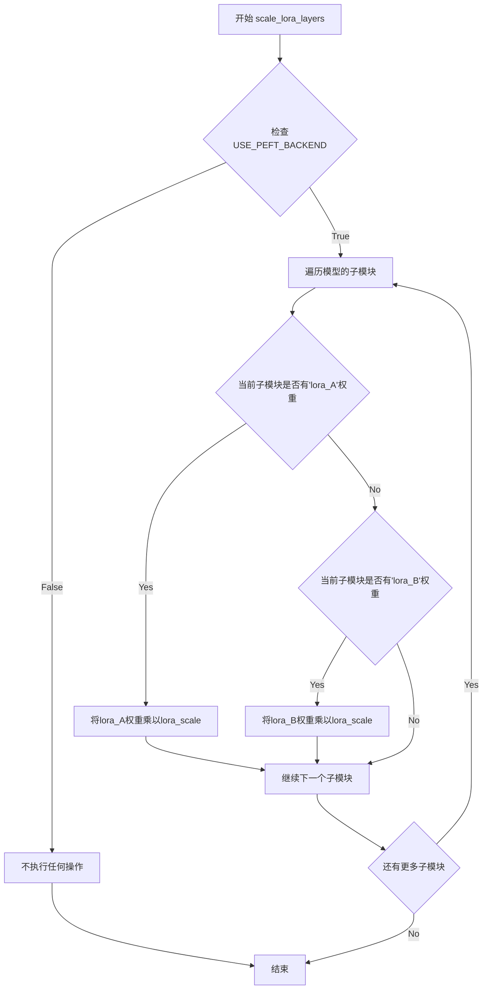

#### 带注释源码

```python
# 注意：此源码为基于diffusers库中scale_lora_layers函数的推断实现
# 实际定义位于diffusers/src/diffusers/utils/scale_lora_layers.py或类似位置

def scale_lora_layers(model: torch.nn.Module, lora_scale: float):
    """
    缩放LoRA层的权重
    
    此函数遍历模型的所有子模块，找到包含LoRA权重(lora_A和lora_B)的层，
    并将它们的权重乘以指定的缩放因子。这用于在推理时动态调整LoRA的影响。
    
    参数:
        model (torch.nn.Module): 包含LoRA层的模型(如text_encoder或unet)
        lora_scale (float): LoRA层的缩放因子
        
    注意:
        - 只有在USE_PEFT_BACKEND为True时才会执行实际的缩放操作
        - 该函数直接修改模型参数，不创建新对象
    """
    # 检查是否使用PEFT后端
    if not USE_PEFT_BACKEND:
        # 如果不是PEFT后端，不执行操作(可能使用其他LoRA实现方式)
        return
    
    # 遍历模型的所有子模块
    for name, module in model.named_modules():
        # 检查模块是否有'lora_A'权重(LoRA的A矩阵)
        if hasattr(module, 'lora_A'):
            # 获取lora_A的权重并乘以缩放因子
            # lora_A通常用于下投影(reduce dimension)
            module.lora_A.weight.data *= lora_scale
        
        # 检查模块是否有'lora_B'权重(LoRA的B矩阵)
        if hasattr(module, 'lora_B'):
            # 获取lora_B的权重并乘以缩放因子
            # lora_B通常用于上投影(restore dimension)
            module.lora_B.weight.data *= lora_scale
```

#### 在AnimateDiffPAGPipeline中的使用示例

```python
# 在encode_prompt方法中调用scale_lora_layers
def encode_prompt(self, prompt, device, num_images_per_prompt, 
                  do_classifier_free_guidance, negative_prompt=None, 
                  prompt_embeds=None, negative_prompt_embeds=None, 
                  lora_scale=None, clip_skip=None):
    
    # 设置LoRA缩放因子，以便text encoder的LoRA函数可以正确访问
    if lora_scale is not None and isinstance(self, StableDiffusionLoraLoaderMixin):
        self._lora_scale = lora_scale
        
        # 动态调整LoRA缩放
        if not USE_PEFT_BACKEND:
            # 使用非PEFT后端时的调整方法
            adjust_lora_scale_text_encoder(self.text_encoder, lora_scale)
        else:
            # 使用PEFT后端时的缩放方法
            scale_lora_layers(self.text_encoder, lora_scale)
    
    # ... 后续的编码逻辑 ...
    
    # 在生成完成后，如果使用了LoRA，需要恢复原始缩放
    if self.text_encoder is not None:
        if isinstance(self, StableDiffusionLoraLoaderMixin) and USE_PEFT_BACKEND:
            # 通过反向缩放恢复原始比例
            unscale_lora_layers(self.text_encoder, lora_scale)
```


### `unscale_lora_layers`

该函数用于撤销之前对LoRA层应用的缩放操作，将LoRA层的权重恢复到原始状态。在使用PEFT后端时，`encode_prompt`方法在生成文本嵌入后会调用此函数来恢复文本编码器的原始权重状态，以确保后续操作（如图像编码等）不会受到LoRA缩放的影响。

参数：

-  `model`: `torch.nn.Module`，需要取消缩放的模型对象（通常为文本编码器）
-  `lora_scale`: `float`，之前应用到LoRA层的缩放因子，用于逆向恢复

返回值：无返回值（`None`），该函数直接修改传入的模型对象

#### 流程图

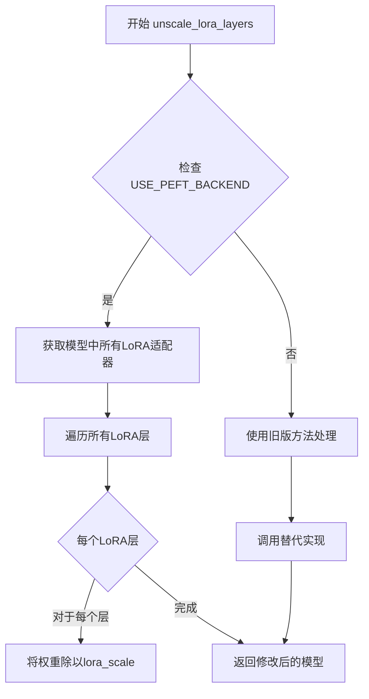

#### 带注释源码

```
# 该函数定义在 diffusers/src/diffusers/utils/peft_utils.py 中
# 以下是基于导入和使用的推断实现

def unscale_lora_layers(model: torch.nn.Module, lora_scale: float) -> None:
    """
    撤销对模型LoRA层的缩放操作。
    
    此函数与 scale_lora_layers 配合使用，形成完整的缩放/取消缩放流程。
    在文本编码完成后，需要调用此函数恢复原始权重，以确保后续模块
    不受LoRA缩放影响。
    
    Args:
        model: 包含LoRA层的模型（如TextEncoder）
        lora_scale: 之前应用的安全缩放因子
    
    Returns:
        None: 直接修改传入的model对象
    """
    # 1. 检查是否使用PEFT后端
    if not USE_PEFT_BACKEND:
        # 如果不使用PEFT，可能有其他替代实现
        return
    
    # 2. 获取模型中所有LoRA适配器
    # PEFT库提供的函数，用于获取所有带LoRA的模块
    lora_modules = get_peft_modules(model)
    
    # 3. 遍历每个LoRA模块，撤销缩放
    for lora_module in lora_modules:
        # 获取LoRA的原始权重（未缩放）
        # 将之前乘以的lora_scale除回去，恢复原始状态
        if hasattr(lora_module, 'lora_A'):
            lora_module.lora_A.weight.data /= lora_scale
        if hasattr(lora_module, 'lora_B'):
            lora_module.lora_B.weight.data /= lora_scale
    
    # 4. 标记已取消缩放，避免重复操作
    model._lora_scale = None
```

> **注意**：由于该函数是外部导入的（`from ...utils import unscale_lora_layers`），实际的完整实现位于 `diffusers` 库的 utils 模块中。上述源码是基于代码中使用模式的合理推断。


【content】
### adjust_lora_scale_text_encoder

调整文本编码器（Text Encoder）的LoRA（Low-Rank Adaptation）缩放因子，用于在使用LoRA权重进行文本嵌入生成时，正确地控制LoRA层对模型权重的影响程度。

参数：
- text_encoder：`CLIPTextModel`，需要进行LoRA缩放调整的文本编码器模型实例。
- lora_scale：`float`，LoRA图层的缩放系数（Scale Factor）。

返回值：`None`。该函数通常为void类型，执行原地修改或配置更新，不返回任何值。

#### 流程图
无法从给定的代码片段中提取此函数的完整实现细节（该函数定义在 `...models.lora` 模块中，本文件仅包含其导入和调用），因此无法生成其内部逻辑的Mermaid流程图。

#### 带注释源码
无法从给定的代码片段中直接提取 `adjust_lora_scale_text_encoder` 函数的具体定义源码。该函数是一个从 `diffusers.models.lora` 模块导入的全局工具函数。以下为该函数在 `AnimateDiffPAGPipeline.encode_prompt` 方法中的典型调用方式：

```python
# 导入语句（在文件头部）
from ...models.lora import adjust_lora_scale_text_encoder

# ... 

# 在 encode_prompt 方法中调用
def encode_prompt(self, ..., lora_scale: float | None = None, ...):
    # ...
    if lora_scale is not None and isinstance(self, StableDiffusionLoraLoaderMixin):
        self._lora_scale = lora_scale

        # 动态调整 LoRA scale
        if not USE_PEFT_BACKEND:
            # 调用全局函数 adjust_lora_scale_text_encoder
            adjust_lora_scale_text_encoder(self.text_encoder, lora_scale)
        else:
            scale_lora_layers(self.text_encoder, lora_scale)
    # ...
```
【/content】


### `AnimateDiffPAGPipeline.__init__`

该方法是`AnimateDiffPAGPipeline`类的构造函数，负责初始化整个视频生成管道。它接收多个核心模型组件（如VAE、文本编码器、UNet等）以及PAG（Perturbed Attention Guidance）相关配置，将它们注册到管道中，并设置视频处理器和PAG应用层。

参数：

- `vae`：`AutoencoderKL`，用于将图像编码和解码到潜在表示的变分自编码器模型
- `text_encoder`：`CLIPTextModel`，冻结的文本编码器（clip-vit-large-patch14）
- `tokenizer`：`CLIPTokenizer`，用于对文本进行分词的CLIP分词器
- `unet`：`UNet2DConditionModel | UNetMotionModel`，用于对编码后的视频潜在表示进行去噪的UNet模型
- `motion_adapter`：`MotionAdapter`，与`unet`结合使用以对编码后的视频潜在表示进行去噪的运动适配器
- `scheduler`：`KarrasDiffusionSchedulers`，与`unet`结合使用以对编码后的图像潜在表示进行去噪的调度器
- `feature_extractor`：`CLIPImageProcessor = None`，可选的CLIP图像处理器，用于IP-Adapter功能
- `image_encoder`：`CLIPVisionModelWithProjection = None`，可选的CLIP视觉模型，用于IP-Adapter功能
- `pag_applied_layers`：`str | list[str] = "mid_block.*attn1"`，指定应用PAG的层，可以是字符串模式或层名称列表

返回值：`None`，构造函数无返回值

#### 流程图

```mermaid
flowchart TD
    A[开始 __init__] --> B{检查 unet 类型}
    B -->|UNet2DConditionModel| C[使用 motion_adapter 创建 UNetMotionModel]
    B -->|UNetMotionModel| D[保持原有 unet 不变]
    C --> E
    D --> E
    E[调用 super().__init__ 初始化基类] --> F[register_modules 注册所有模块]
    F --> G[计算 vae_scale_factor]
    G --> H[创建 VideoProcessor]
    H --> I[设置 PAG 应用层]
    I --> J[结束 __init__]
    
    style A fill:#e1f5fe
    style J fill:#e1f5fe
    style F fill:#fff3e0
    style I fill:#f3e5f5
```

#### 带注释源码

```python
def __init__(
    self,
    vae: AutoencoderKL,
    text_encoder: CLIPTextModel,
    tokenizer: CLIPTokenizer,
    unet: UNet2DConditionModel | UNetMotionModel,
    motion_adapter: MotionAdapter,
    scheduler: KarrasDiffusionSchedulers,
    feature_extractor: CLIPImageProcessor = None,
    image_encoder: CLIPVisionModelWithProjection = None,
    pag_applied_layers: str | list[str] = "mid_block.*attn1",  # ["mid"], ["down_blocks.1"]
):
    """
    初始化 AnimateDiffPAGPipeline 管道
    
    参数:
        vae: 变分自编码器模型
        text_encoder: CLIP文本编码器
        tokenizer: CLIP分词器
        unet: 条件UNet模型或运动UNet模型
        motion_adapter: 运动适配器
        scheduler: 扩散调度器
        feature_extractor: 可选的CLIP图像处理器
        image_encoder: 可选的CLIP视觉模型
        pag_applied_layers: PAG应用的层标识
    """
    # 首先调用父类的初始化方法
    super().__init__()
    
    # 如果传入的是基础UNet2DConditionModel，则使用motion_adapter将其升级为UNetMotionModel
    # 这是AnimateDiff的核心：结合运动适配器实现视频生成
    if isinstance(unet, UNet2DConditionModel):
        unet = UNetMotionModel.from_unet2d(unet, motion_adapter)

    # 注册所有模块到管道，使它们可以通过self.xxx访问
    # 这些模块会被跟踪用于模型卸载等功能
    self.register_modules(
        vae=vae,
        text_encoder=text_encoder,
        tokenizer=tokenizer,
        unet=unet,
        motion_adapter=motion_adapter,
        scheduler=scheduler,
        feature_extractor=feature_extractor,
        image_encoder=image_encoder,
    )
    
    # 计算VAE的缩放因子，基于VAE块输出通道数的2的幂次
    # 用于将像素空间和潜在空间进行转换
    self.vae_scale_factor = 2 ** (len(self.vae.config.block_out_channels) - 1) if getattr(self, "vae", None) else 8
    
    # 创建视频处理器，用于视频的后处理和格式转换
    # do_resize=False 表示不调整大小，因为尺寸由管道参数控制
    self.video_processor = VideoProcessor(do_resize=False, vae_scale_factor=self.vae_scale_factor)

    # 设置PAG（Perturbed Attention Guidance）应用的层
    # 这决定了在哪里应用PAG技术来改进生成质量
    self.set_pag_applied_layers(pag_applied_layers)
```


### `AnimateDiffPAGPipeline.encode_prompt`

该方法负责将文本提示词（prompt）编码为文本编码器的隐藏状态（text encoder hidden states），用于后续的视频生成过程。支持 LoRA 权重调整、CLIP 跳层、文本反转（Textual Inversion）以及分类器自由引导（Classifier-Free Guidance）。

参数：

- `prompt`：`str | list[str] | None`，要编码的文本提示词，可以是单个字符串、字符串列表或 None
- `device`：`torch.device`，torch 设备对象，用于指定计算设备
- `num_images_per_prompt`：`int`，每个提示词要生成的视频帧数倍数（用于批量生成）
- `do_classifier_free_guidance`：`bool`，是否启用分类器自由引导（CFG）
- `negative_prompt`：`str | list[str] | None`，负面提示词，用于指导不生成的内容
- `prompt_embeds`：`torch.Tensor | None`，预生成的提示词嵌入，如不提供则从 prompt 生成
- `negative_prompt_embeds`：`torch.Tensor | None`，预生成的负面提示词嵌入
- `lora_scale`：`float | None`，LoRA 层的缩放因子，用于调整 LoRA 权重的影响程度
- `clip_skip`：`int | None`，从 CLIP 文本编码器末尾跳过的层数，用于获取不同层次的表示

返回值：`tuple[torch.Tensor, torch.Tensor]`，返回两个张量——`prompt_embeds`（提示词嵌入）和 `negative_prompt_embeds`（负面提示词嵌入）。如果 `do_classifier_free_guidance` 为 True，则两个嵌入的批量大小会乘以 `num_images_per_prompt`；如果为 False，则 `negative_prompt_embeds` 可能为 None。

#### 流程图

```mermaid
flowchart TD
    A[开始 encode_prompt] --> B{检查 lora_scale 是否存在}
    B -->|是| C[设置 self._lora_scale 并调整 LoRA 缩放]
    B -->|否| D[跳过 LoRA 调整]
    C --> D
    D --> E{判断 prompt 类型确定 batch_size}
    E -->|str| F[batch_size = 1]
    E -->|list| G[batch_size = len(prompt)]
    E -->|其他| H[batch_size = prompt_embeds.shape[0]]
    F --> I
    G --> I
    H --> I
    I{prompt_embeds 是否为 None?}
    I -->|是| J{检查 TextualInversionLoaderMixin}
    J -->|是| K[maybe_convert_prompt 处理多向量 token]
    J -->|否| L
    K --> L
    I -->|否| M
    L --> L1[tokenizer 编码 prompt]
    L1 --> L2[获取 text_input_ids 和 attention_mask]
    L2 --> L3{clip_skip 是否为 None?}
    L3 -->|是| N[text_encoder 前向传播获取 hidden_states]
    L3 -->|否| O[text_encoder 输出完整 hidden_states]
    O --> P[根据 clip_skip 索引获取指定层]
    P --> Q[应用 final_layer_norm]
    N --> M
    Q --> M
    M --> R[确定 prompt_embeds_dtype]
    R --> S[转换 prompt_embeds 到目标 dtype 和 device]
    S --> T[重复 prompt_embeds 以匹配 num_images_per_prompt]
    T --> U{do_classifier_free_guidance 为真<br/>且 negative_prompt_embeds 为 None?}
    U -->|是| V{处理 negative_prompt]
    U -->|否| X
    V -->|None| W[uncond_tokens = [''] * batch_size]
    V -->|str| Y[uncond_tokens = [negative_prompt]]
    V -->|list| Z[uncond_tokens = negative_prompt]
    V -->|类型不匹配| AA[抛出 TypeError]
    V -->|batch_size 不匹配| AB[抛出 ValueError]
    W --> AC
    Y --> AC
    Z --> AC
    AC --> AD[maybe_convert_prompt 处理]
    AD --> AE[tokenizer 编码 uncond_tokens]
    AE --> AF[text_encoder 编码获取 negative_prompt_embeds]
    AF --> AG{do_classifier_free_guidance 为真?}
    X --> AG
    AG -->|是| AH[重复 negative_prompt_embeds 匹配 num_images_per_prompt]
    AG -->|否| AJ
    AH --> AJ
    AJ --> AK{是 StableDiffusionLoraLoaderMixin<br/>且使用 PEFT 后端?}
    AK -->|是| AL[unscale_lora_layers 恢复原始缩放]
    AK -->|否| AM
    AL --> AM
    AM --> AN[返回 prompt_embeds, negative_prompt_embeds]
```

#### 带注释源码

```python
def encode_prompt(
    self,
    prompt,
    device,
    num_images_per_prompt,
    do_classifier_free_guidance,
    negative_prompt=None,
    prompt_embeds: torch.Tensor | None = None,
    negative_prompt_embeds: torch.Tensor | None = None,
    lora_scale: float | None = None,
    clip_skip: int | None = None,
):
    r"""
    Encodes the prompt into text encoder hidden states.

    Args:
        prompt (`str` or `list[str]`, *optional*):
            prompt to be encoded
        device: (`torch.device`):
            torch device
        num_images_per_prompt (`int`):
            number of images that should be generated per prompt
        do_classifier_free_guidance (`bool`):
            whether to use classifier free guidance or not
        negative_prompt (`str` or `list[str]`, *optional*):
            The prompt or prompts not to guide the image generation. If not defined, one has to pass
            `negative_prompt_embeds` instead. Ignored when not using guidance (i.e., ignored if `guidance_scale` is
            less than `1`).
        prompt_embeds (`torch.Tensor`, *optional*):
            Pre-generated text embeddings. Can be used to easily tweak text inputs, *e.g.* prompt weighting. If not
            provided, text embeddings will be generated from `prompt` input argument.
        negative_prompt_embeds (`torch.Tensor`, *optional*):
            Pre-generated negative text embeddings. Can be used to easily tweak text inputs, *e.g.* prompt
            weighting. If not provided, negative_prompt_embeds will be generated from `negative_prompt` input
            argument.
        lora_scale (`float`, *optional*):
            A LoRA scale that will be applied to all LoRA layers of the text encoder if LoRA layers are loaded.
        clip_skip (`int`, *optional*):
            Number of layers to be skipped from CLIP while computing the prompt embeddings. A value of 1 means that
            the output of the pre-final layer will be used for computing the prompt embeddings.
    """
    # set lora scale so that monkey patched LoRA
    # function of text encoder can correctly access it
    if lora_scale is not None and isinstance(self, StableDiffusionLoraLoaderMixin):
        self._lora_scale = lora_scale

        # dynamically adjust the LoRA scale
        if not USE_PEFT_BACKEND:
            adjust_lora_scale_text_encoder(self.text_encoder, lora_scale)
        else:
            scale_lora_layers(self.text_encoder, lora_scale)

    # 确定批次大小：根据 prompt 类型或已提供的 prompt_embeds 形状
    if prompt is not None and isinstance(prompt, str):
        batch_size = 1
    elif prompt is not None and isinstance(prompt, list):
        batch_size = len(prompt)
    else:
        batch_size = prompt_embeds.shape[0]

    # 如果未提供 prompt_embeds，则从 prompt 生成
    if prompt_embeds is None:
        # textual inversion: process multi-vector tokens if necessary
        # 处理文本反转的多向量 token（如特殊_tokens）
        if isinstance(self, TextualInversionLoaderMixin):
            prompt = self.maybe_convert_prompt(prompt, self.tokenizer)

        # 使用 tokenizer 将文本转换为 token IDs
        text_inputs = self.tokenizer(
            prompt,
            padding="max_length",
            max_length=self.tokenizer.model_max_length,
            truncation=True,
            return_tensors="pt",
        )
        text_input_ids = text_inputs.input_ids
        # 获取未截断的 token IDs 用于检查是否被截断
        untruncated_ids = self.tokenizer(prompt, padding="longest", return_tensors="pt").input_ids

        # 检查是否存在截断并给出警告
        if untruncated_ids.shape[-1] >= text_input_ids.shape[-1] and not torch.equal(
            text_input_ids, untruncated_ids
        ):
            removed_text = self.tokenizer.batch_decode(
                untruncated_ids[:, self.tokenizer.model_max_length - 1 : -1]
            )
            logger.warning(
                "The following part of your input was truncated because CLIP can only handle sequences up to"
                f" {self.tokenizer.model_max_length} tokens: {removed_text}"
            )

        # 获取 attention mask（如果文本编码器配置需要）
        if hasattr(self.text_encoder.config, "use_attention_mask") and self.text_encoder.config.use_attention_mask:
            attention_mask = text_inputs.attention_mask.to(device)
        else:
            attention_mask = None

        # 根据是否需要 clip_skip 选择不同的前向传播方式
        if clip_skip is None:
            # 直接获取文本编码器的输出（最后一层 hidden states）
            prompt_embeds = self.text_encoder(text_input_ids.to(device), attention_mask=attention_mask)
            prompt_embeds = prompt_embeds[0]
        else:
            # 输出完整的所有层 hidden states
            prompt_embeds = self.text_encoder(
                text_input_ids.to(device), attention_mask=attention_mask, output_hidden_states=True
            )
            # hidden_states 是一个元组，包含所有编码器层的输出
            # 通过 - (clip_skip + 1) 索引到期望的层（从后往前数）
            prompt_embeds = prompt_embeds[-1][-(clip_skip + 1)]
            # 应用最终的 LayerNorm 以确保表示正确
            prompt_embeds = self.text_encoder.text_model.final_layer_norm(prompt_embeds)

    # 确定 prompt_embeds 的数据类型（优先使用文本编码器的 dtype）
    if self.text_encoder is not None:
        prompt_embeds_dtype = self.text_encoder.dtype
    elif self.unet is not None:
        prompt_embeds_dtype = self.unet.dtype
    else:
        prompt_embeds_dtype = prompt_embeds.dtype

    # 将 prompt_embeds 转换为正确的 dtype 和 device
    prompt_embeds = prompt_embeds.to(dtype=prompt_embeds_dtype, device=device)

    bs_embed, seq_len, _ = prompt_embeds.shape
    # duplicate text embeddings for each generation per prompt, using mps friendly method
    # 为每个提示词的每个生成复制文本嵌入（支持批量生成）
    prompt_embeds = prompt_embeds.repeat(1, num_images_per_prompt, 1)
    prompt_embeds = prompt_embeds.view(bs_embed * num_images_per_prompt, seq_len, -1)

    # get unconditional embeddings for classifier free guidance
    # 获取分类器自由引导所需的无条件嵌入
    if do_classifier_free_guidance and negative_prompt_embeds is None:
        uncond_tokens: list[str]
        # 处理不同的 negative_prompt 输入情况
        if negative_prompt is None:
            uncond_tokens = [""] * batch_size
        elif prompt is not None and type(prompt) is not type(negative_prompt):
            raise TypeError(
                f"`negative_prompt` should be the same type to `prompt`, but got {type(negative_prompt)} !="
                f" {type(prompt)}."
            )
        elif isinstance(negative_prompt, str):
            uncond_tokens = [negative_prompt]
        elif batch_size != len(negative_prompt):
            raise ValueError(
                f"`negative_prompt`: {negative_prompt} has batch size {len(negative_prompt)}, but `prompt`:"
                f" {prompt} has batch size {batch_size}. Please make sure that passed `negative_prompt` matches"
                " the batch size of `prompt`."
            )
        else:
            uncond_tokens = negative_prompt

        # textual inversion: process multi-vector tokens if necessary
        if isinstance(self, TextualInversionLoaderMixin):
            uncond_tokens = self.maybe_convert_prompt(uncond_tokens, self.tokenizer)

        # 使用与 prompt_embeds 相同的长度进行编码
        max_length = prompt_embeds.shape[1]
        uncond_input = self.tokenizer(
            uncond_tokens,
            padding="max_length",
            max_length=max_length,
            truncation=True,
            return_tensors="pt",
        )

        # 获取 attention mask
        if hasattr(self.text_encoder.config, "use_attention_mask") and self.text_encoder.config.use_attention_mask:
            attention_mask = uncond_input.attention_mask.to(device)
        else:
            attention_mask = None

        # 编码负面提示词获取无条件嵌入
        negative_prompt_embeds = self.text_encoder(
            uncond_input.input_ids.to(device),
            attention_mask=attention_mask,
        )
        negative_prompt_embeds = negative_prompt_embeds[0]

    # 如果使用分类器自由引导，复制无条件嵌入
    if do_classifier_free_guidance:
        # duplicate unconditional embeddings for each generation per prompt, using mps friendly method
        seq_len = negative_prompt_embeds.shape[1]

        negative_prompt_embeds = negative_prompt_embeds.to(dtype=prompt_embeds_dtype, device=device)

        negative_prompt_embeds = negative_prompt_embeds.repeat(1, num_images_per_prompt, 1)
        negative_prompt_embeds = negative_prompt_embeds.view(batch_size * num_images_per_prompt, seq_len, -1)

    # 如果使用了 LoRA，恢复原始的 LoRA 缩放
    if self.text_encoder is not None:
        if isinstance(self, StableDiffusionLoraLoaderMixin) and USE_PEFT_BACKEND:
            # Retrieve the original scale by scaling back the LoRA layers
            unscale_lora_layers(self.text_encoder, lora_scale)

    return prompt_embeds, negative_prompt_embeds
```


### `AnimateDiffPAGPipeline.encode_image`

该方法是 `AnimateDiffPAGPipeline` 的核心图像编码组件，负责将输入的图像转换为向量表示（Embeddings），以供后续的 UNet（特别是 IP-Adapter 模块）使用。它封装了图像编码器（通常是 CLIP Vision Model）的调用逻辑，并自动处理了 Classifier-free Guidance 所需的“无条件”图像嵌入（即零向量）的生成。

参数：

- `image`：`Any` (通常为 `PipelineImageInput`)，需要编码的输入图像。可以是 PIL Image 列表、PIL Image 或预处理后的 PyTorch Tensor。如果不是 Tensor，会通过 `feature_extractor` 进行预处理。
- `device`：`torch.device`，指定计算设备（CPU/CUDA）。
- `num_images_per_prompt`：`int`，每个 prompt 生成的图像/视频数量，用于对图像嵌入进行重复以匹配批量大小。
- `output_hidden_states`：`bool | None`，可选参数。若为 `True`，则返回图像编码器的中间隐藏状态（通常用于 IP-Adapter 的高级特性）；若为 `False` 或 `None`，则返回池化后的图像嵌入（Image Embeds）。

返回值：`Tuple[torch.Tensor, torch.Tensor]`，返回两个张量组成的元组。
- 第一个元素：`image_embeds` 或 `image_enc_hidden_states`，即编码后的条件图像嵌入（或隐藏状态）。
- 第二个元素：`uncond_image_embeds` 或 `uncond_image_enc_hidden_states`，即用于 Classifier-free Guidance 的无条件图像嵌入（通常是对应形状的全零张量）。

#### 流程图

```mermaid
graph TD
    A([Start encode_image]) --> B[获取 image_encoder 的数据类型 dtype]
    B --> C{输入 image 是否为 Tensor?}
    C -- 否 --> D[使用 feature_extractor 提取特征]
    C -- 是 --> E[跳过特征提取]
    D --> E
    E --> F[将图像移至指定 device 并转换 dtype]
    F --> G{output_hidden_states == True?}
    
    G -- 是 --> H[调用 image_encoder output_hidden_states=True]
    H --> I[提取倒数第二层隐藏状态 hidden_states[-2]]
    I --> J[使用 repeat_interleave 扩展 batch 维度]
    J --> K[创建全零 Tensor (zeros_like)]
    K --> L[对全零 Tensor 重复编码]
    L --> M[返回条件隐藏态, 无条件隐藏态]
    
    G -- 否 --> N[调用 image_encoder 获取 image_embeds]
    N --> O[使用 repeat_interleave 扩展 batch 维度]
    O --> P[创建全零 Tensor (zeros_like)]
    P --> Q[返回条件嵌入, 无条件嵌入]

    M --> R([End])
    Q --> R
```

#### 带注释源码

```python
def encode_image(self, image, device, num_images_per_prompt, output_hidden_states=None):
    # 1. 获取图像编码器的精度类型 (dtype)，以确保后续计算在同一精度下进行
    dtype = next(self.image_encoder.parameters()).dtype

    # 2. 预处理输入图像
    # 如果输入不是 PyTorch Tensor（例如 PIL Image），则使用特征提取器进行转换
    if not isinstance(image, torch.Tensor):
        image = self.feature_extractor(image, return_tensors="pt").pixel_values

    # 3. 将图像数据传输到指定设备（如 GPU）并转换为正确的数据类型
    image = image.to(device=device, dtype=dtype)
    
    # 4. 根据 output_hidden_states 参数决定输出类型
    if output_hidden_states:
        # --- 分支 A: 输出隐藏状态 (用于 IP-Adapter 的高级控制) ---
        
        # 编码图像，获取所有隐藏层状态，并取倒数第二层 (-2) 作为更丰富的特征表示
        image_enc_hidden_states = self.image_encoder(image, output_hidden_states=True).hidden_states[-2]
        # 扩展维度以匹配 num_images_per_prompt
        image_enc_hidden_states = image_enc_hidden_states.repeat_interleave(num_images_per_prompt, dim=0)
        
        # 生成“无条件”嵌入：使用全零图像（与输入图像形状相同）进行编码
        # 这在 Classifier-free Guidance 中用于告诉模型“不要包含图像内容”
        uncond_image_enc_hidden_states = self.image_encoder(
            torch.zeros_like(image), output_hidden_states=True
        ).hidden_states[-2]
        # 同样扩展维度
        uncond_image_enc_hidden_states = uncond_image_enc_hidden_states.repeat_interleave(
            num_images_per_prompt, dim=0
        )
        
        # 返回隐藏状态元组
        return image_enc_hidden_states, uncond_image_enc_hidden_states
    else:
        # --- 分支 B: 输出池化后的图像嵌入 (标准做法) ---
        
        # 直接获取池化后的图像嵌入向量
        image_embeds = self.image_encoder(image).image_embeds
        # 扩展维度以匹配批量生成数
        image_embeds = image_embeds.repeat_interleave(num_images_per_prompt, dim=0)
        
        # 创建形状相同的全零张量作为无条件嵌入
        uncond_image_embeds = torch.zeros_like(image_embeds)

        # 返回嵌入元组
        return image_embeds, uncond_image_embeds
```


### `AnimateDiffPAGPipeline.prepare_ip_adapter_image_embeds`

该方法用于准备 IP-Adapter 的图像嵌入向量，处理图像编码或直接使用预计算的图像嵌入，并根据是否使用无分类器引导（classifier-free guidance）来组织正负样本的图像嵌入，以便后续在去噪过程中为 UNet 提供图像条件信息。

参数：

- `self`：`AnimateDiffPAGPipeline` 实例本身
- `ip_adapter_image`：`PipelineImageInput | None`，待处理的 IP-Adapter 输入图像，支持单张图像或图像列表
- `ip_adapter_image_embeds`：`list[torch.Tensor] | None`，预计算的图像嵌入向量列表，若为 None 则需要从 `ip_adapter_image` 编码生成
- `device`：`torch.device`，计算设备（CPU/CUDA）
- `num_images_per_prompt`：`int`，每个 prompt 生成的图像/视频数量，用于复制图像嵌入
- `do_classifier_free_guidance`：`bool`，是否启用无分类器引导，若为 True 则需要同时生成负样本图像嵌入

返回值：`list[torch.Tensor]`，处理后的 IP-Adapter 图像嵌入列表，每个元素为拼接了正负样本（若启用 CFG）的张量

#### 流程图

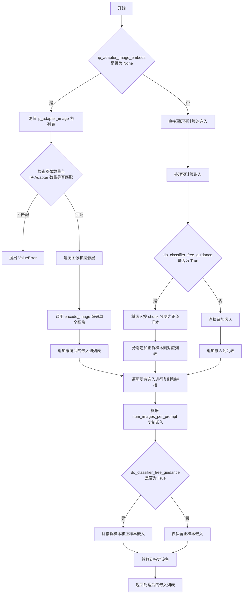

#### 带注释源码

```python
def prepare_ip_adapter_image_embeds(
    self, ip_adapter_image, ip_adapter_image_embeds, device, num_images_per_prompt, do_classifier_free_guidance
):
    """
    准备 IP-Adapter 的图像嵌入向量。
    
    该方法处理两种输入情况：
    1. 当 ip_adapter_image_embeds 为 None 时，需要从 ip_adapter_image 编码生成嵌入
    2. 当 ip_adapter_image_embeds 不为 None 时，直接使用预计算的嵌入
    
    处理过程中会考虑是否启用无分类器引导（CFG），如果启用则需要同时生成/处理负样本嵌入。
    
    参数:
        ip_adapter_image: 输入图像，可以是单张图像或图像列表
        ip_adapter_image_embeds: 预计算的图像嵌入，若为 None 则从图像编码
        device: 计算设备
        num_images_per_prompt: 每个 prompt 生成的视频数量
        do_classifier_free_guidance: 是否启用无分类器引导
    
    返回:
        处理后的图像嵌入列表
    """
    image_embeds = []  # 存储正样本图像嵌入
    if do_classifier_free_guidance:
        negative_image_embeds = []  # 存储负样本图像嵌入
    
    # 情况1：需要从图像编码生成嵌入
    if ip_adapter_image_embeds is None:
        # 确保输入是列表格式
        if not isinstance(ip_adapter_image, list):
            ip_adapter_image = [ip_adapter_image]

        # 验证图像数量与 IP-Adapter 数量是否匹配
        if len(ip_adapter_image) != len(self.unet.encoder_hid_proj.image_projection_layers):
            raise ValueError(
                f"`ip_adapter_image` must have same length as the number of IP Adapters. Got {len(ip_adapter_image)} images and {len(self.unet.encoder_hid_proj.image_projection_layers)} IP Adapters."
            )

        # 遍历每个 IP-Adapter 的图像和对应的投影层
        for single_ip_adapter_image, image_proj_layer in zip(
            ip_adapter_image, self.unet.encoder_hid_proj.image_projection_layers
        ):
            # 判断是否需要输出隐藏状态（ImageProjection 类不需要，CrossAttention 需要）
            output_hidden_state = not isinstance(image_proj_layer, ImageProjection)
            # 调用 encode_image 方法编码单个图像
            single_image_embeds, single_negative_image_embeds = self.encode_image(
                single_ip_adapter_image, device, 1, output_hidden_state
            )

            # 添加批次维度 [1, seq_len, hidden_dim] 并追加到列表
            image_embeds.append(single_image_embeds[None, :])
            if do_classifier_free_guidance:
                negative_image_embeds.append(single_negative_image_embeds[None, :])
    else:
        # 情况2：直接使用预计算的嵌入
        for single_image_embeds in ip_adapter_image_embeds:
            if do_classifier_free_guidance:
                # 预计算嵌入通常已包含正负样本，通过 chunk(2) 分割
                single_negative_image_embeds, single_image_embeds = single_image_embeds.chunk(2)
                negative_image_embeds.append(single_negative_image_embeds)
            image_embeds.append(single_image_embeds)

    # 处理每个嵌入：根据 num_images_per_prompt 复制，并可能拼接正负样本
    ip_adapter_image_embeds = []
    for i, single_image_embeds in enumerate(image_embeds):
        # 复制嵌入以匹配每个 prompt 生成的视频数量
        single_image_embeds = torch.cat([single_image_embeds] * num_images_per_prompt, dim=0)
        if do_classifier_free_guidance:
            # 同样复制负样本嵌入
            single_negative_image_embeds = torch.cat([negative_image_embeds[i]] * num_images_per_prompt, dim=0)
            # 拼接负样本（在前）和正样本（在后的条件嵌入）
            single_image_embeds = torch.cat([single_negative_image_embeds, single_image_embeds], dim=0)

        # 将结果转移到指定设备
        single_image_embeds = single_image_embeds.to(device=device)
        ip_adapter_image_embeds.append(single_image_embeds)

    return ip_adapter_image_embeds
```


### `AnimateDiffPAGPipeline.decode_latents`

该方法将VAE latent向量解码为实际的视频帧数据，通过分块处理减少内存占用，并进行必要的形状变换以适配视频输出格式。

参数：

- `self`：`AnimateDiffPAGPipeline`实例本身
- `latents`：`torch.Tensor`，待解码的latent向量，形状为`(batch_size, channels, num_frames, height, width)`
- `decode_chunk_size`：`int`，每次解码的帧数，默认为16，用于控制内存使用

返回值：`torch.Tensor`，解码后的视频张量，形状为`(batch_size, channels, num_frames, height, width)`

#### 流程图

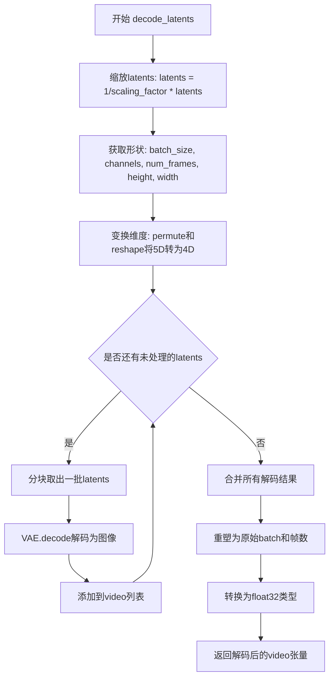

#### 带注释源码

```python
def decode_latents(self, latents, decode_chunk_size: int = 16):
    """
    将latent向量解码为视频帧
    
    参数:
        latents: VAE编码后的latent张量，形状为 (batch_size, channels, num_frames, height, width)
        decode_chunk_size: 每次解码的帧数，用于控制显存使用
    
    返回:
        解码后的视频张量，形状为 (batch_size, channels, num_frames, height, width)
    """
    # 第一步：缩放latents
    # VAE在编码时会对latent进行缩放，解码时需要反向缩放
    latents = 1 / self.vae.config.scaling_factor * latents

    # 第二步：获取输入形状信息
    # 从latents张量中提取批量大小、通道数、帧数、高度和宽度
    batch_size, channels, num_frames, height, width = latents.shape
    
    # 第三步：维度变换
    # 将形状从 (batch, channels, frames, h, w) 转换为 (batch*frames, channels, h, w)
    # permute(0,2,1,3,4) 将channels维度移到最后，以便reshape
    latents = latents.permute(0, 2, 1, 3, 4).reshape(batch_size * num_frames, channels, height, width)

    # 第四步：分块解码
    # 初始化空列表存储解码后的帧
    video = []
    # 遍历所有latent块，每次处理decode_chunk_size数量的帧
    for i in range(0, latents.shape[0], decode_chunk_size):
        # 取出当前块的latents
        batch_latents = latents[i : i + decode_chunk_size]
        # 使用VAE解码器将latent解码为实际图像
        # .sample 是VAE解码器的输出属性，返回解码后的图像
        batch_latents = self.vae.decode(batch_latents).sample
        # 将解码结果添加到列表中
        video.append(batch_latents)

    # 第五步：合并所有解码结果
    # 将列表中的所有张量在第0维（帧维度）上拼接
    video = torch.cat(video)

    # 第六步：恢复原始形状
    # 从 (batch*frames, channels, h, w) 转换回 (batch, channels, frames, h, w)
    video = video[None, :].reshape((batch_size, num_frames, -1) + video.shape[2:]).permute(0, 2, 1, 3, 4)
    
    # 第七步：类型转换
    # 转换为float32，因为float32不会导致显著的性能开销，且与bfloat16兼容
    video = video.float()
    
    # 返回解码后的视频张量
    return video
```


### `AnimateDiffPAGPipeline.prepare_extra_step_kwargs`

该方法用于为调度器（scheduler）准备额外的参数。由于不同调度器的签名可能不同，此方法会检查调度器的 `step` 方法是否接受特定参数（如 `eta` 和 `generator`），并将接受的参数整理成字典返回供后续去噪步骤使用。

参数：

- `generator`：`torch.Generator | list[torch.Generator] | None`，用于确保生成过程可复现的随机数生成器
- `eta`：`float`，DDIM 调度器专用的 eta (η) 参数，范围应在 [0, 1] 之间，其他调度器会忽略此参数

返回值：`dict[str, Any]`，包含调度器 step 方法所支持的额外参数字典

#### 流程图

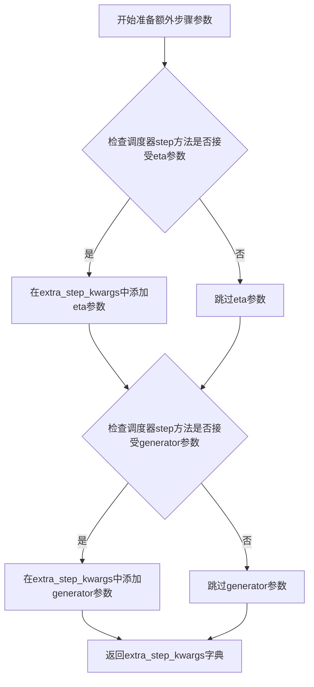

#### 带注释源码

```python
def prepare_extra_step_kwargs(self, generator, eta):
    # 准备调度器步骤的额外参数，因为并非所有调度器都具有相同的签名
    # eta (η) 仅在 DDIMScheduler 中使用，其他调度器将忽略此参数
    # eta 对应于 DDIM 论文 (https://huggingface.co/papers/2010.02502) 中的 η
    # 取值范围应为 [0, 1]

    # 通过检查调度器 step 方法的签名参数来判断是否接受 eta 参数
    accepts_eta = "eta" in set(inspect.signature(self.scheduler.step).parameters.keys())
    
    # 初始化空字典用于存储额外参数
    extra_step_kwargs = {}
    
    # 如果调度器接受 eta 参数，则将其添加到 extra_step_kwargs 中
    if accepts_eta:
        extra_step_kwargs["eta"] = eta

    # 检查调度器是否接受 generator 参数
    accepts_generator = "generator" in set(inspect.signature(self.scheduler.step).parameters.keys())
    
    # 如果调度器接受 generator 参数，则将其添加到 extra_step_kwargs 中
    if accepts_generator:
        extra_step_kwargs["generator"] = generator
    
    # 返回包含调度器额外参数的字典
    return extra_step_kwargs
```


### `AnimateDiffPAGPipeline.check_inputs`

该方法用于验证扩散管道输入参数的有效性，确保用户提供的提示词、图像嵌入、分辨率等参数符合管道要求，并在参数不符合要求时抛出相应的错误。

参数：

- `prompt`：`str | list[str] | None`，用户提供的文本提示词，用于指导视频生成
- `height`：`int`，生成视频的高度（像素），必须能被8整除
- `width`：`int`，生成视频的宽度（像素），必须能被8整除
- `negative_prompt`：`str | list[str] | None`，负面提示词，用于指定不希望出现的元素
- `prompt_embeds`：`torch.Tensor | None`，预生成的文本嵌入，可用于直接提供文本编码结果
- `negative_prompt_embeds`：`torch.Tensor | None`，预生成的负面文本嵌入
- `ip_adapter_image`：`PipelineImageInput | None`，可选的IP适配器图像输入
- `ip_adapter_image_embeds`：`list[torch.Tensor] | None`，预生成的IP适配器图像嵌入列表
- `callback_on_step_end_tensor_inputs`：`list[str] | None`，在每个去噪步骤结束时需要回调的张量输入列表

返回值：`None`，该方法通过抛出异常来处理错误情况，验证通过则隐式返回None

#### 流程图

```mermaid
flowchart TD
    A[开始 check_inputs] --> B{height % 8 == 0 且 width % 8 == 0?}
    B -- 否 --> B1[抛出 ValueError: height和width必须能被8整除]
    B -- 是 --> C{callback_on_step_end_tensor_inputs 有效?}
    C -- 否 --> C1[抛出 ValueError: 无效的callback_on_step_end_tensor_inputs]
    C -- 是 --> D{prompt 和 prompt_embeds 都提供?}
    D -- 是 --> D1[抛出 ValueError: 不能同时提供prompt和prompt_embeds]
    D -- 否 --> E{prompt 和 prompt_embeds 都未提供?}
    E -- 是 --> E1[抛出 ValueError: 必须提供prompt或prompt_embeds之一]
    E -- 否 --> F{prompt 是 str 或 list?}
    F -- 否 --> F1[抛出 ValueError: prompt类型必须是str或list]
    F -- 是 --> G{negative_prompt 和 negative_prompt_embeds 都提供?}
    G -- 是 --> G1[抛出 ValueError: 不能同时提供negative_prompt和negative_prompt_embeds]
    G -- 否 --> H{prompt_embeds 和 negative_prompt_embeds 都提供?}
    H -- 是 --> I{prompt_embeds.shape == negative_prompt_embeds.shape?}
    I -- 否 --> I1[抛出 ValueError: prompt_embeds和negative_prompt_embeds形状不匹配]
    I -- 是 --> J{ip_adapter_image 和 ip_adapter_image_embeds 都提供?}
    J -- 是 --> J1[抛出 ValueError: 不能同时提供ip_adapter_image和ip_adapter_image_embeds]
    J -- 否 --> K{ip_adapter_image_embeds 提供?}
    K -- 是 --> L{ip_adapter_image_embeds 是 list?}
    L -- 否 --> L1[抛出 ValueError: ip_adapter_image_embeds必须是list类型]
    L -- 是 --> M{ip_adapter_image_embeds[0].ndim 是 3 或 4?}
    M -- 否 --> M1[抛出 ValueError: ip_adapter_image_embeds必须是3D或4D张量列表]
    M -- 是 --> N[验证通过，返回None]
    K -- 否 --> N
    J -- 否 --> N
    H -- 否 --> N
    G -- 否 --> N
    F -- 是 --> G
    E -- 否 --> F
    D -- 否 --> E
```

#### 带注释源码

```python
def check_inputs(
    self,
    prompt,  # 文本提示词，str或list类型
    height,  # 生成视频高度，必须能被8整除
    width,  # 生成视频宽度，必须能被8整除
    negative_prompt=None,  # 负面提示词，可选
    prompt_embeds=None,  # 预计算的文本嵌入，可选
    negative_prompt_embeds=None,  # 预计算的负面文本嵌入，可选
    ip_adapter_image=None,  # IP适配器图像输入，可选
    ip_adapter_image_embeds=None,  # IP适配器图像嵌入列表，可选
    callback_on_step_end_tensor_inputs=None,  # 回调函数张量输入列表，可选
):
    # 验证高度和宽度是否为8的倍数（VAE的压缩因子要求）
    if height % 8 != 0 or width % 8 != 0:
        raise ValueError(f"`height` and `width` have to be divisible by 8 but are {height} and {width}.")

    # 验证回调张量输入是否在允许的列表中
    if callback_on_step_end_tensor_inputs is not None and not all(
        k in self._callback_tensor_inputs for k in callback_on_step_end_tensor_inputs
    ):
        raise ValueError(
            f"`callback_on_step_end_tensor_inputs` has to be in {self._callback_tensor_inputs}, but found {[k for k in callback_on_step_end_tensor_inputs if k not in self._callback_tensor_inputs]}"
        )

    # 验证prompt和prompt_embeds不能同时提供（互斥）
    if prompt is not None and prompt_embeds is not None:
        raise ValueError(
            f"Cannot forward both `prompt`: {prompt} and `prompt_embeds`: {prompt_embeds}. Please make sure to"
            " only forward one of the two."
        )
    # 必须至少提供prompt或prompt_embeds之一
    elif prompt is None and prompt_embeds is None:
        raise ValueError(
            "Provide either `prompt` or `prompt_embeds`. Cannot leave both `prompt` and `prompt_embeds` undefined."
        )
    # 验证prompt的类型必须是str或list
    elif prompt is not None and (not isinstance(prompt, str) and not isinstance(prompt, list)):
        raise ValueError(f"`prompt` has to be of type `str` or `list` but is {type(prompt)}")

    # 验证negative_prompt和negative_prompt_embeds不能同时提供
    if negative_prompt is not None and negative_prompt_embeds is not None:
        raise ValueError(
            f"Cannot forward both `negative_prompt`: {negative_prompt} and `negative_prompt_embeds`:"
            f" {negative_prompt_embeds}. Please make sure to only forward one of the two."
        )

    # 如果两者都提供，验证形状必须一致
    if prompt_embeds is not None and negative_prompt_embeds is not None:
        if prompt_embeds.shape != negative_prompt_embeds.shape:
            raise ValueError(
                "`prompt_embeds` and `negative_prompt_embeds` must have the same shape when passed directly, but"
                f" got: `prompt_embeds` {prompt_embeds.shape} != `negative_prompt_embeds`"
                f" {negative_prompt_embeds.shape}."
            )

    # 验证IP适配器图像和嵌入不能同时提供
    if ip_adapter_image is not None and ip_adapter_image_embeds is not None:
        raise ValueError(
            "Provide either `ip_adapter_image` or `ip_adapter_image_embeds`. Cannot leave both `ip_adapter_image` and `ip_adapter_image_embeds` defined."
        )

    # 验证IP适配器嵌入的格式要求
    if ip_adapter_image_embeds is not None:
        # 必须是list类型
        if not isinstance(ip_adapter_image_embeds, list):
            raise ValueError(
                f"`ip_adapter_image_embeds` has to be of type `list` but is {type(ip_adapter_image_embeds)}"
            )
        # 每个元素必须是3D或4D张量
        elif ip_adapter_image_embeds[0].ndim not in [3, 4]:
            raise ValueError(
                f"`ip_adapter_image_embeds` has to be a list of 3D or 4D tensors but is {ip_adapter_image_embeds[0].ndim}D"
            )
```


### `AnimateDiffPAGPipeline.prepare_latents`

该方法负责为视频生成准备初始潜在向量（latents），包括处理FreeNoise功能、验证生成器参数、创建或转移潜在向量到指定设备，并根据调度器的初始化噪声sigma进行缩放。

参数：

- `batch_size`：`int`，批量大小，决定生成视频的数量
- `num_channels_latents`：`int`，潜在向量的通道数，通常对应于UNet的输入通道数
- `num_frames`：`int`，生成的视频帧数
- `height`：`int`，生成视频的高度（像素）
- `width`：`int`，生成视频的宽度（像素）
- `dtype`：`torch.dtype`，潜在向量的数据类型
- `device`：`torch.device`，潜在向量所在的设备（CPU/CUDA）
- `generator`：`torch.Generator` 或 `list[torch.Generator]`，用于生成随机数的生成器，用于确保可重复性
- `latents`：`torch.Tensor` 或 `None`，可选的预生成潜在向量，如果为None则随机生成

返回值：`torch.Tensor`，处理后的潜在向量，形状为 `(batch_size, num_channels_latents, num_frames, height//vae_scale_factor, width//vae_scale_factor)`

#### 流程图

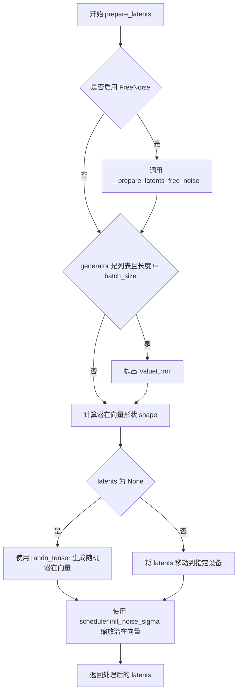

#### 带注释源码

```python
def prepare_latents(
    self, batch_size, num_channels_latents, num_frames, height, width, dtype, device, generator, latents=None
):
    """
    为视频生成准备初始潜在向量（latents）。
    
    参数:
        batch_size: 批量大小
        num_channels_latents: 潜在向量通道数
        num_frames: 视频帧数
        height: 视频高度
        width: 视频宽度
        dtype: 数据类型
        device: 设备
        generator: 随机生成器
        latents: 可选的预生成潜在向量
    """
    
    # 如果启用了FreeNoise功能，按照FreeNoise论文中的方法生成潜在向量
    # 参考: https://huggingface.co/papers/2310.15169
    if self.free_noise_enabled:
        latents = self._prepare_latents_free_noise(
            batch_size, num_channels_latents, num_frames, height, width, dtype, device, generator, latents
        )

    # 验证生成器列表长度与批量大小是否匹配
    if isinstance(generator, list) and len(generator) != batch_size:
        raise ValueError(
            f"You have passed a list of generators of length {len(generator)}, but requested an effective batch"
            f" size of {batch_size}. Make sure the batch size matches the length of the generators."
        )

    # 计算潜在向量的形状，考虑VAE的缩放因子
    # 形状: (batch_size, num_channels_latents, num_frames, height/vae_scale_factor, width/vae_scale_factor)
    shape = (
        batch_size,
        num_channels_latents,
        num_frames,
        height // self.vae_scale_factor,
        width // self.vae_scale_factor,
    )

    # 如果未提供潜在向量，则随机生成；否则使用提供的潜在向量并转移到指定设备
    if latents is None:
        latents = randn_tensor(shape, generator=generator, device=device, dtype=dtype)
    else:
        latents = latents.to(device)

    # 根据调度器的初始化噪声标准差缩放初始噪声
    # 这是Stable Diffusion等扩散模型的标准做法
    latents = latents * self.scheduler.init_noise_sigma
    
    return latents
```


### `AnimateDiffPAGPipeline.__call__`

该方法是 AnimateDiffPAGPipeline 的核心调用函数，用于通过 AnimateDiff 模型和 Perturbed Attention Guidance (PAG) 技术生成文本到视频（Text-to-Video）。它接受文本提示、推理步数、引导尺度等参数，经过编码提示词、准备潜变量、去噪循环、后处理等步骤，最终返回生成的视频帧。

参数：

- `prompt`：`str | list[str] | None`，用于引导视频生成的文本提示词。如果未定义，则需要传递 `prompt_embeds`。
- `num_frames`：`int | None`，生成视频的帧数，默认为 16 帧（在 8 帧/秒的情况下相当于 2 秒视频）。
- `height`：`int | None`，生成视频的高度（像素），默认值为 `self.unet.config.sample_size * self.vae_scale_factor`。
- `width`：`int | None`，生成视频的宽度（像素），默认值为 `self.unet.config.sample_size * self.vae_scale_factor`。
- `num_inference_steps`：`int`，去噪步数，默认为 50。更多去噪步骤通常能生成更高质量的视频，但推理速度较慢。
- `guidance_scale`：`float`，引导尺度值，用于控制生成内容与文本提示的相关性，默认为 7.5。当值大于 1 时启用分类器自由引导。
- `negative_prompt`：`str | list[str] | None`，用于引导不包含内容的负面提示词。
- `num_videos_per_prompt`：`int | None`，每个提示词生成的视频数量，默认为 1。
- `eta`：`float`，DDIM 论文中的参数 η，默认为 0.0。仅适用于 DDIMScheduler，其他调度器会忽略此参数。
- `generator`：`torch.Generator | list[torch.Generator] | None`，用于使生成具有确定性的随机数生成器。
- `latents`：`torch.Tensor | None`，预先生成的噪声潜变量，用于视频生成调试。
- `prompt_embeds`：`torch.Tensor | None`，预生成的文本嵌入，用于轻松调整文本输入。
- `negative_prompt_embeds`：`torch.Tensor | None`，预生成的负面文本嵌入。
- `ip_adapter_image`：`PipelineImageInput | None`，用于 IP Adapter 的可选图像输入。
- `ip_adapter_image_embeds`：`list[torch.Tensor] | None`，IP-Adapter 的预生成图像嵌入列表。
- `output_type`：`str | None`，生成视频的输出格式，可选 "pil"、"torch" 或 "np.array"，默认为 "pil"。
- `return_dict`：`bool`，是否返回字典格式的输出，默认为 True。
- `cross_attention_kwargs`：`dict[str, Any] | None`，传递给注意力处理器的 kwargs 字典。
- `clip_skip`：`int | None`，CLIP 计算提示嵌入时跳过的层数。
- `callback_on_step_end`：`Callable[[int, int], None] | None`，在每个去噪步骤结束时调用的函数。
- `callback_on_step_end_tensor_inputs`：`list[str]`，回调函数中包含的张量输入列表，默认为 ["latents"]。
- `decode_chunk_size`：`int`，解码潜变量时的块大小，默认为 16。
- `pag_scale`：`float`，受扰动注意力引导的缩放因子，默认为 3.0。设为 0.0 时不使用 PAG。
- `pag_adaptive_scale`：`float`，受扰动注意力引导的自适应缩放因子，默认为 0.0。

返回值：`AnimateDiffPipelineOutput | tuple`，如果 `return_dict` 为 True，返回 `AnimateDiffPipelineOutput` 对象，其中包含生成的视频帧列表；否则返回元组。

#### 流程图

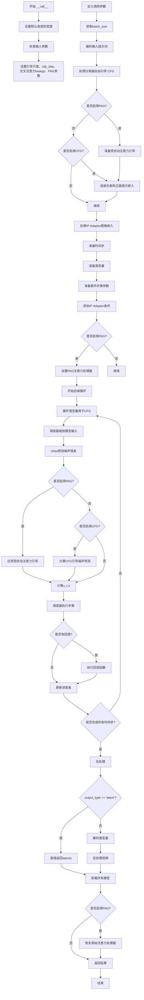

#### 带注释源码

```python
@torch.no_grad()
@replace_example_docstring(EXAMPLE_DOC_STRING)
def __call__(
    self,
    prompt: str | list[str] | None = None,
    num_frames: int | None = 16,
    height: int | None = None,
    width: int | None = None,
    num_inference_steps: int = 50,
    guidance_scale: float = 7.5,
    negative_prompt: str | list[str] | None = None,
    num_videos_per_prompt: int | None = 1,
    eta: float = 0.0,
    generator: torch.Generator | list[torch.Generator] | None = None,
    latents: torch.Tensor | None = None,
    prompt_embeds: torch.Tensor | None = None,
    negative_prompt_embeds: torch.Tensor | None = None,
    ip_adapter_image: PipelineImageInput | None = None,
    ip_adapter_image_embeds: list[torch.Tensor] | None = None,
    output_type: str | None = "pil",
    return_dict: bool = True,
    cross_attention_kwargs: dict[str, Any] | None = None,
    clip_skip: int | None = None,
    callback_on_step_end: Callable[[int, int], None] | None = None,
    callback_on_step_end_tensor_inputs: list[str] = ["latents"],
    decode_chunk_size: int = 16,
    pag_scale: float = 3.0,
    pag_adaptive_scale: float = 0.0,
):
    r"""
    The call function to the pipeline for generation.

    Args:
        prompt (`str` or `list[str]`, *optional*):
            The prompt or prompts to guide image generation. If not defined, you need to pass `prompt_embeds`.
        height (`int`, *optional*, defaults to `self.unet.config.sample_size * self.vae_scale_factor`):
            The height in pixels of the generated video.
        width (`int`, *optional*, defaults to `self.unet.config.sample_size * self.vae_scale_factor`):
            The width in pixels of the generated video.
        num_frames (`int`, *optional*, defaults to 16):
            The number of video frames that are generated. Defaults to 16 frames which at 8 frames per seconds
            amounts to 2 seconds of video.
        num_inference_steps (`int`, *optional*, defaults to 50):
            The number of denoising steps. More denoising steps usually lead to a higher quality videos at the
            expense of slower inference.
        guidance_scale (`float`, *optional*, defaults to 7.5):
            A higher guidance scale value encourages the model to generate images closely linked to the text
            `prompt` at the expense of lower image quality. Guidance scale is enabled when `guidance_scale > 1`.
        negative_prompt (`str` or `list[str]`, *optional*):
            The prompt or prompts to guide what to not include in image generation. If not defined, you need to
            pass `negative_prompt_embeds` instead. Ignored when not using guidance (`guidance_scale < 1`).
        eta (`float`, *optional*, defaults to 0.0):
            Corresponds to parameter eta (η) from the [DDIM](https://huggingface.co/papers/2010.02502) paper. Only
            applies to the [`~schedulers.DDIMScheduler`], and is ignored in other schedulers.
        generator (`torch.Generator` or `list[torch.Generator]`, *optional*):
            A [`torch.Generator`](https://pytorch.org/docs/stable/generated/torch.Generator.html) to make
            generation deterministic.
        latents (`torch.Tensor`, *optional*):
            Pre-generated noisy latents sampled from a Gaussian distribution, to be used as inputs for video
            generation. Can be used to tweak the same generation with different prompts. If not provided, a latents
            tensor is generated by sampling using the supplied random `generator`. Latents should be of shape
            `(batch_size, num_channel, num_frames, height, width)`.
        prompt_embeds (`torch.Tensor`, *optional*):
            Pre-generated text embeddings. Can be used to easily tweak text inputs (prompt weighting). If not
            provided, text embeddings are generated from the `prompt` input argument.
        negative_prompt_embeds (`torch.Tensor`, *optional*):
            Pre-generated negative text embeddings. Can be used to easily tweak text inputs (prompt weighting). If
            not provided, `negative_prompt_embeds` are generated from the `negative_prompt` input argument.
        ip_adapter_image: (`PipelineImageInput`, *optional*):
            Optional image input to work with IP Adapters.
        ip_adapter_image_embeds (`list[torch.Tensor]`, *optional*):
            Pre-generated image embeddings for IP-Adapter. It should be a list of length same as number of
            IP-adapters. Each element should be a tensor of shape `(batch_size, num_images, emb_dim)`. It should
            contain the negative image embedding if `do_classifier_free_guidance` is set to `True`. If not
            provided, embeddings are computed from the `ip_adapter_image` input argument.
        output_type (`str`, *optional*, defaults to `"pil"`):
            The output format of the generated video. Choose between `torch.Tensor`, `PIL.Image` or `np.array`.
        return_dict (`bool`, *optional*, defaults to `True`):
            Whether or not to return a [`~pipelines.text_to_video_synthesis.TextToVideoSDPipelineOutput`] instead
            of a plain tuple.
        cross_attention_kwargs (`dict`, *optional*):
            A kwargs dictionary that if specified is passed along to the [`AttentionProcessor`] as defined in
            [`self.processor`](https://github.com/huggingface/diffusers/blob/main/src/diffusers/models/attention_processor.py).
        clip_skip (`int`, *optional*):
            Number of layers to be skipped from CLIP while computing the prompt embeddings. A value of 1 means that
            the output of the pre-final layer will be used for computing the prompt embeddings.
        callback_on_step_end (`Callable`, *optional*):
            A function that calls at the end of each denoising steps during the inference. The function is called
            with the following arguments: `callback_on_step_end(self: DiffusionPipeline, step: int, timestep: int,
            callback_kwargs: Dict)`. `callback_kwargs` will include a list of all tensors as specified by
            `callback_on_step_end_tensor_inputs`.
        callback_on_step_end_tensor_inputs (`list`, *optional*):
            The list of tensor inputs for the `callback_on_step_end` function. The tensors specified in the list
            will be passed as `callback_kwargs` argument. You will only be able to include variables listed in the
            `._callback_tensor_inputs` attribute of your pipeline class.
        pag_scale (`float`, *optional*, defaults to 3.0):
            The scale factor for the perturbed attention guidance. If it is set to 0.0, the perturbed attention
            guidance will not be used.
        pag_adaptive_scale (`float`, *optional*, defaults to 0.0):
            The adaptive scale factor for the perturbed attention guidance. If it is set to 0.0, `pag_scale` is
            used.

    Examples:

    Returns:
        [`~pipelines.animatediff.pipeline_output.AnimateDiffPipelineOutput`] or `tuple`:
            If `return_dict` is `True`, [`~pipelines.animatediff.pipeline_output.AnimateDiffPipelineOutput`] is
            returned, otherwise a `tuple` is returned where the first element is a list with the generated frames.
    """

    # 0. Default height and width to unet
    height = height or self.unet.config.sample_size * self.vae_scale_factor
    width = width or self.unet.config.sample_size * self.vae_scale_factor

    num_videos_per_prompt = 1

    # 1. Check inputs. Raise error if not correct
    self.check_inputs(
        prompt,
        height,
        width,
        negative_prompt,
        prompt_embeds,
        negative_prompt_embeds,
        ip_adapter_image,
        ip_adapter_image_embeds,
        callback_on_step_end_tensor_inputs,
    )

    self._guidance_scale = guidance_scale
    self._clip_skip = clip_skip
    self._cross_attention_kwargs = cross_attention_kwargs
    self._pag_scale = pag_scale
    self._pag_adaptive_scale = pag_adaptive_scale

    # 2. Define call parameters
    if prompt is not None and isinstance(prompt, str):
        batch_size = 1
    elif prompt is not None and isinstance(prompt, list):
        batch_size = len(prompt)
    else:
        batch_size = prompt_embeds.shape[0]

    device = self._execution_device

    # 3. Encode input prompt
    text_encoder_lora_scale = (
        self.cross_attention_kwargs.get("scale", None) if self.cross_attention_kwargs is not None else None
    )
    prompt_embeds, negative_prompt_embeds = self.encode_prompt(
        prompt,
        device,
        num_videos_per_prompt,
        self.do_classifier_free_guidance,
        negative_prompt,
        prompt_embeds=prompt_embeds,
        negative_prompt_embeds=negative_prompt_embeds,
        lora_scale=text_encoder_lora_scale,
        clip_skip=self.clip_skip,
    )

    # For classifier free guidance, we need to do two forward passes.
    # Here we concatenate the unconditional and text embeddings into a single batch
    # to avoid doing two forward passes
    if self.do_perturbed_attention_guidance:
        prompt_embeds = self._prepare_perturbed_attention_guidance(
            prompt_embeds, negative_prompt_embeds, self.do_classifier_free_guidance
        )
    elif self.do_classifier_free_guidance:
        prompt_embeds = torch.cat([negative_prompt_embeds, prompt_embeds])

    prompt_embeds = prompt_embeds.repeat_interleave(repeats=num_frames, dim=0)

    if ip_adapter_image is not None or ip_adapter_image_embeds is not None:
        ip_adapter_image_embeds = self.prepare_ip_adapter_image_embeds(
            ip_adapter_image,
            ip_adapter_image_embeds,
            device,
            batch_size * num_videos_per_prompt,
            self.do_classifier_free_guidance,
        )

        for i, image_embeds in enumerate(ip_adapter_image_embeds):
            negative_image_embeds = None
            if self.do_classifier_free_guidance:
                negative_image_embeds, image_embeds = image_embeds.chunk(2)
            if self.do_perturbed_attention_guidance:
                image_embeds = self._prepare_perturbed_attention_guidance(
                    image_embeds, negative_image_embeds, self.do_classifier_free_guidance
                )
            elif self.do_classifier_free_guidance:
                image_embeds = torch.cat([negative_image_embeds, image_embeds], dim=0)
            image_embeds = image_embeds.to(device)
            ip_adapter_image_embeds[i] = image_embeds

    # 4. Prepare timesteps
    self.scheduler.set_timesteps(num_inference_steps, device=device)
    timesteps = self.scheduler.timesteps

    # 5. Prepare latent variables
    num_channels_latents = self.unet.config.in_channels
    latents = self.prepare_latents(
        batch_size * num_videos_per_prompt,
        num_channels_latents,
        num_frames,
        height,
        width,
        prompt_embeds.dtype,
        device,
        generator,
        latents,
    )

    # 6. Prepare extra step kwargs. TODO: Logic should ideally just be moved out of the pipeline
    extra_step_kwargs = self.prepare_extra_step_kwargs(generator, eta)

    # 7. Add image embeds for IP-Adapter
    added_cond_kwargs = (
        {"image_embeds": ip_adapter_image_embeds}
        if ip_adapter_image is not None or ip_adapter_image_embeds is not None
        else None
    )

    if self.do_perturbed_attention_guidance:
        original_attn_proc = self.unet.attn_processors
        self._set_pag_attn_processor(
            pag_applied_layers=self.pag_applied_layers,
            do_classifier_free_guidance=self.do_classifier_free_guidance,
        )

    num_free_init_iters = self._free_init_num_iters if self.free_init_enabled else 1
    for free_init_iter in range(num_free_init_iters):
        if self.free_init_enabled:
            latents, timesteps = self._apply_free_init(
                latents, free_init_iter, num_inference_steps, device, latents.dtype, generator
            )

        self._num_timesteps = len(timesteps)
        num_warmup_steps = len(timesteps) - num_inference_steps * self.scheduler.order

        # 8. Denoising loop
        with self.progress_bar(total=self._num_timesteps) as progress_bar:
            for i, t in enumerate(timesteps):
                # expand the latents if we are doing classifier free guidance
                latent_model_input = torch.cat(
                    [latents] * (prompt_embeds.shape[0] // num_frames // latents.shape[0])
                )
                latent_model_input = self.scheduler.scale_model_input(latent_model_input, t)

                # predict the noise residual
                noise_pred = self.unet(
                    latent_model_input,
                    t,
                    encoder_hidden_states=prompt_embeds,
                    cross_attention_kwargs=cross_attention_kwargs,
                    added_cond_kwargs=added_cond_kwargs,
                ).sample

                # perform guidance
                if self.do_perturbed_attention_guidance:
                    noise_pred = self._apply_perturbed_attention_guidance(
                        noise_pred, self.do_classifier_free_guidance, self.guidance_scale, t
                    )
                elif self.do_classifier_free_guidance:
                    noise_pred_uncond, noise_pred_text = noise_pred.chunk(2)
                    noise_pred = noise_pred_uncond + guidance_scale * (noise_pred_text - noise_pred_uncond)

                # compute the previous noisy sample x_t -> x_t-1
                latents = self.scheduler.step(noise_pred, t, latents, **extra_step_kwargs).prev_sample

                if callback_on_step_end is not None:
                    callback_kwargs = {}
                    for k in callback_on_step_end_tensor_inputs:
                        callback_kwargs[k] = locals()[k]
                    callback_outputs = callback_on_step_end(self, i, t, callback_kwargs)

                    latents = callback_outputs.pop("latents", latents)
                    prompt_embeds = callback_outputs.pop("prompt_embeds", prompt_embeds)
                    negative_prompt_embeds = callback_outputs.pop("negative_prompt_embeds", negative_prompt_embeds)

                # call the callback, if provided
                if i == len(timesteps) - 1 or ((i + 1) > num_warmup_steps and (i + 1) % self.scheduler.order == 0):
                    progress_bar.update()

                if XLA_AVAILABLE:
                    xm.mark_step()

    # 9. Post processing
    if output_type == "latent":
        video = latents
    else:
        video_tensor = self.decode_latents(latents, decode_chunk_size)
        video = self.video_processor.postprocess_video(video=video_tensor, output_type=output_type)

    # 10. Offload all models
    self.maybe_free_model_hooks()

    if self.do_perturbed_attention_guidance:
        self.unet.set_attn_processor(original_attn_proc)

    if not return_dict:
        return (video,)

    return AnimateDiffPipelineOutput(frames=video)
```


### `AnimateDiffPAGPipeline.guidance_scale`

这是一个属性（property），用于获取分类器自由引导（Classifier-Free Guidance）的缩放因子。该属性返回在管道调用时设置的 `_guidance_scale` 值，该值决定了文本提示对生成图像的影响程度。

参数：

- （无，此为属性而非方法）

返回值：`float`，返回分类器自由引导的缩放因子。数值越大，生成内容与提示词相关性越高，但可能导致质量下降。

#### 流程图

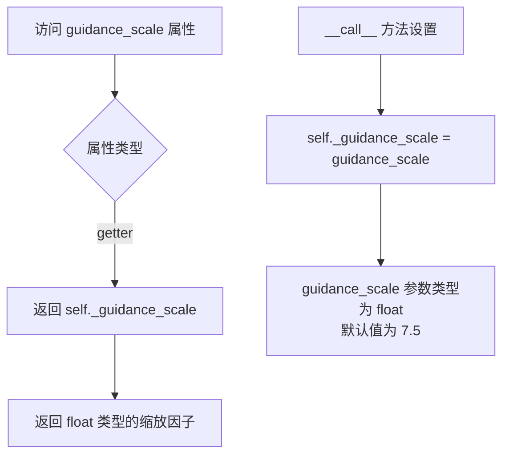

#### 带注释源码

```python
@property
def guidance_scale(self):
    """
    属性 getter: 获取分类器自由引导的缩放因子
    
    该属性对应于 Imagen 论文中方程 (2) 的引导权重 'w':
    - guidance_scale = 1: 不使用分类器自由引导
    - guidance_scale > 1: 启用分类器自由引导，数值越大引导越强
    
    Returns:
        float: 分类器自由引导的缩放因子，通常在 1.0 到 20.0 之间
    """
    return self._guidance_scale
```

#### 相关上下文源码

在 `__call__` 方法中对该属性的设置：

```python
# 在 __call__ 方法中
self._guidance_scale = guidance_scale  # guidance_scale 参数类型为 float，默认值为 7.5
```

在 `do_classifier_free_guidance` 属性中使用：

```python
@property
def do_classifier_free_guidance(self):
    """
    判断是否启用分类器自由引导
    当 guidance_scale > 1 时返回 True
    """
    return self._guidance_scale > 1
```


### `AnimateDiffPAGPipeline.clip_skip`

该属性用于获取在计算提示词嵌入时从CLIP文本编码器跳过的层数。该值在调用管道时设置，并在编码提示词时用于控制使用CLIP模型的哪一层输出。

参数：无

返回值：`int | None`，返回CLIP跳过的层数，如果未设置则为None

#### 流程图

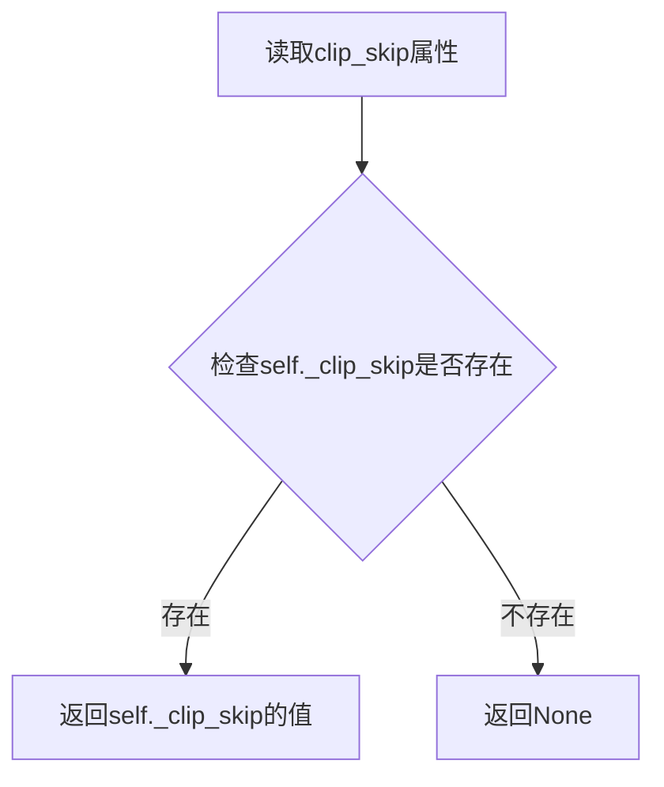

#### 带注释源码

```python
@property
def clip_skip(self):
    """
    属性 getter: 获取 CLIP 文本编码器跳过的层数
    
    该属性对应 encode_prompt 方法中的 clip_skip 参数，用于控制
    在计算提示词嵌入时使用 CLIP 模型的哪一层隐藏状态。
    当 clip_skip 为 1 时，使用预最终层（pre-final layer）的输出。
    
    返回值:
        int | None: 跳过的层数，如果未设置则为 None
    """
    return self._clip_skip
```

#### 相关上下文

**设置该属性的位置**（在 `__call__` 方法中）：

```python
self._clip_skip = clip_skip
```

**使用该属性的位置**（在 `encode_prompt` 调用时）：

```python
prompt_embeds, negative_prompt_embeds = self.encode_prompt(
    prompt,
    device,
    num_videos_per_prompt,
    self.do_classifier_free_guidance,
    negative_prompt,
    prompt_embeds=prompt_embeds,
    negative_prompt_embeds=negative_prompt_embeds,
    lora_scale=text_encoder_lora_scale,
    clip_skip=self.clip_skip,  # 使用属性获取值
)
```


### `AnimateDiffPAGPipeline.do_classifier_free_guidance`

该属性是一个布尔型属性，用于判断当前是否启用分类器自由引导（Classifier-Free Guidance，CFG）机制。当`guidance_scale`参数大于1时，该属性返回`True`，表示需要进行CFG处理；若`guidance_scale`小于或等于1，则返回`False`，表示不启用CFG。

参数： 无

返回值：`bool`，返回`True`表示启用分类器自由引导，返回`False`表示不启用

#### 流程图

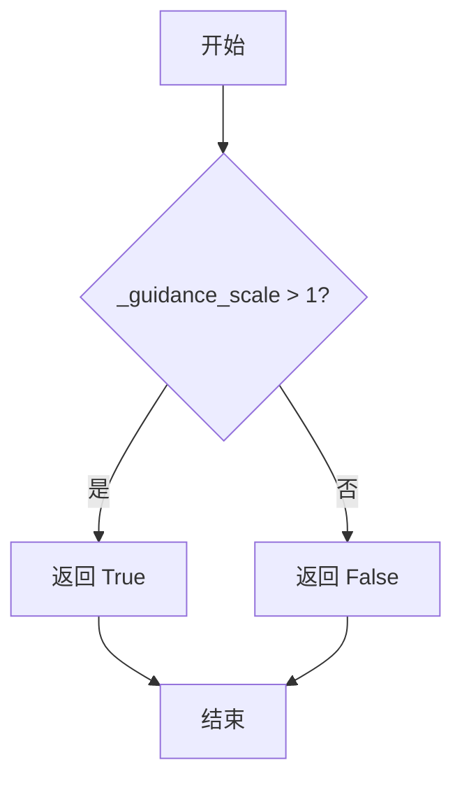

#### 带注释源码

```python
@property
def do_classifier_free_guidance(self):
    """
    属性方法：判断是否启用分类器自由引导

    该属性基于 guidance_scale 值动态决定是否执行分类器自由引导。
    根据 Imagen 论文中的定义，guidance_scale = 1 时等价于不进行引导。
    当 guidance_scale > 1 时，模型会在无条件生成和条件生成之间进行插值，
    以获得更好的生成质量。

    参数：
        无（属性方法，通过 self 访问实例属性）

    返回值：
        bool: 
            - True: guidance_scale > 1，启用分类器自由引导
            - False: guidance_scale <= 1，不启用分类器自由引导

    示例：
        >>> pipeline._guidance_scale = 7.5
        >>> pipeline.do_classifier_free_guidance
        True
        >>> pipeline._guidance_scale = 1.0
        >>> pipeline.do_classifier_free_guidance
        False
    """
    return self._guidance_scale > 1
```


### `AnimateDiffPAGPipeline.cross_attention_kwargs`

这是一个属性（property）方法，用于获取在管道调用期间设置的交叉注意力关键字参数。该参数用于自定义注意力处理器的行为，例如传递 LoRA 权重缩放因子等。

参数：
- 无参数（这是一个 getter 属性）

返回值：`dict[str, Any] | None`，返回传递给 [`AttentionProcessor`](https://github.com/huggingface/diffusers/blob/main/src/diffusers/models/attention_processor.py) 的关键字参数字典，如果未设置则返回 `None`。

#### 流程图

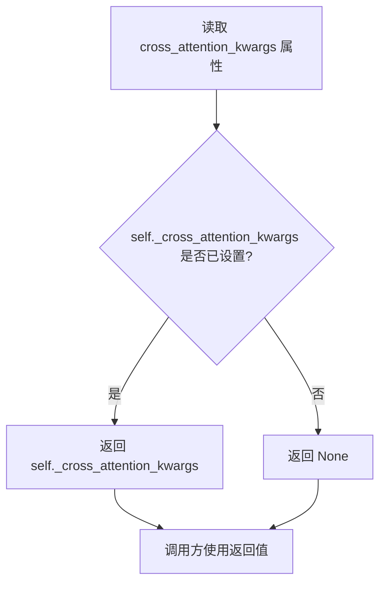

#### 带注释源码

```python
@property
def cross_attention_kwargs(self):
    r"""
    属性 getter: 获取交叉注意力关键字参数

    该属性返回在 __call__ 方法中设置的 _cross_attention_kwargs 参数。
    这些参数会被传递给 UNet 的注意力处理器，用于控制注意力机制的行为，
    例如 LoRA 权重缩放、自定义注意力实现等。

    返回值:
        dict[str, Any] | None: 交叉注意力关键字参数字典，如果未设置则返回 None
    """
    return self._cross_attention_kwargs
```


### `AnimateDiffPAGPipeline.num_timesteps`

这是一个属性 getter 方法，用于返回扩散管道执行过程中的时间步数量。该属性在去噪循环开始时被设置，反映了推理过程中使用的时间步总数。

参数：无（除了隐式的 `self` 参数）

返回值：`int`，返回去噪过程的时间步数量，即 `timesteps` 列表的长度。

#### 流程图

```mermaid
flowchart TD
    A[开始] --> B{读取 self._num_timesteps}
    B --> C[返回时间步数量]
    C --> D[结束]
```

#### 带注释源码

```python
@property
def num_timesteps(self):
    """
    属性 getter: 返回扩散管道的时间步数量
    
    该属性在 __call__ 方法的去噪循环开始前被设置:
    self._num_timesteps = len(timesteps)
    
    返回:
        int: 去噪过程的时间步总数，等于 scheduler.timesteps 的长度
    """
    return self._num_timesteps
```

## 关键组件


### 张量索引与惰性加载

在`decode_latents`方法中实现了分块解码策略，将latent张量按`decode_chunk_size=16`分批处理，避免一次性加载全部视频帧到内存，实现惰性加载以优化显存使用。

### 反量化支持

通过`1 / self.vae.config.scaling_factor * latents`对latents进行反量化处理，将潜在表示反缩放到原始空间，然后通过VAE解码器将latents转换为视频帧。

### 量化策略

代码支持多种量化策略，包括float16和bfloat16精度。`encode_prompt`方法中通过`prompt_embeds_dtype`确保文本嵌入与模型精度一致，生成时默认使用float32以兼容bfloat16。

### MotionAdapter运动适配器

用于将静态的UNet2DConditionModel转换为UNetMotionModel，实现视频生成所需的时序建模能力，在`__init__`方法中通过`UNetMotionModel.from_unet2d`完成转换。

### VideoProcessor视频处理器

负责视频的后处理工作，将VAE解码后的张量转换为指定输出格式（PIL图像、numpy数组或张量），并处理视频的形状重排。

### PAGMixin perturbed attention guidance

集成PAG技术的混合类，提供扰动注意力指导功能，通过`_set_pag_attn_processor`和`_apply_perturbed_attention_guidance`方法在去噪过程中应用PAG以提升生成质量。

### AnimateDiffFreeNoiseMixin自由噪声

支持FreeNoise技术，在`prepare_latents`中通过`_prepare_latents_free_noise`方法实现，用于提升视频生成的时间一致性。

### IP-Adapter图像提示适配器

支持通过图像输入引导视频生成，包含`encode_image`和`prepare_ip_adapter_image_embeds`方法处理图像编码和条件注入。

### LoRA低秩适配

集成了StableDiffusionLoraLoaderMixin，支持通过`load_lora_weights`和`save_lora_weights`加载/保存LoRA权重，并提供Lora scale的动态调整功能。

### TextualInversion文本反转

继承TextualInversionLoaderMixin，支持加载自定义文本嵌入，通过`maybe_convert_prompt`方法处理多向量token。

### Scheduler调度器

使用KarrasDiffusionSchedulers实现去噪调度，通过`set_timesteps`和`step`方法控制扩散过程的噪声调度，支持DDIM、LMS、PNDM等多种调度器。

### FreeInitMixin自由初始化

支持FreeInit技术，通过`_apply_free_init`方法在迭代中应用自由初始化策略以改善生成效果。

### VAE变分自编码器

使用AutoencoderKL进行latents的编码和解码，通过`vae_scale_factor`计算缩放因子，实现图像/视频与潜在表示间的转换。


## 问题及建议


### 已知问题

-   **参数忽略问题**：`__call__` 方法接收 `num_videos_per_prompt` 参数但直接将其硬编码为 1，忽略了用户输入，导致多视频生成功能失效
-   **重复代码过多**：`encode_prompt`、`encode_image`、`check_inputs`、`prepare_extra_step_kwargs`、`decode_latents`、`prepare_latents` 等方法大量从其他管道复制而来，造成代码冗余和维护困难
-   **类型注解兼容性问题**：使用 `|` 联合类型语法（如 `str | list[str]`），在 Python 3.9 以下版本不兼容
-   **硬编码默认值**：`decode_chunk_size = 16` 为硬编码值，未根据硬件配置或显存情况动态调整
-   **多重继承复杂性**：该类继承了 7 个 mixin（DiffusionPipeline、StableDiffusionMixin、TextualInversionLoaderMixin、IPAdapterMixin、StableDiffusionLoraLoaderMixin、FreeInitMixin、AnimateDiffFreeNoiseMixin、PAGMixin），导致代码逻辑难以追踪，方法查找顺序（MRO）复杂
-   **条件检查冗余**：在 `__call__` 中多次检查 `ip_adapter_image is not None or ip_adapter_image_embeds is not None`，可以提取为单一变量
-   **LoRA 缩放逻辑重复**：在 `encode_prompt` 中对 PEFT 后端的 LoRA 缩放处理逻辑可以进一步抽象
-   **PAG 处理器状态管理**：在循环结束后恢复原始注意力处理器，但如果循环中途出错，可能导致状态不一致

### 优化建议

-   **修复参数使用**：将 `num_videos_per_prompt` 参数正确传递给编码器，而非硬编码为 1
-   **提取公共基类**：将复用的方法提取到共享的基类或工具类中，通过组合或单一继承减少代码重复
-   **兼容旧版 Python**：将 `|` 联合类型改为 `Union[...]` 形式以兼容 Python 3.8
-   **动态调整块大小**：根据可用显存动态计算 `decode_chunk_size`，或提供配置接口
-   **简化继承结构**：考虑使用组合模式替代部分 mixin 继承，或将相关功能分组到更少的 mixin 中
-   **提取重复条件**：将 `ip_adapter_image is not None or ip_adapter_image_embeds is not None` 提取为类属性 `self._has_ip_adapter`
-   **增强错误恢复**：使用 try-finally 块确保 PAG 处理器状态在异常情况下也能正确恢复
-   **添加类型提示完善**：为部分缺少返回类型注解的方法添加完整的类型信息
-   **性能监控**：在 `decode_latents` 和 `encode_prompt` 等计算密集型操作中添加可选的性能日志

## 其它


### 设计目标与约束

设计目标是实现一个结合 AnimateDiff 视频生成能力和 Perturbed Attention Guidance (PAG) 技术的文本到视频扩散管道。核心约束包括：支持 8 的倍数像素分辨率、依赖 PyTorch 框架、兼容多种调度器、支持 LoRA 和 IP-Adapter 等扩展功能、默认生成 16 帧（约 2 秒）视频。

### 错误处理与异常设计

输入验证在 `check_inputs` 方法中集中处理，包括：分辨率必须能被 8 整除、prompt 与 prompt_embeds 不可同时指定、negative_prompt 与 negative_prompt_embeds 不可同时指定、prompt_embeds 与 negative_prompt_embeds 形状必须一致、IP-Adapter 图像与嵌入不可同时指定、IP-Adapter 嵌入必须是 3D/4D 张量列表、callback_on_step_end_tensor_inputs 必须在允许列表中。参数类型检查分散在各方法中，如 `isinstance` 检查和 `len` 比对。

### 数据流与状态机

数据流遵循以下路径：用户输入 (prompt, num_frames, height, width) → 输入验证 → Prompt 编码 (encode_prompt) → 潜在向量准备 (prepare_latents) → 去噪循环 (scheduler.step 迭代) → 潜在向量解码 (decode_latents) → 视频后处理 (video_processor.postprocess_video) → 输出。状态转换由调度器管理，核心状态包括：初始化状态、编码状态、去噪进行中状态、解码完成状态。

### 外部依赖与接口契约

核心依赖包括：transformers 库的 CLIPTextModel/CLIPTokenizer/CLIPVisionModelWithProjection、diffusers 库的 AutoencoderKL/UNet2DConditionModel/UNetMotionModel/MotionAdapter/KarrasDiffusionSchedulers、torch 库。输入契约：prompt 可为 str/list/None、height/width 需为 8 的倍数、num_inference_steps 需为正整数、guidance_scale 需≥0。输出契约：return_dict=True 时返回 AnimateDiffPipelineOutput，否则返回 tuple(frames)。

### 并发与异步考虑

支持 torch_xla 加速 (XLA_AVAILABLE 标志)，在去噪循环末尾调用 xm.mark_step() 进行 XLA 设备同步。支持模型 CPU 卸载 (model_cpu_offload_seq)，通过 maybe_free_model_hooks 释放模型钩子。支持 FreeInit 迭代 (num_free_init_iters)，可进行多次初始化尝试以提升质量。

### 内存与性能优化

采用分块解码策略 (decode_chunk_size=16) 减少峰值内存。潜在向量在 VAE 解码前进行形状重塑以适配批量处理。文本嵌入在分类器自由引导下重复扩展。IP-Adapter 图像嵌入使用 repeat_interleave 扩展以适配多提示场景。支持梯度禁用 (@torch.no_grad()) 减少推理内存占用。

### 扩展性与插件机制

通过多重 Mixin 类实现功能扩展：TextualInversionLoaderMixin 支持文本反转嵌入、StableDiffusionLoraLoaderMixin 支持 LoRA 权重、IPAdapterMixin 支持 IP-Adapter、FreeInitMixin 支持 FreeInit 初始化、AnimateDiffFreeNoiseMixin 支持 FreeNoise 噪声策略、PAGMixin 支持 Perturbed Attention Guidance。PAG 应用层可通过 pag_applied_layers 配置参数指定。

### 版本兼容性与迁移

代码大量复用 StableDiffusionPipeline 和 AnimateDiffPipeline 的方法 (通过 Copied from 注释标识)，便于同步更新。CLIP skip 层数可通过 clip_skip 参数控制。调度器签名通过 inspect 检查动态适配 (prepare_extra_step_kwargs)。

### 安全性与权限控制

代码遵循 Apache License 2.0 开源协议。文本截断处理防止超过 CLIP 模型最大长度限制 (model_max_length)。设备转移 (to(device)) 时保持数据类型一致。LoRA 缩放在 PEFT 后端和传统后端间自适应切换。

### 测试与调试支持

通过 callback_on_step_end 和 callback_on_step_end_tensor_inputs 支持推理过程回调。progress_bar 提供去噪进度可视化。logger.warning 输出截断文本警告。返回元组或对象格式可选，便于调试。

    