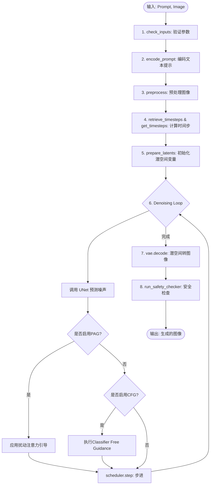
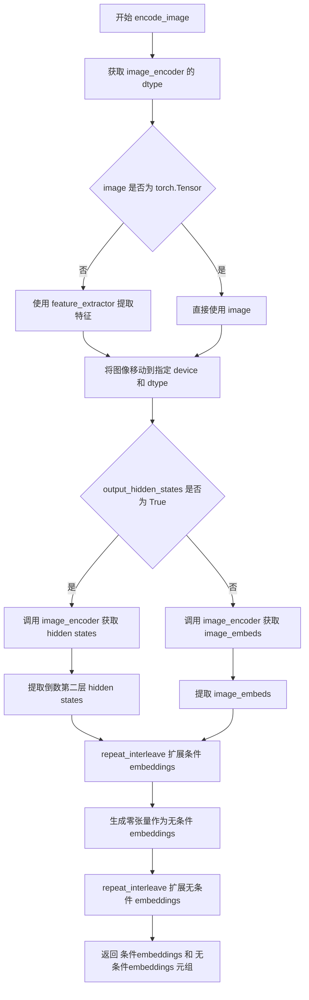
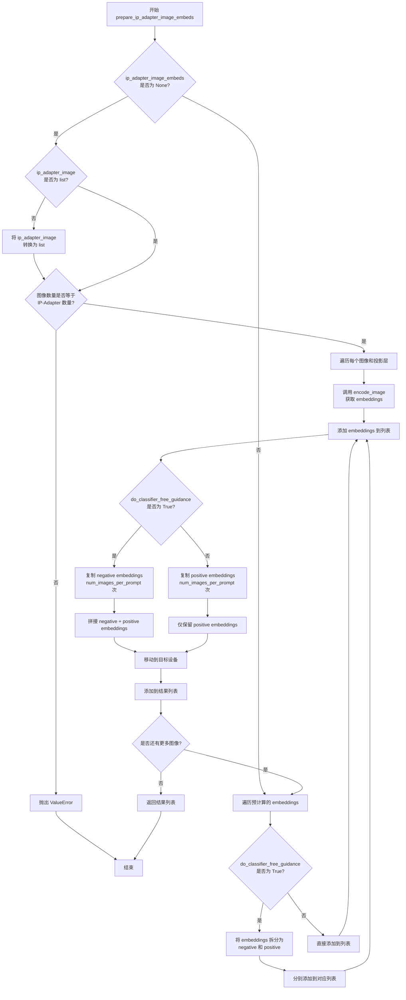
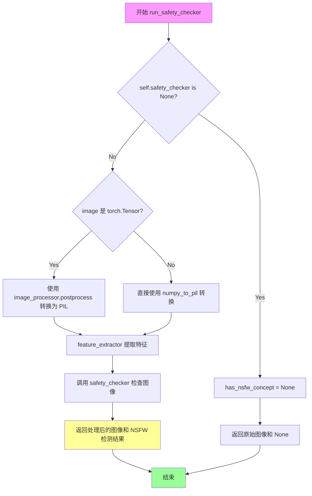
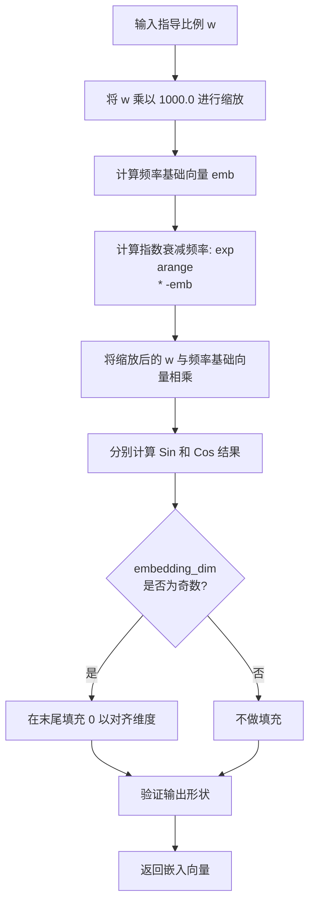

```mermaid
flowchart TD
    A[开始 retrieve_timesteps] --> B{同时传入了 timesteps 和 sigmas?}
    B -->|是| C[抛出 ValueError: 只能传一个]
    B -->|否| D{timesteps 不为 None?}
    D -->|是| E[检查 scheduler.set_timesteps 是否支持 timesteps 参数]
    E --> F{支持 timesteps?}
    F -->|否| G[抛出 ValueError: 不支持自定义 timesteps]
    F -->|是| H[调用 scheduler.set_timesteps&#40;timesteps=timesteps, device=device, **kwargs&#41;]
    H --> I[获取 scheduler.timesteps]
    I --> J[计算 num_inference_steps = len&#40;timesteps&#41;]
    D -->|否| K{sigmas 不为 None?}
    K -->|是| L[检查 scheduler.set_timesteps 是否支持 sigmas 参数]
    L --> M{支持 sigmas?}
    M -->|否| N[抛出 ValueError: 不支持自定义 sigmas]
    M -->|是| O[调用 scheduler.set_timesteps&#40;sigmas=sigmas, device=device, **kwargs&#41;]
    O --> P[获取 scheduler.timesteps]
    P --> Q[计算 num_inference_steps = len&#40;timesteps&#41;]
    K -->|否| R[调用 scheduler.set_timesteps&#40;num_inference_steps, device=device, **kwargs&#41;]
    R --> S[获取 scheduler.timesteps]
    S --> T[计算 num_inference_steps = len&#40;timesteps&#41;]
    J --> U[返回 timesteps, num_inference_steps]
    Q --> U
    T --> U
    U --> V[结束]
```

```mermaid
flowchart TD
    A[开始 __call__] --> B{检查回调类型}
    B -->|PipelineCallback/MultiPipelineCallbacks| C[更新callback tensor inputs]
    B -->|其他| D[跳过更新]
    C --> E[检查输入参数 validate check_inputs]
    D --> E
    
    E --> F[设置内部属性<br/>_guidance_scale, _clip_skip<br/>_cross_attention_kwargs, _interrupt<br/>_pag_scale, _pag_adaptive_scale]
    
    F --> G[确定batch_size]
    G --> H[获取执行设备 device]
    
    H --> I[编码文本提示 encode_prompt]
    I --> J{do_perturbed_attention_guidance?}
    J -->|Yes| K[准备PAG引导 prompt_embeds]
    J -->|No| L{do_classifier_free_guidance?}
    K --> M[拼接negative和prompt embeddings]
    L -->|Yes| M
    L -->|No| N[跳过拼接]
    
    M --> O{IP-Adapter图像?}
    N --> O
    O -->|Yes| P[准备IP-Adapter图像嵌入 prepare_ip_adapter_image_embeds]
    O -->|No| Q[预处理图像 preprocess image]
    
    P --> Q
    Q --> R[设置时间步 retrieve_timesteps + get_timesteps]
    R --> S[准备潜在变量 prepare_latents]
    
    S --> T[准备额外参 数 prepare_extra_step_kwargs]
    T --> U{IP-Adapter条件?}
    U -->|Yes| V[添加image_embeds到added_cond_kwargs]
    U -->|No| W{需要Guidance Scale Embedding?}
    
    V --> W
    W -->|Yes| X[计算timestep_cond]
    W -->|No| Y[设置进度条和PAG处理器]
    
    X --> Y
    Y --> Z[进入去噪循环 for each timestep]
    
    Z --> AA{interrupt标志?}
    AA -->|Yes| AB[继续下一轮]
    AA -->|No| AC[扩展latents if CFG]
    AC --> AD[scale_model_input]
    AE[预测噪声 noise_pred] --> AF{PAG?}
    AF -->|Yes| AG[应用PAG引导 _apply_perturbed_attention_guidance]
    AF -->|No| AH{CFG?}
    AG --> AI[合并噪声预测]
    AH -->|Yes| AI
    AH -->|No| AJ[跳过引导]
    AI --> AK[scheduler.step计算上一步]
    AD --> AE
    
    AK --> AL{callback_on_step_end?}
    AL -->|Yes| AM[执行回调更新latents]
    AL -->|No| AN{最后一步或warmup完成?}
    
    AM --> AN
    AN -->|Yes| AO[更新进度条]
    AN -->|No| AP[继续下一时间步]
    AO --> Z
    
    Z --> AQ[去噪循环结束]
    AQ --> AR{output_type=='latent'?}
    AR -->|Yes| AS[直接使用latents]
    AR -->|No| AT[VAE解码 decode latents]
    
    AT --> AU[运行安全检查 run_safety_checker]
    AS --> AV[后处理图像 postprocess]
    AU --> AV
    
    AV --> AW[释放模型hooks maybe_free_model_hooks]
    AW --> AX{PAG enabled?}
    AX -->|Yes| AY[恢复原始注意力处理器]
    AX -->|No| AZ{return_dict?}
    
    AY --> AZ
    AZ -->|Yes| BA[返回StableDiffusionPipelineOutput]
    AZ -->|No| BB[返回tuple]
    BA --> BC[结束]
    BB --> BC
```

# `diffusers\src\diffusers\pipelines\pag\pipeline_pag_sd_img2img.py` 详细设计文档

A Stable Diffusion image-to-image pipeline that implements Perturbed Attention Guidance (PAG) to improve generation quality by modifying the attention mechanism during the denoising process.

## 整体流程



## 类结构

```
DiffusionPipeline (基础管道)
├── StableDiffusionMixin (SD通用逻辑)
├── TextualInversionLoaderMixin (文本反演加载)
├── IPAdapterMixin (IP适配器)
├── StableDiffusionLoraLoaderMixin (LoRA加载)
├── FromSingleFileMixin (单文件加载)
├── PAGMixin (PAG核心逻辑 - 外部依赖)
└── StableDiffusionPAGImg2ImgPipeline (主类)
```

## 全局变量及字段


### `logger`
    
日志记录器，用于输出管道运行时的警告和信息

类型：`logging.Logger`
    


### `EXAMPLE_DOC_STRING`
    
示例文档字符串，包含pipeline使用示例代码

类型：`str`
    


### `XLA_AVAILABLE`
    
是否支持XLA加速，用于判断是否可以使用torch_xla进行性能优化

类型：`bool`
    


### `retrieve_latents`
    
全局函数，从encoder output中提取latents，支持sample和argmax模式

类型：`function`
    


### `retrieve_timesteps`
    
全局函数，调用scheduler的set_timesteps方法并获取时间步调度

类型：`function`
    


### `StableDiffusionPAGImg2ImgPipeline.vae`
    
VAE编解码器，用于将图像编码到潜在空间并从潜在空间解码回图像

类型：`AutoencoderKL`
    


### `StableDiffusionPAGImg2ImgPipeline.text_encoder`
    
文本编码器，将文本prompt转换为文本嵌入向量

类型：`CLIPTextModel`
    


### `StableDiffusionPAGImg2ImgPipeline.tokenizer`
    
文本分词器，将文本分割为token ids

类型：`CLIPTokenizer`
    


### `StableDiffusionPAGImg2ImgPipeline.unet`
    
降噪网络，根据文本嵌入和时间步预测噪声

类型：`UNet2DConditionModel`
    


### `StableDiffusionPAGImg2ImgPipeline.scheduler`
    
调度器，控制去噪过程中的时间步和噪声调度

类型：`KarrasDiffusionSchedulers`
    


### `StableDiffusionPAGImg2ImgPipeline.safety_checker`
    
安全检查器，检测生成图像是否包含不当内容

类型：`StableDiffusionSafetyChecker`
    


### `StableDiffusionPAGImg2ImgPipeline.feature_extractor`
    
特征提取器，从图像中提取CLIP特征用于安全检查

类型：`CLIPImageProcessor`
    


### `StableDiffusionPAGImg2ImgPipeline.image_encoder`
    
图像编码器(可选)，用于IP-Adapter功能提取图像嵌入

类型：`CLIPVisionModelWithProjection`
    


### `StableDiffusionPAGImg2ImgPipeline.vae_scale_factor`
    
VAE缩放因子，用于图像和潜在表示之间的空间转换

类型：`int`
    


### `StableDiffusionPAGImg2ImgPipeline.image_processor`
    
图像处理器，负责图像的预处理和后处理

类型：`VaeImageProcessor`
    


### `StableDiffusionPAGImg2ImgPipeline.pag_applied_layers`
    
应用PAG（扰动注意力引导）的网络层，可以是单层或多层列表

类型：`str | list[str]`
    
    

## 全局函数及方法


### 1. 一段话描述
`retrieve_latents` 是一个用于从 VAE（变分自编码器）的 encoder 输出中提取潜在表示（latents）的工具函数，它能够根据指定的采样模式（随机采样或确定性取模）灵活处理不同的输出格式（如 `DiagonalGaussianDistribution` 或直接的张量），从而为后续的扩散过程准备 latent 输入。

### 2. 文件的整体运行流程
该文件定义了 `StableDiffusionPAGImg2ImgPipeline` 管道，用于实现基于 Stable Diffusion 的图像到图像生成（PAG 方法）。

1.  **输入处理**：接收原始图像和文本提示（prompt）。
2.  **图像编码**：使用 `VAE` 对输入图像进行编码，编码结果通常包含一个分布对象（`latent_dist`）。
3.  **提取 Latents**：调用 `retrieve_latents` 函数（核心任务），将编码输出转换为具体的潜在张量。
4.  **加噪与调度**：根据 `strength` 参数向 latents 中添加噪声，并通过调度器（Scheduler）设置去噪时间步。
5.  **去噪循环**：UNet 模型在文本条件的引导下，对带噪声的 latents 进行预测和去噪。
6.  **图像解码**：使用 VAE 的解码器将最终的 latents 解码为可见图像。
7.  **安全检查**：通过 Safety Checker 过滤不当内容。

### 3. 类的详细信息

#### 全局变量
- **`EXAMPLE_DOC_STRING`**: `str`，包含管道使用的示例代码文档字符串。
- **`logger`**: `logging.Logger`，用于记录运行时警告和信息。

#### 全局函数
- **`retrieve_latents`**: 从 encoder 输出中提取 latents 的核心辅助函数。
- **`retrieve_timesteps`**: 用于从调度器中获取去噪时间步的辅助函数。

#### 类：`StableDiffusionPAGImg2ImgPipeline`
- **描述**：继承自 `DiffusionPipeline` 等混合类的图像到图像生成管道，支持 PAG（Perturbed Attention Guidance）技术。
- **主要方法**：
    - `prepare_latents`: 准备潜伏变量，其中调用了 `retrieve_latents`。
    - `encode_prompt`: 编码文本提示。
    - `__call__`: 管道执行的主入口。

---

### 4. 给定函数的详细信息

### `retrieve_latents`

该函数封装了从不同类型的 VAE 编码器输出中获取潜在张量的逻辑，提供了统一的接口。

参数：
- `encoder_output`：`torch.Tensor`，实际上通常是一个具有特定属性的对象（如 `ModelOutput`），包含了潜在空间的分布信息。
- `generator`：`torch.Generator | None`，可选的随机数生成器，用于确保采样的确定性。
- `sample_mode`：`str`，字符串参数，指定提取模式。应为 `"sample"`（随机采样）或 `"argmax"`（取分布均值/模）。

返回值：`torch.Tensor`，提取出的潜在表示张量。

#### 流程图

```mermaid
flowchart TD
    A([Start retrieve_latents]) --> B{Has attribute 'latent_dist' AND sample_mode == 'sample'?}
    B -- Yes --> C[Return encoder_output.latent_dist.sample(generator)]
    B -- No --> D{Has attribute 'latent_dist' AND sample_mode == 'argmax'?}
    D -- Yes --> E[Return encoder_output.latent_dist.mode()]
    D -- No --> F{Has attribute 'latents'?}
    F -- Yes --> G[Return encoder_output.latents]
    F -- No --> H[Raise AttributeError: Could not access latents]
    H --> I([End])
    C --> I
    G --> I
    E --> I
```

#### 带注释源码

```python
# Copied from diffusers.pipelines.stable_diffusion.pipeline_stable_diffusion_img2img.retrieve_latents
def retrieve_latents(
    encoder_output: torch.Tensor, generator: torch.Generator | None = None, sample_mode: str = "sample"
):
    """
    从 encoder_output 中提取 latents。

    Args:
        encoder_output (torch.Tensor): VAE 编码器的输出对象。
        generator (torch.Generator, optional): 随机数生成器。
        sample_mode (str): 提取模式，"sample" 表示从分布中采样，"argmax" 表示取分布的众数/均值。

    Returns:
        torch.Tensor: 潜在表示张量。

    Raises:
        AttributeError: 当 encoder_output 不包含可识别的 latents 属性时抛出。
    """
    # 检查输出是否具有 latent_dist 属性（通常对应 Variational Autoencoder 的输出）
    if hasattr(encoder_output, "latent_dist") and sample_mode == "sample":
        # 如果是随机采样模式，从分布中采样
        return encoder_output.latent_dist.sample(generator)
    # 检查是否是确定性提取模式（argmax 或 mode）
    elif hasattr(encoder_output, "latent_dist") and sample_mode == "argmax":
        return encoder_output.latent_dist.mode()
    # 检查是否直接包含 latents 属性（某些模型直接输出 latent）
    elif hasattr(encoder_output, "latents"):
        return encoder_output.latents
    else:
        # 如果无法识别输出格式，抛出异常
        raise AttributeError("Could not access latents of provided encoder_output")
```

### 5. 关键组件信息
- **VAE (AutoencoderKL)**: 负责图像与 latent 空间之间的转换。
- **Latent Distribution**: 在 VAE 中通常指对角高斯分布（Diagonal Gaussian Distribution），包含采样逻辑。
- **PAGMixin**: 提供了扰动注意力指导（Perturbed Attention Guidance）的混入类。

### 6. 潜在的技术债务或优化空间
1.  **类型注解不够精确**：`encoder_output` 的类型被标注为 `torch.Tensor`，但在逻辑上它是一个包含 `latent_dist` 属性的自定义输出对象（如 `AutoencoderKLOutput`）。更精确的类型注解有助于静态分析和 IDE 提示。
2.  **硬编码的字符串**：`sample_mode` 的 `"sample"` 和 `"argmax"` 是硬编码的字符串。如果引入更多的采样策略（例如 `mean`），需要修改函数逻辑。可以考虑使用 Enum 或常量来替代。
3.  **错误处理**：仅抛出一个通用的 `AttributeError`。如果能提供更具体的错误信息（例如，指出缺少的是 `latent_dist` 还是 `latents`），会更有利于调试。

### 7. 其它项目
- **设计目标与约束**：该函数的设计目标是为了兼容不同的 VAE 输出形式（在分布采样和直接输出之间切换），以支持图像到图像任务中的随机性和确定性需求。
- **错误处理与异常设计**：采用“快速失败”策略（Fail-fast），一旦发现 encoder_output 结构不符合预期立即抛出异常，防止在下游 pipeline 中产生难以追踪的维度错误。
- **外部依赖与接口契约**：依赖 `torch` 库。需要传入的 `encoder_output` 必须包含特定的属性（`latent_dist` 或 `latents`），这算是一种隐式的接口契约。


### `retrieve_timesteps`

该函数是Stable Diffusion pipeline的辅助函数，用于从调度器（scheduler）获取自定义的时间步（timesteps）或sigmas。它调用调度器的`set_timesteps`方法并返回更新后的时间步调度和推理步数。

参数：

- `scheduler`：`SchedulerMixin`，调度器对象，用于生成时间步
- `num_inference_steps`：`int | None`，生成样本时使用的扩散步数，若使用此参数则`timesteps`必须为`None`
- `device`：`str | torch.device | None`，时间步要移动到的设备，若为`None`则不移动
- `timesteps`：`list[int] | optional`，自定义时间步，用于覆盖调度器的时间步间距策略，若传递此参数则`num_inference_steps`和`sigmas`必须为`None`
- `sigmas`：`list[float] | optional`，自定义sigmas，用于覆盖调度器的时间步间距策略，若传递此参数则`num_inference_steps`和`timesteps`必须为`None`
- `**kwargs`：任意额外的关键字参数，将传递给`scheduler.set_timesteps`

返回值：`tuple[torch.Tensor, int]`，第一个元素是调度器的时间步调度，第二个元素是推理步数

#### 流程图



#### 带注释源码

```python
# Copied from diffusers.pipelines.stable_diffusion.pipeline_stable_diffusion.retrieve_timesteps
def retrieve_timesteps(
    scheduler,  # 调度器对象，用于生成时间步
    num_inference_steps: int | None = None,  # 推理步数
    device: str | torch.device | None = None,  # 目标设备
    timesteps: list[int] | None = None,  # 自定义时间步列表
    sigmas: list[float] | None = None,  # 自定义 sigmas 列表
    **kwargs,  # 额外的关键字参数
):
    r"""
    Calls the scheduler's `set_timesteps` method and retrieves timesteps from the scheduler after the call. Handles
    custom timesteps. Any kwargs will be supplied to `scheduler.set_timesteps`.

    Args:
        scheduler (`SchedulerMixin`):
            The scheduler to get timesteps from.
        num_inference_steps (`int`):
            The number of diffusion steps used when generating samples with a pre-trained model. If used, `timesteps`
            must be `None`.
        device (`str` or `torch.device`, *optional*):
            The device to which the timesteps should be moved to. If `None`, the timesteps are not moved.
        timesteps (`list[int]`, *optional*):
            Custom timesteps used to override the timestep spacing strategy of the scheduler. If `timesteps` is passed,
            `num_inference_steps` and `sigmas` must be `None`.
        sigmas (`list[float]`, *optional*):
            Custom sigmas used to override the timestep spacing strategy of the scheduler. If `sigmas` is passed,
            `num_inference_steps` and `timesteps` must be `None`.

    Returns:
        `tuple[torch.Tensor, int]`: A tuple where the first element is the timestep schedule from the scheduler and the
        second element is the number of inference steps.
    """
    # 验证：不能同时传入 timesteps 和 sigmas
    if timesteps is not None and sigmas is not None:
        raise ValueError("Only one of `timesteps` or `sigmas` can be passed. Please choose one to set custom values")
    
    # 处理自定义 timesteps 的情况
    if timesteps is not None:
        # 检查调度器是否支持自定义 timesteps
        accepts_timesteps = "timesteps" in set(inspect.signature(scheduler.set_timesteps).parameters.keys())
        if not accepts_timesteps:
            raise ValueError(
                f"The current scheduler class {scheduler.__class__}'s `set_timesteps` does not support custom"
                f" timestep schedules. Please check whether you are using the correct scheduler."
            )
        # 调用调度器的 set_timesteps 方法设置自定义时间步
        scheduler.set_timesteps(timesteps=timesteps, device=device, **kwargs)
        # 从调度器获取更新后的时间步
        timesteps = scheduler.timesteps
        # 计算推理步数
        num_inference_steps = len(timesteps)
    # 处理自定义 sigmas 的情况
    elif sigmas is not None:
        # 检查调度器是否支持自定义 sigmas
        accept_sigmas = "sigmas" in set(inspect.signature(scheduler.set_timesteps).parameters.keys())
        if not accept_sigmas:
            raise ValueError(
                f"The current scheduler class {scheduler.__class__}'s `set_timesteps` does not support custom"
                f" sigmas schedules. Please check whether you are using the correct scheduler."
            )
        # 调用调度器的 set_timesteps 方法设置自定义 sigmas
        scheduler.set_timesteps(sigmas=sigmas, device=device, **kwargs)
        # 从调度器获取更新后的时间步
        timesteps = scheduler.timesteps
        # 计算推理步数
        num_inference_steps = len(timesteps)
    # 默认情况：使用 num_inference_steps 设置时间步
    else:
        scheduler.set_timesteps(num_inference_steps, device=device, **kwargs)
        timesteps = scheduler.timesteps
    
    # 返回时间步调度和推理步数
    return timesteps, num_inference_steps
```


### `StableDiffusionPAGImg2ImgPipeline.__init__`

初始化Stable Diffusion图像到图像生成管道，设置VAE、文本编码器、分词器、UNet、调度器等核心组件，同时配置安全检查器、特征提取器、PAG（Perturbed Attention Guidance）相关参数，并进行调度器配置验证与调整。

参数：

- `vae`：`AutoencoderKL`，变分自编码器模型，用于编码和解码图像与潜在表示
- `text_encoder`：`CLIPTextModel`，冻结的文本编码器（clip-vit-large-patch14），用于将文本提示转换为嵌入向量
- `tokenizer`：`CLIPTokenizer`，CLIP分词器，用于将文本分割成token
- `unet`：`UNet2DConditionModel`，条件UNet模型，用于对编码后的图像潜在表示进行去噪
- `scheduler`：`KarrasDiffusionSchedulers`，调度器，与UNet结合使用对潜在表示进行去噪
- `safety_checker`：`StableDiffusionSafetyChecker`，安全检查模块，用于评估生成图像是否包含不当内容
- `feature_extractor`：`CLIPImageProcessor`，CLIP图像处理器，用于从生成的图像中提取特征
- `image_encoder`：`CLIPVisionModelWithProjection`（可选），图像编码器，用于IP-Adapter功能
- `requires_safety_checker`：`bool`（默认`True`），是否需要安全检查器
- `pag_applied_layers`：`str | list[str]`（默认`"mid"`），PAG应用的目标层，可以是字符串"mid"或层名称列表

返回值：`None`，构造函数无返回值

#### 流程图

```mermaid
flowchart TD
    A[开始 __init__] --> B[调用 super().__init__]
    B --> C{scheduler.config.steps_offset != 1?}
    C -->|是| D[发出弃用警告<br/>重置 steps_offset 为 1]
    C -->|否| E{scheduler.config.clip_sample == True?}
    D --> E
    E -->|是| F[发出弃用警告<br/>设置 clip_sample 为 False]
    E -->|否| G{safety_checker is None<br/>且 requires_safety_checker is True?}
    G -->|是| H[发出安全警告]
    G -->|否| I{safety_checker is not None<br/>且 feature_extractor is None?}
    I -->|是| J[抛出 ValueError]
    I -->|否| K{unet版本 < 0.9.0<br/>且 sample_size < 64?}
    H --> K
    J --> K
    K -->|是| L[发出弃用警告<br/>重置 sample_size 为 64]
    K -->|否| M[调用 register_modules<br/>注册所有组件]
    M --> N[计算 vae_scale_factor]
    N --> O[创建 VaeImageProcessor]
    O --> P[注册 requires_safety_checker 配置]
    P --> Q[调用 set_pag_applied_layers<br/>设置PAG应用层]
    Q --> R[结束 __init__]
```

#### 带注释源码

```
def __init__(
    self,
    vae: AutoencoderKL,
    text_encoder: CLIPTextModel,
    tokenizer: CLIPTokenizer,
    unet: UNet2DConditionModel,
    scheduler: KarrasDiffusionSchedulers,
    safety_checker: StableDiffusionSafetyChecker,
    feature_extractor: CLIPImageProcessor,
    image_encoder: CLIPVisionModelWithProjection = None,
    requires_safety_checker: bool = True,
    pag_applied_layers: str | list[str] = "mid",  # ["mid"], ["down.block_1", "up.block_0.attentions_0"]
):
    # 调用父类DiffusionPipeline的初始化方法
    super().__init__()

    # ==================== 调度器配置检查与调整 ====================
    # 检查scheduler的steps_offset配置是否为1，不是则发出警告并修正
    if scheduler is not None and getattr(scheduler.config, "steps_offset", 1) != 1:
        deprecation_message = (
            f"The configuration file of this scheduler: {scheduler} is outdated. `steps_offset`"
            f" should be set to 1 instead of {scheduler.config.steps_offset}. Please make sure "
            "to update the config accordingly as leaving `steps_offset` might led to incorrect results"
            " in future versions. If you have downloaded this checkpoint from the Hugging Face Hub,"
            " it would be very nice if you could open a Pull request for the `scheduler/scheduler_config.json`"
            " file"
        )
        deprecate("steps_offset!=1", "1.0.0", deprecation_message, standard_warn=False)
        new_config = dict(scheduler.config)
        new_config["steps_offset"] = 1
        scheduler._internal_dict = FrozenDict(new_config)

    # 检查scheduler的clip_sample配置是否为False，不是则发出警告并修正
    if scheduler is not None and getattr(scheduler.config, "clip_sample", False) is True:
        deprecation_message = (
            f"The configuration file of this scheduler: {scheduler} has not set the configuration `clip_sample`."
            " `clip_sample` should be set to False in the configuration file. Please make sure to update the"
            " config accordingly as not setting `clip_sample` in the config might lead to incorrect results in"
            " future versions. If you have downloaded this checkpoint from the Hugging Face Hub, it would be very"
            " nice if you could open a Pull request for the `scheduler/scheduler_config.json` file"
        )
        deprecate("clip_sample not set", "1.0.0", deprecation_message, standard_warn=False)
        new_config = dict(scheduler.config)
        new_config["clip_sample"] = False
        scheduler._internal_dict = FrozenDict(new_config)

    # ==================== 安全检查器验证 ====================
    # 如果safety_checker为None但requires_safety_checker为True，发出安全警告
    if safety_checker is None and requires_safety_checker:
        logger.warning(
            f"You have disabled the safety checker for {self.__class__} by passing `safety_checker=None`. Ensure"
            " that you abide to the conditions of the Stable Diffusion license and do not expose unfiltered"
            " results in services or applications open to the public. Both the diffusers team and Hugging Face"
            " strongly recommend to keep the safety filter enabled in all public facing circumstances, disabling"
            " it only for use-cases that involve analyzing network behavior or auditing its results. For more"
            " information, please have a look at https://github.com/huggingface/diffusers/pull/254 ."
        )

    # 如果safety_checker存在但feature_extractor不存在，抛出错误
    if safety_checker is not None and feature_extractor is None:
        raise ValueError(
            "Make sure to define a feature extractor when loading {self.__class__} if you want to use the safety"
            " checker. If you do not want to use the safety checker, you can pass `'safety_checker=None'` instead."
        )

    # ==================== UNet配置检查与调整 ====================
    # 检查UNet版本是否小于0.9.0且sample_size小于64
    is_unet_version_less_0_9_0 = (
        unet is not None
        and hasattr(unet.config, "_diffusers_version")
        and version.parse(version.parse(unet.config._diffusers_version).base_version) < version.parse("0.9.0.dev0")
    )
    is_unet_sample_size_less_64 = (
        unet is not None and hasattr(unet.config, "sample_size") and unet.config.sample_size < 64
    )
    # 如果是旧版本checkpoint，发出警告并调整sample_size
    if is_unet_version_less_0_9_0 and is_unet_sample_size_less_64:
        deprecation_message = (
            "The configuration file of the unet has set the default `sample_size` to smaller than"
            " 64 which seems highly unlikely. If your checkpoint is a fine-tuned version of any of the"
            " following: \n- CompVis/stable-diffusion-v1-4 \n- CompVis/stable-diffusion-v1-3 \n-"
            " CompVis/stable-diffusion-v1-2 \n- CompVis/stable-diffusion-v1-1 \n- stable-diffusion-v1-5/stable-diffusion-v1-5"
            " \n- stable-diffusion-v1-5/stable-diffusion-inpainting \n you should change 'sample_size' to 64 in the"
            " configuration file. Please make sure to update the config accordingly as leaving `sample_size=32`"
            " in the config might lead to incorrect results in future versions. If you have downloaded this"
            " checkpoint from the Hugging Face Hub, it would be very nice if you could open a Pull request for"
            " the `unet/config.json` file"
        )
        deprecate("sample_size<64", "1.0.0", deprecation_message, standard_warn=False)
        new_config = dict(unet.config)
        new_config["sample_size"] = 64
        unet._internal_dict = FrozenDict(new_config)

    # ==================== 模块注册 ====================
    # 注册所有组件到管道，使其可以通过self.xxx访问
    self.register_modules(
        vae=vae,
        text_encoder=text_encoder,
        tokenizer=tokenizer,
        unet=unet,
        scheduler=scheduler,
        safety_checker=safety_checker,
        feature_extractor=feature_extractor,
        image_encoder=image_encoder,
    )

    # ==================== 图像处理初始化 ====================
    # 计算VAE缩放因子，基于VAE的block_out_channels
    self.vae_scale_factor = 2 ** (len(self.vae.config.block_out_channels) - 1) if getattr(self, "vae", None) else 8
    # 创建VAE图像处理器
    self.image_processor = VaeImageProcessor(vae_scale_factor=self.vae_scale_factor)
    
    # 注册requires_safety_checker配置
    self.register_to_config(requires_safety_checker=requires_safety_checker)

    # ==================== PAG配置初始化 ====================
    # 设置PAG应用的目标层
    self.set_pag_applied_layers(pag_applied_layers)
```


### `StableDiffusionPAGImg2ImgPipeline.encode_prompt`

该方法负责将文本prompt编码为文本Encoder的hidden states（embeddings），支持LoRA权重调整、文本反转、CLIP跳过层等功能，并处理classifier-free guidance所需的unconditional embeddings。

参数：

- `prompt`：`str | list[str] | None`，要编码的文本提示，可以是单个字符串、字符串列表，或为None
- `device`：`torch.device`，PyTorch设备，用于将tensor移动到指定设备
- `num_images_per_prompt`：`int`，每个prompt要生成的图像数量，用于复制embeddings
- `do_classifier_free_guidance`：`bool`，是否使用classifier-free guidance，为True时需要生成negative embeddings
- `negative_prompt`：`str | list[str] | None`，负面提示，用于引导不生成的内容，忽略当guidance_scale < 1
- `prompt_embeds`：`torch.Tensor | None`，预生成的文本embeddings，可用于easy tweak text inputs，如prompt weighting
- `negative_prompt_embeds`：`torch.Tensor | None`，预生成的负面文本embededs
- `lora_scale`：`float | None`，LoRA缩放因子，如果加载了LoRA层，会应用于text encoder的所有LoRA层
- `clip_skip`：`int | None`，计算prompt embeddings时从CLIP跳过的层数，值为1表示使用pre-final层的输出

返回值：`tuple[torch.Tensor, torch.Tensor]`，返回两个tensor——编码后的prompt embeddings和negative prompt embeddings

#### 流程图

```mermaid
flowchart TD
    A[开始 encode_prompt] --> B{检查 lora_scale}
    B -->|非None且是LoRAMixin| C[设置 self._lora_scale]
    C --> D{USE_PEFT_BACKEND?}
    D -->|是| E[使用 scale_lora_layers]
    D -->|否| F[使用 adjust_lora_scale_text_encoder]
    E --> G
    F --> G
    
    G{prompt 类型?}
    G -->|str| H[batch_size = 1]
    G -->|list| I[batch_size = len&#40;prompt&#41;]
    G -->|其他| J[batch_size = prompt_embeds.shape[0]]
    
    J --> K{prompt_embeds is None?}
    H --> K
    I --> K
    
    K -->|否| L[跳过embedding生成]
    K -->|是| M{是TextualInversionLoaderMixin?}
    M -->|是| N[maybe_convert_prompt 处理多vector tokens]
    M -->|否| O
    N --> O
    
    O[tokenizer 编码prompt] --> P[检查tokenizer model_max_length]
    P --> Q[text_encoder 生成embeddings]
    Q --> R{clip_skip is None?}
    R -->|是| S[使用 prompt_embeds[0]]
    R -->|否| T[获取hidden_states]
    T --> U[取倒数第clip_skip+1层]
    U --> V[应用 final_layer_norm]
    V --> W
    
    L --> W
    S --> W
    
    W[确定 prompt_embeds_dtype] --> X[转换 prompt_embeds dtype和device]
    
    X --> Y[复制 embeddings for num_images_per_prompt]
    Y --> Z{do_classifier_free_guidance?}
    
    Z -->|否| AA[直接返回]
    Z -->|是| AB{negative_prompt_embeds is None?}
    
    AB -->|否| AC[使用传入的negative_prompt_embeds]
    AB -->|是| AD{negative_prompt?}
    AD -->|None| AE[uncond_tokens = [''] * batch_size]
    AD -->|str| AF[uncond_tokens = [negative_prompt]]
    AD -->|list| AG[检查batch_size匹配]
    
    AE --> AH
    AF --> AH
    AG --> AH
    
    AH[tokenizer 编码 negative_prompt] --> AI[text_encoder 生成 negative_prompt_embeds]
    AI --> AJ[转换 dtype和device]
    
    AJ --> AK[复制 negative_prompt_embeds for num_images_per_prompt]
    AK --> AL[view成 batch_size * num_images_per_prompt]
    AL --> AA
    
    AC --> AM[转换 dtype和device]
    AM --> AN[复制并view]
    AN --> AA
    
    AA[结束 encode_prompt, 返回 prompt_embeds, negative_prompt_embeds]
```

#### 带注释源码

```python
def encode_prompt(
    self,
    prompt,
    device,
    num_images_per_prompt,
    do_classifier_free_guidance,
    negative_prompt=None,
    prompt_embeds: torch.Tensor | None = None,
    negative_prompt_embeds: torch.Tensor | None = None,
    lora_scale: float | None = None,
    clip_skip: int | None = None,
):
    r"""
    Encodes the prompt into text encoder hidden states.

    Args:
        prompt (`str` or `list[str]`, *optional*):
            prompt to be encoded
        device: (`torch.device`):
            torch device
        num_images_per_prompt (`int`):
            number of images that should be generated per prompt
        do_classifier_free_guidance (`bool`):
            whether to use classifier free guidance or not
        negative_prompt (`str` or `list[str]`, *optional*):
            The prompt or prompts not to guide the image generation. If not defined, one has to pass
            `negative_prompt_embeds` instead. Ignored when not using guidance (i.e., ignored if `guidance_scale` is
            less than `1`).
        prompt_embeds (`torch.Tensor`, *optional*):
            Pre-generated text embeddings. Can be used to easily tweak text inputs, *e.g.* prompt weighting. If not
            provided, text embeddings will be generated from `prompt` input argument.
        negative_prompt_embeds (`torch.Tensor`, *optional*):
            Pre-generated negative text embeddings. Can be used to easily tweak text inputs, *e.g.* prompt
            weighting. If not provided, negative_prompt_embeds will be generated from `negative_prompt` input
            argument.
        lora_scale (`float`, *optional*):
            A LoRA scale that will be applied to all LoRA layers of the text encoder if LoRA layers are loaded.
        clip_skip (`int`, *optional*):
            Number of layers to be skipped from CLIP while computing the prompt embeddings. A value of 1 means that
            the output of the pre-final layer will be used for computing the prompt embeddings.
    """
    # 设置lora scale，以便text encoder的monkey patched LoRA函数能正确访问
    if lora_scale is not None and isinstance(self, StableDiffusionLoraLoaderMixin):
        self._lora_scale = lora_scale

        # 动态调整LoRA scale
        if not USE_PEFT_BACKEND:
            adjust_lora_scale_text_encoder(self.text_encoder, lora_scale)
        else:
            scale_lora_layers(self.text_encoder, lora_scale)

    # 确定batch_size：处理三种情况
    if prompt is not None and isinstance(prompt, str):
        batch_size = 1
    elif prompt is not None and isinstance(prompt, list):
        batch_size = len(prompt)
    else:
        # 如果prompt为空，使用已提供的prompt_embeds的batch_size
        batch_size = prompt_embeds.shape[0]

    # 如果没有提供prompt_embeds，则需要从prompt生成
    if prompt_embeds is None:
        # 文本反转：必要时处理多向量tokens
        if isinstance(self, TextualInversionLoaderMixin):
            prompt = self.maybe_convert_prompt(prompt, self.tokenizer)

        # 使用tokenizer将prompt转换为tokens
        text_inputs = self.tokenizer(
            prompt,
            padding="max_length",
            max_length=self.tokenizer.model_max_length,
            truncation=True,
            return_tensors="pt",
        )
        text_input_ids = text_inputs.input_ids
        # 获取未截断的tokens用于检测是否被截断
        untruncated_ids = self.tokenizer(prompt, padding="longest", return_tensors="pt").input_ids

        # 检查是否发生了截断，并警告用户
        if untruncated_ids.shape[-1] >= text_input_ids.shape[-1] and not torch.equal(
            text_input_ids, untruncated_ids
        ):
            removed_text = self.tokenizer.batch_decode(
                untruncated_ids[:, self.tokenizer.model_max_length - 1 : -1]
            )
            logger.warning(
                "The following part of your input was truncated because CLIP can only handle sequences up to"
                f" {self.tokenizer.model_max_length} tokens: {removed_text}"
            )

        # 获取attention_mask（如果text_encoder支持）
        if hasattr(self.text_encoder.config, "use_attention_mask") and self.text_encoder.config.use_attention_mask:
            attention_mask = text_inputs.attention_mask.to(device)
        else:
            attention_mask = None

        # 根据clip_skip决定如何获取embeddings
        if clip_skip is None:
            # 直接获取text_encoder输出
            prompt_embeds = self.text_encoder(text_input_ids.to(device), attention_mask=attention_mask)
            prompt_embeds = prompt_embeds[0]
        else:
            # 获取hidden_states并选择指定层
            prompt_embeds = self.text_encoder(
                text_input_ids.to(device), attention_mask=attention_mask, output_hidden_states=True
            )
            # hidden_states是一个tuple，包含所有encoder层的输出
            # 取倒数第clip_skip+1层（即从后往前数）
            prompt_embeds = prompt_embeds[-1][-(clip_skip + 1)]
            # 应用final_layer_norm以获得正确的表示
            prompt_embeds = self.text_encoder.text_model.final_layer_norm(prompt_embeds)

    # 确定prompt_embeds的数据类型
    if self.text_encoder is not None:
        prompt_embeds_dtype = self.text_encoder.dtype
    elif self.unet is not None:
        prompt_embeds_dtype = self.unet.dtype
    else:
        prompt_embeds_dtype = prompt_embeds.dtype

    # 将prompt_embeds转换为正确的dtype和device
    prompt_embeds = prompt_embeds.to(dtype=prompt_embeds_dtype, device=device)

    # 获取embeddings的形状
    bs_embed, seq_len, _ = prompt_embeds.shape
    # 为每个prompt复制embeddings（mps友好的方法）
    prompt_embeds = prompt_embeds.repeat(1, num_images_per_prompt, 1)
    prompt_embeds = prompt_embeds.view(bs_embed * num_images_per_prompt, seq_len, -1)

    # 获取classifier-free guidance所需的unconditional embeddings
    if do_classifier_free_guidance and negative_prompt_embeds is None:
        uncond_tokens: list[str]
        if negative_prompt is None:
            # 空字符串用于无负面引导
            uncond_tokens = [""] * batch_size
        elif prompt is not None and type(prompt) is not type(negative_prompt):
            raise TypeError(
                f"`negative_prompt` should be the same type to `prompt`, but got {type(negative_prompt)} !="
                f" {type(prompt)}."
            )
        elif isinstance(negative_prompt, str):
            uncond_tokens = [negative_prompt]
        elif batch_size != len(negative_prompt):
            raise ValueError(
                f"`negative_prompt`: {negative_prompt} has batch size {len(negative_prompt)}, but `prompt`:"
                f" {prompt} has batch size {batch_size}. Please make sure that passed `negative_prompt` matches"
                " the batch size of `prompt`."
            )
        else:
            uncond_tokens = negative_prompt

        # 文本反转：必要时处理多向量tokens
        if isinstance(self, TextualInversionLoaderMixin):
            uncond_tokens = self.maybe_convert_prompt(uncond_tokens, self.tokenizer)

        # 使用与prompt_embeds相同的长度
        max_length = prompt_embeds.shape[1]
        uncond_input = self.tokenizer(
            uncond_tokens,
            padding="max_length",
            max_length=max_length,
            truncation=True,
            return_tensors="pt",
        )

        # 获取attention_mask
        if hasattr(self.text_encoder.config, "use_attention_mask") and self.text_encoder.config.use_attention_mask:
            attention_mask = uncond_input.attention_mask.to(device)
        else:
            attention_mask = None

        # 生成negative prompt embeddings
        negative_prompt_embeds = self.text_encoder(
            uncond_input.input_ids.to(device),
            attention_mask=attention_mask,
        )
        negative_prompt_embeds = negative_prompt_embeds[0]

    # 如果使用classifier-free guidance，处理negative embeddings
    if do_classifier_free_guidance:
        # 复制unconditional embeddings（mps友好的方法）
        seq_len = negative_prompt_embeds.shape[1]

        negative_prompt_embeds = negative_prompt_embeds.to(dtype=prompt_embeds_dtype, device=device)

        negative_prompt_embeds = negative_prompt_embeds.repeat(1, num_images_per_prompt, 1)
        negative_prompt_embeds = negative_prompt_embeds.view(batch_size * num_images_per_prompt, seq_len, -1)

    # 如果使用PEFT backend且有LoRA，恢复原始scale
    if self.text_encoder is not None:
        if isinstance(self, StableDiffusionLoraLoaderMixin) and USE_PEFT_BACKEND:
            # 通过unscaling LoRA layers恢复原始scale
            unscale_lora_layers(self.text_encoder, lora_scale)

    return prompt_embeds, negative_prompt_embeds
```


### `StableDiffusionPAGImg2ImgPipeline.encode_image`

编码输入图像为embeddings（用于IP-Adapter），支持返回完整hidden states或image embeds两种模式，并生成对应的无条件 embeddings 用于 classifier-free guidance。

参数：

- `self`：`StableDiffusionPAGImg2ImgPipeline` 类的实例，包含 `image_encoder` 和 `feature_extractor` 属性
- `image`：`torch.Tensor | PIL.Image.Image | np.ndarray | list`，输入图像，可以是张量、PIL图像、numpy数组或列表
- `device`：`torch.device`，目标设备，用于将图像和张量移动到指定设备
- `num_images_per_prompt`：`int`，每个提示词生成的图像数量，用于对 embeddings 进行重复以匹配批量大小
- `output_hidden_states`：`bool | None`，可选参数，指定是否返回 image encoder 的 hidden states（用于 IP-Adapter）

返回值：`tuple[torch.Tensor, torch.Tensor]`，返回两个张量元组：
- 第一个是条件图像 embeddings（或 hidden states）
- 第二个是无条件图像 embeddings（或 hidden states），用于 classifier-free guidance

#### 流程图



#### 带注释源码

```python
def encode_image(self, image, device, num_images_per_prompt, output_hidden_states=None):
    """
    Encodes the input image into embeddings for IP-Adapter.
    
    Args:
        image: Input image (PIL Image, numpy array, tensor, or list)
        device: Target device for computation
        num_images_per_prompt: Number of images to generate per prompt
        output_hidden_states: If True, returns encoder hidden states instead of image embeds
    
    Returns:
        Tuple of (image_embeddings, uncond_image_embeddings)
    """
    # 获取 image_encoder 的数据类型，用于后续类型转换
    dtype = next(self.image_encoder.parameters()).dtype

    # 如果输入不是 torch.Tensor，使用 feature_extractor 将其转换为张量
    # feature_extractor 来自 transformers.CLIPImageProcessor
    if not isinstance(image, torch.Tensor):
        image = self.feature_extractor(image, return_tensors="pt").pixel_values

    # 将图像移动到目标设备并转换为正确的 dtype
    image = image.to(device=device, dtype=dtype)
    
    # 根据 output_hidden_states 参数决定输出格式
    if output_hidden_states:
        # 模式1：返回 hidden states（用于某些 IP-Adapter 配置）
        # 获取倒数第二层的 hidden states（通常是倒数第二层效果最好）
        image_enc_hidden_states = self.image_encoder(image, output_hidden_states=True).hidden_states[-2]
        # 扩展到每个提示词生成多张图像的维度
        image_enc_hidden_states = image_enc_hidden_states.repeat_interleave(num_images_per_prompt, dim=0)
        
        # 生成无条件（negative）image embeddings，使用零张量
        # 这是 classifier-free guidance 所需的对比条件
        uncond_image_enc_hidden_states = self.image_encoder(
            torch.zeros_like(image), output_hidden_states=True
        ).hidden_states[-2]
        uncond_image_enc_hidden_states = uncond_image_enc_hidden_states.repeat_interleave(
            num_images_per_prompt, dim=0
        )
        return image_enc_hidden_states, uncond_image_enc_hidden_states
    else:
        # 模式2：返回标准 image_embeds（默认模式）
        # CLIPVisionModelWithProjection 输出包含 image_embeds 属性
        image_embeds = self.image_encoder(image).image_embeds
        # 扩展条件 embeddings 到批量大小
        image_embeds = image_embeds.repeat_interleave(num_images_per_prompt, dim=0)
        # 创建零张量作为无条件 embeddings（用于 classifier-free guidance）
        uncond_image_embeds = torch.zeros_like(image_embeds)

        return image_embeds, uncond_image_embeds
```


### `StableDiffusionPAGImg2ImgPipeline.prepare_ip_adapter_image_embeds`

该方法负责为 IP-Adapter 准备图像 embeddings，处理图像输入或预计算的 embeddings，并根据是否启用 classifier-free guidance 来组织输出的 embeddings 格式，以供后续去噪过程使用。

参数：

- `self`：`StableDiffusionPAGImg2ImgPipeline` 实例本身
- `ip_adapter_image`：`PipelineImageInput | None`，要用于 IP-Adapter 的原始图像输入
- `ip_adapter_image_embeds`：`list[torch.Tensor] | None`，预计算的图像 embeddings
- `device`：`torch.device`，目标设备
- `num_images_per_prompt`：`int`，每个 prompt 生成的图像数量
- `do_classifier_free_guidance`：`bool`，是否启用 classifier-free guidance

返回值：`list[torch.Tensor]`，处理后的 IP-Adapter 图像 embeddings 列表

#### 流程图



#### 带注释源码

```python
def prepare_ip_adapter_image_embeds(
    self, ip_adapter_image, ip_adapter_image_embeds, device, num_images_per_prompt, do_classifier_free_guidance
):
    """
    准备 IP-Adapter 的图像 embeddings。
    
    该方法处理两种输入模式：
    1. 原始图像输入 (ip_adapter_image) - 需要通过 image_encoder 编码
    2. 预计算的 embeddings (ip_adapter_image_embeds) - 直接进行处理
    
    Args:
        ip_adapter_image: 原始图像输入，支持 PIL.Image、torch.Tensor、numpy.ndarray 等格式
        ip_adapter_image_embeds: 预计算的图像 embeddings，如果为 None 则从图像编码生成
        device: 目标设备
        num_images_per_prompt: 每个 prompt 生成的图像数量
        do_classifier_free_guidance: 是否启用 classifier-free guidance
    
    Returns:
        处理后的图像 embeddings 列表，每个元素对应一个 IP-Adapter
    """
    # 初始化 embeddings 列表
    image_embeds = []
    
    # 如果启用 classifier-free guidance，还需要处理 negative embeddings
    if do_classifier_free_guidance:
        negative_image_embeds = []
    
    # 情况1: 需要从原始图像编码生成 embeddings
    if ip_adapter_image_embeds is None:
        # 确保图像是 list 格式，便于统一处理
        if not isinstance(ip_adapter_image, list):
            ip_adapter_image = [ip_adapter_image]

        # 验证图像数量与 IP-Adapter 数量是否匹配
        if len(ip_adapter_image) != len(self.unet.encoder_hid_proj.image_projection_layers):
            raise ValueError(
                f"`ip_adapter_image` must have same length as the number of IP Adapters. "
                f"Got {len(ip_adapter_image)} images and {len(self.unet.encoder_hid_proj.image_projection_layers)} IP Adapters."
            )

        # 遍历每个 IP-Adapter 的图像和对应的投影层
        for single_ip_adapter_image, image_proj_layer in zip(
            ip_adapter_image, self.unet.encoder_hid_proj.image_projection_layers
        ):
            # 判断是否需要输出 hidden states（取决于投影层类型）
            output_hidden_state = not isinstance(image_proj_layer, ImageProjection)
            
            # 编码图像获取 embeddings
            single_image_embeds, single_negative_image_embeds = self.encode_image(
                single_ip_adapter_image, device, 1, output_hidden_state
            )

            # 添加批次维度并存储
            image_embeds.append(single_image_embeds[None, :])
            
            # 如果启用 classifier-free guidance，同时处理 negative embeddings
            if do_classifier_free_guidance:
                negative_image_embeds.append(single_negative_image_embeds[None, :])
    # 情况2: 使用预计算的 embeddings
    else:
        for single_image_embeds in ip_adapter_image_embeds:
            # 如果启用 classifier-free guidance，需要拆分 positive 和 negative
            if do_classifier_free_guidance:
                single_negative_image_embeds, single_image_embeds = single_image_embeds.chunk(2)
                negative_image_embeds.append(single_negative_image_embeds)
            image_embeds.append(single_image_embeds)

    # 对每个 IP-Adapter 的 embeddings 进行复制和拼接处理
    ip_adapter_image_embeds = []
    for i, single_image_embeds in enumerate(image_embeds):
        # 复制 positive embeddings 以匹配生成的图像数量
        single_image_embeds = torch.cat([single_image_embeds] * num_images_per_prompt, dim=0)
        
        if do_classifier_free_guidance:
            # 复制 negative embeddings 并与 positive 拼接
            single_negative_image_embeds = torch.cat([negative_image_embeds[i]] * num_images_per_prompt, dim=0)
            single_image_embeds = torch.cat([single_negative_image_embeds, single_image_embeds], dim=0)

        # 移动到目标设备
        single_image_embeds = single_image_embeds.to(device=device)
        ip_adapter_image_embeds.append(single_image_embeds)

    return ip_adapter_image_embeds
```


### `StableDiffusionPAGImg2ImgPipeline.run_safety_checker`

该方法用于检查生成的图像是否包含不适合工作内容（NSFW），通过调用安全检查器对图像进行分析，并返回处理后的图像以及是否存在不安全内容的标志。

参数：

- `self`：StableDiffusionPAGImg2ImgPipeline 实例本身
- `image`：`torch.Tensor | PIL.Image.Image | np.ndarray | list`，需要进行检查的图像输入，可以是张量、PIL图像、numpy数组或列表
- `device`：`str | torch.device`，指定运行安全检查的设备（CPU或GPU）
- `dtype`：`torch.dtype`，图像数据的类型，用于将特征提取器输入转换为指定的数据类型

返回值：`tuple[torch.Tensor | PIL.Image.Image | list, torch.Tensor | None]`

- `image`：处理后的图像，如果安全检查器启用则返回处理后的图像，否则返回原始图像
- `has_nsfw_concept`：`torch.Tensor` 或 `None`，检测结果张量，其中每个元素表示对应图像是否包含NSFW内容；如果安全检查器为None则返回None

#### 流程图



#### 带注释源码

```python
def run_safety_checker(self, image, device, dtype):
    """
    运行安全检查器以检测 NSFW 内容
    
    Args:
        image: 输入图像，可以是 torch.Tensor、PIL.Image、np.ndarray 或列表
        device: 运行安全检查的设备
        dtype: 图像数据的目标数据类型
    
    Returns:
        tuple: (处理后的图像, NSFW检测结果)
            - image: 处理后的图像
            - has_nsfw_concept: NSFW检测标志，None表示无安全检查器
    """
    # 检查安全检查器是否已配置
    if self.safety_checker is None:
        # 如果未配置安全检查器，直接返回None表示未进行NSFW检查
        has_nsfw_concept = None
    else:
        # 步骤1: 图像预处理 - 将图像转换为PIL格式供特征提取器使用
        if torch.is_tensor(image):
            # 如果输入是PyTorch张量，使用后处理器转换为PIL图像
            feature_extractor_input = self.image_processor.postprocess(image, output_type="pil")
        else:
            # 如果输入是numpy数组，直接转换为PIL图像
            feature_extractor_input = self.image_processor.numpy_to_pil(image)
        
        # 步骤2: 使用特征提取器提取图像特征
        # 将PIL图像转换为PyTorch张量并移动到指定设备
        safety_checker_input = self.feature_extractor(feature_extractor_input, return_tensors="pt").to(device)
        
        # 步骤3: 调用安全检查器进行NSFW检测
        # 传入原始图像和CLIP特征输入，返回处理后的图像和检测结果
        image, has_nsfw_concept = self.safety_checker(
            images=image, 
            clip_input=safety_checker_input.pixel_values.to(dtype)
        )
    
    # 返回处理后的图像和NSFW检测结果
    return image, has_nsfw_concept
```


### `StableDiffusionPAGImg2ImgPipeline.check_inputs`

验证图像到图像生成管道的输入参数合法性，确保传入的参数类型、范围和组合符合管道要求。

参数：

- `self`：`StableDiffusionPAGImg2ImgPipeline` 类的实例，隐式参数
- `prompt`：`str | list[str] | None`，用户提供的文本提示，用于指导图像生成
- `strength`：`float`，图像转换强度，必须在 [0.0, 1.0] 范围内
- `negative_prompt`：`str | list[str] | None`，用于指导不希望出现的内容的负面提示
- `prompt_embeds`：`torch.Tensor | None`，预生成的文本嵌入向量
- `negative_prompt_embeds`：`torch.Tensor | None`，预生成的负面文本嵌入向量
- `ip_adapter_image`：`PipelineImageInput | None`，IP 适配器的图像输入
- `ip_adapter_image_embeds`：`list[torch.Tensor] | None`，预生成的 IP 适配器图像嵌入
- `callback_on_step_end_tensor_inputs`：`list[str] | None`，在每个去噪步骤结束时需要回调的张量输入列表

返回值：`None`，该方法不返回任何值，通过抛出 ValueError 来指示验证失败

#### 流程图

```mermaid
flowchart TD
    A[开始 check_inputs 验证] --> B{strength 是否在 [0, 1] 范围内?}
    B -->|否| C[抛出 ValueError: strength 超出范围]
    B -->|是| D{callback_on_step_end_tensor_inputs 是否为 None?}
    D -->|否| E{callback_on_step_end_tensor_inputs 中的所有键是否在 _callback_tensor_inputs 中?}
    D -->|是| F{prompt 和 prompt_embeds 是否同时提供?}
    E -->|否| G[抛出 ValueError: 包含非法回调键]
    E -->|是| F
    F -->|是| H[抛出 ValueError: 不能同时提供 prompt 和 prompt_embeds]
    F -->|否| I{prompt 和 prompt_embeds 是否都为 None?}
    I -->|是| J[抛出 ValueError: 必须提供 prompt 或 prompt_embeds 之一]
    I -->|否| K{prompt 类型是否为 str 或 list?}
    K -->|否| L[抛出 ValueError: prompt 类型错误]
    K -->|是| M{negative_prompt 和 negative_prompt_embeds 是否同时提供?}
    M -->|是| N[抛出 ValueError: 不能同时提供 negative_prompt 和 negative_prompt_embeds]
    M -->|否| O{prompt_embeds 和 negative_prompt_embeds 形状是否匹配?}
    O -->|否| P[抛出 ValueError: embeds 形状不匹配]
    O -->|是| Q{ip_adapter_image 和 ip_adapter_image_embeds 是否同时提供?}
    Q -->|是| R[抛出 ValueError: 不能同时提供 IP 适配器图像和嵌入]
    Q -->|否| S{ip_adapter_image_embeds 是否为 None?}
    S -->|否| T{ip_adapter_image_embeds 是否为 list 类型?}
    T -->|否| U[抛出 ValueError: ip_adapter_image_embeds 必须是 list]
    T -->|是| V{第一个嵌入的维度是否为 3 或 4?}
    V -->|否| W[抛出 ValueError: 嵌入维度错误]
    V -->|是| X[验证通过，方法结束]
    S -->|是| X
    C --> Y[结束]
    G --> Y
    H --> Y
    J --> Y
    L --> Y
    N --> Y
    P --> Y
    U --> Y
    W --> Y
```

#### 带注释源码

```python
def check_inputs(
    self,
    prompt,
    strength,
    negative_prompt=None,
    prompt_embeds=None,
    negative_prompt_embeds=None,
    ip_adapter_image=None,
    ip_adapter_image_embeds=None,
    callback_on_step_end_tensor_inputs=None,
):
    """
    验证图像到图像生成管道的输入参数合法性。
    
    检查以下内容:
    1. strength 参数必须在 [0.0, 1.0] 范围内
    2. callback_on_step_end_tensor_inputs 中的所有键必须来自 _callback_tensor_inputs
    3. prompt 和 prompt_embeds 不能同时提供
    4. 必须提供 prompt 或 prompt_embeds 之一
    5. prompt 必须是 str 或 list 类型
    6. negative_prompt 和 negative_prompt_embeds 不能同时提供
    7. prompt_embeds 和 negative_prompt_embeds 形状必须匹配
    8. ip_adapter_image 和 ip_adapter_image_embeds 不能同时提供
    9. ip_adapter_image_embeds 必须是 list 类型
    10. ip_adapter_image_embeds 中的元素必须是 3D 或 4D 张量
    
     Raises:
        ValueError: 当任何验证失败时抛出
    """
    # 验证 strength 参数范围
    if strength < 0 or strength > 1:
        raise ValueError(f"The value of strength should in [0.0, 1.0] but is {strength}")

    # 验证回调张量输入是否在允许列表中
    if callback_on_step_end_tensor_inputs is not None and not all(
        k in self._callback_tensor_inputs for k in callback_on_step_end_tensor_inputs
    ):
        raise ValueError(
            f"`callback_on_step_end_tensor_inputs` has to be in {self._callback_tensor_inputs}, but found {[k for k in callback_on_step_end_tensor_inputs if k not in self._callback_tensor_inputs]}"
        )
    
    # 验证 prompt 和 prompt_embeds 不能同时提供
    if prompt is not None and prompt_embeds is not None:
        raise ValueError(
            f"Cannot forward both `prompt`: {prompt} and `prompt_embeds`: {prompt_embeds}. Please make sure to"
            " only forward one of the two."
        )
    # 验证必须提供 prompt 或 prompt_embeds 之一
    elif prompt is None and prompt_embeds is None:
        raise ValueError(
            "Provide either `prompt` or `prompt_embeds`. Cannot leave both `prompt` and `prompt_embeds` undefined."
        )
    # 验证 prompt 类型必须是 str 或 list
    elif prompt is not None and (not isinstance(prompt, str) and not isinstance(prompt, list)):
        raise ValueError(f"`prompt` has to be of type `str` or `list` but is {type(prompt)}")

    # 验证 negative_prompt 和 negative_prompt_embeds 不能同时提供
    if negative_prompt is not None and negative_prompt_embeds is not None:
        raise ValueError(
            f"Cannot forward both `negative_prompt`: {negative_prompt} and `negative_prompt_embeds`:"
            f" {negative_prompt_embeds}. Please make sure to only forward one of the two."
        )

    # 验证 prompt_embeds 和 negative_prompt_embeds 形状必须匹配
    if prompt_embeds is not None and negative_prompt_embeds is not None:
        if prompt_embeds.shape != negative_prompt_embeds.shape:
            raise ValueError(
                "`prompt_embeds` and `negative_prompt_embeds` must have the same shape when passed directly, but"
                f" got: `prompt_embeds` {prompt_embeds.shape} != `negative_prompt_embeds`"
                f" {negative_prompt_embeds.shape}."
            )

    # 验证 IP 适配器图像和嵌入不能同时提供
    if ip_adapter_image is not None and ip_adapter_image_embeds is not None:
        raise ValueError(
            "Provide either `ip_adapter_image` or `ip_adapter_image_embeds`. Cannot leave both `ip_adapter_image` and `ip_adapter_image_embeds` defined."
        )

    # 验证 ip_adapter_image_embeds 的类型和维度
    if ip_adapter_image_embeds is not None:
        if not isinstance(ip_adapter_image_embeds, list):
            raise ValueError(
                f"`ip_adapter_image_embeds` has to be of type `list` but is {type(ip_adapter_image_embeds)}"
            )
        elif ip_adapter_image_embeds[0].ndim not in [3, 4]:
            raise ValueError(
                f"`ip_adapter_image_embeds` has to be a list of 3D or 4D tensors but is {ip_adapter_image_embeds[0].ndim}D"
            )
```


### `StableDiffusionPAGImg2ImgPipeline.get_timesteps`

该方法根据 `strength` 参数计算时间步，用于图像到图像（img2img）扩散过程中的噪声调度。它通过 `strength` 计算初始时间步数，然后从调度器的时间步序列中提取对应的子序列，以实现对原始图像的部分变换。

参数：

- `num_inference_steps`：`int`，总推理步数，表示整个去噪过程需要的时间步数量
- `strength`：`float`，变换强度，范围在 0 到 1 之间，决定了对原始图像的保留程度和添加噪声的比例
- `device`：`str` 或 `torch.device`，计算设备，用于指定张量存放的硬件设备

返回值：`tuple[torch.Tensor, int]`，返回一个元组，其中第一个元素是从调度器中提取的时间步序列（张量），第二个元素是实际使用的时间步数量

#### 流程图

```mermaid
flowchart TD
    A[开始 get_timesteps] --> B[计算 init_timestep = min(int(num_inference_steps * strength), num_inference_steps)]
    B --> C[计算 t_start = max(num_inference_steps - init_timestep, 0)]
    C --> D[从 scheduler.timesteps 中提取子序列: timesteps = scheduler.timesteps[t_start * scheduler.order:]]
    D --> E{scheduler 是否有 set_begin_index 方法?}
    E -->|是| F[调用 scheduler.set_begin_index(t_start * scheduler.order)]
    E -->|否| G[跳过此步骤]
    F --> H[返回 timesteps 和 num_inference_steps - t_start]
    G --> H
```

#### 带注释源码

```python
# Copied from diffusers.pipelines.stable_diffusion.pipeline_stable_diffusion_img2img.StableDiffusionImg2ImgPipeline.get_timesteps
def get_timesteps(self, num_inference_steps, strength, device):
    """
    根据 strength 计算并返回用于图像到图像扩散过程的时间步。
    
    参数:
        num_inference_steps: int, 总推理步数
        strength: float, 变换强度 (0-1), 决定对原始图像的保留程度
        device: str or torch.device, 计算设备
    
    返回:
        timesteps: torch.Tensor, 提取的时间步序列
        num_inference_steps - t_start: int, 实际使用的时间步数量
    """
    # 根据 strength 计算初始时间步数
    # strength 越高，init_timestep 越大，意味着更多的噪声被添加
    init_timestep = min(int(num_inference_steps * strength), num_inference_steps)

    # 计算起始索引 t_start
    # num_inference_steps - init_timestep 表示从时间步序列的哪个位置开始
    t_start = max(num_inference_steps - init_timestep, 0)
    
    # 从调度器的时间步序列中提取子序列
    # 使用 scheduler.order 确保正确处理多步调度器
    timesteps = self.scheduler.timesteps[t_start * self.scheduler.order :]
    
    # 如果调度器支持设置起始索引，则设置它
    # 这对于某些调度器的内部状态管理是必要的
    if hasattr(self.scheduler, "set_begin_index"):
        self.scheduler.set_begin_index(t_start * self.scheduler.order)

    # 返回提取的时间步和实际使用的步数
    return timesteps, num_inference_steps - t_start
```


### StableDiffusionPAGImg2ImgPipeline.prepare_latents

该方法将输入图像编码为latent表示，并根据给定的时间步添加噪声，输出经过噪声处理后的latent张量，供后续去噪过程使用。

参数：

- `image`：`torch.Tensor | PIL.Image.Image | list`，输入的初始图像，用于编码为latent表示
- `timestep`：`torch.Tensor`，当前扩散过程的时间步，用于确定添加噪声的强度
- `batch_size`：`int`，批处理大小（基于提示词数量）
- `num_images_per_prompt`：`int`，每个提示词生成的图像数量
- `dtype`：`torch.dtype`，指定计算的数据类型（如float16、float32等）
- `device`：`torch.device`，计算设备（CPU或GPU）
- `generator`：`torch.Generator | list[torch.Generator] | None`，可选的随机数生成器，用于确保可重复性

返回值：`torch.Tensor`，添加噪声后的latent表示，用于后续的去噪推理过程

#### 流程图

```mermaid
flowchart TD
    A[开始 prepare_latents] --> B{验证 image 类型}
    B -->|类型错误| C[抛出 ValueError]
    B -->|类型正确| D[将 image 移动到 device 并转换 dtype]
    D --> E[计算有效批处理大小: batch_size * num_images_per_prompt]
    E --> F{image.shape[1] == 4?}
    F -->|是| G[直接使用 image 作为 init_latents]
    F -->|否| H{检查 generator 类型}
    
    H -->|generator 是列表| I{验证 generator 列表长度}
    I -->|长度不匹配| J[抛出 ValueError]
    I -->|长度匹配| K{检查 batch_size 与 image.batch 的整除性}
    K -->|可整除| L[复制 image 以匹配 batch_size]
    K -->|不可整除| M[抛出 ValueError]
    
    H -->|generator 不是列表| N{检查 generator 是列表且长度不匹配}
    N -->|是| J
    N -->|否| O[使用 VAE 编码 image 获取 latent]
    
    L --> P[逐个编码每个图像到 latent]
    O --> P
    G --> Q
    
    P --> R[拼接所有 init_latents]
    R --> S[乘以 VAE scaling_factor]
    Q --> S
    
    S --> T{检查 batch_size > init_latents.shape[0]?}
    T -->|是且可整除| U[复制 init_latents 以匹配 batch_size]
    T -->|是且不可整除| V[抛出 ValueError]
    T -->|否| W[保持 init_latents 不变]
    
    U --> X
    V --> X
    W --> X
    
    X[生成随机噪声] --> Y[使用 scheduler.add_noise 添加噪声到 init_latents]
    Y --> Z[返回 latents]
```

#### 带注释源码

```python
def prepare_latents(
    self,
    image: torch.Tensor | PIL.Image.Image | list,
    timestep: torch.Tensor,
    batch_size: int,
    num_images_per_prompt: int,
    dtype: torch.dtype,
    device: torch.device,
    generator: torch.Generator | list[torch.Generator] | None = None,
) -> torch.Tensor:
    """
    将输入图像编码为latents并添加噪声。
    
    Args:
        image: 输入图像，可以是torch.Tensor、PIL.Image.Image或列表
        timestep: 当前扩散过程的时间步
        batch_size: 批处理大小
        num_images_per_prompt: 每个提示词生成的图像数量
        dtype: 数据类型
        device: 计算设备
        generator: 可选的随机数生成器
    
    Returns:
        添加噪声后的latent张量
    """
    # 1. 参数验证：确保image是支持的类型
    if not isinstance(image, (torch.Tensor, PIL.Image.Image, list)):
        raise ValueError(
            f"`image` has to be of type `torch.Tensor`, `PIL.Image.Image` or list but is {type(image)}"
        )

    # 2. 将图像移动到指定设备并转换数据类型
    image = image.to(device=device, dtype=dtype)

    # 3. 计算有效批处理大小（考虑每个提示词生成的图像数量）
    batch_size = batch_size * num_images_per_prompt

    # 4. 检查图像是否已经是latent格式（通道数为4）
    if image.shape[1] == 4:
        # 图像已经是latent表示，直接使用
        init_latents = image
    else:
        # 5. 处理generator列表的长度验证
        if isinstance(generator, list) and len(generator) != batch_size:
            raise ValueError(
                f"You have passed a list of generators of length {len(generator)}, but requested an effective batch"
                f" size of {batch_size}. Make sure the batch size matches the length of the generators."
            )

        # 6. 处理多generator情况：需要逐个编码图像
        elif isinstance(generator, list):
            # 如果图像批次小于目标批次大小，尝试复制图像
            if image.shape[0] < batch_size and batch_size % image.shape[0] == 0:
                image = torch.cat([image] * (batch_size // image.shape[0]), dim=0)
            elif image.shape[0] < batch_size and batch_size % image.shape[0] != 0:
                raise ValueError(
                    f"Cannot duplicate `image` of batch size {image.shape[0]} to effective batch_size {batch_size} "
                )

            # 使用VAE逐个编码图像到latent空间
            init_latents = [
                retrieve_latents(self.vae.encode(image[i : i + 1]), generator=generator[i])
                for i in range(batch_size)
            ]
            init_latents = torch.cat(init_latents, dim=0)
        else:
            # 7. 单generator情况：直接编码整个图像批次
            init_latents = retrieve_latents(self.vae.encode(image), generator=generator)

        # 8. 应用VAE的缩放因子（用于归一化latent分布）
        init_latents = self.vae.config.scaling_factor * init_latents

    # 9. 处理批处理大小扩展（当提示词数量大于图像数量时的兼容处理）
    if batch_size > init_latents.shape[0] and batch_size % init_latents.shape[0] == 0:
        # 扩展init_latents以匹配批处理大小（已废弃行为）
        deprecation_message = (
            f"You have passed {batch_size} text prompts (`prompt`), but only {init_latents.shape[0]} initial"
            " images (`image`). Initial images are now duplicating to match the number of text prompts. Note"
            " that this behavior is deprecated and will be removed in a version 1.0.0. Please make sure to update"
            " your script to pass as many initial images as text prompts to suppress this warning."
        )
        deprecate("len(prompt) != len(image)", "1.0.0", deprecation_message, standard_warn=False)
        additional_image_per_prompt = batch_size // init_latents.shape[0]
        init_latents = torch.cat([init_latents] * additional_image_per_prompt, dim=0)
    elif batch_size > init_latents.shape[0] and batch_size % init_latents.shape[0] != 0:
        raise ValueError(
            f"Cannot duplicate `image` of batch size {init_latents.shape[0]} to {batch_size} text prompts."
        )
    else:
        init_latents = torch.cat([init_latents], dim=0)

    # 10. 生成随机噪声张量
    shape = init_latents.shape
    noise = randn_tensor(shape, generator=generator, device=device, dtype=dtype)

    # 11. 使用scheduler在指定时间步将噪声添加到init_latents
    # 这模拟了扩散过程中的前向加噪过程
    init_latents = self.scheduler.add_noise(init_latents, noise, timestep)
    latents = init_latents

    return latents
```


### `StableDiffusionPAGImg2ImgPipeline.get_guidance_scale_embedding`

该方法用于生成指导比例（Guidance Scale）的嵌入向量（Embedding）。它根据输入的指导比例值 `w`，计算对应的正弦余弦位置编码，以便于将指导比例作为条件信息传递给 UNet 模型。这种方法借鉴了 VDM 论文的实现，旨在增强模型在不同指导强度下的生成能力。

参数：

-  `w`：`torch.Tensor`，一维张量，包含需要生成嵌入的指导比例值（例如 `[7.5]`）。
-  `embedding_dim`：`int`，可选（默认为 512），指定生成嵌入向量的维度。
-  `dtype`：`torch.dtype`，可选（默认为 `torch.float32`），指定生成张量的数据类型。

返回值：`torch.Tensor`，返回形状为 `(len(w), embedding_dim)` 的嵌入向量矩阵。

#### 流程图



#### 带注释源码

```python
def get_guidance_scale_embedding(
    self, w: torch.Tensor, embedding_dim: int = 512, dtype: torch.dtype = torch.float32
) -> torch.Tensor:
    """
    生成指导比例嵌入向量。
    参考: https://github.com/google-research/vdm/blob/dc27b98a554f65cdc654b800da5aa1846545d41b/model_vdm.py#L298

    Args:
        w (torch.Tensor): 需要生成嵌入的指导比例值。
        embedding_dim (int, optional): 嵌入向量的维度，默认为 512。
        dtype (torch.dtype, optional): 生成张量的数据类型，默认为 torch.float32。

    Returns:
        torch.Tensor: 形状为 (len(w), embedding_dim) 的嵌入向量。
    """
    # 1. 断言确保 w 是一维张量
    assert len(w.shape) == 1
    
    # 2. 将指导比例值缩放 1000 倍，以便更好地与时间步嵌入匹配
    w = w * 1000.0

    # 3. 计算频率基础
    half_dim = embedding_dim // 2  # 取半维度，因为sin和cos各占一半
    # 计算 log(10000) / (half_dim - 1)，这是生成频率的标准公式
    emb = torch.log(torch.tensor(10000.0)) / (half_dim - 1)
    # 生成从 0 到 half_dim-1 的指数衰减频率
    emb = torch.exp(torch.arange(half_dim, dtype=dtype) * -emb)

    # 4. 计算最终嵌入：w 乘以频率，并拼接 sin 和 cos
    # w[:, None] 变为列向量，emb[None, :] 变为行向量，相乘得到外积结果
    emb = w.to(dtype)[:, None] * emb[None, :]
    # 在维度 1 上拼接 sin 和 cos 结果
    emb = torch.cat([torch.sin(emb), torch.cos(emb)], dim=1)

    # 5. 如果 embedding_dim 是奇数，需要填充一个维度以满足形状要求
    if embedding_dim % 2 == 1:  
        emb = torch.nn.functional.pad(emb, (0, 1))

    # 6. 断言确保最终形状正确
    assert emb.shape == (w.shape[0], embedding_dim)
    return emb
```


### `StableDiffusionPAGImg2ImgPipeline.__call__`

核心推理函数，执行完整的图像到图像生成流程，结合PAG（Perturbed Attention Guidance）技术，根据文本提示和输入图像生成目标图像。

参数：

- `prompt`：`str | list[str] | None`，引导图像生成的文本提示
- `image`：`PipelineImageInput`，用作起点的输入图像批次（Tensor、PIL.Image、numpy数组或列表）
- `strength`：`float`，变换参考图像的程度，值在0到1之间，默认为0.8
- `num_inference_steps`：`int | None`，去噪步数，默认为50
- `timesteps`：`list[int]`，自定义时间步列表，用于支持timesteps的scheduler
- `sigmas`：`list[float]`，自定义sigmas列表，用于支持sigmas的scheduler
- `guidance_scale`：`float | None`，引导尺度，高于此值会生成更贴近文本提示的图像，默认为7.5
- `negative_prompt`：`str | list[str] | None`，不包含在图像生成中的负面提示
- `num_images_per_prompt`：`int | None`，每个提示生成的图像数量，默认为1
- `eta`：`float | None`，DDIM论文中的eta参数，仅DDIMScheduler使用
- `generator`：`torch.Generator | list[torch.Generator] | None`，随机生成器，用于确保可重复性
- `prompt_embeds`：`torch.Tensor | None`，预生成的文本嵌入，用于调整文本输入
- `negative_prompt_embeds`：`torch.Tensor | None`，预生成的负面文本嵌入
- `ip_adapter_image`：`PipelineImageInput | None`，IP-Adapter的图像输入
- `ip_adapter_image_embeds`：`list[torch.Tensor] | None`，IP-Adapter的预生成图像嵌入列表
- `output_type`：`str | None`，输出格式，选择"PIL.Image"或"np.array"，默认为"pil"
- `return_dict`：`bool`，是否返回StableDiffusionPipelineOutput，默认为True
- `cross_attention_kwargs`：`dict[str, Any] | None`，传递给AttentionProcessor的参数字典
- `clip_skip`：`int`，CLIP层跳跃数，用于计算提示嵌入
- `callback_on_step_end`：`Callable | PipelineCallback | MultiPipelineCallbacks | None`，每步结束时的回调函数
- `callback_on_step_end_tensor_inputs`：`list[str]`，回调函数需要的张量输入列表，默认为["latents"]
- `pag_scale`：`float`，PAG的尺度因子，默认为3.0，设为0.0则不使用PAG
- `pag_adaptive_scale`：`float`，PAG的自适应尺度因子，默认为0.0

返回值：`StableDiffusionPipelineOutput | tuple`，生成的图像列表和NSFW内容检测布尔列表

#### 流程图



#### 带注释源码

```python
@torch.no_grad()
@replace_example_docstring(EXAMPLE_DOC_STRING)
def __call__(
    self,
    prompt: str | list[str] = None,
    image: PipelineImageInput = None,
    strength: float = 0.8,
    num_inference_steps: int | None = 50,
    timesteps: list[int] = None,
    sigmas: list[float] = None,
    guidance_scale: float | None = 7.5,
    negative_prompt: str | list[str] | None = None,
    num_images_per_prompt: int | None = 1,
    eta: float | None = 0.0,
    generator: torch.Generator | list[torch.Generator] | None = None,
    prompt_embeds: torch.Tensor | None = None,
    negative_prompt_embeds: torch.Tensor | None = None,
    ip_adapter_image: PipelineImageInput | None = None,
    ip_adapter_image_embeds: list[torch.Tensor] | None = None,
    output_type: str | None = "pil",
    return_dict: bool = True,
    cross_attention_kwargs: dict[str, Any] | None = None,
    clip_skip: int = None,
    callback_on_step_end: Callable[[int, int], None] | PipelineCallback | MultiPipelineCallbacks | None = None,
    callback_on_step_end_tensor_inputs: list[str] = ["latents"],
    pag_scale: float = 3.0,
    pag_adaptive_scale: float = 0.0,
):
    """
    执行图像到图像生成的主方法，结合PAG（扰动注意力引导）技术。
    
    完整的生成流程包括：
    1. 输入验证和参数准备
    2. 文本提示编码
    3. 图像预处理和潜在变量准备
    4. 去噪循环（包含PAG引导）
    5. VAE解码和安全检查
    """
    
    # ========== 步骤1: 处理回调和输入验证 ==========
    # 如果传入的是PipelineCallback或MultiPipelineCallbacks对象，
    # 自动从中获取需要传递的张量输入列表
    if isinstance(callback_on_step_end, (PipelineCallback, MultiPipelineCallbacks)):
        callback_on_step_end_tensor_inputs = callback_on_step_end.tensor_inputs

    # 验证输入参数的合法性（强度范围、提示与嵌入的互斥性等）
    self.check_inputs(
        prompt,
        strength,
        negative_prompt,
        prompt_embeds,
        negative_prompt_embeds,
        ip_adapter_image,
        ip_adapter_image_embeds,
        callback_on_step_end_tensor_inputs,
    )

    # ========== 步骤2: 设置内部状态 ==========
    # 保存引导参数供后续属性方法使用
    self._guidance_scale = guidance_scale
    self._clip_skip = clip_skip
    self._cross_attention_kwargs = cross_attention_kwargs
    self._interrupt = False  # 中断标志，用于外部控制生成过程
    
    # PAG相关参数
    self._pag_scale = pag_scale
    self._pag_adaptive_scale = pag_adaptive_scale

    # ========== 步骤3: 确定批次大小 ==========
    # 根据prompt类型或已存在的prompt_embeds确定批次大小
    if prompt is not None and isinstance(prompt, str):
        batch_size = 1
    elif prompt is not None and isinstance(prompt, list):
        batch_size = len(prompt)
    else:
        batch_size = prompt_embeds.shape[0]

    # 获取执行设备
    device = self._execution_device

    # ========== 步骤4: 编码文本提示 ==========
    # 提取LoRA缩放因子（如果使用LoRA）
    text_encoder_lora_scale = (
        self.cross_attention_kwargs.get("scale", None) if self.cross_attention_kwargs is not None else None
    )
    
    # 编码正向和负向提示词为embeddings
    prompt_embeds, negative_prompt_embeds = self.encode_prompt(
        prompt,
        device,
        num_images_per_prompt,
        self.do_classifier_free_guidance,
        negative_prompt,
        prompt_embeds=prompt_embeds,
        negative_prompt_embeds=negative_prompt_embeds,
        lora_scale=text_encoder_lora_scale,
        clip_skip=self.clip_skip,
    )
    
    # ========== 步骤5: 处理引导策略 ==========
    # 对于PAG：需要特殊的embeddings准备方式
    if self.do_perturbed_attention_guidance:
        prompt_embeds = self._prepare_perturbed_attention_guidance(
            prompt_embeds, negative_prompt_embeds, self.do_classifier_free_guidance
        )
    # 对于标准CFG：直接拼接unconditional和text embeddings
    elif self.do_classifier_free_guidance:
        prompt_embeds = torch.cat([negative_prompt_embeds, prompt_embeds])

    # ========== 步骤6: 处理IP-Adapter ==========
    # 如果使用IP-Adapter，准备图像嵌入
    if ip_adapter_image is not None or ip_adapter_image_embeds is not None:
        ip_adapter_image_embeds = self.prepare_ip_adapter_image_embeds(
            ip_adapter_image,
            ip_adapter_image_embeds,
            device,
            batch_size * num_images_per_prompt,
            self.do_classifier_free_guidance,
        )

        # 对每个IP-Adapter处理其embeddings
        for i, image_embeds in enumerate(ip_adapter_image_embeds):
            negative_image_embeds = None
            if self.do_classifier_free_guidance:
                # 分离负向和正向图像嵌入
                negative_image_embeds, image_embeds = image_embeds.chunk(2)
            if self.do_perturbed_attention_guidance:
                # PAG也需要特殊处理
                image_embeds = self._prepare_perturbed_attention_guidance(
                    image_embeds, negative_image_embeds, self.do_classifier_free_guidance
                )
            elif self.do_classifier_free_guidance:
                # 标准CFG处理
                image_embeds = torch.cat([negative_image_embeds, image_embeds], dim=0)
            image_embeds = image_embeds.to(device)
            ip_adapter_image_embeds[i] = image_embeds

    # ========== 步骤7: 预处理图像 ==========
    # 将各种格式的输入图像转换为标准化的张量
    image = self.image_processor.preprocess(image)

    # ========== 步骤8: 设置时间步 ==========
    # 检索调度器的时间步
    if XLA_AVAILABLE:
        timestep_device = "cpu"
    else:
        timestep_device = device
        
    # 获取完整的时间步列表
    timesteps, num_inference_steps = retrieve_timesteps(
        self.scheduler, num_inference_steps, timestep_device, timesteps, sigmas
    )
    
    # 根据strength调整时间步（用于image-to-image）
    timesteps, num_inference_steps = self.get_timesteps(num_inference_steps, strength, device)
    
    # 创建初始潜在变量的时间步
    latent_timestep = timesteps[:1].repeat(batch_size * num_images_per_prompt)

    # ========== 步骤9: 准备潜在变量 ==========
    # 将输入图像编码为潜在表示，并添加噪声
    latents = self.prepare_latents(
        image,
        latent_timestep,
        batch_size,
        num_images_per_prompt,
        prompt_embeds.dtype,
        device,
        generator,
    )

    # ========== 步骤10: 准备额外参数 ==========
    # 为scheduler.step准备额外参数（eta, generator等）
    extra_step_kwargs = self.prepare_extra_step_kwargs(generator, eta)

    # 添加IP-Adapter的图像嵌入作为条件
    added_cond_kwargs = (
        {"image_embeds": image_embeds}
        if ip_adapter_image is not None or ip_adapter_image_embeds is not None
        else None
    )

    # 可选：计算Guidance Scale Embedding（用于时间条件投影）
    timestep_cond = None
    if self.unet.config.time_cond_proj_dim is not None:
        guidance_scale_tensor = torch.tensor(self.guidance_scale - 1).repeat(batch_size * num_images_per_prompt)
        timestep_cond = self.get_guidance_scale_embedding(
            guidance_scale_tensor, embedding_dim=self.unet.config.time_cond_proj_dim
        ).to(device=device, dtype=latents.dtype)

    # ========== 步骤11: 去噪循环 ==========
    num_warmup_steps = len(timesteps) - num_inference_steps * self.scheduler.order
    
    # 如果使用PAG，设置PAG注意力处理器
    if self.do_perturbed_attention_guidance:
        original_attn_proc = self.unet.attn_processors
        self._set_pag_attn_processor(
            pag_applied_layers=self.pag_applied_layers,
            do_classifier_free_guidance=self.do_classifier_free_guidance,
        )
    self._num_timesteps = len(timesteps)

    # 开始去噪循环
    with self.progress_bar(total=num_inference_steps) as progress_bar:
        for i, t in enumerate(timesteps):
            # 检查中断标志
            if self.interrupt:
                continue

            # ========== 步骤11a: 准备模型输入 ==========
            # 扩展latents以匹配CFG的batch大小
            latent_model_input = torch.cat([latents] * (prompt_embeds.shape[0] // latents.shape[0]))
            # 调度器缩放输入
            latent_model_input = self.scheduler.scale_model_input(latent_model_input, t)

            # ========== 步骤11b: 预测噪声残差 ==========
            # 添加IP-Adapter条件
            if ip_adapter_image_embeds is not None:
                added_cond_kwargs["image_embeds"] = ip_adapter_image_embeds
            
            # UNet前向传播预测噪声
            noise_pred = self.unet(
                latent_model_input,
                t,
                encoder_hidden_states=prompt_embeds,
                timestep_cond=timestep_cond,
                cross_attention_kwargs=self.cross_attention_kwargs,
                added_cond_kwargs=added_cond_kwargs,
                return_dict=False,
            )[0]

            # ========== 步骤11c: 应用引导 ==========
            if self.do_perturbed_attention_guidance:
                # 应用PAG引导
                noise_pred = self._apply_perturbed_attention_guidance(
                    noise_pred, self.do_classifier_free_guidance, self.guidance_scale, t
                )
            elif self.do_classifier_free_guidance:
                # 标准CFG引导
                noise_pred_uncond, noise_pred_text = noise_pred.chunk(2)
                noise_pred = noise_pred_uncond + self.guidance_scale * (noise_pred_text - noise_pred_uncond)

            # ========== 步骤11d: 计算上一步 ==========
            # 使用调度器从当前噪声预测计算上一步的latents
            latents = self.scheduler.step(noise_pred, t, latents, **extra_step_kwargs, return_dict=False)[0]

            # ========== 步骤11e: 回调处理 ==========
            if callback_on_step_end is not None:
                callback_kwargs = {}
                for k in callback_on_step_end_tensor_inputs:
                    callback_kwargs[k] = locals()[k]
                callback_outputs = callback_on_step_end(self, i, t, callback_kwargs)

                # 允许回调修改latents和embeddings
                latents = callback_outputs.pop("latents", latents)
                prompt_embeds = callback_outputs.pop("prompt_embeds", prompt_embeds)
                negative_prompt_embeds = callback_outputs.pop("negative_prompt_embeds", negative_prompt_embeds)

            # ========== 步骤11f: 进度更新 ==========
            if i == len(timesteps) - 1 or ((i + 1) > num_warmup_steps and (i + 1) % self.scheduler.order == 0):
                progress_bar.update()

            # XLA设备特殊处理
            if XLA_AVAILABLE:
                xm.mark_step()

    # ========== 步骤12: 解码和后处理 ==========
    if not output_type == "latent":
        # VAE解码：将latents转换为图像
        image = self.vae.decode(latents / self.vae.config.scaling_factor, return_dict=False, generator=generator)[0]
        # 运行安全检查器检测NSFW内容
        image, has_nsfw_concept = self.run_safety_checker(image, device, prompt_embeds.dtype)
    else:
        # 直接输出latents
        image = latents
        has_nsfw_concept = None

    # ========== 步骤13: 归一化处理 ==========
    # 根据NSFW检测结果决定是否反归一化
    if has_nsfw_concept is None:
        do_denormalize = [True] * image.shape[0]
    else:
        do_denormalize = [not has_nsfw for has_nsfw in has_nsfw_concept]

    # 后处理图像到指定输出格式
    image = self.image_processor.postprocess(image, output_type=output_type, do_denormalize=do_denormalize)

    # ========== 步骤14: 清理资源 ==========
    # 释放模型hooks
    self.maybe_free_model_hooks()

    # 恢复原始注意力处理器（PAG使用临时处理器）
    if self.do_perturbed_attention_guidance:
        self.unet.set_attn_processor(original_attn_proc)

    # ========== 步骤15: 返回结果 ==========
    if not return_dict:
        return (image, has_nsfw_concept)

    return StableDiffusionPipelineOutput(images=image, nsfw_content_detected=has_nsfw_concept)
```

## 关键组件


### 张量索引与惰性加载

在`prepare_latents`方法中，通过条件判断实现张量的惰性加载与索引。当输入图像的通道数为4时，直接使用原始张量；否则，根据是否为列表形式的生成器，遍历编码图像并通过`retrieve_latents`函数从VAE编码器输出中提取潜在变量。这种设计避免了不必要的计算，提高了内存效率。

### 反量化支持

VAE解码阶段通过`self.vae.decode(latents / self.vae.config.scaling_factor, ...)`实现反量化。`scaling_factor`是VAE配置中的缩放因子，用于将潜在空间的值反量化回原始像素空间。在`prepare_latents`中，编码后的latents会乘以`scaling_factor`进行量化，而在解码时除以该因子还原。

### 量化策略

代码中多处涉及数据类型转换以支持不同精度的模型运行。在`encode_prompt`中，通过获取`text_encoder`和`unet`的数据类型来确定`prompt_embeds`的最佳精度：`prompt_embeds = prompt_embeds.to(dtype=prompt_embeds_dtype, device=device)`。这允许在float16、float32等不同量化级别下运行模型。

### PAGMixin (Perturbed Attention Guidance)

提供扰动注意力引导的核心功能，通过`set_pag_applied_layers`设置应用PAG的网络层，通过`_set_pag_attn_processor`和`_apply_perturbed_attention_guidance`在去噪循环中应用PAG策略，提升图像生成质量。

### StableDiffusionPAGImg2ImgPipeline主类

继承自多个Mixin类的图像到图像生成Pipeline，整合了TextualInversion、IP-Adapter、LoRA和SingleFile加载功能，支持PAG增强的Stable Diffusion图像转换任务。

### VAE编解码器

`AutoencoderKL`模型负责图像与潜在表示之间的转换。编码时将图像转换为latent向量，解码时将denoised latents还原为图像。

### 文本编码模块

`CLIPTextModel`和`CLIPTokenizer`组合将文本提示转换为embedding向量，支持LoRA权重调整和文本反转嵌入。

### IP-Adapter集成

`prepare_ip_adapter_image_embeds`方法处理图像提示的embedding，支持多IP-Adapter融合，允许基于参考图像的条件生成。

### 安全检查器

`StableDiffusionSafetyChecker`与`CLIPImageProcessor`配合，过滤生成图像中的不当内容，确保输出符合安全标准。

### 时间步调度

`retrieve_timesteps`函数从调度器获取扩散过程的时间步序列，支持自定义timesteps和sigmas配置，实现灵活的采样策略。


## 问题及建议


### 已知问题

-   **重复代码过多**：`encode_prompt`、`encode_image`、`prepare_ip_adapter_image_embeds`、`run_safety_checker`、`prepare_extra_step_kwargs`、`check_inputs`、`get_timesteps`、`prepare_latents`、`get_guidance_scale_embedding` 等方法几乎完全复制自其他 pipeline，应抽取为基类或共享工具函数。
-   **内部状态属性未初始化**：`_guidance_scale`、`_clip_skip`、`_cross_attention_kwargs`、`_interrupt`、`_pag_scale`、`_pag_adaptive_scale`、`_num_timesteps` 等属性在 `__call__` 中被赋值，但在 `__init__` 中未初始化，若在调用 `__call__` 前访问这些 property 会导致 `AttributeError`。
-   **魔法数字和硬编码**：默认参数如 `strength=0.8`、`guidance_scale=7.5`、`pag_scale=3.0`、`pag_adaptive_scale=0.0`、PAG 默认层 `"mid"` 等散布在代码中，缺乏统一配置管理。
-   **过时的弃用处理逻辑**：`__init__` 中对 `steps_offset`、`clip_sample`、`sample_size` 的兼容性处理逻辑冗长，且这些检查本可在模型加载阶段完成。
-   **混合继承层次过深**：该类继承自 `DiffusionPipeline`、`StableDiffusionMixin`、`TextualInversionLoaderMixin`、`IPAdapterMixin`、`StableDiffusionLoraLoaderMixin`、`FromSingleFileMixin`、`PAGMixin` 七个 mixin，导致类职责不清晰，调试困难。
-   **XLA 设备判断冗余**：多处使用 `if XLA_AVAILABLE` 进行条件判断，设备逻辑分散，可统一封装。
-   **错误信息格式问题**：部分错误信息使用字符串插值但未正确格式化（如 `"Make sure to define a feature extractor when loading {self.__class__}"` 实际不会替换 `self.__class__`）。
-   **类型提示不完整**：部分方法参数缺少类型注解（如 `callback_on_step_end` 的复杂联合类型），且部分返回值未标注。

### 优化建议

-   **提取公共基类**：将 `StableDiffusionImg2ImgPipeline` 和 `StableDiffusionPAGImg2ImgPipeline` 的共有逻辑上移至 `StableDiffusionImg2ImgMixin`，消除代码复制。
-   **初始化内部状态**：在 `__init__` 中为所有私有属性设置默认值（如 `self._guidance_scale = None`），或在 property 中添加安全的默认值获取逻辑。
-   **配置对象化**：创建 `PAGConfig` 或 `PipelineConfig` 数据类，将散布的默认参数统一管理，支持 YAML/JSON 配置注入。
-   **简化弃用逻辑**：将版本兼容性检查抽取为装饰器或钩子函数，在模型加载时统一执行，而非在每个 pipeline 实例化时重复检查。
-   **使用组合替代继承**：考虑将 `PAGMixin`、`IPAdapterMixin` 等功能以插件形式注入，减少继承层次。
-   **统一设备抽象**：封装 `DeviceManager` 类，统一处理 XLA、CUDA、CPU 设备选择和迁移逻辑。
-   **完善类型注解**：使用 `typing.TypeAlias` 定义复杂类型别名，为所有公开方法补充完整的参数和返回值类型注解。

## 其它


### 设计目标与约束

本Pipeline的设计目标是为用户提供一个集成PAG（Perturbed Attention Guidance）技术的Stable Diffusion图像到图像生成管道。核心约束包括：(1) 必须继承DiffusionPipeline基类以保持与diffusers框架的一致性；(2) 支持多种加载器混合特性（TextualInversion、LoRA、IP-Adapter、Single File）；(3) 遵循PAGMixin提供的扰动注意力引导机制；(4) 支持标准的图像到图像任务，强度参数控制噪声注入程度。

### 错误处理与异常设计

主要错误处理场景包括：(1) `check_inputs`方法验证输入参数合法性，包括strength范围[0,1]、prompt与prompt_embeds互斥、negative_prompt与negative_prompt_embeds互斥、ip_adapter_image与ip_adapter_image_embeds互斥等；(2) scheduler配置验证处理steps_offset和clip_sample的兼容性警告；(3) 图像类型验证确保image参数为torch.Tensor、PIL.Image.Image或list类型；(4) generator列表长度与batch_size不匹配时抛出ValueError；(5) 使用deprecate函数记录版本废弃警告。

### 数据流与状态机

Pipeline执行流程状态机包含以下主要状态：(1) CHECK_INPUTS - 验证所有输入参数合法性；(2) ENCODE_PROMPT - 将文本prompt编码为embedding；(3) PREPROCESS_IMAGE - 预处理输入图像为统一格式；(4) SET_TIMESTEPS - 根据num_inference_steps和strength计算去噪时间步；(5) PREPARE_LATENTS - 将图像编码为latent并添加噪声；(6) DENOISING_LOOP - 迭代执行去噪过程，每个step包含UNet预测噪声、计算guidance、scheduler更新latents；(7) DECODE_LATENTS - 将最终latents解码为图像；(8) SAFETY_CHECK - 运行NSFW内容检查。

### 外部依赖与接口契约

核心依赖包括：(1) transformers库提供CLIPTextModel、CLIPTokenizer、CLIPImageProcessor、CLIPVisionModelWithProjection；(2) diffusers内部模块提供AutoencoderKL、UNet2DConditionModel、各类Scheduler；(3) PIL用于图像处理；(4) torch用于张量计算。接口契约方面，encode_prompt方法接收prompt字符串或列表、device、num_images_per_prompt、do_classifier_free_guidance等参数，返回prompt_embeds和negative_prompt_embeds；prepare_latents方法接收图像、时间步、batch参数，返回添加噪声后的latents；__call__方法遵循DiffusionPipeline标准接口约定。

### 安全性考虑

安全机制包括：(1) StableDiffusionSafetyChecker用于检测NSFW内容；(2) feature_extractor提取图像特征用于安全检查；(3) requires_safety_checker配置控制是否启用安全检查器；(4) 当safety_checker为None时发出警告，建议保持启用状态；(5) 安全检查结果通过nsfw_content_detected标志返回。

### 性能优化建议

性能优化方向包括：(1) 使用XLA_AVAILABLE标志支持PyTorch XLA加速；(2) model_cpu_offload_seq定义模型卸载顺序以节省GPU显存；(3) progress_bar提供去噪进度可视化；(4) maybe_free_model_hooks在推理完成后卸载模型；(5) 支持torch.cuda.amp.autocast等混合精度计算。

### 配置与参数管理

配置管理通过以下机制实现：(1) register_modules注册所有模型组件；(2) register_to_config保存requires_safety_checker等配置；(3) FrozenDict确保配置不可变；(4) pag_applied_layers参数控制PAG应用的UNet层；(5) _callback_tensor_inputs定义回调支持的张量输入列表。

### 版本兼容性处理

版本兼容性处理包括：(1) 检查unet.config._diffusers_version判断版本；(2) 对0.9.0以下版本进行sample_size调整；(3) scheduler的steps_offset和clip_sample配置兼容性检查；(4) 使用packaging.version进行版本比较。

### 测试策略建议

测试应覆盖：(1) 单元测试验证各个方法的独立功能；(2) 集成测试验证完整生成流程；(3) 参数边界测试（strength=0/1、guidance_scale=1等）；(4) 多种输入类型测试（prompt类型、image类型、embedding类型）；(5) 错误输入验证测试；(6) 内存占用和推理速度基准测试。

### 部署与运维注意事项

部署时需注意：(1) 首次加载模型需要下载权重，建议预先下载；(2) GPU显存需求较高，建议至少16GB显存；(3) 可通过enable_sequential_cpu_offload或enable_model_cpu_offload降低显存占用；(4) 生产环境建议保持safety_checker启用；(5) 支持通过from_single_file加载.ckpt格式模型；(6) LoRA权重可通过load_lora_weights动态加载。


    