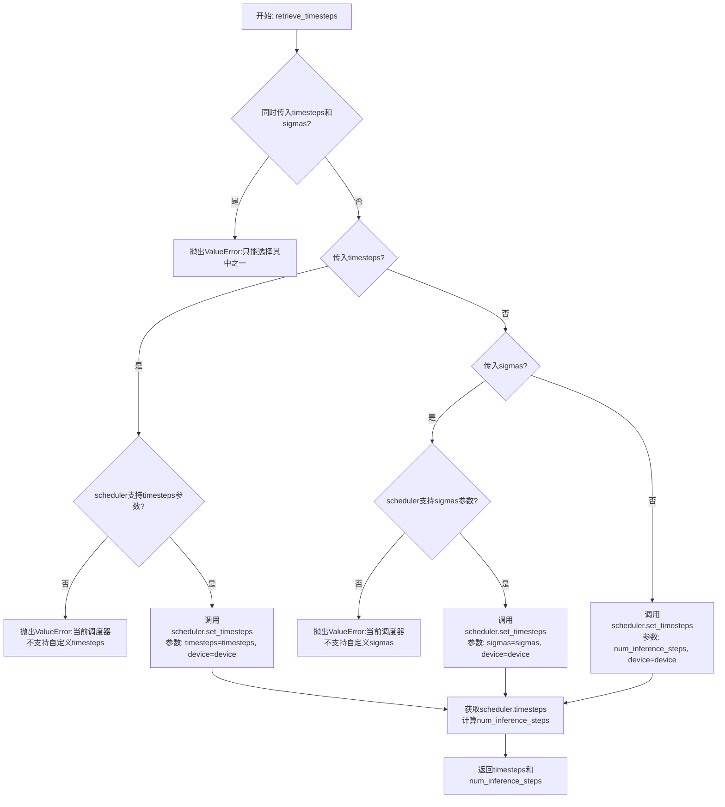
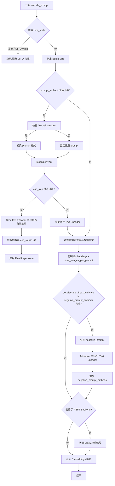
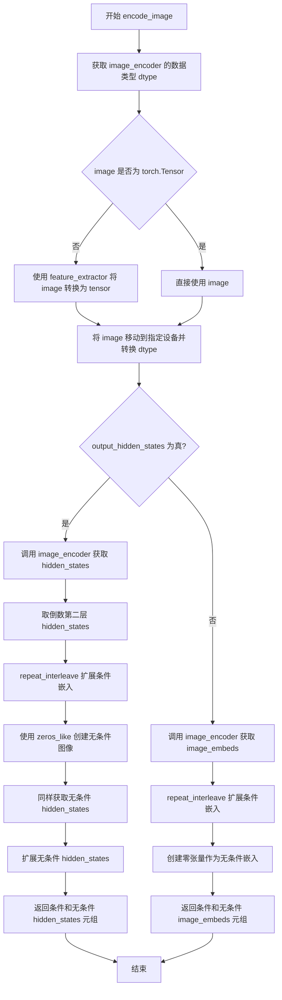
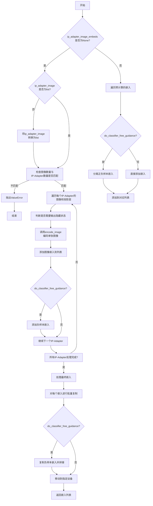
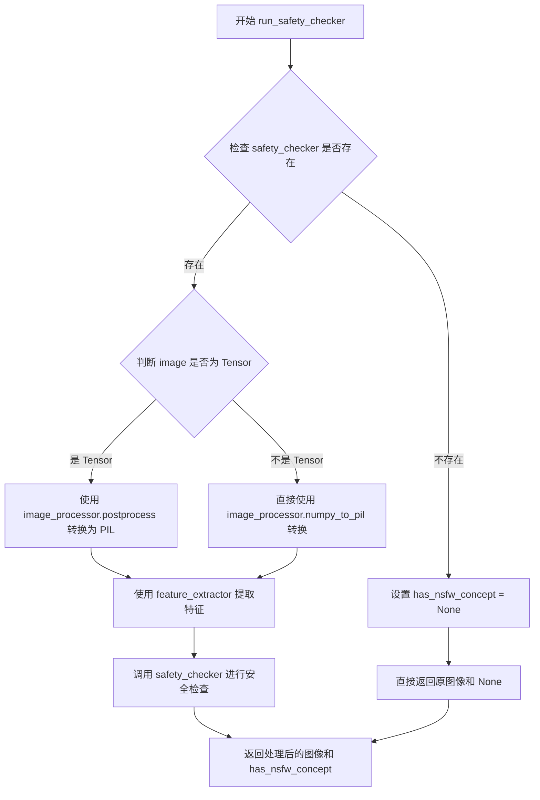
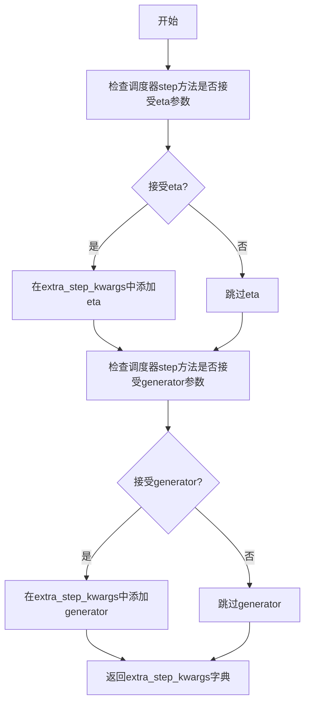
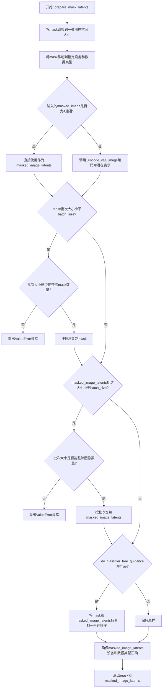
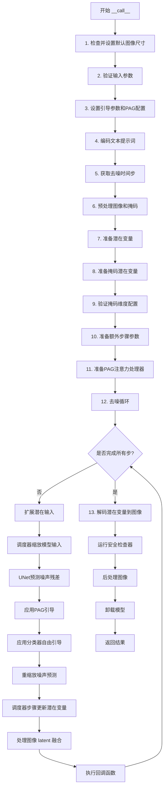

# `diffusers\src\diffusers\pipelines\pag\pipeline_pag_sd_inpaint.py` 详细设计文档

Stable Diffusion PAG Inpainting Pipeline - A text-to-image generation pipeline for inpainting tasks using Stable Diffusion with Perturbed Attention Guidance (PAG), supporting IP-Adapter, LoRA, textual inversion, and various advanced features like classifier-free guidance and safety checking.

## 整体流程

```mermaid
graph TD
    A[Start: __call__] --> B[Check & Validate Inputs]
    B --> C[Encode Prompt with CLIP]
    C --> D[Retrieve Timesteps from Scheduler]
    D --> E[Preprocess Image & Mask]
    E --> F[Prepare Latents (noise + image)]
    F --> G[Prepare Mask Latents]
    G --> H{For each timestep}
    H -->|Yes| I[Predict Noise with UNet]
    I --> J[Apply Guidance (PAG/CFG)]
    J --> K[Scheduler Step]
    K --> L[Callback if provided]
    L --> H
    H -->|No| M[Decode Latents with VAE]
    M --> N[Run Safety Checker]
    N --> O[Postprocess Image]
    O --> P[Return Output]
```

## 类结构

```
DiffusionPipeline (基类)
├── StableDiffusionMixin
├── TextualInversionLoaderMixin
├── StableDiffusionLoraLoaderMixin
├── IPAdapterMixin
├── FromSingleFileMixin
└── PAGMixin
    └── StableDiffusionPAGInpaintPipeline
```

## 全局变量及字段


### `logger`
    
模块日志记录器，用于输出调试和警告信息

类型：`logging.Logger`
    


### `EXAMPLE_DOC_STRING`
    
示例使用文档字符串，包含pipeline调用示例代码

类型：`str`
    


### `XLA_AVAILABLE`
    
标志位，指示XLA/TPU是否可用

类型：`bool`
    


### `retrieve_latents`
    
从encoder_output中提取latents的辅助函数

类型：`function`
    


### `rescale_noise_cfg`
    
根据guidance_rescale重新缩放noise_cfg张量以改善图像质量

类型：`function`
    


### `retrieve_timesteps`
    
调用scheduler的set_timesteps方法并获取时间步调度

类型：`function`
    


### `StableDiffusionPAGInpaintPipeline.vae`
    
VAE模型，用于图像编码和解码到潜在表示

类型：`AutoencoderKL`
    


### `StableDiffusionPAGInpaintPipeline.text_encoder`
    
冻结的文本编码器，用于将文本提示转换为嵌入

类型：`CLIPTextModel`
    


### `StableDiffusionPAGInpaintPipeline.tokenizer`
    
CLIP分词器，用于对文本输入进行分词

类型：`CLIPTokenizer`
    


### `StableDiffusionPAGInpaintPipeline.unet`
    
UNet模型，用于对编码后的图像latents进行去噪

类型：`UNet2DConditionModel`
    


### `StableDiffusionPAGInpaintPipeline.scheduler`
    
扩散调度器，用于控制去噪过程的噪声调度

类型：`KarrasDiffusionSchedulers`
    


### `StableDiffusionPAGInpaintPipeline.safety_checker`
    
NSFW内容检查器，用于检测生成图像是否包含不当内容

类型：`StableDiffusionSafetyChecker`
    


### `StableDiffusionPAGInpaintPipeline.feature_extractor`
    
CLIP图像处理器，用于从生成的图像中提取特征

类型：`CLIPImageProcessor`
    


### `StableDiffusionPAGInpaintPipeline.image_encoder`
    
CLIP视觉模型，用于IP-Adapter图像嵌入

类型：`CLIPVisionModelWithProjection`
    


### `StableDiffusionPAGInpaintPipeline.vae_scale_factor`
    
VAE缩放因子，用于调整潜在空间维度

类型：`int`
    


### `StableDiffusionPAGInpaintPipeline.image_processor`
    
图像处理器，用于图像的预处理和后处理

类型：`VaeImageProcessor`
    


### `StableDiffusionPAGInpaintPipeline.mask_processor`
    
掩码处理器，用于掩码的预处理

类型：`VaeImageProcessor`
    
    

## 全局函数及方法


### `retrieve_latents`

该函数用于从变分自编码器(VAE)的编码器输出中提取潜在表示(latents)。它支持三种提取模式：通过采样从潜在分布中提取、通过取模式(mode)提取，或者直接返回预存的latents属性。

参数：

- `encoder_output`：`torch.Tensor`，编码器的输出对象，通常包含 `latent_dist` 属性（潜在分布对象）或 `latents` 属性（直接存储的潜在张量）
- `generator`：`torch.Generator | None`，可选的随机数生成器，用于从潜在分布中采样时控制随机性
- `sample_mode`：`str`，采样模式，默认为 `"sample"`（从分布中采样），也可设置为 `"argmax"`（取分布的模式/均值）

返回值：`torch.Tensor`，提取出的潜在表示张量，通常为形状 `(batch_size, latent_channels, height, width)` 的四维张量

#### 流程图

```mermaid
flowchart TD
    A[开始: retrieve_latents] --> B{encoder_output 是否具有 latent_dist 属性?}
    B -->|是| C{sample_mode == 'sample'?}
    B -->|否| D{encoder_output 是否具有 latents 属性?}
    
    C -->|是| E[返回 encoder_output.latent_dist.sample<br/>(使用 generator 随机采样)]
    C -->|否| F{sample_mode == 'argmax'?}
    
    F -->|是| G[返回 encoder_output.latent_dist.mode<br/>(取分布的模式/均值)]
    F -->|否| H[抛出 AttributeError<br/>无效的 sample_mode]
    
    D -->|是| I[返回 encoder_output.latents<br/>(直接返回预存的潜在张量)]
    D -->|否| J[抛出 AttributeError<br/>无法访问 latents]
    
    E --> K[结束: 返回 latents 张量]
    G --> K
    I --> K
    H --> K
    J --> K
```

#### 带注释源码

```python
# Copied from diffusers.pipelines.stable_diffusion.pipeline_stable_diffusion_img2img.retrieve_latents
def retrieve_latents(
    encoder_output: torch.Tensor, generator: torch.Generator | None = None, sample_mode: str = "sample"
):
    """
    从编码器输出中提取潜在表示(latents)。
    
    支持三种提取方式：
    1. 从 latent_dist 分布中采样 (sample_mode="sample")
    2. 取 latent_dist 分布的模式/均值 (sample_mode="argmax")
    3. 直接返回 encoder_output.latents 属性
    
    Args:
        encoder_output: 编码器输出，包含 latent_dist 或 latents 属性
        generator: 可选的随机数生成器，用于采样控制
        sample_mode: 采样模式，"sample" 或 "argmax"
    
    Returns:
        torch.Tensor: 提取的潜在表示
    """
    # 检查是否有 latent_dist 属性且模式为 sample（采样）
    if hasattr(encoder_output, "latent_dist") and sample_mode == "sample":
        # 从潜在分布中采样，支持使用生成器控制随机性
        return encoder_output.latent_dist.sample(generator)
    # 检查是否有 latent_dist 属性且模式为 argmax（取模式）
    elif hasattr(encoder_output, "latent_dist") and sample_mode == "argmax":
        # 取潜在分布的模式（即概率最大的那个，或分布的均值）
        return encoder_output.latent_dist.mode()
    # 检查是否有直接的 latents 属性
    elif hasattr(encoder_output, "latents"):
        # 直接返回预存的潜在表示
        return encoder_output.latents
    # 如果无法识别有效的潜在表示来源，抛出异常
    else:
        raise AttributeError("Could not access latents of provided encoder_output")
```


### `rescale_noise_cfg`

该函数用于根据 guidance_rescale 参数重新缩放噪声预测张量，以改善图像质量并修复过度曝光问题。基于论文 Common Diffusion Noise Schedules and Sample Steps are Flawed (Section 3.4)。

参数：

- `noise_cfg`：`torch.Tensor`，引导扩散过程中预测的噪声张量
- `noise_pred_text`：`torch.Tensor`，文本引导扩散过程中预测的噪声张量
- `guidance_rescale`：`float`，可选，默认值为 0.0应用于噪声预测的重新缩放因子

返回值：`torch.Tensor`，重新缩放后的噪声预测张量

#### 流程图

```mermaid
flowchart TD
    A[开始] --> B[计算 noise_pred_text 的标准差 std_text]
    B --> C[计算 noise_cfg 的标准差 std_cfg]
    C --> D[计算重新缩放的噪声预测 noise_pred_rescaled = noise_cfg × (std_text / std_cfg)]
    D --> E[根据 guidance_rescale 混合原始和重新缩放的结果<br/>noise_cfg = guidance_rescale × noise_pred_rescaled + (1 - guidance_rescale) × noise_cfg]
    E --> F[返回重新缩放后的 noise_cfg]
```

#### 带注释源码

```python
def rescale_noise_cfg(noise_cfg, noise_pred_text, guidance_rescale=0.0):
    r"""
    Rescales `noise_cfg` tensor based on `guidance_rescale` to improve image quality and fix overexposure. Based on
    Section 3.4 from [Common Diffusion Noise Schedules and Sample Steps are
    Flawed](https://huggingface.co/papers/2305.08891).

    Args:
        noise_cfg (`torch.Tensor`):
            The predicted noise tensor for the guided diffusion process.
        noise_pred_text (`torch.Tensor`):
            The predicted noise tensor for the text-guided diffusion process.
        guidance_rescale (`float`, *optional*, defaults to 0.0):
            A rescale factor applied to the noise predictions.

    Returns:
        noise_cfg (`torch.Tensor`): The rescaled noise prediction tensor.
    """
    # 计算文本预测噪声在除批次维度外所有维度的标准差
    # keepdim=True 保持维度以便后续广播操作
    std_text = noise_pred_text.std(dim=list(range(1, noise_pred_text.ndim)), keepdim=True)
    
    # 计算噪声配置在除批次维度外所有维度的标准差
    std_cfg = noise_cfg.std(dim=list(range(1, noise_cfg.ndim)), keepdim=True)
    
    # 重新缩放引导结果（修复过度曝光）
    # 通过将 noise_cfg 乘以 std_text/std_cfg 的比例来实现
    noise_pred_rescaled = noise_cfg * (std_text / std_cfg)
    
    # 通过 guidance_rescale 因子混合原始引导结果，避免图像看起来"平淡"
    # guidance_rescale=0.0 时保留原始 noise_cfg
    # guidance_rescale=1.0 时完全使用重新缩放的结果
    noise_cfg = guidance_rescale * noise_pred_rescaled + (1 - guidance_rescale) * noise_cfg
    
    return noise_cfg
```


### `retrieve_timesteps`

该函数是Stable Diffusion pipeline的全局辅助函数，用于调用调度器（scheduler）的`set_timesteps`方法并从中获取时间步（timesteps）序列。它支持自定义时间步和自定义sigmas，并处理调度器的兼容性检查。

参数：

- `scheduler`：`SchedulerMixin`，用于获取时间步的调度器对象
- `num_inference_steps`：`int | None`，生成样本时使用的扩散步数，如果使用此参数则`timesteps`必须为`None`
- `device`：`str | torch.device | None`，时间步要移动到的设备，如果为`None`则不移动
- `timesteps`：`list[int] | None`，用于覆盖调度器时间步间隔策略的自定义时间步，如果传递此参数则`num_inference_steps`和`sigmas`必须为`None`
- `sigmas`：`list[float] | None`，用于覆盖调度器时间步间隔策略的自定义sigmas，如果传递此参数则`num_inference_steps`和`timesteps`必须为`None`
- `**kwargs`：任意关键字参数，将传递给`scheduler.set_timesteps`

返回值：`tuple[torch.Tensor, int]`，元组第一个元素是调度器的时间步调度序列，第二个元素是推理步数

#### 流程图



#### 带注释源码

```python
# Copied from diffusers.pipelines.stable_diffusion.pipeline_stable_diffusion.retrieve_timesteps
def retrieve_timesteps(
    scheduler,
    num_inference_steps: int | None = None,
    device: str | torch.device | None = None,
    timesteps: list[int] | None = None,
    sigmas: list[float] | None = None,
    **kwargs,
):
    r"""
    Calls the scheduler's `set_timesteps` method and retrieves timesteps from the scheduler after the call. Handles
    custom timesteps. Any kwargs will be supplied to `scheduler.set_timesteps`.

    Args:
        scheduler (`SchedulerMixin`):
            The scheduler to get timesteps from.
        num_inference_steps (`int`):
            The number of diffusion steps used when generating samples with a pre-trained model. If used, `timesteps`
            must be `None`.
        device (`str` or `torch.device`, *optional*):
            The device to which the timesteps should be moved to. If `None`, the timesteps are not moved.
        timesteps (`list[int]`, *optional*):
            Custom timesteps used to override the timestep spacing strategy of the scheduler. If `timesteps` is passed,
            `num_inference_steps` and `sigmas` must be `None`.
        sigmas (`list[float]`, *optional*):
            Custom sigmas used to override the timestep spacing strategy of the scheduler. If `sigmas` is passed,
            `num_inference_steps` and `timesteps` must be `None`.

    Returns:
        `tuple[torch.Tensor, int]`: A tuple where the first element is the timestep schedule from the scheduler and the
        second element is the number of inference steps.
    """
    # 检查是否同时传入了timesteps和sigmas，这是不允许的
    if timesteps is not None and sigmas is not None:
        raise ValueError("Only one of `timesteps` or `sigmas` can be passed. Please choose one to set custom values")
    
    # 处理自定义timesteps的情况
    if timesteps is not None:
        # 通过inspect检查调度器的set_timesteps方法是否支持timesteps参数
        accepts_timesteps = "timesteps" in set(inspect.signature(scheduler.set_timesteps).parameters.keys())
        if not accepts_timesteps:
            raise ValueError(
                f"The current scheduler class {scheduler.__class__}'s `set_timesteps` does not support custom"
                f" timestep schedules. Please check whether you are using the correct scheduler."
            )
        # 调用调度器的set_timesteps方法设置自定义时间步
        scheduler.set_timesteps(timesteps=timesteps, device=device, **kwargs)
        # 从调度器获取设置后的时间步
        timesteps = scheduler.timesteps
        # 计算推理步数
        num_inference_steps = len(timesteps)
    
    # 处理自定义sigmas的情况
    elif sigmas is not None:
        # 通过inspect检查调度器的set_timesteps方法是否支持sigmas参数
        accept_sigmas = "sigmas" in set(inspect.signature(scheduler.set_timesteps).parameters.keys())
        if not accept_sigmas:
            raise ValueError(
                f"The current scheduler class {scheduler.__class__}'s `set_timesteps` does not support custom"
                f" sigmas schedules. Please check whether you are using the correct scheduler."
            )
        # 调用调度器的set_timesteps方法设置自定义sigmas
        scheduler.set_timesteps(sigmas=sigmas, device=device, **kwargs)
        # 从调度器获取设置后的时间步
        timesteps = scheduler.timesteps
        # 计算推理步数
        num_inference_steps = len(timesteps)
    
    # 默认情况：使用num_inference_steps设置标准时间步
    else:
        scheduler.set_timesteps(num_inference_steps, device=device, **kwargs)
        timesteps = scheduler.timesteps
    
    # 返回时间步序列和推理步数
    return timesteps, num_inference_steps
```


### `StableDiffusionPAGInpaintPipeline.__init__`

初始化 Stable Diffusion PAG (Perturbed Attention Guidance) Inpainting Pipeline，设置 VAE、文本编码器、tokenizer、UNet、调度器、安全检查器等核心组件，并配置 PAG 相关的层用于图像修复任务。

参数：

- `vae`：`AutoencoderKL`，Variational Auto-Encoder 模型，用于编码和解码图像到潜在表示
- `text_encoder`：`CLIPTextModel`，冻结的文本编码器 (clip-vit-large-patch14)
- `tokenizer`：`CLIPTokenizer`，CLIP 分词器用于对文本进行分词
- `unet`：`UNet2DConditionModel`，去噪条件 UNet 模型
- `scheduler`：`KarrasDiffusionSchedulers`，与 unet 结合使用的调度器
- `safety_checker`：`StableDiffusionSafetyChecker`，估计生成图像是否被认为具有攻击性或有害的分类模块
- `feature_extractor`：`CLIPImageProcessor`，用于从生成的图像中提取特征的图像处理器
- `image_encoder`：`CLIPVisionModelWithProjection`，可选的图像编码器，用于 IP-Adapter
- `requires_safety_checker`：`bool`，是否需要安全检查器，默认为 True
- `pag_applied_layers`：`str | list[str]`，PAG 应用的层，默认为 "mid"

返回值：`None`，构造函数无返回值

#### 流程图

```mermaid
flowchart TD
    A[__init__ 开始] --> B[调用 super().__init__]
    B --> C{scheduler.config.steps_offset != 1?}
    C -->|是| D[发出废弃警告并重置 steps_offset=1]
    C -->|否| E{scheduler.config.clip_sample == True?}
    D --> E
    E -->|是| F[发出废弃警告并重置 clip_sample=False]
    E -->|否| G{safety_checker is None<br/>且 requires_safety_checker?}
    F --> G
    G -->|是| H[发出安全检查器禁用警告]
    G -->|否| I{safety_checker is not None<br/>且 feature_extractor is None?}
    H --> J
    I -->|是| K[抛出 ValueError]
    I -->|否| J
    K --> J
    J --> L{unet版本 < 0.9.0<br/>且 sample_size < 64?}
    L -->|是| M[发出废弃警告并重置 sample_size=64]
    L -->|否| N
    M --> N
    N --> O[register_modules 注册所有模块]
    O --> P[计算 vae_scale_factor]
    P --> Q[创建 VaeImageProcessor]
    Q --> R[创建 mask_processor]
    R --> S[register_to_config 保存配置]
    S --> T[set_pag_applied_layers 设置PAG层]
    T --> U[__init__ 结束]
```

#### 带注释源码

```python
def __init__(
    self,
    vae: AutoencoderKL,
    text_encoder: CLIPTextModel,
    tokenizer: CLIPTokenizer,
    unet: UNet2DConditionModel,
    scheduler: KarrasDiffusionSchedulers,
    safety_checker: StableDiffusionSafetyChecker,
    feature_extractor: CLIPImageProcessor,
    image_encoder: CLIPVisionModelWithProjection = None,
    requires_safety_checker: bool = True,
    pag_applied_layers: str | list[str] = "mid",
):
    # 1. 调用父类初始化
    super().__init__()

    # 2. 检查并修复 scheduler 的 steps_offset 配置
    if scheduler is not None and getattr(scheduler.config, "steps_offset", 1) != 1:
        deprecation_message = (
            f"The configuration file of this scheduler: {scheduler} is outdated. `steps_offset`"
            f" should be set to 1 instead of {scheduler.config.steps_offset}. Please make sure "
            "to update the config accordingly as leaving `steps_offset` might led to incorrect results"
            " in future versions. If you have downloaded this checkpoint from the Hugging Face Hub,"
            " it would be very nice if you could open a Pull request for the `scheduler/scheduler_config.json`"
            " file"
        )
        deprecate("steps_offset!=1", "1.0.0", deprecation_message, standard_warn=False)
        new_config = dict(scheduler.config)
        new_config["steps_offset"] = 1
        scheduler._internal_dict = FrozenDict(new_config)

    # 3. 检查并修复 scheduler 的 clip_sample 配置
    if scheduler is not None and getattr(scheduler.config, "clip_sample", False) is True:
        deprecation_message = (
            f"The configuration file of this scheduler: {scheduler} has not set the configuration `clip_sample`."
            " `clip_sample` should be set to False in the configuration file. Please make sure to update the"
            " config accordingly as not setting `clip_sample` in the config might lead to incorrect results in"
            " future versions. If you have downloaded this checkpoint from the Hugging Face Hub, it would be very"
            " nice if you could open a Pull request for the `scheduler/scheduler_config.json` file"
        )
        deprecate("clip_sample not set", "1.0.0", deprecation_message, standard_warn=False)
        new_config = dict(scheduler.config)
        new_config["clip_sample"] = False
        scheduler._internal_dict = FrozenDict(new_config)

    # 4. 检查安全检查器配置
    if safety_checker is None and requires_safety_checker:
        logger.warning(
            f"You have disabled the safety checker for {self.__class__} by passing `safety_checker=None`. Ensure"
            " that you abide to the conditions of the Stable Diffusion license and do not expose unfiltered"
            " results in services or applications open to the public. Both the diffusers team and Hugging Face"
            " strongly recommend to keep the safety filter enabled in all public facing circumstances, disabling"
            " it only for use-cases that involve analyzing network behavior or auditing its results. For more"
            " information, please have a look at https://github.com/huggingface/diffusers/pull/254 ."
        )

    # 5. 如果有安全检查器但没有特征提取器，抛出错误
    if safety_checker is not None and feature_extractor is None:
        raise ValueError(
            "Make sure to define a feature extractor when loading {self.__class__} if you want to use the safety"
            " checker. If you do not want to use the safety checker, you can pass `'safety_checker=None'` instead."
        )

    # 6. 检查 UNet 版本和 sample_size 兼容性
    is_unet_version_less_0_9_0 = (
        unet is not None
        and hasattr(unet.config, "_diffusers_version")
        and version.parse(version.parse(unet.config._diffusers_version).base_version) < version.parse("0.9.0.dev0")
    )
    is_unet_sample_size_less_64 = (
        unet is not None and hasattr(unet.config, "sample_size") and unet.config.sample_size < 64
    )
    if is_unet_version_less_0_9_0 and is_unet_sample_size_less_64:
        deprecation_message = (
            "The configuration file of the unet has set the default `sample_size` to smaller than"
            " 64 which seems highly unlikely. If your checkpoint is a fine-tuned version of any of the"
            " following: \n- CompVis/stable-diffusion-v1-4 \n- CompVis/stable-diffusion-v1-3 \n-"
            " CompVis/stable-diffusion-v1-2 \n- CompVis/stable-diffusion-v1-1 \n- stable-diffusion-v1-5/stable-diffusion-v1-5"
            " \n- stable-diffusion-v1-5/stable-diffusion-inpainting \n you should change 'sample_size' to 64 in the"
            " configuration file. Please make sure to update the config accordingly as leaving `sample_size=32`"
            " in the config might lead to incorrect results in future versions. If you have downloaded this"
            " checkpoint from the Hugging Face Hub, it would be very nice if you could open a Pull request for"
            " the `unet/config.json` file"
        )
        deprecate("sample_size<64", "1.0.0", deprecation_message, standard_warn=False)
        new_config = dict(unet.config)
        new_config["sample_size"] = 64
        unet._internal_dict = FrozenDict(new_config)

    # 7. 注册所有模块到 Pipeline
    self.register_modules(
        vae=vae,
        text_encoder=text_encoder,
        tokenizer=tokenizer,
        unet=unet,
        scheduler=scheduler,
        safety_checker=safety_checker,
        feature_extractor=feature_extractor,
        image_encoder=image_encoder,
    )

    # 8. 计算 VAE 缩放因子 (2^(block_out_channels - 1))
    self.vae_scale_factor = 2 ** (len(self.vae.config.block_out_channels) - 1) if getattr(self, "vae", None) else 8

    # 9. 创建图像处理器
    self.image_processor = VaeImageProcessor(vae_scale_factor=self.vae_scale_factor)

    # 10. 创建掩码处理器 (支持二值化和灰度转换)
    self.mask_processor = VaeImageProcessor(
        vae_scale_factor=self.vae_scale_factor, do_normalize=False, do_binarize=True, do_convert_grayscale=True
    )

    # 11. 注册配置
    self.register_to_config(requires_safety_checker=requires_safety_checker)

    # 12. 设置 PAG 应用的层
    self.set_pag_applied_layers(pag_applied_layers)
```


### `StableDiffusionPAGInpaintPipeline.encode_prompt`

该方法负责将文本提示（prompt）转换为文本编码器（CLIP Text Encoder）的隐藏状态（hidden states），即文本嵌入向量（Embeddings）。它处理了批处理大小计算、LoRA权重缩放、Clip跳层配置、负面提示（Negative Prompt）的编码以及用于无分类器指导（Classifier-Free Guidance）的嵌入复制等核心逻辑。

参数：

-  `self`：实例本身。
-  `prompt`：`str` 或 `list[str]`，要编码的文本提示。如果未定义，则必须传递 `prompt_embeds`。
-  `device`：`torch.device`，执行编码的设备（如 CUDA 或 CPU）。
-  `num_images_per_prompt`：`int`，每个提示需要生成的图像数量，用于复制嵌入向量以匹配批量生成。
-  `do_classifier_free_guidance`：`bool`，是否启用无分类器指导。如果为 True，则需要生成负向嵌入。
-  `negative_prompt`：`str` 或 `list[str]`，可选。不希望出现在图像中的描述。如果未定义且未提供 `negative_prompt_embeds`，将使用空字符串。
-  `prompt_embeds`：`torch.Tensor`，可选。预先计算好的文本嵌入。如果提供此参数，则跳过从 `prompt` 生成嵌入的步骤。
-  `negative_prompt_embeds`：`torch.Tensor`，可选。预先计算好的负面文本嵌入。
-  `lora_scale`：`float`，可选。LoRA 的缩放系数，用于调整文本编码器上 LoRA 层的影响。
-  `clip_skip`：`int`，可选。CLIP 模型中要跳过的层数。如果设置，则使用倒数第 `clip_skip + 1` 层的输出而非最终层。

返回值：`tuple[torch.Tensor, torch.Tensor]`，返回两个张量：
1.  `prompt_embeds`：编码后的正向文本嵌入。
2.  `negative_prompt_embeds`：编码后的负向文本嵌入（如果未启用CFG，可能为None）。

#### 流程图



#### 带注释源码

```python
def encode_prompt(
    self,
    prompt,
    device,
    num_images_per_prompt,
    do_classifier_free_guidance,
    negative_prompt=None,
    prompt_embeds: torch.Tensor | None = None,
    negative_prompt_embeds: torch.Tensor | None = None,
    lora_scale: float | None = None,
    clip_skip: int | None = None,
):
    r"""
    Encodes the prompt into text encoder hidden states.
    """
    # 1. 处理 LoRA 缩放
    # 如果传入了 lora_scale 且 pipeline 包含 LoRA 加载Mixin，则设置并动态调整权重
    if lora_scale is not None and isinstance(self, StableDiffusionLoraLoaderMixin):
        self._lora_scale = lora_scale
        # 根据是否使用 PEFT 后端选择缩放方式
        if not USE_PEFT_BACKEND:
            adjust_lora_scale_text_encoder(self.text_encoder, lora_scale)
        else:
            scale_lora_layers(self.text_encoder, lora_scale)

    # 2. 确定批处理大小 (Batch Size)
    if prompt is not None and isinstance(prompt, str):
        batch_size = 1
    elif prompt is not None and isinstance(prompt, list):
        batch_size = len(prompt)
    else:
        # 如果 prompt 为空，则依赖传入的 prompt_embeds 的批次大小
        batch_size = prompt_embeds.shape[0]

    # 3. 如果未提供 prompt_embeds，则从 prompt 文本生成
    if prompt_embeds is None:
        # 检查是否需要进行 Textual Inversion (文本倒置) 处理
        if isinstance(self, TextualInversionLoaderMixin):
            prompt = self.maybe_convert_prompt(prompt, self.tokenizer)

        # Tokenize: 将文本转换为 token IDs
        text_inputs = self.tokenizer(
            prompt,
            padding="max_length",
            max_length=self.tokenizer.model_max_length,
            truncation=True,
            return_tensors="pt",
        )
        text_input_ids = text_inputs.input_ids
        
        # 额外获取一次未截断的 IDs 以检测截断警告
        untruncated_ids = self.tokenizer(prompt, padding="longest", return_tensors="pt").input_ids

        # 检测是否发生了截断，并记录警告
        if untruncated_ids.shape[-1] >= text_input_ids.shape[-1] and not torch.equal(
            text_input_ids, untruncated_ids
        ):
            removed_text = self.tokenizer.batch_decode(
                untruncated_ids[:, self.tokenizer.model_max_length - 1 : -1]
            )
            logger.warning(
                "The following part of your input was truncated because CLIP can only handle sequences up to"
                f" {self.tokenizer.model_max_length} tokens: {removed_text}"
            )

        # 获取 Attention Mask
        if hasattr(self.text_encoder.config, "use_attention_mask") and self.text_encoder.config.use_attention_mask:
            attention_mask = text_inputs.attention_mask.to(device)
        else:
            attention_mask = None

        # 4. 运行 Text Encoder
        if clip_skip is None:
            # 正常前向传播，获取最终隐藏层
            prompt_embeds = self.text_encoder(text_input_ids.to(device), attention_mask=attention_mask)
            prompt_embeds = prompt_embeds[0]
        else:
            # 如果设置了 clip_skip，获取隐藏层并跳过后续层
            prompt_embeds = self.text_encoder(
                text_input_ids.to(device), attention_mask=attention_mask, output_hidden_states=True
            )
            # 访问隐藏状态元组，取倒数第 clip_skip + 1 层
            prompt_embeds = prompt_embeds[-1][-(clip_skip + 1)]
            # 应用最终的 LayerNorm 以保证表示正确
            prompt_embeds = self.text_encoder.text_model.final_layer_norm(prompt_embeds)

    # 5. 确定数据类型和设备
    if self.text_encoder is not None:
        prompt_embeds_dtype = self.text_encoder.dtype
    elif self.unet is not None:
        prompt_embeds_dtype = self.unet.dtype
    else:
        prompt_embeds_dtype = prompt_embeds.dtype

    # 将生成的 embeddings 转换到正确的 dtype 和 device
    prompt_embeds = prompt_embeds.to(dtype=prompt_embeds_dtype, device=device)

    # 6. 重复 embeddings 以匹配生成图像的数量
    bs_embed, seq_len, _ = prompt_embeds.shape
    # 复制每个提示的嵌入 num_images_per_prompt 次
    prompt_embeds = prompt_embeds.repeat(1, num_images_per_prompt, 1)
    # 调整形状为 (batch_size * num_images_per_prompt, seq_len, hidden_dim)
    prompt_embeds = prompt_embeds.view(bs_embed * num_images_per_prompt, seq_len, -1)

    # 7. 处理 Negative Prompt (用于 Classifier-Free Guidance)
    if do_classifier_free_guidance and negative_prompt_embeds is None:
        uncond_tokens: list[str]
        
        # 处理负向提示的默认值或类型检查
        if negative_prompt is None:
            uncond_tokens = [""] * batch_size
        elif prompt is not None and type(prompt) is not type(negative_prompt):
            raise TypeError(...)
        elif isinstance(negative_prompt, str):
            uncond_tokens = [negative_prompt]
        elif batch_size != len(negative_prompt):
            raise ValueError(...)
        else:
            uncond_tokens = negative_prompt

        # 同样进行 Textual Inversion 处理
        if isinstance(self, TextualInversionLoaderMixin):
            uncond_tokens = self.maybe_convert_prompt(uncond_tokens, self.tokenizer)

        # Tokenize 负向提示
        max_length = prompt_embeds.shape[1]
        uncond_input = self.tokenizer(
            uncond_tokens,
            padding="max_length",
            max_length=max_length,
            truncation=True,
            return_tensors="pt",
        )

        # 获取负向提示的 attention mask
        if hasattr(self.text_encoder.config, "use_attention_mask") and self.text_encoder.config.use_attention_mask:
            attention_mask = uncond_input.attention_mask.to(device)
        else:
            attention_mask = None

        # 编码负向提示
        negative_prompt_embeds = self.text_encoder(
            uncond_input.input_ids.to(device),
            attention_mask=attention_mask,
        )
        negative_prompt_embeds = negative_prompt_embeds[0]

    # 8. 如果启用 CFG，复制负向 embeddings
    if do_classifier_free_guidance:
        seq_len = negative_prompt_embeds.shape[1]
        negative_prompt_embeds = negative_prompt_embeds.to(dtype=prompt_embeds_dtype, device=device)
        negative_prompt_embeds = negative_prompt_embeds.repeat(1, num_images_per_prompt, 1)
        negative_prompt_embeds = negative_prompt_embeds.view(batch_size * num_images_per_prompt, seq_len, -1)

    # 9. 清理 LoRA 权重
    if self.text_encoder is not None:
        if isinstance(self, StableDiffusionLoraLoaderMixin) and USE_PEFT_BACKEND:
            # 如果使用了 PEFT，需要恢复原始权重scale
            unscale_lora_layers(self.text_encoder, lora_scale)

    # 返回正向和负向 embeddings
    return prompt_embeds, negative_prompt_embeds
```


### `StableDiffusionPAGInpaintPipeline.encode_image`

该方法用于将输入图像编码为图像嵌入向量或隐藏状态，支持分类器自由引导（Classifier-Free Guidance），并可选择返回隐藏状态或图像嵌入。

参数：

- `image`：`torch.Tensor | PipelineImageInput`，输入的图像数据，可以是 PyTorch 张量或管道图像输入类型
- `device`：`torch.device`，指定图像编码所使用的设备（如 CPU 或 CUDA）
- `num_images_per_prompt`：`int`，每个提示词生成的图像数量，用于对图像嵌入进行复制以匹配批量大小
- `output_hidden_states`：`bool | None`，可选参数，指定是否返回图像编码器的隐藏状态，默认为 None

返回值：`tuple[torch.Tensor, torch.Tensor]`，返回两个张量组成的元组——第一个是条件图像嵌入（或隐藏状态），第二个是无条件图像嵌入（或隐藏状态），用于分类器自由引导

#### 流程图



#### 带注释源码

```python
def encode_image(self, image, device, num_images_per_prompt, output_hidden_states=None):
    """
    Encodes the input image into embeddings for use in the diffusion process.

    Args:
        image: Input image tensor or PipelineImageInput
        device: torch.device to run encoding on
        num_images_per_prompt: Number of images to generate per prompt
        output_hidden_states: Whether to return hidden states instead of embeddings
    """
    # 获取图像编码器的参数数据类型，用于后续统一数据类型
    dtype = next(self.image_encoder.parameters()).dtype

    # 如果输入不是 PyTorch 张量，则使用特征提取器将其转换为张量
    # feature_extractor 将 PIL Image 或其他格式转换为 pixel_values
    if not isinstance(image, torch.Tensor):
        image = self.feature_extractor(image, return_tensors="pt").pixel_values

    # 将图像移动到指定设备并转换为正确的 dtype
    image = image.to(device=device, dtype=dtype)

    # 根据 output_hidden_states 参数决定返回隐藏状态还是图像嵌入
    if output_hidden_states:
        # 获取编码器的隐藏状态，取倒数第二层（通常是倒数第二层效果最好）
        image_enc_hidden_states = self.image_encoder(image, output_hidden_states=True).hidden_states[-2]
        # 扩展条件嵌入以匹配每个提示词生成的图像数量
        image_enc_hidden_states = image_enc_hidden_states.repeat_interleave(num_images_per_prompt, dim=0)
        
        # 创建零张量作为无条件的图像编码（用于 classifier-free guidance）
        uncond_image_enc_hidden_states = self.image_encoder(
            torch.zeros_like(image), output_hidden_states=True
        ).hidden_states[-2]
        # 同样扩展无条件隐藏状态
        uncond_image_enc_hidden_states = uncond_image_enc_hidden_states.repeat_interleave(
            num_images_per_prompt, dim=0
        )
        # 返回隐藏状态元组
        return image_enc_hidden_states, uncond_image_enc_hidden_states
    else:
        # 直接获取图像嵌入向量
        image_embeds = self.image_encoder(image).image_embeds
        # 扩展条件嵌入
        image_embeds = image_embeds.repeat_interleave(num_images_per_prompt, dim=0)
        # 创建零张量作为无条件嵌入（用于 classifier-free guidance）
        uncond_image_embeds = torch.zeros_like(image_embeds)
        # 返回嵌入向量元组
        return image_embeds, uncond_image_embeds
```


### `StableDiffusionPAGInpaintPipeline.prepare_ip_adapter_image_embeds`

该方法用于准备IP-Adapter的图像嵌入（image embeddings），支持两种输入模式：直接传入图像或已编码的图像嵌入。它会处理图像编码、批量复制、条件引导和无分类器自由引导（CFG），最终返回适配器所需的图像嵌入列表。

参数：

- `self`：隐式参数，指向`StableDiffusionPAGInpaintPipeline`实例本身
- `ip_adapter_image`：`PipelineImageInput | None`，需要编码为嵌入的输入图像，可以是单个图像或图像列表
- `ip_adapter_image_embeds`：`list[torch.Tensor] | None`，预先编码好的图像嵌入列表，如果为`None`则需要从`ip_adapter_image`编码得到
- `device`：`str | torch.device`，指定计算设备（如"cuda"或"cpu"）
- `num_images_per_prompt`：`int`，每个prompt生成的图像数量，用于批量复制嵌入
- `do_classifier_free_guidance`：`bool`，是否启用无分类器自由引导，决定是否需要生成负样本图像嵌入

返回值：`list[torch.Tensor]`，处理后的IP-Adapter图像嵌入列表，每个元素对应一个IP-Adapter，包含正负样本嵌入（若启用CFG）

#### 流程图



#### 带注释源码

```python
def prepare_ip_adapter_image_embeds(
    self, 
    ip_adapter_image,  # 输入图像或图像列表
    ip_adapter_image_embeds,  # 预计算的嵌入或None
    device,  # 计算设备
    num_images_per_prompt,  # 每个prompt生成的图像数
    do_classifier_free_guidance  # 是否启用CFG
):
    # 初始化图像嵌入列表
    image_embeds = []
    
    # 如果启用CFG，同时初始化负样本嵌入列表
    if do_classifier_free_guidance:
        negative_image_embeds = []
    
    # 情况1：没有预计算的嵌入，需要从图像编码
    if ip_adapter_image_embeds is None:
        # 统一转换为list格式（便于统一处理）
        if not isinstance(ip_adapter_image, list):
            ip_adapter_image = [ip_adapter_image]

        # 验证：图像数量必须与IP-Adapter数量匹配
        # IP-Adapter数量由unet的encoder_hid_proj.image_projection_layers决定
        if len(ip_adapter_image) != len(self.unet.encoder_hid_proj.image_projection_layers):
            raise ValueError(
                f"`ip_adapter_image` must have same length as the number of IP Adapters. "
                f"Got {len(ip_adapter_image)} images and "
                f"{len(self.unet.encoder_hid_proj.image_projection_layers)} IP Adapters."
            )

        # 遍历每个IP-Adapter对应的图像和投影层
        for single_ip_adapter_image, image_proj_layer in zip(
            ip_adapter_image, 
            self.unet.encoder_hid_proj.image_projection_layers
        ):
            # 判断该投影层是否输出隐藏状态
            # ImageProjection类型返回image_embeds，其他类型返回hidden_states
            output_hidden_state = not isinstance(image_proj_layer, ImageProjection)
            
            # 调用encode_image方法编码图像
            # 返回 (positive_embeds, negative_embeds) 或 (hidden_states, )
            single_image_embeds, single_negative_image_embeds = self.encode_image(
                single_ip_adapter_image, device, 1, output_hidden_state
            )

            # 添加批次维度[None, :]，从 (batch, emb_dim) 变为 (1, batch, emb_dim)
            image_embeds.append(single_image_embeds[None, :])
            
            # 如果启用CFG，同时保存负样本嵌入
            if do_classifier_free_guidance:
                negative_image_embeds.append(single_negative_image_embeds[None, :])
    
    # 情况2：已有预计算的嵌入，直接处理
    else:
        for single_image_embeds in ip_adapter_image_embeds:
            if do_classifier_free_guidance:
                # 预计算嵌入通常是正负样本拼接在一起，需要chunk分离
                # 格式: [negative_embeds, positive_embeds] 在维度0上拼接
                single_negative_image_embeds, single_image_embeds = single_image_embeds.chunk(2)
                negative_image_embeds.append(single_negative_image_embeds)
            
            # 直接添加嵌入（已经是正确的形状）
            image_embeds.append(single_image_embeds)

    # 最终处理：根据num_images_per_prompt复制嵌入，并处理CFG情况
    ip_adapter_image_embeds = []
    for i, single_image_embeds in enumerate(image_embeds):
        # 复制嵌入以匹配生成的图像数量
        # 从 (1, emb_dim) 扩展为 (num_images_per_prompt, emb_dim)
        single_image_embeds = torch.cat([single_image_embeds] * num_images_per_prompt, dim=0)
        
        if do_classifier_free_guidance:
            # 对负样本嵌入进行相同的复制操作
            single_negative_image_embeds = torch.cat(
                [negative_image_embeds[i]] * num_images_per_prompt, 
                dim=0
            )
            # 拼接： [negative_embeds, positive_embeds]，用于CFG
            # 形状: (2 * num_images_per_prompt, emb_dim)
            single_image_embeds = torch.cat(
                [single_negative_image_embeds, single_image_embeds], 
                dim=0
            )

        # 将最终嵌入移动到指定设备
        single_image_embeds = single_image_embeds.to(device=device)
        
        # 添加到结果列表
        ip_adapter_image_embeds.append(single_image_embeds)

    return ip_adapter_image_embeds
```


### `StableDiffusionPAGInpaintPipeline.run_safety_checker`

该方法是 Stable Diffusion PAG 修复管道的核心安全检查组件，负责对生成的图像进行内容安全审查，检测是否存在不适合工作场所（NSFW）的内容，并根据审查结果对图像进行相应的处理。

参数：

- `image`：`torch.Tensor | numpy.ndarray`，需要进行检查的图像，可以是 PyTorch 张量或 NumPy 数组格式
- `device`：`torch.device`，执行安全检查的计算设备（如 CPU 或 CUDA 设备）
- `dtype`：`torch.dtype`，输入图像的数据类型，用于确保数据类型一致性

返回值：`tuple`，返回两个元素——第一个是经过安全检查处理后的图像（类型与输入相同），第二个是布尔标志（`list[bool]` 或 `None`），指示图像是否包含不适合工作场所的内容

#### 流程图



#### 带注释源码

```python
def run_safety_checker(self, image, device, dtype):
    """
    对生成的图像进行安全检查，检测是否包含不适合工作场所的内容
    
    Args:
        image: 输入图像，可以是 torch.Tensor 或 numpy.ndarray 格式
        device: torch.device，计算设备
        dtype: torch.dtype，数据类型
    
    Returns:
        tuple: (处理后的图像, has_nsfw_concept 标志)
    """
    # 如果安全检查器未配置，直接返回 None 标志，不进行安全检查
    if self.safety_checker is None:
        has_nsfw_concept = None
    else:
        # 根据输入图像类型进行相应的预处理
        if torch.is_tensor(image):
            # 将 Tensor 格式的图像转换为 PIL 图像格式
            feature_extractor_input = self.image_processor.postprocess(image, output_type="pil")
        else:
            # 将 NumPy 数组格式的图像转换为 PIL 图像格式
            feature_extractor_input = self.image_processor.numpy_to_pil(image)
        
        # 使用特征提取器处理图像，生成安全检查器所需的输入
        safety_checker_input = self.feature_extractor(feature_extractor_input, return_tensors="pt").to(device)
        
        # 调用安全检查器进行内容审查
        # 同时将像素值转换为指定的 dtype 以匹配模型要求
        image, has_nsfw_concept = self.safety_checker(
            images=image, clip_input=safety_checker_input.pixel_values.to(dtype)
        )
    
    # 返回处理后的图像和 NSFW 检测结果
    return image, has_nsfw_concept
```


### `StableDiffusionPAGInpaintPipeline.prepare_extra_step_kwargs`

该方法用于为调度器（scheduler）的`step`方法准备额外的关键字参数。由于不同的调度器可能有不同的签名（如某些调度器支持`eta`参数，某些支持`generator`参数），该方法通过检查调度器的签名来动态构建需要传递的参数字典。

参数：

- `generator`：`torch.Generator | list[torch.Generator] | None`，随机数生成器，用于使生成过程具有确定性。如果为`None`，则使用随机噪声。
- `eta`：`float`，DDIM调度器专用的噪声参数（η），对应DDIM论文中的参数，取值范围为[0, 1]。其他调度器会忽略此参数。

返回值：`dict[str, Any]`，包含调度器`step`方法所需的关键字参数的字典，可能包含`eta`和/或`generator`键。

#### 流程图



#### 带注释源码

```python
def prepare_extra_step_kwargs(self, generator, eta):
    # 准备调度器step方法的额外参数，因为并非所有调度器都具有相同的签名
    # eta (η) 仅在DDIMScheduler中使用，其他调度器会忽略它
    # eta对应DDIM论文中的η参数：https://huggingface.co/papers/2010.02502
    # 取值应在[0, 1]之间
    
    # 通过检查调度器step方法的签名来判断是否接受eta参数
    accepts_eta = "eta" in set(inspect.signature(self.scheduler.step).parameters.keys())
    
    # 初始化额外的关键字参数字典
    extra_step_kwargs = {}
    
    # 如果调度器接受eta参数，则将其添加到extra_step_kwargs中
    if accepts_eta:
        extra_step_kwargs["eta"] = eta

    # 检查调度器是否接受generator参数
    accepts_generator = "generator" in set(inspect.signature(self.scheduler.step).parameters.keys())
    
    # 如果调度器接受generator参数，则将其添加到extra_step_kwargs中
    if accepts_generator:
        extra_step_kwargs["generator"] = generator
    
    # 返回构建好的额外关键字参数字典
    return extra_step_kwargs
```


### `StableDiffusionPAGInpaintPipeline.check_inputs`

该方法用于验证Stable Diffusion图像修复管道的输入参数是否有效，包括检查提示词、图像、掩码图像、尺寸、强度、回调步骤等关键参数是否符合预期，并抛出相应的错误信息以防止无效输入导致的运行时异常。

参数：

- `self`：`StableDiffusionPAGInpaintPipeline`实例本身
- `prompt`：`str | list[str] | None`，要引导图像生成的提示词或提示词列表，若未定义则需提供`prompt_embeds`
- `image`：`PipelineImageInput`，输入图像
- `mask_image`：`PipelineImageInput`，掩码图像，用于指定需要修复的区域
- `height`：`int | None`，生成图像的高度（像素），必须能被8整除
- `width`：`int | None`，生成图像的宽度（像素），必须能被8整除
- `strength`：`float`，用于控制图像修复强度的参数，值必须在[0.0, 1.0]范围内
- `callback_steps`：`int | None`，可选的正整数参数，指定回调函数调用的步骤间隔
- `output_type`：`str | None`，输出图像的类型，可为"pil"等格式
- `negative_prompt`：`str | list[str] | None`，用于指导不应包含内容的负面提示词
- `prompt_embeds`：`torch.Tensor | None`，预生成的文本嵌入，可用于调整文本输入
- `negative_prompt_embeds`：`torch.Tensor | None`，预生成的负面文本嵌入
- `ip_adapter_image`：`PipelineImageInput | None`，用于IP Adapter的可选图像输入
- `ip_adapter_image_embeds`：`list[torch.Tensor] | None`，预生成的IP Adapter图像嵌入列表
- `callback_on_step_end_tensor_inputs`：`list[str] | None`，在每个去噪步骤结束时回调的tensor输入列表
- `padding_mask_crop`：`int | None`，可选的掩码裁剪填充值

返回值：`None`，该方法不返回任何值，仅通过抛出`ValueError`来处理无效输入

#### 流程图

```mermaid
flowchart TD
    A[开始检查输入] --> B{strength 在 [0.0, 1.0] 范围?}
    B -->|否| B1[抛出 ValueError: strength 超出范围]
    B -->|是| C{height 和 width 能被 8 整除?}
    C -->|否| C1[抛出 ValueError: height/width 不能被 8 整除]
    C -->|是| D{callback_steps 是正整数?}
    D -->|否| D1[抛出 ValueError: callback_steps 必须是正整数]
    D -->|是| E{callback_on_step_end_tensor_inputs 合法?}
    E -->|否| E1[抛出 ValueError: tensor_inputs 不合法]
    E -->|是| F{prompt 和 prompt_embeds 不同时提供?}
    F -->|否| F1[抛出 ValueError: 不能同时提供两者]
    F -->|是| G{prompt 或 prompt_embeds 至少提供一个?}
    G -->|否| G1[抛出 ValueError: 必须至少提供一个]
    G -->|是| H{prompt 是 str 或 list?}
    H -->|否| H1[抛出 ValueError: prompt 类型错误]
    H -->|是| I{negative_prompt 和 negative_prompt_embeds 不同时提供?}
    I -->|否| I1[抛出 ValueError: 不能同时提供两者]
    I -->|是| J{prompt_embeds 和 negative_prompt_embeds 形状相同?}
    J -->|否| J1[抛出 ValueError: 形状不匹配]
    J -->|是| K{padding_mask_crop 不为 None?}
    K -->|是| L{image 是 PIL.Image?}
    K -->|否| M
    L -->|否| L1[抛出 ValueError: image 必须是 PIL.Image]
    L -->|是| L2{mask_image 是 PIL.Image?}
    L2 -->|否| L3[抛出 ValueError: mask_image 必须是 PIL.Image]
    L2 -->|是| L4{output_type 是 'pil'?}
    L4 -->|否| L5[抛出 ValueError: output_type 必须是 'pil']
    L4 -->|是| M
    M{ip_adapter_image 和 ip_adapter_image_embeds 不同时提供?}
    M -->|否| M1[抛出 ValueError: 不能同时提供两者]
    M -->|是| N{ip_adapter_image_embeds 合法?}
    N -->|否| N1[抛出 ValueError: ip_adapter_image_embeds 格式错误]
    N -->|是| O[检查通过，方法结束]
```

#### 带注释源码

```python
def check_inputs(
    self,
    prompt,                          # str | list[str] | None - 文本提示词
    image,                           # PipelineImageInput - 输入图像
    mask_image,                      # PipelineImageInput - 掩码图像
    height,                          # int | None - 输出图像高度
    width,                           # int | None - 输出图像宽度
    strength,                        # float - 修复强度 [0.0, 1.0]
    callback_steps,                  # int | None - 回调间隔步数
    output_type,                     # str | None - 输出类型
    negative_prompt=None,            # str | list[str] | None - 负面提示词
    prompt_embeds=None,              # torch.Tensor | None - 预生成提示词嵌入
    negative_prompt_embeds=None,     # torch.Tensor | None - 预生成负面嵌入
    ip_adapter_image=None,           # PipelineImageInput | None - IP适配器图像
    ip_adapter_image_embeds=None,    # list[torch.Tensor] | None - IP适配器嵌入
    callback_on_step_end_tensor_inputs=None,  # list[str] | None - 回调tensor输入
    padding_mask_crop=None,          # int | None - 掩码裁剪填充
):
    """
    检查并验证Stable Diffusion图像修复管道输入参数的有效性。
    
    该方法执行以下验证:
    1. strength参数必须在[0.0, 1.0]范围内
    2. height和width必须能被vae_scale_factor(8)整除
    callback_steps必须是正整数
    callback_on_step_end_tensor_inputs中的元素必须在允许列表中
    prompt和prompt_embeds不能同时提供，但至少需提供一个
    prompt类型必须是str或list
    negative_prompt和negative_prompt_embeds不能同时提供
    prompt_embeds和negative_prompt_embeds形状必须匹配
    当使用padding_mask_crop时，image和mask_image必须是PIL.Image
    ip_adapter_image和ip_adapter_image_embeds不能同时提供
    ip_adapter_image_embeds必须是3D或4D张量列表
    """
    
    # 检查1: strength 必须在 [0.0, 1.0] 范围内
    if strength < 0 or strength > 1:
        raise ValueError(f"The value of strength should in [0.0, 1.0] but is {strength}")

    # 检查2: height 和 width 必须能被 8 (vae_scale_factor) 整除
    if height % self.vae_scale_factor != 0 or width % self.vae_scale_factor != 0:
        raise ValueError(f"`height` and `width` have to be divisible by 8 but are {height} and {width}.")

    # 检查3: callback_steps 必须是正整数
    if callback_steps is not None and (not isinstance(callback_steps, int) or callback_steps <= 0):
        raise ValueError(
            f"`callback_steps` has to be a positive integer but is {callback_steps} of type"
            f" {type(callback_steps)}."
        )

    # 检查4: callback_on_step_end_tensor_inputs 必须在允许列表中
    if callback_on_step_end_tensor_inputs is not None and not all(
        k in self._callback_tensor_inputs for k in callback_on_step_end_tensor_inputs
    ):
        raise ValueError(
            f"`callback_on_step_end_tensor_inputs` has to be in {self._callback_tensor_inputs}, but found {[k for k in callback_on_step_end_tensor_inputs if k not in self._callback_tensor_inputs]}"
        )

    # 检查5: prompt 和 prompt_embeds 不能同时提供
    if prompt is not None and prompt_embeds is not None:
        raise ValueError(
            f"Cannot forward both `prompt`: {prompt} and `prompt_embeds`: {prompt_embeds}. Please make sure to"
            " only forward one of the two."
        )
    # 检查6: prompt 或 prompt_embeds 必须至少提供一个
    elif prompt is None and prompt_embeds is None:
        raise ValueError(
            "Provide either `prompt` or `prompt_embeds`. Cannot leave both `prompt` and `prompt_embeds` undefined."
        )
    # 检查7: prompt 必须是 str 或 list 类型
    elif prompt is not None and (not isinstance(prompt, str) and not isinstance(prompt, list)):
        raise ValueError(f"`prompt` has to be of type `str` or `list` but is {type(prompt)}")

    # 检查8: negative_prompt 和 negative_prompt_embeds 不能同时提供
    if negative_prompt is not None and negative_prompt_embeds is not None:
        raise ValueError(
            f"Cannot forward both `negative_prompt`: {negative_prompt} and `negative_prompt_embeds`:"
            f" {negative_prompt_embeds}. Please make sure to only forward one of the two."
        )

    # 检查9: prompt_embeds 和 negative_prompt_embeds 形状必须匹配
    if prompt_embeds is not None and negative_prompt_embeds is not None:
        if prompt_embeds.shape != negative_prompt_embeds.shape:
            raise ValueError(
                "`prompt_embeds` and `negative_prompt_embeds` must have the same shape when passed directly, but"
                f" got: `prompt_embeds` {prompt_embeds.shape} != `negative_prompt_embeds`"
                f" {negative_prompt_embeds.shape}."
            )
    
    # 检查10: padding_mask_crop 相关验证
    if padding_mask_crop is not None:
        # 验证 image 是 PIL.Image 类型
        if not isinstance(image, PIL.Image.Image):
            raise ValueError(
                f"The image should be a PIL image when inpainting mask crop, but is of type {type(image)}."
            )
        # 验证 mask_image 是 PIL.Image 类型
        if not isinstance(mask_image, PIL.Image.Image):
            raise ValueError(
                f"The mask image should be a PIL image when inpainting mask crop, but is of type"
                f" {type(mask_image)}."
            )
        # 验证 output_type 必须是 "pil"
        if output_type != "pil":
            raise ValueError(f"The output type should be PIL when inpainting mask crop, but is {output_type}.")

    # 检查11: ip_adapter_image 和 ip_adapter_image_embeds 不能同时提供
    if ip_adapter_image is not None and ip_adapter_image_embeds is not None:
        raise ValueError(
            "Provide either `ip_adapter_image` or `ip_adapter_image_embeds`. Cannot leave both `ip_adapter_image` and `ip_adapter_image_embeds` defined."
        )

    # 检查12: ip_adapter_image_embeds 格式验证
    if ip_adapter_image_embeds is not None:
        # 必须是列表类型
        if not isinstance(ip_adapter_image_embeds, list):
            raise ValueError(
                f"`ip_adapter_image_embeds` has to be of type `list` but is {type(ip_adapter_image_embeds)}"
            )
        # 元素必须是 3D 或 4D 张量
        elif ip_adapter_image_embeds[0].ndim not in [3, 4]:
            raise ValueError(
                f"`ip_adapter_image_embeds` has to be a list of 3D or 4D tensors but is {ip_adapter_image_embeds[0].ndim}D"
            )
```


### `StableDiffusionPAGInpaintPipeline.prepare_latents`

该方法用于为图像修复（inpainting）流程准备潜在向量（latents）。它根据 `is_strength_max` 参数决定初始 latent 是纯噪声还是图像潜在向量与噪声的混合，并支持返回噪声和图像潜在向量以供后续处理使用。

参数：

- `batch_size`：`int`，批量大小，决定生成图像的数量
- `num_channels_latents`：`int`，潜在向量的通道数，通常为 VAE 的 latent_channels
- `height`：`int`，生成图像的高度（像素）
- `width`：`int`，生成图像的宽度（像素）
- `dtype`：`torch.dtype`，潜在向量的数据类型
- `device`：`torch.device`，计算设备
- `generator`：`torch.Generator | list[torch.Generator] | None`，随机数生成器，用于确保可重复性
- `latents`：`torch.Tensor | None`，可选的预生成潜在向量
- `image`：`torch.Tensor | None`，可选的输入图像，用于非最强强度下的潜在向量初始化
- `timestep`：`torch.Tensor | None`，可选的时间步，用于将噪声添加到图像潜在向量
- `is_strength_max`：`bool`，默认为 True，指示是否使用最强强度（纯噪声初始化）
- `return_noise`：`bool`，默认为 False，是否返回噪声潜在向量
- `return_image_latents`：`bool`，默认为 False，是否返回图像潜在向量

返回值：`tuple`，包含 `(latents,)` 以及可选的 `(noise,)` 和 `(image_latents,)`

#### 流程图

```mermaid
flowchart TD
    A[开始 prepare_latents] --> B[计算 shape]
    B --> C{generator 列表长度\n与 batch_size 匹配?}
    C -->|否| D[抛出 ValueError]
    C -->|是| E{image 和 timestep\n已提供且非最强强度?}
    E -->|否| F{return_image_latents 为 True\n或 latents 为 None 且非最强强度?}
    E -->|是| G[将 image 移动到 device]
    G --> H{image 的通道数 == 4?}
    H -->|是| I[直接使用 image 作为 image_latents]
    H -->|否| J[使用 VAE 编码 image 获取 image_latents]
    I --> K[重复 image_latents 以匹配 batch_size]
    J --> K
    K --> L{latents 为 None?}
    F --> L
    L -->|是| M[生成随机噪声]
    L -->|否| N[使用传入的 latents 作为噪声]
    M --> O{is_strength_max 为 True?}
    N --> O
    O -->|是| P[latents = noise × init_noise_sigma]
    O -->|否| Q[latents = scheduler.add_noise\n(image_latents, noise, timestep)]
    P --> R[构建输出元组]
    Q --> R
    R --> S[包含 latents]
    S --> T{return_noise 为 True?}
    T -->|是| U[添加 noise 到输出]
    T -->|否| V{return_image_latents 为 True?}
    U --> V
    V -->|是| W[添加 image_latents 到输出]
    V -->|否| X[返回最终元组]
    W --> X
```

#### 带注释源码

```python
def prepare_latents(
    self,
    batch_size,
    num_channels_latents,
    height,
    width,
    dtype,
    device,
    generator,
    latents=None,
    image=None,
    timestep=None,
    is_strength_max=True,
    return_noise=False,
    return_image_latents=False,
):
    # 计算潜在向量的形状，基于 VAE 的缩放因子调整高度和宽度
    shape = (
        batch_size,
        num_channels_latents,
        int(height) // self.vae_scale_factor,
        int(width) // self.vae_scale_factor,
    )
    
    # 验证 generator 列表长度与 batch_size 匹配
    if isinstance(generator, list) and len(generator) != batch_size:
        raise ValueError(
            f"You have passed a list of generators of length {len(generator)}, but requested an effective batch"
            f" size of {batch_size}. Make sure the batch size matches the length of the generators."
        )

    # 检查当强度小于最大值时是否提供了图像和时间步
    if (image is None or timestep is None) and not is_strength_max:
        raise ValueError(
            "Since strength < 1. initial latents are to be initialised as a combination of Image + Noise."
            "However, either the image or the noise timestep has not been provided."
        )

    # 如果需要返回图像潜在向量或需要图像潜在向量进行初始化
    if return_image_latents or (latents is None and not is_strength_max):
        # 将图像移动到指定设备
        image = image.to(device=device, dtype=dtype)

        # 如果图像已经是 4 通道 latent 格式则直接使用，否则通过 VAE 编码
        if image.shape[1] == 4:
            image_latents = image
        else:
            image_latents = self._encode_vae_image(image=image, generator=generator)
        
        # 重复图像潜在向量以匹配批量大小
        image_latents = image_latents.repeat(batch_size // image_latents.shape[0], 1, 1, 1)

    # 处理潜在向量的初始化
    if latents is None:
        # 生成随机噪声潜在向量
        noise = randn_tensor(shape, generator=generator, device=device, dtype=dtype)
        
        # 如果强度最大则使用纯噪声，否则将噪声添加到图像潜在向量
        latents = noise if is_strength_max else self.scheduler.add_noise(image_latents, noise, timestep)
        
        # 如果是纯噪声模式，则根据调度器的初始噪声 sigma 进行缩放
        latents = latents * self.scheduler.init_noise_sigma if is_strength_max else latents
    else:
        # 使用传入的潜在向量，并乘以初始噪声 sigma
        noise = latents.to(device)
        latents = noise * self.scheduler.init_noise_sigma

    # 构建输出元组
    outputs = (latents,)

    # 根据参数添加可选输出
    if return_noise:
        outputs += (noise,)

    if return_image_latents:
        outputs += (image_latents,)

    return outputs
```


### `StableDiffusionPAGInpaintPipeline._encode_vae_image`

该方法负责将输入的图像张量编码为 VAE 潜伏空间表示，通过 VAE encoder 处理图像并应用缩放因子，是图像修复Pipeline中处理图像潜伏表示的核心步骤。

参数：

- `image`：`torch.Tensor`，待编码的图像张量
- `generator`：`torch.Generator`，用于生成随机数的 PyTorch 生成器，确保编码过程的可重复性

返回值：`torch.Tensor`，编码后的图像潜伏表示

#### 流程图

```mermaid
flowchart TD
    A[开始 _encode_vae_image] --> B{generator 是否为列表}
    B -->|是| C[遍历图像批次]
    C --> D[对单张图像调用 vae.encode]
    D --> E[使用 retrieve_latents 提取潜伏向量]
    E --> F[使用对应 generator[i] 确保随机性]
    F --> G[累积所有潜伏向量]
    G --> H[沿维度0拼接]
    H --> K[应用缩放因子]
    K --> O[返回 image_latents]
    B -->|否| I[直接调用 vae.encode 处理整批图像]
    I --> J[使用 retrieve_latents 提取潜伏向量]
    J --> K
```

#### 带注释源码

```python
def _encode_vae_image(self, image: torch.Tensor, generator: torch.Generator):
    """
    将输入图像编码为 VAE 潜伏空间表示。

    该方法支持两种模式：
    1. 当传入单个 generator 时，对整批图像进行批量编码
    2. 当传入 generator 列表时，对每张图像分别编码，确保每张图像的随机性可控

    Args:
        image: 输入图像张量，形状为 [B, C, H, W]
        generator: PyTorch 随机生成器，用于采样潜伏分布

    Returns:
        编码后的图像潜伏表示，形状为 [B, latent_channels, H//8, W//8]
    """
    # 检查 generator 是否为列表形式
    if isinstance(generator, list):
        # 逐个处理图像，以支持每个图像独立的随机生成器
        image_latents = [
            # 对第 i 张图像进行编码
            retrieve_latents(
                self.vae.encode(image[i : i + 1]),  # 提取单张图像 [1, C, H, W]
                generator=generator[i]             # 使用对应的随机生成器
            )
            for i in range(image.shape[0])          # 遍历批次中所有图像
        ]
        # 将所有潜伏向量沿批次维度拼接
        image_latents = torch.cat(image_latents, dim=0)
    else:
        # 批量处理模式：一次性对整批图像进行编码
        image_latents = retrieve_latents(
            self.vae.encode(image),      # VAE encoder 前向传播
            generator=generator         # 使用统一的随机生成器
        )

    # 应用 VAE 配置中的缩放因子，将潜伏表示缩放到合适范围
    # 这是 Stable Diffusion 论文中提到的关键步骤
    image_latents = self.vae.config.scaling_factor * image_latents

    return image_latents
```


### `StableDiffusionPAGInpaintPipeline.prepare_mask_latents`

该方法负责为图像修复（inpainting）任务准备掩码（mask）和被掩码覆盖的图像（masked image）的潜在表示（latents）。它将输入的掩码调整到与潜在空间相匹配的分辨率，对被掩码覆盖的图像进行VAE编码，根据批次大小复制掩码以支持批量生成，并在使用无分类器自由引导时复制这些张量以同时处理条件和非条件预测。

参数：

- `mask`：`torch.Tensor`，输入的掩码图像张量，用于指示需要修复的区域
- `masked_image`：`torch.Tensor`，被掩码覆盖的原始图像，即在掩码区域被抹去的图像
- `batch_size`：`int`，批量大小，指定一次生成过程处理的样本数量
- `height`：`int`，目标图像的高度（像素单位）
- `width`：`int`，目标图像的宽度（像素单位）
- `dtype`：`torch.dtype`，目标数据类型，用于指定张量的数据类型（如float16、float32等）
- `device`：`torch.device`，目标设备，指定张量应在CPU还是GPU上运行
- `generator`：`torch.Generator | None`，随机数生成器，用于确保可重复的采样结果
- `do_classifier_free_guidance`：`bool`，是否启用无分类器自由引导，当为True时需要生成条件和非条件两组预测

返回值：`tuple[torch.Tensor, torch.Tensor]`，返回处理后的掩码张量和被掩码覆盖的图像潜在表示张量

#### 流程图



#### 带注释源码

```python
def prepare_mask_latents(
    self, mask, masked_image, batch_size, height, width, dtype, device, generator, do_classifier_free_guidance
):
    """
    准备掩码和被掩码覆盖图像的潜在表示，用于图像修复Pipeline
    
    参数:
        mask: 输入的二进制掩码，指示需要修复的区域
        masked_image: 被掩码覆盖的图像
        batch_size: 批量大小
        height: 输出图像高度
        width: 输出图像宽度
        dtype: 目标数据类型
        device: 目标设备
        generator: 随机数生成器
        do_classifier_free_guidance: 是否启用无分类器引导
    """
    
    # 将掩码调整到与VAE潜在空间相匹配的分辨率
    # 在转换为dtype之前执行此操作，以避免在使用cpu_offload和半精度时出现问题
    mask = torch.nn.functional.interpolate(
        mask, size=(height // self.vae_scale_factor, width // self.vae_scale_factor)
    )
    # 将掩码移动到目标设备并转换数据类型
    mask = mask.to(device=device, dtype=dtype)

    # 将被掩码覆盖的图像移动到目标设备并转换数据类型
    masked_image = masked_image.to(device=device, dtype=dtype)

    # 检查被掩码覆盖的图像是否已经是潜在空间表示（4通道）
    if masked_image.shape[1] == 4:
        # 已经是潜在表示，直接使用
        masked_image_latents = masked_image
    else:
        # 需要通过VAE编码为潜在表示
        masked_image_latents = self._encode_vae_image(masked_image, generator=generator)

    # 为每个prompt复制掩码和潜在表示，以支持批量生成
    # 使用MPS友好的方法进行复制
    if mask.shape[0] < batch_size:
        # 检查批量大小是否与掩码数量匹配
        if not batch_size % mask.shape[0] == 0:
            raise ValueError(
                "The passed mask and the required batch size don't match. Masks are supposed to be duplicated to"
                f" a total batch size of {batch_size}, but {mask.shape[0]} masks were passed. Make sure the number"
                " of masks that you pass is divisible by the total requested batch size."
            )
        # 按批次重复掩码
        mask = mask.repeat(batch_size // mask.shape[0], 1, 1, 1)
    
    # 对被掩码覆盖的图像潜在表示进行相同的处理
    if masked_image_latents.shape[0] < batch_size:
        if not batch_size % masked_image_latents.shape[0] == 0:
            raise ValueError(
                "The passed images and the required batch size don't match. Images are supposed to be duplicated"
                f" to a total batch size of {batch_size}, but {masked_image_latents.shape[0]} images were passed."
                " Make sure the number of images that you pass is divisible by the total requested batch size."
            )
        masked_image_latents = masked_image_latents.repeat(batch_size // masked_image_latents.shape[0], 1, 1, 1)

    # 对于无分类器自由引导，需要同时进行条件和非条件预测
    # 将掩码和潜在表示复制一份并进行拼接
    mask = torch.cat([mask] * 2) if do_classifier_free_guidance else mask
    masked_image_latents = (
        torch.cat([masked_image_latents] * 2) if do_classifier_free_guidance else masked_image_latents
    )

    # 确保设备对齐，以防止与潜在模型输入拼接时出现设备错误
    masked_image_latents = masked_image_latents.to(device=device, dtype=dtype)
    
    # 返回处理后的掩码和被掩码覆盖图像的潜在表示
    return mask, masked_image_latents
```


### `StableDiffusionPAGInpaintPipeline.get_timesteps`

该方法用于根据推理步数和强度参数计算 Stable Diffusion 图像修复 pipeline 中的时间步（timesteps），通过调整起始索引来实现图像修复过程中的噪声调度。

参数：

- `num_inference_steps`：`int`，推理步数，即去噪过程的迭代次数
- `strength`：`float`，强度参数，控制图像修复中原始图像与生成图像的混合比例，值越大表示保留原图像特征越少
- `device`：`torch.device`，计算设备（CPU/CUDA），用于张量操作

返回值：`tuple[torch.Tensor, int]`，返回元组，第一个元素为筛选后的时间步张量，第二个元素为实际执行的推理步数

#### 流程图

```mermaid
flowchart TD
    A[开始 get_timesteps] --> B[计算 init_timestep = min(int(num_inference_steps \* strength), num_inference_steps)]
    B --> C[计算 t_start = max(num_inference_steps - init_timestep, 0)]
    C --> D[从 scheduler.timesteps 中切片获取 timesteps]
    D --> E{t_scheduler 是否有 set_begin_index 方法?}
    E -->|是| F[调用 scheduler.set_begin_index(t_start \* scheduler.order)]
    E -->|否| G[跳过设置起始索引]
    F --> H[返回 timesteps 和 num_inference_steps - t_start]
    G --> H
```

#### 带注释源码

```python
def get_timesteps(self, num_inference_steps, strength, device):
    """
    获取用于图像修复的时间步调度。

    该方法根据 strength 参数计算实际需要的时间步索引范围，
    实现图像修复时"从噪声开始"或"从原图开始"的不同效果。

    参数:
        num_inference_steps: 总推理步数
        strength: 强度因子，值越大表示生成成分越多
        device: 计算设备
    """
    # 根据强度计算初始时间步数量
    # 强度越高，init_timestep 越大，意味着从更晚的时间步开始（即更少的去噪步数）
    init_timestep = min(int(num_inference_steps * strength), num_inference_steps)

    # 计算起始索引，从完整时间步列表的末尾开始截取
    t_start = max(num_inference_steps - init_timestep, 0)

    # 获取对应的时间步序列
    # scheduler.order 表示调度器的阶数，用于正确索引
    timesteps = self.scheduler.timesteps[t_start * self.scheduler.order :]

    # 如果调度器支持设置起始索引，则进行设置
    # 这确保调度器从正确的位置开始执行
    if hasattr(self.scheduler, "set_begin_index"):
        self.scheduler.set_begin_index(t_start * self.scheduler.order)

    # 返回筛选后的时间步和实际推理步数
    return timesteps, num_inference_steps - t_start
```


### `StableDiffusionPAGInpaintPipeline.get_guidance_scale_embedding`

该方法实现了基于正弦余弦位置编码的引导比例嵌入生成功能，将 guidance_scale（引导强度）转换为高维向量表示，用于增强 UNet 的时间步条件输入，从而改善图像生成质量。

参数：

- `self`：`StableDiffusionPAGInpaintPipeline` 实例本身
- `w`：`torch.Tensor`，输入的引导比例值，用于生成嵌入向量以丰富时间步嵌入
- `embedding_dim`：`int`，可选参数，默认为 512，指定生成的嵌入向量维度
- `dtype`：`torch.dtype`，可选参数，默认为 `torch.float32`，指定生成嵌入的数据类型

返回值：`torch.Tensor`，形状为 `(len(w), embedding_dim)` 的嵌入向量

#### 流程图

```mermaid
flowchart TD
    A[开始: 接收引导比例 w] --> B{验证输入}
    B -->|assert len w.shape == 1| C[将 w 乘以 1000.0]
    C --> D[计算半维度 half_dim = embedding_dim // 2]
    D --> E[计算对数基础: log10000 / (half_dim - 1)]
    E --> F[生成指数衰减序列: exp -arange half_dim]
    F --> G[叉乘: w[:, None] × emb[None, :]]
    G --> H[拼接 sin 和 cos: torch.cat sin and cos]
    H --> I{embedding_dim 为奇数?}
    I -->|是| J[零填充: pad emb with 0]
    I -->|否| K[跳过填充]
    J --> L[验证输出形状]
    K --> L
    L --> M[返回嵌入向量]
```

#### 带注释源码

```python
def get_guidance_scale_embedding(
    self, w: torch.Tensor, embedding_dim: int = 512, dtype: torch.dtype = torch.float32
) -> torch.Tensor:
    """
    基于 VDM 论文实现引导比例嵌入生成
    参考: https://github.com/google-research/vdm/blob/dc27b98a554f65cdc654b800da5aa1846545d41b/model_vdm.py#L298

    参数:
        w: 输入的引导比例张量
        embedding_dim: 嵌入维度，默认为 512
        dtype: 输出数据类型，默认为 float32

    返回:
        形状为 (len(w), embedding_dim) 的嵌入向量
    """
    # 验证输入为一维张量
    assert len(w.shape) == 1
    
    # 将引导比例缩放 1000 倍以获得更好的数值范围
    w = w * 1000.0

    # 计算半维度，用于生成 sin 和 cos 两种频率
    half_dim = embedding_dim // 2
    
    # 计算对数基础频率，使用 log(10000) / (half_dim - 1)
    emb = torch.log(torch.tensor(10000.0)) / (half_dim - 1)
    
    # 生成指数衰减的频率序列
    emb = torch.exp(torch.arange(half_dim, dtype=dtype) * -emb)
    
    # 将引导比例与频率序列进行外积运算
    emb = w.to(dtype)[:, None] * emb[None, :]
    
    # 拼接 sin 和 cos 编码形成完整的位置嵌入
    emb = torch.cat([torch.sin(emb), torch.cos(emb)], dim=1)
    
    # 如果嵌入维度为奇数，进行零填充
    if embedding_dim % 2 == 1:
        emb = torch.nn.functional.pad(emb, (0, 1))
    
    # 验证输出形状正确
    assert emb.shape == (w.shape[0], embedding_dim)
    
    return emb
```


### `StableDiffusionPAGInpaintPipeline.__call__`

这是Stable Diffusion图像修复管道的主方法，融合了Perturbed Attention Guidance (PAG) 技术。该方法接受文本提示词、待修复的原始图像以及掩码图像，通过去噪过程生成符合语义要求的修复后图像。

参数：

- `prompt`：`str | list[str] | None`，指导图像生成的文本提示词，若未定义则需提供 `prompt_embeds`
- `image`：`PipelineImageInput | None`，需要修复的输入图像
- `mask_image`：`PipelineImageInput | None`，指定修复区域的掩码图像
- `masked_image_latents`：`torch.Tensor | None`，预计算的掩码图像潜在表示
- `height`：`int | None`，生成图像的高度，默认为 `unet.config.sample_size * vae_scale_factor`
- `width`：`int | None`，生成图像的宽度，默认为 `unet.config.sample_size * vae_scale_factor`
- `padding_mask_crop`：`int | None`，掩码裁剪区域的填充大小
- `strength`：`float`，噪声混合强度，控制原始图像与生成图像的融合比例，默认为 0.9999
- `num_inference_steps`：`int`，去噪迭代次数，默认为 50
- `timesteps`：`list[int] | None`，自定义时间步序列，用于支持特定调度器的自定义时间步
- `sigmas`：`list[float] | None`，自定义sigma值序列，用于支持特定调度器的自定义sigma
- `guidance_scale`：`float`，分类器自由引导（CFG）强度，值越大越严格遵循提示词，默认为 7.5
- `negative_prompt`：`str | list[str] | None`，反向提示词，用于引导不包含特定内容的图像生成
- `num_images_per_prompt`：`int`，每个提示词生成的图像数量，默认为 1
- `eta`：`float`，DDIM调度器的eta参数，控制采样随机性，默认为 0.0
- `generator`：`torch.Generator | list[torch.Generator] | None`，随机数生成器，用于确保可复现的生成结果
- `latents`：`torch.Tensor | None`，预生成的噪声潜在向量，若未提供则使用随机生成
- `prompt_embeds`：`torch.Tensor | None`，预计算的文本嵌入向量
- `negative_prompt_embeds`：`torch.Tensor | None`，预计算的反向文本嵌入向量
- `ip_adapter_image`：`PipelineImageInput | None`，IP适配器图像输入
- `ip_adapter_image_embeds`：`list[torch.Tensor] | None`，IP适配器图像嵌入列表
- `output_type`：`str | None`，输出格式，可选 "pil" 或 "latent"，默认为 "pil"
- `return_dict`：`bool`，是否返回字典格式结果，默认为 True
- `cross_attention_kwargs`：`dict[str, Any] | None`，传递给注意力处理器的额外关键字参数
- `guidance_rescale`：`float`，噪声预测重缩放因子，用于修复过曝问题，默认为 0.0
- `clip_skip`：`int | None`，CLIP模型跳过的层数，用于调整文本嵌入质量
- `callback_on_step_end`：`Callable[[int, int], None] | None`，每个去噪步骤结束时调用的回调函数
- `callback_on_step_end_tensor_inputs`：`list[str]`，回调函数接收的张量输入列表，默认为 ["latents"]
- `pag_scale`：`float`，扰动注意力引导的缩放因子，设为0时禁用PAG，默认为 3.0
- `pag_adaptive_scale`：`float`，扰动注意力引导的自适应缩放因子，设为0时使用固定pag_scale，默认为 0.0

返回值：`StableDiffusionPipelineOutput`，包含生成的图像列表和NSFW内容检测标志。若 `return_dict` 为 False，则返回元组 `(images, nsfw_content_detected)`

#### 流程图



#### 带注释源码

```python
@torch.no_grad()
@replace_example_docstring(EXAMPLE_DOC_STRING)
def __call__(
    self,
    prompt: str | list[str] = None,
    image: PipelineImageInput = None,
    mask_image: PipelineImageInput = None,
    masked_image_latents: torch.Tensor = None,
    height: int | None = None,
    width: int | None = None,
    padding_mask_crop: int | None = None,
    strength: float = 0.9999,
    num_inference_steps: int = 50,
    timesteps: list[int] = None,
    sigmas: list[float] = None,
    guidance_scale: float = 7.5,
    negative_prompt: str | list[str] | None = None,
    num_images_per_prompt: int | None = 1,
    eta: float = 0.0,
    generator: torch.Generator | list[torch.Generator] | None = None,
    latents: torch.Tensor | None = None,
    prompt_embeds: torch.Tensor | None = None,
    negative_prompt_embeds: torch.Tensor | None = None,
    ip_adapter_image: PipelineImageInput | None = None,
    ip_adapter_image_embeds: list[torch.Tensor] | None = None,
    output_type: str | None = "pil",
    return_dict: bool = True,
    cross_attention_kwargs: dict[str, Any] | None = None,
    guidance_rescale: float = 0.0,
    clip_skip: int | None = None,
    callback_on_step_end: Callable[[int, int], None] | None = None,
    callback_on_step_end_tensor_inputs: list[str] = ["latents"],
    pag_scale: float = 3.0,
    pag_adaptive_scale: float = 0.0,
):
    # 0. 默认高度和宽度，使用UNet配置
    height = height or self.unet.config.sample_size * self.vae_scale_factor
    width = width or self.unet.config.sample_size * self.vae_scale_factor
    
    # 1. 检查输入参数合法性
    self.check_inputs(
        prompt, image, mask_image, height, width, strength, None, None,
        negative_prompt, prompt_embeds, negative_prompt_embeds,
        ip_adapter_image, ip_adapter_image_embeds,
        callback_on_step_end_tensor_inputs, padding_mask_crop,
    )
    
    # 2. 设置内部引导参数
    self._guidance_scale = guidance_scale
    self._guidance_rescale = guidance_rescale
    self._clip_skip = clip_skip
    self._cross_attention_kwargs = cross_attention_kwargs
    self._interrupt = False
    self._pag_scale = pag_scale
    self._pag_adaptive_scale = pag_adaptive_scale
    
    # 3. 确定批次大小
    if prompt is not None and isinstance(prompt, str):
        batch_size = 1
    elif prompt is not None and isinstance(prompt, list):
        batch_size = len(prompt)
    else:
        batch_size = prompt_embeds.shape[0]
    
    device = self._execution_device
    
    # 4. 编码文本提示词
    lora_scale = self.cross_attention_kwargs.get("scale", None) if self.cross_attention_kwargs else None
    prompt_embeds, negative_prompt_embeds = self.encode_prompt(
        prompt, device, num_images_per_prompt, self.do_classifier_free_guidance,
        negative_prompt, prompt_embeds, negative_prompt_embeds, lora_scale, self.clip_skip,
    )
    
    # 5. 获取时间步
    if XLA_AVAILABLE:
        timestep_device = "cpu"
    else:
        timestep_device = device
    timesteps, num_inference_steps = retrieve_timesteps(
        self.scheduler, num_inference_steps, timestep_device, timesteps, sigmas
    )
    timesteps, num_inference_steps = self.get_timesteps(num_inference_steps, strength, device)
    
    # 检查推理步数有效性
    if num_inference_steps < 1:
        raise ValueError(...)
    
    latent_timestep = timesteps[:1].repeat(batch_size * num_images_per_prompt)
    is_strength_max = strength == 1.0
    
    # 6. 预处理掩码和图像
    if padding_mask_crop is not None:
        crops_coords = self.mask_processor.get_crop_region(mask_image, width, height, pad=padding_mask_crop)
        resize_mode = "fill"
    else:
        crops_coords = None
        resize_mode = "default"
    
    original_image = image
    init_image = self.image_processor.preprocess(
        image, height=height, width=width, crops_coords=crops_coords, resize_mode=resize_mode
    )
    init_image = init_image.to(dtype=torch.float32)
    
    # 7. 准备潜在变量
    num_channels_latents = self.vae.config.latent_channels
    num_channels_unet = self.unet.config.in_channels
    return_image_latents = num_channels_unet == 4
    
    latents_outputs = self.prepare_latents(
        batch_size * num_images_per_prompt, num_channels_latents, height, width,
        prompt_embeds.dtype, device, generator, latents, image=init_image,
        timestep=latent_timestep, is_strength_max=is_strength_max,
        return_noise=True, return_image_latents=return_image_latents,
    )
    
    if return_image_latents:
        latents, noise, image_latents = latents_outputs
    else:
        latents, noise = latents_outputs
    
    # 8. 准备掩码潜在变量
    mask_condition = self.mask_processor.preprocess(
        mask_image, height=height, width=width, resize_mode=resize_mode, crops_coords=crops_coords
    )
    
    if masked_image_latents is None:
        masked_image = init_image * (mask_condition < 0.5)
    else:
        masked_image = masked_image_latents
    
    mask, masked_image_latents = self.prepare_mask_latents(
        mask_condition, masked_image, batch_size * num_images_per_prompt,
        height, width, prompt_embeds.dtype, device, generator,
        self.do_classifier_free_guidance,
    )
    
    # 如果启用PAG，准备扰动注意力引导
    if self.do_perturbed_attention_guidance:
        if self.do_classifier_free_guidance:
            mask, _ = mask.chunk(2)
            masked_image_latents, _ = masked_image_latents.chunk(2)
        mask = self._prepare_perturbed_attention_guidance(mask, mask, self.do_classifier_free_guidance)
        masked_image_latents = self._prepare_perturbed_attention_guidance(
            masked_image_latents, masked_image_latents, self.do_classifier_free_guidance
        )
    
    # 9. 验证维度配置
    if num_channels_unet == 9:
        num_channels_mask = mask.shape[1]
        num_channels_masked_image = masked_image_latents.shape[1]
        if num_channels_latents + num_channels_mask + num_channels_masked_image != self.unet.config.in_channels:
            raise ValueError(...)
    
    # 10. 准备额外步骤参数
    extra_step_kwargs = self.prepare_extra_step_kwargs(generator, eta)
    
    # 11. 准备提示词嵌入
    if self.do_perturbed_attention_guidance:
        prompt_embeds = self._prepare_perturbed_attention_guidance(
            prompt_embeds, negative_prompt_embeds, self.do_classifier_free_guidance
        )
    elif self.do_classifier_free_guidance:
        prompt_embeds = torch.cat([negative_prompt_embeds, prompt_embeds])
    
    # 12. 准备IP适配器图像嵌入
    if ip_adapter_image is not None or ip_adapter_image_embeds is not None:
        ip_adapter_image_embeds = self.prepare_ip_adapter_image_embeds(
            ip_adapter_image, ip_adapter_image_embeds, device,
            batch_size * num_images_per_prompt, self.do_classifier_free_guidance,
        )
        # 处理每个适配器的嵌入
        for i, image_embeds in enumerate(ip_adapter_image_embeds):
            negative_image_embeds = None
            if self.do_classifier_free_guidance:
                negative_image_embeds, image_embeds = image_embeds.chunk(2)
            if self.do_perturbed_attention_guidance:
                image_embeds = self._prepare_perturbed_attention_guidance(
                    image_embeds, negative_image_embeds, self.do_classifier_free_guidance
                )
            elif self.do_classifier_free_guidance:
                image_embeds = torch.cat([negative_image_embeds, image_embeds], dim=0)
            image_embeds = image_embeds.to(device)
            ip_adapter_image_embeds[i] = image_embeds
    
    added_cond_kwargs = (
        {"image_embeds": ip_adapter_image_embeds}
        if (ip_adapter_image is not None or ip_adapter_image_embeds is not None)
        else None
    )
    
    # 13. 准备引导尺度嵌入
    timestep_cond = None
    if self.unet.config.time_cond_proj_dim is not None:
        guidance_scale_tensor = torch.tensor(self.guidance_scale - 1).repeat(batch_size * num_images_per_prompt)
        timestep_cond = self.get_guidance_scale_embedding(
            guidance_scale_tensor, embedding_dim=self.unet.config.time_cond_proj_dim
        ).to(device=device, dtype=latents.dtype)
    
    # 14. 去噪循环
    num_warmup_steps = len(timesteps) - num_inference_steps * self.scheduler.order
    
    # 设置PAG注意力处理器
    if self.do_perturbed_attention_guidance:
        original_attn_proc = self.unet.attn_processors
        self._set_pag_attn_processor(
            pag_applied_layers=self.pag_applied_layers,
            do_classifier_free_guidance=self.do_classifier_free_guidance,
        )
    self._num_timesteps = len(timesteps)
    
    with self.progress_bar(total=num_inference_steps) as progress_bar:
        for i, t in enumerate(timesteps):
            if self.interrupt:
                continue
            
            # 扩展潜在变量（分类器自由引导）
            latent_model_input = torch.cat([latents] * (prompt_embeds.shape[0] // latents.shape[0]))
            latent_model_input = self.scheduler.scale_model_input(latent_model_input, t)
            
            # 对于inpainting，连接掩码和掩码图像
            if num_channels_unet == 9:
                latent_model_input = torch.cat([latent_model_input, mask, masked_image_latents], dim=1)
            
            # UNet预测噪声残差
            noise_pred = self.unet(
                latent_model_input, t, encoder_hidden_states=prompt_embeds,
                timestep_cond=timestep_cond, cross_attention_kwargs=self.cross_attention_kwargs,
                added_cond_kwargs=added_cond_kwargs, return_dict=False,
            )[0]
            
            # 执行PAG引导
            if self.do_perturbed_attention_guidance:
                noise_pred = self._apply_perturbed_attention_guidance(
                    noise_pred, self.do_classifier_free_guidance, self.guidance_scale, t
                )
            # 执行分类器自由引导
            elif self.do_classifier_free_guidance:
                noise_pred_uncond, noise_pred_text = noise_pred.chunk(2)
                noise_pred = noise_pred_uncond + self.guidance_scale * (noise_pred_text - noise_pred_uncond)
            
            # 重缩放噪声预测
            if self.do_classifier_free_guidance and self.guidance_rescale > 0.0:
                noise_pred = rescale_noise_cfg(noise_pred, noise_pred_text, guidance_rescale=self.guidance_rescale)
            
            # 计算上一步的潜在变量
            latents = self.scheduler.step(noise_pred, t, latents, **extra_step_kwargs, return_dict=False)[0]
            
            # 处理图像latent融合
            if num_channels_unet == 4:
                init_latents_proper = image_latents
                if self.do_perturbed_attention_guidance:
                    init_mask, *_ = mask.chunk(3) if self.do_classifier_free_guidance else mask.chunk(2)
                else:
                    init_mask, *_ = mask.chunk(2) if self.do_classifier_free_guidance else mask
                
                if i < len(timesteps) - 1:
                    noise_timestep = timesteps[i + 1]
                    init_latents_proper = self.scheduler.add_noise(
                        init_latents_proper, noise, torch.tensor([noise_timestep])
                    )
                
                latents = (1 - init_mask) * init_latents_proper + init_mask * latents
            
            # 执行回调
            if callback_on_step_end is not None:
                callback_kwargs = {k: locals()[k] for k in callback_on_step_end_tensor_inputs}
                callback_outputs = callback_on_step_end(self, i, t, callback_kwargs)
                latents = callback_outputs.pop("latents", latents)
                prompt_embeds = callback_outputs.pop("prompt_embeds", prompt_embeds)
                negative_prompt_embeds = callback_outputs.pop("negative_prompt_embeds", negative_prompt_embeds)
                mask = callback_outputs.pop("mask", mask)
                masked_image_latents = callback_outputs.pop("masked_image_latents", masked_image_latents)
            
            # 更新进度条
            if i == len(timesteps) - 1 or ((i + 1) > num_warmup_steps and (i + 1) % self.scheduler.order == 0):
                progress_bar.update()
            
            if XLA_AVAILABLE:
                xm.mark_step()
    
    # 15. 解码潜在变量到图像
    if not output_type == "latent":
        condition_kwargs = {}
        if isinstance(self.vae, AsymmetricAutoencoderKL):
            init_image = init_image.to(device=device, dtype=masked_image_latents.dtype)
            init_image_condition = init_image.clone()
            init_image = self._encode_vae_image(init_image, generator=generator)
            mask_condition = mask_condition.to(device=device, dtype=masked_image_latents.dtype)
            condition_kwargs = {"image": init_image_condition, "mask": mask_condition}
        image = self.vae.decode(
            latents / self.vae.config.scaling_factor, return_dict=False,
            generator=generator, **condition_kwargs
        )[0]
        image, has_nsfw_concept = self.run_safety_checker(image, device, prompt_embeds.dtype)
    else:
        image = latents
        has_nsfw_concept = None
    
    # 16. 后处理图像
    if has_nsfw_concept is None:
        do_denormalize = [True] * image.shape[0]
    else:
        do_denormalize = [not has_nsfw for has_nsfw in has_nsfw_concept]
    
    image = self.image_processor.postprocess(image, output_type=output_type, do_denormalize=do_denormalize)
    
    # 应用overlay
    if padding_mask_crop is not None:
        image = [self.image_processor.apply_overlay(mask_image, original_image, i, crops_coords) for i in image]
    
    # 卸载模型
    self.maybe_free_model_hooks()
    
    # 恢复原始注意力处理器
    if self.do_perturbed_attention_guidance:
        self.unet.set_attn_processor(original_attn_proc)
    
    # 返回结果
    if not return_dict:
        return (image, has_nsfw_concept)
    
    return StableDiffusionPipelineOutput(images=image, nsfw_content_detected=has_nsfw_concept)
```

## 关键组件


### 张量索引

代码中大量使用张量索引操作，包括切片操作（如 `image[i : i + 1]`）、chunk操作（如 `noise_pred.chunk(2)`）、repeat操作（如 `prompt_embeds.repeat(1, num_images_per_prompt, 1)`）以及view操作（如 `prompt_embeds.view(bs_embed * num_images_per_prompt, seq_len, -1)`），这些操作用于处理批量生成时的张量形状管理。

### 惰性加载

代码实现了多处惰性加载模式：`prompt_embeds` 仅在为None时才通过 `encode_prompt` 生成；`latents` 仅在未提供时通过 `randn_tensor` 生成；`negative_prompt_embeds` 仅在未提供且启用classifier-free guidance时生成；`ip_adapter_image_embeds` 在未提供时通过 `encode_image` 生成。

### PAGMixin集成

通过继承 `PAGMixin` 类集成了Perturbed Attention Guidance功能，包括 `_prepare_perturbed_attention_guidance` 方法处理提示嵌入和mask，以及 `_apply_perturbed_attention_guidance` 方法在去噪循环中应用PAG。

### 条件执行流程

代码根据多个布尔标志进行条件执行：`do_classifier_free_guidance` 控制是否进行无分类器引导；`do_perturbed_attention_guidance` 控制是否启用PAG；`return_image_latents` 控制是否返回图像潜在变量；`is_strength_max` 控制是否使用纯噪声初始化。

### VAE编解码

通过 `_encode_vae_image` 方法编码图像到潜在空间，使用 `retrieve_latents` 函数从VAE编码器输出中提取潜在变量，支持多种采样模式（sample/argmax）。

### 调度器集成

通过 `retrieve_timesteps` 函数处理自定义timesteps和sigmas，支持调度器的自定义时间步设置，通过 `prepare_extra_step_kwargs` 方法处理调度器的额外参数。


## 问题及建议


### 已知问题

- **属性初始化缺失**：在`__call__`方法中直接赋值了`_guidance_scale`、`_guidance_rescale`、`_clip_skip`、`_cross_attention_kwargs`、`_interrupt`、`_pag_scale`、`_pag_adaptive_scale`等实例属性，但在`__init__`方法中未进行初始化，可能导致属性访问顺序问题。
- **类型提示不一致**：使用了Python 3.10+的联合类型语法（如`str | list[str]`），但未进行版本兼容处理；部分参数使用`None`而非`Optional[T]`。
- **魔法数值硬编码**：`strength`默认值为`0.9999`、`guidance_scale`默认值为`7.5`、`pag_scale`默认值为`3.0`等，这些关键参数应可通过配置统一管理。
- **Docstring与实现不符**：`check_inputs`方法接收`callback_steps`参数但被设置为`None`，且在docstring中标注为必填参数，实际逻辑中未进行有效验证。
- **变量作用域风险**：在`callback_on_step_end`回调处理中使用`locals()[k]`获取变量，这种方式依赖执行上下文，容易引入隐蔽bug。
- **潜在的空引用**：在`encode_prompt`中访问`self.text_encoder`和`self.unet`时，虽然有`if hasattr`检查，但后续逻辑未充分考虑属性可能为`None`的情况。
- **重复代码过多**：大量从其他Pipeline复制的方法（如`encode_prompt`、`encode_image`、`prepare_mask_latents`等）造成维护困难，应提取为共享基类或工具模块。

### 优化建议

- **统一属性管理**：在`__init__`方法中初始化所有实例属性，并添加类型注解和默认值，避免运行时属性未定义错误。
- **提取配置常量**：将魔法数值和默认参数提取为类级别常量或配置文件，提高可维护性和可测试性。
- **重构重复代码**：将跨Pipeline共用的方法移入`StableDiffusionMixin`或创建专门的工具类，减少代码冗余。
- **完善类型提示**：统一使用`Optional[T]`替代`T | None`语法以兼容更低版本Python，并添加更精确的返回类型注解。
- **增强错误处理**：在关键操作（如VAE编码、UNet推理）周围添加更详细的异常信息和回退机制。
- **优化设备管理**：统一设备转移逻辑，考虑将XLA设备处理抽象为独立工具函数。
- **改进回调机制**：使用显式的变量传递替代`locals()`，提高代码可读性和安全性。

## 其它


### 设计目标与约束

本Pipeline的设计目标是实现基于Stable Diffusion的图像修复（Inpainting）功能，并集成PAG（Perturbed Attention Guidance）技术以提升修复质量。设计约束包括：1）必须继承DiffusionPipeline基类以保持与diffusers框架的一致性；2）支持多种加载器混合（TextualInversion、LoRA、IP-Adapter、SingleFile）；3）遵循model_cpu_offload_seq的设备管理顺序；4）仅支持4通道或9通道的UNet输入配置；5）mask和图像尺寸必须能被vae_scale_factor（默认为8）整除。

### 错误处理与异常设计

代码采用多层错误验证机制：1）输入参数校验（check_inputs方法）：验证strength范围[0,1]、图像尺寸对齐、callback_steps正整数、prompt类型限制、IP-Adapter参数互斥等；2）配置兼容性检查：检测scheduler的steps_offset和clip_sample配置，检测UNet版本和sample_size；3）运行时异常捕获：AttributeError用于encoder_output无latents属性，ValueError用于timesteps/sigmas互斥、batch_size不匹配等情况；4）警告机制：deprecate函数记录版本迁移警告，logger.warning提示安全检查器禁用状态。

### 数据流与状态机

Pipeline的核心数据流如下：1）初始化阶段：注册所有模块（vae、text_encoder、tokenizer、unet、scheduler等），设置vae_scale_factor和processors；2）推理调用阶段（__call__方法）：输入验证→编码prompt→获取timesteps→预处理图像和mask→准备latents→准备mask latents→Denoising循环（包含PAG和CFG）→VAE解码→安全检查→后处理输出。状态机转换：Ready→Encoding→TimestepSetting→Preprocessing→LatentPreparation→Denoising→Decoding→SafetyCheck→Completed。

### 外部依赖与接口契约

本Pipeline依赖以下核心外部组件：1）transformers库：CLIPTextModel、CLIPTokenizer、CLIPImageProcessor、CLIPVisionModelWithProjection；2）diffusers内部模块：DiffusionPipeline基类、各类加载器Mixin、PipelineImageInput类型、多种Scheduler；3）PyTorch和PIL：torch.Tensor操作、PIL.Image处理；4）packaging库：版本解析。接口契约包括：encode_prompt返回(prompt_embeds, negative_prompt_embeds)元组；prepare_latents返回(latents, noise, image_latents)元组；__call__返回StableDiffusionPipelineOutput或(image_list, nsfw_flag_list)元组。

### 性能考虑与优化空间

当前实现的主要性能考量：1）内存优化：支持model_cpu_offload_seq顺序的CPU offload，支持PEFT后端的LoRA缩放；2）计算优化：mps友好的tensor复制方法（repeat而非expand），XLA设备支持（xm.mark_step）；3）批处理优化：prompt_embeds和negative_prompt_embeds的重复使用。优化空间：1）可加入xformers注意力优化；2）可添加FlashAttention支持；3）可实现VAE tiling避免大图像OOM；4）可添加ControlNet等额外条件的缓存机制。

### 安全与伦理设计

Pipeline集成了StableDiffusionSafetyChecker进行NSFW内容检测，核心机制：1）feature_extractor提取图像特征；2）safety_checker判断是否包含不当内容；3）返回has_nsfw_concept标志位；4）postprocess阶段根据标志位决定是否denormalize。安全配置：requires_safety_checker默认为True，可通过构造函数禁用；safety_checker和feature_extractor为可选组件；NSFW图像会被标记但仍会返回（可根据业务需求过滤）。

### 配置参数详解

关键配置参数说明：1）vae_scale_factor：基于VAE block_out_channels计算，用于尺寸对齐；2）model_cpu_offload_seq：定义模型卸载顺序"text_encoder->image_encoder->unet->vae"；3）_optional_components：["safety_checker", "feature_extractor", "image_encoder"]；4）_callback_tensor_inputs：支持回调的tensor列表["latents", "prompt_embeds", "negative_prompt_embeds"]；5）pag_applied_layers：PAG应用的层配置，默认为"mid"；6）requires_safety_checker：控制安全检查器是否必需。

### 版本兼容性与迁移指南

代码对多个版本特性进行检查：1）UNet版本检测：_diffusers_version < 0.9.0时触发sample_size修正；2）Scheduler兼容性：检测set_timesteps是否支持timesteps和sigmas参数；3）Attention mask支持：动态检测text_encoder.config.use_attention_mask。迁移注意事项：1）steps_offset必须为1；2）clip_sample必须为False；3）sample_size建议为64；4）建议使用PEFT后端进行LoRA管理。

### 使用注意事项与最佳实践

1）输入图像尺寸必须能被8整除；2）mask_image应与image尺寸一致；3）strength参数控制噪声混合比例，1.0为纯噪声，0.0为纯图像；4）guidance_scale>1时启用CFG，建议值为7.5；5）PAG通过pag_scale参数控制，建议值为3.0；6）使用IP-Adapter时需确保image_encoder可用；7）LoRA权重通过cross_attention_kwargs传递；8）建议在NVIDIA GPU上运行以获得最佳性能。

    